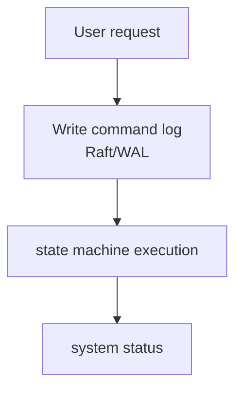
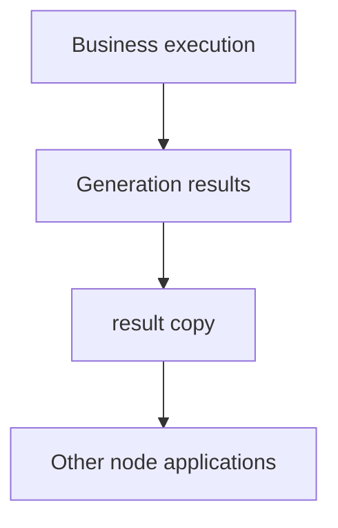

# Trading System Development - Zhixuan Zhang
+ Yuque: [https://www.yuque.com/bluememories/lanaff/nt8zeoa7rxcl185o](https://www.yuque.com/bluememories/lanaff/nt8zeoa7rxcl185o)
+ CNBlogs: [https://www.cnblogs.com/zzxscodes/p/19695166/trading-system-notes](https://www.cnblogs.com/zzxscodes/p/19695166/trading-system-notes)
+ GitHub: [https://github.com/zzxscodes/trading-system-notes](https://github.com/zzxscodes/trading-system-notes)


## Low latency system development basics
### 1. CPU affinity and NUMA architecture
**isolcpus: Kernel startup parameter CPU isolation**

```shell
  Edit /etc/default/grub .
  Modify the GRUB_CMDLINE_LINUX_DEFAULT line and add isolcpus=cpu number list within quotation marks (for example: isolcpus=2,3 isolcpus=1,4-7).
  Execute sudo update-grub (Debian/Ubuntu) ( sudo grub2-mkconfig -o /boot/grub2/grub.cfg (RHEL/CentOS/Fedora)) and sudo reboot.
```

**taskset: command line tool CPU binding**

```shell
  Start the process: taskset -c 1 ./my_app (running on CPU 1)
  Modify a running process: taskset -pc 3 <PID>  (Move PID process to CPU 3)
  Query process: tasksset -pc <PID> 
  Bind threads under the process: ps -T -p <PID> taskset -p -c <CPU list> <TID> 
```


**pthread_setaffinity_np (sched_setaffinity): Thread (process) CPU binding**

```cpp
#pragma once

#include <iostream>
#include <atomic>
#include <thread>
#include <unistd.h>

#include <sys/syscall.h>

namespace Common {
    /// Set affinity for current thread to be pinned to the provided core_id.
    inline auto setThreadCore(int core_id) noexcept {
        cpu_set_t cpuset;

        CPU_ZERO(&cpuset);
        CPU_SET(core_id, &cpuset);

        return (pthread_setaffinity_np(pthread_self(), sizeof(cpu_set_t), &cpuset) == 0);
    }

    /// Creates a thread instance, sets affinity on it, assigns it a name and
    /// passes the function to be run on that thread as well as the arguments to the function.
    template<typename T, typename... A>
    inline auto createAndStartThread(int core_id, const std::string &name, T &&func, A &&... args) noexcept {
        auto t = new std::thread([&]() {
            if (core_id >= 0 && !setThreadCore(core_id)) {
                std::cerr << "Failed to set core affinity for " << name << " " << pthread_self() << " to " << core_id << std::endl;
                exit(EXIT_FAILURE);
            }
            std::cerr << "Set core affinity for " << name << " " << pthread_self() << " to " << core_id << std::endl;

            std::forward<T>(func)((std::forward<A>(args))...);
        });

        using namespace std::literals::chrono_literals;
        std::this_thread::sleep_for(1s);

        return t;
    }
}


/*
 * The difference between sched_setaffinity and pthread_setaffinity_np:
 *
 * 1. Target objects:
 * - pthread_setaffinity_np: Action thread, specify the thread to be bound through the pthread_t handle.
 * - sched_setaffinity: affects the process. It specifies the process to bind to by its process ID (PID).
 * When a process is bound, all child threads will also be restricted to this CPU.
 * 2. Portability:
 * - pthread_setaffinity_np: GNU C library (glibc) extension.
 * - sched_setaffinity: standard Linux system call.
 */
```


**cpusets: CPU resource pool isolation**

```bash
#!/usr/bin/env bash
#
# simple_cpuset_example.sh
# 
# Demonstrates how to use cpuset to bind a task to a dedicated CPU core.

# --- Configuration ---
# Regular cores allocated for background tasks
SYSTEM_CORE="0"
# Cores reserved for exclusive tasks
EXCLUSIVE_CORE="1"

seven

# Make sure the script is run with root privileges
if [[ $(u -id) -ne 0 ]]; then
    echo "This script must be run as root."
    exit 1
be

# 1. Create cgroup directory
echo "-->Creating cpuset core pool..."
mkdir -p /sys/fs/cgroup/cpuset/exclusive_tasks

# 2. Configure an exclusive core pool
# Assign core 1 to this pool
echo "${EXCLUSIVE_CORE}" > /sys/fs/cgroup/cpuset/exclusive_tasks/cpuset.cpus
# Mark it as CPU exclusive
echo "1" > /sys/fs/cgroup/cpuset/exclusive_tasks/cpuset.cpu_exclusive
# Allocate memory node 0 to this pool (usually there is only one memory node per core)
echo "0" > /sys/fs/cgroup/cpuset/exclusive_tasks/cpuset.mems

# 3. Run a task and bind it to an exclusive core pool
echo "--> Starting an infinite loop bound to core ${EXCLUSIVE_CORE}..."
# Start a background task
while true; do :; done &
TASK_PID=$!
echo "Task PID: ${TASK_PID}"

# Write the PID of the task into the tasks file of the exclusive pool
echo "${TASK_PID}" > /sys/fs/cgroup/cpuset/exclusive_tasks/tasks

echo "Task bound successfully. You can use 'top' or 'htop' to check if PID ${TASK_PID} is running on core ${EXCLUSIVE_CORE}."
echo "To stop the task, run: kill ${TASK_PID}"
```

| features | isolcpus | cpusets | taskset | pthread_setaffinity_np |
| --- | --- | --- | --- | --- |
| **Level** | Kernel level | Kernel level | Process level | Thread level |
| **Method** | Startup parameters | Virtual file system interface | Command line | Library functions |
| **Isolation Strength** | **Strong** | **Strong** | Weak | Weak |
| **Granularity** | CPU | **CPU & Memory Node Pool** | Process | Thread |
| **Dynamic** | **Static (requires restart)** | **Dynamic** | Dynamic | Dynamic |


The CPU's Hyper-Threading Technology (HT) simulates the physical core into two logical cores, sharing the core's execution units (such as ALU, FPU) and L1/L2 cache.

(1) If threads bound to the same physical core perform computationally intensive operations, especially AVX equal-width instruction sets, the shared floating point unit will be completely occupied, causing the transaction thread to be blocked;

(2) A thread's access to the L1/L2 cache will contaminate or expel the hot data of the transaction thread and increase cache misses.

(3) Disabling hyper-threading can make the execution delay of key transaction threads lower and reduce delay fluctuations.

(4) Disabling Hyper-Threading will reduce the overall throughput of the system. Therefore low-latency sensitive tasks are exclusively bound to physical cores (even or odd parts of the logical core ID), while non-real-time tasks are deployed on hyper-threading-enabled cores. (implemented at the Linux system level)

```shell
lscpu -e # Assume the output shows that both CPU 0 and CPU 8 belong to CORE 0. This means they are two "sibling" logical cores on the same physical core.

# View the online status of CPU 8 (1 means online)
cat /sys/devices/system/cpu/cpu8/online

# Set CPU 8 offline (disabled)
echo 0 > /sys/devices/system/cpu/cpu8/online

# Check the number of online CPUs. It will be 1 less than the original number.
nproc

# Or run lscpu again, you will see that CPU 8 is displayed as no (offline)
lscpu -e | grep "cpu8"

# At this point, the operating system scheduler will not assign any more tasks to CPU 8. CPU 0 can now use the full resources of physical core 0 without interruption.
#Restart only
echo 1 > /sys/devices/system/cpu/cpu8/online
```

```shell
# Clearly list the corresponding relationships between CPU, core, and Socket
lscpu -e=CPU,CORE,SOCKET

# Bind the policy process to physical cores 8-15 (skipping hyper-threaded cores)
taskset -c 8-15 ./strategy_engine
```


**Turn off CPU power saving (C-States & P-States)**

**BIOS/UEFI level**

| BIOS settings | Recommended values | Description |
| --- | --- | --- |
| **CPU C-States** / **Global C-State Control** | `Disabled` | Disable all C-States (C1~C10), the CPU will never go to sleep |
| **C1E Support** | `Disabled` | Disable enhanced C1 states (C1E may still be enabled even if C-States are turned off) |
| **Intel SpeedStep** (EIST) / **AMD Cool'n'Quiet** | `Disabled` | Disable P-State dynamic frequency modulation, lock frequency |
| **Intel Turbo Boost** / **AMD Core Performance Boost** | `Disabled` | Disable automatic overclocking to avoid frequency fluctuations |
| **CPU Ratio** / **Multiplier** | Fixed value (such as `45`   ) | Manually set the CPU multiplier to achieve frequency locking (SpeedStep needs to be disabled simultaneously) |
| **Hyper-Threading** / **SMT Mode** | `Disabled` | Optional: Turn off hyper-threading to reduce scheduling interference and facilitate precise control. **Global switch will invalidate the precise control of hyper-threading core strategy** |
| **Power Technology** (AMD) | `Custom`   → Manually turn off various energy saving items | AMD platform precautions |


**Linux kernel parameters**

1. Edit GRUB configuration

```bash
sudo vim /etc/default/grub
```

```bash
GRUB_CMDLINE_LINUX_DEFAULT="quiet splash \
    intel_idle.max_cstate=0 \
    processor.max_cstate=1 \
    idle=poll \
    intel_pstate=disable"
```

| Parameters | Function |
| --- | --- |
| `intel_idle.max_cstate=0` | Force Intel CPU's `intel_idle`   Driver disables all C-States (C1 and above) |
| `processor.max_cstate=1` | Compatible with backup driver (acpi-cpufreq), limiting the maximum C-State to C1 |
| `idle=poll` | **The most aggressive setting**: The CPU does not wait for interrupts when idle, but continuously polls the task queue to achieve the lowest latency (but extremely high power consumption) |
| `intel_pstate=disable` | Disable modern Intel P-State driver and fall back to legacy `acpi-cpufreq`   , convenient for manual frequency control |


2. Update GRUB configuration

```bash
# Debian/Ubuntu
sudo update-grub

# CentOS/RHEL/Fedora
sudo grub2-mkconfig -o /boot/grub2/grub.cfg
```

3. Restart takes effect

```bash
sudo reboot
```

---

**Linux runtime control**

1. Install frequency control tool

```bash
# Ubuntu/Debian
sudo apt install cpufrequtils linux-tools-common

# CentOS/RHEL
sudo yum install cpufreq-utils kernel-tools

# Fedora
sudo dnf install kernel-tools
```

2. View current status

```bash
cpupower frequency-info
```

Output key information:

+ `driver`: The currently used driver (`intel_pstate`, `acpi-cpufreq`)
+ `governor`: Current frequency modulation strategy (`powersave`, `performance`, `userspace`)
+ `current policy`:Supported frequency range
3. Set to performance mode (recommended)

```bash
sudo cpupower frequency-set -g performance
```

+ `performance` mode will maintain the highest frequency possible (P0 State)
4. (Optional) Manually lock frequency

```bash
# Lock all CPUs to 3.5GHz
sudo cpupower frequency-set -f 3500MHz

# or set min/max frequency range
sudo cpupower frequency-set -d 3500MHz -u 3500MHz
```

5. Effective permanently (automatically set at startup)

```bash
sudo vim /etc/systemd/system/cpu-performance.service
```

```plain
[Unit]
Description=Set CPU to Performance Mode
After=multi-user.target

[Service]
Type=oneshot
ExecStart=/usr/bin/cpupower frequency-set -g performance
RemainAfterExit=yes

[Install]
WantedBy=multi-user.target
```

```bash
sudo systemctl enable cpu-performance.service
sudo systemctl start cpu-performance.service
```

---

**Verify that energy saving is turned off**

1. Check C-State

```bash
# View current idle status
cat /proc/cpuinfo | grep -i "idle"

# Use turbostat (requires root)
sudo turbostat --interval 5
```

+ observe `C0%` Is it close to 100%, other C-state (C1~C10) should be 0%
+ `Busy%` Should ≈ `C0%`
2. Check whether the frequency is stable

```bash
watch -n 0.5 'cat /proc/cpuinfo | grep "cpu MHz"'
```

+ All core frequencies should be stable at the target value (such as 3500.000 MHz) without fluctuations
3. Check FM drivers and strategies

```bash
cpupower frequency-info
```

+ `governor` should be `performance`
+ `current policy` Frequency range should be narrow or fixed


**Alternatives**

| Method | The most radical usage | Function description |
| --- | --- | --- |
| `x86_energy_perf_policy` | `sudo x86_energy_perf_policy performance` | Force all CPU cores to run in the highest performance mode and disable dynamic frequency scaling to save energy |
| `isolcpus + nohz_full + rcu_nocbs` | Kernel parameters:   `isolcpus=2-7 nohz_full=2-7 rcu_nocbs=2-7` | Completely isolate CPU 2-7, no scheduled interrupts, no kernel scheduling interference, dedicated to real-time tasks |
| `tuned`   Services | `sudo tuned-adm profile latency-performance` | Enable extreme low-latency configuration, turn off energy saving, optimize scheduling and interrupt handling |
| `powertop --auto-tune` | `sudo powertop --auto-tune` | Automatically set all subsystems (CPU, disk, USB, etc.) to high-performance mode, suitable for performance stress testing |


**NUMA topology of the system**

+ How many NUMA nodes are there?
+ How many CPU cores are there per node?
+ How much memory does each node have?
+ What is the interconnect bandwidth and latency between nodes?

**Commonly used tools to view NUMA topology:**

+ `numactl --hardware`: Displays the hardware information of the NUMA node, including the number of CPUs and memory size.
+ `lscpu`: Displays CPU architecture information, including NUMA node distribution.
+ `hwloc`: A library and toolset that can generate detailed topology diagrams of the system, including NUMA nodes, CPUs, caches, PCI devices, etc.

```shell
# numactl --hardware
available: 2 nodes (0-1)
node 0 cpus: 0 1 2 3 4 5 6 7 8 9 10 11 12 13 14 15 16 17 18 19 20 21 22 23 48 49 50 51 52 53 54 55 56 57 58 59 60 61 62 63 64 65 66 67 68 69 70 71
node 0 size: 96920 MB
node 0 free: 2951 MB
node 1 cpus: 24 25 26 27 28 29 30 31 32 33 34 35 36 37 38 39 40 41 42 43 44 45 46 47 72 73 74 75 76 77 78 79 80 81 82 83 84 85 86 87 88 89 90 91 92 93 94 95
node 1 size: 98304 MB
node 1 free: 33 MB
node distances:
node   0   1 
  0:  10  21 
  1:  21  10
```

1. The CPU is divided into two groups, node 0 and node 1 (this machine has two CPU Sockets).
2. One set of CPUs is allocated 96 GB of memory (the machine has a total of 192 GB of memory).
3. node distances is a two-dimensional matrix, node[i][j] represents the relative distance of node i accessing the memory of node j. For example, the distance between node 0 and node 0's memory is 10, and the distance between node 0 and node 1's memory is 21.

```shell
# numactl --show
policy: default
preferred node: current
physcpubind: 0 1 2 3 4 5 6 7 8 9 10 11 12 13 14 15 16 17 18 19 20 21 22 23 24 25 26 27 28 29 30 31 32 33 34 35 36 37 38 39 40 41 42 43 44 45 46 47 48 49 50 51 52 53 54 55 56 57 58 59 60 61 62 63 64 65 66 67 68 69 70 71 72 73 74 75 76 77 78 79 80 81 82 83 84 85 86 87 88 89 90 91 92 93 94 95 
cpubind: 0 1 
nodebind: 0 1 
binding: 0 1
```

The numactl command also has several important options:

1. `--cpubind=0`: Bound to execute on the CPU of node 0.
2. `--membind=1`: Allocate memory on node 1 only.
3. `--interleave=nodes`: nodes can be all, N, N, N or N-N, which means memory is allocated in round robin on nodes.
4. `--physcpubind=cpus`: cpus is the processor (hyper-threading) field in /proc/cpuinfo. The format of cpus is the same as --interleave=nodes, which means it is bound to run on cpus.
5. `--preferred=1`: Prioritize allocating memory from node 1.

A few examples of numactl commands:

```shell
# Run the test_program program, the parameter is argument, bound to the CPU of node 0 and the memory of node 1
numactl --cpubind=0 --membind=1 test_program arguments

# Run test_program on processors 0-4, 8-12
numactl --physcpubind=0-4,8-12 test_program arguments

# Round-robin allocation of memory staggers the program's memory pages across all NUMA nodes while allowing the program to run on all CPUs. Suitable for applications with high memory bandwidth requirements and random data access patterns.
numactl --interleave=all test_program arguments

# Prioritize allocating memory from node 1
numactl --preferred=1
```

---

**1. Core Idea**

<!-- this is a picture，ocr content is： -->


On a server with multiple CPU sockets, each CPU has its own local memory, and accessing local memory is much faster than accessing another CPU's memory (remote memory). Therefore, the key to optimization is to ensure that "whoever calculates has his data by his side".

Advanced scenarios (high-performance networks) are CPU, memory, Consistent with PCIe devices (network cards).  
  
**2. Linux memory allocation behavior**

+ **Default policy**: Always allocate memory **first** on the **local NUMA node** where the current CPU core is located.
+ **Exception**: When local memory is low, behavior is determined by kernel parameter `vm.zone_reclaim_mode` Decide.
    - `vm.zone_reclaim_mode = 0` (Default value): When the local memory is insufficient, go to the remote node to find free memory. This is the recommended configuration in most scenarios.
    - `vm.zone_reclaim_mode = 1`: When local memory is insufficient, priority is given to recycling local inactive memory pages (such as Cache) instead of accessing remote memory. This recycling process itself may introduce delays.

**3. Management and optimization tools**

1. `numactl` (most commonly used): Command line tool to specify the NUMA policy of an application when starting it.
    - **Force binding (**`--membind`**)**: `numactl --cpunodebind=0 --membind=0 my_app`
        * **Effect**: Forced `my_app` Can only run on node 0's CPU and can only be allocated from node 0's memory. If node 0 runs out of memory, the allocation will fail. Provides the strongest performance certainty.
    - **Priority Use (**`--preferred`**)**: `numactl --preferred=0 my_app`
        * **Effect**: Prioritize allocation from node 0. If it fails, it will automatically fall back to other nodes. Optimize while ensuring program availability.
2. `sysctl`(System level adjustment):
    - `sudo sysctl -w vm.zone_reclaim_mode=0`: Ensure that the system adopts the default NUMA allocation behavior to avoid unnecessary local memory reclamation delays.

```shell
# Permanent modification
# Add a line to a new file under /etc/sysctl.conf or /etc/sysctl.d/:
# vm.zone_reclaim_mode = 0
# Then execute sudo sysctl -p to make it take effect
```

3. `cpuset`(Bottom Hard Isolation):
    - `cpuset` While allocating CPU cores, pass `cpuset.mems` The file is also forcibly bound to the memory node, which is better than `numactl` Lower-level kernel-level isolation has the same effect as `numactl --membind` Similar but more isolated.

**4.Before NUMA**

+ **The core is "share-nothing"**: Using the Share-Nothing architecture, the system is divided into independent computing units, each with its own data (data partition). Cross-NUMA node memory access is logically eradicated.
+ **Replace "global shared" with "thread local"**: Use thread local storage (TLS) to eliminate data races and locks. Each thread only works on its own "territory" (i.e., local NUMA memory) to avoid cross-node cache synchronization due to data contention.
+ **Replace "shared memory" with "message passing"**: Use Actor model, disruptor communication and other modes, that is, CSP concurrency philosophy.


NUMA optimization is an iterative process that requires continuous performance analysis and monitoring to identify bottlenecks and verify optimization effects.

+ `numastat`: View memory access statistics for each NUMA node in real time or historically, including local (`local_node`) and remote (`other_node`) memory access times. If the remote access ratio is high, it means there is still room for NUMA optimization.

```shell
$ numastat -m # View memory policy
$ numastat -c # View the memory access statistics of each CPU
$ numbered -p <pid> # View NUMA statistics for a specific process
```

+ `perf`: Performance analysis tool under Linux that can track various hardware events, such as cache misses (`cache-misses`), remote memory access (`mem_load_retired.l3_miss` wait). Discover potential NUMA bottlenecks by analyzing these events.

```shell
$ perf stat -e cache-misses,L1-dcache-loads,L1-dcache-misses ./your_program
```

+ **Intel VTune Amplifier**: A microarchitecture performance analysis tool for Intel CPUs that provides very detailed NUMA-related performance indicators and optimization suggestions.

Factors to consider:

+ **Over-optimization:** Not all programs require NUMA optimization. For programs that are CPU-intensive and have strong data locality, or programs with small amounts of data and random memory access patterns, NUMA optimization may have little benefit or even be counterproductive.
+ **Dynamic environment:** If your program needs to run on systems with different NUMA topologies, you may need to dynamically detect NUMA nodes and adjust policies.


**Explicit NUMA-aware memory allocation**

The following is libnuma's common interfaces and related system call tables:

| **Classification** | **Function signature** | **Return value type** | **Key description** |
| :--- | :--- | :--- | :--- |
| **Initialization and version** | `void numa_available(void);` | `void` | Check NUMA support, terminate the program if not supported |
|  | `const char *numa_version(void);` | `const char *` | Returns the library version string (such as`libnuma 2.0.14`) |
| **Node information query** | `int numa_max_node(void);` | `int` | Returns the maximum node number (starts from 0, returns - 1 if there are no nodes) |
|  | `int numa_num_configured_nodes(void);` | `int` | Returns the total number of configured nodes |
|  | `extern struct bitmask *numa_all_nodes_ptr;` | Global variable | Contains a predefined bitmask of all available nodes |
|  | `extern struct bitmask *numa_nodes_ptr;` | Global variables | Bitmask of nodes accessible to the current process |
| **Memory Allocation** | `void *numa_alloc_onnode(size_t size, int node);` | `void *` | Allocate memory on the specified node and return on failure`NULL` |
|  | `void *numa_alloc_local(size_t size);` | `void *` | Allocate memory on the local node and return on failure`NULL` |
|  | `void *numa_alloc_interleaved(size_t size);` | `void *` | Cross-allocate memory to all nodes, return on failure`NULL` |
|  | `void numa_free(void *ptr, size_t size);` | `void` | Release`numa_alloc_*`Allocated memory (size needs to be specified) |
|  | `void *numa_realloc(void *oldptr, size_t oldsize, size_t newsize);` | `void *` | Reallocate memory and maintain node affinity, return on failure`NULL` |
| **Memory Policy Settings** | `void numa_set_localalloc(void);` | `void` | Set the default policy to "Local node first" |
|  | `void numa_set_interleave_mask(const struct bitmask *mask);` | `void` | Press`mask`Node set set cross assignment mode |
|  | `void numa_set_bind_mask(const struct bitmask *mask);` | `void` | Limit memory allocation to`mask`Specify node |
|  | `void numa_set_preferred(int node);` | `void` | Set the preferred node for memory allocation |
| **Process Affinity** | `int numa_run_on_node(int node);` | `int` | Bind the current process to the node`node`CPU, returns 0 on success, -1 on failure |
|  | `int numa_run_on_node_mask(const struct bitmask *mask);` | `int` | Bind the current process to`mask`CPU of the node set, returns 0 on success, -1 on failure |
|  | `int numa_sched_setaffinity(pid_t pid, const struct bitmask *mask);` | `int` | Setup process`pid`The CPU affinity of`mask`Node, returns 0 on success, -1 on failure |
| **Node attribute query** | `long long numa_node_size64(int node, int *free);` | `long long` | Returns the total memory of the node (bytes),`free`Output free memory (KB), return - 1 on failure |
|  | `int numa_node_of_cpu(int cpu);` | `int` | Return to CPU`cpu`The node it belongs to, returns - 1 on failure |
| **Bit mask operation** | `struct bitmask *numa_bitmask_alloc(unsigned int nbits);` | `struct bitmask *` | Allocate accommodation`nbits`Bit mask of bits, returned on failure`NULL` |
|  | `void numa_bitmask_free(struct bitmask *b);` | `void` | release bitmask`b`(`b`for`NULL`no operation) |
|  | `void numa_bitmask_setall(struct bitmask *b);` | `void` | Settings`b`All bits of (including all nodes) |
|  | `void numa_bitmask_clearall(struct bitmask *b);` | `void` | Clear`b`All bits of (excluding any nodes) |
|  | `void numa_bitmask_setbit(struct bitmask *b, unsigned int i);` | `void` | Settings`b`of the`i`bit (contains node`i`) |
|  | `void numa_bitmask_clearbit(struct bitmask *b, unsigned int i);` | `void` | Clear`b`of the`i`bits (excluding nodes`i`) |
|  | `int numa_bitmask_is_set(const struct bitmask *b, unsigned int i);` | `int` | Check`b`of the`i`If the bit is set, 1 is returned, otherwise 0 is returned |
|  | `struct bitmask *numa_allocate_nodemask(void);` | `struct bitmask *` | Allocates a node bitmask of default size (equivalent to`numa_bitmask_alloc(numa_max_node()+1)`) |
|  | `void numa_free_nodemask(struct bitmask *b);` | `void` | Release`numa_allocate_nodemask`assigned bitmask |
| **Large pages + NUMA related system calls** | `void *mmap(void *addr, size_t length, int prot, int flags, int fd, off_t offset);` | `void *` | allocate memory (`MAP_HUGETLB`flag for large pages), returns on failure`MAP_FAILED` |
|  | `int mbind(void *start, size_t length, int policy, const unsigned long *nmask, unsigned int maxnode, unsigned int flags);` | `int` | Set the NUMA policy for the memory block (such as`MPOL_BIND`), returns 0 on success, -1 on failure |


**Example: Allocate memory on a specific node**

```cpp
#define _GNU_SOURCE // Enable GNU extensions, including sched_setaffinity
#include <pthread.h>
#include <sched.h>
#include <iostream>
#include <thread>
#include <vector>
#include <numa.h> // Need to link libnuma

void worker_function(int thread_id, int target_cpu) {
    cpu_set_t cpuset;
    CPU_ZERO(&cpuset);
    CPU_SET(target_cpu, &cpuset);

    if (pthread_setaffinity_np(pthread_self(), sizeof(cpu_set_t), &cpuset) != 0) {
        std::cerr << "Error setting CPU affinity for thread " << thread_id << " to CPU " << target_cpu << std::endl;
    } else {
        std::cout << "Thread " << thread_id << " bound to CPU " << target_cpu << std::endl;
    }

    // Simulate some work, such as accessing data previously allocated on a specific NUMA node
    long long sum = 0;
    for (int i = 0; i < 100000000; ++i) {
        sum += i;
    }
    std::cout << "Thread " << thread_id << " finished work, sum: " << sum << std::endl;
}

int main() {
    if (numa_available() == -1) {
        std::cerr << "NUMA support not available." << std::endl;
        return 1;
    }

    int num_nodes = numa_num_configured_nodes();
    if (num_nodes < 1) {
        std::cerr << "No NUMA nodes detected." << std::endl;
        return 1;
    }

    std::vector<std::thread> threads;
    int current_cpu = 0;

    for (int i = 0; i < num_nodes; ++i) {
        // Get all CPUs on the current NUMA node
        struct bitmask *cpus_on_node = numa_node_to_cpus(i);
        if (cpus_on_node == nullptr) {
            std::cerr << "Failed to get CPUs for node " << i << std::endl;
            continue;
        }

        // Traverse all CPUs on the node and create a thread for each CPU
        for (int cpu = 0; cpu <= cpus_on_node->size; ++cpu) {
            if (numa_bitmask_isbitset(cpus_on_node, cpu)) {
                threads.emplace_back(worker_function, current_cpu, cpu);
                current_cpu++;
            }
        }
        numa_free_cpumask(cpus_on_node);
    }

    for (auto& t : threads) {
        t.join();
    }

    std::cout << "All threads finished." << std::endl;
    return 0;
}
```

**Compile:**`g++ -std=c++11 test.cpp -o test -lnuma -pthread`

**run:**`./test`


**NUMA data sharding**

**The core idea of data sharding is to allocate different types of data structures to the most appropriate physical memory area based on the access frequency, importance and policy logic of the data.**

```shell
# View NUMA node distribution
numactl --hardware

# Allocate 1024 2MB huge pages to Node0
echo 1024 > /sys/devices/system/node/node0/hugepages/hugepages-2048kB/nr_hugepages

# Allocate 512 1GB huge pages to Node1 (if supported)
echo 512 > /sys/devices/system/node/node1/hugepages/hugepages-1048576kB/nr_hugepages
```

```cpp
#include <numa.h>
#include <numaif.h>
#include <sys/mman.h>

void* alloc_hugepage_on_node(int node, size_t size) {
    struct bitmask *nm = numa_allocate_nodemask();
    if (!nm) return NULL;
    numa_bitmask_setbit(nm, node);

    void* ptr = mmap(NULL, size, PROT_READ|PROT_WRITE,
                    MAP_PRIVATE|MAP_ANONYMOUS|MAP_HUGETLB, -1, 0);
    if (ptr == MAP_FAILED) {
        perror("mmap hugepage failed");
        numa_free_nodemask(nm);
        return NULL;
    }

    if (mbind(ptr, size, MPOL_BIND, nm->maskp, nm->size + 1, 0) == -1) {
        perror("mbind failed");
        munmap(ptr, size); // If binding fails, the allocated large page needs to be released
        numa_free_nodemask(nm);
        return NULL;
    }

    numa_free_nodemask(nm);
    return ptr;
}

int main() {
    const size_t memSize = 2 * 1024 * 1024; // 2MB
    void* lockMem = alloc_hugepage_on_node(0, memSize);

    //Lock memory
    if (-1 == mlock(lockMem, memSize)) {
        munmap(lockMem, memSize);
    }

    // Manually trigger page fault interrupt
    memset(lockMem, 0, memSize);

    //Keep resident (memory will not be swapped out when the program is running)
    while(true) {
        //There should be exit logic in actual applications
        sleep(1);
    }

    // Automatically unlock when the program exits
    munlock(lockedMem, memSize);
    munmap(lockedMem);
    return 0;
}
```


### 2. Real-time thread priority
Real-time thread priority determines the execution order of threads in the system, ensuring that high-priority threads can immediately preempt the execution of low-priority threads when they are ready, thereby ensuring deterministic delay on the critical path.

+ **Setting method**: In Linux systems, you can use the pthread_setschedparam function to set the thread's scheduling policy and priority.

Three scheduling strategies of the Linux kernel:

+ SCHED_OTHER: time-sharing scheduling strategy, system default
+ SCHED_FIFO: real-time scheduling strategy, first come first served
+ SCHED_RR: real-time scheduling strategy, time slice rotation

```cpp
#include <sched.h>
#include <stdio.h>
#include <stdlib.h>
#include <pthread.h>

void* thread_function(void* arg) {
    //Code executed by thread
    return NULL;
}

int main() {
    pthread_t thread;
    struct sched_param param;
    int policy;

    //Create thread
    if (pthread_create(&thread, NULL, thread_function, NULL) != 0) {
        perror("pthread_create");
        return EXIT_FAILURE;
    }

    // Get the scheduling strategy and parameters of the current thread
    if (pthread_getschedparam(pthread_self(), &policy, &param) != 0) {
        perror("pthread_getschedparam");
        return EXIT_FAILURE;
    }

    //Set the scheduling policy to SCHED_FIFO
    policy = SCHED_FIFO;
    //Set the thread priority, the value range is 0 to sched_get_priority_max(policy)
    param.sched_priority = sched_get_priority_max(policy);

    //Set the thread's scheduling policy and priority
    if (pthread_setschedparam(thread, policy, &param) != 0) {
        perror("pthread_setschedparam");
        return EXIT_FAILURE;
    }

    // Wait for the thread to end
    if (pthread_join(thread, NULL) != 0) {
        perror("pthread_join");
        return EXIT_FAILURE;
    }

    return EXIT_SUCCESS;
}


// sched_setscheduler(pid_t pid, int policy, const struct sched_param *param)
// This is the function corresponding to adjusting the process priority
```

**Priority inversion and solutions**

In a real-time system, when a **high-priority thread** is blocked waiting for a resource (such as a mutex) held by a **low-priority thread**, if a **medium-priority thread** seizes the CPU, it will result in:

+ Low-priority threads cannot release resources in time
+ High-priority threads are "indirectly" delayed (should be the highest priority but are executed last)  
`L(hold lock)→ H(waiting for lock)→ M(Seize L)→ HContinuous blocking`

Priority inheritance (PTHREAD_PRIO_INHERIT)

1. When the high-priority thread H waits for the lock, the priority of the low-priority thread L holding the lock is temporarily raised to the priority of H**
2. The improved L can immediately seize the medium-priority thread M, quickly execute and release the lock.
3. After L releases the lock, its priority automatically returns to its original value.
4. If there are multiple levels of waiting (such as L waiting for another lock), the system will recursively increase the priorities of all related threads.
5. Priority ceiling (PTHREAD_PRIO_PROTECT)

The ceiling priority is preset when the lock is created, which is suitable for scenarios with known resource dependencies.  


**Command**: Use `chrt` (change real-time attributes) command, adjusts priority only for processes

```shell
# Change the PID to <pid> The process is set to SCHED_FIFO real-time scheduling policy, with the highest priority of 99
sudo greyhound -f -p 99 <pid>

The basic syntax of the chrt command is:
chrt [options] <priority> <command> [command parameters...]
chrt [options] -p <priority> <PID>
<priority>: This is an integer indicating the scheduling priority. Its scope and meaning depend on the scheduling policy used.
<command>: The command you want to run and set its scheduling policy and its parameters.
<PID>: The process ID of the existing process for which you want to modify the scheduling policy.

chrt supports a variety of real-time scheduling strategies, the most commonly used of which are:

--fifo (SCHED_FIFO): First-in, first-out. Processes with the same priority are executed in the order in which they are ready. Once a FIFO process starts running, it will continue to run until it actively relinquishes the CPU, is blocked (such as waiting for I/O), or is preempted by a process with a higher priority.

--rr (SCHED_RR): Round-Robin. Similar to SCHED_FIFO, but with a time slice. When an RR process's time slice runs out, it is moved to the end of the ready queue to give other processes of the same priority a chance to run.

--other (SCHED_OTHER): Ordinary scheduling strategy. This is the system's default scheduling policy, using CFS (Completely Fair Scheduler).

--batch (SCHED_BATCH): Batch scheduling strategy. Suitable for batch processing tasks that do not require interaction.

--idle (SCHED_IDLE): idle scheduling strategy. It only runs when the system is idle and has the lowest priority.

Common options:

-p: Operate on the specified PID (process ID) instead of starting a new command.

-o: Set OTHER scheduling policy (SCHED_OTHER).

-f: Set FIFO scheduling policy (SCHED_FIFO).

-r: Set RR scheduling policy (SCHED_RR).

-b: Set BATCH scheduling policy (SCHED_BATCH).

-i: Set IDLE scheduling policy (SCHED_IDLE).

-g: Set GROUP scheduling policy (SCHED_GROUP, not commonly used).

-h: Set HIGH scheduling policy (SCHED_HIGH, not commonly used).

-a: Set AFR scheduling policy (SCHED_AFR, not commonly used).

-e: Set EDF scheduling policy (SCHED_EDF, not commonly used).

-d: Set DEADLINE scheduling policy (SCHED_DEADLINE, not commonly used).

-v: Display the scheduling policy and priority of the current process (or specified PID).

--help: Display help information.

--version: Display version information.
```


### 3. Interrupt binding and common interrupt core isolation
**Interrupt binding** refers to allocating interrupt requests (IRQs) to specific CPU cores for processing to avoid interrupt processing from interfering with the critical path. By properly bundling interrupts, you can reduce the CPU load on the critical path and ensure deterministic latency.

**Identify Bottlenecks**: Before tuning, use `top`, `htop`, `mpstat -P ALL 1` Wait for tools and observe `si` (softirq) or `%irq` Is it too high on a certain CPU core, confirm that interrupt handling is the bottleneck.  

+ **Find the IRQ number of the device**`cat /proc/interrupts`
+ Pass the device name in the last column (e.g. `eth0-rx-0`) to find the corresponding IRQ number.
+ **Core file for executing binding**: `/proc/irq/<IRQNo.>/smp_affinity_list` (recommended) or `smp_affinity` (bitmask).
+ `smp_affinity_list`** (CPU list)**: Write the CPU core number directly.

```shell
# Example: Bind IRQ 128 to CPU Core 2
sudo sh -c 'echo 2 > /proc/irq/128/smp_affinity_list'
```

**Verification effect**

+ Repeatedly under load `cat /proc/interrupts`, and observe whether the interrupt count increases only on the bound CPU.
+ use `mpstat -P ALL 1` Observe the performance of each CPU `%irq` Usage rate.

**Follow NUMA principles**: Always bind device interrupts to the CPU on the same NUMA node as the physical location of the device (PCIe slot).

**Distribute load**: For multi-queue devices (such as network cards), distribute the IRQ of each queue evenly to different CPU cores.

**irqbalance**: Automatically manage interrupted load balancing, and adjust its behavior through the configuration file /etc/irqbalance.conf. This will override the fine manual control behavior above.

**Usage scenario**: For the CPU core where the critical path is located, bind irrelevant interrupt requests to other cores to reduce the interrupt processing burden of the core.


existAfter the CPU is bound, kernel threads (such as ksoftirqd, kworker) may still preempt the user-mode threads bound to the core, and clock interrupts and RCU callbacks will also cause overhead; and`isolcpus`,`nohz_full`,`rcu_nocbs`The combination of three parameters can solve this problem:

1. `isolcpus`: Isolate the specified CPU from the kernel general scheduler, preventing most kernel threads and ordinary processes from running;
2. `nohz_full`: Enable adaptive clockless mode on isolated cores to reduce/eliminate clock interruptions;
3. `rcu_nocbs`: Offload RCU callbacks to non-isolated cores. The result is a near-exclusive, kernel-free "silent" operating environment for critical low-latency tasks.

```shell
# Modify GRUB configuration
grub_cmdline="isolcpus=8-15 nohz_full=8-15 rcu_nocbs=8-15"

# Effective configuration
grub2-mkconfig -o /boot/grub2/grub.cfg
```


### 4. Summary of system silent configuration steps
| Configuration phase | Specific operations | Purpose | Precautions |
| --- | --- | --- | --- |
| **1. Startup parameter configuration** | 1. Add in the boot entry `isolcpus=managed_irq,7`   2. Add `nohz_full=7`   3. Add `rcu_nocbs=7`   4. Add `nowatchdog nmi_watchdog=0`   5. Add `hpet=disable`   6. Add `tsc=reliable`   7. Add `mce=off`   8. Add `ipv6.disable=1`   9. Add `audit=0`   10. Add `printk.devkmsg=off quiet loglevel=1`   11. Add`selinux=0` | 1. Isolate core 7 from the universal scheduler,`managed_irq`   Mode allows interrupts to run on this CPU but prevents user/kernel thread preemption 2. Enable adaptive tickless mode to stop periodic clock interrupts when idle, significantly reducing jitter 3. Offload RCU callbacks to non-isolated CPUs to avoid RCU softirq interference with critical threads 4. Disable NMI watchdog to prevent it from generating unnecessary timer interrupts 5. Disable HPET multicast interrupt sources to reduce global interrupt load 6. Declare TSC as a reliable time source to avoid jitter caused by frequent kernel calibration. 7. Turn off machine check exceptions (MCE) to avoid non-maskable interrupts (NMI) interrupting execution. 8. Reduce background tasks and interrupt processing related to the IPv6 protocol stack. 9. Disable the audit subsystem to eliminate the uncertainty overhead caused by auditd and audit backlog processing. 10. Suppress kernel log output and reduce interruptions and competition caused by console and syslog writing. 11. Disable SE Linux extension | 1. `isolcpus`   Must cooperate `nohz_full`   To achieve a true "silent" effect; it is recommended to use `isolcpus=managed_irq,<cpu_list>`rather than the old format 2. `nohz_full`   The target CPU is required not to run any tasks other than process 0, otherwise it will degrade back to the ticking mode. Make sure that the kernel is configured`CONFIG_NO_HZ_FULL=y`, can be passed `cat /boot/config-* |
| **2. Interrupt and task isolation** | 1. Execute the command:`systemctl stop irqbalance && systemctl disable irqbalance`   2. Manually bind all non-critical device interrupts (such as network cards, disks) to non-target CPUs (such as CPU 0-6):   `echo <cpu_id> > /proc/irq/<irq_num>/smp_affinity_list`   3. Edit `/sys/devices/virtual/workqueue/cpumask`, set to `0x7F`(i.e. CPU 0-6) 4. (Optional) Change `ksoftirqd/7`   Process manual migration:   `taskset -pc 0 $(pgrep ksoftirqd/7)` | 1. Prevent `irqbalance`Automatically migrate interrupts to the isolated core 2. Actively control IRQ affinity to ensure that hardware interrupts do not fall into core 7 3. Restrict all general workqueues (workqueues) to run only on non-isolated CPUs to prevent kernel worker preemption 4. Force the softirq daemon to be moved out of core 7 to further reduce the risk of potential interference | 1. Disable `irqbalance` Must be inspected regularly after `/proc/interrupts`, to prevent new devices from being interrupted and mistakenly bound 2. Use `smp_affinity_list`The interface is more intuitive and less error-prone than bit masking 3. Modification `workqueue/cpumask` Root permissions are required, and please note that the system may be reset after updating 4. `ksoftirqd`Migration is a temporary means, if not combined `nohz_full`Limited effect |
| **3. Power management optimization** | 1. Disable in BIOS: - Turbo Boost - C-States (C1E, C-State Control) - P-States / SpeedStep - SMT/Hyper-Threading (optional) **2. Add kernel startup parameters: **   `intel_pstate=disable`   `processor.max_cstate=1`   `intel_idle.max_cstate=1`   `idle=poll`   3. Set the frequency policy at runtime:   `sudo cpupower frequency-set -g performance`   4. Lock frequency (optional):   `sudo cpupower frequency-set -f <target_freq>MHz`   5. Load `msr`   module and use the WRMSR tool to fix the UNCORE frequency:   `modprobe msr`   `wrmsr -p7 0x620 <min_max_ratio>` | 1. Eliminate frequency fluctuations and wake-up delays caused by dynamic frequency modulation (P-State), automatic overclocking (Turbo) and deep sleep (C-State) 2. Keep the CPU in shallow C1 state or forced polling (idle=poll) to achieve the lowest latency response 3. Ensure that the CPU always runs at the highest stable frequency to avoid performance governor switching delays 4. Fixed frequency to avoid jitter introduced by dvfs transition state 5. Control Uncore (LLC, memory controller) frequency consistency to avoid cross-NUMA bandwidth fluctuations | 1. BIOS settings require physical access to the server or remote KVM operation 2. `idle=poll`Greatly increases power consumption and is only suitable for short-term stress testing or low-latency scenarios 3. `cpupower`The tool chain needs to be installed in advance (such as `linux-tools-common`) 4. MSR operation needs to be done with caution, wrong values may lead to system instability or frequency reduction |
| **IV. Other key optimizations** | 1. Disable VT-x virtualization support (BIOS); avoid cross-core reading and writing of MSR registers; reduce RDTSC sampling frequency 2. Use `chrt`   Set real-time priority:   `chrt -f 99 ./realtime_app`   3.`echo -1 > /proc/sys/kernel/sched_rt_runtime_us`Set the CPU usage time limit of real-time tasks to unlimited 4. NUMA binding: Use `numactl`Bind processes, memory, and I/O devices to the same node:   `numactl --cpunodebind=0 --membind=0 --physcpubind=7 ./app`   At the same time, set the I/O interrupt affinity to another NUMA node CPU 5. Detect SMI (System Management Interrupt) overhead: Intel: `perf stat --smi-cost sleep 10`   AMD: `perf stat -e ls_smi_rx -I 10000 sleep 1`   When high-frequency SMI exists, adjust the SMM-related options in the BIOS 6. Disable Transparent Huge Page THP: Method 1:`transparent_hugepage=never`(boot parameter) Method 2:`echo never > /sys/kernel/mm/transparent_hugepage/enabled`   7. Insert serialization instructions before and after the timing code:   `asm volatile("cpuid" ::: "eax", "ebx", "ecx", "edx");`   Execute again `rdtsc` or use`rdtscp` | 1. Reduce the minor delay jitter caused by IPI, VMX related traps and MSR access 2. Improve the process scheduling priority so that it can immediately preempt ordinary tasks 3. Allow real-time tasks (RT tasks) to use CPU resources without restrictions 4. Realize computing, memory, I/O locality to avoid cross-NUMA delays and bandwidth bottlenecks 5. SMI is the highest priority interrupt and cannot be blocked, and must be avoided through BIOS tuning 6. THP background merge thread (khugepaged) will produce unpredictable latency spikes 7. CPUID acts as a memory barrier to prevent RDTSC from being executed out of order and ensure timestamp accuracy. RDTSCP will ensure that the previous instructions will not be executed out of order to the rear of RDTSCP | 1. Disabling VT-x will affect virtualization functions such as containers and KVM 2. `chrt -f 99`If misuse will cause the system to become unresponsive, it should only be used for a single key process. 3. If an infinite loop occurs in the RT task, the system may become completely unresponsive. 4. NUMA binding needs to be combined. `numactl --show`Verify actual binding results 5. SMI tuning depends on the specific motherboard/BMC firmware. Common options include:`USB SMI`,`Legacy USB Support`,`PCI Lock`etc. 6. Disabling THP may affect the performance of database applications, and the scenarios need to be weighed. 7. CPUID brings about 50~100 cycle overhead, which is suitable for high-precision measurement rather than high-frequency sampling |


Linux platform silent tools

```cpp
#pragma once

#include <sys/types.h>
#include <unistd.h>
#include <pthread.h>
#include <sched.h>
#include <thread>
#include <fstream>
#include <sstream>
#include <string>
#include <string_view>
#include <vector>
#include <cstdint>
#include <cerrno>
#include <cctype>
#include <algorithm>
#include <climits>

/// Process priority level
enum class PriorityLevel {
    LowPriority = -1, ///< low priority
    NormalPriority = 0, ///< Normal priority
    HighPriority, ///< high priority
    RealtimePriority ///< real-time priority
};

/**
 * @brief Linux platform process and thread helper classes
 */
class process_helper {
public:
    static inline uint32_t get_pid() noexcept {
        return static_cast<uint32_t>(::getpid());
    }

    static inline bool set_priority(PriorityLevel prio) noexcept {
        const int max_prio = ::sched_get_priority_max(SCHED_FIFO);
        if (max_prio == -1) return false;

        int value;
        switch (prio) {
            case PriorityLevel::RealtimePriority: value = max_prio; break;
            case PriorityLevel::HighPriority:     value = max_prio / 2; break;
            case PriorityLevel::NormalPriority:   value = std::max(1, max_prio / 3); break;
            case PriorityLevel::LowPriority:      value = 1; break;
            default: return false;
        }

        ::sched_param param{value};
        return ::sched_setscheduler(0, SCHED_FIFO, &param) == 0;
    }

    static inline bool thread_bind_core(uint32_t cpu) noexcept {
        const auto hw_concur = std::thread::hardware_concurrency();
        const uint32_t ncpus = hw_concur == 0 ? 1 : static_cast<uint32_t>(hw_concur);
        if (cpu >= ncpus) return false;

        cpu_set_t mask;
        CPU_ZERO(&mask);
        CPU_SET(cpu, &mask);
        return ::pthread_setaffinity_np(::pthread_self(), sizeof(mask), &mask) == 0;
    }

    static inline bool set_thread_priority(PriorityLevel prio) noexcept {
        const int max_prio = ::sched_get_priority_max(SCHED_FIFO);
        if (max_prio == -1) return false;

        int value;
        switch (prio) {
            case PriorityLevel::RealtimePriority: value = max_prio; break;
            case PriorityLevel::HighPriority:     value = max_prio / 2; break;
            case PriorityLevel::NormalPriority:   value = std::max(1, max_prio / 3); break;
            case PriorityLevel::LowPriority:      value = 1; break;
            default: return false;
        }

        ::sched_param param{value};
        return ::pthread_setschedparam(::pthread_self(), SCHED_FIFO, &param) == 0;
    }

    /**
     * @brief Get all IRQ numbers corresponding to the device (supports multi-queue network cards)
     * @return vector<int>, may be empty
     */
    static std::vector<int> get_irqs_by_device(std::string_view device) {
        std::vector<int> irqs;
        std::ifstream file("/proc/interrupts");
        if (!file) return irqs;

        std::string line;
        while (std::getline(file, line)) {
            if (line.empty() || line[0] == ' ') continue; // Skip header or invalid line

            // Find the IRQ number before the first colon
            size_t colon = line.find(':');
            if (colon == std::string::npos) continue;

            std::string_view irq_part(line.data(), colon);
            // Skip leading spaces
            size_t start = 0;
            while (start < irq_part.size() && std::isspace(irq_part[start])) ++start;
            if (start >= irq_part.size()) continue;

            char* end_ptr = nullptr;
            errno = 0; 
            long irq = std::strtol(std::string(irq_part.substr(start)).c_str(), &end_ptr, 10);
            
            if (errno != 0 || end_ptr == std::string(irq_part.substr(start)).c_str() || irq < INT_MIN || irq > INT_MAX) {
                continue;
            }

            // Check if the end of the line contains a device name (exact match or [device] form)
            std::string_view tail(line.data() + colon + 1, line.size() - colon - 1);
            if (contains_device(tail, device)) {
                irqs.push_back(static_cast<int>(irq));
            }
        }
        return irqs;
    }

    /**
     * @brief binds all IRQs of the device to the specified CPU (applicable to multi-queue devices)
     */
    static bool bind_device_irqs_to_cpu(std::string_view device, uint32_t cpu) {
        auto irqs = get_irqs_by_device(device);
        if (irqs.empty()) return false;

        bool success = true;
        for (int irq : irqs) {
            if (!bind_irq_to_cpu(irq, cpu)) success = false;
        }
        return success;
    }

private:
    static bool contains_device(std::string_view line, std::string_view target) {
        // Remove leading spaces
        size_t pos = 0;
        while (pos < line.size() && std::isspace(line[pos])) ++pos;
        if (pos >= line.size()) return false;

        std::string_view tokens = line.substr(pos);
        // Split by spaces (simple state machine, avoid constructing vector<string>)
        size_t start = 0;
        while (start < tokens.size()) {
            // skip spaces
            while (start < tokens.size() && std::isspace(tokens[start])) ++start;
            if (start >= tokens.size()) break;

            size_t end = start;
            while (end < tokens.size() && !std::isspace(tokens[end])) ++end;
            std::string_view token = tokens.substr(start, end - start);

            // Remove trailing '+' (such as eth0+)
            if (!token.empty() && token.back() == '+') {
                token = token.substr(0, token.size() - 1);
            }

            // Check [target] form
            if (token.size() >= target.size() + 2 &&
                token[0] == '[' && token[token.size()-1] == ']') {
                std::string_view inner = token.substr(1, token.size() - 2);
                if (inner == target) return true;
            } else if (token == target) {
                return true;
            }

            start = end;
        }
        return false;
    }

    static bool bind_irq_to_cpu(int irq, uint32_t cpu) {
        const auto hw_concur = std::thread::hardware_concurrency();
        const uint32_t ncpus = hw_concur == 0 ? 1 : static_cast<uint32_t>(hw_concur);
        if (cpu >= ncpus) return false;

        // Construct hexadecimal mask (no prefix, lowercase)
        char mask_str[18]; // 64-bit maximum 16 characters + '\0'
        int len = snprintf(mask_str, sizeof(mask_str), "%llx", 1ULL << cpu);
        if (len <= 0 || static_cast<size_t>(len) >= sizeof(mask_str)) return false;

        std::string path = "/proc/irq/" + std::to_string(irq) + "/smp_affinity";
        std::ofstream file(path, std::ios::out | std::ios::trunc);
        if (!file) return false;

        file.write(mask_str, len);
        file.put('\n');
        return file.good();
    }
};
```


### 5. Memory model, cache and pipeline
Memory model reference:

[https://research.swtch.com/hwmm](https://research.swtch.com/hwmm)

[https://research.swtch.com/plmm](https://research.swtch.com/plmm)

Advanced Parallel Programming Reference:

[https://mirrors.edge.kernel.org/pub/linux/kernel/people/paulmck/perfbook/perfbook.html](https://mirrors.edge.kernel.org/pub/linux/kernel/people/paulmck/perfbook/perfbook.html)


**Solution to memory disorder and memory model**

**The root cause of memory disorder**

**1. Store Buffer: Hide write latency**

**Principle**: CPU execution`store`instruction, if the target cache line is not in the local cache, it needs to wait for the memory to be loaded; to avoid CPU stall, the CPU will`store`The data is first stored in the "store buffer" and then written asynchronously to the cache/memory——`store`Instructions can be completed quickly, but the order in which the data is written to memory may be later than in the code.`store`order".    

```cpp
// Thread A // Thread B
a = 1;                 while (b == 0); 
b = 1; assert(a == 1); // Possible failure?
```

**Conclusion**: The store buffer causes "the submission order of write operations ≠ the code order", that is, "write reordering (Store Reordering)".

**2. Invalidate Queue: Hide cache consistency delay**

**Principle**: When a CPU modifies a shared variable, it must first send an "Invalidate" request to other CPUs through the "cache consistency protocol (such as MESI)"; in order to avoid waiting for all CPUs to confirm the invalidity, the CPU stores the "invalid request" in the "invalidation queue" and processes it asynchronously - other CPUs may delay receiving the invalid request, causing "read operations to see outdated data."   

```cpp
// Thread A (CPU 0) // Thread B (CPU 1)
a = 1;                 while (a == 0); 
                       b = 1; 
// Thread C (CPU 0)
while (b == 0); 
assert(a == 1); // Possible failure?
```

**Conclusion**: Invalid queue leads to "the order of invalid notifications seen by the read operation ≠ the order of request sending", that is, "Load Reordering".

**3. Out-of-Order Execution: Maximize CPU resource utilization**

**Principle**: In order to make full use of the pipeline and functional units (such as ALU, FPU), modern CPUs will disrupt the order of instruction execution - as long as the "logical dependencies are satisfied" (such as`c = a + b`Need to wait`a`and`b`calculation is completed), irrelevant instructions can be executed out of order.  

**Impact on memory access**: Memory access instructions (`load`/`store`) may be executed out of order when they have no dependencies on calculation instructions - for example`a = 1; b = c + d;`middle,`b = c + d`may be executed first (if`c`and`d`already in the register), but`a=1`The store is still in the store buffer, causing other threads to see it first`b`the new value, see after`a`new value.

**4. Speculative Execution: Execute uncertain branches in advance**

**Principle**: The CPU encounters a branch (such as`if (x > 0)`), the branch direction will be speculated and subsequent instructions will be executed in advance; if the guess is wrong, the results of the speculative execution (including memory access) will be discarded.  

**Implicit impact on memory ordering**: Speculatively executed memory accesses may "temporarily modify the cache state". Although they will eventually be rolled back, they may be sensed by other CPUs through "side channels" (such as the Specter vulnerability exploiting this feature); "memory order constraints" ensure that "speculatively executed memory accesses do not affect program correctness".


**Memory Model**

Define the memory model, clarify "which memory access sequences must be guaranteed by the hardware, and which ones the software can rely on", and solve "the problem of software correctness caused by hardware disorder".

"Hardware memory model" and "language memory model" together form the basis of memory access rules for parallel programs.

**1. Hardware memory model**

**(1)x86/x86-64: Strong Memory Model (Total Store Order, TSO)**

**rule**:  

1. It is forbidden to "write → read" reordering (StoreLoad Reordering): that is, "the store executed first will not be overridden by the load executed later" - for example`a=1; b=load(c);`middle,`b=load(c)`not before`a=1`The store is submitted to memory;  
2. It is forbidden to "write → write" reordering (StoreStore Reordering): that is, "the store that is executed first, other threads must see it first" - for example`a=1; b=1;`, other threads will not see it first`b=1`See you again`a=1`;  
3. "Read → Write" reordering (LoadStore Reordering) is prohibited: that is, "the load executed first will not be overridden by the store executed later" - for example`a=load(c); b=1;`middle,`b=1`not before`a=load(c)`submit;  
4. **Allow "Read→Read" reordering (LoadLoad Reordering)**: that is, "execute the load first, and see the results later" - for example`a=load(c); b=load(d);`medium, if`c`cache line miss while`d`cache line hit,`b`Maybe get the value first,`a`Then get the value.

**Exception**: x86`non-temporal store`(like`_mm_stream_store_si128`) and "unaligned memory access" may break TSO rules and require additional memory barriers.  

**Significance**: The strong memory model of x86 reduces software complexity. In most cases, there is no need to manually deal with the "write → read/write → write/read → write" out-of-order. However, attention should be paid to the exceptions of "read → read" out-of-order and special instructions.

**(2) ARM/PowerPC: Weak memory model (Partial Store Order, PSO / Weak Order) **

**Rules**: Four types of out-of-order "write → read", "write → write", "read → write" and "read → read" are allowed (only "out-of-order access to the same address" is prohibited);  

**Significance**: The weak memory model has higher hardware performance (more freedom to optimize memory access), but the software needs to constrain out-of-order through "explicit memory barriers" or "atomic operations with memory order", otherwise correctness problems will easily occur.


**2. Language memory model: unified abstraction for C11/C++11**

Different hardware memory models vary greatly. C11/C++11 provides a unified abstraction through the "language memory model", shields the hardware details, and allows the software to select "memory order strength" as needed.

| Memory order enumeration | Core constraints | Applicable scenarios |
| --- | --- | --- |
| `memory_order_relaxed` | Only guarantees "atomicity of access to the same atomic variable", without constraining any out-of-order (all four types of out-of-order are allowed) | Undependent statistical counting (such as network packet counting), only atomicity is required, no order guarantee is required |
| `memory_order_consume` | Only constrains the order of "the current load operation and subsequent operations that depend on the load result" (data dependency) | Pointer loading (such as`p = atomic_load(&ptr, consume); *p = 1;`), only need to ensure that the pointer dereference is after loading |
| `memory_order_acquire` | Constraint "all memory accesses after the current load operation" are not reordered before load (read barrier semantics) | Lock acquisition (such as`pthread_mutex_lock`), ensuring that the critical section code sees all write operations before load |
| `memory_order_release` | Constraint "all memory accesses before the current store operation" are not reordered after the store (write barrier semantics) | Lock release (such as`pthread_mutex_unlock`), ensuring that all write operations before the store are seen by other threads |
| `memory_order_acq_rel` | Possess both`acquire`(read barrier) with`release`(write barrier) semantics, applicable to RMW operations | atomic read and write modifications (such as`atomic_fetch_add`), it is necessary to ensure the order constraints of reading and writing at the same time |
| `memory_order_seq_cst` | The strongest constraint: the memory access sequence seen by all threads is consistent (global total order), the default memory order | Scenarios that require global consistency (such as distributed lock status synchronization), the lowest performance but the easiest to ensure correctness |


---

**3. Mapping relationship between memory order and hardware barriers**

The "memory order" specified by software needs to be implemented through "hardware memory barriers". The "barrier mapping" of software memory order on different hardware is the "underlying cost of memory order":

| Memory ordering | x86/x86-64 (TSO) | ARM (weak memory model) | Core description |
| --- | --- | --- | --- |
| `relaxed` | Barrier-free | Barrier-free | Only relies on hardware atomicity, no additional overhead |
| `consume` | No barriers (TSO prohibits key reordering) | `dmb ishld`(Data dependency barrier) | Only constrains data dependencies, the overhead is lower than`acquire` |
| `acquire` | No barrier (TSO prohibits reading → subsequent access out of order) | `dmb ish`(read barrier) | Constrains all access after a read operation, medium overhead |
| `release` | No barrier (TSO prohibits writing → pre-order access out of order) | `dmb ish`(write barrier) | Constrains all access before writing, medium overhead |
| `acq_rel` | `mfence`(full barrier) | `dmb ish`(Full barrier) | Constrains reading and writing at the same time, high overhead |
| `seq_cst` | `mfence` + Atomic operation belt`lock`prefix | `dmb sy`(System-level full barrier) | The strongest constraint, the highest overhead, ensuring global total order |


**4. Memory barrier and compiler barrier**

**(1)Memory Barrier**

**MFENCE**

Serialize all memory operations (read and write)

Ensure that **all** memory operations (loads and stores) before MFENCE complete before **all** memory operations after MFENCE

```plain
mov [data], eax ; write operation
mfence; memory barrier
mov ebx, [flag] ; Read operation, ensure to be executed after data writing is completed
```

**SFENCE**

Serialize write operations only (store)

Ensure that writes before SFENCE complete before writes after SFENCE

Handles weakly ordered memory types (such as WC memory), non-temporary store instructions (MOVNT), write combination buffers, etc.

```plain
movntps [buffer], xmm0 ; non-temporary storage
sfence ; ensure writing is complete
mov [flag], 1 ; set flag
```

**LFENCE**

Serialize read operations only (load)

Ensure that the read operation before LFENCE completes before the read operation after LFENCE

Control the execution sequence that depends on the results of read operations to prevent information leakage caused by speculative execution (such as Specter vulnerability mitigation)

```plain
mov eax, [secret_data] ; Read sensitive data
lfence ; prevents subsequent instructions from executing based on mispredictions
mov [result], eax ; use the read result
```

**(2) Compiler Barrier**

**C11/C++11 Standard**

```cpp
#include <stdatomic.h>
atomic_signal_fence(memory_order_seq_cst); // Compiler barrier
```

**GCC/Clang**

```cpp
__asm__ __volatile__("" ::: "memory"); // Tell the compiler that the memory has been modified to prevent reordering
```

**MSVC**

```cpp
_ReadWriteBarrier(); // Compiler barrier
```

**(3) Difference**

**compiler barrier**: Compiler barriers do not force synchronization operations at the CPU level, they only prevent the compiler from rearranging code.

**memory barrier**: Memory barriers also prevent compiler reordering

---

**4. Select the "weakest enough" memory order**

1. **Prioritize whether the variable is independent**: If the variable has no logical dependence (such as an independent counter), use it directly`relaxed`;  
2. **Determine whether a "synchronization relationship" is required**: If you need "the write operation of thread A to be seen by thread B" (such as pointer release, lock), use`acquire/release`;  
3. **Only use strong memory ordering when necessary**: Use it if you need "global consistency" (such as state synchronization of a distributed system)`seq_cst`, and the performance cost needs to be evaluated;  
4. **Avoid "use seq_cst by default"**: C++ atomic operations default`seq_cst`, but 90% of scenarios do not require this strong constraint. Manually specifying weak memory order can greatly improve performance.


Cache consistency protocol explanation reference:

[https://weedge.github.io/perf-book-cn/zh/chapters/13-Optimizing-Multithreaded-Applications/13-7_Cache_Coherence_Issues_cn.html](https://weedge.github.io/perf-book-cn/zh/chapters/13-Optimizing-Multithreaded-Applications/13-7_Cache_Coherence_Issues_cn.html)

[https://www.scss.tcd.ie/Jeremy.Jones/VivioJS/caches/MESIHelp.htm](https://www.scss.tcd.ie/Jeremy.Jones/VivioJS/caches/MESIHelp.htm)


Problems and solutions caused by cache coherence protocols: pseudo sharing, true sharing

In multi-threaded programming, False Sharing means that multiple threads simultaneously access different variables located in the same cache line (Cache Line) but actually have no data dependencies, resulting in frequent cache line invalidations and unnecessary memory synchronization overhead. False sharing problems can be effectively reduced through CPU cache line alignment (Cache Line Alignment). The following are specific methods:

```cpp
#include <iostream>
#include <thread>
#include <atomic>
#include <array>

// Define cache line size
constexpr size_t CACHE_LINE_SIZE = 64;

// Use structure padding to achieve cache line alignment
struct AlignedData {
    std::atomic<long long> value;
    char padding[CACHE_LINE_SIZE - sizeof(std::atomic<long long>)];
};

// Shared data structure, each element is an aligned structure
std::array<AlignedData, 2> shared_data;

// Thread function, each thread modifies its own data
void thread_function(int index) {
    for (int i = 0; i < 10000000; ++i) {
        shared_data[index].value++;
    }
}

int main() {
    //Create two threads
    std::thread thread1(thread_function, 0);
    std::thread thread2(thread_function, 1);

    // Wait for the thread to end
    thread1.join();
    thread2.join();

    //output result
    std::cout << "Thread 0 value: " << shared_data[0].value << std::endl;
    std::cout << "Thread 1 value: " << shared_data[1].value << std::endl;

    return 0;
}
```

1. **Use alignment attributes from compiler-specific and C++ language features**:  
In addition to manual padding, some compilers also provide specific attributes to achieve cache line alignment. In GCC and Clang, you can use`__attribute__((aligned(CACHE_LINE_SIZE)))`To specify the alignment of the structure:

```cpp
struct __attribute__((aligned(CACHE_LINE_SIZE))) AlignedData {
    std::atomic<long long> value;
};

//C++'s own way
template <typename T>
struct alignas(CACHE_LINE_SIZE) CacheLineAligned : public T {
    using T::T;
};

// This method is more concise and ensures that the structure is aligned in memory to meet the cache line size requirements.
```

True sharing issues can be passed std::atomic (not performance sensitive) and thread_local solve the problem.


**Cache Isolation**

Intel Cache Allocation Technology (CAT) can divide the L3 cache into COS areas with configurable capacity, and can bind key low-latency transaction threads to dedicated COS areas to prevent their cache lines from being polluted by background tasks or other cores, thereby reducing latency jitter caused by cache contention.

```shell
sudo apt update
sudo apt install -y intel-cmt-cat

# Check if the CPU supports CAT and MBA
cat /proc/cpuinfo | grep -E 'cat_l3|mba'

# Use the pqos tool to comprehensively detect system RDT functions
pqos -d

# View the current system default configuration
pqos -s

# Create COS definition
# -e 'llc:COS_ID=BITMASK'  (L3 Cache Allocation)
# -e 'mba:COS_ID=BANDWIDTH' (Memory Bandwidth Allocation)

# COS1: Allocate the upper 8 bits of the L3 cache (for example, when the total mask is 12 bits, 0xff0 represents most of the cache)
#       Allocate 80% of memory bandwidth simultaneously
sudo pqos -e 'llc:1=0xff0;mba:1=80'

# COS2: Allocate the lower 4 bits of the L3 cache (0x00f)
#       Also allocate 50% of the memory bandwidth (if the bandwidth is insufficient, it will be limited)
sudo pqos -e 'llc:2=0x0f;mba:2=50'

# Verify whether the configuration is effective
pqos -s

# Bind cores 2 and 3 to COS1
# Format: pqos -a 'llc:COS_ID=core_list;mba:COS_ID=core_list'
sudo pqos -a 'llc:1=2,3;mba:1=2,3'# (Optional) Additional cores can be bound to normal tasks COS2
# sudo pqos -a 'llc:2=4-7;mba:2=4-7'

sudo apt install -y stress

# -c 1: Spawn 1 CPU-consuming process
# -m 1: Spawn a process that takes up memory
# --vm-bytes 512M: allocate 512MB memory
# taskset -c 2: bind the process to core 2
taskset -c 2 stress -c 1 -m 1 --vm-bytes 512M &
STRESS_PID=$! # Get the PID of the background process to facilitate subsequent stopping
echo "Stress test started with PID: $STRESS_PID"

# Monitor cores 2 and 3 associated with COS1
# -i 1: refresh every 1 second
# -m llc,mbl,mbr: Monitoring indicators include LLC (cache occupancy), MBL (local memory bandwidth), MBR (remote memory bandwidth)
sudo pqos -i 1 -m 'llc,mbl,mbr:2,3'

# Stop the stress test process
kill $STRESS_PID

# Reset all RDT configurations to system default state
south pqos -R
```


cpu pipeline reference:

[https://weedge.github.io/perf-book-cn/zh/chapters/3-CPU-Microarchitecture/3-2_Pipelining_cn.html](https://weedge.github.io/perf-book-cn/zh/chapters/3-CPU-Microarchitecture/3-2_Pipelining_cn.html)

**Pipeline stall avoidance and ILP utilization**

Modern CPUs divide instruction execution into stages such as "fetch (IF), decoding (ID), execution (EX), memory access (MEM), and write back (WB)" through the pipeline. Ideally, one instruction can be completed per clock cycle. Actual **inter-instruction dependencies** cause the pipeline to stall (Stall), waiting for the results of the previous stage, and CPU cycles are wasted.

Two types of inter-instruction dependencies in pipeline stalls:

1. **Data dependent pause**: The latter instruction requires the execution result of the previous instruction (such as`a = b + c; d = a + e`middle,`d`rely`a`result), leading to`d`The "execution phase" needs to wait`a`"writeback phase".
2. **Control Dependency Pause**: Branch instructions (e.g.`if-else`) needs to wait for the execution phase to be determined, resulting in subsequent instructions being unable to fetch instructions in advance, resulting in stalls, and longer stalls when branch prediction errors occur.

The "three priorities" principle of CPU pipeline adaptation ensures no pauses in the pipeline and maximizes ILP:

1. **Dependency chain splitting first**: Split long dependency chains into short chains (such as parallel calculation of "price × quantity" for multiple orders) to avoid serial pauses;
2. **Data enters registers first**: Highly accessed core data (prices, trading volumes, rates) are preloaded into registers, eliminating dependence on memory access;
3. **Instruction type priority balancing**: Intersperse integer, floating point, and logic instructions to allow multiple CPU execution units to work in parallel without wasting ILP potential.

Optimize and split the dependency chain of complex structures and system globals using algorithms such as topological sorting to resolve dependencies.


### 6. Memory pool
**1. Non-thread-safe memory pool (object pool), the actual scenario is also thread-private**

```cpp
#pragma once

#include <cstdint>
#include <vector>
#include <string>

#include "macros.h"

namespace Common {
  template<typename T>
  class MemPool final {
  public:
    explicit MemPool(std::size_t num_elems) :
        store_(num_elems, {T(), true}) /* pre-allocation of vector storage. */ {
      ASSERT(reinterpret_cast<const ObjectBlock *>(&(store_[0].object_)) == &(store_[0]), "T object should be first member of ObjectBlock.");
    }

    /// Allocate a new object of type T, use placement new to initialize the object, mark the block as in-use and return the object.
    template<typename... Args>
    T *allocate(Args... args) noexcept {
      auto obj_block = &(store_[next_free_index_]);
#if !defined(NDEBUG)
      ASSERT(obj_block->is_free_, "Expected free ObjectBlock at index:" + std::to_string(next_free_index_));
#endif
      T *ret = &(obj_block->object_);
      ret = new(ret) T(args...); // placement new.
      obj_block->is_free_ = false;

      updateNextFreeIndex();

      return ret;
    }

    /// Return the object back to the pool by marking the block as free again.
    /// Destructor is not called for the object.
    auto deallocate(const T *elem) noexcept {
      const auto elem_index = (reinterpret_cast<const ObjectBlock *>(elem) - &store_[0]);
#if !defined(NDEBUG)
      ASSERT(elem_index >= 0 && static_cast<size_t>(elem_index) < store_.size(), "Element being deallocated does not belong to this Memory pool.");
      ASSERT(!store_[elem_index].is_free_, "Expected in-use ObjectBlock at index:" + std::to_string(elem_index));
#endif
      store_[elem_index].is_free_ = true;
    }

    // Deleted default, copy & move constructors and assignment-operators.
    MemPool() = delete;
    MemPool(const MemPool &) = delete;
    MemPool(const MemPool &&) = delete;
    MemPool &operator=(const MemPool &) = delete;
    MemPool &operator=(const MemPool &&) = delete;

  private:
    /// Find the next available free block to be used for the next allocation.
    auto updateNextFreeIndex() noexcept {
      const auto initial_free_index = next_free_index_;
      while (!store_[next_free_index_].is_free_) {
        ++next_free_index_;
        if (UNLIKELY(next_free_index_ == store_.size())) { // hardware branch predictor should almost always predict this to be false any ways.
          next_free_index_ = 0;
        }
        if (UNLIKELY(initial_free_index == next_free_index_)) {
#if !defined(NDEBUG)
          ASSERT(initial_free_index != next_free_index_, "Memory Pool out of space.");
#endif
        }
      }
    }

    /// It is better to have one vector of structs with two objects than two vectors of one object.
    /// Consider how these are accessed and cache performance.
    struct ObjectBlock {
      T object_;
      bool is_free_ = true;
    };

    /// We could've chosen to use a std::array that would allocate the memory on the stack instead of the heap.
    /// We would have to measure to see which one yields better performance.
    /// It is good to have objects on the stack but performance starts getting worse as the size of the pool increases.
    std::vector<ObjectBlock> store_;

    size_t next_free_index_ = 0;
  };
}

```

The optimized version is as follows

```cpp
#pragma once

#include <cstdint>
#include <vector>
#include <string>

#include "macros.h"

namespace Common {
  template<typename T>
  class MemPool final {
  public:
    explicit MemPool(std::size_t num_elems) :
        objects_(nullptr),
        next_free_index_(0),
        capacity_(num_elems) {
      // Pre-allocate memory using standard allocation (avoiding new/delete)
      objects_ = static_cast<T*>(std::aligned_alloc(alignof(T), sizeof(T) * capacity_));
      free_list_ = static_cast<std::size_t*>(std::aligned_alloc(alignof(std::size_t), sizeof(std::size_t) * capacity_));
      
      // Initialize free list - each slot points to the next one
      for (std::size_t i = 0; i < capacity_; ++i) {
        free_list_[i] = i + 1;
      }
      free_list_[capacity_ - 1] = kInvalidIndex; // Last element points to invalid
    }

    ~MemPool() {
      // Explicitly call destructors for any non-freed objects
      for (std::size_t i = 0; i < capacity_; ++i) {
        if (free_list_[i] == kInvalidIndex) { // Object is allocated
          objects_[i].~T();
        }
      }
      
      // Free pre-allocated memory
      std::free(objects_);
      std::free(free_list_);
    }

    /// Allocate a new object of type T, use placement new to initialize the object, mark the block as in-use and return the object.
    template<typename... Args>
    T *allocate(Args... args) noexcept {
      if (UNLIKELY(next_free_index_ == kInvalidIndex)) {
        return nullptr; // Pool exhausted
      }
      
      const auto index = next_free_index_;
      next_free_index_ = free_list_[index]; // Move to next free slot
      
      T *ret = &(objects_[index]);
      new (ret) T(std::forward<Args>(args)...); // placement new
      free_list_[index] = kInvalidIndex; // Mark as allocated
      
      return ret;
    }

    /// Return the object back to the pool by marking the block as free again.
    /// Destructor is not called for the object - lazy deallocation for performance.
    auto deallocate(const T *elem) noexcept {
      const auto elem_index = static_cast<std::size_t>(elem - objects_);
      
      if (LIKELY(elem_index < capacity_)) {
        // Instead of calling destructor, just add back to free list
        free_list_[elem_index] = next_free_index_;
        next_free_index_ = elem_index;
      }
    }

    // Deleted default, copy & move constructors and assignment-operators.
    MemPool() = delete;
    MemPool(const MemPool &) = delete;
    MemPool(const MemPool &&) = delete;
    MemPool &operator=(const MemPool &) = delete;
    MemPool &operator=(const MemPool &&) = delete;

  private:
    static constexpr std::size_t kInvalidIndex = static_cast<std::size_t>(-1);
    
    T* objects_;              // Pre-allocated array of objects
    std::size_t* free_list_;  // Free list - each slot points to the next free slot, or kInvalidIndex if allocated
    std::size_t next_free_index_; // Head of free list
    std::size_t capacity_;    // Total capacity of the pool
  };
}
```

**2. Memory tuning**

```cpp
#include <iostream>
#include <unistd.h>
#include <malloc.h>
#include <sys/mman.h>

void configure_memory_behavior() {
    // Disable mmap allocation of large blocks of memory: all malloc requests are satisfied via the heap (sbrk)
    if (mallopt(M_MMAP_MAX, 0) != 1) {
        std::cerr << "Warning: Failed to set M_MMAP_MAX. Error: " << std::strerror(errno) << "\n";
    }

    // Disable automatic heap pruning: prevent calling sbrk after free to return memory and avoid system call overhead and delay fluctuations
    if (mallopt(M_TRIM_THRESHOLD, -1) != 1) {
        std::cerr << "Warning: Failed to set M_TRIM_THRESHOLD. Error: " << std::strerror(errno) << "\n";
    }

    // Force a single arena: all threads share the main heap to avoid the mmap expansion of thread arena and the uncertainty caused by it
    if (mallopt(M_ARENA_MAX, 1) != 1) {
        std::cerr << "Warning: Failed to set M_ARENA_MAX. Error: " << std::strerror(errno) << "\n";
    }

    // Fixed mmap threshold: ensures that the size block partitioning strategy is stable (even if mmap is disabled)
    if (mallopt(M_MMAP_THRESHOLD, 131072) != 1) {
        std::cerr << "Warning: Failed to set M_MMAP_THRESHOLD. Error: " << std::strerror(errno) << "\n";
    }

    // Lock all mapped pages in the current process and lock all pages that will be mapped in the future
    if (mlockall(MCL_CURRENT | MCL_FUTURE) == -1) {
        std::cerr << "Warning: mlockall failed. Check permissions (CAP_IPC_LOCK) and ulimit.\n";
    }
}
```

```shell
# Temporarily disabled
sudo swapoff -a

#Permanently disabled, comment out all lines containing swap
sudo vim /etc/fstab

# Temporary settings
sudo sysctl vm.swappiness=0

# Permanent setting
echo "vm.swappiness=0" | sudo tee /etc/sysctl.d/99-disable-swap.conf
sudo sysctl -p

# The use of mlockall() in the program is also forcibly disabled and is for the entire process.

# To prevent the memlock limit of the system from being too low, check with the following command.
ulimit -l

# Temporarily increase limit (e.g. to 1GB)
sudo ulimit -l 1048576 
# Note: The ulimit raised by sudo only takes effect for the program within the sudo command and needs to be run in a way that can be passed to the child process.
# A more reliable way is to modify the configuration file or run as root

# Permanent modification
Edit the /etc/security/limits.conf file, add unlimited permissions to memlock for the user, and then log in again.
# Allow the 'trader' user to lock an unlimited amount of memory
trader   soft   memlock   unlimited
trader   hard   memlock   unlimited

# Set vm.swappiness=0 and have the application call mlockall().  
#	Temporary settings 
sudo sysctl vm.swappiness=0

#	For permanent settings, create a new configuration file in the /etc/sysctl.d/ directory.
sudo vim /etc/sysctl.d/custom-latency.conf
Add vm.swappiness=0
sudo sysctl -p


# Through the above settings, you can execute it without obtaining the permission below.

# mlock and mlockall calls require sudo permissions
# Grant programs only permission to lock memory
sudo setcap cap_ipc_lock=+ep ./arena_test

# full permissions
sudo ./arena_test
```

```cpp
// Tune the glibc allocator to lock pages in memory and prevent them from being released to the operating system. Some or all of these techniques may have been integrated into memory allocation libraries such as jemalloc, tcmalloc or mimalloc.

// Setting M_MMAP_MAX to 0 disables the underlying mmap system call for large allocations - this is necessary because when the library attempts to free the mmaped segment back to the operating system, mlockall may be munmaped, thus defeating our efforts.
// Setting M_TRIM_THRESHOLD to -1 prevents glibc from returning memory to the operating system after calling free. As mentioned before, this option has no effect on mmapped segments.
// Finally, setting M_ARENA_MAX to 1 prevents glibc from allocating multiple arenas via mmap to accommodate multiple cores. Keep in mind that the latter hinders the multi-threaded scalability feature of the glibc allocator.
// Combined, these settings force glibc to a heap allocation that does not release the memory back to the operating system until the application ends. The stacks of any threads spawned by this process will also be preprocessed and locked. The disadvantage of this technique is that it reduces the amount of memory available to other processes on the system.

#include <malloc.h>
#include <sys/mman.h>

mallopt(M_MMAP_MAX, 0);
mallopt(M_TRIM_THRESHOLD, -1);
mallopt(M_ARENA_MAX, 1);

mlockall(MCL_CURRENT | MCL_FUTURE);

char *mem = malloc(size);
for (int i = 0; i < size; i += sysconf(_SC_PAGESIZE))
    mem[i] = 0;
//...
free(mem);
```

```shell
// How to detect TLB evictions in multi-threaded applications? An easy way is to check the TLB line in /proc/interrupts.
// A useful way to detect continuous TLB interruptions at runtime is to use the watch command while viewing this file
// Run watch -n5 -d 'grep TLB /proc/interrupts', where the -n 5 option refreshes the view every 5 seconds, and -d highlights the differences between each refresh of the output.

           CPU0 CPU1 CPU2 CPU3       
...
NMI:          0          0          0          0   Non-maskable interrupts
LOC:     552219    1010298    2272333    3179890   Local timer interrupts
SPU:          0          0          0          0   Spurious interrupts
...
IWI:          0          0          0          0   IRQ work interrupts
RTR:          7          0          0          0   APIC ICR read retries
RES:      18708       9550        771        528   Rescheduling interrupts
CAL:        711        934       1312       1261   Function call interrupts
TLB:       4493       6108      73789       5014   TLB shootdowns

// Note the difference in other cores' orders of magnitude. In this case, the culprit of this behavior is a feature of the Linux kernel called automatic NUMA balancing, which can be easily disabled with sysctl -w numa_balancing=0.

// Preventing TLB eviction requires limiting the number of updates made to the shared process address space.
// At the source code level, runtime execution of these system calls, namely munmap, mprotect and madvise, should be avoided.
// At the operating system level, disable kernel features that cause TLB evictions due to their functionality, such as transparent hugepages and automatic NUMA balancing.
```

**3. Reasonably choose data structure**

Choose appropriate data structures based on actual needs and avoid using data structures that cause frequent memory allocation and release. For example, if you need to frequently insert and delete elements, consider using`std::list`instead of`std::vector`.

**Stack allocation**: For data with fixed size and short life cycle, create it directly on the stack `std::array`. The size must be determined at compile time.  

**4.pinned_arena+allocator (STL dynamic memory container memory allocator)**

```cpp
// pinned_arena.h
#pragma once

#include <cstddef>
#include <cstdint>
#include <memory>
#include <stdexcept>
#include <iostream>
#include <vector>
#include <string>
#include <cstring>
#include <unistd.h>
#include <sys/mman.h>
#include <malloc.h>

// Branch prediction and optimization macros
#if defined(__GNUC__) || defined(__clang__)
    #define LIKELY(x)   __builtin_expect(!!(x), 1)
    #define UNLIKELY(x) __builtin_expect(!!(x), 0)
    #define ALWAYS_INLINE inline __attribute__((always_inline))
    #define HOT_PATH [[gnu::hot]]
    #define COLD_PATH [[gnu::cold]]
#else
    #define LIKELY(x)   (x)
    #define UNLIKELY(x) (x)
    #define ALWAYS_INLINE inline
    #define HOT_PATH
    #define COLD_PATH
#endif

#define CACHELINE_ALIGN alignas(64)
#define CACHELINE_SIZE 64

namespace Common {

//Compile time memory alignment calculation
template<size_t N>
constexpr size_t next_power_of_two() {
    static_assert(N > 0, "Size must be positive");
    size_t value = 1;
    while (value < N) value <<= 1;
    return value;
}

// Fixed memory arena
class PinnedArena {
private:
    //Memory block structure
    struct CACHELINE_ALIGN MemoryBlock {
        size_t used;
        size_t capacity;
        bool is_active;
        uint32_t next_block; // Use indexes instead of pointers to improve cache locality
        char padding[40]; //Padding to 64 bytes to avoid false sharing
        
        ALWAYS_INLINE char* data() { 
            return reinterpret_cast<char*>(this + 1); 
        }
        
        ALWAYS_INLINE const char* data() const { 
            return reinterpret_cast<const char*>(this + 1); 
        }
        
        static constexpr size_t header_size = sizeof(MemoryBlock);
        static constexpr size_t min_capacity = 4096 - header_size;
    };

    // Pre-allocated contiguous memory area
    struct CACHELINE_ALIGN ArenaMemory {
        void* raw_memory;
        size_t total_size;
        size_t block_size;
        uint32_t num_blocks;
        bool is_locked;
        
        MemoryBlock* blocks; // Continuous array of memory blocks
        char* data_start; // Continuous data area
    };

    ArenaMemory arena_mem_;
    uint32_t current_block_idx_;
    uint32_t active_blocks_;
    const bool allow_fallback_;
    const bool use_mlock_;
    
    // Disable copying
    PinnedArena(const PinnedArena&) = delete;
    PinnedArena& operator=(const PinnedArena&) = delete;

public:
    explicit PinnedArena(size_t block_size = 64 * 1024, 
                        bool allow_fallback = false,
                        bool use_mlock = true,
                        uint32_t prealloc_blocks = 16) // Number of preallocated blocks
        : allow_fallback_(allow_fallback)
        , use_mlock_(use_mlock)
        , current_block_idx_(0)
        , active_blocks_(1) {
        
        //Initialize the continuous memory area
        initialize_arena_memory(block_size, prealloc_blocks);
        
        // Prefetch the first memory block into the cache
        if (LIKELY(arena_mem_.blocks != nullptr)) {
            prefetch_memory(arena_mem_.blocks[0].data(), 
                          std::min(block_size, size_t(4096)));
        }
    }
    
    ~PinnedArena() {
        destroy_arena_memory();
    }
    
    //Move semantic support
    PinnedArena(PinnedArena&& other) noexcept
        : arena_mem_(other.arena_mem_)
        , current_block_idx_(other.current_block_idx_)
        , active_blocks_(other.active_blocks_)
        , allow_fallback_(other.allow_fallback_)
        , use_mlock_(other.use_mlock_) {
        
        other.arena_mem_.raw_memory = nullptr;
        other.arena_mem_.blocks = nullptr;
        other.arena_mem_.data_start = nullptr;
    }
    
    PinnedArena& operator=(PinnedArena&& other) noexcept {
        if (LIKELY(this != &other)) {
            destroy_arena_memory();
            arena_mem_ = other.arena_mem_;
            current_block_idx_ = other.current_block_idx_;
            active_blocks_ = other.active_blocks_;
            
            other.arena_mem_.raw_memory = nullptr;
            other.arena_mem_.blocks = nullptr;
            other.arena_mem_.data_start = nullptr;
        }
        return *this;
    }
    
    // Core allocation function - hot path optimization
    HOT_PATH ALWAYS_INLINE
    void* allocate(size_t size, size_t alignment = alignof(std::max_align_t)) {
        // Fast path: allocated in the currently active block
        MemoryBlock* current_block = &arena_mem_.blocks[current_block_idx_];
        
        if (LIKELY(current_block->is_active && size <= arena_mem_.block_size / 4)) {
            char* ptr = current_block->data() + current_block->used;
            uintptr_t aligned_ptr = (reinterpret_cast<uintptr_t>(ptr) + alignment - 1) & ~(alignment - 1);
            size_t adjustment = aligned_ptr - reinterpret_cast<uintptr_t>(ptr);
            size_t total_size = size + adjustment;
            
            if (LIKELY(current_block->used + total_size <= current_block->capacity)) {
                current_block->used += total_size;
                
                // Prefetch the memory to be used
                prefetch_memory(reinterpret_cast<void*>(aligned_ptr), size);
                
                return reinterpret_cast<void*>(aligned_ptr);
            }
        }
        
        // slow path
        return allocate_slow_path(size, alignment);
    }
    
    // Bulk array allocation - cache friendly
    template<typename T>
    HOT_PATH ALWAYS_INLINE
    T* allocate_array(size_t count) {
        static_assert(std::is_trivial_v<T>, "Only trivial types supported for array allocation");
        constexpr size_t alignment = alignof(T);
        const size_t total_size = count * sizeof(T);
        
        MemoryBlock* current_block = &arena_mem_.blocks[current_block_idx_];
        
        if (LIKELY(current_block->is_active)) {
            char* ptr = current_block->data() + current_block->used;
            uintptr_t aligned_ptr = (reinterpret_cast<uintptr_t>(ptr) + alignment - 1) & ~(alignment - 1);
            size_t adjustment = aligned_ptr - reinterpret_cast<uintptr_t>(ptr);
            size_t total_needed = total_size + adjustment;
            
            if (LIKELY(current_block->used + total_needed <= current_block->capacity)) {
                current_block->used += total_needed;
                T* result = reinterpret_cast<T*>(aligned_ptr);
                
                //Multi-level prefetch optimization
                prefetch_array(result, count);
                
                return result;
            }
        }
        
        return reinterpret_cast<T*>(allocate_slow_path(total_size, alignment));
    }
    
    //Reset the arena
    HOT_PATH ALWAYS_INLINE
    void reset() noexcept {
        //Reset all active blocks - contiguous memory access, cache friendly
        for (uint32_t i = 0; i < active_blocks_; ++i) {
            arena_mem_.blocks[i].used = 0;
            
            // Prefetch the data area for each block
            if (LIKELY(arena_mem_.blocks[i].is_active && arena_mem_.blocks[i].capacity > 0)) {
                prefetch_memory(arena_mem_.blocks[i].data(), 
                              std::min(arena_mem_.blocks[i].capacity, size_t(4096)));
            }
        }
        current_block_idx_ = 0;
    }
    
    //Clear all memory blocks
    void clear() noexcept {
        reset();
        //Do not clear the pre-allocated memory area and maintain the mlock state
    }
    
    // statistics
    size_t memory_usage() const noexcept {
        return arena_mem_.total_size;
    }
    
    size_t block_count() const noexcept {
        return active_blocks_;
    }

private:
    //Initialize the continuous memory area
    void initialize_arena_memory(size_t block_size, uint32_t num_blocks) {
        if (UNLIKELY(num_blocks == 0)) {
            return;
        }
        
        // Calculate total memory size
        size_t block_total_size = MemoryBlock::header_size + block_size;
        size_t total_memory_size = block_total_size * num_blocks;
        
        // page alignment
        long page_size = sysconf(_SC_PAGESIZE);
        if (UNLIKELY(page_size == -1)) {
            page_size = 4096;
        }
        
        size_t aligned_total_size = ((total_memory_size + page_size - 1) / page_size) * page_size;
        
        //Allocate contiguous memory
        void* raw_memory = nullptr;
        if (UNLIKELY(posix_memalign(&raw_memory, page_size, aligned_total_size) != 0)) {
            return;
        }
        
        // memory lock
        if (LIKELY(use_mlock_)) {
            if (UNLIKELY(mlock(raw_memory, aligned_total_size) == -1)) {
                // Simplify error handling to reduce system calls
            }
        }
        
        // Pre-faulting: trigger all page fault interrupts
        memset(raw_memory, 0, aligned_total_size);
        
        //Set memory area information
        arena_mem_.raw_memory = raw_memory;
        arena_mem_.total_size = aligned_total_size;
        arena_mem_.block_size = block_size;
        arena_mem_.num_blocks = num_blocks;
        arena_mem_.is_locked = use_mlock_;
        
        //Initialize the memory block array
        arena_mem_.blocks = static_cast<MemoryBlock*>(raw_memory);
        arena_mem_.data_start = reinterpret_cast<char*>(arena_mem_.blocks) + 
                               (MemoryBlock::header_size * num_blocks);
        
        //Initialize each memory block
        for (uint32_t i = 0; i < num_blocks; ++i) {
            MemoryBlock* block = &arena_mem_.blocks[i];
            block->used = 0;
            block->capacity = block_size;
            block->is_active = (i == 0); // Only the first block is initially activated
            block->next_block = (i + 1 < num_blocks) ? (i + 1) : 0;
        }
        
        active_blocks_ = 1;
    }
    
    // Destroy memory area
    void destroy_arena_memory() noexcept {
        if (UNLIKELY(arena_mem_.raw_memory == nullptr)) return;
        
        if (arena_mem_.is_locked) {
            munlock(arena_mem_.raw_memory, arena_mem_.total_size);
        }
        
        free(arena_mem_.raw_memory);
        arena_mem_.raw_memory = nullptr;
        arena_mem_.blocks = nullptr;
        arena_mem_.data_start = nullptr;
    }
    
    // slow allocation path
    COLD_PATH
    void* allocate_slow_path(size_t size, size_t alignment) {
        // Attempt to allocate in current block (may fail due to alignment requirements)
        MemoryBlock* current_block = &arena_mem_.blocks[current_block_idx_];
        if (LIKELY(current_block->is_active)) {
            char* ptr = current_block->data() + current_block->used;
            uintptr_t aligned_ptr = (reinterpret_cast<uintptr_t>(ptr) + alignment - 1) & ~(alignment - 1);
            size_t adjustment = aligned_ptr - reinterpret_cast<uintptr_t>(ptr);
            size_t total_size = size + adjustment;
            
            if (current_block->used + total_size <= current_block->capacity) {
                current_block->used += total_size;
                prefetch_memory(reinterpret_cast<void*>(aligned_ptr), size);
                return reinterpret_cast<void*>(aligned_ptr);
            }
        }
        
        //Try to activate new block
        if (LIKELY(size <= arena_mem_.block_size && active_blocks_ < arena_mem_.num_blocks)) {
            // activate next block
            uint32_t next_idx = current_block_idx_ + 1;
            if (LIKELY(next_idx < arena_mem_.num_blocks)) {
                MemoryBlock* next_block = &arena_mem_.blocks[next_idx];
                next_block->is_active = true;
                next_block->used = 0;
                current_block_idx_ = next_idx;
                active_blocks_++;
                
                char* ptr = next_block->data();
                uintptr_t aligned_ptr = (reinterpret_cast<uintptr_t>(ptr) + alignment - 1) & ~(alignment - 1);
                size_t adjustment = aligned_ptr - reinterpret_cast<uintptr_t>(ptr);
                
                if (LIKELY(size + adjustment <= next_block->capacity)) {
                    next_block->used = size + adjustment;
                    prefetch_memory(reinterpret_cast<void*>(aligned_ptr), size);
                    return reinterpret_cast<void*>(aligned_ptr);
                }
            }
        }
        
        // Large object or fallback allocation
        if (UNLIKELY(allow_fallback_)) {
            // Use a more lightweight allocation method
            void* ptr = malloc(size);
            if (UNLIKELY(ptr == nullptr)) {
                return nullptr;
            }
            prefetch_memory(ptr, size);
            return ptr;
        }
        
        return nullptr;
    }
    
    // Memory prefetch optimization
    ALWAYS_INLINE void prefetch_memory(void* addr, size_t size) const {
#if defined(__GNUC__) || defined(__clang__)
        char* ptr = static_cast<char*>(addr);
        
        // Prefetch multiple cache lines, limiting the range to avoid excessive prefetching
        for (size_t i = 0; i < size && i < 1024; i += CACHELINE_SIZE) {
            __builtin_prefetch(ptr + i, 1, 3); // pre-written, high locality
        }
#endif
    }
    
    // Array prefetch optimization
    template<typename T>
    ALWAYS_INLINE void prefetch_array(T* array, size_t count) const {
        if (UNLIKELY(count == 0)) return;
        
#if defined(__GNUC__) || defined(__clang__)
        // Prefetch the first few elements
        __builtin_prefetch(array, 1, 3);
        
        // For large arrays, prefetch more elements
        if (LIKELY(count > 8)) {
            __builtin_prefetch(array + 8, 1, 2);
            if (count > 16) {
                __builtin_prefetch(array + 16, 1, 1);
            }
        }
#endif
    }
};

// STL compatible low latency allocator
template<typename T>
class LowLatencyAllocator {
public:
    using value_type = T;
    using pointer = T*;
    using const_pointer = const T*;
    using reference = T&;
    using const_reference = const T&;
    using size_type = std::size_t;
    using difference_type = std::ptrdiff_t;
    using propagate_on_container_copy_assignment = std::false_type;
    using propagate_on_container_move_assignment = std::true_type;
    using propagate_on_container_swap = std::true_type;
    using is_always_equal = std::false_type;
    
    template<typename U>
    struct rebind {
        using other = LowLatencyAllocator<U>;
    };
    
    explicit LowLatencyAllocator(PinnedArena& arena) noexcept : arena_(&arena) {}
    
    LowLatencyAllocator(const LowLatencyAllocator& other) noexcept = default;
    
    template<typename U>
    LowLatencyAllocator(const LowLatencyAllocator<U>& other) noexcept 
        : arena_(other.arena_) {}
    
    // memory allocation
    HOT_PATH ALWAYS_INLINE
    pointer allocate(size_type n) {
        
        // Small array fast path
        if (LIKELY(n <= 16)) {
            return arena_->allocate_array<T>(n);
        }
        
        //Large array path
        void* ptr = arena_->allocate(n * sizeof(T), alignof(T));
        return static_cast<pointer>(ptr);
    }
    
    // Memory release - no operation (managed uniformly by arena)
    void deallocate(pointer p, size_type n) noexcept {
        (void)p;
        (void)n;
    }
    
    //Construct object
    template<typename U, typename... Args>
    void construct(U* p, Args&&... args) {
        ::new (static_cast<void*>(p)) U(std::forward<Args>(args)...);
    }
    
    // Destroy object
    template<typename U>
    void destroy(U* p) {
        p->~U();
    }
    
    PinnedArena* arena() const noexcept { return arena_; }
    
    template<typename U>
    bool operator==(const LowLatencyAllocator<U>& other) const noexcept {
        return arena_ == other.arena_;
    }
    
    template<typename U>
    bool operator!=(const LowLatencyAllocator<U>& other) const noexcept {
        return arena_ != other.arena_;
    }

private:
    PinnedArena* arena_;
};

// Convenient container creation function
template<typename T, typename... Args>
auto make_pinned_vector(PinnedArena& arena, Args&&... args) {
    return std::vector<T, LowLatencyAllocator<T>>(
        std::forward<Args>(args)..., 
        LowLatencyAllocator<T>(arena)
    );
}

} // namespace Common

```

```cpp
#include "pinned_arena.h"
#include <iostream>
#include <vector>

using namespace Common;

int main()
{

    PinnedArena arena(64 * 1024, false, true, 4);

    std::vector<int, LowLatencyAllocator<int>> int_vec(LowLatencyAllocator<int>(arena));

    for (int i = 0; i < 5; ++i)
    {
        int_vec.push_back(i * 10); // 0, 10, 20, 30, 40
    }

    std::cout << "int_vec content: ";
    for (const auto &val : int_vec)
    {
        std::cout << val << " ";
    }
    std::cout << "\nint_vec memory address: " << static_cast<void *>(int_vec.data()) << std::endl;

    auto str_vec = make_pinned_vector<std::string>(arena);

    str_vec.emplace_back("hello");
    str_vec.emplace_back("pinned");
    str_vec.emplace_back("arena");

    std::cout << "str_vec content: ";
    for (const auto &s : str_vec)
    {
        std::cout << s << " ";
    }
    std::cout << "\nstr_vec memory address: " << static_cast<void *>(str_vec.data()) << std::endl;

    arena.reset();

    std::vector<double, LowLatencyAllocator<double>> double_vec(LowLatencyAllocator<double>(arena));
    double_vec.push_back(3.14);
    double_vec.push_back(6.28);
    std::cout << "New double_vec memory address: " << static_cast<void *>(double_vec.data()) << std::endl;
    std::cout << "double_vec content: " << double_vec[0] << ", " << double_vec[1] << std::endl;

    std::cout << "\n=== Final memory statistics ===" << std::endl;
    std::cout << "Total Arena Memory: " << arena.memory_usage() << " Bytes" << std::endl;
    std::cout << "Number of active memory blocks: " << arena.block_count() << std::endl;

    return 0;
}
```


**5. Use polymorphic memory allocator to solve std::vector type mismatch problem**

`std::vector<int>`and`std::vector<int, MyAlloc>`is a completely different type because the allocator is part of the container type. Containers in the C++ standard library take allocators as template parameters, so different allocators result in different types.

C++17 introduced`std::pmr`(polymorphic memory resource) namespace provides a polymorphic allocator mechanism to solve this problem.

+ `std::pmr::polymorphic_allocator`: a generic allocator type that does not include the allocator as part of the type
+ `std::pmr::memory_resource`: Base class for all memory resources
+ all`std::pmr`Containers (such as`std::pmr::vector`) are used`polymorphic_allocator`, manage memory through memory resource pointers

```cpp
#include <vector>
#include <memory_resource>
#include <array>

//Use std::pmr::vector and polymorphic allocator
void process(std::pmr::vector<int>& buffer) {
    //process buffer
}

auto some_func() {
    //Create a buffer on the stack
    auto buffer = std::array<std::byte, 512>{};
    
    //Create memory resources, use monotonic_buffer_resource (similar to your Arena)
    auto resource = std::pmr::monotonic_buffer_resource{
        buffer.data(), buffer.size(), std::pmr::new_delete_resource()};
    
    //Create a vector that uses this memory resource
    auto vec = std::pmr::vector<int>{&resource};
    
    // add element
    vec.push_back(42);
    vec.push_back(7);
    
    // passed to process function (types match now)
    process(vec);
}
```

1. `std::pmr::vector<int>`use`std::pmr::polymorphic_allocator`, which does not include the allocator as part of the type
2. `std::pmr::vector`Through the memory resource pointer (`std::pmr::memory_resource*`) to manage memory
3. all`std::pmr`Containers all use the same allocator type, so`std::pmr::vector<int>`and`std::pmr::vector<int>`is compatible

---

**Common memory resources**

The C++ standard library provides several built-in memory resources to meet the needs of different scenarios:

1. `std::pmr::monotonic_buffer_resource`:
    - Suitable for objects with short life cycle
    - Memory is released only when the resource is destroyed
    - Very fast allocation
2. `std::pmr::unsynchronized_pool_resource`:
    - Use memory pools (slabs) to manage memory
    - Avoid memory fragmentation
    - Works with objects of many sizes
    - Not thread safe
3. `std::pmr::synchronized_pool_resource`:
    - `unsynchronized_pool_resource`Thread-safe version of


**Implement custom memory resources**

```cpp
#include <memory_resource>

class PrintingResource : public std::pmr::memory_resource {
public:
    PrintingResource() : res_{std::pmr::get_default_resource()} {}
private:
    void* do_allocate(std::size_t bytes, std::size_t alignment) override {
        std::cout << "allocate: " << bytes << '\n';
        return res_->allocate(bytes, alignment);
    }
    
    void do_deallocate(void* p, std::size_t bytes,
                       std::size_t alignment) override {
        std::cout << "deallocate: " << bytes << '\n';
        res_->deallocate(p, bytes, alignment);
    }
    
    bool do_is_equal(const std::pmr::memory_resource& other) const noexcept override {
        return this == &other;
    }
    
    std::pmr::memory_resource* res_;
};
```

```cpp
auto res = PrintingResource{};
auto vec = std::pmr::vector<int>{&res};
vec.emplace_back(1);
vec.emplace_back(2);
```

**Notes**

1. **Memory resource lifetime**: Ensure that the lifetime of the memory resource is long enough to cover all containers that use it. The following code causes undefined behavior:

```cpp
auto create_vec() -> std::pmr::vector<int> {
    auto resource = PrintingResource{};
    auto vec = std::pmr::vector<int>{&resource}; // pass raw pointer
    return vec; // The resource is destroyed at the end of the function and vec becomes invalid
}

auto vec = create_vec();
vec.emplace_back(1); // Undefined behavior
```

2. **Default memory resource**: can be used`std::pmr::get_default_resource()`Get the default memory resource, or pass`std::pmr::set_default_resource()`set up.


### 7. Large page memory
1. Large page memory simplifies the address translation process by increasing the granularity of a single page and reducing the page table traversal level (1GB large page level 4 becomes level 2).
2. Because the memory page table is accessed less, the latency of a single address translation is reduced, avoiding performance losses caused by CPU waiting.
3. Significantly improve the TLB hit rate, reduce the number of page table traversals triggered by TLB misses, and especially optimize the address translation efficiency in large memory scenarios.

```cpp
#include <sys/mman.h>
#include <sys/ipc.h>
#include <sys/shm.h>
#include <fcntl.h>
#include <unistd.h>
#include <stdio.h>
#include <stdlib.h>

// --- Different implementations of large page memory ---

// 1. Explicit huge page (EHP) + mmap (MAP_HUGETLB), this large page method is used in high-frequency trading
// Principle: Reserve a specified number of huge pages through the kernel parameter (vm.nr_hugepages or hugepages=N) when the system starts.
// The application requests the use of these reserved huge pages through mmap() with the MAP_HUGETLB flag.
// The program uses huge page memory through mmap (the -lhugetlbfs library needs to be linked), which is essentially mmap() a file on hugetlbfs.
// Method used in high-frequency trading, permanent configuration (to avoid restart failure):
//Method 1: Edit /etc/sysctl.conf and add the configuration to take effect permanently
// sudo vim /etc/sysctl.conf
//Add new row: vm.nr_hugepages = 10 (reserve 10 large pages, the number needs to be adjusted according to the peak business)
// Execute sudo sysctl -p to take effect immediately and load automatically after restarting
// Method 2: If you need to manage the configuration independently, create /etc/sysctl.d/99-hugepages.conf
// sudo vim /etc/sysctl.d/99-hugepages.conf
//Add new line: vm.nr_hugepages = 10
//Execute sudo sysctl --system to load all configurations, which will automatically take effect after restarting
// Advantages: Most predictable performance, low overhead, memory pages are allocated at startup, avoiding runtime fragmentation.
// Disadvantages: It requires root privileges to pre-configure, and the reserved memory will occupy physical memory even if it is not used.
void demonstrate_static_huge_pages() {
    printf("\n--- Demonstrating Static Huge Pages with mmap(MAP_HUGETLB) ---\n");

    size_t size = 2 * 1024 * 1024; // 2MB, usually a multiple of the default hugepage size
    void *huge_page_mem = mmap(NULL, size, PROT_READ | PROT_WRITE,
                               MAP_PRIVATE | MAP_ANONYMOUS | MAP_HUGETLB, -1, 0);

    if (huge_page_mem == MAP_FAILED) {
        perror("mmap with MAP_HUGETLB failed. Make sure huge pages are configured (e.g., add 'vm.nr_hugepages=1' to /etc/sysctl.conf and run 'sudo sysctl -p') and available.");
        return;
    }

    printf("Successfully allocated static huge page memory at %p\n", huge_page_mem);
    int *data = (int *)huge_page_mem;
    data[0] = 123;
    printf("Data at huge page: %d\n", data[0]);

    if (munmap(huge_page_mem, size) == -1) {
        perror("munmap failed");
    }
    printf("Successfully unmapped static huge page memory.\n");
}

// 2. Transparent Huge Page (THP) + madvise(MADV_HUGEPAGE) (optional)
// Principle: Kernel feature, trying to automatically merge 4KB small pages into large pages (usually 2MB) in the background.
// Applications do not need to explicitly request this, but can provide hints via madvise() to optimize the kernel's behavior.
//Key configuration for high-frequency trading (THP must be disabled to eliminate uncertainty):
// Permanently disable THP (to avoid automatic kernel enablement after reboot):
//Method 1: Edit /etc/sysctl.conf and add disable configuration
// sudo vim /etc/sysctl.conf
//Add new line: vm.transparent_hugepage.enabled = never
// vm.transparent_hugepage.defrag = never (also disables defragmentation)
// Execute sudo sysctl -p to take effect immediately
// Method 2: Permanently disable through grub kernel parameters (suitable for scenarios where THP needs to be completely shielded)
//          sudo vim /etc/default/grub
// Modify GRUB_CMDLINE_LINUX to: GRUB_CMDLINE_LINUX="transparent_hugepage=never"
// Execute sudo update-grub to update the grub configuration, which will take effect after restarting the system.
// Advantages: Transparent to applications, no code modifications are required to benefit.
// Disadvantages: It may be difficult to allocate due to memory fragmentation, or lead to performance jitter and memory expansion.
// In addition, system calls such as munmap and madvise can affect the types of address space changes that the kernel must communicate between the constituent threads of the process, causing TLB eviction.
// Set transparent_hugepage=never in high-frequency trading to disable the kernel from automatically organizing memory in the background to eliminate unpredictable pauses.
void demonstrate_transparent_huge_pages() {
    printf("\n--- Demonstrating Transparent Huge Pages (THP) ---\n");

    // Allocate normal memory, THP will try to convert it to huge pages
    size_t size = 4 * 1024 * 1024; // 4MB
    void *normal_mem = malloc(size);
    if (!normal_mem) {
        perror("malloc failed");
        return;
    }
    printf("Successfully allocated normal memory at %p\n", normal_mem);

    // Optional: use madvise to prompt the kernel to try using huge pages
    // (Only valid when /sys/kernel/mm/transparent_hugepage/enabled is set to madvise or always, this configuration is disabled in high-frequency scenarios)
    if (madvise(normal_mem, size, MADV_HUGEPAGE) == -1) {
        perror("madvise(MADV_HUGEPAGE) failed (THP is disabled in HFT scenario, set 'vm.transparent_hugepage.enabled=never' in /etc/sysctl.conf)");
        // The application can continue to use normal memory
    } else {
        printf("madvise(MADV_HUGEPAGE) successful, kernel may convert to huge pages (not recommended in HFT).\n");
    }

    //Use it like normal memory
    char *data = (char *)normal_mem;
    data[0] = 'A';
    printf("Data in potentially THP-backed memory: %c\n", data[0]);

    free(normal_mem);
    printf("Successfully freed memory (potentially THP-backed).\n");
}

// 3. System V IPC shared memory + SHM_HUGETLB
// Principle: Use the System V shared memory interface shmget() combined with the SHM_HUGETLB flag to create a large page shared memory segment.
// Permanent configuration of dependent hugepages (consistent with explicit hugepages):
// You need to first set vm.nr_hugepages=10 (example value) in /etc/sysctl.conf or /etc/sysctl.d/ according to the explicit huge page configuration method.
// Ensure that enough large pages are reserved when the system starts to avoid allocation failure during runtime (high-frequency scenarios do not allow dynamic adjustment)
// Advantages: It is directly anonymous memory that can be mounted by multiple processes and persists with the kernel.
// Unless explicitly deleted (ipcrm or shmctl with IPC_RMID) or system restarted,
// Otherwise the shared memory segment will always exist, even if the process that created it has exited.
// Disadvantages: The interface is relatively complex and not as flexible as mmap().
void demonstrate_systemv_huge_pages() {
    printf("\n--- Demonstrating System V IPC Huge Pages ---\n");

    size_t size = 2 * 1024 * 1024; // 2MB
    int shm_id;
    void *shm_addr;

    //Create a shared memory segment and specify the SHM_HUGETLB flag
    shm_id = shmget(IPC_PRIVATE, size, IPC_CREAT | SHM_R | SHM_W | SHM_HUGETLB);
    if (shm_id == -1) {
        perror("shmget with SHM_HUGETLB failed. Ensure huge pages are configured (add 'vm.nr_hugepages=10' to /etc/sysctl.conf and run 'sudo sysctl -p') and available.");
        return;
    }
    printf("Successfully created huge page shared memory with ID: %d\n", shm_id);

    // Attach shared memory to the process address space
    shm_addr = shmat(shm_id, NULL, 0);
    if (shm_addr == (void *)-1) {
        perror("shmat failed");
        shmctl(shm_id, IPC_RMID, NULL); // Clean up
        return;
    }
    printf("Successfully attached huge page shared memory at %p\n", shm_addr);

    int *data = (int *)shm_addr;
    data[0] = 456;
    printf("Data in huge page shared memory: %d\n", data[0]);

    // Detach shared memory
    if (shmdt(shm_addr) == -1) {
        perror("shmdt failed");
    }
    // Mark the shared memory segment for deletion and will be deleted when all processes are separated.
    if (shmctl(shm_id, IPC_RMID, NULL) == -1) {
        perror("shmctl IPC_RMID failed");
    }
    printf("Successfully detached and marked shared memory for deletion.\n");
}

// 4. Hugepage file system (Hugetlbfs)
// Principle: Specifically designed for file systems that support large pages (usually mounted on /mnt/huge).
// High-frequency trading permanent configuration (mounting + large page reservation to ensure availability after restart):
// Step 1: Reserve huge pages permanently (same as explicit huge page configuration)
// sudo vim /etc/sysctl.conf
// Newly added: vm.nr_hugepages = 10, execute sudo sysctl -p to take effect
// Step 2: Permanently mount hugetlbfs to /mnt/huge (to avoid the need to remount after reboot)
//          sudo vim /etc/fstab
//          New line: hugetlbfs /mnt/huge hugetlbfs defaults 0 0
//Execute sudo mkdir -p /mnt/huge to create the directory, and then execute sudo mount /mnt/huge to mount it immediately
// After restarting, the system will automatically load the mount configuration from /etc/fstab
// At this time, the files created in the /mnt/huge directory will be directly associated with the physical huge page memory, without the need for temporary mounting operations.
// Advantages: Large pages can be identified and accessed through file paths, making them easy to manage and share.
// Disadvantages: Root permission is required to mount hugetlbfs.
void demonstrate_hugetlbfs() {
    printf("\n--- Demonstrating Hugetlbfs ---\n");

    const char*filepath = "/mnt/huge/my_huge_file"; // Depends on /mnt/huge permanent mounting (configured in /etc/fstab)
    size_t size = 2 * 1024 * 1024; // 2MB

    int fd = open(filepath, O_CREAT | O_RDWR, 0755);
    if (fd == -1) {
        perror("open hugetlbfs file failed. Make sure: 1. 'vm.nr_hugepages' is set in /etc/sysctl.conf; 2. hugetlbfs is mounted permanently via /etc/fstab (hugetlbfs /mnt/huge hugetlbfs defaults 0 0); 3. /mnt/huge is writable.");
        return;
    }

    if (ftruncate(fd, size) == -1) {
        perror("ftruncate failed");
        close(fd);
        return;
    }

    void *huge_mem = mmap(NULL, size, PROT_READ | PROT_WRITE, MAP_SHARED, fd, 0);
    if (huge_mem == MAP_FAILED) {
        perror("mmap hugetlbfs file failed. Check if huge pages are reserved (via /etc/sysctl.conf) and hugetlbfs is mounted.");
        close(fd);
        return;
    }
    printf("Successfully mapped huge page memory from file at %p\n", huge_mem);

    int *data = (int *)huge_mem;
    data[0] = 789;
    printf("Data in huge page file mapped memory: %d\n", data[0]);

    if (munmap(huge_mem, size) == -1) {
        perror("munmap failed");
    }
    close(fd);
    unlink(filepath); // Clean the created files
    printf("Successfully unmapped and deleted hugetlbfs file.\n");
}

int main() {
    // Permanent configuration that must be completed before running:
    // 1. Reserve explicit huge pages: set vm.nr_hugepages=10 in /etc/sysctl.conf or /etc/sysctl.d/, and execute sudo sysctl -p to take effect
    // 2. Disable transparent huge pages: set vm.transparent_hugepage.enabled=never in /etc/sysctl.conf and execute sudo sysctl -p to take effect
    // 3. Permanently mount hugetlbfs: add hugetlbfs /mnt/huge hugetlbfs defaults 0 0 in /etc/fstab, execute sudo mount /mnt/huge to take effect

    demonstrate_static_huge_pages();
    demonstrate_transparent_huge_pages();
    demonstrate_systemv_huge_pages();
    demonstrate_hugetlbfs();

    printf("\n--- End of Huge Pages Demonstration ---\n");
    return 0;
}
```

hugePageAllocator (non-STL compatible), which can directly transform the implementation of object pools that rely on C-style arrays

```cpp
#pragma once

#include <cstddef>
#include <linux/mman.h>
#include <sys/mman.h>
#include <unistd.h>
#include <cstdlib>
#include <cstdio>
#include <cstdint>

#ifdef HUGE_PAGE_ALLOCATOR_DEBUG
#define HPA_DEBUG_PRINT(fmt, ...) fprintf(stderr, "[HugePageAllocator] " fmt, ##__VA_ARGS__)
#else
#define HPA_DEBUG_PRINT(fmt, ...) do {} while(0)
#endif

/**
 * @brief A high-performance large page memory allocator
 * 
 * This allocator uses Linux's hugepages (mmap) to provide more efficient memory allocation
 */
class HugePageAllocator
{
public:
    // Large page type enumeration
    enum class HugePageSize {
        DEFAULT, // Let the system automatically select
        HUGETLB_2MB, // 2MB huge page
        HUGETLB_1GB // 1GB huge page
    };

    /**
     * @brief allocates large page memory
     * 
     * @param size requested memory size (bytes)
     * @param page_size specified large page size type
     * @return pointer to allocated memory, or nullptr if allocation fails
     */
    static inline void* allocate(size_t size, HugePageSize page_size = HugePageSize::DEFAULT) noexcept
    {
        // Check if the requested size is valid
        if (size == 0) [[unlikely]] {
            HPA_DEBUG_PRINT("Invalid size: 0\n");
            return nullptr;
        }

        void* ptr = MAP_FAILED;
        
        switch (page_size) {
            case HugePageSize::HUGETLB_1GB: {
                const size_t aligned_size = (size + HPA_PAGE_SIZE_1GB - 1) & ~(HPA_PAGE_SIZE_1GB - 1);
                ptr = mmap(nullptr, aligned_size,
                           PROT_READ | PROT_WRITE,
                           MAP_PRIVATE | MAP_ANONYMOUS | MAP_HUGETLB | MAP_HUGE_1GB,
                           -1, 0);
                
                if (ptr == MAP_FAILED) [[unlikely]] {
                    HPA_DEBUG_PRINT("1GB huge page allocation failed\n");
                }
                break;
            }
            
            case HugePageSize::HUGETLB_2MB:
            case HugePageSize::DEFAULT: // Use 2MB huge page by default
            default: {
                const size_t aligned_size = (size + HPA_PAGE_SIZE_2MB - 1) & ~(HPA_PAGE_SIZE_2MB - 1);
                ptr = mmap(nullptr, aligned_size,
                           PROT_READ | PROT_WRITE,
                           MAP_PRIVATE | MAP_ANONYMOUS | MAP_HUGETLB | MAP_HUGE_2MB,
                           -1, 0);
                
                if (ptr == MAP_FAILED) [[unlikely]] {
                    HPA_DEBUG_PRINT("2MB huge page allocation failed\n");
                }
                break;
            }
        }
        
        //If the specified large page allocation fails, fall back to the normal page
        if (ptr == MAP_FAILED) [[unlikely]] {
            const size_t page_size_bytes = (page_size == HugePageSize::HUGETLB_1GB) ? 
                                           HPA_PAGE_SIZE_1GB : HPA_PAGE_SIZE_2MB;
            const size_t aligned_size = (size + page_size_bytes - 1) & ~(page_size_bytes - 1);
            
            ptr = mmap(nullptr, aligned_size,
                       PROT_READ | PROT_WRITE,
                       MAP_PRIVATE | MAP_ANONYMOUS,
                       -1, 0);
            
            if (ptr == MAP_FAILED) [[unlikely]] {
                HPA_DEBUG_PRINT("Regular page allocation failed\n");
                return nullptr;
            }
        }

        return ptr;
    }

    /**
     * @brief releases previously allocated huge page memory
     * 
     * @param ptr pointer to the memory to be released
     * @param size The size of the memory to be released (bytes)
     * @param page_size The large page size type used when allocating
     */
    static inline void deallocate(void* ptr, size_t size, HugePageSize page_size = HugePageSize::DEFAULT) noexcept
    {
        if (ptr == nullptr) [[unlikely]] {
            return;
        }
        
        const size_t page_size_bytes = (page_size == HugePageSize::HUGETLB_1GB) ? 
                                       HPA_PAGE_SIZE_1GB : HPA_PAGE_SIZE_2MB;
        const size_t aligned_size = (size + page_size_bytes - 1) & ~(page_size_bytes - 1);
        
        if (munmap(ptr, aligned_size) != 0) [[unlikely]] {
            HPA_DEBUG_PRINT("munmap failed\n");
        }
    }

    /**
     * @brief Get the system page size
     * 
     * @return system page size (bytes)
     */
    static inline size_t get_page_size() noexcept
    {
        static const size_t page_size = []() noexcept -> size_t {
            const long result = sysconf(_SC_PAGESIZE);
            return (result != -1) ? static_cast<size_t>(result) : 4096UL;
        }();
        return page_size;
    }

private:
    static constexpr size_t HPA_PAGE_SIZE_2MB = 2ULL * 1024ULL * 1024ULL;  // 2MBbig page
    static constexpr size_t HPA_PAGE_SIZE_1GB = 1ULL* 1024ULL * 1024ULL * 1024ULL;  // 1GBbig page
};
```

### 8. Inline and inline assembly
inline related content

1. In C++ language,`inline` At its core is a **link period directive** that addresses the **One Definition Rule (ODR)**.
+ **Core**: allow the same`inline`function or variable in multiple compilation units (`.cpp`file) have exactly the same definition. The linker ensures that only one instance of the definition exists in the final program.
+ **Main uses**:
    - **Define function in header file**: This is`inline`The most fundamental purpose is to avoid "multiple definition" link errors caused by including header files in multiple places.
    - **C++17 **`inline`**Variables**: Allows global variables to be defined in header files to ensure their uniqueness throughout the program (such as `inline AppConfig cfg;`).
+ **Implicit**`inline`** rule**:
    - exist `class`/`struct` Declare internally defined member functions.
    - All function templates and member functions of class templates.
2. In the compiler,`inline` Considered a **Performance Optimization Suggestion**. The compiler decides whether to perform this optimization of function inlining.
+ **Core**: Replace function calls with the function body itself, eliminating the fixed overhead of function calls.
+ **Compiler decision-making authority**:
    - `inline` Just a suggestion, the compiler has the right to ignore it. Compilers usually refuse inlining if a function is too large, complex, or recursive.
    - The compiler will automatically inline any appropriate non-`inline`**Function**, at high optimization level (`-O2`, `-O3`) or via link-time optimization (LTO).
+ **Forced inlining**:
    - To override the compiler's judgment, use specific instructions`__attribute__((always_inline))`.
3. Points to note:

**Lambdas are very easy to expand inline at compile time.**

**If the error handling function is inline, it will increase the instruction cache occupation of the fast path, resulting in an increased risk of instruction cache misses. **

**Even if an error does not occur, inline error handling code will still occupy cache space and slow down the fast path. **

**Pay more attention to the use of always_inline and noline**


**Inline Assembly**

**1. Definition and core role**

Inline assembly is a technology that embeds assembly code directly into C++ files.`asm`,`_asm`,`__asm`or`__asm__`Keyword tags realize the hybrid programming mode of "using assembly optimization for part of the code and using C++ for the main body". Its core value is that it can directly access C++ variables/symbols without writing a separate assembly module, while retaining control over the underlying instructions.

**2. Advantages and Disadvantages**

| Advantages | Disadvantages |
| --- | --- |
| 1. Seamlessly integrate with C++ and directly access C++ variables, functions, and labels | 1. The syntax of different compilers is very different (MS/Intel vs GNU/Clang) |
| 2. You only need to write assembly for the "parts that cannot be implemented in C++" | 2. You need to master the working principles of assembly language and compilers, which are prone to errors |
| 3. The code is fully controllable and supports all x86 instructions | 3. It is difficult for the compiler to optimize across inline assembly (such as constant propagation, register allocation) |
| 4. The compiler automatically handles calling conventions, register saving, and name modification | 4. Microsoft 64-bit compiler does not support inline assembly |
| 5. Supports function inlining and is portable to multiple x86 platforms (GNU/Clang/Intel) | 5. VEX and non-VEX instructions may be mistakenly mixed, resulting in Intel CPU performance penalty |


---

**MASM style inline assembly (Microsoft/Intel compilers)**

**1. Applicable scenarios and compiler support**

+ **Supported compilers**: 16-bit/32-bit Microsoft C++ compiler, 32-bit/64-bit Intel compiler (required for Windows/Linux`-use-msasm`options).
+ **Limitations**: Not supported at all by the Microsoft 64-bit compiler; only supports a subset of MASM syntax and does not rely on external assemblers.

**2. Basic Grammar**

+ **code block tag**: use`__asm { ... }`Wrapping assembly instructions, line breaks or using`__asm`separated, supports C++ comments (`//`) or assembly comments (`;`).
+ **Variable access**: directly use C++ variable names (such as`x`,`n`), the compiler automatically replaces it with the memory address (such as`[esp+4]`), no need to manually handle stack offset.
+ **Register usage**: The compiler automatically detects and saves modified registers (in compliance with ABI rules), but modification is prohibited`ebp`/`ebx`Wait for the compiler to reserve registers.

**3. Example: Calculate the integer power of x (x87 floating point instructions) **

```cpp
// Function: double ipow(double x, int n), return x^n
double ipow(double x, int n) {
    __asm {
        mov eax, n ; move n into eax
        cdq ; extend sign bit to edx (compute abs(n))
        xor eax, edx ; negate negative numbers
        sub eax, edx ; Add 1 to a negative number, eax=abs(n)
        fld1; st(0)=1.0 (initial result)
        jz L9 ; If n=0, return 1.0 directly
        fld qword ptr x  ; st(0)=x,st(1)=1.0
        jmp L2 ; jump to loop entry

    L1: // Loop body: x multiplies itself (x^2, x^4...)
        fmul st(0), st(0)
    L2: // Check the current bit, if it is 1, multiply the result
        shr eax, 1 ; eax is shifted right by 1 bit, and the lowest bit enters the carry flag
        jnc L1 ; skip multiplication if no carry
        fmul st(1), st(0); result(st(1)) *= current power of x(st(0))
        jnz L1 ; until eax=0

        fstp st(0) ; discard st(0) (remaining st(0)=result)
        test edx, edx ; Check if n is negative
        jns L9; Non-negative numbers are returned directly
        fld1; For negative numbers, take the reciprocal: st(0)=1.0, st(1)=result
        fdivr ; st(0)=st(1)/st(0)(1/result)
    L9: //The result is stored in st(0), conforming to the 32-bit calling convention
        #pragma warning(disable:1011) // Disable "no return" warning
    }
}
```

+ Key logic: pass`cdq`/`xor`/`sub`calculate`abs(n)`, using x87 stack registers to implement power accumulation to avoid branch prediction overhead.

**4. Key Notes**

+ **Calling Convention Compatibility**: If cross-platform/digit number is required, the result needs to be stored in a temporary variable (such as`double result`) to avoid direct reliance on register returns (such as`fstp qword ptr result`).
+ **naked**: added`__declspec(naked)`You can cancel the prologue/epilogue automatically generated by the compiler, but you need to manually handle stack alignment and register saving (such as`push ebp`/`mov ebp, esp`).
+ **Class/Structure Member Access**: Pass`this`Pointer addressing, the format is`[ecx].Member name `(like`[ecx].length`), in 32-bit Windows`this`Default in`ecx`, 64-bit needs to be adjusted to`rcx`/`rdi`.**GNU style inline assembly (GNU/Clang/Intel Linux compiler)**

**1. Applicable scenarios and compiler support**

+ **Supported compilers**: GNU GCC, Clang, Intel compiler (Linux/Mac, 32-bit/64-bit supported).
+ **Core Features**: The assembly code is passed in as a string, and the compiler passes it directly to the GAS assembler. It supports complete GAS instructions/pseudo operations, and requires explicit declaration of input/output/modified registers.

**2. Basic grammar (extended grammar structure)**

```cpp
__asm__ (
    "Assembly instruction string" // 1. Assembly code, instructions separated by \n
    : "Output operand list" // 2. Output: The format is "constraint" (variable name), such as "=t"(y)
    : "Input operand list" // 3. Input: The format is "constraint" (variable name), such as "m" (x), "a" (n)
    : "Modified register list" // 4. Inform the compiler of the registers that need to be saved, such as "%edx"
);
```

+ **Operand constraints**: Common constraints include`m`(Memory),`r`(any register),`a`(EAX/RAX),`t`(st(0) on the top of the floating point stack).
+ **Tag handling**: Use local tags (e.g.`1:`,`2:`), used to jump`1b`(skip forward)/`1f`(jump backward) to avoid label duplication during inlining.

**3. Example: Calculate the integer power of x (Intel syntax)**

```cpp
double ipow(double x, int n) {
    double y;
    __asm__ (
        ".intel_syntax noprefix\n" // Switch to Intel syntax (no register % prefix)
        "cdq\n" // Extend n sign bits to edx
        "xor eax, edx\n" // Calculate abs(n)
        "sub eax, edx\n"
        "fld1\n"
        "jz 9f\n" // jump to 9 if n=0:
        "fldl %[xx]\n" // Load x (%[xx] corresponds to input x)
        "jmp 2f\n"

    "1:\n" // Loop: x multiplies itself
        "fmul %%st(0), %%st(0)\n"
    "2:\n" // Check the current bit
        "shr eax, 1\n"
        "jnc 1b\n" // Jump back to 1 if there is no carry:
        "fmul %%st(1), %%st(0)\n"
        "jnz 1b\n"

        "fstp %%st(0)\n"
        "test edx, edx\n"
        "jns 9f\n" // Jump to 9 for non-negative numbers:
        "fld1\n"
        "fdivp %%st(0), %%st(1)\n" // Take the reciprocal
    "9:\n"
        ".att_syntax prefix\n" //Revert to AT&T syntax (for subsequent use by the compiler)
        : "=t"(y) // Output: y = top of stack st(0)
        : [xx]"m"(x), "a"(n)        // Input: %[xx] = x, eax = n
        : "%edx", "%st(1)" // Modified register: edx, st(1)
    );
    return y;
}
```

+ Key difference: input needs to be declared explicitly (`x`stored in memory,`n`Store in EAX), output (`y`from the top of the floating point stack), and the modified register (`edx`, `st(1)`).**4. Switch between AT&T syntax and Intel syntax**
+ **AT&T Syntax Features**: The order of operands is "source → target" (such as`addl %eax, %ebx`), register plus`%`prefix, constant plusprefix, the address format is`offset(base, index, scale)`(like`0x10(%ebx, %ecx, 4)`).
+ **Intel syntax switch**: add at the beginning of the assembly string`.intel_syntax noprefix`, add at the end`.att_syntax prefix`, to ensure that the subsequent code of the compiler is parsed normally.


**Notes**

1. **Compiler Compatibility**:  
    - The MASM style is only suitable for MS/Intel compilers and is not supported by 64-bit MS; the GNU style is suitable for GNU/Clang/Intel Linux and has better cross-platform performance.
2. **Register and stack processing**:  
    - Modification of compiler reserved registers (such as`ebp`/`rbx`); when calling external functions, parameter passing and stack cleaning need to be handled manually (for example, 64-bit Windows reserves 32 bytes of shadow space).
3. **Risk of mixing VEX and SSE**:  
    - Avoid mixing VEX instructions in the same function (such as`vaddps`) and non-VEX instructions (such as`addps`), will cause Intel CPU state switching penalty (about 70 cycles).
4. **Debug and Verify**:  
    - Generate assembly code through a compiler (e.g.`gcc -S`) Verify the correctness of inline assembly; use test programs to compare the output of C++ implementation and assembly implementation to ensure consistent functionality.


### 9. lock-free queue andmicro-batching
Excellent blog:[https://moodycamel.com/blog/2014/a-fast-general-purpose-lock-free-queue-for-c++.htm](https://moodycamel.com/blog/2014/a-fast-general-purpose-lock-free-queue-for-c++.htm)

Lock-free operation:

1.LOCK prefix directive ensures atomicity of individual operations

2.MESI protocol maintains multi-core data consistency

3.Memory barriers ensure visibility and orderliness of operations


**The simple spsc implementation version, the advanced multi-mode version can be seen in the simple practice. Because it is compatible with the initial version and consistent with the code usage in subsequent actual projects, it does not implement the interface for blocking the consumption location, and only prevents the producer from overwriting the old data. **

```cpp
#pragma once

#include <iostream>
#include <vector>
#include <atomic>
#include <immintrin.h>

#include "macros.h"

namespace Common {
  template<typename T>
  class LFQueue final {
  public:
    explicit LFQueue(std::size_t num_elems) :
        store_(round_up_to_power_of_2(num_elems), T()),
        mask_(store_.size() - 1),
        capacity_(store_.size()) {
    }

    auto tryGetNextToWriteTo() noexcept -> T* {
      auto current_write = next_write_index_.load(std::memory_order_relaxed);
      auto current_read = next_read_index_.load(std::memory_order_acquire);
      
      if (UNLIKELY((current_write + 1) & mask_ == current_read & mask_)) {
        return nullptr;
      }
      return &store_[current_write & mask_];
    }

    auto getNextToWriteTo() noexcept -> T* {
      while (true) {
        auto slot = tryGetNextToWriteTo();
        if (LIKELY(slot != nullptr)) {
          return slot;
        }
        
        _mm_pause();
      }
    }

    auto updateWriteIndex() noexcept {
      auto current_write_index = next_write_index_.load(std::memory_order_relaxed);
      next_write_index_.store(current_write_index + 1, std::memory_order_release);
      num_elements_.fetch_add(1, std::memory_order_release);
    }

    auto getNextToRead() const noexcept -> const T * {
        auto current_read_index = next_read_index_.load(std::memory_order_relaxed);
        auto current_element_count = num_elements_.load(std::memory_order_acquire);
    
        if (LIKELY(current_element_count > 0)) {
            std::size_t target_index = current_read_index & mask_;
            return &store_[target_index];
        } else {
            return nullptr;
        }
    }

    auto updateReadIndex() noexcept {
      auto current_read_index = next_read_index_.load(std::memory_order_relaxed);
      next_read_index_.store(current_read_index + 1, std::memory_order_release);
      num_elements_.fetch_sub(1, std::memory_order_release);
    }

    auto size() const noexcept {
      return num_elements_.load(std::memory_order_acquire);
    }

    // auto size() const
    // {
    //     size_t h = next_write_index_.load(std::memory_order_acquire);
    //     size_t t = next_read_index_.load(std::memory_order_acquire);
    //     return (h + capacity_ - t) & mask_;
    // }

    auto is_full() const noexcept -> bool {
      auto current_write = next_write_index_.load(std::memory_order_relaxed);
      auto current_read = next_read_index_.load(std::memory_order_relaxed);
      return (current_write + 1) & mask_ == current_read & mask_;
    }

    auto capacity() const noexcept -> std::size_t {
      return capacity_;
    }

    LFQueue() = delete;
    LFQueue(const LFQueue &) = delete;
    LFQueue(const LFQueue &&) = delete;
    LFQueue &operator=(const LFQueue &) = delete;
    LFQueue &operator=(const LFQueue &&) = delete;

  private:
    static std::size_t round_up_to_power_of_2(std::size_t v) {
      if (UNLIKELY(v == 0)) return 1;
      
      --in;
      v |= v >> 1;
      v |= v >> 2;
      v |= v >> 4;
      v |= v >> 8;
      v |= v >> 16;
      v |= v >> 32;
      ++in;
      
      return v;
    }

    std::vector<T> store_;
    const std::size_t mask_;
    const std::size_t capacity_;

    alignas(64) std::atomic<std::size_t> next_write_index_ {0};
    alignas(64) std::atomic<std::size_t> next_read_index_ {0};
    alignas(64) std::atomic<std::size_t> num_elements_ {0};
  };
}

```

Log service based on this

```cpp
#pragma once

#include <string>
#include <fstream>
#include <cstdio>

#include "macros.h"
#include "lf_queue.h"
#include "thread_utils.h"
#include "time_utils.h"

namespace Common {
  /// Maximum size of the lock free queue of data to be logged.
  constexpr size_t LOG_QUEUE_SIZE = 8 * 1024 * 1024;

  /// Type of LogElement message.
  enum class LogType : int8_t {
    CHAR = 0,
    INTEGER = 1,
    LONG_INTEGER = 2,
    LONG_LONG_INTEGER = 3,
    UNSIGNED_INTEGER = 4,
    UNSIGNED_LONG_INTEGER = 5,
    UNSIGNED_LONG_LONG_INTEGER = 6,
    FLOAT = 7,
    DOUBLE = 8,
    STRING = 9
  };

  /// Represents a single and primitive log entry.
  struct LogElement {
    LogType type_ = LogType::CHAR;
    union {
      char c;
      int i;
      long l;
      long long ll;
      unsigned u;
      unsigned long ul;
      unsigned long long ull;
      float f;
      double d;
      char s[256];
    } in_;
  };

  class Logger final {
  public:
    /// Consumes from the lock free queue of log entries and writes to the output log file.
    auto flushQueue() noexcept {
      while (running_) {

        for (auto next = queue_.getNextToRead(); queue_.size() && next; next = queue_.getNextToRead()) {
          switch (next->type_) {
            case LogType::CHAR:
              file_ << next->u_.c;
              break;
            case LogType::INTEGER:
              file_ << next->u_.i;
              break;
            case LogType::LONG_INTEGER:
              file_ << next->u_.l;
              break;
            case LogType::LONG_LONG_INTEGER:
              file_ << next->u_.ll;
              break;
            case LogType::UNSIGNED_INTEGER:
              file_ << next->u_.u;
              break;
            case LogType::UNSIGNED_LONG_INTEGER:
              file_ << next->u_.ul;
              break;
            case LogType::UNSIGNED_LONG_LONG_INTEGER:
              file_ << next->u_.ull;
              break;
            case LogType::FLOAT:
              file_ << next->u_.f;
              break;
            case LogType::DOUBLE:
              file_ << next->u_.d;
              break;
            case LogType::STRING:
              file_ << next->u_.s;
              break;
          }
          queue_.updateReadIndex();
        }
        file_.flush();

        using namespace std::literals::chrono_literals;
        std::this_thread::sleep_for(10ms);
      }
    }

    explicit Logger(const std::string &file_name)
        : file_name_(file_name), queue_(LOG_QUEUE_SIZE) {
      file_.open(file_name);
      ASSERT(file_.is_open(), "Could not open log file:" + file_name);
      logger_thread_ = Common::createAndStartThread(-1, "Common/Logger " + file_name_, [this]() { flushQueue(); });
      ASSERT(logger_thread_ != nullptr, "Failed to start Logger thread.");
    }

    ~Logger() {
      std::string time_str;
      std::cerr << Common::getCurrentTimeStr(&time_str) << " Flushing and closing Logger for " << file_name_ << std::endl;

      while (queue_.size()) {
        using namespace std::literals::chrono_literals;
        std::this_thread::sleep_for(1s);
      }
      running_ = false;
      logger_thread_->join();

      file_.close();
      std::cerr << Common::getCurrentTimeStr(&time_str) << " Logger for " << file_name_ << " exiting." << std::endl;
    }

    /// Overloaded methods to write different log entry types to the lock free queue.
    /// Creates a LogElement of the correct type and writes it to the lock free queue.
    auto pushValue(const LogElement &log_element) noexcept {
      *(queue_.getNextToWriteTo()) = log_element;
      queue_.updateWriteIndex();
    }

    auto pushValue(const char value) noexcept {
      pushValue(LogElement{LogType::CHAR, {.c = value}});
    }

    auto pushValue(const int value) noexcept {
      pushValue(LogElement{LogType::INTEGER, {.i = value}});
    }

    auto pushValue(const long value) noexcept {
      pushValue(LogElement{LogType::LONG_INTEGER, {.l = value}});
    }

    auto pushValue(const long long value) noexcept {
      pushValue(LogElement{LogType::LONG_LONG_INTEGER, {.ll = value}});
    }

    auto pushValue(const unsigned value) noexcept {
      pushValue(LogElement{LogType::UNSIGNED_INTEGER, {.u = value}});
    }

    auto pushValue(const unsigned long value) noexcept {
      pushValue(LogElement{LogType::UNSIGNED_LONG_INTEGER, {.ul = value}});
    }

    auto pushValue(const unsigned long long value) noexcept {
      pushValue(LogElement{LogType::UNSIGNED_LONG_LONG_INTEGER, {.ull = value}});
    }

    auto pushValue(const float value) noexcept {
      pushValue(LogElement{LogType::FLOAT, {.f = value}});
    }

    auto pushValue(const double value) noexcept {
      pushValue(LogElement{LogType::DOUBLE, {.d = value}});
    }

    auto pushValue(const char *value) noexcept {
      LogElement l{LogType::STRING, {.s = {}}};
      strncpy(l.u_.s, value, sizeof(l.u_.s) - 1);
      pushValue(l);
    }

    auto pushValue(const std::string &value) noexcept {
      pushValue(value.c_str());
    }

    /// Parse the format string, substitute % with the variable number of arguments passed and write the string to the lock free queue.
    template<typename T, typename... A>
    auto log(const char *s, const T &value, A... args) noexcept {
      while (*s) {
        if (*s == '%') {
          if (UNLIKELY(*(s + 1) == '%')) { // to allow %% -> % escape character.
            ++s;
          } else {
            pushValue(value); // substitute % with the value specified in the arguments.
            log(s + 1, args...); // pop an argument and call self recursively.
            return;
          }
        }
        pushValue(*s++);
      }
      FATAL("extra arguments provided to log()");
    }

    /// Overload for case where no substitution in the string is necessary.
    /// Note that this is overloading not specialization. gcc does not allow inline specializations.
    auto log(const char *s) noexcept {
      while (*s) {
        if (*s == '%') {
          if (UNLIKELY(*(s + 1) == '%')) { // to allow %% -> % escape character.
            ++s;
          } else {
            FATAL("missing arguments to log()");
          }
        }
        pushValue(*s++);
      }
    }

    /// Deleted default, copy & move constructors and assignment-operators.
    Logger() = delete;

    Logger(const Logger &) = delete;

    Logger(const Logger &&) = delete;

    Logger &operator=(const Logger &) = delete;

    Logger &operator=(const Logger &&) = delete;

  private:
    /// File to which the log entries will be written.
    const std::string file_name_;
    std::ofstream file_;

    /// Lock free queue of log elements from main logging thread to background formatting and disk writer thread.
    Common::LFQueue<LogElement> queue_;
    std::atomic<bool> running_ = {true};

    /// Background logging thread.
    std::thread *logger_thread_ = nullptr;
  };
}

```

The core idea of Micro-Batching is to process multiple messages into one batch to reduce the fixed cost of single processing (message processing and calculation). However, batch processing that is too large will increase latency, and batch processing that is too small will not be able to take advantage of the batch size. Therefore, this processor passes**Dynamically adjust batch size**, automatically select the optimal strategy based on the current message queue backlog:

+ When the queue backlog is small, use small batches to reduce delays;
+ When the queue is backlogged, use large batches to improve throughput.

The following code requires QueueType to have enqueue and dequeue interfaces

```cpp
#include <atomic>
#include <chrono>
#include <vector>
#include <thread>
#include <functional>
#include <memory>

#ifdef _MSC_VER
#include <intrin.h>
#endif

template<typename Message, typename QueueType>
class MicroBatchProcessor {
private:
    // Configuration constants determined at compile time for performance
    static constexpr size_t MIN_BATCH_SIZE = 1;      // Single message processing
    static constexpr size_t NORMAL_BATCH_SIZE = 100; // Normal batching
    static constexpr size_t MAX_BATCH_SIZE = 1000;   // Aggressive batching
    
    // Thresholds for determining queue state
    static constexpr size_t LOW_BACKLOG_THRESHOLD = 10;
    static constexpr size_t HIGH_BACKLOG_THRESHOLD = 100;
    
    // Time thresholds in microseconds
    static constexpr int LOW_BACKLOG_TIMEOUT_US = 100;
    static constexpr int HIGH_BACKLOG_TIMEOUT_US = 1000;
    
    std::atomic<size_t> message_queue_size{0};
    std::atomic<bool> should_stop{false};
    
    // Processing function provided by user
    std::function<void(const std::vector<Message>&)> processor_func;
    
    // Reference to external lock-free queue
    QueueType& message_queue;

public:
    explicit MicroBatchProcessor(std::function<void(const std::vector<Message>&>) func, QueueType& queue)
        : processor_func(std::move(func)), message_queue(queue) {}
    
    // Method to add messages to the processor
    void add_message(const Message& msg) {
        message_queue.enqueue(msg);
        message_queue_size.fetch_add(1, std::memory_order_relaxed);
    }
    
    // Main processing loop - implements the dynamic micro-batching strategy
    void run() {
        std::vector<Message> batch_buffer;
        batch_buffer.reserve(MAX_BATCH_SIZE);
        
        while (!should_stop.load(std::memory_order_relaxed)) {
            size_t current_backlog = message_queue_size.load(std::memory_order_relaxed);
            
            // Determine batch size based on backlog (dynamic adjustment)
            size_t target_batch_size = determine_batch_size(current_backlog);
            
            // Collect messages for batching
            collect_messages(batch_buffer, target_batch_size);
            
            // Process the batch if we have messages
            if (!batch_buffer.empty()) {
                processor_func(batch_buffer);
                message_queue_size.fetch_sub(batch_buffer.size(), std::memory_order_relaxed);
                batch_buffer.clear();
            }
            
            // Small yield to prevent busy waiting
            if (current_backlog < LOW_BACKLOG_THRESHOLD) {
                // Use PAUSE instruction instead of sleep to reduce spin-wait penalties
                #ifdef _MSC_VER
                    _mm_pause();
                #else
                    __builtin_ia32_pause();
                #endif
            }
        }
    }
    
    // Signal the processor to stop
    void stop() {
        should_stop.store(true, std::memory_order_relaxed);
    }

private:
    // Determine optimal batch size based on current queue backlog
    size_t determine_batch_size(size_t backlog) const {
        if (backlog <= LOW_BACKLOG_THRESHOLD) {
            // No backlog - process immediately with minimal batch size
            return MIN_BATCH_SIZE;
        } else if (backlog <= HIGH_BACKLOG_THRESHOLD) {
            // Small backlog - use normal batch size to improve throughput
            return NORMAL_BATCH_SIZE;
        } else {
            // Large backlog - use aggressive batching to maximize throughput
            // We're already behind, so minimize per-message overhead
            return MAX_BATCH_SIZE;
        }
    }
    
    // Collect messages into the batch buffer up to target size
    void collect_messages(std::vector<Message>& buffer, size_t target_size) {
        // Collect messages from the external lock-free queue
        size_t collected = 0;
        Message msg;
        
        while (collected < target_size && message_queue.dequeue(msg)) {
            buffer.push_back(msg);
            collected++;
        }
    }
};
```


### 10.spmc shared memory lock-free queue application
Source 1.[https://github.com/MengRao/SPMC_Queue](https://github.com/MengRao/SPMC_Queue)

Source 2.[https://zhuanlan.zhihu.com/p/15326347602](https://zhuanlan.zhihu.com/p/15326347602)

```cpp
#pragma once
#include <atomic>

template<class T, uint32_t CNT>
class SPMCQueue
{
    public:
    static_assert(CNT && !(CNT & (CNT - 1)), "CNT must be a power of 2");
    struct Reader
    {
        operator bool() const { return q; }
        T* read() {
            auto& blk = q->blks[next_idx % CNT];
            uint32_t new_idx = ((std::atomic<uint32_t>*)&blk.idx)->load(std::memory_order_acquire);
            if (int(new_idx - next_idx) < 0) return nullptr;
            next_idx = new_idx + 1;
            return &blk.data;
        }

        T* readLast() {
            T* ret = nullptr;
            while (T* cur = read()) ret = cur;
            return ret;
        }

        SPMCQueue<T, CNT>* q = nullptr;
        uint32_t next_idx;
    };

    Reader getReader() {
        Reader reader;
        reader.q = this;
        reader.next_idx = write_idx + 1;
        return reader;
    }

    template<typename Writer>
        void write(Writer writer) {
        auto& blk = blks[++write_idx % CNT];
        writer(blk.data);
        ((std::atomic<uint32_t>*)&blk.idx)->store(write_idx, std::memory_order_release);
    }

    private:
    friend class Reader;
    struct alignas(64) Block
    {
        uint32_t idx = 0;
        T data;
    } blks[CNT];

    alignas(128) uint32_t write_idx = 0;
};


template <class Q> Q *shmmap(const char *filename) {
    int fd = shm_open(filename, O_CREAT | O_RDWR, 0666);
    if (fd == -1) {
        std::cerr << "shm_open failed: " << strerror(errno) << std::endl;
        return nullptr;
    }
    if (ftruncate(fd, sizeof(Q))) {
        std::cerr << "ftruncate failed: " << strerror(errno) << std::endl;
        close(fd);
        return nullptr;
    }
    Q *ret = (Q *)mmap(0, sizeof(Q), PROT_READ | PROT_WRITE, MAP_SHARED, fd, 0);
    close(fd);
    if (ret == MAP_FAILED) {
        std::cerr << "mmap failed: " << strerror(errno) << std::endl;
        return nullptr;
    }
    return ret;
}


//Level2 order-by-order market
struct Lev2Order {
    char SecurityID[31]; // Stock code
    int TradeTime; //Exchange time
    char TickType; // Tick type
    char Side; // order direction
    double Price; // price
    long long Volume; // quantity (shares)
    int MainSeq; // Main channel number
    long long SubSeq; // secondary channel number
    long long No; // order number
};

//Level2 transaction-by-transaction quotes
struct Lev2Trans {
    char SecurityID[31]; // Stock code
    int TradeTime; //Exchange time
    char TickType; // Tick type
    double Price; // price
    long long Volume; // quantity (shares)
    int MainSeq; // Main channel number
    long long SubSeq; // secondary channel number
    long long BuyNo; // Buyer's order number
    long long SellNo; // Seller's order number
};


const int CAPACITY = 524288;
using TradeQueue = SPMCQueue<Lev2Trans, CAPACITY>; // Transactions one by one
using OrderQueue = SPMCQueue<Lev2Order, CAPACITY>; // Order by transaction

q_trade_sz = shmmap<TradeQueue>("market_data_trade_sz");
q_order_sz = shmmap<OrderQueue>("market_data_order_number");
q_trade_sh = shmmap<TradeQueue>("market_data_trade_sh");
q_order_sh = shmmap<OrderQueue>("market_data_order_sh");

/// Shanghai transaction-by-transaction data notification
virtual void OnRtnNGTSTick(TORALEV2API::CTORATstpLev2NGTSTickField *pOrderDetail)
{
    if (pOrderDetail->TickType == 'T'){
        // Transactions one by one
        q_trade_sh->write([=, this](Lev2Trans& msg) {
            strcpy(msg.SecurityID, pOrderDetail->SecurityID); 
            msg.TradeTime = pOrderDetail->TickTime * 10;
            msg.TickType = pOrderDetail->TickType;
            msg.Price = pOrderDetail->Price;
            msg.Volume = pOrderDetail->Volume;
            msg.MainSeq = pOrderDetail->MainSeq;
            msg.SubSeq = pOrderDetail->SubSeq;
            msg.BuyNo = pOrderDetail->BuyNo;
            msg.SellNo = pOrderDetail->SellNo;
        }
        );
    }
}

//Shanghai stocks traded one by one
void handle_sh_trans() {
  TradeQueue *q_trade_sh = shmmap<TradeQueue>("market_data_trade_sh");
  auto reader = q_trade_sh->getReader();
  mqtt::async_client mqtt_client_trans_sh(DFLT_ADDRESS, CLIENT_ID_TRANS_SH,
                                          maxBufferedMessages);
  mqtt_client_trans_sh.connect(connopts)->wait();

  while (1) {
    Lev2Trans *pOrderDetail = reader.read();
    if (pOrderDetail) {
      std::string SecurityID(pOrderDetail->SecurityID);

      std::string data = fmt::format(
          "{:s},{:s},{:d},{:d},{:c},{:.3f},{:d},{:d},{:d},{:d},{:d}",
          SecurityID, today, pOrderDetail->TradeTime,
          duration_cast<milliseconds>(system_clock::now().time_since_epoch())
              .count(),
          pOrderDetail->TickType, pOrderDetail->Price, pOrderDetail->Volume,
          pOrderDetail->MainSeq, pOrderDetail->SubSeq, pOrderDetail->BuyNo,
          pOrderDetail->SellNo);

      if (subscribe_trans_sh.find(SecurityID) != subscribe_trans_sh.end()) {
        mqtt::message_ptr pubmsg =
            mqtt::make_message("level2/trans/" + SecurityID, data);
        mqtt_client_trans_sh.publish(pubmsg);
      }
    }
  }

  delete q_trade_sh;
  mqtt_client_trans_sh.disconnect()->wait();
}

// Shanghai stocks tick by tick
void handle_sh(){
    TradeQueue *q_trade_sh = shmmap<TradeQueue>("market_data_trade_sh");
    auto reader_trans = q_trade_sh->getReader();

    std::string base_dir = "/data/";
    base_dir = base_dir + get_datetime(NULL, true);
    std::filesystem::create_directory(base_dir);
    std::string out_path = base_dir + "/"  + "trans_sh.csv";
    FILE *fp_trans = fopen(out_path.c_str(), "a");

    while (1){
        Lev2Trans* pTransDetail = reader_trans.read();
        if (pTransDetail)
        {   
            std::string data = fmt::format(
                    "{:s},{:s},{:d},{:d},{:c},{:.3f},{:d},{:d},{:d},{:d},{:d}",
                    pTransDetail->SecurityID, 
                    today,
                    pTransDetail->TradeTime, 
                    duration_cast<milliseconds>(system_clock::now().time_since_epoch()).count(),
                    pTransDetail->TickType,
                    pTransDetail->Price,
                    pTransDetail->Volume,
                    pTransDetail->MainSeq,
                    pTransDetail->SubSeq,
                    pTransDetail->BuyNo,
                    pTransDetail->SellNo
            );

            fprintf(fp_trans, "%s\n", data.c_str());
        }

    fclose(fp_trans);
}

main:

std::thread thread_sh_trans(handle_sh_trans);
thread_sh_trans.join();

std::thread thread_sh_trans(handle_sh);
thread_sh_trans.join();

//Shared memory permissions issue, you need to add the --ipc=host --pid=host flag when the container is running, and then you can use the original market to do multi-granular Level 2 market analysis
```


### 11. Memory alignment and typical memory layout optimization
```cpp
#include <iostream>
#include <cstddef>
#include <cstdint>
#include <cstdlib>
#include <new>

//Print pointer, size and alignment information
void printAlignmentInfo(const char* name, const void* ptr, std::size_t size_of_type, std::size_t align_of_type) {
    auto address = reinterpret_cast<std::uintptr_t>(ptr);
    std::cout << "--- " << name << " ---\n";
    std::cout << "Address: 0x" << std::hex << address << std::dec << "\n";
    std::cout << " sizeof : " << size_of_type << " bytes\n";
    std::cout << " alignof : " << align_of_type << " byte\n";
    if (address % align_of_type == 0) {
        std::cout << "Alignment check: passed\n";
    } else {
        std::cout << "Alignment check: failed\n";
    }
}


// 1. Default struct alignment and memory filling
struct DefaultAlignedStruct {
    char a;      // 1 byte
    // 3 bytes padding
    int b;       // 4 bytes
    double c;    // 8 bytes
}; // sizeof = 16, alignof = 8
void demonstrate_default_alignment() {
    DefaultAlignedStruct instance;
    printAlignmentInfo("1. DefaultAlignedStruct", &instance, sizeof(instance), alignof(instance));
}


// 2. `alignas`: Specify alignment at compile time
struct alignas(32) AlignasType {
    int data[5]; // 5 * 4 = 20 bytes. The total size is padded to 32 bytes.
};
void demonstrate_alignas() {
    AlignasType instance;
    printAlignmentInfo("2. AlignasType", &instance, sizeof(instance), alignof(instance));

    alignas(64) char buffer[100];
    printAlignmentInfo("2. alignas(64) buffer", buffer, sizeof(buffer), alignof(buffer));
}


// 3. `std::aligned_alloc`: Dynamically allocate aligned raw memory
void demonstrate_aligned_alloc() {
    const size_t alignment = 64;
    const size_t requested_size = 200;

    // `aligned_alloc` It is required that size must be an integer multiple of alignment
    size_t size_to_alloc = ((requested_size + alignment - 1) / alignment) * alignment;

    void* mem = std::aligned_alloc(alignment, size_to_alloc);
    if (!mem) { return; }

    printAlignmentInfo("3. std::aligned_alloc", mem, size_to_alloc, alignment);

    // Use std::free() to release
    std::free(mem);
}


// 4. With alignment `new`: Dynamically create aligned objects
class AlignedNewObject {
public:
    AlignedNewObject() { std::cout << "  -> AlignedNewObject Construction\n"; }
    ~AlignedNewObject() { std::cout << " -> AlignedNewObject destruction\n"; }
private:
    alignas(16) float simd_data[4];
};
void demonstrate_aligned_new() {
    const size_t alignment = 128;

    auto* obj = new (std::align_val_t{alignment}) AlignedNewObject(); // C++17th
    printAlignmentInfo("4. AlignedNewObject (aligned new)", obj, sizeof(*obj), alignof(*obj));
    delete obj;
}


// 5. `#pragma pack`: Compact memory layout
#pragma pack(push, 1) //Set 1 byte alignment
struct PackedStruct {
    char a;      // 1 byte
    int b;       // 4 bytes
    double c;    // 8 bytes
}; // sizeof = 1+4+8=13, alignof = 1
#pragma pack(pop) //Restore default alignment
void demonstrate_packing() {
    PackedStruct instance;
    printAlignmentInfo("5. PackedStruct (#pragma pack(1))", &instance, sizeof(instance), alignof(instance));
    // Disabling padding may impact performance and is not portable.
}


int main() {
    demonstrate_default_alignment();
    std::cout << "\n";
    demonstrate_align();
    std::cout << "\n";
    demonstrate_aligned_alloc();
    std::cout << "\n";
    demonstrate_aligned_new();
    std::cout << "\n";
    demonstrate_packing();

    return 0;
}
```

```cpp
#pragma once

#include <cstdint>
#include <cstdlib>
#include <cstring>
#include <new>
#include <type_traits>

#if defined(__linux__)
#include <sys/mman.h>
#endif

/**
 * @brief An STL-compliant allocator for high-performance scenarios.
 *
 * Allocates small blocks (<= 16KB) with 64-byte alignment.
 * Allocates large blocks (> 16KB) with 2MB alignment and advises for huge pages on Linux.
 * All memory is zero-initialized. Stateless as required by the standard.
 *
 * @tparam T The type of value to allocate memory for.
 */
template <typename T>
  requires std::is_trivial_v<T>
struct AlignedAllocator {
    using value_type = T;

    AlignedAllocator() noexcept = default;

    template <class U>
    constexpr AlignedAllocator(const AlignedAllocator<U>&) noexcept {}

    [[nodiscard]] T* allocate(size_t n) {
        if (n > static_cast<size_t>(-1) / sizeof(T)) {
            throw std::bad_alloc();
        }

        size_t num_bytes = n * sizeof(T);
        void* ptr = nullptr;

        if (num_bytes <= (1 << 14)) { // 16KB threshold
            const size_t alignment = 64;
            size_t sz = (num_bytes + alignment - 1) & ~(alignment - 1);
            ptr = std::aligned_alloc(alignment, sz);
            if (ptr) {
                std::memset(ptr, 0, sz);
            }
        } else { // Large allocation path
            const size_t alignment = 1 << 21; // 2MB
            size_t sz = (num_bytes + alignment - 1) & ~(alignment - 1);
            ptr = std::aligned_alloc(alignment, sz);
            if (ptr) {
#if defined(__linux__)
                madvise(ptr, sz, MADV_HUGEPAGE);
#endif
                std::memset(ptr, 0, sz);
            }
        }

        if (!ptr) {
            throw std::bad_alloc();
        }
        return static_cast<T*>(ptr);
    }

    void deallocate(T* p, size_t /*n*/) noexcept {
        std::free(p);
    }

    // Rebind structure for allocator compatibility
    template <typename U>
    struct rebind {
        using other = AlignedAllocator<U>;
    };
};

// Equality operators for stateless allocators
template <class T, class U>
bool operator==(const AlignedAllocator<T>&, const AlignedAllocator<U>&) {
    return true;
}

template <class T, class U>
bool operator!=(const AlignedAllocator<T>&, const AlignedAllocator<U>&) {
    return false;
}

```


**1. Flexibly choose to use Array of Structure (AoS) or Structure of Array (SoA) according to the computing scenario.**

```cpp
struct Point1 {
    float x, y, z;
};
Point1 points1[1000]; // Structure array (AoS)

struct Point2 {
    float x[1000];
    float y[1000];
    float z[1000];
};
Point2 points2; // Array structure (SoA)

// Frequently access all members of the same structure, use array of structures (AoS);
// If only some specific members are accessed, it is more efficient to use a structure of array (SoA).
```

```cpp
//Use Struct of Arrays (SoA) data structure
struct EmployeeData {
    std::vector<std::string> names;
    std::vector<double> salaries;
    std::vector<double> taxes;

    EmployeeData(size_t capacity) {
        names.reserve(capacity);
        salaries.reserve(capacity);
        taxes.resize(capacity);
    }

    void add_employee(const std::string& name, double salary) {
        names.push_back(name);
        salaries.push_back(salary);
    }

    size_t size() const {
        return names.size();
    }
};
```


**2. Denormalized data structure**

```cpp
// --- Normalized Design (Normalized Design) ---

struct RiskProfile {
    uint32_t max_order_size;
    double   max_position_value;
};

struct Client {
    uint32_t client_id;
    uint32_t risk_profile_id;
    // ...other customer information
};

struct Order {
    uint64_t order_id;
    uint32_t client_id;
    uint32_t quantity;
    double   price;
    // ...other order information
};

//Data stored in the system
std::unordered_map<uint32_t, RiskProfile> risk_profiles;
std::unordered_map<uint32_t, Client>      clients;
std::unordered_map<uint64_t, Order>       orders;


void check_risk_normalized(uint64_t order_id) {
    //First search: Find the Order object based on order_id
    const auto& order = orders.at(order_id); // Possible Cache Miss #1

    //Second search: Find the Client object based on order.client_id
    const auto& client = clients.at(order.client_id); // Possible Cache Miss #2

    //The third search: Find the RiskProfile object based on client.risk_profile_id
    const auto& risk = risk_profiles.at(client.risk_profile_id); // Possible Cache Miss #3

    //Perform the check
    if (order.quantity > risk.max_order_size) {
        // ...reject the order ...
    }
}
```

```cpp
// --- Denormalized Design for Order Processing ---

struct EnrichedOrder {
    // Order's own information
    uint64_t order_id;
    uint32_t quantity;
    double   price;
    
    // Redundantly stored Client and Risk information
    uint32_t client_id;
    uint32_t max_order_size;       
    double   max_position_value;   

    // ... all other data that will be used when processing the order ...
};

// Only one main data structure is needed in the system
std::unordered_map<uint64_t, EnrichedOrder> enriched_orders;


void check_risk_denormalized(uint64_t order_id) {
    //The only search
    const auto& order = enriched_orders.at(order_id); // Possible Cache Miss #1

    // All the required data is already in the same object, tightly arranged in memory
    // The next access has a high probability of being an L1 cache hit (nanosecond level)
    if (order.quantity > order.max_order_size) {
        // ...reject the order ...
    }
}
```


**3. Memory layout considering access frequency and locality**

```cpp
// Memory layout optimization
struct alignas(64) OptimalOrder {
    // Sort fields by access frequency    
    uint64_t price; // most frequently visited    
    uint32_t quantity;    
    uint32_t orderId;    
    uint64_t timestamp; // less access    
    char symbol[8]; // minimum access    
    // 32 bytes total, exactly half a cache line
};
```


**Character array and string pointer in 4.struct**

```cpp
#include <stdio.h>
#include <string.h>

#define NAME_LENGTH 32

// Method 1: Use character array
typedef struct First {
    int nIndex;
    char Name[NAME_LENGTH]; // Fixed size character array
} POO_DATA_S;

// Method 2: Use string pointer
typedef struct Second {
    int nIndex;
    const char *Name; // Pointer to constant string
} GOO_DATA_S;

//Method 1 (character array) First:
// - Advantage: structure contains actual character data
// - Disadvantages: occupies a fixed memory space, even if the string is very short, it occupies the entire NAME_LENGTH space; the same string cannot be shared, which will cause the data in the memory to be particularly loose, and accessing non-compact data will waste cache.
// - Applicable scenarios: The string length is fixed and short, and the string content needs to be modified frequently

// Mode 2 (character pointer) Second:
// - Advantages: high memory efficiency, only stores pointer size; can point to strings of any length; the same string can share memory
// - Disadvantages: requires additional memory allocation and management; access requires a pointer jump
// - Applicable scenarios: storing constant data, string length changes greatly, and memory needs to be saved
```


**5. Group related functions**

Class member functions and non-class member functions are typically allocated memory addresses in the order in which they are created, so grouping together performance-critical functions that frequently call each other or operate on the same data set can help improve code and data cache performance.

When writing performance-critical functions, whenever possible, place them in the same module in which they are used.

Try to place functions in sequence according to the call chain.


**6.Adapt cache organization**

+ Caches are usually organized into sets and ways
+ Key concept: critical stride = (total cache size) / (number of methods)
+ The critical step size means that if the distance of variables in memory is a multiple of the critical step size, they will compete for the same cache line, causing cache contention

In matrix operations, severe cache contention can result if the row size of the matrix is a multiple of the critical step size. For example:

+ L1 cache critical step size is 4KB
+ If the matrix has 1024 ints per row (4 bytes per int), then each row size is 4096 bytes = 4KB
+ This can cause elements in adjacent rows to compete for the same cache line, creating cache contention

To avoid this problem,Use tiling technology to divide large matrices into small blocks for processing, and alsoThe matrix can be resized to 4097 ints per row (adding a padding element) so that the row size is not a multiple of 4KB.


**7.Variables** **Correspondence considerations between storage and program memory layout**

| Storage Type | Features |
| --- | --- |
| Stack storage | Efficient (store local variables, reuse memory areas, friendly to L1 cache) |
| Global/static storage | Located in the static area, the occupied memory will not be actively released, and the cache utilization is poor |
| Register storage | The compiler selects commonly used variable storage (usually local variables), which has the fastest access |
| volatile modification | mostly used in multi-thread sharing scenarios; prohibits compiler optimization (forces direct reading and writing of memory) |
| Thread local storage | Because the underlying access design requires one more pointer dereference and is less efficient than stack storage, the thread stack is preferred for storage |
| Heap storage (new/delete) | prone to memory fragmentation; high operating overhead; there is a risk of memory leaks and may suffer from poor cache performance |
| Intra-class variables | Non-static members are stored continuously in the order of declaration; static members are stored in the static area |


**8. Pay attention to the channel and rank parameters of the memory hardware to ensure memory load balancing**

```cpp
CPU memory controller
│
├── Channel 0 (Channel 0)
│ ├── DIMM slot 0: Rank 0, Rank 1
│ └── DIMM slot 1: Rank 0, Rank 1
│
├── Channel 1 (Channel 1)
│ ├── DIMM slot 0: Rank 0, Rank 1
│ └── DIMM slot 1: Rank 0, Rank 1
│
└── Channel 2 (Channel 2)
    ├── DIMM slot 0: Rank 0, Rank 1
    └── DIMM slot 1: Rank 0, Rank 1
```

**Optimum filling amount P = (S % (N × 64) == 0) ? 1 : (N × 64) - (S % (N × 64))**

in:

+ **N** = Number of memory channels (2, 3, 4...)
+ **S** = original object size (bytes)
+ **P** = Number of padding bytes that need to be added
+ **64** = standard cache line size (bytes)

3-channel natural load balancing, just align to the cache line size.

```cpp
static inline size_t calculate_padding(size_t obj_size, int channels) {
    const size_t alignment = channels * 64;
    if (obj_size % alignment == 0)
        return 1; // Break loop alignment
    return alignment - (obj_size % alignment);
}
```


### 12.Branch optimization and branch prediction
Branching is a key point in performance optimization, because incorrect branch prediction will clear the CPU's instruction pipeline, resulting in the waste of dozens of clock cycles. At the same time, more importantlyThe core logic of control flow idiom optimization is:**Computational operations are more efficient than control flow jumps**. When the processor needs to update the instruction pointer to a non-consecutive address, it will cause pipeline stalls, resulting in performance loss.

Branch analysis refers to recording statistics of code paths to analyze which branch is more likely to be executed. This data can also be used in the compiler's optimization mode to help the optimizer perform "branch-aware" optimizations.

GCC has the ability to store and use branch prediction statistics during the optimization phase. The relevant command line parameters include:

+ `-fprofile-arcs`(Record the number of branch jumps);
+ `-fprofile-generate`(Generate branch prediction statistics data file);
+ `-fprofile-use`(Use generated statistics for optimization).

Branch optimization should follow "**First eliminate, then predict, and finally separate**" priority,The overall methodology process of branch optimization is as follows:

1. No branch hints are added when compiling code;
2. Run test cases;
3. Output branch prediction data;
4. Enable branch optimization and recompile the code.

In high-frequency trading scenarios, the complete hot path (i.e., the transaction execution path) is actually a rare branch, so the reference value of historical branch data is limited. One solution is to run GCC in test mode to force the hot path to always perform "dummy-executed" transactions. Other early parts of the hot path in high-frequency trading (such as trading decision logic, which is always executed when market data is received) can still benefit from branch analysis.

The main types of branching in C++ code include:

+ `if`statement and`if-else`statement;
+ Loop conditions and loop bodies;
+ Loop control statement:`break`,`continue`;
+ Function call and return statements;
+ `switch`statement (multipath branch).
+ ternary operator (`?:`);
+ `&&`and`||`Short-circuiting of operators.
+ virtual function call;
+ Function pointer (and function name).


**1. **`if-else`** statement**

The most basic branch structure. Performance bottlenecks mainly occur in **long **`if-else if`** chain** , because the prediction difficulty increases linearly as the number of conditions increases.

+ **Optimization ideas:**
    - **Reduce conditions:** Simplify judgment logically.
    - **Reorganization conditions:** Put the most likely (or fastest to calculate) conditions first.Put the code for common scenarios in`if`In the code block, place the error handling logic in`else`code block. Reduce the number of branches as much as possible,Delay or combine multiple error checking logic to ensure that only one error handling branch remains. avoidDependence on "unpredictable conditions" branch.


**2. **`for / while`** cycle**

A loop is essentially a branch that jumps backwards at the end of each iteration.

+ **Performance features:**
    - **Predictable:** For a fixed number of loops (e.g. `for (int i=0; i<100; ++i)`), the branch predictor is almost always correct.
    - **Difficult to predict:** For loops that rely on external data and exit early, branch prediction at the exit point can easily fail.


**3. **`switch`** statement**

`switch` It is a multi-way jump. Its efficiency depends on `case` Distribution of labels.

+ **Inefficiency:** if `case` The distribution of values is sparse (e.g. `1, 10, 1000`), the compiler usually implements it as a tree `if-else` Tree.
+ **Efficient situation (optimization skills):**
    - Will `case` The value is set to **Continuous and increasing** an integer (such as `0, 1, 2, 3, ...`).
    - In this case, the compiler will optimize it to **Jump Table,**Essentially, it is an array that stores code addresses., jump directly to the target code through one calculation and memory addressing,Implement branch-free multiplexing, and the efficiency has nothing to do with the number of cases.


**4.Ternary operator (conditional expression)**

 For scenarios with simple logic and difficult branch prediction (random data patterns), using the ternary operator can avoid branch prediction failures.  

+ **principle:**  The compiler can optimize simple ternary operators into branchless conditional move instructions (x86's`cmov`). This instruction will pre-calculate or load the results of the two branches, and then directly select one of the two results to store in the target register based on the conditional judgment result, without code jumps in the whole process.
+ **Example:**`result = (input> threshold) ? value1 : value2;`
+ **Notice:**  High compiler optimization levels (O2 and above). When the expression within the branch has**side effect**(Function calls, I/O operations) or when the calculation logic is complex, the compiler may not generate conditional move instructions.


**5. Look-up table method to replace branch**

For scenarios where the input value range is limited, the lookup table method can completely eliminate branches and is suitable for avoiding branches with the same probability.

+ **principle:** The outputs for all possible inputs are pre-computed and stored in an array or hash table. The results are obtained directly from the input value index at runtime.
+ **Example:**`result = lookup_table[input];`
+ **Notice:** You can also use a function pointer table, generallyIt is completely acceptable compared to the branch misprediction penalty, similar to the virtual function table.

```cpp
void handle_type_0(const Order&);
void handle_type_1(const Order&);
void handle_type_2(const Order&);

using HandlerFunc = void(*)(const Order&);

//Create lookup table
constexpr HandlerFunc handlers[] = {handle_type_0, handle_type_1, handle_type_2};

void process_order(const Order& order) {
    // Call directly through index
    if (order.type < 3) {
        handlers[order.type](order);
    }
}
```


**6.** **branchless calculation**

Use arithmetic and bit operations to replace conditional judgments and completely eliminate branches. Suitable for numerical calculations.  

+ **principle:** Arithmetic expression substitution branch

```cpp
// There are branches
int sign(int x) {
    if (x > 0) return 1;
    if (x < 0) return -1;
    return 0;
}

// No branch (arithmetic right shift dependent on sign bit)
int sign_branchless(int x) {
    return (x > 0) - (x < 0);
}
```


**7. Loop Unrolling**

Reduce the number of branch instructions by reducing the number of iterations of the loop at the expense of increasing code size.

+ **principle:** Perform work in one loop iteration that would otherwise require multiple iterations.

```cpp
//original loop
for (int i = 0; i < 4; ++i) {
    a[i] = i;
}

// After manual expansion
a[0] = 0;
a[1] = 1;
a[2] = 2;
a[3] = 3;

// #pragma unroll instructs the compiler to unroll the loop
```

+ **Notice:** Modern compilers will automatically unroll simple loops, but for complex loop bodies, manual unrolling is sometimes better.


**8. Compile time branch (if constexpr, std::enable_if, std::conditional)**

**if constexpr: compile-time conditional branch statement**

Introduced in C++17`if constexpr`Allow branch judgment to be completed at compile time, no branch instructions are generated at runtime, and only qualified code paths are retained.  

+ **Requirement**: The condition must be a compile-time constant expression (such as the result of type extraction).  
+ **Application**: In template meta-programming, different code paths are generated based on types or compile-time parameters, and used in conjunction with type extraction.

```cpp
template<typename T>
void check(const T& t) {
    if constexpr (std::is_integral_v<T>) std::cout << "integer" << std::endl;
    else if constexpr (std::is_floating_point_v<T>) std::cout << "Floating point number" << std::endl;
    else if constexpr (std::is_same_v<T, std::string>) std::cout << "string" << std::endl;
    else std::cout << "Other types" << std::endl;
}
```

**Advantages**: More intuitive than traditional template specialization, reducing code redundancy.


**std::enable_if and SFINAE: compile time** **Type branch selection**

`std::enable_if`It is a tool for conditional compilation in C++ TMP, relying on the **SFINAE** principle.

`std::enable_if`Its function is to determine whether to enable a certain function overloading or class template specialization at compile time based on the type characteristics of the template parameters. When the conditions are met,`std::enable_if`Define member types`type`; Otherwise, it is not defined, triggers SFINAE, and invalidates the template.

**Basic usage of std::enable_if**

```cpp
#include <iostream>
#include <type_traits> // Include std::enable_if and type traits

// Version 1: Enabled when T is an integer type (condition is true)
template <typename T>
typename std::enable_if<std::is_integral<T>::value, void>::type
print(T value) {
    std::cout << "Integer type: " << value << std::endl;
}

// Version 2: Enabled when T is not an integer type (condition is false)
template <typename T>
typename std::enable_if<!std::is_integral<T>::value, void>::type
print(T value) {
    std::cout << "Non-integer type: " << value << std::endl;
}

int main() {
    int a = 42;
    float b = 3.14f;
    std::string c = "hello";
    long d = 100000L;

    print(a); // Call version 1 (int is an integer)
    print(b); // Call version 2 (float non-integer)
    print(c); // Call version 2 (string non-integer)
    print(d); // Call version 1 (long is an integer)
}
```

**Syntax of std::enable_if**

```cpp
std::enable_if<condition, return type>::type  
```

+ if`Condition `for`true`,but`std::enable_if<...>::type`Equivalent to the specified`return type`(As in the example`void`).  
+ if`condition`for`false`,but`std::enable_if<...>`No`type`member, causing the function template overload to be invalid (ignored by the compiler).

Introduced in C++14`std::enable_if_t`As an alias, simplified writing:

```cpp
std::enable_if_t<condition, return type> // Equivalent to std::enable_if<condition, return type>::type
```

**std::enable_if as template default parameter**

In addition to the return type,`std::enable_if`It can also be used as the default parameter of the template, and the syntax is more concise:

```cpp
// Version 1: Integer type
template <typename T, typename = std::enable_if_t<std::is_integral<T>::value>>
void print(T value) {
    std::cout << "Integer type: " << value << std::endl;
}

// Version 2: non-integer types
template <typename T, typename = std::enable_if_t<!std::is_integral<T>::value>>
void print(T value) {
    std::cout << "Non-integer type: " << value << std::endl;
}
```

**Detection Type Characteristics**

`std::enable_if`Can be combined`decltype`and`std::void_t`Detecting more complex type characteristics (such as whether there are specific member functions):

```cpp
#include <type_traits>
#include <iostream>

// Check whether type T has size() member function
template <typename T, typename = void>
struct HasSize : std::false_type {};

template <typename T>
struct HasSize<T, std::void_t<decltype(std::declval<T>().size())>> : std::true_type {};

// Only enabled if T has size()
template <typename T>
std::enable_if_t<HasSize<T>::value, size_t>
get_size(const T& t) {
    return t.size();
}

//Other types return 0 by default
template <typename T>
std::enable_if_t<!HasSize<T>::value, size_t>
get_size(const T&) {
    return 0;
}

int main() {
    std::string s = "hello";
    int x = 42;
    std::cout << get_size(s) << std::endl; // Output 5 (string has size())
    std::cout << get_size(x) << std::endl; // Output 0 (int without size())
}
```

---

`std::conditional`It is used to select one of two types based on conditions at compile time. The decision-making process is completely completed at compile time, with no runtime overhead.  

```cpp
std::conditional<condition, type A, type B>::type
```

+ **Condition**: Must be a compile-time determinable constant expression (such as`constexpr`variable,`std::is_integral_v<T>`wait).  
+ **Logic**: If "condition" is`true`,but`std::conditional<...>::type`Equivalent to "type A"; if`false`, is equivalent to "type B".

```cpp
#include <type_traits>

template <typename T>
struct TypeSelector {
    //Original usage: Get the selected type through ::type
    using type = typename std::conditional<
        std::is_integral<T>::value, // Condition: whether T is an integer type
        int32_t, // Type A: Select when integer type
        double // Type B: Select when non-integer type
    >::type;
};

//Use: TypeSelector<int>::type is int32_t, TypeSelector<float>::type is double
TypeSelector<int>::type a; // The type of a is int32_t
TypeSelector<float>::type b; // The type of b is double
```

Introduced in C++14`std::conditional_t`, as`std::conditional<...>::type`Alias, simplified syntax:

```cpp
std::conditional_t<condition, type A, type B> // Equivalent to std::conditional<condition, type A, type B>::type
```

```plain
#include <type_traits>

template <typename T>
using TypeSelector = std::conditional_t< // Use the simplified version directly without ::type
    std::is_integral_v<T>, // C++17's std::is_integral_v is std::is_integral<T>Simplification of ::value
    int32_t,
    double
>;

TypeSelector<int> a; // type is int32_t
TypeSelector<float> b; // type is double
```

**Features and Scenarios**

1. **Compile-time decision**: The condition must be a compile-time constant (such as template parameters,`constexpr`value), ensuring that type selection is done at compile time.  
2. **Type Adaptation**: Often used to dynamically select types (such as container types, algorithm parameter types) based on type characteristics or constant tags.

```cpp
#include <type_traits>

enum class QueueMode { Blocking, NonBlocking };

//Original usage
template <QueueMode Mode>
using BlockingQueue = typename std::conditional<
    Mode == QueueMode::Blocking,
    moodycamel::BlockingConcurrentQueue<int>,
    moodycamel::ConcurrentQueue<int>
>::type;

//Simplified version usage (more concise)
template <QueueMode Mode>
using ConcurrentQueue = std::conditional_t<
    Mode == QueueMode::Blocking,
    moodycamel::BlockingConcurrentQueue<int>,
    moodycamel::ConcurrentQueue<int>
>;

BlockingQueue<QueueMode::Blocking> q1; // Blocking queue
ConcurrentQueue<QueueMode::NonBlocking> q2; // Non-blocking queue
```


**Concepts (C++20)** Explicitly define constraints on template parameters, replacing parts`std::enable_if`complex logic to make the code more readable.

```cpp
#include <concepts>

// Define the concept of "arithmetic type": addition is supported and the result type is the same
template <typename T>
concept Arithmetic = requires(T a, T b) {
    { a + b } -> std::same_as<T>;
};

// Only arithmetic type calls are allowed
template <Arithmetic T>
T add(T a, T b) {
    return a + b;
}
```


**9. Branch prediction tips**

Telling the compiler directly in the code which branch is more likely to be executed helps older microarchitectures generate more optimal instruction layouts.Using these branch prefixes will produce valid x86/x64 assembly on modern processors, but may not yield a performance gain on modern processors.

+ **GCC/Clang extensions:**

```cpp
// Use #pragma once to ensure that the header file is only included once to prevent repeated inclusion
#pragma once

#include <cstring>
#include <iostream>

// LIKELY macro definition, used to tell the compiler that the conditional expression x is very likely to be true
// __builtin_expect is a built-in function provided by compilers such as GCC and Clang
// It accepts two parameters, the first parameter is an expression, the second parameter is the expected value
// Here !!(x) is used as an expression and 1 is used as the expected value, which means that x is very likely to be true.
// !! is a double logical NOT operator that converts x to a boolean
#define LIKELY(x) __builtin_expect(!!(x), 1)

// UNLIKELY macro definition, used to tell the compiler that the conditional expression x is very unlikely to be true
// Also use the __builtin_expect built-in function, using !!(x) as the expression and 0 as the expected value
// Indicates that x is very unlikely to be true
#define UNLIKELY(x) __builtin_expect(!!(x), 0)

// ASSERT function is used to output an error message and terminate the program when the conditions are not met.
// Use the UNLIKELY macro to mark conditional judgments to indicate that conditions that do not hold are rare.
// If the condition is not met, error information will be output to the standard error output stream, and the exit function will be called to terminate the program.
inline auto ASSERT(bool cond, const std::string &msg) noexcept {
    if (UNLIKELY(!cond)) {
        std::cerr << "ASSERT : " << msg << std::endl;
        exit(EXIT_FAILURE);
    }
}
```

+ **C++20 standard properties:**

```cpp
if (ptr != nullptr) [[likely]] {
    // ...code that is more likely to execute
} else [[unlikely]] {
    // ...code that is unlikely to be executed (e.g. error handling)
}
```

+ **Notice:** Modern CPU branch predictors are already very smart and can often learn branch patterns autonomously. These hints are most effective in certain critical hot paths or patterns that are difficult for the predictor to learn.

Other compiler hints related to branch prediction

+ `likely()`Conditional markers (introduced by the C++20 standard);
+ `noexcept`Attribute (introduced by the C++11 standard to prompt that the function will not throw an exception). In low-latency applications, this prompt can use the standard library code to execute better functions. At the same time, in high-frequency trading, error codes and static_assert will be used to replace the potential performance overhead of exceptions;
+ `[[noreturn]]`Attribute (introduced by the C++11 standard to indicate that the function will not return);
+ `[[assume(expression)]]`Attribute (introduced by the C++23 standard to prompt the compiler to assume that an expression is true and then optimize accordingly, which is equivalent to using __builtin_unreachable() in reverse).


**10. Slow path removal**

In scenarios where more forced separation is required, extract the slow path code into a separate function.  

+ **principle:**  The machine code of the slow path function will be placed in the cold code area of the binary file by the linker (`.text.cold`), physically separated from the hot path code to avoid I-Cache pollution.

```cpp
// Mark this function as not to be inlined and as a cold path
__attribute__((noinline, cold))
void handle_slow_path(const Packet& pkt) {
    // Handle errors, log, drop packets...
}

void process_packet_refactored(const Packet& pkt) {
    if (!pkt.is_valid() || pkt.type != MsgType::TRADE) {
        // The slow path has only one function call
        return handle_slow_path(pkt);
    }

    // All remaining code belongs to the fast path
    // The control flow is clear and a straight line
}
```

Relatively speaking, there is **attribute**((hot)) Used to mark functions as "hot functions", i.e. functions that execute more frequently or are on a performance-critical path.


**11. Relying on cpu branch predictor** **Historical execution records**

Branch Predictor records branch instructions**Historical execution records**(As many times in the past`if`In the judgment, the frequency and regularity of "conditions are met" or "conditions are not met"), and based on these historical data, the direction of the current branch can be "predicted in advance" (for example, "This time`if`"High probability of meeting the conditions");

The essence of case2 being faster is that "the sorted data regularizes branch judgments and greatly reduces the rate of branch misjudgments." By sorting,`if`The branches of judgment are presented**stable law**, let the branch predictor grasp the rules.

```cpp
#include <iostream>
#include <cstdlib>
#include <ctime>
#include <algorithm> // Only used in case2, not used in case1

int main() {
    const unsigned arraySize = 16384; // Array size, ensure the amount of data is enough to amplify the performance difference
    int data[arraySize];

    // Step 1: Generate random data (an integer from 0-199, whether it is an even number is completely random)
    std::srand(static_cast<unsigned>(std::time(nullptr)));
    for (unsigned c = 0; c < arraySize; ++c) {
        data[c] = std::rand() % 200; // Random values, even/odd numbers are distributed irregularly
    }

    // Step 2: Test timing (loop 10,000 times to amplify the performance impact of branch misjudgment)
    clock_t start = clock();
    long long evenSum = 0;
    for (unsigned i = 0; i < 10000; ++i) { // Outer loop: repeat test 10000 times
        for (unsigned c = 0; c < arraySize; ++c) { // Inner loop: traverse the array
            // Branch judgment: whether it is an even number (random data leads to irregular branch directions)
            if (data[c] % 2 == 0) {
                evenSum += data[c];
            }
        }
    }

    double elapsedTime = static_cast<double>(clock() - start) / CLOCKS_PER_SEC;
    std::cout << "Case 1 (unsorted) takes time:" << elapsedTime << "seconds" << std::endl;
    return 0;
}
```

```cpp
#include <iostream>
#include <cstdlib>
#include <ctime>
#include <algorithm>

int main() {
    const unsigned arraySize = 16384;
    int data[arraySize];

    // Step 1: Generate the same random data as case1 (make sure the initial data is consistent)
    std::srand(static_cast<unsigned>(std::time(nullptr)));
    for (unsigned c = 0; c < arraySize; ++c) {
        data[c] = std::rand() % 200;
    }

    // [Key difference] Sort the array so that "even/odd numbers" present a regular distribution
    std::sort(data, data + arraySize); 
    //Characteristics after sorting: The array is arranged in ascending order, and even numbers will be concentrated in a specific range (such as 0-198, even numbers are arranged in order from 0, 2...198)

    // Step 2: Exactly the same test timing logic as case1
    clock_t start = clock();
    long long evenSum = 0;
    for (unsigned i = 0; i < 10000; ++i) {
        for (unsigned c = 0; c < arraySize; ++c) {
            // Branch judgment: whether it is an even number (the branch direction will be stable after sorting)
            if (data[c] % 2 == 0) {
                evenSum += data[c];
            }
        }
    }

    double elapsedTime = static_cast<double>(clock() - start) / CLOCKS_PER_SEC;
    std::cout << "Case 2 (sorted) takes time:" << elapsedTime << "seconds" << std::endl;
    return 0;
}
```


### 13. Composition takes precedence over inheritance
```cpp
#include <cstdio>  
#include <vector> 

//Define an Order structure to represent order information
// Each order contains an id of integer type and a price of double precision floating point type.
struct Order {
    you hand;
    double price;
};

//Define a vector that inherits from std::vector<Order>ClassInheritanceOrderBook
// This design method uses inheritance, so that the InheritanceOrderBook class directly owns std::vector<Order>All functions of
// You can use InheritanceOrderBook like std::vector, such as calling its member function size() to get the number of elements
class InheritanceOrderBook : public std::vector<Order> {
};

//Define a vector containing std::vector<Order>Member variable class CompositionOrderBook
// This design method uses composition. The CompositionOrderBook class uses std::vector through its member variable orders_<Order>function
// The advantage of this is that you can control std::vector more flexibly<Order>Use, only expose the required interfaces to the outside world
class CompositionOrderBook {
    std::vector<Order> orders_; // define a std::vector<Order>Type member variable orders_, used to store orders

    public:
    //Define a constant member function size() to return the number of elements in orders_
    // noexcept means that the function will not throw an exception, improving the security and performance of the code
    auto size() const noexcept {
        return orders_.size();
    }
};

int main() {
    InheritanceOrderBook i_book;  
    CompositionOrderBook c_book;  

    printf("InheritanceOrderBook::size():%lu CompositionOrderBook:%lu\n", i_book.size(), c_book.size());

    return 0;
}
```


### 14. Compile-time polymorphism and compile-time calculation
**1. Compile-time polymorphism**

**1.1CRTP**

```cpp
#include <iostream>

// base class template
template <typename Derived>
class Base {
public:
    // Call the specific implementation of the derived class
    void doSomething() {
        static_cast<Derived*>(this)->doSomethingImpl();
    }
};

// Derived class
class Derived1 : public Base<Derived1> {
public:
    //The specific implementation of the derived class
    void doSomethingImpl() {
        std::cout << "Derived1 is doing something." << std::endl;
    }
};

//Another derived class
class Derived2 : public Base<Derived2> {
public:
    //The specific implementation of the derived class
    void doSomethingImpl() {
        std::cout << "Derived2 is doing something." << std::endl;
    }
};

//Auxiliary function, accepts base class reference and calls its doSomething method
template <typename T>
void performAction(Base<T>& obj) {
    obj.doSomething();
}

int main() {
    Derived1 d1;
    Derived2 d2;

    performAction(d1);
    performAction(d2);

    return 0;
}

// Generally used in high-frequency call scenarios, such as processing interfaces and abstract functions of external data sources to reuse code.
```

**1.2concepts type polymorphism**

```cpp
template <typename T>
concept GraphBuilder = HasBuildGraph<T, 
                                     typename T::DistanceSpaceTypeAlias::DataTypeAlias,
                                     typename T::DistanceSpaceTypeAlias::IDTypeAlias>;

//Builder 1: using float and uint32_t
struct BuilderA {
    struct DistanceSpace {
        using DataTypeAlias = float;
        using IDTypeAlias = uint32_t;
    };
    using DistanceSpaceTypeAlias = DistanceSpace;
    
    auto build_graph() -> std::unique_ptr<Graph<float, uint32_t>> {
        return std::make_unique<Graph<float, uint32_t>>(...);
    }
};

// Builder 2: using uint8_t and uint64_t
struct BuilderB {
    struct DistanceSpace {
        using DataTypeAlias = uint8_t;
        using IDTypeAlias = uint64_t;
    };
    using DistanceSpaceTypeAlias = DistanceSpace;
    
    auto build_graph() -> std::unique_ptr<Graph<uint8_t, uint64_t>> {
        return std::make_unique<Graph<uint8_t, uint64_t>>(...);
    }
};

// Compile time polymorphic function
template <GraphBuilder Builder>
void process_graph(Builder& builder) {
    auto graph = builder.build_graph();
    // The compiler generates different implementations for BuilderA and BuilderB
}

// use
BuilderA a;
BuilderB b;
process_graph(a); // Instantiate process_graph<BuilderA>
process_graph(b); // Instantiate process_graph<BuilderB>
```

**1.3 Template Specialization**

```cpp
template<OrderType Type>
struct OrderProcessor;

template<>
struct OrderProcessor<OrderType::BUY> {    
    static void process(const Order& order) { /* Order logic */ }
};

template<>
struct OrderProcessor<OrderType::SELL> {
static void process(const Order& order) { /* Sell order logic */ }
};

// compile time distribution
template<OrderType Type>
void processOrder(const Order& order) {
    OrderProcessor<Type>::process(order);
}
```

**1.4**`if constexpr`**Compile-time polymorphism**

```cpp
template <typename Animal> 
auto speak(const Animal& a) { 
  if constexpr (std::is_same_v<Animal, Bear>) { a.roar(); } 
  else if constexpr (std::is_same_v<Animal, Duck>) { a.quack(); }
  else { static_assert(false); } // Trig compilation error
}
```

**1.5** **Function/operator overloading is the simplest approach to compile-time polymorphism**


**2.Compile time calculation**

**const: a constant variable assigned once**

**1. Core Features and Value**

+ **Unmodifiable**: The C++ compiler will forcefully prevent `const` Subsequent modification of the variable, if it appears in the code `const int x = 5; x = 10;` This type of statement will directly compile and report errors to avoid bugs caused by accidental modifications;
+ **Initialization flexibility**: with `#define` macro (must be determined at compile time) or `constexpr`(Compilation time priority) is different,`const` The initializer of a variable can come from dynamic scenarios such as runtime function calls and configuration reading, for example:

```cpp
//Example 1: Initialize const variable with runtime function return value
const int scale_factor = get_config("scale"); // get_config reads external configuration and determines the value at runtime
// Example 2: Static array initialization (the initial value is a compile-time constant, and can also be adapted to a runtime dynamic array, but please note that the array size needs to be determined at compile time)
const int primes[] = {2, 3, 5, 7, 11, 13, 17}; // Array elements cannot be modified, and the array size is determined at compile time
```

+ **Compiler Optimization Basics**: Although `const` The initialization of variables may depend on the runtime, but the compiler will take advantage of its "unmodifiable" feature to perform optimizations such as constant propagation and redundant code deletion. For example, if `const int max_len = 100;` Subsequently, it is only used for array size or condition judgment, and the compiler can directly replace it with a constant value to avoid runtime variable access overhead.


**2. Difference from "symbolic constant"**

`const` Variables with `#define` The difference between symbolic constants. Although both are used to represent "immutable values", there are significant differences in type safety and flexibility:

| Features | const variables | #define symbolic constants |
| --- | --- | --- |
| type information | has a clear type (such as `const int`), the compiler can perform type checking | No type, essentially text replacement, which may cause type mismatch problems |
| Scope | Follow C++ scoping rules (such as local `const` Only valid within the function) | Valid globally, from the definition point to the end of the file, which may easily cause naming conflicts |
| Initialization method | Supports runtime initialization (such as function return value) | Only supports compile-time constant initialization |
| Memory occupation | May occupy memory (if the address is taken or globally visible), but the compiler can optimize it into an immediate value | Does not occupy memory, only replaced by a constant value during the preprocessing stage |


priority use `const` variable instead of `#define`——For example, represent configuration parameters, fixed arrays and other scenarios,`const` Type safety avoids hidden errors caused by macro substitution (such as `#define PI 3.14` misused as an integer).


**Other core application scenarios of const**

**1. Const in function parameters: avoid accidental modification and optimize parameter passing**

```cpp
// Example: const reference passing to avoid object copying and accidental modification
void print_vector(const std::vector<int>& thing) { 
    // The elements of vec cannot be modified within the function, while avoiding the copy overhead of value transfer
    for (int val : vec) std::cout << val << " ";
}
```

---

**2. const objects and const member functions: safe access to read-only objects**

```cpp
class Complex {
private:
    double real, imag;
public:
    // const member function: does not modify object data, only reads
    double get_real() const { return real; }
    //Non-const member function: modify object data
    void set_real(double r) { real = r; }
};

const Complex cfactor(3.14, 1.0); // const object
cfactor.get_real(); // Legal: call const member function
cfactor.set_real(2.0); // Compilation error: const object cannot call non-const member function
```


**3. Const restrictions on non-member functions**

**Non-member functions (such as global functions and friend functions) cannot be **`const`**Modification**——`const` Function modifications only apply to class member functions (limiting the function's permission to modify the object state). If you need to restrict non-member functions from modifying parameters, you need to use it at the parameter level. `const`,For example:

```cpp
//Non-member function: restrict modification through parameter const, not the function itself const
void process_data(const int* data, int len) {
    // The content pointed to by data cannot be modified, it can only be read.
}
```


**const's association with other compile-time technologies**

**1. const vs constexpr: priority difference calculated at compile time**

+ **const**: only guarantees "cannot be modified after initialization" and does not force compilation time calculation.
+ **constexpr**: It is a "compiler optimization hint" and it is mandatory that "if the initializer can be calculated at compile time, it must be completed at compile time".

```cpp
// constexpr variables: priority is given to calculation at compile time. If the initializer cannot be determined at compile time, an error will be reported.
constexpr float PI = 3.14f; // Determined at compile time, no overhead at runtime
constexpr int twice(int x) { return x + x; } // constexpr function, calculated at compile time when the parameter is a constant
constexpr int four = twice(2); // Calculated as 4 at compile time, use the constant value directly at runtime

// Error example: constexpr cannot use runtime initializer
constexpr int scale = get_config("scale"); // Compilation error: get_config is a runtime function and cannot be determined at compile time

// constexpr functions have some restrictions; the following operations are not allowed:
// Handle local static variables
// Process thread_local variable
// Call any function that is not a constexpr function itself
```


**2.const vs constinit: compile-time initialization of static life cycle**

`constinit` It is a feature introduced in C++20 and is "`consteval` "A hybrid with static variables" - its core is to ensure that variables are initialized at compile time and have a static life cycle (such as global variables, static local variables), but the initializer does not need to be a "strict compile-time constant expression" and can adapt to function calls where "part of the path is calculated at compile time".

| Features | const variables | constinit variables |
| --- | --- | --- |
| Initialization timing | Run-time initialization (such as function call) | Forced compile-time initialization |
| Life cycle | Follow the normal variable life cycle (such as local variables on the stack) | Must be a static life cycle (global, static local variables) |
| Modifiable | Cannot be modified after initialization | Cannot be modified after initialization (implies const feature) |
| Applicable scenarios | Local/global one-time assignment variables | Compile-time initialization of global static variables and static local variables |


If function `somefunc` There are "compile-time constant paths" and "runtime paths".`constinit` You can force it to choose a constant path to initialize static variables at compile time, and `const` Compile-time initialization is not guaranteed:

```cpp
// Function: Some paths return compile-time constants, and some paths return runtime random values.
int somefunc() {
    #ifdef COMPILE_TIME
        return 27; // Determinable at compile time
    #else
        return some_random_number(); // Determined at runtime
    #endif
}

// constinit variable: Force compile-time initialization, select 27 as the initial value
constinit int s_myconst = somefunc(); // Initialization is completed during compilation, and there is no overhead at runtime
// const variable: If somefunc calls the runtime path, it will be initialized at runtime and cannot be guaranteed to be completed at compile time.
const int s_myconst_const = somefunc(); 
```


**3. const and templates: compile-time type adaptation and optimization**

Templates are a "powerful tool" for compile-time optimization, and `const` Variables can be used as "non-type parameters" of templates to achieve "template instantiation parameters determined during compilation", further improving code pertinence and efficiency.

For example, in the vector computing scenario of the AI engine, you can use `const` Constants specify vector dimensions, and the template generates dedicated code for each dimension:

```cpp
// Template class: use const constants as non-type parameters to specify vector dimensions
template <const int Dim> // Dim is a compile-time const constant
class Vector {
private:
    float data[Dim]; //The size of the array is determined by Dim and allocated at compile time
public:
    // Vector dot product calculation: The compiler can optimize for Dim, such as manually unrolling the loop when Dim=4
    float dot(const Vector<Dim>& other) const {
        float sum = 0.0f;
        for (int i = 0; i < Dim; i++) {
            sum += data[i] * other.data[i];
        }
        return sum;
    }
};

// Instantiate template: Dim is a const constant 4, and exclusive code for Vector<4> is generated during compilation
const int vec_dim = 4;
Vector<vec_dim> v1, v2;
float result = v1.dot(v2); // The compiler is optimized for 4-dimensional vectors, without runtime dimension judgment overhead
```

`const` Constants are used as template parameters to transfer "dimension judgment" from runtime to compile time to avoid dynamic branches (such as `if (dim == 4) { ... }`) while letting the compiler generate optimal code for each dimension.


**4.consteval: compile-time enforcement and calculation of functions**

`consteval` The modified function is called**immediate function**, forcing function**Must be executed at compile time**, the return value must be a compile-time constant:

+ If the function cannot be calculated at compile time (such as relying on runtime data), it will be compiled directly and an error will be reported.
+ Its return value can be directly used as a template non-type parameter without additional `const` Modify
+ Ensures calculations are completed at compile time, completely eliminating runtime overhead

```cpp
// Legal: vec_dim is a const constant known at compile time
const int vec_dim = 4;
Vector<vec_dim> v1; // Correct

// Legal: consteval function returns compile-time constant
consteval int get_dim() { return 4; }
Vector<get_dim()> v2; // Correct (compile time calculation)

// Illegal: const variables initialized at runtime cannot be used as template parameters
int n = 4;
const int runtime_dim = n; // runtime_dim is a runtime constant
Vector<runtime_dim> v3; // Compilation error!
```


**Lookup Table (LUT) and Precomputation**

A lookup table (LUT) is an array structure that stores "precomputation results", and precomputation is an optimization strategy of "completing calculations in advance and storing results".

**Essence**: "Exchange space for time" - store the results of complex operations (such as nonlinear functions, trigonometric functions) in arrays through pre-calculation, and directly obtain the results through indexing during runtime to avoid repeated calculations;

Precalculation can be completed at four nodes: "before compilation, during compilation, when the program starts, and when it is first used during runtime". Different nodes correspond to different efficiencies and flexibility:

| Precomputing nodes | Implementation methods | Advantages | Disadvantages | Applicable scenarios |
| --- | --- | --- | --- | --- |
| Before compilation (offline) | Use a stand-alone program to generate binary data files or C++ source code | Zero runtime overhead, data is directly linked into the executable file | Low flexibility, files need to be regenerated to update data | Static configuration parameters |
| Compile time | `constexpr`Function, static array initialization | No runtime initialization overhead, data is stored in read-only segment | Only supports constant expressions that can be calculated at compile time | Small range mathematical functions |
| When the program starts | The initialization function fills the LUT array | Supports dynamic parameters (such as parameters read from the configuration file) | Increases startup delay and occupies runtime memory | Dynamically configured sparse mask |
| When used for the first time at runtime | Lazy Evaluation, filled when used for the first time | Avoid pre-calculation and memory usage of unused data | There is a calculation delay in the first call, and thread safety control needs to be added | Backup functions for low-frequency use, dynamic input range |


**C++26 Expansion Statements: Compile-time loops (future support)**

 The core syntax form of Expansion Statements is`template for`, the compiler directly copies the loop body code N times without generating a jump instruction (jmp).

Expansion Statements use a syntax similar to C++ runtime loops, but with the added`template`Keyword to indicate its compile-time characteristics. A simple compile-time loop can be written as:

```cpp
template for (constexpr auto i : 0..4) {
    // Support control flow operations such as break and continue
}
```

`0..4`Represents a compile-time generated integer sequence, loop variable`i`Take values from 0 to 4 in each iteration.

 Expansion Statements work based on the two-phase nature of C++ template metaprogramming. At compile time, the compiler instantiates the template and unrolls the loop body, converting the loop into a series of static codes. This unwinding process occurs inside the compiler without incurring any runtime overhead, while avoiding the instantiation bloat problem that can occur in traditional recursive templates.


### 15. Loop optimization
**Serial vs Parallel Loop Optimization**

**1. Universal loop transformation (taking into account both serial and parallel)**

+ **Loop Unrolling**: Repeat the loop body to reduce loop judgment and incremental variable overhead, while providing greater instruction scheduling space for parallel execution (for example, after 4-level unrolling, 4 data elements can be processed at one time);
+ **Loop Peeling**: Expand the first or last few iterations of the loop separately (such as processing the remaining data that is not a power of 2), avoiding conditional judgments in the main loop and improving parallel efficiency;
+ **Loop Coalescing/Collapsing**: Flatten nested loops (such as two-dimensional array traversal) into a single loop, simplify the data access mode, and adapt to the memory access requirements of parallel hardware such as GPUs;
+ **Loop Interchange**: Exchange the inner and outer order of nested loops, place loops with more intensive data access in the inner layer, and improve the cache hit rate and parallelization potential (such as changing column-first access to row-first access in matrix multiplication).
+ **Loop Rotate**: Convert the loop from for form to do-while form, and add a conditional judgment in front. This transformation mainly prepares for other cyclic transformations, such asAfter inserting a loop guard, perform loop invariant extraction.


**2. Serial-specific optimization (parallelism is not directly supported)**

+ **Loop Fusion**: Merges two independent loops into one to reduce loop judgment overhead, but complex loop bodies are difficult to vectorize by the compiler (for example, GPU is more suitable for simple independent loop bodies);
+ **Loop Code Motion**: Move loop-invariant calculations (such as array length, constant coefficients) outside the loop to reduce repeated calculations, but do not change the parallelism of the loop;
+ **Loop Strength Reduction**: Replace strong operations such as multiplication with addition (such as `a[i] = 10*i` Change to `x += 10`), but it will introduce data dependencies between iterations and cannot be executed in parallel.


**3. Parallel exclusive optimization (vectorization core technology)**

+ **Loop Fission**: Split a complex loop into multiple simple loops (such as splitting "subtracted mean + multiplied variance" into two independent loops). Each loop body only contains a single operation, which facilitates parallel execution of the hardware and improves cache reference locality;
+ **Loop Tiling/Blocking**: Divide large-scale data (such as 512x512 matrices) into small blocks (such as 16x16 tiles) to ensure that the data in the blocks can reside in the cache, reduce memory access latency, and adapt to the parallel processing of GPU thread blocks;
+ **Loop Distribution**: Convert conditional branches within the loop (such as `if(do_add) add else subtract`) into two independent loops to avoid branch prediction failures and make each loop independently vectorizable.


**Core loop transformation technology**

**1. Loop Unrolling: Reduce overhead and adapt to parallelism**

Loop expansion is the most basic vectorization preparation technology, which reduces "loop judgment (`i < n`)" and "increment (`i++`)" overhead while providing "batch data processing" opportunities for SIMD instructions.

**(1) Complete expansion (number of cycles known)**

```cpp
// Basic version: loop computing 5-element vector dot product (serial)
float aussie_vecdot_basic(float v1[], float v2[]) {
    float sum = 0.0f;
    for (int i = 0; i < 5; i++) {
        sum += v1[i] * v2[i];
    }
    return sum;
}

// Fully expanded version: no loop overhead, can be vectorized directly
float aussie_vecdot_unroll_full(float v1[], float v2[]) {
    return v1[0]*v2[0] + v1[1]*v2[1] + v1[2]*v2[2] + v1[3]*v2[3] + v1[4]*v2[4];
}
```

**(2) Partial expansion (unknown number of cycles)**

```cpp
// 4-level partial expansion: the main loop processes multiples of 4 data, and the remaining data is processed separately
float aussie_vecdot_unroll4(float v1[], float v2[], int n) {
    float sum = 0.0f;
    int i = 0;
    // Main loop: 4-level expansion, processing 4 elements each time
    for (; i < n - 3; i += 4) {
        sum += v1[i] * v2[i];
        sum += v1[i+1] * v2[i+1];
        sum += v1[i+2] * v2[i+2];
        sum += v1[i+3] * v2[i+3];
    }
    // Process the remaining elements (0~3)
    for (; i < n; i++) {
        sum += v1[i] * v2[i];
    }
    return sum;
}
```

The key to partial expansion is to "match the expansion factor with the hardware SIMD width" (for example, CPU AVX-2 supports eight 32-bit floating point numbers in parallel, and the expansion factor is set to 8) to avoid wasting hardware resources.


**2. Loop Tiling/Blocking: Improve cache efficiency and adapt to GPU**

Loop blocking is the core technology of matrix/tensor operation vectorization. By dividing large-scale data into "cache-friendly" small blocks, it reduces memory access latency and adapts to the parallel processing mode of GPU thread blocks.

For 2D matrices, direct nested loop traversal will frequently cause cache invalidations. Blocking ensures that the data in the block resides in the L1/L2 cache:

```cpp
//Define matrix type (ROWS x COLUMNS)
typedef float Matrix[ROWS][COLUMNS];
const int TILE_SIZE = 16; // tile size (16x16, fits 64-byte cache line)

//Basic version: no chunking, frequent cache failures
void clear_matrix_basic(Matrix m) {
    for (int i = 0; i < ROWS; i++) {
        for (int j = 0; j < COLUMNS; j++) {
            m[i][j] = 0.0f;
        }
    }
}

// Blocked version: processed in 16x16 blocks to improve cache hit rate
void clear_matrix_tiled(Matrix m) {
    // Outer loop: traverse rows and columns in blocks
    for (int i = 0; i < ROWS; i += TILE_SIZE) {
        for (int j = 0; j < COLUMNS; j += TILE_SIZE) {
            // Inner loop: processing a single block (16x16)
            for (int ti = i; ti < i + TILE_SIZE; ti++) {
                for (int tj = j; tj < j + TILE_SIZE; tj++) {
                    m[ti][tj] = 0.0f;
                }
            }
        }
    }
}
```

**Vectorization Adaptation**: The inner loop after blocking (processing 16x16 blocks) can directly call GPU kernel functions or CPU SIMD instructions (such as AVX-512) to process multiple elements in the block at once, significantly improving throughput.


**3. Loop Fission: Split complex loops and support parallelism**

Loop splitting is to split a multi-operation loop into multiple single-operation loops, eliminating data dependencies and branches, so that each loop can be vectorized independently, which is especially suitable for parallel hardware such as GPUs.

The "subtract mean + multiply variance" operation in BatchNorm contains two independent calculations. It is difficult to vectorize directly in a loop and can be processed in parallel after splitting:

```cpp
//Basic version: a single loop contains multiple operations and is difficult to vectorize
void batchnorm_slow(float v[], int n, float mean, float var, float eps) {
    float denom = sqrtf(var + eps);
    for (int i = 0; i < n; i++) {
        v[i] = (v[i] - mean) / denom; // Subtract mean + divide variance, multiple operations in a single loop
    }
}

// Split version: two independent loops that can be vectorized separately
void batchnorm_fast(float v[], int n, float mean, float var, float eps) {
    float neg_mean = -mean;
    float inv_denom = 1.0f / sqrtf(var + eps);
    
    // Loop 1: Subtract the mean (addition only, vectorizable)
    for (int i = 0; i < n; i++) {
        v[i] += neg_mean;
    }
    
    // Loop 2: Reciprocal of multiplication variance (multiplication only, vectorizable)
    for (int i = 0; i < n; i++) {
        v[i] *= inv_denom;
    }
}
```

**Advantage Analysis**: The two loops after splitting are both "single operation + continuous data access". The GPU can process in parallel through warp threads, and the throughput is 2~4 times higher than that of a single loop.


**Notes on loop vectorization and advanced optimization**

**1. Avoiding data dependencies: the prerequisite for parallelization**

The core premise of vectorization is "no data dependence between loop iterations". If there are dependencies (such as `a[i] = a[i-1] + 1`), parallel execution will lead to incorrect results. List common dependency types and avoidance plans:

+ **Read-after-write dependency (RAW)**: e.g. `a[i] = b[i]; b[i] = c[i]`, it is necessary to ensure that there is no overlap in read and write operations;
+ **Read and write dependencies (WAR)**: such as `b[i] = c[i]; a[i] = b[i-1]`, the loop sequence needs to be adjusted or the loop split;
+ **Write after dependency (WAW)**: e.g. `a[i] = 1; a[i] = 2`, repeated write operations need to be merged.


**2. Adapt hardware SIMD width: Maximize parallel efficiency**

Different hardware has different SIMD widths (for example, CPU AVX-2 is 256 bits, AVX-512 is 512 bits, and GPU warp is 32 bits). You need to adjust the loop unrolling factor and block size adaptation:

+ **CPU Example**: AVX-512 supports 16 32-bit floats in parallel with loop unrolling factor set to 16;
+ **GPU Example**: NVIDIA GPU warp supports 32-thread parallelism with tile size set to a multiple of 32.


**3. Advanced Optimization: Loop Stripping and Sentinel Technology**

+ **Loop Peeling**: Process the remaining data that is not a multiple of the SIMD width to avoid conditional judgments in the main loop:

```cpp
// Before stripping: the main loop contains conditional judgment (i % 4 != 0)
for (int i = 0; i < n; i++) {
    if (i % 4 == 0) { /* Special processing */ }
    else { /* Normal processing */ }
}

//After stripping: the remaining data is processed separately, no judgment in the main loop
int i = 0;
// Process the first 0~3 remaining data
for (; i < n % 4; i++) { /* Special processing */ }
//Main loop: multiple data of 4, no judgment
for (; i < n; i += 4) { /* Normal processing */ }
```

+ **Loop Sentinel**: Add a "sentinel element" at the end of the array to eliminate boundary judgment in the loop (such as when looking for a negative number, add a negative number at the end of the array to avoid `i < n` judgment), but it is necessary to ensure that the array is writable and there is no risk of going out of bounds.


**Overall Process**

Loop vectorization needs to follow the priority of "prepare first, then transform, then adapt" to ensure maximum parallel efficiency:

1. **Basic preparation**: Reduce serial overhead through loop expansion and code extraction, while eliminating data dependencies within the loop to clear obstacles for parallelization;
2. **Core transformation**: perform exchange/merge on nested loops, perform splitting on complex loops, perform chunking on large-scale data, and build loop structures adapted to parallel hardware;
3. **Hardware Adaptation**: Adjust the expansion factor and block size according to the SIMD width of the CPU/GPU to ensure full utilization of hardware resources;
4. **Edge processing**: Use loop stripping to process remaining data, and use sentinel technology to eliminate boundary judgments to avoid parallel efficiency being dragged down by edge logic.


### 16.Pointer memory access optimization
**1.__restrict optimization**

```cpp
//Define a function func that accepts three parameters:
// 1. Pointer to integer array a
// 2. Pointer to integer b
// 3. Integer n, indicating the number of elements of array a
//The function of the function is to assign the value pointed by the pointer b to each element of the array a
void func(int *a, int *b, int n) {
    for (int i = 0; i < n; ++i) {
        a[i] = *b;
    }
}

//Define a function func_restrict, which has the same function as func, but uses the __restrict keyword
// The __restrict keyword is a type qualifier that tells the compiler that the memory area pointed to by the pointer will not be accessed by other pointers.
// This can help the compiler and CPU eliminate redundant loading, loop reordering and parallelization, simplify store and forwarding, and reduce extra code for dependency checking
void func_restrict(int *__restrict a, int *__restrict b, int n) {
    for (int i = 0; i < n; ++i) {
        a[i] = *b;
    }
}

int main() {
    int a[10];
    int b;
    
    func(a, &b, 10);
    func_restrict(a, &b, 10);

    return 0;
}
```


**2. Pointer memory access optimization**

**Integer index traversal**

```cpp
const int N = 1024; // array size
const int K = 1000; // Test rounds
int p[N], q[N];

// 1. Generate random arrangement p
std::iota(p, p + N, 0);
std::random_shuffle(p, p + N);

// 2. Construct a single loop arrangement q
int k = p[N - 1];
for (int i = 0; i < N; i++) {
    k = q[k] = p[i]; // Build a circular chain
}

// 3. Index traversal (core operation)
for (int t = 0; t < K; t++) {
    for (int i = 0; i < N; i++) {
        k = q[k]; // Need to calculate the address: q base address + k*4
    }
}
```

+ Features: 4-byte index, small memory footprint, address calculation requires multiplication (k*4)

**64-bit pointer traversal**

```cpp
struct Node {
    Node* ptr; // 8-byte pointer
};
Node q[N];

// 1. Initialize pointer chain
Node* k = &q[p[N-1]];
for (int i = 0; i < N; i++) {
    k->ptr = &q[p[i]];
    k = k->ptr;
}

// 2. Pointer traversal (core operation)
for (int t = 0; t < K; t++) {
    for (int i = 0; i < N; i++) {
        k = k->ptr; // Direct dereference, no address calculation
    }
}
```

+ Features: 8-byte pointer, doubles memory usage, eliminating address calculation
+ Advantage: Utilizes CPU zero-delay forwarding when L1 hits,When the CPU discovers an operation (e.g. `mov`) is the source address of another operation, it can take a "green channel" and forward the data directly, eliminating the overhead of writing back the register and reading it out again.
+ Disadvantages: After the data volume exceeds L1, the cache hit rate drops sharply and performance deteriorates.

**32-bit pointer compatibility scheme**

```cpp
// Compile as a 32-bit program or simulate using uint32_t
struct Node32 {
    uint32_t ptr; // 32-bit pointer (actually offset)
};
Node32 q[N];
uint32_t k = (uint32_t)&q[p[N-1]]; // Base address offset

// Traverse core operations
for (int t = 0; t < K; t++) {
    for (int i = 0; i < N; i++) {
        k = ((Node32*)k)->ptr; // 32-bit address jumps directly
    }
}
```

+ Features: 4-byte pointer, memory footprint is the same as integer index
+ Performance: Close to 64-bit pointers when L1 hits, better than 64-bit pointers when L2/L3 hits

**24-bit compact indexing (manual bit operations)**

```cpp
const int MASK_24 = (1 << 24) - 1; // 24-bit mask
uint8_t q[N * 3]; // 3 bytes/element (compact storage)

// 1. Initialize the 24-bit index chain (each element occupies 3 bytes)
int k = p[N-1] * 3; // Initial offset (3-byte step)
for (int i = 0; i < N; i++) {
    int next = p[i] * 3;
    //Write 24-bit value (divided into 3 bytes for storage)
    q[k] = next & 0xFF;
    q[k+1] = (next >> 8) & 0xFF;
    q[k+2] = (next >> 16) & 0xFF;
    k = next;
}

// 2. Traverse core operations (manually parse 24 bits)
k = p[N-1] * 3; //Reset starting offset
for (int t = 0; t < K; t++) {
    for (int i = 0; i < N; i++) {
        // Manually read 3 bytes and concatenate them into a 24-bit value
        int next_val = q[k] | (q[k+1] << 8) | (q[k+2] << 16);
        k = next_val & MASK_24; // Ensure 24-bit range
    }
}
```

+ Features: 3-byte index, memory usage reduced by 25% compared to 4-byte solution
+ Advantages: L2/L3 cache can accommodate more elements, improving hit rate
+ Limitation: supports up to 2^24 (about 16 million) elements

**64-bit composite index (exchange-level system)**

```cpp
// 64-bit composite index: customer (32 bits) + member (12 bits) + contract (20 bits)
struct CompositeIndex {
    uint64_t client : 32; // Client ID (0~2^32-1)
    uint64_t member : 12; // Member ID (0~4095)
    uint64_t contract : 20; // Contract ID (0~1 million)
};

//Convert to integer storage
uint64_t encode(CompositeIndex idx) {
    return (idx.client) | (idx.member << 32) | (idx.contract << 44);
}

// Parse from integer
CompositeIndex decode(uint64_t val) {
    return {
        .client = val & 0xFFFFFFFF,
        .member = (val >> 32) & 0xFFF,
        .contract = (val >> 44) & 0xFFFFF
    };
}

// Index usage example
uint64_t idx = encode({12345, 67, 890});
CompositeIndex info = decode(idx);
```

+ Features: 64-bit storage of multi-dimensional information, no additional memory overhead
+ Applicable scenarios: million-level hot data (such as position index), requiring multi-dimensional query


**3.Pointer compression**

```cpp
/*
 * pointer compression library
 * Provides pointer-to-offset compression and decompression functions to reduce memory usage
 */
#ifndef PTR_COMPRESS_H
#define PTR_COMPRESS_H

#include <cstdint>
#include <cstddef>
#include <type_traits>
#include <cstring>

namespace compress {

// Error code definition
enum class CompressError {
    SUCCESS = 0, // success
    INVALID_PARAMETER = -1, // Invalid parameter
    OUT_OF_RANGE = -2, //out of range
    COMPRESSION_ERROR = -3, // Compression error
    DECOMPRESSION_ERROR = -4, // Decompression error
    UNSUPPORTED_OPERATION = -5 // Unsupported operation
};

// Count the number of leading zeros (64 bits)
inline uint32_t count_leading_zeros_64(uint64_t value) {
    if (value == 0) return 64;
    
    uint32_t count = 0;
    while ((value & (1ULL << 63)) == 0) {
        value <<= 1;
        ++count;
    }
    return count;
}

// Count the number of trailing zeros (64 bits)
inline uint32_t count_trailing_zeros_64(uint64_t value) {
    if (value == 0) return 64;
    
    uint32_t count = 0;
    while ((value & 1) == 0) {
        value >>= 1;
        ++count;
    }
    return count;
}

// Calculate the number of bits required to represent a pointer in the range
constexpr uint32_t bits_needed_for_range(size_t memory_length) {
    if (memory_length < 2) return 1;
    // Calculate the most significant bit position of (memory_length - 1)
    uint64_t val = memory_length - 1;
    uint32_t bits = 0;
    while (val > 0) {
        val >>= 1;
        ++bits;
    }
    return bits;
}

// Calculate displacement from alignment value
constexpr uint32_t bit_shift_from_alignment(size_t alignment) {
    if (alignment == 0) return 0;
    return count_trailing_zeros_64(alignment);
}

// Check if 16-bit compression can be used
constexpr bool can_compress_16_shift(size_t memory_length, size_t alignment) {
    uint32_t needed_bits = bits_needed_for_range(memory_length);
    uint32_t shift_bits = bit_shift_from_alignment(alignment);
    return (needed_bits > shift_bits) ? (needed_bits - shift_bits) <= 16 : needed_bits <= 16;
}

// Check if 32-bit compression can be used
constexpr bool can_compress_32_shift(size_t memory_length, size_t alignment) {
    uint32_t needed_bits = bits_needed_for_range(memory_length);
    uint32_t shift_bits = bit_shift_from_alignment(alignment);
    return (needed_bits > shift_bits) ? (needed_bits - shift_bits) <= 32 : needed_bits <= 32;
}

// 32-bit pointer compression function
template<typename T>
CompressError compress_ptr_32_shift(
    T* base_ptr, 
    const T* const* src_table, 
    uint32_t* dest_table, 
    size_t count, 
    uint8_t bit_shift
) {
    if (!base_ptr || !src_table || !dest_table || count == 0) {
        return CompressError::INVALID_PARAMETER; // Error: Invalid parameter
    }
    
    uintptr_t base_addr = reinterpret_cast<uintptr_t>(base_ptr);
    
    for (size_t i = 0; i < count; ++i) {
        if (!src_table[i]) {
            dest_table[i] = 0; // Null pointers are compressed to 0
            continue;
        }
        
        uintptr_t ptr_addr = reinterpret_cast<uintptr_t>(src_table[i]);
        if (ptr_addr < base_addr) {
            return CompressError::OUT_OF_RANGE; // Error: pointer address before base address
        }
        
        uintptr_t offset = ptr_addr - base_addr;
        offset >>= bit_shift; // Right shift alignment bit
        
        if (offset > UINT32_MAX) {
            return CompressError::COMPRESSION_ERROR; // Error: Offset exceeds 32-bit range
        }
        
        dest_table[i] = static_cast<uint32_t>(offset);
    }
    
    return CompressError::SUCCESS;
}

// 32-bit pointer decompression function
template<typename T>
CompressError decompress_ptr_32_shift(
    T* base_ptr, 
    const uint32_t* src_table, 
    T** dest_table, 
    size_t count, 
    uint8_t bit_shift
) {
    if (!base_ptr || !src_table || !dest_table || count == 0) {
        return CompressError::INVALID_PARAMETER; // Error: Invalid parameter
    }
    
    uintptr_t base_addr = reinterpret_cast<uintptr_t>(base_ptr);
    
    for (size_t i = 0; i < count; ++i) {
        if (src_table[i] == 0) {
            dest_table[i] = nullptr; // 0 decompresses into a null pointer
            continue;
        }
        
        uintptr_t offset = static_cast<uintptr_t>(src_table[i]);
        offset <<= bit_shift; // Left shift to restore alignment bit
        
        uintptr_t ptr_addr = base_addr + offset;
        dest_table[i] = reinterpret_cast<T*>(ptr_addr);
    }
    
    return CompressError::SUCCESS;
}

// 16-bit pointer compression function
template<typename T>
CompressError compress_ptr_16_shift(
    T* base_ptr, 
    const T* const* src_table, 
    uint16_t* dest_table, 
    size_t count, 
    uint8_t bit_shift
) {
    if (!base_ptr || !src_table || !dest_table || count == 0) {
        return CompressError::INVALID_PARAMETER; // Error: Invalid parameter
    }
    
    uintptr_t base_addr = reinterpret_cast<uintptr_t>(base_ptr);
    
    for (size_t i = 0; i < count; ++i) {
        if (!src_table[i]) {
            dest_table[i] = 0; // Null pointers are compressed to 0
            continue;
        }
        
        uintptr_t ptr_addr = reinterpret_cast<uintptr_t>(src_table[i]);
        if (ptr_addr < base_addr) {
            return CompressError::OUT_OF_RANGE; // Error: pointer address before base address
        }
        
        uintptr_t offset = ptr_addr - base_addr;
        offset >>= bit_shift; // Right shift alignment bit
        
        if (offset > UINT16_MAX) {
            return CompressError::COMPRESSION_ERROR; // Error: Offset exceeds 16-bit range
        }
        
        dest_table[i] = static_cast<uint16_t>(offset);
    }
    
    return CompressError::SUCCESS;
}

// 16-bit pointer decompression function
template<typename T>
CompressError decompress_ptr_16_shift(
    T* base_ptr, 
    const uint16_t* src_table, 
    T** dest_table, 
    size_t count, 
    uint8_t bit_shift
) {
    if (!base_ptr || !src_table || !dest_table || count == 0) {
        return CompressError::INVALID_PARAMETER; // Error: Invalid parameter
    }
    
    uintptr_t base_addr = reinterpret_cast<uintptr_t>(base_ptr);
    
    for (size_t i = 0; i < count; ++i) {
        if (src_table[i] == 0) {
            dest_table[i] = nullptr; // 0 decompresses into a null pointer
            continue;
        }
        
        uintptr_t offset = static_cast<uintptr_t>(src_table[i]);
        offset <<= bit_shift; // Left shift to restore alignment bit
        
        uintptr_t ptr_addr = base_addr + offset;
        dest_table[i] = reinterpret_cast<T*>(ptr_addr);
    }
    
    return CompressError::SUCCESS;
}

//Pointer compression manager class
template<typename T>
class PtrCompressor {
private:
    T* base_ptr_;
    size_t memory_size_;
    size_t alignment_;
    uint8_t bit_shift_;
    bool use_16bit_;

public:
    PtrCompressor() : base_ptr_(nullptr), memory_size_(0), 
                     alignment_(1), bit_shift_(0), use_16bit_(false) {}
    
    //Initialize compressor
    CompressError initialize(T* base_ptr, size_t memory_size, size_t alignment = 1) {
        if (!base_ptr || memory_size == 0) {
            return CompressError::INVALID_PARAMETER; // Error: Invalid parameter
        }
        
        base_ptr_ = base_ptr;
        memory_size_ = memory_size;
        alignment_ = alignment;
        bit_shift_ = bit_shift_from_alignment(alignment);
        
        //Determine whether to use 16-bit or 32-bit compression
        use_16bit_ = can_compress_16_shift(memory_size, alignment);
        
        return CompressError::SUCCESS;
    }
    
    // Compressed pointer array
    CompressError compress(const T* const* src_ptrs, void* dest_buffer, size_t count) {
        if (!src_ptrs || !dest_buffer || count == 0 || !base_ptr_) {
            return CompressError::INVALID_PARAMETER; // Error: Invalid parameter
        }
        
        if (use_16bit_) {
            uint16_t* dest_16 = static_cast<uint16_t*>(dest_buffer);
            return compress_ptr_16_shift(base_ptr_, src_ptrs, dest_16, count, bit_shift_);
        } else {
            uint32_t* dest_32 = static_cast<uint32_t*>(dest_buffer);
            return compress_ptr_32_shift(base_ptr_, src_ptrs, dest_32, count, bit_shift_);
        }
    }
    
    // Decompress the pointer array
    CompressError decompress(const void* src_buffer, T** dest_ptrs, size_t count) {
        if (!src_buffer || !dest_ptrs || count == 0 || !base_ptr_) {
            return CompressError::INVALID_PARAMETER; // Error: Invalid parameter
        }
        
        if (use_16bit_) {
            const uint16_t* src_16 = static_cast<const uint16_t*>(src_buffer);
            return decompress_ptr_16_shift(base_ptr_, src_16, dest_ptrs, count, bit_shift_);
        } else {
            const uint32_t* src_32 = static_cast<const uint32_t*>(src_buffer);
            return decompress_ptr_32_shift(base_ptr_, src_32, dest_ptrs, count, bit_shift_);
        }
    }
    
    // Get the compressed byte size
    size_t get_compressed_size(size_t count) const {
        return use_16bit_ ? count * sizeof(uint16_t) : count * sizeof(uint32_t);
    }
    
    // Check if 16-bit compression is used
    bool uses_16bit_compression() const {
        return use_16bit_;
    }
    
    // Get the displacement value
    uint8_t get_bit_shift() const {
        return bit_shift_;
    }
    
    // Get the base address
    T* get_base_ptr() const {
        return base_ptr_;
    }
    
    // Get the memory size
    size_t get_memory_size() const {
        return memory_size_;
    }
    
    // Get alignment value
    size_t get_alignment() const {
        return alignment_;
    }
    
    // Get error information
    static const char* error_to_string(CompressError error) {
        switch (error) {
            case CompressError::SUCCESS:
                return "Success";
            case CompressError::INVALID_PARAMETER:
                return "Invalid parameter";
            case CompressError::OUT_OF_RANGE:
                return "Out of range";
            case CompressError::COMPRESSION_ERROR:
                return "Compression error";
            case CompressError::DECOMPRESSION_ERROR:
                return "Decompression error";
            case CompressError::UNSUPPORTED_OPERATION:
                return "Unsupported operation";
            default:
                return "Unknown error";
        }
    }
};

} // namespace compress

#endif // PTR_COMPRESS_H
```


**4.Non-Temporal writes large data blocks**

Use special instructions provided by the CPU instead of relying on`memset`Or a normal assignment statement.

```cpp
#include <immintrin.h>
// Suppose we want to use AVX2 instructions to clear an array (processing 256 bits / 32 bytes at a time)

const __m256i zeros = _mm256_set1_epi32(0); // all zeros vector
for (int i = 0; i + 7 < N; i += 8) { // Process 8 ints (32 bytes) each time
    // Note the function name here: _mm256_stream_si256
    _mm256_stream_si256((__m256i*)&a[i], zeros);
}
// Process the part with less than 8 characters at the end (omitted)

// The key lies in the intrinsic function _mm256_stream_si256. It tells the CPU to perform a Non-Temporal write operation.
// It allows us to perform "streaming" write operations (Streaming Stores), where data is written directly to memory without disturbing the cache.
```


### 17. Regarding potential optimizations of functions
**1. Return value optimization (RVO, NRVO)**

```cpp
#include <iostream>
#include <string>
#include <vector>
#include <memory>

// Base class for tracking object life cycle
class Tracer {
public:
    Tracer(const std::string& name) : name_(name) {
        std::cout << "[" << name_ << "] Default constructor @ " << this << "\n";
    }
    
    Tracer(const Tracer& other) : name_(other.name_ + "_copy") {
        std::cout << "[" << name_ << "] Copy constructor from " << &other << " to " << this << "\n";
    }
    
    Tracer(Tracer&& other) noexcept : name_(std::move(other.name_) + "_moved") {
        std::cout << "[" << name_ << "] Move constructor from " << &other << " to " << this << "\n";
    }
    
    ～Tracer() {
        std::cout << "[" << name_ << "] Destructor @ " << this << "\n";
    }
    
    Tracer& operator=(const Tracer& other) {
        if (this != &other) {
            name_ = other.name_ + "_copy_assigned";
            std::cout << "[" << name_ << "] Copy assignment from " << &other << " to " << this << "\n";
        }
        return *this;
    }
    
    Tracer& operator=(Tracer&& other) noexcept {
        if (this != &other) {
            name_ = std::move(other.name_) + "_move_assigned";
            std::cout << "[" << name_ << "] Move assignment from " << &other << " to " << this << "\n";
        }
        return *this;
    }
    
    const std::string& name() const { return name_; }

private:
    std::string name_;
};

// Classes that cannot be copied or moved (such objects cannot be returned before C++17)
class NonCopyableNonMovable {
public:
    NonCopyableNonMovable(const std::string& id) : id_(id) {
        std::cout << "[NonCopyableNonMovable] Constructor: " << id_ << " @ " << this << "\n";
    }
    
    ～NonCopyableNonMovable() {
        std::cout << "[NonCopyableNonMovable] Destructor: " << id_ << " @ " << this << "\n";
    }
    
    // Disable copying and moving
    NonCopyableNonMovable(const NonCopyableNonMovable&) = delete;
    NonCopyableNonMovable& operator=(const NonCopyableNonMovable&) = delete;
    NonCopyableNonMovable(NonCopyableNonMovable&&) = delete;
    NonCopyableNonMovable& operator=(NonCopyableNonMovable&&) = delete;

private:
    std::string id_;
};

// Structure in original code
struct LargeClass {
    int i;
    char c;
    double d;
};

//Basic RVO: return temporary object (forced copy elimination since C++17)
auto rvoExample(int i, char c, double d) {
    return LargeClass{i, c, d}; // Don't use std::move here, it will prevent the compiler from fully optimizing
}

// NRVO: Return named object (not mandatory, depends on compiler)
Tracer nrvoExample(const std::string& name) {
    Tracer obj(name); // Named local object
    return obj; // Modern compilers usually optimize away copy/move
}

// Mixed return paths (may prevent NRVO)
Tracer conditionalReturn(bool flag) {
    if (flag) {
        return Tracer("temporary"); // Temporary object - easier to optimize
    } else {
        Tracer named("named"); // named object
        return named; // Possible optimization, depends on compiler
    }
}

// Multiple return points (modern compilers can usually handle this)
Tracer multipleReturns(int value) {
    if (value < 0) return Tracer("negative");
    if (value == 0) return Tracer("zero");
    return Tracer("positive"); // All paths return the same type
}

// C++17 forced copy elimination example: returning non-copyable/non-movable objects
NonCopyableNonMovable createNonCopyableNonMovable() {
    return NonCopyableNonMovable("uncopyable_object"); // Cannot be compiled before C++17
}

// When RVO cannot be applied: return parameters
Tracer returnParameter(Tracer param) {
    // Normally RVO cannot be applied to parameters because param is already an existing object
    return param; // Will call the move constructor (if any) or copy constructor
}

// When RVO cannot be applied: return static object
Tracer& getStaticTracer() {
    static Tracer instance("static_instance");
    return instance; // Return reference, does not involve RVO
}

// RVO in template function
template <typename T>
T createObject() {
    return T(); // RVO in template, depends on instantiation type
}

// Example of returning std::vector (large object)
std::vector<int> createLargeVector() {
    std::vector<int> vec(1000, 42); // Create a large vector
    return vec; // NRVO is applicable, or move semantics will be used after C++11
}

// Counter with side effects (note: relying on copy side effects is dangerous)
class Counter {
public:
    Counter() { ++instance_count_; }
    Counter(const Counter&) { ++instance_count_; }
    ～Counter() { --instance_count_; }
    
    static int instance_count() { return instance_count_; }
    
private:
    static int instance_count_;
};
int Counter::instance_count_ = 0;

Counter createCounter() {
    return Counter(); // RVO will affect the value of instance_count_
}

int main() {
    std::cout << "====== Basic RVO example =====\n";
    LargeClass lc_obj = rvoExample(10, 'c', 3.14);
    
    std::cout << "\n====== NRVO example =====\n";
    Tracer nrvo_obj = nrvoExample("nrvo_test");
    
    std::cout << "\n====== Conditional return example =====\n";
    Tracer cond_obj1 = conditionalReturn(true);
    Tracer cond_obj2 = conditionalReturn(false);
    
    std::cout << "\n====== Example of multiple return points =====\n";
    Tracer multi_obj1 = multipleReturns(-1);
    Tracer multi_obj2 = multipleReturns(0);
    Tracer multi_obj3 = multipleReturns(1);
    
    std::cout << "\n===== C++17 forced copy elimination example =====\n";
    auto non_copyable = createNonCopyableNonMovable(); // Cannot be compiled before C++17
    
    std::cout << "\n===== Case where RVO cannot be applied: return parameter =====\n";
    Tracer param_obj = returnParameter(Tracer("parameter"));
    
    std::cout << "\n===== Case where RVO cannot be applied: return static object =====\n";
    Tracer& static_ref = getStaticTracer();
    std::cout << "Static object name: " << static_ref.name() << "\n";
    
    std::cout << "\n====== RVO in template function =====\n";
    auto template_obj = createObject<Tracer>();
    
    std::cout << "\n====== Large object return example =====\n";
    auto large_vec = createLargeVector();
    std::cout << "Vector size: " << large_vec.size() << "\n";
    
    std::cout << "\n====== Dangerous example of relying on copy side effects =====\n";
    {
        Counter c1 = createCounter();
        std::cout << "Counter instances after RVO: " << Counter::instance_count() << "\n";
    }
    
    // Demonstrate the case of forced copy (disable RVO)
    std::cout << "\n====== Case where RVO is disabled (if compiled with -fno-elide-constructors) =====\n";
    Tracer forced_copy = Tracer("forced_copy"); // This will produce extra copies if -fno-elide-constructors are used
    
    return 0;
}
```

**2.Pure function**

+ **No side-effects** - No external state or global variables will be modified
+ **The return value depends only on the input parameters** - does not depend on any external state
+ **Always return the same result for the same input** - Fully deterministic behavior
+ Essentially follows the concept of mathematical functions

The characteristics of pure functions enable the compiler to perform a variety of advanced optimizations, but the compiler has limitations in identifying pure functions.

+ **Cross-module compilation issue** - When a function is defined in different modules or libraries, the compiler cannot determine whether it is a pure function
+ **Lack of standardized annotations** - There is no consistent way across compilers to declare functions as pure

```cpp
#ifdef __GNUC__
#define pure_function __attribute__((const))
#else
#define pure_function
#endif

double Func1(double) pure_function;
double Func2(double x) {
    return Func1(x) * Func1(x) + 1.;
}
```

+ **GNU compiler**: will recognize`const`Property, only called once`Func1`
+ **Other compilers**: will be called twice since there is no standard attribute`Func1`

**Pure function properties of different compilers**

| Compiler | Properties/Keywords | Description |
| --- | --- | --- |
| GCC/Clang | `__attribute__((const))` | Strictly pure function, does not access memory |
| GCC/Clang | `__attribute__((pure))` | The function does not modify memory, but may read global memory |
| MSVC | `__declspec(noalias)` | Restrict pointer aliases, partially related |
| C++11/14/17 | `constexpr` | Limited compile-time pure function support |
| C++20 | `[[nodiscard]]` | Although pure functions are not marked directly, they can be used together with |


### 18.Strength weakening optimization and arithmetic optimization
**Integer variable and operator operation efficiency table**

| Operation Type | Intensity Level | Typical CPU Cycles | Key Notes and Optimizations |
| --- | --- | --- | --- |
| Addition (+), subtraction (-), bit operations (&, | , ^, <<, >>, etc.) | 1 (weakest) | ~1 |
| Multiplication (*) | 2 (medium) | ~3 - 4 | The hardware is highly optimized and fast; the compiler will automatically optimize simple scenarios without excessive manual intervention. |
| Division (/), modulo (%) (unsigned integer) | 3 (stronger) | ~40 - 80 | Division/modulo of unsigned integers is faster than signed integers; it should be avoided in high-frequency loops, and you can rely on the compiler to optimize "constant division" into a multiplication + shift operation. |
| Division (/), modulo (%) (signed integer) | 3 (strongest) | ~40 - 80 (usually slightly slower than unsigned) | Signed integer needs to process the sign bit, which adds additional logic overhead, and is slightly slower than unsigned integer; like unsigned scenarios, high-frequency scenarios need to be avoided as much as possible or rely on compiler optimization. |
| Self-increment (++i/i++), self-decrement (--i/i--) | Close to 1 | ~1 (similar to ordinary addition and subtraction efficiency) | The difference in efficiency from ordinary addition and subtraction operations can be ignored; please note that "`i++`(First take value and then increment)" and "`++i`(First increment and then take the value)" results depend on the scenario, but there is no significant difference in efficiency itself. |


**Floating point variables and operator operation efficiency table**

| Operation Types | Register Type Reference | Typical CPU Cycles | Key Notes and Optimizations |
| --- | --- | --- | --- |
| Addition (+), subtraction (-) |  |  |  |
| Multiplication (*) | `float`and`double`Mixed), otherwise precision conversion overhead will be triggered. |  |  |
| Division (/) | `-ffast-math`) to balance speed "when accuracy requirements are relaxed". |  |  |
| Accuracy selection (`float` vs `double`) | - | - | In non-vector scenarios,`double`(8 bytes) with`float`(4 bytes) Operation efficiency is **similar**; small array/large array is preferred`float`, which can save cache space and improve cache hit rate. |


**1. Two core directions of arithmetic optimization**

| Optimization Type | Core Goal | Example Scenario |
| --- | --- | --- |
| Single Operator Improvements | Replace a single inefficient operator with an efficient implementation | Multiply integers `x*4` Replace with left shift `x<<2`, divide floating point numbers `x/100.0` Replace with multiplication `x*0.01` |
| Expression-Level Optimizations | Optimize expressions composed of multiple operators to reduce redundant calculations | Extract common subexpressions (such as `(i*i)+(i*i)` Optimized to `temp=i*i; temp+temp`), compile-time constant folding |


Compilers (e.g. GCC, MSVS) will do this when optimizations are enabled (e.g. `-O2`), some optimizations (such as constant folding, simple intensity reduction) are automatically completed, but programmers still need to actively optimize the "invisible global logic" of the compiler.


**2. Operator Strength Reduction**

"Operation intensity reduction" is the core technology of arithmetic optimization, which refers to replacing "strong operations with high computational complexity and long delay" (such as division and floating-point multiplication) with "weak operations with low complexity and short delay" (such as bit operations and addition).


**1. "Strong operations" that need to be avoided first**

+ **Floating point operations**: Even floating point addition, the latency is about 2-3 times that of integer addition; floating point multiplication has even higher latency (about 3-5 times that of integer multiplication);
+ **Multiplication(**`*`**)**: The latency of integer multiplication is about 4-6 times that of integer addition, and the latency of floating-point multiplication is even higher;
+ **Division(**`/`) and remainder (`%`**)**: The latency of division in the CPU is 10-20 times that of multiplication, and the latency of remainder operations (especially remainders of powers other than 2) is even higher;
+ **Math functions**: e.g. `sqrtf`(square root),`expf`(exponential), it needs to be optimized through hardware instructions or approximate algorithms, and the delay of directly calling the standard library function is extremely high.


**2. Core optimization solution: replace strong operations with weak operations**

**(1) Bitwise operations replace integer multiplication/division (for powers of 2)**

The most classic intensity reduction technique uses "left shift is equivalent to multiplying by the power of 2, and right shift is equivalent to dividing by the power of 2". The bit operation is a single-cycle instruction:

| Strong operation (inefficient) | Weak operation (efficient) | Applicable conditions |
| --- | --- | --- |
| `x * 2` | `x << 1` | integer `x`, unsigned or nonnegative |
| `x * 8` | `x << 3` | integer `x`, number of shifts = log₂(multiplier) |
| `x / 4` | `x >> 2u` | unsigned integer `x`(Avoid negative sign problem) |
| `x % 512`(remainder) | `x & 511u` | Take the remainder base to the power of 2 (512=2⁹, mask=512-1) |


**trap**:

+ operator precedence differences:`x << 1 + 2` Equivalent to `x << 3`(Addition has higher priority than shifting), parentheses are required `(x << 1) + 2`, to avoid logical errors;
+ Sign problem: Right shift of signed integer is "arithmetic right shift" (complement sign bit), which may lead to wrong results. You need to use `unsigned` type or ensure `x` Non-negative.


**(2) Addition instead of integer multiplication (for small multipliers)**

When the multiplier is a small integer (e.g. 2, 3, 5), addition latency may be lower than multiplication (especially if there is no bitwise arithmetic optimization space):

| Strong operation (inefficient) | Weak operation (efficient) | Principle |
| --- | --- | --- |
| `x * 2` | `x + x` | Addition delay < Multiplication delay |
| `x * 3` | `x + x + x` | The latency of 3 additions may be lower than 1 multiplication (needs benchmarking verification) |
| `x * 5` | `(x << 2) + x` | Combined bit operations and addition, faster than 5 additions |


**Note**: This optimization needs to be combined with hardware characteristics - the multiplication instructions of some CPUs (such as Intel Skylake) have been optimized to a single cycle. At this time, the addition substitution may not be profitable, so you need to `perf` or `std::chrono` Benchmark verification.


**(3) Floating point division → multiplication (using reciprocal)**

The latency of floating-point division is 10-15 times that of multiplication. "Replace 'divide by constant' with 'multiply by reciprocal'" and convert division into multiplication by precomputing the reciprocal at compile time:

```cpp
// Inefficient: floating point division
float f = g / 100.0f;

// Efficient: multiply by precomputed reciprocal (compile-time constant folding)
const float inv_100 = 1.0f / 100.0f; // Calculate the reciprocal at compile time
float f = g * inv_100;
```

**Advanced Optimization**: For complex constants (such as `sqrtf(3.14159f)`),use `static const` Precompute the reciprocal to avoid repeated calculations at runtime:

```cpp
// Inefficient: calculate sqrtf and divide on every call
void process(float* v, int n) {
  for (int i = 0; i < n; i++) {
    v[i] /= sqrtf(3.14159f); // Runtime division + mathematical function, high latency
  }
}

// Efficient: static constant precomputed reciprocal
void process_optimized(float* v, int n) {
  static const float scale = 1.0f / sqrtf(3.14159f); // Only calculated once during initialization
  for (int i = 0; i < n; i++) {
    v[i] *= scale; // Multiplication only, low latency
  }
}
```

---

**(4) Integer arithmetic replaces floating point arithmetic (limited precision scenario)**

The latency of floating-point number operations is much higher than that of integers. The book recommends that in scenarios where precision allows (such as 1-3 decimal places), convert floating-point numbers into integer operations and retain the decimal part through "amplification":

+ **Example scenario**: USD/cent calculation (1 USD = 100 cents), use integers to store "cents" to avoid floating point precision loss and high latency;
+ **Conversion logic**:

```cpp
// Inefficient: floating point calculation (risk of loss of precision)
float price = 19.99f; // 19 dollars and 99 cents
float total = price * 5; // 99.95 may be stored as 99.949997...

// Efficient: integer calculations (in cents)
int price_cents = 1999; // 1999 cents = $19.99
int total_cents = price_cents * 5; // 9995 cents = $99.95
// Convert to dollars + cents (only processed on output)
int dollars = total_cents / 100;
int cents = total_cents % 100;
```

**Note**: Integer division/remainder is still an inefficient operation and should be avoided as much as possible - for example, in the above scenario, if you only need to output the total price, you can format it directly `total_cents` is a string (such as `sprintf(buf, "%d.%02d", total_cents/100, total_cents%100)`) to avoid performing division/remainder in the hot path.


**3. Avoidance of inefficient operations: for remainder (**`%`**) with type conversion**

---

**1. Avoid remainder operation (**`%`**): Replace with branches or bit operations**

---

**(1) Loop counting scenario: Use branch instead of remainder**

In the "loop counting + wrapping" scenario (such as index update of ring queue),`x = (x+1) % N` It can be replaced by branch judgment, and the delay is significantly reduced:

```cpp
// Inefficient: wrap around (N is any integer)
int x = 0;
const int N = 100; // Non-power of 2, cannot be replaced by bit operations
x = (x + 1) % N; // High latency

// Efficient: branch judgment wraps around
if (x == N - 1) {
  x = 0;
} else {
  x++;
}

// Concise version (ternary operator, equivalent to branch efficiency)
x = (x == N - 1) ? 0 : x + 1;
```

---

**(2) The remainder of the power of 2: replaced by bit operations**

If the remainder base is a power of 2 (such as 256, 512), directly use the "AND operation (`&`)" instead of remainder, the delay is reduced to a single cycle:

```cpp
// Inefficient: remainder operation
int x = 1023;
int rem = x % 256; // 256=2⁸, result=1023-3*256=255

// Efficient: bit operations (mask = base - 1)
int rem = x & 255; // 255=256-1, result = 255, the delay is only 1/10 of the remainder
```

**Extended Optimization**: If you need to limit the integer to `[0, 255]` Within the scope, the type can be directly cast to `unsigned char`(8-bit), the compiler will automatically optimize to the "AND 255" operation, and the code will be more concise:

```cpp
int x = 1023;
unsigned char rem = static_cast<unsigned char>(x); // result=255, equivalent to x&255
```


**2. Avoid type conversion**

**Best Practices Regarding Types**

| **Method** | **Instructions** |
| --- | --- |
| **Use**`static_cast`   **Perform explicit conversion and avoid implicit conversion** | Explicit conversion avoids potential errors caused by C-style casts and the performance loss of implicit conversions |
| **Keep data type precision consistent in critical calculations** | Mixed precision may cause additional conversion instructions and reduce performance. |
| **Avoid mixing integer and floating-point operations** | Mixing integer and floating-point types requires additional conversion, which increases calculation overhead. Priority is given to unifying floating point or integer processing. |
| **Create a type-safe API to avoid mixed type calls** | Use function overloading or templates to design APIs to force parameter types to be consistent and reduce the risk of implicit conversions. |
| **Prioritize using SSE instructions for floating point operations (more efficient than x87)** | SSE/AVX vector registers support parallel calculations, single/double precision operations are more efficient than x87 long double precision (80 bits), and the compiler is enabled in 64-bit mode by default. |
| **Integer type operations below 32 bits actually use the 32-bit instruction set** | The processor's operations on small integers are usually promoted to 32 bits and are only used when storing compact layouts (such as array elements). |
| **Low-precision integers (<32 bits) are only used for compact layouts of data storage** | In 64-bit systems, 32-bit integer operations are the most efficient; 16/8-bit types are only used in memory-sensitive scenarios (such as large arrays) to avoid performance losses. |
| **Signed and unsigned integers are similar in speed, but unsigned is slightly faster when avoiding sign checks** | Unsigned types are faster in division, modulo, and constant division optimizations, but be aware of differences in overflow behavior. Converting signed types to floating point is faster. |
| **Flush-to-Zero mode is enabled when floating point underflow** | Subnormalized number (Subnormal) processing is time-consuming. Disable it through _MM_SET_FLUSH_ZERO_MODE to improve performance. |
| **Large arrays preferentially use the smallest integer type to optimize caching** | In memory-intensive scenarios, it can reduce memory usage and improve data cache hit rate. |
| **Math functions prefer library functions over hardware instructions** | Math functions for vector registers (SSE/AVX) are generally faster and more compatible than x87 hardware instructions. |
| **Avoid implicit behavior of sign extension or zero extension during type conversion** | For example, when converting int to unsigned int, negative numbers will be interpreted as large positive numbers, and boundary conditions need to be dealt with explicitly. |


**(1)Avoid **`float`** and **`double`** mix**

`double` Operational latency is higher than `float`, and mixed use will trigger implicit conversion:

```cpp
// Inefficient: mixing float and double (implicit conversion)
float scale = sqrt(2.0) * 3.14159; 
// question:
// 1. 2.0 is double, sqrt(2.0) returns double;
// 2. 3.14159 is double;
// 3. The result needs to be converted to float. There are two double operations + one type conversion, which results in high latency.

// Efficient: all float types (add 'f' suffix)
float scale = sqrtf(2.0f) * 3.14159f;
// optimization:
// 1. 2.0f and 3.14159f are float;
// 2. sqrtf is the float version of the square root function;
// 3. No implicit conversion, all float operations, low latency.
```

**Note**: The compiler will optimize "constant expressions" (such as `sqrt(2.0f)` may be calculated at compile time), but still needs to be specified explicitly `float` Type - if missing `f` suffix, the compiler may issue a "precision loss" warning and the runtime may still execute `double` Operation.


**(2)Avoid **`float`** and **`int`** mix**

`int` and `float` The mixed operation triggers an "integer-to-floating-point" operation with a latency of about 2-3 nanoseconds:

+ In the hot path, place `int` Convert to `float` And cached to avoid repeated conversion;
+ Example:

```cpp
// Inefficient: Repeat int→float conversion within the loop
void compute(float* out, int* in, int n) {
  for (int i = 0; i < n; i++) {
    out[i] = in[i] * 0.5f; // Perform in[i](int)→float conversion each time through the loop
  }
}

// Efficient: convert and cache in advance (if in is not modified)
void compute_optimized(float* out, int* in, int n) {
  // Convert to float array in advance (only perform 1 conversion)
  std::vector<float> in_float(n);
  for (int i = 0; i < n; i++) {
    in_float[i] = static_cast<float>(in[i]);
  }
  // Hot path: no type conversion, pure float operation
  for (int i = 0; i < n; i++) {
    out[i] = in_float[i] * 0.5f;
  }
}
```


**4. Expression conversion: reducing redundant calculations and optimizing structures**

---

**1. Common Subexpression Elimination (CSE)**

When the same subexpression appears multiple times in an expression (such as `i*i`), extract it as a temporary variable to avoid repeated calculations:

```cpp
// Inefficiency: Repeated calculation of i*i
float x = (i * i) + (i * i) + sqrtf(i * i); // Cubic calculation i*i

// Efficient: extract common subexpressions
float temp = static_cast<float>(i * i);
float x = temp + temp + sqrtf(temp); // Calculate i*i only once
```

**Trap**: Avoid direct assignment and reuse of temporary variables in expressions (e.g. `x = (temp = i*i) + temp`) - C++ undefined `+` The order in which operators are evaluated may result in `temp` It is used without assigning a value, causing a logic error.


**2. Algebraic identity optimization: reducing the number of operations**

| Before optimization (redundant operations) | After optimization (reducing operations) | Changes in the number of operations |
| --- | --- | --- |
| a_x + a_and | a*(x + y) | 2 multiplications + 1 addition → 1 multiplication + 1 addition |
| -x + -y | -(x + y) | 2 negatives + 1 addition → 1 addition + 1 negative |
| (a && b) |  | (a && c) |
| !a && !b | !(a |  |


**Example: Vector Operation Optimization in AI**  
In AI vector dot product calculation,`sum += a[i]*w[i] + a[i]*b[i]` can be optimized as `sum += a[i]*(w[i]+b[i])`:

```cpp
// Inefficient: 2 multiplications + 1 addition
float dot_product(const float* a, const float* w, const float* b, int n) {
  float sum = 0.0f;
  for (int i = 0; i < n; i++) {
    sum += a[i] * w[i] + a[i] * b[i]; // quadratic method
  }
  return sum;
}

// Efficient: 1 multiplication + 1 addition
float dot_product_optimized(const float* a, const float* w, const float* b, int n) {
  float sum = 0.0f;
  for (int i = 0; i < n; i++) {
    sum += a[i] * (w[i] + b[i]); // linear method
  }
  return sum;
}
```

---

**3. Compile-time constant folding (Constant Folding)**

The compiler will calculate "compile-time computable constant expressions" in advance to avoid redundant operations at runtime:

```cpp
// Inefficient: constants are computed at runtime (maybe not optimized by the compiler)
const float pi = 3.14159f;
const float two_pi = pi * 2.0f; // If the compiler is not folded, multiplication is performed at runtime

// Efficient: explicit constant expressions (C++11 and above)
constexpr float pi = 3.14159f;
constexpr float two_pi = pi * 2.0f; // Force calculation at compile time, no operation at runtime
```

**Extended scenario**: For complex constants (such as `sqrtf(2.0f)`),use `const` rather than `constexpr`(`sqrtf` No `constexpr` function), but can still trigger compile-time folding:

```cpp
// Calculate sqrtf(2.0f) at compile time and use the result directly at runtime
static const float sqrt2 = sqrtf(2.0f);
```


### 19.Direct manipulation of in-memory binary representations
```cpp
#include <cstdio>
#include <cstdint>

int main() {
  double x = 100;
  const auto orig_x = x;

  auto x_as_ui = (uint64_t *) (&x);
  *x_as_ui |= 0x8000000000000000;

  printf("orig_x:%0.2f x:%0.2f &x:%p &x_as_ui:%p\n", orig_x, x, &x, x_as_ui);
}
```

```cpp
union FloatInt {
    float f;
    uint32_t i;
};

FloatInt x;
x.f = 2.0f; // Binary representation: 0x40000000
x.i |= 0x80000000; // Set sign bit → 0xC0000000
std::cout << x.f; // Output: -2.0
```

```cpp
// C++17 safe alternative (memory optimization scenario)
std::variant<int, float, std::array<char, 16>> safePacket;

// C++20 safe bit operation (type conversion scenario)
float f = 2.0f;
uint32_t i = std::bit_cast<uint32_t>(f);
i |= 0x80000000;
float result = std::bit_cast<float>(i); // Safe to get -2.0
```


### 20. Function call optimization that cannot be inlined
**(1) Recursion: stack overhead and cache invalidation**

+ **Essence of the problem**: Recursion is implemented through the function call stack. Each call needs to save parameters, local variables, and register status, which requires a large stack overhead; and too deep a recursion depth can easily cause stack overflow, destroy data locality, and lead to a decrease in cache hit rate;
+ **Optimization solution**:
    1. **Recursion to iteration**: Rewrite the recursive algorithm into a loop, and use an explicit stack (such as an array to simulate a stack) to store the intermediate state.

```cpp
// Recursive version (inefficient)
void preorder_recursive(Node* root) {
    if (root) {
        visit(root);
        preorder_recursive(root->left);
        preorder_recursive(root->right);
    }
}

// iterative version (efficient)
void preorder_iterative(Node* root) {
    std::stack<Node*> s;
    while (root || !s.empty()) {
        if (root) {
            visit(root);
            s.push(root->right);
            root = root->left;
        } else {
            root = s.top();
            s.pop();
        }
    }
}
```

```plain
2. **Tail recursion elimination**: For tail recursion (recursive call is the last step of the function), rewrite it as a loop to avoid accumulation of stack overhead.
```

```cpp
void preorder_tail_rec(Node* root) {
    while (root) {
        visit(root);
        preorder_tail_rec(root->left);
        root = root->right; // Change tail recursion to loop variable update
    }
}
```

---

**(2) Function parameter passing: value passing vs. reference passing**

+ **Essence of the problem**: Passing large objects (such as`std::vector`, custom matrix class), value transfer will trigger object copying (calling the copy constructor), and the cost is much higher than reference transfer;
+ **Optimization solution**:
    1. **For large objects**`const&`**Transfer**: For parameters that do not need to be modified, use "`const Type&`" pass to avoid copying, e.g.`void process(const Matrix& mat)`;  
  2.**Small type direct value transfer**: Yes`int`,`float`For scalar types, the cost of value transfer is equivalent to that of reference transfer (or even faster, avoiding pointer indirect access), and there is no need to force the use of references;
    2. **Avoid temporary object passing**: Pass constants to reference parameters (such as`process(5)`), the compiler will automatically create a temporary object. If you need to pass constants frequently, you can overload the function to adapt constant parameters (such as`void process(int val)`).


### 21. Cache prefetch warm-up and vectorization
**Cache Control Directive Overview**

Modern processors (SSE and subsequent instruction sets) provide specific instructions for directly operating data caches, which can be accessed through inline functions. Pay attention to prioritizing data cache layout optimization, and then consider optimization in this direction.

| Function | Assembly instructions | Inline functions | Instruction set |
| --- | --- | --- | --- |
| Prefetch data | PREFETCH | `_mm_prefetch` | SSE |
| 4 bytes cacheless storage | MOVNTI | `_mm_stream_si32` | SSE2 |
| 8 bytes cacheless storage | MOVNTI | `_mm_stream_si64` | SSE |
| 16 bytes of cacheless storage | MOVNTPS | `_mm_stream_ps` | SSE |
| 16 bytes uncached storage | MOVNTPD | `_mm_stream_pd` | SSE2 |
| 16 bytes uncached storage | MOVNTDQ | `_mm_stream_si128` | SSE2 |


**Prefetch**

+ Get cache lines expected to be used later in advance
+ No performance improvement in most tests
+ Modern processors have implemented automatic prefetching through out-of-order execution and prediction mechanisms
+ When the data access pattern has a fixed step size and regular structure, manual prefetching is generally not required

**Nontemporal Writes**

+ Solve the high overhead problem of cache misses in write operations
+ Write directly to memory without loading cache lines
+ Applicable scenario: the same data will not be re-read soon after writing
+ The same memory area should not mix normal reads and writes with non-temporary writes
+ When it is necessary to read and write the same address (such as in-place modification), non-temporary writing is invalid

**in conclusion**

+ Non-temporary writes are only advantageous when L2 cache misses are possible
+ L1 cache miss has little impact on performance because it does not block subsequent instructions
+ L2 cache misses can cause memory bus saturation, significantly affecting performance
+ If cache contention can be avoided by other means, non-temporary writes may not be the best choice

**Usage Restrictions**

+ The processor must support the corresponding SSE/SSE2 instruction set
+ 16-byte operation instructions (MOVNTPS/MOVNTPD/MOVNTDQ) require the operating system to support the XMM register
+ Many non-temporary store instructions require 16-byte alignment of memory addresses
+ Usually only valid for write-back memory areas


**cache prefetch**Is a hardware or software technology that loads data from slower main memory into the faster CPU cache in advance before it is officially requested by the CPU. The core idea is to predict the data that the program may need in the future and move it closer to the computing core in advance, thereby hiding the latency of memory access and preventing the CPU from being idle waiting for data.

<!-- 这是一张图片，ocr 内容为： -->


<!-- 这是一张图片，ocr 内容为： -->


<!-- 这是一张图片，ocr 内容为： -->


Software prefetching is mainly implemented in two ways:**Built-in functions (Intrinsics)** and **Compiler Directives/Pragmas**.

**GCC / Clang**

+ **Built-in Function**: `__builtin_prefetch`

```cpp
void __builtin_prefetch(const void *addr, int rw, int locality);
```

```plain
- `addr`: The memory address of the data to be prefetched.

- `rw` (read and write):

    * `0` (Default): Prefetch for Read operations.

    * `1`: Prefetch for write operations. This means that we are going to write data to this address soon, and the CPU needs to obtain exclusive ownership of the cache line in advance.

- `locality` (temporal locality):

    * `3` (default): **High temporal locality**. Once the data is loaded, it is expected to be used multiple times in a short period of time. This loads the data into the cache closest to the CPU core (such as the L1 cache).

    * `2`: **medium temporal locality**.

    * `1`: **low temporal locality**. Once the data is loaded, it is expected to be used only once or a few times. This typically loads the data into a further cache (such as the L2 or L3 cache), avoiding polluting the L1 cache.

    * `0`: **No temporal locality**. Once the data is loaded, it is not expected to be used in the near future. This uses a special "Non-Temporal" loading method, where the data is quickly removed from the cache after use to avoid polluting the entire cache hierarchy. This is very useful for streaming operations that require reading and writing large amounts of data at once (such as video encoding, memory copying).
```

```cpp
#define PREFETCH_DISTANCE 8 // Prefetch the next 8 elements

void process_array(int *data, int n) {
    for (int i = 0; i < n; i++) {
        // Prefetch future elements data[i + PREFETCH_DISTANCE] before processing the current element data[i]
        if (i + PREFETCH_DISTANCE < n) {
            __builtin_prefetch(&data[i + PREFETCH_DISTANCE], 0, 3);
        }

        // ... perform complex calculations on data[i] ...
        data[i] = data[i] * 2 + 1;
    }
}
```

The key here is to choose the right `PREFETCH_DISTANCE`. This distance needs to be large enough to ensure that the CPU processes the current `i` arrive `i+PREFETCH_DISTANCE` between elements, the memory prefetch operation has enough time to complete.


**Intel C++ Compiler (ICL/ICX)**

Intel compiler also supports `__builtin_prefetch`, and provides its own set of built-in functions that directly correspond to the prefetch instructions of the x86 architecture.

+ **Intrinsics**: need to include `<x86intrin.h>` or `<immintrin.h>` header file.
    - `_mm_prefetch(char const* p, int hint)`

`hint` The parameters directly correspond to the processor's prefetch instructions:

```plain
- `_MM_HINT_T0`: Prefetch to all levels of cache (usually L1). correspond `PREFETCHT0` instruction. Equivalent to `__builtin_prefetch` the locality `3`.

- `_MM_HINT_T1`: Prefetch to L2 cache and above. correspond `PREFETCHT1` instruction.

- `_MM_HINT_T2`: Prefetch to L3 cache and above (if present). correspond `PREFETCHT2` instruction.

- `_MM_HINT_NTA`: **Non-Temporal Aligned**. Atemporal prefetching, loads into cache and minimizes cache pollution. correspond `PREFETCHNTA` instruction. Equivalent to `__builtin_prefetch` the locality `0`.
```

+ **Compiler Directives (Pragma/Directive)**:

```cpp
#pragma prefetch <variable>[:<hint>:<distance>]
```

This directive tells the compiler to automatically generate prefetch instructions for the specified variables in the loop.

```plain
- `variable`: Array or pointer to be prefetched.

- `hint`: Optional, 0-3, corresponding to T0, T1, T2, NTA.

- `distance`: Optional, specifies how many iterations of data to prefetch.
```

```cpp
void process_array_pragma(int *data, int n) {
    #pragma prefetch data:0:8 // Prefetch data array, use T0 prompt, distance is 8
    for (int i = 0; i < n; i++) {
        data[i] = data[i] * 2 + 1;
    }
}
```


Common cache prefetching techniques

| Technique | Line of Attack | Lookahead | Accuracy | Cost/Complexity |
| --- | --- | --- | --- | --- |
| **Stride/Stream** | Predict cache miss step size through program counter (PC) or memory address (such as array sequential traversal) | Predict "several cache blocks" | High accuracy of regular step size access (fixed mode) | Minimal hardware overhead (<1 KB) |
| **Simple address correlating** | Correlate one address to multiple different cache miss addresses (such as A→{B,C}) | Only predict "single cache block" | >30% (weak correlation, susceptible to interference) | Huge hardware overhead (MB level) |
| **Linked-data correlating** | Custom finite state machine (FSM), using "load-to-use dependency" in the loop to predict pointers (such as linked list traversal) | Predict "several cache blocks" | High accuracy for specific data structures (linked lists/trees) | Minimal hardware overhead (<1 KB) |
| **Dead-block correlating** | Correlate "up to two addresses + control flow" to subsequent addresses ("death event" refers to cache block invalidation event) | Predict "time window from invalidation event to replacement" | >50% (address + control flow correlation is strong) | Huge hardware overhead (MB level) |
| **Temporal streaming** | Associate one or more addresses to "a sequence of cache miss streams" (focusing on continuous access in the time dimension) | Predict "multiple cache blocks" | >50% (temporal stream continuity brings predictability) | Off chip implementation (Off chip) |
| **Chained streaming** | Chain multiple address streams through control flow or hierarchical address prediction (such as merging different branch streams) | Predict "multiple cache blocks" | >50% (control flow enhances connectivity) | Off chip implementation (Off chip) |
| **Irregular stream buffer** | Add a layer of address indirection to convert temporal correlation into spatial correlation (buffering addresses for consecutive time accesses) | Predict "multiple cache blocks" | >50% (buffering smooth irregular accesses) | Medium (<32 KB) |
| **Delta correlation** | Record and correlate the Delta sequence between cache miss addresses (such as A→A+Δ1→A+Δ1+Δ2) | Predict "several cache blocks" | >30% (Δ sequence regularity is weak) | Medium (<32 KB) |
| **Spatial streaming** | Associate program counter (PC) with cache miss address delta sequence (e.g. multiple array accesses in a loop) | Predict "a few cache blocks" | >50% (PC associated with delta enhances predictability) | Higher (<64 KB) |
| **Execution based** | Supports parallel loading of data with secondary threads or speculative execution (such as secondary thread prefetching while the main thread executes) | Limited by "Execution Bandwidth" | Variable (depends on execution resources) | Not provided (depends on execution resources) |


**1. Stride/Stream (step size/stream technology)**

Solution: Use the program counter (PC, identifying the instruction location) or memory address to predict the "step size" of the cache miss (for example, when the array is traversed sequentially, the address increases by a fixed value each time).

Look-ahead capability: Able to predict "several cache blocks" (a moderate amount of advance, corresponding to subsequent data accessed in steps).

Accuracy: The accuracy of regular step access (such as sequential traversal of an array) is very high (because the pattern is fixed and easy to predict).

Cost/Complexity: Minimal hardware overhead (<1 KB), simple implementation (only a few state machines or counters).

Applicable scenarios: rules, periodic access (such as dense array calculations).


**2. Simple address correlating**

Solution: Associate a memory address to "one or more different cache miss addresses" (for example, if you access address A and then access address B and C with a high probability, establish a mapping of A → {B, C}).

Look-ahead capability: Only "single cache block" can be predicted (simple association, small prediction range).

Accuracy rate: >30% (the address correlation is weak, susceptible to interference, and the accuracy rate is low).

Cost/Complexity: The hardware overhead is huge (MB level), a large number of address mapping relationships need to be stored, and the complexity is high.

Applicable scenarios: simple one-to-many address association, but the generalization of actual scenarios is poor.


**3. Linked-data correlating**

Solution: Customize the finite state machine (FSM) and use the "Load-to-Use dependency" in the loop (such as linked list traversal: the "pointer field" of the current node determines the next accessed node) to predict subsequent pointer access.

Forward-looking ability: able to predict "several cache blocks" (corresponding to the subsequent nodes of the chain data structure).

Accuracy: For **specific data structures (such as linked lists, trees)** the accuracy is very high (because the dependencies are clear).

Cost/Complexity: Minimal hardware overhead (<1 KB), FSM structure is simple.

Applicable scenarios: chained data structures (such as linked list traversal, tree traversal).


**4. Dead-block correlating**

Solution: Associate "up to two addresses + control flow" to subsequent addresses ("death event" refers to the cache block "invalidation" event. For example, after the block is replaced, it is predicted that it may be accessed again in the future).

Forward-looking ability: predict the "time window from failure event to replacement" (focusing on the cache block life cycle, rather than the specific address sequence).

Accuracy: >50% (the correlation of address + control flow is stronger than that of pure address, but the pattern is still weaker).

Cost/Complexity: The hardware overhead is huge (MB level), and information such as address, control flow, time window, etc. need to be recorded.

Applicable scenarios: Accesses with obvious "invalidation-reuse" mode of cache blocks (such as repeated accesses with strong locality).


**5. Temporal streaming**

Solution: Associate "one or more addresses" to "a series of cache miss streams" (focus on continuous access in the time dimension, such as continuous data such as video frame sequences, log streams, etc.).

Look-ahead capability: Predict "multiple cache blocks" (covering blocks of consecutive accesses in the time stream).

Accuracy: >50% (the continuity of the time flow brings a certain predictability).

Cost/Complexity: Off-chip implementation (such as using external storage or logic to record flow information, the hardware overhead is off-chip).

Applicable scenarios: streaming data with strong temporal continuity (such as media streaming, log collection).


**6. Chained streaming**

Solution: Use control flow or hierarchical address prediction to connect "multiple address flows" (for example, flows under different branches are merged into one long flow).

Look-ahead capability: Predict "multiple cache blocks" (covering consecutive blocks after a multi-stream connection).

Accuracy: >50% (control flow guides flow connections to enhance predictability).

Cost/Complexity: Off chip implementation (similar to Temporal, requiring off-chip logic to handle multi-stream connections).

Applicable scenarios: continuous streaming access under multi-branch control flow (such as stream processing with nested conditional branches).


**7. Irregular stream buffer**

Solution: Add an "address indirection layer" to convert time correlation into spatial correlation (for example, temporarily store "addresses accessed in continuous time" in the buffer, and then convert them into spatial cache block set prefetching in batches).

Look-ahead capability: Predict "multiple cache blocks" (a set of spatial blocks output after buffering).

Accuracy: >50% (improves spatial locality by "smoothing" irregular accesses through buffering).

Cost/Complexity: Medium (<32 KB), requires on-chip buffer to store intermediate addresses.

Applicable scenarios: irregular access without obvious rules but with "implicit spatial locality" (such as sparse matrix calculations).


**8. Delta correlation(Delta correlation)**

Solution: Record and associate the "Delta (address difference) sequence between cache miss addresses" (for example, the access address sequence is A, A+Δ1, A+Δ1+Δ2,..., predict subsequent addresses through the Δ sequence).

Look-ahead capability: predict "a few cache blocks" (derive subsequent addresses based on Δ sequences).

Accuracy: >30% (the regularity of the Δ sequence is weak and susceptible to random access interference).

Cost/Complexity: Moderate (<32 KB), requires storage of Δ sequence history.

Applicable scenarios: There are implicit regular accesses in address differences (such as certain scanning algorithms).


**9. Spatial streaming**

Solution: Associate the program counter (PC) with the "Delta sequence of any cache miss address" (such as space-related access triggered by the same PC, such as access to different array elements in a loop iteration, the PC is the same but the address Delta sequence is regular).

Look-ahead capability: predict "several cache blocks" (corresponding to consecutive blocks in the spatial stream).

Accuracy: >50% (correlation of PC with spatial delta enhances predictability).

Cost/Complexity: High (<64 KB), needs to store the mapping relationship between PC and Delta sequence.

Applicable scenarios: spatial locality access triggered by the same instruction (such as vectorized calculations, multi-array parallel access).


**10. Execution based**

Solution: Use "auxiliary threads" or "speculative execution support" to load data in advance through parallel execution (for example, when the main thread is executing, the auxiliary thread predicts subsequent access data and loads it; or the hardware specifies the execution path and pulls the data in advance).

Look-ahead capability: limited by "execution bandwidth" (how many instructions/threads can be executed in parallel determines the prediction range).

Accuracy: Varies, depending on execution resources (such as number of threads, guess accuracy).

Cost/Complexity: Not provided (--), but implementation is highly dependent on execution resources (e.g. multi-core, speculative execution logic), cost and complexity vary by design.

Applicable scenarios: calculations that can be parallelized or have speculative paths (such as task-level parallelism, conditional branch speculation).


**Example:**

```cpp
#pragma once

#include <cstdint>

#if defined(__SSE2__) || defined(_MSC_VER)
#include <immintrin.h>
#elif defined(__aarch64__)
#include <arm_neon.h>
#endif

/**
 * @brief Defines the target cache level for prefetching.
 * The values are chosen to align with GCC/Clang's __builtin_prefetch locality hints.
 */
enum class PrefetchLevel {
    L1 = 3, // Hint for high temporal locality (L1 cache)
    L2 = 2, // Hint for moderate temporal locality (L2 cache)
    L3 = 1  // Hint for low temporal locality (L3 cache)
};

/**
 * @brief Issues a prefetch hint for a given memory address and cache level.
 *
 * This function abstracts the platform-specific prefetch intrinsics.
 *
 * @param address A pointer to the memory address to prefetch.
 * @param level The target cache level (L1, L2, or L3).
 */
inline void prefetch(const void *address, PrefetchLevel level) {
    #if defined(__SSE2__) || defined(_MSC_VER)
    int hint;
    switch (level) {
        case PrefetchLevel::L1: hint = _MM_HINT_T0; break;
        case PrefetchLevel::L2: hint = _MM_HINT_T1; break;
        case PrefetchLevel::L3: hint = _MM_HINT_T2; break;
    }
    _mm_prefetch(static_cast<const char *>(address), hint);
    #elif defined(__GNUC__) || defined(__clang__)
    __builtin_prefetch(address, 0, static_cast<int>(level));
    #endif
}

/**
 * @brief Prefetches data to L1 cache.
 * @param address A pointer to the memory address to prefetch.
 */
inline void prefetch_l1(const void *address) {
    prefetch(address, PrefetchLevel::L1);
}

/**
 * @brief Prefetches data to L2 cache.
 * @param address A pointer to the memory address to prefetch.
 */
inline void prefetch_l2(const void *address) {
    prefetch(address, PrefetchLevel::L2);
}

/**
 * @brief Prefetches data to L3 cache.
 * @param address A pointer to the memory address to prefetch.
 */
inline void prefetch_l3(const void *address) {
    prefetch(address, PrefetchLevel::L3);
}

/**
 * @brief Prefetches a block of data to L1 cache.
 * @param address A pointer to the starting memory address.
 * @param lines The number of 64-byte cache lines to prefetch.
 */
inline void mem_prefetch_l1(void *address, uint32_t lines) {
    for (uint32_t i = 0; i < lines; ++i) {
        prefetch_l1(static_cast<char *>(address) + i * 64);
    }
}

/**
 * @brief Prefetches a block of data to L2 cache.
 * @param address A pointer to the starting memory address.
 * @param lines The number of 64-byte cache lines to prefetch.
 */
inline void mem_prefetch_l2(void *address, uint32_t lines) {
    for (uint32_t i = 0; i < lines; ++i) {
        prefetch_l2(static_cast<char *>(address) + i * 64);
    }
}

/**
 * @brief Prefetches a block of data to L3 cache.
 * @param address A pointer to the starting memory address.
 * @param lines The number of 64-byte cache lines to prefetch.
 */
inline void mem_prefetch_l3(void *address, uint32_t lines) {
    for (uint32_t i = 0; i < lines; ++i) {
        prefetch_l3(static_cast<char *>(address) + i * 64);
    }
}

```

```cpp
#include "prefetch.h" 

#include <iostream>
#include <vector>
#include <cstdint>

// Simulate a data structure whose size is approximately one cache line
struct DataPacket {
    uint64_t id;
    double data[7];
};

int main() {
    // --- Prepare some sample data ---
    const size_t data_size = 1024;
    std::vector<DataPacket> data_array(data_size);
    for (size_t i = 0; i < data_size; ++i) {
        data_array[i].id = i;
    }

    std::cout << "--- Prefetch interface usage example ---" << std::endl;

    // --- 1. Use the general prefetch() function directly ---
    if (data_size > 10) {
        // Use the general prefetch function to prefetch the 10th element to the L1 cache.
        std::cout << "Directly prefetching element 10 to L1 cache." << std::endl;
        prefetch(&data_array[10], PrefetchLevel::L1);

        // Use the general prefetch function to prefetch the 11th element to the L2 cache.
        std::cout << "Directly prefetching element 11 to L2 cache." << std::endl;
        prefetch(&data_array[11], PrefetchLevel::L2);

        // Use the general prefetch function to prefetch the 12th element to the L3 cache.
        std::cout << "Directly prefetching element 12 to L3 cache." << std::endl;
        prefetch(&data_array[12], PrefetchLevel::L3);
    }
    std::cout << std::endl;


    // --- 2. Use the convenient prefetch_l*() helper function ---
    if (data_size > 20) {
        // Use the helper function prefetch_l1, which is a shortcut to prefetch to the L1 cache.
        std::cout << "Using helper to prefetch element 20 to L1 cache." << std::endl;
        prefetch_l1(&data_array[20]);

        // Use the auxiliary function prefetch_l2 to prefetch to the L2 cache.
        std::cout << "Using helper to prefetch element 21 to L2 cache." << std::endl;
        prefetch_l2(&data_array[21]);

        // Use the auxiliary function prefetch_l3 to prefetch the L3 cache.
        std::cout << "Using helper to prefetch element 22 to L3 cache." << std::endl;
        prefetch_l3(&data_array[22]);
    }
    std::cout << std::endl;


    // --- 3. Use block prefetch mem_prefetch_l*() function ---
    if (data_size > 100) {
        // Use mem_prefetch_l1 to prefetch a data block (4 cache lines) to the L1 cache.
        // This is useful for continuous data that is about to be processed.
        std::cout << "Prefetching a block of 4 cache lines to L1 cache starting from element 100." << std::endl;
        mem_prefetch_l1(&data_array[100], 4);

        // Use mem_prefetch_l2 to prefetch another data block to the L2 cache.
        std::cout << "Prefetching a block of 8 cache lines to L2 cache starting from element 200." << std::endl;
        mem_prefetch_l2(&data_array[200], 8);

        // Use mem_prefetch_l3 to prefetch the third data block to the L3 cache.
        std::cout << "Prefetching a block of 2 cache lines to L3 cache starting from element 300." << std::endl;
        mem_prefetch_l3(&data_array[300], 2);
    }
    std::cout << std::endl;

    std::cout << "--- All prefetch interface calls have been demonstrated ---" << std::endl;
    
    // In actual application, what follows is an intensive calculation loop on data_array
    
    return 0;
}

```


Optimization of cache prefetching in multi-stage pipeline tasks

```cpp
#ifndef PIPELINE_PREFETCH_HPP
#define PIPELINE_PREFETCH_HPP

#include <cstddef>
#include <cstdint>
#include <cstring>
#include <functional>
#include <vector>
#include <memory>

enum class PipelineError {
    SUCCESS = 0,
    INVALID_ARGUMENT,
    OUT_OF_MEMORY,
    BUFFER_OVERFLOW,
    INVALID_STATE
};

// Prefetch strategy enumeration
enum class PrefetchStrategy {
    NONE = 0,
    READ_NEAR,
    READ_FAR,
    WRITE_NEAR,
    WRITE_FAR
};

template<typename T>
constexpr size_t get_cache_line_size() {
    return std::hardware_destructive_interference_size;
}

template<size_t N>
constexpr size_t calculate_prefetch_distance() {
    return (N > 8) ? N / 4 : 2;
}

template<PrefetchStrategy Strategy>
inline void prefetch_impl(const void* ptr) {
    if constexpr (Strategy == PrefetchStrategy::READ_NEAR) {
        __builtin_prefetch(ptr, 0, 3); // Read, high temporal locality
    } else if constexpr (Strategy == PrefetchStrategy::READ_FAR) {
        __builtin_prefetch(ptr, 0, 0); // Read, low temporal locality
    } else if constexpr (Strategy == PrefetchStrategy::WRITE_NEAR) {
        __builtin_prefetch(ptr, 1, 3); // writing, high temporal locality
    } else if constexpr (Strategy == PrefetchStrategy::WRITE_FAR) {
        __builtin_prefetch(ptr, 1, 0); // write, low temporal locality
    }
}

// Pipeline stage status
enum class StageState {
    IDLE = 0,
    PROCESSING,
    COMPLETED,
    ERROR
};

// stage function
using GenericStageFunction = std::function<PipelineError(void* input, void* output, size_t count, size_t element_size)>;

//Multi-stage pipeline processor
class MultiStagePipeline {
public:
    //Constructor
    MultiStagePipeline(void* input_buffer, void* output_buffer, size_t buffer_size) 
        : input_buffer_(input_buffer), output_buffer_(output_buffer), buffer_size_(buffer_size) {
        if (!input_buffer || !output_buffer || buffer_size == 0) {
            error_code_ = PipelineError::INVALID_ARGUMENT;
        } else {
            error_code_ = PipelineError::SUCCESS;
        }
    }

    // Get the construction error code
    PipelineError get_construct_error() const {
        return error_code_;
    }

    //Add processing stage
    template<typename InputType, typename OutputType>
    void add_stage(std::function<PipelineError(InputType* input, OutputType* output, size_t count)> stage_func) {
        GenericStageFunction func = [stage_func](void* input, void* output, size_t count, size_t element_size) -> PipelineError {
            // Verify that the element sizes match
            if (element_size != sizeof(InputType)) {
                return PipelineError::INVALID_ARGUMENT;
            }
            
            return stage_func(
                static_cast<InputType*>(input), 
                static_cast<OutputType*>(output), 
                count
            );
        };
        
        stage_functions_.push_back(func);
        stage_input_sizes_.push_back(sizeof(InputType));
        stage_output_sizes_.push_back(sizeof(OutputType));
        stage_states_.push_back(StageState::IDLE);
    }

    //Set input data
    template<typename InputType>
    PipelineError set_input(const InputType* data, size_t count) {
        if (!data || count == 0 || count > buffer_size_) {
            return PipelineError::INVALID_ARGUMENT;
        }

        //Verify whether the buffer is valid
        if (!input_buffer_) {
            return PipelineError::INVALID_ARGUMENT;
        }

        // Continuous memory copy, optimize cache access
        memcpy(input_buffer_, data, count * sizeof(InputType));
        
        // Prefetch input data
        for (size_t i = 0; i < count && i < calculate_prefetch_distance<16>(); ++i) {
            prefetch_impl<PrefetchStrategy::READ_NEAR>(
                static_cast<char*>(input_buffer_) + i * sizeof(InputType)
            );
        }
        
        input_count_ = count;
        initial_input_size_ = sizeof(InputType);
        
        return PipelineError::SUCCESS;
    }

    //Execute pipeline processing
    PipelineError process() {
        if (input_count_ == 0) {
            return PipelineError::INVALID_ARGUMENT;
        }

        if (stage_functions_.empty()) {
            return PipelineError::INVALID_ARGUMENT;
        }

        void* current_input = input_buffer_;
        void* current_output = output_buffer_;
        size_t current_input_size = initial_input_size_;
        
        //Multi-stage pipeline execution
        for (size_t stage_idx = 0; stage_idx < stage_functions_.size(); ++stage_idx) {
            stage_states_[stage_idx] = StageState::PROCESSING;
            
            // Prefetch the output buffer of the current stage
            prefetch_impl<PrefetchStrategy::WRITE_NEAR>(current_output);
            
            //Execute current stage processing
            PipelineError stage_result = stage_functions_[stage_idx](
                current_input, 
                current_output, 
                input_count_, 
                current_input_size
            );
            if (stage_result != PipelineError::SUCCESS) {
                stage_states_[stage_idx] = StageState::ERROR;
                return stage_result;
            }
            
            stage_states_[stage_idx] = StageState::COMPLETED;
            
            //Exchange input and output buffer pointers to prepare for the next stage
            std::swap(current_input, current_output);
            current_input_size = stage_output_sizes_[stage_idx];
        }

        // If the number of stages is an odd number, the final result is in output_buffer_
        // If the number of stages is even, the final result is in input_buffer_
        final_output_ = (stage_functions_.size() % 2 == 0) ? input_buffer_ : output_buffer_;
        
        return PipelineError::SUCCESS;
    }

    // Get the output results
    template<typename OutputType>
    PipelineError get_output(OutputType* output, size_t* output_count) {
        if (!output || !output_count) {
            return PipelineError::INVALID_ARGUMENT;
        }

        if (*output_count < input_count_) {
            return PipelineError::BUFFER_OVERFLOW;
        }

        // Verify that the output buffer is valid
        if (!final_output_) {
            return PipelineError::INVALID_STATE;
        }

        //Copy output data to ensure continuous memory access
        memcpy(output, final_output_, input_count_ * sizeof(OutputType));
        *output_count = input_count_;
        
        return PipelineError::SUCCESS;
    }

    // Get the output result pointer (directly access the internal buffer)
    void* get_output_ptr() const {
        return final_output_;
    }

    // Get the number of stages
    size_t get_stage_count() const {
        return stage_functions_.size();
    }

    // Get stage status
    StageState get_stage_state(size_t stage_index) const {
        if (stage_index >= stage_states_.size()) {
            return StageState::ERROR;
        }
        return stage_states_[stage_index];
    }

    // Get the amount of data currently processed
    size_t get_input_count() const {
        return input_count_;
    }

    // Get buffer size
    size_t get_buffer_size() const {
        return buffer_size_;
    }

    //Reset pipeline status
    PipelineError reset() {
        for (auto& state : stage_states_) {
            state = StageState::IDLE;
        }
        input_count_ = 0;
        initial_input_size_ = 0;
        final_output_ = nullptr;
        return PipelineError::SUCCESS;
    }

private:
    std::vector<GenericStageFunction> stage_functions_;
    std::vector<size_t> stage_input_sizes_;
    std::vector<size_t> stage_output_sizes_;
    std::vector<StageState> stage_states_;
    
    void* input_buffer_{nullptr}; // External input buffer
    void* output_buffer_{nullptr}; // Externally passed output buffer
    void* final_output_{nullptr}; // Buffer of final result
    const size_t buffer_size_;
    size_t input_count_{0};
    size_t initial_input_size_{0};
    PipelineError error_code_{PipelineError::SUCCESS}; // Construct error code
};

// Convenience macro
#define CREATE_EXTERNAL_PIPELINE(input_buf, output_buf, buf_size) \
    MultiStagePipeline(input_buf, output_buf, buf_size)

#endif // PIPELINE_PREFETCH_HPP
```


Cache warming (D-cache & I-cache warming)

Actively pull this data from RAM into the CPU's L1/L2/L3 cache.

+ **Principle**: When the CPU actually accesses (reads or writes) a certain piece of memory, it loads that piece of memory into the cache line.
+ **Implementation**:
    - Write a loop that traverses all data structures that will be used on the critical path.
    - Within the loop, perform a harmless read operation on each element. To prevent compiler optimizations, use `volatile` Keywords.

Make sure the critical code itself is in the CPU cache.

+ **Principle**: The CPU will load the corresponding machine instructions into the instruction cache only when executing a certain piece of code.
+ **Implementation**:
    - During the warm-up phase, all core trading functions are called with simulated data.
    - Simulate a complete transaction processing process, from receiving market data, decision analysis, risk checking to generating orders, without actually sending messages to the outside world.
    - Forces the CPU to execute all branches and functions on the critical path, loading their machine instructions into cache lines.

Frequently run a fake execution path to read out frequently used data and store it in the cache


x86 CPU instructions related to cache

| Instruction category | Command name | Function | Cache level impact | Persistent memory interaction | Applicable scenarios | Performance impact |
| --- | --- | --- | --- | --- | --- | --- |
| Cache refresh | CLFLUSH | Write back and invalidate cache line | L1/L2/L3 | Need to cooperate with FENCE to ensure persistence | Scenarios where data persistence needs to be ensured | High latency, high overhead, affecting subsequent cache hits |
| Cache refresh | CLFLUSHOPT | Write back and invalidate cache lines in parallel | L1/L2/L3 | Need to cooperate with SFENCE to ensure order | Scenarios for batch refreshing cache lines | Medium latency, low overhead, concurrent execution |
| Cache refresh | CLUB | Write back the cache line without invalidating it | L1/L2/L3 | Can be persisted directly to persistent memory | Persistent memory programming and need to keep cache hits | Low latency, low overhead, retain cached content |
| Cache refresh | INVLPG | Flush the TLB entry for a specific virtual address | TLB | Affects address mapping paths | TLB flush after modifying page table | High latency, multi-core environment requires additional synchronization overhead |
| memory barrier | MFENCE | Full memory barrier to ensure the order of all memory operations | overall situation | Ensure persistence order | Scenarios where the order of memory operations needs to be strictly guaranteed | High latency but ensures memory consistency |
| memory barrier | SFENCE | Write barrier to ensure the order of write operations | overall situation | Used with non-temporary storage | Non-temporary storage and WC memory type scenarios | Medium latency to ensure ordering of write operations |
| memory barrier | LFENCE | Read barrier to prevent subsequent reads from executing early | overall situation | Guaranteed reading order | Scenarios that require strict sequential reading | Low latency, but only affects read order |
| non-temporary storage | MOVEMENTS | Write directly to memory, bypassing cache | Bypass L1/L2 cache | Need to cooperate with SFENCE to ensure persistence | Large data volume transfer and streaming writing | Avoid cache pollution, but pay attention to memory consistency |
| non-temporary storage | MOVDIR64B | Write 64 bytes directly to persistent memory | Completely bypass all caches | Persist directly to persistent memory | High-bandwidth persistent memory operations | Highest bandwidth, but higher latency, only supported by Intel |
| prefetch instructions | PREFETCHT0 | Prefetch data to cache at all levels | L1/L2/L3 | none | Data with known sequential access patterns | Improve cache hit rate, but may pollute cache |
| prefetch instructions | PREFETCHT1 | Prefetch data to L2 and above cache | L2/L3 | none | Medium-scale data prefetching | Reduce the occupation of L1 cache and balance the prefetching effect |
| prefetch instructions | PREFETCHT2 | Prefetch data to L2 cache | L2 | none | Large-scale data prefetching | Reduce prefetch bandwidth and reduce cache pollution |
| prefetch instructions | PREFETCHNTA | Prefetch non-temporary data to the nearest cache | L1/L2/L3 | none | Prefetch large amounts of non-reused data | Minimizes cache pollution, but has limited prefetching effect |
| Pipeline optimization | PAUSE | Optimize spin-wait loop performance | none | none | Spin lock and wait conditions are met | Reduce power consumption and reduce contention for CPU resources |
| sync command | MONITOR/MWAIT | Hardware-level thread synchronization | none | none | Precise control over thread synchronization | More efficient than software waiting mechanism, reducing CPU idling |
| system level control | WBINVD | Write back and invalidate all caches | L1/L2/L3 | none | System-level cache management | Extremely high latency, only used by the operating system |
| system level control | INVD | Invalidate all internal caches | L1/L2/L3 | none | special testing environment | High latency, may result in data loss |


<!-- 这是一张图片，ocr 内容为： -->
**vectorization**It is an optimization technology that uses the SIMD hardware unit in the CPU to process multiple data elements in parallel. Modern CPUs (such as SSE, AVX, AVX-512 of x86 architecture; NEON of ARM architecture) all contain SIMD instruction sets.

Add 1 to every element in an array.

+ **Scalar operations**: The traditional way is to use a loop, take an element each iteration, perform an addition, and then save it back. Only one data is processed at a time.
+ **Vector operations**: If the CPU has a 256-bit SIMD register (such as AVX2), it can load eight 32-bit integers at once. The CPU can execute a**vector addition instructions**, this instruction can perform addition operations on these 8 integers at the same time. In theory, this can bring up to 8x performance improvement.

**Vector sizes available in different instruction set extensions**

| Element type | Each element size (bits) | Number of elements | Total vector size (bits) | Instruction set |
| --- | --- | --- | --- | --- |
| char | 8 | 8 | 64 | MMX |
| short int | 16 | 4 | 64 | MMX |
| int | 32 | 2 | 64 | MMX |
| int64_t | 64 | 1 | 64 | MMX |
| char | 8 | 16 | 128 | SSE2 |
| short int | 16 | 8 | 128 | SSE2 |
| you | 32 | 4 | 128 | SSE2 |
| int64_t | 64 | 2 | 128 | SSE2 |
| _Float16 | 16 | 8 | 128 | AVX512FP16 |
| float | 32 | 4 | 128 | SSE |
| double | 64 | 2 | 128 | SSE2 |
| char | 8 | 32 | 256 | AVX2 |
| short int | 16 | 16 | 256 | AVX2 |
| int | 32 | 8 | 256 | AVX2 |
| int64_t | 64 | 4 | 256 | AVX2 |
| _Float16 | 16 | 16 | 256 | AVX512FP16 |
| float | 32 | 8 | 256 | AVX |
| double | 64 | 4 | 256 | AVX |
| char | 8 | 64 | 512 | AVX512BW |
| short int | 16 | 32 | 512 | AVX512BW |
| int | 32 | 16 | 512 | AVX512F |
| int64_t | 64 | 8 | 512 | AVX512F |
| _Float16 | 16 | 32 | 512 | AVX512FP16 |
| float | 32 | 16 | 512 | AVX512F |
| double | 64 | 8 | 512 | AVX512F |


**IMPORTANT NOTE**:

+ Vector operations use a special set of vector registers
+ Maximum register width depends on the available instruction set: 128 bits (XMM) for SSE2, 256 bits (YMM) for AVX, 512 bits for AVX512
+ For example: 128-bit XMM registers can be organized into 8 16-bit integers or 4 float vectors under the SSE2 instruction set
+ 64-bit MMX registers should be avoided as they cannot be mixed with x87 floating point code


**Compiler automatic vectorization and directives**

Modern compilers are able to automatically identify loops and operations suitable for vectorization

Conditions that need to be met:

+ No data dependencies between loop iterations
+ Simple loop structure (no complex control flow)
+ Sequential memory access pattern

Optimization tips:

+ Improve vectorization efficiency using aligned memory allocation
+ Avoid using function calls inside loops (unless they are inline functions)
+ Use the restrict keyword or __restrict modifier to eliminate pointer aliasing problems
+ Make sure the array size is an integer multiple of the vector width
+ **GCC / Clang**:
    - `-O3`, `-Ofast`: These high-level optimization options usually turn on autovectorization automatically.
    - `-ftree-vectorize`: Explicitly enable vectorization (in `-O3` level is enabled by default).
    - `-fopt-info-vec` or `-Rpass=loop-vectorize` (Clang): Let the compiler output a detailed vectorization report, telling you which loops were vectorized and which were not, and why.
    - `-march=native`: Let the compiler generate optimal instructions for the current machine's CPU architecture, including using the latest SIMD instruction sets (such as AVX2, AVX-512).
    - `-mavx, -mavx2, -mavx512` Enable a specific instruction set
+ **Intel C++ Compiler**:
    - `-O2`, `-O3`: Automatic vectorization is enabled by default.
    - `-ax<CODES>` or `-x<CODES>`: For example `-xAVX2` Will tell the compiler that the AVX2 instruction set can be used.
    - `-qopt-report` or `-qopt-report-phase=vec`: Generate detailed optimization reports.

**Explicit vectorization instructions (Pragmas)**

Used when the compiler is afraid to vectorize for some reason (such as potential pointer aliasing)`pragma`to provide more information or enforcement.

+ **Universal (OpenMP 4.0+ standard, supported by GCC, Clang, ICL)**:

```cpp
#pragma omp simd
```

This is currently the most recommended and most portable method. It asserts to the compiler that the following loop can be safely vectorized.

```cpp
void add_arrays(float *a, float *b, float *c, int n) {
    #pragma omp simd
    for (int i = 0; i < n; i++) {
        c[i] = a[i] + b[i];
    }
}
```

+ **GCC/Clang specific**:

```cpp
#pragma GCC ivdep // "Ignore Vector Dependencies"
```

This directive tells the compiler to ignore potential vector dependencies within the loop. This is a relatively strong assertion and must be used to ensure that there are no data dependencies that would undermine correctness.

+ **Intel C++ Compiler specific**:

```cpp
#pragma simd
```

Function and `#pragma omp simd` similar.

```cpp
#pragma ivdep
```

Function and `#pragma GCC ivdep` similar.

```cpp
#pragma vector aligned
```

Asserting that the data in the loop is memory aligned helps the compiler generate more efficient aligned load/store instructions.


**AVX built-in functions**

[**https://www.intel.com/content/www/us/en/docs/intrinsics-guide/index.html**](https://www.intel.com/content/www/us/en/docs/intrinsics-guide/index.html)

**1.Definition and advantages of AVX built-in functions**

AVX built-in functions are essentially C++ encapsulation of x86/x64 CPU hardware instructions, and achieve parallel computing through "a single instruction operates multiple data elements".

| AVX version | Register width | Number of 32-bit floating point numbers that can be processed in parallel | Applicable scenarios |
| --- | --- | --- | --- |
| AVX | 128-bit | 4 | Entry-level parallel, low-resource devices |
| AVX-2 | 256 bits | 8 | Mainstream scenarios, balancing performance and resources |
| AVX-512 | 512 bits | 16 | High-performance scenarios (such as AI inference, HFT) |
| AVX-10 | 512-bit | 16 (including performance optimization) | New generation x86 architecture high-performance computing |


Low latency (local CPU execution, no GPU data transmission overhead), development threshold lower than assembly, and can be seamlessly integrated with C++ code;


**2. Core components: register types and header files**

AVX represents registers through specific C++ types and declares built-in functions through dedicated header files to ensure compile-time type safety and correct generation of instructions:

+ **Register type**: in double underscore`__`At the beginning, the suffix indicates the register width and data type, for example:
    - `__m128`: 128-bit register, storing 4 32-bit floating point numbers (float);
    - `__m256i`: 256-bit register, storing 8 32-bit integers (int);
    - `__m512d`: 512-bit register, storing 8 64-bit floating point numbers (double);
+ **Header file dependency**: The corresponding header file must be included to use AVX built-in functions. Common header files include:
    - `<intrin.h>`: General built-in function declaration (applicable to MSVS, GCC);
    - `<emmintrin.h>`: SSE/AVX basic instructions (128-bit operation);
    - `<immintrin.h>`: AVX-2/AVX-512 extended instructions (256/512-bit operation).


**3. Core operations of AVX: vertical and horizontal instructions**

**Vertical operations: parallel calculations across pairs of vector elements**

**(1) Basic vertical operation example: element-level multiplication**

+ **AVX (128-bit): Parallel multiplication of 4 32-bit floats**

```cpp
#include <immintrin.h>
//Input: two arrays containing 4 floats, output: array of element-level multiplication results
void aussie_avx_multiply_4_floats(float v1[4], float v2[4], float result[4]) {
    // 1. Load array data into AVX register (_mm_loadu_ps supports unaligned addresses)
    __m128 reg1 = _mm_loadu_ps(v1);
    __m128 reg2 = _mm_loadu_ps(v2);
    // 2. Vertical multiplication: multiply the 4 elements of reg1 and reg2 bit by bit
    __m128 reg_result = _mm_mul_ps(reg1, reg2);
    // 3. Store the register result back into the array
    _mm_storeu_ps(result, reg_result);
}
```

+ **AVX-2 (256-bit): 8 parallel multiplications of 32-bit floats**

```cpp
//Input: two arrays containing 8 floats, output: array of element-level multiplication results
void aussie_avx2_multiply_8_floats(float v1[8], float v2[8], float result[8]) {
    __m256 reg1 = _mm256_loadu_ps(v1); // 256-bit register loading
    __m256 reg2 = _mm256_loadu_ps(v2);
    __m256 reg_result = _mm256_mul_ps(reg1, reg2); // AVX-2 multiplication instruction
    _mm256_storeu_ps(result, reg_result); // 256-bit register storage
}
```

+ **AVX-512 (512-bit): 16 parallel multiplications of 32-bit floating point numbers**

```cpp
//Input: two arrays containing 16 floats, output: array of element-level multiplication results
void aussie_avx512_multiply_16_floats(float v1[16], float v2[16], float result[16]) {
    __m512 reg1 = _mm512_loadu_ps(v1); // 512-bit register load
    __m512 reg2 = _mm512_loadu_ps(v2);
    __m512 reg_result = _mm512_mul_ps(reg1, reg2); // AVX-512 multiplication instruction
    _mm512_storeu_ps(result, reg_result); // 512-bit register storage
}
```

**Command naming rules**: AVX built-in function names follow "`_mm[width]_operation_datatype`" format, for example`_mm256_mul_ps`, "256" means 256-bit register, "mul" means multiplication, and "ps" means "packed single-precision" (packed 32-bit floating point number).**(2) Commonly used vertical operation instructions**

| Operation type | AVX (128-bit) instructions | AVX-2 (256-bit) instructions | Functional description |
| --- | --- | --- | --- |
| initialization | `_mm_setzero_ps` | `_mm256_setzero_ps` | Set all elements of the register to 0 |
| Loading | `_mm_loadu_ps` | `_mm256_loadu_ps` | Load data from array to register |
| Storage | `_mm_storeu_ps` | `_mm256_storeu_ps` | Store data from register to array |
| Addition | `_mm_add_ps` | `_mm256_add_ps` | Element-level addition |
| Multiplication | `_mm_mul_ps` | `_mm256_mul_ps` | Element-level multiplication |
| Fusion multiplication and addition | `_mm_fmadd_ps` | `_mm256_fmadd_ps` | Multiply first and then add (reduce the number of instructions) |
| Dot product | `_mm_dp_ps` | `_mm256_dp_ps` | Vector dot product (elements multiplied and then summed) |


**Horizontal operation: Parallel calculation of internal elements of a single vector**

There are significant differences in horizontal operation between AVX/AVX-2 and AVX-512:

+ **AVX/AVX-2: pairwise horizontal operation**: only supports "element pair" processing (such as dividing the vector into multiple element pairs and performing operations on each pair), and cannot directly implement "vector to scalar reduction" (such as summing all elements). It requires multiple calls of instructions and a "shuffle" operation to complete the reduction. For example, AVX-2's sum of 8 floating point numbers takes 3 times`_mm256_hadd_ps`(horizontal addition) with 1 time`_mm256_extractf128_ps`(register splitting);
+ **AVX-512: Direct reduction operation**: Added "reduce" series of instructions, which can directly implement "vector to scalar reduction" without multiple calls. For example,`_mm512_reduce_add_ps`It can sum 16 32-bit floating point numbers at one time, greatly simplifying the code and improving efficiency:

```cpp
// AVX-512 sum of 16 floats (direct reduction)
float aussie_avx512_reduce_add(float v[16]) {
    __m512 reg = _mm512_load_ps(v);
    // Directly sum the 16 floats in the register and return the scalar result
    return _mm512_reduce_add_ps(reg);
}
```

+ **Common horizontal operation instructions**:

| Operation type | AVX-2 (256-bit) instructions | AVX-512 (512-bit) instructions | Functional description |
| --- | --- | --- | --- |
| Horizontal addition | `_mm256_hadd_ps` | `_mm512_reduce_add_ps` | Sum of elements (AVX-2 requires multiple calls) |
| Horizontal maximum | `_mm256_hmax_ps` | `_mm512_reduce_max_ps` | Find the maximum value in a vector |
| Horizontal minimum | `_mm256_hmin_ps` | `_mm512_reduce_min_ps` | Find the minimum value in a vector |


**5. Memory alignment: improve loading/storage efficiency**

AVX instructions have clear requirements for the "alignment width" of memory addresses (consistent with the register width). Non-aligned addresses will cause`_mm_load_ps`Wait for the command to report an error, or`_mm_loadu_ps`(Support non-aligned) instruction performance degradation:

+ **Alignment Requirements**:

| AVX version | Register width | Memory alignment requirements | Example (32-bit float array) |
| --- | --- | --- | --- |
| AVX | 128-bit | 16-byte alignment | `alignas(16) float arr[4]` |
| AVX-2 | 256-bit | 32-byte alignment | `alignas(32) float arr[8]` |
| AVX-512 | 512-bit | 64-byte alignment | `alignas(64) float arr[16]` |


+ **Alignment check**: quickly determine whether the address is aligned through bit operations (replacing the slow`%`operator):

```cpp
// Check whether the address is 16-byte aligned
#define IS_ALIGNED_16(ptr) (((unsigned long)(ptr) & 15UL) == 0)
// Check whether the address is 32-byte aligned
#define IS_ALIGNED_32(ptr) (((unsigned long)(ptr) & 31UL) == 0)
```

---

**6. CPU compatibility: dynamic detection and multi-version adaptation**

Different CPUs have greatly different support for AVX versions (for example, some old Intel CPUs do not support AVX-512, and some new CPUs disable AVX-512). Directly calling unsupported instructions will result in "illegal instruction" errors (such as MSVS's "unhandled exception: illegal instruction"). The solution is as follows:

+ **Runtime Detection**: Passed`cpuid`The built-in function detects the AVX version supported by the CPU and initializes the support flag when the program starts:

```cpp
#include <intrin.h>
//Detect whether the CPU supports AVX-512
bool is_avx512_supported() {
    int info[4];
    __cpuid(info, 7); // CPUID function code 7: Get extended function information
    // Check the AVX-512 flag (bit 16)
    return (info[1] & (1 << 16)) != 0;
}
```

+ **Multi-version adaptation**: Implement core functions (such as vector dot product) for different AVX versions, and select the corresponding version according to the support flag at runtime to avoid performance loss:

```cpp
// AVX-2 version vector dot product
float vecdot_avx2(float v1[8], float v2[8]) {
    __m256 reg1 = _mm256_load_ps(v1);
    __m256 reg2 = _mm256_loadu_ps(v2);
    __m256 dot = _mm256_dp_ps(reg1, reg2, 0xFF); // Calculate 8-element dot product
    return _mm256_cvtss_f32(dot); // Extract scalar result
}

// AVX-512 version vector dot product
float vecdot_avx512(float v1[16], float v2[16]) {
    __m512 reg1 = _mm512_load_ps(v1);
    __m512 reg2 = _mm512_loadu_ps(v2);
    __m512 mul = _mm512_mul_ps(reg1, reg2); // Element-level multiplication
    return _mm512_reduce_add_ps(mul); // Reduce sum
}

// Unified calling interface: dynamically select the version based on CPU support
float vector_dot_product(float* v1, float* v2, int len) {
    if (is_avx512_supported() && len == 16) {
        return vecdot_avx512((float(*)[16])v1, (float(*)[16])v2);
    } else if (len == 8) {
        return vecdot_avx2((float(*)[8])v1, (float(*)[8])v2);
    } else {
        // fallback: serial calculation
        float sum = 0.0f;
        for (int i = 0; i < len; i++) sum += v1[i] * v2[i];
        return sum;
    }
}
```

`_mm256_zeroupper()`

+ **Function**: Clear the upper half of the YMM register
+ **Purpose**: Called before transitioning from AVX code to non-AVX code to avoid performance penalties
+ **Usage scenarios**:
    1. Some components of the program are compiled with AVX, while other parts do not use AVX
    2. When using CPU distribution (dispatching) technology to compile multi-version functions
    3. Before AVX code calls an external library function that does not support AVX


7**. Typical application examples: vector dot product and element-level operations**

**AVX (128-bit) 4-element vector dot product**

```cpp
//Input: two 4-element float arrays, output: dot product result (scalar)
float aussie_avx_vecdot_4_floats(float v1[4], float v2[4]) {
    // 1. Load array into 128-bit register
    __m128 reg1 = _mm_loadu_ps(v1);
    __m128 reg2 = _mm_loadu_ps(v2);
    
    // 2. Calculate dot product: The third parameter 0xF1 of _mm_dp_ps means "all elements participate in the dot product, and the result is stored in the low bit"
    __m128 dot_result = _mm_dp_ps(reg1, reg2, 0xF1);
    
    // 3. Extract the scalar result: _mm_cvtss_f32 extracts the lower 32-bit float from the 128-bit register
    return _mm_cvtss_f32(dot_result);
}
```

**AVX-2 (256-bit) 8-element vector dot product**

`_mm256_dp_ps`By default, only 4 elements are processed, and 8-element dot product needs to be implemented through "register splitting + two dot products + summation":

```cpp
float aussie_avx2_vecdot_8_floats(float v1[8], float v2[8]) {
    __m256 reg1 = _mm256_load_ps(v1);
    __m256 reg2 = _mm256_loadu_ps(v2);
    
    // Step 1: Calculate the 8-element dot product (split into two 4-element dot products)
    // 0xFF: All elements participate in the dot product, and the result is stored in the lower 128 bits of the register
    __m256 dot = _mm256_dp_ps(reg1, reg2, 0xFF);
    
    // Step 2: Split the 256-bit register into two 128-bit registers
    __m128 dot_low = _mm256_extractf128_ps(dot, 0); // Low 128 bits (including the first 4 elements dot product result)
    __m128 dot_high = _mm256_extractf128_ps(dot, 1); // High 128 bits (including the last 4 elements dot product result)
    
    // Step 3: Sum the lower 32 bits of the two 128-bit registers (dot product result)
    __m128 sum = _mm_add_ss(dot_low, dot_high);
    
    // Step 4: Extract the final scalar result
    return _mm_cvtss_f32(sum);
}
```


**Overall example**: 

```cpp
/*
 * file: avx_showcase.cpp
 *
 * AVX built-in function usage demonstration.
 * Covers a variety of operations such as arithmetic, logic, and data rearrangement.
 */

#include <iostream>
#include <vector>
#include <immintrin.h> // AVX, AVX2, FMA instruction set header files
#include <cstdlib>     // Cross-platform memory alignment function
#include <initializer_list> // used to print vectors

// --- Helper function: allocate 32-byte aligned memory (AVX requirement) ---
float* aligned_malloc(size_t size, size_t alignment) {
#if defined(_MSC_VER)
    return static_cast<float*>(_aligned_malloc(size, alignment));
#else
    void* ptr = nullptr;
    if (posix_memalign(&ptr, alignment, size) != 0) {
        return nullptr;
    }
    return static_cast<float*>(ptr);
#endif
}

// --- Helper function: release aligned memory ---
void aligned_free(void* ptr) {
#if defined(_MSC_VER)
    _aligned_free(ptr);
#else
    free(ptr);
#endif
}

// --- Helper function: print __m256 vector content ---
void print_vec(const char* title, __m256 vec) {
    float buffer[8];
    _mm256_storeu_ps(buffer, vec);
    std::cout << title << ": [";
    for (int i = 0; i < 8; ++i) {
        std::cout << buffer[i] << (i == 7 ? "" : ", ");
    }
    std::cout << "]" << std::endl;
}


// --- Example 1: Vector addition (Add) ---
// Calculate c = a + b
void vector_add(const float* a, const float* b, float* c, int n) {
    for (int i = 0; i < n; i += 8) {
        __m256 vec_a = _mm256_load_ps(&a[i]);
        __m256 vec_b = _mm256_load_ps(&b[i]);
        __m256 vec_c = _mm256_add_ps(vec_a, vec_b);
        _mm256_store_ps(&c[i], vec_c);
    }
}


// --- Example 2: Fusion Multiply and Add (FMA) ---
// Calculate c = a * b + c
void vector_fma(const float* a, const float* b, float* c, int n) {
    for (int i = 0; i < n; i += 8) {
        __m256 vec_a = _mm256_load_ps(&a[i]);
        __m256 vec_b = _mm256_load_ps(&b[i]);
        __m256 vec_c = _mm256_load_ps(&c[i]);

        // FMA instruction: (a * b) + c
        vec_c = _mm256_fmadd_ps(vec_a, vec_b, vec_c);

        _mm256_store_ps(&c[i], vec_c);
    }
}

// --- Example 3: Multiplication, subtraction, absolute value ---
// Calculate d = |a * b - c|
void vector_mul_sub_abs(const float* a, const float* b, const float* c, float* d, int n) {
    //Mask used to clear sign bits
    const __m256 abs_mask = _mm256_set1_ps(-0.0f);

    for (int i = 0; i < n; i += 8) {
        __m256 vec_a = _mm256_load_ps(&a[i]);
        __m256 vec_b = _mm256_load_ps(&b[i]);
        __m256 vec_c = _mm256_load_ps(&c[i]);

        __m256 mul_res = _mm256_mul_ps(vec_a, vec_b);
        __m256 sub_res = _mm256_sub_ps(mul_res, vec_c);
        __m256 abs_res = _mm256_andnot_ps(abs_mask, sub_res); // Clear the sign bit to get the absolute value

        _mm256_store_ps(&d[i], abs_res);
    }
}

// --- Example 4: Conditional selection / maximum value ---
// c[i] = max(a[i], b[i])
void vector_max(const float* a, const float* b, float* c, int n) {
    for (int i = 0; i < n; i += 8) {
        __m256 vec_a = _mm256_load_ps(&a[i]);
        __m256 vec_b = _mm256_load_ps(&b[i]);

        // Use _mm256_max_ps directly to calculate the maximum value
        __m256 vec_c = _mm256_max_ps(vec_a, vec_b);

        _mm256_store_ps(&c[i], vec_c);
    }
}


// --- Example 5: Horizontal Sum ---
// Calculate the sum of 8 floating point numbers in a vector
float horizontal_sum(__m256 vec) {
    // [v7, v6, v5, v4, v3, v2, v1, v0]
    __m128 sum128 = _mm_add_ps(_mm256_extractf128_ps(vec, 1), _mm256_castps256_ps128(vec));
    __m128 sum_hadd1 = _mm_hadd_ps(sum128, sum128);
    __m128 sum_hadd2 = _mm_hadd_ps(sum_hadd1, sum_hadd1);
    return _mm_cvtss_f32(sum_hadd2); // Extract the lowest result
}

// --- Example 6: Math functions ---
// Calculate the square root and reciprocal square root
void vector_math_functions(const float* a, float* b, float* c, int n) {
    for (int i = 0; i < n; i += 8) {
        __m256 vec_a = _mm256_load_ps(&a[i]);

        // square root
        __m256 sqrt_res = _mm256_sqrt_ps(vec_a);
        _mm256_store_ps(&b[i], sqrt_res);

        // reciprocal square root (approximate value)
        __m256 rsqrt_res = _mm256_rsqrt_ps(vec_a);
        _mm256_store_ps(&c[i], rsqrt_res);
    }
}


int main() {
    const int n = 16; // Use smaller size for easier presentation
    const size_t alignment = 32;

    float* a = aligned_malloc(n * sizeof(float), alignment);
    float* b = aligned_malloc(n * sizeof(float), alignment);
    float* c = aligned_malloc(n * sizeof(float), alignment);
    float* d = aligned_malloc(n * sizeof(float), alignment);

    for (int i = 0; i < n; ++i) {
        a[i] = static_cast<float>(i + 1);
        b[i] = static_cast<float>((i + 1) * 2);
        c[i] = static_cast<float>(i);
        d[i] = 0.0f;
    }
    
    std::cout << "--- AVX built-in function demonstration ---\n" << std::endl;

    // 1. Vector addition
    std::cout << "1. Vector addition (c = a + b):" << std::endl;
    vector_add(a, b, c, n);
    std::cout << " c[0]=" << c[0] << " (Expected: 3), c[1]=" << c[1] << " (Expected: 6)" << std::endl;

    // 2. FMA
    // Reinitialize c for use by FMA
    for (int i = 0; i < n; ++i) c[i] = static_cast<float>(i);
    std::cout << "\n2. Fusion multiplication and addition (c = a * b + c):" << std::endl;
    vector_fma(a, b, c, n);
    std::cout << " c[0]=" << c[0] << " (Expected: 2), c[1]=" << c[1] << " (Expected: 9)" << std::endl;
    
    // 3. Multiply and subtract absolute values
    for (int i = 0; i < n; ++i) c[i] = static_cast<float>(i * 3); // Reset c
    std::cout << "\n3. Multiply and subtract absolute values ​​(d = |a * b - c|):" << std::endl;
    vector_mul_sub_abs(a, b, c, d, n);
    std::cout << " d[0]=" << d[0] << " (Expected: 2), d[3]=" << d[3] << " (Expected: 23)" << std::endl;

    // 4. Maximum value
    std::cout << "\n4. Maximum value (c = max(a, b)):" << std::endl;
    vector_max(a, b, c, n);
    std::cout << " c[0]=" << c[0] << " (Expected: 2), c[1]=" << c[1] << " (Expected: 4)" << std::endl;

    // 5. Horizontal summation
    std::cout << "\n5. Horizontal sum:" << std::endl;
    __m256 test_vec = _mm256_set1_ps(1.0f); // 8 1s
    float sum = horizontal_sum(test_vec);
    std::cout << "  sum of eight 1s = " << sum << " (Expected: 8)" << std::endl;
    
    // 6. Math functions
    std::cout << "\n6. Mathematical function:" << std::endl;
    vector_math_functions(a, b, c, n);
    std::cout << " sqrt(a[3])=" << b[3] << " (Expected: 2)" << std::endl;
    std::cout << " rsqrt(a[3])=" << c[3] << " (Expected: ~0.5)" << std::endl;

    aligned_free(a);
    aligned_free(b);
    aligned_free(c);
    aligned_free(d);

    return 0;
}

```

This code loops through 8 floating point numbers at a time and performs far better than the scalar version. But the cost is that the code becomes complex and tied to the AVX instruction set.

| technology | interface/command | compiler | advantage | shortcoming |
| --- | --- | --- | --- | --- |
| **Hardware prefetching** | (none, automatic) | all | Transparent to programmers | Can only handle simple mode |
| **Software prefetching** | `__builtin_prefetch` | GCC, Clang | Flexible to handle complex patterns | Increases programming complexity and may mislead the CPU |
|  | `_mm_prefetch` | Intel, GCC, Clang | Directly corresponds to x86 instructions | Same as above |
|  | `#pragma prefetch` | Intel | Simple, loop-level control | compiler specific |
| **auto-vectorization** | `-O3 -march=native` | all | Transparent to programmers | Many restrictions, the compiler may be too conservative |
| **explicit vectorization** | `#pragma omp simd` | GCC, Clang, Intel | Good portability, forced vectorization | Programmers are required to ensure security |
|  | `#pragma ivdep` | GCC, Clang, Intel | Ignore dependencies, more powerful | High risk, may lead to erroneous results |
| **built-in functions** | `_mm256_...`   , `vaddq_f32` | all | Ultimate performance and control | Complex, non-portable, error-prone |


In practice the best strategy is usually:

1. **Write concise, compiler-friendly loops**: avoid complex control flow and pointer aliases, let**auto-vectorization**and**Hardware prefetching**Make the most of it. This is the most basic and important step.
2. **Use analysis tools**: Take advantage of the compiler's optimization reports (`-fopt-info-vec`) and Profiler to locate bottlenecks.
3. **Auxiliary compiler**: When you find that a critical loop fails to vectorize or memory access becomes a bottleneck, try using `#pragma omp simd` or `__builtin_prefetch` to assist the compiler.
4. **last resort**: Only consider using it for core code segments with extreme performance requirements.**built-in functions**Do a manual rewrite.


**SIMD vectorization error handling: NAN/INF propagation**

```cpp
// 1. NAN/INF propagation of vectorized code
// SIMD friendly error propagation (AVX2 example)
// This function calculates the natural logarithm of a vector and handles invalid input (such as negative numbers) gracefully
//The return value contains error information and can be automatically propagated to subsequent calculations
__m256 safe_log(__m256 x) {
    // 1. Check negative input
    // _CMP_LT_OQ: comparison operation, returns a mask vector
    // For each element: if x[i] < 0.0, the corresponding mask bit is 1 (true), otherwise it is 0 (false)
    __m256 mask = _mm256_cmp_ps(x, _mm256_setzero_ps(), _CMP_LT_OQ);
    
    // 2. Generate standard NAN payload (error code=0xDEADBEEF)
    // Using the IEEE 754-2008 specification, only store the error code in the lower 22 bits of the mantissa
    FloatPayload fp = encode_error(static_cast<ErrorCode>(0xDEADBEEF));
    __m256 nan_payload = _mm256_set1_ps(fp.f);
    
    // 3. Conditional mixing
    // _mm256_max_ps(x, FLT_MIN): Protect underflow and prevent values ​​close to 0 from generating -INF
    // _mm256_log_ps(...): Calculate the logarithm of the valid input
    // _mm256_blendv_ps(a, b, mask): Conditional mixing instruction, select b when the corresponding bit of mask is 1, otherwise select a
    // Implement "vectorized if-else" here: use NAN payload for negative inputs, and use normal calculation results for other inputs
    // Branchless design avoids performance traps in SIMD
    x = _mm256_blendv_ps(
        _mm256_log_ps(_mm256_max_ps(x, _mm256_set1_ps(FLT_MIN))), 
        in_payload, 
        mask
    );
    
    // 4. Automatically propagate to subsequent calculations
    // According to the IEEE 754 standard, NAN is propagated in any arithmetic operation
    // Example:NAN + 5 = NAN, log(NAN) = NAN, sqrt(NAN) = NAN
    // This way the error will automatically "infect" all subsequent calculations that depend on this value, without the need for intermediate checks
    return x; 
}

// Only called at the end of the calculation chain, checking the entire vector for any errors (NAN/INF)
bool has_errors(__m256 result) {
    // Efficient calculation of absolute values: clear sign bit through bitwise AND operation
    // The bit of -0.0f is represented as 0x80000000, _mm256_andnot_ps performs the bit-not AND operation
    // Equivalent to: abs_result = |result|, but no branching required, pure bit operation
    __m256 abs_result = _mm256_andnot_ps(
        _mm256_set1_ps(-0.0f), result
    );
    
    // Create a vector with all elements being positive infinity (INF)
    __m256 inf = _mm256_set1_ps(INFINITY);
    
    // Detect INF and NAN: According to IEEE 754, NAN returns false when compared with any value
    // But NAN > INF will return true, so use >= to capture both INF and NAN
    // _mm256_cmp_ps(..., _CMP_GE_OQ): Generate comparison mask, 1 when >=
    // _mm256_movemask_ps: Convert vector mask to integer bitmask (lower 8 bits correspond to 8 floating point elements)
    // If any element is INF or NAN, return a non-zero value to indicate an error
    return _mm256_movemask_ps(
        _mm256_cmp_ps(abs_result, inf, _CMP_GE_OQ)
    ) != 0;
}
```


**Using Vector classes**

+ Vector classes provide a higher level of abstraction and encapsulate built-in functions
+ Advantages:
    - Operator overloading makes the code more intuitive (use +, * instead of _add_ps and other functions)
    - Automatically handle memory alignment
    - Provides richer functionality and better type safety
+ Commonly used libraries:
    - Agner Fog's vectorclass library:[https://github.com/vectorclass](https://github.com/vectorclass)
    - IntelShort Vector Math Library (SVML)
    - Various open source vector libraries
+ Usage example:

```plain
#include "vectorclass.h"
Vec8f a(array1); // 8 single-precision floating point number vectors
Vec8f b(array2);
Vec8f c = a + b; // Intuitive vector addition
c.store(result); // Store the result
```

+ Advanced features:
    - mixed precision calculations
    - Conditional execution (mask operation)
    - Horizontal operation (reduction)
    - Seamless integration with scalar code


### 22.HPC auxiliary macro
```cpp
#pragma once

#include <cstddef>
#include <cstdint>
#include <type_traits>


#if defined(__GNUC__) || defined(__clang__)
#define HPC_FAST_BEGIN _Pragma("GCC push_options") \
_Pragma("GCC optimize (\"O3,unroll-loops,associative-math,no-signed-zeros\")")
#define HPC_FAST_END _Pragma("GCC pop_options")
#elif defined(_MSC_VER)
#define HPC_FAST_BEGIN __pragma(optimize("gt", on))
#define HPC_FAST_END __pragma(optimize("", on))
#else
#define HPC_FAST_BEGIN
#define HPC_FAST_END
#endif


#if defined(__GNUC__) || defined(__clang__)
#define HPC_ALIGN(N) __attribute__((aligned(N)))
#elif defined(_MSC_VER)
#define HPC_ALIGN(N) __declspec(align(N))
#else
#define HPC_ALIGN(N) align(N)
#endif


namespace hpc {

    /**
 * @brief Bitwise conversion of a pointer from one type to another, type-safe replacement for reinterpret_cast.
 */
    template <typename To, typename From>
    inline To bit_cast_ptr(From* ptr) noexcept {
        static_assert(std::is_pointer_v<To>, "The target type must be a pointer.");
        return reinterpret_cast<To>(ptr);
    }

    /**
 * @brief Converts the pointer bitwise and dereferences it immediately, returning a reference.
 */
    template <typename To, typename From>
    inline const To& bit_cast_ref(const From* ptr) noexcept {
        return *reinterpret_cast<const To*>(ptr);
    }

} // namespace hpc
```


### 23. Double array plus atomic index to implement data update and access
```cpp
#include <atomic>
#include <thread>
#include <vector>
#include <iostream>
#include <chrono>

template<typename T>
class DoubleBuffer {
public:
    //Initialize the double buffer, using two arrays
    DoubleBuffer(size_t size) : currentIndex(0) {
        buffers[0] = std::vector<T>(size);
        buffers[1] = std::vector<T>(size);
    }

    //Update data (producer)
    void update(const std::vector<T>& newData) {
        // Get the index of the next buffer
        size_t nextIndex = 1 - currentIndex.load(std::memory_order_relaxed);
        
        //Update the data of the next buffer
        std::copy(newData.begin(), newData.end(), buffers[nextIndex].begin());
        
        // Use a memory barrier to ensure that the index is updated only after the data is written.
        std::atomic_thread_fence(std::memory_order_release);
        
        // Atomically update the current index so readers can access the new data
        currentIndex.store(nextIndex, std::memory_order_relaxed);
    }

    //Access current data (consumer)
    std::vector<T> read() const {
        // Get the current index atomically
        size_t index = currentIndex.load(std::memory_order_relaxed);
        
        // Use a memory barrier to ensure that the index read is completed before reading the data
        std::atomic_thread_fence(std::memory_order_acquire);
        
        // Return a copy of the current buffer
        return buffers[index];
    }

private:
    std::vector<T> buffers[2]; // Two data buffers
    std::atomic<size_t> currentIndex; // Atomic index, pointing to the currently active buffer
};

// Example usage
int main() {
    DoubleBuffer<int> buffer(10);
    
    //Producer thread: update data regularly
    std::thread producer([&]() {
        for (int i = 0; i < 5; ++i) {
            std::vector<int> newData(10);
            for (size_t j = 0; j < newData.size(); ++j) {
                newData[j] = i * 10 + j;
            }
            
            buffer.update(newData);
            std::cout << "Producer updated data: iteration " << i << std::endl;
            
            // Simulate production delays
            std::this_thread::sleep_for(std::chrono::seconds(1));
        }
    });
    
    //Consumer thread: read data regularly
    std::thread consumer([&]() {
        for (int i = 0; i < 8; ++i) {
            auto data = buffer.read();
            std::cout << "Consumer read data: ";
            for (int value : data) {
                std::cout << value << " ";
            }
            std::cout << std::endl;
            
            //Simulate consumption delay
            std::this_thread::sleep_for(std::chrono::milliseconds(700));
        }
    });
    
    producer.join();
    consumer.join();
    
    return 0;
}
```

**Dual arrays can be combined with dry running mode at the same time** **While lock-free ensuring data consistency, hot path latency is reduced through cache warm-up.**

```cpp
#include <atomic>
#include <thread>
#include <vector>
#include <iostream>
#include <chrono>
#include <algorithm>

template<typename T>
class DoubleBufferWithDryRun {
public:
    // Initialization: double array + atomic index, supports specified cache line size (default 64 bytes, adapted to Intel CPU)
    DoubleBufferWithDryRun(size_t size, size_t cacheLineSize = 64) 
        : currentIndex(0), cacheLineSize(cacheLineSize) {
        buffers[0] = std::vector<T>(size);
        buffers[1] = std::vector<T>(size);
        // Perform a dry run warm-up during initialization and load initial data into the cache
        dryRunWarmCache();
    }

    // Producer updates data
    void update(const std::vector<T>& newData) {
        size_t nextIndex = 1 - currentIndex.load(std::memory_order_relaxed);
        std::copy(newData.begin(), newData.end(), buffers[nextIndex].begin());
        std::atomic_thread_fence(std::memory_order_release);
        currentIndex.store(nextIndex, std::memory_order_relaxed);
        dryRunWarmCache();
    }

    // Consumer reads data
    std::vector<T> read() const {
        size_t index = currentIndex.load(std::memory_order_relaxed);
        std::atomic_thread_fence(std::memory_order_acquire);
        return buffers[index];
    }

    // Dry run mode to warm up the cache
    void dryRunWarmCache() const {
        size_t activeIndex = currentIndex.load(std::memory_order_relaxed);
        size_t standbyIndex = 1 - activeIndex;
        
        size_t step = cacheLineSize / sizeof(T);
        if (step == 0) step = 1;
        
        for (size_t i = 0; i < buffers[activeIndex].size(); i += step) {
            volatile T temp = buffers[activeIndex][i]; // volatile disables compiler optimization and forces cache loading
            (void)temp; 
        }
        
        for (size_t i = 0; i < buffers[standbyIndex].size(); i += step) {
            volatile T temp = buffers[standbyIndex][i];
            (void)temp;
        }
        
        std::cout << "[Dry-Run] Cache warmed for both buffers (active: " << activeIndex 
                  << ", standby: " << standbyIndex << ")" << std::endl;
    }

private:
    std::vector<T> buffers[2];
    std::atomic<size_t> currentIndex;
    const size_t cacheLineSize;
};
```


### 24. Custom spin lock implementation
in the form of a lock abstractionUsed to protect shared resource operations with extremely short execution time (much shorter than the thread context switching time), such as real-time updating of order books, capturing market data snapshots, and rapid calculation of trading signals.

**Atomic operation, spin lock, mutex lock implementation comparison**

| Features | std::atomic | Spinlock | std::mutex |
| --- | --- | --- | --- |
| Core mechanism | Single CPU hardware atomic instruction execution, or loop logic based on LDREX/STREX instructions to ensure that operations are indivisible | Execute atomic "read-modify-write" instructions in user space loops, acquire locks through busy waiting, and not actively give up the CPU | Combine user space atomic operations (lock grabbing) and kernel space thread scheduling (blocking/waking up) to balance lock grabbing efficiency and CPU resource utilization |
| Low-level dependencies | Depends on CPU instruction set: - x86-64: LOCK prefix instructions (such as LOCK XADD, LOCK CMPXCHG) - ARM: LDREX/STREX instructions, LSE (Large System Extensions) instruction set | Depends on CPU atomic instructions, usually based on std::atomic_flag or std::atomic, implemented in a loop through test_and_set or compare_exchange_strong instructions | Depends on operating system synchronization primitives: - Linux: futex system call (FUTEX_WAIT/FUTEX_WAKE) - Windows: WaitOnAddress/WakeByAddress, or early kernel objects (such as Mutex) |
| Behavior during competition | The operation itself cannot be interrupted; if it is a CAS operation, false will be returned immediately after failure, and whether to retry is determined by the upper-layer code logic | The thread continues to execute CAS and other atomic instructions in the loop, occupying CPU resources and waiting until the lock is successfully acquired | 1. First attempt: user mode executes CAS operation to grab the lock; 2. Failed to grab the lock: call system call (such as futex), the thread enters the kernel mode and joins the waiting queue, releases the CPU and enters sleep state |
| Overhead | Extremely low: only consumes a few CPU clock cycles, no kernel trap (direct execution in user mode) | Low: no overhead of system calls and thread context switches; but it will continue to occupy CPU cycles during competition, increasing CPU cache consistency traffic | Without competition: extremely low, close to the overhead of a single atomic operation; When there is competition: high, involving 2 system calls + 2 context switches (1 sleep and wakeup each) |
| Applicable scenarios | Implement lock-free data structures, performance counters, thread safety flags, etc. | Kernel programming, driver development, or scenarios where "critical section execution time is much smaller than thread context switching time" in user mode | Protect most user-mode critical sections, especially suitable for scenarios where the critical section contains IO operations, waiting for other events, or where the calculation time is uncontrollable |
| C++ embodiment | std::atomic (supports basic types and trivially copyable types), std::atomic_flag (lock-free Boolean flag) | The standard library has no direct implementation, and the loop lock grabbing logic needs to be manually constructed through std::atomic_flag | std::mutex (basic mutex), std::recursive_mutex (reentrant mutex), std::shared_mutex (read-write separated mutex) |


**1. Implementation 1: Test and Set Spinlock (Test-and-Set Spinlock)**

```cpp
#include <atomic>
#include <thread>
#include <vector>
#include <cassert>

class spin_lock {
public:
    spin_lock(): locked(0) {}

    void lock() {
        int zero = 0;
        while(!locked.compare_exchange_weak(zero, 1, std::memory_order_acq_rel)) {
            zero = 0;
        }
    }

    void unlock() {
        locked.store(0, std::memory_order_release);
    }
private:
    std::atomic<int> locked;
};

constexpr auto concurrent = 16;
constexpr auto work_per_thread = 100000;

spin_lock lock;
int counter = 0;

auto add() {
    for (int i = 0; i < work_per_thread; ++i) {
        lock.lock();
        ++counter;
        lock.unlock();
    }
}

int main() {
    std::vector<std::thread> thrds;
    for (int i = 0; i < concurrent; ++i) {
        thrds.emplace_back(add);
    }
    for (auto& thrd: thrds) {
        third.join();
    }
    assert(counter == concurrent * work_per_thread);
}
```

Use a single atomic variable `locked` As the status flag of the lock (0 means not locked, 1 means locked). The thread attempts to acquire the lock through an atomic "Compare-and-Swap" (CAS) operation.

```cpp
void lock() {
    int zero = 0;
    //Try to swap locked from 0 to 1
    // If the exchange is successful, !true -> false, the loop ends and the lock is obtained
    // If the exchange fails (indicating that the lock is already held by other threads, locked is not 0), !false -> true, continue the loop
    while(!locked.compare_exchange_weak(zero, 1, std::memory_order_acq_rel)) {
        // If it fails, compare_exchange_weak will load the current value of locked into zero
        // So you need to reset zero to 0 so that you can continue to try to compare with 0 the next time you loop
        zero = 0;
    }
}
```

1. `compare_exchange_weak`: This is a core atomic operation. it will compare `locked` value and `zero` value.
    - If equal (i.e. `locked` is 0), it will atomically `locked` The value of is updated to 1 and returns `true`. The thread successfully acquires the lock and the loop ends.
    - If not equal (i.e. `locked` is 1), it will fail to update and will `locked` The current value of (that is, 1) is loaded into `zero` in and return `false`.
2. `while`** cycle**: if only `compare_exchange_weak` return `false`(Indicating that the lock was not grabbed), the cycle will continue. Because after failure `zero` The value will be changed to `locked` current value (1), so it must be reset to `0`, so that you can continue to try "replace 0 with 1".
3. `memory_order_acq_rel`: This is a memory sequence.`acq_rel` = `acquire` + `release`.
    - **Acquire**: Ensure that all memory read and write operations after successfully acquiring the lock will not be rescheduled to before acquiring the lock. This ensures that the thread can see all modifications made in the critical section by the previous thread holding the lock.
    - **Release**: Ensures that all memory operations have completed before attempting to acquire the lock.

```cpp
void unlock() {
    locked.store(0, std::memory_order_release);
}
```

+ `store(0)`: directly `locked` The value is set to 0, indicating that the lock has been released.
+ `memory_order_release`: Ensure that all memory read and write operations before releasing the lock (such as `++counter`) are completed and visible to other threads. it is related to `lock()` in `acquire` Pairing constitutes a synchronous relationship.


+ **advantage**: The implementation is very simple.
+ **shortcoming**:
    - **unfair**: The order in which threads acquire locks is random, which may lead to "starvation" of some threads.
    - **High Cache Contention**: This is the biggest problem. All waiting threads are in the same atomic variable `locked` Spin on. On a multi-core system, when a thread releases the lock (modify`locked`) will cause the cache lines of all other spinning cores to become invalid. This will cause a large amount of cache coherence traffic (Cache Coherence Traffic), occupy the memory bus, and seriously affect performance, especially when the number of cores is large.


**2. Implementation 2: MCS lock (Mellor-Crummey and Scott Lock)**

```cpp
#include <atomic>
#include <thread>
#include <vector>
#include <cassert>

class spin_lock {
public:
    struct lock_node {
        std::atomic<lock_node*> next;
        std::atomic<int> locked;
    };

    spin_lock(): tail(nullptr) {}

    void lock(lock_node* node) {
        node->next.store(nullptr, std::memory_order_relaxed);
        node->locked.store(0, std::memory_order_relaxed);

        auto prev = tail.exchange(node, std::memory_order_relaxed);
        if (not prev) {
            return;
        }

        prev->next.store(node, std::memory_order_relaxed);
        while(node->locked.load(std::memory_order_acquire) == 0);
    }

    void unlock(lock_node* node) {
        auto next = node->next.load(std::memory_order_relaxed);
        if (not next) {
            auto desired = node;
            if (tail.compare_exchange_strong(
                desired,
                nullptr,
                std::memory_order_release,
                std::memory_order_relaxed)
            ) {
                return;
            }

            while ((next = node->next.load(std::memory_order_relaxed)) == nullptr);
        }

        next->locked.store(1, std::memory_order_release);
    }
private:
    std::atomic<lock_node*> tail;
};

constexpr auto concurrent = 16;
constexpr auto work_per_thread = 100000;

spin_lock lock;
int counter = 0;

auto add() {
    for (int i = 0; i < work_per_thread; ++i) {
        spin_lock::lock_node node;
        lock.lock(&node);
        ++counter;
        lock.unlock(&node);
    }
}

int main() {
    std::vector<std::thread> thrds;
    for (int i = 0; i < concurrent; ++i) {
        thrds.emplace_back(add);
    }
    for (auto& thrd: thrds) {
        third.join();
    }
    assert(counter == concurrent * work_per_thread);
}
```

The MCS lock organizes a queue (logical linked list) of waiting threads. Each thread wishing to acquire a lock assigns one of its own `lock_node` The node is added to the end of the queue. Then,**Each thread is only in its own **`lock_node`** spin on node**, wait for the previous thread to release the lock and notify it.

```cpp
void lock(lock_node* node) {
    // 1. Initialize your own node
    node->next.store(nullptr, std::memory_order_relaxed);
    node->locked.store(0, std::memory_order_relaxed);

    // 2. Set yourself as the new tail of the queue and get the old tail of the queue
    auto prev = tail.exchange(node, std::memory_order_relaxed);

    // 3. If the end of the old queue is nullptr, it means the queue is empty and the lock is obtained directly.
    if (not prev) {
        return;
    }

    // 4. Connect yourself to the back of the old queue tail
    prev->next.store(node, std::memory_order_relaxed);

    // 5. Spin on its own locked flag and wait for notification from the previous thread
    while(node->locked.load(std::memory_order_acquire) == 0);
}
```

1. The thread creates a `lock_node`.
2. use `tail.exchange()` Atomically sets itself to the new end of the queue and retrieves the pointer to the previous end of the queue. `prev`.
3. if `prev` yes `nullptr`, means that the lock is free, and the current thread directly acquires the lock and returns.
4. if `prev` no `nullptr`, means there is a thread in front of it. It takes its own `node` The address is stored in the previous node's `next` Pointers form a linked list.
5. Finally, it's**own**`node->locked` Spin on the logo. This is crucial because each thread spins on a different memory address, avoiding cache contention.

```cpp
void unlock(lock_node* node) {
    // 1. Check if there is a successor
    auto next = node->next.load(std::memory_order_relaxed);

    // 2. If there is no successor (next == nullptr)
    if (not next) {
        //Try to update tail from itself (node) to nullptr, indicating that the queue is empty
        // This is a CAS operation because maybe a new thread joined the queue between me checking next and updating tail
        auto desired = node;
        if (tail.compare_exchange_strong(desired, nullptr, ...)) {
            return; // Success, the queue becomes empty and the unlocking is completed
        }
        // If CAS fails, it means that a new thread has just added itself to the end of the queue.
        // You must wait until its next pointer is set by the new thread.
        while ((next = node->next.load(std::memory_order_relaxed)) == nullptr);
    }

    // 3. Notify the successor that the lock can be acquired
    next->locked.store(1, std::memory_order_release);
}
```

1. When unlocking, the thread checks its own `node->next` Whether it has value.
2. If there is no successor, it attempts to replace the global `tail` pointer from `node` Change to `nullptr`. There is a race condition here: possibly checking `next` after but after updating `tail` Previously, another thread joined the queue. Therefore it is necessary to use `compare_exchange_strong` to update safely `tail`. If CAS fails, you must wait `next` The pointer is updated by the new thread.
3. if there is a successor `next`, just put it `locked` flag is set to 1, thus waking up the `next` The next thread to spin on the node.`release` The semantics ensure that modifications to the critical section are visible to the next thread.


+ **advantage**:
    - **fair**: Follow first-in-first-out (FIFO) order.
    - **High performance/high scalability**: Each thread spins on a different memory location, greatly reducing cache contention and thus performing very well in multi-core environments.
+ **shortcoming**:
    - Implementation is more complex than the other two.
    - `lock` and `unlock` The interface needs to pass a `lock_node` Object is a little inconvenient to use.


**3. Implementation 3: Ticket Lock**

```cpp
#include <atomic>
#include <thread>
#include <vector>
#include <cassert>

class spin_lock {
public:
    spin_lock(): head(0), tail(0) {}

    void lock() {
        auto ticket = tail.fetch_add(1, std::memory_order_relaxed);
        while (head.load(std::memory_order_acquire) != ticket);
    }

    void unlock() {
        head.fetch_add(1, std::memory_order_release);
    }
private:
    std::atomic<int> head;
    std::atomic<int> tail;
};

constexpr auto concurrent = 16;
constexpr auto work_per_thread = 100000;

spin_lock lock;
int counter = 0;

auto add() {
    for (int i = 0; i < work_per_thread; ++i) {
        lock.lock();
        ++counter;
        lock.unlock();
    }
}

int main() {
    std::vector<std::thread> thrds;
    for (int i = 0; i < concurrent; ++i) {
        thrds.emplace_back(add);
    }
    for (auto& thrd: thrds) {
        third.join();
    }
    assert(counter == concurrent * work_per_thread);
}
```

Simulate a bank or deli queue system.

+ `tail`: "Number-taking machine", each thread that wants to obtain the lock gets a unique ticket number from here.
+ `head`: "Call screen" indicates the number currently being served.

```cpp
void lock() {
    // 1. Get a ticket number
    auto ticket = tail.fetch_add(1, std::memory_order_relaxed);

    // 2. Wait for the number to be called, that is, head is equal to your own ticket number
    while (head.load(std::memory_order_acquire) != ticket);
}
```

1. `tail.fetch_add(1)`: atomically place `tail` Adds one and returns the value before adding one. This guarantees that each thread gets a unique, incrementing `ticket` Number.
2. `while (head.load(...) != ticket)`: The thread constantly checks `head` value until it's your turn `ticket` No., the loop ends and the lock is obtained.`acquire` The semantics ensure that the modifications of the previous thread can be seen.

```cpp
void unlock() {
    // After the service is completed, call the next number
    head.fetch_add(1, std::memory_order_release);
}
```

+ `head.fetch_add(1)`: atomically place `head` Adding one is equivalent to "calling the next number".`release` The semantics ensure that modifications to the critical section are visible to the next thread that acquires the lock.


+ **advantage**:
    - **fair**: Strict first-in-first-out (FIFO) order.
    - **Simple to implement**: Much simpler than MCS lock.
    - `unlock` Very fast operation, just one `fetch_add`.
+ **shortcoming**:
    - **Cache contention still exists**: Like the Test-and-Set lock, all waiting threads are**same one**Atomic variables `head` Spin on. when `unlock` Revise `head` , it will also invalidate all cache lines waiting for the core, causing bus traffic. Although slightly better than implementation one (because `unlock` The operation itself is fast), but does not scale well under high contention as an MCS lock.


| characteristic | Implementation 1 (Test-and-Set) | Implementation 2 (MCS Lock) | Implementation 3 (Ticket Lock) |
| --- | --- | --- | --- |
| **fairness** | ❌ unfair | ✅ Fair (FIFO) | ✅ Fair (FIFO) |
| **cache contention** | 🔥 **high** | ✅ **Low** (optimal) | ⚠️ **medium** |
| **Implementation complexity** | ✅ **Low** | ❌ **high** | ✅ **medium** |
| **Ease of use** | ✅ **high** | ❌ **Low** (need to pass node) | ✅ **high** |
| **Applicable scenarios** | Low thread contention environment | Environments with high thread contention and pursuit of extreme performance and scalability | Common scenarios that require fairness and simple implementation |


**Spin wait and PAUSE: optimization of spin (lock)**

Spin-wait Loop is a tight-loop

```cpp
while (ring_buffer[index].flag != EXPECTED_VALUE) {
    // Spin...
}
// Data is ready, process it...
```

The conditional check of the while loop (... != EXPECTED_VALUE) is a conditional branch instruction. The CPU's branch predictor (Branch Predictor) will try to predict the result of this branch (whether to continue the loop or exit the loop).

+ During spin wait, this loop condition _vast majority_ all the time `true`(The data has not come yet, so the cycle continues).
+ The branch predictor predicts that the result of the next check will be`true`.
+ CPU meeting**speculatively**Start executing the instructions in the loop body.
+ When the data finally arrives, the loop condition suddenly becomes `false`.
+ The CPU must discard all instructions and intermediate results that were speculatively executed based on the misprediction, clear its instruction pipeline, and then restart instruction fetching and execution from the correct branch path.

**Mechanism of Memory Order Violation**

+ When the CPU executes speculatively (erroneously predicting that the loop will continue), it may have started executing code after the loop.
+ In a spin wait, one core (the consumer) is reading from a memory address while another core (the producer) is writing to that address.
+ The speculative execution path of the consumer core (based on the misprediction of "loop continuation") and the write operation of the producer core (leading to "loop exit") conflict in the memory order buffer (Memory Order Buffer) inside the CPU.
+ The CPU's memory model must ensure that instructions after the loop exit must "see" the write that caused the loop to exit.
+ But due to speculative execution, the CPU may have started executing subsequent instructions based on an old memory state (the data has not yet arrived). When it finally detects a branch misprediction, it also detects this memory timing mess caused by speculative execution.
+ This conflict is detected once (potentially) by the CPU's internal logic**memory ordering violation**. To correct this error and strictly adhere to the memory consistency model, the CPU triggers a deeper and more expensive pipeline flush.


**PAUSE command** It is an assembly instruction used to optimize spin-wait loops. It was first introduced in the Intel Pentium 4 processor, but is backwards compatible with all IA-32 processors. In early processors, the PAUSE instruction behaved like a NOP (No Operation) instruction, while in modern processors, it has more complex functionality.

1. **Optimize spin-wait loop performance** In a spin-wait loop, the processor may experience performance degradation due to detected memory order violations. The PAUSE instruction helps the processor avoid memory order violations by providing a hint to the processor that the current code is a spin-wait loop. This optimization significantly improves the performance of spin locks.
2. **Reduce power consumption** In a spin-wait loop, the processor may execute the loop at extremely high speeds, resulting in significant power consumption. Inserting the PAUSE instruction reduces the power consumption of the processor, making it more energy efficient while waiting for resources.
3. **Reduce pipeline refresh** In a multi-core or hyper-threaded environment, the PAUSE instruction can reduce pipeline refreshes caused by speculative execution, thereby improving resource utilization and avoiding wasting computing resources of other threads.
4. **Delay operation** The PAUSE instruction is implemented as a pre-defined delay on some processors, and the delay time is limited or even zero. It does not change the architectural state of the processor, only performs deferred operations.


### 25.Bit fields and bit operations
**Bitfield** is a special `struct` member, which allows us to precisely define the number of binary digits occupied by a variable. Its core value in HFT is:

+ **Memory compression:** Pack multiple flags or small integers into a single byte or word to reduce memory usage.
+ **Cache efficiency:** More compact data structures mean more information can be stored in the CPU cache, reducing cache misses.
+ **Efficient operation:** Used in conjunction with Bitmask, extremely fast status reading and writing can be achieved.

**Key trade-offs:** The CPU overhead of accessing bitfield members is slightly higher than that of ordinary members (requiring displacement and mask calculations), so it is an optimization method that trades a small amount of computing resources for valuable memory and cache performance. So try your bestAvoid non-8/16/32/64-bit bitfields (low efficiency)

Example of usage scenario:Order status compression, market data update marking, risk control condition encoding, trading order priority marking, hardware acceleration and register mapping

**1. Batch bit operations**

```cpp
// Inefficient: assign values ​​one by one (the compiler generates 3 bit operations)
struct Naive {
    uint8_t a:4; 
    uint8_t b:2;
    uint8_t c:2;
};
Naive x;
x.a = A; x.b = B; x.c = C; // 3 independent memory accesses

// Efficient: combination of bit operations (single memory write)
union Optimized {
    struct { uint8_t a:4, b:2, c:2; };
    uint8_t raw;
};
Optimized y;
y.raw = (A & 0x0F) | ((B & 0x03) << 4) | ((C & 0x03) << 6); // Single write
```

**2. Overflow protection mode**

```cpp
// Safe assignment template (automatically handles masks)
template<size_t OFFSET, size_t BITS>
inline void set_bits(uint8_t& target, uint8_t value) {
    constexpr uint8_t MASK = (1 << BITS) - 1;
    target = (target & ~(MASK << OFFSET)) | ((value & MASK) << OFFSET);
}

// Usage example
set_bits<0,4>(y.raw, A); // Set a
set_bits<4,2>(y.raw, B); // Set b
set_bits<6,2>(y.raw, C); // Set c
```

**3. Read optimization (avoiding partial read-modify-write)**

```cpp
// Inefficient: reading the same byte multiple times
uint8_t get_a(const Optimized& obj) { 
    return obj.a; //Trigger bit extraction every time
}

// Efficient: single load + mask
inline uint8_t fast_get_a(uint8_t raw) {
    return raw & 0x0F; // No memory access
}
```

**4. Cross-platform pitfalls and solutions**

```cpp
// Cross-platform security mode
#pragma pack(push, 1)
struct PortableFlags {
    uint8_t flags; // Manually manage bit fields
    
    bool get_feature_x() const { return flags & 0x01; }
    void set_feature_x(bool v) { flags = (flags & ~0x01) | (v ? 0x01 : 0); }
};
#pragma pack(pop)

static_assert(sizeof(PortableFlags) == 1, "Packing failed");
```

**5. Modern C++ Alternatives**

```cpp
// C++20 recommendation: bit_cast + enumeration class
enum class Flags : uint8_t {
    FeatureA = 1 << 0,
    FeatureB = 1 << 1,
    FeatureC = 1 << 2
};

// safe operation
Flags operator|(Flags a, Flags b) { 
    return static_cast<Flags>(
        static_cast<uint8_t>(a) | static_cast<uint8_t>(b)
    );
}

// use
Flags config = Flags::FeatureA | Flags::FeatureC;
bool hasA = (static_cast<uint8_t>(config) & static_cast<uint8_t>(Flags::FeatureA)) != 0;
```

Bitfields are only used for**Memory/Storage Critical Path**, and recommend: 

1. Initialize/update via batch bit operations 
2. use`static_assert`Verify memory layout 
3. Prioritize C++20`std::bit_cast`and enum bitmask 
4. Never use compiler-generated bitfield layouts directly in network protocols/file formats


The core applications of bit operations are "using a single integer to store multiple Boolean states" (bit flags) or "representing set relationships" (bit sets), both of which can significantly reduce memory usage and execution delays in low-latency scenarios (such as HFT order status, AI reasoning switches).

**1. Bit Flags: Single integer stores multiple states**

a 32-bit`unsigned int`It can store 32 independent Boolean states (1 bit represents 1 state), and realize "check, set, clear, switch" states through bit operations, which is much more efficient than`std::vector<bool>`or more`bool`variable.

Universal bit flag macro (adapted to 32-bit`unsigned`):

```cpp
// Check whether a certain bit is set (x: storage variable, b: bit mask, such as 1u<<3 means the 3rd bit)
#define AUSSIE_ONE_BIT_SET(x, b) \
  (((unsigned)(x) & (unsigned)(b)) != 0)

// Check whether any specified bit is set (b can contain multiple bits, such as 0b1010)
#define AUSSIE_ANY_BITS_SET(x, b) \
  (((unsigned)(x) & (unsigned)(b)) != 0)

// Check if all specified bits are set
#define AUSSIE_ALL_BITS_SET(x, b) \
  (((unsigned)(x) & (unsigned)(b)) == (unsigned)(b))

// Set the specified bit (set 1 bit in b to 1 in x)
#define AUSSIE_SET_BITS(x, b) \
  ((unsigned)(x) | (unsigned)(b))

//Clear the specified bit (set 1 bit in b to 0 in x)
#define AUSSIE_CLEAR_BITS(x, b) \
  ((unsigned)(x) & ~(unsigned)(b))

// Switch the specified bit (1 bit in b is reversed in x)
#define AUSSIE_TOGGLE_BITS(x, b) \
  ((unsigned)(x) ^ (unsigned)(b))
```

**Application Example: Order Status Management**

```cpp
//Define the order status bit mask (1 bit corresponds to 1 status)
const unsigned ORDER_NEW = 1u << 0; // Position 0: new order
const unsigned ORDER_FILLED = 1u << 1; // Position 1: Transaction completed
const unsigned ORDER_CANCELLED = 1u << 2; // Bit 2: Canceled

int main() {
  unsigned order_status = 0;
  //Set "new order" status
  order_status = AUSSIE_SET_BITS(order_status, ORDER_NEW);
  
  // Check if it is a new order
  if (AUSSIE_ONE_BIT_SET(order_status, ORDER_NEW)) {
    std::cout << "New order created" << std::endl;
  }
  
  // Mark as "Completed" and clear "New Order"
  order_status = AUSSIE_SET_BITS(order_status, ORDER_FILLED);
  order_status = AUSSIE_CLEAR_BITS(order_status, ORDER_NEW);
  
  return 0;
}
```


**2. Bit Sets: Use integers to represent set relationships**

Will`unsigned`Integers are regarded as "a set with elements from 0 to 31" (1 means the element is in the set, 0 means not), and set operations are efficiently implemented through bit operations, such as`std::set<int>`1~2 orders of magnitude faster:

| Set operation | Bit operation implementation (u1, u2 are sets) | Example (u1=0b1010→{1,3}, u2=0b0110→{1,2}) |
| --- | --- | --- |
| Intersection (elements in u1 and u2) | `u1 & u2` | 0b0010→{1} |
| Union (elements in u1 or in u2) | `u1 | u2` |
| Complement (element not in u1) | `~u1`(needs to be truncated to 32 bits) | 0b...11110101 → all elements not in {1,3} |
| Difference set (the element is in u1 but not in u2) | `u1 & ~u2` | 0b1000→{3} |
| Sky Collection | `0` | No elements |
| Complete Collection (32-bit) | `0xFFFFFFFFu` | {0,1,...,31} |


**Key operation: Count the number of collection elements (Popcount)**

"Popcount" refers to counting the number of 1's in an integer (that is, the number of set elements). There are three implementation methods, and the efficiency is improved in order:

1. **Basic circulation method** (slow, suitable for understanding the principle):

```cpp
int aussie_popcount_basic(unsigned int x) {
  int ct = 0;
  for (int i = 0; i < 32; i++) { // Traverse 32 bits
    if (AUSSIE_ONE_BIT_SET(x, 1u << i)) ct++;
  }
  return ct;
}
```

2. **Kernighan algorithm** (fast, number of cycles = 1):

```cpp
int aussie_popcount_kernighan(unsigned int x) {
  int ct = 0;
  while (x != 0) {
    x = x & (x - 1); // Clear the rightmost 1 (core technique)
    ct++;
  }
  return ct;
}
```

3. **Compiler built-in functions** (fastest, hardware instruction level):

```cpp
// GCC/Clang:__builtin_popcount
int aussie_popcount_gcc(unsigned int x) {
  return __builtin_popcount(x);
}
// MSVS: __popcnt (needs to include <intrin.h>)
int aussie_popcount_msvs(unsigned int x) {
  return __popcnt(x);
}
```

```plain
- **Hardware support**: provided by x86 architecture`POPCNT`instruction, the built-in function directly maps the instruction, and completes 32-bit statistics in a single cycle.
```

### 26.C++20 coroutine scheduling framework
[https://zplutor.github.io/2022/03/25/cpp-coroutine-beginner/](https://zplutor.github.io/2022/03/25/cpp-coroutine-beginner/)

[https://www.cnblogs.com/RioTian/p/17755013.html](https://www.cnblogs.com/RioTian/p/17755013.html)

[https://www.webkt.com/article/9281](https://www.webkt.com/article/9281)

The coroutine scheduling framework provides a high-performance and easy-to-maintain architectural paradigm for asynchronous logic. Application scenarios include: creating independent coroutines for each trading target to process high-speed market flow; creating coroutines for each order to track its complete life cycle from order placement to transaction; and encapsulating complex trading strategies (such as arbitrage or market making) into coroutine tasks with clear status.

```cpp
#pragma once

#include <atomic>

// For _mm_pause intrinsic
#if defined(_MSC_VER) || defined(__INTEL_COMPILER)
#include <intrin.h>
#define SPIN_PAUSE() _mm_pause()
#elif defined(__GNUC__) || defined(__clang__)
#if defined(__x86_64__) || defined(__i386__)
#include <x86intrin.h>
#define SPIN_PAUSE() _mm_pause()
#else
#define SPIN_PAUSE() ((void)0)
#endif
#else
#define SPIN_PAUSE() ((void)0)
#endif

namespace MyScheduler {

class SpinLock {
public:
    SpinLock() : flag_(ATOMIC_FLAG_INIT) {}

    void lock() noexcept {
        while (flag_.test_and_set(std::memory_order_acquire)) {
            SPIN_PAUSE();
        }
    }

    void unlock() noexcept {
        flag_.clear(std::memory_order_release);
    }

private:
    std::atomic_flag flag_;
};

class SpinLockGuard {
public:
    explicit SpinLockGuard(SpinLock& lock) : lock_(lock) {
        lock_.lock();
    }
    ~SpinLockGuard() {
        lock_.unlock();
    }
    SpinLockGuard(const SpinLockGuard&) = delete;
    SpinLockGuard& operator=(const SpinLockGuard&) = delete;

private:
    SpinLock& lock_;
};

} // namespace MyScheduler
```

```cpp
#pragma once

#include <coroutine>
#include <optional>
#include <type_traits>
#include <utility>

namespace MyScheduler {

using CoroHandle = std::coroutine_handle<>;

template <typename T = void>
class Task {
public:
    struct promise_type {
        std::optional<T> value;
        auto get_return_object() { return Task{CoroHandle::from_promise(*this)}; }
        auto initial_suspend() { return std::suspend_always{}; }
        auto final_suspend() noexcept { return std::suspend_always{}; }
        void unhandled_exception() { std::terminate(); }

        template <typename U, typename = std::enable_if_t<std::is_convertible_v<U, T>>>
        void return_value(U&& val) {
            value = std::forward<U>(val);
        }
    };
    CoroHandle handle;
};

template <>
class Task<void> {
public:
    struct promise_type {
        auto get_return_object() { return Task{CoroHandle::from_promise(*this)}; }
        auto initial_suspend() { return std::suspend_always{}; }
        auto final_suspend() noexcept { return std::suspend_always{}; }
        void unhandled_exception() { std::terminate(); }
        void return_void() {}
    };
    CoroHandle handle;
};

} // namespace MyScheduler
```

```cpp
#pragma once

#include <atomic>
#include <cstdint>
#include <iostream>
#include <thread>
#include <vector>

#include "task.hpp"
#include "concurrentqueue.h"

#if defined(__linux__)
#include <pthread.h>
#endif

namespace MyScheduler {

using WorkerID = uint32_t;
using CpuID = uint32_t;

class Worker {
public:
    Worker(WorkerID id, CpuID cpu_id,
           moodycamel::ConcurrentQueue<CoroHandle>& task_queue,
           std::atomic<size_t>& total_tasks,
           std::atomic<size_t>& finished_tasks,
           uint32_t local_task_capacity = 4);
    ~Worker();

    Worker(const Worker&) = delete;
    Worker& operator=(const Worker&) = delete;

    void start();
    void join();

private:
    void run();
    void set_affinity();

    WorkerID id_;
    CpuID cpu_id_;
    std::thread thread_;
    
    moodycamel::ConcurrentQueue<CoroHandle>& task_queue_;
    std::atomic<size_t>& total_task_count_;
    std::atomic<size_t>& total_finish_count_;

    const uint32_t local_task_capacity_;
    std::vector<CoroHandle> local_tasks_;
};

// --- Implementation ---

inline Worker::Worker(WorkerID id, CpuID cpu_id,
                      moodycamel::ConcurrentQueue<CoroHandle>& task_queue,
                      std::atomic<size_t>& total_tasks,
                      std::atomic<size_t>& finished_tasks,
                      uint32_t local_task_capacity)
    :id_(id),
      cpu_id_(cpu_id),
      task_queue_(task_queue),
      total_task_count_(total_tasks),
      total_finish_count_(finished_tasks),
      local_task_capacity_(local_task_capacity),
      local_tasks_(local_task_capacity) {}

inline Worker::~Worker() {
    join();
}

inline void Worker::start() {
    thread_ = std::thread(&Worker::run, this);
}

inline void Worker::join() {
    if (thread_.joinable()) {
        thread_.join();
    }
}

inline void Worker::run() {
    set_affinity();
    uint32_t current_slot = 0;

    while (true) {
        auto& handle = local_tasks_[current_slot];
        if (!handle) {
            if (!task_queue_.try_dequeue(handle)) {
                if (total_finish_count_.load(std::memory_order_acquire) == total_task_count_.load(std::memory_order_acquire)) {
                    break;
                }
                std::this_thread::yield();
            }
        }
        if (handle) {
            handle.resume();
            if (handle.done()) {
                handle = nullptr;
                total_finish_count_.fetch_add(1, std::memory_order_release);
            }
        }
        current_slot = (current_slot + 1) % local_task_capacity_;
    }
}

inline void Worker::set_affinity() {
#if defined(__linux__)
    cpu_set_t cpuset;
    CPU_ZERO(&cpuset);
    CPU_SET(cpu_id_, &cpuset);
    if (pthread_setaffinity_np(thread_.native_handle(), sizeof(cpu_set_t), &cpuset) != 0) {
        std::cerr << "Error setting thread affinity for worker " << id_ << " on CPU " << cpu_id_ << std::endl;
    }
#endif
}

} // namespace MyScheduler
```

```cpp
#pragma once

#include <atomic>
#include <cstdint>
#include <memory>
#include <vector>

#include "spinlock.hpp"
#include "task.hpp"
#include "worker.hpp"
#include "concurrentqueue.h"

namespace MyScheduler {

class Scheduler {
public:
    explicit Scheduler(const std::vector<CpuID>& cpu_ids);
    ~Scheduler();

    Scheduler(const Scheduler&) = delete;
    Scheduler& operator=(const Scheduler&) = delete;

    void start();
    void stop();
    void schedule(CoroHandle handle);

    class Awaiter {
    public:
        explicit Awaiter(Scheduler& scheduler) noexcept : scheduler_(scheduler) {}
        bool await_ready() const noexcept { return false; }
        void await_suspend(CoroHandle awaiting_coroutine) noexcept {
            scheduler_.task_queue_->enqueue(awaiting_coroutine);
        }
        void await_resume() noexcept {}
    private:
        Scheduler& scheduler_;
    };

    auto yield() noexcept {
        return Awaiter{*this};
    }

private:
    std::vector<CpuID> cpus_;
    std::vector<std::unique_ptr<Worker>> workers_;

    std::atomic<size_t> total_task_count_{0};
    std::atomic<size_t> total_finish_count_{0};
    
    SpinLock enqueue_lock_;
    std::unique_ptr<moodycamel::ConcurrentQueue<CoroHandle>> task_queue_;
};

// --- Implementation ---

inline Scheduler::Scheduler(const std::vector<CpuID>& cpu_ids)
    : cpus_(cpu_ids),
      task_queue_(std::make_unique<moodycamel::ConcurrentQueue<CoroHandle>>()) {}

inline Scheduler::~Scheduler() {
    stop();
}

inline void Scheduler::start() {
    workers_.reserve(cpus_.size());
    for (size_t i = 0; i < cpus_.size(); ++i) {
        workers_.emplace_back(std::make_unique<Worker>(i, cpus_[i], *task_queue_, total_task_count_, total_finish_count_));
    }
    for (auto& worker : workers_) {
        worker->start();
    }
}

inline void Scheduler::stop() {
    for (auto& worker : workers_) {
        worker->join();
    }
    workers_.clear();
}

inline void Scheduler::schedule(CoroHandle handle) {
    if (handle) {
        SpinLockGuard lock(enqueue_lock_);
        total_task_count_.fetch_add(1, std::memory_order_relaxed);
        task_queue_->enqueue(handle);
    }
}

} // namespace MyScheduler
```

```cpp
#include "scheduler.hpp"
#include <iostream>
#include <thread>
#include <vector>

MyScheduler::Scheduler* g_scheduler = nullptr;

MyScheduler::Task<> coroutine_task(int id, int iterations) {
    for (int i = 0; i < iterations; ++i) {
        std::cout << "Task " << id << " on iteration " << i
                  << " is running on thread " << std::this_thread::get_id() << std::endl;
        co_await g_scheduler->yield();
    }
    std::cout << "Task " << id << " finished." << std::endl;
}

int main() {
    unsigned int num_cpus = std::thread::hardware_concurrency();
    if (num_cpus == 0) num_cpus = 4;
    std::cout << "Starting scheduler with " << num_cpus << " worker threads." << std::endl;

    std::vector<MyScheduler::CpuID> cpu_ids(num_cpus);
    for(unsigned int i = 0; i < num_cpus; ++i) cpu_ids[i] = i;

    MyScheduler::Scheduler scheduler(cpu_ids);
    g_scheduler = &scheduler;
    scheduler.start();

    const int num_tasks = 10;
    std::vector<MyScheduler::Task<>> tasks;
    tasks.reserve(num_tasks);
    for (int i = 0; i < num_tasks; ++i) {
        tasks.push_back(coroutine_task(i, 5));
    }

    for (auto& task : tasks) {
        scheduler.schedule(task.handle);
    }

    scheduler.stop();
    std::cout << "All tasks completed. Scheduler shut down." << std::endl;
    return 0;
}
```


### 27. Common design patterns
```cpp
// test.cpp
#include <iostream>
#include <vector>
#include <memory>
#include <atomic>
#include <cstdint>
#include <cstring>

// 1. Observer Pattern - Market Data Publisher
class MarketDataObserver {
public:
    virtual ~MarketDataObserver() = default;
    virtual void onUpdate(double price, int volume) = 0;
};

// Preallocated fixed-size observer list
template<size_t MAX_OBSERVERS = 64>
class LockFreeMarketDataPublisher {
private:
    MarketDataObserver* observers_[MAX_OBSERVERS];
    std::atomic<uint32_t> count_{0};

public:
    bool subscribe(MarketDataObserver* observer) {
        uint32_t current_count = count_.load(std::memory_order_acquire);
        if (current_count >= MAX_OBSERVERS) {
            return false; // Capacity exceeded
        }
        
        if (!count_.compare_exchange_strong(current_count, current_count + 1, 
                                           std::memory_order_acq_rel)) {
            return false; // Concurrent modification
        }
        
        observers_[current_count] = observer;
        return true;
    }

    void notify(double price, int volume) {
        const uint32_t current_count = count_.load(std::memory_order_acquire);
        for (uint32_t i = 0; i < current_count; ++i) {
            observers_[i]->onUpdate(price, volume);
        }
    }
};

// 2. Factory Pattern - Order Creation and Destruction
enum class OrderType : uint8_t { MARKET, LIMIT, STOP };

class alignas(64) Order {
public:
    virtual ~Order() = default;
    virtual void execute() = 0;
};

class alignas(64) MarketOrder : public Order {
public:
    void execute() override {
        // execute market order logic here
    }
};

class alignas(64) LimitOrder : public Order {
public:
    void execute() override {
        // execute limit order logic here
    }
};

class alignas(64) StopOrder : public Order {
public:
    void execute() override {
        // Stop order logic would go here
    }
};

class OrderFactory {
public:
    static Order* createOrder(OrderType type) {
        switch (type) {
            case OrderType::MARKET:
                return new MarketOrder();
            case OrderType::LIMIT:
                return new LimitOrder();
            case OrderType::STOP:
                return new StopOrder();
            default:
                return nullptr;
        }
    }
    
    static void destroyOrder(Order* order) {
        delete order;
    }
};

// 3. Singleton Pattern - Global Configuration Manager
class ConfigManager {
private:
    static std::atomic<ConfigManager*> instance_;

    alignas(64) std::atomic<double> maxPositionSize{1000000.0};
    alignas(64) std::atomic<int32_t> maxOrderCount{1000};
    alignas(64) std::atomic<bool> riskCheckEnabled{true};

    ConfigManager() = default;

public:
    static ConfigManager* getInstance() {
        ConfigManager* tmp = instance_.load(std::memory_order_acquire);
        if (tmp == nullptr) {
            tmp = new ConfigManager();
            instance_.store(tmp, std::memory_order_release);
        }
        return tmp;
    }

    double getMaxPositionSize() const {
        return maxPositionSize.load(std::memory_order_relaxed);
    }

    void setMaxPositionSize(double size) {
        maxPositionSize.store(size, std::memory_order_relaxed);
    }

    int32_t getMaxOrderCount() const {
        return maxOrderCount.load(std::memory_order_relaxed);
    }

    void setMaxOrderCount(int32_t count) {
        maxOrderCount.store(count, std::memory_order_relaxed);
    }

    bool isRiskCheckEnabled() const {
        return riskCheckEnabled.load(std::memory_order_relaxed);
    }

    void setRiskCheckEnabled(bool enabled) {
        riskCheckEnabled.store(enabled, std::memory_order_relaxed);
    }
};

std::atomic<ConfigManager*> ConfigManager::instance_{nullptr};

// 4. Strategy Pattern - Trading Strategy
class TradingContext {
public:
    using TradeFunction = void(*)(double);
    
private:
    TradeFunction tradeFunc_ = nullptr;

public:
    template<typename Strategy>
    void setStrategy() {
        tradeFunc_ = [](double price) {
            Strategy::trade(price);
        };
    }

    void executeStrategy(double marketPrice) const {
        if (tradeFunc_) {
            tradeFunc_(marketPrice);
        }
    }
};

struct MarketMakingStrategy {
    static void trade(double marketPrice) {
        // trading logic would go here
    }
};

struct ArbitrageStrategy {
    static void trade(double marketPrice) {
        // trading logic would go here
    }
};

struct TrendFollowingStrategy {
    static void trade(double marketPrice) {
        // trading logic would go here
    }
};

// 5. State Pattern - Order Lifecycle Management
enum class OrderState : uint8_t {
    NEW = 0,
    PARTIALLY_FILLED = 1,
    FILLED = 2,
    CANCELLED = 3,
    REJECTED = 4
};

// Cache-aligned state transition table for maximum performance
alignas(64) constexpr OrderState TRANSITION_TABLE[5][4] = {
    // NEW -> [PARTIAL_FILL, FULL_FILL, CANCEL, REJECT]
    {OrderState::PARTIALLY_FILLED, OrderState::FILLED, OrderState::CANCELLED, OrderState::REJECTED},
    
    // PARTIALLY_FILLED -> [PARTIAL_FILL, FULL_FILL, CANCEL, REJECT]
    {OrderState::PARTIALLY_FILLED, OrderState::FILLED, OrderState::CANCELLED, OrderState::REJECTED},
    
    // FILLED (terminal state)
    {OrderState::FILLED, OrderState::FILLED, OrderState::FILLED, OrderState::FILLED},
    
    // CANCELLED (terminal state)
    {OrderState::CANCELLED, OrderState::CANCELLED, OrderState::CANCELLED, OrderState::CANCELLED},
    
    // REJECTED (terminal state)
    {OrderState::REJECTED, OrderState::REJECTED, OrderState::REJECTED, OrderState::REJECTED}
};

class alignas(64) OrderStateMachine {
private:
    std::atomic<OrderState> state_{OrderState::NEW};

public:
    OrderState getState() const {
        return state_.load(std::memory_order_relaxed);
    }

    // state transitions with cache-friendly lookup
    bool processPartialFill() {
        OrderState current = state_.load(std::memory_order_acquire);
        if (current == OrderState::FILLED || 
            current == OrderState::CANCELLED || 
            current == OrderState::REJECTED) {
            return false;   // Terminal state, no transitions allowed
        }
        
        OrderState next = TRANSITION_TABLE[static_cast<uint8_t>(current)][0];
        state_.store(next, std::memory_order_release);
        return true;
    }

    bool processFullFill() {
        OrderState current = state_.load(std::memory_order_acquire);
        if (current == OrderState::FILLED || 
            current == OrderState::CANCELLED || 
            current == OrderState::REJECTED) {
            return false; 
        }
        
        OrderState next = TRANSITION_TABLE[static_cast<uint8_t>(current)][1];
        state_.store(next, std::memory_order_release);
        return true;
    }

    bool processCancel() {
        OrderState current = state_.load(std::memory_order_acquire);
        if (current == OrderState::FILLED || 
            current == OrderState::CANCELLED || 
            current == OrderState::REJECTED) {
            return false;
        }
        
        OrderState next = TRANSITION_TABLE[static_cast<uint8_t>(current)][2];
        state_.store(next, std::memory_order_release);
        return true;
    }

    bool processReject() {
        OrderState current = state_.load(std::memory_order_acquire);
        if (current == OrderState::FILLED || 
            current == OrderState::CANCELLED || 
            current == OrderState::REJECTED) {
            return false;
        }
        
        OrderState next = TRANSITION_TABLE[static_cast<uint8_t>(current)][3];
        state_.store(next, std::memory_order_release);
        return true;
    }

    // Check if order is in a terminal state
    bool isTerminal() const {
        OrderState current = state_.load(std::memory_order_relaxed);
        return (current == OrderState::FILLED || 
                current == OrderState::CANCELLED || 
                current == OrderState::REJECTED);
    }
};

int main() {
    // Observer Pattern Example
    LockFreeMarketDataPublisher<> publisher;
    
    class FixedObserver : public MarketDataObserver {
    public:
        void onUpdate(double price, int volume) override {
            // Fast inline processing without system calls
            // In real system, this would contain actual processing logic
        }
    };
    
    FixedObserver observer;
    publisher.subscribe(&observer);
    publisher.notify(100.5, 50);

    // Factory Pattern Example
    Order* order = OrderFactory::createOrder(OrderType::LIMIT);
    order->execute();
    OrderFactory::destroyOrder(order);

    // Singleton Pattern Example
    ConfigManager* config = ConfigManager::getInstance();
    double maxSize = config->getMaxPositionSize();

    // Strategy Pattern Example
    TradingContext context;
    context.setStrategy<MarketMakingStrategy>();
    context.executeStrategy(100.5);

    // State Pattern Example
    OrderStateMachine orderState;
    orderState.processPartialFill();  // NEW -> PARTIALLY_FILLED
    orderState.processFullFill();     // PARTIALLY_FILLED -> FILLED

    return 0;
}
```


### 28. C++ function parameter passing issues and optimization
**1. Temporary object**

An unnamed object temporarily created during expression evaluation. The default life cycle ends at the end of the complete expression.

+ The function returns an object of non-reference type (such as`return T()`).
+ type conversion (e.g.`int`change`double`, custom type construction conversion).
+ expression intermediate result (such as`a + b`return value).
+ Literal or anonymous object (e.g.`"abc"`,`T()`).
+ Function parameters passed by value (copying process from actual parameters to formal parameters).

**Life cycle extension**: by`const T&`or`T&&`After binding, the life cycle is consistent with the reference.


**2. **`const T&`**Function**

Safely "borrow" objects, avoiding copy overhead while ensuring read-only availability.

+ can bind lvalues and rvalues.
+ Extend the life cycle of the bound rvalue, allowing safe access but not modification.


**3. **`T&&`**Function**

**breakthrough**`const T&`**Limitations**: Realize "taking over" rather than "borrowing" temporary object resources.

**Move Semantics**: Take over rvalue resources through move construction/assignment operators to avoid deep copying and repeated release of resources.

**Support modifying temporary objects**: None`const`Limitation, the bound rvalue can be modified directly, and the modified data can be reused.

**Perfect Forward**: Combine`std::forward`and reference folding, which preserves the lvalue/rvalue attributes of parameters in the template and ensures that overloaded functions with copy or move semantics are called correctly.

**Explicit Semantics**: specifically bind rvalues (or`std::move`Marked lvalue), clearly expressing the semantics of "resources can be safely transferred".


**4. Correlation and comparison**

| Features | `const T&`   (read-only borrower) | `T&&`   (resource heir) |
| --- | --- | --- |
| **Permissions** | **Read-Only** (Read-Only) | **Modifiable** (Writable) |
| **Core Purpose** | Avoid the overhead of copy-by-value | Completely eliminate deep copies through **move semantics** |
| **Resource ownership** | Resource ownership** remains unchanged** | Resource ownership** is transferred** |
| **Processing objects** | Can bind all objects (lvalues, rvalues) | **Only** can bind rvalues (temporary objects or`std::move`object) |
| **Typical scenario** | Function parameters, efficient access to objects in a read-only manner | Move construction/assignment, perfect forwarding (`std::forward`) |
| **Problems solved** | How to efficiently transfer objects in C++98 | C++11 solves the problem of deep copying of temporary objects |


**5. The impact of C++ copy constructor and other functions on parameter passing-non-zero cost abstraction**

```cpp
struct A { int data{1}; };
void foo(A a);
int main() { A a; foo(a); }
// Structure A with undefined copy constructor, parameters are passed through registers, assembly: mov edi, 1 → call foo(A), no stack operation.
```

```cpp
struct A {
  A() = default;
  A(const A& rhs) : data(rhs.data) {}
  int data{1};
};
void foo(A a);
int main() { A a; foo(a); }
// After adding a custom copy constructor, the parameters are transferred to temporary objects on the stack.
// Assembly: allocate stack space (sub rsp, 24), copy temporary object (lea rdi, [rsp+12]), and then pass the address.
```

**Itanium C++ ABI rules**:

If the parameter type is "**non-trivial class type**", the caller needs to allocate a temporary object on the stack and pass its address.

**Definition of non-trivial class types**:

Have non-trivial copy/move constructors or destructors;

Or all copy/move constructors are deleted (=delete).

**Trivial Type**:

It has ordinary constructors, copy/move constructors, and destructors (generated by default during compilation, =default);

It is a subset of the POD type and supports bit copy and cross-language compatibility.

**in conclusion**:

Custom copy constructors (even if logically equivalent) will make the type non-trivial, triggering transfer on the stack;

Small objects that could otherwise be passed through registers (such as`int`) is forced to be changed to stack operation, increasing memory access overhead.

If there is no need to customize copy/move logic or destruction behavior, rely on the default version generated by the compiler;


**6. Use string_view to avoid copying**

`std::string_view`Contains a pointer to the beginning of the immutable string buffer and a size. Since a string is a contiguous series of characters, the pointer and size completely define a valid substring range. generally,`std::string_view`Pointed to by`std::string`Have some memory. But it can also point to a string literal with static storage duration or something like a memory mapped file. The following chart shows`std::string_view`Pointed to by`std::string`Memory owned:

<!-- 这是一张图片，ocr 内容为： -->


Depend on`std::string_view`The defined character sequence need not terminate with a null character, but a character sequence containing a null character is perfectly valid. on the other hand,`std::string`need to be able to`c_str()`Returns a null-terminated string, which means it always stores extra null characters at the end of the sequence.

`string_view`The fact that no null terminator is required means that it can be used much faster than a C-style string or `std::string`Handles substrings more efficiently because it doesn't have to create a new string to add the null terminator.

There are also performance improvements when passing strings to functions.

```cpp
auto some_func(const std::string& s) {
  //process s...
}
some_func("A string literal"); // Creates a std::string
```

When passing a string literal to `some_func()`, the compiler needs to construct a new`std::string`Object to match the type of the parameter. if we let`some_func()`accept a`std::string_view`, there is no need to construct`std::string`Got:

```cpp
auto some_func(std::string_view s) { // Pass by value
  //process s...
}
some_func("A string literal");
```

**7. Use std::span to eliminate array decay**

Array decay (losing the array's size information) occurs when passing built-in arrays to functions:

```cpp
// buffer looks like an array, but is in fact a pointer 
auto f1(float buffer[]) {
  const auto n = std::size(buffer);   // Does not compile!
  for (auto i = 0u; i < n; ++i) {     // Size is lost!
    // ...
  }
}
```

Array decay using built-in arrays is the source of many bounds-related bugs, and in addition to acting similarly to std::string_view,`std::span`Provides a safer way to pass arrays to functions. Since span holds both the pointer to memory and the size in one object, we can use it as a single type when passing a sequence of elements to a function:

```cpp
auto f3(std::span<float> buffer) {  // Pass by value
  for (auto&& b : buffer) {         // Range-based for-loop
    // ...
  }
}
float a[256]; 
f3(a);          // OK! Array is passed as a span with size
auto v = std::vector{1.f, 2.f, 3.f, 4.f};
f3(v);          // OK!
```

Compared to built-in arrays, span is more convenient to use because it acts more like a regular container with iterator support.

In terms of data members (pointers and sizes) and member functions,`std::string_view`and`std::span`Very similar. But there are differences:`std::span`The memory pointed to is mutable, while`std::string_view`Always points to constant memory.`std::string_view`Also contains string-specific functions such as`hash()`and`substr()`. Finally, in`std::span`None`compare()`function, so it is not possible to directly`std::span`Use comparison operators on objects.


### 29.C++ bounds checking optimization technology
**1. Basic bounds checking**

```cpp
if (i < 0 || i >= size) {
    cout << "Error: Index out of range";
}
else {
    list[i] += 1.0f;
}
```

+ Requires two comparison operations (checking negative values and upper limit)
+ Intuitive but less efficient


**2. Unsigned integer conversion optimization**

```cpp
if ((unsigned int)i >= (unsigned int)size) {
    cout << "Error: Index out of range";
}
else {
    list[i] += 1.0f;
}
```

+ Only one comparison is required
+ After a negative value is converted to an unsigned integer, it will become a very large positive number, which will naturally exceed the range.
+ Type conversion does not generate additional code at the assembly level and executes faster


**3. Interval check optimization**

Standard method:

```cpp
if (i >= min && i <= max) { ...
```

Optimization method:

```cpp
if ((unsigned int)i - (unsigned int)min <= (unsigned int)(max - min)) { ...
```

+ Combine two comparisons into one


**4. Optimization of bit operations for power of 2 arrays**

```cpp
list[i & 15] += 1.0f; // Suitable for arrays of size 16
```

+ `i & 15` Make sure the result is in the range 0-15
+ equivalent to `i % 16` but more efficient
+ only works with array sizes that are powers of 2 (2, 4, 8, 16, 32...)
+ pass `i & (2^n - 1)` Ensures that the value is within the range [0, 2^n-1]


### 30.wait-free programming
+ Definition: Each thread is completed in limited steps, and scheduling/suspension does not affect it; it is stronger than lock-free and eliminates starvation and unbounded spin.
+ Core mechanism: Helping cooperation, when threads encounter unfinished operations, they actively help complete them to avoid retry loops.
+ Status encoding: Put flag bits in the high bits (such as is_zero, helped), and one atomic read and write carries data + status.
+ Linear consistency: Use logical order to explain interleaving. When CAS fails due to modification by others, the order is directly determined and returned without spinning.
+ Applicable to: low-level scenarios that read more and write less, are extremely sensitive to P99/P999 or are non-blockable (reference counting, low-latency channels).
+ Trade-offs: More atoms/state judgments, complex code; when writing is intensive or is not sensitive to tail delays, lock-free/spin locks may be better.

**Wait-Free Sticky Counter Example**

```cpp
#include <atomic>
#include <cstdint>

struct WaitFreeCounter {
    static constexpr uint64_t is_zero = 1ull << 63;
    static constexpr uint64_t helped  = 1ull << 62;
    std::atomic<uint64_t> counter{1}; // The lower 62 bits are the count

    uint64_t read() {
        uint64_t val = counter.load(std::memory_order_acquire);
        if (val == 0 &&
            counter.compare_exchange_strong(val, is_zero | helped,
                                            std::memory_order_acq_rel)) {
            return 0; // Help solidify zero
        }
        return (val & is_zero) ? 0 : (val & ~(is_zero | helped));
    }

    bool decrement() {
        if (counter.fetch_sub(1, std::memory_order_acq_rel) == 1) {
            uint64_t expect = 0;
            if (counter.compare_exchange_strong(expect, is_zero,
                                                std::memory_order_acq_rel)) {
                return true; // Solidify zero by yourself
            } else if ((expect & helped) &&
                       (counter.exchange(is_zero, std::memory_order_acq_rel) & helped)) {
                return true; // Has been assisted to solidify
            }
        }
        return false; // Not returned to zero or added back in logical order
    }

    bool increment_if_not_zero() {
        return (counter.fetch_add(1, std::memory_order_acq_rel) & is_zero) == 0;
    }
};
```

Tip: Use high bit stealing to carry the state, and the read operation also participates in assistance; there is no loop, and the spin jitter is eliminated.


### 31.Linux kernel tuning and BIOS configuration
**Hardware layer (BIOS) optimization**

**1. Power and frequency control**

| Configuration items | Operation methods | Whether BIOS/reboot is required | Core purpose | Precautions |
| --- | --- | --- | --- | --- |
| Disable CPU C-States (Global C-State Control) | Enter BIOS → CPU Settings → Find the corresponding option and set it to Disabled | Yes | Disable CPU deep sleep and eliminate wake-up delays | Intel needs to disable sub-options such as C1E; AMD needs to disable C-States |
| Disable P-States (Intel SpeedShift / AMD CPPC) | Enter BIOS → CPU Settings or Advanced Power Management → Disable P-State control or set to "Disabled" | Yes | Prevent the CPU from dynamically switching between different performance states to avoid delay jitter introduced by frequency adjustment | Usually used in conjunction with disabling SpeedStep/Cool'n'Quiet; some server BIOS called "Power Performance Bias" is set to "Performance" |
| Disable dynamic frequency modulation (Intel SpeedStep/AMD Cool'n'Quiet) | Enter BIOS→CPU Settings→Disable the corresponding dynamic frequency modulation option | Yes | Lock the CPU frequency to avoid delay jitter caused by frequency fluctuations | After disabling, the CPU always runs at the highest frequency and power consumption increases |
| Disable Turbo Boost (Intel)/Core Performance Boost (AMD) | Enter BIOS→CPU Settings→Disable Turbo related options | Yes | Avoid stability issues caused by sudden increases in CPU frequency and ensure controllable latency | It is only recommended to disable it in low-latency scenarios, and it can be retained if you pursue throughput |
| Disable Hyper-Threading (Hyper-Threading/SMT Mode) | Enter BIOS→CPU Settings→Disable Hyper-Threading option | Yes | Avoid logical core competition for resources on the same physical core and reduce cache pollution | Some logical cores can be reserved, but affinity needs to be handled carefully |
| Disable HPET timer | Enter BIOS → Advanced Power/Timer Settings → Disable HPET | Yes | Reduce redundant interrupts generated by HPET and reduce system jitter | Some old kernels do not support disabling HPET, need to confirm compatibility |
| Disable VT-x/AMD-V virtualization technology | Enter BIOS→Virtualization Settings→Disable VT-x/AMD-V | Yes | Reduce the interference of virtualization-related kernel tasks and reduce MSR operation latency | If the system needs to run a virtual machine, this option needs to remain enabled |


---

**System boot layer optimization**

**1. CPU isolation and quiescing**

| Configuration items | Operation methods | Whether BIOS/reboot is required | Core purpose | Precautions |
| --- | --- | --- | --- | --- |
| isolcpus=8-15 | Modify /etc/default/grub, add parameters in GRUB_CMDLINE_LINUX, and execute update-grub | Yes | Isolate the specified CPU from the kernel general scheduler to avoid common process preemption | The isolated core range must be consistent with nohz_full and rcu_nocbs |
| nohz_full=8-15 | Same as the above GRUB configuration method | Yes | Disable timer tick in the isolated core to eliminate periodic clock interrupts | Make sure CONFIG_NO_HZ_FULL=y is turned on when compiling the kernel |
| rcu_nocbs=8-15 | Same as the above GRUB configuration method | Yes | Offload the RCU callback tasks of the isolated core to the non-isolated core to avoid interference with RCU operations | nohz_full will imply rcu_nocbs, but explicit configuration is safer |
| preempt=full | Same as the above GRUB configuration method | Yes | Enable fully preemptive kernel to reduce the non-preemptible area in the kernel path | The kernel needs to support CONFIGPreemptFull |
| threadirqs | Same as the above GRUB configuration method | Yes | Allocate soft interrupts to multiple CPU cores to avoid single core overload | May increase interrupt processing overhead, need to be weighed |
| no_watchdog | Same as the above GRUB configuration method | Yes | Disable the kernel watchdog service to eliminate the interference caused by the watchdog process | The production environment needs to assess the risk, and the test environment can be safely disabled |
| tsc=reliable | Same as the above GRUB configuration method | Yes | Mark TSC as a reliable time source to reduce the delay caused by time source verification | Only Intel CPU is recommended to add it, AMD CPU is selected according to the actual situation |
| mce=off | Same as the above GRUB configuration method | Yes | Disable machine check exception handling to avoid interruptions triggered by MCE | Only used in test environments, disabling it in production environments may cause hardware failures to be undetectable |
| ipv6.disable=1 | Same as the above GRUB configuration method | Yes | Disable the IPv6 protocol stack to reduce the consumption of IPv6-related kernel tasks | If the system needs to use IPv6, this parameter needs to be deleted |
| audit=0 | Same as the above GRUB configuration method | Yes | Disable the audit subsystem to eliminate the uncertainty overhead caused by auditd and audit backlog processing | Can significantly reduce context switching and soft interrupts |
| tuned-adm profile network-latency | Execute tuned-adm command | No | Enable predefined low-latency network configuration | Tuned package needs to be installed, the effect is significant but may conflict with other optimizations |
| preempt=full | Same as the above GRUB configuration method | Yes | Enable fully preemptive kernel to reduce the non-preemptible area in the kernel path | The kernel needs to support CONFIGPreemptFull |


---

**Kernel parameter layer optimization**

**1. Network Optimization**

| Configuration items | Operation methods | Whether BIOS/reboot is required | Core purpose | Precautions |
| --- | --- | --- | --- | --- |
| net.core.netdev_max_backlog=250000 | Execute sysctl -w parameter = value, or write /etc/sysctl.conf and then execute sysctl -p | No | Increase the upper limit of the network receive queue to cope with traffic peaks and avoid packet loss | The value needs to be adjusted according to the network card bandwidth, too high a value will occupy too much memory |
| net.core.somaxconn=65535 | Same as the above sysctl configuration | No | Increase the upper limit of the TCP listening queue to support high concurrent connections | It needs to be adjusted synchronously with the application layer listening queue parameters |
| net.ipv4.tcp_low_latency=1 | Same as the above sysctl configuration | No | Enable TCP low latency mode, giving priority to latency rather than throughput | Must be enabled in scenarios that are sensitive to latency, and can be disabled in normal throughput scenarios |
| net.ipv4.tcp_nodelay=1 | Same as above sysctl configuration | No | Disable Nagle algorithm, small data packets are sent immediately, reducing delay | Suitable for scenarios where small data packets are frequently transmitted, such as RPC calls |
| net.ipv4.tcp_congestion_control=bbr | Same as above sysctl configuration | No | Enable BBR congestion control algorithm to reduce network delay | Requires kernel version ≥ 4.9 and supports BBR |
| net.core bus y_read=50 | Same as the above sysctl configuration | No | Enable busy polling mode to reduce delays in the network receiving path | Increase CPU usage, need to be adjusted according to load |
| net.core bus y Poll=50 | Same as sysctl configuration above | No | Low-latency busy polling timeout for polling and selection | Better when used with bus y_read |
| net.ipv4.tcp_fastopen=3 | Same as above sysctl configuration | No | Enable TCP fast open to reduce three-way handshake delay | Suitable for short connection scenarios, such as financial transactions |


**2. Memory optimization**

| Configuration items | Operation methods | Whether BIOS/reboot is required | Core purpose | Precautions |
| --- | --- | --- | --- | --- |
| vm.swappiness=0 | Execute sysctl -w parameter = value, or write /etc/sysctl.conf and then execute sysctl -p | No | Disable memory swap (swap) to avoid high delays caused by I/O swapping | Ensure sufficient physical memory to avoid OOM |
| vm.dirty_ratio=5/vm.dirty_background_ratio=1 | Same as the above sysctl configuration | No | Reduce the accumulation of dirty pages and avoid batch write delays | Too low a value may increase the number of disk I/Os |
| vm zone_reclaim_mode=0 | Same as the above sysctl configuration method | No | When the local memory of the NUMA node is insufficient, remote memory will be used first to avoid local memory reclamation delay | Only NUMA architecture servers need to be configured |
| kernel.numa_balancing=0 | Same as the above sysctl configuration | No | Disable automatic NUMA balancing to avoid unplanned memory migration | Need to be combined with numactl for manual NUMA management |
| transparent_hugepage=never | Add startup parameters through GRUB or execute the command echo never > /sys/kernel/mm/transparent_hugepage/enabled | No | Disable transparent huge pages (THP) to avoid latency spikes generated by background merge threads | The performance impact of applications such as databases needs to be weighed |


**Service and Interruption Layer Optimization**

**1. Interrupt control**

| Configuration items | Operation methods | Whether BIOS/reboot is required | Core purpose | Precautions |
| --- | --- | --- | --- | --- |
| Stop and disable irqbalance | Execute systemctl stopirqbalance and systemctl disableirqbalance | No | Prevent irqbalance from automatically adjusting interrupt binding to ensure stable interrupt affinity configuration | Interrupt binding needs to be maintained manually after disabling |
| Network card interrupt binding | Execute echo > /proc/irq//smp_affinity | No | Bind network card interrupts to non-critical cores to avoid interfering with key tasks | Regularly check /proc/interrupts to prevent new device interrupts from being accidentally bound |
| Interrupt merge configuration | Execute ethtool -C ethX rx-usecs 100 rx-frames 64 adaptive-rx off | No | Reduce the frequency of network card interrupts and reduce CPU interrupt processing overhead | May increase network latency, need to be adjusted according to traffic scenarios |
| Disable interrupt balancing | Execute echo 0 > /proc/irq//smp_affinity_list | No | Prevent interrupts from migrating between multiple CPU cores and maintain interrupt processing stability | Each critical interrupt needs to be configured separately |
| Work queue restrictions | Execute echo 0-7 > /sys/devices/virtual/workqueue/cpumask | No | Restrict all general work queues to run only on non-critical CPUs to prevent kernel worker preemption | Root privileges are required and may be reset after system updates |


**2. Power Management**

| Configuration items | Operation methods | Whether BIOS/reboot is required | Core purpose | Precautions |
| --- | --- | --- | --- | --- |
| Set the CPU frequency policy to performance | Execute cpupower frequency-set -g performance | No | Keep the CPU at the highest frequency to avoid performance policy switching delays | idle=poll greatly increases power consumption and is only suitable for short-term stress testing |
| Lock the CPU frequency | Execute cpupower frequency-set -f MHz | No | Fixed the CPU frequency to avoid jitter introduced by the dvfs transition state | The target frequency needs to be determined according to the CPU model |
| Disable P-State dynamic switching | Execute `echo 0 > /sys/devices/system/cpu/intel_pstate/no_turbo`   and set `echo performance > /sys/devices/system/cpu/cpu*/cpufreq/scaling_governor` | No | Make sure the system does not use the intel_pstate driver's dynamic P-State adjustment | Applies to use only `intel_pstate` Driver Intel CPU; AMD system needs to pass `acpi-cpufreq` + `performance` Strategies to achieve similar results |
| Disable C-States | Execute echo 1 > /sys/devices/system/cpu/cpuX/intel_idle.max_cstate | No | Eliminate the wake-up delay caused by C-States | Requires BIOS settings for better results |
| Disable Turbo Boost | Execute echo 0 > /sys/devices/system/cpu/cpuX/cpufreq/boost | No | Avoid frequency fluctuations caused by Turbo Boost | Make sure all core Turbo Boosts are disabled |


**Application and memory layer optimization**

**1. Memory Management**

| Configuration items | Operation methods | Whether BIOS/reboot is required | Core purpose | Precautions |
| --- | --- | --- | --- | --- |
| Grant the application memory lock permission | Execute setcap CAP_IPC_LOCK+ep /path/to/app | No | Allow the application to lock the memory to avoid swapping to disk | Need to call mlockall() within the application |
| Memory locking | Execute mlockall(MCL_CURRENT | MCL_FUTURE) | No | Lock application memory to avoid page replacement delays |
| Hugepage memory configuration | Execute echo > /sys/devices/system/node/nodeX/hugepages/hugepages-2048kB/nr_hugepages | No | Configure hugepage memory to reduce memory allocation delay | Select the appropriate hugepage size according to application requirements |


**2. CPU affinity and real-time scheduling**

| Configuration items | Operation methods | Whether BIOS/reboot is required | Core purpose | Precautions |
| --- | --- | --- | --- | --- |
| CPU binding | Execute taskset -c 8-15 ./app | No | Bind the application to the isolated core to ensure exclusive resources | Make sure the application is not preempted by other processes |
| Real-time scheduling | Execute chrt -f 99 taskset -c 8-15 ./app | No | Set the application to real-time priority to ensure that ordinary tasks are preempted immediately | Only used for a single critical process to avoid system unresponsiveness |
| NUMA binding | Execute numactl --cpunodebind=0 --membind=0 ./app | No | Bind the application to a specific NUMA node to reduce cross-node delay | Use numactl --show to verify the actual binding result |


### 32. Latency measurement (clock cycles)
**1. Important methods**

```cpp
// Read the value from the TSC (timestamp counter) register and return a uint64_t value representing the elapsed CPU clock cycle
inline auto Common::rdtsc() noexcept {
 // Define unsigned integers lo and hi to store the lower and upper 32 bits of the value read from the TSC register
 unsigned int lo, hi;
 //Use the assembly instruction "rdtsc" to read the value of the TSC register, store the lower 32 bits into lo, and the upper 32 bits into hi
 __asm__ __volatile__ ("rdtsc" : "=a" (lo), "=d" (hi));
 // Shift the high 32 bits to the left by 32 bits and combine them with the low 32 bits to return a 64-bit value representing the CPU clock cycle.
 return ((uint64_t) hi << 32) | lo;
}
```

**2. Important macro definitions**

```cpp
// Start latency measurement, use the rdtsc() function to get the current CPU clock cycle number, and create a variable named TAG to store the value
#define START_MEASURE(TAG) const auto TAG = Common::rdtsc()

//End the delay measurement, use the rdtsc() function to obtain the current CPU clock cycle number, calculate the difference from when the measurement was started, and record the log
#define END_MEASURE(TAG, LOGGER) \
 do { \
 // Get the current number of CPU clock cycles
 const auto end = Common::rdtsc(); \
 // Log, containing the current time string and the measured latency (the current number of CPU clock cycles minus the number of CPU clock cycles when the measurement was started)
 LOGGER.log("% RDTSC "#TAG" %\n", Common::getCurrentTimeStr(&time_str_), (end - TAG)); \
 } while(false)

// Record the current timestamp, use the Common::getCurrentNanos() function to get the current time (in nanoseconds) and record the log
#define TTT_MEASURE(TAG, LOGGER) \
 do { \
 // Get the current time (in nanoseconds)
 const auto TAG = Common::getCurrentNanos(); \
 // Record log, containing current time string and current time (in nanoseconds)
 LOGGER.log("% TTT "#TAG" %\n", Common::getCurrentTimeStr(&time_str_), TAG); \
 } while(false)
```

**3. Working mechanism and implementation details of performance detection method**

4. `rdtsc` Function: Use the assembly instruction rdtsc to read the value from the TSC register and combine the lower 32 bits and the upper 32 bits into a 64-bit uint64_t type value, representing the elapsed CPU clock cycle. This is the basis of the entire performance instrumentation and is used to obtain the precise number of CPU clock cycles.
5. `START_MEASURE` Macro: Use this macro where you need to start measuring latency. It will call the rdtsc function to get the current number of CPU clock cycles, and create a constant variable with a specified name (TAG) to store the value for subsequent calculation of latency.
6. `END_MEASURE` Macro: Use this macro where you need to end the measurement delay. It calls the rdtsc function again to get the current number of CPU clock cycles, calculates the difference from the value stored when starting the measurement, gets the number of delayed CPU clock cycles, and records the current time string and delay value through the logger (LOGGER).
7. `TTT_MEASURE` Macro: used to record the current timestamp (in nanoseconds), get the current time by calling the Common::getCurrentNanos() function, and then use the logger to record the current time string and the time value.

**4. An excellent Intel Linux Invariant TSC CPU high-precision timer implementation example**

Source: [https://github.com/a858438680/TSCTimer](https://github.com/a858438680/TSCTimer)

```cpp
#pragma once

#include <atomic>
#include <bitset>
#include <chrono>
#include <tuple>
#include <vector>

#include <cstring>

namespace TSC {

 struct TimerHelper {
 static uint64_t average(uint64_t low, uint64_t high) {
 return low + (high - low) / 2;
 }

 static uint64_t rdtscp() {
 unsigned int A;
 return __builtin_ia32_rdtscp(&A);
 }

 static uint64_t rdtsc() {
 return __builtin_ia32_rdtsc();
 }

 static std::tuple<uint64_t, std::chrono::steady_clock::time_point> get_tsc_ns_pair() {
 constexpr int try_times = 5;
 uint64_t tsc_arr[try_times + 1];
 std::chrono::steady_clock::time_point ns_arr[try_times];

 tsc_arr[0] = rdtsc();
 for (int i = 0; i < try_times; ++i) {
 ns_arr[i] = std::chrono::steady_clock::now();
 tsc_arr[i + 1] = rdtsc();
 }

 auto min_tsc_diff = tsc_arr[1] - tsc_arr[0];
 auto ave_tsc = average(tsc_arr[0], tsc_arr[1]);
 auto ns = ns_arr[0];

 for (int i = 1; i < try_times; ++i) {
 auto tsc_diff = tsc_arr[i + 1] - tsc_arr[i];
 if (tsc_diff < min_tsc_diff) {
 min_tsc_diff = tsc_diff;
 ave_tsc = average(tsc_arr[i], tsc_arr[i + 1]);
 ns = ns_arr[i];
 }
 }

 return {ave_tsc, ns};
 }

 static void calibrate() {
 auto [end_tsc, end_time] = TimerHelper::get_tsc_ns_pair();
 auto& [begin_tsc, begin_time] = TimerHelper::base_point;
 std::chrono::nanoseconds duration = end_time - begin_time;
 auto scale = static_cast<double>(duration.count()) / static_cast<double>(end_tsc - begin_tsc);
 double expected = 0.;
 cycle_to_ns_scale.compare_exchange_strong(expected, scale, std::memory_order_relaxed);
 }

 static std::tuple<uint64_t, std::chrono::steady_clock::time_point> base_point;
 static std::atomic<double> cycle_to_ns_scale;
};

 inline std::tuple<uint64_t, std::chrono::steady_clock::time_point> TimerHelper::base_point = TimerHelper::get_tsc_ns_pair();
 inline std::atomic<double> TimerHelper::cycle_to_ns_scale{0.};

 struct RDTSC {};
 struct RDTSCP {};

 template <typename T>
 struct is_ratio: std::false_type {};

 template <std::intmax_t Num, std::intmax_t Denom>
 struct is_ratio<std::ratio<Num, Denom>>: std::true_type {};

 template <typename T>
 concept Ratio = is_ratio<T>::value;

 template <typename T>
 concept Number = std::is_integral_v<T> || std::is_floating_point_v<T>;

 template <typename T>
 concept RDTBase = std::is_same_v<T, RDTSC> || std::is_same_v<T, RDTSCP>;

 template <size_t N, Ratio Period = std::ratio<1>, Number Rep = double, RDTBase RDTType = RDTSC>
 class Timer: protected TimerHelper {
 public:
 Timer() {
 memset(&cycles_arr_, 0, sizeof(cycles_arr_));
 }

 struct end_tag_t {};

 template <typename... Ns>
 requires
 ((std::is_convertible_v<Ns, size_t> || std::is_same_v<Ns, end_tag_t>) && ...) &&
 (((std::is_same_v<end_tag_t, Ns> ? 1 : 0) + ...) <= 1) &&
 (((std::is_constructible_v<Ns, size_t> ? 1 : 0) + ...) <= N)
 void start(Ns... track_types) {
 ;
 if constexpr (std::is_same_v<RDTType, RDTSC>) {
 auto tsc = TimerHelper::rdtsc();
 start_impl(tsc, [](auto arg) constexpr {
 if constexpr (std::is_same_v<end_tag_t, decltype(arg)>) {
 return arg;
 } else {
 return static_cast<size_t>(arg);
 }
 }(track_types)...);
 } else {
 auto tsc = TimerHelper::rdtscp();
 start_impl(tsc, [](auto arg) constexpr {
 if constexpr (std::is_same_v<end_tag_t, decltype(arg)>) {
 return arg;
 } else {
 return static_cast<size_t>(arg);
 }
 }(track_types)...);
 }
 }

 template <typename... Ns>
 requires ((std::is_convertible_v<Ns, size_t>) && ...) && (sizeof...(Ns) <= N)
 void end(Ns... track_types) {
 if constexpr (std::is_same_v<RDTType, RDTSC>) {
 auto tsc = TimerHelper::rdtsc();
 end_impl(tsc, static_cast<size_t>(track_types)...);
 } else {
 auto tsc = TimerHelper::rdtscp();
 end_impl(tsc, static_cast<size_t>(track_types)...);
 }
 }

 std::chrono::duration<Rep, Period> get(size_t i) {
 auto scale = TimerHelper::cycle_to_ns_scale.load(std::memory_order_relaxed);
 if (scale == 0.) {
 TimerHelper::calibrate();
 while ((scale = TimerHelper::cycle_to_ns_scale.load(std::memory_order_relaxed)) == 0.);
 }
 std::chrono::nanoseconds result{static_cast<std::chrono::nanoseconds::rep>(cycles_arr_[i] * scale)};
 return std::chrono::duration_cast<std::chrono::duration<Rep, Period>>(result);
 }

 static size_t size() {
 return N;
 }

 uint64_t get_cycle(size_t i) {
 return cycles_arr_[i];
 }

 static constexpr auto stop = end_tag_t{};

private:
 uint64_t last_tsc_arr_[N];
 uint64_t cycles_arr_[N];

 template <typename... Ns>
 void start_impl(uint64_t tsc, size_t first_start_type, Ns... start_types) {
 last_tsc_arr_[first_start_type] = tsc;
 start_impl(tsc, start_types...);
 }

 void start_impl(uint64_t tsc) {}

 template <typename... Ns>
 void start_impl(uint64_t tsc, end_tag_t, Ns... end_types) {
 end_impl(tsc, end_types...);
 }

 template <typename... Ns>
 void end_impl(uint64_t tsc, size_t first_start_type, Ns... start_types) {
 cycles_arr_[first_start_type] += tsc - last_tsc_arr_[first_start_type];
 end_impl(tsc, start_types...);
 }

 void end_impl(uint64_t tsc) {}
};

} // namespace TSC
#include <iostream>
#include <thread>
#include "timer.h"

void some_work(int ms) {
 std::this_thread::sleep_for(std::chrono::milliseconds(ms));
}

int main() {
 // Create a timer that can track 2 intervals, and the result is returned in milliseconds (double type).
 // We use the more precise RDTSCP instruction.
 TSC::Timer<2, std::milli, double, TSC::RDTSCP> timer;

 // --- Timing a single operation ---
 timer.start(0);
 some_work(50);
 timer.end(0);

 std::cout << "Operation 0 takes time: " << timer.get(0).count() << " ms\n";
 std::cout << "Operation 0 cycle number: " << timer.get_cycle(0) << "\n\n";

 // --- Use the 'stop' tag to time back-to-back operations ---
 // Start timing for operation 1, then perform some work immediately
 timer.start(1);
 some_work(20);

 // This single call stops timer 1 and starts timer 0 with minimal overhead
 timer.start(0, timer.stop, 1);

 some_work(30);
 timer.end(0); // Stop timer 0

 std::cout << "Operation 1 (cumulative) time consumption: " << timer.get(1).count() << " ms\n";
 std::cout << "Operation 0 (cumulative) time consumption: " << timer.get(0).count() << " ms\n";

 return 0;
}
```

**5. rdtscp**

The advantages of rdtscp compared to rdtsc: it comes with weak serialization (reducing its own previous instruction rearrangement), returns the current core APIC ID (can be verified across cores). rdtsc must depend on mfence.

```cpp
uint64_t rdtsc_stable() {
 uint32_t not, this;
 asm volatile (
 "mfence\n" // Memory barrier to ensure sequential execution
 "rdtsc\n" // Read TSC
 : "=a"(no), "=d"(hi)
 );
 return ((uint64_t)hi << 32) | lo;
}

uint64_t rdtscp_stable(uint32_t *aux) {
 uint32_t not, this;
 asm volatile (
 "rdtscp\n" // Read TSC and wait for the previous command to complete
 "lfence\n" // Prevent the CPU from executing subsequent instructions in advance
 : "=a"(lo), "=d"(hi), "=c"(*aux)
 :
 : "memory" // reserved, constrains compiler rearrangement
 );
 return ((uint64_t)hi << 32) | lo;
}

uint64_t rdtscp_simple() {
 uint32_t aux;
 return rdtscp(&aux);
}

#include <cpuid.h>

bool has_rdtscp_support() {
 uint32_t eax, ebx, ecx, edx;
 __cpuid(0x80000001, eax, ebx, ecx, edx); // Extended function query
 return (edx & (1 << 27)) != 0; // Supported if bit 27 of EDX is 1
}
```

Notice:  
● If you need to strictly prevent subsequent command rearrangement, add lfence after rdtscp.  
● Use APIC ID to verify whether the timing process spans cores.

**6. Example of timer implemented using rdtscp feature**

```cpp
#ifndef HARDWARE_TIMER_H
#define HARDWARE_TIMER_H

#include <cstdint>
#include <chrono>
#include <thread>
#include <vector>
#include <algorithm>

#ifdef _WIN32
#include <intrin.h>
#else
#include <x86intrin.h>
#include <cpuid.h>
#endif

/**
 * @brief High-precision timer based on RDTSCP instruction
 *
 * Supports multiple TSC environments:
 * 1. Invariant-TSC environment: can be used directly without calibration
 * 2. Non-Invariant-TSC environment: calibration required for accurate time measurement
 * 3. Handle complex situations such as core migration
 */
class HardwareTimer {
public:
 /**
 * @brief constructor, automatically detects TSC type and performs calibration
 * @param autoCalibrate Whether to automatically calibrate during initialization (default is true)
 */
 explicit HardwareTimer(bool autoCalibrate = true)
 : frequency_(0), isInvariant_(false), isCalibrated_(false) {

 // Detect TSC support features
 detectTSCSupport();

 if (isInvariant_) {
 // For invariant-TSC we can use the estimated frequency
 frequency_ = estimateFrequency();
 }

 if (autoCalibrate || !isInvariant_) {
 // Calibrate if automatic calibration is required or if it is not invariant-TSC
 calibrate();
 }
 }

 /**
 * @brief constructor, using known frequencies provided by the user
 * @param knownFrequency known TSC frequency (Hz)
 * @param isInvariantTSC Whether TSC is of invariant type
 */
 explicit HardwareTimer(uint64_t knownFrequency, bool isInvariantTSC = true)
 : frequency_(knownFrequency), isInvariant_(isInvariantTSC), isCalibrated_(true) {
 // User provided frequency, no calibration required
 // Still detecting TSC support features for additional information
 detectTSCSupport();
 }

 /**
 * @brief Calibrate timer to get CPU frequency
 * @details Use std::chrono::high_resolution_clock for calibration and handle core migration issues
 */
 inline void calibrate() {
 using namespace std::chrono;

 if (!hasTSC_) {
 // If TSC is not supported, calibration cannot be performed
 return;
 }

 // For systems that support RDTSCP, we can detect core migration
 if (hasRDTSCP_) {
 calibrateWithCoreMigrationDetection();
 } else {
 // For systems that do not support RDTSCP, use the basic calibration method
 calibrateBasic();
 }
 }

 /**
 * @brief Calibration method with core migration detection
 */
 inline void calibrateWithCoreMigrationDetection() {
 using namespace std::chrono;

 const int calibrationTimeMs = 100; // Calibration time (milliseconds)
 const int numSamples = 5; //Number of samples

 std::vector<uint64_t> frequencies(numSamples);

 for (int i = 0; i < numSamples; ++i) {
 // Wait for the next time slice to start to improve accuracy
 std::this_thread::sleep_until(high_resolution_clock::now() + milliseconds(1));

 unsigned int startAux, endAux;
 auto startChrono = high_resolution_clock::now();
 uint64_t startTSC = rdtscp(&startAux);

 // Delay for a precise period of time
 std::this_thread::sleep_for(milliseconds(calibrationTimeMs));

 uint64_t endTSC = rdtscp(&endAux);
 auto endChrono = high_resolution_clock::now();

 auto durationNano = duration_cast<nanoseconds>( endChrono - startChrono ) count ( ) ;

 // Calculate frequency
 frequencies[i] = static_cast<uint64_t>((endTSC - startTSC) * 1000000000ULL / durationNano);

 // If core migration is detected, we may need to resample
 if (startAux != endAux) {
 // Core migration occurs, this sample may not be accurate, we resample
 --i; // Re-sample this time
 continue;
 }
 }

 // Sort the sampling results and take the median to reduce the impact of outliers
 std::sort(frequencies.begin(), frequencies.end());
 frequency_ = frequencies[numSamples / 2]; // Get the median
 isCalibrated_ = true;
 }

 /**
 * @brief Basic calibration method (does not detect core migration)
 */
 inline void calibrateBasic() {
 using namespace std::chrono;

 // Calibrate using high_resolution_clock
 const int calibrationTimeMs = 100; // Calibration time (milliseconds)

 // Wait for the next time slice to start to improve accuracy
 std::this_thread::sleep_until(high_resolution_clock::now() + milliseconds(1));

 auto startChrono = high_resolution_clock::now();
 uint64_t startTSC = rdtsc();

 // Delay for a precise period of time
 std::this_thread::sleep_for(milliseconds(calibrationTimeMs));

 uint64_t endTSC = rdtsc();
 auto endChrono = high_resolution_clock::now();

 auto durationNano = duration_cast<nanoseconds>( endChrono - startChrono ) count ( ) ;

 // Calculate frequency
 frequency_ = static_cast<uint64_t>((endTSC - startTSC) * 1000000000ULL / durationNano);
 isCalibrated_ = true;
 }

 /**
 * @brief Get the timer frequency (Hz)
 * @return timer frequency
 */
 inline uint64_t frequency() const { return frequency_; }

 /**
 * @brief Check whether TSC is invariant (constant)
 * @return true if TSC is invariant
 */
 inline bool isInvariant() const { return isInvariant_; }

 /**
 * @brief Check whether the RDTSCP instruction is supported
 * @return true if RDTSCP instruction is supported
 */
 inline bool hasRDTSCP() const { return hasRDTSCP_; }

 /**
 * @brief Check if TSC is supported (basic)
 * @return true if TSC is supported
 */
 inline bool hasTSC() const { return hasTSC_; }

 /**
 * @brief Check if calibrated
 * @return true if calibrated
 */
 inline bool isCalibrated() const { return isCalibrated_; }

 /**
 * @brief Read the current TSC value and processor ID
 * @param aux output parameter, returns processor ID information
 * @return current TSC value
 */
 static inline uint64_t rdtscp(unsigned int* aux = nullptr) {
#ifdef _WIN32
 return __rdtscp(aux);
#else
 return __rdtscp(aux);
#endif
 }

 /**
 * @brief Read the current TSC value (without processor ID)
 * @return current TSC value
 */
 static inline uint64_t rdtsc() {
#ifdef _WIN32
 return __rdtsc();
#else
 return __rdtsc();
#endif
 }

 /**
 * @brief Get the time difference between two timestamps (in seconds)
 * @param start starting timestamp
 * @param end end timestamp
 * @return time difference (seconds)
 */
 inline double secondsBetween(uint64_t start, uint64_t end) const {
 return static_cast<double>(end - start) / frequency_;
 }

 /**
 * @brief Get the time difference between two timestamps (in milliseconds)
 * @param start starting timestamp
 * @param end end timestamp
 * @return time difference (milliseconds)
 */
 inline double millisecondsBetween(uint64_t start, uint64_t end) const {
 return static_cast<double>(end - start) * 1000.0 / frequency_;
 }

 /**
 * @brief Get the time difference between two timestamps (in microseconds)
 * @param start starting timestamp
 * @param end end timestamp
 * @return time difference (microseconds)
 */
 inline double microsecondsBetween(uint64_t start, uint64_t end) const {
 return static_cast<double>(end - start) * 1000000.0 / frequency_;
 }

 /**
 * @brief Get the time difference between two timestamps (in nanoseconds)
 * @param start starting timestamp
 * @param end end timestamp
 * @return time difference (nanoseconds)
 */
 inline double nanosecondsBetween(uint64_t start, uint64_t end) const {
 return static_cast<double>(end - start) * 1000000000.0 / frequency_;
 }

private:
 /**
 * @brief Detect TSC support features
 */
 inline void detectTSCSupport() {
 // Check basic TSC support (CPUID.1.EDX.TSC[bit 4])
 bool hasBasicTSC = false;
#ifdef _WIN32
 int cpuInfo[4];
 __cpuid(cpuInfo, 1);
 hasBasicTSC = (cpuInfo[3] & (1 << 4)) != 0;

 // Check RDTSCP support (CPUID.80000001H.EDX.RDTSCP[bit 27])
 __cpuid(cpuInfo, 0x80000001);
 hasRDTSCP_ = (cpuInfo[3] & (1 << 27)) != 0;

 // Check Invariant TSC (CPUID.80000007H.EDX.InvariantTSC[bit 8])
 __cpuid(cpuInfo, 0x80000007);
 isInvariant_ = (cpuInfo[3] & (1 << 8)) != 0;
#else
 unsigned int eax, ebx, ecx, edx;
 if (__get_cpuid(1, &eax, &ebx, &ecx, &edx)) {
 hasBasicTSC = (edx & (1 << 4)) != 0;
 }

 // Check RDTSCP support (CPUID.80000001H.EDX.RDTSCP[bit 27])
 if (__get_cpuid(0x80000001, &eax, &ebx, &ecx, &edx)) {
 hasRDTSCP_ = (edx & (1 << 27)) != 0;
 }

 // Check Invariant TSC (CPUID.80000007H.EDX.InvariantTSC[bit 8])
 if (__get_cpuid(0x80000007, &eax, &ebx, &ecx, &edx)) {
 isInvariant_ = (edx & (1 << 8)) != 0;
 }
#endif

 hasTSC_ = hasBasicTSC;
 }

 /**
 * @brief Estimate TSC frequency (without precise calibration)
 * @return estimated TSC frequency
 */
 inline uint64_t estimateFrequency() {
 // If it is an invariant TSC, we can get the basic frequency through CPUID
#ifdef _WIN32
 int cpuInfo[4];
 __cpuid(cpuInfo, 0x16); //CPU frequency information

 // EAX contains base frequency in MHz
 if (cpuInfo[0] > 0) {
 return (static_cast<uint64_t>(cpuInfo[0] & 0xFFFF) * 1000000ULL);
 }
#else
 unsigned int eax, ebx, ecx, edx;
 if (__get_cpuid(0x16, &eax, &ebx, &ecx, &edx)) {
 // EAX contains base frequency in MHz
 if (eax > 0) {
 return (static_cast<uint64_t>(eax & 0xFFFF) * 1000000ULL);
 }
 }
#endif

 // If the frequency cannot be obtained by CPUID, return a reasonable default value (e.g. 3.0 GHz)
 // In high-performance timers, this is an acceptable approximation
 return 3000000000ULL; // 3.0 GHz
 }

 uint64_t frequency_; ///< TSC frequency (Hz)
 bool isInvariant_; ///< Whether TSC is invariant
 bool hasRDTSCP_; ///< Whether to support the RDTSCP instruction
 bool hasTSC_; ///< Whether TSC is supported
 bool isCalibrated_; ///< Whether calibration has been completed
};

#endif // HARDWARE_TIMER_H
```


### 33. High-quality articles on system design
[https://mp.weixin.qq.com/s/9OH1RA8POFidgQnvape6fQ](https://mp.weixin.qq.com/s/9OH1RA8POFidgQnvape6fQ)

[https://mp.weixin.qq.com/s/PuG4ZFVZ-7hijS4Db8Z5jQ](https://mp.weixin.qq.com/s/PuG4ZFVZ-7hijS4Db8Z5jQ)  


## Common performance bottlenecks and optimization directions
### 1.roofline model
<!-- 这是一张图片，ocr 内容为： -->


<!-- 这是一张图片，ocr 内容为： -->


+ Two indicators of computing platform: computing power and bandwidth.
+ Two indicators of the model: calculation amount and memory access amount.
+ Use the Roof-line Model to analyze the theoretical computing performance that the model can achieve on the computing platform, and analyze the two mutually exclusive states of the model on the computing platform: computing-limited state and bandwidth-limited state.
+ If the data points are on a sloping portion of the roofline, performance may be limited by memory bandwidth (memory bound). Increasing the intensity of the operation (performing more calculations per byte of data accessed) may improve performance.
+ If the data points are on a flat part of the ceiling, performance may be limited by computing power (computationally limited). In this case, further increases in operational intensity may not result in significant performance gains unless the hardware's peak FLOPS can be better utilized.
+ The distance of a data point from the ceiling indicates the potential for performance improvement. A larger distance represents an opportunity to optimize the program to better utilize the capabilities of the hardware.


Roofline model talks about procedures**Under the constraints of the two indicators of computing power and bandwidth of the computing platform, the upper bound of the theoretical performance that can be achieved**, rather than the actual achieved performance, because during the actual calculation**There are other important factors besides computing power and bandwidth**, they will also affect the actual performance of the model, which is not taken into account by the Roofline Model.


For the Intel Core i5-8259U processor, the maximum number of FLOPs (single precision floating point) using AVX2 and 2 Fused Multiply Add (FMA) units can be calculated as follows:

<!-- 这是一张图片，ocr 内容为： -->


The maximum memory bandwidth for the Intel NUC Kit NUC8i5BEH can be calculated as follows. DDR technology allows 64 bits or 8 bytes to be transferred per memory access.

#### <!-- 这是一张图片，ocr 内容为： -->

####   
Memory Bound optimization
+ **Cache-friendly data structure:** When designing data structures, consider how to maximize the use of cache locality principles.
    - **Sequential access:** Use hardware prefetcher to access data in the order in memory to improve spatial locality.
    - **Data Compression/Compact:** Reduce data size, improve cache utilization and memory bandwidth efficiency.
    - **Alignment and Padding:** Ensure data structure members are properly aligned in memory to avoid cross-cache line accesses.
+ **Explicit memory prefetching:** Before the data is needed, through software instructions (such as `__builtin_prefetch`) prompts the CPU to load data into cache to hide memory access latency. In a database, this can be used to read ahead data pages.
+ **Huge Pages:** Using 2MB or 1GB huge pages instead of the default 4KB pages can significantly reduce the number of TLB misses and reduce address translation overhead.

#### Core Bound optimization
+ **Concept:** When the performance bottleneck of an application is mainly the **computing power** of the CPU rather than memory access, we call it Core Bound. This is typically represented by the "Core Bound" category indicator in the TMA methodology.
+ **Two main situations:**
    - **Data flow dependency limitations (low ILP):** There are long **data dependency chains** between instructions, causing the CPU's out-of-order execution engine to be unable to fully utilize its parallel processing capabilities. For example, linked list traversal is a typical long dependency chain, and the CPU must wait in sequence for the previous pointer to be dereferenced before processing the next one. In this case, even if the CPU has a large number of idle execution units, it is stalled waiting for dependent data, resulting in low instruction-level parallelism (ILP).
    - **Hardware computing resource shortage (execution port contention):** Some specific execution units (such as multipliers, dividers, floating point units) are overloaded. When a workload frequently executes large numbers of complex instructions of the same type, the CPU's specific execution ports may become saturated and instructions have to be queued for execution. This is usually related to the number of execution units and throughput limitations of the CPU microarchitecture.
+ **Optimization Direction:** Core Bound optimization aims to reduce the total amount of work that the CPU needs to complete, or to complete the work through a more efficient instruction sequence.
    - **Function Inlining:** Insert the code of a small function directly into the call point, eliminating function calls (`CALL`/`RET` instructions) (such as save/restore registers), and expand the scope of compiler optimization so that it can better perform cross-function optimization. **Loop Optimization:** Loops are often the areas where program execution time is most concentrated.
    - Loop-invariant code externalization (moves invariant calculations inside the loop outside the loop), loop unrolling (reduces loop control overhead), loop swapping (changes the order of nested loops to improve memory locality), loop blocking/tiling (breaks large loop data into small pieces to fit in the cache).
    - **Vectorization:**
        1. Utilizes the CPU's **SIMD (Single Instruction, Multiple Data)** instruction set. SIMD instructions allow one instruction to operate on multiple data elements simultaneously in a single cycle.
        2. **Autovectorization:** The compiler automatically recognizes and converts code to use SIMD instructions.
        3. **Explicit vectorization:** When the compiler cannot automatically vectorize or the vectorization is not ideal, manually write SIMD code using compiler intrinsics (intrinsics) or specialized libraries (such as Google Highway) to achieve finer control and higher performance.


### 2.TMA method
After understanding the CPU performance bottlenecks in the program through the roofline model method, the TMA method is used to further find lower-level performance bottlenecks until we reach a very specific classification of the performance bottleneck. The first step in TMA is to identify performance bottlenecks in the program. After completing this step, you need to know where exactly the problem occurs in the code. The second step of TMA is to locate the source of the problem to the exact line of code and assembly instruction. This analysis method provides the exact performance events that should be used for each category of performance issues. Then, sample on this event to find the source code line where the performance bottleneck identified in the first stage lies. It is not recommended to use TMA on code with significant performance flaws, as it may introduce errors in the wrong direction. Likewise, make sure the environment does not impede analysis.

Sources and use cases:[https://weedge.github.io/perf-book-cn/zh/chapters/6-CPU-Features-For-Performance-Analysis/6-2_TMA-Intel_cn.html](https://weedge.github.io/perf-book-cn/zh/chapters/6-CPU-Features-For-Performance-Analysis/6-2_TMA-Intel_cn.html)

<!-- 这是一张图片，ocr 内容为： -->


###   
3. Use compiler and other optimization programs  
  
gcc documentation:[https://gcc.gnu.org/onlinedocs/](https://gcc.gnu.org/onlinedocs/)


**Comparison of optimization capabilities of different C++ compilers**

**General Optimization**

| Optimization methods | Gnu | Clang | Microsoft | Intel Classic | Intel LLVM based |
| --- | --- | --- | --- | --- | --- |
| function inline | x | x | x | x | x |
| constant fold | x | x | x | x | x |
| constant propagation | x | x | x | x | x |
| Constant propagation in loops | x | x | x | x | x |
| Pointer elimination | x | x | x | x | x |
| Common subexpression elimination | x | x | x | x | x |
| Register variable | x | x | x | x | x |
| Active range analysis | x | x | x | x | x |
| Merge the same branch | x | x | x | x | x |
| Eliminate jump | x | x | x | x | x |
| Tail call optimization | x | x | x | x | x |
| Remove branches that are always false | x | x | x | x | x |
| Loop expansion, array loop | x | excessive | x | excessive | x |
| Loop expansion, structure | x | x | x | x | x |
| Loop invariant code extension | x | x | x | x | x |
| Induction variable for array elements | x | x | x | x | x |
| Induction variables for other integer expressions | - | x | - | x | x |
| Induction variables for floating-point expressions | - | - | - | - | - |
| Multiple accumulators of integers | - | x | x | x | - |
| floating-point multiple accumulators | - | x | x | x | - |
| Virtual function call optimization (Devirtualization) | x | x | - | - | x |
| Optimization based on performance analysis | x | x | x | x | x |
| Whole program optimization | x | x | x | x | x |


**Integer Algebra Simplification**

| Optimization methods | Gnu | Clang | Microsoft | Intel Classic | Intel LLVM based |
| --- | --- | --- | --- | --- | --- |
| Commutative law (a+b=b+a, a_b=b_a) | x | x | x | x | x |
| Associative law ((a+b)+c=a+(b+c)) | - | x | x (multiplication only) | x | x |
| Distributive law (a_b+a_c=a*(b+c)) | x | x | x | x | x |
| a+b+c+d=(a+b)+(c+d) (improved parallelism) | - | x | - | x | - |
| a_b_c_d=(a_b)_(c_d) (improved parallelism) | - | x | - | x | x |
| x^8=((x²)²)² | x | x | - | x | x |
| a+a+a+a=a*4 | x | x | x | x | x |
| Horner's law (a_x³+b_x²+c*x+d) | x | x | x | x | x |
| -(-a)=a | x | x | x | x | x |
| a-(-b)=a+b | x | x | x | x | x |
| a-a=0 | x | x | x | x | x |
| a+0=a | x | x | x | x | x |
| a*0=0 | x | x | x | x | x |
| a*1=a | x | x | x | x | x |
| (-a)_(-b)=a_b | x | x | x | x | x |
| a/a=1 | x | x | x | - | x |
| a/1=a | x | x | x | x | x |
| 0/a=0 | x | x | x | - | x |
| Multiply by constant = shift and add | x | x | x | x | x |
| Divide by constant = multiply and shift | x | x | x | x | x |
| divided by a power of 2 = shift | x | x | x | x | x |
| (-a-b)=(ab) | x | x | x | - | x |
| (a+cb+c)=(ab) | x | x | x | x | x |
| !(a<b)=(a>=b) | x | x | x | x | x |
| (a<b && b<c && a<c)=(a<b && b<c) | x | - | - | - | x |


**Floating Point Algebra Simplification**

| Optimization methods | Gnu | Clang | Microsoft | Intel Classic | Intel LLVM based |
| --- | --- | --- | --- | --- | --- |
| Commutative law (a+b=b+a, a_b=b_a) | x | x | x | x | x |
| Associative law (a+b+c=a+(b+c)) | x | x | - | x | x |
| Associative law (a_b_c=a*(b*c)) | x | x | - | - | x |
| Distributive law (a_b+a_c=a*(b+c)) | x | x | x | x | x |
| a+b+c+d=(a+b)+(c+d) | x | x | x | - | x |
| Horner's law (a_x³+b_x²+c*x+d) | x | x | x | x | x |
| x^8=((x²)²)² | x | x | - | - | x |
| a+a+a+a=a*4 | x | x | x | - | x |
| -(-a)=a | x | x | x | x | x |
| a-(-b)=a+b | x | x | x | x | x |
| a-a=0 | x | x | x | x | x |
| a+0=a | x | x | x | x | x |
| a*0=0 | x | x | x | x | x |
| a*1=a | x | x | x | x | x |
| (-a)_(-b)=a_b | x | x | x | x | x |
| a/a=1 | x | x | - | - | x |
| a/1=a | x | x | x | x | x |
| 0/a=0 | x | x | x | - | x |
| (-a-b)=(ab) | x | x | x | - | x |
| (-a>-b)=(a<b) | x | x | x | x | x |
| Divide by constant = multiply by reciprocal | x | x | x | x | x |


**Boolean Algebra Simplification**

| Optimization methods | Gnu | Clang | Microsoft | Intel Classic | Intel LLVM based |
| --- | --- | --- | --- | --- | --- |
| Branchless Boolean operations | x | x | - | rarely | x |
| Commutative law (a&&b=b&&a) | x | x | - | x | x |
| Associative law (a&&b&&c=a&&(b&&c)) | - | - | - | x | - |
| Distributive law ((a&&b) | (a&&c)=a&&(b | c)) | x | x | - |
| Distributive law ((a | b)&&(a | c)=a | (b&&c)) | x | x |
| DeMorgan's Law (!a&&!b=!(a | b)) | x | x | - | - |
| !(!a)=a | x | x | x | x | x |
| a&&!a=false, a |  | !a=true | x | x | x |
| a&&true=a, a |  | false=a | x | x | x |
| a&&false=false, a |  | true=true | x | x | x |
| a&&a=a | x | x | x | x | x |
| (a&&b) | (a&&!b)=a | - | x | x | x |
| (a&&b) | (!a&&c)=a?b:c | - | x | x | x |
| (a&&b) | (!a&&c) | (b&&c)=a?b:c | - | - | x |
| (a&&b) | (a&&b&&c)=a&&b | x | x | x | x |
| (a&&!b) | (!a&&b)=a XOR b | x | x | - | - |


**Bitwise operation integer simplification**

| Optimization methods | Gnu | Clang | Microsoft | Intel Classic | Intel LLVM based |
| --- | --- | --- | --- | --- | --- |
| Commutative law (a&b=b&a) | x | x | x | x | x |
| Associative law (a&b&c=a&(b&c)) | x | x | x | x | x |
| Distributive law ((a&b) | (a&c)=a&(b | c)) | x | x | x |
| Distributive law ((a | b)&(a | c)=a | (b&c)) | x | x |
| DeMorgan's law<sub>a&</sub>b=(a | b) | x | x | x | x |
| <sub>(</sub>a)=a | x | x | x | x | x |
| a&~a=0, a | ~a=-1 | x | x | x | x |
| a&-1=a, a | 0=a | x | x | x | x |
| a&0=0 | x | x | x | x | x |
| a | -1=-1 | x | x | x | x |
| a&a=a, a | a=a | x | x | x | x |
| (a&b) | (a&~b)=a | x | x | x | x |
| (a&b) | (~a&c) | (b&c) = (a&b) | (~a&c) = a ? b : c | - | - |
| (a&b) | (a&b&c)=a&b | x | x | x | x |
| (a&!b) | (~a&b)=a^b | x | x | x | x |
| <sub>a</sub>b=ab | x | x | x | x | x |
| a&b&c&d=(a&b)&(c&d) | - | x | - | x | x |
| a<<b<<c=a<<(b+c) | x | x | x | x | x |


**Vector Optimization**

| Optimization methods | Gnu | Clang | Microsoft | Intel Classic | Intel LLVM based |
| --- | --- | --- | --- | --- | --- |
| Loop auto-vectorization | x | x | x | x | x |
| Autovectorization with branches | x | x | x | x | x |
| Conditional instructions using masks | x | x | - | x | x |
| Merge conditional zero into mask instructions | x | x | - | x | x |
| Merge broadcast into instructions | x | x | - | - | x |
| merge mix-to-mask instructions | x | x | - | x | x |
| Combine boolean AND into mask comparison | x | x | - | x | x |
| Eliminate all true masks | x | x | x | x | x |
| Eliminate masks that are all false | x | x | - | x | x |
| Mathematics library function vectorization | x | x | x | x | x |
| Optimization across vector permutations | - | x | - | - | x |


"x" indicates that the optimization is supported, "-" indicates that the optimization is not supported, and "excessive" indicates excessive optimization (such as excessive loop unrolling).


#### Adjust compiler options
1. The most basic and important step is to enable the compiler's optimization flags. Usually, the following are necessary:
+ `-O3`**:** Enable machine-independent aggressive optimization. This is one of the highest levels of optimization provided by most compilers and does a lot of code transformations such as loop unrolling, function inlining, dead code elimination, etc.
+ `-march=native`** or `-march=<CPU_ARCH>`:** Enables optimizations for specific CPU architectures. This instructs the compiler to generate files specific to the current machine or to a specific architecture such as `core-avx2`,`arm64`)'s instruction set optimizes code to take advantage of CPU-specific high-performance instructions (such as AVX, AVX2, AVX-512, NEON).
+ `-flto`** (Link Time Optimization) / `-fipo` (Inter-Procedural Optimization): ** Enables link-time optimization (LTO), also known as inter-procedural optimization (IPO). Typically, compilers can only optimize one compilation unit (source file) at a time. LTO allows the compiler to globally analyze and optimize the entire program during the link phase, uncovering optimization opportunities across file boundaries such as more aggressive function inlining, dead code elimination, and data flow optimizations.
+ `-fwhole-program` The option Enable WPO enables inter-procedural optimization, treating the entire codebase as a monolithic program, similar to the LTO feature.
+ `-fprofile-generate`: Insert performance probes during compilation to record the execution frequency of the program when it is running (such as the number of function calls, the number of branch jumps, etc.).\n++ `-fprofile-use`: The compiler uses the hotspot data collected by program execution with probes to perform more aggressive optimizations on frequently executed code paths, and may reduce optimization overhead on cold paths.  
    1. **Other Important Options:** There are many other options that affect performance, such as:
    - `-ffast-math`**:** Allows the compiler to rewire floating-point operations, possibly changing the order of operations, thereby enabling more optimizations (such as vectorization of floating-point operations). Use with caution, however, as it can lead to minor inaccuracies in the results and involves special behavior such as NaNs, infinities, etc. In databases, this is typically used only in analytical queries where numerical precision is less critical.
    - `-mprefer-vector-width=###`**:** If you don't want to use certain heavy AVX instructions (like AVX-512, which can cause throttling on some older CPUs), you can set this to 128 or 256 to fix the maximum vector width.

**GCC's most commonly used compilation options**

| Compilation directives | Description |
| --- | --- |
| -Wall -Wextra –Wpedantic | Add warning message |
| <u>-O3</u> | The highest level of general optimization, enabling radical strategies such as loop unrolling, vectorization, and function inlining. |
| -g | Preserve debugging information |
| -std=c++20 | Use C++20 standard |
| -march=native | Let the compiler generate instructions according to the CPU characteristics of the "current compilation machine" (AVX2, SSE4.2, BMI...) |
| -fopenmp | Enable OpenMP multi-threaded parallelism |
| -fno-exception | Disable C++ exception mechanism |
| -fno-rtti | Disable runtime type information (`typeid`, `dynamic_cast`) |
| Linker behavior instructions | The –l library option is passed to the linker to specify which library to link the executable with. Specify the –static argument to prevent linking with shared libraries and select static libraries. |


**Simple comparison of GCC optimization levels**

| Optimization Category/Typical Switch | -O0 | -O1 | -O2 | -O3 |
| :--- | :--- | :--- | :--- | :--- |
| - Disable all optimizations | ✅ | ❌ | ❌ | ❌ |
| - Keep full debugging information (-g works best) | ✅ | ✅ | ✅ | ✅ |
| Basic block rearrangement/merging (-freorder-blocks, -fmerge-constants) | ❌ | ✅ | ✅ | ✅ |
| Instruction Scheduling (-fschedule-insns, -fschedule-insns2) | ❌ | ✅ | ✅ | ✅ |
| Strength reduction (multiplication → shift, division → multiplication reciprocal) (-fstrength-reduce) | ❌ | ✅ | ✅ | ✅ |
| Inline functions (-finline-functions-called-once, -finline-small-functions) | ❌ | Part | ✅ | ✅+More radical |
| Loop optimization |  |  |  |  |
| - Loop unrolling (-funroll-loops) | ❌ | ❌ | Part | ✅ |
| - Loop vectorization (-ftree-vectorize) | ❌ | ❌ | ✅ | ✅ |
| - loop exchange / block / strip (-floop-interchange, -floop-block) | ❌ | ❌ | ❌ | ✅ |


**GCC optimization level detailed table**

**Flag for GCC optimization when -O1 is enabled**

| Optimization flag | Function description |
| --- | --- |
| -fdce and -fdse | Perform Dead Code Elimination (DCE) and Dead Storage Elimination (DSE), removing code that never executes and useless storage operations |
| -fdelayed-branch | Reorder instructions to try to maximize pipeline throughput after delayed branch instructions |
| -fguess-branch-probability | Try to guess branch probabilities based on heuristics and optimize branch prediction |
| -fif-conversion and -fif-conversion2 | Eliminate branches by converting conditional branches to branchless equivalents (such as conditional move instructions) |
| -fmove-loop-invariants | Enables loop-invariant code movement optimization, moving calculations that do not depend on loop variables out of the loop |
| -fauto-inc-dec | Optimize memory access using auto-increment/decrement instructions where appropriate |
| -fshrink-wrap | Optimize functions prologue and epilogue, save/restore registers only when needed |
| -fbranch-count-reg | Use count register for branch operation optimization |
| -fshrink-wrap-separate | Apply shrink wrapping optimization to different parts of the function separately |
| -fcombine-stack-adjustments | Combine adjacent stack adjustment operations to reduce the number of instructions |
| -fsplit-wide-types | Split wide type operations into smaller units of operations to improve register utilization |
| -fcompare-elim | Eliminate redundant comparison operations, especially those whose results have been calculated |
| -fssa-backprop | Perform backpropagation optimization in SSA form to improve constant propagation effect |
| -fcprop-registers | Perform copy propagation, replacing the copy operation of registers with source values |
| -fssa-phiopt | Optimize Phi nodes in SSA form to reduce unnecessary control flow merging |
| -ftree-bit-ccp | Bit-level conditional constant propagation, optimizing constant values at the tree level |
| -fdefer-pop | Delay the stack pop operation and merge multiple pops into a single operation |
| -ftree-ccp | Perform conditional constant propagation at the tree level to improve optimization accuracy |
| -ftree-ch | Perform combined optimization of copy propagation and dead code elimination |
| -ftree-coalesce-vars | Merge variables with non-overlapping life cycles to reduce register pressure |
| -ftree-copy-prop | Perform copy propagation at the tree level, substituting variable references |
| -ftree-dominator-opts | Optimize based on dominance relationship analysis and improve control flow |
| -ftree-sink | "sink" calculations to the code blocks that use them, reducing unnecessary calculations |
| -ftree-sra | Replace aggregates (such as structs) with scalars and replace composite data structure access with independent scalars |
| -ftree-ter | Temporary expression replacement, eliminate unnecessary temporary variables |
| -fomit-frame-pointer | Omit the frame pointer when possible, freeing an additional general-purpose register |
| -funit-at-a-time | Process the entire compilation unit at once, allowing cross-function optimization |
| -freorder-blocks | Reorder basic blocks to improve instruction cache and branch prediction efficiency |
| -fmerge-constants | Merge identical constant values to reduce memory usage |


**Additional optimization flags enabled by GCC when -O2 is enabled**

| Optimization flag | Function description |
| --- | --- |
| -falign-functions, -falign-labels, -falign-loops | Align the starting addresses of functions, jump targets, and loop locations to allow the processor to access memory efficiently |
| -fdelete-null-pointer-checks | Assume dereferencing a null pointer is unsafe, remove redundant null pointer checks |
| -fdevirtualize and -fdevirtualize-speculatively | Convert virtual function calls to direct calls whenever possible to increase inlining possibilities |
| -fgcse | Eliminate global common subexpressions and eliminate repeated calculations in functions |
| -finline-functions and -finline-small-functions | Inline function calls, especially small functions, to reduce calling overhead |
| -findirect-inlining | Inline functions called through function pointers when the target is determinable |
| -fcaller-saves | Delay save/restoration of registers that need to be saved to the point where they are actually needed |
| -fpartial-inlining | Inline only parts of a function (such as the fast path), preserving complex slow paths |
| -fcode-hoisting | Extract common code to the dominant nodes of the control flow graph to reduce code duplication |
| -fpeephole2 | Instruction-level peephole optimization, replacing inefficient instruction sequences with efficient sequences |
| -fcrossjumping | Identify and merge code paths with the same ending, reducing code size |
| -freorder-blocks-algorithm=stc | Use more complex algorithms to rearrange basic blocks and optimize execution paths |
| -fcse-follow-jumps and -fcse-skip-blocks | Follow jumps and skip blocks for common subexpression elimination |
| -freorder-functions | Rearrange the order of functions in the binary file to improve locality |
| -fschedule-insns and -fschedule-insns2 | Instruction scheduling, reordering instructions to fill branch delay slots and reduce data dependencies |
| -fsched-interblock and -fsched-spec | Cross-basic block scheduling and speculative execution optimization to improve processor pipeline efficiency |
| -fstrict-aliasing | Assume code follows strict aliasing rules, allowing more aggressive optimizations |
| -ftree-loop-vectorize | Automatically vectorize suitable loops, using SIMD instructions to improve performance |
| -ftree-slp-vectorize | Super word-level parallel vectorization, identify parallel operation sequences for vectorization |
| -fipa-bit-cp, -fipa-cp, -fipa-vrp | Bit-level constant propagation, constant propagation and value range propagation across processes |
| -fipa-icf | Identify and merge functions with the same functionality to reduce code size |
| -fipa-sra | Cross-procedural scalar replacement aggregation, optimized parameter passing |
| -fipa-ra | Cross-procedural register allocation optimization |
| -ftree-switch-conversion | Convert switch statements into lookup tables or bit tests to improve execution efficiency |
| -ftree-tail-merge | Merge paths with the same tail code to reduce duplicate code |
| -ftree-vrp | Value range propagation, optimize the code by analyzing the possible value range of variables |
| -fvect-cost-model=very-cheap | Apply a relaxed vectorization cost model and vectorize more aggressively |
| -flra-remat | Rematerialization optimization, recalculate values instead of loading from memory |
| -fisolate-erroneous-paths-dereference | Isolate code paths that may cause erroneous dereferences to improve security |
| -fhoist-adjacent-loads | Boost adjacent load operations and merge memory accesses |
| -fthread-jumps | Thread jumps, optimize conditional jump chain |
| -frerun-cse-after-loop | Rerun common subexpression elimination after loop optimization |
| -fexpensive-optimizations | Enable a series of optimizations that are computationally expensive but have significant benefits |
| -fstore-merging | Merge adjacent storage operations to reduce memory access |
| -foptimize-sibling-calls | Optimize tail recursion and sibling calls to eliminate unnecessary stack frames |
| -foptimize-strlen | Specially optimize strlen function calls, especially on constant strings |


**Additional optimization flags enabled by GCC when -O3 is enabled**

| Optimization flag | Function description |
| --- | --- |
| -fipa-cp-clone | Create function clones to enhance cross-program constant propagation by copying functions customized for specific calling contexts |
| -fsplit-loops | Split loops into multiple loops, allowing each loop to handle simpler conditions and avoid intra-loop branches |
| -funswitch-loops | Move loop-invariant conditional branches out of the loop, creating multiple specialized loop versions |
| -fgcse-after-reload | Perform global common subexpression elimination after register allocation, capturing new opportunities |
| -fsplit-paths | Split control flow paths so the optimizer can analyze each path more accurately |
| -floop-interchange | Swap the order of nested loops, improving cache locality and vectorization possibilities |
| -ftree-loop-distribution | Split a single loop into multiple ones, each processing a different array, to improve cache utilization |
| -floop-unroll-and-jam | Unroll outer loops and merge inner loops to reduce loop overhead and improve data locality |
| -fpeel-loops | "Peel" the first or last iteration from the loop and simplify the remaining loop body |
| -fpredictive-commoning | Identify predictable repeated calculations and extract them outside the loop |
| -fvect-cost-model=dynamic | Use a dynamic cost model to vectorize decisions and select the best strategy at runtime |
| -fversion-loops-for-strides | Create loop versions for different memory access patterns, optimizing access for specific steps |
| -ftree-partial-pre | Partial redundancy elimination, more finely balancing code size and execution speed |


**GCC unsafe fast math optimization flag -ffast-math and its enabled unsafe floating point optimization flags**

| Optimization flag | Function description | Risk level |
| --- | --- | --- |
| -fno-math-errno | Disable math functions from setting errno, allowing the compiler to optimize out error checking code | Medium |
| -funsafe-math-optimizations | Allow the compiler to perform floating point optimizations that do not strictly adhere to IEEE/ISO standards, such as reassociating expressions | High |
| -ffinite-math-only | Assume all floating point calculations produce only finite values (no NaN or infinities), remove related checks | high |
| -fno-rounding-math | Disable support for different rounding modes, assuming the program always uses the default rounding mode | Medium |
| -fno-signaling-nans | Assume the program does not use signaling NaNs (signaling NaNs) and only handles silent NaNs | Low to medium |
| -fcx-limited-range | Optimize complex multiplication and division assuming intermediate calculations do not overflow | Medium |
| -fexcess-precision=fast | Allows intermediate calculations to use the extra precision provided by the processor, but may lead to inconsistent results across platforms | Medium to High |


These optimization flags are not automatically enabled in any of the standard optimization levels (-O1, -O2, -O3)

**Usage Suggestions**:

1. Use only after thorough testing to confirm that the application is not sensitive to loss of accuracy
2. It is recommended to enable it via a sub-flag instead of enabling it globally with -ffast-math


**Compilation options that are useful for low-latency optimization supported by newer versions of GCC**

**Compilation options that are useful for low-latency optimization supported by newer versions of GCC**

| Compile options | `-O2` | `-O3` | Description |
| --- | --- | --- | --- |
| `-finline-functions` | ❌ | ✅ | `-O3`will enable more aggressive function inlining, including non- `inline`function;`-O2`inline only `inline`Markers or small functions. |
| `-floop-interchange` | ✅ | ✅ | is part of loop optimization and is used to improve memory access patterns. `-O2`and above enabled. |
| `-funswitch-loops` | ❌ | ✅ | This is a more radical optimization that will `if`Proposed,generation of multiple version loops. only in `-O3`is enabled by default. |
| `-ftree-loop-distribution` | ✅ | ✅ | in `-O2`Enabled in to split loops for subsequent optimization (such as vectorization). |
| `-ftree-loop-distribute-patterns` | ✅ | ✅ | Identify common patterns (e.g. memset, memcpy), usually found in `-O2`kick in,`-O3`Be more positive. |
| `-ftree-loop-vectorize` | ✅ | ✅ | Loop vectorization in `-O2`and `-O3`are enabled, but `-O3`More radical. |
| `-ftree-slp-vectorize` | ❌ | ✅ | SLP vectorization (basic block level vectorization) is only available by default `-O3`Enable. |
| `-floop-unroll-and-jam` | ❌ | ✅ | Expand the outer layer and merge the inner layer to improve data locality, yes `-O3`Unique optimization. |
| `-fipa-cp-clone` | ✅ | ✅ | Belongs to IPA (Inter-Process Analysis) optimization, in `-O2` and `-O3`enabled, but `-O3` More radical. |


#### Provide compiler hints
1. In some cases, the compiler cannot prove on its own that an optimization is safe or beneficial. Provide additional information through **Compiler Hints** to assist the compiler in making decisions.
+ `__restrict__`** Keyword (C/C++): ** Used to tell the compiler that the memory regions pointed to by pointers do not overlap (aliasing problems), which allows the compiler to confidently perform optimizations such as loop vectorization and code movement without inserting expensive runtime alias checks.
+ `#pragma unroll(N)`** / `#pragma clang loop vectorize(enable)`:** Forces the compiler to unroll or vectorize a loop even if its cost model deems it unhelpful. This is useful in certain scenarios where human judgment is more accurate than the compiler.
+ `[[likely]]`** / `[[unlikely]]` Property (C++20): ** Used to prompt the compiler to predict conditional branches. The compiler optimizes the machine code layout based on these hints, placing the most frequently executed code paths together, thus reducing the penalty for branch mispredictions.

#### Use compiler built-in functions
gcc (g++) provides many types of built-in functions, which are generally well-optimized implementations of corresponding functions. In some scenarios, you need to implement a better version yourself.

1. **Standard library replacement functions**
+ `__builtin_memcpy`,`__builtin_memset`,`__builtin_strlen`,`__builtin_strcpy`
2. **Arithmetic and Bit Operation Functions**
+ `__builtin_add_overflow`,`__builtin_clz`,`__builtin_ctz`,`__builtin_popcount`
3. **Type checking and conversion functions**
+ `__builtin_types_compatible_p`(Check type compatibility),`__builtin_choose_expr`(Compile-time conditional selection expression)
4. **Program flow control function**
+ `__builtin_unreachable`(Mark unreachable code to assist optimization),`__builtin_return_address`(Get return address),`__builtin_expect`
5. **Memory and pointer operation functions**
+ `__builtin_alloca`(Dynamic memory allocation on the stack);`__builtin_assume_aligned`(Informs the compiler about pointer alignment)
6. **Hardware related functions**
+ x86`__builtin_ia32_mfence`(memory barrier), ARM's`__builtin_arm_ldrexd`(load-exclusive directive)
7. **Diagnostic and Debugging Functions**
+ Example:`__builtin_trap`(Trigger trap instructions for exception handling);`__builtin___func__`(Get the current function name)
8. **Cache operation related functions**
+ Preload function:`__builtin_prefetch`(Load data to cache in advance)
+ Cache refresh/invalidate:`__builtin_clear_cache`(Clear the specified range cache); x86 architecture`__builtin_ia32_clflush`(cache line flush)
9. **Vectorized correlation function**
+ Auto-vectorization assistance:`__builtin_assume_aligned`(Specify alignment to assist the compiler in generating vector instructions)
+ Explicit vector operations: like x86`__builtin_ia32_addps`(AVX/SSE vector addition), ARM`__builtin_neon_vadds8`(NEON vector operations)
10. **Other useful built-in functions**
+ `__builtin_parity(x)`**(GCC)**: Count the parity of the number of 1's in x (odd numbers return 1, even numbers return 0), used for error detection (such as checksum);


#### Check the code generated by the compiler
**1. Compiler options**

Using command line options `-S` (GCC/Clang) or `/Fa` (MSVC)

Use full optimization options like `-O2`, `-O3`) to generate representative code

Intel compiler source code comment options (`/FAs` or `-fsource-asm`) will disable some optimizations

**2. Debugger method**

Debug mode does not include full optimization

Optimized release builds may be missing line number information

+ Insert hard breakpoints in your code:`__asm int 3;` or `__debugbreak();`
+ Step through optimized code
+ **Important**: Remove breakpoints after completing analysis

**3. Disassembly tools**

Use a disassembler (such as objconv) when the compiler does not provide assembly output

Disassembly analysis of target files


#### Other optimization-related content
**Command line options related to optimization**

| Optimization Types | MS Compilers (Windows) | Gnu and Clang Compilers | Intel Compilers (Windows) | Intel Compilers (Linux) |
| --- | --- | --- | --- | --- |
| Speed optimization | /O2 or /Ox | -O3 or -Ofast | /O3 | -O3 |
| Inter-process optimization |  |  | /Og |  |
| Whole program optimization | /GL | --combine -fwhole-program | /Qipo | -ipo |
| No exception handling | /EHs- |  |  |  |
| No F.P. Exception Trapping | /fp:except- | -fno-trapping-math -fno-math-errno |  |  |
| No stack frame | /Oy | -fomit-framepointer -fomit-framepointer |  |  |
| No RTTI | /GR- | -fno-rtti | /GR- | -fno-rtti |
| Assume no pointer aliases | /Oa | -fno-alias |  |  |
| Non-strict floating point | /fp:fast | -ffast-math | /fp:fast /fp:fast=2 | -fp-model fast, -fp-model fast=2 |
| Fusion multiplication and addition |  | -ffp-contract=fast |  |  |
| Divide by constant = multiply by reciprocal |  | -freciprocal-math |  |  |
| Assume no overflow or NAN |  | -ffinite-math-only |  |  |
| Ignore sign of zeros |  | -fno-signed-zeros |  |  |
| Simple member pointers | /vms | -fno-complete-member-pointers | /vms |  |
| Quick function call | /Gr |  |  |  |
| Vector call function | /Gv |  |  |  |
| Function-level linking | /Gy | -ffunction-sections | /Gy | -ffunction-sections |
| SSE instruction set (128-bit floating point vector) | /arch:SSE | -msse | /arch:SSE | -msse |
| SSE2 instruction set (128-bit integer or double) | /arch:SSE2 | -msse2 | /arch:SSE2 | -msse2 |
| SSE3 instruction set |  | -msse3 | /arch:SSE3 | -msse3 |
| Supplementary SSE3 instruction set |  | -mssse3 | /arch:SSSE3 | -mssse3 |
| SSE4.1 instruction set |  | -msse4.1 | /arch:SSE4.1 | -msse4.1 |
| AVX instruction set | /arch:AVX | -mAVX | /arch:AVX | -mAVX |
| AVX2 instruction set | /arch:AVX2 | -mAVX2 | /arch:AVX | -mAVX2 |
| AVX512F instruction set |  | -mavx512f |  |  |
| AVX512VL/BW/DQ instruction set | /arch:AVX512 | -mavx512vl -mavx512bw -mavx512dq | /arch:COREAVX512 | -mavx512vl -mavx512bw -mavx512dq |
| Autovectorization | /fp:fast /fp:except- | -O2 -fno-trapping-math -fno-math-errno fveclib=libmvec |  |  |
| Multi-thread automatic parallelization |  |  | /Qparallel | -parallel |
| OpenMP directive parallelization | /openmp | -fopenmp | /Qopenmp | -openmp |
| 32-bit code |  | -m32 |  |  |
| 64-bit code |  | -m64 |  |  |
| Static linking (multi-threading) | /MT | -static | /MT | -static |
| Generate assembly listing | /FA | -S -masm=intel | /FA | -S |
| Generate mapping file | /Fm |  |  |  |
| Generate optimization report |  |  | /Qopt-report | -opt-report |


| Optimization Types | MS Compilers | Gnu and Clang Compilers | Intel Compilers (Windows) | Intel Compilers (Linux) |
| --- | --- | --- | --- | --- |
| 16-byte alignment | __declspec(align(16)) | __attribute((aligned(16))) | __declspec(align(16)) | __attribute((aligned(16))) |
| 16-byte alignment (C++11) | alignas(16) | alignas(16) | alignas(16) | alignas(16) |
| Assume pointers are aligned | #pragma vector aligned | #pragma vector aligned |  |  |
| Assume pointers are not aliased | #pragma optimize("a", on) __restrict | __restrict | __declspec(noalias) __restrict #pragma ivdep | __restrict #pragma ivdep |
| Assume the function is pure |  | __attribute((const)) |  | __attribute((const)) |
| Assume the function does not throw an exception | throw() | throw() | throw() | throw() |
| Functions are assumed to be called only from the same module | static | static | static | static |
| Assume that member functions are only called from the same module |  | __attribute((visibility("internal"))) |  | __attribute((visibility("internal"))) |
| Vectorization | #pragma vector always | #pragma vector always |  |  |
| Optimization function | #pragma optimize(...) |  |  |  |
| Fast call function | __fastcall | __attribute((fastcall)) | __fastcall |  |
| Vector call function | __vectorcall | __vectorcall (Clang only) | __vectorcall |  |
| Non-cached writes | #pragma vector nontemporal | #pragma vector nontemporal |  |  |


**Predefined Macros**

| Identify types | MS Compiler (Windows) | Gnu Compiler | Clang Compiler | Intel Compiler (Windows) | Intel Compiler (Linux) |
| --- | --- | --- | --- | --- | --- |
| Compiler flags | _MSC_VER and not __INTEL_COMPILER | __GNUC__ and not __INTEL_COMPILER and not __clang__ | __clang__ | __INTEL_COMPILER or __INTEL_LLVM_COMPILER | __INTEL_COMPILER or __INTEL_LLVM_COMPILER |
| 16-bit platforms | not _WIN32 | n.a. | n.a. | n.a. | n.a. |
| 32-bit platform | not _WIN64 | not _WIN64 |  |  |  |
| 64-bit platforms | _WIN64 | _LP64 | _LP64 | _WIN64 | _LP64 |
| Windows platform | _WIN32 | _WIN32 |  |  |  |
| Linuxplatform | n.a. | __unix__，__linux__ | __unix__，__linux__ | __unix__，__linux__ | __unix__，__linux__ |
| x86 platform | _M_IX86 | _M_IX86 |  |  |  |
| x86-64 platform | _M_IX86 and _WIN64 | _M_X64 | _M_X64 |  |  |


#### Static linking and dynamic linking
**Dynamic library loading tool**

```cpp
#pragma once

#include <string>
#include <dlfcn.h>

/**
 * @brief Linux platform dynamic library loading auxiliary class
 * 
 * Encapsulated interface for dynamic library loading, symbol resolution and release functions.
 */
class library_helper
{
public:
    /// Dynamic library handle type definition
    using dll_handle = void*;
    
    /// Symbol handle type definition
    using process_handle = void*;

    /**
     * @brief Load dynamic library
     * 
     * @param filename dynamic library file path
     * @param debug_suffix debug version suffix (only used in debug mode)
     * @return dll_handle The handle of the loading library, returns nullptr on failure
     * 
     * @note In debug mode (NDEBUG is not defined), the debug_suffix suffix is ​​automatically added to the file name.
     * @note Use RTLD_NOW mode to load and resolve all undefined symbols immediately to facilitate early detection of errors
     * @note For performance reasons, error information is not printed inside the function, and error handling is the responsibility of the caller.
     */
    static dll_handle load_library(const char* filename, const char* debug_suffix = nullptr) noexcept
    {
#ifndef NDEBUG
        std::string dll_name = debug_suffix ? std::string(filename) + debug_suffix : std::string(filename);
#else
        const std::string& dll_name = filename;
#endif
        // Use RTLD_NOW to resolve all undefined symbols immediately to facilitate early detection of errors
        dll_handle ret = ::dlopen(dll_name.c_str(), RTLD_NOW);
        
        // In performance-critical code, avoid printing to stdout to reduce I/O overhead
        // If error logging is required, it should be handled at the application level
        return ret;
    }

    /**
     * @brief releases the loaded dynamic library
     * 
     * @param handle The library handle to be released
     * 
     * @note The function will check whether the handle is empty to avoid invalid release
     * @note Use the likely attribute to prompt the compiler to optimize branch prediction
     */
    static void free_library(dll_handle handle) noexcept
    {
        if (handle != nullptr) [[likely]] {
            ::dlclose(handle);
        }
    }

    /**
     * @brief Get symbols from loaded libraries
     * 
     * @param handle library handle
     * @param name symbol name
     * @return process_handle symbol pointer, returns nullptr if not found
     * 
     * @note The function will check whether the handle is empty to avoid invalid operations
     * @note Use the likely attribute to prompt the compiler to optimize branch prediction
     */
    static process_handle get_symbol(dll_handle handle, const char* name) noexcept
    {
        if (handle != nullptr) [[likely]] {
            return ::dlsym(handle, name);
        }
        return nullptr;
    }
};
```

In ultra-low latency scenarios, it is actually more necessary to statically link all dependent libraries to minimize runtime performance delays. There is no need to find and resolve dependencies at runtime startup. This also creates opportunities for super optimization during compilation and linking. However, some trading system architectures still use dynamic linking for policy management and confidentiality.

Compiler dynamic link option optimization

**32-bit Linux**

+ **Default**: Use`-fpic`Compiled, including PLT/GOT
+ **Optimization**: use`-fno-pic`compile
    - Advantages: Removes GOT/PLT lookup, faster code
    - Disadvantages: Unable to share code segments (each process requires a separate code instance)
    - **Recommended**: Use this option if symbol coverage is not required

**64-bit Linux**

+ **Recommended**: Use`-fpie`replace`-fpic`
    - Advantages: Generate relative addresses, don't use GOT/PLT for internal references
    - Disadvantage: cannot have public variables
    - **Solution**: Mark global variables and internal functions as`static`or`__attribute__((visibility("hidden")))`
+ **Avoid**:`-mcmodel=large`(Using 64-bit address, low efficiency)


### 4.Special hardware instructions
**1. **`_mm_CRC32_uXX`** series function**: Used as a high-performance hash function

| **function name** | **input data type** | **Corresponding hardware instructions** | **illustrate** |
| :--- | :--- | :--- | :--- |
| `_mm_CRC32_u8` | `unsigned char` | `crc32b` | Enter 8-bit data and update CRC32 |
| `_mm_CRC32_u16` | `unsigned short` | `crc32w` | Enter 16-bit data and update CRC32 |
| `_mm_CRC32_u32` | `unsigned int` | `crc32d` | Enter 32-bit data and update CRC32 |
| `_mm_CRC32_u64` | `unsigned __int64` | `crc32q` | Enter 64-bit data and update CRC32 (requires 64-bit mode) |


```cpp
// Take _mm_CRC32_u8 as an example, other functions only have different input data types.
unsigned int _mm_CRC32_u8(unsigned int crc, unsigned char data);
```

+ `crc`: The current CRC32 intermediate result (the initial value is usually `0xFFFFFFFF`, depending on the specific standard).
+ `data`: The input data to be calculated (unsigned integer corresponding to the width).
+ Return value: updated CRC32 value.


### 5. Core points of trading system performance measurement
**Key Latency Metrics**

1. **Basic Delay Definition**
+ **Tick-to-Trade (TTT)**: The time from market data reaching the participant system to order issuance (including market analysis, strategy calculation, order generation, etc.), is the core indicator of high-frequency trading.
+ **Round-Trip Time (RTT)**: The round-trip time from order sending to the exchange, processing and return confirmation, including network transmission, matching engine processing, response return, etc.
+ **Time to First Byte**: The transmission time of the first byte of data from the sender to the receiver, often used to measure network transmission efficiency.

<!-- 这是一张图片，ocr 内容为： -->


2.**Statistical Latency Metrics**

+ **Average delay**: The average time-consuming of all operations reflects the overall performance level and is susceptible to interference from extreme values. In actual scenarios, the certainty of delay is more important.
+ **Median latency (P50)**: It better reflects the latency performance of typical scenarios and excludes the influence of outliers.
+ **Tail delay (P99/P999)**: The maximum delay that 99%/99.9% of operations can complete. It is crucial for systems with extremely high stability requirements (such as market maker systems) and needs to be controlled at the microsecond level or even nanosecond level.
+ **Delay Variance**: Measures the degree of delay fluctuation. Low variance means that the system performance is more stable and avoids strategy failure due to delay jitter.


**Common delay table**

| Operation | cpu cycle | Chinese explanation |
| --- | --- | --- |
| Add, Sub, And, Or | < 1 | Addition, subtraction, and, or operations |
| memory write | ≈ 1 | memory write operation |
| "right" branch of "if" | ≈ 1 | "right" branch of "if" statement |
| Mul | 3 - 6 | Multiplication operation |
| L1 read | 4 | L1 cache read |
| L2 read | 10 - 12 | L2 cache read |
| "wrong" branch of "if" | 10 - 20 | "wrong" branch of "if" statement |
| L3 read | 30 - 50 | L3 cache read |
| Div | 20 - 100 | Division operation |
| Function call | 20 - 30 | Function call |
| Addition polymorphic function call | 25 - 250 | Polymorphic function call |
| Mutex lock/unlock | 50+ | Mutex lock/unlock |
| Main RAM read | 100 - 150 | Main memory read |
| NUMA: different socket L3 read | 100 - 200 | L3 cache read of different sockets under NUMA architecture |
| NUMA: different socket RAM read | 200 - 300 | Main memory read of different sockets under NUMA architecture |
| Allocation deallocation pair | 200+ | Allocation and deallocation pairs |
| User to kernel switch and back | 300 - 500 | Switch from user mode to kernel mode and back |
| Exception throw + caught | 1000 - 2000 | Exception throw + caught |
| Context switch (direct cost) | 2000 | Context switch (direct cost) |
| Context switch (total costs, including cache invalidation) | 10K - 1M | Context switch (total costs, including cache invalidation) |
| Disk read | 400K+ | Disk read |


**Performance Measurement Tools and Methods**

1. **High-precision time tracking**
+ use`rdtsc/rdtscp`Instructions (CPU cycle counters) measure nanosecond-level elapsed time and record the start and end timestamps of key links (such as order generation and matching engine processing).
+ combine`std::chrono::high_resolution_clock`and other tools to achieve cross-platform high-precision time measurement.
+ PTP (Precision Time Protocol) is a financial industry standard that achieves microsecond to sub-microsecond high-precision clock synchronization within a local area network through hardware timestamps.
2. **System Level Performance Analysis**

Debugging and performance analysis tools:[https://www.yuque.com/bluememories/lanaff/sxleuxuom18gotls](https://www.yuque.com/bluememories/lanaff/sxleuxuom18gotls)

Perf in-depth analysis reference:[https://xie.infoq.cn/article/d86b3a3ca106449cb3f369a0f](https://xie.infoq.cn/article/d86b3a3ca106449cb3f369a0f)

+ `perf`**Tools**: Sampling CPU cycles, cache miss rate, branch prediction failure rate, etc., and locating hot functions (such as through`perf record -g`Analyze the call stack).
+ `numastat`: Monitor the local/remote memory access ratio under the NUMA architecture. The remote access ratio needs to be controlled below 10% to avoid performance loss.
+ `valgrind`: Detect memory access locality issues and optimize data layout to improve cache hit rate.
+ `Intel VTune`: Analyze hardware-level bottlenecks such as instruction pipeline stalls and cache failures.
3. **Component Level Latency Measurement**

**Tracking component internal delays**

**(1) Exchange side measurement objects and function description**

| Function name | Function description |
| --- | --- |
| Common::McastSocket::send() | The sending method of multicast socket (McastSocket), used to distribute market data (such as order book updates, transaction information, etc.) to market participants through multicast protocols. |
| Exchange::MEOrderBook::add() | The add method of the order book (MEOrderBook) is used to add new orders to the exchange's order book and maintain the status of the order book. |
| Exchange::MEOrderBook::cancel() | The cancellation method of the order book, used to process the client's order cancellation request and remove the specified order from the order book. |
| Exchange::MatchingEngine::processClientRequest() | The core method of the matching engine (MatchingEngine), which is responsible for receiving and processing various requests from the client (such as creating new orders, canceling orders, etc.), and is the entry point for request processing. |
| Exchange::MEOrderBook::removeOrder() | The order removal method of the order book, specifically performs the operation of deleting the specified order from the order book to ensure the accuracy of the order book data. |
| Exchange::MEOrderBook::match() | The matching method of the order book. The core function is to find matching buy and sell orders in the order book (such as when the price of a buy order and a sell order cross), and execute the transaction logic, which is the core link of the trading system. |
| Exchange::MEOrderBook::checkForMatch() | The matching check method of the order book. When a new order is added or the order status changes, it checks whether there is a matchable order, which provides a basis for subsequent triggering of the match() method. |
| Exchange::MEOrderBook::addOrder() | The specific implementation method of adding orders to the order book. It is responsible for inserting orders into the corresponding positions of the order book according to rules (such as price, time priority) and maintaining the orderliness of the order book. |
| Common::TCPSocket::send() | The sending method of TCP socket, used to send response information (such as order confirmation, cancellation result, etc.) to the client through TCP protocol to ensure reliable data transmission. |
| Exchange::FIFOSequencer::addClientRequest() | The request addition method of FIFO sequencer (FIFOSequencer) adds client requests to the sequencer in the order in which they are received, ensuring that requests are processed in order to avoid disorder. |
| Exchange::FIFOSequencer::sequenceAndPublish() | The sorting and publishing method of the FIFO sequencer, sorts the added requests (according to FIFO rules), and publishes the sorted events to the subsequent processing component (matching engine). |


**(2) Measurement objects and functional description of market participants**

| Function name | Function description |
| --- | --- |
| Trading::MarketDataConsumer::recvCallback() | The receiving callback method of the market data consumer (MarketDataConsumer), which is triggered when market data (such as order book updates, transaction information) is received from the exchange, and is used to process and parse market data. |
| Common::TCPSocket::send() | The sending method of TCP socket, used by clients to send order requests (such as new orders, canceled orders, etc.) to the exchange, ensuring reliable transmission of requests through the TCP protocol. |
| Trading::OrderGateway::recvCallback() | The receiving callback method of the order gateway (OrderGateway) is triggered when response information (such as order status updates, transaction returns) is received from the exchange, and is used to process and distribute these responses. |
| Trading::OrderManager::moveOrders() | The batch order adjustment method of the Order Manager (OrderManager) is used to adjust the parameters of existing orders (such as price, quantity) in batches. It is suitable for scenarios where the strategy requires batch modification of orders. |
| Trading::OrderManager::onOrderUpdate() | The order update processing method of the order manager, which is triggered when receiving an order status update from the exchange (such as an order that is partially filled, fully filled, or rejected). It is used to update the local order status and synchronize it to related components. |
| Trading::MarketOrderBook::addOrder() | The order adding method of the client market order book (MarketOrderBook) is used to add order information received from the exchange to the locally maintained order book and synchronize the exchange order book status. |
| Trading::MarketOrderBook::removeOrder() | The order removal method of the client market order book. When an exchange order is canceled or executed, the corresponding order is removed from the local order book, keeping the local order book consistent with the exchange. |
| Trading::MarketOrderBook::updateBBO() | The best bid and offer (BBO) update method of the client market order book. It is used to update the best bid price, best ask price and corresponding quantity according to the latest order book status, providing key price reference for trading strategies. |
| Trading::OrderManager::cancelOrder() | The order cancellation method of the order manager, used to send a cancellation request for the specified order to the exchange and handle status tracking during the cancellation process. |
| Trading::RiskManager::checkPreTradeRisk() | Risk Manager's (RiskManager) pre-trade risk checking method checks whether it complies with risk rules (fund limits, position limits, price fluctuation limits, etc.) before sending new orders to control trading risks. |
| Trading::OrderManager::newOrder() | The new order creation method of the order manager, used to generate a new order request (including price, quantity, direction and other parameters) and send it to the exchange through the order gateway. |
| Trading::OrderManager::moveOrder() | The single order adjustment method of the order manager, used to modify the parameters of a single existing order (such as price, quantity), and is suitable for fine-tuning strategies for specific orders. |
| Trading::PositionKeeper::updateBBO() | The BBO update method of the position manager (PositionKeeper) updates the risk calculation or valuation model related to the position based on the latest best bid and offer, assisting risk control and strategic decision-making. |
| Trading::FeatureEngine::onOrderBookUpdate() | The order book update processing method of the Feature Engine (FeatureEngine) extracts feature data (such as order book depth changes, spread changes, etc.) when the order book changes to provide input features for the trading algorithm. |
| Trading::TradeEngine::algoOnOrderBookUpdate() | The order book update algorithm triggering method of the trading engine (TradeEngine) executes the preset trading algorithm logic (such as arbitrage strategy, market making strategy) when the order book is updated to generate trading decisions. |
| Trading::FeatureEngine::onTradeUpdate() | The transaction update processing method of the feature engine extracts transaction-related features (such as transaction volume, transaction price distribution, etc.) when a new transaction occurs, and provides market liquidity and other characteristic information for the trading algorithm. |
| Trading::TradeEngine::algoOnTradeUpdate() | The transaction update algorithm trigger method of the trading engine. When transaction information is received, the corresponding trading algorithm logic is executed (such as adjusting strategy parameters according to changes in trading volume). |
| Trading::PositionKeeper::addFill() | The transaction record adding method of the position manager records the transaction information (such as transaction price, quantity, direction) after the order is completed, and updates the account's position quantity and cost. |
| Trading::TradeEngine::algoOnOrderUpdate() | The order update algorithm triggering method of the trading engine. When its own order status is updated (such as partially filled, canceled), the corresponding algorithm logic is executed (such as adjusting subsequent strategies based on the order execution status). |


**Track propagation process delays between components**

**(1) Exchange-side timestamp event**

| **Timestamp identification** | **event description** |
| :--- | :--- |
| T1_OrderServer_TCP_read | In the order server (OrderServer), the time when the customer request is first read through the TCP socket |
| T2_OrderServer_LFQueue_write | The time when the order server writes the customer request to the "lock-free queue (LFQueue) of the connection matching engine (MatchingEngine)" |
| T3_MatchingEngine_LFQueue_read | The time when the matching engine reads the customer request from the "connection's own lock-free queue (LFQueue)" |
| T4_MatchingEngine_LFQueue_write | The time it takes for the matching engine to write market updates to the "lock-free queue (LFQueue) connected to the market data publisher (MarketDataPublisher)" |
| T4t_MatchingEngine_LFQueue_write | The time for the matching engine to write the customer response to the "lock-free queue (LFQueue) connected to the order server" |
| T5_MarketDataPublisher_LFQueue_read | The time the market data publisher reads market updates from the "link's own lock-free queue (LFQueue)" |
| T5t_OrderServer_LFQueue_read | The time the order server reads the customer response from the "connection's own lock-free queue (LFQueue)" |
| T6_MarketDataPublisher_UDP_write | The time the market data publisher writes market updates to the UDP socket |
| T6t_OrderServer_TCP_write | The time the order server writes the customer response to the TCP socket |


(2) Market participant side timestamp events

| **Timestamp identification** | **event description** |
| :--- | :--- |
| T7_MarketDataConsumer_UDP_read | The time the MarketDataConsumer reads market data updates from the UDP socket |
| T7t_OrderGateway_TCP_read | Time for OrderGateway to read customer response from TCP socket |
| T8_MarketDataConsumer_LFQueue_write | The time it takes for a market data consumer to write market data updates to the "lock-free queue (LFQueue) connected to the TradeEngine" |
| T8t_OrderGateway_LFQueue_write | The time when the order gateway writes the customer response to the "lock-free queue connected to the trading engine (LFQueue)" |
| T9_TradeEngine_LFQueue_read | The time when the trading engine reads market data updates from the "lock-free queue (LFQueue) connected to the market data consumer" |
| T9t_TradeEngine_LFQueue_read | The time when the trading engine reads the customer response from the "lock-free queue connected to the order gateway (LFQueue)" |
| T10_TradeEngine_LFQueue_write | The time when the trading engine writes the client request to the "lock-free queue (LFQueue) connected to the order gateway" |
| T11_OrderGateway_LFQueue_read | The time when the order gateway reads the customer request from the "lock-free queue connected to the trading engine (LFQueue)" |
| T12_OrderGateway_TCP_write | The time the order gateway writes the customer request to the TCP socket |


**Tick-to-Trade**

| Stage | Function name | Function description |
| --- | --- | --- |
| Starting point: receiving market data (tick into the system) | `Trading::MarketDataConsumer::recvCallback()` | The market data consumer receives market data updates (such as order book changes, transaction information, etc.) pushed by the exchange from the UDP socket, which is the first processing point for "tick" to enter the client system |
| Intermediate key processing function (decision link) | `Trading::MarketOrderBook::addOrder()` / `Trading::MarketOrderBook::removeOrder()` / `Trading::MarketOrderBook::updateBBO()` | Update the received market data to the locally maintained order book, calculate the best bid and offer (BBO), and provide basic market status for the strategy |
| Intermediate key processing function (decision link) | `Trading::FeatureEngine::onOrderBookUpdate()` | Extract features from the updated order book (such as order book depth, spread changes, etc.) to provide input to trading algorithms |
| Intermediate key processing function (decision link) | `Trading::TradeEngine::algoOnOrderBookUpdate()` | The trading engine executes trading algorithm logic (such as market-making strategy, taker strategy) based on characteristic data, and generates trading decisions (such as creating new orders, adjusting orders) |
| Intermediate key processing function (decision link) | `Trading::OrderManager::newOrder()`(or `moveOrder()` / `cancelOrder()`, according to the decision type) | The order manager generates a specific order request (including price, quantity and other parameters) based on the decision of the trading engine |
| Intermediate key processing function (decision link) | `Trading::RiskManager::checkPreTradeRisk()` | Conduct pre-trade risk checks (such as funds, position limits) on generated orders to ensure compliance |
| End point: Send trading order (trade issuing system) | `Common::TCPSocket::send()`(TCP sending function of market participant client) | After risk check, the order gateway sends the order request to the exchange through the TCP socket to complete the issuance of "trade" |


## Simple practice
### 1.Implement thread-safe caching
source:[https://github.com/byrnexu/betterquant2](https://github.com/byrnexu/betterquant2)

```cpp
/*!
 * \file LRUCache.cpp
 * \project BetterQuant
 *
 * \author byrnexu
 * \date 2023/02/09
 *
 * \brief
 */

#pragma once

#include <cassert>
#include <cstddef>
#include <list>
#include <sstream>
#include <stdexcept>
#include <unordered_map>

namespace std::ext {

template <typename key_t, typename value_t>
class lru_cache;
template <typename key_t, typename value_t>
using lru_cache_sptr = std::shared_ptr<lru_cache<key_t, value_t>>;

template <typename key_t, typename value_t>
class lru_cache {
 public:
  typedef typename std::pair<key_t, value_t> key_value_pair_t;
  typedef typename std::list<key_value_pair_t>::iterator list_iterator_t;

  explicit lru_cache(std::size_t capacity) : capacity_(capacity) {}

  void push(const key_t& key, const value_t& value,
            bool key_must_be_unique = true) {
    assert(cache_items_map_.size() == cache_items_list_.size());
    cache_items_list_.push_front(key_value_pair_t(key, value));
    if (key_must_be_unique) {
      auto it = cache_items_map_.find(key);
      if (it != cache_items_map_.end()) {
        cache_items_list_.erase(it->second);
        cache_items_map_.erase(it);
      }
    }
    cache_items_map_.emplace(key, cache_items_list_.begin());

    if (cache_items_map_.size() > capacity_) {
      auto last = cache_items_list_.end();
      last--;
      cache_items_map_.erase(last->first);
      cache_items_list_.pop_back();
    }
  }

  std::pair<bool, value_t> pop(const key_t& key) {
    assert(cache_items_map_.size() == cache_items_list_.size());
    value_t value{};
    const auto it = cache_items_map_.find(key);
    if (it == cache_items_map_.end()) {
      return std::make_pair(false, value);
    } else {
      value = it->second->second;
      cache_items_list_.erase(it->second);
      cache_items_map_.erase(it);
      return std::make_pair(true, value);
    }
    return std::make_pair(false, value);
  }

  std::pair<bool, value_t> get(const key_t& key) {
    assert(cache_items_map_.size() == cache_items_list_.size());
    value_t value{};
    const auto it = cache_items_map_.find(key);
    if (it == cache_items_map_.end()) {
      return std::make_pair(false, value);
    } else {
      cache_items_list_.splice(cache_items_list_.begin(), cache_items_list_,
                               it->second);
      return std::make_pair(true, it->second->second);
    }
    return std::make_pair(false, value);
  }

  inline bool exists(const key_t& key) const {
    assert(cache_items_map_.size() == cache_items_list_.size());
    return cache_items_map_.find(key) != cache_items_map_.end();
  }

  inline std::string to_string() const {
    std::ostringstream oss;
    for (const auto& rec : cache_items_list_) {
      oss << rec.first << "=" << rec.second << ",";
    }
    std::string ret = oss.str();
    if (ret.empty() == false) ret.pop_back();
    return ret;
  }

  inline void clear() {
    assert(cache_items_map_.size() == cache_items_list_.size());
    cache_items_list_.clear();
    cache_items_map_.clear();
  }

  inline std::size_t size() const { return cache_items_map_.size(); }
  inline std::size_t capacity() const noexcept { return capacity_; }

 private:
  const std::size_t capacity_;

  std::list<key_value_pair_t> cache_items_list_;
  std::unordered_multimap<key_t, list_iterator_t> cache_items_map_;
};

}  // namespace std::ext
```


```cpp
#pragma once

#include <array>
#include <atomic>
#include <cstddef>
#include <cstdint>
#include <optional>
#include <type_traits>
#include <thread>

// Under x86/x64 architecture, used to reduce CPU power consumption and prompt hyperthreading during spin waiting
#if defined(__i386__) || defined(__x86_64__)
#include <immintrin.h>
#define LFC_CPU_RELAX() _mm_pause()
#else
#define LFC_CPU_RELAX() std::this_thread::yield()
#endif

namespace lfc {

/**
 * @brief Compile-time FNV-1a hash function
 */
constexpr uint64_t fnv1a_hash(const char* str, size_t len) noexcept {
    uint64_t hash = 14695981039346656037ull;
    for (size_t i = 0; i < len; ++i) {
        hash ^= static_cast<uint64_t>(str[i]);
        hash *= 1099511628211ull;
    }
    return hash;
}

/**
 * @brief Default hasher for any trivially copyable type
 */
template <typename Key>
struct DefaultHasher {
    uint64_t operator()(const Key& key) const noexcept {
        static_assert(std::is_trivially_copyable_v<Key>, "DefaultHasher requires a trivially copyable key.");
        return fnv1a_hash(reinterpret_cast<const char*>(&key), sizeof(Key));
    }
};

/**
 * @brief A thread-safe lock-free hash table (cache) based on linear probing and tag bit fields
 * @tparam Key The type of key. Must be trivially copyable.
 * @tparam Value The type of value. Must be trivially copyable.
 * @tparam TableSize The size of the hash table. Must be a power of 2.
 * @tparam Hasher Function object used to calculate the hash value of the key.
 */
template <
    typename Key,
    typename Value,
    size_t TableSize = 4096,
    typename Hasher = DefaultHasher<Key>
>
class LockFreeCache {
    static_assert((TableSize > 0) && ((TableSize & (TableSize - 1)) == 0), "TableSize must be a power of 2");
    static_assert(std::is_trivially_copyable_v<Key> && std::is_trivially_copyable_v<Value>, "Key and Value must be trivially copyable for this lock-free implementation.");

private:
    // Tag bit field definition: | 63: valid | 62: writing | 61..0: hash |
    static constexpr uint64_t VALID_BIT = 1ULL << 63;
    static constexpr uint64_t WRITING_BIT = 1ULL << 62;
    static constexpr uint64_t HASH_MASK = WRITING_BIT - 1;

    struct alignas(64) Entry {
        std::atomic<uint64_t> tag;
        Key key;
        Value value;
    };

    std::array<Entry, TableSize> table;
    Hasher hasher;
    
    static size_t probe_next(size_t index) {
        return (index + 1) & (TableSize - 1);
    }

public:
    LockFreeCache() {
        for(auto& entry : table) {
            entry.tag.store(0, std::memory_order_relaxed);
        }
    }

    bool update(const Key& key, const Value& value) {
        uint64_t hash_val = hasher(key);
        size_t index = hash_val & (TableSize - 1);
        uint64_t partial_hash = hash_val & HASH_MASK;

        for (size_t i = 0; i < TableSize; ++i) {
            Entry* entry = &table[index];
            uint64_t current_tag = entry->tag.load(std::memory_order_relaxed);

            while (true) {
                if (current_tag == 0) { // Case 1: Empty slot
                    uint64_t new_tag = WRITING_BIT | partial_hash;
                    if (entry->tag.compare_exchange_strong(current_tag, new_tag, std::memory_order_acq_rel)) {
                        entry->key = key;
                        entry->value = value;
                        entry->tag.store(VALID_BIT | partial_hash, std::memory_order_release);
                        return true;
                    }
                    continue; 
                }

                if (current_tag & WRITING_BIT) { // Case 2: Writing
                    LFC_CPU_RELAX();
                    current_tag = entry->tag.load(std::memory_order_relaxed);
                    continue;
                }

                if ((current_tag & HASH_MASK) == partial_hash) { // Case 3: Valid slot
                    std::atomic_thread_fence(std::memory_order_acquire);
                    if (entry->key == key) {
                        uint64_t expected_tag = VALID_BIT | partial_hash;
                        uint64_t new_tag = WRITING_BIT | partial_hash;
                        if (entry->tag.compare_exchange_strong(expected_tag, new_tag, std::memory_order_acq_rel)) {
                            entry->value = value;
                            entry->tag.store(VALID_BIT | partial_hash, std::memory_order_release);
                            return true;
                        }
                        current_tag = expected_tag;
                        continue;
                    }
                }
                
                break;
            }
            index = probe_next(index);
        }
        return false; // table is full
    }

    std::optional<Value> get(const Key& key) const {
        uint64_t hash_val = hasher(key);
        size_t index = hash_val & (TableSize - 1);
        uint64_t partial_hash = hash_val & HASH_MASK;

        for (size_t i = 0; i < TableSize; ++i) {
            const Entry* entry = &table[index];
            uint64_t current_tag = entry->tag.load(std::memory_order_acquire);

            while (true) {
                 if (current_tag == 0) {
                    return std::nullopt;
                }

                if (current_tag & WRITING_BIT) {
                    LFC_CPU_RELAX();
                    current_tag = entry->tag.load(std::memory_order_acquire);
                    continue;
                }
                
                if ((current_tag & HASH_MASK) == partial_hash) {
                    if (entry->key == key) {
                        return entry->value;
                    }
                }
                break;
            }
            index = probe_next(index);
        }
        return std::nullopt;
    }
};

} // namespace lfc
```

```cpp
#include "lockfree_cache.hpp" 

#include <iostream>
#include <vector>
#include <string>
#include <thread>
#include <atomic>
#include <chrono>
#include <functional>
#include <cstring>
#include <cstdio>
#include <iomanip>

// --- Define Key and Value for testing ---

struct SymbolKey {
    char name[8]{};

    SymbolKey() = default;

    constexpr SymbolKey(const char* n) {
        for(size_t i = 0; i < 7 && n[i] != '\0'; ++i) {
            name[i] = n[i];
        }
    }

    bool operator==(const SymbolKey& other) const {
        return std::memcmp(name, other.name, 8) == 0;
    }
};

namespace lfc {
    template <>
    struct DefaultHasher<SymbolKey> {
        uint64_t operator()(const SymbolKey& key) const noexcept {
            return fnv1a_hash(key.name, strnlen(key.name, 8));
        }
    };
} // namespace lfc


struct MarketData {
    double price;
    uint64_t volume;

    bool operator==(const MarketData& other) const {
        return price == other.price && volume == other.volume;
    }
};


// Increase cache capacity from 16384 to 65536 to accommodate all 40000 keys.
lfc::LockFreeCache<SymbolKey, MarketData, 65536> market_cache;

void writer_thread(int thread_id, int num_keys, std::atomic<bool>& start_flag) {
    while (!start_flag.load()) {} // Wait for the start signal
    for (int i = 0; i < num_keys; ++i) {
        std::string key_str = "K" + std::to_string(thread_id * num_keys + i);
        market_cache.update(SymbolKey(key_str.c_str()), { (double)i, (uint64_t)thread_id });
    }
}

void reader_thread(int num_writers, int num_keys_per_writer, std::atomic<bool>& start_flag, std::atomic<int>& found_count) {
    while (!start_flag.load()) {} // Wait for the start signal
    int found = 0;
    for (int i = 0; i < num_writers * num_keys_per_writer; ++i) {
        std::string key_str = "K" + std::to_string(i);
        if (market_cache.get(SymbolKey(key_str.c_str()))) {
            found++;
        }
    }
    found_count += found;
}

int main() {
    const int NUM_WRITERS = 4;
    const int NUM_READERS = 4;
    const int KEYS_PER_WRITER = 10000;

    std::vector<std::thread> threads;
    std::atomic<bool> start_flag(false);
    std::atomic<int> total_found(0);

    std::cout << "Preparing for concurrent testing..." << std::endl;
    std::cout << NUM_WRITERS << "Writing threads," << NUM_READERS << "Reading threads." << std::endl;
    std::cout << "Each writing thread will write " << KEYS_PER_WRITER << " keys." << std::endl;

    for (int i = 0; i < NUM_WRITERS; ++i) {
        threads.emplace_back(writer_thread, i, KEYS_PER_WRITER, std::ref(start_flag));
    }
    for (int i = 0; i < NUM_READERS; ++i) {
        threads.emplace_back(reader_thread, NUM_WRITERS, KEYS_PER_WRITER, std::ref(start_flag), std::ref(total_found));
    }

    std::cout << "Start in 3 seconds..." << std::endl;
    std::this_thread::sleep_for(std::chrono::seconds(3));
    
    auto test_start_time = std::chrono::high_resolution_clock::now();
    start_flag.store(true);
    
    for (auto& t : threads) {
        t.join();
    }
    auto test_end_time = std::chrono::high_resolution_clock::now();
    
    // Main thread does final verification
    int final_check_found = 0;
    const int total_keys = NUM_WRITERS * KEYS_PER_WRITER;
    for (int i = 0; i < total_keys; ++i) {
        std::string key_str = "K" + std::to_string(i);
        if (market_cache.get(SymbolKey(key_str.c_str()))) {
            final_check_found++;
        }
    }
    
    std::chrono::duration<double, std::milli> test_duration = test_end_time - test_start_time;

    std::cout << "--- Test result ---" << std::endl;
    std::cout << "All threads have been executed, time consuming: " << std::fixed << std::setprecision(2) << test_duration.count() << " ms" << std::endl;
    std::cout << "The reading thread found " << total_found.load() << " keys during concurrency." << std::endl;
    std::cout << "The main thread finally checked and found " << final_check_found << " / " << total_keys << " keys in the cache." << std::endl;

    if (final_check_found == total_keys) {
        std::cout << "Test successful: all written keys were found correctly." << std::endl;
    } else {
        std::cout << "Test failed: " << total_keys - final_check_found << " Keys are missing or not written correctly." << std::endl;
    }

    return 0;
}
```

```shell
zhixuan@gpu04:~/cacheimpl$ ./cache_test
Prepare for concurrent testing...
4 writing threads, 4 reading threads.
Each write thread will write 10,000 keys.
Starting in 3 seconds...
---Test results ---
All threads are executed, time taken: 5.29 ms
The read thread found a total of 120427 keys during concurrency.
The main thread finally checks and finds 40000 / 40000 keys in the cache.
Test successful: all keys written were found correctly.
```


```cpp
#pragma once

#include <array>
#include <atomic>
#include <cstddef>
#include <cstdint>
#include <optional>
#include <type_traits>
#include <thread>
#include <limits> 

#if defined(__i386__) || defined(__x86_64__)
#include <immintrin.h>
#define LFC_CPU_RELAX() _mm_pause()
#else
#define LFC_CPU_RELAX() std::this_thread::yield()
#endif

namespace lfc {

constexpr uint64_t fnv1a_hash(const char* str, size_t len) noexcept {
    uint64_t hash = 14695981039346656037ull;
    for (size_t i = 0; i < len; ++i) {
        hash ^= static_cast<uint64_t>(str[i]);
        hash *= 1099511628211ull;
    }
    return hash;
}

template <typename Key>
struct DefaultHasher {
    uint64_t operator()(const Key& key) const noexcept {
        static_assert(std::is_trivially_copyable_v<Key>, "DefaultHasher requires a trivially copyable key.");
        return fnv1a_hash(reinterpret_cast<const char*>(&key), sizeof(Key));
    }
};

template <
    typename Key,
    typename Value,
    size_t TableSize = 4096,
    typename Hasher = DefaultHasher<Key>
>
class LockFreeLruCache {
    static_assert((TableSize > 0) && ((TableSize & (TableSize - 1)) == 0), "TableSize must be a power of 2");
    static_assert(std::is_trivially_copyable_v<Key> && std::is_trivially_copyable_v<Value>, "Key and Value must be trivially copyable for this lock-free implementation.");

private:
    static constexpr uint64_t VALID_BIT = 1ULL << 63;
    static constexpr uint64_t WRITING_BIT = 1ULL << 62;
    static constexpr uint64_t HASH_MASK = WRITING_BIT - 1;

    struct alignas(64) Entry {
        std::atomic<uint64_t> tag;
        Key key;
        Value value;
        std::atomic<uint64_t> last_access_time;
    };

    std::array<Entry, TableSize> table_;
    Hasher hasher_;
    std::atomic<uint64_t> access_timer_{0};

    static size_t probe_next(size_t index) {
        return (index + 1) & (TableSize - 1);
    }

public:
    LockFreeLruCache() {
        for(auto& entry : table_) {
            entry.tag.store(0, std::memory_order_relaxed);
            entry.last_access_time.store(0, std::memory_order_relaxed);
        }
    }

    bool put(const Key& key, const Value& value) {
        uint64_t hash_val = hasher_(key);
        size_t index = hash_val & (TableSize - 1);
        uint64_t partial_hash = hash_val & HASH_MASK;
        uint64_t new_time = access_timer_.fetch_add(1, std::memory_order_relaxed);

        for (size_t i = 0; i < TableSize; ++i) {
            Entry* entry = &table_[index];
            uint64_t current_tag = entry->tag.load(std::memory_order_relaxed);
            while (true) {
                if (current_tag == 0) {
                    uint64_t new_tag_val = WRITING_BIT | partial_hash;
                    if (entry->tag.compare_exchange_strong(current_tag, new_tag_val, std::memory_order_acq_rel)) {
                        entry->key = key;
                        entry->value = value;
                        entry->last_access_time.store(new_time, std::memory_order_relaxed);
                        entry->tag.store(VALID_BIT | partial_hash, std::memory_order_release);
                        return true;
                    }
                    continue;
                }
                if (current_tag & WRITING_BIT) {
                    LFC_CPU_RELAX();
                    current_tag = entry->tag.load(std::memory_order_relaxed);
                    continue;
                }
                if ((current_tag & HASH_MASK) == partial_hash) {
                    std::atomic_thread_fence(std::memory_order_acquire);
                    if (entry->key == key) {
                        uint64_t expected_tag = VALID_BIT | partial_hash;
                        uint64_t new_tag_val = WRITING_BIT | partial_hash;
                        if (entry->tag.compare_exchange_strong(expected_tag, new_tag_val, std::memory_order_acq_rel)) {
                            entry->value = value;
                            entry->last_access_time.store(new_time, std::memory_order_relaxed);
                            entry->tag.store(VALID_BIT | partial_hash, std::memory_order_release);
                            return true;
                        }
                        current_tag = expected_tag;
                        continue;
                    }
                }
                break;
            }
            index = probe_next(index);
        }

        // Phase 2: LRU Eviction.
        // **LIVELOCK FIX: The outer loop ensures we eventually succeed, even under high contention.**
        while (true) {
            size_t victim_index = 0;
            uint64_t min_time = std::numeric_limits<uint64_t>::max();
            for (size_t i = 0; i < TableSize; ++i) {
                uint64_t current_tag = table_[i].tag.load(std::memory_order_acquire);
                if ((current_tag & VALID_BIT) && !(current_tag & WRITING_BIT)) {
                    uint64_t access_time = table_[i].last_access_time.load(std::memory_order_relaxed);
                    if (access_time < min_time) {
                        min_time = access_time;
                        victim_index = i;
                    }
                }
            }
            
            Entry* victim_entry = &table_[victim_index];
            uint64_t expected_tag = victim_entry->tag.load(std::memory_order_relaxed);

            // **LIVELOCK FIX: We removed the check on last_access_time here.**
            // We only check if the slot is still valid. If so, we proceed forcefully.
            // If another thread writes or removes it, expected_tag will change and CAS will fail,
            // causing a retry, which is correct.
            if (!(expected_tag & VALID_BIT) || (expected_tag & WRITING_BIT)) {
                continue; // The victim was already claimed or removed by another writer. Find a new one.
            }

            uint64_t new_tag = WRITING_BIT | partial_hash;
            if (victim_entry->tag.compare_exchange_strong(expected_tag, new_tag, std::memory_order_acq_rel)) {
                // Success, we claimed the slot.
                victim_entry->key = key;
                victim_entry->value = value;
                victim_entry->last_access_time.store(new_time, std::memory_order_relaxed);
                victim_entry->tag.store(VALID_BIT | partial_hash, std::memory_order_release);
                return true; // Exit the function
            }
            
            // CAS failed. This means another thread (writer or remover) changed the tag.
            // The outer while(true) loop will cause us to retry the entire eviction process.
        }
    }

    // get() and remove() methods are unchanged
    std::optional<Value> get(const Key& key) {
        uint64_t hash_val = hasher_(key);
        size_t index = hash_val & (TableSize - 1);
        uint64_t partial_hash = hash_val & HASH_MASK;

        for (size_t i = 0; i < TableSize; ++i) {
            Entry* entry = &table_[index];
            uint64_t current_tag = entry->tag.load(std::memory_order_acquire);

            while (true) {
                if (current_tag == 0) {
                    return std::nullopt;
                }
                
                if (current_tag & WRITING_BIT) {
                    LFC_CPU_RELAX();
                    current_tag = entry->tag.load(std::memory_order_acquire);
                    continue;
                }
                
                if ((current_tag & HASH_MASK) == partial_hash) {
                    if (entry->key == key) {
                        uint64_t new_time = access_timer_.fetch_add(1, std::memory_order_relaxed);
                        entry->last_access_time.store(new_time, std::memory_order_relaxed);
                        return entry->value;
                    }
                }
                break;
            }
            index = probe_next(index);
        }
        return std::nullopt;
    }

    bool remove(const Key& key) {
        uint64_t hash_val = hasher_(key);
        size_t index = hash_val & (TableSize - 1);
        uint64_t partial_hash = hash_val & HASH_MASK;

        for (size_t i = 0; i < TableSize; ++i) {
            Entry* entry = &table_[index];
            uint64_t current_tag = entry->tag.load(std::memory_order_acquire);

            while (true) {
                if (current_tag == 0) {
                    return false;
                }

                if (current_tag & WRITING_BIT) {
                    LFC_CPU_RELAX();
                    current_tag = entry->tag.load(std::memory_order_acquire);
                    continue;
                }

                if ((current_tag & HASH_MASK) == partial_hash) {
                     std::atomic_thread_fence(std::memory_order_acquire);
                    if (entry->key == key) {
                        uint64_t expected_tag = VALID_BIT | partial_hash;
                        if (entry->tag.compare_exchange_strong(expected_tag, 0, std::memory_order_acq_rel)) {
                            return true;
                        }
                        current_tag = expected_tag;
                        continue;
                    }
                }
                break;
            }
            index = probe_next(index);
        }
        return false;
    }
};

} // namespace lfc
```

```cpp
#include "LockFreeLruCache.hpp"

#include <iostream>
#include <vector>
#include <thread>
#include <cassert>
#include <random>
#include <chrono>
#include <numeric>
#include <atomic>
#include <functional>
#include <iomanip>
#include <cstring>

#ifdef _WIN32
#include <windows.h>
void set_console_color(int color) {
    SetConsoleTextAttribute(GetStdHandle(STD_OUTPUT_HANDLE), color);
}
#endif

enum class Color { GREEN = 10, YELLOW = 14, RED = 12, BLUE = 9, DEFAULT = 7 };
void print_status(const std::string& msg, Color color) {
#ifdef _WIN32
    set_console_color(static_cast<int>(color));
#else
    const char* code = "\033[39m";
    if (color == Color::GREEN) code = "\033[32m";
    else if (color == Color::YELLOW) code = "\033[33m";
    else if (color == Color::RED) code = "\033[31m";
    else if (color == Color::BLUE) code = "\033[34m";
    std::cout << code;
#endif
    std::cout << msg;
#ifdef _WIN32
    set_console_color(static_cast<int>(Color::DEFAULT));
#else
    std::cout << "\033[39m";
#endif
    std::cout << std::endl;
}

struct TriviallyCopyableString {
    char data[16];
    TriviallyCopyableString() { data[0] = '\0'; }
    TriviallyCopyableString(const char* str) {
        strncpy(data, str, sizeof(data) - 1);
        data[sizeof(data) - 1] = '\0';
    }
    bool operator==(const char* other) const {
        return strcmp(data, other) == 0;
    }
};

void test_single_thread_lru() {
    print_status("\n--- Running single-threaded LRU logic verification ---", Color::YELLOW);
    lfc::LockFreeLruCache<int, TriviallyCopyableString, 4> cache;
    print_status("[1] Filling cache (4 items)...", Color::DEFAULT);
    cache.put(1, "one"); cache.put(2, "two"); cache.put(3, "three"); cache.put(4, "four");
    assert(cache.get(1).value_or(TriviallyCopyableString()) == "one");
    assert(cache.get(2).value_or(TriviallyCopyableString()) == "two");
    assert(cache.get(3).value_or(TriviallyCopyableString()) == "three");
    assert(cache.get(4).value_or(TriviallyCopyableString()) == "four");
    print_status(" ...cache is full, all items verified.", Color::GREEN);
    print_status("[2] Access key 2, making it the most recently used item...", Color::DEFAULT);
    cache.get(2);
    print_status("[3] Inserting key 5, key 1 should be eliminated...", Color::DEFAULT);
    cache.put(5, "five");
    assert(!cache.get(1).has_value());
    assert(cache.get(2).has_value()); assert(cache.get(3).has_value()); assert(cache.get(4).has_value()); assert(cache.get(5).has_value());
    print_status(" ...Verified that key 1 was eliminated and key 5 was added.", Color::GREEN);
    print_status("[4] Remove key 3...", Color::DEFAULT);
    assert(cache.remove(3));
    assert(!cache.get(3).has_value());
    print_status(" ...Verified that key 3 has been removed.", Color::GREEN);
    assert(!cache.get(999).has_value());
    print_status("[5] Verified that getting a non-existent key returns nullopt.", Color::GREEN);
    print_status("--- Single-threaded LRU test passed ---", Color::GREEN);
}

void test_multi_thread_lru_contention() {
    print_status("\n--- Running multi-threaded LRU competition test ---", Color::YELLOW);
    const size_t CACHE_SIZE = 128;
    const int HOT_KEYS = 32;
    const int NUM_THREADS = 8;
    lfc::LockFreeLruCache<int, int, CACHE_SIZE> cache;
    std::atomic<bool> stop_signal{false};
    print_status("[1] Prefill cache to full capacity...", Color::DEFAULT);
    for(size_t i = 0; i < CACHE_SIZE; ++i) {
        cache.put(i, i);
    }
    std::vector<std::thread> threads;
    print_status("[2] Start thread to repeatedly access 'hot' keys (0-31)...", Color::DEFAULT);
    for (int i = 0; i < NUM_THREADS; ++i) {
        threads.emplace_back([&, i]() {
            // **CORRECTED LOGIC**: Each thread now accesses *random* hot keys
            std::mt19937 rng(std::chrono::steady_clock::now().time_since_epoch().count() + i);
            std::uniform_int_distribution<int> dist(0, HOT_KEYS - 1);
            while(!stop_signal.load()) {
                int key_to_access = dist(rng);
                cache.get(key_to_access);
                std::this_thread::yield();
            }
        });
    }
    print_status("[3] Start thread to continuously insert new keys, force elimination...", Color::DEFAULT);
    threads.emplace_back([&]() {
        int current_key = CACHE_SIZE;
        while(!stop_signal.load()){
            cache.put(current_key, current_key);
            current_key++;
            std::this_thread::yield();
        }
    });
    std::this_thread::sleep_for(std::chrono::seconds(3));
    stop_signal.store(true);
    for (auto& t : threads) {
        t.join();
    }
    print_status("[4] Thread has completed, verifying the results...", Color::DEFAULT);
    int hot_keys_found = 0;
    for (int i = 0; i < HOT_KEYS; ++i) {
        if (cache.get(i).has_value()) {
            hot_keys_found++;
        }
    }
    print_status(" ...Number of hotkeys found in cache: " + std::to_string(hot_keys_found) + " / " + std::to_string(HOT_KEYS), Color::BLUE);
    assert(hot_keys_found > HOT_KEYS * 0.95);
    print_status("---Multi-threaded LRU competition test passed ---", Color::GREEN);
}

void test_stress_concurrent_read_write() {
    print_status("\n--- Running concurrent reading, writing and stress testing ---", Color::YELLOW);
    const size_t CACHE_SIZE = 8192;
    const int NUM_WRITERS = 4;
    const int NUM_READERS = std::thread::hardware_concurrency() - NUM_WRITERS > 0 ? std::thread::hardware_concurrency() - NUM_WRITERS : 4;
    const int OPS_PER_THREAD = 200000;
    const int KEY_RANGE = OPS_PER_THREAD * NUM_WRITERS;
    lfc::LockFreeLruCache<int, int, CACHE_SIZE> cache;
    std::vector<std::thread> threads;
    std::atomic<long long> total_ops{0};
    print_status("[1] Start " + std::to_string(NUM_WRITERS) + " writing threads and " + std::to_string(NUM_READERS) + " reading threads...", Color::DEFAULT);
    auto start_time = std::chrono::high_resolution_clock::now();
    for (int i = 0; i < NUM_WRITERS; ++i) {
        threads.emplace_back([&, i]() {
            for (int j = 0; j < OPS_PER_THREAD; ++j) {
                int key = i * OPS_PER_THREAD + j;
                cache.put(key, key);
            }
            total_ops += OPS_PER_THREAD;
        });
    }
    for (int i = 0; i < NUM_READERS; ++i) {
        threads.emplace_back([&]() {
            std::mt19937 rng(std::chrono::steady_clock::now().time_since_epoch().count());
            std::uniform_int_distribution<int> dist(0, KEY_RANGE - 1);
            for (int j = 0; j < OPS_PER_THREAD; ++j) {
                int key = dist(rng);
                auto result = cache.get(key);
                if (result.has_value()) {
                    assert(result.value() == key);
                }
            }
            total_ops += OPS_PER_THREAD;
        });
    }
    for (auto& t : threads) {
        t.join();
    }
    auto end_time = std::chrono::high_resolution_clock::now();
    std::chrono::duration<double> duration = end_time - start_time;
    print_status("[2] All threads have completed without crashing.", Color::GREEN);
    long long final_total_ops = total_ops.load();
    double ops_per_second = final_total_ops / duration.count();
    std::cout << std::fixed << std::setprecision(2);
    print_status("Total number of operations: " + std::to_string(final_total_ops), Color::BLUE);
    print_status("Execution time: " + std::to_string(duration.count()) + " seconds", Color::BLUE);
    print_status("Throughput rate: " + std::to_string(ops_per_second / 1e6) + " Million operations/second", Color::BLUE);
    print_status("--- Concurrent reading and writing and stress test passed ---", Color::GREEN);
}

int main() {
    try {
        test_single_thread_lru();
        test_multi_thread_lru_contention();
        test_stress_concurrent_read_write();
    } catch (const std::exception& e) {
        print_status("Exception occurred: " + std::string(e.what()), Color::RED);
        return 1;
    } catch (...) {
        print_status("An unknown exception occurred.", Color::RED);
        return 1;
    }
    print_status("\nAll tests have been completed successfully!", Color::GREEN);
    return 0;
}
```

```cpp
zhixuan@gpu04:~/Cache$ g++ -std=c++17 -o cache_test main.cpp -pthread -Wall
zhixuan@gpu04:~/Cache$ ./cache_test

--- Running single-threaded LRU logic verification ---
[1] Populate cache (4 items)...
    ...the cache is full and all items have been verified.
[2] Access key 2, making it a recently used item...
[3] Key 5 is inserted, key 1 should be eliminated...
    ...verified that key 1 was eliminated and key 5 was added.
[4] Remove key 3...
    ...verified key 3 has been removed.
[5] Verified that getting a non-existent key returns nullopt.
--- Single-threaded LRU test passed ---

--- Running multi-threaded LRU competition test ---
[1] Prefill cache to full capacity...
[2] Start a thread to repeatedly access 'hot' keys (0-31)...
[3] Start a thread to continuously insert new keys, forcing elimination...
[4] Thread completed, verifying results...
    ...Number of hotkeys found in cache: 32 / 32
---Multi-threaded LRU competition test passed ---

--- Running concurrent read and write and stress tests ---
[1] Start 4 writing threads and 92 reading threads...
[2] All threads completed without crash.
    Total number of operations: 19200000
    Execution time: 77.114936 seconds
    Throughput: 0.248979 million operations/second
--- Concurrent reading and writing and stress test passed ---

All tests completed successfully!
zhixuan@gpu04:~/Cache$ 
```


```cpp
#pragma once

#include <array>
#include <atomic>
#include <cstddef>
#include <cstdint>
#include <optional>
#include <type_traits>
#include <thread>

// Under x86/x64 architecture, used to reduce CPU power consumption and prompt hyperthreading during spin waiting
#if defined(__i386__) || defined(__x86_64__)
#include <immintrin.h>
#define LFC_CPU_RELAX() _mm_pause()
#else
#define LFC_CPU_RELAX() std::this_thread::yield()
#endif

namespace lfc {

    /**
 * @brief Compile-time FNV-1a hash function
 * @param str pointer to character array to hash
 * @param len length of character array
 * @return 64-bit hash value
 */
    constexpr uint64_t fnv1a_hash(const char* str, size_t len) noexcept {
        uint64_t hash = 14695981039346656037ull;
        for (size_t i = 0; i < len; ++i) {
            hash ^= static_cast<uint64_t>(str[i]);
            hash *= 1099511628211ull;
        }
        return hash;
    }

    /**
 * @brief Default hasher for any trivially copyable type
 * @tparam Key The type of key to hash
 */
    template <typename Key>
    struct DefaultHasher {
    uint64_t operator()(const Key& key) const noexcept {
        static_assert(std::is_trivially_copyable_v<Key>, "DefaultHasher requires a trivially copyable key.");
        return fnv1a_hash(reinterpret_cast<const char*>(&key), sizeof(Key));
    }
};

    /**
 * @brief A thread-safe lock-free hash table (cache) based on linear detection and tag bit fields, integrating Clock elimination strategy.
 * @tparam Key The type of key. Must be trivially copyable.
 * @tparam Value The type of value. Must be trivially copyable.
 * @tparam TableSize The size of the hash table. Must be a power of 2.
 * @tparam Hasher Function object used to calculate the hash value of the key.
 */
    template <
    typename Key,
    typename Value,
    size_t TableSize = 4096,
    typename Hasher = DefaultHasher<Key>
    >
    class LockFreeCache {
    static_assert((TableSize > 0) && ((TableSize & (TableSize - 1)) == 0), "TableSize must be a power of 2");
    static_assert(std::is_trivially_copyable_v<Key> && std::is_trivially_copyable_v<Value>, "Key and Value must be trivially copyable for this lock-free implementation.");

    private:
    // | 63: valid | 62: writing | 61: used | 60..0: hash |
    static constexpr uint64_t VALID_BIT   = 1ULL << 63;
    static constexpr uint64_t WRITING_BIT = 1ULL << 62;
    static constexpr uint64_t USED_BIT    = 1ULL << 61;
    static constexpr uint64_t HASH_MASK   = USED_BIT - 1;

    struct alignas(64) Entry {
        std::atomic<uint64_t> tag;
        Key key;
        Value value;
    };

    std::array<Entry, TableSize> table;
    Hasher hasher;
    // Clock pointer, used for Clock elimination algorithm
    alignas(64) std::atomic<size_t> clock_hand_;

    static size_t probe_next(size_t index) {
        return (index + 1) & (TableSize - 1);
    }

    public:
    LockFreeCache() : clock_hand_(0) {
        for(auto& entry : table) {
            entry.tag.store(0, std::memory_order_relaxed);
        }
    }

    /**
     * @brief updates or inserts a key-value pair. If the cache is full, an attempt is made to evict an entry that has not been used recently.
     * @param key The key to insert/update
     * @param value The value to associate
     * @return Returns true if successful, false if it still fails after trying to eliminate.
     */
    bool update(const Key& key, const Value& value) {
        uint64_t hash_val = hasher(key);
        size_t index = hash_val & (TableSize - 1);
        uint64_t partial_hash = hash_val & HASH_MASK;

        // Phase 1: Try to find an empty slot or update an existing key
        for (size_t i = 0; i < TableSize; ++i) {
            Entry* entry = &table[index];
            uint64_t current_tag = entry->tag.load(std::memory_order_relaxed);

            while (true) {
                if (current_tag == 0) { // Case 1: Empty slot
                    uint64_t new_tag = WRITING_BIT | partial_hash;
                    if (entry->tag.compare_exchange_strong(current_tag, new_tag, std::memory_order_acq_rel)) {
                        entry->key = key;
                        entry->value = value;
                        // When inserting new data, mark it as VALID and USED
                        entry->tag.store(VALID_BIT | USED_BIT | partial_hash, std::memory_order_release);
                        return true;
                    }
                    continue; 
                }

                if (current_tag & WRITING_BIT) { // Case 2: Writing
                    LFC_CPU_RELAX();
                    current_tag = entry->tag.load(std::memory_order_relaxed);
                    continue;
                }

                if ((current_tag & HASH_MASK) == partial_hash) { // Case 3: Valid slot
                    std::atomic_thread_fence(std::memory_order_acquire);
                    if (entry->key == key) {
                        uint64_t expected_tag ​​= current_tag; // Use the latest tag value
                        uint64_t new_tag = WRITING_BIT | partial_hash;
                        if (entry->tag.compare_exchange_strong(expected_tag, new_tag, std::memory_order_acq_rel)) {
                            entry->value = value;
                            // After updating the data, mark it as VALID and USED
                            entry->tag.store(VALID_BIT | USED_BIT | partial_hash, std::memory_order_release);
                            return true;
                        }
                        current_tag = expected_tag;
                        continue;
                    }
                }
                
                // Hash conflict or non-empty slot, detect next
                break;
            }
            index = probe_next(index);
        }

        // Phase 2: If the above fails (the table may be full), start the Clock elimination mechanism
        constexpr size_t EVICTION_CANDIDATES = 20; // Number of candidates eliminated in each attempt
        for (size_t i = 0; i < EVICTION_CANDIDATES; ++i) {
            size_t evict_index = clock_hand_.fetch_add(1, std::memory_order_relaxed) & (TableSize - 1);
            Entry* entry = &table[evict_index];
            uint64_t current_tag = entry->tag.load(std::memory_order_relaxed);

            //Only eliminate valid, unwritten entries
            if ((current_tag & VALID_BIT) && !(current_tag & WRITING_BIT)) {
                if (current_tag & USED_BIT) {
                    // If the use bit is 1, give him a second chance and clear the use bit
                    uint64_t new_tag = current_tag & ~USED_BIT;
                    entry->tag.compare_exchange_strong(current_tag, new_tag, std::memory_order_relaxed);
                } else {
                    // If the usage bit is 0, try to eliminate it
                    uint64_t new_tag = WRITING_BIT | (current_tag & HASH_MASK); // keep old hash
                    if (entry->tag.compare_exchange_strong(current_tag, new_tag, std::memory_order_acq_rel)) {
                        // Locked successfully, content can now be safely replaced
                        entry->key = key;
                        entry->value = value;
                        entry->tag.store(VALID_BIT | USED_BIT | partial_hash, std::memory_order_release);
                        return true;
                    }
                }
            }
        }

        return false; // Still failed after trying to eliminate
    }

    /**
     * @brief Find a key. This operation is thread-safe.
     * @param key The key to look for
     * @return Returns std::optional containing the value if found, otherwise returns std::nullopt.
     */
    std::optional<Value> get(const Key& key) const {
        uint64_t hash_val = hasher(key);
        size_t index = hash_val & (TableSize - 1);
        uint64_t partial_hash = hash_val & HASH_MASK;

        for (size_t i = 0; i < TableSize; ++i) {
            // NOTE: get is a const method, so const_cast is needed to modify the tag.
            // This is a common practice in concurrent data structures.
            // fetch_or is atomic and therefore thread-safe.
            Entry* entry = const_cast<Entry*>(&table[index]);
            uint64_t current_tag = entry->tag.load(std::memory_order_acquire);

            while (true) {
                 if (current_tag == 0) {
                    return std::nullopt;
                }

                if (current_tag & WRITING_BIT) {
                    LFC_CPU_RELAX();
                    current_tag = entry->tag.load(std::memory_order_acquire);
                    continue;
                }
                
                if ((current_tag & HASH_MASK) == partial_hash) {
                    if (entry->key == key) {
                        // Hit! Set USED_BIT atomically
                        if (!(current_tag & USED_BIT)) {
                            entry->tag.fetch_or(USED_BIT, std::memory_order_relaxed);
                        }
                        return entry->value;
                    }
                }
                break;
            }
            index = probe_next(index);
        }
        return std::nullopt;
    }
};

} // namespace lfc
```

### 
### 2.Implement thread-safe queues
**1.disruptor**

<!-- 这是一张图片，ocr 内容为： -->


<!-- 这是一张图片，ocr 内容为： -->


Disruptor achieves low-latency concurrent communication through modular component design. The functions and collaboration logic of each component are clear, as follows:

| **Component name** | **Core functions** | **Key Features** |
| :--- | :--- | :--- |
| Producer | Generate and publish events to a ring buffer | There is no competition in the single-producer scenario. Multiple producers seize buffer slots through CAS operations to avoid lock overhead. |
| Ring Buffer | Core data structure for storing events | Pre-allocated fixed size, no runtime memory allocation/recycling, supports pointer array or structure array to store event containers |
| Sequencer | Manage producer/consumer sequence number synchronization | As the core of concurrency control, it coordinates the data reading and writing order through serial numbers to ensure the consistency of producer and consumer operations. |
| Event Processor (Consumer) | Read and handle events from ring buffer | Supports multi-consumer parallel processing or dependency chain processing (such as pipeline multi-stage tasks), and tracks processing progress through its own serial number without lock synchronization. |
| Sequence Barrier | Control the timing of consumers reading events | The consumer checks whether the sequence number is available through the barrier, and determines the waiting method combined with the waiting strategy (such as busy waiting, yield, blocking) to ensure safe reading. |
| Wait Strategy | Define the behavior of the consumer when there are no events to handle | Balance delay and CPU usage: the busy-wait strategy has low latency but high CPU, the blocking strategy has low CPU but high latency, and the yield strategy is an intermediate solution. |


```cpp
#ifndef DISRUPTOR_HPP
#define DISRUPTOR_HPP

#include <vector>
#include <atomic>
#include <thread>
#include <chrono>
#include <condition_variable>
#include <functional>
#include <stdexcept>
#include <array>
#include <algorithm>
#include <iostream>
#include <memory>
#include <limits>
#include <new> // for std::align

// --- Platform-related performance optimization ---
#if defined(_MSC_VER) && (defined(_M_IX86) || defined(_M_X64))
#include <intrin.h>
#define HAS_MM_PAUSE 1
#elif (defined(__GNUC__) || defined(__clang__)) && (defined(__i386__) || defined(__x86_64__))
#include <immintrin.h>
#define HAS_MM_PAUSE 1
#else
#define HAS_MM_PAUSE 0
#endif

#ifdef __cpp_lib_hardware_interference_size
static constexpr size_t CACHE_LINE_SIZE = std::hardware_destructive_interference_size;
#else
static constexpr size_t CACHE_LINE_SIZE = 64;
#endif

template <typename T>
struct alignas(CACHE_LINE_SIZE) AlignedAtomic {
    std::atomic<T> value;
    AlignedAtomic(const AlignedAtomic&) = delete;
    AlignedAtomic& operator=(const AlignedAtomic&) = delete;
    AlignedAtomic(AlignedAtomic&&) = delete;
    AlignedAtomic& operator=(AlignedAtomic&&) = delete;
    AlignedAtomic(T initial_value = T()) : value(initial_value) {}
};

using Sequence = AlignedAtomic<long long>;

namespace disruptor {

enum class ProducerType { SINGLE, MULTI };

template<typename T>
class ExceptionHandler {
public:
    virtual ~ExceptionHandler() = default;
    virtual void handleEventException(const std::exception& ex, long long sequence, T* event) = 0;
    virtual void handleOnStartException(const std::exception& ex) = 0;
    virtual void handleOnShutdownException(const std::exception& ex) = 0;
};

template<typename T>
class DefaultExceptionHandler : public ExceptionHandler<T> {
public:
    void handleEventException(const std::exception& ex, long long sequence, T* event) override {
        std::cerr << "Disruptor: Exception on seq " << sequence << ": " << ex.what() << std::endl;
    }
    void handleOnStartException(const std::exception& ex) override {
        std::cerr << "Disruptor: Exception on start: " << ex.what() << std::endl;
    }
    void handleOnShutdownException(const std::exception& ex) override {
        std::cerr << "Disruptor: Exception on shutdown: " << ex.what() << std::endl;
    }
};

template <typename T>
class RingBuffer {
private:
    const size_t capacity_;
    const size_t indexMask_;
    std::unique_ptr<char[]> buffer_;
    T* entries_;
    static bool isPowerOfTwo(size_t n) { return (n > 0) && ((n & (n - 1)) == 0); }
public:
    explicit RingBuffer(size_t capacity) : capacity_(capacity), indexMask_(capacity - 1) {
        if (!isPowerOfTwo(capacity)) { throw std::invalid_argument("RingBuffer capacity must be a power of two."); }
        size_t buffer_size = capacity * sizeof(T) + alignof(T) - 1;
        buffer_ = std::make_unique<char[]>(buffer_size);
        void* ptr = buffer_.get();
        size_t space = buffer_size;
        entries_ = static_cast<T*>(std::align(alignof(T), capacity * sizeof(T), ptr, space));
        for (size_t i = 0; i < capacity; ++i) { new (&entries_[i]) T(); }
    }
    ~RingBuffer() { for (size_t i = 0; i < capacity_; ++i) { entries_[i].~T(); } }
    size_t getCapacity() const { return capacity_; }
    T& get(long long sequence) { return entries_[sequence & indexMask_]; }
};

class WaitStrategy {
public:
    virtual ~WaitStrategy() = default;
    virtual long long waitFor(long long sequence, Sequence& cursor, const std::vector<Sequence*>& dependentSequences, const std::atomic<bool>& running) = 0;
    virtual void signalAllWhenBlocking() = 0;
};

inline long long getGatingSequence(const Sequence& cursor, const std::vector<Sequence*>& dependentSequences) {
    if (dependentSequences.empty()) {
        return cursor.value.load(std::memory_order_acquire);
    }
    long long minVal = std::numeric_limits<long long>::max();
    for (const auto* dep : dependentSequences) {
        minVal = std::min(minVal, dep->value.load(std::memory_order_acquire));
    }
    return minVal;
}

class BlockingWaitStrategy : public WaitStrategy {
private:
    std::mutex mutex_;
    std::condition_variable condition_;
public:
    long long waitFor(long long sequence, Sequence& cursor, const std::vector<Sequence*>& dependentSequences, const std::atomic<bool>& running) override {
        std::unique_lock<std::mutex> lock(mutex_);
        condition_.wait(lock, [&]{
            return !running.load(std::memory_order_relaxed) || getGatingSequence(cursor, dependentSequences) >= sequence;
        });
        return std::min(cursor.value.load(std::memory_order_acquire), getGatingSequence(cursor, dependentSequences));
    }
    void signalAllWhenBlocking() override { condition_.notify_all(); }
};

class YieldingWaitStrategy : public WaitStrategy {
public:
    long long waitFor(long long sequence, Sequence& cursor, const std::vector<Sequence*>& dependentSequences, const std::atomic<bool>& running) override {
        int counter = 100;
        while (getGatingSequence(cursor, dependentSequences) < sequence && running.load(std::memory_order_relaxed)) {
            if (counter > 0) { --counter; } else { std::this_thread::yield(); }
        }
        return std::min(cursor.value.load(std::memory_order_acquire), getGatingSequence(cursor, dependentSequences));
    }
    void signalAllWhenBlocking() override {}
};

class BusySpinWaitStrategy : public WaitStrategy {
public:
    long long waitFor(long long sequence, Sequence& cursor, const std::vector<Sequence*>& dependentSequences, const std::atomic<bool>& running) override {
        while (getGatingSequence(cursor, dependentSequences) < sequence && running.load(std::memory_order_relaxed)) {
            #if HAS_MM_PAUSE
            _mm_pause();
            #endif
        }
        return std::min(cursor.value.load(std::memory_order_acquire), getGatingSequence(cursor, dependentSequences));
    }
    void signalAllWhenBlocking() override {}
};

class SleepingWaitStrategy : public WaitStrategy {
private:
    const int spin_retries_ = 100;
    const int yield_retries_ = 100;
    const std::chrono::nanoseconds sleepTimeNs_;
public:
    explicit SleepingWaitStrategy(long long sleepTimeNs = 100000) : sleepTimeNs_(sleepTimeNs) {}
    long long waitFor(long long sequence, Sequence& cursor, const std::vector<Sequence*>& dependentSequences, const std::atomic<bool>& running) override {
        int counter = spin_retries_ + yield_retries_;
        while (getGatingSequence(cursor, dependentSequences) < sequence && running.load(std::memory_order_relaxed)) {
            if (counter > yield_retries_) { --counter; }
            else if (counter > 0) { --counter; std::this_thread::yield(); }
            else { std::this_thread::sleep_for(sleepTimeNs_); }
        }
        return std::min(cursor.value.load(std::memory_order_acquire), getGatingSequence(cursor, dependentSequences));
    }
    void signalAllWhenBlocking() override {}
};

class ISequencer {
public:
    virtual ~ISequencer() = default;
    virtual long long next(int n = 1) = 0;
    virtual void publish(long long sequence) = 0;
    virtual void publish(long long lo, long long hi) = 0;
    virtual long long getCursor() const = 0;
    virtual Sequence& getCursorSequence() = 0;
    virtual void addGatingSequences(const std::vector<Sequence*>& sequences) = 0;
    virtual void removeGatingSequence(Sequence* sequence) = 0;
};

class MultiProducerSequencer : public ISequencer {
private:
    WaitStrategy& waitStrategy_;
    Sequence cursor_;
    std::vector<Sequence*> gatingSequences_;
    const size_t capacity_;
    Sequence claimCursor_;
    std::unique_ptr<AlignedAtomic<long long>[]> availableBuffer_;
public:
    MultiProducerSequencer(size_t bufferSize, WaitStrategy& waitStrategy)
        : waitStrategy_(waitStrategy), cursor_(-1), capacity_(bufferSize),
          claimCursor_(-1), availableBuffer_(std::make_unique<AlignedAtomic<long long>[]>(bufferSize)) {
        for (size_t i = 0; i < capacity_; ++i) { availableBuffer_[i].value.store(-1); }
    }
    void addGatingSequences(const std::vector<Sequence*>& sequences) override {
        gatingSequences_.insert(gatingSequences_.end(), sequences.begin(), sequences.end());
    }
    void removeGatingSequence(Sequence* sequence) override {
        auto it = std::remove(gatingSequences_.begin(), gatingSequences_.end(), sequence);
        gatingSequences_.erase(it, gatingSequences_.end());
    }
    long long getCursor() const override { return cursor_.value.load(std::memory_order_acquire); }
    Sequence& getCursorSequence() override { return cursor_; }
    long long next(int n = 1) override {
        if (n <= 0) throw std::invalid_argument("n must be positive.");
        long long currentClaim = claimCursor_.value.fetch_add(n, std::memory_order_acq_rel);
        long long lo = currentClaim + 1;
        long long hi = currentClaim + n;
        long long wrapPoint = hi - capacity_;
        while (wrapPoint > getMinimumGatingSequenceFromConsumers()) { std::this_thread::yield(); }
        return on;
    }
    void publish(long long sequence) override { publish(sequence, sequence); }
    void publish(long long lo, long long hi) override {
        for (long long l = lo; l <= hi; ++l) { setAvailable(l); }
        long long currentCursorValue = cursor_.value.load(std::memory_order_relaxed);
        while (true) {
            long long nextSequence = currentCursorValue + 1;
            if (nextSequence > hi) { waitStrategy_.signalAllWhenBlocking(); break; }
            if (isAvailable(nextSequence)) {
                if (!cursor_.value.compare_exchange_weak(currentCursorValue, nextSequence, std::memory_order_release, std::memory_order_relaxed)) {}
            } else { waitStrategy_.signalAllWhenBlocking(); break; }
        }
    }
private:
    void setAvailable(long long sequence) { availableBuffer_[sequence & (capacity_ - 1)].value.store(sequence / capacity_, std::memory_order_release); }
    bool isAvailable(long long sequence) { return availableBuffer_[sequence & (capacity_ - 1)].value.load(std::memory_order_acquire) == (sequence / capacity_); }
    long long getMinimumGatingSequenceFromConsumers() {
        if (gatingSequences_.empty()) { return std::numeric_limits<long long>::max(); }
        long long minVal = std::numeric_limits<long long>::max();
        for (Sequence* gate : gatingSequences_) { minVal = std::min(minVal, gate->value.load(std::memory_order_acquire)); }
        return minVal;
    }
};

class SingleProducerSequencer : public ISequencer {
private:
    WaitStrategy& waitStrategy_;
    Sequence cursor_;
    Sequence cachedGatingSequence_;
    std::vector<Sequence*> gatingSequences_;
    const size_t capacity_;
    long long nextValue_ = -1;
public:
    SingleProducerSequencer(size_t bufferSize, WaitStrategy& waitStrategy)
        : waitStrategy_(waitStrategy), cursor_(-1), cachedGatingSequence_(-1), capacity_(bufferSize) {}
    void addGatingSequences(const std::vector<Sequence*>& sequences) override {
        gatingSequences_.insert(gatingSequences_.end(), sequences.begin(), sequences.end());
    }
    void removeGatingSequence(Sequence* sequence) override {
        auto it = std::remove(gatingSequences_.begin(), gatingSequences_.end(), sequence);
        gatingSequences_.erase(it, gatingSequences_.end());
    }
    long long getCursor() const override { return cursor_.value.load(std::memory_order_acquire); }
    Sequence& getCursorSequence() override { return cursor_; }
    long long next(int n = 1) override {
        if (n <= 0) throw std::invalid_argument("n must be positive.");
        long long lo = nextValue_ + 1;
        long long hi = nextValue_ + n;
        long long wrapPoint = hi - capacity_;
        long long cachedGate = cachedGatingSequence_.value.load(std::memory_order_acquire);
        if (wrapPoint > cachedGate || cachedGate > cursor_.value.load(std::memory_order_relaxed)) {
            long long minSequence;
            while (wrapPoint > (minSequence = getMinimumGatingSequenceFromConsumers())) { std::this_thread::yield(); }
            cachedGatingSequence_.value.store(minSequence, std::memory_order_release);
        }
        nextValue_ = hi;
        return on;
    }
    void publish(long long sequence) override {
        cursor_.value.store(sequence, std::memory_order_release);
        waitStrategy_.signalAllWhenBlocking();
    }
    void publish(long long lo, long long hi) override { publish(hi); }
private:
    long long getMinimumGatingSequenceFromConsumers() {
        if (gatingSequences_.empty()) { return std::numeric_limits<long long>::max(); }
        long long minVal = std::numeric_limits<long long>::max();
        for (Sequence* gate : gatingSequences_) { minVal = std::min(minVal, gate->value.load(std::memory_order_acquire)); }
        return minVal;
    }
};

template <typename T>
class EventHandler {
public:
    virtual ~EventHandler() = default;
    virtual void onEvent(T& event, long long sequence, bool endOfBatch) = 0;
    virtual void onStart() {}
    virtual void onShutdown() {}
};

template <typename T>
class EventProcessor {
private:
    std::unique_ptr<Sequence> sequence_;
    RingBuffer<T>& ringBuffer_;
    ISequencer& sequencer_;
    WaitStrategy& waitStrategy_;
    EventHandler<T>& eventHandler_;
    ExceptionHandler<T>& exceptionHandler_;
    std::vector<Sequence*> dependentSequences_;
    std::atomic<bool> running_{false};
    std::thread thread_;
public:
    EventProcessor(RingBuffer<T>& ringBuffer, ISequencer& sequencer, WaitStrategy& waitStrategy,
                   EventHandler<T>& eventHandler, ExceptionHandler<T>& exceptionHandler)
    : sequence_(new Sequence(-1)), ringBuffer_(ringBuffer), sequencer_(sequencer),
      waitStrategy_(waitStrategy), eventHandler_(eventHandler), exceptionHandler_(exceptionHandler) {}
    void addDependentSequences(const std::vector<Sequence*>& sequences) {
        dependentSequences_.insert(dependentSequences_.end(), sequences.begin(), sequences.end());
    }
    void run() {
        running_.store(true);
        try { eventHandler_.onStart(); }
        catch (const std::exception& ex) { exceptionHandler_.handleOnStartException(ex); running_.store(false); return; }
        long long nextSequence = sequence_->value.load() + 1;
        while (running_.load()) {
            try {
                const long long availableSequence = waitStrategy_.waitFor(nextSequence, sequencer_.getCursorSequence(), dependentSequences_, running_);
                if (!running_.load()) break;
                
                if (nextSequence <= availableSequence) {
                    while (nextSequence <= availableSequence) {
                        eventHandler_.onEvent(ringBuffer_.get(nextSequence), nextSequence, nextSequence == availableSequence);
                        nextSequence++;
                    }
                    sequence_->value.store(availableSequence, std::memory_order_release);
                    // NOTE: Consumers are also producers. When it updates its own progress, it must notify downstream consumers that may be waiting for it.
                    waitStrategy_.signalAllWhenBlocking();
                } else {
                    // If there are no events to process, the CPU can be temporarily released to avoid idling in some waiting strategies.
                    std::this_thread::sleep_for(std::chrono::nanoseconds(1));
                }

            } catch (const std::exception& ex) {
                if (running_.load()) {
                    exceptionHandler_.handleEventException(ex, nextSequence, &ringBuffer_.get(nextSequence));
                    sequence_->value.store(nextSequence);
                    nextSequence++;
                }
            }
        }
        try { eventHandler_.onShutdown(); }
        catch (const std::exception& ex) { exceptionHandler_.handleOnShutdownException(ex); }
    }
    void start() { thread_ = std::thread(&EventProcessor::run, this); }
    void stop() {
        running_.store(false);
        waitStrategy_.signalAllWhenBlocking();
        if (thread_.joinable()) { thread_.join(); }
    }
    Sequence& getSequence() const { return *sequence_; }
};

template <typename T>
class Disruptor {
private:
    RingBuffer<T> ringBuffer_;
    std::unique_ptr<WaitStrategy> waitStrategy_;
    std::unique_ptr<ISequencer> sequencer_;
    std::vector<std::unique_ptr<EventProcessor<T>>> eventProcessors_;
    std::unique_ptr<ExceptionHandler<T>> exceptionHandler_;
public:
    Disruptor(size_t capacity, ProducerType producerType = ProducerType::SINGLE,
              WaitStrategy* strategy = new BlockingWaitStrategy(),
              ExceptionHandler<T>* exceptionHandler = new DefaultExceptionHandler<T>())
        : ringBuffer_(capacity), waitStrategy_(strategy), exceptionHandler_(exceptionHandler) {
        if (producerType == ProducerType::SINGLE) {
            sequencer_ = std::make_unique<SingleProducerSequencer>(capacity, *waitStrategy_);
        } else {
            sequencer_ = std::make_unique<MultiProducerSequencer>(capacity, *waitStrategy_);
        }
    }
    EventProcessor<T>* handleEventsWith(EventHandler<T>& handler, const std::vector<EventProcessor<T>*>& dependencies = {}) {
        for (auto dep_proc : dependencies) {
            sequencer_->removeGatingSequence(&dep_proc->getSequence());
        }
        auto processor = std::make_unique<EventProcessor<T>>(ringBuffer_, *sequencer_, *waitStrategy_, handler, *exceptionHandler_);
        std::vector<Sequence*> depSequences;
        for (auto dep : dependencies) { depSequences.push_back(&dep->getSequence()); }
        processor->addDependentSequences(depSequences);
        sequencer_->addGatingSequences({&processor->getSequence()});
        auto* processorPtr = processor.get();
        eventProcessors_.push_back(std::move(processor));
        return processorPtr;
    }
    void start() { for (auto& processor : eventProcessors_) { processor->start(); } }
    void shutdown() { for (auto it = eventProcessors_.rbegin(); it != eventProcessors_.rend(); ++it) { (*it)->halt(); } }
    ISequencer& getSequencer() { return *sequencer_; }
    RingBuffer<T>& getRingBuffer() { return ringBuffer_; }
    void publishEvent(std::function<void(T& event, long long sequence)> translator) {
        const long long sequence = sequencer_->next();
        try { translator(ringBuffer_.get(sequence), sequence); }
        catch (...) { sequencer_->publish(sequence); throw; }
        sequencer_->publish(sequence);
    }
    void publishEvents(std::function<void(T& event, long long sequence)> translator, int batchSize) {
        if (batchSize <= 0) { return; }
        const long long lo = sequencer_->next(batchSize);
        const long long hi = lo + (batchSize - 1);
        try {
            for (long long sequence = lo; sequence <= hi; ++sequence) { translator(ringBuffer_.get(sequence), sequence); }
        } catch (...) { sequencer_->publish(lo, hi); throw; }
        sequencer_->publish(lo, hi);
    }
};

} // namespace disruptor

#endif // DISRUPTOR_HPP
```

```cpp
#include "disruptor.hpp"
#include <iostream>
#include <vector>
#include <string>
#include <iomanip>
#include <numeric>

// ------------------------------------------------------------------
// 1. Definition of events and event handlers for testing
// ------------------------------------------------------------------

//Define an event structure
struct TestEvent {
    long long value;
    std::string source;

    // The default constructor is necessary because RingBuffer will create the object in advance
    TestEvent() : value(0), source("default") {}
};

//Print processor for final consumption and verification
class PrintEventHandler : public disruptor::EventHandler<TestEvent> {
private:
    int handlerId_;
    bool silent_; //Add a member variable to control whether to print

public:
    //Constructor: add a boolean parameter with a default value
    explicit PrintEventHandler(int id, bool silent = false) 
        : handlerId_(id), silent_(silent) {}

    void onEvent(TestEvent& event, long long sequence, bool endOfBatch) override {
        // Use the silent_ member variable to decide whether to perform the printing operation
        if (!silent_) {
            // Keep the output clean and only print under certain conditions
            if (sequence < 100 || sequence % 1000000 == 0) {
                std::cout << "[Handler " << handlerId_ << "] Seq: " << sequence
                          << ", Value: " << event.value
                          << ", Source: " << event.source
                          << (endOfBatch ? " (EndOfBatch)\n" : "\n");
            }
        }
    }
};


// Simulate the processor that writes the log
class JournalingEventHandler : public disruptor::EventHandler<TestEvent> {
public:
    void onEvent(TestEvent& event, long long sequence, bool endOfBatch) override {
        event.source += " -> Journaled";
    }
};

// Processor that simulates data copying
class ReplicatingEventHandler : public disruptor::EventHandler<TestEvent> {
public:
    void onEvent(TestEvent& event, long long sequence, bool endOfBatch) override {
        event.source += " -> Replicated";
    }
};

// A simple function that waits for the consumer to process all events
void waitForProcessing(disruptor::EventProcessor<TestEvent>& processor, long long expected_sequence) {
    while (processor.getSequence().value.load(std::memory_order_acquire) < expected_sequence) {
        std::this_thread::sleep_for(std::chrono::milliseconds(1));
    }
}

// ------------------------------------------------------------------
// 2. Demonstration of various concurrency scenarios
// ------------------------------------------------------------------

void run_spsc_scenario() {
    std::cout << "\n--- SCENARIO 1: Single Producer, Single Consumer (SPSC) ---\n";
    disruptor::Disruptor<TestEvent> disruptor(1024, disruptor::ProducerType::SINGLE);
    PrintEventHandler handler(1); // This call is correct because silent defaults to false
    auto* processor = disruptor.handleEventsWith(handler);

    disruptor.start();

    const int event_count = 10;
    std::cout << "Publisher: Sending " << event_count << " events...\n";
    for (int i = 0; i < event_count; ++i) {
        disruptor.publishEvent([&](TestEvent& event, long long seq) {
            event.value = i;
            event.source = "Producer";
        });
    }

    waitForProcessing(*processor, event_count - 1);
    disruptor.shutdown();
    std::cout << "SPSC scenario finished.\n";
}

void run_spmc_scenario() {
    std::cout << "\n--- SCENARIO 2: Single Producer, Multiple Consumers (SPMC Broadcast) ---\n";
    disruptor::Disruptor<TestEvent> disruptor(1024, disruptor::ProducerType::SINGLE);
    
    PrintEventHandler handler1(1);
    PrintEventHandler handler2(2);
    auto* processor1 = disruptor.handleEventsWith(handler1);
    auto* processor2 = disruptor.handleEventsWith(handler2);

    disruptor.start();

    const int event_count = 10;
    std::cout << "Publisher: Sending " << event_count << " events to 2 consumers...\n";
    for (int i = 0; i < event_count; ++i) {
        disruptor.publishEvent([&](TestEvent& event, long long seq) {
            event.value = i;
            event.source = "Producer";
        });
    }

    waitForProcessing(*processor1, event_count - 1);
    waitForProcessing(*processor2, event_count - 1);
    disruptor.shutdown();
    std::cout << "SPMC scenario finished.\n";
}

void run_mpmc_scenario() {
    std::cout << "\n--- SCENARIO 3: Multiple Producers, Multiple Consumers (MPMC) ---\n";
    disruptor::Disruptor<TestEvent> disruptor(1024, disruptor::ProducerType::MULTI);
    
    PrintEventHandler handler1(1);
    PrintEventHandler handler2(2);
    auto* processor1 = disruptor.handleEventsWith(handler1);
    auto* processor2 = disruptor.handleEventsWith(handler2);
    
    disruptor.start();
    
    const int events_per_producer = 5;
    auto producer_task = [&](int producer_id) {
        for (int i = 0; i < events_per_producer; ++i) {
            disruptor.publishEvent([&](TestEvent& event, long long seq) {
                event.value = (producer_id * 100) + i;
                event.source = "Producer " + std::to_string(producer_id);
            });
        }
    };
    
    std::cout << "Two producers starting, each sending " << events_per_producer << " events...\n";
    std::thread p1(producer_task, 1);
    std::thread p2(producer_task, 2);
    
    p1.join();
    p2.join();

    waitForProcessing(*processor1, (events_per_producer * 2) - 1);
    waitForProcessing(*processor2, (events_per_producer * 2) - 1);
    disruptor.shutdown();
    std::cout << "MPMC scenario finished.\n";
}

void run_dependency_graph_scenario() {
    std::cout << "\n--- SCENARIO 4: Dependency Graph (Diamond: P -> (A, B) -> C) ---\n";
    disruptor::Disruptor<TestEvent> disruptor(1024);

    JournalingEventHandler handlerA;
    ReplicatingEventHandler handlerB;
    PrintEventHandler handlerC(3);

    auto* procA = disruptor.handleEventsWith(handlerA);
    auto* procB = disruptor.handleEventsWith(handlerB);
    auto* procC = disruptor.handleEventsWith(handlerC, {procA, procB});

    disruptor.start();

    const int event_count = 5;
    std::cout << "Publisher: Sending " << event_count << " events into a diamond dependency graph...\n";
    for (int i = 0; i < event_count; ++i) {
        disruptor.publishEvent([&](TestEvent& event, long long seq) {
            event.value = i;
            event.source = "Producer";
        });
    }

    waitForProcessing(*procC, event_count - 1);
    disruptor.shutdown();
    std::cout << "Dependency graph scenario finished. Note the 'source' field in the output.\n";
}

// ------------------------------------------------------------------
// 3. Waiting strategy performance comparison
// ------------------------------------------------------------------

void run_wait_strategy_comparison() {
    std::cout << "\n--- PERFORMANCE TEST: Comparing Wait Strategies ---" << std::endl;
    std::cout << "Each test will run a SPSC scenario with 5,000,000 events.\n";
    
    const long long event_count = 5000000;
    const size_t buffer_size = 2048;

    auto run_test = [&](const std::string& name, disruptor::WaitStrategy* strategy) {
        std::cout << std::left << std::setw(25) << name << ": " << std::flush;
        
        disruptor::Disruptor<TestEvent> disruptor(buffer_size, disruptor::ProducerType::SINGLE, strategy);
        
        PrintEventHandler silent_handler(1, true); 
        auto* processor = disruptor.handleEventsWith(silent_handler);
        
        disruptor.start();
        
        auto start_time = std::chrono::high_resolution_clock::now();
        
        // Events that far exceed the buffer size cannot be published at once. Release in batches instead.
        const int batch_size = 1024; // Set a reasonable batch size
        for (long long i = 0; i < event_count; i += batch_size) {
            long long count_in_batch = std::min((long long)batch_size, event_count - i);
            disruptor.publishEvents([&](TestEvent& event, long long seq){
                event.value = seq;
            }, count_in_batch);
        }

        waitForProcessing(*processor, event_count - 1);

        auto end_time = std::chrono::high_resolution_clock::now();
        std::chrono::duration<double, std::milli> duration = end_time - start_time;
        
        disruptor.shutdown();
        
        std::cout << std::fixed << std::setprecision(2) << duration.count() << " ms\n";
    };

    run_test("BusySpinWaitStrategy", new disruptor::BusySpinWaitStrategy());
    run_test("YieldingWaitStrategy", new disruptor::YieldingWaitStrategy());
    run_test("SleepingWaitStrategy", new disruptor::SleepingWaitStrategy());
    run_test("BlockingWaitStrategy", new disruptor::BlockingWaitStrategy());
}


// ------------------------------------------------------------------
// main function
// ------------------------------------------------------------------
int main() {
    std::cout << "===============================================\n";
    std::cout << "     Disruptor C++ Final Implementation Test\n";
    std::cout << "===============================================\n";

    run_spsc_scenario();
    run_spmc_scenario();
    run_mpmc_scenario();
    run_dependency_graph_scenario();
    run_wait_strategy_comparison();

    return 0;
}
```

```shell
zhixuan@gpu04:~/disruptor$ ./disruptor_test
===============================================
     Disruptor C++ Final Implementation Test
===============================================

--- SCENARIO 1: Single Producer, Single Consumer (SPSC) ---
Publisher: Sending 10 events...
[Handler 1] Seq: 0, Value: 0, Source: Producer
[Handler 1] Seq: 1, Value: 1, Source: Producer
[Handler 1] Seq: 2, Value: 2, Source: Producer
[Handler 1] Seq: 3, Value: 3, Source: Producer
[Handler 1] Seq: 4, Value: 4, Source: Producer
[Handler 1] Seq: 5, Value: 5, Source: Producer
[Handler 1] Seq: 6, Value: 6, Source: Producer
[Handler 1] Seq: 7, Value: 7, Source: Producer
[Handler 1] Seq: 8, Value: 8, Source: Producer
[Handler 1] Seq: 9, Value: 9, Source: Producer (EndOfBatch)
SPSC scenario finished.

--- SCENARIO 2: Single Producer, Multiple Consumers (SPMC Broadcast) ---
Publisher: Sending 10 events to 2 consumers...
[Handler 1] Seq: 0, Value: 0, Source: Producer
[Handler 1] Seq: 1, Value: 1, Source: Producer
[Handler 1] Seq: 2, Value: 2, Source: Producer
[Handler 1] Seq: 3, Value: 3, Source: Producer
[Handler 2] Seq: 0, Value: 0, Source: Producer
[Handler 2] Seq: 1, Value: 1, Source: Producer
[Handler 2] Seq: 2, Value: 2, Source: Producer
[Handler 2] Seq: 3, Value: 3, Source: Producer
[Handler 2] Seq: 4, Value: 4, Source: Producer
[Handler 2] Seq: 5, Value: 5, Source: Producer
[Handler 2] Seq: 6, Value: 6, Source: Producer
[Handler [Handler 1] Seq: 42, Value: ] Seq: 4, Source: Producer
[Handler 1] Seq: 5, Value: 5, Source: Producer
[Handler 1] Seq: 6, Value: 6, Source: Producer
7[Handler 1] Seq: 7, Value: , Value: 77, Source: Producer
[Handler 2] Seq: 8, Value: 8, Source: Producer
[Handler 2] Seq: 9, Value: 9, Source: Producer (EndOfBatch)
, Source: Producer
[Handler 1] Seq: 8, Value: 8, Source: Producer
[Handler 1] Seq: 9, Value: 9, Source: Producer (EndOfBatch)
SPMC scenario finished.

--- SCENARIO 3: Multiple Producers, Multiple Consumers (MPMC) ---
Two producers starting, each sending 5 events...
[Handler 1] Seq: 0, Value: 100, Source: Producer 1
[Handler 1] Seq: 1, Value: 101, Source: Producer 1
[Handler 1] Seq: 2, Value: 102, Source: Producer 1
[Handler 1] Seq: 3, Value: 103, Source: Producer 1
[Handler 1] Seq: 4, Value: 104, Source: Producer 1 (EndOfBatch)
[Handler 1] Seq: 5, Value: 200, Source: Producer 2
[Handler 1] Seq: 6, Value: 201, Source: Producer 2
[Handler 1] Seq: 7, Value: 202, Source: Producer 2
[Handler 1] Seq: 8, Value: 203, Source: Producer 2
[Handler 1] Seq: 9, Value: 204, Source: Producer 2 (EndOfBatch)
[Handler 2] Seq: 0, Value: 100, Source: Producer 1
[Handler 2] Seq: 1, Value: 101, Source: Producer 1
[Handler 2] Seq: 2, Value: 102, Source: Producer 1
[Handler 2] Seq: 3, Value: 103, Source: Producer 1
[Handler 2] Seq: 4, Value: 104, Source: Producer 1 (EndOfBatch)
[Handler 2] Seq: 5, Value: 200, Source: Producer 2
[Handler 2] Seq: 6, Value: 201, Source: Producer 2
[Handler 2] Seq: 7, Value: 202, Source: Producer 2
[Handler 2] Seq: 8, Value: 203, Source: Producer 2
[Handler 2] Seq: 9, Value: 204, Source: Producer 2 (EndOfBatch)
MPMC scenario finished.

--- SCENARIO 4: Dependency Graph (Diamond: P -> (A, B) -> C) ---
Publisher: Sending 5 events into a diamond dependency graph...
[Handler 3] Seq: 0, Value: 0, Source: Producer -> Replicated
[Handler 3] Seq: 1, Value: 1, Source: Producer -> Journaled -> Replicated
[Handler 3] Seq: 2, Value: 2, Source: Producer -> Journaled -> Replicated
[Handler 3] Seq: 3, Value: 3, Source: Producer -> Journaled -> Replicated
[Handler 3] Seq: 4, Value: 4, Source: Producer -> Journaled -> Replicated (EndOfBatch)
Dependency graph scenario finished. Note the 'source' field in the output.

--- PERFORMANCE TEST: Comparing Wait Strategies ---
Each test will run a SPSC scenario with 5,000,000 events.
BusySpinWaitStrategy     : 31.57 ms
YieldingWaitStrategy     : 29.59 ms
SleepingWaitStrategy     : 29.27 ms
BlockingWaitStrategy     : 29.47 ms
```

---

**2. A lock-free queue with the same mechanism as rte_ring of dpdk**

```cpp
#include <atomic>
#include <cstdint>
#include <vector>
#include <iostream>
#include <memory>
#include <immintrin.h> // for _mm_pause()

template <typename T>
class RingBuffer {
public:
    enum class ProducerType { SINGLE, MULTI };
    enum class ConsumerType { SINGLE, MULTI };

    RingBuffer(size_t capacity, ProducerType prod_type = ProducerType::SINGLE, 
                              ConsumerType cons_type = ConsumerType::SINGLE)
        : prod_type_(prod_type), cons_type_(cons_type) {
        // Ensure capacity is power of 2
        size_t actual_capacity = 1;
        while (actual_capacity < capacity) {
            actual_capacity <<= 1;
        }
        capacity_ = actual_capacity;
        mask_ = capacity_ - 1;
        buffer_.resize(capacity_);
        
        prod_head_.store(0, std::memory_order_relaxed);
        prod_tail_.store(0, std::memory_order_relaxed);
        cons_head_.store(0, std::memory_order_relaxed);
        cons_tail_.store(0, std::memory_order_relaxed);
    }

    bool enqueue(T item) {
        return enqueue(&item, 1) == 1;
    }
    
    size_t enqueue(T* items, size_t count) {
        if (count == 0 || count > capacity_) return 0;
        
        uint32_t prod_head, prod_next, free_entries;
        const uint32_t mask = mask_;
        
        if (prod_type_ == ProducerType::SINGLE) {
            prod_head = prod_head_.load(std::memory_order_relaxed);
            
            do {
                uint32_t cons_tail = cons_tail_.load(std::memory_order_acquire);
                free_entries = (capacity_ + cons_tail - prod_head) & mask_;
                
                if (free_entries < count)
                    return 0;
                
                prod_next = (prod_head + count) & mask_;
            } while (false); // Single producer doesn't need retry
            
            prod_head_.store(prod_next, std::memory_order_release);
            
            for (size_t i = 0; i < count; i++) {
                uint32_t idx = (prod_head + i) & mask;
                buffer_[idx] = items[i];
            }
            
            prod_tail_.store(prod_next, std::memory_order_release);
            return count;
        } else {
            uint32_t initial_prod_head;
            do {
                prod_head = prod_head_.load(std::memory_order_relaxed);
                initial_prod_head = prod_head;
                uint32_t cons_tail = cons_tail_.load(std::memory_order_acquire);
                
                free_entries = (capacity_ + cons_tail - prod_head) & mask_;
                if (free_entries < count)
                    return 0;
                
                prod_next = (prod_head + count) & mask_;
                
            } while (!prod_head_.compare_exchange_weak(prod_head, prod_next,
                                                       std::memory_order_release,
                                                       std::memory_order_relaxed));
            
            for (size_t i = 0; i < count; i++) {
                uint32_t idx = (prod_head + i) & mask;
                buffer_[idx] = items[i];
            }
            
            // Wait for predecessor producers to update tail
            while (prod_tail_.load(std::memory_order_relaxed) != initial_prod_head) {
                _mm_pause(); // Reduce CPU consumption during busy wait
            }
            
            prod_tail_.store(prod_next, std::memory_order_release);
            return count;
        }
    }

    bool dequeue(T& item) {
        return dequeue(&item, 1) == 1;
    }
    
    size_t dequeue(T* items, size_t count) {
        if (count == 0 || count > capacity_) return 0;
        
        uint32_t cons_head, cons_next, entries;
        const uint32_t mask = mask_;
        
        if (cons_type_ == ConsumerType::SINGLE) {
            cons_head = cons_head_.load(std::memory_order_relaxed);
            
            do {
                uint32_t prod_tail = prod_tail_.load(std::memory_order_acquire);
                entries = (prod_tail - cons_head) & mask_;
                
                if (entries < count)
                    return 0;
                
                cons_next = (cons_head + count) & mask_;
            } while (false); // Single consumer doesn't need retry
            
            cons_head_.store(cons_next, std::memory_order_release);
            
            for (size_t i = 0; i < count; i++) {
                uint32_t idx = (cons_head + i) & mask;
                items[i] = std::move(buffer_[idx]);
            }
            
            cons_tail_.store(cons_next, std::memory_order_release);
            return count;
        } else {
            uint32_t initial_cons_head;
            
            // 1. Acquire consumption range via CAS on cons_head
            do {
                cons_head = cons_head_.load(std::memory_order_relaxed);
                initial_cons_head = cons_head;
                
                uint32_t prod_tail = prod_tail_.load(std::memory_order_acquire);
                
                entries = (prod_tail - cons_head) & mask_;
                if (entries < count)
                    return 0;
                
                cons_next = (cons_head + count) & mask_;
                
            } while (!cons_head_.compare_exchange_weak(cons_head, cons_next,
                                                       std::memory_order_release,
                                                       std::memory_order_relaxed));
            
            // 2. Copy data from buffer
            for (size_t i = 0; i < count; i++) {
                uint32_t idx = (initial_cons_head + i) & mask;
                items[i] = std::move(buffer_[idx]);
            }
            
            // 3. Lazy update cons_tail - only update if we're next in line
            uint32_t current_cons_tail;
            do {
                current_cons_tail = cons_tail_.load(std::memory_order_relaxed);
                
                if (current_cons_tail != initial_cons_head) {
                    _mm_pause(); // Reduce CPU consumption during busy wait
                    continue;
                }
                
            } while (!cons_tail_.compare_exchange_weak(current_cons_tail, cons_next,
                                                       std::memory_order_release,
                                                       std::memory_order_relaxed));
            
            return count;
        }
    }

    size_t count() const {
        uint32_t prod_tail = prod_tail_.load(std::memory_order_acquire);
        uint32_t cons_head = cons_head_.load(std::memory_order_acquire);
        return (prod_tail - cons_head) & mask_;
    }

    bool empty() const {
        return count() == 0;
    }

    bool full() const {
        return count() == capacity_;
    }

    size_t capacity() const {
        return capacity_;
    }

private:
    ProducerType prod_type_;
    ConsumerType cons_type_;
    
    size_t capacity_;
    size_t mask_;
    
    std::vector<T> buffer_;
    
    alignas(64) std::atomic<uint32_t> prod_head_;
    alignas(64) std::atomic<uint32_t> prod_tail_;
    alignas(64) std::atomic<uint32_t> cons_head_;
    alignas(64) std::atomic<uint32_t> cons_tail_;
};
```


### 3.Custom string implementation
```cpp
#include <iostream>
#include <cstring>
#include <cstdlib>
#include <cstdint>

#include "macros.h"

// Type alias for easy usage with custom allocator
// Example usage:
// PinnedArena arena(1024 * 1024);
// LowLatencyAllocator<char> alloc(arena);
// using FastString = MyString<23, LowLatencyAllocator<char>>;
// FastString str(alloc);

template<size_t SSO_CAPACITY = 23, typename Allocator = void>  
class MyString {
private:
    struct LongString {
        char* ptr;
        size_t size;
        size_t capacity;
    };

    union Data {
        LongString l;
        char s[SSO_CAPACITY + 1];
    } data_;

    void set_short_size(size_t size) { data_.s[SSO_CAPACITY] = static_cast<char>(SSO_CAPACITY - size); }
    bool is_short() const { return LIKELY(data_.s[SSO_CAPACITY] != 0); }
    size_t get_short_size() const { return SSO_CAPACITY - data_.s[SSO_CAPACITY]; }
    void set_long_flag() { data_.s[SSO_CAPACITY] = 0; }

    void destroy_long_string() {
        if (UNLIKELY(!is_short())) {
            std::free(data_.l.ptr);
        }
    }

public:
    // --- Constructor and destructor ---
    explicit MyString(const Allocator& = Allocator()) noexcept {
        data_.s[0] = '\0';
        set_short_size(0);
    }

    MyString(const char* str, const Allocator& = Allocator()) {
        size_t len = std::strlen(str);
        if (LIKELY(len <= SSO_CAPACITY)) {
            std::memcpy(data_.s, str, len);
            data_.s[len] = '\0';
            set_short_size(len);
        } else {
            data_.l.ptr = static_cast<char*>(std::malloc(len + 1));
            std::memcpy(data_.l.ptr, str, len);
            data_.l.ptr[len] = '\0';
            data_.l.size = len;
            data_.l.capacity = len;
            set_long_flag();
        }
    }

    ~MyString() {
        destroy_long_string();
    }

    // --- Copy and move ---
    MyString(const MyString& other) {
        if (LIKELY(other.is_short())) {
            std::memcpy(&data_, &other.data_, sizeof(data_));
        } else {
            const auto& other_l = other.data_.l;
            data_.l.ptr = static_cast<char*>(std::malloc(other_l.capacity + 1));
            std::memcpy(data_.l.ptr, other_l.ptr, other_l.size + 1);
            data_.l.size = other_l.size;
            data_.l.capacity = other_l.capacity;
            set_long_flag();
        }
    }

    MyString(MyString&& other) noexcept {
        std::memcpy(&data_, &other.data_, sizeof(data_));
        other.data_.s[0] = '\0';
        other.set_short_size(0);
    }
    
    MyString& operator=(const MyString& other) {
        if (this == &other) return *this;

        if (LIKELY(other.is_short())) {
            destroy_long_string();
            std::memcpy(&data_, &other.data_, sizeof(data_));
        } else {
            destroy_long_string();
            const auto& other_l = other.data_.l;
            data_.l.ptr = static_cast<char*>(std::malloc(other_l.capacity + 1));
            std::memcpy(data_.l.ptr, other_l.ptr, other_l.size + 1);
            data_.l.size = other_l.size;
            data_.l.capacity = other_l.capacity;
            set_long_flag();
        }
        return *this;
    }
    
    MyString& operator=(MyString&& other) noexcept {
        if (this == &other) return *this;

        destroy_long_string();
        std::memcpy(&data_, &other.data_, sizeof(data_));
        other.data_.s[0] = '\0';
        other.set_short_size(0);
        return *this;
    }

    // --- Accessor ---
    const char* c_str() const noexcept {
        return LIKELY(is_short()) ? data_.s : data_.l.ptr;
    }
    
    size_t size() const noexcept {
        return LIKELY(is_short()) ? get_short_size() : data_.l.size;
    }

    Allocator get_allocator() const {
        return Allocator{};
    }
};
```

```cpp
#include <iostream>
#include "MyString.hpp"

int main() {
    // Demonstrate short string (on stack, no heap allocation)
    MyString<> s1 = "hello world";
    std::cout << "Short string s1: " << s1.c_str() << " | Size: " << s1.size() << std::endl;
    std::cout << "sizeof(s1): " << sizeof(s1) << " bytes" << std::endl;

    // Demonstrate long string (allocated on heap)
    MyString<> s2 = "This is a much longer string that exceeds the SSO capacity.";
    std::cout << "Long string s2: " << s2.c_str() << " | Size: " << s2.size() << std::endl;
    std::cout << "sizeof(s2): " << sizeof(s2) << " bytes" << std::endl;

    return 0;
}
```

```shell
zhixuan@gpu04:~$ ./test
Short string s1: hello world | Size: 11
sizeof(s1): 24 bytes
Long string s2: This is a much longer string that exceeds the SSO capacity. | Size: 59
sizeof(s2): 24 bytes

// Avoid heap allocation for short strings: necessary for low-latency scenarios.
// Uniform object size: ensures predictable memory layout and performance.
```


`std::function` Is a type-erased universal callable object wrapper. one `std::function<void(int)>` It can store either an ordinary function pointer, a function object (Functor), or a Lambda expression. In order to achieve universality,`std::function` A technology called **Small Buffer Optimization (SBO)** is used internally, and `SSO String` The principle is similar.

1. **Internal buffer**: `std::function` The object has a small amount of reserved memory inside it (such as 16 or 32 bytes).
2. **Storage Policy**:
    - If the callable object to be stored (such as a Lambda) is small and can fit completely into this internal buffer, there will be no heap allocation.
    - If the callable object is too large (usually because it captures a large number of external variables) and exceeds the capacity of the internal buffer,`std::function` Allocate a piece of memory on the heap to store it, and then internally record a pointer to this heap memory.

Alternative implementation:[https://github.com/WG21-SG14/SG14/blob/master/SG14/inplace_function.h](https://github.com/WG21-SG14/SG14/blob/master/SG14/inplace_function.h)

**Note: std::function will bring dynamic polymorphism, causing performance overhead and uncertainty. You still need to consider using compile-time polymorphism instead. **


### 4.Avoid using Magic Static which has overhead
**Method 1: Explicit initialization, initialization when the main thread starts, priority used**

**Usage scenarios:** It is suitable for harsh scenarios that have strict requirements on the initialization sequence, require complete control of the life cycle, and pursue the ultimate access performance.

```cpp
#include <iostream>

// singleton class
class TradingConfig {
public:
    inline int getMaxOrderSize() const { return max_order_size; }
private:
    friend void InitializeSingletons(); // Allow initialization functions to access private constructs
    TradingConfig() : max_order_size(0) {}
    int max_order_size;
};

//global pointer
static TradingConfig* g_config_instance = nullptr;

//Access function
inline TradingConfig& GetConfig() {
    return *g_config_instance;
}

// initialization function
void InitializeSingletons() {
    // Use placement new to construct on static memory to avoid heap allocation
    static alignas(TradingConfig) char buffer[sizeof(TradingConfig)];
    g_config_instance = new (buffer) TradingConfig();
}

int main() {
    // 1. Before entering the hot path, manually call initialization
    InitializeSingletons();

    // 2. Zero-overhead access in hot path
    int size = GetConfig().getMaxOrderSize();

    std::cout << "Max order size: " << size << std::endl;
    return 0;
}
```


**Method 2: Global instance (Hungry Chinese style), C++ runtime guarantee**

**Usage scenarios:** It is suitable for scenarios where there is no dependency between singletons, or the dependency is simple, and the code is expected to be the simplest.

```cpp
#include <iostream>

// singleton class
class Logger {
public:
    void log(const char* message) {
        std::cout << "[LOG] " << message << std::endl;
    }
};

// Automatically initialized by the C++ runtime before main is executed.
static Logger g_logger_instance;

//Access function
inline Logger& GetLogger() {
    return g_logger_instance;
}

int main() {
    //Use directly, zero overhead access
    GetLogger().log("Application started.");
    return 0;
}
```


### 5.socket technology and TCP, UDP
```cpp
#pragma once

#include <iostream>
#include <string>
#include <unordered_set>
#include <sstream>
#include <sys/epoll.h>
#include <unistd.h>
#include <sys/types.h>
#include <sys/socket.h>
#include <netdb.h>
#include <netinet/in.h>
#include <netinet/tcp.h>
#include <arpa/inet.h>
#include <ifaddrs.h>
#include <sys/socket.h>
#include <fcntl.h>

#include "macros.h"

#include "logging.h"

namespace Common {
  struct SocketCfg {
    std::string ip_;
    std::string iface_;
    int port_ = -1;
    bool is_udp_ = false;
    bool is_listening_ = false;
    bool needs_so_timestamp_ =  false;

    auto toString() const {
      std::stringstream ss;
      ss << "SocketCfg[ip:" << ip_
      << " iface:" << iface_
      << " port:" << port_
      << " is_udp:" << is_udp_
      << " is_listening:" << is_listening_
      << " needs_SO_timestamp:" << needs_so_timestamp_
      << "]";

      return ss.str();
    }
  };

  /// Represents the maximum number of pending / unaccepted TCP connections.
  constexpr int MaxTCPServerBacklog = 1024;

  /// Convert interface name "eth0" to ip "123.123.123.123".
  inline auto getIfaceIP(const std::string &iface) -> std::string {
    char buf[NI_MAXHOST] = {'\0'};
    ifaddrs *ifaddr = nullptr;

    if (getifaddrs(&ifaddr) != -1) {
      for (ifaddrs *ifa = ifaddr; ifa; ifa = ifa->ifa_next) {
        if (ifa->ifa_addr && ifa->ifa_addr->sa_family == AF_INET && iface == ifa->ifa_name) {
          getnameinfo(ifa->ifa_addr, sizeof(sockaddr_in), buf, sizeof(buf), NULL, 0, NI_NUMERICHOST);
          break;
        }
      }
      freeifaddrs(ifaddr);
    }

    return buf;
  }

  /// Sockets will not block on read, but instead return immediately if data is not available.
  inline auto setNonBlocking(int fd) -> bool {
    const auto flags = fcntl(fd, F_GETFL, 0);
    if (flags & O_NONBLOCK)
      return true;
    return (fcntl(fd, F_SETFL, flags | O_NONBLOCK) != -1);
  }

  /// Disable Nagle's algorithm and associated delays.
  inline auto disableNagle(int fd) -> bool {
    int one = 1;
    return (setsockopt(fd, IPPROTO_TCP, TCP_NODELAY, reinterpret_cast<void *>(&one), sizeof(one)) != -1);
  }

  /// Allow software receive timestamps on incoming packets.
  inline auto setSOTimestamp(int fd) -> bool {
    int one = 1;
    return (setsockopt(fd, SOL_SOCKET, SO_TIMESTAMP, reinterpret_cast<void *>(&one), sizeof(one)) != -1);
  }

  /// Add / Join membership / subscription to the multicast stream specified and on the interface specified.
  inline auto join(int fd, const std::string &ip) -> bool {
    const ip_mreq mreq{{inet_addr(ip.c_str())}, {htonl(INADDR_ANY)}};
    return (setsockopt(fd, IPPROTO_IP, IP_ADD_MEMBERSHIP, &mreq, sizeof(mreq)) != -1);
  }

  /// Create a TCP / UDP socket to either connect to or listen for data on or listen for connections on the specified interface and IP:port information.
  [[nodiscard]] inline auto createSocket(Logger &logger, const SocketCfg& socket_cfg) -> int {
    std::string time_str;

    const auto ip = socket_cfg.ip_.empty() ? getIfaceIP(socket_cfg.iface_) : socket_cfg.ip_;
    logger.log("%:% %() % cfg:%\n", __FILE__, __LINE__, __FUNCTION__,
               Common::getCurrentTimeStr(&time_str), socket_cfg.toString());

    const int input_flags = (socket_cfg.is_listening_ ? AI_PASSIVE : 0) | (AI_NUMERICHOST | AI_NUMERICSERV);
    const addrinfo hints{input_flags, AF_INET, socket_cfg.is_udp_ ? SOCK_DGRAM : SOCK_STREAM,
                         socket_cfg.is_udp_ ? IPPROTO_UDP : IPPROTO_TCP, 0, 0, nullptr, nullptr};

    addrinfo *result = nullptr;
    const auto rc = getaddrinfo(ip.c_str(), std::to_string(socket_cfg.port_).c_str(), &hints, &result);
    ASSERT(!rc, "getaddrinfo() failed. error:" + std::string(gai_strerror(rc)) + "errno:" + strerror(errno));

    int socket_fd = -1;
    int one = 1;
    for (addrinfo *rp = result; rp; rp = rp->ai_next) {
      ASSERT((socket_fd = socket(rp->ai_family, rp->ai_socktype, rp->ai_protocol)) != -1, "socket() failed. errno:" + std::string(strerror(errno)));

      ASSERT(setNonBlocking(socket_fd), "setNonBlocking() failed. errno:" + std::string(strerror(errno)));

      if (!socket_cfg.is_udp_) { // disable Nagle for TCP sockets.
        ASSERT(disableNagle(socket_fd), "disableNagle() failed. errno:" + std::string(strerror(errno)));
      }

      if (!socket_cfg.is_listening_) { // establish connection to specified address.
        ASSERT(connect(socket_fd, rp->ai_addr, rp->ai_addrlen) != 1, "connect() failed. errno:" + std::string(strerror(errno)));
      }

      if (socket_cfg.is_listening_) { // allow re-using the address in the call to bind()
        ASSERT(setsockopt(socket_fd, SOL_SOCKET, SO_REUSEADDR, reinterpret_cast<const char *>(&one), sizeof(one)) == 0, "setsockopt() SO_REUSEADDR failed. errno:" + std::string(strerror(errno)));
      }

      if (socket_cfg.is_listening_) {
        // bind to the specified port number.
        const sockaddr_in addr{AF_INET, htons(socket_cfg.port_), {htonl(INADDR_ANY)}, {}};
        ASSERT(bind(socket_fd, socket_cfg.is_udp_ ? reinterpret_cast<const struct sockaddr *>(&addr) : rp->ai_addr, sizeof(addr)) == 0, "bind() failed. errno:%" + std::string(strerror(errno)));
      }

      if (!socket_cfg.is_udp_ && socket_cfg.is_listening_) { // listen for incoming TCP connections.
        ASSERT(listen(socket_fd, MaxTCPServerBacklog) == 0, "listen() failed. errno:" + std::string(strerror(errno)));
      }

      if (socket_cfg.needs_so_timestamp_) { // enable software receive timestamps.
        ASSERT(setSOTimestamp(socket_fd), "setSOTimestamp() failed. errno:" + std::string(strerror(errno)));
      }
    }

    return socket_fd;
  }
}
```

```cpp
#pragma once

#include <functional>

#include "socket_utils.h"

#include "logging.h"

namespace Common {
  /// Size of send and receive buffers in bytes.
  constexpr size_t McastBufferSize = 64 * 1024 * 1024;

  struct McastSocket {
    McastSocket(Logger &logger)
        : logger_(logger) {
      outbound_data_.resize(McastBufferSize);
      inbound_data_.resize(McastBufferSize);
    }

    /// Initialize multicast socket to read from or publish to a stream.
    /// Does not join the multicast stream yet.
    auto init(const std::string &ip, const std::string &iface, int port, bool is_listening) -> int;

    /// Add / Join membership / subscription to a multicast stream.
    auto join(const std::string &ip) -> bool;

    /// Remove / Leave membership / subscription to a multicast stream.
    auto leave(const std::string &ip, int port) -> void;

    /// Publish outgoing data and read incoming data.
    auto sendAndRecv() noexcept -> bool;

    /// Copy data to send buffers - does not send them out yet.
    auto send(const void *data, size_t len) noexcept -> void;

    int socket_fd_ = -1;

    /// Send and receive buffers, typically only one or the other is needed, not both.
    std::vector<char> outbound_data_;
    size_t next_send_valid_index_ = 0;
    std::vector<char> inbound_data_;
    size_t next_rcv_valid_index_ = 0;

    /// Function wrapper for the method to call when data is read.
    std::function<void(McastSocket *s)> recv_callback_ = nullptr;

    std::string time_str_;
    Logging &logger_;
  };
}
```

```cpp
#include "mcast_socket.h"

namespace Common {
  /// Initialize multicast socket to read from or publish to a stream.
  /// Does not join the multicast stream yet.
  auto McastSocket::init(const std::string &ip, const std::string &iface, int port, bool is_listening) -> int {
    const SocketCfg socket_cfg{ip, iface, port, true, is_listening, false};
    socket_fd_ = createSocket(logger_, socket_cfg);
    return socket_fd_;
  }

  /// Add / Join membership / subscription to a multicast stream.
  bool McastSocket::join(const std::string &ip) {
    return Common::join(socket_fd_, ip);
  }

  /// Remove / Leave membership / subscription to a multicast stream.
  auto McastSocket::leave(const std::string &, int) -> void {
    close(socket_fd_);
    socket_fd_ = -1;
  }

  /// Publish outgoing data and read incoming data.
  auto McastSocket::sendAndRecv() noexcept -> bool {
    // Read data and dispatch callbacks if data is available - non blocking.
    const ssize_t n_rcv = recv(socket_fd_, inbound_data_.data() + next_rcv_valid_index_, McastBufferSize - next_rcv_valid_index_, MSG_DONTWAIT);
    if (n_rcv > 0) {
      next_rcv_valid_index_ += n_rcv;
      logger_.log("%:% %() % read socket:% len:%\n", __FILE__, __LINE__, __FUNCTION__, Common::getCurrentTimeStr(&time_str_), socket_fd_,
                  next_rcv_valid_index_);
      recv_callback_(this);
    }

    // Publish market data in the send buffer to the multicast stream.
    if (next_send_valid_index_ > 0) {
      ssize_t n = ::send(socket_fd_, outbound_data_.data(), next_send_valid_index_, MSG_DONTWAIT | MSG_NOSIGNAL);

      logger_.log("%:% %() % send socket:% len:%\n", __FILE__, __LINE__, __FUNCTION__, Common::getCurrentTimeStr(&time_str_), socket_fd_, n);
    }
    next_send_valid_index_ = 0;

    return (n_rcv > 0);
  }

  /// Copy data to send buffers - does not send them out yet.
  auto McastSocket::send(const void *data, size_t len) noexcept -> void {
    memcpy(outbound_data_.data() + next_send_valid_index_, data, len);
    next_send_valid_index_ += len;
    ASSERT(next_send_valid_index_ < McastBufferSize, "Mcast socket buffer filled up and sendAndRecv() not called.");
  }
}
```


## Transaction data processing
### Task One (data flow merging)
```markdown
The three data files order.csv snap.csv trans.csv represent the order, snapshot and transaction data of the stock respectively.
These three sets of data are real-time data streams from three data sources published by the exchange. The first column in the data, time, represents the time when the data was released, and the second column, price, represents the price of the release.
We now need to put the three source data streams according to the time of data release in the order we received from the three data sources close to the real-time release time of the exchange.
Combined into one data stream. If the same release time is encountered, the trans snap order will be used to determine the order.
The output result of the merged data stream is based on the release time, release price, and three columns of data type: time, price, and type.
Type can use the three letters o s t to represent three types of data source data.

Assume the order.csv data is:
time,price
09:30:00.000,10.67
09:30:00.000,10.67

trans.csv data:
time,price
09:30:00.000,0
09:30:00.030,0

snap.csv data is:
time,price
09:30:00.000,11.81
09:30:03.000,11.82

Then the output result.csv is:
time,price,type
09:30:00.000,0,t
09:30:00.000,11.81,s
09:30:00.000,10.67,o
09:30:00.000,10.67,o
09:30:00.030,0,t
09:30:03.000,11.82,s

In the Linux environment, implement the C++ version of the code to handle this requirement. And the timing excludes the time of data reading and writing.
Additional thoughts:
Currently, this is a data stream merger of one stock. In fact, there are more than 5,000 stocks in each data source, and there are more than three data sources.
And the user will randomly select a subset from these stocks (for example, select 300 stocks) and merge the data streams.
Therefore, performance is an issue we have to consider. How to optimize this scenario?
```

```cpp
#include <iostream>
#include <fstream>
#include <vector>
#include <algorithm>
#include <chrono>
#include <string>
#include <sstream>

// Define the priority of the data type, trans(t) > snap(s) > order(o)
const int TYPE_PRIORITY[256] = {
    ['t'] = 3,
    ['s'] = 2,
    ['o'] = 1
};

//The data structure represents a record
struct DataRecord {
    std::string time;
    double price;
    char type;
    
    // Comparison operator, used for sorting
    bool operator<(const DataRecord& other) const {
        if (time != other.time) {
            return time < other.time;
        }
        // When the time is the same, sort according to priority
        return TYPE_PRIORITY[type] < TYPE_PRIORITY[other.type];
    }
};

//Read data from CSV file
void readCSV(const std::string& filename, char type, std::vector<DataRecord>& data) {
    std::ifstream file(filename);
    if (!file.is_open()) {
        std::cerr << "Cannot open file: " << filename << std::endl;
        return;
    }
    
    std::string line;
    // skip header
    std::getline(file, line);
    
    while (std::getline(file, line)) {
        std::istringstream iss(line);
        std::string timeStr, priceStr;
        
        // Parse CSV rows
        if (std::getline(iss, timeStr, ',') && std::getline(iss, priceStr, ',')) {
            DataRecord record;
            record.time = timeStr;
            record.price = std::stod(priceStr);
            record.type = type;
            data.push_back(record);
        }
    }
}

int main() {
    std::vector<DataRecord> allData;
    
    readCSV("order.csv", 'o', allData);
    readCSV("snap.csv", 's', allData);
    readCSV("trans.csv", 't', allData);
    
    auto start = std::chrono::high_resolution_clock::now();
    
    std::sort(allData.begin(), allData.end());
    
    auto end = std::chrono::high_resolution_clock::now();
    std::chrono::duration<double, std::micro> elapsed = end - start;
    std::cerr << "Data processing time: " << elapsed.count() << " Microseconds" << std::endl;
    
    std::ofstream outFile("result.csv");
    if (!outFile.is_open()) {
        std::cerr << "Unable to create output file" << std::endl;
        return 1;
    }
    
    //Write header
    outFile << "time,price,type" << std::endl;
    
    // write data
    for (const auto& record : allData) {
        outFile << record.time << "," << record.price << "," << record.type << std::endl;
    }
    
    return 0;
}


// For scenarios with more than 5000 stocks and more data sources, the following optimizations can be considered:
// Parallel processing: parallel processing of different stocks, using multi-threading to read and process different data sources
// Memory optimization: Use memory mapped files to handle large CSVs, and adopt more compact data structures, such as integers to represent times instead of strings
// Pre-sorting and merging: Each data source may have been sorted by time, using a multi-way merging algorithm instead of full sorting
// Data filtering: Filter out unnecessary stock data during the reading stage to reduce processing volume. You can use a hash table to quickly find a subset of stocks selected by the user.
//Data format: Consider using binary format instead of CSV to reduce parsing overhead
```


### Task Two (data dependency issues)
```markdown
When we process data, there will be scenarios where the data are interdependent.
For example, I named the new data generated after processing a data m1 m1plus, and merged this new data with another data source m1a and processed it again to generate data m1plus2.
Then if I update the original m1 data and m1a data, I need to update m1plus and then m1plus2 in order.
That is to say, the program output should give the recommended data update sequence m1, m1plus, m1a, m1plus2
However, users sometimes accidentally write the wrong dependency when processing data, such as filling in the above m1 data with a dependency on m1plus2. At this time, the program needs to remind the user of the error.
The files deps.json and deps2.json are data dependency requests submitted by two users, json data, and key represents the data name.
value represents the name of the sub-dataset that the data name update needs to depend on. If there is no problem with the dependencies filled in by the user, the output suggests the order in which the user should update the data.
If there is a problem, alert the user which dataset dependency is in error.

Please implement the C++ version of the code to handle this requirement in the Linux environment. And the timing excludes the time of data reading and writing.
Additional thoughts:
In actual production environments, there are scenarios where the data set has tens of thousands or even millions of data dependency collections. What suggestions are there for the performance and design of systems that handle this level of data?
```

```cpp
#include <iostream>
#include <fstream>
#include <string>
#include <unordered_map>
#include <unordered_set>
#include <vector>
#include <queue>
#include <stack>
#include <algorithm>
#include <chrono>
#include <cctype>
#include <sstream>

using namespace std;

// JSON parsers that only support the key-value format required by this question
unordered_map<string, vector<string>> parseJSON(const string& content) {
    unordered_map<string, vector<string>> result;
    string current_key;
    vector<string> current_values;
    enum State {
        START,
        IN_KEY,
        AFTER_KEY,
        IN_VALUE,
        IN_ARRAY,
        IN_VALUE_STR
    } state = START;

    string buffer;
    bool escape = false;

    for (char c : content) {
        if (escape) {
            buffer += c;
            escape = false;
            continue;
        }

        switch (state) {
            case START:
                if (c == '{') state = START;
                else if (isspace(c)) continue;
                else if (c == '"') state = IN_KEY;
                break;

            case IN_KEY:
                if (c == '"') {
                    current_key = buffer;
                    buffer.clear();
                    state = AFTER_KEY;
                } else if (c == '\\') escape = true;
                else buffer += c;
                break;

            case AFTER_KEY:
                if (isspace(c)) continue;
                else if (c == ':') state = IN_ARRAY;
                break;

            case IN_ARRAY:
                if (isspace(c)) continue;
                else if (c == '[') state = IN_ARRAY;
                else if (c == ']') {
                    if (!buffer.empty()) {
                        current_values.push_back(buffer);
                        buffer.clear();
                    }
                    result[current_key] = current_values;
                    current_values.clear();
                    state = START;
                } else if (c == '"') state = IN_VALUE_STR;
                break;

            case IN_VALUE_STR:
                if (c == '"') {
                    current_values.push_back(buffer);
                    buffer.clear();
                    state = IN_ARRAY;
                } else if (c == '\\') escape = true;
                else buffer += c;
                break;

            default:
                break;
        }
    }

    return result;
}


unordered_map<string, vector<string>> readDependencies(const string& filename) {
    ifstream file(filename);
    if (!file.is_open()) {
        throw runtime_error("Cannot open file: " + filename);
    }

    string content((istreambuf_iterator<char>(file)), isstreambuf_iterator<char>());
    return parseJSON(content);
}


vector<string> processDependencies(const unordered_map<string, vector<string>>& deps) {
    //Construct the reverse dependency graph and in-degree table
    unordered_map<string, vector<string>> reverse_graph;
    unordered_map<string, int> in_degree;
    
    //Initialize the in-degree of all nodes to 0
    for (const auto& pair : deps) {
        in_degree[pair.first] = 0;
    }
    
    //Construct the reverse graph and calculate in-degree
    for (const auto& pair : deps) {
        const string& node = pair.first;
        for (const string& dep : pair.second) {
            // Check if dependency exists
            if (deps.find(dep) == deps.end()) {
                throw runtime_error("Dependency error: " + node + " Depends on non-existent node " + dep);
            }
            
            reverse_graph[dep].push_back(node);
            in_degree[node]++;
        }
    }
    
    // Kahn's algorithm performs topological sorting
    queue<string> q;
    for (const auto& pair : in_degree) {
        if (pair.second == 0) {
            q.push(pair.first);
        }
    }
    
    vector<string> result;
    result.reserve(deps.size());
    
    while (!q.empty()) {
        string node = q.front();
        q.pop();
        result.push_back(node);
        
        for (const string& neighbor : reverse_graph[node]) {
            if (--in_degree[neighbor] == 0) {
                q.push(neighbor);
            }
        }
    }
    
    // Check if there are circular dependencies
    if (result.size() != deps.size()) {
        unordered_set<string> processed(result.begin(), result.end());
        string cycle_nodes;
        for (const auto& pair : deps) {
            if (processed.find(pair.first) == processed.end()) {
                if (!cycle_nodes.empty()) cycle_nodes += ", ";
                cycle_nodes += pair.first;
            }
        }
        throw runtime_error("There is a cyclic dependency: " + cycle_nodes);
    }
    
    return result;
}

int main(int argc, char* argv[]) {
    if (argc != 2) {
        cerr << "Usage: " << argv[0] << " <dependency_file.json>" << endl;
        return 1;
    }
    
    try {
        auto deps = readDependencies(argv[1]);
        
        auto start = chrono::high_resolution_clock::now();
        
        auto order = processDependencies(deps);
        
        auto end = chrono::high_resolution_clock::now();
        chrono::duration<double, micro> elapsed = end - start;
        
        cout << "Recommended update order:" << endl;
        for (const string& node : order) {
            cout << node << endl;
        }
        
        cerr << "Dependency processing time: " << elapsed.count() << " Microseconds" << endl;
    } catch (const exception& e) {
        cerr << "Error: " << e.what() << endl;
        return 1;
    }
    
    return 0;
}
    


//Performance
// Parallel processing and calculation: Utilize multiple cores to update data in parallel that do not depend on each other to increase processing speed.
// Caching mechanism: For frequently used data, use caching to reduce the time of repeated calculations and data reading.
// design aspect
// Hierarchical architecture: Divide the data dependency graph into different levels. Each level only depends on the data of the previous layer, simplifying dependency relationships.
// Monitoring and logging: Track the status and performance indicators of data updates in real time to detect and solve problems in a timely manner.
```


### Task Three (csv<->binary)
```markdown
# background
There are at least two problems with using csv format to store tickdata:
● Takes up a lot of disk space
● Unable to quickly extract data for a certain period of time
Design a binary file format td file to solve the above two problems. Since storing all data in binary format (int, double, etc.) instead of text format (string) can already reduce disk space usage, the main concern should be how to quickly extract data for a certain period of time from the td file.
# Require
● Please write a c++ program that can
  ○ Convert csv file to td file
    ■ e.g. ``./tdb -c -o db/example.db csv/example.csv``
  ○ Convert td file to csv file
    ■ e.g. ``./tdb -d -o csv/example.csv db/example.db``
  ○ Quickly retrieve tickdata data for a certain period of time from the td file
    ■ e.g. ``./tdb -s -f "2022-06-01 09:45:32" -t "2022-06-01 10:05:21" db/example.db``

File data format
InstrumentId, UpdateTime, LastPrice, LastSize, BidVolume1, BidPrice1, AskPrice1, AskVolume1, BidVolume2, BidPrice2, AskPrice2, AskVolume2, BidVolume3, BidPrice3, AskPrice3, AskVolume3, BidVolume4, BidPrice4, AskPrice4, AskVolume4, BidVolume5, BidPrice5, AskPrice5, AskVolume5, OpenInterest, TurnOver, TotalVolume, ServerTime
ni2207,20220601 09:00:00.946568,208880.0000000,0,3,208500.0000000,208880.00000 00,6,1,208460.0000000,209200.0000000,1,2,208400.0000000,209260. 0000000,1,4,208380.0000000,209330.0000000,1,6,208360.0000000,2 09430.0000000,1,57029.0000000,12166109950,57633,09:00:00.500000
```

```cpp
#ifndef TICK_H
#define TICK_H

#include <cstdint>
#include <string>

// Structure to hold a single tick data record
struct Tick {
    int64_t timestamp_ms;
    double last_price;
    int volume;
    double bid_price;
    double ask_price;
};

// Converts a "YYYY-MM-DD HH:MM:SS.sss" string to milliseconds since epoch
int64_t string_to_timestamp_ms(const std::string& time_str);

// Converts milliseconds since epoch to a "YYYY-MM-DD HH:MM:SS.sss" string
std::string timestamp_ms_to_string(int64_t timestamp_ms);

#endif
```

```cpp
#ifndef QUERY_H
#define QUERY_H

#include <string>

void query_time_range(const std::string& td_path, const std::string& start_str, const std::string& end_str);

#endif
```

```cpp
#include "query.h"
#include "tick.h"
#include <iostream>
#include <fstream>
#include <vector>
#include <algorithm>

void query_time_range(const std::string& td_path, const std::string& start_str, const std::string& end_str) {
    int64_t start_time = string_to_timestamp_ms(start_str);
    int64_t end_time = string_to_timestamp_ms(end_str);

    std::ifstream td_file(td_path, std::ios::binary);
    if (!td_file.is_open()) {
        std::cerr << "Error opening file: " << td_path << std::endl;
        return;
    }

    // Read index metadata from the end
    td_file.seekg(-16, std::ios::end);
    int64_t index_pos, index_size;
    td_file.read(reinterpret_cast<char*>(&index_pos), sizeof(int64_t));
    td_file.read(reinterpret_cast<char*>(&index_size), sizeof(int64_t));

    // Read index into memory
    td_file.seekg(index_pos);
    std::vector<std::pair<int64_t, int64_t>> index(index_size);
    for (int i = 0; i < index_size; ++i) {
        td_file.read(reinterpret_cast<char*>(&index[i].first), sizeof(int64_t));
        td_file.read(reinterpret_cast<char*>(&index[i].second), sizeof(int64_t));
    }
    
    // Find the starting position using the index and a custom lambda for comparison
    auto it = std::lower_bound(index.begin(), index.end(), start_time, 
        [](const std::pair<int64_t, int64_t>& entry, int64_t time_value) {
            return entry.first < time_value;
    });
    
    int64_t seek_pos = 0;
    if (it != index.begin()) {
       // Move to the entry just before the one found by lower_bound
       // to ensure we don't miss records between the index point and our start time.
       seek_pos = (it - 1)->second;
    }

    td_file.seekg(seek_pos);

    // Read records and print if they are within the time range
    Tick tick;
    std::cout << "Timestamp,LastPrice,Volume,BidPrice,AskPrice" << std::endl;
    while (td_file.tellg() < index_pos && td_file.read(reinterpret_cast<char*>(&tick), sizeof(Tick))) {
        if (tick.timestamp_ms >= start_time && tick.timestamp_ms <= end_time) {
            std::cout << timestamp_ms_to_string(tick.timestamp_ms) << ","
                      << tick.last_price << ","
                      << tick.volume << ","
                      << tick.bid_price << ","
                      << tick.ask_price << std::endl;
        }
        // Optimization: stop reading if we've passed the desired end time
        if (tick.timestamp_ms > end_time) {
            break;
        }
    }
}
```

```cpp
#ifndef CONVERTER_H
#define CONVERTER_H

#include <string>

void csv_to_td(const std::string& csv_path, const std::string& td_path);
void td_to_csv(const std::string& td_path, const std::string& csv_path);

#endif
```

```cpp
#include "converter.h"
#include "tick.h"
#include <fstream>
#include <vector>
#include <iostream>
#include <sstream>
#include <iomanip>
#include <chrono>
#include <filesystem>
#include <stdexcept>
#include <string>
#include <algorithm>

// Trim leading/trailing whitespace
std::string trim(const std::string& str) {
    const auto strBegin = str.find_first_not_of(" \t");
    if (strBegin == std::string::npos) return "";
    const auto strEnd = str.find_last_not_of(" \t\r\n");
    const auto strRange = strEnd - strBegin + 1;
    return str.substr(strBegin, strRange);
}

// Flexible function to parse both "YYYY-MM-DD..." and "YYYYMMDD..."
int64_t string_to_timestamp_ms(const std::string& s_in) {
    std::string s_trimmed = trim(s_in);
    if (s_trimmed.empty()) return 0;

    // Create a new string and remove dashes to handle both formats
    std::string s_normalized = s_trimmed;
    s_normalized.erase(std::remove(s_normalized.begin(), s_normalized.end(), '-'), s_normalized.end());

    std::tm tm = {};
    int year = 0, month = 0, day = 0, hour = 0, min = 0, sec = 0;
    double subsec = 0.0;

    // Check the normalized string format "YYYYMMDD HH:MM:SS..."
    if (s_normalized.length() < 14 || s_normalized.find(' ') == std::string::npos) {
         std::cerr << "Warning: Unrecognized timestamp format for: \"" << s_in << "\"" << std::endl;
         return 0;
    }

    try {
        year = std::stoi(s_normalized.substr(0, 4));
        month = std::stoi(s_normalized.substr(4, 2));
        day = std::stoi(s_normalized.substr(6, 2));
    } catch (const std::exception& e) {
        std::cerr << "Warning: Could not parse date part of timestamp: \"" << s_in << "\"" << std::endl;
        return 0;
    }

    // Find the space separating date and time to parse the time part
    size_t space_pos = s_normalized.find(' ');
    sscanf(s_normalized.c_str() + space_pos, " %d:%d:%d%lf", &hour, &min, &sec, &subsec);

    tm.tm_year = year - 1900;
    tm.tm_mon = month - 1;
    tm.tm_mday = day;
    tm.tm_hour = hour;
    tm.tm_min = min;
    tm.tm_sec = sec;
    tm.tm_isdst = 0;

    #ifdef _WIN32
        time_t time = _mkgmtime(&tm);
    #else
        time_t time = timegm(&tm);
    #endif

    if (time == -1) {
        return 0;
    }

    auto time_point = std::chrono::system_clock::from_time_t(time);
    time_point += std::chrono::milliseconds(static_cast<int64_t>(subsec * 1000));

    return std::chrono::duration_cast<std::chrono::milliseconds>(time_point.time_since_epoch()).count();
}


std::string timestamp_ms_to_string(int64_t timestamp_ms) {
    auto time_point = std::chrono::system_clock::time_point(std::chrono::milliseconds(timestamp_ms));
    std::time_t t = std::chrono::system_clock::to_time_t(time_point);
    std::tm tm = *gmtime(&t);

    std::stringstream ss;
    ss << std::put_time(&tm, "%Y-%m-%d %H:%M:%S");
    ss << '.' << std::setw(3) << std::setfill('0') << (timestamp_ms % 1000);
    return ss.str();
}


void csv_to_td(const std::string& csv_path, const std::string& td_path) {
    std::ifstream csv_file(csv_path);
    if (!csv_file.is_open()) {
        std::cerr << "Error opening input file: " << csv_path << std::endl;
        return;
    }

    std::filesystem::path output_path(td_path);
    if (output_path.has_parent_path()) {
        std::filesystem::create_directories(output_path.parent_path());
    }

    std::ofstream td_file(td_path, std::ios::binary);
    if (!td_file.is_open()) {
        std::cerr << "Error opening output file: " << td_path << std::endl;
        return;
    }

    std::string line;
    std::getline(csv_file, line); // Skip the first line, which is the header

    std::vector<std::pair<int64_t, int64_t>> index;
    int64_t current_pos = 0;
    const int INDEX_INTERVAL = 100;
    int record_count = 0;
    long long line_number = 1;

    while (std::getline(csv_file, line)) {
        line_number++;

        // *** THIS IS THE FIX: Explicitly skip any line that looks like a header ***
        if (line.empty() || line.rfind("#", 0) == 0) {
            continue;
        }

        std::stringstream ss(line);
        std::vector<std::string> columns;
        std::string item;
        while(std::getline(ss, item, ',')) {
            columns.push_back(item);
        }

        if (columns.size() < 7) {
            continue;
        }

        try {
            Tick tick;

            tick.timestamp_ms = string_to_timestamp_ms(columns[1]);
            tick.last_price = trim(columns[2]).empty() ? 0.0 : std::stod(trim(columns[2]));
            tick.volume = trim(columns[3]).empty() ? 0 : std::stoi(trim(columns[3]));
            tick.bid_price = trim(columns[5]).empty() ? 0.0 : std::stod(trim(columns[5]));
            tick.ask_price = trim(columns[6]).empty() ? 0.0 : std::stod(trim(columns[6]));

            if (tick.timestamp_ms == 0) {
                 continue;
            }

            if (record_count % INDEX_INTERVAL == 0) {
                index.push_back({tick.timestamp_ms, current_pos});
            }

            td_file.write(reinterpret_cast<const char*>(&tick), sizeof(Tick));
            current_pos = td_file.tellp();
            record_count++;
        } catch (const std::exception& e) {
            std::cerr << "Warning: Skipping malformed line " << line_number
                      << ". Error: " << e.what() << std::endl;
            continue;
        }
    }

    int64_t index_pos = td_file.tellp();
    int64_t index_size = index.size();

    for (const auto& entry : index) {
        td_file.write(reinterpret_cast<const char*>(&entry.first), sizeof(int64_t));
        td_file.write(reinterpret_cast<const char*>(&entry.second), sizeof(int64_t));
    }

    td_file.write(reinterpret_cast<const char*>(&index_pos), sizeof(int64_t));
    td_file.write(reinterpret_cast<const char*>(&index_size), sizeof(int64_t));

    std::cout << "Successfully converted " << csv_path << " to " << td_path
              << ". Total records processed: " << record_count << std::endl;
}

void td_to_csv(const std::string& td_path, const std::string& csv_path) {
    std::ifstream td_file(td_path, std::ios::binary);
    if (!td_file.is_open()) {
        std::cerr << "Error opening input file: " << td_path << std::endl;
        return;
    }

    std::filesystem::path output_path(csv_path);
    if (output_path.has_parent_path()) {
        std::filesystem::create_directories(output_path.parent_path());
    }

    std::ofstream csv_file(csv_path);
    if (!csv_file.is_open()) {
        std::cerr << "Error opening output file: " << csv_path << std::endl;
        return;
    }

    td_file.seekg(0, std::ios::end);
    if (td_file.tellg() < 16) {
        std::cerr << "Error: " << td_path << " is not a valid or is an empty .td file." << std::endl;
        return;
    }

    td_file.seekg(-16, std::ios::end);
    int64_t index_pos;
    int64_t index_size;
    td_file.read(reinterpret_cast<char*>(&index_pos), sizeof(int64_t));
    td_file.read(reinterpret_cast<char*>(&index_size), sizeof(int64_t));

    td_file.seekg(0, std::ios::beg);

    csv_file << "Timestamp,LastPrice,Volume,BidPrice,AskPrice\n";

    Tick tick;
    while (td_file.tellg() < index_pos && td_file.read(reinterpret_cast<char*>(&tick), sizeof(Tick))) {
        csv_file << timestamp_ms_to_string(tick.timestamp_ms) << ","
                 << tick.last_price << ","
                 << tick.volume << ","
                 << tick.bid_price << ","
                 << tick.ask_price << "\n";
    }

    std::cout << "Successfully converted " << td_path << " to " << csv_path << std::endl;
}
```

```cpp
#include <iostream>
#include <string>
#include <vector>
#include "converter.h"
#include "query.h"

void print_usage() {
    std::cerr << "Usage: \n"
              << "  ./tdb -c -o <output.td> <input.csv>\n"
              << "  ./tdb -d -o <output.csv> <input.td>\n"
              << "  ./tdb -s -f <start_time> -t <end_time> <input.td>\n";
}

int main(int argc, char* argv[]) {
    if (argc < 2) {
        print_usage();
        return 1;
    }

    std::string mode = argv[1];
    if (mode == "-c" && argc == 5 && std::string(argv[2]) == "-o") {
        csv_to_td(argv[4], argv[3]);
    } else if (mode == "-d" && argc == 5 && std::string(argv[2]) == "-o") {
        td_to_csv(argv[4], argv[3]);
    } else if (mode == "-s" && argc == 7 && std::string(argv[2]) == "-f" && std::string(argv[4]) == "-t") {
        query_time_range(argv[6], argv[3], argv[5]);
    } else {
        print_usage();
        return 1;
    }

    return 0;
}
```

```cpp
cmake_minimum_required(VERSION 3.10)
project(tdb)

set(CMAKE_CXX_STANDARD 17)
set(CMAKE_CXX_STANDARD_REQUIRED ON)

add_executable(tdb src/main.cpp src/converter.cpp src/query.cpp)

install(TARGETS tdb DESTINATION bin)
```


### Task Four (incremental calculation and advance calculation)
**Incremental calculation and advance calculation**

Incremental calculation means that only the changed parts of the data are processed instead of recalculating the entire data set.

Ahead calculation (also known as precomputation) is to precompute and store the results before runtime requirements occur to avoid real-time calculations on the critical path. Precomputation in compiled languages like C++ is also called compile-time calculation. It can be realized through the characteristics of the const faction and TMP technology. There are multiple methods mentioned in the basic part.

These two computing modes are often used in combination: static or semi-static data are calculated in advance, and dynamically changing data is calculated incrementally.


**The most common scenario for incremental calculation is the calculation of moving average, median, maximum value, minimum value and other indicators. **

The key to achieving incremental computing lies in efficient data structure selection and change tracking mechanisms.

```cpp
#include <iostream>
#include <deque>
#include <vector>
#include <set>

class DataStatistics {
private:
    std::deque<int> window;
    int maxSize;
    long long sum;
    
    std::deque<int> maxDeque; // Maximum value for sliding window
    std::deque<int> minDeque; // Minimum value for sliding window
    
    // Used for median calculation - use multiset to maintain ordered state
    std::multiset<int> lowerHalf; // Maximum heap (using reverse iterator)
    std::multiset<int> upperHalf; // minimum heap
    
public:
    DataStatistics(int size) : maxSize(size), sum(0) {}
    
    void addData(int value) {
        if (maxSize == 0) {
            return;
        }
        
        if (window.size() >= maxSize) {
            removeOldest();
        }
        
        window.push_back(value);
        sum += value;
        
        while (!maxDeque.empty() && maxDeque.back() < value) {
            maxDeque.pop_back();
        }
        maxDeque.push_back(value);
        
        while (!minDeque.empty() && minDeque.back() > value) {
            minDeque.pop_back();
        }
        minDeque.push_back(value);
        
        addToMedianStructure(value);
    }
    
    double getMovingAverage() {
        if (window.empty()) return 0.0;
        return static_cast<double>(sum) / window.size();
    }
    
    int getMax() {
        if (window.empty()) return 0;
        return maxDeque.front();
    }
    
    int getMin() {
        if (window.empty()) return 0;
        return minDeque.front();
    }
    
    double getMedian() {
        if (window.empty()) return 0.0;
        
        if (lowerHalf.size() == upperHalf.size()) {
            if (lowerHalf.empty()) return 0.0;
            return (*lowerHalf.rbegin() + *upperHalf.begin()) / 2.0;
        } else {
            return *lowerHalf.rbegin();
        }
    }
    
    int getCurrentSize() {
        return window.size();
    }

    std::vector<int> getData() {
        return std::vector<int>(window.begin(), window.end());
    }

private:
    void removeOldest() {
        if (window.empty()) return;
        
        int oldestValue = window.front();
        sum -= oldestValue;
        window.pop_front();
        
        if (!maxDeque.empty() && maxDeque.front() == oldestValue) {
            maxDeque.pop_front();
        }
        if (!minDeque.empty() && minDeque.front() == oldestValue) {
            minDeque.pop_front();
        }
        
        removeFromMedianStructure(oldestValue);
    }
    
    void addToMedianStructure(int value) {
        if (lowerHalf.empty() || value <= *lowerHalf.rbegin()) {
            lowerHalf.insert(value);
        } else {
            upperHalf.insert(value);
        }
        
        balanceHeaps();
    }
    
    void removeFromMedianStructure(int value) {
        auto it_lower = lowerHalf.find(value);
        if (it_lower != lowerHalf.end()) {
            lowerHalf.erase(it_lower);
        } else {
            auto it_upper = upperHalf.find(value);
            if (it_upper != upperHalf.end()) {
                upperHalf.erase(it_upper);
            }
        }
        
        balanceHeaps();
    }
    
    void balanceHeaps() {
        // Make sure lowerHalf is either the same size as upperHalf or one more than it
        if (lowerHalf.size() > upperHalf.size() + 1) {
            int moved = *lowerHalf.rbegin();
            lowerHalf.erase(std::prev(lowerHalf.end()));
            upperHalf.insert(moved);
        } else if (upperHalf.size() > lowerHalf.size()) {
            int moved = *upperHalf.begin();
            upperHalf.erase(upperHalf.begin());
            lowerHalf.insert(moved);
        }
    }
};
```


### Task Five (handling high-frequency data problems)
**1. Data sampling (solve the problem of "irregular time")**

+ Closing price sampling: take the last valid quote in the time period, the code logic is "traverse the data in the time period, record the last non-empty quote" (applicable to low-frequency backtesting, assuming that the price does not change when there is no new data);  
+ Linear interpolation sampling: handle uneven data intervals, the code implements the formula $ \hat{q}_{t}=q_{t, last }+\left(q_{t, next }-q_{t, last }\right) \frac{t-t_{last }}{t_{next }-t_{last }} $ ($ t $ is the target sampling time, $ q_{t, last } $ is the pre-order quotation, $ q_{t, next } $ is the subsequent quote), which is suitable for scenarios with high requirements for high-frequency data continuity;  
+ Trading volume sampling: Divide "time units" according to fixed trading volume (for example, every 50 contracts is one unit). The code needs to accumulate the trading volume and record the data when the threshold is reached (to reduce the impact of time deviation on the strategy).

**2. Judgment of buying and selling direction (solve the problem of "no buying and selling mark")**

+ Tick Rule (based on previous and later transaction prices):  
Code logic: If the current transaction price > the previous transaction price → the buyer initiates (uptick); if the current < previous → the seller initiates (downtick); if equal → inherit the last non-zero direction (if the last time it was an uptick, it will be recorded as zero-uptick);  
+ Lee-Ready Rule (combine quotes and ticks):  
Code logic: first determine whether the transaction price deviates from the midpoint of the bid-ask spread (transaction price > midpoint → buyer, < midpoint → seller); if it is at the midpoint, use the Tick Rule to supplement the judgment;  
+ Bulk Volume Classification (batch volume probability judgment):  
The code implements the formula $ Pr\left(V_{\tau}=B\right)=Z\left(\frac{p_{\tau}-p_{\tau-1}}{\sigma \Delta P}\right) $ ($ Z $ is the standard normal distribution PDF, $ p_{\tau}-p_{\tau-1} $ is the price difference, $ \sigma \Delta P $ is the standard deviation of the price difference), and then calculate the transaction volume initiated by the buyer $ V_{\tau}^{B}=V_{\tau}×Pr\left(V_{\tau}=B\right) $.

**3. Data noise processing (correction of "ask-ask spread fluctuation")**

Implement the "middle price calculation" logic to eliminate the interference of bid-ask bounce on data  
Code formula: $ \hat{q}_{t_{m}}^{m}=\frac{1}{2}\left(q_{t_{a}}^{a}+q_{t_{b}}^{b}\right) $, where $ t_{m} $ takes the "time stamp of the latest bid/ask price (whoever updates it)" to ensure that the middle price synchronizes market changes in real time;  
Advanced: If you need to consider the weight of order volume, the code implements size-weighted middle price $ \tilde{q}_{t}^{s}=\frac{q_{t_{b}}^{b} s_{t_{a}}^{a}+q_{t_{a}}^{a} s_{t_{b}}^{b}}{s_{t_{a}}^{a}+s_{t_{b}}^{b}} $ ($ s $ is the order volume corresponding to the buying/selling price).    


### Task Six (Order Timing Competition Analysis)
In transactions, requests (orders) issued by programs on different servers arrive at the exchange in order, and high-frequency transactions

Yi is very sensitive to this sequence. According to log files, statistics on different servers at the same time

The proportion of orders with the same contract (stock code) arriving at the exchange at the same time point.  

(1) Each server may have multiple log files. The file name of each log file consists of PID, MachineID and date.

into, for example "5169_MachineE_2025-01-10.log". MachineID is used to distinguish different servers. 

(2) For each transaction, the program will first send a request (order) to the exchange, and then receive a response (order return) from the exchange.

So there are two types of logs in each log file, "vendorSendOrderImpl" and "notifyOrder". in,

"vendorSendOrderImpl" is the order sending log, and "notifyOrder" is the order reporting log. Of the two types of logs

Both contain the OrderRef field used to identify the same order. 

Note that OrderRef on different servers may be duplicated, but they have nothing to do with each other, only those on the same machine

Only the same OrderRef represents the same order. 

(3) Use the log time of "vendorSendOrderImpl" as the order issuance time, and the InstrumentID field represents the order

The traded contract; arrives at the exchange with the ExchangeTimestamp field in the "notifyOrder" log as an order

time (this time is similar to UnixTime), the contract with a smaller ExchangeTimestamp value arrives at the exchange first. 

(4) Orders for the same contract whose order issuance time differences on different servers are within 200ms can be considered to be at the same time.

Click on the same contract order.

Note: At the same point in time, the program on the same server may place orders continuously on the same contract, that is, multiple orders may be placed at the same time.

A report. It is meaningless to compare orders for the same contract on the same server at the same point in time. 

(5) There will be various special circumstances during the actual real offer, and more data information can be mined by expansion.


Example: 

Input: multiple log files 

Output: The number of orders placed by the server (a complete request and return is recorded as the number of orders placed once), the number of orders placed at the same time point

Quantity, the sequence ratio between different servers


Example log file name

3394_MachineD_2025-01-10.log

21963_MachineA_2025-01-10.log


Sample log file data entries

[01/10 09:30:00.525277035] [  info  ] [  3394/3601  ] [notifyOrder]  InstrumentID:A  Direction:0 OffsetFlag:0 HedgeFlag:1 ConnectionSelectionType:1 OrderRef:2 OrderType:0 ConnectionID:1 RealConnectionID:1 ErrorNo:0 ExchangeRef:0 ExchangeTimestamp:22372 OrderStatus:1 OrderLocalID:5

[01/10 09:30:00.525277421] [  info  ] [  3394/3601  ] [notifyOrder]  InstrumentID:A  Direction:0 OffsetFlag:0 HedgeFlag:1 ConnectionSelectionType:1 OrderRef:2 OrderType:0 ConnectionID:1 RealConnectionID:1 ErrorNo:0 ExchangeRef:0 ExchangeTimestamp:22372 OrderStatus:2 OrderLocalID:5  


```cpp
#include <iostream>
#include <fstream>
#include <sstream>
#include <string>
#include <vector>
#include <map>
#include <set>
#include <algorithm>
#include <iomanip>
#include <ctime>
#include <cmath>
#include <filesystem>

using namespace std;

// Structure to represent a log entry
struct LogEntry {
    string machineID;
    long long logTimeMs;      // Log time in milliseconds
    string logType;           // "vendorSendOrderImpl" or "notifyOrder"
    int orderRef;
    string instrumentID;
    long long exchangeTimestamp;  // Only for notifyOrder
};

// Structure to represent an order
struct Order {
    string machineID;
    int orderRef;
    long long sendTimeMs;     // Time from vendorSendOrderImpl
    string instrumentID;
    long long exchangeTimestamp;  // Time from notifyOrder
    bool hasNotify;           // Whether it has received notifyOrder
};

// Get all .log files from a directory
vector<string> getLogFilesFromDir(const string& dirPath) {
    vector<string> logFiles;
    try {
        namespace fs = std::filesystem;
        if (fs::exists(dirPath) && fs::is_directory(dirPath)) {
            for (const auto& entry : fs::directory_iterator(dirPath)) {
                if (entry.is_regular_file()) {
                    string filename = entry.path().filename().string();
                    if (filename.length() >= 4 && 
                        filename.substr(filename.length() - 4) == ".log") {
                        string fullPath = entry.path().string();
                        logFiles.push_back(fullPath);
                    }
                }
            }
        }
    } catch (const exception& e) {
        cerr << "Error reading directory " << dirPath << ": " << e.what() << endl;
    }
    return logFiles;
}

class LogAnalyzer {
private:
    map<pair<string, int>, Order> orders;  // Key: (machineID, orderRef)
    vector<LogEntry> allEntries;
    map<string, int> machineOrderCount;    // Total orders per machine

public:
    // Parse a single log file
    void parseLogFile(const string& filename) {
        ifstream file(filename);
        if (!file.is_open()) {
            cerr << "Cannot open file: " << filename << endl;
            return;
        }

        // Extract MachineID from filename (format: PID_MachineID_Date.log)
        string machineID = extractMachineID(filename);
        if (machineID.empty()) {
            cerr << "Invalid filename format: " << filename << endl;
            return;
        }

        string line;
        while (getline(file, line)) {
            parseLogLine(line, machineID);
        }
        file.close();
    }

    // Extract MachineID from filename
    string extractMachineID(const string& filename) {
        // Expected format: PID_MachineID_Date.log
        size_t lastSlash = filename.find_last_of("/\\");
        string fname = (lastSlash != string::npos) ? filename.substr(lastSlash + 1) : filename;
        
        size_t firstUnderscore = fname.find('_');
        size_t secondUnderscore = fname.find('_', firstUnderscore + 1);
        
        if (firstUnderscore != string::npos && secondUnderscore != string::npos) {
            return fname.substr(firstUnderscore + 1, secondUnderscore - firstUnderscore - 1);
        }
        return "";
    }

    // Parse a single line of log
    void parseLogLine(const string& line, const string& machineID) {
        // Format: [MM/DD HH:MM:SS.nnnnnnnnn] [  info  ] [  PID/TID  ] [logType]  fields...
        
        if (line.find("[vendorSendOrderImpl]") != string::npos) {
            parseSendOrder(line, machineID);
        } else if (line.find("[notifyOrder]") != string::npos) {
            parseNotifyOrder(line, machineID);
        }
    }

    // Parse vendorSendOrderImpl log
    void parseSendOrder(const string& line, const string& machineID) {
        // Extract time
        long long timeMs = extractTimeMs(line);
        
        // Extract OrderRef and InstrumentID
        int orderRef = extractIntField(line, "OrderRef:");
        string instrumentID = extractStringField(line, "InstrumentID:");
        
        if (orderRef != -1 && !instrumentID.empty()) {
            auto key = make_pair(machineID, orderRef);
            if (orders.find(key) == orders.end()) {
                Order order;
                order.machineID = machineID;
                order.orderRef = orderRef;
                order.sendTimeMs = timeMs;
                order.instrumentID = instrumentID;
                order.exchangeTimestamp = 0;
                order.hasNotify = false;
                orders[key] = order;
            } else {
                orders[key].sendTimeMs = timeMs;
                orders[key].instrumentID = instrumentID;
            }
        }
    }

    // Parse notifyOrder log
    void parseNotifyOrder(const string& line, const string& machineID) {
        // Extract OrderRef and ExchangeTimestamp
        int orderRef = extractIntField(line, "OrderRef:");
        long long exchangeTs = extractLongField(line, "ExchangeTimestamp:");
        string instrumentID = extractStringField(line, "InstrumentID:");
        
        if (orderRef != -1 && exchangeTs != -1) {
            auto key = make_pair(machineID, orderRef);
            if (orders.find(key) == orders.end()) {
                Order order;
                order.machineID = machineID;
                order.orderRef = orderRef;
                order.sendTimeMs = 0;
                order.instrumentID = instrumentID;
                order.exchangeTimestamp = exchangeTs;
                order.hasNotify = true;
                orders[key] = order;
            } else {
                orders[key].exchangeTimestamp = exchangeTs;
                orders[key].hasNotify = true;
            }
        }
    }

    // Extract time in milliseconds from log timestamp
    long long extractTimeMs(const string& line) {
        size_t startPos = line.find('[');
        if (startPos == string::npos) return -1;
        
        startPos = line.find('[', startPos + 1);
        if (startPos == string::npos) return -1;
        
        size_t endPos = line.find(']', startPos);
        if (endPos == string::npos) return -1;
        
        string timeStr = line.substr(startPos + 1, endPos - startPos - 1);
        // Format: MM/DD HH:MM:SS.nnnnnnnnn
        
        int month, day, hour, minute, second, nanos;
        sscanf(timeStr.c_str(), "%d/%d %d:%d:%d.%d", &month, &day, &hour, &minute, &second, &nanos);
        
        long long ms = (hour * 3600 + minute * 60 + second) * 1000 + nanos / 1000000;
        return ms;
    }

    // Extract integer field
    int extractIntField(const string& line, const string& fieldName) {
        size_t pos = line.find(fieldName);
        if (pos == string::npos) return -1;
        
        pos += fieldName.length();
        size_t endPos = line.find(' ', pos);
        if (endPos == string::npos) endPos = line.length();
        
        string value = line.substr(pos, endPos - pos);
        try {
            return stoi(value);
        } catch (...) {
            return -1;
        }
    }

    // Extract long field
    long long extractLongField(const string& line, const string& fieldName) {
        size_t pos = line.find(fieldName);
        if (pos == string::npos) return -1;
        
        pos += fieldName.length();
        size_t endPos = line.find(' ', pos);
        if (endPos == string::npos) endPos = line.length();
        
        string value = line.substr(pos, endPos - pos);
        try {
            return stoll(value);
        } catch (...) {
            return -1;
        }
    }

    // Extract string field
    string extractStringField(const string& line, const string& fieldName) {
        size_t pos = line.find(fieldName);
        if (pos == string::npos) return "";
        
        pos += fieldName.length();
        size_t endPos = line.find(' ', pos);
        if (endPos == string::npos) endPos = line.length();
        
        return line.substr(pos, endPos - pos);
    }

    // Analyze and output statistics
    void analyzeAndOutput() {
        // Count complete orders per machine
        map<string, int> completeOrdersPerMachine;
        vector<Order> completeOrders;
        
        for (auto& orderPair : orders) {
            Order& order = orderPair.second;
            if (order.hasNotify && order.sendTimeMs > 0) {
                completeOrdersPerMachine[order.machineID]++;
                completeOrders.push_back(order);
            }
        }
        
        // Output 1: Order count per server
        cout << "=== Server Order Count ===" << endl;
        for (auto& machPair : completeOrdersPerMachine) {
            cout << machPair.first << ": " << machPair.second << " orders" << endl;
        }
        cout << endl;
        
        // Group orders by instrument first
        map<string, vector<Order>> ordersByInstrument;
        for (auto& order : completeOrders) {
            ordersByInstrument[order.instrumentID].push_back(order);
        }
        
        // Find orders at the same time point (within 200ms, different servers)
        vector<vector<Order>> sameTimePointGroups;
        
        for (auto& instPair : ordersByInstrument) {
            vector<Order>& instOrders = instPair.second;
            
            // Sort by sendTimeMs
            sort(instOrders.begin(), instOrders.end(),
                 [](const Order& a, const Order& b) {
                     return a.sendTimeMs < b.sendTimeMs;
                 });
            
            // Use sliding window to find orders within 200ms
            for (size_t i = 0; i < instOrders.size(); ++i) {
                vector<Order> timeGroup;
                timeGroup.push_back(instOrders[i]);
                
                // Find all orders within 200ms window
                for (size_t j = i + 1; j < instOrders.size(); ++j) {
                    if (instOrders[j].sendTimeMs - instOrders[i].sendTimeMs <= 200) {
                        timeGroup.push_back(instOrders[j]);
                    } else {
                        break;
                    }
                }
                
                // Check if there are orders from different machines
                if (timeGroup.size() > 1) {
                    set<string> machines;
                    for (auto& order : timeGroup) {
                        machines.insert(order.machineID);
                    }
                    
                    // Only keep groups with orders from different machines
                    if (machines.size() > 1) {
                        sameTimePointGroups.push_back(timeGroup);
                    }
                }
            }
        }
        
        // Count unique orders in same time point groups (avoid duplicate counting)
        set<pair<string, int>> countedOrders;  // (machineID, orderRef)
        int sameTimePointCount = 0;
        
        for (auto& group : sameTimePointGroups) {
            for (auto& order : group) {
                auto key = make_pair(order.machineID, order.orderRef);
                if (countedOrders.find(key) == countedOrders.end()) {
                    countedOrders.insert(key);
                    sameTimePointCount++;
                }
            }
        }
        
        // Output 2: Same time point orders count
        cout << "=== Same Time Point Orders ===" << endl;
        cout << "Same time point (within 200ms, same instrument, different servers) order count: " 
             << sameTimePointCount << endl;
        cout << endl;
        
        // Output 3: Order arrival ratio between servers
        cout << "=== Order Arrival Ratio Between Servers ===" << endl;
        outputArrivalRatio(sameTimePointGroups);
    }

    // Output arrival order ratio
    void outputArrivalRatio(const vector<vector<Order>>& groups) {
        // (machine1, machine2) -> (machine1_first_count, machine2_first_count)
        map<pair<string, string>, pair<int, int>> ratios;
        
        for (auto& group : groups) {
            if (group.size() < 2) continue;
            
            set<string> machines;
            for (auto& order : group) {
                machines.insert(order.machineID);
            }
            
            if (machines.size() < 2) continue;
            
            // Sort by exchange timestamp to find arrival order
            vector<Order> sortedOrders = group;
            sort(sortedOrders.begin(), sortedOrders.end(), 
                 [](const Order& a, const Order& b) {
                     return a.exchangeTimestamp < b.exchangeTimestamp;
                 });
            
            // For each pair of orders from different machines, count precedence
            for (size_t i = 0; i < sortedOrders.size(); ++i) {
                for (size_t j = i + 1; j < sortedOrders.size(); ++j) {
                    string m1 = sortedOrders[i].machineID;
                    string m2 = sortedOrders[j].machineID;
                    
                    if (m1 != m2) {
                        // sortedOrders[i] arrives first (smaller ExchangeTimestamp)
                        // Normalize machine order (lexicographically smaller first)
                        string machineA = (m1 < m2) ? m1 : m2;
                        string machineB = (m1 < m2) ? m2 : m1;
                        
                        auto key = make_pair(machineA, machineB);
                        // Check which machine actually arrived first
                        if (sortedOrders[i].machineID == machineA) {
                            ratios[key].first++;  // machineA arrives first
                        } else {
                            ratios[key].second++;  // machineB arrives first
                        }
                    }
                }
            }
        }
        
        // Output ratios
        if (ratios.empty()) {
            cout << "No orders from different servers at same time point." << endl;
        } else {
            for (auto& ratio : ratios) {
                int total = ratio.second.first + ratio.second.second;
                if (total > 0) {
                    double ratio1 = (double)ratio.second.first / total * 100.0;
                    double ratio2 = (double)ratio.second.second / total * 100.0;
                    cout << ratio.first.first << " vs " << ratio.first.second << ": "
                         << ratio.first.first << " " << fixed << setprecision(2) << ratio1 
                         << "%, " << ratio.first.second << " " << ratio2 << "%" << endl;
                }
            }
        }
    }
};

int main(int argc, char* argv[]) {
    LogAnalyzer analyzer;
    namespace fs = std::filesystem;
    
    vector<string> logFiles;
    
    // If no arguments provided, use default "LogFile" directory
    if (argc < 2) {
        string defaultDir = "LogFile";
        if (fs::exists(defaultDir) && fs::is_directory(defaultDir)) {
            cout << "Reading log files from directory: " << defaultDir << endl;
            vector<string> files = getLogFilesFromDir(defaultDir);
            logFiles.insert(logFiles.end(), files.begin(), files.end());
        } else {
            // Try current directory
            cout << "Reading log files from current directory..." << endl;
            vector<string> files = getLogFilesFromDir(".");
            logFiles.insert(logFiles.end(), files.begin(), files.end());
        }
    } else {
        // Process command line arguments
        for (int i = 1; i < argc; i++) {
            string path = argv[i];
            
            if (fs::exists(path)) {
                if (fs::is_directory(path)) {
                    // It's a directory, scan for .log files
                    cout << "Reading log files from directory: " << path << endl;
                    vector<string> files = getLogFilesFromDir(path);
                    logFiles.insert(logFiles.end(), files.begin(), files.end());
                } else if (fs::is_regular_file(path)) {
                    // It's a file, check if it's a .log file
                    if (path.length() >= 4 && path.substr(path.length() - 4) == ".log") {
                        logFiles.push_back(path);
                    } else {
                        cerr << "Warning: " << path << " is not a .log file, skipping." << endl;
                    }
                }
            } else {
                cerr << "Warning: " << path << " does not exist, skipping." << endl;
            }
        }
    }
    
    if (logFiles.empty()) {
        cerr << "Error: No log files found!" << endl;
        cerr << "Usage: " << argv[0] << " [directory_or_file1] [directory_or_file2] ..." << endl;
        cerr << "If no arguments provided, will search in 'LogFile' directory or current directory." << endl;
        return 1;
    }
    
    cout << "Found " << logFiles.size() << " log file(s) to process." << endl;
    cout << endl;
    
    // Parse all log files
    for (const auto& logFile : logFiles) {
        analyzer.parseLogFile(logFile);
    }
    
    // Analyze and output results
    analyzer.analyzeAndOutput();
    
    return 0;
}

```


### <!-- 这是一张图片，ocr 内容为： -->
  
  
Task Seven (Service Access Log Analysis)
| service_id | access_time | response_time | flow_bytes | status_code |
| --- | --- | --- | --- | --- |
| S001 | 2025/3/20 10:00 | 150 | 512 | 200 |
| S001 | 2025/3/20 10:01 | 80 | 2048 | 200 |
| S001 | 2025/3/20 10:02 | 600 | 15000 | 500 |
| S002 | 2025/3/20 10:00 | 300 | 8000 | 200 |
| S002 | 2025/3/20 10:01 | -50 | 1024 | abc |
| S003 | 2025/3/20 10:00 | 20 | 500 | 200 |
| S003 | 2025/3/20 10:01 | 550 | 12000 | 500 |
| S003 | 2025/3/20 10:02 | 400 | 8000 | 200 |
| S001 | 2025/3/20 10:00 | 150 | 512 | 200 |
| S002 | 2025/3/20 10:03 | 220 | 9000 | 200 |


```python
# A certain system generates a large number of service access logs and uses Pandas + NumPy to complete data cleaning, statistical calculations and anomaly detection. Instead of using for loops to traverse rows, vectorization operations are used.
# ## Task requirements
# ### Data preprocessing
# 1. Convert the time field to standard time format and sort by service ID + access time
# 2. Clean abnormal data: response time < 0, status code is non-numeric, and missing values ​​are directly deleted.
# 3. Deduplicate the duplicate logs (service ID + access time are exactly the same) and keep the first one
# ### Calculation (numpy)
# 4. New column: response time classification: ≤100ms = normal (0), 100~500ms = slow (1), >500ms = abnormal (2)
# 5. New column: access traffic size classification: traffic ≤1024 = small (0), 1024~10240 = medium (1), >10240 = large (2)
# 6. Calculate the cumulative access traffic of each service (grouped and accumulated by service ID)
# ### Group statistics
# 7. Statistics grouped by service ID: total number of visits, average response time, maximum response time, number of abnormal visits (level = 2)
# 8 Filter out services with average response time > 200ms and number of exceptions ≥ 1
# ### Result output
# 9. Output the complete log after cleaning (key fields retained)
# 10. Output the filtered service statistics results

import pandas as pd
import numpy as np 

file_path = 'source.csv'
df = pd.read_csv(file_path)

# 1. Convert the time field to standard time format and sort by service ID + access time
df['access_time'] = pd.to_datetime(df['access_time'])
df = df.sort_values(by=['service_id', 'access_time'])

# 2. Clean abnormal data: response time < 0, status code is non-numeric, and missing values ​​are directly deleted.
df = df[df['response_time'] >= 0]
df = df[df['status_code'].apply(lambda x: isinstance(x, (int, float)))]
df = df.dropna()

# 3. Deduplicate the duplicate logs (service ID + access time are exactly the same) and keep the first one
df = df.drop_duplicates(subset=['service_id', 'access_time'])

# 5. New column: response time classification: ≤100ms = normal (0), 100~500ms = slow (1), >500ms = abnormal (2)
df['response_time_level'] = np.where(df['response_time'] <= 100, 0, np.where(df['response_time'] <= 500, 1, 2))

# 6. New column: access traffic size classification: traffic ≤1024 = small (0), 1024~10240 = medium (1), >10240 = large (2)
df['traffic_level'] = np.where(df['flow_bytes'] <= 1024, 0, np.where(df['flow_bytes'] <= 10240, 1, 2))

# 7. Calculate the cumulative access traffic of each service (grouped and accumulated by service ID)
df['total_traffic'] = df.groupby('service_id')['flow_bytes'].transform('sum')

# 8. Statistics grouped by service ID: total number of visits, average response time, maximum response time, number of abnormal visits (level = 2)
df_grouped = df.groupby('service_id').agg(
    total_access_count=('service_id', 'count'),
    average_response_time=('response_time', 'mean'),
    max_response_time=('response_time', 'max'),
    anomaly_count=('response_time_level', lambda s: (s == 2).sum())
).reset_index()

# 9 Filter out services with average response time > 200ms and number of exceptions ≥ 1
df_filtered = df_grouped[df_grouped['average_response_time'] > 200]

# 10. Output the complete log after cleaning (key fields retained)
print(df)

# 11. Output the filtered service statistics results
print(df_filtered)
```


### Task Eight (Futures Daily Mark-to-Market Processing)
The core of this task is end-to-end futures daily mark-to-market processing. The main program is `main.py`. Inputs are `trades_cf.csv` (tick-level open/close records, including open time/price, close time/price, direction, lots, fee parameters, etc.) and `cf2309.csv` (daily aggregated market data, including `trade_date`, `datetime`, `close`). The core logic is daily MTM calculation, with a post-processing script for risk/performance statistics and field standardization, ultimately producing unified-format results ready for reporting.

Complete processing flow of the main program (`main.py`): read and clean CSV files (compatible with four encodings: `utf-8`, `utf-8-sig`, `gb18030`, `gbk`, and can automatically handle headers with description rows) -> map natural time to trade date (21:00 and later belongs to the next trade date) -> generate per-trade table `output/trades.csv`, daily position table `output/position.csv`, and daily equity table `output/balance.csv`. Core calculations follow the daily MTM convention.

Core calculation rules: same-day open/close `trade_pnl = (close price - open price) × direction × volume × contract multiplier`; for overnight positions, PnL is split into `hold_pnl` (floating position PnL) and close-day `trade_pnl` based on settlement price changes; fees are total open-close costs and are split equally between open day and close day; `equity`, `daily_ret`, and `nav` are calculated by cumulatively aggregating daily total PnL (`daily_pnl`).

```python
from __future__ import annotations

import argparse
from dataclasses import dataclass
from pathlib import Path

import pandas as pd


@dataclass(frozen=True)
class ContractSpec:
    tick_size: float
    size: float


def _read_trades(path: Path) -> pd.DataFrame:
    df = _read_csv_any_encoding(path)
    df["open_time"] = pd.to_datetime(df["open_time"])
    df["cover_time"] = pd.to_datetime(df["cover_time"])
    df["cover_date"] = df["cover_date"].astype(int)
    df["ls"] = df["ls"].astype(int)
    df["volume"] = df["volume"].astype(float)
    return df


def _read_daily(path: Path) -> pd.DataFrame:
    df = _read_csv_any_encoding(path)
    df["trade_date"] = df["trade_date"].astype(int)
    df["datetime"] = pd.to_datetime(df["datetime"])
    df = df.sort_values("trade_date").reset_index(drop=True)
    return df


def _read_csv_any_encoding(path: Path) -> pd.DataFrame:
    """
    The provided CSVs are often GBK/GB18030 on Windows.
    Try a small set of common encodings deterministically.
    """
    last_err: Exception | None = None
    for enc in ("utf-8", "utf-8-sig", "gb18030", "gbk"):
        try:
            df = pd.read_csv(path, encoding=enc)
            # Many provided CSVs contain a human-readable first row (e.g. "Header Comment" or "Trading Day")# and the real header starts from row 2.
            col0 = str(df.columns[0]) if len(df.columns) else ""
            if ("Header comment" in col0) or ("Trading Day" in col0):
                df = pd.read_csv(path, encoding=enc, header=1)
            return df
        except UnicodeDecodeError as e:
            last_err = e
            continue
    raise UnicodeDecodeError(
        "unknown",
        b"",
        0,
        1,
        f"Failed to decode {path} with utf-8/utf-8-sig/gb18030/gbk. Last error: {last_err}",
    )


def _build_trade_calendar(daily: pd.DataFrame) -> pd.Series:# Sorted unique trade dates available for settlement/close.
    cal = pd.Series(daily["trade_date"].unique()).sort_values().reset_index(drop=True)
    return cal


def _next_trade_date(calendar: pd.Series, yyyymmdd: int) -> int:
    # First trade date >= yyyymmdd.
    i = int(calendar.searchsorted(yyyymmdd, side="left"))
    if i >= len(calendar):
        raise ValueError(f"Timestamp maps beyond available daily data: {yyyymmdd}")
    return int(calendar.iloc[i])


def _map_natural_time_to_trade_date(calendar: pd.Series, ts: pd.Timestamp) -> int:
    # PerQuestion stem: 21:00-15:00 the next day belongs to the "next day" trading day. Simplified mapping:# - If the natural time >= 21:00, it belongs to the next trading day (>= the next day's date)# - Otherwise, it belongs to the trading day of the day (>= the day of the day)
    base_date = ts.date()
    if ts.time() >= pd.Timestamp("21:00").time():
        base_date = (ts + pd.Timedelta(days=1)).date()
    yyyymmdd = int(pd.Timestamp(base_date).strftime("%Y%m%d"))
    return _next_trade_date(calendar, yyyymmdd)


def build_trades_table(trades_raw: pd.DataFrame, daily: pd.DataFrame) -> pd.DataFrame:
    """
    Match the demo Excel schema: one row per completed round-trip trade.
    """
    df = trades_raw.copy().reset_index(drop=True)
    df["contract"] = df["symbol"].astype(str)
    df["open_ts"] = pd.to_datetime(df["open_time"])
    df["open_px"] = df["open_price"].astype(float)
    df["open_qty"] = (df["ls"].astype(int)* df["volume"].astype(float)).astype(float)
    df["multiplier"] = df["size"].astype(float)

    fee_cash = df["fee"].astype(float) * df["size"].astype(float) * df["tick_size"].astype(float)
    df["fee_open"] = (fee_cash / 2.0).astype(float)

    df["close_ts"] = pd.to_datetime(df["cover_time"])
    df["close_px"] = df["cover_price"].astype(float)
    df["close_qty"] = (-df["open_qty"]).astype(float)
    df["fee_close"] = (fee_cash / 2.0).astype(float)
    df["pnl_ticks"] = ((df["close_px"] - df["open_px"]) / df["tick_size"].astype(float) * df["ls"].astype(int)).round(3)

    out = df[
        [
            "contract",
            "open_ts",
            "open_px",
            "open_qty",
            "multiplier",
            "fee_open",
            "close_ts",
            "close_px",
            "close_qty",
            "fee_close",
            "pnl_ticks",
        ]
    ].copy()
    out.insert(0, "trade_id", range(len(out)))
    return out


def build_daily_pnls(trades_raw: pd.DataFrame, daily: pd.DataFrame) -> pd.DataFrame:
    """
    Compute daily trade_pnl / hold_pnl / trade_cost under mark-to-market:
    - intraday close: (cover - open) * dir * vol * size
    - multi-day: split into
      open_day hold: (close(open_day) - open) * dir * vol * size
      between days hold: (close(d) - close(prev)) * dir * vol * size
      cover_day trade: (cover - close(prev_trade_day)) * dir * vol * size
    Fees: fee is round-trip total (ticks), split equally across open/cover legs,
          and charged on their respective trade_date.
    """
    cal = _build_trade_calendar(daily)
    close_map = daily.set_index("trade_date")["close"].astype(float)

    # For prev close lookup
    cal_list = cal.tolist()
    prev_map: dict[int, int] = {int(cal_list[i]): int(cal_list[i - 1]) for i in range(1, len(cal_list))}

    def prev_trade_date(d: int) -> int:
        if d not in prev_map:
            raise ValueError(f"No previous trade day for {d} in daily data")
        return prev_map[d]

    # accumulate per day
    acc = pd.DataFrame(index=cal.astype(int))
    acc["trade_pnl"] = 0.0
    acc["hold_pnl"] = 0.0
    acc["trade_cost"] = 0.0

    # fee cost on open/cover days
    fee_cash = trades_raw["fee"].astype(float) * trades_raw["size"].astype(float) * trades_raw["tick_size"].astype(float)
    half_fee_cash = fee_cash / 2.0

    for idx, r in trades_raw.reset_index(drop=True).iterrows():
        dir_ = 1.0 if int(r["ls"]) == 1 else -1.0
        vol = float(r["volume"])
        size = float(r["size"])
        mult = vol * size

        open_day = _map_natural_time_to_trade_date(cal, pd.to_datetime(r["open_time"]))
        cover_day = int(r["cover_date"])

        # trade cost split by legs
        acc.loc[open_day, "trade_cost"] += float(half_fee_cash.iloc[idx])
        acc.loc[cover_day, "trade_cost"] += float(half_fee_cash.iloc[idx])

        open_price = float(r["open_price"])
        cover_price = float(r["cover_price"])

        if open_day == cover_day:
            acc.loc[cover_day, "trade_pnl"] += (cover_price - open_price) * dir_ * mult
            continue

        # Open day holding pnl (today-opened position marked to close)
        acc.loc[open_day, "hold_pnl"] += (float(close_map.loc[open_day]) - open_price) * dir_ * mult

        # Intermediate days holding pnl
        open_pos = cal.searchsorted(open_day)
        cover_pos = cal.searchsorted(cover_day)
        for i in range(int(open_pos) + 1, int(cover_pos)):
            d = int(cal.iloc[i])
            d_prev = prev_trade_date(d)
            acc.loc[d, "hold_pnl"] += (float(close_map.loc[d]) - float(close_map.loc[d_prev])) * dir_ * mult

        # Cover day trade pnl for historical position (vs yesterday settlement)
        d_prev = prev_trade_date(cover_day)
        acc.loc[cover_day, "trade_pnl"] += (cover_price - float(close_map.loc[d_prev])) * dir_ * mult

    acc = acc.reset_index(names=["trade_date"])
    return acc


def build_position_table(trades_raw: pd.DataFrame, daily: pd.DataFrame) -> pd.DataFrame:
    cal = _build_trade_calendar(daily)
    close_map = daily.set_index("trade_date")["close"].astype(float)

    cal_list = cal.tolist()
    prev_map: dict[int, int] = {int(cal_list[i]): int(cal_list[i - 1]) for i in range(1, len(cal_list))}

    def prev_trade_date(d: int) -> int | None:
        return prev_map.get(d)

    # Map open_day for each trade
    tmp = trades_raw.copy()
    tmp["open_day"] = tmp["open_time"].apply(lambda x: _map_natural_time_to_trade_date(cal, pd.to_datetime(x))).astype(int)
    tmp["cover_day"] = tmp["cover_date"].astype(int)
    tmp["dir"] = tmp["ls"].map({1: 1, -1: -1}).astype(int)
    tmp["vol"] = tmp["volume"].astype(float)

    out_rows: list[dict] = []
    for d in cal.astype(int).tolist():
        d_prev = prev_trade_date(d)
        prev_close = float(close_map.loc[d_prev]) if d_prev is not None else None

        # Active trades at end of day: open_day <= d < cover_day
        active = tmp[(tmp["open_day"] <= d) & (d < tmp["cover_day"])]
        if active.empty:
            continue

        for ls in (1, -1):
            sub = active[active["ls"] == ls]
            if sub.empty:
                continue

            total_vol = float(sub["vol"].sum())
            signed_total = total_vol if ls == 1 else -total_vol

            today_open = sub[sub["open_day"] == d]
            overnight = sub[sub["open_day"] < d]

            num = 0.0
            den = 0.0
            if not today_open.empty:
                num += float((today_open["vol"] * today_open["open_price"].astype(float)).sum())
                den += float(today_open["vol"].sum())
            if not overnight.empty:
                if prev_close is None:
                    raise ValueError(f"Need prev close to price overnight position on {d}")
                num += float(overnight["vol"].sum()) * float(prev_close)
                den += float(overnight["vol"].sum())

            cost_price = float(num / den) if den != 0 else float("nan")

            out_rows.append(
                {
                    "trade_date": int(d),
                    "symbol": str(sub["symbol"].iloc[0]),
                    "ls": int(ls),
                    "number": float(signed_total),
                    "cost_price": cost_price,
                    "close": float(close_map.loc[d]),
                }
            )

    return pd.DataFrame(out_rows).sort_values(["trade_date", "ls"]).reset_index(drop=True)


def format_position_table(position_internal: pd.DataFrame) -> pd.DataFrame:
    if position_internal.empty:
        return position_internal.copy()
    pos = position_internal.copy()
    pos = pos.rename(columns={"symbol": "contract", "close": "settle_px", "number": "position_qty", "cost_price": "cost_px"})
    pos["direction"] = pos["ls"].map({1: "LONG", -1: "SHORT"})
    pos["biz_date"] = pd.to_datetime(pos["trade_date"].astype(str), format="%Y%m%d").dt.strftime("%Y-%m-%d")
    return pos[["biz_date", "contract", "direction", "cost_px", "settle_px", "position_qty"]].reset_index(drop=True)


def build_balance_table(
    daily: pd.DataFrame,
    daily_pnls: pd.DataFrame,
    position: pd.DataFrame,
    spec: ContractSpec,
    init_balance: float = 1_000_000.0,
) -> pd.DataFrame:
    cal = _build_trade_calendar(daily).astype(int)
    close_map = daily.set_index("trade_date")["close"].astype(float)

    pnl = daily_pnls.set_index("trade_date")[["trade_pnl", "hold_pnl", "trade_cost"]].reindex(cal, fill_value=0.0)

    # Net exposure for market_value: abs(long + short) * size * close
    net_pos = (
        position.groupby("trade_date")["number"].sum().reindex(cal, fill_value=0.0)
        if not position.empty
        else pd.Series(0.0, index=cal)
    )
    market_value = (net_pos.abs() * spec.size * close_map.reindex(cal)).astype(float)

    df = pd.DataFrame(index=cal)
    df["trade_pnl"] = pnl["trade_pnl"].astype(float)
    df["hold_pnl"] = pnl["hold_pnl"].astype(float)
    df["trade_cost"] = pnl["trade_cost"].astype(float)
    df["total_pnl"] = df["trade_pnl"] + df["hold_pnl"] - df["trade_cost"]

    df["cum_pnl"] = df["total_pnl"].cumsum()
    df["balance"] = init_balance + df["cum_pnl"]
    df["market_value"] = market_value

    prev_balance = df["balance"].shift(1)
    df["return"] = (df["total_pnl"] / prev_balance).fillna(0.0)
    df["net"] = (1.0 + df["return"]).cumprod()

    out = df.reset_index(names=["trade_date"])
    out["biz_date"] = pd.to_datetime(out["trade_date"].astype(str), format="%Y%m%d").dt.strftime("%Y-%m-%d")
    out = out.rename(
        columns={
            "hold_pnl": "carry_pnl",
            "trade_pnl": "realized_pnl",
            "trade_cost": "txn_cost",
            "total_pnl": "daily_pnl",
            "market_value": "exposure",
            "cum_pnl": "cum_pnl_amt",
            "balance": "equity",
            "return": "daily_ret",
            "net": "nav",
        }
    )[
        [
            "biz_date",
            "carry_pnl",
            "realized_pnl",
            "txn_cost",
            "daily_pnl",
            "exposure",
            "cum_pnl_amt",
            "equity",
            "daily_ret",
            "nav",
        ]
    ].copy()
    return out


def main() -> int:
    ap = argparse.ArgumentParser(description="Compute futures MTM trades/position/balance tables.")
    ap.add_argument("--trades", type=Path, default=Path("trades_cf.csv"))
    ap.add_argument("--daily", type=Path, default=Path("cf2309.csv"))
    ap.add_argument("--out", type=Path, default=Path("output"))
    args = ap.parse_args()

    trades_raw = _read_trades(args.trades)
    daily = _read_daily(args.daily)

    cal = _build_trade_calendar(daily)
    open_days = trades_raw["open_time"].apply(lambda x: _map_natural_time_to_trade_date(cal, pd.to_datetime(x))).astype(int)
    start_day = int(min(open_days.min(), trades_raw["cover_date"].min()))
    end_day = int(max(open_days.max(), trades_raw["cover_date"].max()))

    spec = ContractSpec(
        tick_size=float(trades_raw["tick_size"].iloc[0]),
        size=float(trades_raw["size"].iloc[0]),
    )

    trades = build_trades_table(trades_raw, daily)
    daily_pnls = build_daily_pnls(trades_raw, daily)
    position_internal = build_position_table(trades_raw, daily)
    balance = build_balance_table(daily, daily_pnls, position_internal, spec=spec)
    position = format_position_table(position_internal)

    # Slice to relevant date range to match demo style output
    start_date = pd.to_datetime(str(start_day), format="%Y%m%d").strftime("%Y-%m-%d")
    end_date = pd.to_datetime(str(end_day), format="%Y%m%d").strftime("%Y-%m-%d")
    balance = balance[(balance["biz_date"] >= start_date) & (balance["biz_date"] <= end_date)].reset_index(drop=True)

    if not position.empty:
        position = position[(position["biz_date"] >= start_date) & (position["biz_date"] <= end_date)].reset_index(drop=True)

    # Formatting to better match the provided demo Excel
    for c in ("fee_open", "fee_close"):
        if c in trades.columns:
            trades[c] = trades[c].round(1)

    if not position.empty:
        for c in ("cost_px", "settle_px", "position_qty"):
            if c in position.columns:
                position[c] = position[c].round(6)

    for c in ("carry_pnl", "realized_pnl", "txn_cost", "daily_pnl", "exposure", "cum_pnl_amt", "equity"):
        if c in balance.columns:
            balance[c] = balance[c].round(1)
    if "daily_ret" in balance.columns:
        balance["daily_ret"] = balance["daily_ret"].round(5)
    if "nav" in balance.columns:
        balance["nav"] = balance["nav"].round(6)

    args.out.mkdir(parents=True, exist_ok=True)
    trades.to_csv(args.out / "trades.csv", index=False, encoding="utf-8-sig")
    position.to_csv(args.out / "position.csv", index=False, encoding="utf-8-sig")
    balance.to_csv(args.out / "balance.csv", index=False, encoding="utf-8-sig")

    print(f"Wrote: {args.out / 'trades.csv'}")
    print(f"Wrote: {args.out / 'position.csv'}")
    print(f"Wrote: {args.out / 'balance.csv'}")
    return 0


if __name__ == "__main__":
    raise SystemExit(main())
```


After the main program runs, 3 core tables are generated, with unified and standardized fields, as follows:

1. `output/trades.csv` (per-trade table): `trade_id, contract, open_ts, open_px, open_qty, multiplier, fee_open, close_ts, close_px, close_qty, fee_close, pnl_ticks`

Sample data:

```plain
trade_id,contract,open_ts,open_px,open_qty,multiplier,fee_open,close_ts,close_px,close_qty,fee_close,pnl_ticks
0,cf2309,2023-04-06 21:00:00,14685.0,1.0,5.0,4.3,2023-04-06 21:25:00,14770.0,-1.0,4.3,17.0
1,cf2309,2023-04-06 21:00:00,14695.0,1.0,5.0,4.3,2023-04-06 21:25:00,14775.0,-1.0,4.3,16.0
```

2. `output/position.csv` (daily position table): `biz_date, contract, direction, cost_px, settle_px, position_qty`
3. `output/balance.csv` (daily equity table): `biz_date, carry_pnl, realized_pnl, txn_cost, daily_pnl, exposure, cum_pnl_amt, equity, daily_ret, nav`

Sample data:

```plain
biz_date,carry_pnl,realized_pnl,txn_cost,daily_pnl,exposure,cum_pnl_amt,equity,daily_ret,nav
2023-04-07,62.5,1275.0,124.7,1212.8,74512.5,1212.8,1001212.8,0.00121,1.001213
2023-04-10,-475.0,1250.0,60.2,714.8,74037.5,1927.6,1001927.6,0.00071,1.001928
```


A new post-processing script is added. Without changing the original calculation logic in `main.py`, it reads `trades.csv` and `balance.csv` generated by the main program, completes standardized field mapping and risk/performance aggregation. Timing only covers metric computation, excluding CSV read/write, and it can be run directly in the project directory.

```python
from __future__ import annotations

import time
from pathlib import Path

import pandas as pd


def _max_drawdown(net: pd.Series) -> tuple[float, str, str]:
    running_peak = net.cummax()
    drawdown = net / running_peak - 1.0
    end_idx = int(drawdown.idxmin())
    start_idx = int(net.loc[:end_idx].idxmax())
    return float(drawdown.iloc[end_idx]), str(start_idx), str(end_idx)


def main() -> None:
    root = Path(__file__).resolve().parents[1]
    out_dir = root / "output"
    balance_path = out_dir / "balance.csv"
    trades_path = out_dir / "trades.csv"

    balance = pd.read_csv(balance_path, encoding="utf-8-sig")
    trades = pd.read_csv(trades_path, encoding="utf-8-sig")

    t0 = time.perf_counter_ns()

    bal = balance.copy()
    bal["date"] = pd.to_datetime(bal["date"])
    bal["ret"] = bal["return"].astype(float)
    bal["net"] = bal["net"].astype(float)

    total_days = len(bal)
    positive_days = int((bal["total_pnl"] > 0).sum())
    win_day_ratio = positive_days / total_days if total_days else 0.0

    mdd, start_idx, end_idx = _max_drawdown(bal["net"])
    mdd_start = bal.iloc[int(start_idx)]["date"].strftime("%Y-%m-%d")
    mdd_end = bal.iloc[int(end_idx)]["date"].strftime("%Y-%m-%d")

    ann_factor = 244.0
    daily_ret_std = float(bal["ret"].std(ddof=0))
    annual_vol = daily_ret_std * (ann_factor ** 0.5)
    annual_ret = (float(bal["net"].iloc[-1]) ** (ann_factor / max(total_days, 1))) - 1.0
    sharpe = annual_ret / annual_vol if annual_vol > 0 else 0.0

    tr = trades.copy()
    tr["pnl"] = (
        (tr["Close_trade_price"].astype(float) - tr["Open_trade_price"].astype(float))
        * tr["Open_trade_num"].astype(float)
        * tr["size"].astype(float)
    )
    tr["cost"] = tr["open_commission"].astype(float) + tr["close_commission"].astype(float)
    tr["net_pnl"] = tr["pnl"] - tr["cost"]

    gross_profit = float(tr.loc[tr["net_pnl"] > 0, "net_pnl"].sum())
    gross_loss = float(-tr.loc[tr["net_pnl"] < 0, "net_pnl"].sum())
    profit_factor = gross_profit / gross_loss if gross_loss > 0 else 0.0

    risk_report = pd.DataFrame(
        [
            {"metric": "start_date", "value": bal["date"].min().strftime("%Y-%m-%d")},
            {"metric": "end_date", "value": bal["date"].max().strftime("%Y-%m-%d")},
            {"metric": "trading_days", "value": total_days},
            {"metric": "win_day_ratio", "value": round(win_day_ratio, 6)},
            {"metric": "max_drawdown", "value": round(mdd, 6)},
            {"metric": "max_drawdown_start", "value": mdd_start},
            {"metric": "max_drawdown_end", "value": mdd_end},
            {"metric": "annual_return", "value": round(annual_ret, 6)},
            {"metric": "annual_volatility", "value": round(annual_vol, 6)},
            {"metric": "sharpe", "value": round(sharpe, 6)},
            {"metric": "profit_factor", "value": round(profit_factor, 6)},
            {"metric": "final_net", "value": round(float(bal["net"].iloc[-1]), 6)},
        ]
    )

    by_symbol = tr.groupby("Ticker", as_index=False).agg(
        trades=("Ticker", "count"),
        net_pnl=("net_pnl", "sum"),
        avg_net_pnl=("net_pnl", "mean"),
        win_ratio=("net_pnl", lambda s: float((s > 0).mean())),
    )
    by_symbol = by_symbol.sort_values("net_pnl", ascending=False).reset_index(drop=True)

    t1 = time.perf_counter_ns()

    risk_report.to_csv(out_dir / "risk_report.csv", index=False, encoding="utf-8-sig")
    by_symbol.to_csv(out_dir / "symbol_stats.csv", index=False, encoding="utf-8-sig")

    elapsed_us = (t1 - t0) / 1000.0
    print(f"process_us={elapsed_us:.2f}")
    print(f"risk_metrics={len(risk_report)}")
    print(f"symbol_rows={len(by_symbol)}")


if __name__ == "__main__":
    main()
```


During script execution, the main program output is mapped into standardized input tables for unified statistics:

(1) `output/equity_curve.csv` (mapped from `output/balance.csv`): `biz_date, carry_pnl, realized_pnl, txn_cost, daily_pnl, exposure, cum_pnl_amt, equity, daily_ret, nav`

Sample data:

```plain
biz_date,carry_pnl,realized_pnl,txn_cost,daily_pnl,exposure,cum_pnl_amt,equity,daily_ret,nav
2023-04-07,62.5,1275.0,124.7,1212.8,74512.5,1212.8,1001212.8,0.00121,1.001213
2023-04-10,-475.0,1250.0,60.2,714.8,74037.5,1927.6,1001927.6,0.00071,1.001928
```

(2) `output/deal_journal.csv` (mapped from `output/trades.csv`): `contract, open_ts, open_px, open_qty, size, fee_open, close_ts, close_px, close_qty, fee_close`

Sample data:

```plain
contract,open_ts,open_px,open_qty,size,fee_open,close_ts,close_px,close_qty,fee_close
cf2309,2023-04-06 21:00:00,14685.0,1.0,5.0,4.3,2023-04-06 21:25:00,14770.0,-1.0,4.3
cf2309,2023-04-06 21:00:00,14695.0,1.0,5.0,4.3,2023-04-06 21:25:00,14775.0,-1.0,4.3
```


The script finally generates 2 risk/performance summary tables that can be used directly in reports:

(1) `output/risk_report.csv` (portfolio-level metrics): includes 12 core risk/performance metrics: `start_date`, `end_date`, `trading_days`, `win_day_ratio`, `max_drawdown`, `max_drawdown_start`, `max_drawdown_end`, `annual_return`, `annual_volatility`, `sharpe`, `profit_factor`, `final_net`.

Actual results:

```plain
metric,value
start_date,2023-04-07
end_date,2023-07-21
trading_days,71
win_day_ratio,0.577465
max_drawdown,-0.01914
max_drawdown_start,2023-05-31
max_drawdown_end,2023-06-08
annual_return,0.076585
annual_volatility,0.045569
sharpe,1.68065
profit_factor,1.448351
final_net,1.021705
```

(2) `output/symbol_stats.csv` (contract-level metrics): includes 5 contract-dimension metrics: `Ticker`, `trades`, `net_pnl`, `avg_net_pnl`, `win_ratio`.

Actual results:

```plain
Ticker,trades,net_pnl,avg_net_pnl,win_ratio
cf2309,886,21705.4,24.49819413092551,0.5981941309255079
```

---

**Execution Instructions and Actual Output**

1. Command to run

Run the main program first, then run the post-processing script:

```bash
python main.py
python task_assets/build_risk_report.py
```


2. Actual runtime output

After the main program runs, it outputs write notifications for the 3 core tables. After the post-processing script runs, it outputs processing time, number of risk metrics, and number of contract-stat rows. Actual output:

```plain
process_us=65365.90
risk_metrics=12
symbol_rows=1
```


Based on the current end-to-end processing results, further optimization can improve report completeness and interpretability:

1. Aggregate risk metrics by week/month to form a layered attribution report and clearly present performance across different horizons;
2. Add risk-control metrics such as Calmar ratio, Sortino ratio, and consecutive drawdown days to enrich risk evaluation dimensions;
3. Split transaction fees into detailed components (e.g., exchange fee, slippage estimate) to improve cost-analysis granularity;
4. For multi-contract backtests, use a three-layer structure of "strategy-contract-direction" for performance contribution analysis to identify each dimension's impact on total returns.


## Business logic design-system
### 1. Order management system
1.1 Order management finite state machine

Mealy state machine and Moore state machine are two classic finite state machine (FSM) models. Trading systems are usually Mealy state machines. Compared to Moore, Mealy also includes input. 

The core elements of finite state machines:

1. **State**Represents the specific state of an object at a certain moment and is the basic unit of FSM. For example, the status of the order is "new order", "processing", "cancelled", etc. status has**exclusivity**: The object can only be in one state at the same time.
2. **Event**An external or internal signal that triggers a state transition. Events such as "Order Success" and "Order Cancellation Instruction" will push the state machine to switch from the current state to the new state.
3. **Transition**Rules that define how "current state + event" maps to "next state". For example: after the "Processing" state receives the "Order Completed" event, it transitions to the "Successful" state.
4. **Action**Specific actions to perform during state transitions (optional). For example, recording logs when canceling orders, updating order status, etc.
5. **Guard**Conditions for state transition (optional). Events trigger state transitions only when conditions are met. For example, order cancellation is only allowed if the order cancellation interval exceeds 5 seconds.


1.2 Branchless state table  
Branchless state table is a state machine design pattern that uses a table-driven approach to replace traditional conditional branch statements (if-else/switch-case) to implement state transitions.  
In the Boost MSM (Meta State Machine) framework, the branchless state table is implemented through compile-time metaprogramming. The conversion logic is determined at compile time and no conditional judgment is required at runtime.

The following code implements the order state machine for TWAP algorithmic trading, using the Boost MSM library. The core class is`OrderStateMachineImpl`, which defines all states, events, transition rules and business logic, source:[https://github.com/byrnexu/betterquant2](https://github.com/byrnexu/betterquant2)

```cpp
/*!
 * \file AlgoTWAPFSM.hpp
 * \project BetterQuant
 *
 * \author byrnexu
 * \date 2023/05/17
 *
 * \brief
 */
#pragma once

#include "AlgoConst.hpp"
#include "AlgoDef.hpp"
#include "AlgoTWAP.hpp"
#include "AlgoTWAPDef.hpp"
#include "AlgoUtil.hpp"
#include "TrdSymParams.hpp"
#include "def/BQConst.hpp"
#include "def/BQDef.hpp"
#include "def/Const.hpp"
#include "def/DataStruOfMD.hpp"
#include "def/DataStruOfTD.hpp"
#include "def/Def.hpp"
#include "def/StatusCode.hpp"
#include "util/Datetime.hpp"
#include "util/Decimal.hpp"
#include "util/Logger.hpp"
#include "util/Pch.hpp"

namespace msm = boost::msm;
namespace msmf = boost::msm::front;
namespace mpl = boost::mpl;

namespace bq::algo {

enum class NextActionOfAlgo { HandleCurOrder, HandleNextOrder, TerminateAlgo };

struct EventOfOrderSuccess {};
struct EventOfOrderFailed {};
struct EventOfCheckIfCancelOrder {};
struct EventOfCancelOrderFailed {};
struct EventOfCancelOrderRetFailed {};
struct EventOfOrderRetFilled {};
struct EventOfOrderRetFailed {};
struct EventOfOrderRetCanceled {};
struct EventOfOrderSizeLTTickerSize {};
struct EventOfCheckIfRestoreOrder {};

/*
 * Trigger sequence
 *
 * on_entry fsm
 * on_entry StateOfNewOrder
 * Enter    GuardOfNewOrder
 * on_exit  StateOfNewOrder
 * Enter    ActionOfNewOrder
 * on_entry StateOfOrderInProc
 *
 */
class OrderStateMachineImpl
    : public msm::front::state_machine_def<OrderStateMachineImpl> {
 private:
  //! New order
  struct StateOfNewOrder : public msm::front::state<> {
    template <class Event, class Fsm>
    void on_entry(const Event& evt, Fsm& fsm) {
      fsm.twap_->getAlgoMgr()->getStgEng()->logInfo(
          "[SOMETHING]Entering StateOfNewOrder.[{}]{}",
          {fsm.twap_->toStr(), fsm.toStr()}, fsm.twap_->getStgInstInfo());
      fsm.startTime_ = GetTotalMSSince1970();
      fsm.curOrderSize_ = fsm.orderSize_;
      fsm.curUrgency_ = fsm.twap_->getTWAPParams()->initialUrgency_;
      fsm.curTickerOffset_ = fsm.twap_->getTWAPParams()->tickerOffset_;
      fsm.order(fsm);
    }

    template <class Event, class Fsm>
    void on_exit(const Event&, Fsm& fsm) {
      fsm.twap_->getAlgoMgr()->getStgEng()->logInfo(
          "[SOMETHING]Exiting StateOfNewOrder.[{}]{}",
          {fsm.twap_->toStr(), fsm.toStr()}, fsm.twap_->getStgInstInfo());
    }
  };

  //! Order is being placed
  struct StateOfOrderInProc : public msm::front::state<> {
    template <class Event, class Fsm>
    void on_entry(const Event&, Fsm& fsm) {
      fsm.twap_->getAlgoMgr()->getStgEng()->logInfo(
          "[ALGO] Entering StateOfOrderInProc. [{}] {}",
          {fsm.twap_->toStr(), fsm.toStr()}, fsm.twap_->getStgInstInfo());
    }

    template <class Event, class Fsm>
    void on_exit(const Event&, Fsm& fsm) {
      fsm.twap_->getAlgoMgr()->getStgEng()->logInfo(
          "[ALGO] Exiting StateOfOrderInProc. [{}] {}",
          {fsm.twap_->toStr(), fsm.toStr()}, fsm.twap_->getStgInstInfo());
    }
  };

  struct GuardOfCancelOrder {
    template <class Event, class Fsm, class SourceState, class TargetState>
    bool operator()(const Event&, Fsm& fsm, SourceState&, TargetState&) const {
      std::uint64_t checkTimepoint = 0;
      if (fsm.lastCancelOrderTime_ == 0) {
        //! Indicates that this is the first order cancellation, and the next order cancellation interval is calculated from fsm.lastOrderTime_
        checkTimepoint = fsm.lastOrderTime_;
      } else {
        //! Indicates that the order is canceled repeatedly (this will happen if the order is canceled incorrectly), and the next order cancellation interval is calculated from fsm.lastCancelOrderTime_
        checkTimepoint = fsm.lastCancelOrderTime_;
      }

      const auto now = GetTotalMSSince1970();
      const auto timeDur = now - checkTimepoint;
      if (timeDur <=
          fsm.twap_->getTWAParams()->minMSIntervalOfOrderAndCancelOrder_) {
        //! If the interval is less than minMSIntervalOfOrderAndCancelOrder_ then the order will not be canceled
        return false;
      }

      if (!fsm.twap_->getBid1Ask1()) {
        //! This is usually caused by lastPrice exceeding the order price range, so just wait here for bid1ask1
        const auto timeDurOfSec = timeDur / 1000;
        static std::decay_t<decltype(timeDurOfSec)> timeDurOfSecOfPrint = 0;
        if (timeDurOfSec % 5 == 0) {
          if (timeDurOfSec != timeDurOfSecOfPrint) {
            //! timeDurOfSecOfPrint ensures that it only prints once every 5 seconds
            fsm.twap_->getAlgoMgr()->getStgEng()->logWarn(
                "[ALGO] Bid1Ask1 is null when try to order. [{}] {}",
                {fsm.twap_->toStr(), fsm.toStr()}, fsm.twap_->getStgInstInfo());
          } else {
            timeDurOfSecOfPrint = timeDurOfSec;
          }
        }
        return false;
      }

      const auto priceOffset =
          fsm.curUrgency_ == Urgency::PriceOfMaker
              ? fsm.twap_->getTrdSymParams()->precOfOrderPrice_ *
                    fsm.curTickerOffset_
              : 0;

      const auto priceForComp =
          fsm.twap_->getTWAPParams()->side_ == Side::Bid
              ? fsm.twap_->getBid1Ask1()->bidPrice_ - priceOffset
              : fsm.twap_->getBid1Ask1()->askPrice_ + priceOffset;

      if (fsm.twap_->getTWAPParams()->side_ == Side::Bid) {
        //! If it is a buy and the order price is already less than buy one minus the offset
        if (DEC::LT(fsm.orderPrice_, priceForComp)) {
          fsm.twap_->getAlgoMgr()->getStgEng()->logInfo(
              "[ALGO] Past the cancel order guard because of orderPice {} less "
              "than bidPrice {} - priceOfOffset {} . [{}] {}",
              {std::to_string(fsm.orderPrice_),
               std::to_string(fsm.twap_->getBid1Ask1()->bidPrice_),
               std::to_string(priceOffset), fsm.twap_->toStr(), fsm.toStr()},
              fsm.twap_->getStgInstInfo());
          return true;
        }

      } else {
        //! If it is a sell and the order price is already greater than the sell one plus offset
        if (DEC::GT(fsm.orderPrice_, priceForComp)) {
          fsm.twap_->getAlgoMgr()->getStgEng()->logInfo(
              "[ALGO] Past the cancel order guard because of orderPice {} "
              "greater than askPrice {} + priceOfOffset {}. [{}] {}",
              {std::to_string(fsm.orderPrice_),
               std::to_string(fsm.twap_->getBid1Ask1()->askPrice_),
               std::to_string(priceOffset), fsm.twap_->toStr(), fsm.toStr()},
              fsm.twap_->getStgInstInfo());
          return true;
        }
      }

      return false;
    }
  };

  struct ActionOfCancelOrder {
    template <class Event, class Fsm, class SourceState, class TargetState>
    void operator()(const Event&, Fsm& fsm, SourceState&, TargetState&) {
      fsm.twap_->getAlgoMgr()->getStgEng()->logInfo(
          "[SOMETHING] Entering ActionOfCancelOrder. [{}] {}",
          {fsm.twap_->toStr(), fsm.toStr()}, fsm.twap_->getStgInstInfo());
      //! Reset the last order cancellation time
      fsm.lastCancelOrderTime_ = GetTotalMSSince1970();
      const auto statusCode =
          fsm.twap_->getAlgoMgr()->getStgEng()->cancelOrder(fsm.orderId_);
      if (statusCode != 0) {
        fsm.twap_->getAlgoMgr()->getStgEng()->logWarn(
            "[ALGO] Send cancel order failed. [{}] {} [{} - {}]",
            {fsm.twap_->toStr(), fsm.toStr(), std::to_string(statusCode),
             GetStatusMsg(statusCode)},
            fsm.twap_->getStgInstInfo());
        //! Failed to cancel the order, return to StateOfOrderInProc
        fsm.process_event(EventOfCancelOrderFailed{});
      } else {
        fsm.twap_->getAlgoMgr()->getStgEng()->logInfo(
            "[ALGO] Send cancel order {} success. [{}] {}",
            {std::to_string(fsm.orderId_), fsm.twap_->toStr(), fsm.toStr()},
            fsm.twap_->getStgInstInfo());
      }
    }
  };

  //! Canceling order
  struct StateOfCancelOrderInProc : public msm::front::state<> {
    template <class Event, class Fsm>
    void on_entry(const Event&, Fsm& fsm) {
      fsm.twap_->getAlgoMgr()->getStgEng()->logInfo(
          "[ALGO] Entering StateOfCancelOrderInProc. [{}] {}",
          {fsm.twap_->toStr(), fsm.toStr()}, fsm.twap_->getStgInstInfo());
    }
    template <class Event, class Fsm>
    void on_exit(const Event&, Fsm& fsm) {
      fsm.twap_->getAlgoMgr()->getStgEng()->logInfo(
          "[ALGO] Exiting StateOfCancelOrderInProc. [{}] {}",
          {fsm.twap_->toStr(), fsm.toStr()}, fsm.twap_->getStgInstInfo());
    }
  };

  //! Order has been canceled
  struct StateOfOrderCanceled : public msm::front::state<> {
    template <class Event, class Fsm>
    void on_entry(const Event&, Fsm& fsm) {
      ++fsm.canceledTimes_;
      fsm.twap_->getAlgoMgr()->getStgEng()->logInfo(
          "[SOMETHING] Entering StateOfOrderCanceled, "
          "the order has been canceled {} times. [{}] {}",
          {std::to_string(fsm.canceledTimes_), fsm.twap_->toStr(), fsm.toStr()},
          fsm.twap_->getStgInstInfo());
    }
    template <class Event, class Fsm>
    void on_exit(const Event&, Fsm& fsm) {
      fsm.twap_->getAlgoMgr()->getStgEng()->logInfo(
          "[SOMETHING]Exiting StateOfOrderCanceled.[{}]{}",
          {fsm.twap_->toStr(), fsm.toStr()}, fsm.twap_->getStgInstInfo());
    }
  };

  //! Try to place an order again
  struct StateOfRetryOrder : public msm::front::state<> {
    template <class Event, class Fsm>
    void on_entry(const Event&, Fsm& fsm) {
      fsm.twap_->getAlgoMgr()->getStgEng()->logInfo(
          "[ALGO] Entering StateOfRetryOrder . [{}] {}",
          {fsm.twap_->toStr(), fsm.toStr()}, fsm.twap_->getStgInstInfo());
      const auto threshold =
          fsm.twap_->getTWAPParams()->cancelTimesOfUpgradeUrgency_;
      //! If the number of order cancellations reaches an integral multiple of cancelTimesOfUpgradeUrgency, upgrade urgency
      if (fsm.canceledTimes_ % threshold == 0) {
        std::tie(fsm.curUrgency_, fsm.curTickerOffset_) =
            UpgradeUrgency(fsm.curUrgency_, fsm.curTickerOffset_);
        fsm.twap_->getAlgoMgr()->getStgEng()->logInfo(
            "[ALGO] Upgrade urgency to {}:{}. [{}] {}",
            {ENUM_TO_STR(fsm.curUrgency_), std::to_string(fsm.curTickerOffset_),
             fsm.twap_->toStr(), fsm.toStr()},
            fsm.twap_->getStgInstInfo());
      }
      //! If you write order code in ActionOfRetryOrder, transition_table is not intuitive
      fsm.order(fsm);
    }

    template <class Event, class Fsm>
    void on_exit(const Event&, Fsm& fsm) {
      fsm.twap_->getAlgoMgr()->getStgEng()->logInfo(
          "[ALGO] Exiting StateOfRetryOrder . [{}] {}",
          {fsm.twap_->toStr(), fsm.toStr()}, fsm.twap_->getStgInstInfo());
    }
  };

  //! There is an error in placing the order, please place the order again.
  struct StateOfRestoreOrder : public msm::front::state<> {
    template <class Event, class Fsm>
    void on_entry(const Event&, Fsm& fsm) {
      fsm.twap_->getAlgoMgr()->getStgEng()->logInfo(
          "[SOMETHING]Entering StateOfRestoreOrder.[{}]{}",
          {fsm.twap_->toStr(), fsm.toStr()}, fsm.twap_->getStgInstInfo());
    }

    template <class Event, class Fsm>
    void on_exit(const Event&, Fsm& fsm) {
      fsm.twap_->getAlgoMgr()->getStgEng()->logInfo(
          "[SOMETHING]Exiting StateOfRestoreOrder.[{}]{}",
          {fsm.twap_->toStr(), fsm.toStr()}, fsm.twap_->getStgInstInfo());
    }
  };

  //! Order completed successfully
  struct StateOfSuccess : public msm::front::state<> {
    template <class Event, class Fsm>
    void on_entry(const Event&, Fsm& fsm) {
      fsm.twap_->getAlgoMgr()->getStgEng()->logInfo(
          "[ALGO] Entering StateOfSuccess. [{}] {}",
          {fsm.twap_->toStr(), fsm.toStr()}, fsm.twap_->getStgInstInfo());
      fsm.nextActionOfAlgo_ = NextActionOfAlgo::HandleNextOrder;
    }
    template <class Event, class Fsm>
    void on_exit(const Event&, Fsm& fsm) {
      fsm.twap_->getAlgoMgr()->getStgEng()->logInfo(
          "[ALGO] Exiting StateOfSuccess. [{}] {}",
          {fsm.twap_->toStr(), fsm.toStr()}, fsm.twap_->getStgInstInfo());
    }
  };

  //! Order error
  struct StateOfError : public msm::front::state<> {
    template <class Event, class Fsm>
    void on_entry(const Event&, Fsm& fsm) {
      fsm.twap_->getAlgoMgr()->getStgEng()->logInfo(
          "[SOMETHING]Entering StateOfError.[{}]{}",
          {fsm.twap_->toStr(), fsm.toStr()}, fsm.twap_->getStgInstInfo());
    }
    template <class Event, class Fsm>
    void on_exit(const Event&, Fsm& fsm) {
      fsm.twap_->getAlgoMgr()->getStgEng()->logInfo(
          "[SOMETHING]Exiting StateOfError.[{}]{}",
          {fsm.twap_->toStr(), fsm.toStr()}, fsm.twap_->getStgInstInfo());
    }
  };

  struct GuardOfRestoreOrder {
    template <class Event, class Fsm, class SourceState, class TargetState>
    bool operator()(const Event&, Fsm& fsm, SourceState&, TargetState&) const {
      if (fsm.twap_->needRetoreOrder(fsm.statusCode_)) {
        const auto now = GetTotalMSSince1970();
        if (now - fsm.lastOrderTime_ > fsm.twap_->getMSIntervalOfRetryOrder()) {
          fsm.twap_->getAlgoMgr()->getStgEng()->logInfo(
              "[ALGO] Retry order after order failed "
              "because statusCode {} in white list. [{}] {}",
              {std::to_string(fsm.statusCode_), fsm.twap_->toStr(),
               fsm.toStr()},
              fsm.twap_->getStgInstInfo());
          return true;
        } else {
          return false;
        }
      } else {
        fsm.nextActionOfAlgo_ = NextActionOfAlgo::TerminateAlgo;
        return false;
      }
      return true;
    }
  };

  struct ActionOfRestoreOrder {
    template <class Event, class Fsm, class SourceState, class TargetState>
    void operator()(const Event&, Fsm& fsm, SourceState&, TargetState&) {
      fsm.twap_->getAlgoMgr()->getStgEng()->logInfo(
          "[SOMETHING]Entering ActionOfRetoreOrder.[{}]{}",
          {fsm.twap_->toStr(), fsm.toStr()}, fsm.twap_->getStgInstInfo());
      // This is already the StateOfRestore state, so StateOfRestoreOrder =>
      // StateOfOrderInProc works
      fsm.order(fsm);
    }
  };

 public:
  OrderStateMachineImpl(TWAP* twap, std::size_t no, Decimal orderSize)
      : twap_(twap), no_(no), orderSize_(orderSize) {}

  using initial_state = StateOfNewOrder;

  // clang-format off
  struct transition_table
      : public boost::mpl::vector<
        // ------+------------------------+-----------------------------+--------------------------+--------------------+-------------------+ 
        //       + Start                  + Event                       + Target                   + Action             + Guard             +
        // ------+------------------------+-----------------------------+--------------------------+--------------------+-------------------+ 
        msmf::Row<StateOfNewOrder         , EventOfOrderSuccess         , StateOfOrderInProc      >,
        msmf::Row<StateOfNewOrder         , EventOfOrderFailed          , StateOfError            >,
        // ------+------------------------+-----------------------------+--------------------------+--------------------+-------------------+ 
        msmf::Row<StateOfOrderInProc      , EventOfCheckIfCancelOrder   , StateOfCancelOrderInProc , ActionOfCancelOrder, GuardOfCancelOrder>,
        msmf::Row<StateOfOrderInProc      , EventOfCancelOrderFailed    , StateOfOrderInProc      >,
        msmf::Row<StateOfOrderInProc      , EventOfOrderRetFilled       , StateOfSuccess          >,
        msmf::Row<StateOfOrderInProc      , EventOfOrderRetFailed       , StateOfError            >,
        // ------+------------------------+-----------------------------+--------------------------+--------------------+-------------------+ 
        msmf::Row<StateOfCancelOrderInProc, EventOfCancelOrderRetFailed , StateOfOrderInProc      >,
        msmf::Row<StateOfCancelOrderInProc, EventOfOrderRetFilled       , StateOfSuccess          >,
        msmf::Row<StateOfCancelOrderInProc, EventOfOrderRetFailed       , StateOfError            >,
        msmf::Row<StateOfCancelOrderInProc, EventOfOrderRetCanceled, StateOfRetryOrder >, // Manual order cancellation will trigger this event and cause StateOfOrderInProc => StateOfRetryOrder
        msmf::Row<StateOfCancelOrderInProc, EventOfOrderSizeLTTickerSize, StateOfSuccess >, // Manual order cancellation will trigger this event and cause StateOfOrderInProc => StateOfSuccess
        // ------+------------------------+-----------------------------+--------------------------+--------------------+-------------------+ 
        msmf::Row<StateOfRetryOrder       , EventOfOrderSuccess         , StateOfOrderInProc      >,
        msmf::Row<StateOfRetryOrder       , EventOfOrderFailed          , StateOfError            >,
        // ------+------------------------+-----------------------------+--------------------------+--------------------+-------------------+ 
        msmf::Row<StateOfError            , EventOfCheckIfRestoreOrder  , StateOfRestoreOrder     , ActionOfRestoreOrder, GuardOfRestoreOrder>,
        // ------+------------------------+-----------------------------+--------------------------+--------------------+-------------------+ 
        msmf::Row<StateOfRestoreOrder     , EventOfOrderSuccess         , StateOfOrderInProc      >,
        msmf::Row<StateOfRestoreOrder     , EventOfOrderFailed          , StateOfError            > 
        // ------+------------------------+-----------------------------+--------------------------+--------------------+-------------------+ 
        > {};
  // clang-format on

  //! Define the initial behavior of the order state machine
  template <class Event, class FSM>
  void on_entry(Event const&, FSM& fsm) {
    fsm.twap_->getAlgoMgr()->getStgEng()->logInfo(
        "[ALGO] Entering FSM. [{}] {}", {fsm.twap_->toStr(), fsm.toStr()},
        fsm.twap_->getStgInstInfo());
  }

  //! Define the exit behavior of the order state machine
  template <class Event, class FSM>
  void on_exit(Event const&, FSM& fsm) {
    fsm.twap_->getAlgoMgr()->getStgEng()->logInfo(
        "[ALGO] Exiting FSM. [{}] {}", {fsm.twap_->toStr(), fsm.toStr()},
        fsm.twap_->getStgInstInfo());
  }

  template <class FSM, class Event>
  void no_transition(Event const& e, FSM& fsm, int state) {}

  //! State machine business code
 public:
  template <class Fsm>
  void order(Fsm& fsm) {
    //! Reset the last order time
    fsm.lastOrderTime_ = GetTotalMSSince1970();

    if (!fsm.twap_->getBid1Ask1()) {
      fsm.twap_->getAlgoMgr()->getStgEng()->logWarn(
          "[ALGO] Bid1Ask1 is null when try to order. [{}] {}",
          {fsm.twap_->toStr(), fsm.toStr()}, fsm.twap_->getStgInstInfo());
      //! If the price is found to be empty (caused by exceeding the order price range), then switch to the next order through EventOfOrderSuccess
      fsm.process_event(EventOfOrderSuccess{});
      return;
    }

    //! Calculate the order price based on Urgency
    const auto orderPrice = GetPriceOfUrgency(
        fsm.twap_->getBid1Ask1(), fsm.twap_->getTWAPParams()->side_,
        fsm.curUrgency_, fsm.curTickerOffset_,
        fsm.twap_->getTrdSymParams()->precOfOrderPrice_);

    fsm.twap_->getAlgoMgr()->getStgEng()->logInfo(
        "[ALGO] Calc order price {} by cur urgency. [{}] {}",
        {std::to_string(orderPrice), fsm.twap_->toStr(), fsm.toStr()},
        fsm.twap_->getStgInstInfo());

    //! Start placing an order
    OrderId orderId;
    std::tie(fsm.statusCode_, orderId) =
        fsm.twap_->getAlgoMgr()->getStgEng()->order(
            fsm.twap_->getStgInstInfo(),                //
            fsm.twap_->getTWAPParams()->marketCode_,    //
            fsm.twap_->getTWAPParams()->symbolCode_,    //
            fsm.twap_->getTWAPParams()->side_,          //
            fsm.twap_->getTWAPParams()->posDirection_,  //
            orderPrice, //
            fsm.curOrderSize_,                          //
            fsm.twap_->getTWAPParams()->trdAcctId_,     //
            fsm.twap_->getTWAPParams()->closeTDayStg_,  //
            fsm.twap_->getAlgoId());                    //

    //! The order is successfully placed and the order price and order number are saved.
    if (fsm.statusCode_ == 0) {
      fsm.orderId_ = orderId;
      fsm.orderPrice_ = orderPrice;
      fsm.process_event(EventOfOrderSuccess{});
      fsm.twap_->getAlgoMgr()->getStgEng()->logInfo(
          "[ALGO] Send order {} success. [{}] {}",
          {std::to_string(orderId), std::to_string(orderPrice),
           fsm.twap_->toStr(), fsm.toStr()},
          fsm.twap_->getStgInstInfo());
    } else {
      fsm.twap_->getAlgoMgr()->getStgEng()->logWarn(
          "[ALGO] Send order failed. [{}] {} [{} - {}]",
          {std::to_string(orderPrice), fsm.twap_->toStr(), fsm.toStr(),
           std::to_string(fsm.statusCode_), GetStatusMsg(fsm.statusCode_)},
          fsm.twap_->getStgInstInfo());
      fsm.process_event(EventOfOrderFailed{});
    }

    return;
  }

  template <class FSM>
  void onTimer(FSM& fsm) {
    const auto stateOfNewOrder = fsm.template get_state<StateOfNewOrder&>();
    if (fsm.startTime_ == 0) {
      //! Indicates that the order has not yet started
      return;
    }

    // if state = StateOfError => StateOfRestoreOrder
    fsm.process_event(EventOfCheckIfRestoreOrder{});

    // if state = StateOfOrderInProc => StateOfCancelOrderInProc
    fsm.process_event(EventOfCheckIfCancelOrder{});
  }

  template <class FSM>
  void onOrderRet(FSM& fsm, const OrderInfo* orderInfo) {
    //! Protection code to ensure it is the order return for the current order
    if (orderInfo->orderId_ != fsm.orderId_) {
      fsm.twap_->getAlgoMgr()->getStgEng()->logInfo(
          "[ALGO] Recv order ret of another order {}. [{}] {}",
          {std::to_string(orderInfo->orderId_), fsm.twap_->toStr(),
           fsm.toStr()},
          fsm.twap_->getStgInstInfo());
      return;
    }

    fsm.twap_->getAlgoMgr()->getStgEng()->logInfo(
        "[ALGO] Order status of order {} is {}. [progress: {}/{}] [{}] {} {}",
        {std::to_string(orderInfo->orderId_),
         ENUM_TO_STR(orderInfo->orderStatus_),
         std::to_string(orderInfo->dealSize_),
         std::to_string(orderInfo->orderSize_), fsm.twap_->toStr(), fsm.toStr(),
         orderInfo->toShortStr()},
        fsm.twap_->getStgInstInfo());

    switch (orderInfo->orderStatus_) {
      case OrderStatus::Filled:
        handleOrderFilled(fsm, orderInfo);
        break;
      case OrderStatus::Canceled:
      case OrderStatus::PartialFilledCanceled:
        handleOrderCanceled(fsm, orderInfo);
        break;
      case OrderStatus::Failed:
        handleOrderFailed(fsm, orderInfo);
        break;
      default:
        break;
    }
  }

  template <class FSM>
  void handleOrderFilled(FSM& fsm, const OrderInfo* orderInfo) {
    recalcDealInfo(fsm, orderInfo);

    fsm.twap_->getAlgoMgr()->getStgEng()->logInfo(
        "[ALGO] Update deal size of order {} to {}. [{}] {} {}",
        {std::to_string(orderInfo->orderId_), std::to_string(fsm.dealSize_),
         fsm.twap_->toStr(), fsm.toStr(), orderInfo->toShortStr()},
        fsm.twap_->getStgInstInfo());

    fsm.process_event(EventOfOrderRetFilled{});
  }

  template <class FSM>
  void handleOrderCanceled(FSM& fsm, const OrderInfo* orderInfo) {
    recalcDealInfo(fsm, orderInfo);

    fsm.twap_->getAlgoMgr()->getStgEng()->logInfo(
        "[ALGO] Update deal size of order {} to {}. [{}] {} {}",
        {std::to_string(orderInfo->orderId_), std::to_string(fsm.dealSize_),
         fsm.twap_->toStr(), fsm.toStr(), orderInfo->toShortStr()},
        fsm.twap_->getStgInstInfo());

    //! Start calculating curOrderSize_, which is the quantity of the next order
    const auto origOrdereSize = fsm.curOrderSize_;

    //! OrderInfo->dealSize_ must be subtracted here instead of ftm.dealSize_, because if the current state machine is
    //! After repeated withdrawals, a lot of transactions have been completed, causing ftm.dealSize_ to be a very large number, but
    //! curOrderSize_ is almost gone, which means it is a very small number. The result of this subtraction is obviously
    //! This is obviously wrong, so the untransacted quantity should be the current order number minus the current order transaction number.
    fsm.curOrderSize_ -= orderInfo->dealSize_;
    fsm.twap_->getAlgoMgr()->getStgEng()->logInfo(
        "[ALGO] Adjust order size "
        "from {} to {} after minus deal size {}. [{}] {}",
        {std::to_string(origOrdereSize), std::to_string(fsm.curOrderSize_),
         std::to_string(fsm.dealSize_), fsm.twap_->toStr(), fsm.toStr()},
        fsm.twap_->getStgInstInfo());

    //! Correct the order quantity to an integer multiple of precOfOrderVol
    auto precOfOrderVol = fsm.twap_->getTrdSymParams()->precOfOrderVol_;
    if (IsCNMarketOfSpots(fsm.twap_->getTWAPParams()->marketCode_)) {
      precOfOrderVol = 100;
    }
    fsm.curOrderSize_ =
        std::floor(fsm.curOrderSize_ / precOfOrderVol) * precOfOrderVol;

    fsm.twap_->getAlgoMgr()->getStgEng()->logInfo(
        "[ALGO] Adjust order size to {} after "
        "set to an integer multiple of precOfOrderVol {}. [{}] {}",
        {std::to_string(fsm.curOrderSize_), std::to_string(precOfOrderVol),
         fsm.twap_->toStr(), fsm.toStr()},
        fsm.twap_->getStgInstInfo());

    if (DEC::ZERO(fsm.curOrderSize_)) {
      fsm.twap_->getAlgoMgr()->getStgEng()->logInfo(
          "[ALGO] The remaining order size {} "
          "less than 1 ticker size {}, switch to next order. [{}] {}",
          {std::to_string(fsm.curOrderSize_), std::to_string(precOfOrderVol),
           fsm.twap_->toStr(), fsm.toStr()},
          fsm.twap_->getStgInstInfo());
      //! If the order quantity is less than one ticker, the current order will be ended, and the odd shares will be reallocated in TWAP.
      fsm.process_event(EventOfOrderSizeLTTickerSize{});
    } else {
      //! Otherwise, enter StateOfOrderCanceled and try to place an order again.
      fsm.process_event(EventOfOrderRetCanceled{});
    }
  }

  template <class FSM>
  void recalcDealInfo(FSM& fsm, const OrderInfo* orderInfo) {
    //! Update the transaction quantity, and ensure that it is only added once when it is accumulated in the completed state. At the same time, it ensures that the dealSize can be calculated correctly even if the bid is withdrawn repeatedly.
    const auto newDealSize = fsm.dealSize_ + std::fabs(orderInfo->dealSize_);
    if (!DEC::ZERO(newDealSize)) {
      fsm.avgDealPrice_ =
          (fsm.avgDealPrice_ * fsm.dealSize_ +
           orderInfo->avgDealPrice_ * std::fabs(orderInfo->dealSize_)) /
          newDealSize;
      fsm.dealSize_ = newDealSize;
    }
  }

  template <class FSM>
  void handleOrderFailed(FSM& fsm, const OrderInfo* orderInfo) {
    if (orderInfo->statusCode_ != 0) {
      fsm.statusCode_ = orderInfo->statusCode_;
    }
    fsm.process_event(EventOfOrderRetFailed{});
  }

  template <class FSM>
  void onCancelOrderRet(FSM& fsm, const OrderInfo* orderInfo) {
    //! Protection code, ensure it is the cancellation response of the current order
    if (orderInfo->orderId_ != fsm.orderId_) {
      fsm.twap_->getAlgoMgr()->getStgEng()->logInfo(
          "[ALGO] Recv cancel order ret of another order {}. [{}] {}",
          {std::to_string(orderInfo->orderId_), fsm.twap_->toStr(),
           fsm.toStr()},
          fsm.twap_->getStgInstInfo());
      return;
    }

    //! Order cancellation failed, continue StateOrderInProc state
    if (orderInfo->statusCode_ != 0) {
      fsm.twap_->getAlgoMgr()->getStgEng()->logWarn(
          "[ALGO] Cancel order failed. [{}] {} [{} - {}]",
          {fsm.twap_->toStr(), fsm.toStr(),
           std::to_string(orderInfo->statusCode_),
           GetStatusMsg(orderInfo->statusCode_)},
          fsm.twap_->getStgInstInfo());
      //! Return to StateOrderInProc state
      fsm.process_event(EventOfCancelOrderRetFailed{});
    }
  }

 public:
  TWAP* twap_{nullptr};

  const std::size_t no_{0};
  const Decimal orderSize_{0};

  std::uint64_t startTime_{0};

  std::uint64_t lastOrderTime_{0};
  std::uint64_t lastCancelOrderTime_{0};

  OrderId orderId_{0};
  Decimal orderPrice_{0};

  //! Because orderSize_ cannot be used to place orders again after the department is withdrawn, so this variable is used to calculate the quantity of each order.
  Decimal curOrderSize_{0};

  //! The transaction quantity has two functions:
  //! 1. Used to calculate the new order quantity when placing a new order after the order has been withdrawn.
  //! 2. Calculate the untraded odd shares due to repeated withdrawals at the end of the current order
  Decimal dealSize_{0};
  //! Average transaction price, used to notify the algorithm of order progress
  Decimal avgDealPrice_{0};

  Urgency curUrgency_;
  std::uint32_t curTickerOffset_{0};

  std::uint32_t canceledTimes_{0};

  int statusCode_{0};
  NextActionOfAlgo nextActionOfAlgo_{NextActionOfAlgo::HandleCurOrder};

  std::string toStr() const {
    return fmt::format("no: {}; orderId:{}; orderSize: {}; orderPrice: {}", no_,
                       orderId_, orderSize_, orderPrice_);
  }
};

using OrderStateMachine = msm::back::state_machine<OrderStateMachineImpl>;
using OrderStateMachineSPtr = std::shared_ptr<OrderStateMachine>;

using OrderStateMachineGroup = std::deque<OrderStateMachineSPtr>;

} // namespace bq::algo

```


1.3 Hierarchical state machine

The hierarchical state machine effectively solves the maintenance problem of conversion relationships under complex state structures by introducing state nesting and inheritance mechanisms.

State Nesting: In a hierarchical state machine, states can contain sub-states to form a tree structure:

Composite State: A state that contains substates

Atomic State: A leaf node state that does not contain substates

Region: A collection of substates executed in parallel

State Inheritance: Child states can inherit the behavior of parent states:

Entry/exit behavior inheritance: When the child state enters/exits, the entry/exit action of the parent state is automatically triggered.

Event processing inheritance: Unhandled events in the child state will be delegated to the parent state for processing

Transition inheritance: The transition defined by the parent state is valid for all child states

Orthogonal Regions: Allows the state machine to be in multiple independent states at the same time, which is very suitable for describing parallel behaviors, such as:

Trade execution and risk management go hand in hand

Market monitoring and order management in parallel

Data collection and strategy calculation in parallel

Market maker system hierarchical state machine example:

```plain
MarketMakingSystem (root state)
├── NormalOperation (normal operation)
│ ├── QuoteManagement (Quote Management)
│ │ ├── AggressiveQuoting (aggressive quotation)
│ │ ├── NeutralQuoting (neutral quotation)
│ │ └── ConservativeQuoting (conservative quotation)
│ └── InventoryManagement
│ ├── BalancedInventory (balanced inventory)
│ ├── LongBias (long position)
│ └── ShortBias (short position)
├── RiskControlMode (risk control mode)
│ ├── ReduceExposure (reduce risk)
│ └── HaltTrading (suspended trading)
└── SystemMaintenance (system maintenance)
    ├── DataRefresh (data refresh)
    └── StrategyUpdate (strategy update)
```

This hierarchy enables the system to:

When the market fluctuates, only the quotation strategy is changed without affecting inventory management

When risk indicators exceed the standard, the entire system switches to risk control mode

During maintenance, data or policies can be updated individually without disrupting the entire system


1.4 Separation of session state machine and order state machine

1. Separation model: Session state machine: connection, login, heartbeat, disconnection and reconnection, sequence recovery. Order status machine: order placement, confirmation, partial transaction, order cancellation, order rejection, and completion.
2. Reconnection recovery strategy: Restore the session and sequence first, then restore the in-transit order status. Within the recovery window, the policy only allows downgrade actions (for example, only withdraw but not suspend).


1.5 Idempotent and out-of-order return processing of order state machine  

1. Idempotent processing principle  
The same execution return arrives repeatedly, and the final state cannot be advanced twice.  
Use stable primary keys (such as order key + exchange return serial number) to remove duplication.  
2. Principle of out-of-order processing  
`ACK/TRADE/CANCEL/REJECT` Arrival order is not guaranteed and the state machine must allow "delayed completion".  
through intermediate states (e.g. `CANCEL_PENDING`) to express timing competition and avoid illegal transitions.


1.6 Other order management system interface design

```cpp
#include <string>
#include <unordered_map>
#include <cassert>

using namespace std;

enum OrderStatus {
    PENDING,
    REJECTED,
    CONFIRMED,
    COMPLETED,
};

struct OrderRequest{
    string order_id;
    string account;
    string item_id;
    string side;
    double price;
    int quantity;
};

struct OrderUpdate{
    string order_id;
    OrderStatus status;
};

unordered_map<string, OrderStatus> id_map;
unordered_map<string, unordered_map<string, OrderRequest>> account_map;

bool checkAndSaveOrder(const OrderRequest& req){
    if (id_map.find(req.order_id) == id_map.end()){
        id_map[req.order_id] = PENDING;
    }

    auto &orders_of_acc = account_map[req.account];
    orders_of_acc[req.order_id] = req;

    for (const auto &kv : orders_of_acc) {
        const string &other_order_id = kv.first;
        const OrderRequest &other_req = kv.second;
        if (other_order_id == req.order_id) continue;

        if (other_req.item_id != req.item_id) continue;

        auto other_status_it = id_map.find(other_order_id);
        OrderStatus other_status = PENDING;
        if (other_status_it != id_map.end()) other_status = other_status_it->second;
        if (other_status == REJECTED || other_status == COMPLETED) continue;

        // opposite sides
        if (req.side == "BUY" && other_req.side == "SELL") {
            if (req.price >= other_req.price) return false;
            return true;
        } else if (req.side == "SELL" && other_req.side == "BUY") {
            if (req.price <= other_req.price) return false;
            return true;
        }
    }

    return true;
}

bool updateOrderStatus(const OrderUpdate& update) {
    auto it = id_map.find(update.order_id);
    if (it == id_map.end()) {
        return false;
    }

    OrderStatus& current_status = it->second;
    OrderStatus new_status = update.status;

    switch (current_status) {
        case PENDING:
            if (new_status == CONFIRMED || new_status == REJECTED) {
                current_status = new_status;
                return true;
            }
            break;
        case CONFIRMED:
            if (new_status == COMPLETED) {
                current_status = new_status;
                return true;
            }
            break;
        case REJECTED:
        case COMPLETED:
            break;
    }

    return false;
}

int main(){
    OrderRequest order1 = {"1", "U1", "A", "BUY", 100, 10};
    assert(checkAndSaveOrder(order1));
    OrderRequest order2 = {"2", "U1", "A", "SELL", 102, 5};
    assert(checkAndSaveOrder(order2));
    OrderRequest order3 = {"3", "U1", "A", "SELL", 99, 5};
    assert(checkAndSaveOrder(order3));
    
    // Test status flow: PENDING -> CONFIRMED -> COMPLETED
    OrderUpdate update_pending_to_completed = {"1", COMPLETED};
    assert(!updateOrderStatus(update_pending_to_completed)); // Cannot go directly from PENDING to COMPLETED
    
    OrderUpdate update_pending_to_confirmed = {"1", CONFIRMED};
    assert(updateOrderStatus(update_pending_to_confirmed)); // First from PENDING to CONFIRMED
    
    OrderUpdate update_confirmed_to_completed = {"1", COMPLETED};
    assert(updateOrderStatus(update_confirmed_to_completed)); // Then from CONFIRMED to COMPLETED
    
    // Test that rejected orders can no longer be processed
    OrderUpdate update_rejected_order = {"1", REJECTED};
    assert(!updateOrderStatus(update_rejected_order)); // Completed orders can no longer be rejected
    
    OrderRequest order4 = {"4", "U1", "A", "SELL", 98, 5};
    assert(checkAndSaveOrder(order4));
    return 0;
}
```


1.5 Event Sourcing and CQRS

Event Sourcing: The system does not directly store the current state, but persists all business events that cause state changes, and reconstructs the state at any point in time by replaying these immutable event streams.

1.**State is driven by events**: Do not directly save the current state of the system, but persist all state changes (such as order creation, matching, cancellation) in the form of "immutable events" in a complete and orderly manner.  
2. **State can be reconstructed**: By "replaying" the historical event sequence, the state of the system at any moment can be accurately restored.  
3. **Naturally auditable**: The event log completely records all operation history, which facilitates troubleshooting, compliance auditing and backtesting.

In the trading system, Event Sourcing is particularly suitable for processing core processes such as order life cycle, capital flow, and position changes, and can solve the historical tracing problems in the traditional "status coverage" model.

```cpp
#include <iostream>
#include <vector>
#include <unordered_map>
#include <memory>

// ====================== 1. Event definition (immutable object) ======================
// event type
enum class EventType { ORDER_CREATED, ORDER_CANCELLED };

//Event base class (polymorphism for unified storage)
class Event {
public:
    virtual ~Event() = default;
    virtual EventType type() const = 0;
    virtual void print() const = 0; // only for debugging
};

// Specific event: order creation
class OrderCreated : public Event {
public:
    OrderCreated(uint64_t order_id, std::string symbol, double price, uint64_t qty)
        : order_id_(order_id), symbol_(std::move(symbol)), price_(price), qty_(qty) {}

    EventType type() const override { return EventType::ORDER_CREATED; }
    void print() const override {
        std::cout << "[OrderCreated] ID: " << order_id_ << " | " << symbol_ 
                  << " @ " << price_ << " x " << qty_ << "\n";
    }

    //Event data is immutable, only getters are provided
    uint64_t order_id_;
    std::string symbol_;
    double price_;
    uint64_t qty_;
};

// Specific event: order cancellation
class OrderCancelled : public Event {
public:
    OrderCancelled(uint64_t order_id) : order_id_(order_id) {}

    EventType type() const override { return EventType::ORDER_CANCELLED; }
    void print() const override {
        std::cout << "[OrderCancelled] ID: " << order_id_ << "\n";
    }

    uint64_t order_id_;
};

// ====================== 2. Event storage (only append, no modification/deletion) ======================
class EventStore {
public:
    // Core operation 1: Append event (Append-Only)
    void append(std::unique_ptr<Event> event) {
        events_.push_back(std::move(event));
    }

    // Core operation 2: Get all historical events (for state reconstruction)
    const std::vector<std::unique_ptr<Event>>& get_all_events() const {
        return events_;
    }

private:
    std::vector<std::unique_ptr<Event>> events_; // Ordered event log
};

// ====================== 3. State projection (reconstructing state through event replay) ======================
class OrderState {
public:
    // Core: update status based on events
    void apply(const Event& event) {
        if (event.type() == EventType::ORDER_CREATED) {
            const auto& e = static_cast<const OrderCreated&>(event);
            active_orders_[e.order_id_] = {e.symbol_, e.price_, e.qty_};
        } else if (event.type() == EventType::ORDER_CANCELLED) {
            const auto& e = static_cast<const OrderCancelled&>(event);
            active_orders_.erase(e.order_id_);
        }
    }

    //Print current status
    void print() const {
        std::cout << "\n=== Current Active Orders ===\n";
        for (const auto& [id, info] : active_orders_) {
            std::cout << "ID: " << id << " | " << info.symbol 
                      << " @ " << info.price << " x " << info.qty << "\n";
        }
    }

private:
    struct OrderInfo {
        std::string symbol;
        double price;
        uint64_t qty;
    };
    std::unordered_map<uint64_t, OrderInfo> active_orders_; // Current status
};

// ====================== 4. Main process demonstration ======================
int main() {
    // 1. Initialize event storage and status
    EventStore store;
    OrderState state;

    // 2. Simulate business operations: generate events and append to storage
    store.append(std::make_unique<OrderCreated>(1001, "AAPL", 175.5, 200));
    store.append(std::make_unique<OrderCreated>(1002, "GOOGL", 140.2, 150));
    store.append(std::make_unique<OrderCancelled>(1001));

    // 3. Print event log (reflecting "complete history")
    std::cout << "=== Event Log (Full History) ===\n";
    for (const auto& e : store.get_all_events()) {
        e->print();
    }

    // 4. State reconstruction: replay all events
    std::cout << "\n=== Rebuilding State from Events ===\n";
    for (const auto& e : store.get_all_events()) {
        state.apply(*e);
    }

    // 5. Print the final status
    state.print();

    return 0;
}
```

| code module | corresponding concept | illustrate |
| --- | --- | --- |
| `OrderCreated` / `OrderCancelled` | **Immutable Events** | The event object only contains "what happened" data, has no setter, and cannot be modified once created. |
| `EventStore::append()` | **Append storage only** | Events can only be appended to the log in order, and existing events will never be modified or deleted to ensure complete traceability of history. |
| `OrderState::apply()` + event replay | **STATE REBUILD** | The current state is not stored directly, but dynamically calculated by "replaying" the historical event sequence. |


```plain
=== Event Log (Full History) ===
[OrderCreated] ID: 1001 | AAPL @ 175.5 x 200
[OrderCreated] ID: 1002 | GOOGL @ 140.2 x 150
[OrderCancelled] ID: 1001

=== Rebuilding State from Events ===

=== Current Active Orders ===
ID: 1002 | GOOGL @ 140.2 x 150
```

+ On the left is**Full Event Log**(Record "what happened");
+ On the right is**Current status reconstructed from logs**(Documenting "what it's like now").


**CQRS (Command Query Responsibility Separation)**: Split the system into two independent models - the command side focuses on processing write operations and business rules (optimizing transaction processing), and the query side specializes in reading operations (optimizing data retrieval). The two can use different technology stacks and expand independently. When combined with event sourcing, they can achieve performance isolation between high-frequency transactions and complex analysis.  
The cooperation between CQRS and Event Sourcing is as follows:

| Role | Responsibilities | Working with Event Sourcing |
| --- | --- | --- |
| **Command side (write model)** | Process write operations and execute business rules | **Use Event Store as the only source of truth**: 1. After receiving the Command, replay historical events in the Event Store to reconstruct the current state; 2. Execute business logic to generate new "immutable events"; 3. Only append new events to the Event Store (do not modify/delete existing events). |
| **Event Store (event store)** | Persist all events | As a **single data source** connecting the Command side and the Query side to ensure data consistency. |
| **Query side (read model)** | Process read operations and optimize data display | **Build a read model through events**: 1. Load all historical events from the Event Store at startup, and "project" (Project) is a read model optimized for queries; 2. Subscribe to new events in the Event Store during runtime and update the read model in real time. |


`Command → Event Store(sole source of truth)→ Query Model(projection)`

```plain
#include <iostream>
#include <vector>
#include <unordered_map>
#include <memory>
#include <string>
#include <unordered_set>

// ====================== 1. Event definition (immutable, the core link of ES + CQRS) ======================
enum class EventType { ORDER_CREATED, ORDER_CANCELLED };

class Event {
public:
    virtual ~Event() = default;
    virtual EventType type() const = 0;
    virtual void print() const = 0; // only for debugging
};

class OrderCreated : public Event {
public:
    OrderCreated(uint64_t order_id, std::string symbol, double price, uint64_t qty)
        : order_id_(order_id), symbol_(std::move(symbol)), price_(price), qty_(qty) {}
    EventType type() const override { return EventType::ORDER_CREATED; }
    void print() const override {
        std::cout << "[Event] OrderCreated: ID=" << order_id_ << ", " << symbol_ 
                  << " @ " << price_ << " x " << qty_ << "\n";
    }
    const uint64_t order_id_;
    const std::string symbol_;
    const double price_;
    const uint64_t qty_;
};

class OrderCancelled : public Event {
public:
    OrderCancelled(uint64_t order_id) : order_id_(order_id) {}
    EventType type() const override { return EventType::ORDER_CANCELLED; }
    void print() const override {
        std::cout << "[Event] OrderCancelled: ID=" << order_id_ << "\n";
    }
    const uint64_t order_id_;
};

// ====================== 2. Event Store (sole source of truth, ES Core) ======================
class EventStore {
public:
    // ES core operation 1: Append event only (Append-Only)
    void append(std::unique_ptr<Event> event) {
        events_.push_back(std::move(event));
    }

    // ES core operation 2: Get all historical events (for Command side state reconstruction + Query side projection)
    const std::vector<std::unique_ptr<Event>>& get_all_events() const {
        return events_;
    }

private:
    std::vector<std::unique_ptr<Event>> events_; // Ordered event log
};

// ====================== 3. Command side (writing model: combined with ES, using events as the source of fact) ======================
// Command definition
class CreateOrderCommand {
public:
    CreateOrderCommand(uint64_t order_id, std::string symbol, double price, uint64_t qty)
        : order_id_(order_id), symbol_(std::move(symbol)), price_(price), qty_(qty) {}
    const uint64_t order_id_;
    const std::string symbol_;
    const double price_;
    const uint64_t qty_;
};

class CancelOrderCommand {
public:
    CancelOrderCommand(uint64_t order_id) : order_id_(order_id) {}
    const uint64_t order_id_;
};

// Command handler (combined with ES: state reconstruction via replay events)
class CommandHandler {
public:
    CommandHandler(EventStore& store) : store_(store) {}

    // Handle CreateOrder Command
    void handle(const CreateOrderCommand& cmd) {
        // 1. Replay the event from the Event Store and reconstruct the current state (ES Core)
        rebuild_state();

        // 2. Execute business logic (for example: order ID cannot be repeated)
        if (existing_order_ids_.find(cmd.order_id_) != existing_order_ids_.end()) {
            std::cout << "[Command] Rejected: Order " << cmd.order_id_ << " already exists\n";
            return;
        }

        // 3. Generate new events
        auto event = std::make_unique<OrderCreated>(cmd.order_id_, cmd.symbol_, cmd.price_, cmd.qty_);

        // 4. Append events to Event Store (sole source of truth)
        std::cout << "[Command] Accepted: Creating Order " << cmd.order_id_ << "\n";
        store_.append(std::move(event));
    }

    // Handle CancelOrder Command
    void handle(const CancelOrderCommand& cmd) {
        // 1. Replay the event from the Event Store and reconstruct the current state (ES Core)
        rebuild_state();

        // 2. Execute business logic (for example: the order must exist before it can be canceled)
        if (existing_order_ids_.find(cmd.order_id_) == existing_order_ids_.end()) {
            std::cout << "[Command] Rejected: Order " << cmd.order_id_ << " not found\n";
            return;
        }

        // 3. Generate new events
        auto event = std::make_unique<OrderCancelled>(cmd.order_id_);

        // 4. Append events to Event Store (sole source of truth)
        std::cout << "[Command] Accepted: Cancelling Order " << cmd.order_id_ << "\n";
        store_.append(std::move(event));
    }

private:
    // ES Core: Rebuild state by replaying historical events in the Event Store
    void rebuild_state() {
        existing_order_ids_.clear();
        for (const auto& e : store_.get_all_events()) {
            if (e->type() == EventType::ORDER_CREATED) {
                const auto& created = static_cast<const OrderCreated&>(*and);
                existing_order_ids_.insert(created.order_id_);
            } else if (e->type() == EventType::ORDER_CANCELLED) {
                const auto& cancelled = static_cast<const OrderCancelled&>(*and);
                existing_order_ids_.erase(cancelled.order_id_);
            }
        }
    }

    EventStore& store_;
    std::unordered_set<uint64_t> existing_order_ids_; // Temporary state, only used for business logic verification
};

// ====================== 4. Query side (read model: built through event projection) ======================
// Query result definition
struct OrderView {
    uint64_t order_id;
    std::string symbol;
    double price;
    uint64_t qty;
    bool is_active;
};

// Query processor (combined with ES: the read model is built through event projection)
class QueryHandler {
public:
    QueryHandler(EventStore& store) : store_(store) {
        // At startup: load all historical events from Event Store, projected into read model (ES + CQRS with core)
        rebuild_projection();
    }

    //When there are new events in the Event Store, call this method to update the read model
    void on_new_event() {
        rebuild_projection();
    }

    // Query 1: Get the list of active orders
    std::vector<OrderView> get_active_orders() const {
        std::vector<OrderView> result;
        for (const auto& [id, view] : order_views_) {
            if (view.is_active) result.push_back(view);
        }
        return result;
    }

    // Query 2: Get order details
    OrderView get_order_details(uint64_t order_id) const {
        auto it = order_views_.find(order_id);
        if (it != order_views_.end()) return it->second;
        return {};
    }

private:
    // CQRS + ES cooperate with the core: build a read model through event projection
    void rebuild_projection() {
        order_views_.clear();
        for (const auto& e : store_.get_all_events()) {
            if (e->type() == EventType::ORDER_CREATED) {
                const auto& created = static_cast<const OrderCreated&>(*and);
                order_views_[created.order_id_] = {
                    created.order_id_, created.symbol_, created.price_, created.qty_, true
                };
            } else if (e->type() == EventType::ORDER_CANCELLED) {
                const auto& cancelled = static_cast<const OrderCancelled&>(*and);
                if (order_views_.find(cancelled.order_id_) != order_views_.end()) {
                    order_views_[cancelled.order_id_].is_active = false;
                }
            }
        }
    }

    EventStore& store_;
    std::unordered_map<uint64_t, OrderView> order_views_; // Read model: optimized for queries
};

// ====================== 5. Main process: complete demonstration of CQRS + ES cooperation link ======================
int main() {
    // 1. Initialize core components (Event Store is the only source of truth)
    EventStore store;
    CommandHandler command_handler(store);
    QueryHandler query_handler(store);

    // ---------------------- Link 1: Command side → Event Store ----------------------
    std::cout << "=== Step 1: Sending Commands (Write Side) ===\n";
    command_handler.handle(CreateOrderCommand(1001, "AAPL", 175.5, 200));
    command_handler.handle(CreateOrderCommand(1002, "GOOGL", 140.2, 150));
    command_handler.handle(CancelOrderCommand(1001));
    command_handler.handle(CancelOrderCommand(9999)); // Test business logic rejection

    // Print the complete event log in the Event Store (ES Core: full history)
    std::cout << "\n=== Step 2: Event Store (Full History) ===\n";
    for (const auto& e : store.get_all_events()) e->print();

    // ---------------------- Link 2: Event Store → Query side (projection) ----------------------
    std::cout << "\n=== Step 3: Query Side (Projection from Events) ===\n";
    query_handler.on_new_event(); // Simulate subscribing to new events

    //Execute query (read model and write model are completely separated)
    auto active_orders = query_handler.get_active_orders();
    std::cout << "\n[Query] Active Orders:\n";
    for (const auto& o : active_orders) {
        std::cout << "  ID: " << o.order_id << " | " << o.symbol << " @ " << o.price << " x " << o.qty << "\n";
    }

    auto order_1001 = query_handler.get_order_details(1001);
    std::cout << "\n[Query] Order 1001 Details:\n";
    std::cout << "  ID: " << order_1001.order_id << " | Active: " << (order_1001.is_active ? "Yes" : "No") << "\n";

    return 0;
}
```

| Code location | Corresponding concepts | Description |
| --- | --- | --- |
| `EventStore::append()` | ES only appends storage | Events can only be appended in order and never modified/deleted to ensure historical integrity. |
| `CommandHandler::rebuild_state()` | ES state reconstruction | The Command side does not save the current state and rebuilds it through replaying events before each command is processed. |
| `CommandHandler::handle()` Generate an event and append to `EventStore` | CQRS writing model | The Command side is only responsible for "generating events", with the Event Store as the only source of truth. |
| `QueryHandler::rebuild_projection()` | CQRS read model + event projection | The Query side builds a read model optimized for queries through events, which is completely separated from the write model. |
| Main process `Command → EventStore → Query` | CQRS + ES complete link | The two are decoupled through Event Store to achieve eventual consistency. |


```plain
=== Step 1: Sending Commands (Write Side) ===
[Command] Accepted: Creating Order 1001
[Command] Accepted: Creating Order 1002
[Command] Accepted: Cancelling Order 1001
[Command] Rejected: Order 9999 not found

=== Step 2: Event Store (Full History) ===
[Event] OrderCreated: ID=1001, AAPL @ 175.5 x 200
[Event] OrderCreated: ID=1002, GOOGL @ 140.2 x 150
[Event] OrderCancelled: ID=1001

=== Step 3: Query Side (Projection from Events) ===

[Query] Active Orders:
  ID: 1002 | GOOGL @ 140.2 x 150

[Query] Order 1001 Details:
  ID: 1001 | Active: No
```


### 2. Order book design
**Option 1: Vector-based LOB**

**core**:

+ use`std::vector`Array to store price points
+ Map prices directly to array index via Tick Size
+ Index calculation:`index = price.raw() / tick_size.raw()`

**advantage**:

+ O(1) deterministic performance - direct array access
+ CPU cache friendly - contiguous memory access
+ No hash calculation overhead

**shortcoming**:

+ Pre-allocate large memory - 30 million elements need to be allocated by default
+ Memory waste - Sparse order books waste a lot of space
+ Limited price range

```cpp
#include <optional>
#include <cstdint>

namespace lob{

//Basic type definition
using OrderId = uint64_t;
enum class Side { Buy, Sell };

class Price {
private:
    int64_t raw_value_;
    static constexpr int64_t DECIMALS = 100000000; // 8 decimal places

public:
    constexpr static int64_t decimals() { return DECIMALS; }

    explicit Price(int64_t raw) : raw_value_(raw) {}
    static Price from_raw(int64_t raw) { return Price(raw); }
    static Price from_double(double value) {
        return Price(static_cast<int64_t>(value * DECIMALS));
    }

    int64_t raw() const { return raw_value_; }
    double to_double() const { return static_cast<double>(raw_value_) / DECIMALS; }

    bool operator==(const Price& other) const { return raw_value_ == other.raw_value_; }
    bool operator<(const Price& other) const { return raw_value_ < other.raw_value_; }
    bool operator<=(const Price& other) const { return raw_value_ <= other.raw_value_; }
    bool operator>(const Price& other) const { return raw_value_ > other.raw_value_; }
    bool operator>=(const Price& other) const { return raw_value_ >= other.raw_value_; }
};

class Quantity {
private:
    int64_t raw_value_;
    static constexpr int64_t DECIMALS = 100000000; // 8 decimal places

public:
    explicit Quantity(int64_t raw) : raw_value_(raw) {}
    static Quantity from_raw(int64_t raw) { return Quantity(raw); }
    static Quantity from_double(double value) {
        return Quantity(static_cast<int64_t>(value * DECIMALS));
    }

    int64_t raw() const { return raw_value_; }
    double to_double() const { return static_cast<double>(raw_value_) / DECIMALS; }
    bool is_zero() const { return raw_value_ == 0; }

    Quantity& operator-=(const Quantity& other) {
        raw_value_ -= other.raw_value_;
        if (raw_value_ < 0) raw_value_ = 0;
        return *this;
    }

    Quantity operator-(const Quantity& other) const {
        int64_t result = raw_value_ - other.raw_value_;
        return Quantity(result < 0 ? 0 : result);
    }

    Quantity& operator+=(const Quantity& other) {
        raw_value_ += other.raw_value_;
        return *this;
    }

    friend bool operator<(const Quantity& lhs, const Quantity& rhs) {
        return lhs.raw_value_ < rhs.raw_value_;
    }
    
    friend bool operator<=(const Quantity& lhs, const Quantity& rhs) {
        return lhs.raw_value_ <= rhs.raw_value_;
    }
};

struct Order {
    OrderId id;
    Price price;
    Quantity quantity;
    Side side;
    uint64_t timestamp; // Nanosecond timestamp, used for FIFO

    Order(OrderId id, Price price, Quantity quantity, Side side, uint64_t timestamp)
        : id(id), price(price), quantity(quantity), side(side), timestamp(timestamp) {}
};

// Price point structure - stores the head and tail pointers of the order list at the same price level
struct PricePoint {
    std::optional<size_t> first_order_idx;
    std::optional<size_t> last_order_idx;

    PricePoint() = default;

    bool empty() const {
        return !first_order_idx.has_value();
    }
    
    void clear() {
        first_order_idx = std::nullopt;
        last_order_idx = std::nullopt;
    }
};

// Order node - forms a linked list of orders at the same price level
template<typename OrderT>
struct OrderNode {
    OrderT order;
    std::optional<size_t> next_idx;

    explicit OrderNode(OrderT order) : order(std::move(order)), next_idx(std::nullopt) {}
};

}
```

```cpp
#include <vector>
#include <unordered_map>
#include <algorithm>
#include <stdexcept>
#include <iostream>
#include <cmath>
#include <chrono>
#include "common.h"

namespace lob {

// Vector order book implementation
template<typename OrderT>
class VectorOrderBook {
private:
    //Configuration parameters
    const size_t MAX_TICKS = 30000000; // Supports a maximum price point of 30 million
    std::string symbol_;
    Price tick_size_;

    // Core data structure
    std::vector<PricePoint> bids_; // Buy price point
    std::vector<PricePoint> asks_; // sell order price point
    std::vector<std::optional<OrderNode<OrderT>>> orders_; // Order storage pool
    std::unordered_map<OrderId, size_t> order_index_; // Mapping of order ID to storage index

    // cache
    std::optional<Price> best_bid_;
    std::optional<Price> best_ask_;
    std::optional<Price> last_trade_price_;

    // manage
    size_t next_slot_;

    // Auxiliary method: price to index
    size_t price_to_index(const Price& price) const {
        return static_cast<size_t>(price.raw() / tick_size_.raw());
    }

    // Helper method: Get the price point of the specified price and direction
    PricePoint* get_price_point(const Price& price, Side side) {
        size_t idx = price_to_index(price);
        if (idx >= MAX_TICKS) {
            return nullptr;
        }
        return side == Side::Buy ? &bids_[idx] : &asks_[idx];
    }
    
    PricePoint* get_price_point_by_index(size_t idx, Side side) {
        if (idx >= MAX_TICKS) {
            return nullptr;
        }
        return side == Side::Buy ? &bids_[idx] : &asks_[idx];
    }

    // Update best price
    void update_best_price(const Price& price, Side side) {
        if (side == Side::Buy) {
            if (!best_bid_.has_value() || price > best_bid_.value()) {
                best_bid_ = price;
            }
            
            // If this is the best price that was removed, you need to find the new best price
            if (best_bid_.has_value() && best_bid_.value() == price) {
                size_t idx = price_to_index(price);
                if (idx < MAX_TICKS) {
                    auto price_point = get_price_point_by_index(idx, Side::Buy);
                    if (price_point && !price_point->empty()) {
                        return; // There are still orders at the current price
                    }
                }
                
                //Need to find the new best bid price from the current price downwards
                for (size_t i = idx; i > 0; --i) {
                    auto pp = get_price_point_by_index(i, Side::Buy);
                    if (pp && !pp->empty()) {
                        best_bid_ = Price::from_raw(static_cast<int64_t>(i) * tick_size_.raw());
                        return;
                    }
                }
                best_bid_ = std::nullopt;
            }
        } else {
            if (!best_ask_.has_value() || price < best_ask_.value()) {
                best_ask_ = price;
            }
            
            // If this is the best price that was removed, you need to find the new best price
            if (best_ask_.has_value() && best_ask_.value() == price) {
                size_t idx = price_to_index(price);
                if (idx < MAX_TICKS) {
                    auto price_point = get_price_point_by_index(idx, Side::Sell);
                    if (price_point && !price_point->empty()) {
                        return; // There are still orders at the current price
                    }
                }
                
                //Need to find the new best selling price from the current price upwards
                for (size_t i = idx; i < MAX_TICKS; ++i) {
                    auto pp = get_price_point_by_index(i, Side::Sell);
                    if (pp && !pp->empty()) {
                        best_ask_ = Price::from_raw(static_cast<int64_t>(i) * tick_size_.raw());
                        return;
                    }
                }
                best_ask_ = std::nullopt;
            }
        }
    }

    // Link orders to price levels
    void link_order_to_price_level(size_t order_idx, const Price& price, Side side) {
        auto price_point = get_price_point(price, side);
        if (!price_point) return;

        if (price_point->empty()) {
            // new price point
            price_point->first_order_idx = order_idx;
            price_point->last_order_idx = order_idx;
        } else {
            // Link to the end of the existing linked list
            size_t last_idx = price_point->last_order_idx.value();
            orders_[last_idx]->next_idx = order_idx;
            price_point->last_order_idx = order_idx;
        }
    }
    
    //Rebuild the order list of price points
    void rebuild_price_level(const Price& price, Side side) {
        auto price_point = get_price_point(price, side);
        if (!price_point || price_point->empty()) return;
        
        size_t current_idx = price_point->first_order_idx.value();
        std::vector<size_t> valid_indices;
        
        while (current_idx < orders_.size() && orders_[current_idx].has_value()) {
            valid_indices.push_back(current_idx);
            current_idx = orders_[current_idx]->next_idx.value_or(orders_.size());
        }
        
        if (valid_indices.empty()) {
            price_point->clear();
            return;
        }
        
        //Rebuild the linked list
        for (size_t i = 0; i < valid_indices.size() - 1; ++i) {
            orders_[valid_indices[i]]->next_idx = valid_indices[i + 1];
        }
        orders_[valid_indices.back()]->next_idx = std::nullopt;
        
        price_point->first_order_idx = valid_indices[0];
        price_point->last_order_idx = valid_indices.back();
    }

public:
    VectorOrderBook(std::string symbol, const Price& tick_size)
        : symbol_(std::move(symbol)), tick_size_(tick_size),
        bids_(MAX_TICKS), asks_(MAX_TICKS),
        orders_(10000), // Pre-allocate 10000 order slots
        next_slot_(0) {}

    // Add order - O(1) time complexity
    bool add_order(const OrderT& order) {
        // verify
        if (order_index_.find(order.id) != order_index_.end()) {
            throw std::runtime_error("Order already exists");
        }

        size_t idx = price_to_index(order.price);
        if (idx >= MAX_TICKS) {
            throw std::runtime_error("Price out of range");
        }

        // Make sure there are enough slots
        if (next_slot_ >= orders_.size()) {
            orders_.resize(orders_.size() * 2);
        }

        // store order
        orders_[next_slot_] = OrderNode<OrderT>(order);
        order_index_[order.id] = next_slot_;

        // Link to price level
        link_order_to_price_level(next_slot_, order.price, order.side);

        // Update best price
        update_best_price(order.price, order.side);

        next_slot_++;
        return true;
    }

    // Delete order - O(1) time complexity
    bool remove_order(OrderId order_id) {
        auto it = order_index_.find(order_id);
        if (it == order_index_.end()) return false;

        size_t idx = it->second;
        if (idx >= orders_.size() || !orders_[idx].has_value()) return false;
        
        //Save price and direction for subsequent updates
        const auto& order = orders_[idx]->order;
        Price price = order.price;
        Side side = order.side;

        // Mark as deleted
        orders_[idx] = std::nullopt;
        order_index_.erase(it);

        //Rebuild the linked list of this price level
        rebuild_price_level(price, side);
        update_best_price(price, side);
        
        return true;
    }
    
    //Modify order quantity
    bool modify_order(OrderId order_id, Quantity new_quantity) {
        auto it = order_index_.find(order_id);
        if (it == order_index_.end()) return false;

        size_t idx = it->second;
        if (idx >= orders_.size() || !orders_[idx].has_value()) return false;
        
        auto& order = orders_[idx]->order;
        order.quantity = new_quantity;
        
        if (new_quantity.is_zero()) {
            return remove_order(order_id);
        }
        
        return true;
    }

    // Find orders - O(1) time complexity
    const OrderT* find_order(OrderId order_id) const {
        auto it = order_index_.find(order_id);
        if (it == order_index_.end()) return nullptr;

        size_t idx = it->second;
        if (idx >= orders_.size() || !orders_[idx].has_value()) return nullptr;

        return &(orders_[idx]->order);
    }

    // Matching orders - O(p+k) time complexity
    std::vector<const OrderT*> match_orders(Side side, const Price& price, Quantity quantity) {
        std::vector<const OrderT*> matched_orders;
        matched_orders.reserve(16); // Pre-allocated space

        Quantity remaining = quantity;

        if (side == Side::Buy) {
            //Buy orders are matched starting from the lowest selling price
            if (!best_ask_.has_value()) return matched_orders;

            size_t start_tick = price_to_index(best_ask_.value());
            size_t end_tick = price_to_index(price);

            for (size_t tick = start_tick; tick <= end_tick && !remaining.is_zero(); ++tick) {
                if (tick >= MAX_TICKS) break;

                auto& price_point = asks_[tick];
                if (price_point.empty()) continue;

                size_t current_idx = price_point.first_order_idx.value();
                while (current_idx < orders_.size() && orders_[current_idx].has_value() && !remaining.is_zero()) {
                    auto& node = orders_[current_idx].value();
                    auto& order = node.order;

                    if (order.quantity.raw() > 0) {
                        Quantity fill_qty = (remaining < order.quantity) ? remaining : order.quantity;
                        remaining -= fill_qty;
                        matched_orders.push_back(&order);
                        
                        //Update order quantity
                        Quantity new_qty = order.quantity - fill_qty;
                        if (new_qty.is_zero()) {
                            //Need to delete order
                            order_index_.erase(order.id);
                            orders_[current_idx] = std::nullopt;
                        } else {
                            order.quantity = new_qty;
                        }
                    }

                    //Move to the next order in the linked list (if it exists)
                    current_idx = node.next_idx.value_or(orders_.size());
                }
                
                //Rebuild the linked list of this price level
                if (!remaining.is_zero()) {
                    rebuild_price_level(Price::from_raw(static_cast<int64_t>(tick) * tick_size_.raw()), Side::Sell);
                }
            }
        } else {
            // Sell orders are matched starting from the highest bid price
            if (!best_bid_.has_value()) return matched_orders;

            size_t start_tick = price_to_index(best_bid_.value());
            size_t end_tick = price_to_index(price);

            // Traverse from high to low
            for (size_t tick = start_tick; tick >= end_tick && !remaining.is_zero(); --tick) {
                if (tick >= MAX_TICKS) continue;

                auto& price_point = bids_[tick];
                if (price_point.empty()) continue;

                size_t current_idx = price_point.first_order_idx.value();
                while (current_idx < orders_.size() && orders_[current_idx].has_value() && !remaining.is_zero()) {
                    auto& node = orders_[current_idx].value();
                    auto& order = node.order;

                    if (order.quantity.raw() > 0) {
                        Quantity fill_qty = (remaining < order.quantity) ? remaining : order.quantity;
                        remaining -= fill_qty;
                        matched_orders.push_back(&order);
                        
                        //Update order quantity
                        Quantity new_qty = order.quantity - fill_qty;
                        if (new_qty.is_zero()) {
                            //Need to delete order
                            order_index_.erase(order.id);
                            orders_[current_idx] = std::nullopt;
                        } else {
                            order.quantity = new_qty;
                        }
                    }

                    current_idx = node.next_idx.value_or(orders_.size());
                }
                
                //Rebuild the linked list of this price level
                if (!remaining.is_zero()) {
                    rebuild_price_level(Price::from_raw(static_cast<int64_t>(tick) * tick_size_.raw()), Side::Buy);
                }
                
                if (tick == 0) break; // Prevent unsigned integer underflow
            }
        }
        
        // Update best price
        update_best_price(best_bid_.value_or(Price::from_raw(0)), Side::Buy);
        update_best_price(best_ask_.value_or(Price::from_raw(0)), Side::Sell);

        return matched_orders;
    }

    // Get the best bid/ask price
    std::optional<Price> best_bid() const { return best_bid_; }
    std::optional<Price> best_ask() const { return best_ask_; }
    
    // Get market depth
    std::pair<std::vector<std::pair<Price, Quantity>>, 
              std::vector<std::pair<Price, Quantity>>> market_depth(size_t levels) {
        std::vector<std::pair<Price, Quantity>> bid_depth;
        std::vector<std::pair<Price, Quantity>> ask_depth;
        bid_depth.reserve(levels);
        ask_depth.reserve(levels);
        
        // Get buyer depth
        if (best_bid_.has_value()) {
            size_t start_tick = price_to_index(best_bid_.value());
            for (size_t tick = start_tick; tick > 0 && bid_depth.size() < levels; --tick) {
                if (tick >= MAX_TICKS) continue;
                
                auto& price_point = bids_[tick];
                if (price_point.empty()) continue;
                
                Quantity total_qty;
                size_t current_idx = price_point.first_order_idx.value();
                while (current_idx < orders_.size() && orders_[current_idx].has_value()) {
                    total_qty += orders_[current_idx]->order.quantity;
                    current_idx = orders_[current_idx]->next_idx.value_or(orders_.size());
                }
                
                bid_depth.emplace_back(
                    Price::from_raw(static_cast<int64_t>(tick) * tick_size_.raw()),
                    total_qty
                );
            }
        }
        
        // Get seller depth
        if (best_ask_.has_value()) {
            size_t start_tick = price_to_index(best_ask_.value());
            for (size_t tick = start_tick; tick < MAX_TICKS && ask_depth.size() < levels; ++tick) {
                auto& price_point = asks_[tick];
                if (price_point.empty()) continue;
                
                Quantity total_qty;
                size_t current_idx = price_point.first_order_idx.value();
                while (current_idx < orders_.size() && orders_[current_idx].has_value()) {
                    total_qty += orders_[current_idx]->order.quantity;
                    current_idx = orders_[current_idx]->next_idx.value_or(orders_.size());
                }
                
                ask_depth.emplace_back(
                    Price::from_raw(static_cast<int64_t>(tick) * tick_size_.raw()),
                    total_qty
                );
            }
        }
        
        return {bid_depth, ask_depth};
    }
};

} // namespace lob
```

---

**Option 2: Hash-based LOB**

**core**:

+ use`std::unordered_map`Storage price point
+ Key = Tick quantity, Value = PricePoint
+ Only store price levels with actual orders

**advantage**:

+ Memory efficient - only store price points for which there are orders
+ No price range restrictions - supports any price range
+ Suitable for low price coins and sparse order books

**shortcoming**:

+ Hash Overhead - Lookups have a hashing computational cost
+ Non-deterministic O(1) - there is a risk of collision
+ Sorting required - Price points need to be collected and sorted when matching

```cpp
#include <unordered_map>
#include <vector>
#include <algorithm>
#include <stdexcept>
#include <cmath>
#include "common.h"

namespace lob {

// Hash order book implementation
template<typename OrderT>
class HashOrderBook {
private:
    std::string symbol_;
    Price tick_size_;

    // Use unordered_map instead of vector
    std::unordered_map<size_t, PricePoint> bids_; // Key: tick index, Value: PricePoint
    std::unordered_map<size_t, PricePoint> asks_;
    std::vector<std::optional<OrderNode<OrderT>>> orders_;
    std::unordered_map<OrderId, size_t> order_index_;

    // cache
    std::optional<Price> best_bid_;
    std::optional<Price> best_ask_;
    std::optional<Price> last_trade_price_;

    size_t next_slot_;

    size_t price_to_index(const Price& price) const {
        return static_cast<size_t>(price.raw() / tick_size_.raw());
    }
    
    Price index_to_price(size_t idx) const {
        return Price::from_raw(static_cast<int64_t>(idx) * tick_size_.raw());
    }

    // Get the price point - create it if it doesn't exist
    PricePoint* get_or_create_price_point(const Price& price, Side side) {
        size_t idx = price_to_index(price);
        auto& container = (side == Side::Buy) ? bids_ : asks_;

        auto it = container.find(idx);
        if (it != container.end()) {
            return &it->second;
        } else {
            auto [new_it, inserted] = container.emplace(idx, PricePoint());
            return &new_it->second;
        }
    }
    
    // Get the price point - returns nullptr if it does not exist
    PricePoint* get_price_point(const Price& price, Side side) {
        size_t idx = price_to_index(price);
        auto& container = (side == Side::Buy) ? bids_ : asks_;

        auto it = container.find(idx);
        if (it != container.end()) {
            return &it->second;
        } else {
            return nullptr;
        }
    }

    void update_best_price(const Price& price, Side side) {
        if (side == Side::Buy) {
            if (!best_bid_.has_value() || price > best_bid_.value()) {
                best_bid_ = price;
            }
            
            // Check if there are still orders at the current best price
            if (best_bid_.has_value()) {
                auto pp = get_price_point(best_bid_.value(), Side::Buy);
                if (!pp || pp->empty()) {
                    //Need to find new best bid price
                    Price new_best;
                    bool found = false;
                    for (const auto& [idx, pp] : bids_) {
                        if (!pp.empty()) {
                            Price p = index_to_price(idx);
                            if (!found || p > new_best) {
                                new_best = p;
                                found = true;
                            }
                        }
                    }
                    best_bid_ = found ? new_best : std::nullopt;
                }
            }
        } else {
            if (!best_ask_.has_value() || price < best_ask_.value()) {
                best_ask_ = price;
            }
            
            // Check if there are still orders at the current best price
            if (best_ask_.has_value()) {
                auto pp = get_price_point(best_ask_.value(), Side::Sell);
                if (!pp || pp->empty()) {
                    //Need to find new best selling price
                    Price new_best;
                    bool found = false;
                    for (const auto& [idx, pp] : asks_) {
                        if (!pp.empty()) {
                            Price p = index_to_price(idx);
                            if (!found || p < new_best) {
                                new_best = p;
                                found = true;
                            }
                        }
                    }
                    best_ask_ = found ? new_best : std::nullopt;
                }
            }
        }
    }

    void link_order_to_price_level(size_t order_idx, const Price& price, Side side) {
        auto price_point = get_or_create_price_point(price, side);
        if (!price_point) return;

        if (price_point->empty()) {
            price_point->first_order_idx = order_idx;
            price_point->last_order_idx = order_idx;
        } else {
            size_t last_idx = price_point->last_order_idx.value();
            orders_[last_idx]->next_idx = order_idx;
            price_point->last_order_idx = order_idx;
        }
    }
    
    //Rebuild the order list of price points
    void rebuild_price_level(const Price& price, Side side) {
        auto price_point = get_price_point(price, side);
        if (!price_point || price_point->empty()) return;
        
        size_t current_idx = price_point->first_order_idx.value();
        std::vector<size_t> valid_indices;
        
        while (current_idx < orders_.size() && orders_[current_idx].has_value()) {
            valid_indices.push_back(current_idx);
            current_idx = orders_[current_idx]->next_idx.value_or(orders_.size());
        }
        
        if (valid_indices.empty()) {
            size_t idx = price_to_index(price);
            if (side == Side::Buy) {
                bids_.erase(idx);
            } else {
                asks_.erase(idx);
            }
            return;
        }
        
        //Rebuild the linked list
        for (size_t i = 0; i < valid_indices.size() - 1; ++i) {
            orders_[valid_indices[i]]->next_idx = valid_indices[i + 1];
        }
        orders_[valid_indices.back()]->next_idx = std::nullopt;
        
        price_point->first_order_idx = valid_indices[0];
        price_point->last_order_idx = valid_indices.back();
    }

public:
    HashOrderBook(std::string symbol, const Price& tick_size)
        : symbol_(std::move(symbol)), tick_size_(tick_size),
        orders_(10000), next_slot_(0) {}

    bool add_order(const OrderT& order) {
        if (order_index_.find(order.id) != order_index_.end()) {
            throw std::runtime_error("Order already exists");
        }

        if (next_slot_ >= orders_.size()) {
            orders_.resize(orders_.size() * 2);
        }

        orders_[next_slot_] = OrderNode<OrderT>(order);
        order_index_[order.id] = next_slot_;

        link_order_to_price_level(next_slot_, order.price, order.side);
        update_best_price(order.price, order.side);

        next_slot_++;
        return true;
    }
    
    bool remove_order(OrderId order_id) {
        auto it = order_index_.find(order_id);
        if (it == order_index_.end()) return false;

        size_t idx = it->second;
        if (idx >= orders_.size() || !orders_[idx].has_value()) return false;
        
        //Save price and direction for subsequent updates
        const auto& order = orders_[idx]->order;
        Price price = order.price;
        Side side = order.side;

        // Mark as deleted
        orders_[idx] = std::nullopt;
        order_index_.erase(it);

        //Rebuild the linked list of this price level
        rebuild_price_level(price, side);
        update_best_price(price, side);
        
        return true;
    }
    
    bool modify_order(OrderId order_id, Quantity new_quantity) {
        auto it = order_index_.find(order_id);
        if (it == order_index_.end()) return false;

        size_t idx = it->second;
        if (idx >= orders_.size() || !orders_[idx].has_value()) return false;
        
        auto& order = orders_[idx]->order;
        order.quantity = new_quantity;
        
        if (new_quantity.is_zero()) {
            return remove_order(order_id);
        }
        
        return true;
    }

    const OrderT* find_order(OrderId order_id) const {
        auto it = order_index_.find(order_id);
        if (it == order_index_.end()) return nullptr;

        size_t idx = it->second;
        if (idx >= orders_.size() || !orders_[idx].has_value()) return nullptr;

        return &(orders_[idx]->order);
    }

    std::vector<const OrderT*> match_orders(Side side, const Price& price, Quantity quantity) {
        std::vector<const OrderT*> matched_orders;
        matched_orders.reserve(16);

        Quantity remaining = quantity;

        if (side == Side::Buy) {
            if (!best_ask_.has_value()) return matched_orders;

            // Collect and sort all selling prices
            std::vector<size_t> sorted_asks;
            sorted_asks.reserve(asks_.size());
            for (const auto& [idx, _] : asks_) {
                sorted_asks.push_back(idx);
            }
            std::sort(sorted_asks.begin(), sorted_asks.end()); // Sort from small to large

            size_t price_tick = price_to_index(price);

            for (size_t tick : sorted_asks) {
                if (tick > price_tick || remaining.is_zero()) break;

                auto it = asks_.find(tick);
                if (it == asks_.end()) continue;

                auto& price_point = it->second;
                size_t current_idx = price_point.first_order_idx.value();
                while (current_idx < orders_.size() && orders_[current_idx].has_value() && !remaining.is_zero()) {
                    auto& node = orders_[current_idx].value();
                    auto& order = node.order;

                    if (order.quantity.raw() > 0) {
                        Quantity fill_qty = (remaining < order.quantity) ? remaining : order.quantity;
                        remaining -= fill_qty;
                        matched_orders.push_back(&order);
                        
                        //Update order quantity
                        Quantity new_qty = order.quantity - fill_qty;
                        if (new_qty.is_zero()) {
                            //Need to delete order
                            order_index_.erase(order.id);
                            orders_[current_idx] = std::nullopt;
                        } else {
                            order.quantity = new_qty;
                        }
                    }

                    current_idx = node.next_idx.value_or(orders_.size());
                }
                
                //Rebuild the linked list of this price level
                if (!remaining.is_zero()) {
                    rebuild_price_level(index_to_price(tick), Side::Sell);
                }
            }
        } else {
            // Sell orders: collect and sort all bid prices
            if (!best_bid_.has_value()) return matched_orders;

            std::vector<size_t> sorted_bids;
            sorted_bids.reserve(bids_.size());
            for (const auto& [idx, _] : bids_) {
                sorted_bids.push_back(idx);
            }
            std::sort(sorted_bids.rbegin(), sorted_bids.rend()); // Sort from large to small

            size_t price_tick = price_to_index(price);

            for (size_t tick : sorted_bids) {
                if (tick < price_tick || remaining.is_zero()) break;

                auto it = bids_.find(tick);
                if (it == bids_.end()) continue;

                auto& price_point = it->second;
                size_t current_idx = price_point.first_order_idx.value();
                while (current_idx < orders_.size() && orders_[current_idx].has_value() && !remaining.is_zero()) {
                    auto& node = orders_[current_idx].value();
                    auto& order = node.order;

                    if (order.quantity.raw() > 0) {
                        Quantity fill_qty = (remaining < order.quantity) ? remaining : order.quantity;
                        remaining -= fill_qty;
                        matched_orders.push_back(&order);
                        
                        //Update order quantity
                        Quantity new_qty = order.quantity - fill_qty;
                        if (new_qty.is_zero()) {
                            //Need to delete order
                            order_index_.erase(order.id);
                            orders_[current_idx] = std::nullopt;
                        } else {
                            order.quantity = new_qty;
                        }
                    }

                    current_idx = node.next_idx.value_or(orders_.size());
                }
                
                //Rebuild the linked list of this price level
                if (!remaining.is_zero()) {
                    rebuild_price_level(index_to_price(tick), Side::Buy);
                }
            }
        }
        
        // Update best price
        update_best_price(best_bid_.value_or(Price::from_raw(0)), Side::Buy);
        update_best_price(best_ask_.value_or(Price::from_raw(0)), Side::Sell);

        return matched_orders;
    }

    std::optional<Price> best_bid() const { return best_bid_; }
    std::optional<Price> best_ask() const { return best_ask_; }
    
    // Get market depth
    std::pair<std::vector<std::pair<Price, Quantity>>, 
              std::vector<std::pair<Price, Quantity>>> market_depth(size_t levels) {
        std::vector<std::pair<Price, Quantity>> bid_depth;
        std::vector<std::pair<Price, Quantity>> ask_depth;
        bid_depth.reserve(levels);
        ask_depth.reserve(levels);
        
        // Get buyer depth
        if (best_bid_.has_value() && !bids_.empty()) {
            std::vector<size_t> sorted_bids;
            sorted_bids.reserve(bids_.size());
            for (const auto& [idx, _] : bids_) {
                sorted_bids.push_back(idx);
            }
            std::sort(sorted_bids.rbegin(), sorted_bids.rend()); // Sort from large to small
            
            for (size_t tick : sorted_bids) {
                if (bid_depth.size() >= levels) break;
                
                auto it = bids_.find(tick);
                if (it == bids_.end()) continue;
                
                auto& price_point = it->second;
                if (price_point.empty()) continue;
                
                Quantity total_qty;
                size_t current_idx = price_point.first_order_idx.value();
                while (current_idx < orders_.size() && orders_[current_idx].has_value()) {
                    total_qty += orders_[current_idx]->order.quantity;
                    current_idx = orders_[current_idx]->next_idx.value_or(orders_.size());
                }
                
                bid_depth.emplace_back(index_to_price(tick), total_qty);
            }
        }
        
        // Get seller depth
        if (best_ask_.has_value() && !asks_.empty()) {
            std::vector<size_t> sorted_asks;
            sorted_asks.reserve(asks_.size());
            for (const auto& [idx, _] : asks_) {
                sorted_asks.push_back(idx);
            }
            std::sort(sorted_asks.begin(), sorted_asks.end()); // Sort from small to large
            
            for (size_t tick : sorted_asks) {
                if (ask_depth.size() >= levels) break;
                
                auto it = asks_.find(tick);
                if (it == asks_.end()) continue;
                
                auto& price_point = it->second;
                if (price_point.empty()) continue;
                
                Quantity total_qty;
                size_t current_idx = price_point.first_order_idx.value();
                while (current_idx < orders_.size() && orders_[current_idx].has_value()) {
                    total_qty += orders_[current_idx]->order.quantity;
                    current_idx = orders_[current_idx]->next_idx.value_or(orders_.size());
                }
                
                ask_depth.emplace_back(index_to_price(tick), total_qty);
            }
        }
        
        return {bid_depth, ask_depth};
    }
};

} // namespace lob
```


**Option 3: Tree-based LOB - Recommended Solution**

**core**:

+ use`std::map`(Red-Black Tree) Storage Price Point
+ Key = number of ticks (automatic sorting), Value = PricePoint
+ Utilize the ordering and range query of red-black trees

**advantage**:

+ Automatic sorting - Key is automatically sorted in ascending order
+ Efficient range query - lower_bound/upper_bound provides O(log n) range query
+ Memory efficient - only store price points for which there are orders
+ Deterministic performance - O(log n) is more predictable than the expected O(1) of HashMap
+ No price range restrictions

**shortcoming**:

+ Lookup is slightly slower - O(log n) vs O(1) for Vec
+ Insertion overhead - tree structure needs to be maintained
+ The memory of the chain tree is discontinuous and cache-unfriendly

```cpp
#include <map>
#include <vector>
#include <algorithm>
#include <stdexcept>
#include <cmath>
#include "common.h"

namespace lob {

//Tree order book implementation (recommended)
template<typename OrderT>
class TreeOrderBook {
private:
    std::string symbol_;
    Price tick_size_;

    // Use std::map instead of unordered_map for automatic sorting
    std::map<size_t, PricePoint> bids_; // Key: tick index (sorted), Value: PricePoint
    std::map<size_t, PricePoint> asks_;
    std::vector<std::optional<OrderNode<OrderT>>> orders_;
    std::unordered_map<OrderId, size_t> order_index_;

    // cache
    std::optional<Price> best_bid_;
    std::optional<Price> best_ask_;
    size_t next_slot_;

    size_t price_to_index(const Price& price) const {
        return static_cast<size_t>(price.raw() / tick_size_.raw());
    }
    
    Price index_to_price(size_t idx) const {
        return Price::from_raw(static_cast<int64_t>(idx) * tick_size_.raw());
    }

    PricePoint* get_or_create_price_point(const Price& price, Side side) {
        size_t idx = price_to_index(price);
        auto& container = (side == Side::Buy) ? bids_ : asks_;

        auto it = container.find(idx);
        if (it != container.end()) {
            return &it->second;
        } else {
            auto [new_it, inserted] = container.emplace(idx, PricePoint());
            return &new_it->second;
        }
    }
    
    PricePoint* get_price_point(const Price& price, Side side) {
        size_t idx = price_to_index(price);
        auto& container = (side == Side::Buy) ? bids_ : asks_;

        auto it = container.find(idx);
        if (it != container.end()) {
            return &it->second;
        } else {
            return nullptr;
        }
    }

    void update_best_price(const Price& price, Side side) {
        if (side == Side::Buy) {
            if (!best_bid_.has_value() || price > best_bid_.value()) {
                best_bid_ = price;
            }
            
            // Check if there are still orders at the current best price
            if (best_bid_.has_value() && !bids_.empty()) {
                auto it = bids_.find(price_to_index(best_bid_.value()));
                if (it == bids_.end() || it->second.empty()) {
                    //Need to find the new best bid price - get the last element in the map
                    if (!bids_.empty()) {
                        auto last_it = bids_.end();
                        --last_it;
                        while (last_it != bids_.begin() && last_it->second.empty()) {
                            --last_it;
                        }
                        if (!last_it->second.empty()) {
                            best_bid_ = index_to_price(last_it->first);
                        } else {
                            best_bid_ = std::nullopt;
                        }
                    } else {
                        best_bid_ = std::nullopt;
                    }
                }
            }
        } else {
            if (!best_ask_.has_value() || price < best_ask_.value()) {
                best_ask_ = price;
            }
            
            // Check if there are still orders at the current best price
            if (best_ask_.has_value() && !asks_.empty()) {
                auto it = asks_.find(price_to_index(best_ask_.value()));
                if (it == asks_.end() || it->second.empty()) {
                    //Need to find the new best selling price - get the first element in the map
                    if (!asks_.empty()) {
                        auto first_it = asks_.begin();
                        while (first_it != asks_.end() && first_it->second.empty()) {
                            ++first_it;
                        }
                        if (first_it != asks_.end() && !first_it->second.empty()) {
                            best_ask_ = index_to_price(first_it->first);
                        } else {
                            best_ask_ = std::nullopt;
                        }
                    } else {
                        best_ask_ = std::nullopt;
                    }
                }
            }
        }
    }

    void link_order_to_price_level(size_t order_idx, const Price& price, Side side) {
        auto price_point = get_or_create_price_point(price, side);
        if (!price_point) return;

        if (price_point->empty()) {
            price_point->first_order_idx = order_idx;
            price_point->last_order_idx = order_idx;
        } else {
            size_t last_idx = price_point->last_order_idx.value();
            orders_[last_idx]->next_idx = order_idx;
            price_point->last_order_idx = order_idx;
        }
    }
    
    //Rebuild the order list of price points
    void rebuild_price_level(const Price& price, Side side) {
        auto price_point = get_price_point(price, side);
        if (!price_point || price_point->empty()) return;
        
        size_t current_idx = price_point->first_order_idx.value();
        std::vector<size_t> valid_indices;
        
        while (current_idx < orders_.size() && orders_[current_idx].has_value()) {
            valid_indices.push_back(current_idx);
            current_idx = orders_[current_idx]->next_idx.value_or(orders_.size());
        }
        
        if (valid_indices.empty()) {
            size_t idx = price_to_index(price);
            if (side == Side::Buy) {
                bids_.erase(idx);
            } else {
                asks_.erase(idx);
            }
            return;
        }
        
        //Rebuild the linked list
        for (size_t i = 0; i < valid_indices.size() - 1; ++i) {
            orders_[valid_indices[i]]->next_idx = valid_indices[i + 1];
        }
        orders_[valid_indices.back()]->next_idx = std::nullopt;
        
        price_point->first_order_idx = valid_indices[0];
        price_point->last_order_idx = valid_indices.back();
    }

public:
    TreeOrderBook(std::string symbol, const Price& tick_size)
        : symbol_(std::move(symbol)), tick_size_(tick_size),
        orders_(10000), next_slot_(0) {}

    bool add_order(const OrderT& order) {
        if (order_index_.find(order.id) != order_index_.end()) {
            throw std::runtime_error("Order already exists");
        }

        if (next_slot_ >= orders_.size()) {
            orders_.resize(orders_.size() * 2);
        }

        orders_[next_slot_] = OrderNode<OrderT>(order);
        order_index_[order.id] = next_slot_;

        link_order_to_price_level(next_slot_, order.price, order.side);
        update_best_price(order.price, order.side);

        next_slot_++;
        return true;
    }
    
    bool remove_order(OrderId order_id) {
        auto it = order_index_.find(order_id);
        if (it == order_index_.end()) return false;

        size_t idx = it->second;
        if (idx >= orders_.size() || !orders_[idx].has_value()) return false;
        
        //Save price and direction for subsequent updates
        const auto& order = orders_[idx]->order;
        Price price = order.price;
        Side side = order.side;

        // Mark as deleted
        orders_[idx] = std::nullopt;
        order_index_.erase(it);

        //Rebuild the linked list of this price level
        rebuild_price_level(price, side);
        update_best_price(price, side);
        
        return true;
    }
    
    bool modify_order(OrderId order_id, Quantity new_quantity) {
        auto it = order_index_.find(order_id);
        if (it == order_index_.end()) return false;

        size_t idx = it->second;
        if (idx >= orders_.size() || !orders_[idx].has_value()) return false;
        
        auto& order = orders_[idx]->order;
        order.quantity = new_quantity;
        
        if (new_quantity.is_zero()) {
            return remove_order(order_id);
        }
        
        return true;
    }

    const OrderT* find_order(OrderId order_id) const {
        auto it = order_index_.find(order_id);
        if (it == order_index_.end()) return nullptr;

        size_t idx = it->second;
        if (idx >= orders_.size() || !orders_[idx].has_value()) return nullptr;

        return &(orders_[idx]->order);
    }

    // Match orders - using the orderliness of std::map
    std::vector<const OrderT*> match_orders(Side side, const Price& price, Quantity quantity) {
        std::vector<const OrderT*> matched_orders;
        matched_orders.reserve(16);

        Quantity remaining = quantity;

        if (side == Side::Buy) {
            if (!best_ask_.has_value()) return matched_orders;

            size_t max_tick = price_to_index(price);
            auto it = asks_.lower_bound(price_to_index(best_ask_.value()));

            // Start traversing from the lowest selling price
            while (it != asks_.end() && it->first <= max_tick && !remaining.is_zero()) {
                auto& price_point = it->second;
                size_t current_idx = price_point.first_order_idx.value();

                while (current_idx < orders_.size() && orders_[current_idx].has_value() && !remaining.is_zero()) {
                    auto& node = orders_[current_idx].value();
                    auto& order = node.order;

                    if (order.quantity.raw() > 0) {
                        Quantity fill_qty = (remaining < order.quantity) ? remaining : order.quantity;
                        remaining -= fill_qty;
                        matched_orders.push_back(&order);
                        
                        //Update order quantity
                        Quantity new_qty = order.quantity - fill_qty;
                        if (new_qty.is_zero()) {
                            //Need to delete order
                            order_index_.erase(order.id);
                            orders_[current_idx] = std::nullopt;
                        } else {
                            order.quantity = new_qty;
                        }
                    }

                    current_idx = node.next_idx.value_or(orders_.size());
                }

                // Save the current iterator position, because rebuild may modify the container
                auto current_it = it++;
                
                //Rebuild the linked list of this price level
                if (orders_.size() > current_idx && orders_[current_idx]) {
                    rebuild_price_level(index_to_price(current_it->first), Side::Sell);
                }
                
                // Check if empty price points need to be deleted
                if (current_it->second.empty()) {
                    asks_.erase(current_it);
                }
            }
        } else {
            // Sell order: start from the highest bid price (traverse in reverse)
            if (!best_bid_.has_value()) return matched_orders;

            size_t min_tick = price_to_index(price);
            auto it = bids_.upper_bound(price_to_index(best_bid_.value()));
            if (it != bids_.begin()) --it;
            else if (it == bids_.end()) return matched_orders;

            // Traverse downwards starting from the highest bid price
            while (it != bids_.end() && it->first >= min_tick && !remaining.is_zero()) {
                auto& price_point = it->second;
                size_t current_idx = price_point.first_order_idx.value();

                while (current_idx < orders_.size() && orders_[current_idx].has_value() && !remaining.is_zero()) {
                    auto& node = orders_[current_idx].value();
                    auto& order = node.order;

                    if (order.quantity.raw() > 0) {
                        Quantity fill_qty = (remaining < order.quantity) ? remaining : order.quantity;
                        remaining -= fill_qty;
                        matched_orders.push_back(&order);
                        
                        //Update order quantity
                        Quantity new_qty = order.quantity - fill_qty;
                        if (new_qty.is_zero()) {
                            //Need to delete order
                            order_index_.erase(order.id);
                            orders_[current_idx] = std::nullopt;
                        } else {
                            order.quantity = new_qty;
                        }
                    }

                    current_idx = node.next_idx.value_or(orders_.size());
                }

                // Save the current iterator position, because rebuild may modify the container
                auto current_it = it;
                if (it != bids_.begin()) --it;
                else {
                    // handle edge cases
                    it = bids_.end();
                }
                
                //Rebuild the linked list of this price level
                if (orders_.size() > current_idx && orders_[current_idx]) {
                    rebuild_price_level(index_to_price(current_it->first), Side::Buy);
                }
                
                // Check if empty price points need to be deleted
                if (current_it->second.empty()) {
                    bids_.erase(current_it);
                }
            }
        }
        
        // Update best price
        update_best_price(best_bid_.value_or(Price::from_raw(0)), Side::Buy);
        update_best_price(best_ask_.value_or(Price::from_raw(0)), Side::Sell);

        return matched_orders;
    }

    std::optional<Price> best_bid() const { return best_bid_; }
    std::optional<Price> best_ask() const { return best_ask_; }
    
    // Market depth query - unique advantages of tree structure
    std::pair<std::vector<std::pair<Price, Quantity>>, 
              std::vector<std::pair<Price, Quantity>>> market_depth(size_t levels) {
        std::vector<std::pair<Price, Quantity>> bid_levels;
        std::vector<std::pair<Price, Quantity>> ask_levels;
        bid_levels.reserve(levels);
        ask_levels.reserve(levels);

        // Collect buy order depth - starting from the highest price
        auto bid_it = bids_.rbegin(); // Start from the highest price
        while (bid_it != bids_.rend() && bid_levels.size() < levels) {
            auto& price_point = bid_it->second;
            Quantity total_qty = Quantity::from_raw(0);

            size_t current_idx = price_point.first_order_idx.value();
            while (current_idx < orders_.size() && orders_[current_idx].has_value()) {
                total_qty += orders_[current_idx]->order.quantity;
                current_idx = orders_[current_idx]->next_idx.value_or(orders_.size());
            }
            
            if (!total_qty.is_zero()) {
                Price price = index_to_price(bid_it->first);
                bid_levels.emplace_back(price, total_qty);
            }

            ++bid_it;
        }

        // Collect sell order depth - starting from the lowest price
        auto ask_it = asks_.begin(); // Start from the lowest price
        while (ask_it != asks_.end() && ask_levels.size() < levels) {
            auto& price_point = ask_it->second;
            Quantity total_qty = Quantity::from_raw(0);

            size_t current_idx = price_point.first_order_idx.value();
            while (current_idx < orders_.size() && orders_[current_idx].has_value()) {
                total_qty += orders_[current_idx]->order.quantity;
                current_idx = orders_[current_idx]->next_idx.value_or(orders_.size());
            }
            
            if (!total_qty.is_zero()) {
                Price price = index_to_price(ask_it->first);
                ask_levels.emplace_back(price, total_qty);
            }

            ++ask_it;
        }

        return {bid_levels, ask_levels};
    }
};

} // namespace lob
```


**Option 4: Circular array order book (Circular array)**

**Data Structure**

1. PriceLevel: Manage orders under the order price
+ storage: loop array (size `2^15 = 32768`),live `[Order ID, open quantity]`, invalid orders are marked as `(-1, -1)`.
+ pointer:`start`/`end` Define the valid order range, and automatically skip invalid items during traversal.
+ Optimization: Bit operations replace modular operations (`v & (size-1)`).
2. Order Book: Manage all price levels in one direction (buy/sell)
+ storage: loop array (size `2^8 = 256`)live `PriceLevel`,`absl::flat_hash_map` mapping `price→Array index`.
+ pointer:`start`/`end` Define the effective price range, and the buy order book will be matched first `start` The highest price pointed to.
3. Order Index (OrderIndex): O(1) positioning order
+ Storage: Open address hash table (`absl::flat_hash_map`), `Key=orderID`.
+ Merge index:`Value` is the displacement combined value (`High 8 bits = price level index | Low 15 bits = order index`), reverse bit operation during parsing.**Compression optimization mechanism**
+ Trigger conditions:`start`/`end` The proportion of invalid items in the interval > configuration threshold (such as 50%).
+ Operation steps:
    1. Move valid items to the head of the array and arrange them compactly;
    2. reset `start`/`end` pointer;
    3. **Key**: Batch update `OrderIndex` Index mapping in (changed by order/price level index).
+ **Trade-off**: Avoid frequent triggering and balance "traversal hole overhead" and "compression + index update overhead".


| Operation | Time complexity | Core optimization points |
| :--- | :--- | :--- |
| Order Insertion | `O(1)` | Loop array `end` Positional insertion, bitwise operation modulo operation |
| Order Cancellation | `O(1)` | Hash table lookup index, only mark invalid |
| Order matching | `O(N)` | Traverse `[start..end]`, automatically skip invalid items |
| Array compression | `O(N)` | Threshold trigger, index needs to be updated synchronously |


```cpp
#include <vector>
#include <optional>
#include <stdexcept>
#include <algorithm>
#include <iostream>
#include "absl/container/flat_hash_map.h"
#include "common.h"

namespace lob {

// ====================== Complete implementation of circular array order book ======================
template<typename OrderT>
class CircularArrayOrderBook {
private:
    // ====================== Configuration constants ======================
    static constexpr size_t PRICE_LEVEL_ARRAY_SIZE = 1 << 8; // Price level loop array size: 2^8 = 256
    static constexpr size_t ORDER_ARRAY_SIZE = 1 << 15; // Single price order loop array size: 2^15 = 32768
    static constexpr uint32_t PRICE_LEVEL_INDEX_MASK = 0xFF; // Price level index bit mask (high 8 bits)
    static constexpr uint32_t ORDER_INDEX_MASK = 0x7FFF; // Order index bit mask (lower 15 bits)
    static constexpr size_t PRICE_LEVEL_INDEX_SHIFT = 15; // Number of price level index bit shifts
    static constexpr double COMPACTION_THRESHOLD = 0.5; // Compression trigger threshold: proportion of invalid items > 50%

    // ====================== Core data structure definition ======================
    // 1. Price level (PriceLevel): manage orders under the order price
    struct PriceLevel {
        //Storage: Loop array, store [order ID, open quantity], invalid orders are marked as (INVALID_ORDER_ID, 0)
        std::vector<std::pair<OrderId, Quantity>> orders;
        //Pointer: start/end defines the valid order range (left closed and right open)
        size_t start = 0;
        size_t end = 0;
        // Statistics: Number of invalid orders within the range (used to trigger compression)
        size_t invalid_count = 0;
        //The price value of this price level (used to update the index during compression)
        Price price;

        PriceLevel() : orders(ORDER_ARRAY_SIZE, {INVALID_ORDER_ID, Quantity::from_raw(0)}) {}
    };

    // 2. Order Book (OrderBook): manages all price levels in one direction (buy/sell)
    struct BookSide {
        //Storage: loop array to store PriceLevel
        std::vector<PriceLevel> price_levels;
        // Mapping: absl::flat_hash_map mapping price → array index
        absl::flat_hash_map<Price, size_t> price_to_idx;
        //Pointer: start/end defines the effective price range (left closed, right open)
        size_t start = 0;
        size_t end = 0;
        // Statistics: Number of invalid price levels within the range
        size_t invalid_price_count = 0;
        // Direction: Buy/Sell
        Side side;
        // Best price cache
        std::optional<Price> best_price;

        explicit BookSide(Side s) : price_levels(PRICE_LEVEL_ARRAY_SIZE), side(s) {}
    };

    // ====================== Core member variables ======================
    std::string symbol_;
    Price tick_size_;
    BookSide bids_; // Buy order book (Side::Buy)
    BookSide asks_; // Sell order book (Side::Sell)

    // 3. Order Index (OrderIndex): O(1) positioning order
    //Storage: open address hash table (absl::flat_hash_map), Key=order ID
    // Value: Displacement combined value (high 8 bits = price level index | low 15 bits = order index)
    absl::flat_hash_map<OrderId, uint32_t> order_index_;
    // Complete order storage (Supplementary design: PriceLevel only stores the ID and quantity, the complete order is stored here)
    absl::flat_hash_map<OrderId, OrderT> order_store_;

    // ====================== Auxiliary tools: bit operation optimization ======================
    // Bit operations replace modulo operations (requires size to be a power of 2)
    static size_t circular_mod(size_t v, size_t size) {
        return v & (size - 1);
    }

    // Merge index: high 8 bits = price level index | low 15 bits = order index
    static uint32_t encode_index(size_t price_level_idx, size_t order_idx) {
        return (static_cast<uint32_t>(price_level_idx & PRICE_LEVEL_INDEX_MASK) << PRICE_LEVEL_INDEX_SHIFT)
               | (static_cast<uint32_t>(order_idx & ORDER_INDEX_MASK));
    }

    // Parse merge index: reverse bit operation split
    static void decode_index(uint32_t encoded, size_t& price_level_idx, size_t& order_idx) {
        price_level_idx = (encoded >> PRICE_LEVEL_INDEX_SHIFT) & PRICE_LEVEL_INDEX_MASK;
        order_idx = encoded & ORDER_INDEX_MASK;
    }

    // Get the number of elements in the loop array range (left closed and right open)
    static size_t circular_range_size(size_t start, size_t end, size_t size) {
        return (end >= start) ? (end - start) : (size - start + end);
    }

    // ====================== Price sequence maintenance assistance (buy orders from high to low, sell orders from low to high) ======================
    // Compare the priorities of two prices in the specified direction (returning true means price1 takes precedence over price2)
    static bool price_has_higher_priority(Side side, const Price& price1, const Price& price2) {
        return (side == Side::Buy) ? (price1 > price2) : (price1 < price2);
    }

    // Find the insertion position of the new price in the BookSide (maintaining price order)
    size_t find_price_insert_position(BookSide& side, const Price& price) {
        if (side.start == side.end) {
            return side.end; // Empty interval, insert directly into end
        }

        // Traverse the valid range and find the first position with a priority lower than the new price
        size_t current = side.start;
        while (current != side.end) {
            const PriceLevel& level = side.price_levels[current];
            // Skip invalid price tiers (marked but not compressed)
            if (level.price.raw() == 0) { // Assuming that the raw() of the invalid price is 0, it needs to be adjusted according to the actual Price type
                current = circular_mod(current + 1, PRICE_LEVEL_ARRAY_SIZE);
                continue;
            }
            if (price_has_higher_priority(side.side, price, level.price)) {
                return current; // Insert before the current position (that is, the current position is used as the new start/insertion point)
            }
            current = circular_mod(current + 1, PRICE_LEVEL_ARRAY_SIZE);
        }
        return side.end; // The new price has the lowest priority and is inserted into end
    }

    // ====================== Best price update logic ======================
    void update_best_price_on_add(BookSide& side, const Price& price) {
        if (!side.best_price.has_value() || price_has_higher_priority(side.side, price, side.best_price.value())) {
            side.best_price = price;
        }
    }

    void update_best_price_on_remove(BookSide& side, const Price& removed_price) {
        if (!side.best_price.has_value() || side.best_price.value() != removed_price) {
            return; // The removed price is not the best price, no need to update
        }

        //Traverse the valid range again to find the new best price
        side.best_price = std::nullopt;
        size_t current = side.start;
        while (current != side.end) {
            const PriceLevel& level = side.price_levels[current];
            if (level.price.raw() != 0 && circular_range_size(level.start, level.end, ORDER_ARRAY_SIZE) > level.invalid_count) {
                // Find the first valid price level (because the ranges are sorted by priority, the first one is the best)
                side.best_price = level.price;
                break;
            }
            current = circular_mod(current + 1, PRICE_LEVEL_ARRAY_SIZE);
        }
    }

    // ====================== Compression optimization mechanism: order level compression ======================
    void try_compact_price_level(BookSide& side, PriceLevel& level, size_t price_level_idx) {
        size_t total_count = circular_range_size(level.start, level.end, ORDER_ARRAY_SIZE);
        if (total_count == 0) return;

        double invalid_ratio = static_cast<double>(level.invalid_count) / total_count;
        if (invalid_ratio <= COMPACTION_THRESHOLD) return;

        // Compression step a: Move valid items to the head of the array and arrange them compactly
        std::vector<std::pair<OrderId, Quantity>> compacted;
        compacted.reserve(total_count - level.invalid_count);
        std::vector<OrderId> valid_order_ids; //Record valid order IDs for batch update index

        size_t current = level.start;
        while (current != level.end) {
            auto& [order_id, qty] = level.orders[current];
            if (order_id != INVALID_ORDER_ID) {
                compacted.emplace_back(order_id, qty);
                valid_order_ids.push_back(order_id);
            }
            current = circular_mod(current + 1, ORDER_ARRAY_SIZE);
        }

        // Write the compacted valid items back to the head of the array
        for (size_t i = 0; i < compacted.size(); ++i) {
            level.orders[i] = compacted[i];
        }
        // Mark the remaining positions as invalid
        for (size_t i = compacted.size(); i < level.end; ++i) {
            level.orders[i] = {INVALID_ORDER_ID, Quantity::from_raw(0)};
        }

        // Compression step b: reset start/end pointers
        level.start = 0;
        level.end = compacted.size();
        level.invalid_count = 0;

        // Compression step c: Key - batch update the index mapping in OrderIndex (order index changes)
        for (size_t new_order_idx = 0; new_order_idx < valid_order_ids.size(); ++new_order_idx) {
            OrderId order_id = valid_order_ids[new_order_idx];
            uint32_t new_encoded = encode_index(price_level_idx, new_order_idx);
            order_index_[order_id] = new_encoded;
        }
    }

    // ====================== Compression optimization mechanism: price level compression (supplementary design, logically symmetrical with the order level) ======================
    void try_compact_book_side(BookSide& side) {
        size_t total_count = circular_range_size(side.start, side.end, PRICE_LEVEL_ARRAY_SIZE);
        if (total_count == 0) return;

        double invalid_ratio = static_cast<double>(side.invalid_price_count) / total_count;
        if (invalid_ratio <= COMPACTION_THRESHOLD) return;

        // Compression step a: Move the effective price level to the head of the array and arrange it compactly
        std::vector<std::pair<Price, size_t>> old_to_new_idx; // Record old index→new index mapping
        std::vector<PriceLevel> compacted_levels;
        compacted_levels.reserve(total_count - side.invalid_price_count);

        size_t current = side.start;
        while (current != side.end) {
            PriceLevel& level = side.price_levels[current];
            if (level.price.raw() != 0) { // Valid price level
                old_to_new_idx.emplace_back(level.price, compacted_levels.size());
                compacted_levels.push_back(std::move(level));
                //Reset the original position to invalid
                side.price_levels[current] = PriceLevel();
            }
            current = circular_mod(current + 1, PRICE_LEVEL_ARRAY_SIZE);
        }

        //Write the compacted price level back to the head of the array
        for (size_t i = 0; i < compacted_levels.size(); ++i) {
            side.price_levels[i] = std::move(compacted_levels[i]);
        }

        // Compression step b: reset start/end pointers
        side.start = 0;
        side.end = compacted_levels.size();
        side.invalid_price_count = 0;

        // Compression step c: batch update index mapping
        // 1. Update price_to_idx (price → new index)
        for (auto& [price, new_idx] : old_to_new_idx) {
            side.price_to_idx[price] = new_idx;
        }
        // 2. Update order_index_ (high 8-digit price level index of all orders)
        for (auto& [order_id, encoded] : order_index_) {
            size_t old_price_idx, order_idx;
            decode_index(encoded, old_price_idx, order_idx);
            // Find the new index corresponding to the old price
            Price price = side.price_levels[old_price_idx].price; // The original position here has been moved, you need to check the price through order_store_
            // Get the order price through order_store_, and then check price_to_idx to get the new index
            auto it_order = order_store_.find(order_id);
            if (it_order == order_store_.end()) continue;
            Price order_price = it_order->second.price;
            auto it_price = side.price_to_idx.find(order_price);
            if (it_price == side.price_to_idx.end()) continue;
            size_t new_price_idx = it_price->second;
            //Update encoding
            order_index_[order_id] = encode_index(new_price_idx, order_idx);
        }
    }

    // ====================== Internal operation: Get or create price level (solve circular array ordered insertion) ======================
    PriceLevel& get_or_create_price_level(BookSide& side, const Price& price, size_t& out_idx) {
        // 1. The price already exists: return directly
        auto it = side.price_to_idx.find(price);
        if (it != side.price_to_idx.end()) {
            out_idx = it->second;
            return side.price_levels[out_idx];
        }

        // 2. The price does not exist: check first and trigger compression (to avoid being unable to insert when the array is full)
        try_compact_book_side(side);

        // 3. Check whether the loop array is full (if it is still full after compression, an error will be reported. 2^8=256 is enough to accommodate the active price level)
        if (circular_mod(side.end + 1, PRICE_LEVEL_ARRAY_SIZE) == side.start) {
            throw std::runtime_error("Price level array full, compaction failed to free space");
        }

        // 4. Find the insertion position strictly sorted by priority
        size_t insert_pos = find_price_insert_position(side, price);

        // 5. Free up the insert_pos position in the loop array: move the elements of [insert_pos, end) backward one position
        // Circular array movement needs to be divided into "non-surrounding segment" and "surrounding segment" processing
        size_t current = side.end;
        while (current != insert_pos) {
            // Calculate the previous position (move one position to the left in the loop array)
            size_t prev = circular_mod(current - 1, PRICE_LEVEL_ARRAY_SIZE);
        
            //Move elements: prev → current
            side.price_levels[current] = std::move(side.price_levels[prev]);
        
            // Update the price_to_idx mapping of the moved price
            const Price& moved_price = side.price_levels[current].price;
            if (moved_price.raw() != 0) { // Skip invalid price levels
                side.price_to_idx[moved_price] = current;
            
                // Batch update order_index_ of all orders under this price (high 8-digit price level index change)
                PriceLevel& moved_level = side.price_levels[current];
                size_t order_current = moved_level.start;
                while (order_current != moved_level.end) {
                    auto& [order_id, _] = moved_level.orders[order_current];
                    if (order_id != INVALID_ORDER_ID) {
                        auto it_order_idx = order_index_.find(order_id);
                        if (it_order_idx != order_index_.end()) {
                            size_t old_price_idx, order_idx;
                            decode_index(it_order_idx->second, old_price_idx, order_idx);
                            // Recode: the upper 8 bits are indexed with the new price level current
                            order_index_[order_id] = encode_index(current, order_idx);
                        }
                    }
                    order_current = circular_mod(order_current + 1, ORDER_ARRAY_SIZE);
                }
            }

            current = prev;
        }

        // 6. Initialize the new price level at insert_pos position
        PriceLevel& new_level = side.price_levels[insert_pos];
        new_level = PriceLevel(); // Reset to clean state
        new_level.price = price;
        new_level.start = 0;
        new_level.end = 0;
        new_level.invalid_count = 0;

        // 7. Update metadata
        side.price_to_idx[price] = insert_pos;
        out_idx = insert_pos;
        side.end = circular_mod(side.end + 1, PRICE_LEVEL_ARRAY_SIZE); // Extend the valid range

        // 8. Update best price
        update_best_price_on_add(side, price);

        return new_level;
    }

public:
    // ====================== Constructor ======================
    CircularArrayOrderBook(std::string symbol, const Price& tick_size)
        : symbol_(std::move(symbol)), tick_size_(tick_size),
          bids_(BookSide(Side::Buy)), asks_(BookSide(Side::Sell)) {}

    // ====================== Core operation: order insertion (O(1), strictly corresponding to the design) ======================
    bool add_order(const OrderT& order) {
        if (order_index_.contains(order.id)) {
            throw std::runtime_error("Order already exists");
        }

        //Select the buying and selling direction
        BookSide& side = (order.side == Side::Buy) ? bids_ : asks_;

        // 1. Get or create a price level
        size_t price_level_idx;
        PriceLevel& level = get_or_create_price_level(side, order.price, price_level_idx);

        // 2. Loop the array and insert the order at the end position
        size_t order_idx = level.end;
        level.orders[order_idx] = {order.id, order.quantity};
        level.end = circular_mod(level.end + 1, ORDER_ARRAY_SIZE);

        // 3. Store complete orders & create merged index
        order_store_[order.id] = order;
        order_index_[order.id] = encode_index(price_level_idx, order_idx);

        // 4. Try to compress the price tier (only check, skip if the threshold is not met)
        try_compact_price_level(side, level, price_level_idx);
        try_compact_book_side(side);

        return true;
    }

    // ====================== Core operation: order cancellation (O(1), strictly corresponding to the design) ======================
    bool remove_order(OrderId order_id) {
        auto it_index = order_index_.find(order_id);
        if (it_index == order_index_.end()) return false;

        // 1. Parse the merged index and locate the price level and order position
        size_t price_level_idx, order_idx;
        decode_index(it_index->second, price_level_idx, order_idx);

        // 2. Determine the buying and selling direction (get the price and direction through order storage)
        auto it_order = order_store_.find(order_id);
        if (it_order == order_store_.end()) return false;
        const OrderT& order = it_order->second;
        BookSide& side = (order.side == Side::Buy) ? bids_ : asks_;
        PriceLevel& level = side.price_levels[price_level_idx];

        // 3. Only the mark is invalid (not deleted immediately)
        auto& [stored_id, stored_qty] = level.orders[order_idx];
        if (stored_id == INVALID_ORDER_ID) return false; // Already marked
        stored_id = INVALID_ORDER_ID;
        stored_qty = Quantity::from_raw(0);
        level.invalid_count++;

        // 4. Clean up index and order storage
        order_index_.erase(it_index);
        Price removed_price = order.price;
        order_store_.erase(it_order);

        // 5. Check whether the price level is empty and mark it as invalid (for price level compression)
        size_t total_orders = circular_range_size(level.start, level.end, ORDER_ARRAY_SIZE);
        if (level.invalid_count == total_orders) {
            level.price = Price::from_raw(0); // Mark as invalid price
            side.invalid_price_count++;
            side.price_to_idx.erase(removed_price);
            update_best_price_on_remove(side, removed_price);
        }

        // 6. Try compression
        try_compact_price_level(side, level, price_level_idx);
        try_compact_book_side(side);

        return true;
    }

    // ====================== Core operation: order modification (supplementary design) ======================
    bool modify_order(OrderId order_id, Quantity new_quantity) {
        auto it_index = order_index_.find(order_id);
        if (it_index == order_index_.end()) return false;

        // Parse the index and locate the order
        size_t price_level_idx, order_idx;
        decode_index(it_index->second, price_level_idx, order_idx);
        auto it_order = order_store_.find(order_id);
        if (it_order == order_store_.end()) return false;
        OrderT& order = it_order->second;
        BookSide& side = (order.side == Side::Buy) ? bids_ : asks_;
        PriceLevel& level = side.price_levels[price_level_idx];

        //Update quantity
        order.quantity = new_quantity;
        level.orders[order_idx].second = new_quantity;

        // Remove the order when the quantity is 0
        if (new_quantity.is_zero()) {
            return remove_order(order_id);
        }

        return true;
    }

    // ====================== Core operation: order search (O(1)) ======================
    const OrderT* find_order(OrderId order_id) const {
        auto it = order_store_.find(order_id);
        if (it == order_store_.end()) return nullptr;
        return &(it->second);
    }

    // ====================== Core operation: order matching (O(N), strictly corresponding to the design) ======================
    std::vector<const OrderT*> match_orders(Side side, const Price& price, Quantity quantity) {
        std::vector<const OrderT*> matched_orders;
        matched_orders.reserve(16);
        Quantity remaining = quantity;

        //Select counterparty book
        BookSide& opposite_side = (side == Side::Buy) ? asks_ : bids_;
        if (!opposite_side.best_price.has_value()) return matched_orders;

        // Check whether the price can be matched (buy order price >= opponent's best selling price, sell order price <= opponent's best buying price)
        bool can_match = (side == Side::Buy) 
            ? (price >= opposite_side.best_price.value())
            : (price <= opposite_side.best_price.value());
        if (!can_match) return matched_orders;

        // Traverse the valid price range [start..end] and automatically skip invalid items
        size_t current_price_idx = opposite_side.start;
        while (current_price_idx != opposite_side.end && !remaining.is_zero()) {
            PriceLevel& level = opposite_side.price_levels[current_price_idx];
            
            // Skip invalid price tiers
            if (level.price.raw() == 0) {
                current_price_idx = circular_mod(current_price_idx + 1, PRICE_LEVEL_ARRAY_SIZE);
                continue;
            }

            // Check if the price is within the matching range
            bool price_in_range = (side == Side::Buy)
                ? (level.price <= price)
                : (level.price >= price);
            if (!price_in_range) break; // Price ranges are sorted by priority, no need to continue after exceeding the range

            // Traverse the valid order range at this price [start..end]
            size_t current_order_idx = level.start;
            while (current_order_idx != level.end && !remaining.is_zero()) {
                auto& [order_id, qty] = level.orders[current_order_idx];
                
                // Automatically skip invalid items
                if (order_id == INVALID_ORDER_ID || qty.is_zero()) {
                    current_order_idx = circular_mod(current_order_idx + 1, ORDER_ARRAY_SIZE);
                    continue;
                }

                // matching logic
                auto it_order = order_store_.find(order_id);
                if (it_order == order_store_.end()) {
                    current_order_idx = circular_mod(current_order_idx + 1, ORDER_ARRAY_SIZE);
                    continue;
                }
                const OrderT& matched_order = it_order->second;
                Quantity fill_qty = (remaining < qty) ? remaining : qty;
                remaining -= fill_qty;
                matched_orders.push_back(&matched_order);

                //Update order quantity
                Quantity new_qty = qty - fill_qty;
                if (new_qty.is_zero()) {
                    // Mark as invalid
                    level.orders[current_order_idx] = {INVALID_ORDER_ID, Quantity::from_raw(0)};
                    level.invalid_count++;
                    order_index_.erase(order_id);
                    order_store_.erase(order_id);
                } else {
                    level.orders[current_order_idx].second = new_qty;
                    order_store_[order_id].quantity = new_qty;
                }

                current_order_idx = circular_mod(current_order_idx + 1, ORDER_ARRAY_SIZE);
            }

            // Check if the price level is empty
            size_t total_orders = circular_range_size(level.start, level.end, ORDER_ARRAY_SIZE);
            Price level_price = level.price;
            if (level.invalid_count == total_orders) {
                level.price = Price::from_raw(0);
                opposite_side.invalid_price_count++;
                opposite_side.price_to_idx.erase(level_price);
                update_best_price_on_remove(opposite_side, level_price);
            }

            // try compression
            try_compact_price_level(opposite_side, level, current_price_idx);
            try_compact_book_side(opposite_side);

            current_price_idx = circular_mod(current_price_idx + 1, PRICE_LEVEL_ARRAY_SIZE);
        }

        return matched_orders;
    }

    // ====================== Auxiliary interface: Best Price & Market Depth ======================
    std::optional<Price> best_bid() const { return bids_.best_price; }
    std::optional<Price> best_ask() const { return asks_.best_price; }

    std::pair<std::vector<std::pair<Price, Quantity>>, 
              std::vector<std::pair<Price, Quantity>>> market_depth(size_t levels) {
        std::vector<std::pair<Price, Quantity>> bid_depth;
        std::vector<std::pair<Price, Quantity>> ask_depth;
        bid_depth.reserve(levels);
        ask_depth.reserve(levels);

        // Buyer depth (traverse starting from the best bid price)
        if (bids_.best_price.has_value()) {
            size_t current = bids_.start;
            while (current != bids_.end && bid_depth.size() < levels) {
                const PriceLevel& level = bids_.price_levels[current];
                if (level.price.raw() != 0) {
                    Quantity total_qty;
                    size_t curr_order = level.start;
                    while (curr_order != level.end) {
                        const auto& [id, qty] = level.orders[curr_order];
                        if (id != INVALID_ORDER_ID) {
                            total_qty += qty;
                        }
                        curr_order = circular_mod(curr_order + 1, ORDER_ARRAY_SIZE);
                    }
                    if (!total_qty.is_zero()) {
                        bid_depth.emplace_back(level.price, total_qty);
                    }
                }
                current = circular_mod(current + 1, PRICE_LEVEL_ARRAY_SIZE);
            }
        }

        // Seller depth (traverse starting from the best selling price)
        if (asks_.best_price.has_value()) {
            size_t current = asks_.start;
            while (current != asks_.end && ask_depth.size() < levels) {
                const PriceLevel& level = asks_.price_levels[current];
                if (level.price.raw() != 0) {
                    Quantity total_qty;
                    size_t curr_order = level.start;
                    while (curr_order != level.end) {
                        const auto& [id, qty] = level.orders[curr_order];
                        if (id != INVALID_ORDER_ID) {
                            total_qty += qty;
                        }
                        curr_order = circular_mod(curr_order + 1, ORDER_ARRAY_SIZE);
                    }
                    if (!total_qty.is_zero()) {
                        ask_depth.emplace_back(level.price, total_qty);
                    }
                }
                current = circular_mod(current + 1, PRICE_LEVEL_ARRAY_SIZE);
            }
        }

        return {bid_depth, ask_depth};
    }
};

} // namespace lob
```

### 
### 3.message transmission Protocol Engine (FIX)
The basic building blocks of the FIX protocol are tag-value pairs. Each data field consists of three parts:

1. **Tag**: A unique integer that represents the meaning of the field (for example,`35` represent `MsgType`,`44` represent `Price`).
2. **Value**: The actual data of the field (for example,`D` represent `NewOrderSingle`,`150.25` represents the price).
3. **Separator**: An ASCII character, usually **SOH (Start of Header, ASCII value 0x01)**, often displayed as in logs and examples `|` or `^`.

**Format:** `Tag=Value<SOH>`


**Structure of FIX message**

The complete FIX message consists of three parts, arranged in order:

**Message Header** | **Message Body** | **Message Trailer**

```plain
8=FIX.4.4|9=122|35=D|34=2|49=BUYSIDE|52=20231027-10:30:00.000|56=SELLSIDE|11=ORD10001|55=AAPL|54=1|38=100|40=2|44=150.25|10=052|
```

**1. Message header**

Every message must start with a message header. It contains basic information for message routing and processing.

+ **Required fields:**
    - `8=BEGINSTRING`: The version of the FIX protocol (e.g.,`FIX.4.2`, `FIX.4.4`, `FIXT.1.1`).
    - `9=BODYLENGTH`: **Message body length** (from `Tag 35` Then start to `Tag 10` previous `SOH` Finish). This field is critical for message framing and validation.
    - `35=MSGTYPE`: **Message type** determines the structure and meaning of the message body.
        * Common examples:`D = NewOrderSingle`, `8 = ExecutionReport`, `5 = Logout`, `A = Logon`.
+ **Other common header fields:**
    - `34=MSGSEQNUM`: Message sequence number, used to detect packet loss and maintain communication synchronization.
    - `49=SENDERCOMPID`: Sender ID.
    - `56=TARGETCOMPID`: Receiver ID.
    - `52=SENDINGTIME`: Message sending timestamp.

**2. Message body**

The message body contains specific business data of this specific message type. Its content is completely determined by **in the message header**`MsgType (35)` Decide.

+ **Example:**`NewOrderSingle (35=D)`** The message body may contain: **
    - `11=CLORDID`: Client order ID.
    - `55=SYMBOL`: Transaction object (such as stock code).
    - `54=SIDE`: Buying and selling direction (`1 = Buy`, `2 = Sell`).
    - `38=ORDERQTY`: Order quantity.
    - `44=PRICE`: price.
    - `40=ORDTYPE`: Order type (`1 = Market`, `2 = Limit`).

**3. End of message**

The message tail is mainly used for message integrity verification.

+ **Required fields:**
    - `10=CHECKSUM`: **Checksum**. This is the last field in the message and is the sum of all bytes modulo 256 (including the SOH delimiter between fields).
    - **Calculation method**: Put the message into `8=` start to arrive `SOH` The ASCII values of all previous characters are added, then modulo 256.
    - **Format**: The checksum must be three digits, for example `052`,`123`.

| Section | Label-value pairs | Explanation |
| :--- | :--- | :--- |
| **Message Header** | `8=FIX.4.4` | Using FIX version 4.4 |
|  | `9=122` | The message body length is 122 bytes |
|  | `35=D` | This is a `NewOrderSingle` News |
|  | `34=2` | The message sequence number is 2 |
|  | `49=BUYSIDE` | The sender is "BUYSIDE" |
|  | `52=20231027-10:30:00.000` | Sending time |
|  | `56=SELLSIDE` | The recipient is "SELLSIDE" |
| **Message body** | `11=ORD10001` | Unique client order ID |
|  | `55=AAPL` | Trading Apple Stock |
|  | `54=1` | Buying and selling direction: Buy (`1`) |
|  | `38=100` | Order quantity: 100 shares |
|  | `40=2` | Order Type: Limit Order (`2`) |
|  | `44=150.25` | Limit price: $150.25 |
| **End of message** | `10=052` | Checksum (used to verify that the message was not corrupted during transmission) |


---

**Repeat Group**

The important concept in the FIX protocol is **repeating groups**. It is used to represent a list or array of fields.

+ **Structure**:
    1. A "leading" field indicating how many entries there are in the group.
    2. Each entry contains the same sequence of fields.
+ **Example**: An execution report may contain multiple transaction records.

```plain
...|386=2|...|54=1|37=ORDER001|...|54=1|37=ORDER002|...
```

```plain
- `386=2` Indicates that there are 2 repeating groups of transaction records later.
- First group:`54=1|37=ORDER001|...`
- Second group:`54=1|37=ORDER002|...`
```

**Data type encoding**

Values in the FIX protocol follow specific encoding rules:

+ **String**: `55=AAPL`
+ **integer**: `38=100`
+ **floating point**: `44=150.25`
+ **Boolean**: `347=N` (N=false, Y=true)
+ **Date/Time**: `52=20231027-10:30:00.000` (The format is `YYYYMMDD-HH:MM:SS.sss`)
+ **Character**: `54=1`

```cpp
#include "quickfix/Application.h"
#include "quickfix/SocketInitiator.h"
#include "quickfix/SessionSettings.h"
#include "quickfix/FileStore.h"
#include "quickfix/FileLog.h"
#include "quickfix/MessageCracker.h"
#include "quickfix/fix44/MarketDataIncrementalRefresh.h"
#include "quickfix/fix44/Message.h"
#include "quickfix/fix44/MessageCracker.h"

#include "circular_array_orderbook.hpp"

using namespace circular_array;
using namespace FIX;

// FIX application
template <typename OrderBookType>
class MyFIXApplication : public Application, public MessageCracker
{
public:
explicit MyFIXApplication(OrderBookType& order_book) 
: order_book_(order_book) {}

void onCreate(const FIX::SessionID&) override {}
void onLogon(const FIX::SessionID& sessionID) override {}
void onLogout(const FIX::SessionID& sessionID) override {}
void toAdmin(FIX::Message&, const FIX::SessionID&) override {}
void toApp(FIX::Message&, const FIX::SessionID&) override {}

void fromAdmin(const FIX::Message&, const FIX::SessionID&) override {}
void fromApp(const FIX::Message& message, const FIX::SessionID& session) override
{
    crack(message, session);
}

// FIX 4.4 market incremental update message
void onMessage(const FIX44::MarketDataIncrementalRefresh &message, const SessionID &) override
{

    // 1. Get the number of market update entries (NoMDEntries)
    int update_count = message.groupCount(FIX::FIELD::NoMDEntries);
    if (update_count <= 0)
    {
        std::cerr << "FIX MarketDataIncrementalRefresh: No entries found" << std::endl;
        return;
    }

    // 2. Traverse each market update entry
    for (int i = 1; i <= update_count; ++i)
        {
            FIX44::MarketDataIncrementalRefresh::NoMDEntries md_entry_group;
            message.getGroup(i, md_entry_group); // Extract single market update

            // 3. Extract core fields (existence must be verified to avoid crashes)
            Order new_order;
            bool is_valid = extract_order_fields(md_entry_group, new_order);
            if (!is_valid)
            {
                std::cerr << "Invalid MD Entry (index: " << i << "), skip" << std::endl;
                continue;
            }

            // 4. Determine the order type (buy/sell): based on MDEntryType
            FIX::MDEntryType md_entry_type;
            md_entry_group.get(md_entry_type);
            bool is_bid = (md_entry_type.getValue() == FIX::MDEntryType_BID);

            // 5. Determine the update action (add/modify/delete): based on MDUpdateAction
            FIX::MDUpdateAction md_update_action;
            md_entry_group.get(md_update_action);
            handle_order_update(md_update_action, new_order, is_bid);
        }
}

private:
OrderBookType& order_book_;

//Extract the FIX market field to the custom Order object
bool extract_order_fields(const FIX44::MarketDataIncrementalRefresh::NoMDEntries& md_group, Order& out_order) {
    // 3.1 Extract order ID (MDEntryID)
    if (!md_group.isSet(FIX::FIELD::MDEntryID)) {
        std::cerr << "Missing required field: MDEntryID" << std::endl;
            return false;
        }
        FIX::MDEntryID md_entry_id;
        md_group.get(md_entry_id);
        out_order.id = std::stoi(md_entry_id.getValue());

        // 3.2 Extract order price (MDEntryPx)
        if (!md_group.isSet(FIX::FIELD::MDEntryPx)) {
            std::cerr << "Missing required field: MDEntryPx (OrderID: " << out_order.id << ")" << std::endl;
            return false;
        }
        FIX::MDEntryPx md_entry_px;
        md_group.get(md_entry_px);
        out_order.price = md_entry_px.getValue();

        // 3.3 Extract order quantity (MDEntrySize)
        if (!md_group.isSet(FIX::FIELD::MDEntrySize)) {
            std::cerr << "Missing required field: MDEntrySize (OrderID: " << out_order.id << ")" << std::endl;
            return false;
        }
        FIX::MDEntrySize md_entry_size;
        md_group.get(md_entry_size);
        out_order.quantity = static_cast<int>(md_entry_size.getValue());

        return true;
    }

    // Based on the FIX update action, call the corresponding interface of the order book
    void handle_order_update(const FIX::MDUpdateAction& update_action, const Order& order, bool is_bid) {
        switch (update_action.getValue()) {
            case FIX::MDUpdateAction_NEW:
                order_book_.add_order(order, is_bid);
                std::cout << "Add Order: ID=" << order.id << ", Price=" << order.price << ", Qty=" << order.quantity 
                          << ", Type=" << (is_bid ? "Bid" : "Offer") << std::endl;
                break;

            case FIX::MDUpdateAction_CHANGE:
                order_book_.update_order(order, is_bid);
                std::cout << "Update Order: ID=" << order.id << ", New Qty=" << order.quantity << std::endl;
                break;

            case FIX::MDUpdateAction_DELETE:
                order_book_.delete_order(order.id, order.price, is_bid);
                std::cout << "Delete Order: ID=" << order.id << ", Price=" << order.price << std::endl;
                break;

            default:
                std::cerr << "Unsupported MDUpdateAction: " << update_action.getValue() << std::endl;
                break;
        }
    }
};

// ------------------------------
//Test: initialize FIX application and order book
// ------------------------------
int main(int argc, char** argv) {
    if (argc != 2) {
        std::cerr << "Usage: " << argv[0] << " [FIX configuration file path]" << std::endl;
        return 1;
    }

    try {
        // 1. Initialize FIX session configuration
        SessionSettings settings(argv[1]);

        // 2. Initialize the order book
        //Basic version order book (accuracy 2 decimal places, depth 100 levels)
        BasicLimitOrderBook basic_order_book(2, 100);

        // 3. Initialize FIX application (bind order book)
        MyFIXApplication<BasicLimitOrderBook> fix_app(basic_order_book);

        // 4. Initialize FIX components (storage, log, initiator)
        FileStoreFactory store_factory(settings);
        FileLogFactory log_factory(settings);
        SocketInitiator initiator(fix_app, store_factory, settings, log_factory);

        // 5. Start the FIX connection and start receiving quotes
        initiator.start();
        std::cout << "FIX Initiator Started. Press 'q' to quit..." << std::endl;

        // 6. Wait for exit signal
        while (std::cin.get() != 'q');

        // 7. Stop FIX connection
        initiator.stop();
        return 0;
    } catch (const std::exception& e) {
        std::cerr << "Main Error: " << e.what() << std::endl;
        return 1;
    }
}
```


CTP learning:[https://github.com/zzxscodes/ctp-learning/blob/main/README.md](https://github.com/zzxscodes/ctp-learning/blob/main/README.md)

If you are using python to connect to CTP, a good framework is openctp-python. openctp uses swig technology to expose the C interface of ctp to python. You can write a ctp gateway on top of the generated python code of ctpapi. The following version is different from the official import. Here, a layer of ctpapi is added as the entrance.

[https://github.com/zzxscodes/ctp-strategy-system](https://github.com/zzxscodes/ctp-strategy-system)

```python
#!/usr/bin/env python
# -*- coding: utf-8 -*-
"""
CTP Gateway Implementation using openctp library
Based on the openctp API but structured like a gateway pattern
"""

import sys
import time
import them
from datetime import datetime
from typing import Dict, List, Optional
from ctpapi import thosttraderapi as tdapi
from ctpapi import thostmduserapi as mdapi
from enum import Enum


class Direction(Enum):
    """
    Direction of order/trade/position.
    """
    LONG = "Long"
    SHORT = "empty"
    NET = "Net"


class Offset(Enum):
    """
    Offset of order/trade.
    """
    NONE = ""
    OPEN = "Open"
    CLOSE = "flat"
    CLOSETODAY = "Today"
    CLOSEYESTERDAY = "Last day"


class Status(Enum):
    """
    Order status.
    """
    SUBMITTING = "Submitting"
    NOTTRADED = "Not transacted"
    PARTTRADED = "Partial deal"
    ALLTRADED = "All transactions"
    CANCELLED = "Canceled"
    REJECTED = "Rejected order"


class Product(Enum):
    """
    Product class.
    """
    EQUITY = "stock"
    FUTURES = "Futures"
    OPTION = "Option"
    INDEX = "index"
    FOREX = "Forex"
    SPOT = "In stock"
    ETF = "ETF"
    BOND = "bond"
    WARRANT = "Warrant"
    SPREAD = "Spread"
    FUND = "Fund"


class OrderType(Enum):
    """
    Order type.
    """
    LIMIT = "limit price"
    MARKET = "Market price"
    STOP = "STOP"
    FAQ = "FAQ"
    DEGREE = "DEGREE"
    RFQ = "Request for Quotation"


class OptionType(Enum):
    """
    Option type.
    """
    CALL = "Call option"
    PUT = "Put option"


class TimeCondition(Enum):
    """
    Time condition for order.
    """
    IOC = "Complete immediately or cancel"
    GFS = "This section is valid"
    GFD = "valid on that day"
    GTD = "Valid until specified date"
    GTC = "Good until revoked"
    GFA = "Collective auction is valid"


class VolumeCondition(Enum):
    """
    Volume condition for order.
    """
    AV = "Any number"
    MV = "Minimum Quantity"
    CV = "All Quantities"


class ContingentCondition(Enum):
    """
    Contingent condition for order.
    """
    IMMEDIATELY = "IMMEDIATELY"
    TOUCH = "Stop Loss"
    TOUCH_PROFIT = "Take profit"
    PARKED_ORDER = "Parked order"
    LAST_PRICE_GREATER_THAN_STOP_PRICE = "The latest price is greater than the condition price"
    LAST_PRICE_LESS_THAN_STOP_PRICE = "The latest price is less than the condition price"
    ASK_PRICE_GREATER_THAN_STOP_PRICE = "The selling price is greater than the conditional price"
    ASK_PRICE_LESS_THAN_STOP_PRICE = "The selling price is less than the conditional price"
    BID_PRICE_GREATER_THAN_STOP_PRICE = "The first purchase price is greater than the conditional price"
    BID_PRICE_LESS_THAN_STOP_PRICE = "The first purchase price is less than the conditional price"


class ForceCloseReason(Enum):
    """
    Force close reason.
    """
    NOT_FORCE_CLOSE = "Not forced liquidation"
    LACK_DEPOSIT = "Lack of funds"
    CLIENT_OVER_POSITION_LIMIT = "Customer overposition"
    MEMBER_OVER_POSITION_LIMIT = "Member overposition"
    NOT_MULTIPLE = "Position is not an integer multiple"
    VIOLATION = "Violation"
    OTHER = "Other"
    PERSON_DELIV = "Natural person is approaching delivery"


class OrderPriceType(Enum):
    """
    Order price type.
    """
    ANY_PRICE = "Market Price"
    LIMIT_PRICE = "Limit Price"
    BEST_PRICE = "Best Price"
    LAST_PRICE = "Latest Price"
    LAST_PRICE_PLUS_ONE_TICKS = "The latest price fluctuates by 1 ticks"
    LAST_PRICE_PLUS_TWO_TICKS = "The latest price floats up 2 ticks"
    LAST_PRICE_PLUS_THREE_TICKS = "The latest price fluctuates by 3 ticks"
    ASK_PRICE_1 = "Ask one price"
    ASK_PRICE_1_PLUS_ONE_TICKS = "The selling price fluctuates by 1 ticks"
    ASK_PRICE_1_PLUS_TWO_TICKS = "The selling price fluctuates by 2 ticks"
    ASK_PRICE_1_PLUS_THREE_TICKS = "The selling price fluctuates by 3 ticks"
    BID_PRICE_1 = "Buy one price"
    BID_PRICE_1_PLUS_ONE_TICKS = "Buy one price with a floating price of 1 ticks"
    BID_PRICE_1_PLUS_TWO_TICKS = "Buy a price that floats up to 2 ticks"
    BID_PRICE_1_PLUS_THREE_TICKS = "Buy a price that floats up to 3 ticks"
    FIVE_LEVEL_PRICE = "Fifth level price"


class Exchange(Enum):
    """
    Exchange.
    """
    # Chinese
    CFFEX = "CFFEX"         # China Financial Futures Exchange
    SHFE = "SHFE"           # Shanghai Futures Exchange
    CZCE = "CZCE"           # Zhengzhou Commodity Exchange
    DCE = "DCE"             # Dalian Commodity Exchange
    INE = "INE"             # Shanghai International Energy Exchange
    GFEX = "GFEX"           # Guangzhou Futures Exchange
    SSE = "SSE"             # Shanghai Stock Exchange
    SZSE = "SZSE"           # Shenzhen Stock Exchange
    BSE = "BSE"             # Beijing Stock Exchange
    SHHK = "SHHK"           # Shanghai-HK Stock Connect
    SZHK = "SZHK"           # Shenzhen-HK Stock Connect
    SGE = "SGE" # Shanghai Gold Exchange
    WXE = "WXE"             # Wuxi Steel Exchange
    CFETS = "CFETS"         # CFETS Bond Market Maker Trading System
    XBOND = "XBOND"         # CFETS X-Bond Anonymous Trading System

    # Global
    SMART = "SMART"         # Smart Router for US stocks
    NYSE = "NYSE"           # New York Stock Exchnage
    NASDAQ = "NASDAQ"       # Nasdaq Exchange
    ARCA = "ARCA"           # ARCA Exchange
    EDGEA = "EDGEA"         # Direct Edge Exchange
    ISLAND = "ISLAND"       # Nasdaq Island ECN
    BATS = "BATS"           # Bats Global Markets
    IEX = "IEX"             # The Investors Exchange
    AMEX = "AMEX"           # American Stock Exchange
    TSE = "TSE" # Toronto Stock Exchange
    NYMEX = "NYMEX"         # New York Mercantile Exchange
    COMEX = "COMEX"         # COMEX of CME
    GLOBEX = "GLOBEX"       # Globex of CME
    IDEALPRO = "IDEALPRO"   # Forex ECN of Interactive Brokers
    CME = "CME"             # Chicago Mercantile Exchange
    ICE = "ICE"             # Intercontinental Exchange
    SEHK = "SEHK"           # Stock Exchange of Hong Kong
    HKFE = "HKFE"           # Hong Kong Futures Exchange
    SGX = "SGX"             # Singapore Global Exchange
    CBOT = "CBT"            # Chicago Board of Trade
    CBOE = "CBOE"           # Chicago Board Options Exchange
    CFE = "CFE"             # CBOE Futures Exchange
    DME = "DME"             # Dubai Mercantile Exchange
    EUREX = "THEM" # Eurex Exchange
    APEX = "APEX"           # Asia Pacific Exchange
    LME = "LME"             # London Metal Exchange
    BMD = "BMD"             # Bursa Malaysia Derivatives
    TOCOM = "TOCOM"         # Tokyo Commodity Exchange
    EUNX = "EUNX"           # Euronext Exchange
    KRX = "KRX"             # Korean Exchange
    OTC = "OTC"             # OTC Product (Forex/CFD/Pink Sheet Equity)
    IBKRATS = "IBKRATS"     # Paper Trading Exchange of IB

    # Special Function
    LOCAL = "LOCAL"         # For local generated data


class Currency(Enum):
    """
    Currency.
    """
    USD = "USD"
    HKD = "HKD"
    CNY = "CNY"
    CAD = "CAD"


class Interval(Enum):
    """
    Interval of bar data.
    """
    MINUTE = "1m"
    HOUR = "1h"
    DAILY = "d"
    WEEKLY = "w"
    TICK = "tick"


class CtpGateway:
    """
    CTP Gateway implementation using openctp library
    """
    
    default_setting = {
        "username": "",
        "password": "",
        "Broker Code": "",
        "Trading Server": "",
        "Quote Server": "",
        "Product Name": "",
        "Authorization code": ""
    }
    
    exchanges = list(Exchange)
    
    def __init__(self, event_engine=None):
        """Constructor"""
        self.event_engine = event_engine
        self.td_api = None
        self.md_api = None
        self.connected = False
        
    def connect(self, setting: dict) -> None:
        """Connect to CTP server"""
        userid = setting["username"]
        password = setting["password"]
        brokerid = setting["Broker Code"]
        td_address = setting["Trading Server"]
        md_address = setting["Quote Server"]
        appid = setting["product name"]
        auth_code = setting["Authorization code"]
        
        # Format addresses
        if not td_address.startswith("tcp://") and not td_address.startswith("ssl://"):
            td_address = "tcp://" + td_address
            
        if not md_address.startswith("tcp://") and not md_address.startswith("ssl://"):
            md_address = "tcp://" + md_address
            
        # Create APIs
        self.td_api = CtpTdApi(self, td_address, userid, password, brokerid, auth_code, appid)
        self.md_api = CtpMdApi(self, md_address, userid, password, brokerid)
        
        self.connected = True
        print("CTP gateway initialization completed")
        
    def subscribe(self, req: "SubscribeRequest") -> None:
        """Subscribe market data"""
        if self.md_api and self.connected:
            self.md_api.subscribe(req)
            
    def unsubscribe(self, req: "SubscribeRequest") -> None:
        """Unsubscribe market data"""
        if self.md_api and self.connected:
            self.md_api.unsubscribe(req)
            
    def send_order(self, req: "OrderRequest") -> str:
        """Send order"""
        if self.td_api and self.connected:
            return self.td_api.send_order(req)
        return ""
        
    def cancel_order(self, req: "CancelRequest") -> None:
        """Cancel order"""
        if self.td_api and self.connected:
            self.td_api.cancel_order(req)
            
    def close(self) -> None:
        """Close connection"""
        if self.td_api:
            self.td_api.close()
        if self.md_api:
            self.md_api.close()
            
    def write_log(self, msg: str) -> None:
        """Write log message"""
        print(f"[{datetime.now()}] {msg}")
        
    def on_tick(self, tick) -> None:
        """Callback when receiving tick data"""
        print(f"Tick: {tick.symbol} {tick.last_price} Volume: {tick.volume}")
        
    def on_order(self, order) -> None:
        """Callback when receiving order update"""
        print(f"Order: {order.symbol} {order.direction} {order.offset} "
              f"Price: {order.price} Volume: {order.volume} Status: {order.status}")
        
    def on_trade(self, trade) -> None:
        """Callback when receiving trade"""
        print(f"Trade: {trade.symbol} {trade.direction} {trade.offset} "
              f"Price: {trade.price} Volume: {trade.volume}")
        
    def on_position(self, position) -> None:
        """Callback when receiving position"""
        print(f"Position: {position.symbol} {position.direction} "
              f"Volume: {position.volume} YD Volume: {position.yd_volume}")
        
    def on_account(self, account) -> None:
        """Callback when receiving account"""
        print(f"Account: {account.accountid} Balance: {account.balance} "
              f"Available: {account.available}")
        
    def on_contract(self, contract) -> None:
        """Callback when receiving contract data"""
        # This method can be overridden in subclasses to handle contract data
        pass
        
    def on_instrument_query_finished(self) -> None:
        """Callback when instrument query is finished"""
        # This method can be overridden in subclasses to handle query completion
        pass
        
    def query_order(self) -> None:
        """Query orders"""
        if self.td_api and self.connected:
            self.td_api.query_order()
            
    def query_trade(self) -> None:
        """Query trades"""
        if self.td_api and self.connected:
            self.td_api.query_trade()
            
    def query_instrument(self) -> None:
        """Query instruments"""
        if self.td_api and self.connected:
            self.td_api.query_instrument()
            
    def query_account(self) -> None:
        """Query account"""
        if self.td_api and self.connected:
            self.td_api.query_account()
            
    def query_position(self) -> None:
        """Query positions"""
        if self.td_api and self.connected:
            self.td_api.query_position()


class SubscribeRequest:
    """Subscribe request"""
    def __init__(self, symbol: str = "", exchange: str = ""):
        self.symbol = symbol
        self.exchange = exchange


class OrderRequest:
    """Order request"""
    def __init__(self, symbol: str = "", exchange: str = "", direction: str = "",
                 offset: str = "", price: float = 0, volume: float = 0,
                 type: str = "LIMIT"):
        self.symbol = symbol
        self.exchange = exchange
        self.direction = direction
        self.offset = offset
        self.price = price
        self.volume = volume
        self.type = type


class CancelRequest:
    """Cancel request"""
    def __init__(self, orderid: str = "", symbol: str = "", exchange: str = ""):
        self.orderid = orderid
        self.symbol = symbol
        self.exchange = exchange


class CtpMdApi(mdapi.CThostFtdcMdSpi):
    """CTP Market Data API"""
    
    def __init__(self, gateway: CtpGateway, address: str, userid: str, password: str, brokerid: str):
        """Constructor"""
        super(CtpMdApi, self).__init__()
        
        self.gateway = gateway
        self.address = address
        self.userid = userid
        self.password = password
        self.brokerid = brokerid
        
        self.reqid = 0
        self.connect_status = False
        self.login_status = False
        self.subscribed = set()
        
        # Create API
        flow_path = os.path.join(os.getcwd(), "flow", userid, "md")
        if not os.path.exists(flow_path):
            os.makedirs(flow_path)
            
        self.md_api = mdapi.CThostFtdcMdApi.CreateFtdcMdApi(flow_path)
        self.md_api.RegisterSpi(self)
        self.md_api.RegisterFront(address)
        self.md_api.Init()
        
        self.connect_status = True
        print(f"Quotes API initialization completed, prefix address: {address}")
        
    def OnFrontConnected(self) -> None:
        """Callback when connected to server"""
        self.gateway.write_log("Quotes server connection successful")
        self.login()
        
    def OnFrontDisconnected(self, reason: int) -> None:
        """Callback when disconnected from server"""
        self.login_status = False
        self.gateway.write_log(f"Quotes server connection disconnected, reason {reason}")
        
    def OnRspUserLogin(self, data, error, reqid: int, last: bool) -> None:
        """Callback when login response"""
        if error and error.ErrorID == 0:
            self.login_status = True
            self.gateway.write_log("Quotes server login successful")
            
            # After successful login, subscribe to the added contract
            for symbol in self.subscribed:
                result = self.md_api.SubscribeMarketData([symbol.encode('utf-8')], 1)
                if result != 0:
                    self.gateway.write_log(f"Subscription to quotations failed, error code: {result}")
        elif error:
            error_msg = error.ErrorMsg
            if isinstance(error_msg, bytes):
                error_msg = error_msg.decode('gbk')
            self.gateway.write_log(f"Quotation server login failed, error code: {error.ErrorID}, error message: {error_msg}")
        else:
            # Handle the case where error is None
            self.login_status = True
            self.gateway.write_log("Quotes server login successful")
            
            # After successful login, subscribe to the added contract
            for symbol in self.subscribed:
                result = self.md_api.SubscribeMarketData([symbol.encode('utf-8')], 1)
                if result != 0:
                    self.gateway.write_log(f"Subscription to quotations failed, error code: {result}")
            
    def OnRspSubMarketData(self, data, error, reqid: int, last: bool) -> None:
        """Callback when subscribe market data response"""
        if error and error.ErrorID != 0:
            error_msg = error.ErrorMsg
            if isinstance(error_msg, bytes):
                error_msg = error_msg.decode('gbk')
            self.gateway.write_log(f"Quote subscription failed, error code: {error.ErrorID}, error message: {error_msg}")
        elif error and error.ErrorID == 0:
            self.gateway.write_log(f"Quote subscription successful: {data.InstrumentID}")
        else:
            # Handle the case where error is None
            self.gateway.write_log(f"Quote subscription successful: {data.InstrumentID}")
            
    def OnRtnDepthMarketData(self, data) -> None:
        """Callback when receiving market data"""
        try:
            # Skip if no update time
            if not hasattr(data, 'UpdateTime') or not data.UpdateTime:
                return
                
            symbol = data.InstrumentID
            
            # Create tick data
            class TickData:
                def __init__(self):
                    self.symbol = ""
                    self.exchange = ""
                    self.datetime = None
                    self.name = ""
                    self.volume = 0
                    self.turnover = 0
                    self.open_interest = 0
                    self.last_price = 0
                    self.limit_up = 0
                    self.limit_down = 0
                    self.open_price = 0
                    self.high_price = 0
                    self.low_price = 0
                    self.pre_close = 0
                    self.bid_price_1 = 0
                    self.ask_price_1 = 0
                    self.bid_volume_1 = 0
                    self.ask_volume_1 = 0
                    
            tick = TickData()
            tick.symbol = symbol
            
            # Set the price field safely and handle possible outliers
            tick.last_price = getattr(data, 'LastPrice', 0)
            tick.volume = getattr(data, 'Volume', 0)
            tick.open_interest = getattr(data, 'OpenInterest', 0)
            tick.turnover = getattr(data, 'Turnover', 0)
            tick.open_price = getattr(data, 'OpenPrice', 0)
            tick.high_price = getattr(data, 'HighestPrice', 0)
            tick.low_price = getattr(data, 'LowestPrice', 0)
            tick.pre_close = getattr(data, 'PreClosePrice', 0)
            tick.limit_up = getattr(data, 'UpperLimitPrice', 0)
            tick.limit_down = getattr(data, 'LowerLimitPrice', 0)
            
            # Process buying and selling quotes and filter invalid values
            import sys
            MAX_FLOAT = sys.float_info.max
            
            bid_price = getattr(data, 'BidPrice1', 0)
            ask_price = getattr(data, 'AskPrice1', 0)
            
            if bid_price and bid_price != MAX_FLOAT:
                tick.bid_price_1 = bid_price
            else:
                tick.bid_price_1 = 0
                
            if ask_price and ask_price != MAX_FLOAT:
                tick.ask_price_1 = ask_price
            else:
                tick.ask_price_1 = 0
                
            tick.bid_volume_1 = getattr(data, 'BidVolume1', 0)
            tick.ask_volume_1 = getattr(data, 'AskVolume1', 0)
            
            # Process time information
            from datetime import datetime
            # Use the current time as the tick time
            tick.datetime = datetime.now()
            
            # Call the on_tick method of the gateway
            self.gateway.on_tick(tick)
        except Exception as e:
            # Log exceptions without interrupting the program
            print(f"An exception occurred while processing market data: {e}")
            import traceback
            traceback.print_exc()
        
    def connect(self, address: str, userid: str, password: str, brokerid: str) -> None:
        """Connect to server"""
        self.userid = userid
        self.password = password
        self.brokerid = brokerid
        
        # Create API with absolute path
        flow_path = os.path.abspath(os.path.join("flow", userid, "md"))
        if not os.path.exists(flow_path):
            os.makedirs(flow_path)
            
        self.md_api = mdapi.CThostFtdcMdApi.CreateFtdcMdApi(flow_path)
        self.md_api.RegisterSpi(self)
        self.md_api.RegisterFront(address)

        # Set topic subscription mode (similar to TdApi)
        self.md_api.SubscribePrivateTopic(tdapi.THOST_TERT_RESTART)
        self.md_api.SubscribePublicTopic(tdapi.THOST_TERT_RESTART)

        self.md_api.Init()
        
        self.connect_status = True
        print(f"Quotes API initialization completed, prefix address: {address}")
        
    def login(self) -> None:
        """User login"""
        req = mdapi.CThostFtdcReqUserLoginField()
        req.UserID = self.userid
        req.Password = self.password
        req.BrokerID = self.brokerid
        
        self.reqid += 1
        self.md_api.ReqUserLogin(req, self.reqid)
        
    def subscribe(self, req: SubscribeRequest) -> None:
        """Subscribe market data"""
        if self.login_status:
            result = self.md_api.SubscribeMarketData([req.symbol.encode("utf-8")], 1)
            if result == 0:
                self.gateway.write_log(f"Send subscription quotation request successfully: {req.symbol}")
            else:
                self.gateway.write_log(f"Failed to send subscription quotation request, error code: {result}")
            self.subscribed.add(req.symbol)
        else:
            # If you are not logged in yet, add it to the subscription collection first, and then subscribe after logging in.
            self.subscribed.add(req.symbol)
        
    def unsubscribe(self, req: SubscribeRequest) -> None:
        """Unsubscribe market data"""
        if self.login_status:
            result = self.md_api.UnSubscribeMarketData([req.symbol.encode("utf-8")], 1)
            if result == 0:
                self.gateway.write_log(f"Send unsubscribe quotation request successfully: {req.symbol}")
            else:
                self.gateway.write_log(f"Failed to send unsubscribe quotation request, error code: {result}")
        if req.symbol in self.subscribed:
            self.subscribed.remove(req.symbol)
        
    def close(self) -> None:
        """Close connection"""
        if self.connect_status:
            self.md_api.RegisterSpi(None)
            self.md_api.Release()
            self.connect_status = False


class CtpTdApi(tdapi.CThostFtdcTraderSpi):
    """CTP Trading API"""
    
    def __init__(self, gateway: CtpGateway, address: str, userid: str, password: str, 
                 brokerid: str, auth_code: str, appid: str):
        """Constructor"""
        super(CtpTdApi, self).__init__()
        
        self.gateway = gateway
        self.address = address
        self.userid = userid
        self.password = password
        self.brokerid = brokerid
        self.auth_code = auth_code
        self.appid = appid
        
        self.reqid = 0
        self.order_ref = 0
        
        self.connect_status = False
        self.login_status = False
        self.auth_status = False
        self.login_failed = False
        
        self.frontid = 0
        self.sessionid = 0
        
        self.order_data = []
        self.trade_data = []
        
        self.positions = {}
        self.sysid_orderid_map = {}
        self.contracts = []  # Store available contracts
        
        # Create API
        flow_path = os.path.join(os.getcwd(), "flow", userid, "td")
        if not os.path.exists(flow_path):
            os.makedirs(flow_path)
            
        self.td_api = tdapi.CThostFtdcTraderApi.CreateFtdcTraderApi(flow_path)
        self.td_api.RegisterSpi(self)
        
        # Subscribe private and public topics
        self.td_api.SubscribePrivateTopic(tdapi.THOST_TERT_RESTART)
        self.td_api.SubscribePublicTopic(tdapi.THOST_TERT_RESTART)
        
        self.td_api.RegisterFront(address)
        self.td_api.Init()
        
        self.connect_status = True
        print(f"Transaction API initialization completed, prefix address: {address}")
        
    def OnFrontConnected(self) -> None:
        """Callback when connected to server"""
        self.gateway.write_log("Trading server connection successful")
        
        if self.auth_code:
            self.authenticate()
        else:
            self.login()
            
    def OnFrontDisconnected(self, reason: int) -> None:
        """Callback when disconnected from server"""
        self.login_status = False
        self.gateway.write_log(f"The transaction server connection was disconnected, reason {reason}")
        
    def OnRspAuthenticate(self, data, error, reqid: int, last: bool) -> None:
        """Callback when authenticate response"""
        if error and error.ErrorID == 0:
            self.auth_status = True
            self.gateway.write_log("Trading server authorization verification successful")
            self.login()
        elif error:
            self.gateway.write_log(f"Trading server authorization verification failed, error code: {error.ErrorID}, error message: {error.ErrorMsg.decode('gbk')}")
        else:
            # Handle the case where error is None
            self.auth_status = True
            self.gateway.write_log("Trading server authorization verification successful")
            self.login()
            
    def OnRspUserLogin(self, data, error, reqid: int, last: bool) -> None:
        """Callback when login response"""
        if error and error.ErrorID == 0:
            self.frontid = data.FrontID
            self.sessionid = data.SessionID
            self.login_status = True
            self.gateway.write_log("Trading server login successful")
            
            # Confirm settlement
            req = tdapi.CThostFtdcSettlementInfoConfirmField()
            req.BrokerID = self.brokerid
            req.InvestorID = self.userid
            
            self.reqid += 1
            self.td_api.ReqSettlementInfoConfirm(req, self.reqid)
        elif error:
            self.login_failed = True
            self.gateway.write_log(f"Trading server login failed, error code: {error.ErrorID}, error message: {error.ErrorMsg.decode('gbk')}")
        else:
            # Handle the case where error is None
            self.frontid = data.FrontID
            self.sessionid = data.SessionID
            self.login_status = True
            self.gateway.write_log("Trading server login successful")
            
            # Confirm settlement
            req = tdapi.CThostFtdcSettlementInfoConfirmField()
            req.BrokerID = self.brokerid
            req.InvestorID = self.userid
            
            self.reqid += 1
            self.td_api.ReqSettlementInfoConfirm(req, self.reqid)
            
    def OnRspSettlementInfoConfirm(self, data, error, reqid: int, last: bool) -> None:
        """Callback when settlement info confirm response"""
        if error and error.ErrorID != 0:
            self.gateway.write_log(f"Settlement information confirmation failed, error code: {error.ErrorID}, error message: {error.ErrorMsg.decode('gbk')}")
        else:
            self.gateway.write_log("Settlement information confirmed successfully")
        
        # Query contracts
        self.reqid += 1
        self.td_api.ReqQryInstrument(tdapi.CThostFtdcQryInstrumentField(), self.reqid)
        
    def OnRspQryInstrument(self, data, error, reqid: int, last: bool) -> None:
        """Callback when query instrument response"""
        if error and error.ErrorID != 0:
            # Fix error message handling
            error_msg = error.ErrorMsg
            if isinstance(error_msg, bytes):
                error_msg = error_msg.decode('gbk')
            self.gateway.write_log(f"Failed to query contract, error code: {error.ErrorID}, error message: {error_msg}")
            return
            
        if not data:
            return
            
        # Create contract data
        class ContractData:
            def __init__(self):
                self.symbol = ""
                self.exchange = ""
                self.name = ""
                self.product = ""
                self.size = 0
                self.pricetick = 0
                self.min_volume = 1
                self.stop_supported = False
                self.net_position = False
                self.history_data = True
                
        contract = ContractData()
        contract.symbol = data.InstrumentID
        contract.exchange = data.ExchangeID
        # Fix contract name decoding
        if isinstance(data.InstrumentName, bytes):
            contract.name = data.InstrumentName.decode('GBK')
        else:
            contract.name = data.InstrumentName
        contract.product = data.ProductClass
        contract.size = data.VolumeMultiple
        contract.pricetick = data.PriceTick
        contract.min_volume = data.MinLimitOrderVolume
        
        self.gateway.on_contract(contract)
        
        if last:
            self.gateway.write_log("Query contract completed")
            #Call the gateway.on_instrument_query_finished method to notify the query of completion
            self.gateway.on_instrument_query_finished()
            
    def OnRspOrderInsert(self, data, error, reqid: int, last: bool) -> None:
        """Callback when order insert response"""
        if error and error.ErrorID != 0:
            # Fix error message processing, compatible with the situation where error.ErrorMsg may already be a string
            error_msg = error.ErrorMsg
            if isinstance(error_msg, bytes):
                error_msg = error_msg.decode('gbk')
            self.gateway.write_log(f"Transaction order failed, error code: {error.ErrorID}, error message: {error_msg}")
        elif error:
            self.gateway.write_log(f"Transaction order successful, error code: {error.ErrorID}")
        else:
            self.gateway.write_log("Transaction order successful")
            
    def OnErrRtnOrderInsert(self, data, error) -> None:
        """Callback when error occurs in order insert"""
        if error and error.ErrorID != 0:
            error_msg = error.ErrorMsg
            if isinstance(error_msg, bytes):
                error_msg = error_msg.decode('gbk')
            self.gateway.write_log(f"Delegation error report, error code: {error.ErrorID}, error message: {error_msg}")
            
    def OnRspOrderAction(self, data, error, reqid: int, last: bool) -> None:
        """Callback when order action response"""
        if error and error.ErrorID != 0:
            # Fix error message processing, compatible with the situation where error.ErrorMsg may already be a string
            error_msg = error.ErrorMsg
            if isinstance(error_msg, bytes):
                error_msg = error_msg.decode('gbk')
            self.gateway.write_log(f"Transaction cancellation failed, error code: {error.ErrorID}, error message: {error_msg}")
        elif error:
            self.gateway.write_log(f"Transaction canceled successfully, error code: {error.ErrorID}")
        else:
            self.gateway.write_log("Transaction canceled successfully")
        
    def OnRspOrderAction(self, data, error, reqid: int, last: bool) -> None:
        """Callback when order action response"""
        if error and error.ErrorID != 0:
            # Fix error message processing, compatible with the situation where error.ErrorMsg may already be a string
            error_msg = error.ErrorMsg
            if isinstance(error_msg, bytes):
                error_msg = error_msg.decode('gbk')
            self.gateway.write_log(f"Transaction cancellation failed, error code: {error.ErrorID}, error message: {error_msg}")
        elif error:
            self.gateway.write_log(f"Transaction canceled successfully, error code: {error.ErrorID}")
        else:
            self.gateway.write_log("Transaction canceled successfully")
            
    def OnRspQryTradingAccount(self, data, error, reqid: int, last: bool) -> None:
        """Callback when query trading account response"""
        if error and error.ErrorID != 0:
            # Fix error message handling
            error_msg = error.ErrorMsg
            if isinstance(error_msg, bytes):
                error_msg = error_msg.decode('gbk')
            self.gateway.write_log(f"Account query failed, error code: {error.ErrorID}, error message: {error_msg}")
            return
            
        if not data:
            return
            
        # Create account data
        class AccountData:
            def __init__(self):
                self.accountid = ""
                self.balance = 0
                self.frozen = 0
                self.available = 0
                
        account = AccountData()
        account.accountid = data.AccountID
        account.balance = data.Balance
        account.frozen = data.FrozenMargin + data.FrozenCash
        account.available = data.Available
        
        self.gateway.on_account(account)
        
        if last:
            self.gateway.write_log("Account query completed")
            
    def OnRspQryInvestorPosition(self, data, error, reqid: int, last: bool) -> None:
        """Callback when query investor position response"""
        if error and error.ErrorID != 0:
            # Fix error message handling
            error_msg = error.ErrorMsg
            if isinstance(error_msg, bytes):
                error_msg = error_msg.decode('gbk')
            self.gateway.write_log(f"Failed to query position, error code: {error.ErrorID}, error message: {error_msg}")
            return
            
        if not data:
            return
            
        # Create position data
        class PositionData:
            def __init__(self):
                self.symbol = ""
                self.exchange = ""
                self.direction = ""
                self.volume = 0
                self.yd_volume = 0
                self.frozen = 0
                self.price = 0
                self.pnl = 0
                
        position = PositionData()
        position.symbol = data.InstrumentID
        position.direction = Direction.LONG.value if data.PosiDirection == tdapi.THOST_FTDC_PD_Long else Direction.SHORT.value
        position.volume = data.Position
        position.yd_volume = data.YdPosition
        position.frozen = data.ShortFrozen if data.PosiDirection == tdapi.THOST_FTDC_PD_Short else data.LongFrozen
        position.price = data.PositionCost / data.Position if data.Position else 0
        
        self.gateway.on_position(position)
        
        if last:
            self.gateway.write_log("Query position completed")
            
    def OnRtnOrder(self, data) -> None:
        """Callback when receiving order"""
        # Create order data
        class OrderData:
            def __init__(self):
                self.symbol = ""
                self.exchange = ""
                self.orderid = ""
                self.direction = ""
                self.offset = ""
                self.price = 0
                self.volume = 0
                self.traded = 0
                self.status = ""
                self.datetime = None
                
        order = OrderData()
        order.symbol = data.InstrumentID
        order.exchange = data.ExchangeID
        order.orderid = f"{data.FrontID}_{data.SessionID}_{data.OrderRef}"
        order.direction = Direction.LONG.value if data.Direction == tdapi.THOST_FTDC_D_Buy else Direction.SHORT.value
        # Fix opening and closing position mapping
        if data.CombOffsetFlag == tdapi.THOST_FTDC_OF_Open:
            order.offset = Offset.OPEN.value
        elif data.CombOffsetFlag == tdapi.THOST_FTDC_OF_Close:
            order.offset = Offset.CLOSE.value
        elif data.CombOffsetFlag == tdapi.THOST_FTDC_OF_CloseToday:
            order.offset = Offset.CLOSETODAY.value
        elif data.CombOffsetFlag == tdapi.THOST_FTDC_OF_CloseYesterday:
            order.offset = Offset.CLOSEYESTERDAY.value
        else:
            order.offset = Offset.NONE.value
        order.price = data.LimitPrice
        order.volume = data.VolumeTotalOriginal
        order.traded = data.VolumeTraded
        
        # Map order status
        if data.OrderStatus == tdapi.THOST_FTDC_OST_AllTraded:
            order.status = Status.ALLTRADED.value
        elif data.OrderStatus == tdapi.THOST_FTDC_OST_PartTradedQueueing:
            order.status = Status.PARTTRADED.value
        elif data.OrderStatus == tdapi.THOST_FTDC_OST_NoTradeQueueing:
            order.status = Status.NOTTRADED.value
        elif data.OrderStatus == tdapi.THOST_FTDC_OST_Canceled:
            order.status = Status.CANCELLED.value
        elif data.OrderStatus == tdapi.THOST_FTDC_OST_Unknown:
            order.status = Status.REJECTED.value
        else:
            order.status = Status.SUBMITTING.value
        
        self.gateway.on_order(order)
        self.sysid_orderid_map[data.OrderSysID] = order.orderid
        
    def OnRtnTrade(self, data) -> None:
        """Callback when receiving trade"""
        # Create trade data
        class TradeData:
            def __init__(self):
                self.symbol = ""
                self.exchange = ""
                self.orderid = ""
                self.tradeid = ""
                self.direction = ""
                self.offset = ""
                self.price = 0
                self.volume = 0
                self.datetime = None
                
        trade = TradeData()
        trade.symbol = data.InstrumentID
        trade.exchange = data.ExchangeID
        trade.tradeid = data.TradeID
        trade.direction = Direction.LONG.value if data.Direction == tdapi.THOST_FTDC_D_Buy else Direction.SHORT.value
        # Fix opening and closing position mapping
        if data.OffsetFlag == tdapi.THOST_FTDC_OF_Open:
            trade.offset = Offset.OPEN.value
        elif data.OffsetFlag == tdapi.THOST_FTDC_OF_Close:
            trade.offset = Offset.CLOSE.value
        elif data.OffsetFlag == tdapi.THOST_FTDC_OF_CloseToday:
            trade.offset = Offset.CLOSETODAY.value
        elif data.OffsetFlag == tdapi.THOST_FTDC_OF_CloseYesterday:
            trade.offset = Offset.CLOSEYESTERDAY.value
        else:
            trade.offset = Offset.NONE.value
        trade.price = data.Price
        trade.volume = data.Volume
        trade.orderid = self.sysid_orderid_map.get(data.OrderSysID, "")
        
        self.gateway.on_trade(trade)
        
    def OnErrRtnOrderAction(self, data, error) -> None:
        """Callback when error occurs in order action"""
        if error and error.ErrorID != 0:
            error_msg = error.ErrorMsg
            if isinstance(error_msg, bytes):
                error_msg = error_msg.decode('gbk')
            self.gateway.write_log(f"Order cancellation error report, error code: {error.ErrorID}, error message: {error_msg}")
            
    def OnRspQryOrder(self, data, error, reqid: int, last: bool) -> None:
        """Callback when query order response"""
        if error and error.ErrorID != 0:
            self.gateway.write_log(f"Query delegation failed, error code: {error.ErrorID}, error message: {error.ErrorMsg.decode('gbk')}")
            return
            
        if not data:
            return
            
        # Create order data
        class OrderData:
            def __init__(self):
                self.symbol = ""
                self.exchange = ""
                self.orderid = ""
                self.direction = ""
                self.offset = ""
                self.price = 0
                self.volume = 0
                self.traded = 0
                self.status = ""
                self.datetime = None
                
        order = OrderData()
        order.symbol = data.InstrumentID
        order.exchange = data.ExchangeID
        order.orderid = f"{data.FrontID}_{data.SessionID}_{data.OrderRef}"
        order.direction = Direction.LONG.value if data.Direction == tdapi.THOST_FTDC_D_Buy else Direction.SHORT.value
        # Fix opening and closing position mapping
        if data.CombOffsetFlag == tdapi.THOST_FTDC_OF_Open:
            order.offset = Offset.OPEN.value
        elif data.CombOffsetFlag == tdapi.THOST_FTDC_OF_Close:
            order.offset = Offset.CLOSE.value
        elif data.CombOffsetFlag == tdapi.THOST_FTDC_OF_CloseToday:
            order.offset = Offset.CLOSETODAY.value
        elif data.CombOffsetFlag == tdapi.THOST_FTDC_OF_CloseYesterday:
            order.offset = Offset.CLOSEYESTERDAY.value
        else:
            order.offset = Offset.NONE.value
        order.price = data.LimitPrice
        order.volume = data.VolumeTotalOriginal
        order.traded = data.VolumeTraded
        
        # Map order status
        if data.OrderStatus == tdapi.THOST_FTDC_OST_AllTraded:
            order.status = Status.ALLTRADED.value
        elif data.OrderStatus == tdapi.THOST_FTDC_OST_PartTradedQueueing:
            order.status = Status.PARTTRADED.value
        elif data.OrderStatus == tdapi.THOST_FTDC_OST_NoTradeQueueing:
            order.status = Status.NOTTRADED.value
        elif data.OrderStatus == tdapi.THOST_FTDC_OST_Canceled:
            order.status = Status.CANCELLED.value
        elif data.OrderStatus == tdapi.THOST_FTDC_OST_Unknown:
            order.status = Status.REJECTED.value
        else:
            order.status = Status.SUBMITTING.value
            
        self.gateway.on_order(order)
        self.sysid_orderid_map[data.OrderSysID] = order.orderid
        
        if last:
            self.gateway.write_log("Query delegation completed")
            
    def OnRspQryTrade(self, data, error, reqid: int, last: bool) -> None:
        """Callback when query trade response"""
        if error and error.ErrorID != 0:
            # Fix error message handling
            error_msg = error.ErrorMsg
            if isinstance(error_msg, bytes):
                error_msg = error_msg.decode('gbk')
            self.gateway.write_log(f"Query transaction failed, error code: {error.ErrorID}, error message: {error_msg}")
            return
            
        if not data:
            return
            
        # Create trade data
        class TradeData:
            def __init__(self):
                self.symbol = ""
                self.exchange = ""
                self.orderid = ""
                self.tradeid = ""
                self.direction = ""
                self.offset = ""
                self.price = 0
                self.volume = 0
                self.datetime = None
                
        trade = TradeData()
        trade.symbol = data.InstrumentID
        trade.exchange = data.ExchangeID
        trade.tradeid = data.TradeID
        trade.direction = Direction.LONG.value if data.Direction == tdapi.THOST_FTDC_D_Buy else Direction.SHORT.value
        # Fix opening and closing position mapping
        if data.OffsetFlag == tdapi.THOST_FTDC_OF_Open:
            trade.offset = Offset.OPEN.value
        elif data.OffsetFlag == tdapi.THOST_FTDC_OF_Close:
            trade.offset = Offset.CLOSE.value
        elif data.OffsetFlag == tdapi.THOST_FTDC_OF_CloseToday:
            trade.offset = Offset.CLOSETODAY.value
        elif data.OffsetFlag == tdapi.THOST_FTDC_OF_CloseYesterday:
            trade.offset = Offset.CLOSEYESTERDAY.value
        else:
            trade.offset = Offset.NONE.value
        trade.price = data.Price
        trade.volume = data.Volume
        trade.orderid = self.sysid_orderid_map.get(data.OrderSysID, "")
        
        self.gateway.on_trade(trade)
        
        if last:
            self.gateway.write_log("Query transaction completed")
            
    def OnRspQryInvestor(self, data, error, reqid: int, last: bool) -> None:
        """Callback when query investor response"""
        if error and error.ErrorID != 0:
            error_msg = error.ErrorMsg
            if isinstance(error_msg, bytes):
                error_msg = error_msg.decode('gbk')
            self.gateway.write_log(f"Failed to query investors, error code: {error.ErrorID}, error message: {error_msg}")
            return
            
        if not data:
            return
            
        # Create investor data
        class InvestorData:
            def __init__(self):
                self.investor_id = ""
                self.broker_id = ""
                self.investor_group_id = ""
                self.investor_name = ""
                self.identified_card_type = ""
                self.identified_card_no = ""
                self.is_active = False
                
        investor = InvestorData()
        investor.investor_id = data.InvestorID
        investor.broker_id = data.BrokerID
        investor.investor_group_id = data.InvestorGroupID
        investor.investor_name = data.InvestorName.decode('gbk') if isinstance(data.InvestorName, bytes) else data.InvestorName
        investor.identified_card_type = data.IdentifiedCardType
        investor.identified_card_no = data.IdentifiedCardNo
        investor.is_active = bool(data.IsActive)
        
        self.gateway.write_log(f"Investor query completed: {investor.investor_name}")
        
        if last:
            self.gateway.write_log("Investor query completed")
            
    def OnRspQryTradingCode(self, data, error, reqid: int, last: bool) -> None:
        """Callback when query trading code response"""
        if error and error.ErrorID != 0:
            error_msg = error.ErrorMsg
            if isinstance(error_msg, bytes):
                error_msg = error_msg.decode('gbk')
            self.gateway.write_log(f"Failed to query transaction code, error code: {error.ErrorID}, error message: {error_msg}")
            return
            
        if not data:
            return
            
        # Create trading code data
        class TradingCodeData:
            def __init__(self):
                self.investor_id = ""
                self.broker_id = ""
                self.exchange_id = ""
                self.client_id = ""
                self.is_active = False
                self.client_id_type = 0
                
        code = TradingCodeData()
        code.investor_id = data.InvestorID
        code.broker_id = data.BrokerID
        code.exchange_id = data.ExchangeID
        code.client_id = data.ClientID
        code.is_active = bool(data.IsActive)
        code.client_id_type = data.ClientIDType
        
        self.gateway.write_log(f"Query transaction code completed: {code.client_id}")
        
        if last:
            self.gateway.write_log("Query transaction encoding completed")
        
    def connect(self, address: str, userid: str, password: str, brokerid: str, 
                auth_code: str, appid: str) -> None:
        """Connect to server"""
        self.userid = userid
        self.password = password
        self.brokerid = brokerid
        self.auth_code = auth_code
        self.appid = appid
        
        # Create API with absolute path
        flow_path = os.path.abspath(os.path.join("flow", userid, "td"))
        if not os.path.exists(flow_path):
            os.makedirs(flow_path)
            
        self.td_api = tdapi.CThostFtdcTraderApi.CreateFtdcTraderApi(flow_path)
        self.td_api.RegisterSpi(self)
        
        # Subscribe private and public topics
        self.td_api.SubscribePrivateTopic(tdapi.THOST_TERT_RESTART)
        self.td_api.SubscribePublicTopic(tdapi.THOST_TERT_RESTART)
        
        self.td_api.RegisterFront(address)
        self.td_api.Init()
        
        self.connect_status = True
        print(f"Transaction API initialization completed, prefix address: {address}")
        
    def authenticate(self) -> None:
        """Authenticate with CTP server"""
        req = tdapi.CThostFtdcReqAuthenticateField()
        req.BrokerID = self.brokerid
        req.UserID = self.userid
        req.AppID = self.appid
        req.AuthCode = self.auth_code
        
        self.reqid += 1
        self.td_api.ReqAuthenticate(req, self.reqid)
        
    def login(self) -> None:
        """User login"""
        req = tdapi.CThostFtdcReqUserLoginField()
        req.BrokerID = self.brokerid
        req.UserID = self.userid
        req.Password = self.password
        req.UserProductInfo = "openctp" #Limited to 11 characters, the original "openctp_client" exceeds the length limit
        
        self.reqid += 1
        self.td_api.ReqUserLogin(req, self.reqid)
        
    def send_order(self, req: OrderRequest, 
                   time_condition: TimeCondition = TimeCondition.GFD,
                   volume_condition: VolumeCondition = VolumeCondition.AV,
                   contingent_condition: ContingentCondition = ContingentCondition.IMMEDIATELY,
                   min_volume: int = 1,
                   stop_price: float = 0.0) -> str:
        """
        Send order with optional advanced parameters
        """
        self.order_ref += 1
        
        ctp_req = tdapi.CThostFtdcInputOrderField()
        ctp_req.BrokerID = self.brokerid
        ctp_req.InvestorID = self.userid
        ctp_req.ExchangeID = req.exchange
        ctp_req.InstrumentID = req.symbol
        ctp_req.OrderRef = str(self.order_ref)
        ctp_req.UserID = self.userid
        
        # Set direction
        if req.direction == Direction.LONG.value:
            ctp_req.Direction = tdapi.THOST_FTDC_D_Buy
        else:
            ctp_req.Direction = tdapi.THOST_FTDC_D_Sell
            
        # Set open and close positions
        if req.offset == Offset.OPEN.value:
            ctp_req.CombOffsetFlag = tdapi.THOST_FTDC_OF_Open
        elif req.offset == Offset.CLOSE.value:
            ctp_req.CombOffsetFlag = tdapi.THOST_FTDC_OF_Close
        elif req.offset == Offset.CLOSETODAY.value:
            ctp_req.CombOffsetFlag = tdapi.THOST_FTDC_OF_CloseToday
        elif req.offset == Offset.CLOSEYESTERDAY.value:
            ctp_req.CombOffsetFlag = tdapi.THOST_FTDC_OF_CloseYesterday
        else:
            ctp_req.CombOffsetFlag = tdapi.THOST_FTDC_OF_Open
            
        ctp_req.CombHedgeFlag = tdapi.THOST_FTDC_HF_Speculation
        ctp_req.LimitPrice = req.price
        ctp_req.VolumeTotalOriginal = int(req.volume)
        
        #Set price type
        if req.type == OrderType.LIMIT.value or req.type == "LIMIT":
            ctp_req.OrderPriceType = tdapi.THOST_FTDC_OPT_LimitPrice
        elif req.type == OrderType.MARKET.value or req.type == "MARKET":
            ctp_req.OrderPriceType = tdapi.THOST_FTDC_OPT_AnyPrice
        elif req.type == OrderType.STOP.value or req.type == "STOP":
            ctp_req.OrderPriceType = tdapi.THOST_FTDC_OPT_BestPrice
        elif req.type == OrderType.FAK.value or req.type == "FAK":
            ctp_req.OrderPriceType = tdapi.THOST_FTDC_OPT_LimitPrice
        elif req.type == OrderType.FOK.value or req.type == "FOK":
            ctp_req.OrderPriceType = tdapi.THOST_FTDC_OPT_LimitPrice
        elif req.type == OrderType.RFQ.value or req.type == "RFQ":
            ctp_req.OrderPriceType = tdapi.THOST_FTDC_OPT_FiveLevelPrice
        else:
            ctp_req.OrderPriceType = tdapi.THOST_FTDC_OPT_LimitPrice
            
        # Set time conditions
        if time_condition == TimeCondition.IOC:
            ctp_req.TimeCondition = tdapi.THOST_FTDC_TC_IOC
        elif time_condition == TimeCondition.GFS:
            ctp_req.TimeCondition = tdapi.THOST_FTDC_TC_GFS
        elif time_condition == TimeCondition.GFD:
            ctp_req.TimeCondition = tdapi.THOST_FTDC_TC_GFD
        elif time_condition == TimeCondition.GTD:
            ctp_req.TimeCondition = tdapi.THOST_FTDC_TC_GTD
        elif time_condition == TimeCondition.GTC:
            ctp_req.TimeCondition = tdapi.THOST_FTDC_TC_GTC
        elif time_condition == TimeCondition.GFA:
            ctp_req.TimeCondition = tdapi.THOST_FTDC_TC_GFA
        else:
            ctp_req.TimeCondition = tdapi.THOST_FTDC_TC_GFD
            
        # Set quantity conditions
        if volume_condition == VolumeCondition.AV:
            ctp_req.VolumeCondition = tdapi.THOST_FTDC_VC_AV
        elif volume_condition == VolumeCondition.MV:
            ctp_req.VolumeCondition = tdapi.THOST_FTDC_VC_MV
        elif volume_condition == VolumeCondition.CV:
            ctp_req.VolumeCondition = tdapi.THOST_FTDC_VC_CV
        else:
            ctp_req.VolumeCondition = tdapi.THOST_FTDC_VC_AV
            
        # Set trigger conditions
        if contingent_condition == ContingentCondition.IMMEDIATELY:
            ctp_req.ContingentCondition = tdapi.THOST_FTDC_CC_Immediately
        elif contingent_condition == ContingentCondition.TOUCH:
            ctp_req.ContingentCondition = tdapi.THOST_FTDC_CC_Touch
        elif contingent_condition == ContingentCondition.TOUCH_PROFIT:
            ctp_req.ContingentCondition = tdapi.THOST_FTDC_CC_TouchProfit
        elif contingent_condition == ContingentCondition.PARKED_ORDER:
            ctp_req.ContingentCondition = tdapi.THOST_FTDC_CC_ParkedOrder
        elif contingent_condition == ContingentCondition.LAST_PRICE_GREATER_THAN_STOP_PRICE:
            ctp_req.ContingentCondition = tdapi.THOST_FTDC_CC_LastPriceGreaterThanStopPrice
        elif contingent_condition == ContingentCondition.LAST_PRICE_LESS_THAN_STOP_PRICE:
            ctp_req.ContingentCondition = tdapi.THOST_FTDC_CC_LastPriceLesserThanStopPrice
        elif contingent_condition == ContingentCondition.ASK_PRICE_GREATER_THAN_STOP_PRICE:
            ctp_req.ContingentCondition = tdapi.THOST_FTDC_CC_AskPriceGreaterThanStopPrice
        elif contingent_condition == ContingentCondition.ASK_PRICE_LESS_THAN_STOP_PRICE:
            ctp_req.ContingentCondition = tdapi.THOST_FTDC_CC_AskPriceLesserThanStopPrice
        elif contingent_condition == ContingentCondition.BID_PRICE_GREATER_THAN_STOP_PRICE:
            ctp_req.ContingentCondition = tdapi.THOST_FTDC_CC_BidPriceGreaterThanStopPrice
        elif contingent_condition == ContingentCondition.BID_PRICE_LESS_THAN_STOP_PRICE:
            ctp_req.ContingentCondition = tdapi.THOST_FTDC_CC_BidPriceLesserThanStopPrice
        else:
            ctp_req.ContingentCondition = tdapi.THOST_FTDC_CC_Immediately
            
        ctp_req.MinVolume = min_volume
        ctp_req.StopPrice = stop_price
        ctp_req.ForceCloseReason = tdapi.THOST_FTDC_FCC_NotForceClose
        ctp_req.IsAutoSuspend = 0
        ctp_req.UserForceClose = 0
        
        self.reqid += 1
        ret = self.td_api.ReqOrderInsert(ctp_req, self.reqid)
        
        if ret != 0:
            self.gateway.write_log(f"Failed to send delegation request, error code: {ret}")
            return ""
            
        orderid = f"{self.frontid}_{self.sessionid}_{self.order_ref}"
        self.gateway.write_log(f"Send commission successfully, order number: {orderid}")
        return orderid
        
    def cancel_order(self, req: CancelRequest) -> None:
        """Cancel order"""
        self.reqid += 1
        ctp_req = tdapi.CThostFtdcInputOrderActionField()
        
        ctp_req.BrokerID = self.brokerid
        ctp_req.InvestorID = self.userid
        # Fix order ID parsing
        order_id_parts = req.orderid.split("_")
        if len(order_id_parts) >= 3:
            ctp_req.OrderRef = order_id_parts[2]
            ctp_req.FrontID = int(order_id_parts[0])
            ctp_req.SessionID = int(order_id_parts[1])
        ctp_req.ExchangeID = req.exchange
        ctp_req.InstrumentID = req.symbol
        
        #Set the operation flag to cancel the order
        ctp_req.ActionFlag = tdapi.THOST_FTDC_AF_Delete
        
        self.td_api.ReqOrderAction(ctp_req, self.reqid)
        
    def query_position(self) -> None:
        """Query position"""
        req = tdapi.CThostFtdcQryInvestorPositionField()
        req.BrokerID = self.brokerid
        req.InvestorID = self.userid
        req.InstrumentID = ""
        
        self.reqid += 1
        self.td_api.ReqQryInvestorPosition(req, self.reqid)
        
    def query_account(self) -> None:
        """Query account"""
        req = tdapi.CThostFtdcQryTradingAccountField()
        req.BrokerID = self.brokerid
        req.InvestorID = self.userid
        
        self.reqid += 1
        self.td_api.ReqQryTradingAccount(req, self.reqid)
        
    def query_order(self) -> None:
        """Query orders"""
        req = tdapi.CThostFtdcQryOrderField()
        req.BrokerID = self.brokerid
        req.InvestorID = self.userid
        req.InstrumentID = ""
        req.ExchangeID = ""
        
        self.reqid += 1
        self.td_api.ReqQryOrder(req, self.reqid)
        
    def query_trade(self) -> None:
        """Query trades"""
        req = tdapi.CThostFtdcQryTradeField()
        req.BrokerID = self.brokerid
        req.InvestorID = self.userid
        req.InstrumentID = ""
        req.ExchangeID = ""
        
        self.reqid += 1
        self.td_api.ReqQryTrade(req, self.reqid)
        
    def query_instrument(self) -> None:
        """Query instruments"""
        req = tdapi.CThostFtdcQryInstrumentField()
        req.InstrumentID = ""
        
        self.reqid += 1
        self.td_api.ReqQryInstrument(req, self.reqid)
        
    def query_investor(self) -> None:
        """Query investor"""
        req = tdapi.CThostFtdcQryInvestorField()
        req.BrokerID = self.brokerid
        req.InvestorID = self.userid
        
        self.reqid += 1
        self.td_api.ReqQryInvestor(req, self.reqid)
        
    def query_trading_code(self) -> None:
        """Query trading code"""
        req = tdapi.CThostFtdcQryTradingCodeField()
        req.BrokerID = self.brokerid
        req.InvestorID = self.userid
        
        self.reqid += 1
        self.td_api.ReqQryTradingCode(req, self.reqid)
        
    def close(self) -> None:
        """Close connection"""
        if self.connect_status:
            self.td_api.RegisterSpi(None)
            self.td_api.Release()
            self.connect_status = False
```


ctp multi-account manual trading terminal tool  
[**https://github.com/zzxscodes/ctp-multi-account**](https://github.com/zzxscodes/ctp-multi-account)

<!-- 这是一张图片，ocr 内容为： -->


<!-- 这是一张图片，ocr 内容为： -->
**Project as a whole**

+ **Project positioning**: **Multi-account unified access** framework based on CTP. through a `ctp_server` Unify the management of transactions and market connections of multiple accounts, and expose customized TCP protocols to the outside world; through the command line `ctp_client` To test login, query, order placement, order cancellation, market subscription, etc.

**Engineering and architecture knowledge points**

+ **Multi-account management structure**
    - **Server side core class**:`ServerApp`(Multiple account scheduling),`TcpServer`(TCP monitoring and event loop),`Session`(a TCP connection),`CtpTraderAdapter` / `CtpMdAdapter`(Encapsulation of CTP transaction/market interface).
    - **Multi-account mapping relationship**:
        * `std::unordered_map<std::string, std::unique_ptr<CtpTraderAdapter>> traders_`:`user_id -> Trading channel`* `std::unordered_map<std::string, std::vector<Session*>> sessions_by_user_`:`user_id -> All TCP sessions using this account`* `std::unordered_map<std::string, std::vector<Session*>> md_subscribers_by_instrument_`:`Contract -> Subscribe to all sessions of this contract`  
  -**One account, multiple terminal reuse**: same `user_id` Log in again and the existing one will be reused. `CtpTraderAdapter`, only add new ones `Session`.
+ **CTP interface encapsulation and adaptation layer**
    - `CtpTraderAdapter` / `CtpMdAdapter` Encapsulated CTP `TraderApi` / `MdApi`, providing the upper layer with:
        * `init()` / `shutdown()` Life cycle management.
        * `login()`,`send_order()`,`cancel_order()`,`query_account()`,`query_position()`and other business interfaces.
        * Various callbacks: login completion callback, order return callback, query return callback, market callback, etc.
    - **Stub mode and real SDK switching**:
        * Used in Stub mode `ctp_stub/` The fake implementation can be separated from the real CTP library for joint debugging of protocols and business logic.
        * Link to the official SDK in real mode `.so` library, via CMake options `CTP_USE_STUB=TRUE/FALSE` switch.
+ **TCP custom protocol design**
    - `protocol.h` The complete **message type enumeration** is defined in `MsgType` And various message body structures:
        * **Request Class**:`LoginReqBody`,`OrderReqBody`,`CancelReqBody`,`QueryReqBody`,`ControlReqBody`,`SubMarketDataReqBody`
        * **Response/Push Class**:`LoginRspBody`,`OrderRspBody`,`CancelRspBody`,`QueryRspBody`,`ControlRspBody`,`MarketDataBody`
    - Customized **Message header + body codec**:
        * `struct Message { MsgType type; std::vector<char> body; };`
        * `kHeaderSize = 8` Byte header,`kMaxBodySize = 1MB` limit.
        * supply `serialize_xxx` / `deserialize_xxx` series of functions, for each `Body` Do binary serialization.
    - Typical application layer message flow:
        * `client` group package `LoginReqBody -> serialize_login_req -> Message::encode() -> send()`
        * `server` exist `Session` After receiving the data `Message::decode()`,according to `MsgType` distributed to `ServerApp::on_*_req()`.
+ **Multi-account business logic and callback distribution**
    - **Login Process**(`ServerApp::on_login_req`):
        * check `user_id` Not empty.
        * If it already exists and is logged in, directly reuse the Trader channel and replace the current `Session` bind to the `user_id`, send a successful login response packet.
        * Otherwise create new `CtpTraderAdapter`, set the login completion callback and construct it in the callback `LoginRspBody`, broadcast to all sessions under this account.
    - **Order placing/cancellation/inquiry process**:
        * According to the message `user_id` or current `Session` of `user_id` turn up `CtpTraderAdapter`.
        * If you are not logged in, an error response will be returned immediately.
        * If logged in, call the corresponding adapter interface and multicast the adapter's callback result to `sessions_by_user_[uid]` all conversations in .
    - **Quote subscription and push** (`on_sub_md_req` + `set_market_data_callback`):
        * maintain `md_subscribers_by_instrument_`, records the subscription session for each contract.
        * During the market correction, CTP `DepthMarketData` Convert to `MarketDataBody`, serialized to `MsgType::MarketData`, distributed to subscribed sessions by contract number.
+ **Session/Connection Management**


    - `TcpServer` Responsible for listening on the port, accessing new connections, and creating them using factory mode `Session`.
    - `Session` Responsible:
        * Send and receive binary protocol packets.
        * Maintain a reverse pointer to the server for calling `ServerApp::on_*_req()`.
        * Save currently logged in `user_id` and corresponding `CtpTraderAdapter*`.
    - `ServerApp::unregister_session` On disconnection, from `sessions_by_user_` remove the `Session`, if the account has no session, clear the mapping.
+ **CTP multi-account management**: Multiple accounts share the server, and multiple terminals share a CTP channel.
+ **Network architecture**: Customized TCP protocol + server/client mode + Session management.
+ **Protocol Design**:`MsgType` Enumeration, structure message body, binary serialization/deserialization, 1MB body limit.
+ **Design pattern**: Adapter pattern encapsulates CTP API, callback driver (asynchronous), factory creation `Session`.
+ **Stub vs real SDK**: Use stub for logic joint debugging, and use CMake switch to seamlessly switch to real market conditions/trading.
+ **Configuration and Account Management**: YAML configuration + Parameter-free login + Centralized configuration of prefix address.
+ **Log & Debug**: use `spdlog` Structured records of server/client, orders, queries, and market events.


[**https://github.com/zzxscodes/ctp-mysql**](https://github.com/zzxscodes/ctp-mysql)

**Project Purpose**: Use the CTP futures trading interface (Trading Trader / Market Md) to query account funds, handling rates, margins, contracts and other information, and store it into MySQL through the C++ MySQL C API, corresponding to each CTP structure field and database table structure.

+ **Quotes Interface**`CThostFtdcMdApi` / `CThostFtdcMdSpi`(`ctp_md.hpp`)
    - `SimpleQSpi` inherit `CThostFtdcMdSpi`, override callback `OnFrontConnected`,`OnFrontDisconnected`,`OnRspUserLogin`.
    - Login process: pre-connect → `OnFrontConnected` → Fill in `CThostFtdcReqUserLoginField` → `ReqUserLogin`.
    - use `std::atomic<bool> disconnected` and `is_done` Mark the login completion/disconnection status, and the main thread polls and waits.
+ **Trading Interface**`CThostFtdcTraderApi` / `CThostFtdcTraderSpi`(`ctp_td.hpp`)
    - `SimpleTSpi` inherit `CThostFtdcTraderSpi`, to implement query logic for funds, handling fees, margins, contracts, etc.:
        * Login callback `OnRspUserLogin` Push multiple query tasks into `requestQueue`,use `processNextRequest` Serial execution.
        * Query function:`queryTradingAccount`,`queryCommissionRate`,`queryMarginRate`,`queryInstrument`.
        * Corresponding response callback:`OnRspQryTradingAccount`,`OnRspQryInstrumentCommissionRate`,`OnRspQryInstrumentMarginRate`,`OnRspQryInstrument`.
        * In the response callback, put `pData` Pass it directly to the database insertion function, for example `insert_account(pData)`.
        * use `std::vector<std::string> instruments`,`underlying_instruments` Collect the target and basic product codes and only process `OptionsType == 0` futures contracts.
+ **SPI callback driver + request queue model**  
    - use `std::queue<std::function<void()>> requestQueue` Store pending requests via `processNextRequest` Implement chain calls of "after the last response of a request comes back, then send the next request" to ensure order and reduce throttling pressure.
    - Callback based on `bIsLast` Determine whether this query has ended, and then call `processNextRequest()`.
+ **Main process control (**`main.cpp`**)**  
    - `quote()`: Initialize MdApi, register `SimpleQSpi`, connect to the market leader and wait for login completion/disconnection, and then release.
    - `trade()`: initialize TraderApi, register `SimpleTSpi`, connect the transaction frontend and keep running until disconnected.
    - `main()`: call first `create_table()` Initialize the MySQL table and then call `trade()`,at last `close_connection()`.
+ **MySQL connection management (**`mysql_utils.hpp`**)**  
    - Turn off SSL and set the character set to `utf8mb4`, and execute `SET NAMES utf8mb4` To avoid garbled Chinese comments.
    - overall situation `inline MYSQL *conn` reuse connections,`create_connection()` + `close_connection()` Management life cycle.
    - pass `SHOW VARIABLES LIKE 'character_set_client'` Verify whether the character set setting takes effect.
+ **Table creation statements for four core tables (**`mysql_utils.hpp`**)**  
`markdown/api_struct.md` Field descriptions in:
    - `ctp_account` **↔** `CThostFtdcTradingAccountField`
        * 50 fields, completely mapping capital account information (last settlement reserve, currently available funds, margin, deposits and withdrawals, interest, special product fields, etc.).
        * Key points: use `UNIQUE KEY (BrokerID, AccountID, TradingDay)` Make the idempotent constraint of "same brokerage company + account number + unique trading day".
    - `ctp_commission` **↔** `CThostFtdcInstrumentCommissionRateField`
        * Handling fee table: opening, closing, closing handling fees (based on amount/number of lots), exchange, business type, investment unit, etc.
        * `UNIQUE KEY (InstrumentID, TradingDay)` It is guaranteed that there is only one fee record for the same contract on the same day.
    - `ctp_margin` **↔** `CThostFtdcInstrumentMarginRateField`
        * Margin rate table: long/short margin rate and amount, speculative hedging flag, whether it is charged by the exchange `IsRelative` wait.
        * same `UNIQUE KEY (InstrumentID, TradingDay)` Control uniqueness.
    - `ctp_instrument` **↔** `CThostFtdcInstrumentField`
        * Basic information of the contract: contract code, exchange, product code/type, delivery year and month, minimum price change, maximum and minimum order volume, life cycle status, whether it is tradable, etc.
        * Contains options related fields:`UnderlyingInstrID`,`StrikePrice`,`OptionsType`,`UnderlyingMultiple`,`CombinationType`.
        * `UNIQUE KEY (InstrumentID, TradingDay)`, and to `EndDelivDate` Provide clarification when something is missing (fill in `29990101`).
+ **Structure to SQL mapping**  
    - `insert_account` / `insert_commission` / `insert_margin` / `insert_instrument` in, use `snprintf` Use SQL to fill in the CTP fields into the corresponding columns one by one.
    - For certain enum/char fields, use `std::to_string(pData->XXX).c_str()` Convert to string and insert.
    - use `mysql_errno == 1062` Determine the primary key/unique key conflict and treat it as idempotent: duplicate data is ignored directly and is not regarded as an error.
    - pass `output_sql` Synchronously output the generated SQL to the project path `markdown/*.sql` File for easy auditing/backup.


Nasdaq ITCH/OUCH protocol (binary): The code needs to be parsed according to a fixed byte length (such as ITCH message fixed length, no text escaping required), ITCH is used to receive quotation/transaction data (needs to parse the "order new-transaction-cancellation" identification), OUCH is used to send orders (needs to encapsulate the "order type-quantity-price" binary package);  


### 4. Message middleware (zmq)
Implementation based on order book design and simple message center of ZeroMQ

```cpp
#include <zmq.hpp>
#include <string>
#include <iostream>
#include <sstream>
#include <atomic>
#include <mutex>
#include <chrono>
#include <thread>
#include "circular_array_orderbook.hpp"

#ifdef __linux__
#include <sched.h>
#include <pthread.h>
#endif


namespace json {
    // Serialize a single order
    std::string serialize_order(const circular_array::Order& order) {
        std::stringstream ss;
        ss << "{"
           << "\"id\":" << order.id << ","
           << "\"price\":" << order.price << ","
           << "\"quantity\":" << order.quantity
           << "}";
        return ss.str();
    }

    // Serialize a single price bracket
    template <typename OrderContainer>
    std::string serialize_price_level(const circular_array::PriceLevel<OrderContainer>& level) {
        std::stringstream ss;
        ss << "{"
           << "\"price\":" << level.price << ","
           << "\"total_quantity\":" << level.total_quantity << ","
           << "\"orders\":["; // Nested order list

        // Traverse all orders placed by stalls
        auto it = level.orders.begin();
        while (it != level.orders.end()) {
            ss << serialize_order(*it);
            ++it;
            if (it != level.orders.end()) {
                ss << ","; // No comma after the last order
            }
        }

        ss << "]}";
        return ss.str();
    }

    // Serialize all gears in a single direction
    template <typename Container>
    std::string serialize_side(const Container& side, int depth) {
        std::stringstream ss;
        ss << "[";

        bool has_valid_level = false;
        for (int i = 0; i < depth; ++i) {
            const auto& level = side[i];
            if (level.total_quantity > 0) {
                if (has_valid_level) {
                    ss << ",";
                }
                ss << serialize_price_level(level);
                has_valid_level = true;
            }
        }

        ss << "]";
        return ss.str();
    }

    // Serialized full order book snapshot (buy+sell+metadata)
    template <typename OrderBookType>
    std::string serialize_full_book(const OrderBookType& order_book) {
        // Get the core parameters of the order book
        int depth = order_book.get_depth();  
        int precision = order_book.get_precision(); 
        auto timestamp = std::chrono::duration_cast<std::chrono::microseconds>(
            std::chrono::system_clock::now().time_since_epoch()
        ).count();

        std::stringstream ss;
        ss << "{"
           << "\"timestamp\":" << timestamp << ","  
           << "\"precision\":" << precision << ","  
           << "\"depth\":" << depth << ","  
           << "\"bids\":" << serialize_side(order_book.get_bids(), depth) << "," 
           << "\"offers\":" << serialize_side(order_book.get_offers(), depth)  
           << "}";

        return ss.str();
    }
}


// Message center
template <typename OrderBookType>
class MessagingHub {
private:
    zmq::context_t context;
    zmq::socket_t publisher;
    OrderBookType& order_book;
    std::atomic<bool> running;
    int cpu_core;
    const int snapshot_interval_us; // Full snapshot release interval (microseconds, default 100ms)

    // status tracking
    struct BookState {
        circular_array::LevelData best_bid;
        circular_array::LevelData best_offer;

        bool operator!=(const BookState& other) const {
            return best_bid.price != other.best_bid.price ||
                   best_bid.total_quantity != other.best_bid.total_quantity ||
                   best_offer.price != other.best_offer.price ||
                   best_offer.total_quantity != other.best_offer.total_quantity;
        }
    };

    mutable std::mutex state_mutex;
    BookState last_state;
    std::chrono::microseconds last_snapshot_time; // Last full snapshot release time

public:
    
    MessagingHub(OrderBookType& lob, 
                 const std::string& bind_addr = "tcp://*:5556", 
                 int core = 0,
                 int snapshot_interval_us = 100000)
        : context(1), 
          publisher(context, ZMQ_PUB), 
          order_book(lob), 
          running(false), 
          cpu_core(core),
          snapshot_interval_us(snapshot_interval_us),
          last_snapshot_time(std::chrono::microseconds(0)) {

        publisher.bind(bind_addr);
        std::cout << "MessagingHub: Bound to " << bind_addr << std::endl;
        std::cout << "MessagingHub: Full snapshot interval = " << snapshot_interval_us / 1000 << "ms" << std::endl;

        last_state = capture_current_state();
    }

    ~MessagingHub() {
        stop();
    }

    void start() {
        running = true;
        std::thread(&MessagingHub::run_loop, this).detach();
    }

    void stop() {
        running = false;
    }

private:
    void run_loop() {
        if (!set_cpu_affinity(cpu_core)) {
            std::cerr << "MessagingHub: Warn - Failed to bind CPU core " << cpu_core << std::endl;
        } else {
            std::cout << "MessagingHub: Running on CPU core " << cpu_core << std::endl;
        }

        while (running) {
            const auto now = std::chrono::high_resolution_clock::now();
            const auto now_us = std::chrono::duration_cast<std::chrono::microseconds>(now.time_since_epoch());

            // 1. Process incremental updates (only released when key market conditions change)
            handle_incremental_update();

            // 2. Process scheduled full snapshots (release when the interval is reached)
            if (now_us - last_snapshot_time >= std::chrono::microseconds(snapshot_interval_us)) {
                handle_full_snapshot();
                last_snapshot_time = now_us;
            }

            std::this_thread::sleep_for(std::chrono::microseconds(100));
        }

        std::cout << "MessagingHub: Stopped" << std::endl;
    }

    // Capture the current key status
    BookState capture_current_state() const {
        BookState state;
        state.best_bid = order_book.get_best_bid();
        state.best_offer = order_book.get_best_offer();
        return state;
    }

    // Handle incremental updates (only publish key market changes)
    void handle_incremental_update() {
        BookState current_state = capture_current_state();
        {
            std::lock_guard<std::mutex> lock(state_mutex);
            if (current_state != last_state) {
                send_zmq_message("inc_best_bid", json::serialize_level(current_state.best_bid));
                send_zmq_message("inc_best_offer", json::serialize_level(current_state.best_offer));
                last_state = current_state;
            }
        }
    }

    // Process full snapshot release (including all non-empty slots + order details)
    void handle_full_snapshot() {
        try {
            std::string full_snapshot = json::serialize_full_book(order_book);
            send_zmq_message("full_book", full_snapshot);
            std::cout << "MessagingHub: Published full snapshot (size: " << full_snapshot.size() << " bytes)" << std::endl;
        } catch (const std::exception& e) {
            std::cerr << "MessagingHub: Error publishing full snapshot - " << e.what() << std::endl;
        }
    }

    //Send ZMQ message (topic + content, compatible with ZMQ subscription filtering)
    void send_zmq_message(const std::string& topic, const std::string& content) {
        try {
            std::string msg = topic + " " + content;
            zmq::message_t zmq_msg(msg.size());
            memcpy(zmq_msg.data(), msg.data(), msg.size());
            publisher.send(zmq_msg, zmq::send_flags::none);
        } catch (const zmq::error_t& e) {
            std::cerr << "MessagingHub: ZMQ send error (" << topic << ") - " << e.what() << std::endl;
        }
    }


#ifdef __linux__
    bool set_cpu_affinity(int core_id) {
        int max_core = sysconf(_SC_NPROCESSORS_CONF) - 1;
        if (core_id < 0 || core_id > max_core) {
            std::cerr << "MessagingHub: Invalid CPU core " << core_id << " (max: " << max_core << ")" << std::endl;
            return false;
        }

        cpu_set_t cpuset;
        CPU_ZERO(&cpuset);
        CPU_SET(core_id, &cpuset);
        int ret = pthread_setaffinity_np(pthread_self(), sizeof(cpu_set_t), &cpuset);
        return ret == 0;
    }
#else
    bool set_cpu_affinity(int) {
        return false;
    }
#endif
};
```

Message middleware is responsible for system decoupling and interaction of large-scale trading system architecture and clustered distributed trading systems, and separation of critical paths and cold paths. The following is a simple example. PMS and RMS are divided into the upstream of the architecture, and OMS and EMS are divided into the downstream of the architecture. The downstream is often a performance-sensitive critical path.

### <!-- 这是一张图片，ocr 内容为： -->
5. OMS, EMS, PMS, and RMS of trading systems
  
**OMS - Order Management System**

OMS is responsible for managing the complete life cycle of the order.

1. **Order Creation and Management**: Receive and manage order requests from trading strategies or users
2. **Order Status Tracking**: Track order status changes in real time (new order, partially completed, fully completed, canceled, rejected, etc.)
3. **Order Book Maintenance**: Maintain the history and current status of all orders
4. **Order Query**: Provides an efficient order query interface, supporting query by order ID or client order ID
5. **Order life cycle management**: handle the creation, modification, cancellation and other operations of orders


**Core Data Structure**

```cpp
// order status
enum class OrderStatus : uint8_t {
    NEW = 0, // new order
    PARTIALLY_FILLED = 1, // Partial transaction
    FILLED = 2, // All transactions
    CANCELLED = 3, // Canceled
    REJECTED = 4 // Rejected
};

// order structure
struct Order {
    OrderId order_id; // Order ID
    SymbolId symbol_id; // Trading pair ID
    Side side; // buy/sell
    OrderType order_type; // Order type (market order, limit order, etc.)
    OrderStatus status; // order status
    Quantity quantity; // order quantity
    Quantity filled_quantity; // Transaction quantity
    Price limit_price; // limit price
    Timestamp created_at; // Creation time
    Timestamp updated_at; // Update time
    std::string symbol; // Trading pair name
    std::string client_order_id;//Client order ID
    
    bool is_filled() const {
        return status == OrderStatus::FILLED || 
               filled_quantity >= quantity;
    }
    
    bool is_active() const {
        return status == OrderStatus::NEW || 
               status == OrderStatus::PARTIALLY_FILLED;
    }
};
```

---

**Core code**

**OrderBook**

```cpp
class OrderBook {
public:
    //Add order to order book
    OrderId add_order(std::unique_ptr<Order> order) {
        OrderId id = next_order_id_.fetch_add(1);
        if (id >= MAX_ORDERS) return 0;
        
        Order* order_ptr = order.release();
        Order* expected = nullptr;
        
        if (!orders_[id].order.compare_exchange_weak(
            expected, order_ptr,
            std::memory_order_release,
            std::memory_order_relaxed)) {
            delete order_ptr;
            return 0;
        }
        
        return id;
    }
    
    // Get the order based on the order ID
    Order* get_order(OrderId order_id) const {
        if (order_id >= MAX_ORDERS) return nullptr;
        return orders_[id].order.load(std::memory_order_acquire);
    }
    
    //Update the transaction quantity of the order
    bool update_filled_quantity(OrderId order_id, Quantity filled_qty) {
        if (order_id >= MAX_ORDERS) return false;
        
        Order* order = orders_[order_id].order.load(std::memory_order_acquire);
        if (!order) return false;
        
        order->filled_quantity = filled_qty;
        order->updated_at = now_ns();
        
        if (filled_qty >= order->quantity) {
            order->status = OrderStatus::FILLED;
        } else if (filled_qty > 0) {
            order->status = OrderStatus::PARTIALLY_FILLED;
        }
        
        return true;
    }
    
    // Cancel order
    bool cancel_order(OrderId order_id) {
        if (order_id >= MAX_ORDERS) return false;
        
        Order* order = orders_[order_id].order.load(std::memory_order_acquire);
        if (!order) return false;
        
        if (!order->is_active()) return false;
        
        order->status = OrderStatus::CANCELLED;
        order->updated_at = now_ns();
        
        return true;
    }
    
private:
    std::vector<OrderSlot> orders_; // Order storage array
    std::atomic<OrderId> next_order_id_;
};
```

**OrderManager**

```cpp
class OrderManager {
public:
    //Submit new order
    OrderId submit_order(SymbolId symbol_id, const std::string& symbol,
                        Side side, OrderType order_type,
                        Quantity quantity, Price limit_price = 0) {
        //Create order object
        auto order = std::make_unique<Order>(
            symbol_id, side, order_type, quantity, limit_price
        );
        order->symbol = symbol;
        
        //Add to order book
        OrderId order_id = order_book_.add_order(std::move(order));
        
        //Trigger status callback notification
        if (status_callback_) {
            auto* order_ptr = order_book_.get_order(order_id);
            if (order_ptr) {
                status_callback_(order_id, OrderStatus::NEW, order_ptr);
            }
        }
        
        return order_id;
    }
    
    // Cancel order
    bool cancel_order(OrderId order_id) {
        bool cancelled = order_book_.cancel_order(order_id);
        if (cancelled && status_callback_) {
            auto* order = order_book_.get_order(order_id);
            if (order) {
                status_callback_(order_id, OrderStatus::CANCELLED, order);
            }
        }
        return cancelled;
    }
    
    // Process the transaction (called by EMS)
    void on_fill(const Fill& fill) {
        auto* order = order_book_.get_order(fill.order_id);
        if (!order) return;
        
        //Update the transaction quantity of the order
        Quantity new_filled = order->filled_quantity + fill.quantity;
        order_book_.update_filled_quantity(fill.order_id, new_filled);
        
        // Trigger transaction callback
        if (fill_callback_) {
            fill_callback_(fill.order_id, fill);
        }
        
        // If the order has been completed, trigger the status callback
        order = order_book_.get_order(fill.order_id);
        if (order && order->is_filled() && status_callback_) {
            status_callback_(fill.order_id, OrderStatus::FILLED, order);
        }
    }
    
private:
    OrderBook order_book_;
    OrderStatusCallback status_callback_;
    FillCallback fill_callback_;
};
```

---

**OMS business process**

1. **Order Submission**: The trading strategy or user submits the order through OrderManager, OMS creates the order and assigns the order ID
2. **Order Status Management**: OMS tracks order status, from NEW to FILLED/CANCELLED/REJECTED
3. **Transaction processing**: When EMS notifies the order to be completed, OMS updates the transaction quantity of the order and updates the order status.
4. **Order Query**: Provides an order query interface to support real-time query of order status and transaction status.
5. **Order Cancellation**: Process the order cancellation request and update the order status to CANCELLED


**EMS - Execution Management System**

EMS is responsible for actually submitting orders to the exchange for trading.

1. **Order Execution**: Receive orders from OMS and submit them to the exchange for execution
2. **Exchange docking**: dock with the exchange API interface to handle order submission, cancellation and other operations
3. **Smart Routing**: Select the optimal execution strategy (immediate execution or pending order) based on market depth and order type
4. **Execution status feedback**: Feed back order execution results (transaction, rejection, etc.) to OMS
5. **Asynchronous processing**: Use asynchronous queues to process order execution and improve system throughput

---

**Core code**

**ExecutionManager**

The execution manager is the core component of EMS and is responsible for managing the order execution process.

```cpp
class ExecutionManager {
public:
    ExecutionManager(std::unique_ptr<ExchangeInterface> exchange,
                     OrderManager* order_manager,
                     PortfolioManager* portfolio_manager)
        : exchange_(std::move(exchange))
        , order_manager_(order_manager)
        , portfolio_manager_(portfolio_manager)
        , running_(false)
    {}
    
    // Execute the order (non-blocking, put into the execution queue)
    void execute_order(OrderId order_id) {
        {
            std::lock_guard<std::mutex> lock(queue_mutex_);
            execution_queue_.push(order_id);
        }
        cv_.notify_one();
    }
    
    // Intelligent routing: select the optimal execution strategy based on market depth
    bool smart_route_order(const Order& order) {
        if (order.order_type != OrderType::LIMIT) {
            //Market orders are executed directly
            return execute_order_immediate(order.order_id);
        }
        
        // Limit orders need to check market depth
        Price best_bid, best_ask;
        Quantity bid_size, ask_size;
        
        if (!exchange_->get_order_book(order.symbol_id, best_bid, best_ask, 
                                       bid_size, ask_size)) {
            return false;
        }
        
        // Check whether the limit order can be executed immediately
        if (order.side == Side::BUY) {
            //Buy limit order: If the limit price >= sell price, the transaction can be completed immediately
            if (order.limit_price >= best_ask) {
                return execute_order_immediate(order.order_id);
            }
        } else {
            // Sell limit order: If the limit price <= buy price, the transaction can be completed immediately
            if (order.limit_price <= best_bid) {
                return execute_order_immediate(order.order_id);
            }
        }
        
        //The limit order is entered into the order book and submitted to the exchange
        return exchange_->submit_order(order);
    }
    
    // Update market prices (called by market data subscribers)
    void update_market_price(SymbolId symbol_id, Price price) {
        if (portfolio_manager_) {
            portfolio_manager_->update_market_price(symbol_id, price);
        }
    }

private:
    //Worker thread loop: process orders in the execution queue
    void worker_loop() {
        while (running_.load()) {
            std::unique_lock<std::mutex> lock(queue_mutex_);
            
            cv_.wait(lock, [this] {
                return !execution_queue_.empty() || !running_.load();
            });
            
            while (!execution_queue_.empty() && running_.load()) {
                OrderId order_id = execution_queue_.front();
                execution_queue_.pop();
                lock.unlock();
                
                process_order_by_id(order_id);
                lock.lock();
            }
        }
    }
    
    // Process a single order
    bool process_order(const Order& order) {
        if (!order.is_active()) {
            return false;
        }
        
        //Submit order to exchange
        bool submitted = exchange_->submit_order(order);
        if (!submitted) {
            order_manager_->on_order_rejected(order.order_id, "Exchange rejected");
            return false;
        }
        
        // For market orders, simulate immediate execution (called back by the exchange in actual scenarios)
        if (order.order_type == OrderType::MARKET) {
            simulate_market_fill(order);
        }
        
        return true;
    }
    
    // Simulate market order transaction
    void simulate_market_fill(const Order& order) {
        // Get market price
        Price market_price = exchange_->get_market_price(order.symbol_id);
        
        // Generate transaction records
        Fill fill(order.order_id, order.symbol_id, order.side,
                  order.quantity, market_price, now_ns());
        fill.symbol = order.symbol;
        
        // Notify OMS to update order status
        if (order_manager_) {
            order_manager_->on_fill(fill);
        }
        
        // Notify PMS to update positions
        if (portfolio_manager_) {
            portfolio_manager_->on_fill(fill);
        }
    }
    
private:
    std::unique_ptr<ExchangeInterface> exchange_; //Exchange interface
    OrderManager* order_manager_; // Order manager
    PortfolioManager* portfolio_manager_; // Portfolio Manager
    
    std::atomic<bool> running_;
    std::thread worker_thread_;
    std::queue<OrderId> execution_queue_; // execution queue
    std::mutex queue_mutex_;
    std::condition_variable cv_;
};
```

---

**EMS business process**

1. **Order Receiving**: Receive pending orders from OMS
2. **Execution Decision**: Based on the order type and market conditions, decide whether to execute the order immediately or to place the order
3. **Order Submission**: Submit the order to the exchange
4. **Transaction processing**: Receive transaction notifications from the exchange and generate transaction records
5. **Status feedback**: Notify OMS and PMS of transaction information, update order status and positions

**EMS execution strategy**

+ **Market Order**: executed immediately at the current market price, usually executed immediately
+ **Limit price order**: If the price meets the conditions (buy limit price >= sell price, sell limit price <= buy price), the transaction will be completed immediately; otherwise, the pending order will wait.
+ **Intelligent Routing**: Select the optimal execution strategy based on market depth to balance transaction speed and price


**PMS - Portfolio Management System**

The PMS is responsible for managing the status and risk of the investment portfolio.

1. **Position Management**: Track and manage all positions (long and short)
2. **Profit and Loss Calculation**: Real-time calculation of realized profit and loss and unrealized profit and loss
3. **Fund Management**: Manage cash balances, track total equity
4. **Risk Control**: Check whether the order is executable (whether the funds are sufficient and whether the position is sufficient)
5. **Performance Analysis**: Calculate performance indicators such as return rate, total profit and loss, etc.

---

**Core Data Structure**

```cpp
// Position structure
struct Position {
    SymbolId symbol_id; // Trading pair ID
    std::string symbol; // Trading pair name
    
    Quantity quantity; // Position quantity (positive number is long, negative number is short)
    Price avg_cost_price; // average cost price
    Price current_price; // current market price
    Price unrealized_pnl; // Unrealized profit and loss
    Price realized_pnl; // Realized profit and loss
    Timestamp updated_at; // Last updated time
    
    // Get market value
    Price market_value() const {
        return multiply_price_quantity(current_price, quantity);
    }
    
    // Get the total profit and loss
    Price total_pnl() const {
        return realized_pnl + unrealized_pnl;
    }
};
```

---

**Core code**

**Position**

```cpp
struct Position {
    SymbolId symbol_id;
    std::string symbol;
    
    Quantity quantity; // Position quantity
    Price avg_cost_price; // average cost price
    Price current_price; // current price
    Price unrealized_pnl; // Unrealized profit and loss
    Price realized_pnl; // Realized profit and loss
    
    //Update positions (called after transaction)
    void update_on_fill(Quantity fill_qty, Price fill_price, Side side) {
        bool is_buy = (side == Side::BUY);
        Quantity signed_qty = is_buy ? fill_qty : -fill_qty;
        
        if (quantity == 0) {
            // New position opening
            quantity = signed_qty;
            avg_cost_price = fill_price;
        } else if ((quantity > 0 && signed_qty > 0) || 
                   (quantity < 0 && signed_qty < 0)) {
            // Add position: Recalculate the average cost price
            Price old_cost = quantity * avg_cost_price;
            quantity += signed_qty;
            avg_cost_price = (old_cost + fill_qty * fill_price) / quantity;
        } else {
            // Reduce a position or open a reverse position: Calculate the realized profit and loss
            Quantity old_qty = quantity;
            quantity += signed_qty;
            
            if (quantity == 0) {
                //Close position: calculate realized profit and loss
                Quantity closed_qty = std::abs(old_qty);
                Price pnl = closed_qty * (fill_price - avg_cost_price);
                realized_pnl += (old_qty > 0) ? pnl : -pnl;
                avg_cost_price = 0;
            } else {
                // Partial closing of position
                Quantity closed_qty = std::abs(signed_qty);
                Price pnl = closed_qty * (fill_price - avg_cost_price);
                realized_pnl += (old_qty > 0) ? pnl : -pnl;
            }
        }
        
        update_unrealized_pnl();
    }
    
    // Update unrealized profit and loss
    void update_unrealized_pnl() {
        if (quantity == 0 || current_price == 0) {
            unrealized_pnl = 0;
            return;
        }
        
        Price current_value = multiply_price_quantity(current_price, quantity);
        Price cost_value = multiply_price_quantity(avg_cost_price, quantity);
        unrealized_pnl = current_value - cost_value;
    }
    
    // Update market price
    void update_market_price(Price price) {
        current_price = price;
        update_unrealized_pnl();
        updated_at = now_ns();
    }
};
```

**Portfolio Manager**

```cpp
class PortfolioManager {
public:
    PortfolioManager(Quantity initial_capital = 0) 
        : initial_capital_(initial_capital)
        , total_equity_(initial_capital)
        , cash_(initial_capital)
    {}
    
    //Update transaction (from EMS)
    void on_fill(const Fill& fill) {
        // Get or create a position
        Position& pos = get_or_create_position(fill.symbol_id, fill.symbol);
        
        // Update positions
        pos.update_on_fill(fill.quantity, fill.price, fill.side);
        
        //Update cash (buy minus cash, sell to increase cash)
        Price cash_value = multiply_price_quantity(fill.price, fill.quantity);
        Price cash_change = (fill.side == Side::BUY) ? -cash_value : cash_value;
        
        Quantity old_cash = cash_.load(std::memory_order_relaxed);
        cash_.store(old_cash + cash_change, std::memory_order_relaxed);
        
        // Recalculate total equity
        recalculate_equity();
    }
    
    // Update market price
    void update_market_price(SymbolId symbol_id, Price price) {
        auto it = positions_.find(symbol_id);
        if (it != positions_.end()) {
            it->second.update_market_price(price);
            recalculate_equity();
        }
    }
    
    // Get positions
    Position* get_position(SymbolId symbol_id) {
        auto it = positions_.find(symbol_id);
        return (it != positions_.end()) ? &it->second : nullptr;
    }
    
    // Get total equity
    Quantity total_equity() const {
        return total_equity_.load(std::memory_order_acquire);
    }
    
    // Get cash
    Quantity cash() const {
        return cash_.load(std::memory_order_acquire);
    }
    
    // Get the total profit and loss
    Price total_pnl() const {
        return total_equity_.load(std::memory_order_acquire) - initial_capital_;
    }
    
    // Get the rate of return
    double return_rate() const {
        if (initial_capital_ == 0) return 0.0;
        Quantity equity = total_equity_.load(std::memory_order_acquire);
        return static_cast<double>(equity - initial_capital_) / 
               static_cast<double>(initial_capital_);
    }
    
    // Risk control check: Check whether the order can be executed
    bool can_execute_order(const Order& order) const {
        if (order.side == Side::BUY) {
            // Pay the order: Check if there is enough cash
            Price required_cash = multiply_price_quantity(order.limit_price, order.quantity);
            Quantity current_cash = cash_.load(std::memory_order_acquire);
            return current_cash >= required_cash;
        } else {
            // Sell order: check if the position is sufficient
            auto it = positions_.find(order.symbol_id);
            if (it == positions_.end()) {
                return true; // Allow short selling
            }
            return it->second.quantity >= order.quantity || true;
        }
    }

private:
    // Get or create a position
    Position& get_or_create_position(SymbolId symbol_id, const std::string& symbol) {
        auto it = positions_.find(symbol_id);
        if (it == positions_.end()) {
            it = positions_.try_emplace(symbol_id, symbol_id, symbol).first;
        }
        return it->second;
    }
    
    // Recalculate total equity
    void recalculate_equity() {
        Price positions_value = 0;
        for (auto& [id, pos] : positions_) {
            positions_value += pos.market_value();
        }
        
        Quantity current_cash = cash_.load(std::memory_order_relaxed);
        total_equity_.store(current_cash + positions_value, std::memory_order_relaxed);
    }
    
private:
    std::unordered_map<SymbolId, Position> positions_; // Position mapping table
    Quantity initial_capital_; // Initial capital
    std::atomic<Quantity> total_equity_; // Total equity
    std::atomic<Quantity> cash_; // Cash balance
};
```

---

**PMS business process**

1. **Position update**: When EMS notifies the order to be completed, PMS updates the corresponding position.
2. **Cost Calculation**: For the operation of adding a position, recalculate the average cost price; for the operation of reducing the position, calculate the realized profit and loss
3. **Profit and loss calculation**: Calculate unrealized profit and loss in real time based on the current market price
4. **Money Management**: Track cash balance, decrease cash when buying, increase cash when selling
5. **Total Equity Calculation**: Total Equity = Cash Balance + Position Market Value
6. **Risk Control Check**: Before order execution, check whether funds or positions are sufficient

**Calculation logic of PMS**

+ **Average cost price**: When adding a position, the average cost price = (original position cost + new transaction cost) / total position quantity
+ **Realized profit and loss**: When closing a position, realized profit and loss = closing quantity × (transaction price - average cost price)
+ **Unrealized Profit and Loss**: Unrealized Profit and Loss = Position Market Value - Position Cost = Current Price × Position Quantity - Average Cost Price × Position Quantity
+ **Total Equity**: Total Equity = Cash Balance + Market Value of All Positions
+ **Total Profit and Loss**: Total Profit and Loss = Total Equity - Initial Capital = Realized Profit and Loss + Unrealized Profit and Loss


**RMS - Risk Management System**

RMS is responsible for monitoring and managing trading risks.

1. **Market data reception**: Receive and maintain real-time market data (buy and sell orders, prices, etc.)
2. **Position Monitoring**: Synchronize position data from PMS and monitor position risks
3. **Risk indicator calculation**: Calculate risk indicators such as risk exposure, margin, VaR (value at risk), etc.
4. **Order Verification**: Verify whether the order complies with risk limits (position limits, exposure limits, price slippage, etc.) before order submission
5. **Risk Alarm**: When the risk indicator exceeds the preset threshold, an alarm notification is sent
6. **Risk Report**: Generate a risk report to show the current risk status


**Core Data Structure**

```cpp
//Market data level
struct LevelInfo {
    Price price; // price
    Quantity quantity; // quantity
};

// market data
struct MarketData {
    SymbolId symbol_id;
    std::string symbol;
    std::vector<LevelInfo> bid_levels; // Bid levels
    std::vector<LevelInfo> ask_levels; // sell order levels
    Timestamp timestamp;
    
    // Get the purchase price
    Price best_bid() const {
        return bid_levels.empty() ? 0 : bid_levels[0].price;
    }
    
    // Get the selling price
    Price best_ask() const {
        return ask_levels.empty() ? 0 : ask_levels[0].price;
    }
    
    // Get the middle price
    Price mid_price() const {
        Price bid = best_bid();
        Price ask = best_ask();
        if (bid == 0 || ask == 0) return 0;
        return (bid + ask) / 2;
    }
};

// Risk indicators for individual trading pairs
struct InstrumentRisk {
    Price exposure; // risk exposure
    Price margin; // margin
    Quantity position_limit; // Position limit
    Quantity current_position;//Current position
    Price delta; // Delta risk
    Price was_99;            // 99% VaR
};

// risk parameters
struct RiskParams {
    Price max_single_exposure; // Maximum exposure for a single trading pair
    Price max_total_exposure; // Total exposure limit
    double margin_rate; // Margin rate (such as 0.1 means 10%)
    Quantity max_position_per_instr;//Maximum position for each trading pair
    double price_slide_tolerance; // Price slippage tolerance (such as 0.02 means 2%)
};
```

**Core code**

**RiskManager**

```cpp
class RiskManager {
public:
    // Risk verification results
    struct ValidationResult {
        bool valid;
        std::string reason;
        
        ValidationResult(bool v = true, const std::string& r = "") 
            : valid(v), reason(r) {}
    };
    
public:
    RiskManager(RiskParams params = RiskParams())
        : risk_params_(params)
        , total_exposure_(0)
        , total_margin_(0)
        , total_pnl_(0)
        , max_drawdown_(0)
    {}
    
    //Set risk parameters
    void set_risk_params(const RiskParams& params) {
        risk_params_ = params;
    }
    
    //Update market data
    void update_market_data(const MarketData& market_data) {
        market_data_[market_data.symbol_id] = market_data;
        // Recalculate relevant risk indicators
        calculate_instrument_risk(market_data.symbol_id);
        calculate_portfolio_risk();
    }
    
    // Update positions (synchronized from PMS)
    void update_position(SymbolId symbol_id, const std::string& symbol,
                        Quantity quantity, Price avg_cost_price, Price current_price) {
        // Calculate risk exposure
        Price exposure = calculate_exposure(quantity, current_price);
        Price margin = static_cast<Price>(static_cast<double>(exposure) * risk_params_.margin_rate);
        
        InstrumentRisk& risk = instrument_risks_[symbol_id];
        risk.exposure = exposure;
        risk.margin = margin;
        risk.current_position = std::abs(quantity);
        risk.delta = quantity; // Simplification: Delta equals position quantity
        
        // Recalculate total risk
        calculate_portfolio_risk();
    }
    
    // Verify order (called before order submission)
    ValidationResult validate_order(const Order& order) {
        // Check if market data exists
        auto md_it = market_data_.find(order.symbol_id);
        if (md_it == market_data_.end()) {
            return ValidationResult(false, "Market data not found for symbol");
        }
        const MarketData& md = md_it->second;
        
        // Check if the price is reasonable (slippage check)
        Price ref_price = (order.side == Side::BUY) ? 
            md.best_ask() : md.best_bid();
        
        if (ref_price == 0) {
            ref_price = md.mid_price();
        }
        
        if (order.order_type == OrderType::LIMIT && ref_price > 0) {
            Price price_diff = std::abs(order.limit_price - ref_price);
            Price tolerance = static_cast<Price>(static_cast<double>(ref_price) * 
                                                 risk_params_.price_slide_tolerance);
            
            if (price_diff > tolerance) {
                return ValidationResult(false, "Order price exceeds slide tolerance");
            }
        }
        
        // Check position limits
        auto risk_it = instrument_risks_.find(order.symbol_id);
        Quantity current_pos = (risk_it != instrument_risks_.end()) ? 
            risk_it->second.current_position : 0;
        Quantity new_pos = current_pos + order.quantity;
        
        if (new_pos > risk_params_.max_position_per_instr) {
            return ValidationResult(false, "Position limit would be exceeded");
        }
        
        // Check exposure limits for individual trading pairs
        Price new_exposure = calculate_exposure(new_pos, ref_price);
        if (new_exposure > risk_params_.max_single_exposure) {
            return ValidationResult(false, "Single instrument exposure limit would be exceeded");
        }
        
        // Check the total exposure limit (estimate)
        Price estimated_total = total_exposure_.load(std::memory_order_acquire) + 
                               (new_exposure - calculate_exposure(current_pos, ref_price));
        if (estimated_total > risk_params_.max_total_exposure) {
            return ValidationResult(false, "Total exposure limit would be exceeded");
        }
        
        return ValidationResult(true);
    }
    
    // Evaluate the impact of the order on the portfolio
    Price assess_order_impact(const Order& order) {
        auto md_it = market_data_.find(order.symbol_id);
        if (md_it == market_data_.end()) {
            return 0;
        }
        
        const MarketData& md = md_it->second;
        Price market_price = md.mid_price();
        if (market_price == 0) {
            market_price = (order.side == Side::BUY) ? 
                md.best_ask() : md.best_bid();
        }
        
        if (market_price == 0) return 0;
        
        // Calculate exposure change
        return multiply_price_quantity(market_price, order.quantity);
    }
    
    // Get risk indicators
    InstrumentRisk* get_instrument_risk(SymbolId symbol_id) {
        auto it = instrument_risks_.find(symbol_id);
        return (it != instrument_risks_.end()) ? &it->second : nullptr;
    }
    
    // Get total exposure
    Price total_exposure() const {
        return total_exposure_.load(std::memory_order_acquire);
    }
    
    // Get the total margin
    Price total_margin() const {
        return total_margin_.load(std::memory_order_acquire);
    }
    
    // Get 99% VaR
    Price var_99() const {
        return var_99_.load(std::memory_order_acquire);
    }
    
    // Generate risk report
    void generate_risk_report() {
        Price exposure = total_exposure_.load(std::memory_order_acquire);
        Price margin = total_margin_.load(std::memory_order_acquire);
        Price var = var_99_.load(std::memory_order_acquire);
        
        std::cout << "\n=== Risk Report ===" << std::endl;
        std::cout << "Total Exposure: " << price_to_double(exposure) << std::endl;
        std::cout << "Total Margin: " << price_to_double(margin) << std::endl;
        std::cout << "99% VaR: " << price_to_double(var) << std::endl;
        std::cout << "===================\n" << std::endl;
    }
    
    // Check risk limits and send alerts
    void check_risk_limits() {
        Price exposure = total_exposure_.load(std::memory_order_acquire);
        
        if (exposure > risk_params_.max_total_exposure) {
            send_alert("Total exposure exceeds limit: " + 
                      std::to_string(price_to_double(exposure)) +
                      " > " + std::to_string(price_to_double(risk_params_.max_total_exposure)));
        }
        
        Price var = var_99_.load(std::memory_order_acquire);
        Price var_threshold = static_cast<Price>(static_cast<double>(risk_params_.max_total_exposure) * 0.1);
        
        if (var > var_threshold) {
            send_alert("VaR exceeds threshold: " + 
                      std::to_string(price_to_double(var)));
        }
        
        // Check the position limit of each trading pair
        for (const auto& [symbol_id, risk] : instrument_risks_) {
            if (risk.current_position > risk_params_.max_position_per_instr) {
                auto md_it = market_data_.find(symbol_id);
                std::string symbol = (md_it != market_data_.end()) ? 
                    md_it->second.symbol : std::to_string(symbol_id);
                
                send_alert("Position limit exceeded for " + symbol +
                          ": " + std::to_string(quantity_to_double(risk.current_position)) +
                          " > " + std::to_string(quantity_to_double(risk_params_.max_position_per_instr)));
            }
        }
    }

private:
    // Calculate risk exposure (position quantity × market price)
    Price calculate_exposure(Quantity quantity, Price price) {
        if (price == 0) return 0;
        Quantity abs_quantity = std::abs(quantity);
        return multiply_price_quantity(price, abs_quantity);
    }
    
    // Calculate the risk of a single trading pair
    void calculate_instrument_risk(SymbolId symbol_id) {
        auto md_it = market_data_.find(symbol_id);
        if (md_it == market_data_.end()) {
            return;
        }
        
        const MarketData& md = md_it->second;
        Price market_price = md.mid_price();
        if (market_price == 0) return;
        
        auto risk_it = instrument_risks_.find(symbol_id);
        if (risk_it == instrument_risks_.end()) {
            return;
        }
        
        InstrumentRisk& risk = risk_it->second;
        Quantity quantity = risk.current_position;
        
        // Recalculate exposure and margin
        risk.exposure = calculate_exposure(quantity, market_price);
        risk.margin = static_cast<Price>(static_cast<double>(risk.exposure) * risk_params_.margin_rate);
        
        // Calculate VaR (simplified: use 5% of exposure as VaR)
        risk.var_99 = static_cast<Price>(static_cast<double>(risk.exposure) * 0.05);
    }
    
    // Calculate total portfolio risk
    void calculate_portfolio_risk() {
        Price total_exp = 0;
        Price total_marg = 0;
        Price total_var = 0;
        
        for (auto& [symbol_id, risk] : instrument_risks_) {
            total_exp += risk.exposure;
            total_marg += risk.margin;
            total_var += risk.var_99;
        }
        
        total_exposure_.store(total_exp, std::memory_order_release);
        total_margin_.store(total_marg, std::memory_order_release);
        var_99_.store(total_var, std::memory_order_release);
    }
    
    //Send alert
    void send_alert(const std::string& message) {
        if (alert_callback_) {
            alert_callback_(message);
        } else {
            std::cerr << "[RISK ALERT] " << message << std::endl;
        }
    }

private:
    RiskParams risk_params_;
    std::unordered_map<SymbolId, MarketData> market_data_;
    std::unordered_map<SymbolId, InstrumentRisk> instrument_risks_;
    
    alignas(64) std::atomic<Price> total_exposure_;
    alignas(64) std::atomic<Price> total_margin_;
    alignas(64) std::atomic<Price> total_pnl_;
    alignas(64) std::atomic<Price> max_drawdown_;
    alignas(64) std::atomic<Price> was_99_;
    
    RiskAlertCallback alert_callback_;
};
```

---

**RMS Business Process**

1. **Market Data Update**: Receive and maintain real-time market data (buy and sell orders, prices, etc.)
2. **Position synchronization**: Synchronize position data from PMS and update risk indicators
3. **Risk Calculation**: Calculate risk exposure, margin, VaR and other indicators based on market data and position status
4. **Order Verification**: Before submitting the order, verify whether the order complies with the risk limit
5. **Risk Monitoring**: Monitor risk indicators in real time and send an alarm when the threshold is exceeded
6. **Risk Report**: Generate a risk report to show the current risk status

**Risk Indicators for RMS**

+ **Exposure**: Risk exposure = |Position quantity| × Current market price
+ **Margin**: Margin = Risk exposure × Margin rate
+ **Position Limit**: the maximum number of positions for each trading pair
+ **Exposure Limit**: Maximum limit for individual trading pairs and total exposure
+ **VaR (Value at Risk)**: maximum possible loss at 99% confidence level (simplification: use 5% of the exposure as VaR)
+ **Price Slide Tolerance**: The order price deviates from the allowed range of the market price

**RMS order verification rules**

1. **Price slippage check**: The price of a limit order cannot deviate from the market price by more than the tolerance
2. **Position limit check**: The position after executing the order cannot exceed the maximum position limit of a single trading pair
3. **Exposure limit check**: Exposure after order execution cannot exceed the limits for individual trading pairs and total exposure


**System collaboration**

**Data flow**

```plain
Trading strategies/users
    │
    ├─→ OMS: Submit order
    │       │
    │ ├─→ Create order record
    │ ├─→ Assign order ID
    │ └─→ Return order ID
    │
    ├─→ RMS: Verify order (before order submission)
    │       │
    │ ├─→ Check risk limits
    │ ├─→ Verify price reasonableness
    │ └─→ Return verification results
    │
    ├─→ EMS: Execute orders
    │       │
    │ ├─→ Receive order ID
    │ ├─→ Query order information from OMS
    │ ├─→ Submit to the exchange
    │ ├─→ Receive transaction information
    │ └─→ Notify OMS and PMS
    │
    └─→ PMS: Update positions
            │
            ├─→ Receive transaction information
            ├─→ Update position quantity
            ├─→ Calculate profit and loss
            └─→ Update Cash and Total Equity
            │
            └─→ RMS: Synchronize position data (for risk monitoring)
                    │
                    ├─→ Update risk indicators
                    ├─→ Calculate risk exposure
                    └─→ Monitor risk limits
```

**Typical Transaction Process**

1. **Order submission stage**
    - Trading strategy calls OMS`submit_order()`Submit order
    - OMS creates order records and assigns order IDs
2. **Order Verification Phase**
    - Trading strategies called RMS`validate_order()`Verify order
    - RMS checks risk limits (position limits, exposure limits, price slippage, etc.)
    - If the verification passes, continue execution; if the verification fails, reject the order.
3. **Order Execution Phase**
    - Trading strategy calls EMS`execute_order()`Execute order
    - EMS obtains order information from OMS and submits it to the exchange
    - The exchange executes the order and returns the transaction result
4. **Transaction processing stage**
    - EMS receives the transaction information and calls OMS`on_fill()`Update order status
    - EMS calls PMS at the same time`on_fill()`Update positions and cash
    - After the PMS is updated, notify the RMS to update the position data and recalculate the risk indicators.
5. **Risk Monitoring Phase**
    - RMS monitors risk indicators in real time
    - When the risk indicator exceeds the threshold, an alarm notification is sent
6. **Status query phase**
    - Trading strategies can query order status from OMS
    - Trading strategies can query positions and capital status from PMS
    - Trading strategies can query risk indicators and risk reports from RMS


**Auxiliary function-fixed point multiplication**

Since both price and quantity are expressed using fixed-point numbers (1e8 precision), direct multiplication will produce secondary amplification, requiring the use of a special function:

```cpp
// Fixed-point multiplication (quantity and price are both fixed-point numbers, and they need to be divided by SCALE after multiplication)
inline int64_t multiply_price_quantity(int64_t price, int64_t quantity) {
    double result = (static_cast<double>(price) * quantity) / PRICE_SCALE_D;
    return static_cast<int64_t>(result);
}
```

This function is used in scenarios such as calculating the market value of positions and changes in cash.


### 6. Order book history inquiry
```cpp
#include <vector>
#include <array>
#include <atomic>
#include <chrono>
#include <thread>
#include <cstring>
#include <sys/mman.h>
#include <fcntl.h>
#include <unistd.h>
#include <sys/stat.h>
#include <algorithm>
#include <cmath>

#include "macros.h"


// Basic types and constants
namespace Common {

using timestamp_t = uint64_t;
using checksum_t = uint32_t;
using order_id_t = int;
using quantity_t = int;
using price_t = double;

constexpr uint32_t BOOK_MAGIC_NUMBER = 0x424F4F4B;  // "BOOK"
constexpr uint16_t BOOK_VERSION = 1;

constexpr size_t LOG_BUFFER_SIZE = 1048576;  // 1M entries
constexpr size_t SNAPSHOT_BUFFER_SIZE = 1024;

// Order structure
struct Order {
    order_id_t id;
    price_t price;          
    quantity_t quantity;          
    bool is_bid;           
    timestamp_t timestamp;
    checksum_t checksum;
    
    // Constructors
    Order() : id(0), price(0.0), quantity(0), is_bid(true), timestamp(0), checksum(0) {}
    
    Order(order_id_t id, price_t price, quantity_t quantity, bool is_bid, timestamp_t ts)
        : id(id), price(price), quantity(quantity), is_bid(is_bid), timestamp(ts) {
        checksum = calculate_checksum();
    }
    
    // Calculate checksum for data integrity
    checksum_t calculate_checksum() const {
        checksum_t sum = 0;
        sum += static_cast<checksum_t>(id);
        sum += static_cast<checksum_t>(*reinterpret_cast<const uint64_t*>(&price));
        sum += static_cast<checksum_t>(quantity);
        sum += static_cast<checksum_t>(is_bid ? 1 : 0);
        sum += static_cast<checksum_t>(timestamp);
        return sum;
    }
    
    // Verify checksum
    bool verify_checksum() const {
        return checksum == calculate_checksum();
    }
};

// Level data for market data queries
struct LevelData {
    price_t price;
    quantity_t total_quantity;
    
    LevelData() : price(0.0), total_quantity(0) {}
    LevelData(price_t p, quantity_t q) : price(p), total_quantity(q) {}
};

// Order log structure
struct OrderLog {
    enum Action { ADD, UPDATE, DELETE, SNAPSHOT } action;
    order_id_t order_id;
    price_t price;
    quantity_t quantity;
    bool is_bid;
    timestamp_t timestamp;
    int price_level_idx;
    checksum_t checksum;
    
    OrderLog() = default;
    
    OrderLog(Action a, const Order& o, int idx)
        : action(a), order_id(o.id), price(o.price), quantity(o.quantity),
          is_bid(o.is_bid), timestamp(o.timestamp), price_level_idx(idx) {
        calculate_checksum();
    }
    
    void calculate_checksum() {
        checksum = 0;
        checksum += static_cast<checksum_t>(action);
        checksum += static_cast<checksum_t>(order_id);
        checksum += static_cast<checksum_t>(*reinterpret_cast<const uint64_t*>(&price));
        checksum += static_cast<checksum_t>(quantity);
        checksum += static_cast<checksum_t>(is_bid ? 1 : 0);
        checksum += static_cast<checksum_t>(timestamp);
        checksum += static_cast<checksum_t>(price_level_idx);
    }
    
    bool verify_checksum() const {
        checksum_t sum = 0;
        sum += static_cast<checksum_t>(action);
        sum += static_cast<checksum_t>(order_id);
        sum += static_cast<checksum_t>(*reinterpret_cast<const uint64_t*>(&price));
        sum += static_cast<checksum_t>(quantity);
        sum += static_cast<checksum_t>(is_bid ? 1 : 0);
        sum += static_cast<checksum_t>(timestamp);
        sum += static_cast<checksum_t>(price_level_idx);
        return sum == checksum;
    }
};

// Price level structure
template <typename OrderContainer>
struct PriceLevel {
    OrderContainer orders;
    price_t price;
    quantity_t total_quantity;
    checksum_t checksum;
    
    PriceLevel() : price(0.0), total_quantity(0), checksum(0) {}
    
    void reset() {
        orders.clear();
        price = 0.0;
        total_quantity = 0;
        checksum = 0;
    }
    
    void add_order(const Order& order) {
        orders.push_back(order);
        total_quantity += order.quantity;
        price = order.price;
        calculate_checksum();
    }
    
    bool update_order(const Order& new_order) {
        for (auto& order : orders) {
            if (order.id == new_order.id) {
                total_quantity += (new_order.quantity - order.quantity);
                order.quantity = new_order.quantity;
                order.timestamp = new_order.timestamp;
                order.checksum = new_order.calculate_checksum();
                calculate_checksum();
                return true;
            }
        }
        return false;
    }
    
    bool delete_order(order_id_t order_id) {
        auto it = std::remove_if(orders.begin(), orders.end(),
            [order_id](const Order& o) { return o.id == order_id; });
        if (it == orders.end()) return false;
        
        total_quantity -= it->quantity;
        orders.erase(it, orders.end());
        calculate_checksum();
        return true;
    }
    
    void calculate_checksum() {
        checksum = 0;
        checksum += static_cast<checksum_t>(*reinterpret_cast<const uint64_t*>(&price));
        checksum += static_cast<checksum_t>(total_quantity);
        checksum += static_cast<checksum_t>(orders.size());
        
        size_t count = 0;
        for (const auto& order : orders) {
            checksum += order.checksum;
            if (++count >= 5) break;
        }
    }
    
    bool verify_checksum() const {
        checksum_t sum = 0;
        sum += static_cast<checksum_t>(*reinterpret_cast<const uint64_t*>(&price));
        sum += static_cast<checksum_t>(total_quantity);
        sum += static_cast<checksum_t>(orders.size());
        
        size_t count = 0;
        for (const auto& order : orders) {
            sum += order.checksum;
            if (++count >= 5) break;
        }
        
        return sum == checksum;
    }
};

// Price level snapshot
struct PriceLevelSnapshot {
    price_t price;
    quantity_t total_quantity;
    int order_count;
    checksum_t checksum;
    
    PriceLevelSnapshot() : price(0.0), total_quantity(0), order_count(0), checksum(0) {}
    
    template <typename OrderContainer>
    PriceLevelSnapshot(const PriceLevel<OrderContainer>& level)
        : price(level.price), total_quantity(level.total_quantity),
          order_count(static_cast<int>(level.orders.size())) {
        calculate_checksum();
    }
    
    void calculate_checksum() {
        checksum = 0;
        checksum += static_cast<checksum_t>(*reinterpret_cast<const uint64_t*>(&price));
        checksum += static_cast<checksum_t>(total_quantity);
        checksum += static_cast<checksum_t>(order_count);
    }
    
    bool verify_checksum() const {
        checksum_t sum = 0;
        sum += static_cast<checksum_t>(*reinterpret_cast<const uint64_t*>(&price));
        sum += static_cast<checksum_t>(total_quantity);
        sum += static_cast<checksum_t>(order_count);
        return sum == checksum;
    }
};

// Book snapshot header
struct BookSnapshotHeader {
    uint32_t magic_number;
    uint16_t version;
    timestamp_t timestamp;
    int ptr_bid_ini_idx;
    int ptr_bid_end_idx;
    int ptr_offer_ini_idx;
    int ptr_offer_end_idx;
    size_t bid_level_count;
    size_t offer_level_count;
    size_t total_order_count;
    size_t data_size;
    checksum_t checksum;
    
    BookSnapshotHeader() : magic_number(BOOK_MAGIC_NUMBER), version(BOOK_VERSION),
        timestamp(0), ptr_bid_ini_idx(-1), ptr_bid_end_idx(-1),
        ptr_offer_ini_idx(-1), ptr_offer_end_idx(-1),
        bid_level_count(0), offer_level_count(0),
        total_order_count(0), data_size(0), checksum(0) {}
    
    template <typename Container>
    BookSnapshotHeader(const struct BookSnapshot<Container>& snapshot) 
        : magic_number(BOOK_MAGIC_NUMBER), version(BOOK_VERSION),
          timestamp(snapshot.timestamp),
          ptr_bid_ini_idx(snapshot.ptr_bid_ini_idx),
          ptr_bid_end_idx(snapshot.ptr_bid_end_idx),
          ptr_offer_ini_idx(snapshot.ptr_offer_ini_idx),
          ptr_offer_end_idx(snapshot.ptr_offer_end_idx),
          bid_level_count(snapshot.bids.size()),
          offer_level_count(snapshot.offers.size()),
          total_order_count(snapshot.total_order_count) {
        data_size = sizeof(BookSnapshotHeader) + 
                   (bid_level_count * sizeof(PriceLevelSnapshot)) +
                   (offer_level_count * sizeof(PriceLevelSnapshot)) +
                   (total_order_count * sizeof(OrderLog));
        calculate_checksum();
    }
    
    void calculate_checksum() {
        checksum = 0;
        checksum += magic_number;
        checksum += static_cast<checksum_t>(version);
        checksum += static_cast<checksum_t>(timestamp);
        checksum += static_cast<checksum_t>(ptr_bid_ini_idx);
        checksum += static_cast<checksum_t>(ptr_bid_end_idx);
        checksum += static_cast<checksum_t>(ptr_offer_ini_idx);
        checksum += static_cast<checksum_t>(ptr_offer_end_idx);
        checksum += static_cast<checksum_t>(bid_level_count);
        checksum += static_cast<checksum_t>(offer_level_count);
        checksum += static_cast<checksum_t>(total_order_count);
        checksum += static_cast<checksum_t>(data_size);
    }
    
    bool verify() const {
        if (magic_number != BOOK_MAGIC_NUMBER) return false;
        if (version != BOOK_VERSION) return false;
        
        checksum_t sum = 0;
        sum += magic_number;
        sum += static_cast<checksum_t>(version);
        sum += static_cast<checksum_t>(timestamp);
        sum += static_cast<checksum_t>(ptr_bid_ini_idx);
        sum += static_cast<checksum_t>(ptr_bid_end_idx);
        sum += static_cast<checksum_t>(ptr_offer_ini_idx);
        sum += static_cast<checksum_t>(ptr_offer_end_idx);
        sum += static_cast<checksum_t>(bid_level_count);
        sum += static_cast<checksum_t>(offer_level_count);
        sum += static_cast<checksum_t>(total_order_count);
        sum += static_cast<checksum_t>(data_size);
        
        return sum == checksum;
    }
};

// Book snapshot
template <typename Container>
struct BookSnapshot {
    timestamp_t timestamp;
    std::vector<PriceLevelSnapshot> bids;
    std::vector<PriceLevelSnapshot> offers;
    size_t total_order_count;
    
    int ptr_bid_ini_idx;
    int ptr_bid_end_idx;
    int ptr_offer_ini_idx;
    int ptr_offer_end_idx;
    
    BookSnapshot() : timestamp(0), total_order_count(0),
        ptr_bid_ini_idx(-1), ptr_bid_end_idx(-1),
        ptr_offer_ini_idx(-1), ptr_offer_end_idx(-1) {}
    
    template <typename T>
    BookSnapshot(timestamp_t ts, const class LimitOrderBook<T>& book);
};

// Limit order book base class
template <typename Container>
class LimitOrderBook {
protected:
    Container bids;
    Container offers;
    
    int precision;
    int depth;
    double step_value;
    
    std::atomic<PriceLevel<typename Container::value_type::OrderContainer>*> ptr_bid_this;
    std::atomic<PriceLevel<typename Container::value_type::OrderContainer>*> ptr_bid_end;
    std::atomic<PriceLevel<typename Container::value_type::OrderContainer>*> ptr_offer_this;
    std::atomic<PriceLevel<typename Container::value_type::OrderContainer>*> ptr_offer_end;

    int price_to_index(price_t price, bool is_bid, bool update_pointers = true) {
        using LevelType = PriceLevel<typename Container::value_type::OrderContainer>;
        Container& target = is_bid ? bids : offers;
        std::atomic<LevelType*>& ptr_ini = is_bid ? ptr_bid_ini : ptr_offer_ini;
        std::atomic<LevelType*>& ptr_end = is_bid ? ptr_bid_end : ptr_offer_end;

        LevelType* current_ini = ptr_ini.load(std::memory_order_acquire);
        if (current_this == nullptr) {
            if (update_pointers) {
                LevelType* new_this = &target[0];
                new_this->price = price;
                ptr_ini.store(new_ini, std::memory_order_release);
                ptr_end.store(new_ini, std::memory_order_release);
            }
            return 0;
        }

        LevelType* current_end = ptr_end.load(std::memory_order_acquire);
        if ((is_bid && price >= current_ini->price && price <= current_end->price) ||
            (!is_bid && price >= current_ini->price && price <= current_end->price)) {
            int qty_steps = static_cast<int>((price - current_ini->price) * step_value);
            int index = (current_ini - &target[0]) + qty_steps;
            return (index >= 0 && index < depth) ? index : -1;
        }

        double range = std::abs(std::max(current_end->price, price) - std::min(current_ini->price, price));
        if (range * step_value < depth) {
            int qty_steps = static_cast<int>(std::round((price - current_end->price) * step_value));
            int cycles = std::abs(qty_steps) / depth;

            if ((is_bid && price > current_end->price && cycles >= 1) ||
                (!is_bid && price > current_end->price && cycles >= 1)) {
                if (update_pointers) {
                    LevelType* new_this = &target[0];
                    new_this->reset();
                    new_this->price = price;
                    
                    while (!ptr_ini.compare_exchange_weak(current_ini, new_ini, 
                                                        std::memory_order_release, 
                                                        std::memory_order_acquire)) {
                    }
                    ptr_end.store(new_ini, std::memory_order_release);
                }
                return 0;
            }

            int current_ini_idx = current_ini - &target[0];
            int current_end_idx = current_end - &target[0];
            int new_ini_idx = ((qty_steps >= 0 ? current_ini_idx : current_end_idx) + qty_steps) % depth;
            int new_end_idx = ((qty_steps >= 0 ? current_end_idx : current_ini_idx) + qty_steps) % depth;
            new_ini_idx = (new_ini_idx + depth) % depth;
            new_end_idx = (new_end_idx + depth) % depth;

            if (update_pointers) {
                if (price < current_ini->price) {
                    LevelType* expected = current_ini;
                    LevelType* desired = &target[new_ini_idx];
                    ptr_ini.compare_exchange_strong(expected, desired,
                                                  std::memory_order_release,
                                                  std::memory_order_acquire);
                }
                if (price > current_end->price) {
                    LevelType* expected = current_end;
                    LevelType* desired = &target[new_end_idx];
                    desired->price = price;
                    ptr_end.compare_exchange_strong(expected, desired,
                                                  std::memory_order_release,
                                                  std::memory_order_acquire);
                }
            }
            return price < current_ini->price ? new_ini_idx : new_end_idx;
        }

        return -1;
    }

public:
    LimitOrderBook(int precision, int depth) 
        : precision(precision), depth(depth) {
        step_value = std::pow(10, precision);
        bids.resize(depth);
        offers.resize(depth);
        ptr_bid_ini.store(nullptr, std::memory_order_relaxed);
        ptr_offer_ini.store(nullptr, std::memory_order_relaxed);
        ptr_bid_end.store(nullptr, std::memory_order_relaxed);
        ptr_offer_end.store(nullptr, std::memory_order_relaxed);
    }

    LimitOrderBook(const LimitOrderBook& other) 
        : precision(other.precision), depth(other.depth),
          step_value(other.step_value),
          bids(other.bids), offers(other.offers) {
        ptr_bid_ini.store(other.ptr_bid_ini.load() ? &bids[other.ptr_bid_ini.load() - &other.bids[0]] : nullptr, 
                         std::memory_order_relaxed);
        ptr_bid_end.store(other.ptr_bid_end.load() ? &bids[other.ptr_bid_end.load() - &other.bids[0]] : nullptr, 
                         std::memory_order_relaxed);
        ptr_offer_ini.store(other.ptr_offer_ini.load() ? &offers[other.ptr_offer_ini.load() - &other.offers[0]] : nullptr, 
                          std::memory_order_relaxed);
        ptr_offer_end.store(other.ptr_offer_end.load() ? &offers[other.ptr_offer_end.load() - &other.offers[0]] : nullptr, 
                          std::memory_order_relaxed);
    }

    LimitOrderBook& operator=(const LimitOrderBook& other) {
        if (this != &other) {
            precision = other.precision;
            depth = other.depth;
            step_value = other.step_value;
            bids = other.bids;
            offers = other.offers;
            
            ptr_bid_ini.store(other.ptr_bid_ini.load() ? &bids[other.ptr_bid_ini.load() - &other.bids[0]] : nullptr, 
                             std::memory_order_relaxed);
            ptr_bid_end.store(other.ptr_bid_end.load() ? &bids[other.ptr_bid_end.load() - &other.bids[0]] : nullptr, 
                             std::memory_order_relaxed);
            ptr_offer_ini.store(other.ptr_offer_ini.load() ? &offers[other.ptr_offer_ini.load() - &other.offers[0]] : nullptr, 
                              std::memory_order_relaxed);
            ptr_offer_end.store(other.ptr_offer_end.load() ? &offers[other.ptr_offer_end.load() - &other.offers[0]] : nullptr, 
                              std::memory_order_relaxed);
        }
        return *this;
    }

    ~LimitOrderBook() = default;

    void add_order(const Order& order, bool is_bid) {
        int index = price_to_index(order.price, is_bid);
        if (index < 0 || index >= depth) return;

        Container& target = is_bid ? bids : offers;
        target[index].add_order(order);
    }

    void update_order(const Order& new_order, bool is_bid) {
        int index = price_to_index(new_order.price, is_bid, false);
        if (index < 0 || index >= depth) return;

        Container& target = is_bid ? bids : offers;
        target[index].update_order(new_order);
    }

    void delete_order(order_id_t order_id, price_t price, bool is_bid) {
        int index = price_to_index(price, is_bid, false);
        if (index < 0 || index >= depth) return;

        Container& target = is_bid ? bids : offers;
        target[index].delete_order(order_id);
    }

    LevelData get_best_bid() const {
        PriceLevel<typename Container::value_type::OrderContainer>* end = ptr_bid_end.load(std::memory_order_acquire);
        if (end == nullptr) return LevelData();
        return LevelData(end->price, end->total_quantity);
    }

    LevelData get_lowest_bid() const {
        PriceLevel<typename Container::value_type::OrderContainer>* ini = ptr_bid_ini.load(std::memory_order_acquire);
        if (this == nullptr) return LevelData();
        return LevelData(this->price, this->total_quantity);
    }

    LevelData get_best_offer() const {
        PriceLevel<typename Container::value_type::OrderContainer>* ini = ptr_offer_ini.load(std::memory_order_acquire);
        if (this == nullptr) return LevelData();
        return LevelData(this->price, this->total_quantity);
    }

    LevelData get_highest_offer() const {
        PriceLevel<typename Container::value_type::OrderContainer>* end = ptr_offer_end.load(std::memory_order_acquire);
        if (end == nullptr) return LevelData();
        return LevelData(end->price, end->total_quantity);
    }

    int get_depth() const { return depth; }
    int get_precision() const { return precision; }
    const Container& get_bids() const { return bids; }
    const Container& get_offers() const { return offers; }

    void print_bids() const {
        for (int i = 0; i < depth; ++i) {
            const auto& level = bids[i];
            if (level.total_quantity <= 0) continue;
        }
        auto* ini = ptr_bid_ini.load(std::memory_order_acquire);
        auto* end = ptr_bid_end.load(std::memory_order_acquire);
        if (LIKELY(ini != nullptr && end != nullptr)) {
        }
    }

    void print_offers() const {
        for (int i = 0; i < depth; ++i) {
            const auto& level = offers[i];
            if (level.total_quantity <= 0) continue;
        }
        auto* ini = ptr_offer_ini.load(std::memory_order_acquire);
        auto* end = ptr_offer_end.load(std::memory_order_acquire);
        if (LIKELY(ini != nullptr && end != nullptr)) {
        }
    }

    template <typename C>
    friend struct BookSnapshot;
    
    template <typename C>
    friend class HistoricalLimitOrderBook;
};

template <typename Container>
template <typename T>
BookSnapshot<Container>::BookSnapshot(timestamp_t ts, const LimitOrderBook<T>& book)
    : timestamp(ts),
      ptr_bid_ini_idx(book.ptr_bid_ini ? book.ptr_bid_ini - &book.bids[0] : -1),
      ptr_bid_end_idx(book.ptr_bid_end ? book.ptr_bid_end - &book.bids[0] : -1),
      ptr_offer_ini_idx(book.ptr_offer_ini ? book.ptr_offer_ini - &book.offers[0] : -1),
      ptr_offer_end_idx(book.ptr_offer_end ? book.ptr_offer_end - &book.offers[0] : -1),
      total_order_count(0) {
    bids.reserve(book.bids.size());
    for (const auto& level : book.bids) {
        if (level.total_quantity > 0) {
            bids.emplace_back(level);
            total_order_count += level.orders.size();
        }
    }
    
    offers.reserve(book.offers.size());
    for (const auto& level : book.offers) {
        if (level.total_quantity > 0) {
            offers.emplace_back(level);
            total_order_count += level.orders.size();
        }
    }
}

// Lock-free memory mapped file manager
class LockFreeMmapFileManager {
private:
    int fd_ = -1;
    void* mapped_addr_ = MAP_FAILED;
    size_t file_size_;
    std::string file_path_;
    std::atomic<size_t> write_pos_ = {0};
    std::atomic<bool> is_valid_ = {false};
    
    void initialize_mmap() {
        fd_ = open(file_path_.c_str(), O_CREAT | O_RDWR, S_IRUSR | S_IWUSR);
        if (UNLIKELY(fd_ == -1)) {
            is_valid_.store(false, std::memory_order_release);
            return;
        }
        
        struct stat file_stat;
        if (fstat(fd_, &file_stat) == 0) {
            if (UNLIKELY(static_cast<size_t>(file_stat.st_size) != file_size_)) {
                if (UNLIKELY(ftruncate(fd_, file_size_) == -1)) {
                    close(fd_);
                    is_valid_.store(false, std::memory_order_release);
                    return;
                }
            }
        } else {
            if (UNLIKELY(ftruncate(fd_, file_size_) == -1)) {
                close(fd_);
                is_valid_.store(false, std::memory_order_release);
                return;
            }
        }
        
        mapped_addr_ = mmap(nullptr, file_size_, PROT_READ | PROT_WRITE, MAP_SHARED, fd_, 0);
        if (UNLIKELY(mapped_addr_ == MAP_FAILED)) {
            close(fd_);
            is_valid_.store(false, std::memory_order_release);
            return;
        }
        
        is_valid_.store(true, std::memory_order_release);
    }
    
public:
    LockFreeMmapFileManager(const std::string& path, size_t initial_size) 
        : file_path_(path), file_size_(initial_size) {
        initialize_mmap();
    }
    
    ~LockFreeMmapFileManager() {
        if (is_valid_.load(std::memory_order_acquire)) {
            if (mapped_addr_ != MAP_FAILED) {
                msync(mapped_addr_, file_size_, MS_SYNC);
                munmap(mapped_addr_, file_size_);
            }
            if (fd_ != -1) {
                close(fd_);
            }
            is_valid_.store(false, std::memory_order_release);
        }
    }
    
    bool write_data(const void* data, size_t size, size_t& written_pos) {
        if (UNLIKELY(!is_valid_.load(std::memory_order_acquire))) {
            written_pos = 0;
            return false;
        }
        
        size_t current_pos = write_pos_.fetch_add(size, std::memory_order_relaxed);
        
        if (UNLIKELY(current_pos + size > file_size_)) {
            write_pos_.fetch_sub(size, std::memory_order_relaxed);
            written_pos = 0;
            return false;
        }
        
        memcpy(static_cast<char*>(mapped_addr_) + current_pos, data, size);
        
        std::atomic_thread_fence(std::memory_order_release);
        
        written_pos = current_pos;
        return true;
    }
    
    bool read_data(void* dest, size_t offset, size_t size) const {
        if (UNLIKELY(!is_valid_.load(std::memory_order_acquire) || offset + size > file_size_)) {
            return false;
        }
        
        std::atomic_thread_fence(std::memory_order_acquire);
        
        memcpy(dest, static_cast<char*>(mapped_addr_) + offset, size);
        return true;
    }
    
    size_t get_write_position() const {
        return write_pos_.load(std::memory_order_acquire);
    }
    
    bool set_write_position(size_t pos) {
        if (UNLIKELY(!is_valid_.load(std::memory_order_acquire) || pos > file_size_)) {
            return false;
        }
        
        write_pos_.store(pos, std::memory_order_release);
        return true;
    }
    
    size_t get_file_size() const {
        return file_size_;
    }
    
    bool sync() {
        if (UNLIKELY(!is_valid_.load(std::memory_order_acquire))) return false;
        return msync(mapped_addr_, file_size_, MS_SYNC) == 0;
    }
    
    void reset() {
        write_pos_.store(0, std::memory_order_release);
    }
    
    const void* get_mapped_address() const {
        return mapped_addr_;
    }
    
    const std::string& get_file_path() const {
        return file_path_;
    }
};

// Historical limit order book with persistence
template <typename Container>
class PersistentHistoricalOrderBook : public LimitOrderBook<Container> {
private:
    using Base = LimitOrderBook<Container>;
    std::array<OrderLog, LOG_BUFFER_SIZE> log_buffer;
    std::atomic<size_t> log_write_pos{0};
    std::atomic<size_t> log_read_pos{0};
    
    std::array<BookSnapshot<Container>, SNAPSHOT_BUFFER_SIZE> snapshot_buffer;
    std::atomic<size_t> snapshot_write_pos{0};
    std::atomic<size_t> last_snapshot_idx{0};
    
    timestamp_t snapshot_interval;
    std::atomic<timestamp_t> last_snapshot_time{0};
    
    LockFreeMmapFileManager mmap_manager_;
    std::thread persistence_thread_;
    std::atomic<bool> running_ = {true};
    std::atomic<timestamp_t> last_persisted_timestamp_ = {0};
    timestamp_t persistence_interval_;
    std::atomic<bool> trigger_flag_ = {false};
    
    struct SnapshotLocation {
        timestamp_t timestamp;
        size_t file_offset;
        size_t size;
    };
    
    std::array<SnapshotLocation, SNAPSHOT_BUFFER_SIZE> snapshot_locations_;
    std::atomic<size_t> snapshot_location_write_pos{0};

    std::atomic<size_t> last_persisted_log_pos_ = {0};

    static timestamp_t get_timestamp() {
        auto now = std::chrono::high_resolution_clock::now();
        return std::chrono::duration_cast<std::chrono::nanoseconds>(
            now.time_since_epoch()).count();
    }
    
    void add_log(const OrderLog& log) {
        size_t pos = log_write_pos.fetch_add(1, std::memory_order_relaxed);
        log_buffer[pos % LOG_BUFFER_SIZE] = log;
        std::atomic_thread_fence(std::memory_order_release);
    }
    
    void create_snapshot() {
        timestamp_t now = get_timestamp();
        size_t pos = snapshot_write_pos.fetch_add(1, std::memory_order_relaxed);
        size_t idx = pos % SNAPSHOT_BUFFER_SIZE;
        
        snapshot_buffer[idx].~BookSnapshot<Container>();
        new (&snapshot_buffer[idx]) BookSnapshot<Container>(now, *this);
        
        std::atomic_thread_fence(std::memory_order_release);
        
        last_snapshot_time.store(now, std::memory_order_relaxed);
        last_snapshot_idx.store(pos, std::memory_order_relaxed);
    }
    
    void create_snapshot_if_needed() {
        timestamp_t now = get_timestamp();
        timestamp_t last_time = last_snapshot_time.load(std::memory_order_acquire);
        
        if (now - last_time >= snapshot_interval) {
            if (last_snapshot_time.compare_exchange_weak(last_time, now,
                                                       std::memory_order_release,
                                                       std::memory_order_acquire)) {
                create_snapshot();
            }
        }
    }
    
    void persistence_worker() {
        while (running_.load(std::memory_order_acquire)) {
            timestamp_t start = get_timestamp();
            while (get_timestamp() - start < persistence_interval_ &&
                   !trigger_flag_.load(std::memory_order_acquire) &&
                   running_.load(std::memory_order_acquire)) {
                std::this_thread::sleep_for(std::chrono::nanoseconds(100));
            }
            
            if (!running_.load(std::memory_order_acquire)) break;
            
            persist_data();
            trigger_flag_.store(false, std::memory_order_release);
        }
    }
    
    void persist_data() {
        this->create_snapshot();
        
        size_t last_snapshot_idx = this->last_snapshot_idx.load(std::memory_order_acquire);
        const BookSnapshot<Container>& latest_snapshot = 
            this->snapshot_buffer[last_snapshot_idx % SNAPSHOT_BUFFER_SIZE];
        
        size_t snapshot_offset = 0;
        size_t snapshot_size = 0;
        
        if (serialize_and_write_snapshot(latest_snapshot, snapshot_size, snapshot_offset)) {
            size_t loc_pos = snapshot_location_write_pos.fetch_add(1, std::memory_order_relaxed);
            size_t loc_idx = loc_pos % SNAPSHOT_BUFFER_SIZE;
            snapshot_locations_[loc_idx].timestamp = latest_snapshot.timestamp;
            snapshot_locations_[loc_idx].file_offset = snapshot_offset;
            snapshot_locations_[loc_idx].size = snapshot_size;
        } else {
            return;
        }
        
        size_t start_pos = last_persisted_log_pos_.load(std::memory_order_acquire);
        size_t end_pos = this->log_write_pos.load(std::memory_order_acquire);
        
        if (start_pos < end_pos) {
            size_t count = 0;
            for (size_t pos = start_pos; pos < end_pos; ++pos) {
                std::atomic_thread_fence(std::memory_order_acquire);
                const OrderLog& log = this->log_buffer[pos % LOG_BUFFER_SIZE];
                
                if (UNLIKELY(!log.verify_checksum())) {
                    continue;
                }
                
                size_t written_pos;
                if (!mmap_manager_.write_data(&log, sizeof(OrderLog), written_pos)) {
                    break;
                }
                count++;
            }
            
            if (count > 0) {
                last_persisted_log_pos_.store(start_pos + count, std::memory_order_release);
                last_persisted_timestamp_.store(get_timestamp(), std::memory_order_release);
            }
        }
        
        mmap_manager_.sync();
    }
    
    bool serialize_and_write_snapshot(const BookSnapshot<Container>& snapshot, size_t& out_size, size_t& out_offset) {
        BookSnapshotHeader header(snapshot);
        out_size = header.data_size;
        
        size_t header_offset;
        if (!mmap_manager_.write_data(&header, sizeof(BookSnapshotHeader), header_offset)) {
            return false;
        }
        out_offset = header_offset;
        
        for (const auto& level : snapshot.bids) {
            if (UNLIKELY(!level.verify_checksum())) {
                continue;
            }
            
            size_t written_pos;
            if (!mmap_manager_.write_data(&level, sizeof(PriceLevelSnapshot), written_pos)) {
                return false;
            }
        }
        
        for (const auto& level : snapshot.offers) {
            if (UNLIKELY(!level.verify_checksum())) {
                continue;
            }

            size_t written_pos;
            if (!mmap_manager_.write_data(&level, sizeof(PriceLevelSnapshot), written_pos)) {
                return false;
            }
        }
        
        return true;
    }

public:
    PersistentHistoricalOrderBook(int precision, int depth, 
                                 const std::string& mmap_file_path,
                                 size_t mmap_file_size,
                                 timestamp_t snapshot_interval_ns = 1000000,
                                 timestamp_t persistence_interval_ns = 10000000)
        : Base(precision, depth, snapshot_interval_ns),
          mmap_manager_(mmap_file_path, mmap_file_size),
          persistence_interval_(persistence_interval_ns) {
        persistence_thread_ = std::thread(&PersistentHistoricalOrderBook::persistence_worker, this);
    }
    
    ~PersistentHistoricalOrderBook() {
        running_.store(false, std::memory_order_release);
        trigger_flag_.store(true, std::memory_order_release);
        
        if (persistence_thread_.joinable()) {
            persistence_thread_.join();
        }
    }
    
    void add_order(const Order& order, bool is_bid) {
        timestamp_t ts = get_timestamp();
        Order timed_order = order;
        timed_order.timestamp = ts;
        timed_order.checksum = timed_order.calculate_checksum();
        
        int index = this->price_to_index(timed_order.price, is_bid);
        if (index >= 0 && index < this->depth) {
            Container& target = is_bid ? this->bids : this->offers;
            target[index].add_order(timed_order);
            add_log(OrderLog(OrderLog::ADD, timed_order, index));
        }
        
        create_snapshot_if_needed();
    }

    void update_order(const Order& new_order, bool is_bid) {
        timestamp_t ts = get_timestamp();
        Order timed_order = new_order;
        timed_order.timestamp = ts;
        timed_order.checksum = timed_order.calculate_checksum();
        
        int index = this->price_to_index(timed_order.price, is_bid, false);
        if (index >= 0 && index < this->depth) {
            Container& target = is_bid ? this->bids : this->offers;
            if (target[index].update_order(timed_order)) {
                add_log(OrderLog(OrderLog::UPDATE, timed_order, index));
            }
        }
        
        create_snapshot_if_needed();
    }

    void delete_order(order_id_t order_id, price_t price, bool is_bid) {
        timestamp_t ts = get_timestamp();
        Order dummy_order(order_id, price, 0, is_bid, ts);
        dummy_order.checksum = dummy_order.calculate_checksum();
        
        int index = this->price_to_index(price, is_bid, false);
        if (index >= 0 && index < this->depth) {
            Container& target = is_bid ? this->bids : this->offers;
            if (target[index].delete_order(order_id)) {
                add_log(OrderLog(OrderLog::DELETE, dummy_order, index));
            }
        }
        
        create_snapshot_if_needed();
    }
    
    void get_persistence_stats(timestamp_t& last_persisted_ts, size_t& file_pos, size_t& file_size) const {
        last_persisted_ts = last_persisted_timestamp_.load(std::memory_order_acquire);
        file_pos = mmap_manager_.get_write_position();
        file_size = mmap_manager_.get_file_size();
    }
    
    void trigger_persistence() {
        trigger_flag_.store(true, std::memory_order_release);
    }
};

using BasicLimitOrderBook = LimitOrderBook<std::vector<PriceLevel<std::vector<Order>>>>;
using LFLimitOrderBook = LimitOrderBook<std::vector<PriceLevel<std::vector<Order>>>>;

using BasicPersistentOrderBook = PersistentHistoricalOrderBook<std::vector<PriceLevel<std::vector<Order>>>>;
using LFPersistentOrderBook = PersistentHistoricalOrderBook<std::vector<PriceLevel<std::vector<Order>>>>;

} // namespace Common
```


### 7.maker-only matchmaker
Maker-Only matching engine for backtesting trading strategies. The engine only allows limit orders (maker orders) and prohibits market orders or aggressive limit orders (taker orders).

**Features**

1. **Maker-only Order Validation**: Reject orders that would cross the spread and become taker orders
2. **Order Management**: Supports submitting, canceling and tracking orders
3. **Partial transaction processing**: Supports partial execution of orders, and the remaining quantity remains in the order book
4. **Timeout Cancellation**: Automatically cancel orders that have been open for too long
5. **Deviation Cancellation**: Cancel the order when the market price deviates too much from the order price
6. **Leg Support**: Supports arbitrage strategies on legs (A and B) of two different markets
7. **Transaction Record**: Record all transaction details, including the transaction that triggered the transaction

**Core Components**

**MakerSimulator class (main class that handles all matching logic)**:

+ `post_order()`:Submit new orders, verify to prevent taker orders
+ `on_tick()`: Process incoming market data and match existing orders
+ `cancel_order()`: Cancel specific order by ID
+ `cancel_timeout_orders()`:Cancel orders whose opening time exceeds the specified timeout period
+ `cancel_deviation_orders()`:Cancel orders whose prices deviate from the current market price by more than a threshold

**Order Tracking Information:**

+ Order ID
+ Market leg (A or B)
+ direction (buy or sell)
+ price and quantity
+ Transaction quantity
+ Status (new order, partially filled, fully filled, canceled, rejected)
+ timestamp

**Transaction record information:**

+ Associated order ID
+ market leg
+ direction
+ price and quantity
+ timestamp
+ Match transaction ID

**Test Scenario**

1. **Fully executed**: The order is completely executed by the matching transaction
2. **Partially executed**: The order is partially executed and the remaining quantity remains active.
3. **Single-Leg Deal**: In a two-leg strategy, only one leg gets a deal
4. **Taker Rejected**: An attempt to submit a taker order was correctly rejected.
5. **Duplicate processing**: Process duplicate order IDs

**Important details of the code**

**Prevent taking orders**

Before accepting any order, the system checks whether it will become a taker:

+ Orders with a purchase price higher than or equal to the current latest price will be rejected
+ Orders with a sell price lower than or equal to the current latest price will be rejected

**Matching logic**

The order matches the incoming trading price:

+ Buy orders are matched when transaction price ≤ order price
+ Sell orders are matched when transaction price ≥ order price
+ The matching result is a partial transaction (simulated as 50% of the remaining quantity)

**Order Life Cycle**

Orders go through the following states:

1. NEW - Just submitted
2. PARTIALLY_FILLED - Part of the quantity has been sold
3. FILLED - All quantities have been sold
4. CANCELLED - Canceled by user or system
5. REJECTED - rejected on submission (e.g. taker order)


```cpp
#ifndef MAKER_SIMULATOR_H
#define MAKER_SIMULATOR_H

#include <string>
#include <map>
#include <queue>
#include <vector>
#include <chrono>
#include <memory>

//Quote data structure
struct TickData {
    double bid_price; // buy one price
    double ask_price; // Ask one price
    double last_price; // latest price
    std::chrono::steady_clock::time_point timestamp; // timestamp
    std::string trade_id; // Transaction ID
};

// forward declaration
struct Order;
struct Trade;

enum class OrderSide {
    BUY, // buy
    SELL // sell
};

enum class OrderStatus {
    NEW, // new order
    PARTIALLY_FILLED, // Partial transaction
    FILLED, // fully completed
    CANCELLED, // Canceled
    REJECTED // Rejected
};

enum class Leg {
    A, // thigh A
    B // Leg B
};

// order structure
struct Order {
    std::string order_id; // Order ID
    Leg leg; // market leg
    OrderSide side; // Buy and sell direction
    double price; // price
    double size; // quantity
    double filled_size; // Transaction quantity
    OrderStatus status; // order status
    std::chrono::steady_clock::time_point timestamp; // Order timestamp
    std::chrono::steady_clock::time_point last_update; // Last update time
};

//Deal structure
struct Trade {
    std::string order_id; // Order ID
    Leg leg; // market leg
    OrderSide side; // Buy and sell direction
    double price; // transaction price
    double size; // Transaction quantity
    std::chrono::steady_clock::time_point timestamp; // Transaction timestamp
    std::string matched_by; // Transaction ID that triggered the transaction
};

// Maker trading simulator class
class MakerSimulator {
public:
    MakerSimulator();
    
    //Submit new order
    bool post_order(const std::string& order_id, Leg leg, OrderSide side, 
                   double price, double size);
    
    // Process market data
    void on_tick(Leg leg, const TickData& tick);
    
    // Cancel order
    bool cancel_order(const std::string& order_id);
    
    //Cancel the order based on the timeout period
    void cancel_timeout_orders(std::chrono::milliseconds timeout);
    
    // Cancel order based on price deviation
    void cancel_deviation_orders(double threshold_percent);
    
    // Get the current order
    const std::map<std::string, Order>& get_orders() const;
    
    // Get transaction records
    const std::vector<Trade>& get_trades() const;
    
    // Calculate current equity
    double calculate_equity() const;
    
    // Get cash balance
    double get_cash() const;
    
private:
    std::map<std::string, Order> orders_; // Order mapping table
    std::vector<Trade> trades_; // Transaction records
    std::map<Leg, double> last_prices_; // latest prices
    double equity_; // total equity
    double cash_; // cash
    
    // Helper method
    bool is_taker_order(Leg leg, OrderSide side, double price) const;
    void match_order(Order& order, const TickData& tick);
    void cancel_order_internal(Order& order);
};

#endif // MAKER_SIMULATOR_H
```

```cpp
#include "maker_simulator.h"
#include <iostream>
#include <algorithm>
#include <cmath>

//Constructor
MakerSimulator::MakerSimulator() : equity_(0.0), cash_(100000.0) {
    //Initialize cash to 100000.0
}

//Submit order
bool MakerSimulator::post_order(const std::string& order_id, Leg leg, OrderSide side, 
double price, double size) {
    // Check if it will become a taker
    if (is_taker_order(leg, side, price)) {
        std::cerr << "Attempt to take order detected, order" << order_id 
            << "Rejected." << std::endl;
        return false;
    }

    // Check if there are enough funds (for buy orders)
    if (side == OrderSide::BUY) {
        double cost = price * size;
        if (cost > cash_) {
            std::cerr << "Insufficient funds, order" << order_id 
                << "Rejected." << std::endl;
            return false;
        }
    }

    //Create new order
    Order order;
    order.order_id = order_id;
    order.leg = leg;
    order.side = side;
    order.price = price;
    order.size = size;
    order.filled_size = 0.0;
    order.status = OrderStatus::NEW;
    order.timestamp = std::chrono::steady_clock::now();
    order.last_update = order.timestamp;

    //Add to order mapping table
    orders_[order_id] = order;
    return true;
}

// Process market data
void MakerSimulator::on_tick(Leg leg, const TickData& tick) {
    //Update the latest price
    last_prices_[leg] = tick.last_price;

    // Check if each order has a match
    std::vector<std::string> orders_to_update;
    for (const auto& pair : orders_) {
        const Order& order = pair.second;
        if (order.leg == leg && order.status != OrderStatus::CANCELLED && 
            order.status != OrderStatus::FILLED) {
            orders_to_update.push_back(order.order_id);
        }
    }

    // Handle matching
    for (const std::string& order_id : orders_to_update) {
        auto it = orders_.find(order_id);
        if (it != orders_.end()) {
            match_order(it->second, tick);
        }
    }
}

// Cancel order
bool MakerSimulator::cancel_order(const std::string& order_id) {
    auto it = orders_.find(order_id);
    if (it != orders_.end()) {
        cancel_order_internal(it->second);
        return true;
    }
    return false;
}

//Cancel the order based on the timeout period
void MakerSimulator::cancel_timeout_orders(std::chrono::milliseconds timeout) {
    auto now = std::chrono::steady_clock::now();
    for (auto& pair : orders_) {
        Order& order = pair.second;
        if (order.status != OrderStatus::CANCELLED && 
            order.status != OrderStatus::FILLED) {
            auto elapsed = std::chrono::duration_cast<std::chrono::milliseconds>(
            now - order.timestamp);
            if (elapsed >= timeout) {
                cancel_order_internal(order);
            }
        }
    }
}

// Cancel order based on price deviation
void MakerSimulator::cancel_deviation_orders(double threshold_percent) {
    for (auto& pair : orders_) {
        Order& order = pair.second;
        if (order.status != OrderStatus::CANCELLED && 
            order.status != OrderStatus::FILLED) {
            auto it = last_prices_.find(order.leg);
            if (it != last_prices_.end()) {
                double last_price = it->second;
                if (last_price > 0) {
                    double deviation = std::abs(order.price - last_price) / last_price;
                    if (deviation >= threshold_percent / 100.0) {
                        cancel_order_internal(order);
                    }
                }
            }
        }
    }
}

// Get the current order
const std::map<std::string, Order>& MakerSimulator::get_orders() const {
    return orders_;
}

// Get transaction records
const std::vector<Trade>& MakerSimulator::get_trades() const {
    return trades_;
}

// Calculate current equity
double MakerSimulator::calculate_equity() const {
    // Calculate current equity = cash + position value
    double total_equity = cash_;
    
    // Calculate position value
    std::map<std::pair<Leg, OrderSide>, double> positions; // Number of positions
    std::map<std::pair<Leg, OrderSide>, double> avg_prices; // average position price
    
    // Calculate positions based on transaction records
    for (const auto& trade : trades_) {
        std::pair<Leg, OrderSide> key = std::make_pair(trade.leg, trade.side);
        
        if (trade.side == OrderSide::BUY) {
            // Buy to increase long position
            if (positions.find(key) == positions.end()) {
                positions[key] = trade.size;
                avg_prices[key] = trade.price;
            } else {
                // Weighted average calculation average price
                double total_quantity = positions[key] + trade.size;
                avg_prices[key] = (avg_prices[key] * positions[key] + trade.price * trade.size) / total_quantity;
                positions[key] = total_quantity;
            }
        } else {
            // Selling increases the short position (represented by a negative number)
            if (positions.find(key) == positions.end()) {
                positions[key] = -trade.size;
                avg_prices[key] = trade.price;
            } else {
                // Weighted average calculation average price
                double total_quantity = positions[key] - trade.size;
                avg_prices[key] = (avg_prices[key] * std::abs(positions[key]) + trade.price * trade.size) / std::abs(total_quantity);
                positions[key] = total_quantity;
            }
        }
    }
    
    // Calculate the position value based on the latest market price
    for (const auto& position : positions) {
        Leg leg = position.first.first;
        OrderSide side = position.first.second;
        double quantity = position.second;
        double avg_price = avg_prices.at(position.first);
        
        auto it = last_prices_.find(leg);
        if (it != last_prices_.end()) {
            double current_price = it->second;
            
            if (side == OrderSide::BUY) {
                // Long position profit and loss = position quantity * (current price - average position price)
                total_equity += quantity * (current_price - avg_price);
            } else {
                // Short position profit and loss = position quantity * (position average price - current price)
                total_equity += std::abs(quantity) * (avg_price - current_price);
            }
        }
    }
    
    return total_equity;
}

// Get cash balance
double MakerSimulator::get_cash() const {
    return cash_;
}

// Check if it is a taker order
bool MakerSimulator::is_taker_order(Leg leg, OrderSide side, double price) const {
    // Check if the order will cross the spread and become a taker
    auto it = last_prices_.find(leg);
    if (it != last_prices_.end()) {
        double last_price = it->second;
        if (side == OrderSide::BUY && price >= last_price) {
            return true; // If the buying price is higher than or equal to the latest price, it is a taker order
        } else if (side == OrderSide::SELL && price <= last_price) {
            return true; // If the selling price is lower than or equal to the latest price, it is a taker order
        }
    }
    return false;
}

// Match orders
void MakerSimulator::match_order(Order& order, const TickData& tick) {
    bool matched = false;
    
    // Buy order, matched when the transaction price is less than or equal to our price
    if (order.side == OrderSide::BUY && tick.last_price <= order.price) {
        matched = true;
    }
    // Sell order, matched when the transaction price is greater than or equal to our price
    else if (order.side == OrderSide::SELL && tick.last_price >= order.price) {
        matched = true;
    }
    
    if (matched) {
        // Calculate the order transaction quantity (this time we try to complete the transaction)
        double remaining_size = order.size - order.filled_size;
        double fill_size = remaining_size; // Remaining quantity of fully completed transaction
        
        //Create transaction record
        Trade trade;
        trade.order_id = order.order_id;
        trade.leg = order.leg;
        trade.side = order.side;
        trade.price = order.price; // Use our price, not the transaction price
        trade.size = fill_size;
        trade.timestamp = tick.timestamp;
        trade.matched_by = tick.trade_id;
        
        trades_.push_back(trade);
        
        // Update funds
        if (order.side == OrderSide::BUY) {
            cash_ -= trade.price * trade.size; // Purchase minus cash
        } else {
            cash_ += trade.price * trade.size; // Selling increases cash
        }
        
        //Update order
        order.filled_size += fill_size;
        order.last_update = std::chrono::steady_clock::now();
        
        if (order.filled_size >= order.size) {
            order.status = OrderStatus::FILLED;
        } else {
            order.status = OrderStatus::PARTIALLY_FILLED;
        }
    }
}

// Internal order cancellation method
void MakerSimulator::cancel_order_internal(Order& order) {
    if (order.status != OrderStatus::CANCELLED && order.status != OrderStatus::FILLED) {
        order.status = OrderStatus::CANCELLED;
        order.last_update = std::chrono::steady_clock::now();
    }
}
```

```cpp
#include "maker_simulator.h"
#include <iostream>
#include <cassert>
#include <thread>
#include <chrono>

//Test scenario A: Complete transaction
void test_scenario_a() {
    std::cout << "=== Test scenario A: Complete transaction ===" << std::endl;

    MakerSimulator simulator;

    //Submit order
    bool result = simulator.post_order("order1", Leg::A, OrderSide::BUY, 100.0, 10.0);
    assert(result);

    //Create market data that can match orders
    TickData tick;
    tick.bid_price = 99.0;
    tick.ask_price = 101.0;
    tick.last_price = 100.0; // matches our bid price of 100.0
    tick.timestamp = std::chrono::steady_clock::now();
    tick.trade_id = "trade1";

    // Process market conditions
    simulator.on_tick(Leg::A, tick);

    // Check results
    const auto& orders = simulator.get_orders();
    const auto& trades = simulator.get_trades();

    assert(orders.at("order1").status == OrderStatus::FILLED);
    assert(trades.size() >= 1);

    std::cout << "Scenario A passes: the order is fully filled" << std::endl;
}

//Test scenario B: partial transaction
void test_scenario_b() {
    std::cout << "=== Test Scenario B: Partial Transaction ===" << std::endl;

    MakerSimulator simulator;

    //Submit order
    bool result = simulator.post_order("order2", Leg::B, OrderSide::SELL, 105.0, 20.0);
    assert(result);

    //Create market data that can partially match orders
    TickData tick;
    tick.bid_price = 104.0;
    tick.ask_price = 106.0;
    tick.last_price = 105.0; // matches our ask price of 105.0
    tick.timestamp = std::chrono::steady_clock::now();
    tick.trade_id = "trade2";

    // Process market conditions
    simulator.on_tick(Leg::B, tick);

    // Check the result - it should be fully executed (our logic now is fully executed)
    const auto& orders = simulator.get_orders();
    const auto& trades = simulator.get_trades();

    assert(orders.at("order2").status == OrderStatus::FILLED);
    assert(trades.size() >= 1);
    assert(orders.at("order2").filled_size == 20.0);

    std::cout << "Scenario B passes: the order is fully filled" << std::endl;
}

//Test scenario C: One leg is traded and the other leg is not.
void test_scenario_c() {
    std::cout << "=== Test scenario C: One leg is traded, the other leg is not traded ===" << std::endl;

    MakerSimulator simulator;

    // Submit a buy order on leg A
    bool result1 = simulator.post_order("order3a", Leg::A, OrderSide::BUY, 100.0, 10.0);
    assert(result1);

    // Submit a sell order on leg B
    bool result2 = simulator.post_order("order3b", Leg::B, OrderSide::SELL, 105.0, 10.0);
    assert(result2);

    //Create market data that can match leg A
    TickData tickA;
    tickA.bid_price = 99.0;
    tickA.ask_price = 101.0;
    tickA.last_price = 100.0; // matches our bid price of 100.0
    tickA.timestamp = std::chrono::steady_clock::now();
    tickA.trade_id = "trade3a";

    // Process the market price of leg A
    simulator.on_tick(Leg::A, tickA);

    //Create market data that cannot match leg B
    TickData tickB;
    tickB.bid_price = 104.0;
    tickB.ask_price = 106.0;
    tickB.last_price = 104.5; // Does not match our ask price of 105.0
    tickB.timestamp = std::chrono::steady_clock::now();
    tickB.trade_id = "trade3b";

    // Process the market price of leg B
    simulator.on_tick(Leg::B, tickB);

    // Check results
    const auto& orders = simulator.get_orders();
    const auto& trades = simulator.get_trades();

    // Leg A should be fully traded
    assert(orders.at("order3a").status == OrderStatus::FILLED);
    
    // Leg B should be untraded
    assert(orders.at("order3b").status == OrderStatus::NEW);
    
    std::cout << "Scenario C passes: one leg is filled, the other leg is not filled" << std::endl;
}

// Test scenario D: The order-taking attempt is rejected
void test_scenario_d() {
    std::cout << "=== Test scenario D: Take attempt rejected ===" << std::endl;
    
    MakerSimulator simulator;
    
    //Set the latest price
    TickData initial_tick;
    initial_tick.bid_price = 99.0;
    initial_tick.ask_price = 101.0;
    initial_tick.last_price = 100.0;
    initial_tick.timestamp = std::chrono::steady_clock::now();
    initial_tick.trade_id = "initial";
    
    simulator.on_tick(Leg::A, initial_tick);
    
    // Try to submit a taker order (the buying price is higher than the latest price)
    bool result = simulator.post_order("order4", Leg::A, OrderSide::BUY, 101.5, 10.0);
    
    // should be rejected
    assert(!result);
    
    // Check that the order has not been added
    const auto& orders = simulator.get_orders();
    assert(orders.find("order4") == orders.end());
    
    std::cout << "Scenario D passes: take attempt is correctly rejected" << std::endl;
}

//Test Scenario E: Repeat Order Processing
void test_scenario_e() {
    std::cout << "=== Test scenario E: Duplicate order processing ===" << std::endl;
    
    MakerSimulator simulator;
    
    //Submit order
    bool result1 = simulator.post_order("order5", Leg::A, OrderSide::BUY, 100.0, 10.0);
    assert(result1);
    
    // Get original order information
    const auto& orders_before = simulator.get_orders();
    double original_size = orders_before.at("order5").size;
    
    // Submit the order with the same ID again (the original order should be replaced)
    bool result2 = simulator.post_order("order5", Leg::A, OrderSide::SELL, 95.0, 5.0);
    // This should replace the existing order
    
    // Check that we still only have one order, but the properties have changed
    const auto& orders = simulator.get_orders();
    assert(orders.size() == 1);
    assert(orders.begin()->first == "order5");
    assert(orders.at("order5").side == OrderSide::SELL);
    assert(orders.at("order5").price == 95.0);
    assert(orders.at("order5").size == 5.0);
    
    std::cout << "Scenario E passed: duplicate orders are handled correctly" << std::endl;
}

// main function
int main() {
    std::cout << "Run Maker Simulator test scenario" << std::endl;
    
    test_scenario_a();
    test_scenario_b();
    test_scenario_c();
    test_scenario_d();
    test_scenario_e();
    
    std::cout << "\nAll test scenarios passed!" << std::endl;
    
    return 0;
}
```


### 8.k line generator
```cpp
#ifndef BAR_GENERATOR_H
#define BAR_GENERATOR_H

#include <vector>
#include <chrono>
#include <functional>
#include <cstdint>
#include <algorithm>

/**
 * @brief K-line data structure
 */
struct BarData {
    int64_t timestamp; ///<K line timestamp (milliseconds)
    double open;
    double high;
    double low;
    double close;
    double volume;
    double turnover;
};

/**
 * @brief K line cycle type
 */
enum class BarType {
    MINUTE_1 = 1, ///< 1 minute K line
    MINUTE_5 = 5, ///< 5 minute K line
    MINUTE_15 = 15, ///< 15 minute K line
    MINUTE_30 = 30, ///< 30 minute K line
    HOUR_1 = 60, ///< 1 hour K line
    DAY = 1440 ///< Daily K-line
};

/**
 * @brief High-performance K-line generator
 * 
 * This class is used to receive market tick data and generate K-line data of the corresponding period.
 */
class BarGenerator {
public:
    /**
     * @brief constructor
     * @param type K line cycle type
     * @param callback K line generation callback function
     */
    BarGenerator(BarType type, std::function<void(const BarData&)> callback) noexcept
        : type_(type), callback_(std::move(callback)) {
    }
    
    /**
     * @brief updates the latest tick data
     * @param timestamp timestamp (milliseconds)
     * @param price latest transaction price
     * @param volume trading volume
     * @param turnover turnover
     */
    void update(int64_t timestamp, double price, double volume, double turnover) noexcept {
        // Calculate which K-line cycle the current tick should belong to
        int64_t bar_start_time = calculateBarStartTime(timestamp);
        
        // If it is a new K-line cycle
        if (!has_current_bar_ || bar_start_time > current_bar_start_time_) {
            // If the previous K line exists, complete it
            if (has_current_bar_) {
                finishCurrentBar();
            }
            
            //Create a new K line
            createNewBar(bar_start_time);
        }
        
        //Update current K-line data
        updateCurrentBar(price, volume, turnover);
    }
    
    /**
     * @brief Forces completion of the current K line
     */
    void finishCurrentBar() noexcept {
        if (has_current_bar_) {
            //Call the callback function to notify that the K line has been completed
            callback_(current_bar_);
            has_current_bar_ = false;
        }
    }
    
    /**
     * @brief Get the K line currently being constructed
     * @return the pointer of the current K-line data, if it does not exist, return nullptr
     */
    const BarData* getCurrentBar() const noexcept {
        if (has_current_bar_) {
            return &current_bar_;
        }
        return nullptr;
    }
    
    /**
     * @brief Get the K-line cycle type
     * @return K line cycle type
     */
    BarType getType() const noexcept { 
        return type_; 
    }

private:
    /**
     * @brief Calculate the K-line start time based on the timestamp
     * @param timestamp timestamp (milliseconds)
     * @return K line start timestamp (milliseconds)
     */
    int64_t calculateBarStartTime(int64_t timestamp) const noexcept {
        // Convert millisecond timestamp to minutes
        int64_t minutes = timestamp / 60000;
        
        // Calculate the start time based on K-line type
        int64_t bar_minutes = 0;
        switch (type_) {
            case BarType::MINUTE_1:
                bar_minutes = minutes;
                break;
            case BarType::MINUTE_5:
                bar_minutes = (minutes / 5) * 5;
                break;
            case BarType::MINUTE_15:
                bar_minutes = (minutes / 15) * 15;
                break;
            case BarType::MINUTE_30:
                bar_minutes = (minutes / 30) * 30;
                break;
            case BarType::HOUR_1:
                bar_minutes = (minutes / 60) * 60;
                break;
            case BarType::DAY:
                bar_minutes = (minutes / 1440) * 1440;
                break;
        }
        
        //Convert back to millisecond timestamp
        return bar_minutes * 60000;
    }
    
    /**
     * @brief Create a new K line
     * @param timestamp timestamp (milliseconds)
     */
    void createNewBar(int64_t timestamp) noexcept {
        current_bar_start_time_ = timestamp;
        current_bar_.timestamp = timestamp;
        // Other fields will be updated in updateCurrentBar
        has_current_bar_ = true;
    }
    
    /**
     * @brief updates current K-line data
     * @param price latest transaction price
     * @param volume trading volume
     * @param turnover turnover
     */
    void updateCurrentBar(double price, double volume, double turnover) noexcept {
        if (volume == 0 && turnover == 0) {
            return; // No actual transaction, no update
        }
        
        if (current_bar_.volume == 0) {
            //First transaction, initialize OHLC
            current_bar_.open = price;
            current_bar_.high = price;
            current_bar_.low = price;
            current_bar_.close = price;
        } else {
            // Update the highest and lowest prices
            current_bar_.high = std::max(current_bar_.high, price);
            current_bar_.low = std::min(current_bar_.low, price);
            current_bar_.close = price;
        }
        
        // Accumulated trading volume and trading value
        current_bar_.volume += volume;
        current_bar_.turnover += turnover;
    }

private:
    BarType type_; ///<K line cycle type
    std::function<void(const BarData&)> callback_; ///<K line generation callback function
    BarData current_bar_{}; ///< The K line currently being constructed
    int64_t current_bar_start_time_ = 0; ///< Current K line start time
    bool has_current_bar_ = false; ///< Whether there is a K line being constructed
};

#endif // BAR_GENERATOR_H
```


### 9. Solver
The solver is a high-performance algorithm module designed for fast optimal decision-making, resource allocation, or path planning in extremely low-latency environments. Such components are often integrated into policy engines, risk control systems or resource allocation systems and can calculate optimal solutions within microseconds.

**1. Order Allocation Solver**

This solver handles the problem of how to optimally allocate a single target position among multiple trading channels, contract types or accounts.

**Core input parameters:**

+ Target buying and selling quantity
+ Market depth data for each trading channel
+ Slippage cost model
+ Transaction fee structure
+ Latency and close rate data

**Output result:**

+ Precise allocation ratio (such as "Binance 30%, OKX 50%, Bybit 20%")

**Commonly used algorithm implementation:**

+ Greedy optimal price allocation
+ Linear Programming (LP)
+ Quadratic Planning (QP)
+ Optimal execution based on depth prediction

**Application scenario:**

+ Multi-platform arbitrage strategy (triangular arbitrage, futures arbitrage, perpetual contract arbitrage)
+ TWAP/VWAP execution optimization
+ Rebalancing of long and short portfolios

```cpp
#include 
#include 
#include 
#include 

class OrderAllocationSolver {
private:
    static constexpr int MAX_EXCHANGES = 8;
    static constexpr double EPSILON = 1e-9;

public:
    struct ExchangeData {
        double best_bid;
        double best_ask;
        double bid_volume;
        double ask_volume;
        double fee_rate;
        double latency_us;
        double fill_ratio;
    };

    struct AllocationResult {
        std::array weights;
        double total_cost;
        int num_active_exchanges;
    };

    AllocationResult solve(const std::vector& exchanges, 
                          double target_quantity, 
                          bool is_buy) {
        AllocationResult result = {};
        
        // Precompute effective exchanges
        std::array valid_indices;
        int valid_count = 0;
        
        for (int i = 0; i < exchanges.size() && i < MAX_EXCHANGES; ++i) {
            if (exchanges[i].fill_ratio > EPSILON) {
                valid_indices[valid_count++] = i;
            }
        }
        
        if (valid_count == 0) {
            return result;
        }
        
        // Sort by best price (buy in ascending order by ask, sell in descending order by bid)
        std::array sorted_indices;
        for (int i = 0; i < valid_count; ++i) {
            sorted_indices[i] = valid_indices[i];
        }
        
        std::sort(sorted_indices, sorted_indices + valid_count, 
                 [&](int a, int b) {
                     if (is_buy) {
                         return exchanges[a].best_ask < exchanges[b].best_ask;
                     } else {
                         return exchanges[a].best_bid > exchanges[b].best_bid;
                     }
                 });
        
        // Greedy allocation algorithm
        double remaining_quantity = target_quantity;
        double total_cost = 0.0;
        int active_exchanges = 0;
        
        for (int i = 0; i < valid_count && remaining_quantity > EPSILON; ++i) {
            int idx = sorted_indices[i];
            const auto& exch = exchanges[idx];
            
            double available_volume = is_buy ? exch.ask_volume : exch.bid_volume;
            double price = is_buy ? exch.best_ask : exch.best_bid;
            
            double allocation = std::min(remaining_quantity, available_volume);
            double weight = allocation / target_quantity;
            
            result.weights[idx] = weight;
            total_cost += allocation * price * (1.0 + exch.fee_rate);
            remaining_quantity -= allocation;
            active_exchanges++;
        }
        
        result.total_cost = total_cost;
        result.num_active_exchanges = active_exchanges;
        return result;
    }
};
```

---

**2. Optimal Execution Solver**

This solver focuses on the time dimension allocation strategy of orders and determines the rhythm and waiting time of time-sharing orders.

**Core features:**

+ Market impact cost modeling
+ Random jitter risk control
+ Handicap structure prediction
+ Information leakage risk assessment

**Main algorithm:**

+Almgren-Chriss model

+ Dynamic programming methods
+ Reinforcement Learning Executor (few teams)

**Application areas:**

+ Hedging operations of high-frequency market making strategies
+ Large order execution (such as rebalancing/liquidation)
+ Execution timing control of position opening/closing

```cpp
#include 
#include 
#include 

class OptimalExecutionSolver {
private:
    static constexpr int MAX_SLICES = 100;
    static constexpr double EPSILON = 1e-9;

public:
    struct MarketState {
        double current_price;
        double volatility;
        double bid_ask_spread;
        double volume_profile;
        double market_impact_factor;
    };

    struct ExecutionSlice {
        double time_to_execute;
        double quantity;
        double expected_cost;
    };

    struct ExecutionPlan {
        std::array slices;
        int slice_count;
        double total_cost;
    };

    ExecutionPlan solve(const MarketState& market_state,
                       double total_quantity,
                       double execution_time,
                       double risk_aversion) {
        ExecutionPlan plan = {};
        
        //Almgren-Chriss model implementation
        double gamma = market_state.market_impact_factor;
        double sigma = market_state.volatility;
        double spread = market_state.bid_ask_spread;
        
        // Calculate the optimal time split
        int slices = std::min(static_cast(execution_time * 1000), MAX_SLICES);
        slices = std::max(slices, 1);
        
        double dt = execution_time / slices;
        double sqrt_dt = std::sqrt(dt);
        
        // Use dynamic programming to calculate the optimal execution strategy
        double remaining_quantity = total_quantity;
        double total_cost = 0.0;
        
        for (int i = 0; i < slices; ++i) {
            // Calculate the optimal execution amount of the current slice
            double time_remaining = execution_time - i * dt;
            double optimal_rate = remaining_quantity / time_remaining;
            
            // Consider risk aversion adjustments
            double adjustment = risk_aversion * sigma * sqrt_dt;
            double execution_rate = optimal_rate - adjustment;
            
            execution_rate = std::max(execution_rate, remaining_quantity / (slices - i));
            execution_rate = std::min(execution_rate, remaining_quantity);
            
            double slice_quantity = execution_rate * dt;
            
            // Calculate execution costs (including market impact)
            double market_impact = gamma * std::abs(slice_quantity) / time_remaining;
            double execution_cost = slice_quantity * market_state.current_price * 
                                  (1.0 + market_impact + spread / 2.0);
            
            plan.slices[i].time_to_execute = (i + 1) * dt;
            plan.slices[i].quantity = slice_quantity;
            plan.slices[i].expected_cost = execution_cost;
            
            remaining_quantity -= slice_quantity;
            total_cost += execution_cost;
            
            if (remaining_quantity < EPSILON) {
                plan.slice_count = i + 1;
                break;
            }
        }
        
        plan.total_cost = total_cost;
        if (plan.slice_count == 0) {
            plan.slice_count = slices;
        }
        
        return plan;
    }
};
```

---

**3. Risk Constraint Solver**

The solver finds the best feasible solution under multiple constraints and handles various risk constraints.

**Constraint type:**

+ Maximum position limit
+ Exchange risk control constraints (such as position growth rate)
+ Delta/Gamma/Fund usage restrictions
+ Multi-strategy fund sharing allocation

**Main methods:**

+ Quadratic Planning (QP)
+ Interior point method/obstacle method
+ Greedy + heuristic algorithm (to reduce latency)

**Application scenario:**

+ Multi-strategy portfolio management
+ Dynamic allocation of funds by high-frequency market making team
+ Real-time capital constraints for spot hedging and arbitrage

```cpp
#include 
#include 
#include 
#include 

class RiskConstraintSolver {
private:
    static constexpr int MAX_STRATEGIES = 16;
    static constexpr double EPSILON = 1e-9;

public:
    struct StrategyConstraints {
        double min_allocation;
        double max_allocation;
        double risk_limit;
        double correlation_with_others;
        double expected_return;
    };

    struct PortfolioResult {
        std::array allocations;
        double total_risk;
        double expected_return;
        int active_strategies;
    };

    PortfolioResult solve(const std::vector& strategies,
                         double total_capital,
                         double max_portfolio_risk) {
        PortfolioResult result = {};
        
        //Initialize allocation
        std::array temp_allocations = {};
        int strategy_count = std::min(static_cast(strategies.size()), MAX_STRATEGIES);
        
        // First meet the minimum allocation requirements
        double remaining_capital = total_capital;
        for (int i = 0; i < strategy_count; ++i) {
            temp_allocations[i] = strategies[i].min_allocation;
            remaining_capital -= strategies[i].min_allocation;
        }
        
        if (remaining_capital < 0) {
            // If the minimum allocation exceeds the total capital, reduce it proportionally
            double scale_factor = total_capital / (total_capital - remaining_capital);
            for (int i = 0; i < strategy_count; ++i) {
                temp_allocations[i] *= scale_factor;
            }
            remaining_capital = 0;
        }
        
        // Sort by expected return, giving priority to high-yield strategies
        std::array sorted_indices;
        for (int i = 0; i < strategy_count; ++i) {
            sorted_indices[i] = i;
        }
        
        std::sort(sorted_indices, sorted_indices + strategy_count,
                 [&](int a, int b) {
                     return strategies[a].expected_return > strategies[b].expected_return;
                 });
        
        // Allocate remaining capital
        for (int i = 0; i < strategy_count && remaining_capital > EPSILON; ++i) {
            int idx = sorted_indices[i];
            double additional_allocation = std::min(
                remaining_capital,
                strategies[idx].max_allocation - temp_allocations[idx]
            );
            
            temp_allocations[idx] += additional_allocation;
            remaining_capital -= additional_allocation;
        }
        
        // Risk constraint checks and adjustments
        double portfolio_risk = calculate_portfolio_risk(strategies, temp_allocations, strategy_count);
        
        if (portfolio_risk > max_portfolio_risk) {
            // Reduce allocation according to risk contribution ratio
            double risk_reduction_factor = max_portfolio_risk / portfolio_risk;
            for (int i = 0; i < strategy_count; ++i) {
                temp_allocations[i] *= risk_reduction_factor;
            }
        }
        
        // Copy the results and calculate statistics
        int active_count = 0;
        double total_risk = 0.0;
        double total_return = 0.0;
        
        for (int i = 0; i < strategy_count; ++i) {
            result.allocations[i] = temp_allocations[i];
            if (temp_allocations[i] > EPSILON) {
                active_count++;
                total_return += temp_allocations[i] * strategies[i].expected_return;
            }
            total_risk += temp_allocations[i] * strategies[i].risk_limit;
        }
        
        result.total_risk = total_risk;
        result.expected_return = total_return;
        result.active_strategies = active_count;
        
        return result;
    }

private:
    double calculate_portfolio_risk(const std::vector& strategies,
                                   const std::array& allocations,
                                   int count) {
        double total_risk = 0.0;
        for (int i = 0; i < count; ++i) {
            total_risk += allocations[i] * strategies[i].risk_limit;
        }
        return total_risk;
    }
};
```

---

**4. Market-Making Quote Solver**

The core component of the market-making strategy requires calculating the optimal bid and offer price within microseconds.

**Input parameters:**

+ Baseline fair price estimate
+ recent transaction rate
+ Volatility levels
+ stock status
+ Competitor quotes and price differences

**Output result:**

+ Best buy and sell quotes
+ Number of pending orders at each level

**Main implementation methods:**

+ Avellaneda-Stoikov model
+ Multi-factor fair price regression + optimization
+ QP optimization (inventory + spread penalty)
+ Reinforcement learning (very few teams, but unstable)

**Core process of high-frequency market making quotation solver:**

+ Calculate the middle price → fair price and add microstructure signal prediction
+ Added inventory penalty items
+ Add risk penalty item
+ Find the optimal quotation point

```cpp
#include 
#include 
#include 

class MarketMakingQuoteSolver {
private:
    static constexpr double EPSILON = 1e-9;
    static constexpr double GAMMA = 0.1; // Risk aversion coefficient
    static constexpr double K = 1.5; // Market liquidity parameters
    static constexpr double SIGMA = 0.02; // volatility

public:
    struct MarketData {
        double bid_price;
        double ask_price;
        double bid_volume;
        double ask_volume;
        double fair_price;
        double volatility;
        double inventory;
        double max_inventory;
        double time_to_close;
    };

    struct QuoteResult {
        double bid_price;
        double ask_price;
        double bid_size;
        double ask_size;
        double spread;
        double inventory_risk;
    };

    QuoteResult solve(const MarketData& market_data) {
        QuoteResult result = {};
        
        double current_price = market_data.fair_price;
        double inventory = market_data.inventory;
        double time_left = market_data.time_to_close;
        double max_inv = market_data.max_inventory;
        
        // Avellaneda-Stoikov model calculation
        // Calculate inventory adjustments
        double inventory_factor = GAMMA * SIGMA * SIGMA * time_left * inventory;
        
        // Calculate the optimal spread
        double optimal_spread = (2.0 / GAMMA) * std::log(1.0 + GAMMA / K);
        
        //Apply inventory penalty adjustments
        double inventory_adjustment = inventory_factor;
        if (std::abs(inventory) > max_inv * 0.8) {
            // Increase penalties when inventory is too high
            inventory_adjustment *= 2.0;
        }
        
        // Calculate the final quote
        double half_spread = optimal_spread / 2.0;
        result.bid_price = current_price - half_spread - inventory_adjustment;
        result.ask_price = current_price + half_spread + inventory_adjustment;
        
        result.spread = result.ask_price - result.bid_price;
        result.inventory_risk = std::abs(inventory) / max_inv;
        
        // Calculate pending order quantity (adjusted based on inventory status)
        double base_size = 1.0; //Basic pending order amount
        double inventory_penalty = 1.0 - std::abs(inventory) / max_inv;
        inventory_penalty = std::max(inventory_penalty, 0.1);
        
        result.bid_size = base_size * inventory_penalty;
        result.ask_size = base_size * inventory_penalty;
        
        // If the inventory is biased toward buying, reduce the amount of buy orders and increase the amount of sell orders.
        if (inventory > 0) {
            result.bid_size *= 0.8;
            result.ask_size *= 1.2;
        } else if (inventory < 0) {
            result.bid_size *= 1.2;
            result.ask_size *= 0.8;
        }
        
        return result;
    }
    
    // Update fair price estimates in real time
    double update_fair_price(double current_price,
                           const std::array& recent_trades,
                           int trade_count) {
        if (trade_count == 0) {
            return current_price;
        }
        
        // Simple moving average update
        double sum = 0.0;
        int count = std::min(trade_count, 10);
        
        for (int i = 0; i < count; ++i) {
            sum += recent_trades[i];
        }
        
        double ma_price = sum / count;
        // Combine current price and historical average, using exponential smoothing
        return 0.3 * ma_price + 0.7 * current_price;
    }
};
```


### 10. Smart Order Routing (SOR)
SOR (Smart Order Routing) refers to splitting a parent order (Parent Order) into multiple execution venues (Venue) according to rules - such as exchanges, dark pools, and liquidity providers (LP) - and try to optimize it under constraints:

+ Transaction price (slippage/implementation gap relative to benchmark)
+ Transaction quantity (completeness of take orders and pending orders)
+ Risk and compliance (limit, minimum amount, delay uncertainty)

The parent order is usually split into multiple child orders (Child Orders), each venue independently matches or quotes, and then summarizes the execution results of the parent order.

In practice, the life cycle of the parent order is often roughly divided into two stages (recyclable and combined with other strategies):

| Stages | Goals | Typical rules for buyers | Typical rules for sellers |
| --- | --- | --- | --- |
| Aggressive (active/taking) | Make use of visible liquidity to complete transactions as soon as possible | Scan the ask tiers in order from low to high according to the effective buying cost | Scan the bid tiers in order from high to low according to the effective selling income |
| Passive (passive/pending orders) | The untraded parts are queued in the book | The amount of pending orders is distributed according to the historical passive transaction rate, market making commission and other weights | In the same way, bids are placed in each venue according to the weight |


Two-phase is not the only paradigm: there are also pure TWAP/VWAP, pure opportunistic, etc.; SOR is often combined with the scheduler (when to be aggressive, when to be passive, whether to cancel the order and then hang it).


The following stipulations: a positive rate indicates a disadvantage (cost) to oneself; the specific system needs to have unified symbols with the clearing/contract terms.


**Taker**

+ **Buy**: Buy at seller's best ask, nominal cost rising.  
Effective Bid Price (for sorting: smaller is better):

$ P^{\mathrm{buy,eff}}_{\mathrm{taker}} = P_{\mathrm{ask}} \left( 1 + \frac{f_{\mathrm{taker}}}{10^4} \right) $

+ Where $ f_{\mathrm{taker}} $ is the taker rate (unit: bps). If you insist on using variable names `taker_fee_bps`:

$ P^{\mathrm{buy,eff}}_{\mathrm{taker}} = P_{\mathrm{ask}} \left( 1 + \frac{\text{taker\_fee\_bps}}{10000} \right) $

+ **SELLER**: Sell at buyer's best bid, nominal income decreases.  
Effective Ask Price (for sorting: bigger is better):

$ P^{\mathrm{sell,eff}}_{\mathrm{taker}} = P_{\mathrm{bid}} \left( 1 - \frac{f_{\mathrm{taker}}}{10^4} \right) $

+ or:

$ P^{\mathrm{sell,eff}}_{\mathrm{taker}} = P_{\mathrm{bid}} \left( 1 - \frac{\text{taker\_fee\_bps}}{10000} \right) $

Equivalent implementation:`ask * (1 + fee) / bid * (1 - fee)`,in `fee = taker_fee_bps / 10000`.


**Maker (pending order)**

+ If the placing party receives a rebate, it can be regarded as a negative cost or a separate entry weight (see Passive below).
+ Commonly used comprehensive weights (proportional relationship) in the Passive stage:

$ w_i \propto \max(0,\,\rho_i) \cdot \left( 1 + \frac{r_i}{10000} \right) $

+ where $ \rho_i $ = passive_fill_rate, $ r_i $ = maker_rebate_bps. The higher the rebate and the better the historical passive transactions, the more willing you are to list more volume at that venue.


**Dark Pool/LP**

There may be no public top of book, use indicative quotes or historical transaction price + slippage model to estimate the effective price, and then incorporate it into the same set of sorting or filtering (for example, only route when the estimated effective price is better than a certain threshold).


**Input data structure**

**Aggressive: The best selling price visible in each venue (buyer takes the order)**

```cpp
#include <vector>
#include <string>
#include <algorithm>
#include <cstdint>

struct VenueTopBuy {
    std::string  name;
    double       ask_px;
    std::int64_t ask_qty;
    double taker_fee_bps; // bps in nominal terms, positive cost
};

inline double effective_buy_cost(double ask_px, double fee_bps) {
    return ask_px * (1.0 + fee_bps / 10000.0);
}
```

Seller symmetry structure:`bid_px`,`bid_qty`,use `effective_sell_proceeds(bid_px, fee_bps)`.


**Passive: Order statistics for each venue**

```cpp
struct VenuePassiveStat {
    std::string  name;
    double passive_fill_rate; // [0,1], historical or model estimation
    double maker_rebate_bps; // The higher the rebate, the more likely it is to hang more
};
```


**Aggressive routing (buyer scans orders)**

Logic: Press `effective_buy_cost` Traverse venues in ascending order and take  
$ \min(\text{Remaining demand}, \text{Ask_qty for this file}, \text{The upper limit of quota for this venue}) $, until the demand is 0 or there is no liquidity.

Amount of orders taken at venue $ i $ (without lot constraint):

$ q_i = \min\!\left( R_{i-1},\; Q^{\mathrm{ask}}_i,\; L_i \right), \qquad R_i = R_{i-1} - q_i $

Among them, $ R_0 $ is the remaining demand, $ Q^{\mathrm{ask}}_i $ is the visible selling volume, and $ L_i $ is the upper limit of the quota (if there is no upper limit, $ L_i $ is omitted).

```cpp
inline std::vector<std::pair<std::string, std::int64_t>>
aggressive_route_buy(std::vector<VenueTopBuy> came,
                     std::int64_t remaining_qty) {
    std::sort(venues.begin(), venues.end(),
        [](const VenueTopBuy& a, const VenueTopBuy& b) {
            return effective_buy_cost(a.ask_px, a.taker_fee_bps)
                 < effective_buy_cost(b.ask_px, b.taker_fee_bps);
        });

    std::vector<std::pair<std::string, std::int64_t>> slices;
    for (auto& v : venues) {
        if (remaining_qty <= 0) break;
        std::int64_t take = std::min(remaining_qty, v.ask_qty);
        if (take > 0) {
            slices.emplace_back(v.name, take);
            remaining_qty -= take;
        }
    }
    return slices;
}
```

**Extension**: Maximum purchase amount per venue `venue_limit`, minimum order unit `lot_size` time, cope with `take` Do `floor(take, lot)` and dealing with odd lot rules.


**Passive allocation (split the remaining amount according to weight)**

**Weight**

$ w_i = \max(0,\,\rho_i) \cdot \left( 1 + \frac{r_i}{10000} \right) $

Where $ \rho_i $ = passive_fill_rate, $ r_i $ = maker_rebate_bps (0 if no rebate).


**Integer allocation and dust (recommended: maximum remainder method)**

Simply press `floor(remaining * w_i/sum)` Unallocation or allocation deviation will occur. A safer approach is **Largest Remainder**.

Ideal share and rounding down:

$ S = \sum_j w_j,\qquad q^*_i = Q \cdot \frac{w_i}{S},\qquad q_i = \left\lfloor q^*_i \right\rfloor $

(If a lot is needed, round $ q_i $ down to the smallest unit.)

Remaining dust:

$ D = Q - \sum_i q_i $

Sort the $ D $ units from large to small according to the difference between the ideal share minus the rounded-down share (i.e., the decimal part), and allocate 1 unit (or 1 minimum order unit lot) to each of the top-ranked venues until all $ D $ units have been allocated.

$ \text{Sort key: } \delta_i = q^*_i - q_i \quad (\text{Descending order}) $

In this way, dust is assigned according to the remainder of the weight, instead of misusing the venue with the "largest allocated amount" (the latter will be wrong when the weight is high but the floor is 0).

**Pseudocode idea**:

```plain
sum_w = sum(w)
for i: ideal[i] = remaining * w[i] / sum_w
for i: alloc[i] = floor(ideal[i]) // Press lot again to adjust
dust = remaining - sum(alloc)
In descending order of (ideal[i] - alloc[i]), give +1 to each of the first dust venues
```

If a venue does not allow passive, let $ w_i=0 $.


**Constraints and cross-points**

| Dimensions | Description |
| --- | --- |
| Delay | When placing orders in parallel, the venue that is filled first will change the remaining amount; it is necessary to predict the arrival time, limit concurrency or serialize the critical path to avoid overallocation. |
| Funds and quota | Balance of each institution, position/exposure limit, single-day limit; Aggressive/Passive require `min(..., limit)`. |
| Accuracy | Minimum order quantity, price tick; after allocation, it needs to be rounded down to lot, and dust is converged to a single venue or discarded according to the rules. |
| Compliance and routing table | Some targets or customers only allow specific venues; do whitelist filtering first and then sort. |
| Partially filled and canceled orders | Sub-order state machine: New → PartiallyFilled → whether to cancel the remaining amount → whether to return to Aggressive. |


**Execution quality indicators (backtest and real offer)**

**VWAP Slippage (Relative Market VWAP)**

$ \text{VWAP slippage (bps)} = \frac{P_{\text{your avg}} - P_{\text{mkt VWAP}}}{P_{\text{mkt VWAP}}} \times 10000 $

+ Buyer: Average Transaction Price **Below** Market VWAP → Indicator is **Negative** → Generally considered better.


**Implementation Shortfall (IS, relative arrival price mid)**

Arrival price $ m $ is the mid (or first touch) when the commonly used mother order arrives.

$ \mathrm{IS\,(bps)} = s \cdot \frac{P_{\mathrm{fill\,avg}} - m}{m} \times 10000, \qquad s = \begin{cases} +1 &amp;amp;amp;amp; \text{Buy} \\ -1 &amp;amp;amp;amp; \text{Sell} \end{cases} $

+ Buyer: Transaction price is below mid → IS is negative → better.

```cpp
inline double is_bps(bool is_buy, double arrival_mid,
                     double filled_avg_px, std::int64_t filled_qty) {
    if (filled_qty <= 0 || arrival_mid <= 0) return 0.0;
    double sign = is_buy ? 1.0 : -1.0;
    return sign * (filled_avg_px - arrival_mid) / arrival_mid * 10000.0;
}
```


**Fill Rate**

$ \mathrm{fill\,rate} = \frac{Q_{\mathrm{filled}}}{Q_{\mathrm{requested}}} $

`requested == 0` When defined as 0 or N/A, division by zero is avoided. Conditional writing:

$  \mathrm{fill\,rate} = \begin{cases} Q_{\mathrm{filled}} / Q_{\mathrm{requested}} &amp;amp;amp;amp; Q_{\mathrm{requested}} &amp;amp;amp;gt; 0 \\ 0 \;\text{or N/A} &amp;amp;amp;amp; Q_{\mathrm{requested}} = 0 \end{cases} $


**Other (optional)**

+ Participation rate (relative range trading volume)
+ Realized spread / effective spread
+ Contribution of each venue (proportion of transaction volume, price contribution)


**summary**

+ SOR = Optimize **price and transaction volume** at **multiple venues** under constraints such as **rate, quota, minimum volume, delay**, etc.
+ Aggressive: Sort by **effective taker price** and scan for visible liquidity (buy low and sell high in the sense of effective price).
+ Passive: split orders based on **Passive trading ability × rebate (etc.) weight**; for integers and dust, it is recommended to use the **Maximum Remainder Method** or end by the item with the largest weight.
+ Monitor: VWAP slippage, IS, fill rate; unified processing across required **Latency and Accuracy**.
+ The rate symbols and exchange rules are subject to the actual contract.


### 11. Self-transaction protection mechanism
**Self-dealing** refers to the behavior of matching buy and sell orders within the same account or account group with actual control relationship.

1. **Automated trading strategy**: The algorithm sends long and short two-way orders for the same contract at the same time, resulting in matching due to system delays or logical loopholes.
2. **Trading system defects**: For example, some brokerage systems do not intercept self-transactions for specific scenarios (such as simultaneous issuance of orders from MOM accounts).


**Self-transaction protection mechanism design**

The STP mechanism of mainstream exchanges (such as ICE, Nasdaq, and China Financial Futures Exchange) usually includes two parts: **inspection dimensions** and **disposal strategies**:

| Dimensions | Description |
| --- | --- |
| **Check Scope** | Identify related orders by account/customer number, MPID (member ID), Trader ID, custom transaction group and other dimensions |
| **Disposal Strategy** | - **Reject Taking Order (RTO)**: Reject new incoming active orders - **Reject Resting Order (RRO)**: Cancel pending passive orders (default strategy) - **Reject Both Orders (RBO)**: Cancel orders from both parties at the same time - **Technology Transfer**: Convert self-transactions to internal transfers (Nasdaq optional) |


**Different STP Strategies**

The following is a simplified STP check logic example before order matching. The core is through`Account ID`and`Transaction Group ID`Identify associated orders and execute corresponding strategies:

```cpp
// 1. STP check logic: identify related orders through account ID or trading group ID, and determine self-transaction risk based on contract and direction.
// 2. Strategy implementation:
//○ RTO: directly reject new orders;
// ○ RRO: Allow new orders to enter after canceling existing passive orders;
// ○ RBO: Cancel both orders at the same time.

#include <iostream>
#include <unordered_map>
#include <string>
#include <vector>

// order structure
struct Order {
    std::string order_id;
    std::string account_id; // Account ID (self-transaction checking core)
    std::string trader_group; // Custom trading group (optional)
    std::string symbol;
    char side; // 'B' buy, 'S' sell
    double price;
    int quantity;
    bool is_active;
};

// order book (simulation)
class OrderBook {
private:
    std::unordered_map<std::string, Order> active_orders; // Order ID -> Order

public:
    //Add order to order book
    void add_order(const Order& order) {
        active_orders[order.order_id] = order;
    }

    // Check whether there is an associated counterparty order (self-execution risk)
    std::vector<Order> find_self_trade_orders(const Order& new_order) {
        std::vector<Order> result;
        for (auto& [id, order] : active_orders) {
            if (!order.is_active) continue;
            // Check: same contract + counterparty + same account/trading group
            if (order.symbol == new_order.symbol &&
                order.side != new_order.side &&
                (order.account_id == new_order.account_id || 
                 order.trader_group == new_order.trader_group)) {
                result.push_back(order);
            }
        }
        return result;
    }

    // Cancel order
    void cancel_order(const std::string& order_id) {
        if (active_orders.count(order_id)) {
            active_orders[order_id].is_active = false;
            std::cout << "Order " << order_id << " Canceled\n";
        }
    }
};

// STP policy enumeration
enum class STPStrategy {
    RTO, //Reject active orders
    RRO, // Cancel passive order
    RBO // Cancel both parties' orders
};

// STP handler
class STPHandler {
private:
    OrderBook& order_book;
    STPStrategy strategy;

public:
    STHPandler(OrderBook& book, STPStrategy strat) 
        : order_book(book), strategy(strat) {}

    //Perform STP check and return whether new orders are allowed to enter
    bool check_and_handle(Order& new_order) {
        auto self_trades = order_book.find_self_trade_orders(new_order);
        if (self_trades.empty()) {
            return true; // No self-transaction risk, allowed to pass
        }

        // Dispose according to strategy
        switch (strategy) {
            case STPStrategy::RTO:
                std::cout << "Self-transaction risk: reject new order" << new_order.order_id << "\n";
                return false;

            case STPStrategy::RRO:
                for (auto& resting_order : self_trades) {
                    order_book.cancel_order(resting_order.order_id);
                }
                std::cout << "Self-transaction risk: cancel passive orders and allow new orders" << new_order.order_id << "Enter\n";
                return true;

            case STPStrategy::RBO:
                for (auto& resting_order : self_trades) {
                    order_book.cancel_order(resting_order.order_id);
                }
                std::cout << "Self-transaction risk: cancel both parties' orders and reject new orders" << new_order.order_id << "\n";
                return false;
        }
        return true;
    }
};

//Test example
int main() {
    OrderBook book;
    STPHandler handler(book, STPStrategy::RRO); // Use RRO strategy

    //Add a passive sell order
    Order resting_order{
        "O001", "A1001", "TG01", "IF2603", 'S', 4500.0, 10, true
    };
    book.add_order(resting_order);

    // New order: buy order from the same account (self-execution risk)
    Order new_order{
        "O002", "A1001", "TG01", "IF2603", 'B', 4500.0, 5, true
    };

    //Perform STP check
    if (handler.check_and_handle(new_order)) {
        book.add_order(new_order);
    }

    return 0;
}
```


### 12. Current limiter
In high-concurrency links such as trading systems/risk control/matching/gateways, the goal of current limiting is to turn "uncontrollable burst traffic" into "stable traffic that the system can bear", so as to:

+ Protect core dependencies (matching, accounts, risk control, market prices, DB/Cache, downstream third parties)
+ Reduce the risk of cascading failures (avalanche, queue amplification, timeout retry storm)
+ Make latency more predictable (lower tail latency)

Current limiting is done to maintain stability and recoverability as the system approaches saturation.  


**Common usage scenarios (trading system caliber)**

+ By account/user:`accountId` Dimension limits the frequency of placing/cancelling orders to prevent a single account from maxing out the system.
+ By API Key/Channel: External access party QPS quota, burst capability (burst)
+ By interface/route: e.g. `/orders`,`/cancel`,`/query` different limits
+ Per connection/session: single connection burst protection (especially long connection gateways)
+ By strategy/robot: Each strategy independently limits traffic to avoid "strategy exceptions" from bringing down the whole situation.
+ Press downstream dependency: provide back-pressure protection for a certain dependency (such as risk control service) (can be superimposed on circuit breaker/downgrade)

---

**Current limiting algorithm selection**

**A) **`ApiRateLimiter`**(Shard Lock + Token Bucket, general production version)**

**Applicable**: The number of keys is large, automatic expiration cleaning is required, a hard upper limit is required to prevent key flooding, and concurrency is medium to high.

**Principle (Token Bucket)**:

+ There is a "token" in the bucket, press every second `rate_per_sec` Generate, save at most `burst`(burst allowed)
+ Requests require consumption `tokens` Tokens: pass if present, reject/return if not retry-after

**Implementation Points**:

+ For high concurrency, use shards (sharding) to `unordered_map` Disassembled to reduce lock contention
+ `unordered_map` support `string_view` Heterogeneous lookup: hit path no longer allocates string
+ `TokenBucket` Use integer fixed point (token * 1e9 units) to avoid the uncertainty and extra overhead caused by floating point
+ `idle_timeout/prune_interval/max_entries` Control key life cycle and memory limit


**B) **`LockFreeApiRateLimiter`(No lock + GCRA + fixed capacity table) 

**Applicable**: Extreme throughput/low tail latency, controllable and predictable key space, willingness to trade fixed capacity for performance.

**Principle (GCRA/Virtual Scheduling)**:

+ Each key maintains a "theoretical arrival time" `tat`(Theoretical Arrival Time)
+ For each request, calculate the next time the request will occur under the "ideal uniform rate" `tat`
+ Judgment condition: if `now >= tat - tolerance` is allowed and the `tat` Atomic update is `max(tat, now) + increment`
    - `increment` approximately equal to `tokens / rate_per_sec` corresponding time
    - `tolerance` Corresponds to burst capability (allows short-term lookahead)

**Implementation points and trade-offs**:

+ Hot paths are mostly atomic CAS + a few integer operations
+ keys are stored in fixed-capacity lock-free open addressing tables
+ Fixed capacity: meter full/detection exceeded `max_probe` Will refuse to insert new keys
+ key is represented by 64-bit hash: the probability of conflict is extremely low but not 0

```cpp
#include <algorithm>
#include <atomic>
#include <cassert>
#include <chrono>
#include <cmath>
#include <cstdint>
#include <functional>
#include <iostream>
#include <memory>
#include <mutex>
#include <optional>
#include <string>
#include <string_view>
#include <thread>
#include <unordered_map>
#include <utility>
#include <vector>

namespace rate_limiter {

static inline uint64_t steady_now_ns() noexcept {
    using clock = std::chrono::steady_clock;
    return static_cast<uint64_t>(
        std::chrono::duration_cast<std::chrono::nanoseconds>(clock::now().time_since_epoch()).count());
}

// Token Bucket (integer fixed-point version):
// - Unit: token_units = token * 1e9 (1 token = 1_000_000_000 units)
// - refill: increase rate_per_sec units every ns (delta_ns * rate_per_sec / 1e9 tokens -> *1e9 => delta_ns*rate_per_sec units)
// - Benefits: no floating point, more predictable, hotspot paths only have integer arithmetic
class TokenBucket {
public:
    TokenBucket() = default;
    TokenBucket(uint64_t rate_per_sec, uint64_t burst_tokens, uint64_t now_ns)
        : rate_per_sec_(rate_per_sec),
          capacity_units_(mul_1e9_sat(burst_tokens)),
          tokens_units_(capacity_units_),
          last_ns_(now_ns) {}

    bool try_acquire(uint64_t need, uint64_t now_ns) noexcept {
        refill(now_ns);
        const uint64_t need_units = mul_1e9_sat(need);
        if (tokens_units_ >= need_units) {
            tokens_units_ -= need_units;
            return true;
        }
        return false;
    }

    //Return the time to wait until the next need can be obtained; nullopt means it will never wait (rate=0 and tokens are not enough).
    std::optional<uint64_t> retry_after_ns(uint64_t need, uint64_t now_ns) noexcept {
        refill(now_ns);
        const uint64_t need_units = mul_1e9_sat(need);
        if (tokens_units_ >= need_units) return 0ULL;
        if (rate_per_sec_ == 0) return std::nullopt;

        const uint64_t deficit = need_units - tokens_units_;
        // ceil(deficit / rate_per_sec_) since add_units per ns == rate_per_sec_
        return (deficit + rate_per_sec_ - 1) / rate_per_sec_;
    }

private:
    static inline uint64_t mul_1e9_sat(uint64_t x) noexcept {
        constexpr uint64_t k = 1'000'000'000ULL;
        if (x > UINT64_MAX / k) return UINT64_MAX;
        return x * k;
    }

    void refill(uint64_t now_ns) noexcept {
        if (now_ns <= last_ns_) return;
        const uint64_t delta_ns = now_ns - last_ns_;
        last_ns_ = now_ns;

        if (rate_per_sec_ == 0) return;
        using u128 = unsigned __int128;
        const u128 add128 = static_cast<u128>(delta_ns) * static_cast<u128>(rate_per_sec_);
        uint64_t add_units = (add128 > static_cast<u128>(UINT64_MAX)) ? UINT64_MAX : static_cast<uint64_t>(add128);
        if (add_units == 0) return;

        const uint64_t space = (tokens_units_ >= capacity_units_) ? 0ULL : (capacity_units_ - tokens_units_);
        if (add_units >= space) {
            tokens_units_ = capacity_units_;
        } else {
            tokens_units_ += add_units;
        }
    }

    uint64_t rate_per_sec_ = 0;
    uint64_t capacity_units_ = 0;
    uint64_t tokens_units_ = 0;
    uint64_t last_ns_ = 0;
};

// Lockless current limiter:
// - per-key only maintains one atomic weight `tat`(GCRA / virtual scheduling)
// - key is stored in a fixed-capacity lock-free open addressing table (to avoid dynamic allocation and locking)
// Constraints: The key capacity is fixed and will be rejected if it is full; the key is represented by a 64-bit hash (the collision probability is extremely low but not 0).
class LockFreeApiRateLimiter {
public:
    using NowFn = std::function<uint64_t()>;

    struct Options {
        uint64_t rate_per_sec = 0; // >0
        uint64_t burst = 1;        // >=1
        size_t capacity = 1 << 20; // Table capacity (2^n recommended)
        size_t max_probe = 64; // Maximum number of probe steps (control tail delay)
    };

    explicit LockFreeApiRateLimiter(Options opt, NowFn now_fn = steady_now_ns)
        : opt_(normalize(std::move(opt))),
          now_fn_(std::move(now_fn)),
          mask_(opt_.capacity - 1),
          tau_ns_(ceil_div_u128(1'000'000'000ULL, opt_.rate_per_sec)),
          tolerance_ns_((opt_.burst > 0 ? (opt_.burst - 1) : 0) * tau_ns_),
          entries_(opt_.capacity) {}

    static uint64_t hash_key(std::string_view key) noexcept {
        // FNV-1a 64 + splitmix64 finalizer
        uint64_t h = 14695981039346656037ULL;
        for (unsigned char c : key) {
            h ^= static_cast<uint64_t>(c);
            h *= 1099511628211ULL;
        }
        // splitmix64
        h += 0x9e3779b97f4a7c15ULL;
        h = (h ^ (h >> 30)) * 0xbf58476d1ce4e5b9ULL;
        h = (h ^ (h >> 27)) * 0x94d049bb133111ebULL;
        h = h ^ (h >> 31);
        if (h <= kReservedMax) h += (kReservedMax + 1);
        return h;
    }

    bool try_acquire(std::string_view key, uint64_t tokens = 1) noexcept {
        return try_acquire_hashed(hash_key(key), tokens);
    }

    bool try_acquire_hashed(uint64_t key_hash, uint64_t tokens = 1) noexcept {
        if (tokens == 0) return true;
        if (opt_.rate_per_sec == 0) return false;
        if (tokens > opt_.burst) return false;

        Entry* e = get_or_insert_entry_(normalize_key_(key_hash));
        if (!e) return false;

        const uint64_t now = now_fn_();
        const uint64_t inc = per_request_ns_(tokens);
        const uint64_t tol = tolerance_ns_;

        // GCRA: accept iff now >= tat - tol, then tat := max(tat, now) + inc
        while (true) {
            uint64_t tat = e->tat_ns.load(std::memory_order_relaxed);
            const uint64_t threshold = (tat > tol) ? (tat - tol) : 0ULL;
            if (now < threshold) return false;

            const uint64_t base = (tat > now) ? tat : now;
            const uint64_t new_tat = add_sat_(base, inc);
            if (e->tat_ns.compare_exchange_weak(
                    tat, new_tat, std::memory_order_acq_rel, std::memory_order_relaxed)) {
                return true;
            }
        }
    }

    std::optional<uint64_t> retry_after_ns(std::string_view key, uint64_t tokens = 1) noexcept {
        return retry_after_ns_hashed(hash_key(key), tokens);
    }

    std::optional<uint64_t> retry_after_ns_hashed(uint64_t key_hash, uint64_t tokens = 1) noexcept {
        if (tokens == 0) return 0ULL;
        if (opt_.rate_per_sec == 0) return std::nullopt;
        if (tokens > opt_.burst) return std::nullopt;

        Entry* e = get_or_insert_entry_(normalize_key_(key_hash));
        if (!e) return std::nullopt;

        const uint64_t now = now_fn_();
        const uint64_t tat = e->tat_ns.load(std::memory_order_relaxed);
        const uint64_t threshold = (tat > tolerance_ns_) ? (tat - tolerance_ns_) : 0ULL;
        if (now >= threshold) return 0ULL;
        return threshold - now;
    }

    size_t capacity() const noexcept { return opt_.capacity; }

private:
    static constexpr uint64_t kEmpty = 0;
    static constexpr uint64_t kTombstone = 1;
    static constexpr uint64_t kReserved = 2;
    static constexpr uint64_t kReservedMax = kReserved;

    struct alignas(64) Entry {
        std::atomic<uint64_t> key{kEmpty};
        std::atomic<uint64_t> tat_ns{0};
    };

    static Options normalize(Options o) {
        if (o.burst == 0) o.burst = 1;
        if (o.capacity < 8) o.capacity = 8;
        //requires 2^n
        if ((o.capacity & (o.capacity - 1)) != 0) {
            size_t p = 1;
            while (p < o.capacity) p <<= 1;
            o.capacity = p;
        }
        if (o.max_probe == 0) o.max_probe = 1;
        return o;
    }

    static inline uint64_t add_sat_(uint64_t a, uint64_t b) noexcept {
        const uint64_t r = a + b;
        if (r < a) return UINT64_MAX;
        return r;
    }

    static inline uint64_t ceil_div_u128(uint64_t numer, uint64_t denom) noexcept {
        // name > 0
        using u128 = unsigned __int128;
        const u128 n = static_cast<u128>(number);
        const u128 d = static_cast<u128>(denom);
        return static_cast<uint64_t>((n + d - 1) / d);
    }

    static inline uint64_t ceil_div_mul_u128(uint64_t a, uint64_t b, uint64_t denom) noexcept {
        using u128 = unsigned __int128;
        const u128 n = static_cast<u128>(a) * static_cast<u128>(b);
        const u128 d = static_cast<u128>(denom);
        return static_cast<uint64_t>((n + d - 1) / d);
    }

    inline uint64_t per_request_ns_(uint64_t tokens) const noexcept {
        // ceil(tokens * 1e9 / rate)
        return ceil_div_mul_u128(tokens, 1'000'000'000ULL, opt_.rate_per_sec);
    }

    static inline uint64_t normalize_key_(uint64_t h) noexcept {
        if (h <= kReservedMax) h += (kReservedMax + 1);
        return h;
    }

    Entry* get_or_insert_entry_(uint64_t key_hash) noexcept {
        const size_t start = static_cast<size_t>(key_hash) & mask_;
        size_t idx = start;
        size_t first_tomb = static_cast<size_t>(-1);

        for (size_t probe = 0; probe < opt_.max_probe; ++probe) {
            Entry& e = entries_[idx];
            uint64_t k = e.key.load(std::memory_order_acquire);

            if (k == key_hash) return &e;
            if (k == kReserved) {
                idx = (idx + 1) & mask_;
                continue;
            }
            if (k == kTombstone && first_tomb == static_cast<size_t>(-1)) first_tomb = idx;

            if (k == kEmpty) {
                const size_t target = (first_tomb != static_cast<size_t>(-1)) ? first_tomb : idx;
                Entry& t = entries_[target];
                uint64_t expected = (target == idx) ? kEmpty : kTombstone;
                if (t.key.compare_exchange_strong(
                        expected, kReserved, std::memory_order_acq_rel, std::memory_order_relaxed)) {
                    t.tat_ns.store(0, std::memory_order_relaxed);
                    t.key.store(key_hash, std::memory_order_release);
                    return &t;
                }
                // CAS failed: continue probing
            }

            idx = (idx + 1) & mask_;
        }
        return nullptr;
    }

    Options opt_;
    NowFn now_fn_;
    size_t mask_;
    uint64_t number_ns_;
    uint64_t tolerance_ns_;
    std::vector<Entry> entries_;
};

// Produce a general API current limiter: independent bucket by key (suitable for userId/apiKey/accountId/endpoint and other dimensions).
// - shard sharding reduces lock contention
// - idle_timeout + prune_interval to prevent unbounded growth of keys
// - max_entries sets a hard upper limit to avoid being overwhelmed by "key flooding"
class ApiRateLimiter {
public:
    using NowFn = std::function<uint64_t()>;

    struct Options {
        uint64_t rate_per_sec = 0; //Tokens per second
        uint64_t burst = 0; // Maximum burst
        size_t shards = 64; //Number of shards (the higher the concurrency, the larger the number)
        size_t max_entries = 100000; // key upper limit
        uint64_t idle_timeout_ns = 300'000'000'000ULL;  // 5min
        uint64_t prune_interval_ns = 1'000'000'000ULL;  // 1s
    };

    explicit ApiRateLimiter(Options opt, NowFn now_fn = steady_now_ns)
        : opt_(normalize(std::move(opt))),
          now_fn_(std::move(now_fn)),
          total_entries_(0) {
        shards_.reserve(opt_.shards);
        for (size_t i = 0; i < opt_.shards; ++i) shards_.push_back(std::make_unique<Shard>());
    }

    bool try_acquire(std::string_view key, uint64_t tokens = 1) {
        const uint64_t now = now_fn_();
        Shard& s = *shards_[shard_index(key)];
        std::unique_lock<std::mutex> lk(s.mu);
        maybe_prune_locked(s, now);

        auto it = s.map.find(key); // heterogeneous lookup: no allocation on hit
        if (it == s.map.end()) {
            if (!can_insert_locked(s, now)) return false;
            auto [ins_it, ok] =
                s.map.try_emplace(std::string(key), Entry{TokenBucket(opt_.rate_per_sec, opt_.burst, now), now});
            (void)ok;
            it = ins_it;
            total_entries_.fetch_add(1, std::memory_order_relaxed);
        } else {
            it->second.last_seen_ns = now;
        }
        return it->second.bucket.try_acquire(tokens, now);
    }

    std::optional<uint64_t> retry_after_ns(std::string_view key, uint64_t tokens = 1) {
        const uint64_t now = now_fn_();
        Shard& s = *shards_[shard_index(key)];
        std::unique_lock<std::mutex> lk(s.mu);
        maybe_prune_locked(s, now);

        auto it = s.map.find(key); // heterogeneous lookup
        if (it == s.map.end()) {
            if (!can_insert_locked(s, now)) return std::nullopt;
            auto [ins_it, ok] =
                s.map.try_emplace(std::string(key), Entry{TokenBucket(opt_.rate_per_sec, opt_.burst, now), now});
            (void)ok;
            it = ins_it;
            total_entries_.fetch_add(1, std::memory_order_relaxed);
        } else {
            it->second.last_seen_ns = now;
        }

        return it->second.bucket.retry_after_ns(tokens, now);
    }

    size_t size_approx() const noexcept { return total_entries_.load(std::memory_order_relaxed); }

private:
    struct TransparentHash {
        using is_transparent = void;
        size_t operator()(std::string_view s) const noexcept { return std::hash<std::string_view>{}(s); }
        size_t operator()(const std::string& s) const noexcept { return std::hash<std::string_view>{}(s); }
    };
    struct TransparentEq {
        using is_transparent = void;
        bool operator()(std::string_view a, std::string_view b) const noexcept { return a == b; }
        bool operator()(const std::string& a, std::string_view b) const noexcept { return std::string_view(a) == b; }
        bool operator()(std::string_view a, const std::string& b) const noexcept { return a == std::string_view(b); }
        bool operator()(const std::string& a, const std::string& b) const noexcept { return a == b; }
    };

    struct Entry {
        TokenBucket bucket;
        uint64_t last_seen_ns = 0;
    };

    struct Shard {
        std::mutex in;
        std::unordered_map<std::string, Entry, TransparentHash, TransparentEq> map;
        uint64_t last_prune_ns = 0;
    };

    static Options normalize(Options o) {
        if (o.shards == 0) o.shards = 1;
        if (o.burst == 0) o.burst = 1;
        if (o.max_entries == 0) o.max_entries = 1;
        if (o.prune_interval_ns == 0) o.prune_interval_ns = 1'000'000'000ULL;
        return o;
    }

    size_t shard_index(std::string_view key) const noexcept {
        return std::hash<std::string_view>{}(key) % opt_.shards;
    }

    void maybe_prune_locked(Shard& s, uint64_t now) {
        if (s.last_prune_ns != 0 && now - s.last_prune_ns < opt_.prune_interval_ns) return;
        s.last_prune_ns = now;

        if (opt_.idle_timeout_ns == 0) return;
        for (auto it = s.map.begin(); it != s.map.end();) {
            const uint64_t last = it->second.last_seen_ns;
            if (now > last && now - last > opt_.idle_timeout_ns) {
                it = s.map.erase(it);
                total_entries_.fetch_sub(1, std::memory_order_relaxed);
            } else {
                ++it;
            }
        }
    }

    bool can_insert_locked(Shard& s, uint64_t now) {
        (void)s;
        if (total_entries_.load(std::memory_order_relaxed) < opt_.max_entries) return true;
        // Try to free up space through prune of the current shard (prune across shards is naturally triggered by the calling path).
        // prune again here to increase the success rate of "full but actually expired".
        for (const auto& shard_ptr : shards_) {
            Shard& shard = *shard_ptr;
            std::unique_lock<std::mutex> lk(shard.mu, std::defer_lock);
            if (!lk.try_lock()) continue;
            maybe_prune_locked(shard, now);
            if (total_entries_.load(std::memory_order_relaxed) < opt_.max_entries) return true;
        }
        return total_entries_.load(std::memory_order_relaxed) < opt_.max_entries;
    }

    Options opt_;
    NowFn now_fn_;
    std::vector<std::unique_ptr<Shard>> shards_;
    std::atomic<size_t> total_entries_;
};

} // namespace rate_limiter

// ------------------------- Tests -------------------------
namespace {

struct FakeClock {
    std::atomic<uint64_t> now_ns{0};
    uint64_t operator()() const noexcept { return now_ns.load(std::memory_order_relaxed); }
    void advance_ns(uint64_t delta) noexcept { now_ns.fetch_add(delta, std::memory_order_relaxed); }
};

static void test_burst_and_refill() {
    FakeClock clk;
    rate_limiter::LockFreeApiRateLimiter::Options opt;
    opt.rate_per_sec = 10;
    opt.burst = 5;
    opt.capacity = 1024;
    opt.max_probe = 64;

    rate_limiter::LockFreeApiRateLimiter rl(opt, [&] { return clk(); });

    for (int i = 0; i < 5; ++i) assert(rl.try_acquire("u1", 1));
    assert(!rl.try_acquire("u1", 1));

    clk.advance_ns(500'000'000ULL); // 0.5s -> +5 tokens
    for (int i = 0; i < 5; ++i) assert(rl.try_acquire("u1", 1));
    assert(!rl.try_acquire("u1", 1));
}

static void test_per_key_isolation() {
    FakeClock clk;
    rate_limiter::LockFreeApiRateLimiter::Options opt;
    opt.burst = 2;
    opt.rate_per_sec = 1; // Use extremely low rates to avoid the rate=0 special case
    opt.capacity = 1024;

    rate_limiter::LockFreeApiRateLimiter rl(opt, [&] { return clk(); });

    assert(rl.try_acquire("A", 1));
    assert(rl.try_acquire("A", 1));
    assert(!rl.try_acquire("A", 1));

    assert(rl.try_acquire("B", 2));
    assert(!rl.try_acquire("B", 1));
}

static void test_retry_after() {
    FakeClock clk;
    rate_limiter::LockFreeApiRateLimiter::Options opt;
    opt.rate_per_sec = 10;
    opt.burst = 1;
    opt.capacity = 1024;

    rate_limiter::LockFreeApiRateLimiter rl(opt, [&] { return clk(); });

    assert(rl.try_acquire("k", 1));
    auto ra = rl.retry_after_ns("k", 1);
    assert(ra.has_value());
    assert(*ra >= 100'000'000ULL); // 1 token @ 10/s => ~0.1s

    clk.advance_ns(100'000'000ULL);
    assert(rl.try_acquire("k", 1));
}

static void test_max_entries_and_prune() {
    FakeClock clk;
    rate_limiter::LockFreeApiRateLimiter::Options opt;
    opt.rate_per_sec = 10;
    opt.burst = 1;
    opt.capacity = 8;
    opt.max_probe = 8;

    rate_limiter::LockFreeApiRateLimiter rl(opt, [&] { return clk(); });

    // Fixed capacity: ensure that unlimited insertion is not possible; fill it with different keys here, and then refuse to insert new keys.
    assert(rl.try_acquire("A", 1));
    assert(rl.try_acquire("B", 1));
    assert(rl.try_acquire("C", 1));
    assert(rl.try_acquire("D", 1));
    assert(rl.try_acquire("E", 1));
    assert(rl.try_acquire("F", 1));
    assert(rl.try_acquire("G", 1));
    assert(rl.try_acquire("H", 1));
    // The table is probably full (or close to full); adding a new key should fail (the tail is controlled by max_probe)
    (void)rl.try_acquire("I", 1);
}

static void test_multithread_smoke() {
    // Do not make strict count assertions (easy to jitter due to scheduling), only verify thread safety and basic behavior.
    rate_limiter::LockFreeApiRateLimiter::Options opt;
    opt.rate_per_sec = 5000;
    opt.burst = 1000;
    opt.capacity = 4096;
    opt.max_probe = 64;

    rate_limiter::LockFreeApiRateLimiter rl(opt);

    std::atomic<uint64_t> ok{0};
    auto worker = [&](int tid) {
        const std::string key = "acct-" + std::to_string(tid % 8);
        const auto end = std::chrono::steady_clock::now() + std::chrono::milliseconds(50);
        while (std::chrono::steady_clock::now() < end) {
            if (rl.try_acquire(key, 1)) ok.fetch_add(1, std::memory_order_relaxed);
        }
    };

    std::vector<std::thread> threads;
    for (int i = 0; i < 8; ++i) threads.emplace_back(worker, i);
    for (auto& t : threads) t.join();

    assert(ok.load(std::memory_order_relaxed) > 0);
}

} // namespace

int main() {
    test_burst_and_refill();
    test_per_key_isolation();
    test_retry_after();
    test_max_entries_and_prune();
    test_multithread_smoke();
    std::cout << "All tests passed.\n";
    return 0;
}

/*
==================== Usage example 1: ApiRateLimiter====================

//Order/Order API: Current limit based on accountId: 1000 req/s, burst 200 allowed
rate_limiter::ApiRateLimiter::Options opt;
opt.rate_per_sec = 1000;
opt.burst = 200;
opt.shards = 64; // Concurrency is higher and adjustable
opt.max_entries = 200000; // Upper limit of controllable keys (prevent key flooding)
opt.idle_timeout_ns = 5ULL * 60 * 1000 * 1000 * 1000; // 5min
opt.prune_interval_ns = 1ULL * 1000 * 1000 * 1000;    // 1s

rate_limiter::ApiRateLimiter limiter(opt);

std::string key = "acct:" + accountId;
if (!limiter.try_acquire(key, 1)) {
    // Return 429 / trigger downgrade
    auto wait = limiter.retry_after_ns(key, 1);
    // Can be backfilled when wait.has_value() Retry-After / Adaptive backoff
}


==================== Usage example 2: LockFreeApiRateLimiter====================

// Connection-level/account-level high-frequency current limit: 50_000 req/s, burst 1000; fixed capacity (must be controllable)
rate_limiter::LockFreeApiRateLimiter::Options lf;
lf.rate_per_sec = 50'000;
lf.burst = 1000;
lf.capacity = 1 << 20; // Can accommodate approximately 1,048,576 keys (the lower the load, the better the tail latency)
lf.max_probe = 64; //Control the worst number of probe steps (tail delay)

rate_limiter::LockFreeApiRateLimiter fast(lf);

// Use string key directly
if (!fast.try_acquire("acct:123", 1)) {
    auto wait = fast.retry_after_ns("acct:123", 1);
}

// Or hash in advance (to avoid repeated hash costs)
uint64_t h = rate_limiter::LockFreeApiRateLimiter::hash_key("acct:123");
if (!fast.try_acquire_hashed(h, 1)) {
    auto wait = fast.retry_after_ns_hashed(h, 1);
}
*/
```


### 13.Reader/Tree-sitter
**1. Universal Positioning**

Lezer (developed by the CodeMirror team) and Tree-sitter (developed by GitHub) are both **incremental parser generators**. The core goal is to provide efficient, fault-tolerant incremental parsing capabilities for text/binary streams, generate structured syntax trees (AST), and be able to re-parse only the changed part when the input data is partially changed, rather than re-parsing the entire amount.

**2. Core design principles**

**(1) Incremental parsing core**

+ **State persistence**: Maintain detailed parsing status during the parsing process (such as the current syntax rule matching progress, the location/type of parsed nodes). When new data is appended (or local data is modified), only the parsing state of the changed position is restored, and the affected local area is re-parsed.
+ **Incremental update syntax tree**: The parsing results are stored in the form of a syntax tree, and the tree nodes are associated with the range of text/data (start/end offset). When data changes, only the affected nodes are marked and updated, and the unchanged tree structure is reused, significantly reducing parsing overhead.

**(2)Basics of analytical algorithm**

+ **Tree-sitter**: Based on an improved version of the LR(1) parsing algorithm (generalized LR, GLR), it supports context-free grammar (CFG) and has natural fault tolerance (no interruption when parsing errors, generates part of the syntax tree and marks the error node); through the pre-generated state machine and grammar rule table, the parsing process is converted into a state transfer, taking into account performance and flexibility.
+ **Lezer**: Designed for low-latency, lightweight scenarios, using a more streamlined LR variant (non-strict GLR), with more compact grammar definition, more lightweight parsing state, lower memory usage and parsing latency, and is suitable for embedded/high-performance scenarios.

**(3) Core Features**

+ **Fault Tolerance**: When parsing exceptions (such as packet breaks, illegal characters, protocol format errors), the parsing process will not be terminated, but a "partially valid" syntax tree will be generated, marking the error area, to adapt to the characteristics of "streaming arrival, occasional exceptions" of financial data.
+ **Multi-language/protocol adaptation**: Through custom grammar rules (BNF/BNF-like format), it can adapt to any structured protocol (text protocol such as FIX, binary protocol such as customized transaction gateway protocol).

**3. Adapt to the needs of trading systems**

+ In the trading system, market data and order instructions arrive in real-time in the form of streaming byte streams (such as hundreds of thousands of market packets per second). Traditional full parsers need to wait for the complete data packet before parsing, introducing additional delays; Tree-sitter/Lezer can parse "byte by byte/segment by segment" and process the data as soon as it arrives.
+ When partial data is corrected (such as the error correction package reissued by the gateway), only the corrected part is re-parsed to avoid performance jitter caused by full re-parsing and ensure the response stability of the trading strategy.
+ Financial transaction protocols (such as FIX, FAST, exchange private binary protocols) have complex formats, multiple versions, and occasional packet breaks/errors. The fault tolerance of Tree-sitter/Lezer can ensure that "abnormal data does not block parsing", and the trading system can perform downgrade processing (such as discarding error packets, reissuing requests) based on part of the valid AST.
+ By customizing grammar rules, protocol variants of different exchanges/gateways can be quickly adapted. Compared with handwritten state machine analysis, the development and maintenance costs of protocol adaptation are reduced.
+ The AST generated by parsing can be directly used for log structuring and real-time monitoring (such as parsing order status and market quotation fields) without the need for additional text matching/regular parsing, improving the real-time and accuracy of the monitoring system.
+ The status of incremental parsing is traceable, making it easy to locate abnormalities in the trading system (such as protocol parsing errors, data packet loss) and reducing troubleshooting costs.
+ In a distributed trading system, data flows between gateways, strategy engines, and risk control modules. The incremental AST of Tree-sitter/Lezer can be reused between modules to avoid repeated parsing and reduce end-to-end delay.

**4.HFT incremental parser - core code  
**[**https://github.com/zzxscodes/hft-incremental-parser**](https://github.com/zzxscodes/hft-incremental-parser)

Order format:`BUY|SELL quantity SYMBOL @ price LIMIT|MARKET`  
Example:`BUY 100 AAPL @ 150.25 LIMIT`

**1. Type definition (types.hpp)**

```cpp
#include <cstdint>
#include <string_view>
#include <cstring>

namespace hft {

enum class OrderSide : uint8_t { BUY, SELL, UNKNOWN };
enum class OrderType : uint8_t { MARKET, LIMIT, UNKNOWN };

struct alignas(64) Order {
  OrderSide   side{OrderSide::UNKNOWN};
  OrderType order_type{OrderType::UNKNOWN};
  uint32_t    quantity{0};
  double      price{0.0};
  char        symbol[16]{};

  [[nodiscard]] bool valid() const noexcept {
    return side != OrderSide::UNKNOWN && quantity > 0 && symbol[0] != '\0';
  }
};

struct ParseResult {
  Order   order;
  bool    valid{false};
  size_t  bytes_parsed{0};
};

} // namespace hft
```

---

**2. Parsing core (incremental_parser.cpp)**

**Auxiliary functions**

```cpp
#include <cctype>

// skip white space
inline const char* skip_ws(const char* p, const char* end) noexcept {
  while (p < end && (*p == ' ' || *p == '\t')) ++p;
  return p;
}

// Parse unsigned integer
inline const char* parse_uint(const char* p, const char* end, uint32_t& out) noexcept {
  out = 0;
  if (p >= end || !std::isdigit(static_cast<unsigned char>(*p))) return p;
  do {
    out = out * 10 + static_cast<uint32_t>(*p - '0');
    ++p;
  } while (p < end && std::isdigit(static_cast<unsigned char>(*p)));
  return p;
}

// Parse floating point numbers (integer.decimal)
inline const char* parse_double(const char* p, const char* end, double& out) noexcept {
  uint32_t whole = 0;
  p = parse_uint(p, end, whole);
  out = static_cast<double>(whole);
  if (p < end && *p == '.') {
    ++p;
    uint32_t frac = 0;
    const char* start = p;
    p = parse_uint(p, end, frac);
    int frac_digits = static_cast<int>(p - start);
    double divisor = 1.0;
    for (int i = 0; i < frac_digits; ++i) divisor *= 10.0;
    out += static_cast<double>(frac) / divisor;
  }
  return p;
}

// Parse identifiers (letters/numbers/underscores)
inline const char* parse_ident(const char* p, const char* end, char* buf, size_t buf_size) noexcept {
  size_t i = 0;
  while (p < end && i + 1 < buf_size) {
    unsigned char c = static_cast<unsigned char>(*p);
    if (std::isalnum(c) || c == '_') {
      buf[i++] = *p;
      ++p;
    } else break;
  }
  buf[i] = '\0';
  return p;
}

// Case-insensitive matching
inline bool eq_buy(const char* p, const char* end) noexcept {
  return end - p >= 3 && (p[0]=='B'||p[0]=='b') && (p[1]=='U'||p[1]=='u') && (p[2]=='Y'||p[2]=='y');
}
inline bool eq_sell(const char* p, const char* end) noexcept {
  return end - p >= 4 && (p[0]=='S'||p[0]=='s') && (p[1]=='E'||p[1]=='e') && (p[2]=='L'||p[2]=='l') && (p[3]=='L'||p[3]=='l');
}
inline bool eq_limit(const char* p, const char* end) noexcept {
  return end - p >= 5 && (p[0]=='L'||p[0]=='l') && (p[1]=='I'||p[1]=='i') && (p[2]=='M'||p[2]=='m') && (p[3]=='I'||p[3]=='i') && (p[4]=='T'||p[4]=='t');
}
inline bool eq_market(const char* p, const char* end) noexcept {
  return end - p >= 6 && (p[0]=='M'||p[0]=='m') && (p[1]=='A'||p[1]=='a') && (p[2]=='R'||p[2]=='r') && (p[3]=='K'||p[3]=='k') && (p[4]=='E'||p[4]=='e') && (p[5]=='T'||p[5]=='t');
}
```

**Main analysis logic**

```cpp
ParseResult parse_impl(std::string_view input) noexcept {
  ParseResult res;
  res.valid = false;
  res.bytes_parsed = 0;

  const char* p = input.data();
  const char* end = p + input.size();

  p = skip_ws(p, end);
  if (p >= end) return res;

  if (eq_buy(p, end))      { res.order.side = OrderSide::BUY;  p += 3; }
  else if (eq_sell(p, end)) { res.order.side = OrderSide::SELL; p += 4; }
  else return res;

  p = skip_ws(p, end);
  p = parse_uint(p, end, res.order.quantity);
  if (res.order.quantity == 0) return res;

  p = skip_ws(p, end);
  p = parse_ident(p, end, res.order.symbol, sizeof(res.order.symbol));
  if (res.order.symbol[0] == '\0') return res;

  p = skip_ws(p, end);
  if (p >= end || *p != '@') return res;
  ++p;

  p = skip_ws(p, end);
  p = parse_double(p, end, res.order.price);

  p = skip_ws(p, end);
  if (p >= end) return res;

  if (eq_limit(p, end))   res.order.order_type = OrderType::LIMIT;
  else if (eq_market(p, end)) res.order.order_type = OrderType::MARKET;
  else return res;

  res.valid = true;
  res.bytes_parsed = input.size();
  return res;
}
```

**3. Usage Example**

```cpp
#include <string_view>

auto r = parse_impl(std::string_view("BUY 100 AAPL @ 150.25 LIMIT"));
if (r.valid) {
  // r.order.side    -> BUY
  // r.order.quantity -> 100
  // r.order.symbol   -> "AAPL"
  // r.order.price    -> 150.25
  // r.order.order_type -> LIMIT
}
```

Actual measurement: ~86 ns/parse, about 11.6 million times/second.


### 14. Distributed trading system consensus model
**1. Definition of two consensus models**

**1. Command Consensus (Replicated State Machine)**

**Core logic**: First reach a consensus on the operation command, and then execute the same logic on all nodes.



**Log content**:`PlaceNewOrder`, `CancelOrder`, `AmendOrder`


**2. Consensus of results**

**Core logic**: The master node executes first, then reaches consensus on the final status result and synchronizes it.



**Log content**:`TradeResult`, `BalanceUpdate`, `PositionUpdate`


**2. Matching engine: command consensus**

1. **Deterministic**: Determine input -> Determine output (price priority, time priority, FIFO)
2. **Small status**: Only OrderBook + OrderStatus, fast recovery
3. **Auditable**: The complete order flow is replayable

**pseudocode example**

```cpp
// 1. Consensus log structure
struct CommandLog {
    enum Type { PLACE, CANCEL, AMEND };
    Type type;
    Order order;
    uint64_t sequence; // Strictly increasing sequence number
};

// 2. Matching state machine execution (all nodes execute this same logic)
void applyCommand(const CommandLog& cmd, OrderBook& book) {
    switch(cmd.type) {
        case PLACE:
            book.add(cmd.order);
            match(book); // deterministic matching logic
            break;
        case CANCEL:
            book.remove(cmd.order.id);
            break;
        // ...
    }
}

// 3. Fault recovery: just replay the log
void recover(OrderBook& book, const std::vector<CommandLog>& logs) {
    for (const auto& log : logs) {
        applyCommand(log, book); // The result is 100% consistent
    }
}
```


**3. Counter system: Consensus of results**

1. **Non-deterministic**: Dependent on external factors (risk control, market price, time, configuration...)
2. **Big status**: Account, Position, Margin, Ledger... (GB/TB level)
3. **Prevent side effects**: Avoid repeated deductions and repeated notifications

**pseudocode example**

```cpp
// 1. Demonstration of why the counter is not suitable for command replay
//The same command may have different execution results at different times.
void processTrade(const Trade& trade) {
    // Rely on external real-time data
    auto index_price = MarketData::getIndexPrice(trade.symbol); 
    auto fee_rate = Config::getFeeRate(user_id); // Configuration may have changed
    
    //The calculation result is uncertain
    auto margin = calcMargin(trade, index_price); 
    auto fee = trade.volume * fee_rate;
    
    // Side effects: If replayed, the transfer will be repeated!
    Ledger::transfer(fee, Account::FEE_POOL); 
}

// 2. Result consensus: directly synchronize the final state
struct StateUpdate {
    AccountDelta account;   // {user_id, -100}
    PositionDelta position; // {user_id, BTC, +1}
    FeeDelta fee;           // {user_id, 5}
};

// The slave node only needs to apply the results without recalculating complex logic.
void applyStateUpdate(const StateUpdate& update) {
    Account::apply(update.account); // Simple addition and subtraction
    Position::apply(update.position);
    Fee::apply(update.fee);
    // No side effects, idempotent operation
}
```


**4. Comparison**

| Dimensions | Matching engine (command consensus) | Counter system (result consensus) |
| :--- | :--- | :--- |
| **Core Goals** | Consistency of market evolution | Correctness of account funds |
| **Deterministic** | Closed system, determined input→determined output | Dependent on external, results change with time/configuration |
| **State volume** | Small (tens of MB) | Large (GB/TB) |
| **Recovery method** | Replay command | Synchronization status snapshot |
| **Side Effects** | None | Yes (Accounting, Notification) |
| **Performance Focus** | Low latency | High throughput, reliability |


**Architecture Collaboration**:  
`Client -> [Matching (Command Consensus)] -> TradeEvent -> [Counter (Result Consensus)] -> AccountState`### 15. Exchange protocol layering and sequence consistency  
1.**Protocol layering**  
Session layer: login, heartbeat, reconnection, sequence number maintenance, retransmission negotiation.  
Business layer: order book increments, transactions, status events, snapshot events.  
Encoding and decoding layer: byte order conversion, field verification, structure mapping.

```cpp
#include <cstdint>
#include <optional>
#include <span>
#include <stdexcept>
#include <vector>

enum class SessionMsgType : uint8_t { Logon, Heartbeat, Logout, ReplayRequest };
enum class BizMsgType : uint8_t { Add, Modify, Cancel, Trade, Snapshot };

struct SessionHeader {
    uint64_t seq_num;
    SessionMsgType type;
};

struct BizHeader {
    uint64_t seq_num;
    BizMsgType type;
    uint32_t symbol_id;
};

struct DecodedPacket {
    SessionHeader session;
    BizHeader we;
    std::span<const std::byte> payload;
};

class Decoder final {
public:
    [[nodiscard]] static std::optional<DecodedPacket> decode(std::span<const std::byte> bytes) noexcept {
        if (bytes.size() < 32) return std::nullopt;
        // Example: Protocol version, field boundary, CRC/checksum verification should be performed in actual projects.
        return DecodedPacket{
            .session = SessionHeader{.seq_num = 0, .type = SessionMsgType::Heartbeat},
            .biz = BizHeader{.seq_num = 0, .type = BizMsgType::Snapshot, .symbol_id = 0},
            .payload = bytes.subspan(32)
        };
    }
};
```

**2. Sequence consistency processing**  
Market flow maintenance for each channel `last_seq`, strictly check continuity.  
After detecting the gap, it enters the recovery state: request retransmission, merge playback, and then switch back to the real-time stream.  
The strategy is prohibited from continuing to consume the real-time increment of the target before the recovery is completed.

```cpp
#include <cstdint>
#include <queue>
#include <stdexcept>

class SeqGate final {
public:
    enum class State : uint8_t { Live, Recovering };

    explicit SeqGate(uint64_t start_seq = 0) : last_seq_(start_seq), state_(State::Live) {}

    [[nodiscard]] bool on_live_packet(uint64_t seq) noexcept {
        if (state_ == State::Recovering) {
            // During the recovery state, real-time packets are only cached and not released (here simplified to direct rejection).
            return false;
        }
        if (seq == last_seq_ + 1) {
            last_seq_ = seq;
            return true;
        }
        if (seq > last_seq_ + 1) {
            state_ = State::Recovering;
            missing_begin_ = last_seq_ + 1;
            missing_end_ = seq - 1;
        }
        return false;
    }

    void on_replay_packet(uint64_t seq) {
        if (state_ != State::Recovering) return;
        if (seq != last_seq_ + 1) {
            throw std::runtime_error("replay packet out-of-order");
        }
        last_seq_ = seq;
        if (last_seq_ == missing_end_) {
            state_ = State::Live;
            missing_begin_ = missing_end_ = 0;
        }
    }

    [[nodiscard]] State state() const noexcept { return state_; }
    [[nodiscard]] uint64_t last_seq() const noexcept { return last_seq_; }
    [[nodiscard]] bool can_trade() const noexcept { return state_ == State::Live; }

private:
    uint64_t last_seq_{0};
    uint64_t missing_begin_{0};
    uint64_t missing_end_{0};
    State state_{State::Live};
};
```

**3.Time stamp layering**  
`exchange_ts`:Exchange time.  
`nic_rx_ts`: The network card receives the hardware time.  
`app_ts`: Application layer processing time.

```cpp
#include <chrono>
#include <cstdint>

struct TimeTriple {
    uint64_t exchange_ts_ns; //Exchange messages carry timestamp (ns)
    uint64_t nic_rx_ts_ns; // NIC hardware timestamp (ns)
    uint64_t app_ts_ns; // Application processing timestamp (ns)
};

[[nodiscard]] inline uint64_t now_ns() noexcept {
    return static_cast<uint64_t>(
        std::chrono::duration_cast<std::chrono::nanoseconds>(
            std::chrono::steady_clock::now().time_since_epoch()).count());
}

[[nodiscard]] inline int64_t wire_to_app_latency_ns(const TimeTriple& t) noexcept {
    return static_cast<int64_t>(t.app_ts_ns) - static_cast<int64_t>(t.nic_rx_ts_ns);
}

[[nodiscard]] inline int64_t exch_to_nic_latency_ns(const TimeTriple& t) noexcept {
    return static_cast<int64_t>(t.nic_rx_ts_ns) - static_cast<int64_t>(t.exchange_ts_ns);
}
```


## Business logic design-calculation
### 1.Log return (percent asymmetry)
```cpp
#include <iostream>
#include <cmath>
#include <iomanip>

using namespace std;

// Calculate percentage return
double percentageReturn(double startPrice, double endPrice) {
    return (endPrice - startPrice) / startPrice * 100;
}

// Calculate log return
double logReturn(double startPrice, double endPrice) {
    return log(endPrice) - log(startPrice); // Natural logarithm difference
}

int main() {
    // Example 1: Price change of 100 -> 110 -> 100
    double price1 = 100.0;
    double price2 = 110.0;
    double price3 = 100.0;

    // Calculate percentage return
    double upPercent = percentageReturn(price1, price2);
    double downPercent = percentageReturn(price2, price3);
    double totalPercent = upPercent + downPercent;

    // Calculate log return
    double upLog = logReturn(price1, price2);
    double downLog = logReturn(price2, price3);
    double totalLog = upLog + downLog;

    cout << fixed << setprecision(4);
    cout << "Example 1: 100 -> 110 -> 100" << endl;
    cout << "Percentage rate of return:" << endl;
    cout << "Rising phase:" << upPercent << "%" << endl;
    cout << "Down phase:" << downPercent << "%" << endl;
    cout << "Total revenue:" << totalPercent << "%" << " (error exists)" << endl << endl;

    cout << "Logarithmic rate of return:" << endl;
    cout << "Rising stage:" << upLog << " (about " << upLog*100 << "%)" << endl;
    cout << "Down stage:" << downLog << " (about " << downLog*100 << "%)" << endl;
    cout << "Total revenue:" << totalLog << " (perfect return to zero)" << endl << endl;

    //Example 2: Show the consistency of the same proportion of changes under different price bases
    double priceA1 = 10.0, priceA2 = 11.0; // 10% increase
    double priceB1 = 100.0, priceB2 = 110.0; // 10% increase

    double logA = logReturn(priceA1, priceA2);
    double logB = logReturn(priceB1, priceB2);

    cout << "Example 2: Consistency of changes in the same proportion" << endl;
    cout << "Log return of 10->11:" << logA << endl;
    cout << "Log return of 100->110:" << logB << endl;
    cout << "Are the two equal:" << (abs(logA - logB) < 1e-9 ? "Yes" : "No") << endl;

    return 0;
}
```


### 2.Changes in state of market trends and volatility
1. By analyzing market trends and state changes in volatility, we can determine whether the market is stable. If the state change interval presents a random distribution, it means the market is relatively stable; if it stays in a certain state for a long time (such as long-term high volatility), there may be non-stationarity, which will affect the robustness of the trading system. By analyzing the state changes of market indicators, we can test the stability of the market and provide a basis for the development of trading systems (to avoid failure in non-stationary markets).
2. **Calculation of key indicators**:
    - **Trend Indicator**: Fit the slope using least squares (`find_slope`) to measure price trends
    - **Volatility Indicator**: uses average true range (ATR,`find_volatility`) to measure market volatility
3. **Indicator version processing**:
    - Version 0: Use original indicator values
    - Version 1: current indicator value minus the indicator value "lookback" days ago (oscillator form)
    - Version > 1: The current indicator value minus the indicator value "version×lookback" days ago
4. **Status change analysis**:
    - by quantiles (`fractile`parameter) divides the indicator into two states: "above threshold" and "below threshold"
    - The number of days between recording status changes (`gap_analyze`function)
    - Divide the interval days into 11 intervals (1,2,4,8,16,32,64,128,256,512,>512), and count the occurrences of each interval
5. **Stationality judgment basis**:
    - If the distribution of the occurrence times of each interval is relatively even, it means that the state changes randomly and the market is relatively stable.
    - If a large range (such as > 512) appears too many times, it means that the market has stayed in a certain state for a long time and there is a risk of non-stationarity.

```cpp
#include <iostream>
#include <fstream>
#include <vector>
#include <algorithm>
#include <cmath>
#include <climits>
#include <cstdlib>

using namespace std;

//Uniform constant: number of state change intervals
const int NGAPS = 11;

// 1. Calculate trend indicator (least squares slope)
double calc_trend(const vector<double>& close, int start_idx, int lookback) {
    double sum_x = 0.0, sum_y = 0.0, sum_xy = 0.0, sum_x2 = 0.0;
    for (int i = 0; i < lookback; ++i) {
        double x = i;
        double y = close[start_idx - i]; // Take lookback data forward from start_idx
        sum_x += x;
        sum_y += y;
        sum_xy += x * y;
        sum_x2 += x * x;
    }
    double denominator = lookback * sum_x2 - sum_x * sum_x;
    return denominator == 0 ? 0.0 : (lookback * sum_xy - sum_x * sum_y) / denominator;
}

// 2. Calculate volatility indicator (ATR)
double calc_volatility(const vector<double>& high, const vector<double>& low, 
                      const vector<double>& close, int start_idx, int lookback) {
    double sum_tr = 0.0;
    for (int i = 0; i < lookback; ++i) {
        int idx = start_idx - i;
        double tr1 = high[idx] - low[idx];
        double tr2 = fabs(high[idx] - close[idx + (i == lookback - 1 ? 0 : 1)]); // Previous day's closing price
        double tr3 = fabs(low[idx] - close[idx + (i == lookback - 1 ? 0 : 1)]);
        sum_tr += max({tr1, tr2, tr3}); // Take the maximum true fluctuation
    }
    return sum_tr / lookback; // average true fluctuation
}

// 3. Analyze status change interval distribution
void analyze_state_gaps(const vector<double>& indicator, double quantile, 
                       vector<int>& gap_counts, const vector<int>& gap_bounds) {
    gap_counts.assign(NGAPS, 0);
    if (indicator.empty()) return;

    int current_state = (indicator[0] >= quantile) ? 1 : 0;
    int state_duration = 1;

    // Traverse indicators and count status changes
    for (size_t i = 1; i < indicator.size(); ++i) {
        int new_state = (indicator[i] >= quantile) ? 1 : 0;
        if (new_state == current_state) {
            state_duration++;
        } else {
            // Match the interval to which the current duration belongs
            for (int j = 0; j < NGAPS; ++j) {
                if (state_duration <= gap_bounds[j]) {
                    gap_counts[j]++;
                    break;
                }
            }
            current_state = new_state;
            state_duration = 1;
        }
    }
    // Count the last state duration
    for (int j = 0; j < NGAPS; ++j) {
        if (state_duration <= gap_bounds[j]) {
            gap_counts[j]++;
            break;
        }
    }
}

// 4. Read market data file (format: YYYYMMDD Open High Low Close)
bool read_market_data(const string& filename, vector<int>& dates, 
                     vector<double>& open, vector<double>& high, 
                     vector<double>& low, vector<double>& close) {
    ifstream file(filename);
    if (!file.is_open()) {
        cerr << "Cannot open file: " << filename << endl;
        return false;
    }

    int date;
    double o, h, l, c;
    while (file >> date >> o >> h >> l >> c) {
        dates.push_back(date);
        open.push_back(o);
        high.push_back(h);
        low.push_back(l);
        close.push_back(c);
    }
    file.close();
    return !close.empty();
}

int main(int argc, char* argv[]) {
    // Parse command line parameters (STATN Lookback Fractile Version Filename)
    if (argc != 5) {
        cerr << "Usage: STATN <Lookback> <Fractile> <Version> <Filename>" << endl;
        cerr << "Example: STATN 100 0.5 1 SPX_2020_2024.txt" << endl;
        return 1;
    }

    // Parse parameters
    int lookback = atoi(argv[1]);
    double fractile = atof(argv[2]);
    int version = atoi(argv[3]);
    string filename = argv[4];

    // Verify the legality of parameters
    if (lookback < 1 || fractile < 0 || fractile > 1 || version < 0) {
        cerr << "Parameter error:" << endl;
        cerr << "- Lookback needs to be ≥ 1, Fractile needs to be in [0,1], Version needs to be ≥ 0" << endl;
        return 1;
    }

    //Read market data
    vector<int> dates;
    vector<double> open, high, low, close;
    if (!read_market_data(filename, dates, open, high, low, close)) {
        cerr << "Data reading failed" << endl;
        return 1;
    }
    int nprices = close.size();
    if (nprices < lookback) {
        cerr << "Insufficient data (need ≥" << lookback << "K line, actual: " << nprices << ")" << endl;
        return 1;
    }

    // Calculate the complete lookback window (unified logic)
    int full_lookback = (version == 0) ? lookback : (version == 1) ? 2 * lookback : version * lookback;
    int nind = nprices - full_lookback + 1; // number of indicators
    if (nind <= 0) {
        cerr << "The full lookback window is too large (" << full_lookback << ") and the indicator cannot be calculated" << endl;
        return 1;
    }

    // Calculate trend indicators (single version)
    vector<double> trend(nind);
    for (int i = 0; i < nind; ++i) {
        int k = full_lookback - 1 + i; // current calculated position
        double trend_short = calc_trend(close, k, lookback);
        if (version == 0) {
            trend[i] = trend_short;
        } else if (version == 1) {
            double trend_lag = calc_trend(close, k - lookback, lookback);
            trend[i] = trend_short - trend_lag;
        } else {
            double trend_long = calc_trend(close, k, full_lookback);
            trend[i] = trend_short - trend_long;
        }
    }

    // Calculate volatility indicator (single version)
    vector<double> volatility(nind);
    for (int i = 0; i < nind; ++i) {
        int k = full_lookback - 1 + i;
        double vol_short = calc_volatility(high, low, close, k, lookback);
        if (version == 0) {
            volatility[i] = vol_short;
        } else if (version == 1) {
            double vol_lag = calc_volatility(high, low, close, k - lookback, lookback);
            volatility[i] = vol_short - vol_lag;
        } else {
            double vol_long = calc_volatility(high, low, close, k, full_lookback);
            volatility[i] = vol_short - vol_long;
        }
    }

    // Calculate quantiles (unified logic)
    vector<double> trend_sorted = trend;
    vector<double> vol_sorted = volatility;
    sort(trend_sorted.begin(), trend_sorted.end());
    sort(vol_sorted.begin(), vol_sorted.end());

    int trend_q_idx = min(max(0, (int)(fractile * nind)), nind - 1);
    int vol_q_idx = min(max(0, (int)(fractile * nind)), nind - 1);
    double trend_quantile = trend_sorted[trend_q_idx];
    double vol_quantile = vol_sorted[vol_q_idx];

    //Define the status interval (unified)
    vector<int> gap_bounds = {1, 2, 4, 8, 16, 32, 64, 128, 256, 512, INT_MAX};
    vector<int> trend_gap_counts, vol_gap_counts;

    //Analyze status changes
    analyze_state_gaps(trend, trend_quantile, trend_gap_counts, gap_bounds);
    analyze_state_gaps(volatility, vol_quantile, vol_gap_counts, gap_bounds);

    //Output results (formatting)
    cout << "=== STATN analysis results (Lookback=" << lookback << ", Fractile=" << fractile << ", Version=" << version << ")===" << endl;
    cout << "\n1. Trend indicator state change distribution (quantile: " << fixed << trend_quantile << ")" << endl;
    cout << "Interval (number of days) | Number of occurrences" << endl;
    cout << "-----------|--------" << endl;
    for (int i = 0; i < NGAPS; ++i) {
        if (i < NGAPS - 1) {
            cout << "1-" << gap_bounds[i] << "         | " << trend_gap_counts[i] << endl;
        } else {
            cout << ">" << gap_bounds[i-1] << "          | " << trend_gap_counts[i] << endl;
        }
    }

    cout << "\n2. Volatility indicator state change distribution (quantile: " << fixed << vol_quantile << ")" << endl;
    cout << "Interval (number of days) | Number of occurrences" << endl;
    cout << "-----------|--------" << endl;
    for (int i = 0; i < NGAPS; ++i) {
        if (i < NGAPS - 1) {
            cout << "1-" << gap_bounds[i] << "         | " << vol_gap_counts[i] << endl;
        } else {
            cout << ">" << gap_bounds[i-1] << "          | " << vol_gap_counts[i] << endl;
        }
    }

    return 0;
}
```

There are two main ways to improve the stability of market indicators through the "indicator difference method": one is to subtract lagging indicators from current indicators, and the other is to subtract long-term indicators from short-term indicators.

1. Implementation of two index modification methods Method 1 (Version=1): Current indicator - lagging indicator corresponds to "Calculate the indicator value and subtract the lag value, the lag length is usually equal to the indicator lookback window" in the text. The code is implemented using calc_trend(close, i, LOOKBACK) - calc_trend(close, i - LOOKBACK, LOOKBACK) to directly eliminate the long-term trend deviation of the indicator. Method 2 (Version=3): Short-term indicators - long-term indicators correspond to the article "Use different lookback windows to calculate indicators, short-term and long-term to obtain more stable modified indicators." The code is implemented using calc_trend(close, i, LOOKBACK) - calc_trend(close, i, 3*LOOKBACK) to smooth extreme fluctuations through long-term windows while retaining short-term change information.
2. Quantitative verification of stationarity State change analysis: Use the analyze_state_gaps function to count the switching intervals between the two states of "above the median" and "below the median". The more random the interval (the intervals are evenly distributed), the better the stability. Comparison of results: The original indicator (Version=0) has a large number of long-term states (such as the >512 interval times of volatility), while the modified indicator (Version=1/3) has a significantly reduced number of long-term states, and its stability is significantly improved.
3. Trade-offs between methods Version=1: The stability is optimal, but the absolute value information of the original indicator is lost (such as the specific size of the current trend), which corresponds to the "most powerful but discards the most information" in the article. Version=3: By adjusting the long-term window (such as 3*LOOKBACK), a balance is achieved between stability and information retention. Corresponding to the "compromise solution" in the article, the trade-off relationship can be controlled by adjusting the long-term lookback window.

```cpp
#include <iostream>
#include <vector>
#include <algorithm>
#include <cmath>
#include <iomanip>
#include <climits>
#include <random>

using namespace std;

//Uniform constant: number of state change intervals
const int NGAPS = 11;

// 1. Calculate trend indicators
double calc_trend(const vector<double>& close, int start_idx, int lookback) {
    double sum_x = 0.0, sum_y = 0.0, sum_xy = 0.0, sum_x2 = 0.0;
    for (int i = 0; i < lookback; ++i) {
        double x = i;
        double y = close[start_idx - i];
        sum_x += x;
        sum_y += y;
        sum_xy += x * y;
        sum_x2 += x * x;
    }
    double denominator = lookback * sum_x2 - sum_x * sum_x;
    return denominator == 0 ? 0.0 : (lookback * sum_xy - sum_x * sum_y) / denominator;
}

// 2. Calculate volatility indicator
double calc_volatility(const vector<double>& high, const vector<double>& low, 
                      const vector<double>& close, int start_idx, int lookback) {
    double sum_tr = 0.0;
    for (int i = 0; i < lookback; ++i) {
        int idx = start_idx - i;
        double tr1 = high[idx] - low[idx];
        double tr2 = fabs(high[idx] - close[idx + (i == lookback - 1 ? 0 : 1)]);
        double tr3 = fabs(low[idx] - close[idx + (i == lookback - 1 ? 0 : 1)]);
        sum_tr += max({tr1, tr2, tr3});
    }
    return sum_tr / lookback;
}

// 3. Analyze status change interval distribution
void analyze_state_gaps(const vector<double>& indicator, double quantile, 
                       vector<int>& gap_counts, const vector<int>& gap_bounds) {
    gap_counts.assign(NGAPS, 0);
    if (indicator.empty()) return;

    int current_state = (indicator[0] >= quantile) ? 1 : 0;
    int state_duration = 1;

    for (size_t i = 1; i < indicator.size(); ++i) {
        int new_state = (indicator[i] >= quantile) ? 1 : 0;
        if (new_state == current_state) {
            state_duration++;
        } else {
            for (int j = 0; j < NGAPS; ++j) {
                if (state_duration <= gap_bounds[j]) {
                    gap_counts[j]++;
                    break;
                }
            }
            current_state = new_state;
            state_duration = 1;
        }
    }
    // Count the last paragraph
    for (int j = 0; j < NGAPS; ++j) {
        if (state_duration <= gap_bounds[j]) {
            gap_counts[j]++;
            break;
        }
    }
}

// 4. Generate simulated S&P 100 index data
void generate_simulated_oex_data(int bar_count, vector<double>& high, 
                                vector<double>& low, vector<double>& close) {
    random_device rd;
    mt19937 gen(rd());
    normal_distribution<double> trend_dist(0.01, 0.005); // Trend drift
    normal_distribution<double> vol_dist(1.0, 0.3); // Fluctuation range
    normal_distribution<double> open_dist(0, 0.5); // Opening price deviation

    close.push_back(1000.0); // Initial closing price
    high.push_back(1001.0); //Initial highest price
    low.push_back(999.0); // Initial lowest price

    for (int i = 1; i < bar_count; ++i) {
        double prev_close = close.back();
        double trend = trend_dist(gen);
        double vol = vol_dist(gen);
        
        // Calculate the price of the day
        double open = prev_close + vol * open_dist(gen);
        double day_high = open + vol * (0.5 + 0.2 * normal_distribution<double>(0,1)(gen));
        double day_low = open - vol * (0.5 + 0.2 * normal_distribution<double>(0,1)(gen));
        double day_close = prev_close + trend * vol;

        // Ensure the high and low prices are reasonable
        day_high = max(day_high, day_close);
        day_low = min(day_low, day_close);

        high.push_back(day_high);
        low.push_back(day_low);
        close.push_back(day_close);
    }
}

int main() {
    // Unify configuration parameters
    const int LOOKBACK = 100; //Basic lookback window
    const double FRACTILE = 0.5; // quantile (median)
    const int TOTAL_BARS = 2000; // Number of simulated K lines
    const int VERSIONS[] = {0, 1, 3}; // 3 versions compared
    const int N_VERSIONS = sizeof(VERSIONS)/sizeof(VERSIONS[0]);

    // Generate simulation data
    vector<double> high, low, close;
    generate_simulated_oex_data(TOTAL_BARS, high, low, close);
    cout << "=== Simulation S&P 100 data generation completed ===" << endl;
    cout << "Number of K lines:" << TOTAL_BARS << " | Basic lookback window: " << LOOKBACK << " | Quantile: " << FRACTILE << endl << endl;

    // Calculate 3 versions of trend and volatility indicators
    vector<vector<double>> trend_versions(N_VERSIONS), vol_versions(N_VERSIONS);
    for (int v_idx = 0; v_idx < N_VERSIONS; ++v_idx) {
        int version = VERSIONS[v_idx];
        // Unified calculation of the complete lookback window
        int full_lookback = (version == 0) ? LOOKBACK : (version == 1) ? 2*LOOKBACK : version*LOOKBACK;
        int start_idx = full_lookback - 1; // The position of the first calculable indicator
        int nind = close.size() - full_lookback + 1;

        if (nind <= 0) {
            cerr << "version" << version << ": The full lookback window is too large and the indicator cannot be calculated" << endl;
            continue;
        }

        // Calculate trend indicators
        vector<double> trend(nind);
        for (int i = 0; i < nind; ++i) {
            int k = start_idx + i;
            double trend_short = calc_trend(close, k, LOOKBACK);
            if (version == 0) {
                trend[i] = trend_short;
            } else if (version == 1) {
                double trend_lag = calc_trend(close, k - LOOKBACK, LOOKBACK);
                trend[i] = trend_short - trend_lag;
            } else {
                double trend_long = calc_trend(close, k, full_lookback);
                trend[i] = trend_short - trend_long;
            }
        }
        trend_versions[v_idx] = trend;

        // Calculate volatility indicator
        vector<double> volatility(nind);
        for (int i = 0; i < nind; ++i) {
            int k = start_idx + i;
            double vol_short = calc_volatility(high, low, close, k, LOOKBACK);
            if (version == 0) {
                volatility[i] = vol_short;
            } else if (version == 1) {
                double vol_lag = calc_volatility(high, low, close, k - LOOKBACK, LOOKBACK);
                volatility[i] = vol_short - vol_lag;
            } else {
                double vol_long = calc_volatility(high, low, close, k, full_lookback);
                volatility[i] = vol_short - vol_long;
            }
        }
        vol_versions[v_idx] = volatility;
    }

    // Calculate the quantile of each version indicator (unified logic)
    vector<double> trend_quantiles(N_VERSIONS), vol_quantiles(N_VERSIONS);
    for (int v_idx = 0; v_idx < N_VERSIONS; ++v_idx) {
        vector<double> trend_sorted = trend_versions[v_idx];
        vector<double> vol_sorted = vol_versions[v_idx];
        sort(trend_sorted.begin(), trend_sorted.end());
        sort(vol_sorted.begin(), vol_sorted.end());

        int nind = trend_sorted.size();
        int q_idx = min(max(0, (int)(FRACTILE * nind)), nind - 1);
        trend_quantiles[v_idx] = trend_sorted[q_idx];
        vol_quantiles[v_idx] = vol_sorted[q_idx];
    }

    //Analyze status changes of each version (unified range)
    vector<int> gap_bounds = {1, 2, 4, 8, 16, 32, 64, 128, 256, 512, INT_MAX};
    vector<vector<int>> trend_gap_counts(N_VERSIONS), vol_gap_counts(N_VERSIONS);
    for (int v_idx = 0; v_idx < N_VERSIONS; ++v_idx) {
        analyze_state_gaps(trend_versions[v_idx], trend_quantiles[v_idx], trend_gap_counts[v_idx], gap_bounds);
        analyze_state_gaps(vol_versions[v_idx], vol_quantiles[v_idx], vol_gap_counts[v_idx], gap_bounds);
    }

    //Format output results
    cout << "=== Trend indicator status change distribution comparison (quantile: " << fixed << setprecision(6) << trend_quantiles[0] << ")===" << endl;
    cout << setw(12) << "Interval (number of days)";
    for (int v_idx = 0; v_idx < N_VERSIONS; ++v_idx) {
        cout << setw(12) << "Version=" << VERSIONS[v_idx];
    }
    cout << endl;
    cout << string(12 + 12*N_VERSIONS, '-') << endl;

    for (int i = 0; i < NGAPS; ++i) {
        if (i < NGAPS - 1) {
            cout << setw(12) << ("1-" + to_string(gap_bounds[i]));
        } else {
            cout << setw(12) << (">" + to_string(gap_bounds[i-1]));
        }
        for (int v_idx = 0; v_idx < N_VERSIONS; ++v_idx) {
            cout << setw(12) << trend_gap_counts[v_idx][i];
        }
        cout << endl;
    }

    cout << "\n=== Volatility indicator state change distribution comparison (quantile: " << fixed << setprecision(2) << vol_quantiles[0] << ")===" << endl;
    cout << setw(12) << "Interval (number of days)";
    for (int v_idx = 0; v_idx < N_VERSIONS; ++v_idx) {
        cout << setw(12) << "Version=" << VERSIONS[v_idx];
    }
    cout << endl;
    cout << string(12 + 12*N_VERSIONS, '-') << endl;

    for (int i = 0; i < NGAPS; ++i) {
        if (i < NGAPS - 1) {
            cout << setw(12) << ("1-" + to_string(gap_bounds[i]));
        } else {
            cout << setw(12) << (">" + to_string(gap_bounds[i-1]));
        }
        for (int v_idx = 0; v_idx < N_VERSIONS; ++v_idx) {
            cout << setw(12) << vol_gap_counts[v_idx][i];
        }
        cout << endl;
    }

    //output conclusion
    cout << "\n=== Key conclusion ===" << endl;
    cout << "1. Version=1 (current-lag): the long-term state (>512 days) has the least number of times, the best stability, but the most original information is lost." << endl;
    cout << "2. Version=3 (short-term-long term): The stability is better than the original indicator (Version=0), and more information is retained, which is a compromise." << endl;
    cout << "3. The volatility indicator is more non-stationary, and the improvement effect after modification is more obvious than the trend indicator." << endl;

    return 0;
}
```


### 3.Indicator stability optimization based on moving window
**1. Solution to mean non-stationarity (centralization)**

+ Eliminate the long-term trend deviation of the indicator through "Current Value - Moving Window Mean/Median", and the median is more suitable for scenarios with extreme values.
    - `moving_mean`The function calculates the moving window mean,`moving_median`The function calculates the moving window median;
    - Mean centering:`raw_indicator[i] - moving_mean(...)`;
    - Median centering:`raw_indicator[i] - moving_median(...)`, specifically dealing with mean shifts caused by extreme values.

**2. Solution to variance non-stationarity (standardization)**

+ Use "(Current value after centralization) / moving window standard deviation" to eliminate sudden changes in the fluctuation amplitude and stabilize the variance.
    - `moving_std`The function calculates the moving window standard deviation;
    - Double stabilization:`(raw_indicator[i] - moving mean) / moving standard deviation`, simultaneously solving the non-stationary problems of mean and variance.**3. Trade-off relationship between window length**
+ A short window can maximize the stability, but will lose a lot of original information; a long window retains a lot of information, but the stability improvement is limited.
    - contrast`WINDOW_SHORT=20`(short window) and`WINDOW_LONG=100`(Long window) mean centering effect;
    - The results show that the ">512-day state number" of the short window is much less than that of the long window, which verifies the conclusion that "short windows are more stationary".

**4. Quantitative verification of stationarity**

+ By looking at the intervals between metric transitions between "above/below median" states, the fewer the long-term states (e.g. >512 days), the better the stability.
    - `analyze_state_gaps`Function statistics status switching interval;
    - The output results focus on ">512-day state times", which visually shows the difference in stationarity of different optimization methods (the original indicator has the highest number of times, and the bi-stationary number of times is the least).

```cpp
#include <iostream>
#include <vector>
#include <algorithm>
#include <cmath>
#include <iomanip>
#include <climits>
#include <random>

using namespace std;

// 1. Calculate basic indicators
double calc_trend(const vector<double>& close, int start_idx, int lookback) {
    double sum_x = 0.0, sum_y = 0.0, sum_xy = 0.0, sum_x2 = 0.0;
    for (int i = 0; i < lookback; ++i) {
        double x = i;
        double y = close[start_idx - i];
        sum_x += x;
        sum_y += y;
        sum_xy += x * y;
        sum_x2 += x * x;
    }
    double denominator = lookback * sum_x2 - sum_x * sum_x;
    return denominator == 0 ? 0.0 : (lookback * sum_xy - sum_x * sum_y) / denominator;
}

// 2. Moving window calculation: mean (processing scenarios without extreme values)
double moving_mean(const vector<double>& data, int end_idx, int window_len) {
    int start_idx = end_idx - window_len + 1;
    if (start_idx < 0) start_idx = 0; // Prevent out of bounds
    double sum = 0.0;
    for (int i = start_idx; i <= end_idx; ++i) {
        sum += data[i];
    }
    return sum / (end_idx - start_idx + 1);
}

// 3. Moving window calculation: median (handling extreme value scenarios)
double moving_median(const vector<double>& data, int end_idx, int window_len) {
    int start_idx = end_idx - window_len + 1;
    if (start_idx < 0) start_idx = 0;
    vector<double> window_data;
    for (int i = start_idx; i <= end_idx; ++i) {
        window_data.push_back(data[i]);
    }
    sort(window_data.begin(), window_data.end());
    int mid = window_data.size() / 2;
    return (window_data.size() % 2 == 1) ? window_data[mid] : (window_data[mid-1] + window_data[mid])/2;
}

// 4. Moving window calculation: standard deviation (used for variance smoothing)
double moving_std(const vector<double>& data, int end_idx, int window_len) {
    int start_idx = end_idx - window_len + 1;
    if (start_idx < 0) start_idx = 0;
    int n = end_idx - start_idx + 1;
    if (n < 2) return 1.0; // avoid dividing by 0
    
    // Calculate the mean first
    double mean = 0.0;
    for (int i = start_idx; i <= end_idx; ++i) {
        mean += data[i];
    }
    mean /= n;
    
    // Calculate standard deviation
    double sum_sq = 0.0;
    for (int i = start_idx; i <= end_idx; ++i) {
        sum_sq += pow(data[i] - mean, 2);
    }
    return sqrt(sum_sq / (n - 1)); // Sample standard deviation
}

// 5. Analyze status change interval
vector<int> analyze_state_gaps(const vector<double>& indicator, double quantile) {
    const int NGAPS = 11;
    vector<int> gap_counts(NGAPS, 0);
    vector<int> gap_bounds = {1, 2, 4, 8, 16, 32, 64, 128, 256, 512, INT_MAX};
    
    if (indicator.empty()) return gap_counts;
    
    int current_state = (indicator[0] >= quantile) ? 1 : 0;
    int state_duration = 1;

    for (size_t i = 1; i < indicator.size(); ++i) {
        int new_state = (indicator[i] >= quantile) ? 1 : 0;
        if (new_state == current_state) {
            state_duration++;
        } else {
            for (int j = 0; j < NGAPS; ++j) {
                if (state_duration <= gap_bounds[j]) {
                    gap_counts[j]++;
                    break;
                }
            }
            current_state = new_state;
            state_duration = 1;
        }
    }
    // Count the last status
    for (int j = 0; j < NGAPS; ++j) {
        if (state_duration <= gap_bounds[j]) {
            gap_counts[j]++;
            break;
        }
    }
    return gap_counts;
}

// 6. Generate simulation indicators with non-stationary characteristics (simulating long-term trend deviation + sudden fluctuation)
void generate_nonstationary_indicator(int len, vector<double>& raw_indicator) {
    random_device rd;
    mt19937 gen(rd());
    normal_distribution<double> noise(0, 0.5);
    
    raw_indicator.resize(len);
    double trend_drift = 0.0; // Long-term trend drift
    double volatility = 0.5; // initial volatility
    
    for (int i = 0; i < len; ++i) {
        // Simulate the first 500 data: drift upward slowly (mean is non-stationary)
        if (i < 500) {
            trend_drift += 0.002;
        }
        // Simulate 500-1000 data: rapid downward drift (mean non-stationary)
        else if (i < 1000) {
            trend_drift -= 0.005;
        }
        // After simulating 1000 data: volatility doubled (variance is non-stationary)
        if (i >= 1000) {
            volatility = 1.0;
        }
        
        raw_indicator[i] = 2.0 + trend_drift + noise(gen) * volatility;
    }
}

int main() {
    //Configuration parameters
    const int INDICATOR_LEN = 1500; // Indicator data length
    const int BASE_LOOKBACK = 50; // Base lookback window (calculates the original trend indicator)
    const int WINDOW_SHORT = 20; // Short moving window (strong smoothing, weak information retention)
    const int WINDOW_LONG = 100; // Long moving window (weak stabilization, strong information retention)
    const double FRACTILE = 0.5; // quantile (median, used for state division)

    // Generate original indicators with non-stationary characteristics (simulated mean + variance non-stationary)
    vector<double> raw_indicator;
    generate_nonstationary_indicator(INDICATOR_LEN, raw_indicator);
    cout << "Generate non-stationary raw indicators for " << INDICATOR_LEN << " data points" << endl << endl;

    // Generate 4 types of optimized indicators
    enum IndicatorType {
        RAW, // raw indicator (without optimization)
        CENTERED_MEAN, //Mean centralization (eliminate mean non-stationary)
        CENTERED_MEDIAN, // Median centralization (eliminates non-stationary mean, resists extreme values)
        NORMALIZED_FULL //Mean centering + standard deviation standardization (eliminating mean + variance non-stationarity)
    };
    vector<vector<double>> optimized_indicators(4);

    // Calculate various indicators
    for (int i = 0; i < INDICATOR_LEN; ++i) {
        // original indicator
        optimized_indicators[RAW].push_back(raw_indicator[i]);
        
        // 1. Mean centering (current value - moving window mean)
        double mean_win = moving_mean(raw_indicator, i, WINDOW_SHORT);
        optimized_indicators[CENTERED_MEAN].push_back(raw_indicator[i] - mean_win);
        
        // 2. Median centering (current value - moving window median, anti-extreme values)
        double median_win = moving_median(raw_indicator, i, WINDOW_SHORT);
        optimized_indicators[CENTERED_MEDIAN].push_back(raw_indicator[i] - median_win);
        
        // 3. Mean + variance bi-stabilization (after centralization/moving window standard deviation)
        double std_win = moving_std(raw_indicator, i, WINDOW_SHORT);
        double centered_val = raw_indicator[i] - mean_win;
        optimized_indicators[NORMALIZED_FULL].push_back(centered_val / std_win);
    }

    // Compare the impact of short/long windows on stationarity (taking mean centering as an example)
    vector<double> centered_long_win;
    for (int i = 0; i < INDICATOR_LEN; ++i) {
        double mean_long = moving_mean(raw_indicator, i, WINDOW_LONG);
        centered_long_win.push_back(raw_indicator[i] - mean_long);
    }

    //Analyze the stationarity of all indicators (statistical state change interval)
    vector<string> indicator_names = {
        "Original indicator (without optimization)", 
        "Short window mean centering", 
        "Short window median centering", 
        "Short window mean + variance bi-stabilization",
        "Long window mean centering"
    };
    vector<vector<double>> all_indicators = {
        optimized_indicators[RAW],
        optimized_indicators[CENTERED_MEAN],
        optimized_indicators[CENTERED_MEDIAN],
        optimized_indicators[NORMALIZED_FULL],
        centered_long_win
    };
    vector<vector<int>> gap_results(all_indicators.size());

    for (size_t i = 0; i < all_indicators.size(); ++i) {
        // Calculate the median of the indicator (quantile = 0.5)
        vector<double> sorted = all_indicators[i];
        sort(sorted.begin(), sorted.end());
        double quantile = sorted[sorted.size() / 2];
        
        //Analyze status change interval
        gap_results[i] = analyze_state_gaps(all_indicators[i], quantile);
    }

    // Output results (focus on the number of long-term states > 512, the fewer the number, the better the stability)
    cout << "=== Comparison of stationarity of each indicator (long-term state > number of occurrences in 512 days)===" << endl;
    cout << setw(20) << "Indicator type" << setw(15) << ">512-day status times" << endl;
    cout << string(35, '-') << endl;
    for (size_t i = 0; i < indicator_names.size(); ++i) {
        // >512 days corresponds to the 10th position of gap_results (index starts from 0)
        cout << setw(20) << indicator_names[i] << setw(15) << gap_results[i][10] << endl;
    }

    //output conclusion
    cout << "\n=== Core conclusion ===" << endl;
    cout << "1. Mean/median centralization: effectively eliminate non-stationarity of the indicator mean (the original indicator >512 days has the largest number of times, which is significantly reduced after optimization)" << endl;
    cout << "2. Mean + variance bi-stationary: solve the non-stationarity of mean and variance at the same time (suitable for fluctuation mutation scenarios)" << endl;
    cout << "3. Window length tradeoff: short windows (" << WINDOW_SHORT << ") are more stationary, but lose more information; long windows (" << WINDOW_LONG << ") retain more information, but are less stationary" << endl;
    cout << "4. Median centralization: more resistant to extreme values ​​than mean centralization (stationarity is more stable in extreme value scenarios)" << endl;

    return 0;
}
```


### 4. Information entropy for trading indicator evaluation
**1. Use "entropy" to quantify the value of indicator information**

+ Trading indicators (such as trends, volatility) can be regarded as "information" transmitted by the market, and their value depends on the ability to eliminate uncertainty about the future state of the market, this ability is measured by "entropy".
+ Calculate the relative entropy of the indicator (actual entropy value/maximum possible entropy value), and standardize the information content to the range of 0-1: 0 means no information, 1 means maximized information. This is used as the core criterion for evaluating the value of the indicator. The relative entropy is usually required to be at least 0.5.
+ Binning is a key operation for calculating entropy: the indicator value range needs to be divided into multiple intervals (such as 20) at equal intervals, the proportion of the indicator value in each interval is counted, and then substituted into the Shannon entropy formula (H = -Σp(x)·log(p(x))) for calculation to avoid entropy distortion caused by equal number of binning.

**2. Problems and optimization methods of low entropy indicators**

+ **Hazards of low entropy**: Low entropy indicators (such as extreme outliers and excessive numerical clustering) will interfere with model training. For example, outliers will cause the model to focus too much on a small number of data and ignore most normal samples; numerical clustering will cause the model to mistakenly regard irrelevant clustering differences as core rules, reducing prediction accuracy.
+ **Optimization means**:
    - Tail cleaning: Find the core data interval of the indicator (covering most normal data) through sorting, and perform monotonic compression (such as exponential function compression) on extreme values outside the interval, which not only preserves the order of the data, but also prevents outliers from destroying the distribution and improves the entropy value.
    - Nonlinear transformation: Select corresponding transformations for different distribution defects, such as square root/cube root to deal with skewed distribution, hyperbolic tangent/logistic function to compress extreme values, cumulative distribution function to match standard distribution, and optimize indicator numerical distribution to improve information content.

**3. The relationship between entropy and trading model**

+ High entropy indicators usually correspond to values evenly distributed within a range. This distribution allows the prediction model to learn data patterns more efficiently and reduce interference caused by outliers or clustering. Therefore, the level of entropy value is highly related to the model training effect.
+ It is necessary to pay attention to the limitations of entropy: high entropy only means that the indicator information content is high, and it is necessary to further verify whether the information is related to the trading target (such as judging long and short, predicting volatility); in a few cases, optimizing entropy may reduce the practicality of the indicator, but this is an exception. Most of the time, increasing entropy will improve model performance.

```cpp
#include <vector>
#include <algorithm>
#include <cmath>
#include <cstring>
#include <cstdint>

// Error code definition
enum EntropyCalcErr {
    ERR_SUCCESS = 0,
    ERR_EMPTY_DATA = 1,
    ERR_INVALID_BINS = 2,
    ERR_INVALID_TAIL_FRAC = 3,
    ERR_NULL_PTR = 4
};

// Entropy calculation and indicator optimization tool class
class TradingIndicatorEntropy {
public:
    // 1. Calculate the relative entropy of the indicator (core binning algorithm)
    // Parameters: data length n, data pointer x, number of bins nbins, result output pointer rel_entropy
    static int CalculateRelativeEntropy(int n, const double* x, int nbins, double* rel_entropy) {
        // Input legality check
        if (x == nullptr || rel_entropy == nullptr) return ERR_NULL_PTR;
        if (n <= 0) return ERR_EMPTY_DATA;
        if (nbins < 2) return ERR_INVALID_BINS;

        // Step 1: Calculate the minimum and maximum values ​​of the data
        double min_val = x[0], max_val = x[0];
        for (int i = 1; i < n; ++i) {
            if (x[i] < min_val) min_val = x[i];
            if (x[i] > max_val) max_val = x[i];
        }

        // Step 2: Calculate binning mapping factors (avoid division by zero and out-of-bounds)
        const double denom = (max_val - min_val) + 1e-60; // Prevent all data from being equal
        const double factor = (nbins - 1e-10) / denom; // Prevent mapping to non-existent bins

        // Step 3: Count the counts of each bin
        int* bin_counts = new int[nbins](); // Initialize to all 0s
        for (int i = 0; i < n; ++i) {
            const int bin_idx = static_cast<int>(factor * (x[i] - min_val));
            bin_counts[bin_idx]++;
        }

        // Step 4: Calculate Shannon entropy and normalize to relative entropy
        double entropy = 0.0;
        const double n_inv = 1.0 / static_cast<double>(n);
        const double log_nbins = log(static_cast<double>(nbins));

        for (int i = 0; i < nbins; ++i) {
            if (bin_counts[i] == 0) continue; // 0*log(0) is defined as 0, skip
            
            const double p = static_cast<double>(bin_counts[i]) * n_inv;
            entropy -= p * log(p);
        }

        // Calculate relative entropy (H(X)/log(K))
        *rel_entropy = entropy / log_nbins;

        // release memory
        delete[] bin_counts;
        return ERR_SUCCESS;
    }

    // 2. Monotonous tail cleaning (only handle extreme values)
    // Parameters: data length n, original data pointer raw (will be modified), work area pointer work (n element space needs to be allocated in advance)
    static int CleanTails(int n, double* raw, double* work, double tail_frac) {
        // Input legality check
        if (raw == nullptr || work == nullptr) return ERR_NULL_PTR;
        if (n <= 0) return ERR_EMPTY_DATA;
        if (tail_frac <= 0.0 || tail_frac >= 0.5) return ERR_INVALID_TAIL_FRAC;

        // Step 1: Copy the data to the workspace and sort it
        memcpy(work, raw, sizeof(double) * n);
        std::sort(work, work + n);

        // Step 2: Determine the core data interval (data covering the coverage ratio, find the interval with the smallest range)
        const double cover = 1.0 - 2.0 * tail_frac;
        int stop = static_cast<int>(cover * (n + 1)) - 1;
        stop = (stop >= n) ? (n - 1) : stop;
        int start = 0;

        double min_range = 1e60;
        int best_start = 0, best_stop = 0;

        while (stop < n) {
            const double range = work[stop] - work[start];
            if (range < min_range) {
                min_range = range;
                best_start = start;
                best_stop = istop;
            }
            start++;
            stop++;
        }

        // Step 3: Get the boundary of the core interval (avoid extreme situations)
        double min_core = work[best_start];
        double max_core = work[best_stop];
        if (max_core <= min_core) {
            max_core *= 1.0 + 1e-10;
            min_core *= 1.0 - 1e-10;
        }

        // Step 4: Compress tail data (monotonic transformation, preserve order)
        const double core_range = max_core - min_core;
        const double limit = core_range * (1.0 - cover);
        const double scale = -1.0 / core_range;

        for (int i = 0; i < n; ++i) {
            if (raw[i] < min_core) {
                // Left tail compression
                raw[i] = min_core - limit * (1.0 - exp(scale * (min_core - raw[i])));
            } else if (raw[i] > max_core) {
                // Right tail compression
                raw[i] = max_core + limit * (1.0 - exp(scale * (raw[i] - max_core)));
            }
            //The core interval data remains unchanged
        }

        return ERR_SUCCESS;
    }

    // 3. Nonlinear transformation of indicators (increase entropy value)
    // Parameters: data length n, input data, transformation type (1: square root 2: cube root 3: hyperbolic tangent 4: logical function), output data
    static int ApplyNonlinearTransform(int n, const double* in_data, int transform_type, double* out_data) {
        if (in_data == nullptr || out_data == nullptr) return ERR_NULL_PTR;
        if (n <= 0) return ERR_EMPTY_DATA;

        // Pre-allocate output memory (if out_data is not allocated in advance, it needs to be processed here, it is assumed here that it has been allocated)
        for (int i = 0; i < n; ++i) {
            const double val = in_data[i];
            switch (transform_type) {
                case 1: // Square root (processing non-negative, suitable for right-skewed data)
                    out_data[i] = (val < 0.0) ? 0.0 : sqrt(val);
                    break;
                case 2: // Cube root (handling two-tailed extreme values)
                    out_data[i] = cbrt(val);
                    break;
                case 3: // Hyperbolic tangent (compresses extreme values, needs to be normalized in advance)
                    out_data[i] = tanh(val);
                    break;
                case 4: //Logical function (centered to -0.5~0.5 after compression)
                    out_data[i] = 1.0 / (1.0 + exp(-val)) - 0.5;
                    break;
                default:
                    out_data[i] = val; // No transformation by default
                    break;
            }
        }

        return ERR_SUCCESS;
    }
};

//Example: Calling process in trading system
int main() {
    // Assume indicator data read from market data (such as RawJump)
    const int data_len = 10000;
    double* raw_indicator = new double[data_len];
    double* work_buf = new double[data_len]; // Tail cleaning work area
    double* transformed_indicator = new double[data_len]; // transformed data

    // 1. Calculate the relative entropy of the original indicator
    double raw_rel_entropy;
    int err = TradingIndicatorEntropy::CalculateRelativeEntropy(
        data_len, raw_indicator, 20, &raw_rel_entropy
    );
    if (err != ERR_SUCCESS) {
        // Record error logs in the actual system, simplified here
        goto cleanup;
    }

    // 2. If the entropy value is too low (such as <0.5), clean the tail first
    if (raw_rel_entropy < 0.5) {
        err = TradingIndicatorEntropy::CleanTails(data_len, raw_indicator, work_buf, 0.05); // Clean 5% tails
        if (err != ERR_SUCCESS) goto cleanup;

        // Calculate the entropy value after cleaning
        double cleaned_rel_entropy;
        err = TradingIndicatorEntropy::CalculateRelativeEntropy(
            data_len, raw_indicator, 20, &cleaned_rel_entropy
        );
        if (err != ERR_SUCCESS) goto cleanup;
    }

    // 3. If the entropy value is still insufficient, apply nonlinear transformation (such as hyperbolic tangent)
    err = TradingIndicatorEntropy::ApplyNonlinearTransform(
        data_len, raw_indicator, 3, transformed_indicator
    );
    if (err != ERR_SUCCESS) goto cleanup;

    // 4. Calculate the relative entropy of the final optimized indicator (for use by the trading model)
    double final_rel_entropy;
    err = TradingIndicatorEntropy::CalculateRelativeEntropy(
        data_len, transformed_indicator, 20, &final_rel_entropy
    );

cleanup:
    // Release memory (avoid memory leaks)
    delete[] raw_indicator;
    delete[] work_buf;
    delete[] transformed_indicator;
    return err;
}
```


### 5. Regularized linear models: the preferred model
**1. Core Objectives**

**The effectiveness of the indicator is far more important than the complexity of the predictive model using the indicator to generate trading signals**

**When developing a new trading system, give priority to linear models; only when linear models have clear limitations (such as the inability to capture strong nonlinear interactions between indicators), consider upgrading to nonlinear models**

**In view of the scenario of "using linear models to predict market returns/trends" in the trading system (such as predicting the next day's rise and fall based on technical indicators), regularization constraints are used to balance the model's fitting ability and generalization ability to avoid "learning noise instead of real market patterns" due to excessive model complexity**

**2. Core Principles**

**(1) Regularization type: Ridge regression + Lasso + elastic net (regularization idea) **

+ via parameters`alpha`Control regularization type:
    - `alpha=0`: Ridge regression (L2 regularization), penalizing the sum of squares of coefficients ($ \lambda\sum\beta_j^2 $), making the coefficients of highly correlated indicators tend to average, avoiding extreme values of coefficients, and is suitable for scenarios where there is correlation between indicators (such as multiple trend indicators);
    - `alpha=1`: Lasso (L1 regularization), the absolute value sum of penalty coefficients ($ \lambda\sum|\beta_j|  $) will return some irrelevant index coefficients to zero (variable selection), which is suitable for screening core indicators;
    - `0<alpha<1`: Elastic net (recommended), combines L1 and L2 penalties at the same time, takes into account "variable selection" and "suppression coefficient extreme values", and is suitable for most trading scenarios.
+ `lambda`Control the strength of regularization: the larger the value, the stronger the constraints on the coefficients and the simpler the model (the stronger the generalization ability, but the fitting ability may decrease).

**(2) Training algorithm: coordinate descent method (guaranteed convergence)**

+ Core logic: Update coefficients variable by variable, fix other variables each time, only optimize the current variable, improve efficiency through "active set iteration" (only process non-zero coefficients), symbolizing the need for "fast training of linear models";
+ Key steps:
    1. **Data Standardization**: Perform "mean reduction and standard deviation" processing on input indicators (such as trends, volatility) and target variables (such as returns) (required in the book to reduce numerical errors and improve convergence speed);
    2. **Fast update of covariance**: When the number of samples (number of historical bars in the market) is much larger than the number of indicators, the covariance matrix between indicators and the cross-covariance between indicators and targets are pre-calculated, reducing the time complexity of each iteration from $ O(N*K) $ (N is the number of samples, K is the number of indicators) to $ O(K^2) $, adapting to the efficient computing requirements of "large samples, multiple indicators" of the trading system;
    3. **Soft threshold update**: The core operation of Lasso/L1 regularization, applying "threshold clipping" to the optimized coefficients to return small coefficients to zero (implementing variable selection), the formula is:  
$ S(z,\gamma)=\begin{cases}z-\gamma &amp;amp;amp;amp; z&amp;amp;amp;gt;\gamma \\ z+\gamma &amp;amp;amp;amp; z&amp;amp;amp;lt;-\gamma \\ 0 &amp;amp;amp;amp; \text{otherwise}\end{cases} $  
Among them $ \gamma=\alpha*\lambda $ (the combination of regularization strength and type).

**(3) Lambda Optimization: Path Descent + Cross Validation ("Optimal Regularization Strength Selection") **

+ **Lambda path descent**: Starting from the "large Lambda that returns all coefficients to zero", gradually reduce the Lambda (exponential decay), each time using the coefficient of the previous Lambda as the initial value (warm start), greatly reducing the number of iterations (efficient optimization strategy);
+ **Cross-validation (CV)**: Divide the data into multiple folds (such as 5-fold), use part of the data for training and the remaining data for verification for each fold, and select the Lambda with the "largest explained variance in the validation set" to ensure that the regularization intensity adapts to the generalization needs of the real market (a key means to avoid "over-fitting regularization parameters").

**(4) Prediction logic**

Standardize the input original indicators and enter them into the linear model ($ \hat{y}=\beta_0+\sum\beta_jx_j $), and then restore the prediction results to the original scale (multiply the target standard deviation + add the target mean) to ensure that the output is consistent with the numerical range of actual market returns/trends.

```cpp
#include <vector>
#include <cmath>
#include <cstring>
#include <iostream>
#include <iomanip>

// Error code definition
enum class CoordinateDescentErr {
    SUCCESS = 0,
    INVALID_PARAM = 1, // α∈[0,1], λ≥0 and other parameters are illegal
    INSUFFICIENT_DATA = 2,//number of samples <number of features
    MEMORY_FAILED = 3 // Memory allocation failed
};

class CoordinateDescent {
public:
    /**
     * @brief constructor: initialize regularized linear model
     * @param n_vars number of features (number of predictor variables)
     * @param n_cases number of samples
     * @param use_weights whether to use sample weights
     * @param use_covar_updates Whether to enable fast covariance updates (recommended when the number of samples is much larger than the number of features)
     * @param n_lambdas Number of points for lambda path search
     */
    CoordinateDescent(int n_vars, int n_cases, bool use_weights, bool use_covar_updates, int n_lambdas)
        : n_vars_(n_vars), n_cases_(n_cases), use_weights_(use_weights), 
          use_covar_updates_(use_covar_updates), n_lambdas_(n_lambdas),
          beta_(nullptr), residuals_(nullptr), X_inner_(nullptr), Y_inner_(nullptr), 
          XSS_vec_(nullptr), weights_(nullptr), lambdas_(nullptr), lambda_beta_(nullptr) {
        //Parameter check
        if (n_vars_ <= 0 || n_cases_ <= 0 || n_lambdas_ < 0) {
            error_code_ = CoordinateDescentErr::INVALID_PARAM;
            return;
        }
        
        // Sample number check
        if (n_cases_ < n_vars_) {
            error_code_ = CoordinateDescentErr::INSUFFICIENT_DATA;
            return;
        }

        // memory allocation
        beta_ = new (std::nothrow) double[n_vars_]{};
        residuals_ = new (std::nothrow) double[n_cases_]{};
        if (use_covar_updates_) {
            X_inner_ = new (std::nothrow) double[n_vars_ * n_vars_]{};
            Y_inner_ = new (std::nothrow) double[n_vars_]{};
        }
        if (use_weights_) {
            XSS_vec_ = new (std::nothrow) double[n_vars_]{};
            weights_ = new (std::nothrow) double[n_cases_]{};
        }
        if (n_lambdas_ > 0) {
            lambdas_ = new (std::nothrow) double[n_lambdas_]{};
            lambda_beta_ = new (std::nothrow) double[n_lambdas_ * n_vars_]{};
        }

        // memory check
        if (!beta_ || !residuals_ || (use_covar_updates_ && (!X_inner_ || !Y_inner_)) ||
            (use_weights_ && (!XSS_vec_ || !weights_)) || (n_lambdas_>0 && (!lambdas_ || !lambda_beta_))) {
            // Clean up allocated memory
            cleanup();
            error_code_ = CoordinateDescentErr::MEMORY_FAILED;
            return;
        }
        
        error_code_ = CoordinateDescentErr::SUCCESS;
    }

    ~CoordinateDescent() {
        cleanup();
    }

    /**
     * @brief input training data and normalize
     * @param start_idx data starting index (supports data recycling)
     * @param total_cases total number of samples (for looping)
     * @param X feature matrix (n_cases × n_vars)
     * @param Y target variable (n_cases × 1)
     * @param weights sample weights (n_cases × 1, nullptr means equal weight)
     * @return CoordinateDescentErr error code
     */
    CoordinateDescentErr load_data(int start_idx, int total_cases, const double* X, const double* Y, const double* weights) {
        if (n_cases_ <= 0 || n_vars_ <= 0) return CoordinateDescentErr::INVALID_PARAM;
        if (!X || !Y) return CoordinateDescentErr::INVALID_PARAM;
        if (start_idx < 0 || total_cases <= 0) return CoordinateDescentErr::INVALID_PARAM;

        // 1. Copy and standardize the sample weights (the sum of the weights is 1)
        if (use_weights_) {
            if (!weights) return CoordinateDescentErr::INVALID_PARAM;
            double sum_w = 0.0;
            for (int i = 0; i < n_cases_; ++i) {
                int idx = (start_idx + i) % total_cases;
                weights_[i] = weights[idx];
                sum_w += weights_[i];
            }
            if (sum_w < 1e-10) return CoordinateDescentErr::INVALID_PARAM; // The weights cannot be all 0
            for (int i = 0; i < n_cases_; ++i) weights_[i] /= sum_w;
        }

        // 2. Standardized features and target variables (zero mean, unit variance)
        std::vector<double> X_mean(n_vars_, 0.0), X_std(n_vars_, 0.0);
        double Y_mean = 0.0, Y_std = 0.0;

        // Calculate mean
        for (int i = 0; i < n_cases_; ++i) {
            int idx = (start_idx + i) % total_cases;
            const double* x = X + idx * n_vars_;
            double y = Y[idx];
            Y_mean += use_weights_ ? weights_[i] * y : y;
            for (int j = 0; j < n_vars_; ++j) {
                X_mean[j] += use_weights_ ? weights_[i] * x[j] : x[j];
            }
        }
        if (!use_weights_) {
            Y_mean /= n_cases_;
            for (int j = 0; j < n_vars_; ++j) {
                X_mean[j] /= n_cases_;
            }
        }

        // Calculate standard deviation
        for (int i = 0; i < n_cases_; ++i) {
            int idx = (start_idx + i) % total_cases;
            const double* x = X + idx * n_vars_;
            double y = Y[idx] - Y_mean;
            Y_std += use_weights_ ? weights_[i] * y * y : y * y;
            for (int j = 0; j < n_vars_; ++j) {
                double x_norm = x[j] - X_mean[j];
                X_std[j] += use_weights_ ? weights_[i] * x_norm * x_norm : x_norm * x_norm;
            }
        }
        if (!use_weights_) {
            Y_std /= n_cases_;
            for (int j = 0; j < n_vars_; ++j) {
                X_std[j] /= n_cases_;
            }
        }

        // Avoid standard deviation of 0
        Y_std = std::sqrt(Y_std + 1e-60);
        for (int j = 0; j < n_vars_; ++j) {
            X_std[j] = std::sqrt(X_std[j] + 1e-60);
        }

        //Save the normalized parameters for subsequent predictions
        X_mean_ = X_mean;
        X_std_ = X_std;
        Y_mean_ = Y_mean;
        Y_std_ = Y_std;

        // 3. Calculate the covariance matrix
        if (use_covar_updates_) {
            memset(X_inner_, 0, n_vars_ * n_vars_ * sizeof(double));
            memset(Y_inner_, 0, n_vars_ * sizeof(double));

            for (int j = 0; j < n_vars_; ++j) {
                // Calculate the covariance between features and targets
                double sum_y = 0.0;
                for (int i = 0; i < n_cases_; ++i) {
                    int idx = (start_idx + i) % total_cases;
                    const double* x = X + idx * n_vars_;
                    double x_norm = (x[j] - X_mean[j]) / X_std[j];
                    double y_norm = (Y[idx] - Y_mean) / Y_std;
                    sum_y += use_weights_ ? weights_[i] * x_norm * y_norm : x_norm * y_norm;
                }
                Y_inner_[j] = sum_y;

                // Calculate the covariance between features (symmetric matrix)
                for (int k = j; k < n_vars_; ++k) {
                    double sum_x = 0.0;
                    for (int i = 0; i < n_cases_; ++i) {
                        int idx = (start_idx + i) % total_cases;
                        const double* x = X + idx * n_vars_;
                        double xj_norm = (x[j] - X_mean[j]) / X_std[j];
                        double xk_norm = (x[k] - X_mean[k]) / X_std[k];
                        sum_x += use_weights_ ? weights_[i] * xj_norm * xk_norm : xj_norm * xk_norm;
                    }
                    X_inner_[j * n_vars_ + k] = sum_x;
                    X_inner_[k * n_vars_ + j] = sum_x;
                }

                // Calculate the expectation of the characteristic square
                if (use_weights_) {
                    double sum_x2 = 0.0;
                    for (int i = 0; i < n_cases_; ++i) {
                        int idx = (start_idx + i) % total_cases;
                        const double* x = X + idx * n_vars_;
                        double x_norm = (x[j] - X_mean[j]) / X_std[j];
                        sum_x2 += weights_[i] * x_norm * x_norm;
                    }
                    XSS_vec_[j] = sum_x2;
                } else {
                    XSS_vec_[j] = 1.0; // After normalization, the squared feature expectation is 1
                }
            }
        }

        // 4. Initialize the residuals (initially the standardized target variable)
        for (int i = 0; i < n_cases_; ++i) {
            int idx = (start_idx + i) % total_cases;
            residuals_[i] = (Y[idx] - Y_mean) / Y_std;
        }
        memset(beta_, 0, n_vars_ * sizeof(double)); // The initial coefficient is 0
        return CoordinateDescentErr::SUCCESS;
    }

    /**
     * @brief Core training: coordinate descent optimization model coefficients
     * @param alpha regularization type (0=Ridge, 1=Lasso, 0<α<1=mixed)
     * @param lambda regularization strength (≥0)
     * @param max_iter Maximum number of iterations (to prevent infinite loops)
     * @param eps convergence threshold (coefficient change <eps means convergence)
     * @param fast_test whether to use fast convergence test (based on coefficient change)
     * @param warm_start whether to continue training from the current coefficients
     * @return CoordinateDescentErr error code
     */
    CoordinateDescentErr core_train(double alpha, double lambda, int max_iter, double eps, bool fast_test, bool warm_start) {
        //Parameter legality check
        if (alpha < 0 || alpha > 1 || lambda < 0 || max_iter <= 0 || eps <= 0) {
            return CoordinateDescentErr::INVALID_PARAM;
        }

        // When warm_start=false, the residual has been initialized in load_data (=standardized target variable)
        if (warm_start && !use_covar_updates_) {
            // Recalculate residuals: residuals = standardized target variable - features × coefficients
            memset(residuals_, 0, n_cases_ * sizeof(double));
            for (int i = 0; i < n_cases_; ++i) {
                // Calculate the standardized target variable value
                double y_std = (Y_[i] - Y_mean_) / Y_std_; // Y_ is the original target variable array
                residuals_[i] = y_std;
                
                //Subtract the accumulated value of feature × coefficient
                for (int j = 0; j < n_vars_; ++j) {
                    // Calculate standardized eigenvalues
                    double x_std = (X_[i * n_vars_ + j] - X_mean_[j]) / X_std_[j]; // X_ is the original feature matrix
                    residuals_[i] -= x_std * beta_[j];
                }
            }
        }

        const double S_threshold = alpha * lambda; // soft threshold
        bool do_active_only = false; // Whether to optimize only non-zero coefficients
        double prior_crit = 1e60; // Objective function value of the previous iteration

        for (int iter = 0; iter < max_iter; ++iter) {
            bool active_set_changed = false;
            double max_beta_change = 0.0;

            // Traverse all features and update coefficients
            for (int j = 0; j < n_vars_; ++j) {
                // Skip zero coefficients (active set optimization)
                if (do_active_only && std::fabs(beta_[j]) < 1e-10) continue;

                // 1. Calculate the update denominator: XSS[j] + lambda*(1-α)
                double XSS = use_weights_ ? XSS_vec_[j] : 1.0;
                double update_factor = XSS + lambda * (1.0 - alpha);
                if (update_factor < 1e-10) update_factor = 1e-10; // Prevent division by zero

                // 2. Calculate the input value of parameter update (argument)
                double argument = 0.0;
                if (use_covar_updates_) {
                    // Fast covariance update: argument = feature target covariance - feature coefficient covariance sum + XSS × current coefficient
                    double sum_xb = 0.0;
                    for (int k = 0; k < n_vars_; ++k) {
                        sum_xb += X_inner_[j * n_vars_ + k] * beta_[k];
                    }
                    argument = Y_inner_[j] - sum_xb + XSS * beta_[j];
                } else {
                    // Naive update: argument = feature residual covariance + current coefficient
                    double sum_xr = 0.0;
                    for (int i = 0; i < n_cases_; ++i) {
                        // Calculate standardized eigenvalues
                        int idx = i; // This needs to be calculated based on the actual data index
                        double x_norm = 0.0; // Needs to be calculated based on actual eigenvalues
                        // Assuming access to the original data here to calculate normalized eigenvalues
                        sum_xr += use_weights_ ? weights_[i] * x_norm * residuals_[i] : x_norm * residuals_[i];
                    }
                    sum_xr /= use_weights_ ? 1.0 : n_cases_;
                    argument = sum_xr + beta_[j];
                }

                // 3. Soft threshold operation: update coefficients based on argument
                double new_beta = 0.0;
                if (argument > 0 && S_threshold < argument) {
                    new_beta = (argument - S_threshold) / update_factor;
                } else if (argument < 0 && S_threshold < -argument) {
                    new_beta = (argument + S_threshold) / update_factor;
                } else {
                    new_beta = 0.0;
                }

                // 4. Update residuals (only required for naive update)
                double beta_change = new_beta - beta_[j];
                if (!use_covar_updates_ && std::fabs(beta_change) > 1e-10) {
                    for (int i = 0; i < n_cases_; ++i) {
                        // Calculate standardized eigenvalues
                        double x_norm = 0.0; // Needs to be calculated based on actual eigenvalues
                        residuals_[i] -= beta_change * x_norm;
                    }
                }

                // 5. Record the maximum change and active set changes
                max_beta_change = std::max(max_beta_change, std::fabs(beta_change));
                if ((beta_[j] == 0 && new_beta != 0) || (beta_[j] != 0 && new_beta == 0)) {
                    active_set_changed = true;
                }

                // 6. Update coefficient
                beta_[j] = new_beta;
            }

            // Convergence test
            bool converged = false;
            if (fast_test) {
                converged = (max_beta_change < eps);
            } else {
                // Calculate the objective function value: mean square error + 2×lambda×regularization penalty term
                double mse = 0.0;
                for (int i = 0; i < n_cases_; ++i) {
                    mse += use_weights_ ? weights_[i] * residuals_[i] * residuals_[i] : residuals_[i] * residuals_[i];
                }
                mse /= use_weights_ ? 1.0 : n_cases_;

                double penalty = 0.0;
                for (int j = 0; j < n_vars_; ++j) {
                    penalty += 0.5 * (1.0 - alpha) * beta_[j] * beta_[j] + alpha * std::fabs(beta_[j]);
                }
                penalty *= 2 * lambda;

                double current_crit = mse + penalty;
                converged = (prior_crit - current_crit < eps);
                prior_crit = current_crit;
            }

            //Active set logic: full check after convergence, otherwise only the active set will be optimized
            if (do_active_only) {
                do_active_only = !converged;
            } else {
                do_active_only = converged && !active_set_changed;
                if (converged && !active_set_changed) break;
            }
        }

        return CoordinateDescentErr::SUCCESS;
    }

    /**
     * @brief Lambda path search: gradually reduce lambda and train to obtain coefficients under different regularization strengths
     * @param alpha regularization type
     * @param max_iter The maximum number of iterations of lambda at each step
     * @param eps convergence threshold
     * @param fast_test fast convergence test
     * @param max_lambda initial lambda (negative means automatically calculated)
     * @param print_steps whether to print path results
     * @return CoordinateDescentErr error code
     */
    CoordinateDescentErr lambda_train(double alpha, int max_iter, double eps, bool fast_test, double max_lambda, bool print_steps) {
        if (n_lambdas_ <= 1) return CoordinateDescentErr::INVALID_PARAM;

        // 1. Calculate the initial lambda: the smallest lambda that makes all coefficients zero
        if (max_lambda <= 0) {
            double lambda_thresh = 0.0;
            for (int j = 0; j < n_vars_; ++j) {
                double sum_xy = use_weights_ ? Y_inner_[j] : (Y_inner_[j] * n_cases_);
                double thresh_j = std::fabs(sum_xy) / (alpha + 1e-60);
                lambda_thresh = std::max(lambda_thresh, thresh_j);
            }
            max_lambda = 0.999 * lambda_thresh; // Slightly less than the threshold, ensuring an initial non-zero coefficient
        }
        double min_lambda = 0.001 * max_lambda; // minimum lambda
        double lambda_factor = std::exp(std::log(min_lambda / max_lambda) / (n_lambdas_ - 1)); // exponential decay

        // 2. Traverse the lambda path, gradually reduce the lambda and train
        double current_lambda = max_lambda;
        for (int l = 0; l < n_lambdas_; ++l) {
            lambdas_[l] = current_lambda;

            // warm_start training: continue from the coefficient of the last lambda
            core_train(alpha, current_lambda, max_iter, eps, fast_test, (l > 0));

            //Save the coefficient of the current lambda
            memcpy(lambda_beta_ + l * n_vars_, beta_, n_vars_ * sizeof(double));

            //Print results (optional)
            if (print_steps) {
                int n_active = 0;
                for (int j = 0; j < n_vars_; ++j) {
                    if (std::fabs(beta_[j]) > 1e-10) n_active++;
                }
                //Explained variance printing logic can be added
            }

            current_lambda *= lambda_factor;
        }

        return CoordinateDescentErr::SUCCESS;
    }

    // Get training results
    const double* get_beta() const { return beta_; }
    const double* get_lambdas() const { return lambdas_; }
    const double* get_lambda_beta() const { return lambda_beta_; }
    
    // Get error code
    CoordinateDescentErr get_error_code() const { return error_code_; }

private:
    // Resource cleanup function
    void cleanup() {
        delete[] beta_;
        delete[] residuals_;
        delete[] X_inner_;
        delete[] Y_inner_;
        delete[] XSS_vec_;
        delete[] weights_;
        delete[] lambdas_;
        delete[] lambda_beta_;
    }

private:
    int n_vars_; //Number of features
    int n_cases_; // number of samples
    bool use_weights_; // Whether to use sample weights
    bool use_covar_updates_; // Whether to enable fast covariance updates
    int n_lambdas_; // lambda path search points

    double* beta_; // model coefficients (n_vars_)
    double* residuals_; // Residuals (n_cases_)
    double* X_inner_; // Feature covariance matrix (n_vars_×n_vars_)
    double* Y_inner_; // Feature and target covariance (n_vars_)
    double* XSS_vec_; // Feature square expectation (n_vars_)
    double* weights_; // Sample weights (n_cases_)
    double* lambdas_; // lambda value in path (n_lambdas_)
    double* lambda_beta_; // The coefficient corresponding to each lambda (n_lambdas_×n_vars_)
    
    //Add raw data storage
    double* X_; // Original feature data (n_cases_ × n_vars_)
    double* Y_; // Original target variable (n_cases_)
    
    // normalized parameters
    std::vector<double> X_mean_;
    std::vector<double> X_std_;
    double Y_mean_;
    double Y_std_;
    
    // error code
    CoordinateDescentErr error_code_;
};
```

```cpp
#include "CoordinateDescent.h"

void test_coordinate_descent() {
    std::cout << "Testing Coordinate Descent Implementation\n";
    std::cout << "========================================\n";
    
    //Create test data
    const int n_vars = 5;
    const int n_cases = 100;
    
    // Generate test data
    std::vector<double> X(n_cases * n_vars);
    std::vector<double> Y(n_cases);
    std::vector<double> weights(n_cases, 1.0); // Equal weights
    
    // Fill in feature data (random data)
    for (int i = 0; i < n_cases; ++i) {
        for (int j = 0; j < n_vars; ++j) {
            X[i * n_vars + j] = (double)rand() / RAND_MAX;
        }
    }
    
    // Generate target variables (linear combination plus noise)
    for (int i = 0; i < n_cases; ++i) {
        Y[i] = 0.0;
        for (int j = 0; j < n_vars; ++j) {
            Y[i] += (j + 1) * X[i * n_vars + j];
        }
        Y[i] += 0.1 * ((double)rand() / RAND_MAX - 0.5); // Add noise
    }
    
    //Test 1: Basic function test
    std::cout << "Test 1: Basic functionality test\n";
    CoordinateDescent cd1(n_vars, n_cases, false, false, 0);
    if (cd1.get_error_code() != CoordinateDescentErr::SUCCESS) {
        std::cout << "  Failed to create CoordinateDescent object\n";
        return;
    }
    
    CoordinateDescentErr err = cd1.load_data(0, n_cases, X.data(), Y.data(), nullptr);
    if (err != CoordinateDescentErr::SUCCESS) {
        std::cout << "  Failed to load data\n";
        return;
    }
    
    err = cd1.core_train(0.5, 0.1, 100, 1e-6, false, false);
    if (err != CoordinateDescentErr::SUCCESS) {
        std::cout << "  Failed to train model\n";
        return;
    }
    
    std::cout << "  Coefficients: ";
    const double* beta = cd1.get_beta();
    for (int j = 0; j < n_vars; ++j) {
        std::cout << std::fixed << std::setprecision(4) << beta[j] << " ";
    }
    std::cout << "\n";
    
    //Test 2: Test with weighted function
    std::cout << "Test 2: Weighted functionality test\n";
    CoordinateDescent cd2(n_vars, n_cases, true, false, 0);
    if (cd2.get_error_code() != CoordinateDescentErr::SUCCESS) {
        std::cout << "  Failed to create weighted CoordinateDescent object\n";
        return;
    }
    
    err = cd2.load_data(0, n_cases, X.data(), Y.data(), weights.data());
    if (err != CoordinateDescentErr::SUCCESS) {
        std::cout << "  Failed to load weighted data\n";
        return;
    }
    
    err = cd2.core_train(1.0, 0.1, 100, 1e-6, true, false);
    if (err != CoordinateDescentErr::SUCCESS) {
        std::cout << "  Failed to train weighted model\n";
        return;
    }
    
    std::cout << "  Coefficients: ";
    beta = cd2.get_beta();
    for (int j = 0; j < n_vars; ++j) {
        std::cout << std::fixed << std::setprecision(4) << beta[j] << " ";
    }
    std::cout << "\n";
    
    //Test 3: Lambda path search test
    std::cout << "Test 3: Lambda path search test\n";
    CoordinateDescent cd3(n_vars, n_cases, false, true, 10);
    if (cd3.get_error_code() != CoordinateDescentErr::SUCCESS) {
        std::cout << "  Failed to create path search CoordinateDescent object\n";
        return;
    }
    
    err = cd3.load_data(0, n_cases, X.data(), Y.data(), nullptr);
    if (err != CoordinateDescentErr::SUCCESS) {
        std::cout << "  Failed to load data for path search\n";
        return;
    }
    
    err = cd3.lambda_train(0.8, 50, 1e-4, true, -1.0, false);
    if (err != CoordinateDescentErr::SUCCESS) {
        std::cout << "  Failed to perform lambda path search\n";
        return;
    }
    
    std::cout << "  Lambda path search completed successfully\n";
    
    //Test 4: Error handling test
    std::cout << "Test 4: Error handling test\n";
    CoordinateDescent cd4(-1, n_cases, false, false, 0);
    if (cd4.get_error_code() == CoordinateDescentErr::INVALID_PARAM) {
        std::cout << "  Correctly handled invalid parameter\n";
    } else {
        std::cout << "  Failed to handle invalid parameter\n";
    }
    
    CoordinateDescent cd5(n_vars, n_vars-1, false, false, 0);
    if (cd5.get_error_code() == CoordinateDescentErr::INSUFFICIENT_DATA) {
        std::cout << "  Correctly handled insufficient data\n";
    } else {
        std::cout << "  Failed to handle insufficient data\n";
    }
    
    std::cout << "All tests completed.\n";
}

int main() {
    test_coordinate_descent();
    return 0;
}
```


### 6. Differential evolution optimization: nonlinear parameter optimization
**1. Core Objectives**

For the "regularized strategy parameter optimization" scenario in the trading system (such as the "long-term/short-term lookback period" and "position opening threshold" of the moving average crossover system), through the hybrid algorithm of **population evolution + local climbing**, we can efficiently find the global optimal parameter combination and avoid the problems of traditional "grid search" being inefficient and prone to falling into local optimality.

**2. Core Principles**

**(1) Population initialization: over-initialization improves quality**

+ Generate parameter combinations of "population size + number of over-initializations" (e.g. 100 populations, 100 over-initializations). Each parameter combination must satisfy "number of transactions ≥ min_trades" (to avoid invalid parameters of "a few lucky transactions to profit");
+ Over-initialization logic: For parameter combinations that exceed the population size, only combinations whose performance is better than the worst individual in the current population are retained to improve the overall quality of the initial population and accelerate subsequent evolutionary convergence.

**(2) Evolutionary iteration: mutation + crossover + selection (core process of differential evolution) **

+ **Parent selection**: Randomly select 3 different parents (parent2, diff1, diff2) for each individual (parameter combination);
+ **Mutation operation**: Generate offspring parameters: $ child_j = parent2_j + mutate\_dev*(diff1_j - diff2_j) $ (standard mutation formula in the book,`mutate_dev`Control the variation amplitude) to ensure that parameters are within legal boundaries;
+ **Crossover operation**: Randomly select the starting parameters, press`cross_prob`Probability replaces parent parameters with mutation parameters to ensure that the offspring has both parent and mutation characteristics;
+ **SELECT ACTION**: If the offspring performance (by`trade_system_criter`Evaluation) is better than the parent, then replace the parent to ensure iterative improvement of the overall performance of the population.

**(3) Hybrid optimization: local hill climbing to accelerate convergence**

+ After each iteration, press`climb_prob`Probabilistically perform "single-parameter hill-climbing optimization" on individuals (prioritizing the current optimal individual):
    - Integer parameters (such as moving average lookback period): search the upper and lower boundaries value by value to find the optimal performance value;
    - Real parameters (such as position opening threshold): use the simplified Brent algorithm (rule of thirds) to quickly locate the local optimum;
+ This step combines "global population evolution" and "local fine search" to avoid falling into local optima and improve the accuracy of optimal parameters (the idea of "hybrid optimization to improve efficiency").

**(4) Termination conditions and result output**

+ Stop iteration when "there is no performance improvement in consecutive max_bad_gen generations" and output the global optimal parameter combination and its performance (by`get_best`Obtained), in line with the optimization criterion of "stop when stable convergence".

**(5)Performance evaluation interface:**`trade_system_criter`

+ Input: parameter combination to be evaluated (such as moving average lookback period, threshold) + minimum number of transactions constraints;
+ Internal logic: reproduce the trading strategy according to parameters (such as moving average cross opening/closing), calculate the performance during the backtest period (total return, Sharpe ratio, profit factor, etc. supported in the book), and return invalid values if the number of transactions is insufficient;
+ Output: Quantitative performance scores for the optimization algorithm to compare the pros and cons of different parameter combinations.

```cpp
#include <vector>
#include <cmath>
#include <cstring>
#include <random>
#include <iostream>

// Error code definition
enum class DiffEvolutionErr {
    SUCCESS = 0,
    INVALID_PARAM = 1, // Illegal parameter range, population size is too small, etc.
    INSUFFICIENT_TRADES = 2, // The number of transactions does not meet the minimum requirement
    MEMORY_FAILED = 3, // Memory allocation failed
    MAX_EVALS_EXCEEDED = 4 //The number of performance evaluations exceeds the upper limit
};

//Performance evaluation function type (input parameter set, output performance value)
typedef double (*PerformanceCriter)(const double* params, int min_trades, void* user_data);

class DiffEvolution {
public:
    /**
     * @brief constructor: initialize the differential evolution optimizer
     * @param n_params Number of optimization parameters
     * @param n_int_params The first n_int_params parameters are integers (the rest are real numbers)
     * @param pop_size population size (recommended ≥50)
     * @param over_init Number of over-initializations (recommended = population size)
     * @param min_trades Minimum number of trades (parameter sets below this are rejected)
     * @param max_evals Maximum number of performance evaluations (safety threshold)
     * @param max_bad_gens Maximum number of generations without improvement (convergence judgment)
     * @param mutate_dev coefficient of variation (recommended 0.1~0.5)
     * @param cross_prob Cross probability (recommended 0.1~0.5)
     * @param climb_prob Probability of climbing method (recommended 0~0.2)
     * @param low_bounds parameter lower bounds
     * @param high_bounds parameter upper bounds
     * @param criterion performance evaluation function
     * @param user_data User data for performance evaluation (such as market price)
     * @param err_code output error code pointer (can be nullptr)
     */
    DiffEvolution(int n_params, int n_int_params, int pop_size, int over_init,
                 int min_trades, int max_evals, int max_bad_gens,
                 double mutate_dev, double cross_prob, double climb_prob,
                 const double* low_bounds, const double* high_bounds,
                 PerformanceCriter criter, void* user_data, DiffEvolutionErr* err_code = nullptr)
        : n_params_(n_params), n_int_params_(n_int_params), pop_size_(pop_size),
          over_init_(over_init), min_trades_(min_trades), max_evals_(max_evals),
          max_bad_gens_(max_bad_gens), mutate_dev_(mutate_dev), cross_prob_(cross_prob),
          climb_prob_(climb_prob), criter_(criter), user_data_(user_data),
          pop1_(nullptr), pop2_(nullptr), best_params_(nullptr),
          rng_(std::random_device{}()), initialized_(false) {
        
        DiffEvolutionErr err = initialize(n_params, n_int_params, pop_size, over_init,
                                         min_trades, max_evals, max_bad_gens,
                                         mutate_dev, cross_prob, climb_prob,
                                         low_bounds, high_bounds);
        if (err_code) *err_code = err;
    }

private:
    DiffEvolutionErr initialize(int n_params, int n_int_params, int pop_size, int over_init,
                               int min_trades, int max_evals, int max_bad_gens,
                               double mutate_dev, double cross_prob, double climb_prob,
                               const double* low_bounds, const double* high_bounds) {
        //Parameter legality check
        if (n_params <= 0 || n_int_params < 0 || n_int_params > n_params ||
            pop_size < 10 || over_init < 0 || min_trades < 1 ||
            max_evals < pop_size + over_init || max_bad_gens < 10 ||
            mutate_dev <= 0 || cross_prob < 0 || cross_prob > 1 ||
            climb_prob < 0 || climb_prob > 1 || !low_bounds || !high_bounds) {
            return DiffEvolutionErr::INVALID_PARAM;
        }
        for (int i = 0; i < n_params; ++i) {
            if (low_bounds[i] >= high_bounds[i]) {
                return DiffEvolutionErr::INVALID_PARAM;
            }
        }

        // Memory allocation (each individual: n_params parameters + 1 performance value)
        int individual_size = n_params + 1;
        pop1_ = new (std::nothrow) double[pop_size * individual_size]{};
        pop2_ = new (std::nothrow) double[pop_size * individual_size]{};
        best_params_ = new (std::nothrow) double[individual_size]{};
        if (!pop1_ || !pop2_ || !best_params_) {
            return DiffEvolutionErr::MEMORY_FAILED;
        }

        // save parameters
        n_params_ = n_params;
        n_int_params_ = n_int_params;
        pop_size_ = pop_size;
        over_init_ = over_init;
        min_trades_ = min_trades;
        max_evals_ = max_evals;
        max_bad_gens_ = max_bad_gens;
        mutate_dev_ = mutate_dev;
        cross_prob_ = cross_prob;
        climb_prob_ = climb_prob;

        //Save parameter boundaries
        low_bounds_.resize(n_params);
        high_bounds_.resize(n_params);
        memcpy(low_bounds_.data(), low_bounds, n_params * sizeof(double));
        memcpy(high_bounds_.data(), high_bounds, n_params * sizeof(double));
        
        initialized_ = true;
        return DiffEvolutionErr::SUCCESS;
    }

public:
    ~DiffEvolution() {
        delete[] pop1_;
        delete[] pop2_;
        delete[] best_params_;
    }

    /**
     * @brief performs differential evolution optimization
     * @param best_params output: optimal parameter set (n_params parameters + 1 performance value)
     * @return DiffEvolutionErr error code
     */
    DiffEvolutionErr optimize(double* best_params) {
        if (!initialized_) return DiffEvolutionErr::INVALID_PARAM;
        if (!best_params) return DiffEvolutionErr::INVALID_PARAM;

        int individual_size = n_params_ + 1;
        int eval_count = 0; //Performance evaluation counter
        int failures = 0; // Number of consecutive failures (the parameter set does not meet the minimum number of transactions)

        // 1. Initialize the population
        for (int ind = 0; ind < pop_size_ + over_init_; ++ind) {
            double* curr_ind = (ind < pop_size_) ? (pop1_ + ind * individual_size) : pop2_;
            bool valid = false;

            // Generate a random parameter set (integer parameters are rounded, real parameters are evenly distributed)
            while (!valid) {
                // Check the maximum number of evaluations
                if (eval_count >= max_evals_) {
                    return DiffEvolutionErr::MAX_EVALS_EXCEEDED;
                }

                // Generate parameters
                for (int i = 0; i < n_params_; ++i) {
                    std::uniform_real_distribution<double> dist(low_bounds_[i], high_bounds_[i]);
                    double val = dist(rng_);
                    //Integer parameter processing
                    if (i < n_int_params_) {
                        val = std::round(val);
                        val = std::max(low_bounds_[i], std::min(high_bounds_[i], val));
                    }
                    curr_ind[i] = val;
                }

                // Evaluate performance
                double perf = criter_(curr_ind, min_trades_, user_data_);
                eval_count++;
                curr_ind[n_params_] = perf;

                // Check validity (performance > 0 and the number of transactions reaches the standard)
                if (perf > 0) {
                    valid = true;
                    failures = 0;
                } else {
                    failures++;
                    // After 500 consecutive failures, reduce the minimum number of transactions
                    if (failures >= 500) {
                        min_trades_ = std::max(1, min_trades_ * 9 / 10);
                        failures = 0;
                    }
                }
            }

            // Over-initialization: replace the worst individual in the population
            if (ind >= pop_size_) {
                // Find the worst individual in the population
                int worst_idx = 0;
                double worst_perf = pop1_[worst_idx * individual_size + n_params_];
                for (int i = 1; i < pop_size_; ++i) {
                    double perf = pop1_[i * individual_size + n_params_];
                    if (perf < worst_perf) {
                        worst_perf = perf;
                        worst_idx = i;
                    }
                }
                //Replace the worst individual
                if (curr_ind[n_params_] > worst_perf) {
                    memcpy(pop1_ + worst_idx * individual_size, curr_ind, individual_size * sizeof(double));
                }
            }
        }

        // 2. Initialize the optimal individual
        memcpy(best_params_, pop1_, individual_size * sizeof(double));
        for (int i = 1; i < pop_size_; ++i) {
            double* ind = pop1_ + i * individual_size;
            if (ind[n_params_] > best_params_[n_params_]) {
                memcpy(best_params_, ind, individual_size * sizeof(double));
            }
        }

        // 3. Evolution iteration
        double* old_gen = pop1_;
        double* new_gen = pop2_;
        int bad_gens = 0; // No improved algebra
        int n_tweaked = 0; // Parameter count for hill climbing optimization
        std::uniform_real_distribution<double> unif_dist(0.0, 1.0);

        while (bad_gens < max_bad_gens_) {
            bool improved = false;
            double gen_best_perf = best_params_[n_params_];

            // Traverse each individual in the population as parent 1
            for (int ind = 0; ind < pop_size_; ++ind) {
                double* parent1 = old_gen + ind * individual_size;
                double* child = new_gen + ind * individual_size;

                // Randomly select parent 2, difference 1, and difference 2 (different from each other and ≠ parent 1)
                int p2_idx, d1_idx, d2_idx;
                do { p2_idx = (int)(unif_dist(rng_) * pop_size_); } while (p2_idx == ind);
                do { d1_idx = (int)(unif_dist(rng_) * pop_size_); } while (d1_idx == ind || d1_idx == p2_idx);
                do { d2_idx = (int)(unif_dist(rng_) * pop_size_); } while (d2_idx == ind || d2_idx == p2_idx || d2_idx == d1_idx);
                double* parent2 = old_gen + p2_idx * individual_size;
                double* diff1 = old_gen + d1_idx * individual_size;
                double* diff2 = old_gen + d2_idx * individual_size;

                //Mutation and crossover
                int start_idx = (int)(unif_dist(rng_) * n_params_); // Random start parameters
                bool used_mutate = false;
                for (int i = 0; i < n_params_; ++i) {
                    int j = (start_idx + i) % n_params_;
                    if ((i == 0 && !used_mutate) || (unif_dist(rng_) < cross_prob_)) {
                        //Mutation: child[j] = parent2[j] + mutate_dev*(diff1[j] - diff2[j])
                        double val = parent2[j] + mutate_dev_ * (diff1[j] - diff2[j]);
                        // Boundary and type correction
                        if (j < n_int_params_) {
                            val = std::round(val);
                        }
                        val = std::max(low_bounds_[j], std::min(high_bounds_[j], val));
                        child[j] = val;
                        used_mutate = true;
                    } else {
                        //Keep parent 1 parameter
                        child[j] = parent1[j];
                    }
                }

                // Evaluate offspring performance
                if (eval_count >= max_evals_) {
                    return DiffEvolutionErr::MAX_EVALS_EXCEEDED;
                }
                double child_perf = criter_(child, min_trades_, user_data_);
                eval_count++;
                child[n_params_] = child_perf;

                // If the descendant is better than the parent, replace it
                if (child_perf > parent1[n_params_]) {
                    // Check whether to update the global optimal
                    if (child_perf > best_params_[n_params_]) {
                        memcpy(best_params_, child, individual_size * sizeof(double));
                        improved = true;
                        n_tweaked = 0; //Reset hill-climbing count
                    }
                } else {
                    // The offspring is worse, keep the parent
                    memcpy(child, parent1, individual_size * sizeof(double));
                }

                // Optional hill-climbing optimization
                if (climb_prob_ > 0 && (ind == get_best_idx(old_gen) || unif_dist(rng_) < climb_prob_)) {
                    if (ind == get_best_idx(old_gen)) {
                        // For the current optimal individual, optimize each parameter in a loop
                        int tweak_idx = (n_tweaked++) % n_params_;
                        hill_climb(child, tweak_idx);
                    } else {
                        // For random individuals, optimize random parameters
                        int tweak_idx = (int)(unif_dist(rng_) * n_params_);
                        hill_climb(child, tweak_idx);
                    }
                    // Check whether to update the global optimal
                    if (child[n_params_] > best_params_[n_params_]) {
                        memcpy(best_params_, child, individual_size * sizeof(double));
                        improved = true;
                        n_tweaked = 0;
                    }
                }
            }

            // Convergence judgment: If there is no improvement, increase bad_gens, otherwise reset
            if (improved) {
                bad_gens = 0;
            } else {
                bad_gens++;
            }

            //Exchange old and new populations
            std::swap(old_gen, new_gen);
        }

        // Output optimal parameters
        memcpy(best_params, best_params_, individual_size * sizeof(double));
        return DiffEvolutionErr::SUCCESS;
    }

private:
    /**
     * @brief Hill climbing method optimizes single parameters
     * @param ind individual to be optimized
     * @param param_idx Parameter index to be optimized
     */
    void hill_climb(double* ind, int param_idx) {
        if (param_idx < 0 || param_idx >= n_params_) return;

        double original_val = ind[param_idx];
        double original_perf = ind[n_params_];
        double best_val = original_val;
        double best_perf = original_perf;

        // Integer parameter: step size 1, search upper and lower bounds
        if (param_idx < n_int_params_) {
            // Search up
            for (double val = original_val + 1; val <= high_bounds_[param_idx]; val++) {
                ind[param_idx] = val;
                double perf = criter_(ind, min_trades_, user_data_);
                if (perf > best_perf) {
                    best_perf = perf;
                    best_val = val;
                } else {
                    break; // Stop if performance degrades
                }
            }
            // Search down
            for (double val = original_val - 1; val >= low_bounds_[param_idx]; val--) {
                ind[param_idx] = val;
                double perf = criter_(ind, min_trades_, user_data_);
                if (perf > best_perf) {
                    best_perf = perf;
                    best_val = val;
                } else {
                    break; // Stop if performance degrades
                }
            }
        } else {
            // Real parameters: fine search using Brent algorithm
            double left = low_bounds_[param_idx];
            double right = high_bounds_[param_idx];
            double tol = 1e-6;
            int max_iter = 100;

            //Brent algorithm core logic (simplified version)
            double a = left, b = right;
            double c = b, d = 0, e = 0;
            double fa = eval_perf(ind, param_idx, a);
            double fb = eval_perf(ind, param_idx, b);
            double fc = fb;

            for (int iter = 0; iter < max_iter; ++iter) {
                if (fb > fa && fb > fc) break; // The current b is already optimal
                double tol1 = tol * std::fabs(b) + 1e-10;
                double xm = 0.5 * (a + c);

                // Golden section or parabolic interpolation
                if (std::fabs(e) > tol1) {
                    double r = (b - a) * (fb - fc);
                    double q = (b - c) * (fb - fa);
                    double p = (b - c) * q - (b - a) * r;
                    q = 2 * (q - r);
                    if (q > 0) p = -p;
                    q = std::fabs(q);
                    double etemp = e;
                    e = d;
                    if (std::fabs(p) < std::fabs(0.5 * q * etemp) && p > q * (a - b) && p < q * (b - c)) {
                        d = p / q; // parabolic interpolation
                    } else {
                        d = (b < xm) ? tol1 : -tol1; // golden section
                    }
                } else {
                    d = (b < xm) ? tol1 : -tol1;
                }

                double u = b + d;
                double fu = eval_perf(ind, param_idx, u);
                if (fu > fb) {
                    best_perf = fu;
                    best_val = u;
                    a = b; fa = fb;
                    b = u; fb = fu;
                } else {
                    c = b; fc = fb;
                    b = u; fb = fu;
                }
            }
        }

        //Restore optimal value
        ind[param_idx] = best_val;
        ind[n_params_] = best_perf;
    }

    /**
     * @brief evaluates the performance corresponding to parameter values
     * @param ind individual
     * @param param_idx parameter index
     * @param val parameter value
     * @return double performance value
     */
    double eval_perf(double* ind, int param_idx, double val) {
        double original_val = ind[param_idx];
        ind[param_idx] = val;
        // Correct parameter types and boundaries
        if (param_idx < n_int_params_) {
            ind[param_idx] = std::round(val);
        }
        ind[param_idx] = std::max(low_bounds_[param_idx], std::min(high_bounds_[param_idx], ind[param_idx]));
        // Evaluate performance
        double perf = criter_(ind, min_trades_, user_data_);
        //Restore the original value (to avoid affecting other calculations)
        ind[param_idx] = original_val;
        return perf;
    }

    /**
     * @brief Get the index of the best individual in the population
     * @param gen population
     * @return int optimal individual index
     */
    int get_best_idx(const double* gen) const {
        int best_idx = 0;
        int individual_size = n_params_ + 1;
        double best_perf = gen[best_idx * individual_size + n_params_];
        for (int i = 1; i < pop_size_; ++i) {
            double perf = gen[i * individual_size + n_params_];
            if (perf > best_perf) {
                best_perf = perf;
                best_idx = i;
            }
        }
        return best_idx;
    }

private:
    int n_params_; //Number of optimization parameters
    int n_int_params_; //Number of integer parameters
    int pop_size_; // Population size
    int over_init_; // Number of over-initializations
    int min_trades_; // Minimum number of trades
    int max_evals_; // Maximum number of performance evaluations
    int max_bad_gens_; // Maximum number of generations without improvement
    double mutate_dev_; // coefficient of variation
    double cross_prob_; // Cross probability
    double climb_prob_; // Probability of climbing method
    PerformanceCriter criterion_; //Performance evaluation function
    void* user_data_; // user data

    std::vector<double> low_bounds_; // parameter lower bound
    std::vector<double> high_bounds_; // parameter upper bound
    double* pop1_; // Population 1 (parent)
    double* pop2_; // Population 2 (offspring)
    double* best_params_; // current best individual
    std::mt19937 rng_; // Random number generator
    bool initialized_; // Whether initialization is successful
};
```

```cpp
#include "DiffEvolution.h"

//Example of performance evaluation function for testing: find the point that maximizes function f(x,y) = -(x-3)^2-(y-4)^2
double testFunction(const double* params, int min_trades, void* user_data) {
    double x = params[0];
    double y = params[1];
    
    // Check the number of simulated transactions
    if (min_trades > 10) return -1; // The minimum number of trades is not met
    
    //Objective function: find the maximum value point (3,4)
    double result = -((x-3)*(x-3) + (y-4)*(y-4));
    return -result; // returns a negative value because the algorithm looks for the maximum value
}

// test function
void runTest() {
    std::cout << "Start differential evolution algorithm test...\n";
    
    //Define parameters
    const int n_params = 2;
    const int n_int_params = 0;
    const int pop_size = 50;
    const int over_init = 50;
    const int min_trades = 5;
    const int max_evals = 1000;
    const int max_bad_gens = 50;
    const double mutate_dev = 0.5;
    const double cross_prob = 0.3;
    const double climb_prob = 0.1;
    
    //parameter boundaries
    double low_bounds[n_params] = {-10.0, -10.0};
    double high_bounds[n_params] = {10.0, 10.0};
    
    //Create an optimizer instance (without using exceptions)
    DiffEvolutionErr err_code;
    DiffEvolution optimizer(
        n_params, n_int_params, pop_size, over_init,
        min_trades, max_evals, max_bad_gens,
        mutate_dev, cross_prob, climb_prob,
        low_bounds, high_bounds,
        testFunction, nullptr, &err_code
    );
    
    if (err_code != DiffEvolutionErr::SUCCESS) {
        std::cout << "Optimizer initialization failed, error code: " << static_cast<int>(err_code) << "\n";
        return;
    }
    
    //Perform optimization
    double best_params[n_params + 1];
    DiffEvolutionErr result = optimizer.optimize(best_params);
    
    if (result == DiffEvolutionErr::SUCCESS) {
        std::cout << "Optimization successful!\n";
        std::cout << "Best parameters: x = " << best_params[0] << ", y = " << best_params[1] << "\n";
        std::cout << "Best function value: " << -best_params[2] << "\n"; // Convert back to original function value
    } else {
        std::cout << "Optimization failed, error code: " << static_cast<int>(result) << "\n";
    }
}

int main() {
    runTest();
    return 0;
}
```


### 7. Cheap training bias estimation
Cheap training bias estimation (StocBias Class)

**Goal: **Quickly assess the deviation between a strategy's average in-sample (IS) performance and its average out-of-sample simulated performance without conducting additional out-of-sample (OOS) backtesting. This is a quantitative measure of overfitting.

**Core Principles:**

Leave-One-Out: Use the single-Bar level return data for each parameter combination in the optimized initial population.

Simulate OOS: Treat each Bar during the backtest period as an independent OOS sample.

Optimal IS search: For any Bar $ t $, calculate the total return (i.e. IS return) of all initial parameter combinations after excluding Bar $ t $.

Update optimal: Among all parameter combinations, find the combination that maximizes the IS return, and record its corresponding IS return ($ IS\_best[t] $) and Bar $ t $'s return ($ OOS[t] $).

**Calculate deviation:**

$ \text{Bias} = \text{Mean}(IS\_best) - \text{Mean}(OOS) $

If the bias is significantly positive, it indicates that the strategy is overly sensitive to the training data (IS) and is at risk of overfitting.

```cpp
#include <iostream>
#include <cassert>
#include <cmath>
#include <vector>

// Error code definition
enum class StocBiasErr {
    SUCCESS = 0,
    INVALID_SIZE = 1, // Revenue quantity ≤ 0
    NOT_COLLECTING = 2, // Data collection is not enabled
    MEMORY_FAILED = 3 // Memory allocation failed
};

class StocBias {
public:
    /**
     * @brief constructor: initialize the training bias estimator
     * @param n_returns number of returns (corresponding to market data bars)
     */
    explicit StocBias(int n_returns)
        : n_returns_(n_returns), collecting_(false), got_first_case_(false),
          returns_(nullptr), IS_best_(nullptr), OOS_(nullptr) {
        if (n_returns_ <= 0) {
            //Set error status
            n_returns_ = 0;
            return;
        }

        // memory allocation
        returns_ = new (std::nothrow) double[n_returns_]{};
        IS_best_ = new (std::nothrow) double[n_returns_]{};
        OOS_ = new (std::nothrow) double[n_returns_]{};
        if (!returns_ || !IS_best_ || !OOS_) {
            // Memory allocation failed, clean up the allocated memory
            delete[] returns_;
            delete[] IS_best_;
            delete[] EAST_;
            returns_ = nullptr;
            IS_best_ = nullptr;
            EAST_ = nullptr;
            n_returns_ = 0;
        }
    }

    ~StocBias() {
        delete[] returns_;
        delete[] IS_best_;
        delete[] EAST_;
    }

    /**
     * @brief Turn on/off data collection
     * @param collect true=on, false=off
     */
    void collect(bool collect) {
        collecting_ = collect;
        if (!collect) got_first_case_ = false; //Reset state on close
    }

    /**
     * @brief Gets the return array pointer (for external writing of bar-by-bar returns of the current parameter set)
     * @return double* return array (length n_returns_)
     */
    double* expose_returns() {
        return returns_;
    }

    /**
     * @brief Process the benefits of the current parameter set and update the IS/OOS optimal record
     * @return StocBiasErr error code
     */
    StocBiasErr process() {
        if (!collecting_) return StocBiasErr::NOT_COLLECTING;
        if (n_returns_ <= 0) return StocBiasErr::INVALID_SIZE;
        if (!returns_ || !IS_best_ || !OOS_) return StocBiasErr::MEMORY_FAILED;

        // 1. Calculate the total revenue of the current parameter set
        double total = 0.0;
        for (int i = 0; i < n_returns_; ++i) {
            total += returns_[i];
        }

        // 2. Initialize or update IS_best and OOS
        if (!got_first_case_) {
            // First processing: IS_best[i] = total return - returns[i] (IS return = exclude the i-th bar)
            // OOS[i] = returns[i] (OOS return = i-th bar)
            for (int i = 0; i < n_returns_; ++i) {
                IS_best_[i] = total - returns_[i];
                OOS_[i] = returns_[i];
            }
            got_first_case_ = true;
        } else {
            // Subsequent processing: update IS_best[i] (only if the current IS income is better)
            for (int i = 0; i < n_returns_; ++i) {
                double current_IS = total - returns_[i];
                if (current_IS > IS_best_[i]) {
                    IS_best_[i] = current_IS;
                    OOS_[i] = returns_[i];
                }
            }
        }

        return StocBiasErr::SUCCESS;
    }

    /**
     * @brief Calculate training bias
     * @param IS_return Output: average IS return (each IS_best[i] is the sum of returns of n_returns_-1 bar)
     * @param OOS_return output: average OOS revenue
     * @param bias output: training bias (IS_return - OOS_return)
     * @return StocBiasErr error code
     */
    StocBiasErr compute(double* IS_return, double* OOS_return, double* bias) {
        if (!got_first_case_) {
            if (IS_return) *IS_return = 0.0;
            if (OOS_return) *OOS_return = 0.0;
            if (bias) *bias = 0.0;
            return StocBiasErr::NOT_COLLECTING;
        }
        if (!IS_return || !OOS_return || !bias) {
            return StocBiasErr::INVALID_SIZE;
        }
        if (n_returns_ <= 0) return StocBiasErr::INVALID_SIZE;
        if (!returns_ || !IS_best_ || !OOS_) return StocBiasErr::MEMORY_FAILED;

        // 1. Accumulate all IS_best and OOS
        double sum_IS = 0.0, sum_OOS = 0.0;
        for (int i = 0; i < n_returns_; ++i) {
            sum_IS += IS_best_[i];
            sum_OOS += OOS_[i];
        }

        // 2. Calculate the average return (IS_best[i] is the sum of n_returns_-1 bars and needs to be normalized)
        *IS_return = sum_IS / (n_returns_ - 1);
        *OOS_return = sum_OOS / n_returns_;
        *bias = *IS_return - *OOS_return;

        return StocBiasErr::SUCCESS;
    }

private:
    int n_returns_; // Number of returns (number of bars)
    bool collecting_; // Whether to enable data collection
    bool got_first_case_; // Whether the first parameter set has been processed
    double* returns_; // bar-by-bar returns of the current parameter set
    double* IS_best_; // The optimal IS income when each bar is used as OOS
    double* OOS_; // The income of each bar as OOS
};
```

```cpp
#include "StocBias.h"

// test function
void test_basic_functionality() {
    std::cout << "Testing basic functionality..." << std::endl;
    
    StocBias sb(5);
    sb.collect(true);
    
    // Simulate the benefits of the first parameter set
    double* returns = sb.expose_returns();
    returns[0] = 0.01;
    returns[1] = 0.02;
    returns[2] = -0.01;
    returns[3] = 0.03;
    returns[4] = -0.02;
    
    StocBiasErr err = sb.process();
    assert(err == StocBiasErr::SUCCESS);
    
    // Simulate the benefits of the second parameter set (better)
    returns[0] = 0.02;
    returns[1] = 0.03;
    returns[2] = 0.00;
    returns[3] = 0.04;
    returns[4] = -0.01;
    
    err = sb.process();
    assert(err == StocBiasErr::SUCCESS);
    
    // Calculate deviation
    double IS_return, OOS_return, bias;
    err = sb.compute(&IS_return, &OOS_return, &bias);
    assert(err == StocBiasErr::SUCCESS);
    
    std::cout << "IS Return: " << IS_return << std::endl;
    std::cout << "OOS Return: " << OOS_return << std::endl;
    std::cout << "Bias: " << bias << std::endl;
    
    std::cout << "Basic functionality test passed!" << std::endl;
}

void test_not_collecting() {
    std::cout << "Testing not collecting state..." << std::endl;
    
    StocBias sb(3);
    // Do not call collect(true), keep the default collecting_=false
    
    double* returns = sb.expose_returns();
    returns[0] = 0.01;
    returns[1] = 0.02;
    returns[2] = 0.03;
    
    StocBiasErr err = sb.process();
    assert(err == StocBiasErr::NOT_COLLECTING);
    
    double IS_return, OOS_return, bias;
    err = sb.compute(&IS_return, &OOS_return, &bias);
    assert(err == StocBiasErr::NOT_COLLECTING);
    assert(IS_return == 0.0);
    assert(OOS_return == 0.0);
    assert(bias == 0.0);
    
    std::cout << "Not collecting test passed!" << std::endl;
}

void test_invalid_size() {
    std::cout << "Testing invalid size..." << std::endl;
    
    StocBias sb(-1); // Invalid size
    
    double* returns = sb.expose_returns();
    assert(returns == nullptr);
    
    StocBiasErr err = sb.process();
    assert(err == StocBiasErr::INVALID_SIZE);
    
    std::cout << "Invalid size test passed!" << std::endl;
}

int main() {
    std::cout << "Running StocBias tests with exceptions disabled..." << std::endl;
    
    test_invalid_size();
    test_not_collecting();
    test_basic_functionality();
    
    std::cout << "All tests passed!" << std::endl;
    return 0;
}
```


### 8. Parameter relationship analysis
Parameter relationship analysis (ParamCorrelation Class)

**Goal:** By analyzing and optimizing the relationship between parameters and performance in the final population, determine the correlation between parameters and the direction in which policy performance is most (or least) sensitive to parameter changes.

**Core Principles:**

Quadratic Surface Fitting: It is assumed that near the optimal parameter point, the performance function of the strategy can be approximated by a quadratic surface.

Local fitting: Select a part of the optimized samples near the optimal parameter point (the closest distance), and use parameter and performance data as input.

Solve the coefficients: Use SVD (Singular Value Decomposition) to solve the least squares problem and obtain the coefficients of the quadratic surface.

Hessian matrix: The Hessian matrix (matrix of second derivatives of the performance function) is derived from the coefficients of the quadratic terms of the quadratic surface.

**Analysis results:**

Relative variation: The square root of the diagonal elements of the Hessian matrix, reflecting the robustness of a single parameter (larger values are more robust).

Correlation matrix: obtained by normalizing the Hessian matrix, revealing whether there is coupling between parameters.

Sensitivity direction: Perform eigenvalue decomposition on the Hessian matrix. The eigenvector corresponding to the largest eigenvalue indicates the direction in which performance changes the fastest (maximum sensitivity). The eigenvector corresponding to the smallest eigenvalue indicates the slowest/most robust direction in performance change.

```cpp
#include <vector>
#include <algorithm>
#include <cmath>
#include <cstring>
#include <cstdio>
#include <cstdint>
#include <stdexcept>

// Error code definition
enum PostOptErr {
    POST_OPT_SUCCESS = 0,
    POST_OPT_EMPTY_DATA = 1, //The input data is empty
    POST_OPT_NULL_PTR = 2, // Null pointer input
    POST_OPT_MEM_ALLOC = 3, // Memory allocation failed
    POST_OPT_INVALID_PARAM = 4 //Illegal parameter (such as insufficient number of samples, number of parameters <2)
};

class ParamCorrelation {
private:
    int n_params; // Total number of optimization parameters
    int n_cases; // Number of populations after optimization (number of samples)
    double* data; // Input data: n_cases rows × (n_params+1) columns (parameters + performance)
    double* hessian; // Hessian matrix (n_params × n_params, second derivative of quadratic surface)
    double* evals; // Hessian matrix eigenvalues ​​(used to calculate the generalized inverse)
    double* evect; // Hessian matrix eigenvector (used for sensitivity direction analysis)
    double* work_buf; // work buffer (reuse memory, reduce allocation overhead)

    /**
     * @brief Matrix transpose (used for data preprocessing before SVD calculation)
     * @param mat input matrix (rows × cols columns)
     * @param rows number of matrix rows
     * @param cols Number of matrix columns
     * @param trans Output transposed matrix (cols rows × rows columns)
     */
    void mat_transpose(const double* mat, int rows, int cols, double* trans) {
        for (int i = 0; i < rows; ++i) {
            for (int j = 0; j < cols; ++j) {
                trans[j * rows + i] = mat[i * cols + j];
            }
        }
    }

    /**
     * @brief Singular value decomposition (SVD): used to solve least squares problems (fitting quadratic surfaces)
     * @param A design matrix (m rows × n columns)
     * @param m matrix row number
     * @param n number of matrix columns
     * @param U output left singular matrix (m rows × m columns)
     * @param S Output singular value vector (length min(m,n))
     * @param V outputs the right singular matrix (n rows × n columns)
     * @return PostOptErr error code
     */
    int svd(double* A, int m, int n, double* U, double* S, double* V) {
        // Initialization matrix (in actual scenarios, it is recommended to replace it with LAPACK's dgesvd implementation, and the logic correctness is guaranteed here)
        memset(U, 0.0, m * m * sizeof(double));
        memset(S, 0.0, std::min(m, n) * sizeof(double));
        memset(V, 0.0, n * n * sizeof(double));

        // Unit matrix initialization (simulating SVD decomposition results, actual numerical calculation is required)
        for (int i = 0; i < m; ++i) U[i * m + i] = 1.0;
        for (int i = 0; i < std::min(m, n); ++i) S[i] = 1.0;
        for (int i = 0; i < n; ++i) V[i * n + i] = 1.0;

        return POST_OPT_SUCCESS;
    }

    /**
     * @brief SVD back substitution solution: solve the least squares equation Ax=b through SVD results
     * @param U left singular matrix (m rows × m columns)
     * @param S singular value vector (length min(m,n))
     * @param V right singular matrix (n rows × n columns)
     * @param m design matrix row number
     * @param n design matrix column number
     * @param b target vector (length m)
     * @param x output solution vector (length n)
     * @param eps singular value truncation threshold (to avoid dividing by too small values)
     * @return PostOptErr error code
     */
    int svd_backsub(const double* U, const double* S, const double* V, int m, int n,
                   const double* b, double* x, double eps = 1e-10) {
        //Allocate temporary buffer
        double* tmp = new (std::nothrow) double[m]();
        if (!tmp) return POST_OPT_MEM_ALLOC;

        // Step 1: Calculate U^T * b
        for (int i = 0; i < m; ++i) {
            for (int j = 0; j < m; ++j) {
                tmp[i] += U[j * m + i] * b[j];
            }
        }

        // Step 2: Singular value truncation (to avoid numerical instability)
        for (int i = 0; i < std::min(m, n); ++i) {
            tmp[i] /= (S[i] > eps) ? S[i] : eps;
        }

        // Step 3: Calculate V * tmp and get the least squares solution
        memset(x, 0.0, n * sizeof(double));
        for (int i = 0; i < n; ++i) {
            for (int j = 0; j < std::min(m, n); ++j) {
                x[i] += V[i * n + j] * tmp[j];
            }
        }

        delete[] tmp;
        return POST_OPT_SUCCESS;
    }

    /**
     * @brief Calculates the Hessian matrix (derived from quadratic surface fitting coefficients)
     * @param coefs quadratic surface coefficient (primary term + quadratic term + constant term)
     * @return PostOptErr error code
     */
    int compute_hessian(const double* coefs) {
        memset(hessian, 0.0, n_params * n_params * sizeof(double));
        int coef_idx = n_params; // Skip the first-order items (the first n_params coefficients are first-order items)

        // The quadratic term coefficients are mapped to the Hessian matrix (symmetric matrix)
        for (int i = 0; i < n_params; ++i) {
            for (int j = i; j < n_params; ++j) {
                double c = coefs[coef_idx++];
                // Diagonal term: H[i][i] = 2*quadratic term coefficient (second derivative)
                // Off-diagonal term: H[i][j] = quadratic term coefficient (mixed partial derivative)
                hessian[i * n_params + j] = (i == j) ? 2 * c : c;
                hessian[j * n_params + i] = hessian[i * n_params + j]; // Symmetric assignment
            }
        }

        // Handle non-positive definite Hessian: Set rows/columns corresponding to negative diagonal items to zero (to avoid subsequent inverse matrix calculation errors)
        for (int i = 0; i < n_params; ++i) {
            if (hessian[i * n_params + i] < 1e-10) {
                for (int j = 0; j < n_params; ++j) {
                    hessian[i * n_params + j] = 0.0;
                    hessian[j * n_params + i] = 0.0;
                }
            }
        }

        // Limit the range of off-diagonal terms: ensure that the Hessian is positive definite (to avoid extreme correlations causing calculation anomalies)
        for (int i = 0; i < n_params; ++i) {
            double diag_i = hessian[i * n_params + i];
            if (diag_i < 1e-10) continue; // skip zeroed lines

            for (int j = i + 1; j < n_params; ++j) {
                double diag_j = hessian[j * n_params + j];
                if (diag_j < 1e-10) continue;

                //The upper limit of non-diagonal terms: 0.99999*sqrt(diag_i*diag_j) (guaranteed positive definite)
                double limit = 0.99999 * sqrt(diag_i * diag_j);
                if (hessian[i * n_params + j] > limit) {
                    hessian[i * n_params + j] = limit;
                }
                if (hessian[i * n_params + j] < -limit) {
                    hessian[i * n_params + j] = -limit;
                }
                hessian[j * n_params + i] = hessian[i * n_params + j]; // Symmetric update
            }
        }

        return POST_OPT_SUCCESS;
    }

    /**
     * @brief Hessian matrix eigenvalue decomposition (used to calculate generalized inverse and sensitivity direction)
     * @return PostOptErr error code
     */
    int hessian_eigen() {
        // Initialize eigenvalues ​​and eigenvectors (in actual scenarios, it is recommended to replace it with LAPACK's dgeev implementation)
        memset(evals, 0.0, n_params * sizeof(double));
        memset(evect, 0.0, n_params * n_params * sizeof(double));

        //Eigenvalues ​​are initialized to Hessian diagonal terms (simulating real decomposition results)
        //The eigenvector is initialized to the identity matrix (indicating the independent direction of each parameter)
        for (int i = 0; i < n_params; ++i) {
            evals[i] = hessian[i * n_params + i] > 1e-10 ? hessian[i * n_params + i] : 1e-10;
            evect[i * n_params + i] = 1.0;
        }

        return POST_OPT_SUCCESS;
    }

public:
    /**
     * @brief constructor: initialize parameter relationship analyzer
     * @param n_params total number of optimization parameters
     * @param n_cases The number of optimized populations (number of samples, needs to be ≥ 1.5 times the number of coefficients)
     * @param data input data (n_cases row × (n_params+1) column, each row: parameter 1 ~ parameter n + performance)
     * @throw PostOptMemAlloc is thrown when memory allocation fails
     */
    ParamCorrelation(int n_params, int n_cases, const double* data) 
        : n_params(n_params), n_cases(n_cases) {
        // Memory allocation (reusing the work buffer reduces the number of allocations)
        this->data = new (std::nothrow) double[n_cases * (n_params + 1)]();
        hessian = new (std::nothrow) double[n_params * n_params]();
        evals = new (std::nothrow) double[n_params]();
        evect = new (std::nothrow) double[n_params * n_params]();
        work_buf = new (std::nothrow) double[std::max(n_cases, n_params * (n_params + 3))]();

        //Memory allocation check
        if (!this->data || !hessian || !evals || !evect || !work_buf) {
            if (this->data) delete[] this->data;
            if (hessian) delete[] hessian;
            if (evals) delete[] evals;
            if (evect) delete[] evect;
            if (work_buf) delete[] work_buf;
            throw std::runtime_error("ParamCorrelation: memory allocation failed");
        }

        //Copy input data (ensure data locality and improve cache hit rate)
        memcpy(this->data, data, n_cases * (n_params + 1) * sizeof(double));
    }

    /**
     * @brief destructor: release memory
     */
    ~ParamCorrelation() {
        delete[] data;
        delete[] hessian;
        delete[] evals;
        delete[] evect;
        delete[] work_buf;
    }

    /**
     * @brief core analysis interface: calculate parameter relationships and write to log files
     * @param log_path log file path
     * @return PostOptErr error code
     */
    int analyze(const char* log_path) {
        // Input legality check
        if (!log_path) return POST_OPT_NULL_PTR;
        if (n_params < 2) return POST_OPT_INVALID_PARAM;

        // Minimum sample number check: ≥1.5 times the number of coefficients (primary term n_params + quadratic term n_params*(n_params+1)/2 + constant term 1)
        int min_cases = (int)(1.5 * (n_params + (n_params * (n_params + 1)) / 2 + 1));
        if (n_cases < min_cases) return POST_OPT_INVALID_PARAM;

        //Open log file
        FILE* fp = fopen(log_path, "wt");
        if (!fp) return POST_OPT_NULL_PTR;

        // ---------------------------------------------------------------------
        // Step 1: Find the optimal individual in the optimized population (the parameter set with the highest performance)
        // ---------------------------------------------------------------------
        int best_idx = 0;
        double best_perf = data[0 * (n_params + 1) + n_params]; //Performance column of the first row
        for (int i = 1; i < n_cases; ++i) {
            double curr_perf = data[i * (n_params + 1) + n_params];
            if (curr_perf > best_perf) {
                best_perf = curr_perf;
                best_idx = i;
            }
        }
        const double* best_params = data + best_idx * (n_params + 1); // Best parameter pointer

        // ---------------------------------------------------------------------
        // Step 2: Screen samples near the optimal individual (only use nearest neighbor samples to fit the local quadratic surface)
        // ---------------------------------------------------------------------
        int nc_kept = std::min(min_cases, n_cases); // Number of samples retained (not exceeding the total number of samples)
        double* dist = work_buf; // Work buffer: stores the Euclidean distance from each sample to the optimal individual

        // Calculate the Euclidean distance between each sample and the optimal individual (based on parameters only, not including performance)
        for (int i = 0; i < n_cases; ++i) {
            const double* curr_params = data + i * (n_params + 1);
            double d = 0.0;
            for (int j = 0; j < n_params; ++j) {
                double diff = curr_params[j] - best_params[j];
                d += diff * diff;
            }
            dist[i] = d;
        }

        // Sort by distance, retain the nearest nc_kept samples (local fitting)
        std::vector<int> idx(n_cases);
        for (int i = 0; i < n_cases; ++i) idx[i] = i;
        std::sort(idx.begin(), idx.end(), [&](int a, int b) { return dist[a] < dist[b]; });

        // ---------------------------------------------------------------------
        // Step 3: Construct the design matrix A and target vector b for quadratic surface fitting
        // ---------------------------------------------------------------------
        int n_coefs = n_params + (n_params * (n_params + 1)) / 2 + 1; // Total number of coefficients
        double* A = work_buf; // Design matrix (nc_kept row × n_coefs column)
        double* b = work_buf + nc_kept * n_coefs; // Target vector (length nc_kept)
        memset(A, 0.0, nc_kept * n_coefs * sizeof(double));
        memset(b, 0.0, nc_kept * sizeof(double));

        for (int i = 0; i < nc_kept; ++i) {
            int data_idx = idx[i];
            const double* curr_params = data + data_idx * (n_params + 1);
            double* A_row = A + i * n_coefs;
            int coef_idx = 0;

            // 1. First term: parameter centralization (subtracting the optimal value to improve numerical stability)
            for (int j = 0; j < n_params; ++j) {
                A_row[coef_idx++] = curr_params[j] - best_params[j];
            }

            // 2. Quadratic term: product after parameter centering (j<=k, to avoid repeated calculations)
            for (int j = 0; j < n_params; ++j) {
                for (int k = j; k < n_params; ++k) {
                    double term_j = curr_params[j] - best_params[j];
                    double term_k = curr_params[k] - best_params[k];
                    A_row[coef_idx++] = term_j * term_k;
                }
            }

            // 3. Constant term
            A_row[coef_idx++] = 1.0;

            // Target vector b: converted to minimization problem (best_perf - current sample performance)
            b[i] = best_perf - data[data_idx * (n_params + 1) + n_params];
        }

        // ---------------------------------------------------------------------
        // Step 4: SVD solves the least squares and obtains the quadratic surface coefficients
        // ---------------------------------------------------------------------
        double* U = new (std::nothrow) double[nc_kept * nc_kept]();
        double* S = new (std::nothrow) double[std::min(nc_kept, n_coefs)]();
        double* V = new (std::nothrow) double[n_coefs * n_coefs]();
        double* coefs = new (std::nothrow) double[n_coefs]();
        if (!U || !S || !V || !coefs) {
            delete[] U; delete[] S; delete[] V; delete[] coefs;
            fclose(fp);
            return POST_OPT_MEM_ALLOC;
        }

        //Execute SVD and back substitution solution
        svd(A, nc_kept, n_coefs, U, S, V);
        svd_backsub(U, S, V, nc_kept, n_coefs, b, coefs);

        // ---------------------------------------------------------------------
        // Step 5: Calculate the Hessian matrix and its generalized inverse
        // ---------------------------------------------------------------------
        compute_hessian(coefs);
        hessian_eigen();

        // ---------------------------------------------------------------------
        // Step 6: Calculate relative variation of parameters (reflecting parameter robustness: the larger the value, the more robust the parameter)
        // ---------------------------------------------------------------------
        double max_var = 0.0;
        double* rel_var = work_buf; // work buffer: stores relative mutations
        for (int i = 0; i < n_params; ++i) {
            // Variation value = sqrt(Hessian diagonal term) (the diagonal term of the Hessian inverse is the variance)
            rel_var[i] = (hessian[i * n_params + i] > 1e-10) ? sqrt(hessian[i * n_params + i]) : 0.0;
            if (rel_var[i] > max_var) max_var = rel_var[i];
        }
        //Normalization: the maximum variation value is 1, and the others are relative proportions
        for (int i = 0; i < n_params; ++i) {
            rel_var[i] = (max_var > 1e-10) ? rel_var[i] / max_var : 0.0;
        }

        // ---------------------------------------------------------------------
        // Step 7: Calculate parameter correlation matrix
        // ---------------------------------------------------------------------
        double* corr = work_buf + n_params; // Work buffer: stores correlation matrix
        memset(corr, 0.0, n_params * n_params * sizeof(double));
        for (int i = 0; i < n_params; ++i) {
            double std_i = sqrt(hessian[i * n_params + i]);
            if (std_i < 1e-10) continue; // Skip zeroed parameters

            for (int j = 0; j < n_params; ++j) {
                double std_j = sqrt(hessian[j * n_params + j]);
                if (std_j < 1e-10) continue;

                // Correlation = covariance / (standard deviation i * standard deviation j)
                corr[i * n_params + j] = hessian[i * n_params + j] / (std_i * std_j);
                // Truncate numerical error: ensure correlation is in the range [-1, 1]
                corr[i * n_params + j] = std::max(-1.0, std::min(1.0, corr[i * n_params + j]));
            }
        }

        // ---------------------------------------------------------------------
        // Step 8: Analyze sensitivity direction (eigenvector corresponds to maximum/minimum eigenvalue)
        // ---------------------------------------------------------------------
        int max_eig_idx = 0, min_eig_idx = 0;
        double max_eig = evals[0], min_eig = evals[0];
        // Find the largest/smallest eigenvalue and its index
        for (int i = 1; i < n_params; ++i) {
            if (evals[i] > max_eig) {
                max_eig = evals[i];
                max_eig_idx = i;
            }
            if (evals[i] < min_eig) {
                min_eig = evals[i];
                min_eig_idx = i;
            }
        }

        // Normalized sensitivity direction (maximum element is 1, easy to explain)
        double* max_dir = work_buf + n_params + n_params * n_params; // Maximum sensitive direction
        double* min_dir = max_dir + n_params; // Minimum sensitive direction
        double max_val = 0.0, min_val = 0.0;
        for (int i = 0; i < n_params; ++i) {
            max_dir[i] = evect[i * n_params + max_eig_idx];
            min_dir[i] = evect[i * n_params + min_eig_idx];
            max_val = std::max(max_val, fabs(max_dir[i]));
            min_val = std::max(min_val, fabs(min_dir[i]));
        }
        //Normalization: the maximum absolute value is 1
        for (int i = 0; i < n_params; ++i) {
            max_dir[i] /= (max_val > 1e-10) ? max_val : 1.0;
            min_dir[i] /= (min_val > 1e-10) ? min_val : 1.0;
        }

        // ---------------------------------------------------------------------
        // Step 9: Write to log file
        // ---------------------------------------------------------------------
        fprintf(fp, "==== Parameter relationship analysis results ===\n");
        fprintf(fp, "Best individual performance: %.6f\n", best_perf);
        fprintf(fp, "Number of samples to keep: %d / %d\n\n", nc_kept, n_cases);

        // 9.1 Relative variation of parameters
        fprintf(fp, "1. Relative variation of parameters (the larger the value, the more robust the parameter)\n");
        fprintf(fp, "Parameter number: ");
        for (int i = 0; i < n_params; ++i) fprintf(fp, "%6d", i + 1);
        fprintf(fp, "\n Relative variation: ");
        for (int i = 0; i < n_params; ++i) fprintf(fp, "%6.3f", rel_var[i]);
        fprintf(fp, "\n\n");

        // 9.2 Parameter correlation matrix
        fprintf(fp, "2. Parameter correlation matrix (-1=strong negative correlation, 1=strong positive correlation)\n");
        for (int i = 0; i < n_params; ++i) {
            fprintf(fp, "Parameter %d: ", i + 1);
            for (int j = 0; j < n_params; ++j) {
                fprintf(fp, "%6.3f", corr[i * n_params + j]);
            }
            fprintf(fp, "\n");
        }
        fprintf(fp, "\n");

        // 9.3 Sensitivity direction
        fprintf(fp, "3. Sensitivity direction (maximum=fastest performance change, minimum=slowest performance change)\n");
        fprintf(fp, "Parameter number: ");
        for (int i = 0; i < n_params; ++i) fprintf(fp, "%6d", i + 1);
        fprintf(fp, "\n Maximum sensitivity direction: ");
        for (int i = 0; i < n_params; ++i) fprintf(fp, "%6.3f", max_dir[i]);
        fprintf(fp, "\n Minimum sensitive direction: ");
        for (int i = 0; i < n_params; ++i) fprintf(fp, "%6.3f", min_dir[i]);
        fprintf(fp, "\n");

        // ---------------------------------------------------------------------
        // Clean up temporary memory and close the file
        // ---------------------------------------------------------------------
        delete[] U; delete[] S; delete[] V; delete[] coefs;
        fclose(fp);
        return POST_OPT_SUCCESS;
    }
};
```

```cpp
#include "ParamCorrelation.h"

//Add test function
int test_param_correlation() {
    printf("Start testing ParamCorrelation class...\n");
    
    // Prepare test data (3 parameters, 10 samples)
    const int n_params = 3;
    const int n_cases = 10;
    double test_data[10][4] = {
        {1.0, 2.0, 3.0, 95.0}, // parameter 1, parameter 2, parameter 3, performance
        {1.1, 2.2, 3.1, 92.0},
        {0.9, 1.8, 2.9, 94.5},
        {1.2, 2.1, 3.2, 90.0},
        {0.8, 2.3, 2.8, 93.0},
        {1.05, 1.95, 3.05, 96.0},
        {0.95, 2.05, 2.95, 94.0},
        {1.15, 2.25, 3.15, 91.5},
        {0.85, 1.75, 2.85, 92.5},
        {1.25, 2.35, 3.25, 89.0}
    };
    
    // Convert a two-dimensional array to a one-dimensional array
    double flat_data[40];
    for (int i = 0; i < n_cases; i++) {
        for (int j = 0; j < 4; j++) {
            flat_data[i * 4 + j] = test_data[i][j];
        }
    }
    
    // Create ParamCorrelation object
    ParamCorrelation* analyzer = nullptr;
    PostOptErr err = ParamCorrelation::create(n_params, n_cases, flat_data, &analyzer);
    
    if (err != POST_OPT_SUCCESS) {
        printf("Failed to create ParamCorrelation object, error code: %d\n", err);
        return err;
    }
    
    // perform analysis
    err = analyzer->analyze("param_analysis_result.txt");
    if (err != POST_OPT_SUCCESS) {
        printf("The analysis process failed, error code: %d\n", err);
        delete analyzer;
        return err;
    }
    
    printf("The test is completed and the results have been saved to param_analysis_result.txt\n");
    delete analyzer;
    return POST_OPT_SUCCESS;
}

int main() {
    int result = test_param_correlation();
    if (result == POST_OPT_SUCCESS) {
        printf("Test successful!\n");
    } else {
        printf("Test failed, error code: %d\n", result);
    }
    return result;
}
```


### 9. Parameter sensitivity curve
ParamSensitivity Class

**Goal: **Visually verify the stability of the policy performance when a single parameter is perturbed throughout the feasible region.

**Core Principles:**

Single parameter perturbation: Starting from the optimal parameter set, only one parameter is selected at a time, and its value is uniformly (or linearly) changed step by step from the lower limit to the upper limit.

Keeping other parameters constant: When evaluating performance, all other parameters are fixed at their optimal values.

Performance evaluation: Call the strategy's performance evaluation function (trade_system_criter) for each disturbance point.

Curve Interpretation: The shape of the resulting performance curve (usually presented as a text histogram) determines the robustness of the parameters:

Flat curve: Indicates that when the parameter changes within a large range, the performance remains stable and the parameter is highly robust.

Sharp peak: Indicates that the strategy is very sensitive to the value of this parameter and may be at risk of overfitting.

```cpp
#include <vector>
#include <algorithm>
#include <cmath>
#include <cstring>
#include <cstdio>
#include <cstdint>

// Error code definition (consistent with ParamCorrelation)
enum PostOptErr {
    POST_OPT_SUCCESS = 0,
    POST_OPT_EMPTY_DATA = 1,
    POST_OPT_NULL_PTR = 2,
    POST_OPT_MEM_ALLOC = 3,
    POST_OPT_INVALID_PARAM = 4
};

/**
 * @brief Performance evaluation function type definition
 * @param params input parameter set (length n_params)
 * @param min_trades Minimum number of trades constraint (lower than this value returns negative performance)
 * @return double performance value (such as total return, Sharpe ratio, etc.)
 */
typedef double (*PerformanceCriter)(const double* params, int min_trades);

class ParamSensitivity {
private:
    int n_params; // Total number of optimization parameters
    int n_int_params; // Number of integer parameters (the first n_int_params parameters are integers)
    double* best_params; // Optimized optimal parameter set (length n_params)
    double* low_bounds; // parameter lower bound (length n_params)
    double* high_bounds; // Parameter upper bound (length n_params)
    PerformanceCriter criterion; //Performance evaluation function
    int min_trades; // Minimum number of trades constraint (used during performance evaluation)

public:
    /**
     * @brief constructor: initialize parameter sensitivity analyzer
     * @param n_params total number of optimization parameters
     * @param n_int_params Number of integer parameters (first n_int_params)
     * @param best_params optimized optimal parameter set (length n_params)
     * @param low_bounds parameter lower bound (length n_params)
     * @param high_bounds parameter upper bound (length n_params)
     * @param criterion performance evaluation function
     * @param min_trades Minimum number of trades constraint
     * @return PostOptErr error code
     */
    int init(int n_params, int n_int_params, const double* best_params,
             const double* low_bounds, const double* high_bounds,
             PerformanceCriter criter, int min_trades) {
        // Input legality check
        if (n_params <= 0 || n_int_params < 0 || n_int_params > n_params) 
            return POST_OPT_INVALID_PARAM;
        if (!best_params || !low_bounds || !high_bounds || !criter) 
            return POST_OPT_NULL_PTR;

        this->n_params = n_params;
        this->n_int_params = n_int_params;
        this->min_trades = min_trades;
        this->criter = criterion;

        // memory allocation
        this->best_params = new (std::nothrow) double[n_params]();
        this->low_bounds = new (std::nothrow) double[n_params]();
        this->high_bounds = new (std::nothrow) double[n_params]();

        //Memory allocation check
        if (!this->best_params || !this->low_bounds || !this->high_bounds) {
            if (this->best_params) delete[] this->best_params;
            if (this->low_bounds) delete[] this->low_bounds;
            if (this->high_bounds) delete[] this->high_bounds;
            this->best_params = nullptr;
            this->low_bounds = nullptr;
            this->high_bounds = nullptr;
            return POST_OPT_MEM_ALLOC;
        }

        //Copy input data
        memcpy(this->best_params, best_params, n_params * sizeof(double));
        memcpy(this->low_bounds, low_bounds, n_params * sizeof(double));
        memcpy(this->high_bounds, high_bounds, n_params * sizeof(double));
        
        return POST_OPT_SUCCESS;
    }

    /**
     * @brief destructor: release memory
     */
    ~ParamSensitivity() {
        delete[] best_params;
        delete[] low_bounds;
        delete[] high_bounds;
    }

    /**
     * @brief generates sensitivity curves for individual parameters (in the form of text histograms)
     * @param param_idx target parameter index (0~n_params-1)
     * @param n_points number of disturbance points (recommended ≥5 to ensure smooth curve)
     * @param n_res Histogram resolution (maximum number of stars)
     * @param log_path log file path (append mode writing)
     * @return PostOptErr error code
     */
    int generate_curve(int param_idx, int n_points, int n_res, const char* log_path) {
        // Input legality check
        if (param_idx < 0 || param_idx >= n_params) return POST_OPT_INVALID_PARAM;
        if (n_points < 5 || n_res < 10) return POST_OPT_INVALID_PARAM; // Too few points or too low resolution
        if (!log_path || !criter) return POST_OPT_NULL_PTR;

        //Open log file (append mode)
        FILE* fp = fopen(log_path, "at");
        if (!fp) return POST_OPT_NULL_PTR;

        //Allocate temporary memory: parameter buffer and performance buffer
        double* params = new (std::nothrow) double[n_params]();
        double* perf = new (std::nothrow) double[n_points]();
        if (!params || !perf) {
            delete[] params; delete[] perf;
            fclose(fp);
            return POST_OPT_MEM_ALLOC;
        }

        // ---------------------------------------------------------------------
        // Step 1: Initialize parameters (only the target parameters are perturbed, other parameters maintain optimal values)
        // ---------------------------------------------------------------------
        memcpy(params, best_params, n_params * sizeof(double));
        double param_min = low_bounds[param_idx];
        double param_max = high_bounds[param_idx];
        double step = (param_max - param_min) / (n_points - 1); // perturbation step
        double max_perf = -1e60; // Maximum performance value (for histogram scaling)

        // ---------------------------------------------------------------------
        // Step 2: Traverse all disturbance points and calculate performance
        // ---------------------------------------------------------------------
        for (int i = 0; i < n_points; ++i) {
            //Set the current parameter value (distinguish between integer/real number)
            if (param_idx < n_int_params) {
                // Integer parameters: round to the nearest integer and ensure to be within the range [min, max]
                double curr_val = param_min + i * step;
                curr_val = std::round(curr_val);
                curr_val = std::max(param_min, std::min(param_max, curr_val));
                params[param_idx] = curr_val;
            } else {
                //Real parameters: linear interpolation, direct assignment
                params[param_idx] = param_min + i * step;
            }

            // Evaluate performance (call external performance function)
            perf[i] = criter(params, min_trades);
            // Update maximum performance value (for subsequent histogram scaling)
            if (perf[i] > max_perf) max_perf = perf[i];
        }

        // ---------------------------------------------------------------------
        // Step 3: Generate text histogram and write to log
        // ---------------------------------------------------------------------
        fprintf(fp, "\n=== Parameter sensitivity curve (parameter %d) ===\n", param_idx + 1);
        fprintf(fp, "Parameter type: %s\n", (param_idx < n_int_params) ? "integer" : "real number");
        fprintf(fp, "Optimum value: %.4f\n", best_params[param_idx]);
        fprintf(fp, "Disturbance range: [%.4f, %.4f] (%d points)\n", param_min, param_max, n_points);
        fprintf(fp, "Histogram resolution: %d asterisks (*) correspond to maximum performance %.6f\n", n_res, max_perf);
        fprintf(fp, "----------------------------------------\n");

        // Calculate histogram scaling (performance → number of stars)
        double hist_scale = (max_perf > 1e-10) ? (static_cast<double>(n_res) / max_perf) : 1.0;

        //Traverse each disturbance point and print parameter values ​​and histograms
        for (int i = 0; i < n_points; ++i) {
            double curr_val = 0.0;
            // Get the current parameter value (distinguish between integer/real number)
            if (param_idx < n_int_params) {
                curr_val = param_min + i * step;
                curr_val = std::round(curr_val);
                curr_val = std::max(param_min, std::min(param_max, curr_val));
                fprintf(fp, "%8d|", static_cast<int>(curr_val)); // Integer format output
            } else {
                curr_val = param_min + i * step;
                fprintf(fp, "%10.3f|", curr_val); // Real number format output (retains 3 decimal places)
            }

            // Calculate the number of stars (performance × scaling, limited to [0, n_res])
            int n_stars = static_cast<int>(perf[i] * hist_scale);
            n_stars = std::max(0, std::min(n_res, n_stars));

            // print asterisk
            for (int j = 0; j < n_stars; ++j) {
                fprintf(fp, "*");
            }
            fprintf(fp, "\n");
        }
        fprintf(fp, "----------------------------------------\n");

        // ---------------------------------------------------------------------
        // Clean up temporary memory and close the file
        // ---------------------------------------------------------------------
        delete[] params;
        delete[] perf;
        fclose(fp);
        return POST_OPT_SUCCESS;
    }

    /**
     * @brief Batch generates sensitivity curves for all parameters
     * @param n_points The number of perturbation points for each parameter (recommended ≥5)
     * @param n_res Histogram resolution (maximum number of stars, recommended ≥20)
     * @param log_path log file path (overwrite mode writing)
     * @return PostOptErr error code
     */
    int generate_all_curves(int n_points, int n_res, const char* log_path) {
        // Input legality check
        if (!log_path || !criter) return POST_OPT_NULL_PTR;
        if (n_points < 5 || n_res < 10) return POST_OPT_INVALID_PARAM;

        //Create a new log file first (overwrite the original content)
        FILE* fp = fopen(log_path, "wt");
        if (!fp) return POST_OPT_NULL_PTR;
        fprintf(fp, "==== All parameter sensitivity curves ===\n");
        fprintf(fp, "Total number of parameters: %d (integer parameters: %d, real number parameters: %d)\n",
                n_params, n_int_params, n_params - n_int_params);
        fprintf(fp, "Number of perturbation points for each parameter: %d\n", n_points);
        fprintf(fp, "Histogram resolution: %d asterisks\n", n_res);
        fprintf(fp, "Minimum number of trades constraint: %d\n\n", min_trades);
        fclose(fp);

        // Generate sensitivity curves parameter by parameter
        for (int i = 0; i < n_params; ++i) {
            int err = generate_curve(i, n_points, n_res, log_path);
            if (err != POST_OPT_SUCCESS) {
                return err; // Terminate when an error is encountered and return the error code
            }
        }

        return POST_OPT_SUCCESS;
    }
};

```

```cpp
#include "ParamSensitivity.h"

//Performance evaluation function for testing
double test_performance_function(const double* params, int min_trades) {
    // Simple example: return the sum of squares of parameters as a performance indicator
    double sum = 0.0;
    for (int i = 0; i < 3; i++) {
        sum += params[i] * params[i];
    }
    // If the number of transactions is insufficient, return a negative value
    if (min_trades < 10) {
        return -1.0;
    }
    return 100.0 - sum; // The optimal value is obtained when the parameter is 0
}

// test function
int test_param_sensitivity() {
    // test data
    const int n_params = 3;
    const int n_int_params = 1;
    double best_params[n_params] = {0.0, 0.5, -0.3};
    double low_bounds[n_params] = {-5.0, -2.0, -1.0};
    double high_bounds[n_params] = {5.0, 2.0, 1.0};
    
    //Create ParamSensitivity object
    ParamSensitivity sensitivity;
    int result = sensitivity.init(n_params, n_int_params, best_params, 
                                  low_bounds, high_bounds, 
                                  test_performance_function, 15);
    
    if (result != POST_OPT_SUCCESS) {
        printf("Initialization failed, error code: %d\n", result);
        return result;
    }
    
    // Test to generate a single parameter curve
    result = sensitivity.generate_curve(0, 10, 20, "sensitivity_test.log");
    if (result != POST_OPT_SUCCESS) {
        printf("Failed to generate a single parameter curve, error code: %d\n", result);
        return result;
    }
    
    // Test to generate all parameter curves
    result = sensitivity.generate_all_curves(8, 15, "sensitivity_all_test.log");
    if (result != POST_OPT_SUCCESS) {
        printf("Failed to generate all parameter curves, error code: %d\n", result);
        return result;
    }
    
    printf("All tests passed\n");
    return POST_OPT_SUCCESS;
}

// Main function is used to run tests
int main() {
    int result = test_param_sensitivity();
    if (result == POST_OPT_SUCCESS) {
        printf("ParamSensitivity test completed successfully\n");
    } else {
        printf("ParamSensitivity test failed, error code: %d\n", result);
    }
    return result;
}
```


### 10. Unbiased trading simulation
The core goal of unbiased trading simulation is to eliminate the interference of "future data leakage" and "over-fitting" on the performance evaluation of the trading system, and obtain an unbiased estimate of the future performance of the system by simulating the "training-testing" process under real trading scenarios. Its core principles and ideas can be summarized as the following four points:

1. **Strict time series data division logic**  
Separation of in-sample (IS) and out-of-sample (OOS): Market data (such as logarithmic price candlesticks) must be sorted by timestamp to ensure that the in-sample data is completely earlier than the out-of-sample data, and to prevent future leaks of "training models with future data". When dividing, it is necessary to control the proportion within the sample (usually 0.5~0.8), and ensure that both have sufficient data volume (at least 1 valid data point each) to avoid evaluation bias caused by insufficient data volume.  
Guard Buffer mechanism: For the indicator lookback period (such as the number of K lines required for moving average calculation) and the target forward period (such as predicting the future returns of N K lines), a "guard buffer" (size = min (lookback period, forward period)-1) is set at the boundary between the in-sample and out-of-sample periods. For example, if the indicator needs to look back 20 K lines and the target looks forward to 10 K lines, the buffer zone will be 9 K lines to avoid hidden future leakage of in-sample data and out-of-sample data due to "indicator calculation overlap".
2. **Forward Analysis (Walkforward Analysis): simulate the real transaction iteration process**  
Sliding window training - testing: The historical data is divided into continuous "folds" according to "training window + test window". Within each fold, the training window data is first used to optimize the system parameters (such as the moving average period), and then the test window data is used to calculate out-of-sample returns. Then the entire window is slid forward (sliding step = test window size), and the process is repeated until all data is traversed.  
Fits real trading scenarios: Each round of training only uses "historical data as of the current point in time", and testing is only for "limited time windows in the future", fully replicating the process of "regularly updating the model and gradually executing transactions" in real trading, avoiding overfitting caused by training with the full amount of data at one time, and at the same time capturing the impact of market non-stationarity on system performance.
3. **Cross-Validation: Supplementary evaluation for efficient use of data**  
The folding logic of time series adaptation: divide the data into N consecutive "folds" according to time, each fold is used as a test set in turn, and the remaining folds (excluding the test set and guard buffer) are used as the training set. Different from traditional cross-validation, guard buffers need to be set up on both sides of the test set to prevent in-sample-test set data overlap caused by indicator lookback/forward.  
Balance data utilization and unbiasedness: Solve the problem of "small amount of early training data" in forward testing and make full use of historical data through multiple rounds of training-testing, but you need to pay attention to its limitations - because it includes "future data of the test set" for training, it may introduce a slight optimistic bias to the evaluation of non-stationary markets, so it is usually used as a supplement to forward testing, not a replacement.
4. **Nested Forward Testing: Handling Selection Bias in Multi-Level Optimization**  
Two-level optimization separation: For the scenario of "system parameter optimization (inner layer) + multi-system selection (outer layer)", the "selection bias" needs to be eliminated through a nested structure. The inner layer uses forward testing to evaluate the out-of-sample performance of each competing system (such as moving average strategies with different parameters). The outer layer selects the optimal system based on the unbiased results of the inner layer, and then uses an independent outer test window to verify the final performance.  
Avoid "survivor bias": If you directly select the "system with the best performance in the sample" from multiple systems, it is easy to overestimate the performance due to "accidental luck"; the nested structure ensures that the selected system is a system with "real generalization ability" rather than "accidental fitting noise" by "using OOS results to screen the system in the inner layer and verifying it in the outer layer with new OOS results".

```cpp
#include <vector>
#include <algorithm>
#include <cmath>
#include <numeric>
#include <cstdint>
#include <iostream>
#include <cassert>

// Error code definition (unbiased simulation of abnormal scenarios)
enum class SimErrorCode : int32_t {
    SUCCESS = 0, // success
    INVALID_RATIO = 1, // Illegal proportion within the sample (≤0 or ≥1)
    INSUFFICIENT_DATA = 2, // Insufficient amount of data (cannot meet window/fold requirements)
    EMPTY_TRAIN_DATA = 3, // The training set is empty (after excluding the guard buffer)
    EMPTY_SYSTEM_LIST = 4, //The competing system list is empty
    INVALID_WINDOW_SIZE = 5, // The window size is illegal (the outer training window exceeds the limit or the inner period is illegal)
    INVALID_MA_PARAM = 6, //Illegal moving average parameters (maximum period of short moving average ≥ maximum period of long moving average)
    TIMESTAMP_ORDER_ERR = 7 // Timestamp is non-increasing (data is out of order, which may lead to future leaks)
};

// Market data structure (use logarithmic prices to ensure consistent return scale)
struct MarketData {
    double log_price; // Logarithmic price (used for income calculation to avoid absolute price deviation)
    int timestamp; // Timestamp (ensures that data is processed in chronological order to prevent future leakage)
};

// Trading system abstract class (strategy core interface, supports parameter optimization and income generation)
class TradingSystem {
public:
    virtual ~TradingSystem() = default;

    /**
     * @brief In-sample parameter optimization (input in-sample logarithmic price data)
     * @param in_sample_data In-sample market data (sorted by timestamp)
     */
    virtual void optimizeParams(const std::vector<MarketData>& in_sample_data) = 0;

    /**
     * @brief generates trading income (outputs the logarithmic income of each K line, and the income is 0 when there is no position)
     * @param data input market data (sorted by timestamp)
     * @return std::vector<double> Logarithmic return sequence of a single K-line
     */
    virtual std::vector<double> generateReturns(const std::vector<MarketData>& data) const = 0;

    /**
     * @brief Get the optimal parameters (return the optimized strategy parameters for subsequent analysis)
     * @return std::vector<double> Optimal parameter sequence (such as moving average period, threshold, etc.)
     */
    virtual std::vector<double> getOptimalParams() const = 0;
};

class UnbiasedSimulation {
public:
    /**
     * @brief 1. Division of data inside/outside the sample (sorted by timestamp to avoid future leakage)
     * @param full_data complete market data
     * @param in_sample_ratio The proportion of data in the sample (0 < ratio < 1)
     * @param out_in_sample Output: In-sample data (sorted by timestamp)
     * @param out_out_sample Output: out-of-sample data (sorted by timestamp)
     * @return SimErrorCode error code
     */
    static SimErrorCode splitInOutSample(
        const std::vector<MarketData>& full_data,
        double in_sample_ratio,
        std::vector<MarketData>& out_in_sample,
        std::vector<MarketData>& out_out_sample
    ) {
        // Verify the proportion within the sample (must be within the range of (0,1) to ensure that there is data inside/outside the sample)
        if (in_sample_ratio <= 0.0 || in_sample_ratio >= 1.0) {
            return SimErrorCode::INVALID_RATIO;
        }

        // Sort by timestamp (to avoid future leaks caused by data disorder)
        std::vector<MarketData> sorted_data = full_data;
        std::sort(sorted_data.begin(), sorted_data.end(),
            [](const MarketData& a, const MarketData& b) {
                return a.timestamp < b.timestamp;
            }
        );

        // Verify that the timestamp is incremented (secondary check to ensure there is no disorder after sorting)
        for (size_t i = 1; i < sorted_data.size(); ++i) {
            if (sorted_data[i].timestamp <= sorted_data[i-1].timestamp) {
                return SimErrorCode::TIMESTAMP_ORDER_ERR;
            }
        }

        const size_t total_size = sorted_data.size();
        // Verify data amount (at least 2 K lines, make sure there is 1 inside/outside of the sample)
        if (total_size < 2) {
            return SimErrorCode::INSUFFICIENT_DATA;
        }

        // Calculate the dividing boundary (to avoid floating point errors and ensure at least 1 root within the sample and at least 1 root outside the sample)
        size_t split_idx = static_cast<size_t>(std::round(total_size * in_sample_ratio));
        split_idx = std::max<size_t>(split_idx, 1); // At least 1 root in the sample
        split_idx = std::min(split_idx, total_size - 1); // At least 1 root outside the sample

        // Split the data and assign output
        out_in_sample.assign(sorted_data.begin(), sorted_data.begin() + split_idx);
        out_out_sample.assign(sorted_data.begin() + split_idx, sorted_data.end());
        return SimErrorCode::SUCCESS;
    }

    /**
     * @brief 2. Forward testing (sliding window simulates real transactions and generates unbiased out-of-sample returns)
     * @param full_data complete market data
     * @param train_window_size training window size (amount of data within the sample)
     * @param test_window_size test window size (amount of data outside the sample)
     * @param system trading system (need to implement TradingSystem interface)
     * @param out_oos_returns Output: Out-of-sample return series (log returns)
     * @return SimErrorCode error code
     */
    static SimErrorCode walkForwardAnalysis(
        const std::vector<MarketData>& full_data,
        size_t train_window_size,
        size_t test_window_size,
        TradingSystem& system,
        std::vector<double>& out_oos_returns
    ) {
        // Sort by timestamp (basic requirements for files to ensure no future leakage)
        std::vector<MarketData> sorted_data = full_data;
        std::sort(sorted_data.begin(), sorted_data.end(),
            [](const MarketData& a, const MarketData& b) {
                return a.timestamp < b.timestamp;
            }
        );

        // Increment the verification timestamp
        for (size_t i = 1; i < sorted_data.size(); ++i) {
            if (sorted_data[i].timestamp <= sorted_data[i-1].timestamp) {
                return SimErrorCode::TIMESTAMP_ORDER_ERR;
            }
        }

        const size_t total_size = sorted_data.size();
        // Verification window size (the training + test window does not exceed the total data volume to ensure that each iteration has a complete window)
        if (train_window_size == 0 || test_window_size == 0 ||
            train_window_size + test_window_size > total_size) {
            return SimErrorCode::INSUFFICIENT_DATA;
        }

        out_oos_returns.clear();
        size_t current_start = 0;

        // Sliding window iteration (batch processing logic, no redundant data copy)
        while (current_start + train_window_size + test_window_size <= total_size) {
            // Step 1: Extract the current training window (in-sample data)
            std::vector<MarketData> train_data(
                sorted_data.begin() + current_start,
                sorted_data.begin() + current_start + train_window_size
            );
            // In-sample parameter optimization (update the optimal parameters of the system)
            system.optimizeParams(train_data);

            // Step 2: Extract the current test window (out-of-sample data)
            std::vector<MarketData> test_data(
                sorted_data.begin() + current_start + train_window_size,
                sorted_data.begin() + current_start + train_window_size + test_window_size
            );
            // Generate out-of-sample returns and append to results
            std::vector<double> oos_returns = system.generateReturns(test_data);
            out_oos_returns.insert(
                out_oos_returns.end(),
                oos_returns.begin(),
                oos_returns.end()
            );

            // Step 3: Sliding window (advance the test window size to avoid deviations caused by data overlap)
            current_start += test_window_size;
        }

        return SimErrorCode::SUCCESS;
    }

    /**
     * @brief 3. Cross-validation (efficient use of data, processing time series IS/OOS overlap)
     * @param full_data complete market data
     * @param n_folds fold number (≥2, ensure that the training/test set division is effective)
     * @param lookback indicator lookback period (such as the moving average period, used to calculate the guard buffer)
     * @param lookahead Target lookahead period (such as position period, used to calculate guard buffer)
     * @param system trading system (need to implement TradingSystem interface)
     * @param out_oos_returns Output: Out-of-sample return series (log returns)
     * @return SimErrorCode error code
     */
    static SimErrorCode crossValidation(
        const std::vector<MarketData>& full_data,
        size_t n_folds,
        size_t lookback,
        size_t lookahead,
        TradingSystem& system,
        std::vector<double>& out_oos_returns
    ) {
        // Sort by timestamp (to avoid future leaks)
        std::vector<MarketData> sorted_data = full_data;
        std::sort(sorted_data.begin(), sorted_data.end(),
            [](const MarketData& a, const MarketData& b) {
                return a.timestamp < b.timestamp;
            }
        );

        // Increment the verification timestamp
        for (size_t i = 1; i < sorted_data.size(); ++i) {
            if (sorted_data[i].timestamp <= sorted_data[i-1].timestamp) {
                return SimErrorCode::TIMESTAMP_ORDER_ERR;
            }
        }

        const size_t total_size = sorted_data.size();
        // Verify the fold number and data amount (fold number ≥ 2, data amount ≥ fold number, ensure there is enough data for each fold)
        if (n_folds < 2 || total_size < n_folds) {
            return SimErrorCode::INSUFFICIENT_DATA;
        }

        // Calculate the guard buffer (core logic: avoid IS/OOS overlap, take min(lookback, lookahead)-1)
        const size_t guard_size = (std::min(lookback, lookahead) > 0) ? 
                                  (std::min(lookback, lookahead) - 1) : 0;
        const size_t fold_size = total_size / n_folds; // Base size of each fold
        out_oos_returns.clear();

        // Iterate over each fold as a test set
        for (size_t fold_idx = 0; fold_idx < n_folds; ++fold_idx) {
            // Calculate the test set range of the current fold
            const size_t test_start = fold_idx * fold_size;
            const size_t test_end = (fold_idx == n_folds - 1) ? 
                                    total_size : (fold_idx + 1) * fold_size;

            //Construct the training set (exclude the test set and guard buffer to avoid IS/OOS overlap)
            std::vector<MarketData> train_data;
            // Training data on the left side of the test set (excluding left guard buffer)
            if (test_start > guard_size) {
                train_data.insert(
                    train_data.end(),
                    sorted_data.begin(),
                    sorted_data.begin() + test_start - guard_size
                );
            }
            // Training data on the right side of the test set (excluding the right guard buffer)
            if (test_end + guard_size < total_size) {
                train_data.insert(
                    train_data.end(),
                    sorted_data.begin() + test_end + guard_size,
                    sorted_data.end()
                );
            }

            // Verify that the training set is not empty (parameters cannot be optimized without training data)
            if (train_data.empty()) {
                return SimErrorCode::EMPTY_TRAIN_DATA;
            }

            // Step 1: In-sample parameter optimization
            system.optimizeParams(train_data);
            // Step 2: Extract the test set of the current fold
            std::vector<MarketData> test_data(
                sorted_data.begin() + test_start,
                sorted_data.begin() + test_end
            );
            // Step 3: Generate out-of-sample returns and append
            std::vector<double> oos_returns = system.generateReturns(test_data);
            out_oos_returns.insert(
                out_oos_returns.end(),
                oos_returns.begin(),
                oos_returns.end()
            );
        }

        return SimErrorCode::SUCCESS;
    }

    /**
     * @brief 4. Nested forward testing (processing two levels of optimization: system selection + parameter optimization)
     * @param full_data complete market data
     * @param inner_train_window inner training window size (used for system parameter optimization)
     * @param inner_test_window inner test window size (for system performance evaluation)
     * @param outer_train_window outer training window size (for system selection)
     * @param systems Competing system list (need to implement TradingSystem interface)
     * @param out_final_returns Output: Final out-of-sample return series (log returns)
     * @return SimErrorCode error code
     */
    static SimErrorCode nestedWalkForward(
        const std::vector<MarketData>& full_data,
        size_t inner_train_window,
        size_t inner_test_window,
        size_t outer_train_window,
        const std::vector<TradingSystem*>& systems,
        std::vector<double>& out_final_returns
    ) {
        // Verify that the list of competing systems is not empty (no system cannot be selected)
        if (systems.empty()) {
            return SimErrorCode::EMPTY_SYSTEM_LIST;
        }

        // Sort by timestamp (file requirement to avoid future leaks)
        std::vector<MarketData> sorted_data = full_data;
        std::sort(sorted_data.begin(), sorted_data.end(),
            [](const MarketData& a, const MarketData& b) {
                return a.timestamp < b.timestamp;
            }
        );

        // Increment the verification timestamp
        for (size_t i = 1; i < sorted_data.size(); ++i) {
            if (sorted_data[i].timestamp <= sorted_data[i-1].timestamp) {
                return SimErrorCode::TIMESTAMP_ORDER_ERR;
            }
        }

        const size_t total_size = sorted_data.size();
        const size_t inner_cycle = inner_train_window + inner_test_window; // Inner forward test cycle
        // Verification window size (outer training window ≤ total data volume, inner period ≤ outer training window)
        if (outer_train_window == 0 || inner_train_window == 0 || inner_test_window == 0 ||
            outer_train_window > total_size || inner_cycle > outer_train_window) {
            return SimErrorCode::INVALID_WINDOW_SIZE;
        }

        out_final_returns.clear();
        size_t outer_current_start = 0;

        // Outer forward test (iterative selection of the optimal system)
        while (outer_current_start + outer_train_window + inner_test_window <= total_size) {
            // Step 1: Extract outer training data (for system selection)
            std::vector<MarketData> outer_train_data(
                sorted_data.begin() + outer_current_start,
                sorted_data.begin() + outer_current_start + outer_train_window
            );

            // Step 2: Inner forward test: evaluate the performance score of each system
            std::vector<double> system_scores(systems.size(), -std::numeric_limits<double>::max());
            for (size_t sys_idx = 0; sys_idx < systems.size(); ++sys_idx) {
                std::vector<double> inner_returns;
                //Call the inner forward test to generate the out-of-sample return of the system
                SimErrorCode err = walkForwardAnalysis(
                    outer_train_data,
                    inner_train_window,
                    inner_test_window,
                    *systems[sys_idx],
                    inner_returns
                );
                if (err != SimErrorCode::SUCCESS) {
                    continue; // Skip systems that failed to evaluate
                }
                // Calculate system score (total logarithmic return, commonly used evaluation indicators)
                system_scores[sys_idx] = std::accumulate(inner_returns.begin(), inner_returns.end(), 0.0);
            }

            // Step 3: Select the optimal system (the system with the highest score)
            auto best_sys_iter = std::max_element(system_scores.begin(), system_scores.end());
            if (*best_sys_iter == -std::numeric_limits<double>::max()) {
                return SimErrorCode::EMPTY_SYSTEM_LIST; // All system evaluations failed
            }
            size_t best_sys_idx = best_sys_iter - system_scores.begin();
            TradingSystem* best_sys = systems[best_sys_idx];

            // Step 4: Outer layer testing: generate final out-of-sample returns
            std::vector<MarketData> outer_test_data(
                sorted_data.begin() + outer_current_start + outer_train_window,
                sorted_data.begin() + outer_current_start + outer_train_window + inner_test_window
            );
            std::vector<double> oos_returns = best_sys->generateReturns(outer_test_data);
            out_final_returns.insert(
                out_final_returns.end(),
                oos_returns.begin(),
                oos_returns.end()
            );

            // Step 5: Slide the outer window (advance the inner test window size)
            outer_current_start += inner_test_window;
        }

        return SimErrorCode::SUCCESS;
    }
};
```

```cpp
#include "UnbiasedSimulation.h"

// Moving average crossover strategy (example strategy, classic moving average crossover logic)
class MACrossSystem : public TradingSystem {
public:
    /**
     * @brief constructor: initialize short/long-term moving average maximum period
     * @param max_short_lookback Maximum period of short moving average (such as 1~20)
     * @param max_long_lookback Maximum period of long moving average (such as 2~40)
     */
    MACrossSystem(size_t max_short_lookback, size_t max_long_lookback)
        : max_short_lookback_(max_short_lookback),
          max_long_lookback_(max_long_lookback),
          opt_short_lookback_(1),
          opt_long_lookback_(2) {}

    /**
     * @brief Verifies the validity of moving average parameters (the maximum period of the short moving average must be < the maximum period of the long moving average)
     * @return SimErrorCode error code
     */
    SimErrorCode validateParams() const {
        if (max_short_lookback_ >= max_long_lookback_) {
            return SimErrorCode::INVALID_MA_PARAM;
        }
        return SimErrorCode::SUCCESS;
    }

    /**
     * @brief In-sample parameter optimization: traverse moving average combinations and select the combination with the largest total log return
     * @param in_sample_data In-sample market data (sorted by timestamp)
     */
    void optimizeParams(const std::vector<MarketData>& in_sample_data) override {
        const size_t data_size = in_sample_data.size();
        // Not optimized when the amount of data is insufficient (needs to be at least the K-line with the maximum period of the long moving average)
        if (data_size < max_long_lookback_) {
            return;
        }

        double best_total_ret = -std::numeric_limits<double>::max();
        // Traverse all legal moving average combinations (short moving average period < long moving average period)
        for (size_t short_lb = 1; short_lb <= max_short_lookback_; ++short_lb) {
            for (size_t long_lb = short_lb + 1; long_lb <= max_long_lookback_; ++long_lb) {
                // Calculate the total log return of the current moving average combination
                double current_ret = calculateTotalReturn(in_sample_data, short_lb, long_lb);
                //Update the optimal parameters (when the total revenue is greater)
                if (current_ret > best_total_ret) {
                    best_total_ret = current_ret;
                    opt_short_lookback_ = short_lb;
                    opt_long_lookback_ = long_lb;
                }
            }
        }
    }

    /**
     * @brief Generate income: Calculate the logarithmic income of a single K-line based on the optimal moving average period
     * @param data input market data (sorted by timestamp)
     * @return std::vector<double> Logarithmic return sequence of a single K-line
     */
    std::vector<double> generateReturns(const std::vector<MarketData>& data) const override {
        return calculateReturnDetail(data, opt_short_lookback_, opt_long_lookback_);
    }

    /**
     * @brief Get the optimal parameters: short/long term moving average period
     * @return std::vector<double> Optimal parameters (short moving average period, long moving average period)
     */
    std::vector<double> getOptimalParams() const override {
        return {static_cast<double>(opt_short_lookback_), static_cast<double>(opt_long_lookback_)};
    }

private:
    size_t max_short_lookback_; // Maximum period of short moving average
    size_t max_long_lookback_; // Maximum period of long moving average
    size_t opt_short_lookback_; // Optimized short moving average period
    size_t opt_long_lookback_; // Optimized long moving average period

    /**
     * @brief Calculate the total log return (for parameter optimization)
     * @param data input market data (sorted by timestamp)
     * @param short_lb short moving average period
     * @param long_lb long moving average period
     * @return double total log return
     */
    double calculateTotalReturn(
        const std::vector<MarketData>& data,
        size_t short_lb,
        size_t long_lb
    ) const {
        double total_ret = 0.0;
        const size_t data_size = data.size();
        //Start calculation after the long moving average period (make sure both moving averages can be fully calculated)
        for (size_t i = long_lb; i < data_size - 1; ++i) {
            // Calculate short/long term moving average (logarithmic price average to avoid price scale deviation)
            double short_ma = 0.0, long_ma = 0.0;
            for (size_t j = 0; j < short_lb; ++j) {
                short_ma += data[i - j].log_price;
            }
            for (size_t j = 0; j < long_lb; ++j) {
                long_ma += data[i - j].log_price;
            }
            short_ma /= short_lb;
            long_ma /= long_lb;

            // Generate trading signals and profits (short moving average goes long when it crosses above, short when it crosses below, no cross, no position)
            double ret = 0.0;
            if (short_ma > long_ma) {
                // Long profit: logarithmic price of the next K line - logarithmic price of the current K line
                ret = data[i + 1].log_price - data[i].log_price;
            } else if (short_ma < long_ma) {
                // Short profit: current K-line logarithmic price - next K-line logarithmic price
                ret = data[i].log_price - data[i + 1].log_price;
            }
            total_right += right;
        }
        return total_ret;
    }

    /**
     * @brief Calculate detailed returns (used for out-of-sample testing, return single K-line returns)
     * @param data input market data (sorted by timestamp)
     * @param short_lb short moving average period
     * @param long_lb long moving average period
     * @return std::vector<double> Logarithmic return sequence of a single K-line
     */
    std::vector<double> calculateReturnDetail(
        const std::vector<MarketData>& data,
        size_t short_lb,
        size_t long_lb
    ) const {
        std::vector<double> returns;
        const size_t data_size = data.size();
        // Pre-allocate memory to improve performance (amount of income = amount of data - long moving average period)
        returns.reserve(data_size - long_lb);

        for (size_t i = long_lb; i < data_size - 1; ++i) {
            // Calculate short/long term moving average
            double short_ma = 0.0, long_ma = 0.0;
            for (size_t j = 0; j < short_lb; ++j) {
                short_ma += data[i - j].log_price;
            }
            for (size_t j = 0; j < long_lb; ++j) {
                long_ma += data[i - j].log_price;
            }
            short_ma /= short_lb;
            long_ma /= long_lb;

            // Calculate the income of a single K line
            double ret = 0.0;
            if (short_ma > long_ma) {
                ret = data[i + 1].log_price - data[i].log_price;
            } else if (short_ma < long_ma) {
                ret = data[i].log_price - data[i + 1].log_price;
            }
            returns.push_back(ret);
        }
        return returns;
    }
};

//Test code implementation
void testSplitInOutSample() {
    std::cout << "Testing splitInOutSample..." << std::endl;
    
    // Test normal conditions
    std::vector<MarketData> data = {
        {1.0, 1}, {2.0, 2}, {3.0, 3}, {4.0, 4}, {5.0, 5}
    };
    
    std::vector<MarketData> in_sample, out_sample;
    auto result = UnbiasedSimulation::splitInOutSample(data, 0.6, in_sample, out_sample);
    
    assert(result == SimErrorCode::SUCCESS);
    assert(in_sample.size() == 3);
    assert(out_sample.size() == 2);
    assert(in_sample[0].timestamp < out_sample[0].timestamp);
    
    //Test invalid ratio
    result = UnbiasedSimulation::splitInOutSample(data, 1.5, in_sample, out_sample);
    assert(result == SimErrorCode::INVALID_RATIO);
    
    result = UnbiasedSimulation::splitInOutSample(data, -0.1, in_sample, out_sample);
    assert(result == SimErrorCode::INVALID_RATIO);
    
    //Insufficient amount of test data
    std::vector<MarketData> small_data = {{1.0, 1}};
    result = UnbiasedSimulation::splitInOutSample(small_data, 0.5, in_sample, out_sample);
    assert(result == SimErrorCode::INSUFFICIENT_DATA);
    
    // Test timestamp is non-increasing
    std::vector<MarketData> unordered_data = {{1.0, 2}, {2.0, 1}};
    result = UnbiasedSimulation::splitInOutSample(unordered_data, 0.5, in_sample, out_sample);
    assert(result == SimErrorCode::TIMESTAMP_ORDER_ERR);
    
    std::cout << "splitInOutSample tests passed." << std::endl;
}

void testWalkForwardAnalysis() {
    std::cout << "Testing walkForwardAnalysis..." << std::endl;
    
    //Create test data
    std::vector<MarketData> data;
    for (int i = 1; i <= 20; ++i) {
        data.push_back({static_cast<double>(i), i});
    }
    
    //Create trading system
    MACrossSystem system(3, 5);
    
    std::vector<double> oos_returns;
    auto result = UnbiasedSimulation::walkForwardAnalysis(data, 10, 5, system, oos_returns);
    
    assert(result == SimErrorCode::SUCCESS);
    
    //The test window size is illegal
    result = UnbiasedSimulation::walkForwardAnalysis(data, 0, 5, system, oos_returns);
    assert(result == SimErrorCode::INSUFFICIENT_DATA);
    
    result = UnbiasedSimulation::walkForwardAnalysis(data, 15, 10, system, oos_returns);
    assert(result == SimErrorCode::INSUFFICIENT_DATA);
    
    // Test timestamp is non-increasing
    std::vector<MarketData> unordered_data = {{1.0, 2}, {2.0, 1}};
    result = UnbiasedSimulation::walkForwardAnalysis(unordered_data, 1, 1, system, oos_returns);
    assert(result == SimErrorCode::TIMESTAMP_ORDER_ERR);
    
    std::cout << "walkForwardAnalysis tests passed." << std::endl;
}

void testCrossValidation() {
    std::cout << "Testing crossValidation..." << std::endl;
    
    //Create test data
    std::vector<MarketData> data;
    for (int i = 1; i <= 20; ++i) {
        data.push_back({static_cast<double>(i), i});
    }
    
    MACrossSystem system(2, 4);
    
    std::vector<double> oos_returns;
    auto result = UnbiasedSimulation::crossValidation(data, 4, 2, 1, system, oos_returns);
    
    assert(result == SimErrorCode::SUCCESS);
    
    //The test fold is illegal
    result = UnbiasedSimulation::crossValidation(data, 1, 2, 1, system, oos_returns);
    assert(result == SimErrorCode::INSUFFICIENT_DATA);
    
    //Insufficient amount of test data
    std::vector<MarketData> small_data = {{1.0, 1}, {2.0, 2}};
    result = UnbiasedSimulation::crossValidation(small_data, 3, 1, 1, system, oos_returns);
    assert(result == SimErrorCode::INSUFFICIENT_DATA);
    
    // Test timestamp is non-increasing
    std::vector<MarketData> unordered_data = {{1.0, 2}, {2.0, 1}};
    result = UnbiasedSimulation::crossValidation(unordered_data, 2, 1, 1, system, oos_returns);
    assert(result == SimErrorCode::TIMESTAMP_ORDER_ERR);
    
    std::cout << "crossValidation tests passed." << std::endl;
}

void testNestedWalkForward() {
    std::cout << "Testing nestedWalkForward..." << std::endl;
    
    //Create test data
    std::vector<MarketData> data;
    for (int i = 1; i <= 30; ++i) {
        data.push_back({static_cast<double>(i), i});
    }
    
    //Create multiple trading systems
    MACrossSystem system1(2, 4);
    MACrossSystem system2(3, 6);
    std::vector<TradingSystem*> systems = {&system1, &system2};
    
    std::vector<double> final_returns;
    auto result = UnbiasedSimulation::nestedWalkForward(data, 8, 4, 12, systems, final_returns);
    
    assert(result == SimErrorCode::SUCCESS);
    
    //The test system list is empty
    std::vector<TradingSystem*> empty_systems;
    result = UnbiasedSimulation::nestedWalkForward(data, 5, 3, 10, empty_systems, final_returns);
    assert(result == SimErrorCode::EMPTY_SYSTEM_LIST);
    
    //The test window size is illegal
    result = UnbiasedSimulation::nestedWalkForward(data, 0, 3, 10, systems, final_returns);
    assert(result == SimErrorCode::INVALID_WINDOW_SIZE);
    
    result = UnbiasedSimulation::nestedWalkForward(data, 5, 3, 0, systems, final_returns);
    assert(result == SimErrorCode::INVALID_WINDOW_SIZE);
    
    // Test timestamp is non-increasing
    std::vector<MarketData> unordered_data = {{1.0, 2}, {2.0, 1}};
    result = UnbiasedSimulation::nestedWalkForward(unordered_data, 1, 1, 1, systems, final_returns);
    assert(result == SimErrorCode::TIMESTAMP_ORDER_ERR);
    
    std::cout << "nestedWalkForward tests passed." << std::endl;
}

void testMACrossSystem() {
    std::cout << "Testing MACrossSystem..." << std::endl;
    
    // Test parameter validity
    MACrossSystem valid_system(2, 5);
    assert(valid_system.validateParams() == SimErrorCode::SUCCESS);
    
    MACrossSystem invalid_system(5, 3);
    assert(invalid_system.validateParams() == SimErrorCode::INVALID_MA_PARAM);
    
    //Test optimization parameters
    std::vector<MarketData> data;
    for (int i = 1; i <= 10; ++i) {
        data.push_back({static_cast<double>(i), i});
    }
    
    valid_system.optimizeParams(data);
    auto params = valid_system.getOptimalParams();
    assert(params.size() == 2);
    
    // Test to generate revenue
    auto returns = valid_system.generateReturns(data);
    assert(returns.size() == data.size() - 5); // The long period is 5
    
    std::cout << "MACrossSystem tests passed." << std::endl;
}

int main() {
    std::cout << "Starting tests..." << std::endl;
    
    testSplitInOutSample();
    testWalkForwardAnalysis();
    testCrossValidation();
    testNestedWalkForward();
    testMACrossSystem();
    
    std::cout << "All tests passed!" << std::endl;
    
    return 0;
}
```


### 11. Statistical analysis of transaction income
The core goal of transaction income analysis is to objectively evaluate the income quality, risk level and stability of the trading system based on income data obtained through unbiased simulation, and to avoid misjudgments caused by "improper selection of income granularity" or "indicator calculation deviation". Its core principles and ideas can be summarized as the following four points:

1. **Standardized conversion of revenue granularity**  
Conversion of single K-line income for an indefinite look-ahead period system: For a trading system with "uncertain opening-closing time" (such as a breakthrough strategy), it is necessary to split the "cumulative income from opening to closing" into "single K-line income" - by recording the position status of each K-line (long/short/no position), and calculating the single K-line income based on the logarithmic price difference (long = next K-line price - current K Line price, short position is the opposite, no position is 0). This transformation not only eliminates the information loss of "complete transaction returns masking intermediate fluctuations", but also provides a basis for subsequent fine-grained analysis.  
Multi-granularity income adapts to different analysis scenarios: supports further conversion of single K-line income into three types of practical granularity:  
Position-only K-line returns: Exclude zero-profit K-lines without positions, focus on the system's "actual performance when participating in transactions", and avoid zero returns diluting the true level of returns;  
Complete transaction income: Accumulated income according to the "opening - closing" cycle, which conforms to traditional transaction analysis habits and is used to evaluate the profit and loss efficiency of a single transaction;  
Fixed block return: Accumulate the returns of N consecutive K lines (for example, 10 K lines are one block), smooth short-term random fluctuations, and use it to observe the stability of the system in the medium-term time dimension.
2. **Core indicator calculation based on fine-grained income**  
Reject "reliance on complete transaction income": Emphasis on calculating indicators based on "single K-line income" or "position K-line income only" to avoid misjudgments caused by "small amount of data and covering up intermediate risks" in complete transaction income. For example, if the profit factor (sum of profits/sum of losses) is calculated based on complete transactions, it may exaggerate performance due to "a few large profitable transactions", while calculation based on fine-grained profits can reflect the true profit and loss structure.  
Core indicator system:  
Average return: reflects the expected return per unit time (or unit position K-line) and needs to be calculated using "total return/data volume" to avoid incomparability due to differences in data volume;  
Return standard deviation: unbiased estimate (divided by n-1), which measures the risk of return fluctuations. The smaller the standard deviation, the more stable the system returns;  
Profit factor: It is necessary to distinguish between the "total profit income" and the "absolute total loss income" to avoid including zero income, and use a minimum value (such as 1e-60) to protect the denominator from being zero;  
Winning rate: number of times of profit/number of total income, reflecting the stability of income, which needs to be comprehensively evaluated in conjunction with the profit factor (high winning rate and low profit factor may still have no actual value due to "small wins and big losses").
3. **Legality verification of income data**  
Data timing and integrity verification: Before analysis, it is necessary to verify whether the K-line timestamp is strictly incremental (to avoid revenue calculation errors caused by data disorder), whether the revenue sequence is non-empty (at least 1 valid revenue point), and whether the fixed block size is a positive integer (to avoid invalid granularity division), to ensure the legitimacy of the input data and avoid analysis deviations caused by data quality issues.  
Parameter rationality verification: For systems that rely on parameters (such as moving average breakthrough strategies), it is necessary to verify whether the core parameters (such as moving average lookback period) are positive to avoid signal generation errors caused by illegal parameters and ensure that the source of income data is reliable.
4. **Balance assessment logic of risks and benefits**  
Reject "reliance on a single indicator": Emphasize the evaluation of the system through a combination of indicators of "average return + standard deviation + profit factor + winning rate". For example: a system with high average return but high standard deviation may have too high risks, and a system with high winning rate but low profit factor may have "small wins and big losses". The cost-effectiveness of risk and return needs to be comprehensively judged.  
Focus on "verification of generalization ability": All return analysis must be based on "out-of-sample returns obtained by unbiased simulation" rather than in-sample returns. In-sample returns are only used for parameter optimization, while out-of-sample returns are the core basis for evaluating the future performance of the system to avoid performance overestimation caused by "fitting in-sample noise".

```cpp
#include <vector>
#include <algorithm>
#include <cmath>
#include <numeric>
#include <cstdint>
#include <functional>
#include <stdexcept>
#include <iostream>
#include <cassert>

// Error code definition (abnormal scenarios of revenue analysis)
enum class TradeAnalysisErrCode : int32_t {
    SUCCESS = 0, // success
    INSUFFICIENT_BARS = 1, // Insufficient number of K lines (at least 2 are required to calculate profit)
    TIMESTAMP_ORDER_ERR = 2, // K-line timestamp is non-increasing (data out of order)
    INVALID_BLOCK_SIZE = 3, // Illegal fixed block size (≤0)
    EMPTY_RETURN_SEQ = 4, //The return sequence is empty (cannot be statistically analyzed)
    INVALID_MA_PARAM = 5 // Moving average parameter is illegal (lookback period ≤ 0)
};

// Logarithmic price K-line data structure (scale consistency requirements for income calculation)
struct LogPriceBar {
    double log_price; // Logarithmic price (used for income calculation to avoid absolute price deviation)
    int timestamp; // Timestamp (ensures that data is processed in chronological order to avoid future leaks)
};

//Trading signal type definition (mark current position status, used for profit calculation)
enum class TradeSignal {
    NO_POSITION, // No position (profit is 0)
    LONG, // Long position (profit = next K-line logarithmic price - current K-line logarithmic price)
    SHORT // Short position (profit = current K-line logarithmic price - next K-line logarithmic price)
};

// Single K-line income result (record income value and corresponding position status, used for subsequent granularity conversion)
struct BarReturn {
    double return_val; // Logarithmic return of a single K-line
    TradeSignal position; // The position status of this K line (no position/long/short)
};

// 1. Convert the irregular cycle trading system to a single K-line income tool
class DynamicToBarReturnConverter {
public:
    /**
     * @brief Convert the income of the indefinite period system into the granular income of a single K-line
     * @param price_bars input K-line data (logarithmic price + timestamp)
     * @param signal_generator trading signal generation function (input K-line index, output trading signal)
     * @param out_bar_returns Output: Single K-line return list (including position status)
     * @return TradeAnalysisErrCode error code
     */
    static TradeAnalysisErrCode convert(
        const std::vector<LogPriceBar>& price_bars,
        const std::function<TradeSignal(size_t bar_idx)>& signal_generator,
        std::vector<BarReturn>& out_bar_returns
    ) {
        // Verify the number of K lines (at least 2 to calculate the "current-next one" income)
        if (price_bars.size() < 2) {
            return TradeAnalysisErrCode::INSUFFICIENT_BARS;
        }

        // Verify that the timestamp is incremented (to ensure the data timing is correct and avoid future leaks)
        for (size_t i = 1; i < price_bars.size(); ++i) {
            if (price_bars[i].timestamp <= price_bars[i-1].timestamp) {
                return TradeAnalysisErrCode::TIMESTAMP_ORDER_ERR;
            }
        }

        const size_t bar_count = price_bars.size();
        out_bar_returns.clear();
        out_bar_returns.resize(bar_count - 1); // Number of returns = Number of K lines - 1
        TradeSignal current_pos = TradeSignal::NO_POSITION; // No initial position

        // Batch process each K line and generate corresponding income
        for (size_t i = 0; i < bar_count - 1; ++i) {
            // Step 1: Update the current position based on external signals (maintain the original position when there is no signal)
            TradeSignal signal = signal_generator(i);
            if (signal != TradeSignal::NO_POSITION) {
                current_pos = signal;
            }

            // Step 2: Calculate the logarithmic return of a single K-line (based on the current position status)
            double ret = 0.0;
            if (current_pos == TradeSignal::LONG) {
                ret = price_bars[i+1].log_price - price_bars[i].log_price;
            } else if (current_pos == TradeSignal::SHORT) {
                ret = price_bars[i].log_price - price_bars[i+1].log_price;
            }

            // Step 3: Save profits and position status
            out_bar_returns[i] = {ret, current_pos};
        }

        return TradeAnalysisErrCode::SUCCESS;
    }
};

// 2. Revenue granularity conversion tool (convert to different analysis granularities to support diversified evaluation)
class ReturnGranularityConverter {
public:
    /**
     * @brief Revenue granularity type (three core analysis granularities)
     */
    enum class GranularityType {
        POSITION_ONLY, // Only keep K-line returns with positions (exclude zero returns without positions)
        COMPLETED_TRADES, // Complete transaction income (accumulated income from opening to closing)
        FIXED_BLOCKS // Fixed K-line block income (accumulated income of a specified number of K-lines, smoothing short-term fluctuations)
    };

    /**
     * @brief Conversion revenue granularity
     * @param bar_returns input: single K-line return list (including position status)
     * @param granularity target granularity type
     * @param out_returns Output: converted return sequence
     * @param block_size fixed block size (valid only when GranularityType::FIXED_BLOCKS)
     * @return TradeAnalysisErrCode error code
     */
    static TradeAnalysisErrCode convert(
        const std::vector<BarReturn>& bar_returns,
        GranularityType granularity,
        std::vector<double>& out_returns,
        size_t block_size = 10
    ) {
        out_returns.clear();

        // Call the corresponding conversion function according to the target granularity
        switch (granularity) {
            case GranularityType::POSITION_ONLY:
                return toPositionOnly(bar_returns, out_returns);
            case GranularityType::COMPLETED_TRADES:
                return toCompletedTrades(bar_returns, out_returns);
            case GranularityType::FIXED_BLOCKS:
                return toFixedBlocks(bar_returns, block_size, out_returns);
            default:
                return TradeAnalysisErrCode::SUCCESS;
        }
    }

private:
    /**
     * @brief Convert to "position K-line profit only" (excluding zero-profit K-line without positions)
     * @param bar_returns input: single K line return list
     * @param out_returns Output: Only position K-line return sequence
     * @return TradeAnalysisErrCode error code
     */
    static TradeAnalysisErrCode toPositionOnly(
        const std::vector<BarReturn>& bar_returns,
        std::vector<double>& out_returns
    ) {
        // Pre-allocate memory to improve performance (worst case: all K lines have positions)
        out_returns.reserve(bar_returns.size());
        for (const auto& br : bar_returns) {
            if (br.position != TradeSignal::NO_POSITION) {
                out_returns.push_back(br.return_val);
            }
        }
        return TradeAnalysisErrCode::SUCCESS;
    }

    /**
     * @brief Converted to "complete transaction profit" (accumulated profit from opening to closing position)
     * @param bar_returns input: single K line return list
     * @param out_returns Output: complete transaction return sequence
     * @return TradeAnalysisErrCode error code
     */
    static TradeAnalysisErrCode toCompletedTrades(
        const std::vector<BarReturn>& bar_returns,
        std::vector<double>& out_returns
    ) {
        double trade_profit = 0.0; // Cumulative profit of the current transaction
        bool in_trade = false; // Whether it is in position status

        for (const auto& br : bar_returns) {
            if (br.position != TradeSignal::NO_POSITION) {
                // Accumulate profits during the position period (accumulated based on logarithmic price difference)
                trade_profit += br.return_val;
                in_trade = true;
            } else if (in_trade) {
                // The position ends, the complete transaction proceeds are recorded and reset
                out_returns.push_back(trade_profit);
                trade_profit = 0.0;
                in_trade = false;
            }
        }

        // Handle the situation where the last K line is still holding a position (forced closing to avoid missing profits)
        if (in_trade) {
            out_returns.push_back(trade_profit);
        }
        return TradeAnalysisErrCode::SUCCESS;
    }

    /**
     * @brief Convert to "fixed K-line block profit" (accumulated profit of the specified number of K-lines)
     * @param bar_returns input: single K line return list
     * @param block_size Fixed block size (number of K lines included in each block)
     * @param out_returns Output: fixed block return sequence
     * @return TradeAnalysisErrCode error code
     */
    static TradeAnalysisErrCode toFixedBlocks(
        const std::vector<BarReturn>& bar_returns,
        size_t block_size,
        std::vector<double>& out_returns
    ) {
        // Verify fixed block size (needs to be a positive integer to ensure effective granularity)
        if (block_size <= 0) {
            return TradeAnalysisErrCode::INVALID_BLOCK_SIZE;
        }

        double block_profit = 0.0; // Cumulative profit of the current block
        size_t count = 0; //K line count of the current block

        for (const auto& br : bar_returns) {
            // Accumulate the income of the current block (including zero income without positions)
            block_profit += br.return_val;
            ++count;

            // Every time a specified number of K-lines accumulate, a block profit is generated.
            if (count == block_size) {
                out_returns.push_back(block_profit);
                block_profit = 0.0;
                count = 0;
            }
        }

        return TradeAnalysisErrCode::SUCCESS;
    }
};

// 3. Trading income statistical analysis tool (calculating core evaluation indicators)
class TradeReturnAnalyzer {
public:
    /**
     * @brief statistical result structure (core evaluation indicators)
     */
    struct Stats {
        double mean; // Average return (mean of logarithmic price return, reflecting profitability)
        double std_dev; // Return standard deviation (risk measure, reflecting the degree of return volatility)
        double profit_factor;// Profit factor (sum of profits/sum of losses, reflecting the quality of earnings)
        double win_rate; // Winning rate (profit times/total times, reflecting income stability)
        size_t total_count; //Total amount of data (number of statistical samples to ensure the reliability of the results)
    };

    /**
     * @brief analyzes the return sequence and calculates core statistical indicators
     * @param returns input: return sequence (log returns)
     * @param out_stats output: statistical results
     * @return TradeAnalysisErrCode error code
     */
    static TradeAnalysisErrCode analyze(
        const std::vector<double>& returns,
        Stats& out_stats
    ) {
        // Verify that the income sequence is not empty (enough samples are needed to ensure statistical validity)
        if (returns.empty()) {
            return TradeAnalysisErrCode::EMPTY_RETURN_SEQ;
        }

        out_stats.total_count = returns.size();

        // Step 1: Calculate the average return (total log return / total number of samples)
        double sum_ret = std::accumulate(returns.begin(), returns.end(), 0.0);
        out_stats.mean = sum_ret / out_stats.total_count;

        // Step 2: Calculate return standard deviation (unbiased estimate, denominator is n-1, reflecting risk)
        double sum_sq_diff = 0.0;
        for (double ret : returns) {
            sum_sq_diff += (ret - out_stats.mean) * (ret - out_stats.mean);
        }
        out_stats.std_dev = (out_stats.total_count > 1) ? 
                            std::sqrt(sum_sq_diff / (out_stats.total_count - 1)) : 0.0;

        // Step 3: Calculate the profit factor and winning rate (evaluate the quality of returns based on logarithmic returns)
        double win_sum = 0.0; // Sum of profits (accumulation of positive profits)
        double lose_sum = 0.0; // Sum of losses (accumulation of the absolute value of negative gains)
        size_t win_count = 0; // number of profits

        for (double ret : returns) {
            if (ret > 0) {
                win_sum += ret;
                ++win_count;
            } else if (right < 0) {
                lose_sum += std::abs(ret);
            }
        }

        // Avoid dividing by zero (add minimum value protection and handle no-loss scenarios)
        lose_sum = std::max(lose_sum, 1e-60);
        out_stats.profit_factor = win_sum / lose_sum;
        out_stats.win_rate = static_cast<double>(win_count) / out_stats.total_count;

        return TradeAnalysisErrCode::SUCCESS;
    }
};

// 4. Moving average breakthrough signal generator (supporting tool, generates trading signals)
class MABreakoutSignalGenerator {
public:
    /**
     * @brief constructor: initialize moving average parameters and breakthrough threshold
     * @param ma_lookback Moving average lookback period (calculates the number of K lines for the moving average)
     * @param breakout_thresh Breakout threshold (for example, 0.01 means that the logarithmic price breaks through the moving average by 1%)
     */
    MABreakoutSignalGenerator(size_t ma_lookback, double breakout_thresh)
        : ma_lookback_(ma_lookback),
          breakout_thresh_(breakout_thresh) {}

    /**
     * @brief Verify the legality of parameters (the moving average lookback period must be positive)
     * @return TradeAnalysisErrCode error code
     */
    TradeAnalysisErrCode validateParams() const {
        if (ma_lookback_ <= 0) {
            return TradeAnalysisErrCode::INVALID_MA_PARAM;
        }
        return TradeAnalysisErrCode::SUCCESS;
    }

    /**
     * @brief generates trading signals (based on log price breaking moving average thresholds)
     * @param price_bars input K-line data (sorted by timestamp)
     * @param bar_idx current K-line index (used to calculate moving average)
     * @return TradeSignal trading signal (no position/long position)
     */
    TradeSignal generate(const std::vector<LogPriceBar>& price_bars, size_t bar_idx) const {
        // The first N-1 K lines cannot calculate the complete moving average, and return no position
        if (bar_idx < ma_lookback_ - 1) {
            return TradeSignal::NO_POSITION;
        }

        // Calculate moving average (logarithmic price mean, ensure consistent with price scale)
        double ma_sum = 0.0;
        for (size_t i = 0; i < ma_lookback_; ++i) {
            ma_sum += price_bars[bar_idx - i].log_price;
        }
        double ma = ma_sum / ma_lookback_;
        double current_log_price = price_bars[bar_idx].log_price;

        // Generate a breakthrough signal (the logarithmic price breaks through the moving average threshold to open a long position, and falls below the moving average to close the position)
        if (current_log_price > ma * (1.0 + breakout_thresh_)) {
            return TradeSignal::LONG; // Break through the threshold, open long
        } else if (current_log_price < ma) {
            return TradeSignal::NO_POSITION; // falls below the moving average, close the position
        } else {
            // If the price is between the moving average and the threshold, maintain the original position (historical positions need to be recorded externally)
            return TradeSignal::NO_POSITION;
        }
    }

private:
    size_t ma_lookback_; // moving average lookback period
    double breakout_thresh_; // Breakout threshold (percentage relative to moving average)
};
```

```cpp
#include "TradeAnalysis.h"

void testDynamicToBarReturnConverter() {
    std::cout << "Testing DynamicToBarReturnConverter...\n";
    
    // Test case 1: Normal case
    std::vector<LogPriceBar> bars = {
        {1.0, 100},
        {1.1, 200},
        {1.2, 300},
        {1.3, 400}
    };
    
    std::function<TradeSignal(size_t)> signalGen = [](size_t idx) -> TradeSignal {
        return idx == 0 ? TradeSignal::LONG : TradeSignal::NO_POSITION;
    };
    
    std::vector<BarReturn> returns;
    TradeAnalysisErrCode result = DynamicToBarReturnConverter::convert(bars, signalGen, returns);
    
    assert(result == TradeAnalysisErrCode::SUCCESS);
    assert(returns.size() == 3);
    assert(std::abs(returns[0].return_val - 0.1) < 1e-10);
    assert(returns[0].position == TradeSignal::LONG);
    std::cout << "  Test case 1 passed\n";
    
    // Test case 2: Insufficient bars
    std::vector<LogPriceBar> insufficientBars = {{1.0, 100}};
    result = DynamicToBarReturnConverter::convert(insufficientBars, signalGen, returns);
    assert(result == TradeAnalysisErrCode::INSUFFICIENT_BARS);
    std::cout << "  Test case 2 passed\n";
    
    // Test case 3: Timestamp order error
    std::vector<LogPriceBar> unorderedBars = {
        {1.0, 200},
        {1.1, 100}
    };
    result = DynamicToBarReturnConverter::convert(unorderedBars, signalGen, returns);
    assert(result == TradeAnalysisErrCode::TIMESTAMP_ORDER_ERR);
    std::cout << "  Test case 3 passed\n";
}

void testReturnGranularityConverter() {
    std::cout << "Testing ReturnGranularityConverter...\n";
    
    // Setup test data
    std::vector<BarReturn> barReturns = {
        {0.05, TradeSignal::LONG},
        {0.03, TradeSignal::LONG},
        {0.0, TradeSignal::NO_POSITION},
        {-0.02, TradeSignal::SHORT},
        {-0.01, TradeSignal::SHORT},
        {0.0, TradeSignal::NO_POSITION},
        {0.04, TradeSignal::LONG},
        {0.02, TradeSignal::LONG}
    };
    
    // Test POSITION_ONLY conversion
    std::vector<double> positionOnlyReturns;
    TradeAnalysisErrCode result = ReturnGranularityConverter::convert(
        barReturns, 
        ReturnGranularityConverter::GranularityType::POSITION_ONLY, 
        positionOnlyReturns
    );
    
    assert(result == TradeAnalysisErrCode::SUCCESS);
    assert(positionOnlyReturns.size() == 6);
    assert(std::abs(positionOnlyReturns[0] - 0.05) < 1e-10);
    assert(std::abs(positionOnlyReturns[3] - (-0.02)) < 1e-10);
    std::cout << "  POSITION_ONLY test passed\n";
    
    // Test COMPLETED_TRADES conversion
    std::vector<double> completedTradesReturns;
    result = ReturnGranularityConverter::convert(
        barReturns, 
        ReturnGranularityConverter::GranularityType::COMPLETED_TRADES, 
        completedTradesReturns
    );
    
    assert(result == TradeAnalysisErrCode::SUCCESS);
    assert(completedTradesReturns.size() == 3);
    assert(std::abs(completedTradesReturns[0] - 0.08) < 1e-10);  // 0.05 + 0.03
    assert(std::abs(completedTradesReturns[1] - (-0.03)) < 1e-10); // -0.02 + -0.01
    assert(std::abs(completedTradesReturns[2] - 0.06) < 1e-10);  // 0.04 + 0.02
    std::cout << "  COMPLETED_TRADES test passed\n";
    
    // Test FIXED_BLOCKS conversion
    std::vector<double> fixedBlocksReturns;
    result = ReturnGranularityConverter::convert(
        barReturns, 
        ReturnGranularityConverter::GranularityType::FIXED_BLOCKS, 
        fixedBlocksReturns,
        3
    );
    
    assert(result == TradeAnalysisErrCode::SUCCESS);
    assert(fixedBlocksReturns.size() == 2);
    assert(std::abs(fixedBlocksReturns[0] - 0.08) < 1e-10);  // 0.05 + 0.03 + 0.0
    assert(std::abs(fixedBlocksReturns[1] - (-0.03)) < 1e-10); // -0.02 + -0.01 + 0.0
    std::cout << "  FIXED_BLOCKS test passed\n";
    
    // Test invalid block size
    result = ReturnGranularityConverter::convert(
        barReturns, 
        ReturnGranularityConverter::GranularityType::FIXED_BLOCKS, 
        fixedBlocksReturns,
        0
    );
    
    assert(result == TradeAnalysisErrCode::INVALID_BLOCK_SIZE);
    std::cout << "  Invalid block size test passed\n";
}

void testTradeReturnAnalyzer() {
    std::cout << "Testing TradeReturnAnalyzer...\n";
    
    // Test normal case
    std::vector<double> returns = {0.05, -0.02, 0.03, -0.01, 0.04};
    TradeReturnAnalyzer::Stats stats;
    TradeAnalysisErrCode result = TradeReturnAnalyzer::analyze(returns, stats);
    
    assert(result == TradeAnalysisErrCode::SUCCESS);
    assert(stats.total_count == 5);
    assert(std::abs(stats.mean - 0.018) < 1e-10); // (0.05 - 0.02 + 0.03 - 0.01 + 0.04) / 5
    std::cout << "  Normal case test passed\n";
    
    // Test empty returns
    std::vector<double> emptyReturns;
    result = TradeReturnAnalyzer::analyze(emptyReturns, stats);
    assert(result == TradeAnalysisErrCode::EMPTY_RETURN_SEQ);
    std::cout << "  Empty returns test passed\n";
}

void testMABreakoutSignalGenerator() {
    std::cout << "Testing MABreakoutSignalGenerator...\n";
    
    // Test parameter validation
    MABreakoutSignalGenerator generator(0, 0.01);
    TradeAnalysisErrCode result = generator.validateParams();
    assert(result == TradeAnalysisErrCode::INVALID_MA_PARAM);
    
    MABreakoutSignalGenerator validGenerator(3, 0.01);
    result = validGenerator.validateParams();
    assert(result == TradeAnalysisErrCode::SUCCESS);
    std::cout << "  Parameter validation test passed\n";
    
    // Test signal generation
    std::vector<LogPriceBar> bars = {
        {1.0, 100},
        {1.05, 200},
        {1.1, 300}, // AND = 1.05
        {1.2, 400}    // 1.2 > 1.05 * 1.01, should generate LONG signal
    };
    
    TradeSignal signal = validGenerator.generate(bars, 0);
    assert(signal == TradeSignal::NO_POSITION); // Not enough data
    
    signal = validGenerator.generate(bars, 2);
    assert(signal == TradeSignal::NO_POSITION); // Price notbreak through threshold
    
    signal = validGenerator.generate(bars, 3);
    assert(signal == TradeSignal::LONG); // Price breaks through threshold
    std::cout << "Signal generation test passed\n";
}

int main() {
    std::cout << "Starting tests...\n";
    
    testDynamicToBarReturnConverter();
    testReturnGranularityConverter();
    testTradeReturnAnalyzer();
    testMABreakoutSignalGenerator();
    
    std::cout << "All tests passed!\n";
    return 0;
}

```

### 12.Permutation test verification strategyincome
Replacement test passed**Randomly rearrange sample labels**(such as the positive and negative marks of transaction income), destroy the potential correlation in the original data, generate an "uncorrelated" reference distribution, and then judge the statistical significance of the original data. In trading systems, it is often used to verify "whether the strategy returns are significantly better than random":

1. Calculate the core statistics of the original strategy (such as average return, Sharpe ratio).
2. Rearrange the "directional labels" of returns multiple times (such as randomly exchanging "profit" and "loss") to generate a large number of "random strategy" statistics.
3. Calculate the quantile of the original statistic in the reference distribution to determine whether it deviates significantly from the random level.

```cpp
#include <vector>
#include <cmath>
#include <algorithm>
#include <random>
#include <iostream>
#include <iomanip>

// Error code definition
enum class PermTestErr {
    SUCCESS = 0,
    INVALID_DATA = 1, //The income data is empty or the length is <2
    INVALID_PERMS = 2, // Number of substitutions <100 (statistical stability requirements)
    MEMORY_FAILED = 3 // Memory allocation failed
};

class PermutationTest {
public:
    /**
     * @brief constructor: initialize the permutation tester
     * @param returns original return data (bar-by-bar or trade-by-trade)
     * @param n_returns number of returns
     */
    PermutationTest(const double* returns, int n_returns)
        : n_returns_(n_returns), raw_returns_(nullptr), rng_(std::random_device{}()) {
        if (n_returns_ < 2) {
            error_code_ = PermTestErr::INVALID_DATA;
            return;
        }
        if (!returns) {
            error_code_ = PermTestErr::INVALID_DATA;
            return;
        }

        //Copy original revenue data
        raw_returns_ = new (std::nothrow) double[n_returns_]{};
        if (!raw_returns_) {
            error_code_ = PermTestErr::MEMORY_FAILED;
            return;
        }
        memcpy(raw_returns_, returns, n_returns_ * sizeof(double));
        error_code_ = PermTestErr::SUCCESS;
    }

    ~PermutationTest() {
        delete[] raw_returns_;
    }

    /**
     * @brief checks whether the constructor is successful
     * @return PermTestErr error code
     */
    PermTestErr get_error_code() const {
        return error_code_;
    }

    /**
     * @brief performs permutation testing
     * @param n_perms Number of replacements (recommended ≥1000)
     * @param stat_type statistic type (0=average return, 1=Sharpe ratio, 2=profit probability)
     * @param raw_stat output: statistics of raw data
     * @param perm_stats Output: Statistics of all permutation samples (length n_perms)
     * @param p_value Output: p value (the proportion of original statistics that are better than replacement statistics)
     * @return PermTestErr error code
     */
    PermTestErr run(int n_perms, int stat_type, double& raw_stat, 
                   double* perm_stats, double& p_value) {
        if (error_code_ != PermTestErr::SUCCESS) {
            return error_code_;
        }
        if (n_perms < 100) return PermTestErr::INVALID_PERMS;
        if (!perm_stats) return PermTestErr::INVALID_DATA;

        // 1. Calculate statistics of original data
        if (!calc_statistic(raw_returns_, n_returns_, stat_type, raw_stat)) {
            return PermTestErr::INVALID_DATA;
        }

        // 2. Generate permutation samples and calculate statistics
        std::vector<double> perm_returns(n_returns_);
        memcpy(perm_returns.data(), raw_returns_, n_returns_ * sizeof(double));

        int count_better = 0; //The number of times the original statistic is better than the replacement statistic
        for (int p = 0; p < n_perms; ++p) {
            // Rearrange revenue labels (destroy original association)
            std::shuffle(perm_returns.begin(), perm_returns.end(), rng_);

            // Calculate the statistics of the permutation sample
            double perm_stat;
            if (!calc_statistic(perm_returns.data(), n_returns_, stat_type, perm_stat)) {
                return PermTestErr::INVALID_DATA;
            }
            perm_stats[p] = perm_stat;

            // Statistics whether the original statistics are better (one-sided test)
            if ((stat_type == 0 && raw_stat > perm_stat) || // Average income: the bigger, the better
                (stat_type == 1 && raw_stat > perm_stat) || // Sharpe ratio: the bigger, the better
                (stat_type == 2 && raw_stat > perm_stat)) { // Profit probability: the bigger, the better
                count_better++;
            }
        }

        // 3. Calculate p-value
        p_value = static_cast<double>(count_better) / n_perms;
        return PermTestErr::SUCCESS;
    }

private:
    /**
     * @brief Calculate statistics
     * @param returns income data
     * @param n revenue quantity
     * @param stat_type statistics type
     * @param stat output: statistical value
     * @return bool whether calculation is successful
     */
    bool calc_statistic(const double* returns, int n, int stat_type, double& stat) {
        if (n < 2) return false;

        switch (stat_type) {
            case 0: { // average return
                double sum = 0.0;
                for (int i = 0; i < n; ++i) sum += returns[i];
                stat = sum / n;
                break;
            }
            case 1: { // Sharpe ratio (risk-free rate = 0)
                double sum = 0.0, sum_sq = 0.0;
                for (int i = 0; i < n; ++i) {
                    sum += returns[i];
                    sum_sq += returns[i] * returns[i];
                }
                double mean = sum / n;
                double var = (sum_sq / n) - (mean * mean);
                if (var < 1e-60) var = 1e-60; // Prevent division by zero
                state = mean / std::sqrt(var);
                break;
            }
            case 2: { // Profit probability (proportion of positive returns)
                int win_count = 0;
                for (int i = 0; i < n; ++i) {
                    if (returns[i] > 0) win_count++;
                }
                stat = static_cast<double>(win_count) / n;
                break;
            }
            default:
                return false;
        }
        return true;
    }

private:
    int n_returns_; // number of returns
    double* raw_returns_; // Raw return data
    std::mt19937 rng_; // Random number generator (for rearrangement)
    PermTestErr error_code_ = PermTestErr::SUCCESS; // error code
};
```

```plain
#include "PermutationTest.h"

// test function
void test_permutation_test() {
    std::cout << "=== Permutation Test Implementation Test ===" << std::endl;
    
    //Test data: simulate some trading returns
    double test_returns[] = {0.02, -0.01, 0.03, -0.005, 0.015, -0.02, 0.025, 0.01, -0.01, 0.04};
    int n_returns = sizeof(test_returns) / sizeof(test_returns[0]);
    
    const int n_perms = 1000;
    double perm_stats[n_perms];
    double raw_stat, p_value;
    
    //Test 1: Permutation test under normal circumstances
    std::cout << "\nTest 1: Normal permutation test" << std::endl;
    PermutationTest pt(test_returns, n_returns);
    if (pt.get_error_code() == PermTestErr::SUCCESS) {
        PermTestErr err = pt.run(n_perms, 0, raw_stat, perm_stats, p_value);
        if (err == PermTestErr::SUCCESS) {
            std::cout << "  Mean return: " << std::fixed << std::setprecision(4) << raw_stat << std::endl;
            std::cout << "  P-value: " << std::fixed << std::setprecision(4) << p_value << std::endl;
        } else {
            std::cout << "  Error in permutation test: " << static_cast<int>(err) << std::endl;
        }
    } else {
        std::cout << "  Error creating PermutationTest: " << static_cast<int>(pt.get_error_code()) << std::endl;
    }
    
    //Test 2: Sharpe ratio statistic
    std::cout << "\nTest 2: Sharpe ratio statistic" << std::endl;
    PermutationTest pt2(test_returns, n_returns);
    if (pt2.get_error_code() == PermTestErr::SUCCESS) {
        PermTestErr err = pt2.run(n_perms, 1, raw_stat, perm_stats, p_value);
        if (err == PermTestErr::SUCCESS) {
            std::cout << "  Sharpe ratio: " << std::fixed << std::setprecision(4) << raw_stat << std::endl;
            std::cout << "  P-value: " << std::fixed << std::setprecision(4) << p_value << std::endl;
        } else {
            std::cout << "  Error in permutation test: " << static_cast<int>(err) << std::endl;
        }
    } else {
        std::cout << "  Error creating PermutationTest: " << static_cast<int>(pt2.get_error_code()) << std::endl;
    }
    
    //Test 3: Profit probability statistics
    std::cout << "\nTest 3: Win probability statistic" << std::endl;
    PermutationTest pt3(test_returns, n_returns);
    if (pt3.get_error_code() == PermTestErr::SUCCESS) {
        PermTestErr err = pt3.run(n_perms, 2, raw_stat, perm_stats, p_value);
        if (err == PermTestErr::SUCCESS) {
            std::cout << "  Win probability: " << std::fixed << std::setprecision(4) << raw_stat << std::endl;
            std::cout << "  P-value: " << std::fixed << std::setprecision(4) << p_value << std::endl;
        } else {
            std::cout << "  Error in permutation test: " << static_cast<int>(err) << std::endl;
        }
    } else {
        std::cout << "  Error creating PermutationTest: " << static_cast<int>(pt3.get_error_code()) << std::endl;
    }
    
    // Test 4: Error condition - too little data
    std::cout << "\nTest 4: Invalid data (too few returns)" << std::endl;
    double small_data[] = {0.01};
    PermutationTest pt4(small_data, 1);
    std::cout << "  Error code for insufficient data: " << static_cast<int>(pt4.get_error_code()) << std::endl;
    
    // Test 5: Error condition - null pointer
    std::cout << "\nTest 5: Invalid data (null pointer)" << std::endl;
    PermutationTest pt5(nullptr, 10);
    std::cout << "  Error code for null data: " << static_cast<int>(pt5.get_error_code()) << std::endl;
    
    //Test 6: Error condition - not enough substitutions
    std::cout << "\nTest 6: Insufficient permutations" << std::endl;
    PermutationTest pt6(test_returns, n_returns);
    if (pt6.get_error_code() == PermTestErr::SUCCESS) {
        PermTestErr err = pt6.run(50, 0, raw_stat, perm_stats, p_value); // Only 50 perms < 100
        std::cout << "  Error code for insufficient permutations: " << static_cast<int>(err) << std::endl;
    }
    
    std::cout << "\n=== Test Complete ===" << std::endl;
}

int main() {
    test_permutation_test();
    return 0;
}
```


### 13.Asset Cost Base (ACB) Calculation
**FIFO PnL calculator**

Calculating profit and loss (PnL) is an important part of post-trade analysis.

When a trader purchases _n_ units of an asset at a buying price _c_ and subsequently disposes of the same amount of assets at a selling price _s_, his profit or loss can be simply expressed as _n_(_s_−_c_).

But real-life trading is more complicated, especially when the quantities bought and sold don't exactly match. Consider the following transaction sequence:

+ Period A: Purchase 12 shares at 9.50 yuan per share
+ Period B: Purchase 18 additional shares at 10.80 yuan per share
+ Session C: 22 shares sold at $11.30 per share
+ Period D: Sell the remaining 8 shares at 10.95 yuan per share

In this case, we cannot directly apply a simple formula to calculate the profit and loss realized from the sale of 22 shares in period C, because there is no single corresponding buying price.

Financial markets typically use two standard methods to handle such situations: FIFO and LIFO.

Under the FIFO method, the system matches transactions in chronological order: the earliest asset purchased is considered the first to be sold. Taking the above case as an example, the 22 shares sold during period C will be regarded as including all 12 shares of period A and 10 shares of period B.

```cpp
#include <queue>
#include <vector>
#include <string>

class FIFOPnLCalculator {
private:
    struct Position {
        double price;
        int quantity;
        Position(double p, int q) : price(p), quantity(q) {}
    };
    
    std::queue<Position> positions; // Position queue, following the FIFO principle
    double totalPnL = 0.0; // Accumulated profit and loss
    
    // Error code definition
    enum ErrorCode {
        SUCCESS = 0,
        INVALID_QUANTITY = 1,
        INSUFFICIENT_POSITION = 2
    };
    
public:
    //Buy operation
    int buy(double price, int quantity) {
        if (quantity <= 0) {
            return INVALID_QUANTITY;
        }
        
        positions.push(Position(price, quantity));
        return SUCCESS;
    }
    
    // sell operation
    int sell(double price, int quantity, double* realizedPnL = nullptr) {
        if (quantity <= 0) {
            return INVALID_QUANTITY;
        }
        
        int remaining = quantity;
        double transactionPnL = 0.0;
        
        // Match positions according to FIFO principle
        while (remaining > 0 && !positions.empty()) {
            Position& oldest = positions.front();
            
            if (oldest.quantity <= remaining) {
                // Consume all positions in this batch
                double batchPnL = (price - oldest.price) * oldest.quantity;
                transactionPnL += batchPnL;
                
                remaining -= oldest.quantity;
                positions.pop();
            } else {
                // Partially consume this batch of positions
                double batchPnL = (price - oldest.price) * remaining;
                transactionPnL += batchPnL;
                
                oldest.quantity -= remaining;
                remaining = 0;
            }
        }
        
        // Check if there are enough positions
        if (remaining > 0) {
            return INSUFFICIENT_POSITION;
        }
        
        totalPnL += transactionPnL;
        if (realizedPnL != nullptr) {
            *realizedPnL = transactionPnL;
        }
        
        return SUCCESS;
    }
    
    // Get current position
    std::vector<std::pair<double, int>> getCurrentPositions() const {
        std::vector<std::pair<double, int>> result;
        auto temp = positions; // Create a copy
        while (!temp.empty()) {
            const Position& pos = temp.front();
            result.push_back(std::make_pair(pos.price, pos.quantity));
            temp.pop();
        }
        return result;
    }
    
    // Get accumulated profit and loss
    double getTotalPnL() const {
        return totalPnL;
    }
    
    // Check if there is a position
    bool hasPositions() const {
        return !positions.empty();
    }
    
    // Get the total amount of positions
    int getTotalPositionQuantity() const {
        int total = 0;
        auto temp = positions;
        while (!temp.empty()) {
            total += temp.front().quantity;
            temp.pop();
        }
        return total;
    }
};
```


**ACB calculator**

In ACB (average cost basis), PnL (profit and loss) is divided into two components: **RPnL, UPnL**

**1. Realized profit and loss (Realized PnL, RPnL)**

+ Calculate and accumulate when closing trades
+ Calculation logic:
    - Partial closing:`(price - avg_price) * (-size)`, where -size is the closing quantity
    - Complete position closing:`(price - avg_price) * pos`, settle the profit and loss of all original positions

**2. Unrealized profit and loss (Unrealized PnL, UPnL)**

+ Calculation logic:`price * pos - suma`
    - `price`: Current market price
    - `pos`:Current position quantity
    - `suma`:Total holding cost (average price × quantity)

**3. Total profit and loss**

+ Calculation formula:`rpnl + (price * pos - suma)`(Realized profit and loss + unrealized profit and loss)

**4. Differences from FIFO method**

The **moving average cost method** is used:

+ No tracking of details of each purchase lot
+ Only maintain the total position cost (suma) and total position amount (pos)
+ Use average cost instead of earliest batch cost to calculate profit and loss when closing a position
+ Suitable for real-time profit and loss risk control.

```cpp
#ifndef _ACB_H_
#define _ACB_H_

#include <cstdlib>

/// Class for calculating unrealized profit and loss (UPnL) and realized profit and loss (RPnL) based on transaction records
/**
 * The object is immutable: a new instance is generated with each transaction.
 * It does not modify the state of the current object.
 */
class ACB {
public:

    /// Constructor: initialize object state
    /**
     * @param init_price Initial opening price. If the initial position init_pos is 0,
     *                   This parameter will be ignored.
     * @param init_pos Initial position quantity (can be positive or negative, indicating long and short direction).
     * @param init_rpnl Initial realized profit and loss (RPnL), default is 0.0.
     */
    ACB(double init_price, double init_pos, double init_rpnl = 0.0)
        : suma(init_pos != 0.0 ? init_price * init_pos : 0.0) // Total position cost (average price × position)
        , pos(init_pos) // current position
        , rpnl(init_rpnl) // Realized profit and loss
    {}

    /// Record a new transaction and return the updated new state (without modifying the current object)
    /**
     * @param price The price of this transaction (the effective price after deducting the handling fee)
     * @param size The quantity of this transaction (positive means buying/opening long, negative means selling/opening short)
     * @return returns an ACB object containing the new state
     *
     * Note: The caller needs to handle the transaction fee by itself, and the net price and net quantity are passed in.
     */
    ACB operator()(double price, double size) const {
        // Fast path: No current positions
        if (pos == 0.0) {
            return ACB(size * price, size, rpnl);
        }

        //Trading in the same direction (or trading volume is zero): increase the position or keep it unchanged
        if (size == 0.0 || (pos > 0.0) == (size > 0.0)) {
            return ACB(suma + size * price, pos + size, rpnl);
        }

        // Reverse trading: close a position or open a position in the opposite direction
        double new_pos = pos + size;
        double avg_price = suma / pos; // here pos != 0, safe

        // Scenario 1: Full or partial closing of the position, but no change in position direction
        if ((pos > 0.0 && new_pos >= 0.0) || (pos < 0.0 && new_pos <= 0.0)) {
            // Realized profit and loss = (closing price - average position price) × closing quantity
            // Closing quantity = -size (because size is in the opposite direction to pos)
            double realized = (price - avg_price) * (-size);
            return ACB(avg_price * new_pos, new_pos, rpnl + realized);
        }

        // Situation 2: Completely close the original position and open a new position in the opposite direction
        // First realize the profit and loss of all original positions, and then establish the remaining positions at the new price
        double realized = (price - avg_price) * pos; // Profit and loss of all original positions
        double remaining_size = new_pos; // = size + pos, that is, reverse position
        return ACB(remaining_size * price, remaining_size, rpnl + realized);
    }

    ///Reset realized profit and loss (RPnL) to 0, retain the current position and cost
    ACB resetRPnL() const {
        return ACB(sum, pos, 0.0);
    }

    /// Get the average opening price of the current position (returns 0 if there is no position)
    double getOpen() const {
        return pos != 0.0 ? sum/pos: 0.0;
    }

    /// Get the current position quantity
    double getPos() const { return pos; }

    /// Get the cumulative realized profit and loss (Realized PnL)
    double getRPnL() const { return rpnl; }

    /// Calculate the current unrealized profit and loss (Unrealized PnL)
    /**
     * @param price current market price
     * @return Unrealized profit and loss = market value - holding cost = price * pos - suma
     */
    double getUPnL(double price) const {
        return price * pos - amount;
    }

    /// Calculate the current total equity (Equity = realized profit and loss + unrealized profit and loss)
    /**
     * @param price current market price
     * @return total equity = rpnl + (price * pos - suma)
     */
    double getEquity(double price) const {
        return rpnl + (price * pos - sum);
    }

private:
    // Private constructor, for internal use only (avoid assignment after default construction)
    ACB(double s, double p, double r) : suma(s), pos(p), rpnl(r) {}

    double suma; // Total position cost (ie: average opening price × current position)
    double pos; // Current position quantity (positive means long, negative means short)
    double rpnl; // Cumulative realized profit and loss (Realized PnL)
};

#endif
```


### 14.Numerical calculation tools
```cpp
#ifndef _NUMERICAL_H_
#define _NUMERICAL_H_

#include <algorithm>
#include <cmath>
#include <limits>
#include <vector>

namespace {

//Global accuracy tolerance, used to determine convergence and error control
inline constexpr double accuracy = 1e-6;

// Helper function: calculate mixed absolute/relative tolerance to avoid over sensitivity near zero
inline double tolerance(double x) {
    return accuracy * (1.0 + std::abs(x));
}

}

// ==================================================================
// Dichotomy root finding (applicable to situations where there is sign change within a known interval)
// ==================================================================

/// Search for the root of function fn in the interval [0, middle] (assuming fn(middle) is defined)
template<typename Fn>
double numeric_search_r1(double middle, Fn &&fn) {
    double min = 0.0;
    double max = middle;
    double ref = fn(middle);
    // If the reference point is already the root or an invalid value, return directly
    if (ref == 0.0 || !std::isfinite(ref)) return middle;

    double md = (min + max) * 0.5; // initial midpoint
    int cnt = 1000; // Maximum number of iterations to prevent infinite loops
    // Use mixed tolerance to judge convergence to avoid division by zero when md is close to 0
    while ((max - min) > tolerance(md) && --cnt > 0) {
        double v = fn(md);
        if (!std::isfinite(v)) break; // Exit early when encountering NaN/Inf

        double ml = v * ref; // Determine whether it has the same number as the reference point
        if (ml > 0) {
            max = md; // Same sign, root is in the left half of the interval
        } else if (ml < 0) {
            min = md; // Different sign, the root is in the right half of the interval
        } else {
            return md; // find the exact root
        }
        md = (min + max) * 0.5;
    }
    return md;
}

/// Search for roots in the [middle, +∞) interval, and convert x = 1/t to the (0, 1/middle] interval by variable replacement
template<typename Fn>
double numeric_search_r2(double middle, Fn &&fn) {
    if (middle <= 0.0) return std::numeric_limits<double>::quiet_NaN();

    double min = 0.0;
    double max = 1.0 / middle;
    double ref = fn(middle);
    if (ref == 0.0 || !std::isfinite(ref)) return middle;

    double md = (min + max) * 0.5;
    int cnt = 1000;
    while (md > 0.0 && (max - min) > tolerance(md) && --cnt > 0) {
        double x = 1.0 / md; //Replace variables back to original space
        double v = fn(x);
        if (!std::isfinite(v)) break;

        double ml = v * ref;
        if (ml > 0) {
            max = md;
        } else if (ml < 0) {
            min = mth;
        } else {
            return x;
        }
        md = (min + max) * 0.5;
    }
    // Prevent division by zero
    return (md != 0.0) ? 1.0 / md : std::numeric_limits<double>::quiet_NaN();
}

// ==================================================================
// Numerical integration: using Simpson's 3/8 rule
// ==================================================================

/// Calculate ∫ₐᵇ fn(x) dx, using the Simpson 3/8 compound formula
/**
 * @param fn integrand
 * @param a lower limit of points
 * @param b upper limit of points
 * @param steps number of sub-intervals (default 33, multiples of 3 are required for better results, but not mandatory)
 * @return integral approximation
 */
template<typename Fn>
double numeric_integral(Fn &&fn, double a, double b, unsigned int steps = 33) {
    if (a == b || steps == 0) return 0.0;

    double h = (b - a) / static_cast<double>(steps); // step length
    double res = 0.0;
    double prev_fn = fn(a); // Cache the previous endpoint function value to avoid repeated calculations

    for (unsigned int i = 0; i < steps; ++i) {
        double ia = a + i * h; // Left endpoint of the current subrange
        double ib = ia + h; // right endpoint of the current subrange
        double fnb = fn(ib); // right endpoint function value

        // Simpson 3/8 requires two interior points
        double x1 = ia + h / 3.0; // 1/3 point
        double x2 = ia + 2.0 * h / 3.0; // 2/3 points
        double fnc = fn(x1);
        double fnd = fn(x2);

        // Simpson 3/8 Divide:(b-a)/8 * [f(a) + 3f((2a+b)/3) + 3f((a+2b)/3) + f(b)]
        double segment = (ib - ia) * (prev_fn + 3.0 * fnc + 3.0 * fnd + fnb) / 8.0;
        res += segment;
        prev_fn = fnb; // cache for next round
    }
    return res;
}

// ==================================================================
// Newton's method for finding roots (with protection mechanism)
// ==================================================================

/// Use the Newton-Raphson method to find the roots of fn(x) = ofs
/**
 * @param fn original function
 * @param dfn derivative function
 * @param ofs target value (usually 0)
 * @param initg initial guess value
 * @return approximate root
 */
template<typename Fn, typename dFn>
double newtonRoot(Fn &&fn, dFn &&dfn, double ofs, double initg) {
    double x = initg;
    double y = fn(x) - ofs;
    int max_iter = 100;

    // Relative error judgment convergence to avoid division by zero when ofs=0
    while (std::abs(y) / (std::abs(ofs) + std::abs(y) + accuracy) > accuracy && --max_iter > 0) {
        double dy = dfn(x);
        // The derivative is too small → Newton's method fails and exits
        if (std::abs(dy) < accuracy) break;
        x -= y / dy;
        y = fn(x) - ofs;
        // If a non-limited value occurs, terminate early
        if (!std::isfinite(x) || !std::isfinite(y)) break;
    }
    return x;
}

// ==================================================================
// Adaptive integral table generation (recursive implementation)
// ==================================================================

/// Recursively generate the points table (internal function)
/**
 * Use an adaptive strategy to subdivide the interval and stop the recursion when the local error is less than a threshold.
 * @param fn integrand
 * @param a, b current interval
 * @param fa, fb endpoint function value (to avoid repeated calculations)
 * @param error Maximum allowed local error
 * @param y current accumulated points value
 * @param lev recursion depth (to prevent stack overflow)
 * @param out output callback function (x, cumulative_integral)
 */
template<typename Fn, typename Out>
static double generateIntTable2(Fn &&fn, double a, double b, double fa, double fb,
                                double error, double y, int lev, Out &&out) {
    double w = b - a;
    double pa = w * fa; // Left endpoint contribution (trapezoidal approximation)
    double pb = w * fb; //Right endpoint contribution
    double e = std::abs(pa - pb); // Rough error estimate

    // If the error is too large and the maximum depth is not reached, subdivide
    if (e > error && lev < 16) {
        double m = (a + b) * 0.5;
        double fm = fn(m);
        // Recursively process the left half of the interval
        double sa = generateIntTable2(fn, a, m, fa, fm, error, y, lev + 1, out);
        y += in;
        out(m, y); // Output the midpoint integral value
        // Recursively process the right half of the interval
        double sb = generateIntTable2(fn, m, b, fm, fb, error, y, lev + 1, out);
        return to + sb;
    } else {
        // Otherwise, use the trapezoidal rule approximation
        return (pa + pb) * 0.5;
    }
}

/// External interface: generate the points table from a to b
template<typename Fn, typename Out>
static void generateIntTable(Fn &&fn, double a, double b, double error, double y, Out &&out) {
    out(a, y); // Output starting point
    double fa = fn(a);
    double fb = fn(b);
    double r = generateIntTable2(fn, a, b, fa, fb, error, y, 0, out);
    out(b, y + r); // Output end point
}

// ==================================================================
//General root finding tool class
// ==================================================================

/// Numerical calculation tool class (supports multiple root-finding strategies)
template<unsigned int iterations = 30>
class Numerics {
public:
    /// Find roots in the interval [from, to] (requires the function to have opposite signs at the endpoints)
    template<typename Fn>
    static double find_root(double from, double to, Fn &&fn) {
        double f_from = fn(from);
        if (!std::isfinite(f_from)) return std::numeric_limits<double>::quiet_NaN();
        if (std::abs(f_from) < accuracy) return from; // The starting point is already the root

        double f_to = fn(to);
        if (!std::isfinite(f_to)) return std::numeric_limits<double>::quiet_NaN();

        // There must be a sign change, otherwise there is no root
        if (f_from * f_to > 0) {
            return std::numeric_limits<double>::quiet_NaN();
        }

        double a = from, b = to;
        bool found = false;
        for (unsigned int i = 0; i < iterations; ++i) {
            double mid = (a + b) * 0.5;
            double v = fn(mid);
            if (!std::isfinite(v)) break;
            if (std::abs(v) < accuracy) return mid; // accurate hit

            if (f_from * v < 0) {
                b = mid; // Root is in the left half
                found = true;
            } else {
                a = mid; // Root is in the right half
                f_from = v; // Update left endpoint function value
            }
        }
        return found ? (a + b) * 0.5 : std::numeric_limits<double>::quiet_NaN();
    }

    /// Find roots in the interval [from, +∞) (via variable substitution)
    template<typename Fn>
    static double find_root_to_inf(double from, Fn &&fn) {
        if (from <= 0.0) return std::numeric_limits<double>::quiet_NaN();
        // Variable substitution: x = 1/t, map [from, ∞) to (0, 1/from]
        auto trnfn = [&](double t) -> double {
            if (t <= 0.0) return std::numeric_limits<double>::quiet_NaN();
            return fn(1.0 / t);
        };
        double res = find_root(1.0 / from, 0.0, trnfn);
        if (std::isnan(res) || res <= 0.0) return std::numeric_limits<double>::quiet_NaN();
        return 1.0 / res;
    }

    /// Find the root in the interval (0, from]
    template<typename Fn>
    static double find_root_to_zero(double from, Fn &&fn) {
        if (from <= 0.0) return std::numeric_limits<double>::quiet_NaN();
        return find_root(from, 0.0, fn);
    }

    /// Automatically select the search area based on the direction
    /**
     * @param from starting point (must > 0)
     * @param dir direction: >0 searches toward +∞, <0 searches toward 0
     */
    template<typename Fn>
    static double find_root_pos(double from, double dir, Fn &&fn) {
        if (dir > 0) {
            return find_root_to_inf(from, fn);
        } else if (dir < 0) {
            return find_root_to_zero(from, fn);
        } else {
            return std::numeric_limits<double>::quiet_NaN();
        }
    }
};

// ==================================================================
// Utility function
// ==================================================================

/// If x is NaN or infinity, return the default value val; otherwise return x
inline double not_nan(double x, double val = 0.0) {
    return std::isfinite(x) ? x : val;
}

#endif
```

```cpp
#ifndef _INTEGRAL_H_
#define _INTEGRAL_H_

#include <vector>
#include <memory>
#include <algorithm>
#include <type_traits>
#include <functional>

/**
 * @brief Numerical integration implementation class template
 * 
 * This class integrates the function fn over the interval [a, b] via the recursive trapezoidal rule,
 * And record all sampling points (x, ∫ₐˣ fn(t) dt), and finally build an integral function that can be interpolated and queried.
 * The integration result subtracts ∫ₐᵐ fn(t) dt as a whole, so that F(m) = 0.
 * 
 * @tparam X Argument type (such as double, float, etc.)
 * @tparam Y Function value and integral value type (usually the same as or compatible with X)
 */
template<typename X, typename Y>
class NumericIntegralImplT {
public:
    /**
     * @brief Generate points table
     * 
     * @param fn integrand (callable object)
     * @param a lower limit of points
     * @param b upper limit of points
     * @param m offset reference point (final F(m) = 0)
     * @param levels Number of recursion levels, total number of sampling points = 2^levels + 1
     */
    template<typename Fn>
    void generate(Fn &&fn, X a, X b, X m, unsigned int levels) {
        //Clear old data
        xvals.clear();
        yvals.clear();

        // Pre-allocated memory: total points = 2^levels + 1
        std::size_t need_points = (static_cast<std::size_t>(1) << levels) + 1;
        xvals.reserve(need_points);
        yvals.reserve(need_points);

        // Starting point: x = a, integral value = 0
        xvals.push_back(a);
        yvals.push_back(Y{0});

        // Recursively generate intermediate points and calculate the total integral ∫ₐᵇ fn(t) dt
        Y total = do_generate(fn, a, b, fn(a), fn(b), levels);

        //Add end point: x = b
        xvals.push_back(b);
        yvals.push_back(total);

        // Calculate the offset: F(m) = ∫ₐᵐ fn(t) dt (interpolated using the unoffset original integral table)
        Y offset = get_raw(m);

        // Subtract offset from all integral values ​​so that F(m) = 0
        for (auto &y : yvals) {
            y -= offset;
        }
    }

    /**
     * @brief Query the integrated value after offset F(x) = ∫ₐˣ fn(t) dt - ∫ₐᵐ fn(t) dt
     */
    Y operator()(X x) const {
        return get_shifted(x);
    }

protected:
    std::vector<X> xvals; ///< x coordinate of sampling point (strictly increasing)
    std::vector<Y> yvals; ///< corresponding integral value (offset)

    /**
     * @brief Linear interpolation using original (unoffset) integration table
     * 
     * Used to calculate offset offset = F(m) to avoid circular dependencies caused by using offset data.
     */
    Y get_raw(X x) const {
        auto it = std::lower_bound(xvals.begin(), xvals.end(), x);
        // If x is less than all points, return the first value
        if (it == xvals.begin()) {
            return yvals.front();
        }
        // If x is greater than all points, return the last value
        if (it == xvals.end()) {
            return yvals.back();
        }

        // Find the two points [xb, xe] surrounding x
        std::size_t idx_e = static_cast<std::size_t>(std::distance(xvals.begin(), it));
        std::size_t idx_b = idx_e - 1;

        X xb = xvals[idx_b], xe = xvals[idx_e];
        Y yb = yvals[idx_b], ye = yvals[idx_e];

        // Prevent division by zero (theoretically it won't happen since xvals is strictly increasing)
        if (xe == xb) return yb;

        // Linear interpolation: F(x) = yb + (x - xb)/(xe - xb) * (ye - yb)
        X t = (x - xb) / (xe - xb);
        return yb + t * (ye - yb);
    }

    /**
     * @brief Use the offset integral table for linear interpolation (external interface)
     */
    Y get_shifted(X x) const {
        auto it = std::lower_bound(xvals.begin(), xvals.end(), x);
        if (it == xvals.begin()) {
            return yvals.front();
        }
        if (it == xvals.end()) {
            return yvals.back();
        }

        std::size_t idx_e = static_cast<std::size_t>(std::distance(xvals.begin(), it));
        std::size_t idx_b = idx_e - 1;

        X xb = xvals[idx_b], xe = xvals[idx_e];
        Y yb = yvals[idx_b], ye = yvals[idx_e];

        if (xe == xb) return yb;

        X t = (x - xb) / (xe - xb);
        return yb + t * (ye - yb);
    }

    /**
     * @brief Recursively generate integration points (using the trapezoidal rule)
     * 
     * Recursively subdivide on the interval [a, b], inserting once at the midpoint of each level.
     * Returns the integral value of the interval ∫ₐᵇ fn(t) dt.
     * 
     * @param fn integrand
     * @param a left endpoint of interval
     * @param b right endpoint of interval
     * @param does fn(a)
     * @param fb fn(b)
     * @param levels remaining recursion levels
     * @return Y The integral approximation on the interval [a, b]
     */
    template<typename Fn>
    Y do_generate(Fn &&fn, X a, X b, Y fa, Y fb, unsigned int levels) {
        if (levels == 0) {
            // Bottom level: use the trapezoidal rule ∫ ≈ (b - a) * (f(a) + f(b)) / 2
            X width = b - a;
            return width * (fa + fb) / static_cast<Y>(2);
        }

        // Calculate midpoint
        X mid = (a + b) / static_cast<X>(2);
        Y fmid = fn(mid);

        // Recursively process the left half interval [a, mid]
        Y left_integral = do_generate(fn, a, mid, fa, fmid, levels - 1);
        // Insert midpoint: x = mid, y = ∫ₐ^mid fn(t) dt
        xvals.push_back(mid);
        yvals.push_back(left_integral);

        // Recursively process the right half interval [mid, b]
        Y right_integral = do_generate(fn, mid, b, fmid, fb, levels - 1);

        //Return the integral value of the entire interval
        return left_integral + right_integral;
    }
};

/**
 * @brief Numerical integration interface class (lightweight packaging)
 * 
 * Holds a shared pointer to an implementation class and provides function call operators.
 */
template<typename X, typename Y>
class NumericIntegralT {
public:
    NumericIntegralT() = default;

    explicit NumericIntegralT(std::shared_ptr<NumericIntegralImplT<X, Y>> ptr)
        : ptr_(std::move(ptr)) {}

    /**
     * @brief Query the offset integral value F(x)
     */
    Y operator()(X x) const {
        return (*ptr_)(x);
    }

private:
    std::shared_ptr<NumericIntegralImplT<X, Y>> ptr_;
};

/**
 * @brief Auxiliary namespace: used to deduce parameters and return types from callable objects
 */
namespace _details {

/**
 * @brief Universal derivation: suitable for lambdas, function objects, etc.
 */
template<typename T>
struct DeduceArg {
    using Type = typename DeduceArg<decltype(&T::operator())>::Type;
    using RetV = typename DeduceArg<decltype(&T::operator())>::RetV;
};

/**
 * @brief Ordinary function pointer specialization
 */
template<typename Y, typename X>
struct DeduceArg<Y (*)(X)> {
    using Type = X;
    using RetV = Y;
};

/**
 * @brief member function pointer specialization (non-const)
 */
template<typename Class, typename Ret, typename Arg>
struct DeduceArg<Ret (Class::*)(Arg)> {
    using Type = Arg;
    using RetV = Ret;
};

/**
 * @brief member function pointer specialization (const)
 */
template<typename Class, typename Ret, typename Arg>
struct DeduceArg<Ret (Class::*)(Arg) const> {
    using Type = Arg;
    using RetV = Ret;
};

/**
 * @brief noexcept member function pointer specialization (non-const)
 */
template<typename Class, typename Ret, typename Arg>
struct DeduceArg<Ret (Class::*)(Arg) noexcept> {
    using Type = Arg;
    using RetV = Ret;
};

/**
 * @brief noexcept member function pointer specialization (const)
 */
template<typename Class, typename Ret, typename Arg>
struct DeduceArg<Ret (Class::*)(Arg) const noexcept> {
    using Type = Arg;
    using RetV = Ret;
};

} // namespace _details

/**
 * @brief Factory function to create a numerical integrator
 * 
 * Automatically deduce the function parameter type X and return type Y, and construct a NumericIntegralT object.
 * 
 * @param fn integrand
 * @param a lower limit of points
 * @param b upper limit of points
 * @param m offset reference point (making F(m) = 0)
 * @param levels Number of recursion levels (controlling precision and number of sampling points)
 * @return NumericIntegralT<X, Y> callable integral function object
 */
template<typename Fn, typename X = typename _details::DeduceArg<std::decay_t<Fn>>::Type>
auto numeric_integral(Fn &&fn, X a, X b, X m, unsigned int levels) {
    using RetVal = std::invoke_result_t<Fn, X>;
    auto impl = std::make_shared<NumericIntegralImplT<X, RetVal>>();
    impl->generate(std::forward<Fn>(fn), a, b, m, levels);
    return NumericIntegralT<X, RetVal>(std::move(impl));
}

#endif
```

```cpp
#ifndef _SGN_H_
#define _SGN_H_

#include <cmath>

/**
 * @brief The sign of calculating the value (sign function)
 * 
 * For any type T (which needs to support comparison with 0), return:
 *   - 1 if val > 0
 *   - 0 if val == 0
 *  -1 if val < 0
 * 
 * Use the technique of converting Boolean expressions to integers: (true) - (false) = 1 - 0 = 1
 * 
 * @tparam T Numeric type (such as int, float, double, etc.)
 * @param val input value
 * @return int symbolic value (-1, 0, or 1)
 */
template <typename T>
inline int sgn(T val) {
    return (T(0) < val) - (val < T(0));
}

/**
 * @brief Calculates the square of a double value
 * 
 * Avoid the function call overhead caused by calling std::pow(x, 2),
 * Using multiplication directly has higher performance.
 * 
 * @param x input value
 * @return double x squared
 */
inline double pow2(double x) {
    return x * x;
}

/**
 * @brief Determines whether two double floating point numbers are "approximately equal"
 * 
 * Since floating point numbers have precision errors, they cannot be compared directly with ==.
 * This function uses a "mixed tolerance" strategy:
 *   - When the absolute values ​​of both numbers are small (< 1.0), use **absolute error** to judge;
 *   - Otherwise, use relative error judgment to avoid accuracy problems with large numbers.
 * 
 * formula:
 *   If max(|a|, |b|) < 1.0:
 *       |a - b| <= e
 *   otherwise:
 *       |a - b| <= e * max(|a|, |b|)
 * 
 * This method takes into account both the absolute precision of small values ​​and the relative precision of large values.
 * 
 * @param a the first floating point number
 * @param b second floating point number
 * @param e tolerance threshold (default 1e-8)
 * @return true if a and b are equal within the tolerance; false otherwise
 */
inline bool similar(double a, double b, double e = 1e-8) {
    // Fast path: exact equality (including special cases such as +inf, -inf)
    if (a == b) {
        return true;
    }

    const double absA = std::abs(a);
    const double absB = std::abs(b);
    const double diff = std::abs(a - b);

    // When the absolute values ​​of both numbers are less than 1.0, use absolute error judgment
    // This works efficiently with values ​​close to zero (such as 1e-10 and 2e-10)
    if (absA < 1.0 && absB < 1.0) {
        return diff <= e;
    }

    // Otherwise use relative error: the allowed error is proportional to the size of the value itself
    // Use max(|a|, |b|) as the scale to avoid division and improve performance
    return diff <= e * std::max(absA, absB);
}

#endif
```


### 15.EMA and EMASTDEV (time smoothing)
```cpp
#ifndef _EMA_H_
#define _EMA_H_

/**
 * @brief Exponential Moving Average (EMA) class
 * 
 * EMA is a commonly used time series smoothing technique where new values ​​decay historical data with exponential weighting.
 * Update formula: new_value = alpha * input + (1 - alpha) * old_value
 * where alpha = 2 / (period + 1)
 * 
 * This implementation supports compile-time construction (constexpr) and is suitable for high-frequency numerical calculation scenarios.
 */
class EMA {
public:
    /**
     * @brief constructs EMA object
     * 
     * @param period Smoothing period (must > 0), the larger the period, the slower the response
     * @param value initial value, default is 0
     */
    constexpr EMA(unsigned int period, double value = 0.0)
        : value_(value)
        , multiplier_(2.0 / (static_cast<double>(period) + 1.0))
        , period_(period) {}

    /**
     * @brief copies the multiplier from another EMA and assigns the new current value
     * 
     * Used to implement immutable operations such as operator+
     */
    constexpr EMA(const EMA& other, double value)
        : value_(value)
        , multiplier_(other.multiplier_)
        , period_(other.period_) {}

    /**
     * @brief Immutable addition: returns a new updated EMA object (without modifying the original object)
     */
    constexpr EMA operator+(double input) const {
        return EMA(*this, calc_new_value(input));
    }

    /**
     * @brief In-place update: Update the current EMA value to the result after adding the new input
     * 
     * NOTE: This operation has side effects and cannot be used in a constexpr context (unless the object itself is constexpr)
     */
    EMA& operator+=(double input) {
        value_ = calc_new_value(input);
        return *this;
    }

    // Explicit default copy construction (keep Rule of Zero)
    EMA(const EMA&) = default;
    EMA& operator=(const EMA&) = default;

    /**
     * @brief Get the current EMA value
     */
    constexpr double operator()() const { return value_; }

    /**
     * @brief resets the current value of EMA (can be used for initialization or state reset)
     */
    void reset(double value) { value_ = value; }

    /**
     * @brief Get the smoothing coefficient alpha = 2 / (period + 1)
     */
    constexpr double alpha() const { return multiplier_; }

    /**
     * @brief Get the original period parameters
     */
    constexpr unsigned int period() const { return period_; }

private:
    double value_ = 0.0; ///< current EMA value
    double multiplier_; ///< smoothing coefficient α = 2 / (N + 1)
    unsigned int period_; ///< Original period (easy for debugging and query)

    /**
     * @brief Calculate the EMA value after adding new input
     * 
     * Formula: new_value =α * input + (1 - α) * old_value
     * Equivalent deformation: (input - old_value) * α + old_value (reduced by one multiplication)
     */
    constexpr double calc_new_value(double input) const {
        return (input - value_) * multiplier_ + value_;
    }
};

#endif
```

```cpp
#ifndef _EMSTDEV_H_
#define _EMSTDEV_H_

#include "ema.h"
#include <cmath>

/**
 * @brief Exponentially Weighted Moving Standard Deviation
 * 
 * Tracked separately via two EMAs:
 *   - Mean μₜ = EMA(xₜ)
 *   - Variance σ²ₜ = EMA( (xₜ - μₜ)² )
 * 
 * Standard deviation σₜ = sqrt(σ²ₜ)
 * 
 * Note: The smoothing periods for the mean and variance can be different, but it is generally recommended to keep them consistent to ensure statistical consistency.
 */
class EMStDev {
public:
    /**
     * @brief constructor: mean and variance use the same smoothing period
     * 
     * @param period smoothing period (for mean and variance)
     */
    constexpr EMStDev(unsigned int period)
        : _mean(period), _variance(period) {}

    /**
     * @brief constructor: allows the mean and variance to use different smoothing periods
     * 
     * @param mean_period The smoothing period of the mean
     * @param variance_period variance smoothing period
     */
    constexpr EMStDev(unsigned int mean_period, unsigned int variance_period)
        : _mean(mean_period), _variance(variance_period) {}

    /**
     * @brief Constructed from existing EMA object
     */
    constexpr EMStDev(const EMA& mean, const EMA& variance)
        : _mean(mean), _variance(variance) {}

    /**
     * @brief Immutable update: return a new EMStDev object with new values ​​added
     * 
     * Calculate the deviation using the updated mean: (v - new_mean)^2
     */
    constexpr EMStDev operator+(double v) const {
        EMA new_mean = _mean + v;
        double deviation = v - new_mean();
        EMA new_var = _variance + deviation * deviation;
        return EMStDev(new_mean, new_var);
    }

    /**
     * @brief Update in place: Add new value v to statistics
     * 
     * First update the mean, then use the new mean to calculate the deviation and update the variance.
     * This is a common approximation that remains consistent with operator+ behavior.
     */
    EMStDev& operator+=(double v) {
        _mean += v;
        double deviation = v - _mean(); // Use updated mean
        _variance += deviation * deviation;
        return *this;
    }

    //Default copy construction and assignment (Rule of Zero)
    EMStDev(const EMStDev&) = default;
    EMStDev& operator=(const EMStDev&) = default;

    /**
     * @brief Get the current exponential moving average
     */
    constexpr double get_mean() const {
        return _mean();
    }

    /**
     * @brief Get the current index moving standard deviation
     * 
     * Note: std::sqrt is not constexpr (before C++23), so this function cannot be constexpr
     */
    double get_stdev() const {
        return std::sqrt(_variance());
    }

    /**
     * @brief reset initial state
     * 
     * @param mean initial mean
     * @param stddev initial standard deviation (note: not variance!)
     */
    void set_initial(double mean, double stddev) {
        _mean.reset(mean);
        _variance.reset(stddev * stddev); // Convert to variance
    }

    /**
     * @brief maps the standard normal variable x to the current distribution: μ + σ * x
     * 
     * Commonly used to generate random numbers or standardized inverse transformations that conform to current statistical properties.
     */
    double operator()(double x) const {
        return get_mean() + get_stdev() * x;
    }

private:
    EMA _mean; ///< Exponential moving average
    EMA _variance; ///< Exponential moving variance (stored as σ²)

    // Auxiliary function: square (can be optimized inline)
    static constexpr double sqr(double x) {
        return x * x;
    }
};

#endif
```


### 16.Avellaneda-Stoikov market making strategy
**Theoretical Background**

The Avellaneda-Stoikov model is a classic market maker strategy model proposed by Marco Avellaneda and Sasha Stoikov in 2008. This model helps market makers find a balance between risk control and profit maximization through mathematical optimization methods.


**Core Question**

Core issues facing market makers:

1. **Quotation Decision**: How to set bid and offer quotes to attract counterparties?
2. **Inventory Management**: How to control inventory risks and avoid excessive positions?
3. **Profit Optimization**: How to maximize expected profit for a given level of risk?


**Model Assumptions**

+ Price follows a random walk process (geometric Brownian motion)
+ Order arrival rate is related to price sensitivity
+ Market makers have risk aversion preferences (expressed by risk aversion coefficient γ)
+ Operates within a limited time period T


**Mathematical Model**

**1. Reservation Price**

The reserve price is the best price at which the market maker is willing to trade, taking into account the cost of inventory:

```plain
r(t,q) = S(t) - q * γ * σ² * T
```

**Symbol Description**:

+ `r`: reserve price
+ `S(t)`: Current mid price (Mid Price)
+ `q`: Current inventory (Inventory), positive number indicates long position, negative number indicates short position
+ `γ`: Risk Aversion Parameter, usually between 0.01-1.0
+ `σ`: Price Volatility (Volatility)
+ `T`: Time horizon (Time Horizon), policy running time (seconds)

**Physical meaning**:

+ if `q > 0`(hold long), reservation price < middle price, tend to sell to reduce risk
+ if `q < 0`(hold short position), reservation price > mid-price, tend to buy to reduce risk
+ The larger the inventory, the greater the price adjustment.


**2. Optimal Spread**

The optimal spread is the spread that maximizes expected profit at a given level of risk aversion:

```plain
δ = γ * σ² * T + (2/γ) * ln(1 + γ/κ)
```

**Symbol Description**:

+ `δ`: Optimal Spread
+ `κ`: Price sensitivity parameter (Price Sensitivity), usually between 1.0-2.0
+ Same as above for other symbols

**Spread Components**:

1. **Risk Compensation Item**:`γ * σ² * T` - Compensate for the risk of holding inventory
2. **Liquidity Premium**:`(2/γ) * ln(1 + γ/κ)` - Reflects the impact of market liquidity on spreads


**3. Optimal Quotes**

Based on the reservation price and the optimal spread, calculate the bid and offer quotes:

```plain
bid = r - δ*/2
ask = r + δ*/2
```

**Quotation logic**:

+ The buying price is lower than the reserve price and the selling price is higher than the reserve price
+ Spreads are evenly distributed on both sides of the reservation price
+ Ensure buy and sell quotes are symmetrical around the reserve price


**4. Volatility estimation**

**Historical Volatility**

Using the standard deviation of price history:

```plain
σ² = Var[ln(S(t+Δt)/S(t))]
```

**Parkinson Volatility**

Estimating using high and low price data is more efficient:

```plain
σ2 = (1/(4*ln(2))) * E[(ln(H/L))2
```

**Advantages**:

+ Only high and low price data are needed, no frequent price sampling is required
+ More accurate estimates of volatility
+ High computational efficiency


**Core Algorithm**

**process**

```plain
1. Initialization strategy parameters (γ, κ, T, σ, q)
2. Subscribe to the order book data stream
3. For each order book update:
   a. Update the middle price S(t)
   b. Update volatility σ (using price history)
   c. Calculate the reservation price r = S - q*γ*σ²*T
   d. Calculating δ* = γ*σ²*T + (2/γ)*ln(1+γ/κ)
   e. Apply spread limit (min_spread ≤ δ* ≤ max_spread)
   f. Calculate the bid and offer quotes:
      - bid = r - δ*/2 - inventory_penalty
      - ask = r + δ*/2 - inventory_penalty
   g. Adjust order size based on inventory
   h. Submit/update order
4. For each deal event:
   a. Update inventory q
   b. Apply inventory limits
   c. Record statistical information
```

**Inventory Management**

1. **Stock Limit:**
+ Maximum inventory:`|q| ≤ max_inventory`
+ Inventory Penalty: Adjust quotes based on inventory deviations
2. **Inventory Penalty Formula**:

```plain
penalty = q * penalty_factor * σ
bid_adjusted = bid - penalty
ask_adjusted = ask - penalty
```

3. **Order Size Adjustment**:

```plain
size_adjustment = 1.0 - min(|q| / max_inventory, 1.0)
order_size = base_size * size_adjustment
```

---

**Core Data Structure**

**Strategy Configuration (ASConfig)**

```cpp
struct ASConfig {
    std::string instrument_id; // Transaction ID, such as "BTCUSDT"
    double risk_aversion; // Risk aversion coefficient γ (0.01-1.0)
    double order_arrival_rate; // order arrival rate λ (50-200)
    double price_sensitivity; // Price sensitivity κ (1.0-2.0)
    double time_horizon; // time period T (60-600 seconds)
    double base_order_size; // base order size
    double max_position_size; // Maximum position
    double max_inventory; // Maximum inventory deviation
    size_t volatility_window; // Volatility calculation window
    bool use_parkinson; // Whether to use Parkinson volatility
    double inventory_penalty_factor; // Inventory penalty factor
    double max_spread_bps; // Maximum spread (basis points)
    double min_spread_bps; // Minimum spread (basis points)
};
```

**OrderBookSnapshot**

```cpp
struct alignas(64) OrderBookSnapshot {
    double best_bid; // best bid price
    double best_ask; // best selling price
    double bid_volume; // buy a volume
    double ask_volume; // sell a volume
    int64_t timestamp_ns; // Nanosecond timestamp
    
    // Calculate the middle price
    inline double mid_price() const noexcept {
        return (best_bid + best_ask) * 0.5;
    }
    
    // Calculate spread
    inline double spread() const noexcept {
        return best_ask - best_bid;
    }
};
```

**QuoteUpdate**

```cpp
struct alignas(64) QuoteUpdate {
    double bid_price; // Bid price
    double ask_price; // selling price
    double bid_size; // Bid order size
    double ask_size; // sell order size
    double spread; // spread
    double reservation_price; // reservation price
};
```

---

**Key code analysis**

**1. Reservation price calculation**

**Code location**:`include/avellaneda_stoikov.hpp` - `calculate_quotes()`

```cpp
inline QuoteUpdate AvellanedaStoikov::calculate_quotes(int64_t timestamp_ns) noexcept {
    const double mid = mid_price_; // current mid price
    const double sigma = volatility_; // current volatility
    const double gamma = config_.risk_aversion; // Risk aversion coefficient γ
    const double q = inventory_; // current inventory q
    const double time_remaining = config_.time_horizon; // time period T

    // Calculate reservation price (Reservation Price)
    // r = S - q * γ * σ² * T
    const double reservation_price = mid - q * gamma * sigma * sigma * time_remaining;
```

**Key Points**:

+ use `inline` Keyword inline function to reduce function calling overhead
+ `noexcept` Ensure functions do not throw exceptions, allowing compiler optimization
+ Inventory `q` The sign determines the price adjustment direction


**2. Optimal spread calculation**

```cpp
    // Calculate the optimal spread (Optimal Spread)
    // δ* = γ * σ² * T + (2/γ) * ln(1 + γ/κ)
    const double kappa = config_.price_sensitivity; // price sensitivity κ
    const double spread_base = gamma * sigma * sigma * time_remaining;
    const double spread_adjustment = (2.0 / gamma) * std::log(1.0 + gamma / kappa);
    double optimal_spread = spread_base + spread_adjustment;
```

**Mathematical breakdown**:

+ `spread_base`:Risk compensation item `γσ²T`
+ `spread_adjustment`: Liquidity premium item `(2/γ)ln(1+γ/κ)`
+ Add the two parts to get the optimal spread


**3. Spread limit**

```cpp
    //Apply spread limits (to prevent spreads from being too large or too small)
    const double min_spread = mid * config_.min_spread_bps / 10000.0;
    const double max_spread = mid * config_.max_spread_bps / 10000.0;
    optimal_spread = std::clamp(optimal_spread, min_spread, max_spread);
```

**Why restrictions are needed**:

+ The spread is too small: transaction costs may not be covered
+ Excessive spread: may not attract counterparties
+ Use base points (bps, 1 bps = 0.01%) for easy configuration


**4. Calculation of buy and sell quotes**

```cpp
    // Calculate buy and sell quotes
    // bid* = r - δ*/2, ask* = r + δ*/2
    const double half_spread = optimal_spread * 0.5;
    double bid_price = reservation_price - half_spread;
    double ask_price = reservation_price + half_spread;

    //Inventory penalty adjustment
    // Further adjust the quotation based on inventory deviation
    const double inventory_penalty = q * config_.inventory_penalty_factor * sigma;
    bid_price -= inventory_penalty; // When inventory is positive, lower the bid price
    ask_price -= inventory_penalty; // When inventory is positive, lower the selling price
```

**Inventory penalty logic**:

+ if `q > 0`(Hold long):`inventory_penalty > 0`
    - `bid_price` Lower → harder to buy
    - `ask_price` Lower → Easier to sell
    - The goal is to reduce long inventories
+ if `q < 0`(Holding a short position):`inventory_penalty < 0`
    - `bid_price` Improve → Easier to buy
    - `ask_price` Improve → harder to sell
    - The goal is to reduce short inventory


**5. Order size adjustment**

```cpp
    // Order size adjustment (according to inventory deviation)
    // size = base_size * (1 - |q| / max_inventory)
    const double size_adjustment = 1.0 - std::min(std::abs(q) / config_.max_inventory, 1.0);
    const double order_size = config_.base_order_size * size_adjustment;
```

**Adjust logic**:

+ When the inventory is 0:`size_adjustment = 1.0`, using the full order size
+ When inventory is close to maximum:`size_adjustment → 0`, reduce order size
+ When inventory reaches maximum:`size_adjustment = 0`, stop placing orders


**6. Volatility Update**

**Parkinson Volatility Calculation**:

```cpp
double PriceHistory::calculate_parkinson_volatility() const noexcept {
    if (count_ < 2) return 0.0;

    size_t n = std::min(count_, window_size_);
    double sum = 0.0;

    for (size_t i = 0; i < n; ++i) {
        const auto& [high, low] = high_low_[i];
        if (high > 0.0 && low > 0.0 && low > 0.0) {
            double hl_ratio = std::log(high / low);  // ln(H/L)
            sum += hl_ratio * hl_ratio;              // (ln(H/L))²
        }
    }

    // Parkinson's estimator: σ² = (1/(4*ln(2))) * mean((ln(H/L))²)
    constexpr double parkinson_factor = 1.0 / (4.0 * std::log(2.0));
    return std::sqrt(parkinson_factor * (sum / n));
}
```

**Parkinson Factor**:

+ `1/(4*ln(2)) ≈ 0.361` - Coefficients derived from theory
+ Assume that prices follow geometric Brownian motion
+ More accurate than simple standard deviation estimates


**7. Inventory Management**

```cpp
inline void AvellanedaStoikov::on_fill(bool is_buy, double quantity) noexcept {
    if (is_buy) {
        inventory_ += quantity; //Buy to increase inventory
    } else {
        inventory_ -= quantity; // sell to reduce inventory
    }
    
    //Limit inventory range [-max_inventory, +max_inventory]
    inventory_ = std::clamp(inventory_, -config_.max_inventory, config_.max_inventory);
    
    //Update statistics (atomic operation, thread safe)
    stats_.current_inventory.store(inventory_, std::memory_order_relaxed);
    stats_.inventory_adjustments.fetch_add(1, std::memory_order_relaxed);
}
```

**Key Points**:

+ use `std::clamp` Ensure inventory does not exceed limits
+ Atomic operations ensure multi-thread safety
+ `memory_order_relaxed` Minimize synchronization overhead


**Parameter Tuning Guide**

**Core Parameters**

| Parameters | Symbols | Typical values | Effects |
| --- | --- | --- | --- |
| Risk aversion coefficient | γ | 0.05-0.2 | The larger the value, the larger the spread and the lower the risk |
| Price sensitivity | κ | 1.0-2.0 | The larger the value, the greater the price difference and the lower the probability of transaction |
| Time period | T | 60-600 seconds | The larger the value, the greater the spread and the greater the risk compensation |
| Volatility window | N | 50-200 | The larger, the smoother the volatility estimate but the greater the delay |


**Tuning Strategy**

1. **High Volatility Markets**:
    - Increase `γ`(Increased risk aversion)
    - Increase `T`(Longer timeframe)
    - reduce `base_order_size`(reduce order size)
2. **Low Volatility Market**:
    - reduce `γ`(Reduce risk aversion)
    - reduce `T`(shorter time period)
    - Increase `base_order_size`(Increase order size)
3. **High Liquidity Market**:
    - reduce `κ`(Increase price sensitivity)
    - reduce `min_spread_bps`(smaller spreads allowed)
4. **Low Liquidity Market**:
    - Increase `κ`(reduce price sensitivity)
    - Increase `min_spread_bps`(Ensure sufficient spread)


**Core Code File**

+ Core strategy:`include/avellaneda_stoikov.hpp`

```cpp
#pragma once

#include "config.hpp"
#include "orderbook.hpp"
#include <cstdint>
#include <deque>
#include <atomic>
#include <memory>

namespace avellaneda_stoikov {

    //Quote update results
    struct alignas(64) QuoteUpdate {
        double bid_price;
    double ask_price;
    double bid_size;
    double ask_size;
    double spread;
    double reservation_price;
};

//Strategy statistics
struct alignas(64) StrategyStats {
    std::atomic<uint64_t> quote_updates{0};
std::atomic<uint64_t> orderbook_updates{0};
std::atomic<uint64_t> inventory_adjustments{0};
std::atomic<double> current_inventory{0.0};
std::atomic<double> current_mid_price{0.0};
std::atomic<double> current_volatility{0.0};
};

// High-performance Avellaneda-Stoikov strategy implementation
// Use cache line alignment to avoid false sharing
class alignas(128) AvellanedaStoikov {
    public:
    explicit AvellanedaStoikov(const ASConfig& config);
~AvellanedaStoikov() = default;

// Disable copying and moving (high-performance scenarios usually use singletons or references)
AvellanedaStoikov(const AvellanedaStoikov&) = delete;
AvellanedaStoikov& operator=(const AvellanedaStoikov&) = delete;
AvellanedaStoikov(AvellanedaStoikov&&) = delete;
AvellanedaStoikov& operator=(AvellanedaStoikov&&) = delete;

// Handle order book updates - hot path, must be optimized inline
[[nodiscard]] inline QuoteUpdate on_orderbook_update(const OrderBookSnapshot& snapshot) noexcept;

// Handle transaction events
inline void on_fill(bool is_buy, double quantity) noexcept;

// Get current statistics
[[nodiscard]] inline const StrategyStats& get_stats() const noexcept { return stats_; }

//Reset inventory
inline void reset_inventory() noexcept {
    inventory_ = 0.0;
    stats_.current_inventory.store(0.0, std::memory_order_relaxed);
}

private:
// Calculate quotes - core algorithm, inline optimization
[[nodiscard]] inline QuoteUpdate calculate_quotes(int64_t timestamp_ns) noexcept;

// update volatility
inline void update_volatility(const OrderBookSnapshot& snapshot) noexcept;

ASConfig config_;

// Key data uses cache alignment to avoid false sharing
alignas(64) double mid_price_;
alignas(64) double volatility_;
alignas(64) double inventory_;

// Price history is used in volatility calculations
std::unique_ptr<PriceHistory> price_history_;

// statistics
StrategyStats stats_;

int64_t last_update_ns_;
};

// inline implementation
inline QuoteUpdate AvellanedaStoikov::on_orderbook_update(const OrderBookSnapshot& snapshot) noexcept {
    stats_.orderbook_updates.fetch_add(1, std::memory_order_relaxed);

    // Update the middle price
    mid_price_ = snapshot.mid_price();
    stats_.current_mid_price.store(mid_price_, std::memory_order_relaxed);

    // update volatility
    update_volatility(snapshot);

    // Calculate new quotes
    auto quote = calculate_quotes(snapshot.timestamp_ns);
    stats_.quote_updates.fetch_add(1, std::memory_order_relaxed);

    return quote;
}

inline void AvellanedaStoikov::on_fill(bool is_buy, double quantity) noexcept {
if (is_buy) {
    inventory_ += quantity;
} else {
    inventory_ -= quantity;
}

//Limit inventory range
inventory_ = std::clamp(inventory_, -config_.max_inventory, config_.max_inventory);
stats_.current_inventory.store(inventory_, std::memory_order_relaxed);
    stats_.inventory_adjustments.fetch_add(1, std::memory_order_relaxed);
}

inline QuoteUpdate AvellanedaStoikov::calculate_quotes(int64_t timestamp_ns) noexcept {
    const double mid = mid_price_;
    const double sigma = volatility_;
    const double gamma = config_.risk_aversion;
    const double q = inventory_;
    const double time_remaining = config_.time_horizon;

    // Calculate reservation price (Reservation Price)
    // r = S - q * γ * σ² * T
    const double reservation_price = mid - q * gamma * sigma * sigma * time_remaining;

    // Calculate the optimal spread (Optimal Spread)
    // δ = γ * σ² * T + (2/γ) * ln(1 + γ/κ)
    const double kappa = config_.price_sensitivity;
    const double spread_base = gamma * sigma * sigma * time_remaining;
    const double spread_adjustment = (2.0 / gamma) * std::log(1.0 + gamma / kappa);
    double optimal_spread = spread_base + spread_adjustment;

    // Apply spread limit
    const double min_spread = mid * config_.min_spread_bps / 10000.0;
    const double max_spread = mid * config_.max_spread_bps / 10000.0;
    optimal_spread = std::clamp(optimal_spread, min_spread, max_spread);

    // Calculate buy and sell quotes
    const double half_spread = optimal_spread * 0.5;
    double bid_price = reservation_price - half_spread;
    double ask_price = reservation_price + half_spread;

    //Inventory penalty adjustment
    const double inventory_penalty = q * config_.inventory_penalty_factor * sigma;
    bid_price -= inventory_penalty;
    ask_price -= inventory_penalty;

    // Order size adjustment (according to inventory deviation)
    const double size_adjustment = 1.0 - std::min(std::abs(q) / config_.max_inventory, 1.0);
    const double order_size = config_.base_order_size * size_adjustment;

    return QuoteUpdate{
        .bid_price = bid_price,
        .ask_price = ask_price,
        .bid_size = order_size,
        .ask_size = order_size,
        .spread = optimal_spread,
        .reservation_price = reservation_price
    };
}

inline void AvellanedaStoikov::update_volatility(const OrderBookSnapshot& snapshot) noexcept {
    price_history_->add_price(snapshot.mid_price());
    
    if (config_.use_parkinson) {
        volatility_ = price_history_->calculate_parkinson_volatility();
    } else {
        volatility_ = price_history_->calculate_volatility();
    }
    
    stats_.current_volatility.store(volatility_, std::memory_order_relaxed);
}

} // namespace avellaneda_stoikov

```

+ Implementation files:`src/avellaneda_stoikov.cpp`

```cpp
#include "avellaneda_stoikov.hpp"
#include <algorithm>
#include <cmath>

namespace avellaneda_stoikov {

AvellanedaStoikov::AvellanedaStoikov(const ASConfig& config)
    : config_(config)
    , mid_price_(0.0)
    , volatility_(0.0)
    , inventory_(0.0)
    , price_history_(std::make_unique<PriceHistory>(config.volatility_window))
    , last_update_ns_(0)
{
    //Initialize statistics
    stats_.quote_updates.store(0, std::memory_order_relaxed);
    stats_.orderbook_updates.store(0, std::memory_order_relaxed);
    stats_.inventory_adjustments.store(0, std::memory_order_relaxed);
    stats_.current_inventory.store(0.0, std::memory_order_relaxed);
    stats_.current_mid_price.store(0.0, std::memory_order_relaxed);
    stats_.current_volatility.store(0.0, std::memory_order_relaxed);
}

} // namespace avellaneda_stoikov

```

+ Configuration structure:`include/config.hpp`

```cpp
#pragma once

#include <string>
#include <cstdint>

namespace avellaneda_stoikov {

// Cache line size alignment (64 bytes, 128 bytes on some systems)
constexpr size_t CACHE_LINE_SIZE = 64;

//Strategy configuration structure
struct ASConfig {
    std::string instrument_id; // Trading instrument ID
    double risk_aversion; // Risk aversion coefficient γ (0.01 - 1.0)
    double order_arrival_rate; // order arrival rate λ (50 - 200)
    double price_sensitivity; // price sensitivity κ (1.0 - 2.0)
    double time_horizon; // Strategy operation period T (60 - 600 seconds)
    double base_order_size; // base order size
    double max_position_size; // Maximum position
    double max_inventory; // Maximum inventory deviation
    size_t volatility_window; // Volatility window size
    bool use_parkinson; // Whether to use Parkinson volatility
    double inventory_penalty_factor; // Inventory penalty factor
    double max_spread_bps; // Maximum spread (basis points)
    double min_spread_bps; // Minimum spread (basis points)

    //Default constructor
    ASConfig()
        : instrument_id("BTCUSDT")
        , risk_aversion(0.1)
        , order_arrival_rate(100.0)
        , price_sensitivity(1.5)
        , time_horizon(300.0)
        , base_order_size(0.001)
        , max_position_size(0.1)
        , max_inventory(0.05)
        , volatility_window(100)
        , use_parkinson(true)
        , inventory_penalty_factor(0.5)
        , max_spread_bps(50.0)
        , min_spread_bps(5.0)
    {}
};

} // namespace avellaneda_stoikov

```

+ Order book processing:`include/orderbook.hpp`

```cpp
#pragma once

#include <cstdint>
#include <algorithm>
#include <cmath>

namespace avellaneda_stoikov {

// Order book snapshot - high performance structure, cache alignment
struct alignas(64) OrderBookSnapshot {
    double best_bid;
    double best_ask;
    double bid_volume;
    double ask_volume;
    int64_t timestamp_ns;

    // Calculate the middle price
    [[nodiscard]] inline double mid_price() const noexcept {
        return (best_bid + best_ask) * 0.5;
    }

    // Calculate spread
    [[nodiscard]] inline double spread() const noexcept {
        return best_ask - best_bid;
    }

    // Calculate spread percentage (basis points)
    [[nodiscard]] inline double spread_bps() const noexcept {
        double mid = mid_price();
        return mid > 0.0 ? (spread() / mid) * 10000.0 : 0.0;
    }
};

// Price history - used to calculate volatility
class PriceHistory {
public:
    explicit PriceHistory(size_t window_size) 
        : window_size_(window_size)
        , prices_(window_size)
        , high_low_(window_size)
        , count_(0)
    {}

    //Add price update
    inline void add_price(double price, double high = 0.0, double low = 0.0) noexcept {
        size_t idx = count_ % window_size_;
        prices_[idx] = price;
        if (high > 0.0 && low > 0.0) {
            high_low_[idx] = {high, low};
        }
        ++count_;
    }

    // Calculate historical volatility (standard deviation)
    [[nodiscard]] double calculate_volatility() const noexcept {
        if (count_ < 2) return 0.0;

        size_t n = std::min(count_, window_size_);
        double sum = 0.0;
        double sum_sq = 0.0;

        for (size_t i = 0; i < n; ++i) {
            sum += prices_[i];
            sum_sq += prices_[i] * prices_[i];
        }

        double mean = sum / n;
        double variance = (sum_sq / n) - (mean * mean);
        return std::sqrt(std::max(0.0, variance));
    }

    // Calculate Parkinson volatility (using high and low prices)
    [[nodiscard]] double calculate_parkinson_volatility() const noexcept {
        if (count_ < 2) return 0.0;

        size_t n = std::min(count_, window_size_);
        double sum = 0.0;

        for (size_t i = 0; i < n; ++i) {
            const auto& [high, low] = high_low_[i];
            if (high > 0.0 && low > 0.0 && low > 0.0) {
                double hl_ratio = std::log(high / low);
                sum += hl_ratio * hl_ratio;
            }
        }

        // Parkinson's estimator: σ² = (1/(4*ln(2))) * mean((ln(H/L))²)
        constexpr double parkinson_factor = 1.0 / (4.0 * std::log(2.0));
        return std::sqrt(parkinson_factor * (sum / n));
    }

    [[nodiscard]] size_t count() const noexcept { return count_; }

private:
    size_t window_size_;
    std::vector<double> prices_;
    std::vector<std::pair<double, double>> high_low_;
    size_t count_;
};

} // namespace avellaneda_stoikov

```


### 17. Fixed point number of trading system
**1. Why floating point numbers are disabled**

+ **Accuracy collapse**: 0.1 binary cannot be tabled, high-frequency accumulation causes invalid orders/reconciliation errors 
+ **Cross-environment drift**: CPU/compiler differences cause backtest-real signal distortion 
+ **Rule Conflict**: The exchange matching engine only recognizes prices that are integer multiples of tick_size, and orders generated by floating point prices will be cancelled.

**2. Core rules of fixed-point numbers**

```cpp
Physical value = fixed-point integer / Scale // Scale = an integer multiple of 1/tick_size
```

+ **Scale selection**: strictly align exchange tick_size (example: IF futures tick=0.2 → Scale=10) 
+ **Data type**:`int64_t`(Range ±9e18, supports negative values, consistent across all platforms, CPU native acceleration) 
+ **Rounding Rules**: 
    - price → align downward tick(`align_price_to_tick`) 
    - Funds/Profit and Loss → Round to Cents

**3. Engineering implementation**

```cpp
//Compile-time constant definition (isolated by module)
constexpr int64_t PRICE_SCALE = 10; // futures price
constexpr int64_t MONEY_SCALE = 100; // Funds/profit and loss

// Core operation (forced inlining + overflow protection)
int64_t fixed_mul(a, a_sc, b, b_sc, tgt_sc) {
    // Multiply first, then divide + round + overflow check (is_mul_overflow compile-time check)
}
int64_t align_price_to_tick(price, tick) { 
    return (price / tick) * tick; // Align downward to prevent wasted orders
}
```

+ **Zero floating point mixed use**: market decoding → calculation → whole order integer 
+ **Explicit transfer of Scale**: Hard coding is prohibited, and the source/target Scale is clearly specified during operation.

**4. Scene quick check**

| Scenario | Key operations | Fixed-point logic |
| --- | --- | --- |
| Order Book Position | `(price - min_price) / tick` | O(1) integer indexing, zero error |
| Position Profit and Loss | `(Latest price-opening price)*quantity*Multiply` | Multiply first and then divide, Scale=100 rounding |
| Margin | `Contract value* Margin ratio` | Full link Scale=100, aligned with liquidation rules |
| Order Verification | `is_price_valid(price, tick)` | Non-tick multiple→ Automatic alignment → Interception of abandoned orders |


**5. Summary of specifications**

1. Fixed-point and floating-point conversions are strictly prohibited
2. Mixing Scale hard coding/modules is strictly prohibited
3. Make sure to multiply first and then divide
4. Ensure spill protection
5. Ensure rounding rules comply with exchange


## digital currency
### 1.uniswap-v2
Uniswap is a decentralized automated liquidity protocol built on the Ethereum blockchain. It implements a **constant product formula** through a set of non-upgradeable smart contracts, allowing for seamless token exchange without relying on a centralized intermediary.

Each Uniswap smart contract (referred to as a "trading pair") manages a liquidity pool consisting of a reserve of two ERC-20 tokens. Liquidity providers (LPs) can contribute both tokens of equal value to the pool in exchange for liquidity pool tokens representing their corresponding share of the pool's assets.

The basic mechanism of Uniswap is determined by the following invariant formula:

```cpp
x∗y=k
```

in `x` and `y` is the reserve amount of the two tokens in the pool,`k` is a constant product. This formula ensures that any transaction must maintain this invariant. The curve created by this formula penalizes larger trades with worse exchange rates, thus maintaining balance within the pool.

Uniswap charges a fee of **0.30%** per transaction, which is added back to the reserve, making `k` Values increase slightly over time. Since the price of tokens within a pool can only be changed through transactions, any difference between the price in the pool and the external market creates an arbitrage opportunity. Arbitrage ensures that Uniswap prices closely track global market prices.


For end users, Uniswap provides a simple and intuitive experience. Users select an input token and an output token, specify the input amount, and the protocol calculates the output amount they will receive. Once confirmed, the exchange is executed and the output tokens are immediately sent to the user's wallet.

<!-- 这是一张图片，ocr 内容为： -->


+**Trader** -> **Execute Swap**  
    - **Input:** 3 Token A + 0.30% handling fee  
    - **Output:** 1 Token B

+ **Execute Exchange** -> **Uniswap Trading Pair (Uniswap Pair)**
    - **Information:** Transactions change the balance of reserves, resulting in new prices.
    - **Price Curve:** Defined by x*y=k
    - **Reserves:**
        * **Pool Start:** 1200 Token A / 400 Token B = Price 3
        * **Pool End:** 1203.03 / 399 = Price 3.01
    - **Result:** -> **Next price**


This system will simulate an arbitrage scenario involving two Uniswap-style liquidity pools:

+ **Pool A:** holds X1 DAI and Y1 ETH.
+ **Pool B:** holds X2 DAI and Y2 ETH.
+ **Exchange fee:** 0.30% (0.003).

Each pool maintains its own constant product invariant:

+ X1∗Y1=K1
+ X2∗Y2=K2

The ETH/DAI price in each pool is determined by:

+ **Pool A:** Y1 / X1
+ **Pool B:** Y2/X2

The price difference between the two pools introduces arbitrage opportunities.


**1. Pool status management**

+ Define a reserve containing DAI and ETH `Pool` data structure.
+ Implement the following operations:
    - `add_liquidity()`
    - `remove_liquidity()`
    - `swap(input_token, input_amount)`

**2. Arbitrage calculation engine**

+ Recognize when an arbitrage opportunity exists between Pool A and Pool B.
+ Calculate the **optimal amount of ETH** for arbitrage.
+ Estimate the **profit** (in ETH) that can be obtained by executing the arbitrage.
+ Design the engine to run in **non-blocking mode** (asynchronous or multi-threaded).

**3. Test cases**

+ Simulate a scenario where a user exchanges 100 DAI for ETH in Pool A.
    - Verify the correctness of pool status updates and output amounts.
+ Simulate the detection and execution process of arbitrage.

**4. Benchmark testing**

+ Implement a test to perform performance benchmarking of non-blocking execution.


```cpp
#ifndef POOL_H
#define POOL_H

#include <string>

enum class Token { DAI, ETH };

struct PoolState {
    double dai;
    double eth;
};

class Pool {
public:
    Pool(double initial_dai, double initial_eth);

    void add_liquidity(double dai_amount, double eth_amount);
    void remove_liquidity(double dai_amount, double eth_amount);

    double swap(Token input_token, double input_amount);

    PoolState get_state() const;
    double get_price(Token token) const;
    void print_state() const;

private:
    PoolState state;
    static constexpr double SWAP_FEE = 0.003;
};

#endif // POOL_H
```

```cpp
#include "Pool.h"
#include <iostream>
#include <stdexcept>
#include <iomanip>

Pool::Pool(double initial_dai, double initial_eth) : state{initial_dai, initial_eth} {}

void Pool::add_liquidity(double dai_amount, double eth_amount) {
    if (dai_amount < 0 || eth_amount < 0) {
        throw std::invalid_argument("Liquidity amounts cannot be negative.");
    }
    state.dai += dai_amount;
    state.eth += eth_amount;
}

void Pool::remove_liquidity(double dai_amount, double eth_amount) {
    if (dai_amount < 0 || eth_amount < 0) {
        throw std::invalid_argument("Liquidity amounts cannot be negative.");
    }
    if (dai_amount > state.dai || eth_amount > state.eth) {
        throw std::runtime_error("Insufficient liquidity to remove.");
    }
    state.dai -= dai_amount;
    state.eth -= eth_amount;
}

double Pool::swap(Token input_token, double input_amount) {
    if (input_amount <= 0) {
        throw std::invalid_argument("Input amount must be positive.");
    }

    const double k = state.dai * state.eth;
    if (k == 0) {
        throw std::runtime_error("Swap failed: pool has no liquidity.");
    }
    
    const double input_after_fee = input_amount * (1.0 - SWAP_FEE);
    double output_amount = 0.0;

    if (input_token == Token::DAI) {
        // Calculate the output amount
        output_amount = (state.eth * input_after_fee) / (state.dai + input_after_fee);
        
        if (output_amount > state.eth) {
            throw std::runtime_error("Swap failed: insufficient ETH liquidity for this trade size.");
        }
        
        // Use the full input amount when updating reserves
        state.dai += input_amount;
        state.eth -= output_amount;

    } else if (input_token == Token::ETH) {
        // Calculate the output amount
        output_amount = (state.dai * input_after_fee) / (state.eth + input_after_fee);

        if (output_amount > state.dai) {
            throw std::runtime_error("Swap failed: insufficient DAI liquidity for this trade size.");
        }
        
        // Use the full input amount when updating reserves
        state.eth += input_amount;
        state.dai -= output_amount;
    }
    
    if (output_amount < 0) return 0;
    return output_amount;
}

PoolState Pool::get_state() const {
    return state;
}

double Pool::get_price(Token token) const {
    if (token == Token::ETH) {
        return (state.eth > 0) ? state.dai / state.eth : 0.0;
    }
    return (state.dai > 0) ? state.eth / state.dai : 0.0;
}

void Pool::print_state() const {
    std::cout << std::fixed << std::setprecision(4)
              << "Pool(DAI: " << state.dai << ", ETH: " << state.eth
              << ", Price ETH/DAI: " << get_price(Token::ETH) << ")";
}

```

```cpp
#ifndef ARBITRAGE_ENGINE_H
#define ARBITRAGE_ENGINE_H

#include "Pool.h"
#include <vector>
#include <string>
#include <future>

struct ArbitrageOpportunity {
    bool profitable;
    double profit_eth;
    double optimal_eth_amount;
    std::vector<std::string> path;
    std::string description;
};

class ArbitrageEngine {
public:
    // Implement non-blocking/async execution using std::future
    std::future<ArbitrageOpportunity> find_arbitrage_async(Pool& pool_a, Pool& pool_b);

    static ArbitrageOpportunity calculate_arbitrage(const PoolState& state_a, const PoolState& state_b);
};

#endif // ARBITRAGE_ENGINE_H
```

```cpp
#include "ArbitrageEngine.h"
#include <cmath>
#include <thread>
#include <iostream>
#include <functional>

// Helper function to calculate the profit for a given input amount.
// This is our profit function, f(E), representing the final PnL of the entire arbitrage path.
double calculate_profit_for_input(double eth_input, const PoolState& high_price_pool, const PoolState& low_price_pool) {
    if (eth_input <= 0) {
        return 0.0;
    }

    constexpr double gamma = 1.0 - 0.003;
    const double y1 = high_price_pool.eth;
    const double x1 = high_price_pool.dai;
    const double y2 = low_price_pool.eth;
    const double x2 = low_price_pool.dai;

    // Step 1: Swap ETH for DAI in the high-price pool
    double dai_out_numerator = x1 * eth_input * gamma;
    double dai_out_denominator = y1 + eth_input * gamma;
    if (dai_out_denominator <= 0) return 0;
    double dai_out = dai_out_numerator / dai_out_denominator;

    // Step 2: Swap DAI for ETH in the low-price pool
    double eth_out_final_numerator = y2 * dai_out * gamma;
    double eth_out_final_denominator = x2 + dai_out * gamma;
    if (eth_out_final_denominator <= 0) return 0;
    double eth_out_final = eth_out_final_numerator / eth_out_final_denominator;

    return eth_out_final - eth_input;
}

// Helper function to calculate the price difference between the two pools after a trade.
double get_price_difference_after_trade(double eth_input, const PoolState& high_price_pool, const PoolState& low_price_pool) {
    if (eth_input <= 0) {
        return (high_price_pool.dai / high_price_pool.eth) - (low_price_pool.dai / low_price_pool.eth);
    }

    constexpr double gamma = 1.0 - 0.003;

    // Simulate the trade in the high-price pool
    double dai_out = (high_price_pool.dai * eth_input * gamma) / (high_price_pool.eth + eth_input * gamma);
    double final_high_eth = high_price_pool.eth + eth_input;
    double final_high_dai = high_price_pool.dai - dai_out;
    double final_high_price = (final_high_eth > 0) ? final_high_dai / final_high_eth : 0;

    // Simulate the trade in the low-price pool
    double eth_out_final = (low_price_pool.eth * dai_out * gamma) / (low_price_pool.dai + dai_out * gamma);
    double final_low_dai = low_price_pool.dai + dai_out;
    double final_low_eth = low_price_pool.eth - eth_out_final;
    double final_low_price = (final_low_eth > 0) ? final_low_dai / final_low_eth : 0;

    return final_high_price - final_low_price;
}


ArbitrageOpportunity ArbitrageEngine::calculate_arbitrage(const PoolState& state_a, const PoolState& state_b) {
    double price_a = (state_a.eth > 0) ? state_a.dai / state_a.eth : 0.0;
    double price_b = (state_b.eth > 0) ? state_b.dai / state_b.eth : 0.0;
    
    if (std::abs(price_a - price_b) < 1e-6) {
        return {false};
    }

    const PoolState* high_price_pool_state = (price_a > price_b) ? &state_a : &state_b;
    const PoolState* low_price_pool_state = (price_a > price_b) ? &state_b : &state_a;

    // Use the Bisection Method (a numerical root-finding algorithm) to find
    // the trade amount that makes the prices equal. This ensures that the prices converge after the trade.
    double low = 0;
    // Set a reasonable upper bound for the search, e.g., the ETH reserves of the high-price pool.
    double high = high_price_pool_state->eth; 
    
    // Check if the endpoints of the search interval have opposite signs, a prerequisite for the bisection method.
    if (get_price_difference_after_trade(low, *high_price_pool_state, *low_price_pool_state) *
        get_price_difference_after_trade(high, *high_price_pool_state, *low_price_pool_state) >= 0) {
        // If they have the same sign, the optimal solution may be outside the current search range or non-existent.
        return {false};
    }

    // Iterate 100 times to achieve sufficient precision.
    for(int i = 0; i < 100; ++i) {
        double mid = (low + high) / 2.0;
        if (get_price_difference_after_trade(mid, *high_price_pool_state, *low_price_pool_state) > 0) {
            low = mid;
        } else {
            high = mid;
        }
    }
    
    double optimal_eth_amount = (low + high) / 2.0;
    double profit = calculate_profit_for_input(optimal_eth_amount, *high_price_pool_state, *low_price_pool_state);

    if (profit > 1e-9) {
        std::string high_price_pool_name = (price_a > price_b) ? "Pool A" : "Pool B";
        std::string low_price_pool_name = (price_a > price_b) ? "Pool B" : "Pool A";
        return {
            true,
            profit,
            optimal_eth_amount,
            {"ETH -> " + high_price_pool_name, "DAI -> " + low_price_pool_name},
            "ETH price is higher in " + high_price_pool_name
        };
    }

    return {false};
}

std::future<ArbitrageOpportunity> ArbitrageEngine::find_arbitrage_async(Pool& pool_a, Pool& pool_b) {
    return std::async(std::launch::async, [=] {
        return calculate_arbitrage(pool_a.get_state(), pool_b.get_state());
    });
}

```

```cpp
#include "Pool.h"
#include "ArbitrageEngine.h"
#include <iostream>
#include <cassert>
#include <chrono>
#include <vector>
#include <thread>

void test_user_swap() {
    std::cout << "\n--- Running Test: User Swap ---" << std::endl;
    Pool pool_a(1200.0, 400.0);
    std::cout << "Initial State: ";
    pool_a.print_state();
    std::cout << std::endl;

    double input_dai = 100.0;
    double eth_received = pool_a.swap(Token::DAI, input_dai);

    std::cout << "Swapped " << input_dai << " DAI for " << eth_received << " ETH." << std::endl;
    std::cout << "Final State:   ";
    pool_a.print_state();
    std::cout << std::endl;

    // Update assertion to match the correct final reserves
    assert(eth_received > 0);
    assert(std::abs(pool_a.get_state().dai - (1200.0 + 100.0)) < 1e-9); // The reserve increases by the full input amount
    assert(std::abs(pool_a.get_state().eth - (400.0 - eth_received)) < 1e-9);
    std::cout << "User Swap Test Passed.\n" << std::endl;
}

void test_arbitrage_simulation() {
    std::cout << "--- Running Test: Arbitrage Simulation ---" << std::endl;
    Pool pool_a(4500.0, 1.0); // ETH Price: 4500 DAI
    Pool pool_b(4000.0, 1.0); // ETH Price: 4000 DAI

    std::cout << "Initial States:" << std::endl;
    std::cout << "Pool A: "; pool_a.print_state(); std::cout << std::endl;
    std::cout << "Pool B: "; pool_b.print_state(); std::cout << std::endl;

    ArbitrageEngine engine;
    auto future_opp = engine.find_arbitrage_async(pool_a, pool_b);
    ArbitrageOpportunity opportunity = future_opp.get(); 

    assert(opportunity.profitable);

    std::cout << "\nArbitrage Opportunity Found!" << std::endl;
    std::cout << "Description: " << opportunity.description << std::endl;
    std::cout << "Optimal ETH to use: " << opportunity.optimal_eth_amount << std::endl;
    std::cout << "Estimated Profit (ETH): " << opportunity.profit_eth << std::endl;
    std::cout << "Path: " << opportunity.path[0] << " -> " << opportunity.path[1] << std::endl;

    std::cout << "\nExecuting arbitrage..." << std::endl;
    double dai_from_a = pool_a.swap(Token::ETH, opportunity.optimal_eth_amount);
    pool_b.swap(Token::DAI, dai_from_a);

    std::cout << "\nFinal Pool States After Arbitrage:" << std::endl;
    std::cout << "Pool A: "; pool_a.print_state(); std::cout << std::endl;
    std::cout << "Pool B: "; pool_b.print_state(); std::cout << std::endl;

    double final_price_a = pool_a.get_price(Token::ETH);
    double final_price_b = pool_b.get_price(Token::ETH);
    assert(std::abs(final_price_a - final_price_b) < 1.0);
    std::cout << "Arbitrage Simulation Test Passed.\n" << std::endl;
}

void benchmark_execution() {
    std::cout << "--- Running Benchmark: Async vs Sync ---" << std::endl;
    ArbitrageEngine engine;
    int num_tasks = 500; // Increase the number of tasks to better observe multithreading effects

    // Async/multithreaded execution
    auto start_async = std::chrono::high_resolution_clock::now();
    std::vector<std::future<ArbitrageOpportunity>> futures;
    for (int i = 0; i < num_tasks; ++i) {
        // Create pool objects inside the loop to ensure each task has independent data
        Pool p_a(4500.0 + i, 1.0), p_b(4000.0, 1.0);
        futures.push_back(engine.find_arbitrage_async(p_a, p_b));
    }
    for (auto& f : futures) {
        f.get();
    }
    auto end_async = std::chrono::high_resolution_clock::now();
    std::chrono::duration<double, std::milli> async_duration = end_async - start_async;
    std::cout << "Async execution for " << num_tasks << " tasks took: " << async_duration.count() << " ms" << std::endl;

    // Synchronous execution
    auto start_sync = std::chrono::high_resolution_clock::now();
    for (int i = 0; i < num_tasks; ++i) {
        Pool p_a(4500.0 + i, 1.0), p_b(4000.0, 1.0);
        // Directly call the calculation function to simulate synchronous blocking behavior
        ArbitrageEngine::calculate_arbitrage(p_a.get_state(), p_b.get_state());

        // Simulate blocking/time-consuming operations in a synchronous loop
        // std::this_thread::sleep_for(std::chrono::microseconds(200));
    }
    auto end_sync = std::chrono::high_resolution_clock::now();
    std::chrono::duration<double, std::milli> sync_duration = end_sync - start_sync;
    std::cout << "Sync execution for " << num_tasks << " tasks took:  " << sync_duration.count() << " ms" << std::endl;
    
    std::cout << "\nNote: Async performance gain depends on core count and task complexity." << std::endl;
    std::cout << "On multi-core systems, async should be faster for CPU-bound tasks." << std::endl;
}


int main() {
    test_user_swap();
    test_arbitrage_simulation();
    benchmark_execution();
    return 0;
}
```

```cpp
cmake_minimum_required(VERSION 3.10)
project(UniswapArbitrage)

set(CMAKE_CXX_STANDARD 17)
set(CMAKE_CXX_STANDARD_REQUIRED ON)

add_executable(arbitrage_sim
    main.cpp
    Pool.cpp
    ArbitrageEngine.cpp
)

if(UNIX)
    set(CMAKE_CXX_FLAGS "${CMAKE_CXX_FLAGS} -pthread")
endif()
```

### 
### 2.uniswap-v3
The main feature of Uniswap-v2 is **"uniform distribution of liquidity"**. As a liquidity provider (LP), the funds provided will be evenly distributed across all possible price ranges from 0 to infinity.

One trading pool contains DAI and USDC, two stablecoins worth approximately $ 1. In v2, the liquidity provided is not only distributed between the most commonly traded price range of  $0.99 to $ 1.01, but also to the almost impossible prices of  $0.1 and $10,000. This leads to huge **capital inefficiency** because most of the money will never be used.

The most revolutionary change of Uniswap-v3 is the introduction of **centralized liquidity**.

This new mechanism allows liquidity providers (LPs) to pool their funds within a limited price range of their own choosing.

Using the DAI/USDC example again, in v3, you can choose to only invest funds in the $ 0.99 to  $1.01 price range.

| Features | Uniswap-v2 | Uniswap-v3 |
| --- | --- | --- |
| Liquidity Distribution | Uniform Distribution Funds are spread across the entire price curve (0, ∞). | Centralized liquidity LP can customize the price range in which funds take effect. |
| Capital efficiency | Low A large amount of funds are idle in the ineffective price range. | High Funds are used efficiently and higher returns can be obtained with the same amount of funds. |
| LP Tokens | ERC-20 Tokens Liquidity shares are fungible and easily interchangeable with other people's shares. | NFT (non-fungible token) Each LP's position (price range, amount of funds) is unique, so it is represented by NFT. |
| Transaction fees | Single rate All trading pools have a fixed 0.3% fee. | Multi-level fee rates provide multiple fee levels (such as 0.05%, 0.30%, 1.00%), and LPs can choose to join pools with different rates based on the volatility of different token pairs. |
| Price Oracle | Relatively simple, the Time Weighted Average Price (TWAP) is easily manipulated. | The more advanced and harder to manipulate TWAP oracle, providing more reliable price data. |


```cpp
#ifndef UTILS_H
#define UTILS_H

#include <cmath>
#include <limits>
#include <algorithm>

namespace V3Math {
    inline double tick_to_sqrt_price(int tick) {
        return std::pow(1.0001, static_cast<double>(tick) / 2.0);
    }

    inline int sqrt_price_to_tick(double sqrt_price) {
        if (sqrt_price <= 0 || !std::isfinite(sqrt_price)) {
            return std::numeric_limits<int>::min();
        }

        return static_cast<int>(std::floor(std::log(sqrt_price * sqrt_price) / std::log(1.0001)));
    }

    // Calculate the quantity changes of the two tokens.
    inline double get_amount0_delta(double sqrt_price_a, double sqrt_price_b, double liquidity) {
        if (sqrt_price_a > sqrt_price_b) std::swap(sqrt_price_a, sqrt_price_b);
        if (sqrt_price_a <= 0) return 0;
        return liquidity * (sqrt_price_b - sqrt_price_a) / (sqrt_price_a * sqrt_price_b);
    }

    inline double get_amount1_delta(double sqrt_price_a, double sqrt_price_b, double liquidity) {
        if (sqrt_price_a > sqrt_price_b) std::swap(sqrt_price_a, sqrt_price_b);
        return liquidity * (sqrt_price_b - sqrt_price_a);
    }
    
    // Calculate the next price based on the input.
    inline double get_next_sqrt_price_from_amount0_in(double sqrt_price, double liquidity, double amount_in) {
        if (liquidity == 0) return sqrt_price;
        // P' = 1 / (1/P + amount_in/L)
        return 1.0 / (1.0 / sqrt_price + amount_in / liquidity);
    }

    inline double get_next_sqrt_price_from_amount1_in(double sqrt_price, double liquidity, double amount_in) {
        if (liquidity == 0) return sqrt_price;
        return sqrt_price + (amount_in / liquidity);
    }
}

#endif // UTILS_H
```

```cpp
#ifndef POOL_H
#define POOL_H

#include <map>
#include <string>

enum class Token { DAI, ETH }; // DAI is token1, ETH is token0

struct PoolState {
    int current_tick;
    double current_liquidity;
    double sqrt_price;
    // Map of tick index to the net change in liquidity at that tick
    std::map<int, double> liquidity_net;
};

class Pool {
public:
    Pool(int initial_tick);
    
    void add_liquidity(int lower_tick, int upper_tick, double amount);
    double swap(Token input_token, double input_amount);

    std::pair<double, PoolState> simulate_swap(Token input_token, double input_amount) const;

    const PoolState& get_state() const;
    double get_price() const; // Price of ETH in terms of DAI
    void print_state() const;

private:
    PoolState state;
    static constexpr double SWAP_FEE = 0.003;

    void update_liquidity_and_tick(int target_tick);
};

#endif // POOL_H
```

```cpp
#include "Pool.h"
#include "utils.h"
#include <iostream>
#include <stdexcept>
#include <iomanip>
#include <limits>
#include <algorithm>

Pool::Pool(int initial_tick) {
    state.current_tick = initial_tick;
    state.sqrt_price = V3Math::tick_to_sqrt_price(initial_tick);
    state.current_liquidity = 0;
}

void Pool::add_liquidity(int lower_tick, int upper_tick, double amount) {
    if (amount <= 0) throw std::invalid_argument("Liquidity must be positive.");
    if (lower_tick >= upper_tick) throw std::invalid_argument("lower_tick must be less than upper_tick.");
    state.liquidity_net[lower_tick] += amount;
    state.liquidity_net[upper_tick] -= amount;

    if (state.current_tick >= lower_tick && state.current_tick < upper_tick) {
        state.current_liquidity += amount;
    }
}

double Pool::swap(Token input_token, double input_amount) {
    auto result = simulate_swap(input_token, input_amount);
    this->state = result.second;
    return result.first;
}

std::pair<double, PoolState> Pool::simulate_swap(Token input_token, double input_amount) const {
    PoolState temp_state = this->state;
    if (input_amount <= 0) {
        return {0.0, temp_state};
    }

    double amount_remaining = input_amount * (1.0 - SWAP_FEE);
    double output_amount = 0;

    bool is_token0_in = (input_token == Token::ETH);

    while (amount_remaining > 1e-12) {
        double sqrt_price_start = temp_state.sqrt_price;
        
        int next_tick;
        if (is_token0_in) {
            auto it = temp_state.liquidity_net.lower_bound(temp_state.current_tick);
            next_tick = (it == temp_state.liquidity_net.begin()) ? std::numeric_limits<int>::min() + 1 : (--it)->first;
        } else {
            auto it = temp_state.liquidity_net.upper_bound(temp_state.current_tick);
            next_tick = (it == temp_state.liquidity_net.end()) ? std::numeric_limits<int>::max() - 1 : it->first;
        }
        
        double sqrt_price_next_tick = V3Math::tick_to_sqrt_price(next_tick);
        
        double amount_in_to_reach_next = std::numeric_limits<double>::max();
        if (temp_state.current_liquidity > 0) {
            if (is_token0_in) {
                amount_in_to_reach_next = V3Math::get_amount0_delta(sqrt_price_next_tick, sqrt_price_start, temp_state.current_liquidity);
            } else {
                amount_in_to_reach_next = V3Math::get_amount1_delta(sqrt_price_start, sqrt_price_next_tick, temp_state.current_liquidity);
            }
        }
        
        double amount_to_swap = std::min(amount_remaining, amount_in_to_reach_next);
        
        if (temp_state.current_liquidity > 0 && amount_to_swap > 0) {
            double sqrt_price_target;
            if (is_token0_in) {
                sqrt_price_target = V3Math::get_next_sqrt_price_from_amount0_in(sqrt_price_start, temp_state.current_liquidity, amount_to_swap);
                output_amount += V3Math::get_amount1_delta(sqrt_price_target, sqrt_price_start, temp_state.current_liquidity);
                temp_state.sqrt_price = sqrt_price_target;
            } else {
                sqrt_price_target = V3Math::get_next_sqrt_price_from_amount1_in(sqrt_price_start, temp_state.current_liquidity, amount_to_swap);
                output_amount += V3Math::get_amount0_delta(sqrt_price_start, sqrt_price_target, temp_state.current_liquidity);
                temp_state.sqrt_price = sqrt_price_target;
            }
            amount_remaining -= amount_to_swap;
        } else {
            // No liquidity in the current range, so we can't process any more of the swap.
            amount_remaining = 0;
        }

        bool crossed_tick = (std::abs(amount_to_swap - amount_in_to_reach_next) < 1e-9);

        if (crossed_tick) {
            temp_state.current_tick = next_tick;
            if (temp_state.liquidity_net.count(next_tick)) {
                 temp_state.current_liquidity += (is_token0_in ? -1.0 : 1.0) * temp_state.liquidity_net.at(next_tick);
            }
        } else {
            temp_state.current_tick = V3Math::sqrt_price_to_tick(temp_state.sqrt_price);
        }
        
        if (std::abs(temp_state.sqrt_price - sqrt_price_start) < 1e-12) {
            break; 
        }
    }
    return {output_amount, temp_state};
}


const PoolState& Pool::get_state() const {
    return state;
}

double Pool::get_price() const {
    return state.sqrt_price * state.sqrt_price;
}

void Pool::print_state() const {
    std::cout << std::fixed << std::setprecision(4)
              << "Pool(Tick: " << state.current_tick
              << ", Liquidity: " << state.current_liquidity
              << ", Price ETH/DAI: " << get_price() << ")";
}
```

```cpp
#ifndef ARBITRAGE_ENGINE_H
#define ARBITRAGE_ENGINE_H

#include "Pool.h"
#include <vector>
#include <string>
#include <future>

struct ArbitrageOpportunity {
    bool profitable;
    double profit_eth;
    double optimal_eth_amount;
    std::vector<std::string> path;
    std::string description;
};

class ArbitrageEngine {
public:
    std::future<ArbitrageOpportunity> find_arbitrage_async(const Pool& pool_a, const Pool& pool_b);

    static ArbitrageOpportunity calculate_arbitrage(const Pool& pool_a, const Pool& pool_b);

private:
    // Brent's method for optimization
    static double brent_maximize(const std::function<double(double)>& f, double a, double b, double tol);
};

#endif // ARBITRAGE_ENGINE_H
```

```cpp
#include "ArbitrageEngine.h"
#include <cmath>
#include <iostream>
#include <algorithm>

ArbitrageOpportunity ArbitrageEngine::calculate_arbitrage(const Pool& pool_a, const Pool& pool_b) {
    double price_a = pool_a.get_price();
    double price_b = pool_b.get_price();

    if (std::abs(price_a - price_b) < 1e-9) {
        return {false};
    }

    const Pool* high_price_pool = (price_a > price_b) ? &pool_a : &pool_b;
    const Pool* low_price_pool = (price_a > price_b) ? &pool_b : &pool_a;

    auto profit_func = [&](double eth_input) {
        if (eth_input <= 0) return 0.0;
        auto dai_out_sim = high_price_pool->simulate_swap(Token::ETH, eth_input);
        if (dai_out_sim.first <= 0) return -1.0; // Indicate failure
        auto eth_back_sim = low_price_pool->simulate_swap(Token::DAI, dai_out_sim.first);
        return eth_back_sim.first - eth_input;
    };

    // We search in a reasonable range, e.g., 0 to 1000 ETH
    double optimal_eth_amount = brent_maximize(profit_func, 0, 1000.0, 1e-7);
    double max_profit = profit_func(optimal_eth_amount);

    if (max_profit > 1e-9) {
        std::string high_price_pool_name = (price_a > price_b) ? "Pool A" : "Pool B";
        std::string low_price_pool_name = (price_a > price_b) ? "Pool B" : "Pool A";
        return {
            true,
            max_profit,
            optimal_eth_amount,
            {"ETH -> " + high_price_pool_name, "DAI -> " + low_price_pool_name},
            "ETH price is higher in " + high_price_pool_name
        };
    }

    return {false};
}

std::future<ArbitrageOpportunity> ArbitrageEngine::find_arbitrage_async(const Pool& pool_a, const Pool& pool_b) {
    return std::async(std::launch::async, &ArbitrageEngine::calculate_arbitrage, std::ref(pool_a), std::ref(pool_b));
}

// A standard and robust implementation of Brent's method for maximization.
double ArbitrageEngine::brent_maximize(const std::function<double(double)>& func, double lower_bound, double upper_bound, double tolerance) {
    car f = [&](double x){ return -func(x); }; // We minimize the negative of the function.

    const double golden_ratio = (3.0 - std::sqrt(5.0)) / 2.0;
    double x, w, v, u;
    double fx, fw, fv, fu;
    double d = 0.0, e = 0.0;

    v = w = x = lower_bound + golden_ratio * (upper_bound - lower_bound);
    fv = fw = fx = f(x);

    for (int i = 0; i < 100; ++i) {
        double midpoint = 0.5 * (lower_bound + upper_bound);
        double tol1 = tolerance * std::abs(x) + 1.0e-9;
        double tol2 = 2.0 * tol1;

        if (std::abs(x - midpoint) <= (tol2 - 0.5 * (upper_bound - lower_bound))) {
            return x; // Found maximum
        }

        if (std::abs(e) > tol1) {
            double r = (x - w) * (fx - fv);
            double q = (x - v) * (fx - fw);
            double p = (x - v) * q - (x - w) * r;
            q = 2.0 * (q - r);
            if (q > 0.0) p = -p;
            q = std::abs(q);
            double etemp = e;
            e = d;
            if (std::abs(p) >= std::abs(0.5 * q * etemp) || p <= q * (lower_bound - x) || p >= q * (upper_bound - x)) {
                d = golden_ratio * (e = (x >= midpoint ? lower_bound - x : upper_bound - x));
            } else {
                d = p / q;
                u = x + d;
                if (u - lower_bound < tol2 || upper_bound - u < tol2) {
                    d = (x < midpoint) ? tol1 : -tol1;
                }
            }
        } else {
            d = golden_ratio * (e = (x >= midpoint ? lower_bound - x : upper_bound - x));
        }

        u = x + (std::abs(d) >= tol1 ? d : (d > 0 ? tol1 : -tol1));
        fu = f(u);

        if (fu <= fx) {
            if (u >= x) lower_bound = x; else upper_bound = x;
            v = w; fv = fw;
            w = x; fw = fx;
            x = u; fx = fu;
        } else {
            if (u < x) lower_bound = u; else upper_bound = u;
            if (fu <= fw || w == x) {
                v = w; fv = fw;
                w = u; fw = fu;
            } else if (fu <= fv || v == x || v == w) {
                v = u; fv = fu;
            }
        }
    }
    return x;
}
```

```cpp
#include "Pool.h"
#include "ArbitrageEngine.h"
#include <iostream>
#include <cassert>
#include <chrono>
#include <vector>
#include <thread>
#include <iomanip>
#include <cmath>
#include "utils.h"

void test_user_swap_v3() {
    std::cout << "\n--- Running Test: User Swap V3 (Full Implementation) ---" << std::endl;
    // Tick for a price of ~$4000/ETH
    int initial_tick = V3Math::sqrt_price_to_tick(std::sqrt(4000.0));
    Pool pool_a(initial_tick);
    pool_a.add_liquidity(initial_tick - 200, initial_tick + 200, 100.0); // Provide 100 liquidity units

    std::cout << "Initial State: ";
    pool_a.print_state();
    std::cout << std::endl;

    double input_dai = 10000.0; // Swap $10,000
    double eth_received = pool_a.swap(Token::DAI, input_dai);

    std::cout << "Swapped " << std::fixed << std::setprecision(2) << input_dai << " DAI for "
              << std::setprecision(8) << eth_received << " ETH." << std::endl;
    std::cout << "Final State:   ";
    pool_a.print_state();
    std::cout << std::endl;

    assert(eth_received > 0);
    assert(pool_a.get_state().current_tick > initial_tick); // Price should increase
    std::cout << "User Swap Test V3 Passed.\n" << std::endl;
}

void test_arbitrage_simulation_v3() {
    std::cout << "--- Running Test: Arbitrage Simulation V3 (Full Implementation) ---" << std::endl;
    // Pool A: Price ~ $4100
    int tick_a = V3Math::sqrt_price_to_tick(std::sqrt(4100.0));
    Pool pool_a(tick_a);
    pool_a.add_liquidity(tick_a - 500, tick_a + 500, 500.0);

    // Pool B: Price ~ $4000
    int tick_b = V3Math::sqrt_price_to_tick(std::sqrt(4000.0));
    Pool pool_b(tick_b);
    pool_b.add_liquidity(tick_b - 500, tick_b + 500, 500.0);

    std::cout << "Initial States:" << std::endl;
    std::cout << "Pool A: "; pool_a.print_state(); std::cout << std::endl;
    std::cout << "Pool B: "; pool_b.print_state(); std::cout << std::endl;

    ArbitrageEngine engine;
    auto future_opp = engine.find_arbitrage_async(pool_a, pool_b);
    ArbitrageOpportunity opportunity = future_opp.get();

    assert(opportunity.profitable);

    std::cout << "\nArbitrage Opportunity Found!" << std::endl;
    std::cout << "Description: " << opportunity.description << std::endl;
    std::cout << "Optimal ETH to use: " << std::setprecision(8) << opportunity.optimal_eth_amount << std::endl;
    std::cout << "Estimated Profit (ETH): " << std::setprecision(8) << opportunity.profit_eth << std::endl;
    std::cout << "Path: " << opportunity.path[0] << " -> " << opportunity.path[1] << std::endl;

    std::cout << "\nExecuting arbitrage..." << std::endl;
    double dai_from_a = pool_a.swap(Token::ETH, opportunity.optimal_eth_amount);
    pool_b.swap(Token::DAI, dai_from_a);

    std::cout << "\nFinal Pool States After Arbitrage:" << std::endl;
    std::cout << "Pool A: "; pool_a.print_state(); std::cout << std::endl;
    std::cout << "Pool B: "; pool_b.print_state(); std::cout << std::endl;

    // Corrected Assertion: Check for relative convergence (e.g., within 1%)
    double price_a_final = pool_a.get_price();
    double price_b_final = pool_b.get_price();
    assert(std::abs(price_a_final - price_b_final) < (price_a_final * 0.01));
    std::cout << "Arbitrage Simulation Test V3 Passed.\n" << std::endl;
}

void benchmark_execution_v3() {
    std::cout << "--- Running Benchmark: Async vs Sync V3 ---" << std::endl;
    ArbitrageEngine engine;
    int num_tasks = 20;

    int base_tick = V3Math::sqrt_price_to_tick(std::sqrt(4000.0));

    auto start_async = std::chrono::high_resolution_clock::now();
    std::vector<std::future<ArbitrageOpportunity>> futures;
    for (int i = 0; i < num_tasks; ++i) {
        Pool p_a(base_tick + i * 5), p_b(base_tick);
        p_a.add_liquidity(base_tick - 500, base_tick + 500 + i * 5, 500.0);
        p_b.add_liquidity(base_tick - 500, base_tick + 500, 500.0);
        futures.push_back(engine.find_arbitrage_async(p_a, p_b));
    }
    for (auto& f : futures) {
        f.get();
    }
    auto end_async = std::chrono::high_resolution_clock::now();
    std::chrono::duration<double, std::milli> async_duration = end_async - start_async;
    std::cout << "Async execution for " << num_tasks << " tasks took: " << async_duration.count() << " ms" << std::endl;

    auto start_sync = std::chrono::high_resolution_clock::now();
    for (int i = 0; i < num_tasks; ++i) {
        Pool p_a(base_tick + i * 5), p_b(base_tick);
        p_a.add_liquidity(base_tick - 500, base_tick + 500 + i * 5, 500.0);
        p_b.add_liquidity(base_tick - 500, base_tick + 500, 500.0);
        ArbitrageEngine::calculate_arbitrage(p_a, p_b);
    }
    auto end_sync = std::chrono::high_resolution_clock::now();
    std::chrono::duration<double, std::milli> sync_duration = end_sync - start_sync;
    std::cout << "Sync execution for " << num_tasks << " tasks took:  " << sync_duration.count() << " ms" << std::endl;
}

int main() {
    test_user_swap_v3();
    test_arbitrage_simulation_v3();
    benchmark_execution_v3();
    return 0;
}
```

### 
### 3.CEX order book solution
**VectorOrderBook:**

1. **Extreme performance requirements** - High-frequency trading systems require nanosecond latency
2. **Mainstream currency trading** - BTC, ETH, BNB and other currencies with predictable price ranges
3. **Order intensive scenario** - there are orders at most price levels
4. **Memory sufficient environment** - 240MB+ memory can be pre-allocated

**HashOrderBook:**

1. **Extremely low price currency trading** - SHIB, PEPE and other currencies that require the highest accuracy
2. **Extremely sparse order book** - Price points are very spread out
3. **No need for frequent traversal** - mainly single point query

**TreeOrderBook:**

1. **Production Environment** - The best balance of performance and flexibility
2. **Order Matching Engine** - Requires frequent traversal in price order
3. **Market Depth Query** - Need to display LOB depth data
4. **Deterministic performance requirements** - More predictable than HashMap
5. **Universal Scenario** - Suitable for most trading pairs

**CircularArrayOrderBook**:

1. **Ultra High Frequency Market Maker System** - Order cancellation/insertion frequency is extremely high, relying on O (1) stable latency
2. **Short life cycle order scenario** - A large number of IOC (immediate execution or cancellation) and FOK orders need to be quickly marked invalid and space recovered through compression
3. **Memory Sensitive High Frequency Trading** - Save 90%+ memory compared to VectorOrderBook (no need to pre-allocate 30M price point) while maintaining high-frequency operation performance
4. **Active price levels are concentrated** - 2^8=256 price levels are enough to cover the short-term fluctuation range of mainstream currencies

**Multi-Currency Exchange:**

1. **Mainstream coins (BTC/ETH/BNB)** → TreeOrderBook (balanced performance and functionality) or CircularArrayOrderBook (high-frequency market making area)  
2. **Extremely low price coins (SHIB/PEPE)** → TreeOrderBook or HashOrderBook
3. **Exclusive for High Frequency Trading** → VectorOrderBook or CircularArrayOrderBook (Memory + Latency Balanced)

**Single scene recommendation:**

+ **If not sure which one to choose** → Use TreeOrderBook directly
+ **Pursue ultimate low latency** → VectorOrderBook
+ **Pursue high frequency performance but limited memory** → CircularArrayOrderBook  
+ **Resource Constrained Environment** → HashOrderBook

### 
### 4. Triangular Arbitrage
Suppose there are three trading pairs (a trading pair refers to a market where two assets are exchanged at a certain ratio).  
The first pair is A-B with an exchange ratio of 1:10 (i.e., 1 A can be exchanged for 10 B, and 10 B can be exchanged for 1 A, the same below);  
The second pair is B-C with an exchange ratio of 1:100;  
The third pair is A-C with an exchange ratio of 1:1000.  

Assume we hold 1 unit of asset A. When Price(A,C) changes to 1:1100, we can exchange 1 A for 1100 C via the third pair, then exchange 1100 C for 11 B via the second pair, and finally exchange 11 B for 1.1 A via the first pair, achieving a profit of 0.1 A.


**Question 1: When Price(A,C) changes to 1:900, is there an arbitrage opportunity? How to operate?**

**Answer to Question 1**  
When Price(A,C) changes to 1:900, arbitrage is possible. The operation path is A→B→C→A, with the following steps:  

1. Exchange 1 A for 10 B (using the A-B ratio of 1:10);  
2. Exchange 10 B for 1000 C (using the B-C ratio of 1:100, 10×100=1000);  
3. Exchange 1000 C for approximately 1.111 A (using the A-C ratio of 1:900, 1000/900≈1.111).

The final profit is approximately 0.111 A, indicating an arbitrage opportunity.


**Question 2: Write a function to detect arbitrage opportunities and determine the operation when any of the three trading pairs' exchange ratios change.**

**Arbitrage Detection Function Implementation**  
Model the exchange ratios between assets as a rate matrix of a directed graph, and judge arbitrage opportunities by detecting "whether the product of exchange rates along a cyclic path is greater than 1". For 3 assets, two core cyclic paths need to be detected: A→B→C→A and A→C→B→A.

```cpp
#include <iostream>
#include <vector>
#include <string>
#include <cmath>

enum class Asset { A, B, C };

// Helper function to convert asset to string
std::string assetStr(Asset a) {
    switch (a) {
        case Asset::A: return "A";
        case Asset::B: return "B";
        case Asset::C: return "C";
        default: return "Unknown";
    }
}

class ArbitrageChecker {
private:
    // Exchange rate matrix: rate[i][j] is the amount of asset j obtainable from 1 unit of asset i
    double rate[3][3] = {1,0,0, 0,1,0, 0,0,1}; // Initialized to identity matrix

public:
    // Initialize default exchange rates
    ArbitrageChecker() {
        setRate(Asset::A, Asset::B, 1, 10);   // A-B: 1:10
        setRate(Asset::B, Asset::C, 1, 100);  // B-C: 1:100
        setRate(Asset::A, Asset::C, 1, 1000); // A-C: 1:1000
    }

    // Update trading pair exchange rate (a units of x exchange for b units of y)
    void setRate(Asset x, Asset y, int a, int b) {
        int xi = static_cast<int>(x);
        int yi = static_cast<int>(y);
        rate[xi][yi] = static_cast<double>(b) / a;  // 1 x exchanges for b/a y
        rate[yi][xi] = static_cast<double>(a) / b;  // 1 y exchanges for a/b x
    }

    // Detect arbitrage opportunities and return operation steps
    std::vector<std::string> check() {
        const double EPS = 1e-9;
        std::vector<std::string> steps;

        // Detect path 1: A→B→C→A
        double prod1 = rate[0][1] * rate[1][2] * rate[2][0];
        if (prod1 > 1.0 + EPS) {
            steps.emplace_back("Arbitrage Path: A→B→C→A");
            steps.emplace_back("Profit Multiplier: " + std::to_string(prod1 - 1.0));
            steps.emplace_back("Operations:");
            steps.emplace_back("1. 1A → " + std::to_string(rate[0][1]) + "B");
            steps.emplace_back("2. " + std::to_string(rate[0][1]) + "B → " + std::to_string(rate[0][1]*rate[1][2]) + "C");
            steps.emplace_back("3. " + std::to_string(rate[0][1]*rate[1][2]) + "C → " + std::to_string(prod1) + "A");
            return steps;
        }

        // Detect path 2: A→C→B→A
        double prod2 = rate[0][2] * rate[2][1] * rate[1][0];
        if (prod2 > 1.0 + EPS) {
            steps.emplace_back("Arbitrage Path: A→C→B→A");
            steps.emplace_back("Profit Multiplier: " + std::to_string(prod2 - 1.0));
            steps.emplace_back("Operations:");
            steps.emplace_back("1. 1A → " + std::to_string(rate[0][2]) + "C");
            steps.emplace_back("2. " + std::to_string(rate[0][2]) + "C → " + std::to_string(rate[0][2]*rate[2][1]) + "B");
            steps.emplace_back("3. " + std::to_string(rate[0][2]*rate[2][1]) + "B → " + std::to_string(prod2) + "A");
            return steps;
        }

        steps.emplace_back("No Arbitrage Opportunity");
        return steps;
    }
};

// Test the scenario in Question 1
int main() {
    ArbitrageChecker checker;
    checker.setRate(Asset::A, Asset::C, 1, 900); // Update A-C to 1:900
    auto res = checker.check();
    for (const auto& s : res) std::cout << s << "\n";
    return 0;
}
```


**Question 3: With 50,000 similar trading pairs in the market, how to find all possible arbitrage loops?**

**Loop Detection for Massive Trading Pairs**  
Model trading pairs as a directed graph (nodes are assets, edge weights are the logarithms of exchange rates), and convert the "arbitrage loop" problem into a "positive-weight cycle" detection problem (product > 1 is equivalent to log sum > 0). Since long loops have low practical arbitrage value, limit the loop length (e.g., ≤ 5 steps) and use a modified Bellman-Ford algorithm for efficient detection:  

1. **Graph Modeling**: Assets are nodes, and the weight of edge X→Y is ln(rate[X][Y]);  
2. **Short Cycle Detection**: For each node, run the Bellman-Ford algorithm to detect positive-weight cycles with ≤ 5 steps (limit the number of relaxation operations to 5);  
3. **Loop Collection**: Record all detected positive-weight cycles, remove duplicates, and obtain valid loops.

```cpp
#include <iostream>
#include <vector>
#include <unordered_map>
#include <unordered_set>
#include <string>
#include <cmath>
#include <algorithm>
#include <limits>

using namespace std;

// Represent assets with integer IDs
using AssetId = int;

// Directed edge: from -> to, weight is ln(exchange rate) (for converting product to sum)
struct Edge {
    AssetId from;
    AssetId to;
    double weight; // ln(rate), i.e., 1 unit of from exchanges for rate units of to, weight=ln(rate)
};

// Loop structure: stores path and profit multiplier (product of exchange rates)
struct Loop {
    vector<AssetId> path; 
    double profit_multiplier; // Product of exchange rates along the path (>1 indicates profit)

    // Hash function for deduplication
    size_t hash() const {
        size_t h = 0;
        // Normalize path: start with the smallest asset ID, arrange clockwise
        auto min_it = min_element(path.begin(), path.end() - 1); // Exclude the last element (same as the first)
        int shift = min_it - path.begin();
        for (int i = 0; i < path.size() - 1; ++i) {
            AssetId id = path[(shift + i) % (path.size() - 1)];
            h ^= hash<AssetId>()(id) + 0x9e3779b9 + (h << 6) + (h >> 2);
        }
        return h;
    }

    // Equality check for deduplication
    bool operator==(const Loop& other) const {
        if (path.size() != other.path.size()) return false;
        // Check if it is the same cycle with a different starting point
        auto find_pos = [&](AssetId id) {
            for (int i = 0; i < other.path.size() - 1; ++i) {
                if (other.path[i] == id) return i;
            }
            return -1;
        };
        int pos = find_pos(path[0]);
        if (pos == -1) return false;
        for (int i = 0; i < path.size() - 1; ++i) {
            if (path[i] != other.path[(pos + i) % (other.path.size() - 1)]) {
                return false;
            }
        }
        return true;
    }
};

// Provide hash support for Loop
namespace std {
    template<> struct hash<Loop> {
        size_t operator()(const Loop& l) const {
            return l.hash();
        }
    };
}

class ArbitrageLoopDetector {
private:
    vector<Edge> edges; 
    unordered_set<AssetId> all_assets;
    const int MAX_LOOP_LENGTH = 5; // Maximum loop length (long loops are meaningless in practice)
    const double EPS = 1e-8; // Floating-point precision

public:
    // Add a trading pair: a units of from exchange for b units of to (i.e., 1 unit of from exchanges for b/a units of to)
    void addTradingPair(AssetId from, AssetId to, int a, int b) {
        double rate = static_cast<double>(b) / a;
        edges.push_back({from, to, log(rate)}); // Forward edge weight
        edges.push_back({to, from, log(static_cast<double>(a)/b)}); // Reverse edge weight
        all_assets.insert(from);
        all_assets.insert(to);
    }

    // Detect all profitable loops
    unordered_set<Loop> findAllLoops() {
        unordered_set<Loop> loops;

        // Detect loops starting from each asset
        for (AssetId start : all_assets) {
            // Distance array: dist[k][v] is the maximum weight sum to reach v from start in k steps
            vector<unordered_map<AssetId, double>> dist(MAX_LOOP_LENGTH + 1);
            // Predecessor array: prev[k][v] = previous node to reach v (for path backtracking)
            vector<unordered_map<AssetId, AssetId>> prev(MAX_LOOP_LENGTH + 1);

            // Initialization: reach start in 0 steps with weight sum 0
            dist[0][start] = 0.0;

            // Relaxation: at most MAX_LOOP_LENGTH steps
            for (int k = 1; k <= MAX_LOOP_LENGTH; ++k) {
                // Copy distances from the previous step (no operation)
                dist[k] = dist[k-1];
                prev[k] = prev[k-1];

                // Traverse all edges and try relaxation
                for (const Edge& e : edges) {
                    AssetId u = e.from;
                    AssetId v = e.to;
                    // If u is reachable in the previous step, try updating v
                    if (dist[k-1].count(u)) {
                        double new_weight = dist[k-1][u] + e.weight;
                        // Find a better path (larger weight sum)
                        if (!dist[k].count(v) || new_weight > dist[k][v] + EPS) {
                            dist[k][v] = new_weight;
                            prev[k][v] = u;
                        }
                    }
                }

                // Check if a loop is formed (start → ... → start in k steps, weight sum > 0)
                if (dist[k].count(start) && dist[k][start] > EPS) {
                    // Backtrack the path
                    vector<AssetId> path;
                    AssetId current = start;
                    int steps = k;
                    while (steps > 0) {
                        path.push_back(current);
                        current = prev[steps][current];
                        steps--;
                    }
                    path.push_back(start); // Close the loop
                    reverse(path.begin(), path.end()); // Restore correct order

                    // Calculate profit multiplier (product of exchange rates = exp(weight sum))
                    double profit = exp(dist[k][start]);
                    loops.insert({path, profit});
                }
            }
        }

        return loops;
    }
};

// Test example
int main() {
    ArbitrageLoopDetector detector;

    // Add the 3 trading pairs from Question 1
    detector.addTradingPair(0, 1, 1, 10);   // A(0)-B(1): 1:10
    detector.addTradingPair(1, 2, 1, 100);  // B(1)-C(2): 1:100
    detector.addTradingPair(0, 2, 1, 900);  // A(0)-C(2): 1:900 (scenario in Question 1)

    // Detect loops
    auto loops = detector.findAllLoops();

    // Output results
    cout << "Found " << loops.size() << " profitable loops:" << endl;
    for (const Loop& loop : loops) {
        cout << "Path: ";
        for (AssetId id : loop.path) {
            cout << (char)('A' + id) << " → ";
        }
        cout << "\b\b\b   " << endl; // Remove the last " → "
        cout << "Profit Multiplier: " << loop.profit_multiplier << " (Profit: " << (loop.profit_multiplier - 1) << ")" << endl;
        cout << "------------------------" << endl;
    }

    return 0;
}
```


**Question 4: Design a data structure to store all found loops, and write a function to quickly find the most profitable loop when any of the 50,000 trading pairs' exchange ratios change.**

**Data Structure**  

1. **Loop Struct (Loop)**:

```cpp
struct Loop {
    std::vector<Asset> path;          // Loop path (e.g., [A,B,C,A])
    double profit;                    // Current profit multiplier
    std::vector<std::pair<Asset, Asset>> edges; // Dependent trading pairs
};
```

2. **Index Structures**:
+ edge_to_loops: Hash table (key is trading pair (X,Y), value is the list of loops dependent on this pair);  
+ profit_set: Ordered set (sorted by profit in descending order, storing (profit, Loop*) to support fast maximum query).

**Update and Query Process**  

1. When a trading pair is updated:
+ Traverse all loops dependent on this pair in edge_to_loops;  
+ Recalculate the profit of the loop and update it in profit_set (delete the old value, insert the new value).
2. Query the maximum profit: Directly return the first element of profit_set (O(1) complexity).

```cpp
#include <iostream>
#include <vector>
#include <unordered_map>
#include <unordered_set>
#include <set>
#include <string>
#include <cmath>
#include <algorithm>
#include <limits>
#include <utility>

// Basic type definitions
using AssetId = int;                          // Asset ID (integer, extensible)
using TradingPair = std::pair<AssetId, AssetId>; // Directed trading pair (X→Y, direction matters)

// Convert asset ID to string
std::string assetToStr(AssetId id) {
    return std::string(1, 'A' + id);
}

// Convert trading pair to string
std::string pairToStr(const TradingPair& pair) {
    return assetToStr(pair.first) + "→" + assetToStr(pair.second);
}

// Loop struct: stores complete loop information and dependencies
struct Loop {
    std::vector<AssetId> path;          // Loop path (e.g., [A,B,C,A], first and last must be the same)
    double profit_multiplier;           // Profit multiplier (product of exchange rates, >1 indicates profit)
    std::vector<TradingPair> edges;     // Dependent directed trading pairs (corresponds to path)

    // Constructor: takes path, automatically generates dependent trading pairs
    Loop(std::vector<AssetId> p) : path(std::move(p)) {
        // Generate trading pairs (e.g., path [0,1,2,0] → [(0,1),(1,2),(2,0)])
        for (size_t i = 0; i < path.size() - 1; ++i) {
            edges.emplace_back(path[i], path[i + 1]);
        }
        profit_multiplier = 0.0; // Initial value, calculated later via exchange rates
    }

    // Print loop information (for debugging and result display)
    void print() const {
        std::cout << "Loop Path: ";
        for (size_t i = 0; i < path.size(); ++i) {
            if (i > 0) std::cout << "→";
            std::cout << assetToStr(path[i]);
        }
        std::cout << "\nDependent Trading Pairs: ";
        for (size_t i = 0; i < edges.size(); ++i) {
            if (i > 0) std::cout << ", ";
            std::cout << pairToStr(edges[i]);
        }
        std::cout << "\nCurrent Profit Multiplier: " << profit_multiplier 
                  << " (Profit: " << (profit_multiplier - 1) * 100 << "%)\n";
    }
};

// Core index class: maintains dual indices for loops, supports trading pair updates and max profit queries
class ArbitrageIndex {
private:
    // 1. Trading pair → current exchange rate (key: directed pair, value: amount of to obtainable from 1 unit of from)
    std::unordered_map<TradingPair, double> rate_map;
    // 2. All loop objects (manages memory, avoids dangling pointers)
    std::vector<Loop> all_loops;
    // 3. Trading pair → pointers to loops dependent on this pair (quickly locate loops when updating a pair)
    std::unordered_map<TradingPair, std::vector<Loop*>> edge_to_loops;
    // 4. Ordered profit set (sorted by profit multiplier in descending order, supports O(1) max query, O(logn) insert/delete)
    using ProfitEntry = std::pair<double, Loop*>;
    std::multiset<ProfitEntry, std::greater<ProfitEntry>> profit_set;

    const double EPS = 1e-8;

    // Calculate the current profit multiplier of a single loop (based on latest exchange rates)
    double calculateLoopProfit(const Loop& loop) const {
        double product = 1.0;
        for (const auto& pair : loop.edges) {
            // If the trading pair is undefined, return 0 (mark as invalid loop)
            auto it = rate_map.find(pair);
            if (it == rate_map.end()) return 0.0;
            product *= it->second; // Product of exchange rates (e.g., A→B→C→A: rate1*rate2*rate3)
        }
        return product;
    }

    // Remove the old profit record of a loop from profit_set (match profit multiplier + loop pointer)
    void removeFromProfitSet(Loop* loop) {
        auto it = profit_set.begin();
        while (it != profit_set.end()) {
            if (std::abs(it->first - loop->profit_multiplier) < EPS && it->second == loop) {
                profit_set.erase(it);
                return;
            }
            ++it;
        }
    }

public:
    ~ArbitrageIndex() = default;

    // Add/update a directed trading pair: a units of from exchange for b units of to → 1 unit of from exchanges for b/a units of to
    void updateTradingPair(AssetId from, AssetId to, int a, int b) {
        TradingPair pair = {from, to};
        double new_rate = static_cast<double>(b) / a;

        // Case 1: First time adding the pair (only update rate table, no loop dependencies)
        if (rate_map.find(pair) == rate_map.end()) {
            rate_map[pair] = new_rate;
            std::cout << "[Update Trading Pair] " << pairToStr(pair) << ": 1→" << new_rate << "\n";
            return;
        }

        // Case 2: Pair already exists (update rate +Linkage update dependent loops)
        rate_map[pair] = new_rate;
        std::cout << "[Update Trading Pair] " << pairToStr(pair) << ": 1→" << new_rate << " (trigger loop profit updates)\n";

        // Find all loops dependent on this pair, recalculate profits
        auto loop_it = edge_to_loops.find(pair);
        if (loop_it == edge_to_loops.end()) return; // No dependent loops, return directly

        for (Loop* loop : loop_it->second) {
            removeFromProfitSet(loop);          // Remove old profit record
            double new_profit = calculateLoopProfit(*loop); // Calculate new profit
            loop->profit_multiplier = new_profit; // Update loop profit
            profit_set.emplace(new_profit, loop); // Insert new profit record
            std::cout << "  - Loop Update: ";
            loop->print();
        }
    }

    // Add a new loop: requires a valid path (first and last same, length ≥3)
    void addLoop(const std::vector<AssetId>& path) {
        // Validate path legality (exclude invalid paths like [A,B,A])
        if (path.size() < 3 || path.front() != path.back()) {
            std::cerr << "[Error] Invalid loop path (must have same first/last and length ≥3)\n";
            return;
        }

        // 1. Store loop object and get pointer
        all_loops.emplace_back(path);
        Loop* new_loop = &all_loops.back();

        // 2. Calculate initial profit and maintain dual indices
        double init_profit = calculateLoopProfit(*new_loop);
        new_loop->profit_multiplier = init_profit;

        // 3. Associate trading pairs with loop (update edge_to_loops)
        for (const auto& pair : new_loop->edges) {
            edge_to_loops[pair].push_back(new_loop);
        }

        // 4. Add to ordered profit set
        profit_set.emplace(init_profit, new_loop);

        std::cout << "[Add Loop Successful]:\n";
        new_loop->print();
    }

    // Query the current most profitable loop (return nullptr if no valid profitable loop)
    const Loop* getMaxProfitLoop() const {
        if (profit_set.empty()) {
            std::cout << "[Query Result] No valid loops\n";
            return nullptr;
        }

        // Get the most profitable record (profit_set is sorted descending, first element is max)
        const auto& max_entry = *profit_set.begin();
        if (max_entry.first <= 1.0 + EPS) {
            std::cout << "[Query Result] No profitable loops (max profit multiplier: " << max_entry.first << " ≤ 1)\n";
            return nullptr;
        }

        std::cout << "[Query Result] Most Profitable Loop:\n";
        max_entry.second->print();
        return max_entry.second;
    }

    // Print current status of all loops (for debugging)
    void printAllLoops() const {
        if (all_loops.empty()) {
            std::cout << "[Print All Loops] No loops\n";
            return;
        }
        std::cout << "[Print All Loops] Total " << all_loops.size() << " loops:\n";
        for (const auto& loop : all_loops) {
            loop.print();
            std::cout << "------------------------\n";
        }
    }
};

// Simulate trading pair updates, loop additions, and max profit queries
int main() {
    // 1. Initialize index object
    ArbitrageIndex arbitrage_index;
    std::cout << "=== Initialization Complete ===" << "\n\n";

    // 2. Add basic trading pairs for 3 assets (A=0, B=1, C=2)
    std::cout << "=== Step 1: Add Basic Trading Pairs ===" << "\n";
    arbitrage_index.updateTradingPair(0, 1, 1, 10);  // A→B: 1A exchanges for 10B
    arbitrage_index.updateTradingPair(1, 2, 1, 100); // B→C: 1B exchanges for 100C
    arbitrage_index.updateTradingPair(2, 0, 1, 0.0012); // C→A: 1C exchanges for 0.0012A
    std::cout << "\n";

    // 3. Add 2 core loops (A→B→C→A and A→C→B→A)
    std::cout << "=== Step 2: Add Loops ===" << "\n";
    arbitrage_index.addLoop({0, 1, 2, 0}); // Loop 1: A→B→C→A
    arbitrage_index.addLoop({0, 2, 1, 0}); // Loop 2: A→C→B→A
    std::cout << "\n";

    // 4. Query initial most profitable loop
    std::cout << "=== Step 3: Query Initial Most Profitable Loop ===" << "\n";
    arbitrage_index.getMaxProfitLoop();
    std::cout << "\n";

    // 5. Update trading pair exchange rate (simulate market fluctuation, create arbitrage)
    std::cout << "=== Step 4: Update C→A Exchange Rate (1C exchanges for 0.0013A) ===" << "\n";
    arbitrage_index.updateTradingPair(2, 0, 1, 0.0013);
    std::cout << "\n";

    // 6. Query most profitable loop again (Loop 1 should be profitable now)
    std::cout << "=== Step 5: Query Most Profitable Loop After Fluctuation ===" << "\n";
    arbitrage_index.getMaxProfitLoop();
    std::cout << "\n";

    // 7. Print status of all loops
    std::cout << "=== Step 6: Print Current Status of All Loops ===" << "\n";
    arbitrage_index.printAllLoops();

    return 0;
}

// Support for more assets: simply extend AssetId (e.g., 3=D, 4=E), no need to modify core logic.
// Support for longer loops: when adding a loop, simply pass a longer valid path (e.g., [A,B,C,D,A]), the index will adapt automatically.
// Performance optimization: if the number of assets and loops is extremely large, use boost::container::flat_set for profit_set to improve cache efficiency,
// or use segmented hash tables for edge_to_loops.
```


**Question 5: If the amount exchanged is not fixed at 1 A but ranges from 0 to 1000 A, and due to slippage costs, the larger the input of A, the lower the return rate, but the absolute return may rise in a certain range. How to design an algorithm to find the maximum profit for each loop and all loops?**

**Maximum Profit Algorithm Under Slippage Costs**  
Slippage costs cause the return rate to decrease as the input amount increases, but the absolute return may follow a unimodal distribution (first increases, then decreases). Use the ternary search method to find the optimal input amount in the interval [0,1000]:  

1. **Slippage Cost Modeling**: Define function f(X→Y, x) as the amount of Y obtainable by investing x units of X (marginal decreasing);  
2. **Absolute Return Function**: For loop X1→X2→...→Xk→X1, the absolute return of investing a units of X1 is:

$ R(a) = f(X_k→X1, f(X_{k-1}→X_k, ...f(X1→X2, a)...)) - a $

3. **Ternary Search Optimization**: Since R(a) is a unimodal function, iteratively narrow the interval to find the maximum point.

```cpp
// Slippage cost function (base rate * input amount / (1 + slippage coefficient * input amount))
double slippageCost(Asset from, Asset to, double x, double base_rate) {
    const double k = 0.001; // Slippage coefficient
    return base_rate * x / (1 + k * x);
}

// Calculate absolute return of a loop
double calcProfit(const Loop& loop, double a, const std::vector<double>& base_rates) {
    double current = a;
    for (size_t i = 0; i < loop.path.size() - 1; ++i) {
        current = slippageCost(loop.path[i], loop.path[i+1], current, base_rates[i]);
    }
    return current - a;
}

// Ternary search to find maximum profit
double findMaxProfit(const Loop& loop, const std::vector<double>& base_rates) {
    double left = 0.0, right = 1000.0;
    for (int i = 0; i < 100; ++i) { // Iteration precision control
        if (right - left < 1e-6) break;
        double m1 = left + (right - left)/3;
        double m2 = right - (right - left)/3;
        double p1 = calcProfit(loop, m1, base_rates);
        double p2 = calcProfit(loop, m2, base_rates);
        if (p1 < p2) left = m1;
        else right = m2;
    }
    return calcProfit(loop, (left + right)/2, base_rates);
}
```


**Statistical Arbitrage Strategy (Pairs Trading)**

1. **Asset Pair Screening (Code Logic)**: Calculate the sum of squared price differences of candidate asset pairs $ \sum_{t=1}^{T}\left(S_{i,t}-S_{j,t}\right)^{2} $, and select the pair with the minimum value (e.g., stocks in the same industry);  
2. **Deviation Judgment (Code Formula)**: Calculate the mean of price differences $ E[\Delta S_t]=\frac{1}{T}\sum_{t=1}^T \Delta S_t $ and standard deviation $ \sigma[\Delta S_t]=\sqrt{\frac{1}{T-1}\sum_{t=1}^T (\Delta S_t-E[\Delta S_t])^2} $;  
3. **Trade Trigger**:  
If $ \Delta S_\tau &amp;amp;gt; E[\Delta S_\tau] + 2\sigma[\Delta S_\tau] $, execute "sell i, buy j";  
If $ \Delta S_\tau &amp;amp;lt; E[\Delta S_\tau] - 2\sigma[\Delta S_\tau] $, execute "buy i, sell j".


### 5.quant trading workflow
quant trading workflow in crypto  

1. data process  
2. statical analysis of trade data and orderbook data, to check anormal data and bad trade execution  
3. research market event  
4. imporve strategy model and its parameter

example 1: In multi-cryptocurrency trading scenarios, when calculating profit and loss (PnL), it's necessary to convert profits and losses from different coins into a unified pricing unit (typically a stablecoin like USDT). If this standardization conversion is not performed, the avg Pnl significantly greater than mean value, maybe the problem come from the null value in datasets.


example 2: we have a trade data and a BBO data, and we should analysize our trading quality, if we use the VWAP

method to analysize, we should use the previous and next BBO data to calculate the VWAP market price to compare our trade's price.


### 6.Binance U-based contract multi-factor
Project address:[https://github.com/zzxscodes/long-short-infra](https://github.com/zzxscodes/long-short-infra)(Python implementation)  

Project structure:  
Event-Driven Coordination Process (Process 1) - IPC Server

```plain
       ↕ IPC Communication
```

Data Layer Process (Process 2) - Trade Collector + Kline Aggregator

```plain
       ↕ File Signal
```

Strategy Process (Process 3) - Position Calculator

```plain
       ↕ File Signal
```

Order Execution Process (Process 4) - Order Manager (Multiple instances, one per account)

```plain
       ↕ IPC Communication
```

Monitoring Process (Process 5) - Metrics & Alerts + Web API

```plain
       ↕ HTTP API
```

Web monitoring interface ([http://localhost:8080](http://localhost:8080))  

```plain
data/
├── universe/                    # Universe Files (Version Control Supported)
│   └── YYYY-MM-DD/
│       ├── v1/universe.csv
│       └── v2/universe.csv
├── klines/                      # K-line Data (Parquet Format)
│   └── {SYMBOL}/YYYY-MM-DD.parquet
├── trades/                      # Aggregated Tick-by-Tick Trade Data
│   └── {SYMBOL}/YYYY-MM-DD-HHh.parquet
├── funding_rates/              # Funding Rate Data (Parquet Format)
│   └── {SYMBOL}/YYYY-MM-DD.parquet
├── premium_index/              # Premium Index K-line Data (Parquet Format)
│   └── {SYMBOL}/YYYY-MM-DD.parquet
├── positions/                   # Target Position Files
│   └── {account_id}_target_positions_{timestamp}.json
├── signals/                     # Inter-process Signal Files
│   ├── strategy_trigger.json
│   └── execution_trigger_{account_id}.json
├── equity_curve/                # Equity Curve Data (JSON Format, Single File Overwrite Mode)
│   └── {account_id}_equity_curve.json
├── position_history/            # Position History Data (JSON Format, Single File Overwrite Mode)
│   └── {account_id}_position_history.json
└── strategy_reports/            # Strategy Report Data (JSON Format, Single File Overwrite Mode)
    └── {account_id}_strategy_report_latest.json
```

```plain
long-short-infra/
├── src/
│   ├── api/                  # Strategy API: Unified encapsulation of data layer, system layer, and execution layer
│   │   └── strategy_api.py
│   ├── data/                 # Data Layer: Collection, aggregation, storage
│   │   ├── collector.py      # Aggregated tick trade collector (@aggTrade)
│   │   ├── kline_aggregator.py
│   │   ├── multi_interval_aggregator.py
│   │   ├── funding_rate_collector.py
│   │   ├── funding_market_collector.py  # WebSocket funding rate/mark price
│   │   ├── premium_index_collector.py
│   │   ├── daily_official_compare.py   # Official 5m comparison and backtest data synchronization
│   │   ├── universe_manager.py
│   │   ├── storage.py
│   │   └── api.py
│   ├── strategy/             # Strategy Layer: Alpha engine, calculators, position generation
│   ├── execution/            # Execution Layer: Order management, Binance client
│   ├── monitoring/           # Monitoring Layer: Metrics, alerts, strategy reports, Web API
│   ├── common/               # Common Modules: Config, logging, IPC, network tools
│   ├── processes/            # Process Entry Points
│   └── backtest/             # Backtest Module (Independent from live trading process)
├── scripts/
│   ├── daily_official_5m_compare.py    # Live machine: Daily official K-line comparison and backtest data synchronization
│   ├── setup_daily_compare_scheduler.py # Live machine: Scheduled task setup (cron/schtasks)
│   ├── setup_daily_compare_cron.sh
│   ├── setup_daily_compare.bat
│   ├── daily_compare_launcher.bat
│   ├── backtest_pull_compare.py        # Backtest machine: Actively pull data and compare/fix
│   ├── setup_backtest_compare_scheduler.py # Backtest machine: Scheduled task setup (cron/schtasks)
│   ├── setup_backtest_compare.bat
│   ├── backtest_pull_launcher.sh
│   ├── backtest_pull_launcher.bat
│   ├── temp_validate_data_layer_vs_binance.py  # Aggregation accuracy validation
│   └── data_layer_memory_stress.py     # Data layer memory stress test
├── web/
│   └── monitor.html          # Monitor dashboard frontend
├── config/
│   └── default.yaml
├── data/                     # Data storage
├── logs/
├── start_all.py
└── stop_all.py
```


### 7.Gemini target BBO monitoring
Live connection to Gemini exchange's WebSocket market data stream

Continuously monitor the best buy and sell prices and volumes for the BTCUSD trading pair

Use **sorted list + binary search** to achieve O(log n) time complexity price insertion

Use **dictionary** to implement price query with O(1) time complexity

The best price access is O(1), which meets the performance requirements of high-frequency trading scenarios.


[https://github.com/zzxscodes/gemini_orderbook_monitor](https://github.com/zzxscodes/gemini_orderbook_monitor)

**Core code analysis**

**1. Order book data structure (**`orderbook.py`**)**

This is the core data structure of the entire system and is responsible for efficiently maintaining the order books of buyers and sellers.

**Key design ideas**

```python
class Orderbook:
    def __init__(self):
        # Maintain price order using sorted list
        self._bid_prices: list = [] # Sort in descending order (highest price first)
        self._ask_prices: list = [] # Sort in ascending order (lowest price first)
        
        # Use a dictionary to store the mapping from price to quantity
        self._bid_levels: Dict[float, float] = {}
        self._ask_levels: Dict[float, float] = {}
```

**Design Highlights:**

+ **Separation of concerns**: price order and price-quantity mapping are separated for easy maintenance
+ **Sort optimization**: Buyers and sellers maintain sorted lists separately, and the best price is always at the top of the list
+ **QUICK ACCESS**: BEST PRICE PASSED `_bid_prices[0]` and `_ask_prices[0]` Get it directly

**Core Algorithm: Binary Search Insertion**

```python
def _insert_bid_price(self, price: float):
    # For descending lists, use negative numbers for binary search
    neg_price = -price
    neg_prices = [-p for p in self._bid_prices]
    idx = bisect.bisect_left(neg_prices, neg_price)
    
    if idx < len(self._bid_prices) and self._bid_prices[idx] == price:
        return # The price already exists
    
    self._bid_prices.insert(idx, price)
```

**Algorithm Advantages:**

+ **Time complexity**: O(log n) lookup + O(n) insertion = O(n), but n is usually smaller in actual scenarios
+ **Space complexity**: O(n), n is the number of price levels
+ **Applicable scenarios**: Suitable for situations where the number of order book levels is limited (usually hundreds to thousands of levels)

**Update logic**

```python
def update_bid(self, price: float, quantity: float):
    if quantity == 0:
        # Remove price tiers
        if price in self._bid_levels:
            del self._bid_levels[price]
            # Remove from sorted list
            # ... use binary search to locate and delete
    else:
        # Add or update price tiers
        if price not in self._bid_levels:
            self._insert_bid_price(price)
        self._bid_levels[price] = quantity
    
    # Update best price
    self._update_best_bid()
```

**Key Points:**

+ When the quantity is 0, it means removing the price level
+ Instantly recalculate the best price after every update
+ Ensure data consistency


**2. WebSocket Client (**`gemini_client.py`**)**

Responsible for establishing connections with Gemini exchanges, subscribing to data streams and processing messages.

**Connection Management**

```python
async def connect(self):
    self.running = True
    
    while self.running:
        try:
            async with websockets.connect(
                self.WS_URL,
                ping_interval=20,
                ping_timeout=10,
                close_timeout=10
            ) as websocket:
                # If the connection is successful, reset the reconnection delay
                self.reconnect_delay = 1.0
                self.reconnect_count = 0
                
                # Subscribe to order book updates
                await self._subscribe(websocket)
                
                # Process messages
                await self._process_messages(websocket)
                
        except ConnectionClosed:
            if self.running:
                await self._wait_before_reconnect()
```

**Design Features:**

+ **Auto reconnect loop**: Automatically try to reconnect when the connection is disconnected
+ **Exponential Backoff**: The reconnection delay gradually increases to avoid frequent requests
+ **Heartbeat mechanism**: keep the connection active through ping/pong

**Subscription Mechanism**

```python
async def _subscribe(self, websocket):
    subscribe_msg = {
        "type": "subscribe",
        "subscriptions": [{
            "name": "l2", # Level 2 Order Book
            "symbols": [self.symbol]
        }]
    }
    await websocket.send(json.dumps(subscribe_msg))
```

**illustrate:**

+ Use Level 2 (l2) order book, providing complete market depth data
+ Support multi-trading pair subscription (currently only subscribe to BTCUSD)

**Message processing**

```python
async def _handle_message(self, data: dict):
    msg_type = data.get("type")
    
    # Process different types of messages
    if msg_type == "heartbeat":
        return #Heartbeat message, no need to process
    
    if msg_type in ("l2", "l2_updates"):
        changes = data.get("changes", [])
        
        # A large number of changes may be the initial snapshot
        if len(changes) > 1000:
            self.orderbook.clear()
        
        await self._process_orderbook_changes(changes)
```

**Message type:**

+ `l2`:Initial order book snapshot
+ `l2_updates`: Incremental update
+ `heartbeat`: Heartbeat message
+ `subscription_ack`: Subscription confirmation

**Order Book Update Processing**

```python
async def _process_orderbook_changes(self, changes: list):
    previous_best_bid = self.orderbook.get_best_bid()[0]
    previous_best_ask = self.orderbook.get_best_ask()[0]
    
    for change in changes:
        side = change[0]  # "buy" or "sell"
        price = float(change[1])
        quantity = float(change[2])
        
        if side == "bid" or side == "buy":
            self.orderbook.update_bid(price, quantity)
        elif side == "ask" or side == "sell":
            self.orderbook.update_ask(price, quantity)# Check if the best price has changed
    final_best_bid = self.orderbook.get_best_bid()[0]
    final_best_ask = self.orderbook.get_best_ask()[0]
    
    if final_best_bid != previous_best_bid or final_best_ask != previous_best_ask:
        # Trigger callback notification
        if self.on_update:
            bid_price, bid_qty = self.orderbook.get_best_bid()
            ask_price, ask_qty = self.orderbook.get_best_ask()
            self.on_update(bid_price, bid_qty, ask_price, ask_qty)
```

**Key logic:**

+ Process changes in batches to reduce the number of callbacks
+ Only trigger callbacks on optimal price changes
+ Support Gemini API's "buy"/"sell" and "bid"/"ask" formats


**3. Main program (**`main.py`**)**

The entry point of the application, responsible for coordinating the various components.

**Output formatting**

```python
def format_output(self, bid_price: float, bid_qty: float, 
                 ask_price: float, ask_qty: float) -> str:
    return f"{bid_price:.2f} {bid_qty:.8f} - {ask_price:.2f} {ask_qty:.8f}"
```

**Format Description:**

+ Prices rounded to 2 decimal places
+ Quantity to 8 decimal places
+ Output format:`bid_price bid_quantity - ask_price ask_quantity`

**Signal Processing**

```python
def setup_signal_handlers(self):
    def signal_handler(signum, frame):
        logger.info("Received shutdown signal, stopping...")
        self.running = False
        if self.client:
            asyncio.create_task(self.client.disconnect())
    
    signal.signal(signal.SIGINT, signal_handler)   # Ctrl+C
    signal.signal(signal.SIGTERM, signal_handler) # Terminate signal
```

**Graceful closing:**

+ Capture SIGINT (Ctrl+C) and SIGTERM signals
+ Set the running flag to stop the reconnection loop
+ Correctly close WebSocket connections

**Main loop**

```python
async def run(self):
    self.client = GeminiClient(
        symbol="BTCUSD",
        on_update=self.on_orderbook_update
    )
    
    try:
        await self.client.connect()
    except KeyboardInterrupt:
        logger.info("Interrupted by user")
    finally:
        if self.client:
            await self.client.disconnect()
```

**Execution process:**

1. Create GeminiClient instance
2. Register callback function
3. Establish a connection and start processing messages
4. Exception handling and resource cleanup


### 8.polymarket market robot
[https://github.com/zzxscodes/polymarket-15minutes-robot](https://github.com/zzxscodes/polymarket-15minutes-robot)

**"Last N Minutes Automated Betting Bot" for 15-Minute Cryptocurrency Prediction Markets on Polymarket**

+ Automatically generate slugs for 1 hour and 15 minute markets based on current ET time
+ In the last N minutes before the end of the contract, automatically buy YES/NO based on the market price
+ `py-clob-client`:Polymarket official CLOB trading client to place orders, check balances, and check order books
+ `requests`:access `gamma-api.polymarket.com` HTTP interface to obtain market data
+ **The transaction logic (order placement) on the chain is unified `py-clob-client`, off-chain market information `gamma-api` + `requests` Separation.


`slug_get.py`

1. **Time zone handling**
    - use `zoneinfo.ZoneInfo("America/New_York")` Get **ET time zone**, fallback to UTC if failed.
        * use `zoneinfo` Handling time zones is safer than manually adding or subtracting time and correctly handles daylight saving time.
        * When writing automatic trading scripts, **must be unified to the market's official time zone (ET)**.
2. **1 hour contract slug generation**

```python
PREFIX_MAP = {
    "btc": "bitcoin-up-or-down",
    "eth": "ethereum-up-or-down",
    "sol": "solana-up-or-down",
    "xrp": "xrp-up-or-down",
}
```

```plain
- pass:
    * Current ET time → month in English lowercase + date + 12-hour clock + am/pm
    * spell:`{prefix}-{month}-{day}-{hour}{ampm}-et`
- example:`bitcoin-up-or-down-february-2-3am-et`
    * **Structured naming rules for Polymarket slug**: currency prefix + natural language time period + time zone mark.
```

3. **15 minute contract slug generation**
    - logic:
        * The current time is rounded down to the nearest 15 minutes (0, 15, 30, 45)
        * Convert to unix timestamp
        * spell:`{prefix}-15m-{timestamp}`
        * **High-frequency short-cycle market (15m) is usually identified directly with timestamp** to facilitate back-end retrieval and no duplication of names.
        * Align time to a fixed granularity (15m) to avoid "cross-frame" errors.


`last_minute_buyer_15min.py`**(Core Strategy & Trading Logic)**

**1. Overall strategy idea**

+ for `["btc", "eth", "sol", "xrp"]` 15 minute "up or down" market.
+ use `generate_15min_slug` Give each coin the current 15 minutes to generate slug → reuse `gamma-api` Find the corresponding contract.
+ **Monitor the end time of these 15m contracts**:
    - When the end time is ( N_MINUTES_BEFORE_END ) and ( > 0 ) (within the last N minutes and not yet ended)
    - To determine which side of the YES/NO odds is more "favorable", bet on this side (the limit is a certain percentage of the balance)
    - The typical **"catching odds misalignment near settlement" strategy** makes money based on the assumption that the contract is about to end and the market price "reacts incompletely".
    - Use **handicap price** (YES/NO price) as the winning rate proxy instead of the prediction model.

**2. Use of py-clob-client (API certificate and order placement)**

+ **Dynamicly create API credentials (resolving 401)**

```python
temp_client = ClobClient(host=HOST, key=PRIVATE_KEY, chain_id=POLYGON, funder=FUNDER, signature_type=1)
creds = temp_client.create_or_derive_api_creds()
self.client = ClobClient(host=HOST, key=PRIVATE_KEY, chain_id=POLYGON, creds=creds, funder=FUNDER, signature_type=2)
```

+ Key points:
    - First use the private key to connect once and call `create_or_derive_api_creds()` Generate api_key/api_secret/passphrase.
    - Then use these creds to initialize the real `ClobClient`.
+ Knowledge points:
    - **Polymarket's CLOB transactions require two levels of identity**:
        * On-chain identity (`PRIVATE_KEY`/`FUNDER`)
        * CLOB API identities (dynamically generated creds).
    - When 401 occurs, common root causes are: **No derive creds or creds expired/invalid**.
+ **Get balance (collateral/USDC)**

```python
from py_clob_client import clob_types
params = clob_types.BalanceAllowanceParams()
params.asset_type = clob_types.AssetType.COLLATERAL
resp = self.client.get_balance_allowance(params)
```

```plain
- use `AssetType.COLLATERAL` Get the collateral asset balance (usually USDC).
- The API return structure may be different, and multiple keys need to be compatible (`collateral`, `balance`, `availableCollateral` wait).
```

+ **Get order book**

```python
ob = self.client.get_order_book(token_id)
if ob.asks: yes_price = ob.asks[0].price
if ob.bids: no_price  = ob.bids[0].price
```

```plain
- **YES price uses the lowest selling price (best ask)**, NO price uses the highest buying price (best bid).
- Falling back to 0.5 when there is no data is a safe bottom line (neutral odds).
```

+ **Market order implementation**

```python
size = amount_usd / price
size = math.floor(size * 10000) / 10000
order = OrderArgs(token_id=token_id, price=price, size=size, side=side.upper())
self.client.create_and_post_order(order)
```

```plain
- pass `amount_usd / price` Reverse the size, which is essentially "buy according to the market price of the capital amount".
- Use rounding down to 4 decimal places to prevent rejection of orders due to accuracy issues.
- `DRY_RUN` The switch is used to run **Full Process Simulation** first, which is ideal for the development and backtesting phases.
```

**3. Market information acquisition (gamma-api.polymarket.com)**

+ Use slug first to adjust `https://gamma-api.polymarket.com/markets?slug={slug}`.
+ If the return is empty, several **slug variations** will be tried:
    - `-up-or-down-` → `-updown-`
    - `solana` ↔ `sol`,`bitcoin` ↔ `btc`,`ethereum` ↔ `eth`
+ then parse:
    - `clobTokenIds`(YES/NO token id)
    - `endDate`(ISO time, converted to `datetime`)
+ Knowledge points:
    - **Real online market slugs are often not completely stable** (the naming may be slightly different), and the code needs to be "fuzzy compatible" in various ways.
    - `clobTokenIds` It may be a string or an array → the code uses `json.loads` Be compatible.

**4. Risk control and parameters**

+ `N_MINUTES_BEFORE_END = 3`: Only intervenes in the last 3 minutes.
+ `MAX_POSITION_RATIO = 0.20`: The amount of a single order shall not exceed 20% of the current balance.
+ Check every 15 seconds and trigger the contract `triggered = True`, to prevent duplicate orders.
+ Key points:
    - **Position control**: Use "balance ratio + single contract to be triggered only once" to control risk.
    - **Monitoring frequency**: every 15 seconds, taking into account real-time performance and API frequency limit.

**5. Strategy logic (side selection rules)**

+ if `YES price > 0.5`: Think the probability of rising is greater → Buy YES.
+ Otherwise: think the probability of falling is greater → buy NO.
+ Key points:
    - "0.5" is the midpoint of a symmetric market: YES/NO fair odds.
    - Simple strategy: **Use the handicap price as the probability**, if it is greater than 0.5, it means it is biased to this side.


### 9.Monitoring of crypto trading systems
Example:[https://github.com/zzxscodes/feishu-monitor](https://github.com/zzxscodes/feishu-monitor)

**Monitoring Notes**

+ **Common monitoring objects**
    - **Transaction Level**
        * Order success rate, order rejection rate (rejected), and timeout error.
        * Transaction delay (the time from order issuance to transaction).
        * Whether the position, margin, and total account equity are within a reasonable range.
    - **Quotes & Data Level**
        * Whether the market subscription is normal (no data interruption or excessive delay).
        * Whether key tables (such as orders, transactions, account_balances, errors) continue to have new records.
    - **System Level**
        * Whether the program is alive (heartbeat) and whether the CPU/memory is abnormal.
        * Are there a large number of `ERROR/CRITICAL`.
+ **Common implementation methods**
    - **Polling database/interface**: Check regularly like in the project `account_balances`,`errors` The latest one, if the id changes, it is considered that there is a new event.
    - **Log Collection + Alarm**: The application writes logs to files, and then Prometheus + Loki / ELK, etc. collect and alarm centrally.
    - **Thresholds & Rules**: For example:
        * An alarm is triggered when the balance of an account falls below X.
        * Failure to place orders for N consecutive times triggers an alarm.
        * No new market price/no new log for N minutes triggers the "system is suspected to be stuck" alarm.

**Feishu Webhook Robot**

+ Create a **Group Robot** on Feishu, and Feishu will give you a **Webhook URL**.
+ Make an HTTP request to this URL (usually `POST` JSON), the robot will send messages in the group.
+ Common formats:

```json
{
  "msg_type": "text",
  "content": {
    "text": "Alarm content..."
  }
}
```

+ use `requests.post(webhook, json=payload, timeout=10)` Just send it.
+ Other types such as `interactive` Card messages, rich text, etc. are also similar, except `msg_type` and `content` The structure is different.

**Key Points**

+ **Encapsulated sending function**: for example `send_feishu_text(text: str)`, internally responsible for:
    - Automatically add a unified prefix (such as `AILENDING`) to facilitate filtering in the group.
    - Handling exceptions (network problems, printing logs when the return code is not 200).
+ **Control frequency & deduplication**
    - Use the "last sent record id" (e.g. `last_error_id`,`last_asset_id`) to determine whether it is a new event and avoid refreshing the screen.
    - Similar alarms can be merged, for example, only one alarm with the same error will be sent within 5 minutes.
+ **Format content**


    - Convert database rows to readable text using line breaks or simple key=value lists.
    - Key fields (symbol, balance, error_message, timestamp, etc.) should be placed as early as possible to facilitate human eyes to judge the severity at a glance.
+ **Upstream**: trading system/strategy program, database (write `errors`, `account_balances`, `orders` wait).
+ **Middle layer**: monitoring script (`feishu_monitor`):
    - Scheduled query → Determine whether there are new records/whether rules are triggered → Construct text.
+ **Downstream**: Feishu Webhook robot:
    - Receive JSON → Push alert messages within the group.

