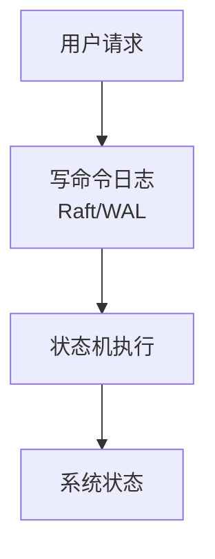
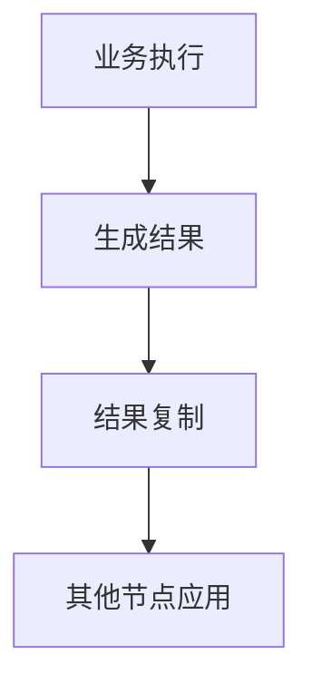

交易系统开发-张智炫

语雀地址：[https://www.yuque.com/bluememories/lanaff/eud01pmbglsxf6gu](https://www.yuque.com/bluememories/lanaff/eud01pmbglsxf6gu)
博客园地址：[https://www.cnblogs.com/zzxscodes/p/19695166/trading-system-notes](https://www.cnblogs.com/zzxscodes/p/19695166/trading-system-notes)
github地址：[https://github.com/zzxscodes/trading-system-notes](https://github.com/zzxscodes/trading-system-notes)

## 低延迟系统开发基础
### 1. CPU亲和性及NUMA架构
**isolcpus：内核启动参数CPU隔离**

```shell
 编辑 /etc/default/grub 。
 修改 GRUB_CMDLINE_LINUX_DEFAULT 这一行， 在引号内添加 isolcpus=cpu号列表 (例如: isolcpus=2,3 isolcpus=1,4-7)。
 执行 sudo update-grub （Debian/Ubuntu） ( sudo grub2-mkconfig -o /boot/grub2/grub.cfg（RHEL/CentOS/Fedora）) 并 sudo reboot。
```


**taskset：命令行工具CPU绑定**

```shell
 启动进程: taskset -c 1 ./my_app (在CPU 1上运行)
 修改运行中进程:taskset -pc 3 <PID> (将PID进程移至CPU 3)
 查询进程:taskset -pc <PID>
 绑定进程下的线程： ps -T -p <PID> taskset -p -c <CPU列表> <TID>
```


**pthread_setaffinity_np（sched_setaffinity）：线程（进程）CPU绑定**

```cpp
#pragma once

#include <iostream>
#include <atomic>
#include <thread>
#include <unistd.h>

#include <sys/syscall.h>

namespace Common {
 /// Set affinity for current thread to be pinned to the provided core_id.
 inline auto setThreadCore(int core_id) noexcept {
 cpu_set_t cpuset;

 CPU_ZERO(&cpuset);
 CPU_SET(core_id, &cpuset);

 return (pthread_setaffinity_np(pthread_self(), sizeof(cpu_set_t), &cpuset) == 0);
 }

 /// Creates a thread instance, sets affinity on it, assigns it a name and
 /// passes the function to be run on that thread as well as the arguments to the function.
 template<typename T, typename... A>
 inline auto createAndStartThread(int core_id, const std::string &name, T &&func, A &&... args) noexcept {
 auto t = new std::thread([&]() {
 if (core_id >= 0 && !setThreadCore(core_id)) {
 std::cerr << "Failed to set core affinity for " << name << " " << pthread_self() << " to " << core_id << std::endl;
 exit(EXIT_FAILURE);
 }
 std::cerr << "Set core affinity for " << name << " " << pthread_self() << " to " << core_id << std::endl;

 std::forward<T>(func)((std::forward<A>(args))...);
 });

 using namespace std::literals::chrono_literals;
 std::this_thread::sleep_for(1s);

 return t;
 }
}


/*
 * sched_setaffinity 和 pthread_setaffinity_np 的区别：
 *
 * 1. 作用对象：
 * - pthread_setaffinity_np: 作用线程，通过 pthread_t 句柄来指定要绑定的线程。
 * - sched_setaffinity: 作用进程。它通过进程ID (PID) 来指定要绑定的进程。
 * 一个进程被绑定，所有子线程也会被限制在这个CPU中。
 * 2. 可移植性：
 * - pthread_setaffinity_np: GNU C 库（glibc）扩展。
 * - sched_setaffinity: 标准 Linux 系统调用。
 */
```


**cpusets：CPU资源池隔离**

```bash
#!/usr/bin/env bash
#
# simple_cpuset_example.sh
#
# 演示如何使用 cpuset 将一个任务绑定到专属的 CPU 核心。

# --- 配置 ---
# 为后台任务分配的常规核心
SYSTEM_CORE="0"
# 为专属任务保留的核心
EXCLUSIVE_CORE="1"

set -e

# 确保脚本以 root 权限运行
if [[ $(id -u) -ne 0 ]]; then
 echo "此脚本必须以 root 身份运行。"
 exit 1
fi

# 1. 创建 cgroup 目录
echo "--> 正在创建 cpuset 核心池..."
mkdir -p /sys/fs/cgroup/cpuset/exclusive_tasks

# 2. 配置独占核心池
# 将核心 1 分配给这个池
echo "${EXCLUSIVE_CORE}" > /sys/fs/cgroup/cpuset/exclusive_tasks/cpuset.cpus
# 将其标记为 CPU 独占
echo "1" > /sys/fs/cgroup/cpuset/exclusive_tasks/cpuset.cpu_exclusive
# 将内存节点 0 分配给这个池（通常一个核心只有一个内存节点）
echo "0" > /sys/fs/cgroup/cpuset/exclusive_tasks/cpuset.mems

# 3. 运行一个任务并将其绑定到独占核心池
echo "--> 正在启动一个无限循环并绑定到核心 ${EXCLUSIVE_CORE}..."
# 启动一个后台任务
while true; do :; done &
TASK_PID=$!
echo "任务 PID: ${TASK_PID}"

# 将任务的 PID 写入独占池的 tasks 文件中
echo "${TASK_PID}" > /sys/fs/cgroup/cpuset/exclusive_tasks/tasks

echo "任务已成功绑定。可以使用 'top' 或 'htop' 检查 PID ${TASK_PID} 是否正在核心 ${EXCLUSIVE_CORE} 上运行。"
echo "要停止任务，请运行：kill ${TASK_PID}"
```

| 特性 | isolcpus | cpusets | taskset | pthread_setaffinity_np |
| --- | --- | --- | --- | --- |
| **层级** | 内核级 | 内核级 | 进程级 | 线程级 |
| **方式** | 启动参数 | 虚拟文件系统接口 | 命令行 | 库函数 |
| **隔离强度** | **强** | **强** | 弱 | 弱 |
| **粒度** | CPU | **CPU & 内存节点池** | 进程 | 线程 |
| **动态性** | **静态 (需重启)** | **动态** | 动态 | 动态 |


CPU的超线程技术(HT)将物理核模拟为两个逻辑核，共享核心的执行单元（如ALU、FPU）和L1/L2缓存。

（1）若绑定到同一物理核上的线程执行计算密集型操作，尤其是AVX等宽指令集，会完全占用共享的浮点单元，导致交易线程阻塞；

（2）线程对L1/L2缓存的访问会污染或驱逐交易线程的热点数据，增加缓存未命中。

（3）禁用超线程可使关键交易线程的执行延迟更低，降低延迟波动。

（4）禁用超线程会降低系统的整体吞吐量。因此将低延迟敏感任务独占绑定到物理核心（逻辑核ID的偶数或奇数部分），而将非实时性任务部署在启用超线程的核心上。（Linux系统层面实现）

```shell
lscpu -e # 假设输出显示 CPU 0 和 CPU 8 都属于 CORE 0。这意味着它们是同一个物理核心上的两个“兄弟”逻辑核心。

# 查看 CPU 8 的在线状态 (1 代表在线)
cat /sys/devices/system/cpu/cpu8/online

# 将 CPU 8 设置为离线 (禁用)
echo 0 > /sys/devices/system/cpu/cpu8/online

# 查看在线的CPU数量，会比原来少1
nproc

# 或者再次运行 lscpu，会看到 CPU 8 显示为 no (离线)
lscpu -e | grep "cpu8"

# 此时，操作系统调度器不会再向 CPU 8 分配任何任务。CPU 0 现在可以不受干扰地使用物理核心 0 的全部资源。
#重启只需
echo 1 > /sys/devices/system/cpu/cpu8/online
```

```shell
# 清晰地列出CPU、核心、Socket的对应关系
lscpu -e=CPU,CORE,SOCKET

# 绑定策略进程到物理核8-15（跳过超线程核）
taskset -c 8-15 ./strategy_engine
```


**关闭 CPU 节能（C-States & P-States）**

**BIOS/UEFI 层面**

| BIOS 设置项 | 推荐值 | 说明 |
| --- | --- | --- |
| **CPU C-States** / **Global C-State Control** | `Disabled` | 禁用所有 C-State（C1~C10），CPU 永不进入休眠 |
| **C1E Support** | `Disabled` | 禁用增强型 C1 状态（即使 C-States 关闭，C1E 仍可能启用） |
| **Intel SpeedStep** (EIST) / **AMD Cool'n'Quiet** | `Disabled` | 禁用 P-State 动态调频，锁定频率 |
| **Intel Turbo Boost** / **AMD Core Performance Boost** | `Disabled` | 禁用自动超频，避免频率波动 |
| **CPU Ratio** / **Multiplier** | 固定值（如 `45` ） | 手动设置 CPU 倍频，实现频率锁定（需同步禁用 SpeedStep） |
| **Hyper-Threading** / **SMT Mode** | `Disabled` | 可选：关闭超线程，减少调度干扰，便于精准控制。**全局开关，会使精准控制超线程核策略失效** |
| **Power Technology** (AMD) | `Custom` → 手动关闭各项节能 | AMD 平台注意项 |


**Linux 内核参数**

1. 编辑 GRUB 配置

```bash
sudo vim /etc/default/grub
```

```bash
GRUB_CMDLINE_LINUX_DEFAULT="quiet splash \
 intel_idle.max_cstate=0 \
 processor.max_cstate=1 \
 idle=poll \
 intel_pstate=disable"
```

| 参数 | 作用 |
| --- | --- |
| `intel_idle.max_cstate=0` | 强制 Intel CPU 的 `intel_idle` 驱动禁用所有 C-State（C1 及以上） |
| `processor.max_cstate=1` | 兼容备用驱动（acpi-cpufreq），限制最大 C-State 为 C1 |
| `idle=poll` | **最激进设置**：空闲时 CPU 不等待中断，而是持续轮询任务队列，实现最低延迟（但功耗极高） |
| `intel_pstate=disable` | 禁用现代 Intel P-State 驱动，回退到传统 `acpi-cpufreq` ，便于手动控制频率 |


2. 更新 GRUB 配置

```bash
# Debian/Ubuntu
sudo update-grub

# CentOS/RHEL/Fedora
sudo grub2-mkconfig -o /boot/grub2/grub.cfg
```

3. 重启生效

```bash
sudo reboot
```

---

**Linux 运行时控制**

1. 安装频率控制工具

```bash
# Ubuntu/Debian
sudo apt install cpufrequtils linux-tools-common

# CentOS/RHEL
sudo yum install cpufreq-utils kernel-tools

# Fedora
sudo dnf install kernel-tools
```

2. 查看当前状态

```bash
cpupower frequency-info
```

输出关键信息：

+ `driver`: 当前使用的驱动（`intel_pstate`, `acpi-cpufreq`）
+ `governor`: 当前调频策略（`powersave`, `performance`, `userspace`）
+ `current policy`: 支持的频率范围
3. 设置为性能模式（推荐）

```bash
sudo cpupower frequency-set -g performance
```

+ `performance` 模式会尽可能保持最高频率（P0 State）
4. （可选）手动锁定频率

```bash
# 锁定所有 CPU 到 3.5GHz
sudo cpupower frequency-set -f 3500MHz

# 或设置最小/最大频率范围
sudo cpupower frequency-set -d 3500MHz -u 3500MHz
```

5. 永久生效（开机自动设置）

```bash
sudo vim /etc/systemd/system/cpu-performance.service
```

```plain
[Unit]
Description=Set CPU to Performance Mode
After=multi-user.target

[Service]
Type=oneshot
ExecStart=/usr/bin/cpupower frequency-set -g performance
RemainAfterExit=yes

[Install]
WantedBy=multi-user.target
```

```bash
sudo systemctl enable cpu-performance.service
sudo systemctl start cpu-performance.service
```

---

**验证节能是否已关闭**

1. 检查 C-State

```bash
# 查看当前空闲状态
cat /proc/cpuinfo | grep -i "idle"

# 使用 turbostat（需 root）
sudo turbostat --interval 5
```

+ 观察 `C0%` 是否接近 100%，其他 C-state（C1~C10）应为 0%
+ `Busy%` 应 ≈ `C0%`
2. 检查频率是否稳定

```bash
watch -n 0.5 'cat /proc/cpuinfo | grep "cpu MHz"'
```

+ 所有核心频率应稳定在目标值（如 3500.000 MHz），无波动
3. 检查调频驱动和策略

```bash
cpupower frequency-info
```

+ `governor` 应为 `performance`
+ `current policy` 频率范围应窄或固定


**替代方案**

| 方法 | 最激进用法 | 作用说明 |
| --- | --- | --- |
| `x86_energy_perf_policy` | `sudo x86_energy_perf_policy performance` | 强制所有 CPU 核心运行在最高性能模式，禁用动态调频节能 |
| `isolcpus + nohz_full + rcu_nocbs` | 内核参数： `isolcpus=2-7 nohz_full=2-7 rcu_nocbs=2-7` | 将 CPU 2-7 完全隔离，无定时中断、无内核调度干扰，专用于实时任务 |
| `tuned` 服务 | `sudo tuned-adm profile latency-performance` | 启用极致低延迟配置，关闭节能，优化调度与中断处理 |
| `powertop --auto-tune` | `sudo powertop --auto-tune` | 自动将所有子系统（CPU、磁盘、USB 等）设为高性能模式，适合性能压测 |


**系统的NUMA拓扑**

+ 有多少个NUMA节点？
+ 每个节点有多少个CPU核心？
+ 每个节点有多少内存？
+ 节点之间的互联带宽和延迟如何？

**常用工具来查看NUMA拓扑：**

+ `numactl --hardware`：显示NUMA节点的硬件信息，包括CPU数量和内存大小。
+ `lscpu`：显示CPU架构信息，包括NUMA节点分布。
+ `hwloc`：一个库和工具集，可以生成系统的详细拓扑图，包括NUMA节点、CPU、缓存、PCI设备等。

```shell
# numactl --hardware
available: 2 nodes (0-1)
node 0 cpus: 0 1 2 3 4 5 6 7 8 9 10 11 12 13 14 15 16 17 18 19 20 21 22 23 48 49 50 51 52 53 54 55 56 57 58 59 60 61 62 63 64 65 66 67 68 69 70 71
node 0 size: 96920 MB
node 0 free: 2951 MB
node 1 cpus: 24 25 26 27 28 29 30 31 32 33 34 35 36 37 38 39 40 41 42 43 44 45 46 47 72 73 74 75 76 77 78 79 80 81 82 83 84 85 86 87 88 89 90 91 92 93 94 95
node 1 size: 98304 MB
node 1 free: 33 MB
node distances:
node 0 1
 0: 10 21
 1: 21 10
```

1. CPU 被分成 node 0 和 node 1 两组（这台机器有两个 CPU Socket）。
2. 一组 CPU 分配到 96 GB 的内存（这台机器总共有 192GB 内存）。
3. node distances 是一个二维矩阵，node[i][j] 表示 node i 访问 node j 的内存的相对距离。比如 node 0 访问 node 0 的内存的距离是 10，而 node 0 访问 node 1 的内存的距离是 21。

```shell
# numactl --show
policy: default
preferred node: current
physcpubind: 0 1 2 3 4 5 6 7 8 9 10 11 12 13 14 15 16 17 18 19 20 21 22 23 24 25 26 27 28 29 30 31 32 33 34 35 36 37 38 39 40 41 42 43 44 45 46 47 48 49 50 51 52 53 54 55 56 57 58 59 60 61 62 63 64 65 66 67 68 69 70 71 72 73 74 75 76 77 78 79 80 81 82 83 84 85 86 87 88 89 90 91 92 93 94 95
cpubind: 0 1
nodebind: 0 1
membind: 0 1
```

numactl 命令还有几个重要选项：

1. `--cpubind=0`：绑定到 node 0 的 CPU 上执行。
2. `--membind=1`：只在 node 1 上分配内存。
3. `--interleave=nodes`：nodes 可以是 `all`、`N,N,N` 或 `N-N`，表示在 nodes 上轮循（round robin）分配内存。
4. `--physcpubind=cpus`：cpus 是 `/proc/cpuinfo` 中的 processor（超线程）字段，cpus 的格式与 `--interleave=nodes` 一致，表示绑定到指定的 cpus 上运行。
5. `--preferred=1`：优先从 node 1 上分配内存。

numactl 命令的几个例子：

```shell
# 运行 test_program 程序，参数是 argument，绑定到 node 0 的 CPU 和 node 1 的内存
numactl --cpubind=0 --membind=1 test_program arguments

# 在 processor 0-4，8-12 上运行 test_program
numactl --physcpubind=0-4,8-12 test_program arguments

# 轮询分配内存，将程序的内存页交错分配到所有 NUMA 节点，同时允许程序在所有 CPU 上运行。适用于对内存带宽要求高，数据访问模式随机的应用。
numactl --interleave=all test_program arguments

# 优先考虑从 node 1 上分配内存
numactl --preferred=1
```

---

**1. 核心思想**

<!-- 这是一张图片，ocr 内容为： -->


在多CPU插槽的服务器上，每个CPU都有自己的本地内存，访问本地内存的速度远快于访问另一个CPU的内存（远程内存）。因此，优化的关键是确保“**谁计算，谁的数据就在谁身边**”。

高级场景（高性能网络）是cpu、内存、PCIe 设备（网卡）的一致。

**2. Linux的内存分配行为**

+ **默认策略**：总是**优先**在当前CPU核心所在的**本地NUMA节点**上分配内存。
+ **例外情况**：当本地内存不足时，行为由内核参数 `vm.zone_reclaim_mode` 决定。
 - `vm.zone_reclaim_mode = 0` (默认值): 本地内存不足时，去**远程节点**寻找空闲内存，是大多数场景的推荐配置。
 - `vm.zone_reclaim_mode = 1`: 本地内存不足时，优先**回收本地**不活跃的内存页（如Cache），而不是去访问远程内存。这个回收过程本身可能引入延迟。

**3. 管理与优化工具**

1. `numactl`** (最常用)**: 命令行工具，在启动应用时指定其NUMA策略。
 - **强制绑定 (**`--membind`**)**: `numactl --cpunodebind=0 --membind=0 my_app`
 * **效果**：强制 `my_app` 只能在节点0的CPU上运行，且只能从节点0的内存分配。如果节点0内存耗尽，分配会**失败**。提供最强的性能确定性。
 - **优先使用 (**`--preferred`**)**: `numactl --preferred=0 my_app`
 * **效果**：优先从节点0分配，如果失败，则自动回退到其他节点。在保证程序可用性的同时进行优化。
2. `sysctl`** (系统级调整)**:
 - `sudo sysctl -w vm.zone_reclaim_mode=0`: 确保系统采用默认的NUMA分配行为，避免不必要的本地内存回收延迟。

```shell
# 永久修改
# 在 /etc/sysctl.conf 或 /etc/sysctl.d/下的新文件中添加一行:
# vm.zone_reclaim_mode = 0
# 然后执行 sudo sysctl -p 使其生效
```

3. `cpuset`** (底层硬隔离)**:
 - `cpuset` 在分配CPU核心的同时，通过 `cpuset.mems` 文件也强制绑定了内存节点，是比 `numactl` 更底层的内核级隔离，效果与 `numactl --membind` 类似但隔离性更强。

**4.NUMA之前**

+ **核心是“无共享”**：采用无共享（Share-Nothing）架构，将系统划分为独立的计算单元，各自拥有专属的数据（数据分区）。从逻辑上根除了跨NUMA节点内存访问。
+ **用“线程局部”取代“全局共享”**：使用线程局部存储（TLS）来消除数据竞争和锁。每个线程只在自己的“领地”（即本地NUMA内存）上工作，避免因数据争用导致的跨节点缓存同步。
+ **以“消息传递”代替“共享内存”**：使用Actor模型、disruptor通信等模式，即CSP并发哲学。


NUMA优化是一个迭代的过程，需要持续的性能分析和监控来识别瓶颈并验证优化效果。

+ `numastat`: 实时或历史地查看每个 NUMA 节点的内存访问统计，包括本地（`local_node`）和远程（`other_node`）内存访问次数。如果远程访问比例很高，说明 NUMA 优化还有空间。

```shell
$ numastat -m # 查看内存策略
$ numastat -c # 查看每个CPU的内存访问统计
$ numastat -p <pid> # 查看特定进程的NUMA统计
```

+ `perf`: Linux 下性能分析工具，可以跟踪各种硬件事件，例如缓存未命中（`cache-misses`）、远程内存访问（`mem_load_retired.l3_miss` 等）。通过分析这些事件发现潜在的 NUMA 瓶颈。

```shell
$ perf stat -e cache-misses,L1-dcache-loads,L1-dcache-misses ./your_program
```

+ **Intel VTune Amplifier**: 对于 Intel CPU 的微架构性能分析工具，提供非常详细的 NUMA 相关的性能指标和优化建议。

考虑因素：

+ **过度优化：** 并非所有程序都需要 NUMA 优化。对于 CPU 密集型且数据局部性极强的程序，或者数据量很小、内存访问模式随机的程序，NUMA 优化可能收益不大甚至适得其反。
+ **动态环境：** 如果程序需要在不同 NUMA 拓扑的系统上运行，可能需要动态地检测 NUMA 节点并调整策略。


**显式 NUMA 感知内存分配**

以下是 libnuma 常用接口及相关系统调用表：

| **分类** | **函数签名** | **返回值类型** | **关键说明** |
| :--- | :--- | :--- | :--- |
| **初始化与版本** | `void numa_available(void);` | `void` | 检查 NUMA 支持，不支持则终止程序 |
| | `const char *numa_version(void);` | `const char *` | 返回库版本字符串（如`libnuma 2.0.14`） |
| **节点信息查询** | `int numa_max_node(void);` | `int` | 返回最大节点编号（从 0 开始，无节点返回 - 1） |
| | `int numa_num_configured_nodes(void);` | `int` | 返回配置的节点总数 |
| | `extern struct bitmask *numa_all_nodes_ptr;` | 全局变量 | 包含所有可用节点的预定义位掩码 |
| | `extern struct bitmask *numa_nodes_ptr;` | 全局变量 | 当前进程可访问的节点位掩码 |
| **内存分配** | `void *numa_alloc_onnode(size_t size, int node);` | `void *` | 在指定节点分配内存，失败返回`NULL` |
| | `void *numa_alloc_local(size_t size);` | `void *` | 在本地节点分配内存，失败返回`NULL` |
| | `void *numa_alloc_interleaved(size_t size);` | `void *` | 交叉分配内存到所有节点，失败返回`NULL` |
| | `void numa_free(void *ptr, size_t size);` | `void` | 释放`numa_alloc_*`分配的内存（需指定大小） |
| | `void *numa_realloc(void *oldptr, size_t oldsize, size_t newsize);` | `void *` | 重新分配内存并保持节点亲和性，失败返回`NULL` |
| **内存策略设置** | `void numa_set_localalloc(void);` | `void` | 设置默认策略为 “本地节点优先” |
| | `void numa_set_interleave_mask(const struct bitmask *mask);` | `void` | 按`mask`节点集设置交叉分配模式 |
| | `void numa_set_bind_mask(const struct bitmask *mask);` | `void` | 限制内存分配到`mask`指定节点 |
| | `void numa_set_preferred(int node);` | `void` | 设置内存分配的首选节点 |
| **进程亲和性** | `int numa_run_on_node(int node);` | `int` | 绑定当前进程到节点`node`的 CPU，成功返回 0，失败返回 - 1 |
| | `int numa_run_on_node_mask(const struct bitmask *mask);` | `int` | 绑定当前进程到`mask`节点集的 CPU，成功返回 0，失败返回 - 1 |
| | `int numa_sched_setaffinity(pid_t pid, const struct bitmask *mask);` | `int` | 设置进程`pid`的 CPU 亲和性为`mask`节点，成功返回 0，失败返回 - 1 |
| **节点属性查询** | `long long numa_node_size64(int node, int *free);` | `long long` | 返回节点总内存（字节），`free`输出空闲内存（KB），失败返回 - 1 |
| | `int numa_node_of_cpu(int cpu);` | `int` | 返回 CPU`cpu`所属节点，失败返回 - 1 |
| **位掩码操作** | `struct bitmask *numa_bitmask_alloc(unsigned int nbits);` | `struct bitmask *` | 分配容纳`nbits`位的位掩码，失败返回`NULL` |
| | `void numa_bitmask_free(struct bitmask *b);` | `void` | 释放位掩码`b`（`b`为`NULL`时无操作） |
| | `void numa_bitmask_setall(struct bitmask *b);` | `void` | 设置`b`的所有位（包含所有节点） |
| | `void numa_bitmask_clearall(struct bitmask *b);` | `void` | 清空`b`的所有位（不包含任何节点） |
| | `void numa_bitmask_setbit(struct bitmask *b, unsigned int i);` | `void` | 设置`b`的第`i`位（包含节点`i`） |
| | `void numa_bitmask_clearbit(struct bitmask *b, unsigned int i);` | `void` | 清除`b`的第`i`位（不包含节点`i`） |
| | `int numa_bitmask_is_set(const struct bitmask *b, unsigned int i);` | `int` | 检查`b`的第`i`位是否设置，是返回 1，否则返回 0 |
| | `struct bitmask *numa_allocate_nodemask(void);` | `struct bitmask *` | 分配默认大小的节点位掩码（等价于`numa_bitmask_alloc(numa_max_node()+1)`） |
| | `void numa_free_nodemask(struct bitmask *b);` | `void` | 释放`numa_allocate_nodemask`分配的位掩码 |
| **大页 + NUMA 相关系统调用** | `void *mmap(void *addr, size_t length, int prot, int flags, int fd, off_t offset);` | `void *` | 分配内存（`MAP_HUGETLB`标志用于大页），失败返回`MAP_FAILED` |
| | `int mbind(void *start, size_t length, int policy, const unsigned long *nmask, unsigned int maxnode, unsigned int flags);` | `int` | 为内存块设置 NUMA 策略（如`MPOL_BIND`），成功返回 0，失败返回 -1 |


**示例：在特定节点上分配内存**

```cpp
#define _GNU_SOURCE // 启用 GNU 扩展，包括 sched_setaffinity
#include <pthread.h>
#include <sched.h>
#include <iostream>
#include <thread>
#include <vector>
#include <numa.h> // 需要链接 libnuma

void worker_function(int thread_id, int target_cpu) {
 cpu_set_t cpuset;
 CPU_ZERO(&cpuset);
 CPU_SET(target_cpu, &cpuset);

 if (pthread_setaffinity_np(pthread_self(), sizeof(cpu_set_t), &cpuset) != 0) {
 std::cerr << "Error setting CPU affinity for thread " << thread_id << " to CPU " << target_cpu << std::endl;
 } else {
 std::cout << "Thread " << thread_id << " bound to CPU " << target_cpu << std::endl;
 }

 // 模拟一些工作，例如访问之前分配在特定NUMA节点上的数据
 long long sum = 0;
 for (int i = 0; i < 100000000; ++i) {
 sum += i;
 }
 std::cout << "Thread " << thread_id << " finished work, sum: " << sum << std::endl;
}

int main() {
 if (numa_available() == -1) {
 std::cerr << "NUMA support not available." << std::endl;
 return 1;
 }

 int num_nodes = numa_num_configured_nodes();
 if (num_nodes < 1) {
 std::cerr << "No NUMA nodes detected." << std::endl;
 return 1;
 }

 std::vector<std::thread> threads;
 int current_cpu = 0;

 for (int i = 0; i < num_nodes; ++i) {
 // 获取当前NUMA节点上的所有CPU
 struct bitmask *cpus_on_node = numa_node_to_cpus(i);
 if (cpus_on_node == nullptr) {
 std::cerr << "Failed to get CPUs for node " << i << std::endl;
 continue;
 }

 // 遍历该节点上的所有CPU，并为每个CPU创建一个线程
 for (int cpu = 0; cpu <= cpus_on_node->size; ++cpu) {
 if (numa_bitmask_isbitset(cpus_on_node, cpu)) {
 threads.emplace_back(worker_function, current_cpu, cpu);
 current_cpu++;
 }
 }
 numa_free_cpumask(cpus_on_node);
 }

 for (auto& t : threads) {
 t.join();
 }

 std::cout << "All threads finished." << std::endl;
 return 0;
}
```

**编译：**`g++ -std=c++11 test.cpp -o test -lnuma -pthread`

**运行：**`./test`


**NUMA数据分片**

**数据分片的核心思想是根据数据的访问频率、重要性以及策略逻辑，将不同类型的数据结构分配到最合适的物理内存区域。**

```shell
# 查看NUMA节点分布
numactl --hardware

# 为Node0分配1024个2MB大页
echo 1024 > /sys/devices/system/node/node0/hugepages/hugepages-2048kB/nr_hugepages

# 为Node1分配512个1GB大页（若支持）
echo 512 > /sys/devices/system/node/node1/hugepages/hugepages-1048576kB/nr_hugepages
```

```cpp
#include <numa.h>
#include <numaif.h>
#include <sys/mman.h>

void* alloc_hugepage_on_node(int node, size_t size) {
 struct bitmask *nm = numa_allocate_nodemask();
 if (!nm) return NULL;
 numa_bitmask_setbit(nm, node);

 void* ptr = mmap(NULL, size, PROT_READ|PROT_WRITE,
 MAP_PRIVATE|MAP_ANONYMOUS|MAP_HUGETLB, -1, 0);
 if (ptr == MAP_FAILED) {
 perror("mmap hugepage failed");
 numa_free_nodemask(nm);
 return NULL;
 }

 if (mbind(ptr, size, MPOL_BIND, nm->maskp, nm->size + 1, 0) == -1) {
 perror("mbind failed");
 munmap(ptr, size); // 绑定失败需释放已分配的大页
 numa_free_nodemask(nm);
 return NULL;
 }

 numa_free_nodemask(nm);
 return ptr;
}

int main() {
 const size_t memSize = 2 * 1024 * 1024; // 2MB
 void* lockMem = alloc_hugepage_on_node(0, memSize);

 // 锁定内存
 if (-1 == mlock(lockMem, memSize)) {
 munmap(lockMem, memSize);
 }

 // 手动触发缺页中断
 memset(lockMem, 0, memSize);

 // 保持常驻（程序运行时内存不会换出）
 while(true) {
 // 实际应用中应有退出逻辑
 sleep(1);
 }

 // 程序退出时自动解锁
 munlock(lockedMem, memSize);
 munmap(lockedMem);
 return 0;
}
```


### 2. 实时线程优先级
实时线程优先级决定了线程在系统中的执行顺序，确保高优先级的线程在就绪时能够立即抢占低优先级线程的执行，从而保证关键路径的确定性延迟。

+ **设置方法**：在Linux系统中，可以使用pthread_setschedparam函数来设置线程的调度策略和优先级。

Linux内核的三种调度策略：

+ SCHED_OTHER：分时调度策略，系统默认
+ SCHED_FIFO：实时调度策略，先到先服务
+ SCHED_RR：实时调度策略，时间片轮转

```c
#include <sched.h>
#include <stdio.h>
#include <stdlib.h>
#include <pthread.h>

void* thread_function(void* arg) {
 // 线程执行的代码
 return NULL;
}

int main() {
 pthread_t thread;
 struct sched_param param;
 int policy;

 // 创建线程
 if (pthread_create(&thread, NULL, thread_function, NULL) != 0) {
 perror("pthread_create");
 return EXIT_FAILURE;
 }

 // 获取当前线程的调度策略和参数
 if (pthread_getschedparam(pthread_self(), &policy, &param) != 0) {
 perror("pthread_getschedparam");
 return EXIT_FAILURE;
 }

 // 设置调度策略为SCHED_FIFO
 policy = SCHED_FIFO;
 // 设置线程优先级，取值范围为0到sched_get_priority_max(policy)
 param.sched_priority = sched_get_priority_max(policy);

 // 设置线程的调度策略和优先级
 if (pthread_setschedparam(thread, policy, &param) != 0) {
 perror("pthread_setschedparam");
 return EXIT_FAILURE;
 }

 // 等待线程结束
 if (pthread_join(thread, NULL) != 0) {
 perror("pthread_join");
 return EXIT_FAILURE;
 }

 return EXIT_SUCCESS;
}


// sched_setscheduler(pid_t pid, int policy, const struct sched_param *param)
// 这是对应调整进程优先级的函数
```

**优先级反转及解决办法**

在实时系统中，当**高优先级线程**因等待**低优先级线程**持有的资源（如互斥锁）而阻塞时，若**中优先级线程**抢占CPU，会导致：

+ 低优先级线程无法及时释放资源
+ 高优先级线程被“间接”延迟（本应最高优先级却最晚执行）
`L（持锁）→ H（等待锁）→ M（抢占L）→ H持续阻塞`

优先级继承（PTHREAD_PRIO_INHERIT）

1. 高优先级线程H等待锁时，持有锁的低优先级线程L的优先级**临时提升至H的优先级**
2. 提升后的L可立即抢占中优先级线程M，快速执行并释放锁
3. L释放锁后，其优先级自动恢复原值
4. 若存在多层等待（如L等待另一锁），系统会递归提升所有相关线程优先级

2.优先级天花板（PTHREAD_PRIO_PROTECT）

锁创建时预设天花板优先级，适用于已知资源依赖场景


**命令**: 使用 `chrt` (change real-time attributes) 命令，只针对进程调整优先级

```shell
# 将PID为 <pid> 的进程设置为 SCHED_FIFO 实时调度策略，优先级为最高的99
sudo chrt -f -p 99 <pid>

chrt 命令的基本语法是：
chrt [选项] <优先级> <命令> [命令参数...]
chrt [选项] -p <优先级> <PID>
<优先级>: 这是一个整数，表示调度优先级。其范围和含义取决于使用的调度策略。
<命令>: 你想要运行并设置其调度策略的命令及其参数。
<PID>: 你想要修改调度策略的现有进程的进程 ID。

chrt 支持多种实时调度策略，其中最常用的是：

--fifo (SCHED_FIFO)：先到先服务 (First-In, First-Out)。具有相同优先级的进程会按照它们就绪的顺序执行。一旦一个 FIFO 进程开始运行，它会一直运行，直到它自己主动放弃 CPU、被阻塞（例如等待 I/O），或者被一个具有更高优先级的进程抢占。

--rr (SCHED_RR)：轮转 (Round-Robin)。与 SCHED_FIFO 类似，但有一个时间片。当一个 RR 进程的时间片用完时，它会被移到就绪队列的末尾，让同等优先级的其他进程有机会运行。

--other (SCHED_OTHER)：普通调度策略。这是系统的默认调度策略，使用 CFS (Completely Fair Scheduler)。

--batch (SCHED_BATCH)：批处理调度策略。适用于不需要交互的批处理任务。

--idle (SCHED_IDLE)：空闲调度策略。只在系统空闲时运行，优先级最低。

常用选项：

-p: 操作指定的 PID（进程 ID），而不是启动新命令。

-o: 设置 OTHER 调度策略（SCHED_OTHER）。

-f: 设置 FIFO 调度策略（SCHED_FIFO）。

-r: 设置 RR 调度策略（SCHED_RR）。

-b: 设置 BATCH 调度策略（SCHED_BATCH）。

-i: 设置 IDLE 调度策略（SCHED_IDLE）。

-g: 设置 GROUP 调度策略（SCHED_GROUP，不常用）。

-h: 设置 HIGH 调度策略（SCHED_HIGH，不常用）。

-a: 设置 AFR 调度策略（SCHED_AFR，不常用）。

-e: 设置 EDF 调度策略（SCHED_EDF，不常用）。

-d: 设置 DEADLINE 调度策略（SCHED_DEADLINE，不常用）。

-v: 显示 当前进程（或指定 PID）的调度策略和优先级。

--help: 显示帮助信息。

--version: 显示版本信息。
```


### 3. 中断绑定及常见中断核心隔离
**中断绑定**是指将中断请求（IRQ）分配到特定的CPU核心上处理，避免中断处理对关键路径的干扰。通过合理地绑定中断，可以减少关键路径上的CPU负载，确保确定性延迟。

**识别瓶颈**: 在调优前，先使用 `top`, `htop`, `mpstat -P ALL 1` 等工具，观察 `si` (softirq) 或 `%irq` 是否在某个CPU核心上过高，确认中断处理是瓶颈。

+ **查找设备的IRQ号**`cat /proc/interrupts`
+ 通过最后一列的设备名 (如 `eth0-rx-0`) 找到对应的IRQ号。
+ **执行绑定的核心文件**: `/proc/irq/<IRQ号>/smp_affinity_list` (推荐) 或 `smp_affinity` (位掩码)。
+ `**smp_affinity_list**`** (CPU列表)**: 直接写入CPU核心编号。

```shell
# 示例：将IRQ 128绑定到CPU核心2
sudo sh -c 'echo 2 > /proc/irq/128/smp_affinity_list'
```

**验证效果**

+ 在负载下，反复执行 `cat /proc/interrupts`，观察中断计数是否只在绑定的CPU上增长。
+ 使用 `mpstat -P ALL 1` 观察各CPU的 `%irq` 使用率。

**遵循NUMA原则**: 始终将设备中断绑定到与设备物理位置（PCIe插槽）在同一个NUMA节点的CPU上。

**分发负载**: 对于多队列设备（如网卡），将每个队列的IRQ均匀地分发到不同的CPU核心上。

**irqbalance**：自动管理中断的负载均衡，通过配置文件/etc/irqbalance.conf来调整其行为，这个会覆盖上面的精细手动控制的行为。

**使用场景**：对于关键路径所在的CPU核心，将无关的中断请求绑定到其他核心上，减少该核心的中断处理负担。


在CPU 绑定后，内核线程（如 ksoftirqd、kworker）仍可能抢占绑定核心的用户态线程，时钟中断、RCU 回调也会产生开销；而`isolcpus`、`nohz_full`、`rcu_nocbs`三参数结合可解决此问题：

1. `isolcpus`：将指定 CPU 从内核通用调度器隔离，阻止多数内核线程和普通进程运行；
2. `nohz_full`：在隔离核心启用自适应无时钟模式，减少 / 消除时钟中断；
3. `rcu_nocbs`：将 RCU 回调卸载到非隔离核心。 最终为关键低延迟任务提供近乎独占、无内核干扰的 “静默” 运行环境。

```shell
# 修改GRUB配置
grub_cmdline="isolcpus=8-15 nohz_full=8-15 rcu_nocbs=8-15"

# 生效配置
grub2-mkconfig -o /boot/grub2/grub.cfg
```


### 4. 系统静默配置步骤总结
| 配置阶段 | 具体操作 | 目的 | 注意事项 |
| --- | --- | --- | --- |
| **一、启动参数配置** | 1. 在引导项中添加 `isolcpus=managed_irq,7` 2. 添加 `nohz_full=7` 3. 添加 `rcu_nocbs=7` 4. 添加 `nowatchdog nmi_watchdog=0` 5. 添加 `hpet=disable` 6. 添加 `tsc=reliable` 7. 添加 `mce=off` 8. 添加 `ipv6.disable=1` 9. 添加 `audit=0` 10. 添加 `printk.devkmsg=off quiet loglevel=1` 11. 添加`selinux=0` | 1. 将核心7从通用调度器隔离，`managed_irq` 模式允许中断在该CPU上运行但阻止用户/内核线程抢占 2. 启用自适应无滴答模式，在idle时停止周期性时钟中断，显著降低抖动 3. 将RCU回调卸载到非隔离CPU，避免RCU softirq干扰关键线程 4. 禁用NMI watchdog，防止其产生不必要的定时器中断 5. 禁用HPET多播中断源，减少全局中断负载 6. 声明TSC为可靠时间源，避免内核频繁校准带来抖动 7. 关闭机器检查异常（MCE），避免不可屏蔽中断（NMI）打断执行 8. 减少IPv6协议栈相关的后台任务和中断处理 9. 禁用审计子系统，消除 auditd 和 audit backlog 处理带来的不确定性开销 10. 抑制内核日志输出，降低console和syslog写入引起的中断与竞争 11. 禁用 SE Linux 扩展 | 1. `isolcpus` 必须配合 `nohz_full` 才能实现真正的“静默”效果；建议使用 `isolcpus=managed_irq,<cpu_list>`而非旧格式 2. `nohz_full` 要求目标CPU不运行任何除0号进程外的任务，否则会退化回有滴答模式，确保内核中配置了`CONFIG_NO_HZ_FULL=y`，可以通过 `cat /boot/config-* |
| **二、中断与任务隔离** | 1. 执行命令：`systemctl stop irqbalance && systemctl disable irqbalance` 2. 手动绑定所有非关键设备中断（如网卡、磁盘）至非目标CPU（如CPU 0-6）： `echo <cpu_id> > /proc/irq/<irq_num>/smp_affinity_list` 3. 编辑 `/sys/devices/virtual/workqueue/cpumask`，设置为 `0x7F`（即 CPU 0-6） 4. （可选）将 `ksoftirqd/7` 进程手动迁移： `taskset -pc 0 $(pgrep ksoftirqd/7)` | 1. 防止 `irqbalance`自动将中断迁移到隔离核心 2. 主动控制IRQ亲和性，确保硬件中断不会落入核心7 3. 限制所有通用工作队列（workqueue）仅在非隔离CPU上运行，防止内核worker抢占 4. 强制将软中断守护进程移出核心7，进一步降低潜在干扰风险 | 1. 禁用 `irqbalance` 后必须定期检查 `/proc/interrupts`，防止新设备中断误绑 2. 使用 `smp_affinity_list`接口比位掩码更直观且不易出错 3. 修改 `workqueue/cpumask` 需 root 权限，并注意系统更新后可能重置 4. `ksoftirqd`迁移是临时手段，若未结合 `nohz_full`效果有限 |
| **三、电源管理优化** | 1. BIOS 中禁用： - Turbo Boost - C-States (C1E, C-State Control) - P-States / SpeedStep - SMT/Hyper-Threading（可选） **2. 内核启动参数添加：** `intel_pstate=disable` `processor.max_cstate=1` `intel_idle.max_cstate=1` `idle=poll` 3. 运行时设置频率策略： `sudo cpupower frequency-set -g performance` 4. 锁定频率（可选）： `sudo cpupower frequency-set -f <target_freq>MHz` 5. 加载 `msr` 模块并使用 WRMSR 工具固定 UNCORE 频率： `modprobe msr` `wrmsr -p7 0x620 <min_max_ratio>` | 1. 消除动态调频（P-State）、自动超频（Turbo）和深度睡眠（C-State）导致的频率波动与唤醒延迟 2. 将CPU保持在浅层C1状态或强制轮询（idle=poll），实现最低延迟响应 3. 确保CPU始终运行于最高稳定频率，避免performance governor切换延迟 4. 固定频率避免dvfs过渡态引入抖动 5. 控制Uncore（LLC、内存控制器）频率一致性，避免跨NUMA带宽波动 | 1. BIOS设置需物理访问服务器或远程KVM操作 2. `idle=poll`极大增加功耗，仅适用于短期压测或低延迟场景 3. `cpupower`工具链需提前安装（如 `linux-tools-common`） 4. MSR操作需谨慎，错误值可能导致系统不稳定或降频 |
| **四、其他关键优化** | 1. 禁用VT-x虚拟化支持（BIOS）；避免跨核读写MSR寄存器；降低RDTSC采样频率 2. 使用 `chrt` 设置实时优先级： `chrt -f 99 ./realtime_app` 3.`echo -1 > /proc/sys/kernel/sched_rt_runtime_us`将实时任务的CPU使用时间限制设为无限制 4. NUMA绑定：使用 `numactl`将进程、内存、I/O设备绑定到同一节点： `numactl --cpunodebind=0 --membind=0 --physcpubind=7 ./app` 同时将I/O中断亲和性设为另一NUMA节点CPU 5. 检测SMI（System Management Interrupt）开销： Intel: `perf stat --smi-cost sleep 10` AMD: `perf stat -e ls_smi_rx -I 10000 sleep 1` 存在高频SMI时调整BIOS中SMM相关选项 6. 禁用透明大页THP： 方式一：`transparent_hugepage=never`（boot参数） 方式二：`echo never > /sys/kernel/mm/transparent_hugepage/enabled` 7. 在计时代码前后插入串行化指令： `asm volatile("cpuid" ::: "eax", "ebx", "ecx", "edx");` 再执行 `rdtsc` 或 使用`rdtscp` | 1. 减少IPI、VMX相关陷阱及MSR访问引发的微小延迟抖动 2. 提升进程调度优先级，使其能立即抢占普通任务 3. 允许实时任务(RT任务)不受限制使用CPU资源 4. 实现计算、内存、I/O局部性，避免跨NUMA延迟与带宽瓶颈 5. SMI为最高优先级中断，无法被屏蔽，必须通过BIOS调优规避 6. THP后台合并线程（khugepaged）会产生不可预测的延迟尖峰 7. CPUID作为内存屏障，防止RDTSC乱序执行，保证时间戳准确性，RDTSCP会保证前面的指令不会乱序执行到RDTSCP后方 | 1. 禁用VT-x会影响容器、KVM等虚拟化功能 2. `chrt -f 99`若滥用会导致系统无响应，应仅用于单个关键进程 3. 若RT任务出现死循环，可能导致系统完全无响应 4. NUMA绑定需结合 `numactl --show`验证实际绑定结果 5. SMI调优依赖具体主板/BMC固件，常见选项包括：`USB SMI`、`Legacy USB Support`、`PCI Lock`等 6. THP禁用后可能影响数据库类应用性能，需权衡场景 7. CPUID带来约50~100 cycle开销，适合高精度测量而非高频采样 |


Linux平台静默工具类

```cpp
#pragma once

#include <sys/types.h>
#include <unistd.h>
#include <pthread.h>
#include <sched.h>
#include <thread>
#include <fstream>
#include <sstream>
#include <string>
#include <string_view>
#include <vector>
#include <cstdint>
#include <cerrno>
#include <cctype>
#include <algorithm>
#include <climits>

/// 进程优先级等级
enum class PriorityLevel {
 LowPriority = -1, ///< 低优先级
 NormalPriority = 0, ///< 普通优先级
 HighPriority, ///< 高优先级
 RealtimePriority ///< 实时优先级
};

/**
 * @brief Linux平台进程和线程辅助类
 */
class process_helper {
public:
 static inline uint32_t get_pid() noexcept {
 return static_cast<uint32_t>(::getpid());
 }

 static inline bool set_priority(PriorityLevel prio) noexcept {
 const int max_prio = ::sched_get_priority_max(SCHED_FIFO);
 if (max_prio == -1) return false;

 int value;
 switch (prio) {
 case PriorityLevel::RealtimePriority: value = max_prio; break;
 case PriorityLevel::HighPriority: value = max_prio / 2; break;
 case PriorityLevel::NormalPriority: value = std::max(1, max_prio / 3); break;
 case PriorityLevel::LowPriority: value = 1; break;
 default: return false;
 }

 ::sched_param param{value};
 return ::sched_setscheduler(0, SCHED_FIFO, &param) == 0;
 }

 static inline bool thread_bind_core(uint32_t cpu) noexcept {
 const auto hw_concur = std::thread::hardware_concurrency();
 const uint32_t ncpus = hw_concur == 0 ? 1 : static_cast<uint32_t>(hw_concur);
 if (cpu >= ncpus) return false;

 cpu_set_t mask;
 CPU_ZERO(&mask);
 CPU_SET(cpu, &mask);
 return ::pthread_setaffinity_np(::pthread_self(), sizeof(mask), &mask) == 0;
 }

 static inline bool set_thread_priority(PriorityLevel prio) noexcept {
 const int max_prio = ::sched_get_priority_max(SCHED_FIFO);
 if (max_prio == -1) return false;

 int value;
 switch (prio) {
 case PriorityLevel::RealtimePriority: value = max_prio; break;
 case PriorityLevel::HighPriority: value = max_prio / 2; break;
 case PriorityLevel::NormalPriority: value = std::max(1, max_prio / 3); break;
 case PriorityLevel::LowPriority: value = 1; break;
 default: return false;
 }

 ::sched_param param{value};
 return ::pthread_setschedparam(::pthread_self(), SCHED_FIFO, &param) == 0;
 }

 /**
 * @brief 获取设备对应的所有 IRQ 号（支持多队列网卡）
 * @return vector<int>，可能为空
 */
 static std::vector<int> get_irqs_by_device(std::string_view device) {
 std::vector<int> irqs;
 std::ifstream file("/proc/interrupts");
 if (!file) return irqs;

 std::string line;
 while (std::getline(file, line)) {
 if (line.empty() || line[0] == ' ') continue; // 跳过表头或无效行

 // 查找第一个冒号前的 IRQ 号
 size_t colon = line.find(':');
 if (colon == std::string::npos) continue;

 std::string_view irq_part(line.data(), colon);
 // 跳过前导空格
 size_t start = 0;
 while (start < irq_part.size() && std::isspace(irq_part[start])) ++start;
 if (start >= irq_part.size()) continue;

 char* end_ptr = nullptr;
 errno = 0;
 long irq = std::strtol(std::string(irq_part.substr(start)).c_str(), &end_ptr, 10);

 if (errno != 0 || end_ptr == std::string(irq_part.substr(start)).c_str() || irq < INT_MIN || irq > INT_MAX) {
 continue;
 }

 // 检查行尾是否包含设备名（精确匹配或 [device] 形式）
 std::string_view tail(line.data() + colon + 1, line.size() - colon - 1);
 if (contains_device(tail, device)) {
 irqs.push_back(static_cast<int>(irq));
 }
 }
 return irqs;
 }

 /**
 * @brief 绑定设备的所有 IRQ 到指定 CPU（适用于多队列设备）
 */
 static bool bind_device_irqs_to_cpu(std::string_view device, uint32_t cpu) {
 auto irqs = get_irqs_by_device(device);
 if (irqs.empty()) return false;

 bool success = true;
 for (int irq : irqs) {
 if (!bind_irq_to_cpu(irq, cpu)) success = false;
 }
 return success;
 }

private:
 static bool contains_device(std::string_view line, std::string_view target) {
 // 去除前导空格
 size_t pos = 0;
 while (pos < line.size() && std::isspace(line[pos])) ++pos;
 if (pos >= line.size()) return false;

 std::string_view tokens = line.substr(pos);
 // 按空格分割（简单状态机，避免构造 vector<string>）
 size_t start = 0;
 while (start < tokens.size()) {
 // 跳过空格
 while (start < tokens.size() && std::isspace(tokens[start])) ++start;
 if (start >= tokens.size()) break;

 size_t end = start;
 while (end < tokens.size() && !std::isspace(tokens[end])) ++end;
 std::string_view token = tokens.substr(start, end - start);

 // 移除尾部 '+'（如 eth0+）
 if (!token.empty() && token.back() == '+') {
 token = token.substr(0, token.size() - 1);
 }

 // 检查 [target] 形式
 if (token.size() >= target.size() + 2 &&
 token[0] == '[' && token[token.size()-1] == ']') {
 std::string_view inner = token.substr(1, token.size() - 2);
 if (inner == target) return true;
 } else if (token == target) {
 return true;
 }

 start = end;
 }
 return false;
 }

 static bool bind_irq_to_cpu(int irq, uint32_t cpu) {
 const auto hw_concur = std::thread::hardware_concurrency();
 const uint32_t ncpus = hw_concur == 0 ? 1 : static_cast<uint32_t>(hw_concur);
 if (cpu >= ncpus) return false;

 // 构造十六进制掩码（无前缀，小写）
 char mask_str[18]; // 64位最大16字符 + '\0'
 int len = snprintf(mask_str, sizeof(mask_str), "%llx", 1ULL << cpu);
 if (len <= 0 || static_cast<size_t>(len) >= sizeof(mask_str)) return false;

 std::string path = "/proc/irq/" + std::to_string(irq) + "/smp_affinity";
 std::ofstream file(path, std::ios::out | std::ios::trunc);
 if (!file) return false;

 file.write(mask_str, len);
 file.put('\n');
 return file.good();
 }
};
```


### 5. 内存模型与缓存及流水线
内存模型参考：

[https://research.swtch.com/hwmm](https://research.swtch.com/hwmm)

[https://research.swtch.com/plmm](https://research.swtch.com/plmm)

高级并行编程参考：

[https://mirrors.edge.kernel.org/pub/linux/kernel/people/paulmck/perfbook/perfbook.html](https://mirrors.edge.kernel.org/pub/linux/kernel/people/paulmck/perfbook/perfbook.html)


**内存乱序及内存模型的解决**

**内存乱序的根源**

**1. 存储缓冲区（Store Buffer）：隐藏写延迟**

**原理**：CPU执行`store`指令时，若目标缓存行不在本地缓存，需等待内存加载；为避免CPU stall，CPU将`store`数据先存入“store buffer”，后续再异步写入缓存/内存——`store`指令可快速完成，但“数据写入内存的顺序”可能晚于“代码中`store`的顺序”。

```c
// 线程A // 线程B
a = 1; while (b == 0);
b = 1; assert(a == 1); // 可能失败？
```

**结论**：store buffer导致“写操作的提交顺序≠代码顺序”，即“写乱序（Store Reordering）”。

**2. 无效队列（Invalidate Queue）：隐藏缓存一致性延迟**

**原理**：CPU修改共享变量时，需先通过“缓存一致性协议（如MESI）”向其他CPU发送“缓存行无效（Invalidate）”请求；为避免等待所有CPU确认无效，CPU将“无效请求”存入“无效队列”并异步处理——其他CPU可能延迟收到无效请求，导致“读操作看到过时数据”。

```c
// 线程A（CPU 0） // 线程B（CPU 1）
a = 1; while (a == 0);
 b = 1;
// 线程C（CPU 0）
while (b == 0);
assert(a == 1); // 可能失败？
```

**结论**：无效队列导致“读操作看到的无效通知顺序≠请求发送顺序”，即“读乱序（Load Reordering）”。

**3. 乱序执行（Out-of-Order Execution）：最大化CPU资源利用率**

**原理**：现代CPU为充分利用流水线与功能单元（如ALU、FPU），会打乱指令执行顺序——只要“逻辑依赖满足”（如`c = a + b`需等`a`和`b`计算完成），无关指令可乱序执行。

**对内存访问的影响**：内存访问指令（`load`/`store`）与计算指令无依赖时，可能被乱序执行——例如`a = 1; b = c + d;`中，`b = c + d`可能先执行（若`c`和`d`已在寄存器中），但`a=1`的store仍在store buffer中，导致其他线程先看到`b`的新值，后看到`a`的新值。

**4. 推测执行（Speculative Execution）：提前执行不确定分支**

**原理**：CPU遇到分支（如`if (x > 0)`）时，会推测分支方向并提前执行后续指令；若推测错误，丢弃推测执行的结果（包括内存访问）。

**对内存排序的隐性影响**：推测执行的内存访问可能“临时修改缓存状态”，虽最终会回滚，但可能被其他CPU通过“侧信道”感知（如Spectre漏洞利用此特性）；通过“内存序约束”确保“推测执行的内存访问不影响程序正确性”。


**内存模型**

定义内存模型，明确“哪些内存访问顺序是硬件必须保证的，哪些是软件可依赖的”，解决“硬件乱序导致软件正确性问题”。

“硬件内存模型”与“语言内存模型”共同构成并行程序的内存访问规则基础。

**1. 硬件内存模型**

**（1）x86/x86-64：强内存模型（Total Store Order, TSO）**

**规则**：

1. 禁止“写→读”乱序（StoreLoad Reordering）：即“先执行的store，不会被后执行的load越过”——例如`a=1; b=load(c);`中，`b=load(c)`不会先于`a=1`的store提交到内存；
2. 禁止“写→写”乱序（StoreStore Reordering）：即“先执行的store，其他线程必先看到”——例如`a=1; b=1;`中，其他线程不会先看到`b=1`再看到`a=1`；
3. 禁止“读→写”乱序（LoadStore Reordering）：即“先执行的load，不会被后执行的store越过”——例如`a=load(c); b=1;`中，`b=1`不会先于`a=load(c)`提交；
4. **允许“读→读”乱序（LoadLoad Reordering）**：即“先执行的load，可能后看到结果”——例如`a=load(c); b=load(d);`中，若`c`的缓存行未命中而`d`的缓存行命中，`b`可能先获取值，`a`后获取值。

**例外**：x86的`non-temporal store`（如`_mm_stream_store_si128`）与“未对齐内存访问”可能打破TSO规则，需额外加内存屏障。

**意义**：x86的强内存模型降低了软件复杂度，多数情况下无需手动处理“写→读/写→写/读→写”乱序，但需注意“读→读”乱序与特殊指令的例外。

**（2）ARM/PowerPC：弱内存模型（Partial Store Order, PSO / Weak Order）**

**规则**： 允许“写→读”“写→写”“读→写”“读→读”四类乱序（仅禁止“同一地址的访问乱序”）；

**意义**：弱内存模型的硬件性能更高（可更自由地优化内存访问），但软件需通过“显式内存屏障”或“带内存序的原子操作”约束乱序，否则极易出现正确性问题。


**2. 语言内存模型：C11/C++11的统一抽象**

不同硬件内存模型差异大，C11/C++11通过“语言内存模型”提供统一抽象，屏蔽硬件细节，允许软件按需选择“内存序强度”。

| 内存序枚举 | 核心约束 | 适用场景 |
| --- | --- | --- |
| `memory_order_relaxed` | 仅保证“同一原子变量的访问原子性”，不约束任何乱序（允许所有四类乱序） | 无依赖的统计计数（如网络包计数），仅需原子性，无需顺序保证 |
| `memory_order_consume` | 仅约束“当前load操作与后续依赖于该load结果的操作”的顺序（数据依赖） | 指针加载（如`p = atomic_load(&ptr, consume); *p = 1;`），仅需保证指针解引用在加载后 |
| `memory_order_acquire` | 约束“当前load操作之后的所有内存访问”不被重排到load之前（读屏障语义） | 锁获取（如`pthread_mutex_lock`），保证临界区代码看到load之前的所有写操作 |
| `memory_order_release` | 约束“当前store操作之前的所有内存访问”不被重排到store之后（写屏障语义） | 锁释放（如`pthread_mutex_unlock`），保证store之前的所有写操作被其他线程看到 |
| `memory_order_acq_rel` | 同时具备`acquire`（读屏障）与`release`（写屏障）语义，适用于RMW操作 | 原子读写修改（如`atomic_fetch_add`），需同时保证读和写的顺序约束 |
| `memory_order_seq_cst` | 最强约束：所有线程看到的内存访问顺序一致（全局总序），默认内存序 | 需全局一致性的场景（如分布式锁的状态同步），性能最低但正确性最易保证 |


---

**3. 内存序与硬件屏障的映射关系**

软件指定的“内存序”需通过“硬件内存屏障”实现，软件内存序在不同硬件上的“屏障映射”，是“内存序的底层代价”：

| 内存序 | x86/x86-64（TSO） | ARM（弱内存模型） | 核心说明 |
| --- | --- | --- | --- |
| `relaxed` | 无屏障 | 无屏障 | 仅依赖硬件原子性，无额外开销 |
| `consume` | 无屏障（TSO禁止关键乱序） | `dmb ishld`（数据依赖屏障） | 仅约束数据依赖，开销低于`acquire` |
| `acquire` | 无屏障（TSO禁止读→后续访问乱序） | `dmb ish`（读屏障） | 约束读操作后的所有访问，开销中等 |
| `release` | 无屏障（TSO禁止写→前序访问乱序） | `dmb ish`（写屏障） | 约束写操作前的所有访问，开销中等 |
| `acq_rel` | `mfence`（全屏障） | `dmb ish`（全屏障） | 同时约束读和写，开销较高 |
| `seq_cst` | `mfence` + 原子操作带`lock`前缀 | `dmb sy`（系统级全屏障） | 最强约束，开销最高，确保全局总序 |


**4.内存屏障与编译器屏障**

**（1）内存屏障**

**MFENCE**

串行化所有内存操作（读和写）

确保MFENCE之前的**所有**内存操作（load和store）在MFENCE之后的**所有**内存操作之前完成

```plain
mov [data], eax ; 写操作
mfence ; 内存屏障
mov ebx, [flag] ; 读操作，确保在data写入完成后执行
```

**SFENCE**

仅串行化写操作(store)

确保SFENCE之前的写操作在SFENCE之后的写操作之前完成

处理弱排序内存类型(如WC内存)、非临时存储指令(MOVNT)、写组合缓冲区等

```plain
movntps [buffer], xmm0 ; 非临时存储
sfence ; 确保写入完成
mov [flag], 1 ; 设置标志
```

**LFENCE**

仅串行化读操作(load)

确保LFENCE之前的读操作在LFENCE之后的读操作之前完成

控制依赖于读操作结果的执行顺序，防止推测执行导致的信息泄露（如Spectre漏洞缓解）

```plain
mov eax, [secret_data] ; 读取敏感数据
lfence ; 阻止后续指令基于错误预测执行
mov [result], eax ; 使用读取的结果
```

**（2）编译器屏障**

**C11/C++11标准**

```c
#include <stdatomic.h>
atomic_signal_fence(memory_order_seq_cst); // 编译器屏障
```

**GCC/Clang**

```c
__asm__ __volatile__("" ::: "memory"); // 告诉编译器内存被修改，防止重排序
```

**MSVC**

```c
_ReadWriteBarrier(); // 编译器屏障
```

**（3）区别**

**编译器屏障**：编译器屏障不能强制 CPU 层面执行同步操作，仅仅是防止编译器重排代码。

**内存屏障**：内存屏障同时防止了编译器重排

---

**4. 选择“最弱够用”的内存序**

1. **优先判断变量是否独立**：若变量无逻辑依赖（如独立计数器），直接用`relaxed`；
2. **判断是否需要“同步关系”**：若需“线程A的写操作被线程B看到”（如指针发布、锁），用`acquire/release`；
3. **仅在必要时用强内存序**：若需“全局一致性”（如分布式系统的状态同步），才用`seq_cst`，且需评估性能代价；
4. **避免“默认使用seq_cst”**：C++原子操作默认`seq_cst`，但90%的场景无需此强约束，手动指定弱内存序可大幅提升性能。


缓存一致性协议讲解参考：

[https://weedge.github.io/perf-book-cn/zh/chapters/13-Optimizing-Multithreaded-Applications/13-7_Cache_Coherence_Issues_cn.html](https://weedge.github.io/perf-book-cn/zh/chapters/13-Optimizing-Multithreaded-Applications/13-7_Cache_Coherence_Issues_cn.html)

[https://www.scss.tcd.ie/Jeremy.Jones/VivioJS/caches/MESIHelp.htm](https://www.scss.tcd.ie/Jeremy.Jones/VivioJS/caches/MESIHelp.htm)


缓存一致性协议带来的问题及解决：伪共享、真共享

在多线程编程中，伪共享（False Sharing）是指多个线程同时访问位于同一个缓存行（Cache Line）但实际上没有数据依赖关系的不同变量，导致缓存行频繁失效和不必要的内存同步开销。通过CPU缓存行对齐（Cache Line Alignment）可以有效地减少伪共享问题，以下是具体的方法：

```cpp
#include <iostream>
#include <thread>
#include <atomic>
#include <array>

// 定义缓存行大小
constexpr size_t CACHE_LINE_SIZE = 64;

// 使用结构体填充实现缓存行对齐
struct AlignedData {
 std::atomic<long long> value;
 char padding[CACHE_LINE_SIZE - sizeof(std::atomic<long long>)];
};

// 共享数据结构，每个元素都是一个对齐后的结构体
std::array<AlignedData, 2> shared_data;

// 线程函数，每个线程修改自己的数据
void thread_function(int index) {
 for (int i = 0; i < 10000000; ++i) {
 shared_data[index].value++;
 }
}

int main() {
 // 创建两个线程
 std::thread thread1(thread_function, 0);
 std::thread thread2(thread_function, 1);

 // 等待线程结束
 thread1.join();
 thread2.join();

 // 输出结果
 std::cout << "Thread 0 value: " << shared_data[0].value << std::endl;
 std::cout << "Thread 1 value: " << shared_data[1].value << std::endl;

 return 0;
}
```

1. **使用编译器特定和C++语言特性中的对齐属性**：
除了手动填充，一些编译器还提供了特定的属性来实现缓存行对齐，在GCC和Clang中，可以使用`__attribute__((aligned(CACHE_LINE_SIZE)))`来指定结构体的对齐方式：

```cpp
struct __attribute__((aligned(CACHE_LINE_SIZE))) AlignedData {
 std::atomic<long long> value;
};

//C++自己的方式
template <typename T>
struct alignas(CACHE_LINE_SIZE) CacheLineAligned : public T {
 using T::T;
};

// 这种方式更加简洁，并且可以确保结构体在内存中的对齐符合缓存行的大小要求。
```

真共享问题可以通过 std::atomic（性能不敏感）和 thread_local 解决问题。


**缓存隔离**

Intel 缓存分配技术（CAT）可将 L3 缓存划分为容量可配置的 COS 区域，能将关键低延迟交易线程绑定到专属 COS 区域，避免其缓存行被后台任务或其他核心污染，从而减少缓存争用导致的延迟抖动。

```shell
sudo apt update
sudo apt install -y intel-cmt-cat

# 检查CPU是否支持CAT和MBA
cat /proc/cpuinfo | grep -E 'cat_l3|mba'

# 使用pqos工具全面检测系统RDT功能
pqos -d

# 查看当前系统默认配置
pqos -s

# 创建COS定义
# -e 'llc:COS_ID=BITMASK' (L3 Cache Allocation)
# -e 'mba:COS_ID=BANDWIDTH' (Memory Bandwidth Allocation)

# COS1: 分配L3缓存的高8位 (例如总共12位掩码时，0xff0代表大部分缓存)
# 同时分配80%的内存带宽
sudo pqos -e 'llc:1=0xff0;mba:1=80'

# COS2: 分配L3缓存的低4位 (0x00f)
# 同时分配50%的内存带宽 (如果带宽不足，会受到限制)
sudo pqos -e 'llc:2=0x0f;mba:2=50'

# 验证配置是否生效
pqos -s

# 将核心 2 和 3 绑定到 COS1
# 格式: pqos -a 'llc:COS_ID=core_list;mba:COS_ID=core_list'
sudo pqos -a 'llc:1=2,3;mba:1=2,3'

# （可选）可以将其他核心绑定到普通任务COS2
# sudo pqos -a 'llc:2=4-7;mba:2=4-7'

sudo apt install -y stress

# -c 1: 产生1个占用CPU的进程
# -m 1: 产生1个占用内存的进程
# --vm-bytes 512M: 分配512MB内存
# taskset -c 2: 将进程绑定到核心2
taskset -c 2 stress -c 1 -m 1 --vm-bytes 512M &
STRESS_PID=$! # 获取后台进程的PID，方便后续停止
echo "Stress test started with PID: $STRESS_PID"

# 监控与COS1关联的核心2和3
# -i 1: 每1秒刷新一次
# -m llc,mbl,mbr: 监控指标包括LLC(缓存占用), MBL(本地内存带宽), MBR(远程内存带宽)
sudo pqos -i 1 -m 'llc,mbl,mbr:2,3'

# 停止压力测试进程
kill $STRESS_PID

# 重置所有RDT配置到系统默认状态
sudo pqos -R
```


cpu pipeline参考：

[https://weedge.github.io/perf-book-cn/zh/chapters/3-CPU-Microarchitecture/3-2_Pipelining_cn.html](https://weedge.github.io/perf-book-cn/zh/chapters/3-CPU-Microarchitecture/3-2_Pipelining_cn.html)

**流水线停顿规避与ILP利用**

现代CPU通过流水线将指令执行拆分为“取指（IF）、译码（ID）、执行（EX）、访存（MEM）、写回（WB）”等阶段，理想情况下每时钟周期可完成一条指令。实际**指令间依赖**导致流水线停顿（Stall），等待前一阶段结果，CPU周期浪费。

流水线停顿的两类指令间依赖：

1. **数据依赖停顿**：后一条指令需前一条指令的执行结果（如`a = b + c; d = a + e`中，`d`依赖`a`的结果），导致`d`的“执行阶段”需等待`a`的“写回阶段”。
2. **控制依赖停顿**：分支指令（如`if-else`）的目标地址需等待执行阶段确定，导致后续指令无法提前取指，产生停顿，分支预测错误时停顿更久。

CPU pipeline适配的“三优先”原则，确保流水线无停顿、ILP最大化：

1. **依赖链优先拆分**：长依赖链拆分为短链（如多笔订单的“价格×数量”并行计算），避免串行停顿；
2. **数据优先入寄存器**：高频访问的核心数据（价格、成交量、费率）预加载至寄存器，消除访存依赖；
3. **指令类型优先均衡**：穿插整数、浮点、逻辑指令，让CPU多执行单元并行工作，不浪费ILP潜力。

复杂结构、系统全局的依赖链优化拆分使用拓扑排序等算法解决依赖。


### 6. 内存池
**1. 非线程安全内存池（对象池），实际场景也是线程私有的**

```cpp
#pragma once

#include <cstdint>
#include <vector>
#include <string>

#include "macros.h"

namespace Common {
 template<typename T>
 class MemPool final {
 public:
 explicit MemPool(std::size_t num_elems) :
 store_(num_elems, {T(), true}) /* pre-allocation of vector storage. */ {
 ASSERT(reinterpret_cast<const ObjectBlock *>(&(store_[0].object_)) == &(store_[0]), "T object should be first member of ObjectBlock.");
 }

 /// Allocate a new object of type T, use placement new to initialize the object, mark the block as in-use and return the object.
 template<typename... Args>
 T *allocate(Args... args) noexcept {
 auto obj_block = &(store_[next_free_index_]);
#if !defined(NDEBUG)
 ASSERT(obj_block->is_free_, "Expected free ObjectBlock at index:" + std::to_string(next_free_index_));
#endif
 T *ret = &(obj_block->object_);
 ret = new(ret) T(args...); // placement new.
 obj_block->is_free_ = false;

 updateNextFreeIndex();

 return ret;
 }

 /// Return the object back to the pool by marking the block as free again.
 /// Destructor is not called for the object.
 auto deallocate(const T *elem) noexcept {
 const auto elem_index = (reinterpret_cast<const ObjectBlock *>(elem) - &store_[0]);
#if !defined(NDEBUG)
 ASSERT(elem_index >= 0 && static_cast<size_t>(elem_index) < store_.size(), "Element being deallocated does not belong to this Memory pool.");
 ASSERT(!store_[elem_index].is_free_, "Expected in-use ObjectBlock at index:" + std::to_string(elem_index));
#endif
 store_[elem_index].is_free_ = true;
 }

 // Deleted default, copy & move constructors and assignment-operators.
 MemPool() = delete;
 MemPool(const MemPool &) = delete;
 MemPool(const MemPool &&) = delete;
 MemPool &operator=(const MemPool &) = delete;
 MemPool &operator=(const MemPool &&) = delete;

 private:
 /// Find the next available free block to be used for the next allocation.
 auto updateNextFreeIndex() noexcept {
 const auto initial_free_index = next_free_index_;
 while (!store_[next_free_index_].is_free_) {
 ++next_free_index_;
 if (UNLIKELY(next_free_index_ == store_.size())) { // hardware branch predictor should almost always predict this to be false any ways.
 next_free_index_ = 0;
 }
 if (UNLIKELY(initial_free_index == next_free_index_)) {
#if !defined(NDEBUG)
 ASSERT(initial_free_index != next_free_index_, "Memory Pool out of space.");
#endif
 }
 }
 }

 /// It is better to have one vector of structs with two objects than two vectors of one object.
 /// Consider how these are accessed and cache performance.
 struct ObjectBlock {
 T object_;
 bool is_free_ = true;
 };

 /// We could've chosen to use a std::array that would allocate the memory on the stack instead of the heap.
 /// We would have to measure to see which one yields better performance.
 /// It is good to have objects on the stack but performance starts getting worse as the size of the pool increases.
 std::vector<ObjectBlock> store_;

 size_t next_free_index_ = 0;
 };
}

```

优化版本如下

```cpp
#pragma once

#include <cstdint>
#include <vector>
#include <string>

#include "macros.h"

namespace Common {
 template<typename T>
 class MemPool final {
 public:
 explicit MemPool(std::size_t num_elems) :
 objects_(nullptr),
 next_free_index_(0),
 capacity_(num_elems) {
 // Pre-allocate memory using standard allocation (avoiding new/delete)
 objects_ = static_cast<T*>(std::aligned_alloc(alignof(T), sizeof(T) * capacity_));
 free_list_ = static_cast<std::size_t*>(std::aligned_alloc(alignof(std::size_t), sizeof(std::size_t) * capacity_));

 // Initialize free list - each slot points to the next one
 for (std::size_t i = 0; i < capacity_; ++i) {
 free_list_[i] = i + 1;
 }
 free_list_[capacity_ - 1] = kInvalidIndex; // Last element points to invalid
 }

 ~MemPool() {
 // Explicitly call destructors for any non-freed objects
 for (std::size_t i = 0; i < capacity_; ++i) {
 if (free_list_[i] == kInvalidIndex) { // Object is allocated
 objects_[i].~T();
 }
 }

 // Free pre-allocated memory
 std::free(objects_);
 std::free(free_list_);
 }

 /// Allocate a new object of type T, use placement new to initialize the object, mark the block as in-use and return the object.
 template<typename... Args>
 T *allocate(Args... args) noexcept {
 if (UNLIKELY(next_free_index_ == kInvalidIndex)) {
 return nullptr; // Pool exhausted
 }

 const auto index = next_free_index_;
 next_free_index_ = free_list_[index]; // Move to next free slot

 T *ret = &(objects_[index]);
 new (ret) T(std::forward<Args>(args)...); // placement new
 free_list_[index] = kInvalidIndex; // Mark as allocated

 return ret;
 }

 /// Return the object back to the pool by marking the block as free again.
 /// Destructor is not called for the object - lazy deallocation for performance.
 auto deallocate(const T *elem) noexcept {
 const auto elem_index = static_cast<std::size_t>(elem - objects_);

 if (LIKELY(elem_index < capacity_)) {
 // Instead of calling destructor, just add back to free list
 free_list_[elem_index] = next_free_index_;
 next_free_index_ = elem_index;
 }
 }

 // Deleted default, copy & move constructors and assignment-operators.
 MemPool() = delete;
 MemPool(const MemPool &) = delete;
 MemPool(const MemPool &&) = delete;
 MemPool &operator=(const MemPool &) = delete;
 MemPool &operator=(const MemPool &&) = delete;

 private:
 static constexpr std::size_t kInvalidIndex = static_cast<std::size_t>(-1);

 T* objects_; // Pre-allocated array of objects
 std::size_t* free_list_; // Free list - each slot points to the next free slot, or kInvalidIndex if allocated
 std::size_t next_free_index_; // Head of free list
 std::size_t capacity_; // Total capacity of the pool
 };
}
```

**2. 内存调优**

```cpp
#include <iostream>
#include <unistd.h>
#include <malloc.h>
#include <sys/mman.h>

void configure_memory_behavior() {
 // 禁用大块内存的 mmap 分配：所有 malloc 请求通过堆（sbrk）满足
 if (mallopt(M_MMAP_MAX, 0) != 1) {
 std::cerr << "Warning: Failed to set M_MMAP_MAX. Error: " << std::strerror(errno) << "\n";
 }

 // 禁用堆自动修剪：防止 free 后调用 sbrk 归还内存，避免系统调用开销和延迟波动
 if (mallopt(M_TRIM_THRESHOLD, -1) != 1) {
 std::cerr << "Warning: Failed to set M_TRIM_THRESHOLD. Error: " << std::strerror(errno) << "\n";
 }

 // 强制单arena：所有线程共享主堆，避免thread arena的mmap扩展和带来的不确定性
 if (mallopt(M_ARENA_MAX, 1) != 1) {
 std::cerr << "Warning: Failed to set M_ARENA_MAX. Error: " << std::strerror(errno) << "\n";
 }

 // 固定mmap阈值：确保大小块划分策略稳定（即使已禁用mmap）
 if (mallopt(M_MMAP_THRESHOLD, 131072) != 1) {
 std::cerr << "Warning: Failed to set M_MMAP_THRESHOLD. Error: " << std::strerror(errno) << "\n";
 }

 // 锁定当前进程中所有已映射的页面 和 锁定未来所有将要映射的页面
 if (mlockall(MCL_CURRENT | MCL_FUTURE) == -1) {
 std::cerr << "Warning: mlockall failed. Check permissions (CAP_IPC_LOCK) and ulimit.\n";
 }
}
```

```shell
# 临时禁用
sudo swapoff -a

#永久禁用，注释掉所有包含 swap 的行
sudo vim /etc/fstab

# 临时设置
sudo sysctl vm.swappiness=0

# 永久设置
echo "vm.swappiness=0" | sudo tee /etc/sysctl.d/99-disable-swap.conf
sudo sysctl -p

# 程序中使用mlockall()也是强制禁用，是针对整个进程的

# 预防系统的 memlock 限制过低，以下命令检查。
ulimit -l

# 临时提升限制 (例如到1GB)
sudo ulimit -l 1048576
# 注意: sudo提升的ulimit只对该sudo命令内的程序生效，需要以一种能传递给子进程的方式运行
# 更可靠的方式是修改配置文件或以root身份运行

# 永久修改
编辑 /etc/security/limits.conf 文件，为用户添加 memlock 的 unlimited 权限，然后重新登录。
# Allow the 'trader' user to lock an unlimited amount of memory
trader soft memlock unlimited
trader hard memlock unlimited

# 设置 vm.swappiness=0 并由应用调用 mlockall()。
#	临时设置
sudo sysctl vm.swappiness=0

#	永久设置，在 /etc/sysctl.d/ 目录下创建一个新的配置文件。
sudo vim /etc/sysctl.d/custom-latency.conf
添加vm.swappiness=0
sudo sysctl -p


# 通过以上设置可以无需下面获取权限来执行了

# mlock 和 mlockall 调用需要sudo权限
# 仅授予程序锁定内存的权限
sudo setcap cap_ipc_lock=+ep ./arena_test

# 完整权限
sudo ./arena_test
```

```cpp
// 调整glibc分配器以锁定内存中的页，并防止将它们释放到操作系统，这些技术中的一些或全部可能已经集成到 jemalloc、tcmalloc 或 mimalloc 等内存分配库中

// 将 M_MMAP_MAX 设置为 0 会禁用底层 mmap 系统调用用于大分配 - 这是必要的，因为当库尝试将 mmap 过的段释放回操作系统时，mlockall 可能会被 munmap 撤销，从而挫败我们的努力。
// 将 M_TRIM_THRESHOLD 设置为 -1 可以防止 glibc 在调用 free 后将内存返回给操作系统。正如之前所说，此选项对 mmap 过的段没有影响。
// 最后，将 M_ARENA_MAX 设置为 1 可以防止 glibc 通过 mmap 分配多个 arena 以容纳多个内核。请记住，后者会妨碍 glibc 分配器多线程可扩展性特性。
// 结合起来，这些设置将 glibc 强制转换为堆分配，直到应用程序结束才会将内存释放回操作系统。该进程生成的任何线程的堆栈也将被预处理并锁定。这种技术的缺点是它减少了系统上其他进程可用的内存量。

#include <malloc.h>
#include <sys/mman.h>

mallopt(M_MMAP_MAX, 0);
mallopt(M_TRIM_THRESHOLD, -1);
mallopt(M_ARENA_MAX, 1);

mlockall(MCL_CURRENT | MCL_FUTURE);

char *mem = malloc(size);
for (int i = 0; i < size; i += sysconf(_SC_PAGESIZE))
 mem[i] = 0;
//...
free(mem);
```

```shell
// 如何检测多线程应用程序中的 TLB 驱逐？一种简单的方法是检查 /proc/interrupts 中的 TLB 行。
// 一种检测运行时连续 TLB 中断的有用方法是在查看此文件时使用 watch 命令
// 运行 watch -n5 -d 'grep TLB /proc/interrupts', 其中 -n 5 选项每 5 秒刷新视图，而 -d 则突出显示每次刷新输出之间的差异。

 CPU0 CPU1 CPU2 CPU3
...
NMI: 0 0 0 0 Non-maskable interrupts
LOC: 552219 1010298 2272333 3179890 Local timer interrupts
SPU: 0 0 0 0 Spurious interrupts
...
IWI: 0 0 0 0 IRQ work interrupts
RTR: 7 0 0 0 APIC ICR read retries
RES: 18708 9550 771 528 Rescheduling interrupts
CAL: 711 934 1312 1261 Function call interrupts
TLB: 4493 6108 73789 5014 TLB shootdowns

// 注意其他内核数量级上的差异。在这种情况下，这种行为的罪魁祸首是 Linux 内核的一个名为自动 NUMA 平衡的功能，可以通过 sysctl -w numa_balancing=0 轻松禁用。

// 防止 TLB 驱逐需要限制对共享进程地址空间进行的更新次数。
// 在源代码层面，应该避免运行时执行这些系统调用，即 munmap、mprotect 和 madvise。
// 在操作系统层面，禁用内核功能，这些功能会因其功能而导致 TLB 驱逐，例如透明大页和自动 NUMA 平衡。
```

**3. 合理选择数据结构**

根据实际需求选择合适的数据结构，避免使用会导致频繁内存分配和释放的数据结构。例如，如果需要频繁插入和删除元素，可以考虑使用`std::list`而不是`std::vector`。

**栈分配 **：对于大小固定的、生命周期短暂的数据，直接在栈上创建 `std::array`。大小必须在编译时确定。

**4.pinned_arena+allocator（STL动态内存容器内存分配器）**

```cpp
// pinned_arena.h
#pragma once

#include <cstddef>
#include <cstdint>
#include <memory>
#include <stdexcept>
#include <iostream>
#include <vector>
#include <string>
#include <cstring>
#include <unistd.h>
#include <sys/mman.h>
#include <malloc.h>

// 分支预测和优化宏
#if defined(__GNUC__) || defined(__clang__)
 #define LIKELY(x) __builtin_expect(!!(x), 1)
 #define UNLIKELY(x) __builtin_expect(!!(x), 0)
 #define ALWAYS_INLINE inline __attribute__((always_inline))
 #define HOT_PATH [[gnu::hot]]
 #define COLD_PATH [[gnu::cold]]
#else
 #define LIKELY(x) (x)
 #define UNLIKELY(x) (x)
 #define ALWAYS_INLINE inline
 #define HOT_PATH
 #define COLD_PATH
#endif

#define CACHELINE_ALIGN alignas(64)
#define CACHELINE_SIZE 64

namespace Common {

// 编译期内存对齐计算
template<size_t N>
constexpr size_t next_power_of_two() {
 static_assert(N > 0, "Size must be positive");
 size_t value = 1;
 while (value < N) value <<= 1;
 return value;
}

// 固定内存竞技场
class PinnedArena {
private:
 // 内存块结构
 struct CACHELINE_ALIGN MemoryBlock {
 size_t used;
 size_t capacity;
 bool is_active;
 uint32_t next_block; // 使用索引而非指针，提高缓存局部性
 char padding[40]; // 填充到64字节避免伪共享

 ALWAYS_INLINE char* data() {
 return reinterpret_cast<char*>(this + 1);
 }

 ALWAYS_INLINE const char* data() const {
 return reinterpret_cast<const char*>(this + 1);
 }

 static constexpr size_t header_size = sizeof(MemoryBlock);
 static constexpr size_t min_capacity = 4096 - header_size;
 };

 // 预分配的连续内存区域
 struct CACHELINE_ALIGN ArenaMemory {
 void* raw_memory;
 size_t total_size;
 size_t block_size;
 uint32_t num_blocks;
 bool is_locked;

 MemoryBlock* blocks; // 连续的内存块数组
 char* data_start; // 连续的数据区域
 };

 ArenaMemory arena_mem_;
 uint32_t current_block_idx_;
 uint32_t active_blocks_;
 const bool allow_fallback_;
 const bool use_mlock_;

 // 禁止拷贝
 PinnedArena(const PinnedArena&) = delete;
 PinnedArena& operator=(const PinnedArena&) = delete;

public:
 explicit PinnedArena(size_t block_size = 64 * 1024,
 bool allow_fallback = false,
 bool use_mlock = true,
 uint32_t prealloc_blocks = 16) // 预分配块数
 : allow_fallback_(allow_fallback)
 , use_mlock_(use_mlock)
 , current_block_idx_(0)
 , active_blocks_(1) {

 // 初始化连续内存区域
 initialize_arena_memory(block_size, prealloc_blocks);

 // 预取第一个内存块到缓存
 if (LIKELY(arena_mem_.blocks != nullptr)) {
 prefetch_memory(arena_mem_.blocks[0].data(),
 std::min(block_size, size_t(4096)));
 }
 }

 ~PinnedArena() {
 destroy_arena_memory();
 }

 // 移动语义支持
 PinnedArena(PinnedArena&& other) noexcept
 : arena_mem_(other.arena_mem_)
 , current_block_idx_(other.current_block_idx_)
 , active_blocks_(other.active_blocks_)
 , allow_fallback_(other.allow_fallback_)
 , use_mlock_(other.use_mlock_) {

 other.arena_mem_.raw_memory = nullptr;
 other.arena_mem_.blocks = nullptr;
 other.arena_mem_.data_start = nullptr;
 }

 PinnedArena& operator=(PinnedArena&& other) noexcept {
 if (LIKELY(this != &other)) {
 destroy_arena_memory();
 arena_mem_ = other.arena_mem_;
 current_block_idx_ = other.current_block_idx_;
 active_blocks_ = other.active_blocks_;

 other.arena_mem_.raw_memory = nullptr;
 other.arena_mem_.blocks = nullptr;
 other.arena_mem_.data_start = nullptr;
 }
 return *this;
 }

 // 核心分配函数 - 热路径优化
 HOT_PATH ALWAYS_INLINE
 void* allocate(size_t size, size_t alignment = alignof(std::max_align_t)) {
 // 快速路径：在当前活跃块分配
 MemoryBlock* current_block = &arena_mem_.blocks[current_block_idx_];

 if (LIKELY(current_block->is_active && size <= arena_mem_.block_size / 4)) {
 char* ptr = current_block->data() + current_block->used;
 uintptr_t aligned_ptr = (reinterpret_cast<uintptr_t>(ptr) + alignment - 1) & ~(alignment - 1);
 size_t adjustment = aligned_ptr - reinterpret_cast<uintptr_t>(ptr);
 size_t total_size = size + adjustment;

 if (LIKELY(current_block->used + total_size <= current_block->capacity)) {
 current_block->used += total_size;

 // 预取即将使用的内存
 prefetch_memory(reinterpret_cast<void*>(aligned_ptr), size);

 return reinterpret_cast<void*>(aligned_ptr);
 }
 }

 // 慢速路径
 return allocate_slow_path(size, alignment);
 }

 // 批量数组分配 - 缓存友好
 template<typename T>
 HOT_PATH ALWAYS_INLINE
 T* allocate_array(size_t count) {
 static_assert(std::is_trivial_v<T>, "Only trivial types supported for array allocation");
 constexpr size_t alignment = alignof(T);
 const size_t total_size = count * sizeof(T);

 MemoryBlock* current_block = &arena_mem_.blocks[current_block_idx_];

 if (LIKELY(current_block->is_active)) {
 char* ptr = current_block->data() + current_block->used;
 uintptr_t aligned_ptr = (reinterpret_cast<uintptr_t>(ptr) + alignment - 1) & ~(alignment - 1);
 size_t adjustment = aligned_ptr - reinterpret_cast<uintptr_t>(ptr);
 size_t total_needed = total_size + adjustment;

 if (LIKELY(current_block->used + total_needed <= current_block->capacity)) {
 current_block->used += total_needed;
 T* result = reinterpret_cast<T*>(aligned_ptr);

 // 多级预取优化
 prefetch_array(result, count);

 return result;
 }
 }

 return reinterpret_cast<T*>(allocate_slow_path(total_size, alignment));
 }

 // 重置竞技场
 HOT_PATH ALWAYS_INLINE
 void reset() noexcept {
 // 重置所有活跃块 - 连续内存访问，缓存友好
 for (uint32_t i = 0; i < active_blocks_; ++i) {
 arena_mem_.blocks[i].used = 0;

 // 预取每个块的数据区域
 if (LIKELY(arena_mem_.blocks[i].is_active && arena_mem_.blocks[i].capacity > 0)) {
 prefetch_memory(arena_mem_.blocks[i].data(),
 std::min(arena_mem_.blocks[i].capacity, size_t(4096)));
 }
 }
 current_block_idx_ = 0;
 }

 // 清空所有内存块
 void clear() noexcept {
 reset();
 // 不清除预分配的内存区域，保持mlock状态
 }

 // 统计信息
 size_t memory_usage() const noexcept {
 return arena_mem_.total_size;
 }

 size_t block_count() const noexcept {
 return active_blocks_;
 }

private:
 // 初始化连续内存区域
 void initialize_arena_memory(size_t block_size, uint32_t num_blocks) {
 if (UNLIKELY(num_blocks == 0)) {
 return;
 }

 // 计算总内存大小
 size_t block_total_size = MemoryBlock::header_size + block_size;
 size_t total_memory_size = block_total_size * num_blocks;

 // 页对齐
 long page_size = sysconf(_SC_PAGESIZE);
 if (UNLIKELY(page_size == -1)) {
 page_size = 4096;
 }

 size_t aligned_total_size = ((total_memory_size + page_size - 1) / page_size) * page_size;

 // 分配连续内存
 void* raw_memory = nullptr;
 if (UNLIKELY(posix_memalign(&raw_memory, page_size, aligned_total_size) != 0)) {
 return;
 }

 // 内存锁定
 if (LIKELY(use_mlock_)) {
 if (UNLIKELY(mlock(raw_memory, aligned_total_size) == -1)) {
 // 简化错误处理以减少系统调用
 }
 }

 // Pre-faulting: 触发所有缺页中断
 memset(raw_memory, 0, aligned_total_size);

 // 设置内存区域信息
 arena_mem_.raw_memory = raw_memory;
 arena_mem_.total_size = aligned_total_size;
 arena_mem_.block_size = block_size;
 arena_mem_.num_blocks = num_blocks;
 arena_mem_.is_locked = use_mlock_;

 // 初始化内存块数组
 arena_mem_.blocks = static_cast<MemoryBlock*>(raw_memory);
 arena_mem_.data_start = reinterpret_cast<char*>(arena_mem_.blocks) +
 (MemoryBlock::header_size * num_blocks);

 // 初始化每个内存块
 for (uint32_t i = 0; i < num_blocks; ++i) {
 MemoryBlock* block = &arena_mem_.blocks[i];
 block->used = 0;
 block->capacity = block_size;
 block->is_active = (i == 0); // 只有第一个块初始激活
 block->next_block = (i + 1 < num_blocks) ? (i + 1) : 0;
 }

 active_blocks_ = 1;
 }

 // 销毁内存区域
 void destroy_arena_memory() noexcept {
 if (UNLIKELY(arena_mem_.raw_memory == nullptr)) return;

 if (arena_mem_.is_locked) {
 munlock(arena_mem_.raw_memory, arena_mem_.total_size);
 }

 free(arena_mem_.raw_memory);
 arena_mem_.raw_memory = nullptr;
 arena_mem_.blocks = nullptr;
 arena_mem_.data_start = nullptr;
 }

 // 慢速分配路径
 COLD_PATH
 void* allocate_slow_path(size_t size, size_t alignment) {
 // 尝试在当前块分配（可能由于对齐要求失败）
 MemoryBlock* current_block = &arena_mem_.blocks[current_block_idx_];
 if (LIKELY(current_block->is_active)) {
 char* ptr = current_block->data() + current_block->used;
 uintptr_t aligned_ptr = (reinterpret_cast<uintptr_t>(ptr) + alignment - 1) & ~(alignment - 1);
 size_t adjustment = aligned_ptr - reinterpret_cast<uintptr_t>(ptr);
 size_t total_size = size + adjustment;

 if (current_block->used + total_size <= current_block->capacity) {
 current_block->used += total_size;
 prefetch_memory(reinterpret_cast<void*>(aligned_ptr), size);
 return reinterpret_cast<void*>(aligned_ptr);
 }
 }

 // 尝试激活新块
 if (LIKELY(size <= arena_mem_.block_size && active_blocks_ < arena_mem_.num_blocks)) {
 // 激活下一个块
 uint32_t next_idx = current_block_idx_ + 1;
 if (LIKELY(next_idx < arena_mem_.num_blocks)) {
 MemoryBlock* next_block = &arena_mem_.blocks[next_idx];
 next_block->is_active = true;
 next_block->used = 0;
 current_block_idx_ = next_idx;
 active_blocks_++;

 char* ptr = next_block->data();
 uintptr_t aligned_ptr = (reinterpret_cast<uintptr_t>(ptr) + alignment - 1) & ~(alignment - 1);
 size_t adjustment = aligned_ptr - reinterpret_cast<uintptr_t>(ptr);

 if (LIKELY(size + adjustment <= next_block->capacity)) {
 next_block->used = size + adjustment;
 prefetch_memory(reinterpret_cast<void*>(aligned_ptr), size);
 return reinterpret_cast<void*>(aligned_ptr);
 }
 }
 }

 // 大对象或回退分配
 if (UNLIKELY(allow_fallback_)) {
 // 使用更轻量级的分配方式
 void* ptr = malloc(size);
 if (UNLIKELY(ptr == nullptr)) {
 return nullptr;
 }
 prefetch_memory(ptr, size);
 return ptr;
 }

 return nullptr;
 }

 // 内存预取优化
 ALWAYS_INLINE void prefetch_memory(void* addr, size_t size) const {
#if defined(__GNUC__) || defined(__clang__)
 char* ptr = static_cast<char*>(addr);

 // 预取多个缓存行，限制范围避免过度预取
 for (size_t i = 0; i < size && i < 1024; i += CACHELINE_SIZE) {
 __builtin_prefetch(ptr + i, 1, 3); // 预写，高局部性
 }
#endif
 }

 // 数组预取优化
 template<typename T>
 ALWAYS_INLINE void prefetch_array(T* array, size_t count) const {
 if (UNLIKELY(count == 0)) return;

#if defined(__GNUC__) || defined(__clang__)
 // 预取前几个元素
 __builtin_prefetch(array, 1, 3);

 // 对于大数组，预取更多元素
 if (LIKELY(count > 8)) {
 __builtin_prefetch(array + 8, 1, 2);
 if (count > 16) {
 __builtin_prefetch(array + 16, 1, 1);
 }
 }
#endif
 }
};

// STL兼容的低延迟分配器
template<typename T>
class LowLatencyAllocator {
public:
 using value_type = T;
 using pointer = T*;
 using const_pointer = const T*;
 using reference = T&;
 using const_reference = const T&;
 using size_type = std::size_t;
 using difference_type = std::ptrdiff_t;
 using propagate_on_container_copy_assignment = std::false_type;
 using propagate_on_container_move_assignment = std::true_type;
 using propagate_on_container_swap = std::true_type;
 using is_always_equal = std::false_type;

 template<typename U>
 struct rebind {
 using other = LowLatencyAllocator<U>;
 };

 explicit LowLatencyAllocator(PinnedArena& arena) noexcept : arena_(&arena) {}

 LowLatencyAllocator(const LowLatencyAllocator& other) noexcept = default;

 template<typename U>
 LowLatencyAllocator(const LowLatencyAllocator<U>& other) noexcept
 : arena_(other.arena_) {}

 // 内存分配
 HOT_PATH ALWAYS_INLINE
 pointer allocate(size_type n) {

 // 小数组快速路径
 if (LIKELY(n <= 16)) {
 return arena_->allocate_array<T>(n);
 }

 // 大数组路径
 void* ptr = arena_->allocate(n * sizeof(T), alignof(T));
 return static_cast<pointer>(ptr);
 }

 // 内存释放 - 无操作（由arena统一管理）
 void deallocate(pointer p, size_type n) noexcept {
 (void)p;
 (void)n;
 }

 // 构造对象
 template<typename U, typename... Args>
 void construct(U* p, Args&&... args) {
 ::new (static_cast<void*>(p)) U(std::forward<Args>(args)...);
 }

 // 销毁对象
 template<typename U>
 void destroy(U* p) {
 p->~U();
 }

 PinnedArena* arena() const noexcept { return arena_; }

 template<typename U>
 bool operator==(const LowLatencyAllocator<U>& other) const noexcept {
 return arena_ == other.arena_;
 }

 template<typename U>
 bool operator!=(const LowLatencyAllocator<U>& other) const noexcept {
 return arena_ != other.arena_;
 }

private:
 PinnedArena* arena_;
};

// 便捷容器创建函数
template<typename T, typename... Args>
auto make_pinned_vector(PinnedArena& arena, Args&&... args) {
 return std::vector<T, LowLatencyAllocator<T>>(
 std::forward<Args>(args)...,
 LowLatencyAllocator<T>(arena)
 );
}

} // namespace Common

```

```cpp
#include "pinned_arena.h"
#include <iostream>
#include <vector>

using namespace Common;

int main()
{

 PinnedArena arena(64 * 1024, false, true, 4);

 std::vector<int, LowLatencyAllocator<int>> int_vec(LowLatencyAllocator<int>(arena));

 for (int i = 0; i < 5; ++i)
 {
 int_vec.push_back(i * 10); // 0, 10, 20, 30, 40
 }

 std::cout << "int_vec 内容: ";
 for (const auto &val : int_vec)
 {
 std::cout << val << " ";
 }
 std::cout << "\nint_vec 内存地址: " << static_cast<void *>(int_vec.data()) << std::endl;

 auto str_vec = make_pinned_vector<std::string>(arena);

 str_vec.emplace_back("hello");
 str_vec.emplace_back("pinned");
 str_vec.emplace_back("arena");

 std::cout << "str_vec 内容: ";
 for (const auto &s : str_vec)
 {
 std::cout << s << " ";
 }
 std::cout << "\nstr_vec 内存地址: " << static_cast<void *>(str_vec.data()) << std::endl;

 arena.reset();

 std::vector<double, LowLatencyAllocator<double>> double_vec(LowLatencyAllocator<double>(arena));
 double_vec.push_back(3.14);
 double_vec.push_back(6.28);
 std::cout << "新double_vec 内存地址: " << static_cast<void *>(double_vec.data()) << std::endl;
 std::cout << "double_vec 内容: " << double_vec[0] << ", " << double_vec[1] << std::endl;

 std::cout << "\n=== 最终内存统计 ===" << std::endl;
 std::cout << "竞技场总内存: " << arena.memory_usage() << " 字节" << std::endl;
 std::cout << "活跃内存块数量: " << arena.block_count() << std::endl;

 return 0;
}
```


**5. 使用多态内存分配器解决 std::vector 类型不匹配问题**

`std::vector<int>`和`std::vector<int, MyAlloc>`是**完全不同的类型**，因为分配器是容器类型的一部分。C++标准库中的容器将分配器作为模板参数，因此不同的分配器会导致不同的类型。

C++17引入了`std::pmr`（polymorphic memory resource）命名空间，提供了一种多态分配器机制，可以解决这个问题。

+ `std::pmr::polymorphic_allocator`：一个通用分配器类型，不将分配器作为类型的一部分
+ `std::pmr::memory_resource`：所有内存资源的基类
+ 所有`std::pmr`容器（如`std::pmr::vector`）都使用`polymorphic_allocator`，通过内存资源指针管理内存

```cpp
#include <vector>
#include <memory_resource>
#include <array>

// 使用std::pmr::vector和多态分配器
void process(std::pmr::vector<int>& buffer) {
 // 处理buffer
}

auto some_func() {
 // 创建栈上缓冲区
 auto buffer = std::array<std::byte, 512>{};

 // 创建内存资源，使用monotonic_buffer_resource（类似您的Arena）
 auto resource = std::pmr::monotonic_buffer_resource{
 buffer.data(), buffer.size(), std::pmr::new_delete_resource()};

 // 创建使用该内存资源的vector
 auto vec = std::pmr::vector<int>{&resource};

 // 添加元素
 vec.push_back(42);
 vec.push_back(7);

 // 传递给process函数（现在类型匹配）
 process(vec);
}
```

1. `std::pmr::vector<int>`使用`std::pmr::polymorphic_allocator`，它不将分配器作为类型的一部分
2. `std::pmr::vector`通过内存资源指针（`std::pmr::memory_resource*`）来管理内存
3. 所有`std::pmr`容器都使用相同的分配器类型，因此`std::pmr::vector<int>`和`std::pmr::vector<int>`是兼容的

---

**常用内存资源**

C++标准库提供了几种内置内存资源，可以满足不同场景需求：

1. `**std::pmr::monotonic_buffer_resource**`：
 - 适用于生命周期短的对象
 - 内存在资源销毁时才释放
 - 非常快速的分配
2. `**std::pmr::unsynchronized_pool_resource**`：
 - 使用内存池（slabs）管理内存
 - 避免内存碎片
 - 适用于多种大小的对象
 - 非线程安全
3. `**std::pmr::synchronized_pool_resource**`：
 - `unsynchronized_pool_resource`的线程安全版本


**实现自定义内存资源**

```cpp
#include <memory_resource>

class PrintingResource : public std::pmr::memory_resource {
public:
 PrintingResource() : res_{std::pmr::get_default_resource()} {}
private:
 void* do_allocate(std::size_t bytes, std::size_t alignment) override {
 std::cout << "allocate: " << bytes << '\n';
 return res_->allocate(bytes, alignment);
 }

 void do_deallocate(void* p, std::size_t bytes,
 std::size_t alignment) override {
 std::cout << "deallocate: " << bytes << '\n';
 res_->deallocate(p, bytes, alignment);
 }

 bool do_is_equal(const std::pmr::memory_resource& other) const noexcept override {
 return this == &other;
 }

 std::pmr::memory_resource* res_;
};
```

```cpp
auto res = PrintingResource{};
auto vec = std::pmr::vector<int>{&res};
vec.emplace_back(1);
vec.emplace_back(2);
```

**注意事项**

1. **内存资源生命周期**：确保内存资源的生命周期足够长，以覆盖所有使用它的容器。以下代码会导致未定义行为：

```cpp
auto create_vec() -> std::pmr::vector<int> {
 auto resource = PrintingResource{};
 auto vec = std::pmr::vector<int>{&resource}; // 传递原始指针
 return vec; // 资源在函数结束时销毁，vec变成无效
}

auto vec = create_vec();
vec.emplace_back(1); // 未定义行为
```

2. **默认内存资源**：可以使用`std::pmr::get_default_resource()`获取默认内存资源，或通过`std::pmr::set_default_resource()`设置。


### 7. 大页内存
1. 大页内存通过增大单页粒度，减少页表遍历层级（1GB大页 4 级变 2 级），简化地址转换流程。
2. 因少访问内存页表，单次地址转换延迟降低，避免 CPU 等待带来的性能损耗。
3. 大幅提升 TLB 命中率，减少 TLB 未命中触发的页表遍历次数，尤其优化大内存场景的地址转换效率。

```cpp
#include <sys/mman.h>
#include <sys/ipc.h>
#include <sys/shm.h>
#include <fcntl.h>
#include <unistd.h>
#include <stdio.h>
#include <stdlib.h>

// --- 大页内存的不同实现方式 ---

// 1. 显式大页(EHP) + mmap(MAP_HUGETLB),高频交易中使用这种大页方式
// 原理: 在系统启动时通过内核参数 (vm.nr_hugepages 或 hugepages=N) 预留指定数量的大页。
// 应用程序通过 mmap() 配合 MAP_HUGETLB 标志来请求使用这些预留的大页。
// 程序中通过 mmap 使用大页内存（需链接 -lhugetlbfs 库），本质是 mmap() 一个 hugetlbfs 上的文件。
// 高频交易中使用的方式，永久配置（避免重启失效）：
// 方式1：编辑 /etc/sysctl.conf，添加配置后永久生效
// sudo vim /etc/sysctl.conf
// 新增行：vm.nr_hugepages = 10 （预留10个大页，数量需根据业务峰值调整）
// 执行 sudo sysctl -p 立即生效，重启后自动加载
// 方式2：若需独立管理配置，创建 /etc/sysctl.d/99-hugepages.conf
// sudo vim /etc/sysctl.d/99-hugepages.conf
// 新增行：vm.nr_hugepages = 10
// 执行 sudo sysctl --system 加载所有配置，重启后自动生效
// 优点: 性能最可预测，开销低，内存页在启动时就已分配，避免运行时碎片。
// 缺点: 需要root权限预配置，预留内存即使不使用也会占用物理内存。
void demonstrate_static_huge_pages() {
 printf("\n--- Demonstrating Static Huge Pages with mmap(MAP_HUGETLB) ---\n");

 size_t size = 2 * 1024 * 1024; // 2MB，通常为默认大页大小的倍数
 void *huge_page_mem = mmap(NULL, size, PROT_READ | PROT_WRITE,
 MAP_PRIVATE | MAP_ANONYMOUS | MAP_HUGETLB, -1, 0);

 if (huge_page_mem == MAP_FAILED) {
 perror("mmap with MAP_HUGETLB failed. Make sure huge pages are configured (e.g., add 'vm.nr_hugepages=1' to /etc/sysctl.conf and run 'sudo sysctl -p') and available.");
 return;
 }

 printf("Successfully allocated static huge page memory at %p\n", huge_page_mem);
 int *data = (int *)huge_page_mem;
 data[0] = 123;
 printf("Data at huge page: %d\n", data[0]);

 if (munmap(huge_page_mem, size) == -1) {
 perror("munmap failed");
 }
 printf("Successfully unmapped static huge page memory.\n");
}

// 2. 透明大页 (THP) + madvise(MADV_HUGEPAGE) (可选)
// 原理: 内核特性，尝试在后台自动将4KB小页合并为大页（通常2MB）。
// 应用程序无需明确请求，但可以通过 madvise() 提供提示以优化内核的行为。
// 高频交易关键配置（必须禁用THP，消除不确定性）：
// 永久禁用THP（避免重启后内核自动启用）：
// 方式1：编辑 /etc/sysctl.conf，添加禁用配置
// sudo vim /etc/sysctl.conf
// 新增行：vm.transparent_hugepage.enabled = never
// vm.transparent_hugepage.defrag = never （同时禁用碎片整理）
// 执行 sudo sysctl -p 立即生效
// 方式2：通过 grub 内核参数永久禁用（适用于需要完全屏蔽THP的场景）
// sudo vim /etc/default/grub
// 修改 GRUB_CMDLINE_LINUX 为：GRUB_CMDLINE_LINUX="transparent_hugepage=never"
// 执行 sudo update-grub 更新 grub 配置，重启系统后生效
// 优点: 对应用程序透明，无需代码修改即可受益。
// 缺点: 可能因内存碎片化难以分配，或导致性能抖动和内存膨胀，
// 此外，munmap、madvise等系统调用会影响内核必须在进程的组成线程之间通信的地址空间更改类型，造成TLB驱逐。
// 在高频交易中设置 transparent_hugepage=never禁止内核在后台自动整理内存，消除不可预测的暂停。
void demonstrate_transparent_huge_pages() {
 printf("\n--- Demonstrating Transparent Huge Pages (THP) ---\n");

 // 分配普通内存，THP 会尝试将其转换为大页
 size_t size = 4 * 1024 * 1024; // 4MB
 void *normal_mem = malloc(size);
 if (!normal_mem) {
 perror("malloc failed");
 return;
 }
 printf("Successfully allocated normal memory at %p\n", normal_mem);

 // 可选：使用 madvise 提示内核尝试使用大页
 // (仅当 /sys/kernel/mm/transparent_hugepage/enabled 设置为 madvise 或 always 时有效，高频场景中此配置已禁用)
 if (madvise(normal_mem, size, MADV_HUGEPAGE) == -1) {
 perror("madvise(MADV_HUGEPAGE) failed (THP is disabled in HFT scenario, set 'vm.transparent_hugepage.enabled=never' in /etc/sysctl.conf)");
 // 应用程序可以继续使用普通内存
 } else {
 printf("madvise(MADV_HUGEPAGE) successful, kernel may convert to huge pages (not recommended in HFT).\n");
 }

 // 像使用普通内存一样使用
 char *data = (char *)normal_mem;
 data[0] = 'A';
 printf("Data in potentially THP-backed memory: %c\n", data[0]);

 free(normal_mem);
 printf("Successfully freed memory (potentially THP-backed).\n");
}

// 3. System V IPC 共享内存 + SHM_HUGETLB
// 原理: 使用 System V 共享内存接口 shmget() 结合 SHM_HUGETLB 标志来创建大页共享内存段。
// 依赖的大页永久配置（与显式大页一致）：
// 需先按显式大页配置方式，在 /etc/sysctl.conf 或 /etc/sysctl.d/ 中设置 vm.nr_hugepages=10（示例值），
// 确保系统启动时预留足够大页，避免运行时分配失败（高频场景不允许动态调整）
// 优点: 直接就是可以被多个进程挂载的匿名内存，随内核持续。
// 除非被显式删除 (ipcrm 或 shmctl with IPC_RMID) 或系统重启，
// 否则共享内存段会一直存在，即使创建它的进程已经退出。
// 缺点: 接口相对复杂，不如 mmap() 灵活。
void demonstrate_systemv_huge_pages() {
 printf("\n--- Demonstrating System V IPC Huge Pages ---\n");

 size_t size = 2 * 1024 * 1024; // 2MB
 int shm_id;
 void *shm_addr;

 // 创建共享内存段，并指定 SHM_HUGETLB 标志
 shm_id = shmget(IPC_PRIVATE, size, IPC_CREAT | SHM_R | SHM_W | SHM_HUGETLB);
 if (shm_id == -1) {
 perror("shmget with SHM_HUGETLB failed. Ensure huge pages are configured (add 'vm.nr_hugepages=10' to /etc/sysctl.conf and run 'sudo sysctl -p') and available.");
 return;
 }
 printf("Successfully created huge page shared memory with ID: %d\n", shm_id);

 // 将共享内存附加到进程地址空间
 shm_addr = shmat(shm_id, NULL, 0);
 if (shm_addr == (void *)-1) {
 perror("shmat failed");
 shmctl(shm_id, IPC_RMID, NULL); // 清理
 return;
 }
 printf("Successfully attached huge page shared memory at %p\n", shm_addr);

 int *data = (int *)shm_addr;
 data[0] = 456;
 printf("Data in huge page shared memory: %d\n", data[0]);

 // 分离共享内存
 if (shmdt(shm_addr) == -1) {
 perror("shmdt failed");
 }
 // 标记共享内存段为删除，当所有进程都分离后将被删除
 if (shmctl(shm_id, IPC_RMID, NULL) == -1) {
 perror("shmctl IPC_RMID failed");
 }
 printf("Successfully detached and marked shared memory for deletion.\n");
}

// 4. 大页文件系统 (Hugetlbfs)
// 原理: 专门用于支持大页的文件系统 (通常挂载在 /mnt/huge)。
// 高频交易永久配置（挂载+大页预留，确保重启后可用）：
// 步骤1：永久预留大页（同显式大页配置）
// sudo vim /etc/sysctl.conf
// 新增：vm.nr_hugepages = 10 ，执行 sudo sysctl -p 生效
// 步骤2：永久挂载 hugetlbfs 到 /mnt/huge（避免重启后需重新挂载）
// sudo vim /etc/fstab
// 新增行：hugetlbfs /mnt/huge hugetlbfs defaults 0 0
// 执行 sudo mkdir -p /mnt/huge 创建目录，再执行 sudo mount /mnt/huge 立即挂载
// 重启后系统会自动从 /etc/fstab 加载挂载配置
// 此时 /mnt/huge 目录下创建的文件会直接关联到物理大页内存，无需临时挂载操作
// 优点: 可以通过文件路径来标识和访问大页，易于管理和共享。
// 缺点: 需要root权限挂载 hugetlbfs。
void demonstrate_hugetlbfs() {
 printf("\n--- Demonstrating Hugetlbfs ---\n");

 const char *filepath = "/mnt/huge/my_huge_file"; // 依赖 /mnt/huge 永久挂载（配置在 /etc/fstab）
 size_t size = 2 * 1024 * 1024; // 2MB

 int fd = open(filepath, O_CREAT | O_RDWR, 0755);
 if (fd == -1) {
 perror("open hugetlbfs file failed. Make sure: 1. 'vm.nr_hugepages' is set in /etc/sysctl.conf; 2. hugetlbfs is mounted permanently via /etc/fstab (hugetlbfs /mnt/huge hugetlbfs defaults 0 0); 3. /mnt/huge is writable.");
 return;
 }

 if (ftruncate(fd, size) == -1) {
 perror("ftruncate failed");
 close(fd);
 return;
 }

 void *huge_mem = mmap(NULL, size, PROT_READ | PROT_WRITE, MAP_SHARED, fd, 0);
 if (huge_mem == MAP_FAILED) {
 perror("mmap hugetlbfs file failed. Check if huge pages are reserved (via /etc/sysctl.conf) and hugetlbfs is mounted.");
 close(fd);
 return;
 }
 printf("Successfully mapped huge page memory from file at %p\n", huge_mem);

 int *data = (int *)huge_mem;
 data[0] = 789;
 printf("Data in huge page file mapped memory: %d\n", data[0]);

 if (munmap(huge_mem, size) == -1) {
 perror("munmap failed");
 }
 close(fd);
 unlink(filepath); // 清理创建的文件
 printf("Successfully unmapped and deleted hugetlbfs file.\n");
}

int main() {
 // 运行前必须完成的永久配置：
 // 1. 预留显式大页：在 /etc/sysctl.conf 或 /etc/sysctl.d/ 中设置 vm.nr_hugepages=10，执行 sudo sysctl -p 生效
 // 2. 禁用透明大页：在 /etc/sysctl.conf 中设置 vm.transparent_hugepage.enabled=never，执行 sudo sysctl -p 生效
 // 3. 永久挂载 hugetlbfs：在 /etc/fstab 中添加 hugetlbfs /mnt/huge hugetlbfs defaults 0 0，执行 sudo mount /mnt/huge 生效

 demonstrate_static_huge_pages();
 demonstrate_transparent_huge_pages();
 demonstrate_systemv_huge_pages();
 demonstrate_hugetlbfs();

 printf("\n--- End of Huge Pages Demonstration ---\n");
 return 0;
}
```

hugePageAllocator（非STL兼容），可直接改造依赖C风格数组的对象池的实现

```cpp
#pragma once

#include <cstddef>
#include <linux/mman.h>
#include <sys/mman.h>
#include <unistd.h>
#include <cstdlib>
#include <cstdio>
#include <cstdint>

#ifdef HUGE_PAGE_ALLOCATOR_DEBUG
#define HPA_DEBUG_PRINT(fmt, ...) fprintf(stderr, "[HugePageAllocator] " fmt, ##__VA_ARGS__)
#else
#define HPA_DEBUG_PRINT(fmt, ...) do {} while(0)
#endif

/**
 * @brief 一个高性能的大页内存分配器
 *
 * 该分配器使用Linux的大页内存(mmap)来提供更高效的内存分配
 */
class HugePageAllocator
{
public:
 // 大页类型枚举
 enum class HugePageSize {
 DEFAULT, // 让系统自动选择
 HUGETLB_2MB, // 2MB大页
 HUGETLB_1GB // 1GB大页
 };

 /**
 * @brief 分配大页内存
 *
 * @param size 请求的内存大小（字节）
 * @param page_size 指定的大页大小类型
 * @return 指向分配的内存的指针，如果分配失败则返回nullptr
 */
 static inline void* allocate(size_t size, HugePageSize page_size = HugePageSize::DEFAULT) noexcept
 {
 // 检查请求的大小是否有效
 if (size == 0) [[unlikely]] {
 HPA_DEBUG_PRINT("Invalid size: 0\n");
 return nullptr;
 }

 void* ptr = MAP_FAILED;

 switch (page_size) {
 case HugePageSize::HUGETLB_1GB: {
 const size_t aligned_size = (size + HPA_PAGE_SIZE_1GB - 1) & ~(HPA_PAGE_SIZE_1GB - 1);
 ptr = mmap(nullptr, aligned_size,
 PROT_READ | PROT_WRITE,
 MAP_PRIVATE | MAP_ANONYMOUS | MAP_HUGETLB | MAP_HUGE_1GB,
 -1, 0);

 if (ptr == MAP_FAILED) [[unlikely]] {
 HPA_DEBUG_PRINT("1GB huge page allocation failed\n");
 }
 break;
 }

 case HugePageSize::HUGETLB_2MB:
 case HugePageSize::DEFAULT: // 默认使用2MB大页
 default: {
 const size_t aligned_size = (size + HPA_PAGE_SIZE_2MB - 1) & ~(HPA_PAGE_SIZE_2MB - 1);
 ptr = mmap(nullptr, aligned_size,
 PROT_READ | PROT_WRITE,
 MAP_PRIVATE | MAP_ANONYMOUS | MAP_HUGETLB | MAP_HUGE_2MB,
 -1, 0);

 if (ptr == MAP_FAILED) [[unlikely]] {
 HPA_DEBUG_PRINT("2MB huge page allocation failed\n");
 }
 break;
 }
 }

 // 如果指定的大页分配失败，则回退到普通页面
 if (ptr == MAP_FAILED) [[unlikely]] {
 const size_t page_size_bytes = (page_size == HugePageSize::HUGETLB_1GB) ?
 HPA_PAGE_SIZE_1GB : HPA_PAGE_SIZE_2MB;
 const size_t aligned_size = (size + page_size_bytes - 1) & ~(page_size_bytes - 1);

 ptr = mmap(nullptr, aligned_size,
 PROT_READ | PROT_WRITE,
 MAP_PRIVATE | MAP_ANONYMOUS,
 -1, 0);

 if (ptr == MAP_FAILED) [[unlikely]] {
 HPA_DEBUG_PRINT("Regular page allocation failed\n");
 return nullptr;
 }
 }

 return ptr;
 }

 /**
 * @brief 释放之前分配的大页内存
 *
 * @param ptr 指向要释放的内存的指针
 * @param size 要释放的内存大小（字节）
 * @param page_size 分配时使用的大页大小类型
 */
 static inline void deallocate(void* ptr, size_t size, HugePageSize page_size = HugePageSize::DEFAULT) noexcept
 {
 if (ptr == nullptr) [[unlikely]] {
 return;
 }

 const size_t page_size_bytes = (page_size == HugePageSize::HUGETLB_1GB) ?
 HPA_PAGE_SIZE_1GB : HPA_PAGE_SIZE_2MB;
 const size_t aligned_size = (size + page_size_bytes - 1) & ~(page_size_bytes - 1);

 if (munmap(ptr, aligned_size) != 0) [[unlikely]] {
 HPA_DEBUG_PRINT("munmap failed\n");
 }
 }

 /**
 * @brief 获取系统页面大小
 *
 * @return 系统页面大小（字节）
 */
 static inline size_t get_page_size() noexcept
 {
 static const size_t page_size = []() noexcept -> size_t {
 const long result = sysconf(_SC_PAGESIZE);
 return (result != -1) ? static_cast<size_t>(result) : 4096UL;
 }();
 return page_size;
 }

private:
 static constexpr size_t HPA_PAGE_SIZE_2MB = 2ULL * 1024ULL * 1024ULL; // 2MB大页
 static constexpr size_t HPA_PAGE_SIZE_1GB = 1ULL * 1024ULL * 1024ULL * 1024ULL; // 1GB大页
};
```


### 8. 内联及内联汇编
inline相关内容

1.在C++语言中，`inline` 的核心是一个**链接期指令**，解决**单一定义规则 (ODR)**。

+ **核心**: 允许同一个`inline`函数或变量在多个编译单元（`.cpp`文件）中拥有完全相同的定义。链接器会确保最终程序中只存在该定义的一个实例。
+ **主要用途**:
 - **在头文件中定义函数**: 这是`inline`最根本的用途，避免了因多处包含头文件而导致的“多重定义”链接错误。
 - **C++17 **`**inline**`** 变量**: 允许在头文件中定义全局变量，确保其在整个程序中的唯一性（如 `inline AppConfig cfg;`）。
+ **隐式 **`**inline**`** 规则**:
 - 在 `class`/`struct` 声明内部定义的成员函数。
 - 所有函数模板和类模板的成员函数。

2.在编译器中，`inline` 被视作**性能优化建议**。编译器决定是否执行函数内联这个优化。

+ **核心**: 将函数调用替换为函数体本身，消除函数调用的固定开销。
+ **编译器的决策权**:
 - `inline` 只是一个建议，编译器有权忽略。如果函数过大、复杂或递归，编译器通常会拒绝内联。
 - 编译器会**自动内联**任何合适的**非**`**inline**`**函数**，在高优化级别下（`-O2`, `-O3`）或通过链接时优化（LTO）。
+ **强制内联**:
 - 若要覆盖编译器的判断，使用特定指令`__attribute__((always_inline))`。

3.注意点：

**Lambda非常容易在编译时内联展开。**

**错误处理函数被内联（inline）会增加快路径的指令缓存占用，导致指令缓存未命中风险升高。**

**即使错误不发生，内联的错误处理代码仍会占用缓存空间，拖慢快路径。**

**更注意always_inline和noline的使用**


**内联汇编**

**1. 定义与核心作用**

内联汇编是将汇编代码直接嵌入C++文件的技术，通过`asm`、`_asm`、`__asm`或`__asm__`关键字标记，实现“部分代码用汇编优化，主体用C++”的混合编程模式。其核心价值在于：无需单独编写汇编模块，可直接访问C++变量/符号，同时保留对底层指令的控制能力。

**2. 优缺点**

| 优势 | 劣势 |
| --- | --- |
| 1. 无缝结合C++，直接访问C++变量、函数、标签 | 1. 不同编译器语法差异大（MS/Intel vs GNU/Clang） |
| 2. 仅需对“无法用C++实现的部分”写汇编 | 2. 需掌握汇编语言及编译器工作原理，易出错 |
| 3. 代码完全可控，支持所有x86指令 | 3. 编译器难以跨内联汇编优化（如常量传播、寄存器分配） |
| 4. 编译器自动处理调用约定、寄存器保存、名字修饰 | 4. 微软64位编译器不支持内联汇编 |
| 5. 支持函数内联，可移植到多x86平台（GNU/Clang/Intel） | 5. 可能误混VEX与非VEX指令，导致Intel CPU性能 penalty |


---

**MASM风格内联汇编（微软/Intel编译器）**

**1. 适用场景与编译器支持**

+ **支持编译器**：16位/32位微软C++编译器、32位/64位Intel编译器（Windows/Linux需`-use-msasm`选项）。
+ **限制**：微软64位编译器完全不支持；仅支持MASM语法子集，不依赖外部汇编器。

**2. 基础语法**

+ **代码块标记**：用`__asm { ... }`包裹汇编指令，指令间可换行或用`__asm`分隔，支持C++注释（`//`）或汇编注释（`;`）。
+ **变量访问**：直接使用C++变量名（如`x`、`n`），编译器自动替换为内存地址（如`[esp+4]`），无需手动处理栈偏移。
+ **寄存器使用**：编译器自动检测并保存被修改的寄存器（符合ABI规则），但禁止修改`ebp`/`ebx`等编译器预留寄存器。

**3. 示例：计算x的整数幂（x87浮点指令）**

```cpp
// 功能：double ipow(double x, int n)，返回x^n
double ipow(double x, int n) {
 __asm {
 mov eax, n ; 将n移入eax
 cdq ; 扩展符号位到edx（计算abs(n)）
 xor eax, edx ; 负数取反
 sub eax, edx ; 负数加1，eax=abs(n)
 fld1 ; st(0)=1.0（初始结果）
 jz L9 ; 若n=0，直接返回1.0
 fld qword ptr x ; st(0)=x，st(1)=1.0
 jmp L2 ; 跳转到循环入口

 L1: // 循环体：x自乘（x^2, x^4...）
 fmul st(0), st(0)
 L2: // 检查当前位，若为1则乘入结果
 shr eax, 1 ; eax右移1位，最低位进入进位标志
 jnc L1 ; 无进位则跳过乘法
 fmul st(1), st(0) ; 结果（st(1)） *= 当前x幂次（st(0)）
 jnz L1 ; 直到eax=0

 fstp st(0) ; 丢弃st(0)（剩余st(0)=结果）
 test edx, edx ; 检查n是否为负数
 jns L9 ; 非负数直接返回
 fld1 ; 负数则取倒数：st(0)=1.0，st(1)=结果
 fdivr ; st(0)=st(1)/st(0)（1/结果）
 L9: // 结果存于st(0)，符合32位调用约定
 #pragma warning(disable:1011) // 禁用“无return”警告
 }
}
```

+ 关键逻辑：通过`cdq`/`xor`/`sub`计算`abs(n)`，用x87栈寄存器实现幂次累积，避免分支预测开销。

**4. 关键注意事项**

+ **调用约定兼容性**：若需跨平台/位数，需将结果存入临时变量（如`double result`），避免直接依赖寄存器返回（如`fstp qword ptr result`）。
+ **裸函数（naked）**：添加`__declspec(naked)`可取消编译器自动生成的序言/尾声，但需手动处理栈对齐、寄存器保存（如`push ebp`/`mov ebp, esp`）。
+ **类/结构体成员访问**：通过`this`指针寻址，格式为`[ecx].成员名`（如`[ecx].length`），32位Windows中`this`默认在`ecx`，64位需调整为`rcx`/`rdi`。


**GNU风格内联汇编（GNU/Clang/Intel Linux编译器）**

**1. 适用场景与编译器支持**

+ **支持编译器**：GNU GCC、Clang、Intel编译器（Linux/Mac，32位/64位均支持）。
+ **核心特点**：汇编代码以字符串形式传入，编译器直接传递给GAS汇编器，支持完整GAS指令/伪操作，需显式声明输入/输出/被修改寄存器。

**2. 基础语法（扩展语法结构）**

```cpp
__asm__ (
 "汇编指令字符串" // 1. 汇编代码，指令用\n分隔
 : "输出操作数列表" // 2. 输出：格式为"约束"(变量名)，如"=t"(y)
 : "输入操作数列表" // 3. 输入：格式为"约束"(变量名)，如"m"(x)、"a"(n)
 : "被修改寄存器列表"// 4. 告知编译器需保存的寄存器，如"%edx"
);
```

+ **操作数约束**：常用约束包括`m`（内存）、`r`（任意寄存器）、`a`（EAX/RAX）、`t`（浮点栈顶st(0)）。
+ **标签处理**：使用局部标签（如`1:`、`2:`），跳转用`1b`（向前跳）/`1f`（向后跳），避免内联时标签重复。

**3. 示例：计算x的整数幂（Intel语法）**

```cpp
double ipow(double x, int n) {
 double y;
 __asm__ (
 ".intel_syntax noprefix\n" // 切换为Intel语法（无寄存器%前缀）
 "cdq\n" // 扩展n符号位到edx
 "xor eax, edx\n" // 计算abs(n)
 "sub eax, edx\n"
 "fld1\n"
 "jz 9f\n" // n=0则跳至9:
 "fldl %[xx]\n" // 加载x（%[xx]对应输入x）
 "jmp 2f\n"

 "1:\n" // 循环：x自乘
 "fmul %%st(0), %%st(0)\n"
 "2:\n" // 检查当前位
 "shr eax, 1\n"
 "jnc 1b\n" // 无进位则跳回1:
 "fmul %%st(1), %%st(0)\n"
 "jnz 1b\n"

 "fstp %%st(0)\n"
 "test edx, edx\n"
 "jns 9f\n" // 非负数跳至9:
 "fld1\n"
 "fdivp %%st(0), %%st(1)\n" // 取倒数
 "9:\n"
 ".att_syntax prefix\n" // 恢复为AT&T语法（编译器后续使用）
 : "=t"(y) // 输出：y = 栈顶st(0)
 : [xx]"m"(x), "a"(n) // 输入：%[xx] = x，eax = n
 : "%edx", "%st(1)" // 被修改寄存器：edx、st(1)
 );
 return y;
}
```

+ 关键差异：需显式声明输入（`x`存于内存、`n`存于EAX）、输出（`y`来自浮点栈顶），以及被修改的寄存器（`edx`、`st(1)`）。

**4. AT&T语法与Intel语法切换**

+ **AT&T语法特点**：操作数顺序为“源→目标”（如`addl %eax, %ebx`），寄存器加`%`前缀，常量加`$`前缀，地址格式为`offset(base, index, scale)`（如`0x10(%ebx, %ecx, 4)`）。
+ **Intel语法切换**：在汇编字符串开头加`.intel_syntax noprefix`，结尾加`.att_syntax prefix`，确保编译器后续代码正常解析。


**注意事项**

1. **编译器兼容性**：
 - MASM风格仅适用于MS/Intel编译器，64位MS不支持；GNU风格适用于GNU/Clang/Intel Linux，跨平台性更好。
2. **寄存器与栈处理**：
 - 禁止修改编译器预留寄存器（如`ebp`/`rbx`）；调用外部函数时，需手动处理参数传递和栈清理（如64位Windows预留32字节阴影空间）。
3. **VEX与SSE混编风险**：
 - 避免在同一函数中混合VEX指令（如`vaddps`）与非VEX指令（如`addps`），会导致Intel CPU状态切换 penalty（约70周期）。
4. **调试与验证**：
 - 通过编译器生成汇编代码（如`gcc -S`）验证内联汇编正确性；使用测试程序对比C++实现与汇编实现的输出，确保功能一致。


### 9. lock-free queue及micro-batching
优秀博客：[https://moodycamel.com/blog/2014/a-fast-general-purpose-lock-free-queue-for-c++.htm](https://moodycamel.com/blog/2014/a-fast-general-purpose-lock-free-queue-for-c++.htm)

无锁操作：

1.LOCK 前缀指令确保单个操作的原子性

2.MESI 协议维护多核心数据一致性

3.内存屏障保障操作的可见性与有序性


**简单spsc实现版本，高级多模式版本在简单实践处可见，因与初始版本兼容，所以没有实现阻塞获取消费位置的接口，只实现了防止生产者溢出覆盖旧数据的情况。**

```cpp
#pragma once

#include <iostream>
#include <vector>
#include <atomic>
#include <immintrin.h>

#include "macros.h"

namespace Common {
 template<typename T>
 class LFQueue final {
 public:
 explicit LFQueue(std::size_t num_elems) :
 store_(round_up_to_power_of_2(num_elems), T()),
 mask_(store_.size() - 1),
 capacity_(store_.size()) {
 }

 auto tryGetNextToWriteTo() noexcept -> T* {
 auto current_write = next_write_index_.load(std::memory_order_relaxed);
 auto current_read = next_read_index_.load(std::memory_order_acquire);

 if (UNLIKELY((current_write + 1) & mask_ == current_read & mask_)) {
 return nullptr;
 }
 return &store_[current_write & mask_];
 }

 auto getNextToWriteTo() noexcept -> T* {
 while (true) {
 auto slot = tryGetNextToWriteTo();
 if (LIKELY(slot != nullptr)) {
 return slot;
 }

 _mm_pause();
 }
 }

 auto updateWriteIndex() noexcept {
 auto current_write_index = next_write_index_.load(std::memory_order_relaxed);
 next_write_index_.store(current_write_index + 1, std::memory_order_release);
 num_elements_.fetch_add(1, std::memory_order_release);
 }

 auto getNextToRead() const noexcept -> const T * {
 auto current_read_index = next_read_index_.load(std::memory_order_relaxed);
 auto current_element_count = num_elements_.load(std::memory_order_acquire);

 if (LIKELY(current_element_count > 0)) {
 std::size_t target_index = current_read_index & mask_;
 return &store_[target_index];
 } else {
 return nullptr;
 }
 }

 auto updateReadIndex() noexcept {
 auto current_read_index = next_read_index_.load(std::memory_order_relaxed);
 next_read_index_.store(current_read_index + 1, std::memory_order_release);
 num_elements_.fetch_sub(1, std::memory_order_release);
 }

 auto size() const noexcept {
 return num_elements_.load(std::memory_order_acquire);
 }

 // auto size() const
 // {
 // size_t h = next_write_index_.load(std::memory_order_acquire);
 // size_t t = next_read_index_.load(std::memory_order_acquire);
 // return (h + capacity_ - t) & mask_;
 // }

 auto is_full() const noexcept -> bool {
 auto current_write = next_write_index_.load(std::memory_order_relaxed);
 auto current_read = next_read_index_.load(std::memory_order_relaxed);
 return (current_write + 1) & mask_ == current_read & mask_;
 }

 auto capacity() const noexcept -> std::size_t {
 return capacity_;
 }

 LFQueue() = delete;
 LFQueue(const LFQueue &) = delete;
 LFQueue(const LFQueue &&) = delete;
 LFQueue &operator=(const LFQueue &) = delete;
 LFQueue &operator=(const LFQueue &&) = delete;

 private:
 static std::size_t round_up_to_power_of_2(std::size_t v) {
 if (UNLIKELY(v == 0)) return 1;

 --v;
 v |= v >> 1;
 v |= v >> 2;
 v |= v >> 4;
 v |= v >> 8;
 v |= v >> 16;
 v |= v >> 32;
 ++v;

 return v;
 }

 std::vector<T> store_;
 const std::size_t mask_;
 const std::size_t capacity_;

 alignas(64) std::atomic<std::size_t> next_write_index_ {0};
 alignas(64) std::atomic<std::size_t> next_read_index_ {0};
 alignas(64) std::atomic<std::size_t> num_elements_ {0};
 };
}

```

基于此的日志服务

```cpp
#pragma once

#include <string>
#include <fstream>
#include <cstdio>

#include "macros.h"
#include "lf_queue.h"
#include "thread_utils.h"
#include "time_utils.h"

namespace Common {
 /// Maximum size of the lock free queue of data to be logged.
 constexpr size_t LOG_QUEUE_SIZE = 8 * 1024 * 1024;

 /// Type of LogElement message.
 enum class LogType : int8_t {
 CHAR = 0,
 INTEGER = 1,
 LONG_INTEGER = 2,
 LONG_LONG_INTEGER = 3,
 UNSIGNED_INTEGER = 4,
 UNSIGNED_LONG_INTEGER = 5,
 UNSIGNED_LONG_LONG_INTEGER = 6,
 FLOAT = 7,
 DOUBLE = 8,
 STRING = 9
 };

 /// Represents a single and primitive log entry.
 struct LogElement {
 LogType type_ = LogType::CHAR;
 union {
 char c;
 int i;
 long l;
 long long ll;
 unsigned u;
 unsigned long ul;
 unsigned long long ull;
 float f;
 double d;
 char s[256];
 } u_;
 };

 class Logger final {
 public:
 /// Consumes from the lock free queue of log entries and writes to the output log file.
 auto flushQueue() noexcept {
 while (running_) {

 for (auto next = queue_.getNextToRead(); queue_.size() && next; next = queue_.getNextToRead()) {
 switch (next->type_) {
 case LogType::CHAR:
 file_ << next->u_.c;
 break;
 case LogType::INTEGER:
 file_ << next->u_.i;
 break;
 case LogType::LONG_INTEGER:
 file_ << next->u_.l;
 break;
 case LogType::LONG_LONG_INTEGER:
 file_ << next->u_.ll;
 break;
 case LogType::UNSIGNED_INTEGER:
 file_ << next->u_.u;
 break;
 case LogType::UNSIGNED_LONG_INTEGER:
 file_ << next->u_.ul;
 break;
 case LogType::UNSIGNED_LONG_LONG_INTEGER:
 file_ << next->u_.ull;
 break;
 case LogType::FLOAT:
 file_ << next->u_.f;
 break;
 case LogType::DOUBLE:
 file_ << next->u_.d;
 break;
 case LogType::STRING:
 file_ << next->u_.s;
 break;
 }
 queue_.updateReadIndex();
 }
 file_.flush();

 using namespace std::literals::chrono_literals;
 std::this_thread::sleep_for(10ms);
 }
 }

 explicit Logger(const std::string &file_name)
 : file_name_(file_name), queue_(LOG_QUEUE_SIZE) {
 file_.open(file_name);
 ASSERT(file_.is_open(), "Could not open log file:" + file_name);
 logger_thread_ = Common::createAndStartThread(-1, "Common/Logger " + file_name_, [this]() { flushQueue(); });
 ASSERT(logger_thread_ != nullptr, "Failed to start Logger thread.");
 }

 ~Logger() {
 std::string time_str;
 std::cerr << Common::getCurrentTimeStr(&time_str) << " Flushing and closing Logger for " << file_name_ << std::endl;

 while (queue_.size()) {
 using namespace std::literals::chrono_literals;
 std::this_thread::sleep_for(1s);
 }
 running_ = false;
 logger_thread_->join();

 file_.close();
 std::cerr << Common::getCurrentTimeStr(&time_str) << " Logger for " << file_name_ << " exiting." << std::endl;
 }

 /// Overloaded methods to write different log entry types to the lock free queue.
 /// Creates a LogElement of the correct type and writes it to the lock free queue.
 auto pushValue(const LogElement &log_element) noexcept {
 *(queue_.getNextToWriteTo()) = log_element;
 queue_.updateWriteIndex();
 }

 auto pushValue(const char value) noexcept {
 pushValue(LogElement{LogType::CHAR, {.c = value}});
 }

 auto pushValue(const int value) noexcept {
 pushValue(LogElement{LogType::INTEGER, {.i = value}});
 }

 auto pushValue(const long value) noexcept {
 pushValue(LogElement{LogType::LONG_INTEGER, {.l = value}});
 }

 auto pushValue(const long long value) noexcept {
 pushValue(LogElement{LogType::LONG_LONG_INTEGER, {.ll = value}});
 }

 auto pushValue(const unsigned value) noexcept {
 pushValue(LogElement{LogType::UNSIGNED_INTEGER, {.u = value}});
 }

 auto pushValue(const unsigned long value) noexcept {
 pushValue(LogElement{LogType::UNSIGNED_LONG_INTEGER, {.ul = value}});
 }

 auto pushValue(const unsigned long long value) noexcept {
 pushValue(LogElement{LogType::UNSIGNED_LONG_LONG_INTEGER, {.ull = value}});
 }

 auto pushValue(const float value) noexcept {
 pushValue(LogElement{LogType::FLOAT, {.f = value}});
 }

 auto pushValue(const double value) noexcept {
 pushValue(LogElement{LogType::DOUBLE, {.d = value}});
 }

 auto pushValue(const char *value) noexcept {
 LogElement l{LogType::STRING, {.s = {}}};
 strncpy(l.u_.s, value, sizeof(l.u_.s) - 1);
 pushValue(l);
 }

 auto pushValue(const std::string &value) noexcept {
 pushValue(value.c_str());
 }

 /// Parse the format string, substitute % with the variable number of arguments passed and write the string to the lock free queue.
 template<typename T, typename... A>
 auto log(const char *s, const T &value, A... args) noexcept {
 while (*s) {
 if (*s == '%') {
 if (UNLIKELY(*(s + 1) == '%')) { // to allow %% -> % escape character.
 ++s;
 } else {
 pushValue(value); // substitute % with the value specified in the arguments.
 log(s + 1, args...); // pop an argument and call self recursively.
 return;
 }
 }
 pushValue(*s++);
 }
 FATAL("extra arguments provided to log()");
 }

 /// Overload for case where no substitution in the string is necessary.
 /// Note that this is overloading not specialization. gcc does not allow inline specializations.
 auto log(const char *s) noexcept {
 while (*s) {
 if (*s == '%') {
 if (UNLIKELY(*(s + 1) == '%')) { // to allow %% -> % escape character.
 ++s;
 } else {
 FATAL("missing arguments to log()");
 }
 }
 pushValue(*s++);
 }
 }

 /// Deleted default, copy & move constructors and assignment-operators.
 Logger() = delete;

 Logger(const Logger &) = delete;

 Logger(const Logger &&) = delete;

 Logger &operator=(const Logger &) = delete;

 Logger &operator=(const Logger &&) = delete;

 private:
 /// File to which the log entries will be written.
 const std::string file_name_;
 std::ofstream file_;

 /// Lock free queue of log elements from main logging thread to background formatting and disk writer thread.
 Common::LFQueue<LogElement> queue_;
 std::atomic<bool> running_ = {true};

 /// Background logging thread.
 std::thread *logger_thread_ = nullptr;
 };
}

```

微批处理（Micro-Batching）的核心思想是：将多个消息攒成一批处理，减少单次处理的固定成本（消息处理和计算）。但批处理过大会增加延迟，过小则无法发挥批量优势。因此，这个处理器通过**动态调整批大小**，根据当前消息队列的积压量（backlog）自动选择最优策略：

+ 队列积压少时，用小批量减少延迟；
+ 队列积压多时，用大批量提高吞吐量。

以下代码需要QueueType有enqueue和dequeue接口

```cpp
#include <atomic>
#include <chrono>
#include <vector>
#include <thread>
#include <functional>
#include <memory>

#ifdef _MSC_VER
#include <intrin.h>
#endif

template<typename Message, typename QueueType>
class MicroBatchProcessor {
private:
 // Configuration constants determined at compile time for performance
 static constexpr size_t MIN_BATCH_SIZE = 1; // Single message processing
 static constexpr size_t NORMAL_BATCH_SIZE = 100; // Normal batching
 static constexpr size_t MAX_BATCH_SIZE = 1000; // Aggressive batching

 // Thresholds for determining queue state
 static constexpr size_t LOW_BACKLOG_THRESHOLD = 10;
 static constexpr size_t HIGH_BACKLOG_THRESHOLD = 100;

 // Time thresholds in microseconds
 static constexpr int LOW_BACKLOG_TIMEOUT_US = 100;
 static constexpr int HIGH_BACKLOG_TIMEOUT_US = 1000;

 std::atomic<size_t> message_queue_size{0};
 std::atomic<bool> should_stop{false};

 // Processing function provided by user
 std::function<void(const std::vector<Message>&)> processor_func;

 // Reference to external lock-free queue
 QueueType& message_queue;

public:
 explicit MicroBatchProcessor(std::function<void(const std::vector<Message>&>) func, QueueType& queue)
 : processor_func(std::move(func)), message_queue(queue) {}

 // Method to add messages to the processor
 void add_message(const Message& msg) {
 message_queue.enqueue(msg);
 message_queue_size.fetch_add(1, std::memory_order_relaxed);
 }

 // Main processing loop - implements the dynamic micro-batching strategy
 void run() {
 std::vector<Message> batch_buffer;
 batch_buffer.reserve(MAX_BATCH_SIZE);

 while (!should_stop.load(std::memory_order_relaxed)) {
 size_t current_backlog = message_queue_size.load(std::memory_order_relaxed);

 // Determine batch size based on backlog (dynamic adjustment)
 size_t target_batch_size = determine_batch_size(current_backlog);

 // Collect messages for batching
 collect_messages(batch_buffer, target_batch_size);

 // Process the batch if we have messages
 if (!batch_buffer.empty()) {
 processor_func(batch_buffer);
 message_queue_size.fetch_sub(batch_buffer.size(), std::memory_order_relaxed);
 batch_buffer.clear();
 }

 // Small yield to prevent busy waiting
 if (current_backlog < LOW_BACKLOG_THRESHOLD) {
 // Use PAUSE instruction instead of sleep to reduce spin-wait penalties
 #ifdef _MSC_VER
 _mm_pause();
 #else
 __builtin_ia32_pause();
 #endif
 }
 }
 }

 // Signal the processor to stop
 void stop() {
 should_stop.store(true, std::memory_order_relaxed);
 }

private:
 // Determine optimal batch size based on current queue backlog
 size_t determine_batch_size(size_t backlog) const {
 if (backlog <= LOW_BACKLOG_THRESHOLD) {
 // No backlog - process immediately with minimal batch size
 return MIN_BATCH_SIZE;
 } else if (backlog <= HIGH_BACKLOG_THRESHOLD) {
 // Small backlog - use normal batch size to improve throughput
 return NORMAL_BATCH_SIZE;
 } else {
 // Large backlog - use aggressive batching to maximize throughput
 // We're already behind, so minimize per-message overhead
 return MAX_BATCH_SIZE;
 }
 }

 // Collect messages into the batch buffer up to target size
 void collect_messages(std::vector<Message>& buffer, size_t target_size) {
 // Collect messages from the external lock-free queue
 size_t collected = 0;
 Message msg;

 while (collected < target_size && message_queue.dequeue(msg)) {
 buffer.push_back(msg);
 collected++;
 }
 }
};
```


### 10.spmc共享内存无锁队列应用
来源1.[https://github.com/MengRao/SPMC_Queue](https://github.com/MengRao/SPMC_Queue)

来源2.[https://zhuanlan.zhihu.com/p/15326347602](https://zhuanlan.zhihu.com/p/15326347602)

```c
#pragma once
#include <atomic>

template<class T, uint32_t CNT>
class SPMCQueue
{
 public:
 static_assert(CNT && !(CNT & (CNT - 1)), "CNT must be a power of 2");
 struct Reader
 {
 operator bool() const { return q; }
 T* read() {
 auto& blk = q->blks[next_idx % CNT];
 uint32_t new_idx = ((std::atomic<uint32_t>*)&blk.idx)->load(std::memory_order_acquire);
 if (int(new_idx - next_idx) < 0) return nullptr;
 next_idx = new_idx + 1;
 return &blk.data;
 }

 T* readLast() {
 T* ret = nullptr;
 while (T* cur = read()) ret = cur;
 return ret;
 }

 SPMCQueue<T, CNT>* q = nullptr;
 uint32_t next_idx;
 };

 Reader getReader() {
 Reader reader;
 reader.q = this;
 reader.next_idx = write_idx + 1;
 return reader;
 }

 template<typename Writer>
 void write(Writer writer) {
 auto& blk = blks[++write_idx % CNT];
 writer(blk.data);
 ((std::atomic<uint32_t>*)&blk.idx)->store(write_idx, std::memory_order_release);
 }

 private:
 friend class Reader;
 struct alignas(64) Block
 {
 uint32_t idx = 0;
 T data;
 } blks[CNT];

 alignas(128) uint32_t write_idx = 0;
};


template <class Q> Q *shmmap(const char *filename) {
 int fd = shm_open(filename, O_CREAT | O_RDWR, 0666);
 if (fd == -1) {
 std::cerr << "shm_open failed: " << strerror(errno) << std::endl;
 return nullptr;
 }
 if (ftruncate(fd, sizeof(Q))) {
 std::cerr << "ftruncate failed: " << strerror(errno) << std::endl;
 close(fd);
 return nullptr;
 }
 Q *ret = (Q *)mmap(0, sizeof(Q), PROT_READ | PROT_WRITE, MAP_SHARED, fd, 0);
 close(fd);
 if (ret == MAP_FAILED) {
 std::cerr << "mmap failed: " << strerror(errno) << std::endl;
 return nullptr;
 }
 return ret;
}


// Level2 逐笔委托行情
struct Lev2Order {
 char SecurityID[31]; // 股票代码
 int TradeTime; // 交易所时间
 char TickType; // 报单类型
 char Side; // 报单方向
 double Price; // 价格
 long long Volume; // 数量(股)
 int MainSeq; // 主通道号
 long long SubSeq; // 次通道号
 long long No; // 报单号
};

// Level2 逐笔成交行情
struct Lev2Trans {
 char SecurityID[31]; // 股票代码
 int TradeTime; // 交易所时间
 char TickType; // 报单类型
 double Price; // 价格
 long long Volume; // 数量(股)
 int MainSeq; // 主通道号
 long long SubSeq; // 次通道号
 long long BuyNo; // 买方报单号
 long long SellNo; // 卖方报单号
};


const int CAPACITY = 524288;
using TradeQueue = SPMCQueue<Lev2Trans, CAPACITY>; // 逐笔成交
using OrderQueue = SPMCQueue<Lev2Order, CAPACITY>; // 逐笔委托

q_trade_sz = shmmap<TradeQueue>("market_data_trade_sz");
q_order_sz = shmmap<OrderQueue>("market_data_order_sz");
q_trade_sh = shmmap<TradeQueue>("market_data_trade_sh");
q_order_sh = shmmap<OrderQueue>("market_data_order_sh");

/// 上海逐笔数据通知
virtual void OnRtnNGTSTick(TORALEV2API::CTORATstpLev2NGTSTickField *pOrderDetail)
{
 if (pOrderDetail->TickType == 'T'){
 // 逐笔成交
 q_trade_sh->write([=, this](Lev2Trans& msg) {
 strcpy(msg.SecurityID, pOrderDetail->SecurityID);
 msg.TradeTime = pOrderDetail->TickTime * 10;
 msg.TickType = pOrderDetail->TickType;
 msg.Price = pOrderDetail->Price;
 msg.Volume = pOrderDetail->Volume;
 msg.MainSeq = pOrderDetail->MainSeq;
 msg.SubSeq = pOrderDetail->SubSeq;
 msg.BuyNo = pOrderDetail->BuyNo;
 msg.SellNo = pOrderDetail->SellNo;
 }
 );
 }
}

// 上海股票逐笔成交
void handle_sh_trans() {
 TradeQueue *q_trade_sh = shmmap<TradeQueue>("market_data_trade_sh");
 auto reader = q_trade_sh->getReader();
 mqtt::async_client mqtt_client_trans_sh(DFLT_ADDRESS, CLIENT_ID_TRANS_SH,
 maxBufferedMessages);
 mqtt_client_trans_sh.connect(connopts)->wait();

 while (1) {
 Lev2Trans *pOrderDetail = reader.read();
 if (pOrderDetail) {
 std::string SecurityID(pOrderDetail->SecurityID);

 std::string data = fmt::format(
 "{:s},{:s},{:d},{:d},{:c},{:.3f},{:d},{:d},{:d},{:d},{:d}",
 SecurityID, today, pOrderDetail->TradeTime,
 duration_cast<milliseconds>(system_clock::now().time_since_epoch())
 .count(),
 pOrderDetail->TickType, pOrderDetail->Price, pOrderDetail->Volume,
 pOrderDetail->MainSeq, pOrderDetail->SubSeq, pOrderDetail->BuyNo,
 pOrderDetail->SellNo);

 if (subscribe_trans_sh.find(SecurityID) != subscribe_trans_sh.end()) {
 mqtt::message_ptr pubmsg =
 mqtt::make_message("level2/trans/" + SecurityID, data);
 mqtt_client_trans_sh.publish(pubmsg);
 }
 }
 }

 delete q_trade_sh;
 mqtt_client_trans_sh.disconnect()->wait();
}

// 上海股票逐笔
void handle_sh(){
 TradeQueue *q_trade_sh = shmmap<TradeQueue>("market_data_trade_sh");
 auto reader_trans = q_trade_sh->getReader();

 std::string base_dir = "/data/";
 base_dir = base_dir + get_datetime(NULL, true);
 std::filesystem::create_directory(base_dir);
 std::string out_path = base_dir + "/" + "trans_sh.csv";
 FILE *fp_trans = fopen(out_path.c_str(), "a");

 while (1){
 Lev2Trans* pTransDetail = reader_trans.read();
 if (pTransDetail)
 {
 std::string data = fmt::format(
 "{:s},{:s},{:d},{:d},{:c},{:.3f},{:d},{:d},{:d},{:d},{:d}",
 pTransDetail->SecurityID,
 today,
 pTransDetail->TradeTime,
 duration_cast<milliseconds>(system_clock::now().time_since_epoch()).count(),
 pTransDetail->TickType,
 pTransDetail->Price,
 pTransDetail->Volume,
 pTransDetail->MainSeq,
 pTransDetail->SubSeq,
 pTransDetail->BuyNo,
 pTransDetail->SellNo
 );

 fprintf(fp_trans, "%s\n", data.c_str());
 }

 fclose(fp_trans);
}

main:

std::thread thread_sh_trans(handle_sh_trans);
thread_sh_trans.join();

std::thread thread_sh_trans(handle_sh);
thread_sh_trans.join();

//共享内存的权限问题，在容器运行时需要添加--ipc=host --pid=host 标志，然后就可以利用原始行情做多粒度的Level2行情分析
```


### 11.内存对齐与典型内存布局优化
```cpp
#include <iostream>
#include <cstddef>
#include <cstdint>
#include <cstdlib>
#include <new>

// 打印指针、大小和对齐信息
void printAlignmentInfo(const char* name, const void* ptr, std::size_t size_of_type, std::size_t align_of_type) {
 auto address = reinterpret_cast<std::uintptr_t>(ptr);
 std::cout << "--- " << name << " ---\n";
 std::cout << " 地址 (Address) : 0x" << std::hex << address << std::dec << "\n";
 std::cout << " sizeof : " << size_of_type << " 字节\n";
 std::cout << " alignof : " << align_of_type << " 字节\n";
 if (address % align_of_type == 0) {
 std::cout << " 对齐检查 : 通过\n";
 } else {
 std::cout << " 对齐检查 : 失败\n";
 }
}


// 1. 默认struct对齐与内存填充
struct DefaultAlignedStruct {
 char a; // 1 byte
 // 3 bytes padding
 int b; // 4 bytes
 double c; // 8 bytes
}; // sizeof = 16, alignof = 8
void demonstrate_default_alignment() {
 DefaultAlignedStruct instance;
 printAlignmentInfo("1. DefaultAlignedStruct", &instance, sizeof(instance), alignof(instance));
}


// 2. `alignas`: 编译时指定对齐
struct alignas(32) AlignasType {
 int data[5]; // 5 * 4 = 20 bytes. 总大小补齐至32字节。
};
void demonstrate_alignas() {
 AlignasType instance;
 printAlignmentInfo("2. AlignasType", &instance, sizeof(instance), alignof(instance));

 alignas(64) char buffer[100];
 printAlignmentInfo("2. alignas(64) buffer", buffer, sizeof(buffer), alignof(buffer));
}


// 3. `std::aligned_alloc`: 动态分配对齐的原始内存
void demonstrate_aligned_alloc() {
 const size_t alignment = 64;
 const size_t requested_size = 200;

 // `aligned_alloc` 要求 size 必须是 alignment 的整数倍
 size_t size_to_alloc = ((requested_size + alignment - 1) / alignment) * alignment;

 void* mem = std::aligned_alloc(alignment, size_to_alloc);
 if (!mem) { return; }

 printAlignmentInfo("3. std::aligned_alloc", mem, size_to_alloc, alignment);

 // 使用 std::free() 释放
 std::free(mem);
}


// 4. 带对齐的 `new`: 动态创建对齐的对象
class AlignedNewObject {
public:
 AlignedNewObject() { std::cout << " -> AlignedNewObject 构造\n"; }
 ~AlignedNewObject() { std::cout << " -> AlignedNewObject 析构\n"; }
private:
 alignas(16) float simd_data[4];
};
void demonstrate_aligned_new() {
 const size_t alignment = 128;

 auto* obj = new (std::align_val_t{alignment}) AlignedNewObject(); // C++17标准
 printAlignmentInfo("4. AlignedNewObject (aligned new)", obj, sizeof(*obj), alignof(*obj));
 delete obj;
}


// 5. `#pragma pack`: 紧凑内存布局
#pragma pack(push, 1) // 设置1字节对齐
struct PackedStruct {
 char a; // 1 byte
 int b; // 4 bytes
 double c; // 8 bytes
}; // sizeof = 1+4+8=13, alignof = 1
#pragma pack(pop) // 恢复默认对齐
void demonstrate_packing() {
 PackedStruct instance;
 printAlignmentInfo("5. PackedStruct (#pragma pack(1))", &instance, sizeof(instance), alignof(instance));
 // 禁用填充可能影响性能且不可移植。
}


int main() {
 demonstrate_default_alignment();
 std::cout << "\n";
 demonstrate_alignas();
 std::cout << "\n";
 demonstrate_aligned_alloc();
 std::cout << "\n";
 demonstrate_aligned_new();
 std::cout << "\n";
 demonstrate_packing();

 return 0;
}
```

```cpp
#pragma once

#include <cstdint>
#include <cstdlib>
#include <cstring>
#include <new>
#include <type_traits>

#if defined(__linux__)
#include <sys/mman.h>
#endif

/**
 * @brief An STL-compliant allocator for high-performance scenarios.
 *
 * Allocates small blocks (<= 16KB) with 64-byte alignment.
 * Allocates large blocks (> 16KB) with 2MB alignment and advises for huge pages on Linux.
 * All memory is zero-initialized. Stateless as required by the standard.
 *
 * @tparam T The type of value to allocate memory for.
 */
template <typename T>
 requires std::is_trivial_v<T>
struct AlignedAllocator {
 using value_type = T;

 AlignedAllocator() noexcept = default;

 template <class U>
 constexpr AlignedAllocator(const AlignedAllocator<U>&) noexcept {}

 [[nodiscard]] T* allocate(size_t n) {
 if (n > static_cast<size_t>(-1) / sizeof(T)) {
 throw std::bad_alloc();
 }

 size_t num_bytes = n * sizeof(T);
 void* ptr = nullptr;

 if (num_bytes <= (1 << 14)) { // 16KB threshold
 const size_t alignment = 64;
 size_t sz = (num_bytes + alignment - 1) & ~(alignment - 1);
 ptr = std::aligned_alloc(alignment, sz);
 if (ptr) {
 std::memset(ptr, 0, sz);
 }
 } else { // Large allocation path
 const size_t alignment = 1 << 21; // 2MB
 size_t sz = (num_bytes + alignment - 1) & ~(alignment - 1);
 ptr = std::aligned_alloc(alignment, sz);
 if (ptr) {
#if defined(__linux__)
 madvise(ptr, sz, MADV_HUGEPAGE);
#endif
 std::memset(ptr, 0, sz);
 }
 }

 if (!ptr) {
 throw std::bad_alloc();
 }
 return static_cast<T*>(ptr);
 }

 void deallocate(T* p, size_t /*n*/) noexcept {
 std::free(p);
 }

 // Rebind structure for allocator compatibility
 template <typename U>
 struct rebind {
 using other = AlignedAllocator<U>;
 };
};

// Equality operators for stateless allocators
template <class T, class U>
bool operator==(const AlignedAllocator<T>&, const AlignedAllocator<U>&) {
 return true;
}

template <class T, class U>
bool operator!=(const AlignedAllocator<T>&, const AlignedAllocator<U>&) {
 return false;
}

```


**1.根据运算场景，灵活选取使用结构体数组 (AoS) 或 数组结构体 (SoA)**

```cpp
struct Point1 {
 float x, y, z;
};
Point1 points1[1000]; // 结构体数组 (AoS)

struct Point2 {
 float x[1000];
 float y[1000];
 float z[1000];
};
Point2 points2; // 数组结构体 (SoA)

//	频繁访问同一结构体的所有成员，使用结构体数组 (AoS) ；
//	如果仅访问部分特定成员，则使用数组结构体 (SoA) 更加高效。
```

```cpp
// 使用 Struct of Arrays (SoA) 数据结构
struct EmployeeData {
 std::vector<std::string> names;
 std::vector<double> salaries;
 std::vector<double> taxes;

 EmployeeData(size_t capacity) {
 names.reserve(capacity);
 salaries.reserve(capacity);
 taxes.resize(capacity);
 }

 void add_employee(const std::string& name, double salary) {
 names.push_back(name);
 salaries.push_back(salary);
 }

 size_t size() const {
 return names.size();
 }
};
```


**2. 去规范化的数据结构**

```cpp
// --- 规范化设计 (Normalized Design) ---

struct RiskProfile {
 uint32_t max_order_size;
 double max_position_value;
};

struct Client {
 uint32_t client_id;
 uint32_t risk_profile_id;
 // ... 其他客户信息
};

struct Order {
 uint64_t order_id;
 uint32_t client_id;
 uint32_t quantity;
 double price;
 // ... 其他订单信息
};

// 系统中存储的数据
std::unordered_map<uint32_t, RiskProfile> risk_profiles;
std::unordered_map<uint32_t, Client> clients;
std::unordered_map<uint64_t, Order> orders;


void check_risk_normalized(uint64_t order_id) {
 // 第一次查找: 根据 order_id 找到 Order 对象
 const auto& order = orders.at(order_id); // 可能的 Cache Miss #1

 // 第二次查找: 根据 order.client_id 找到 Client 对象
 const auto& client = clients.at(order.client_id); // 可能的 Cache Miss #2

 // 第三次查找: 根据 client.risk_profile_id 找到 RiskProfile 对象
 const auto& risk = risk_profiles.at(client.risk_profile_id); // 可能的 Cache Miss #3

 // 执行检查
 if (order.quantity > risk.max_order_size) {
 // ... 拒绝订单 ...
 }
}
```

```cpp
// --- 去规范化设计 (Denormalized Design for Order Processing) ---

struct EnrichedOrder {
 // Order 自身信息
 uint64_t order_id;
 uint32_t quantity;
 double price;

 // 冗余存储的 Client 和 Risk 信息
 uint32_t client_id;
 uint32_t max_order_size;
 double max_position_value;

 // ... 其他所有在处理该订单时会用到的数据 ...
};

// 系统中只需要一个主要的数据结构
std::unordered_map<uint64_t, EnrichedOrder> enriched_orders;


void check_risk_denormalized(uint64_t order_id) {
 // 唯一的一次查找
 const auto& order = enriched_orders.at(order_id); // 可能的 Cache Miss #1

 // 所有需要的数据都已在同一个对象中，紧密排列在内存里
 // 接下来的访问极大概率是 L1 缓存命中 (纳秒级)
 if (order.quantity > order.max_order_size) {
 // ... 拒绝订单 ...
 }
}
```


**3.考虑访问频率与局部性的内存布局**

```cpp
// 内存布局优化
struct alignas(64) OptimalOrder {
 // 按访问频率排序字段
 uint64_t price; // 最常访问
 uint32_t quantity;
 uint32_t orderId;
 uint64_t timestamp; // 较少访问
 char symbol[8]; // 最少访问
 // 总计32字节，恰好半缓存行
};
```


**4.struct中的字符数组和字符串指针**

```cpp
#include <stdio.h>
#include <string.h>

#define NAME_LENGTH 32

// 方式1：使用字符数组
typedef struct First {
 int nIndex;
 char Name[NAME_LENGTH]; // 固定大小的字符数组
} POO_DATA_S;

// 方式2：使用字符串指针
typedef struct Second {
 int nIndex;
 const char *Name; // 指向常量字符串的指针
} GOO_DATA_S;

// 方式1（字符数组）First：
// - 优点：结构体包含实际的字符数据
// - 缺点：占用固定内存空间，即使字符串很短也占用全部NAME_LENGTH空间；无法共享相同字符串，会导致内存里的数据特别松散，访问不紧凑的数据会浪费缓存。
// - 适用场景：字符串长度固定且较短，需要频繁修改字符串内容

// 方式2（字符指针）Second：
// - 优点：内存效率高，只存储指针大小；可以指向任何长度的字符串；相同字符串可以共享内存
// - 缺点：需要额外的内存分配和管理；访问需要一次指针跳转
// - 适用场景：存储常量数据，字符串长度变化大，需要节省内存
```


**5.将相关函数分组**

类成员函数和非类成员函数通常按它们创建的顺序分配内存地址，因此将频繁调用彼此或操作相同数据集的性能关键函数分组在一起有助于提高代码和数据缓存性能。

当编写性能关键函数时，尽可能将它们放在它们被使用的同一模块中。

尽量依据调用链依次放置函数位置


**6.适配缓存组织**

+ 缓存通常组织成行和集（sets and ways）
+ 关键概念：关键步长（critical stride）= (缓存总大小) / (方式数)
+ 关键步长表示如果变量在内存中的距离是关键步长的倍数，它们会争夺相同的缓存行，导致缓存争用

在矩阵操作中，如果矩阵的行大小是关键步长的倍数，会导致严重的缓存争用。例如：

+ L1缓存关键步长为4KB
+ 如果矩阵每行有1024个int（每个int 4字节），则每行大小为4096字节 = 4KB
+ 这会导致相邻行的元素争夺同一缓存行，产生缓存争用

为避免这个问题，使用方块分块（tiling）技术，将大矩阵分成小块处理，还可以将矩阵每行大小调整为4097个int（添加一个填充元素），使行大小不为4KB的倍数。


**7. 变量：存储与程序内存布局的对应考虑**

| 存储类型 | 特点 |
| --- | --- |
| 栈存储 | 高效（存储局部变量，复用内存区域，对L1缓存友好） |
| 全局/静态存储 | 位于静态区，占用的内存不会主动释放，缓存利用率差 |
| 寄存器存储 | 由编译器选择常用变量存储(一般是局部变量)，访问最快 |
| volatile 修饰 | 多用于多线程共享场景；禁止编译器优化（强制直接读写内存） |
| 线程局部存储 | 因为底层访问设计多一次指针解引用效率较栈存储低，优先使用线程栈进行存储 |
| 堆存储（new/delete） | 易产生内存碎片；操作开销大；存在内存泄漏的风险，可能会遭受较差的缓存性能 |
| 类内变量 | 非静态成员按声明顺序连续存储；静态成员存储在静态区 |


**8.注意内存硬件的channel和rank参数保证内存负载均衡**

```c
CPU内存控制器
│
├── 通道0 (Channel 0)
│ ├── DIMM插槽0: Rank 0, Rank 1
│ └── DIMM插槽1: Rank 0, Rank 1
│
├── 通道1 (Channel 1)
│ ├── DIMM插槽0: Rank 0, Rank 1
│ └── DIMM插槽1: Rank 0, Rank 1
│
└── 通道2 (Channel 2)
 ├── DIMM插槽0: Rank 0, Rank 1
 └── DIMM插槽1: Rank 0, Rank 1
```

**最优填充量 P = (S % (N × 64) == 0) ? 1 : (N × 64) - (S % (N × 64))**

其中：

+ **N** = 内存通道数（2、3、4...）
+ **S** = 原始对象大小（字节）
+ **P** = 需要添加的填充字节数
+ **64** = 标准缓存行大小（字节）

3通道天然负载均衡，对齐至缓存行大小即可。

```c
static inline size_t calculate_padding(size_t obj_size, int channels) {
 const size_t alignment = channels * 64;
 if (obj_size % alignment == 0)
 return 1; // 打破循环对齐
 return alignment - (obj_size % alignment);
}
```


### 12.分支优化与分支预测
分支是性能优化的关键点，因为错误的分支预测会清空CPU的指令流水线，导致数十个时钟周期的浪费。同时更重要的是控制流惯用法优化的核心逻辑是：**计算操作比控制流跳转更高效**。当处理器需要将指令指针更新到非连续地址时，会引发流水线停顿，导致性能损耗。

分支分析指记录代码路径的统计数据，以分析哪条分支更可能被执行。这些数据还可用于编译器的优化模式，帮助优化器进行 “感知分支” 的优化。

GCC 具备在优化阶段存储和使用分支预测统计数据的能力，相关命令行参数包括：

+ `-fprofile-arcs`（记录分支跳转次数）；
+ `-fprofile-generate`（生成分支预测统计数据文件）；
+ `-fprofile-use`（使用已生成的统计数据进行优化）。

分支优化应遵循 “**先消除、再预测、最后分离**” 的优先级，分支优化的总体方法论的流程如下：

1. 编译代码时不添加分支提示；
2. 运行测试用例；
3. 输出分支预测数据；
4. 启用分支优化，重新编译代码。

在高频交易场景中，完整的热路径（即交易执行路径）实际上是一条罕见分支，因此历史分支数据的参考价值有限。一种解决方案是：在测试模式下运行 GCC，强制热路径始终执行 “模拟交易”（dummy-executed）。高频交易中热路径的其他早期环节（例如交易决策逻辑，会在接收市场数据时始终执行）仍能从分支分析中获益。

C++ 代码中的主要分支类型包括：

+ `if`语句和`if-else`语句；
+ 循环条件和循环体；
+ 循环控制语句：`break`、`continue`；
+ 函数调用和返回语句；
+ `switch`语句（多路径分支）。
+ 三元运算符（`?:`）；
+ `&&`和`||`运算符的短路求值（short-circuiting）。
+ 虚函数调用；
+ 函数指针（及函数名）。


**1. **`**if-else**`** 语句**

最基础的分支结构。性能瓶颈主要出现在 **长 **`**if-else if**`** 链** 中，因为预测难度会随着条件增多而线性增加。

+ **优化思路：**
 - **减少条件：** 从逻辑上简化判断。
 - **重组条件：** 将最可能发生的（或计算最快的）条件放在最前面。将常见场景的代码放在`if`代码块中，将错误处理逻辑放在`else`代码块中。尽可能减少分支数量，延迟或合并多个错误的检查逻辑，确保仅保留一条错误处理分支。避免依赖 “不可预测的条件” 的分支。


**2. **`**for / while**`** 循环**

循环本质上是每轮迭代末尾都有一个向后跳转的分支。

+ **性能特点：**
 - **可预测：** 对于固定次数的循环（如 `for (int i=0; i<100; ++i)`），分支预测器几乎总是正确的。
 - **难预测：** 对于依赖外部数据、提前退出的循环，退出点的分支预测很容易失败。


**3. **`**switch**`** 语句**

`switch` 是一种多路跳转。它的效率取决于 `case` 标签的分布。

+ **低效情况：** 如果 `case` 的值分布稀疏（如 `1, 10, 1000`），编译器通常会将其实现为一棵 `if-else` 树。
+ **高效情况（优化技巧）：**
 - 将 `case` 的值设置为 **连续且递增** 的整数（如 `0, 1, 2, 3, ...`）。
 - 在这种情况下，编译器会将其优化为 **跳转表（Jump Table），**本质是一个存储代码地址的数组，通过一次计算和内存寻址直接跳转到目标代码，实现无分支多路选择，效率与 case 数量无关。


**4.三元运算符（条件表达式）**

 对于逻辑简单且分支预测困难（数据模式随机）的场景，使用三元运算符可以避免分支预测失败。

+ **原理：** 编译器可以将简单的三元运算符优化成无分支的条件移动指令（x86的`cmov`）。该指令会预先计算或加载两个分支的结果，然后根据条件判断的结果，直接从两个结果中选择一个存入目标寄存器，全程无代码跳转。
+ **示例：**`result = (input> threshold) ? value1 : value2;`
+ **注意：** 高编译器优化级别（O2及以上）。当分支内的表达式有**副作用**（函数调用、I/O操作）或计算逻辑复杂时，编译器可能不会生成条件移动指令。


**5. 查表法替代分支**

对于输入值域有限的场景，用查表法（Lookup Table）可以完全消除分支，适合规避概率相同的分支。

+ **原理：** 预先计算好所有可能输入对应的输出，并存储在一个数组或哈希表中。运行时直接通过输入值索引来获取结果。
+ **示例：**`result = lookup_table[input];`
+ **注意：** 也可以使用函数指针表，一般相比 branch misprediction penalty 而言是完全可以接受，与虚函数表相似。

```cpp
void handle_type_0(const Order&);
void handle_type_1(const Order&);
void handle_type_2(const Order&);

using HandlerFunc = void(*)(const Order&);

// 创建查找表
constexpr HandlerFunc handlers[] = {handle_type_0, handle_type_1, handle_type_2};

void process_order(const Order& order) {
 // 直接通过索引调用
 if (order.type < 3) {
 handlers[order.type](order);
 }
}
```


**6.**无分支计算**

利用算术和位运算来替代条件判断，彻底消除分支。适用于数值计算。

+ **原理：** 算术表达式替换分支

```cpp
// 有分支
int sign(int x) {
 if (x > 0) return 1;
 if (x < 0) return -1;
 return 0;
}

// 无分支 (依赖于符号位的算术右移)
int sign_branchless(int x) {
 return (x > 0) - (x < 0);
}
```


**7. 循环展开（Loop Unrolling）**

通过减少循环的迭代次数来减少分支指令的数量，代价是增加代码体积。

+ **原理：** 在一次循环迭代中执行原本需要多次迭代才能完成的工作。

```cpp
// 原始循环
for (int i = 0; i < 4; ++i) {
 a[i] = i;
}

// 手动展开后
a[0] = 0;
a[1] = 1;
a[2] = 2;
a[3] = 3;

// #pragma unroll 指示编译器循环展开
```

+ **注意：** 现代编译器会自动进行简单的循环展开，但对于复杂的循环体，手动展开有时效果更好。


**8.编译时分支 (if constexpr、 std::enable_if、std::conditional)**

**if constexpr：编译期条件分支语句**

C++17 引入的`if constexpr`允许分支判断在编译期完成，运行时不生成任何分支指令，仅保留符合条件的代码路径。

+ **要求**：条件必须是编译期常量表达式（如类型萃取结果）。
+ **应用**：模板元编程中根据类型或编译期参数生成不同代码路径，配合类型萃取使用。

```cpp
template<typename T>
void check(const T& t) {
 if constexpr (std::is_integral_v<T>) std::cout << "整数" << std::endl;
 else if constexpr (std::is_floating_point_v<T>) std::cout << "浮点数" << std::endl;
 else if constexpr (std::is_same_v<T, std::string>) std::cout << "字符串" << std::endl;
 else std::cout << "其他类型" << std::endl;
}
```

**优势**：比传统模板特化更直观，减少代码冗余。


**std::enable_if 与 SFINAE：编译期**类型分支选择**

`std::enable_if`是C++ TMP中用于条件编译的工具，依赖**SFINAE**原理。

`std::enable_if`的作用是：根据模板参数的类型特性，在编译期决定是否启用某个函数重载或类模板特化。当条件满足时，`std::enable_if`定义成员类型`type`；否则不定义，触发SFINAE，使该模板失效。

**std::enable_if 的基本用法**

```cpp
#include <iostream>
#include <type_traits> // 包含 std::enable_if 和类型 traits

// 版本 1：当 T 是整数类型时启用（条件为 true）
template <typename T>
typename std::enable_if<std::is_integral<T>::value, void>::type
print(T value) {
 std::cout << "整数类型: " << value << std::endl;
}

// 版本 2：当 T 不是整数类型时启用（条件为 false）
template <typename T>
typename std::enable_if<!std::is_integral<T>::value, void>::type
print(T value) {
 std::cout << "非整数类型: " << value << std::endl;
}

int main() {
 int a = 42;
 float b = 3.14f;
 std::string c = "hello";
 long d = 100000L;

 print(a); // 调用版本 1（int 是整数）
 print(b); // 调用版本 2（float 非整数）
 print(c); // 调用版本 2（string 非整数）
 print(d); // 调用版本 1（long 是整数）
}
```

**std::enable_if 的语法**

```cpp
std::enable_if<条件, 返回类型>::type
```

+ 若`条件`为`true`，则`std::enable_if<...>::type`等价于指定的`返回类型`（如示例中的`void`）。
+ 若`条件`为`false`，则`std::enable_if<...>`没有`type`成员，导致该函数模板重载无效（被编译器忽略）。

C++14 引入`std::enable_if_t`作为别名，简化写法：

```cpp
std::enable_if_t<条件, 返回类型> // 等价于 std::enable_if<条件, 返回类型>::type
```

**std::enable_if 作为模板默认参数**

除了返回类型，`std::enable_if`也可作为模板的默认参数，语法更简洁：

```cpp
// 版本 1：整数类型
template <typename T, typename = std::enable_if_t<std::is_integral<T>::value>>
void print(T value) {
 std::cout << "整数类型: " << value << std::endl;
}

// 版本 2：非整数类型
template <typename T, typename = std::enable_if_t<!std::is_integral<T>::value>>
void print(T value) {
 std::cout << "非整数类型: " << value << std::endl;
}
```

**检测类型特性**

`std::enable_if`可结合`decltype`和`std::void_t`检测更复杂的类型特性（如是否有特定成员函数）：

```cpp
#include <type_traits>
#include <iostream>

// 检测类型 T 是否有 size() 成员函数
template <typename T, typename = void>
struct HasSize : std::false_type {};

template <typename T>
struct HasSize<T, std::void_t<decltype(std::declval<T>().size())>> : std::true_type {};

// 仅当 T 有 size() 时启用
template <typename T>
std::enable_if_t<HasSize<T>::value, size_t>
get_size(const T& t) {
 return t.size();
}

// 其他类型默认返回 0
template <typename T>
std::enable_if_t<!HasSize<T>::value, size_t>
get_size(const T&) {
 return 0;
}

int main() {
 std::string s = "hello";
 int x = 42;
 std::cout << get_size(s) << std::endl; // 输出 5（string 有 size()）
 std::cout << get_size(x) << std::endl; // 输出 0（int 无 size()）
}
```

---

`std::conditional`用于**在编译期根据条件从两个类型中选择其一**，决策过程完全在编译期完成，无运行时开销。

```cpp
std::conditional<条件, 类型A, 类型B>::type
```

+ **条件**：必须是编译期可确定的常量表达式（如`constexpr`变量、`std::is_integral_v<T>`等）。
+ **逻辑**：若“条件”为`true`，则`std::conditional<...>::type`等价于“类型A”；若为`false`，则等价于“类型B”。

```cpp
#include <type_traits>

template <typename T>
struct TypeSelector {
 // 原版用法：通过::type获取选择的类型
 using type = typename std::conditional<
 std::is_integral<T>::value, // 条件：T是否为整数类型
 int32_t, // 类型A：整数类型时选择
 double // 类型B：非整数类型时选择
 >::type;
};

// 使用：TypeSelector<int>::type 为 int32_t，TypeSelector<float>::type 为 double
TypeSelector<int>::type a; // a的类型是int32_t
TypeSelector<float>::type b; // b的类型是double
```

C++14引入`std::conditional_t`，作为`std::conditional<...>::type`的别名，简化语法：

```cpp
std::conditional_t<条件, 类型A, 类型B> // 等价于 std::conditional<条件, 类型A, 类型B>::type
```

```cpp
#include <type_traits>

template <typename T>
using TypeSelector = std::conditional_t< // 直接使用简化版，无需::type
 std::is_integral_v<T>, // C++17的std::is_integral_v是std::is_integral<T>::value的简化
 int32_t,
 double
>;

TypeSelector<int> a; // 类型为int32_t
TypeSelector<float> b; // 类型为double
```

**特点与场景**

1. **编译期决策**：条件必须是编译期常量（如模板参数、`constexpr`值），确保类型选择在编译期完成。
2. **类型适配**：常用于根据类型特性或常量标记动态选择类型（如容器类型、算法参数类型）。

```cpp
#include <type_traits>

enum class QueueMode { Blocking, NonBlocking };

// 原版用法
template <QueueMode Mode>
using BlockingQueue = typename std::conditional<
 Mode == QueueMode::Blocking,
 moodycamel::BlockingConcurrentQueue<int>,
 moodycamel::ConcurrentQueue<int>
>::type;

// 简化版用法（更简洁）
template <QueueMode Mode>
using ConcurrentQueue = std::conditional_t<
 Mode == QueueMode::Blocking,
 moodycamel::BlockingConcurrentQueue<int>,
 moodycamel::ConcurrentQueue<int>
>;

BlockingQueue<QueueMode::Blocking> q1; // 阻塞队列
ConcurrentQueue<QueueMode::NonBlocking> q2; // 非阻塞队列
```


**Concepts（C++20）**显式定义模板参数的约束，替代部分`std::enable_if`的复杂逻辑，使代码更易读。

```cpp
#include <concepts>

// 定义“算术类型”概念：支持加法且结果类型相同
template <typename T>
concept Arithmetic = requires(T a, T b) {
 { a + b } -> std::same_as<T>;
};

// 仅允许算术类型调用
template <Arithmetic T>
T add(T a, T b) {
 return a + b;
}
```


**9. 分支预测提示**

直接在代码中告诉编译器哪个分支更有可能执行，帮助旧微架构生成更优的指令布局。在现代处理器上使用这些分支前缀会生成有效的 x86/x64 汇编，但可能不会在现代处理器上产生性能提升。

+ **GCC/Clang 扩展：**

```cpp
// 使用#pragma once确保头文件只被包含一次，防止重复包含
#pragma once

#include <cstring>
#include <iostream>

// LIKELY 宏定义，用于告诉编译器条件表达式 x 为真的可能性很大
// __builtin_expect 是 GCC 和 Clang 等编译器提供的内建函数
// 它接受两个参数，第一个参数是一个表达式，第二个参数是期望的值
// 这里将!!(x) 作为表达式，1 作为期望的值，表示 x 为真的可能性很大
// !! 是双重逻辑非运算符，用于将 x 转换为布尔值
#define LIKELY(x) __builtin_expect(!!(x), 1)

// UNLIKELY 宏定义，用于告诉编译器条件表达式 x 为真的可能性很小
// 同样使用 __builtin_expect 内建函数，将!!(x) 作为表达式，0 作为期望的值
// 表示 x 为真的可能性很小
#define UNLIKELY(x) __builtin_expect(!!(x), 0)

// ASSERT 函数，用于在条件不满足时输出错误信息并终止程序
// 使用 UNLIKELY 宏来标记条件判断，表明条件不成立的情况是很少发生的
// 如果条件不成立，会输出错误信息到标准错误输出流，并调用 exit 函数终止程序
inline auto ASSERT(bool cond, const std::string &msg) noexcept {
 if (UNLIKELY(!cond)) {
 std::cerr << "ASSERT : " << msg << std::endl;
 exit(EXIT_FAILURE);
 }
}
```

+ **C++20 标准属性：**

```cpp
if (ptr != nullptr) [[likely]] {
 // ... 更有可能执行的代码
} else [[unlikely]] {
 // ... 不太可能执行的代码（例如，错误处理）
}
```

+ **注意：** 现代CPU的分支预测器已经非常智能，通常能自主学习分支模式。这些提示在某些关键热点路径或预测器难以学习的模式下，才能发挥最大作用。

其他的与分支预测相关的编译器提示

+ `likely()`条件标记（C++20 标准引入）；
+ `noexcept`属性（C++11 标准引入，用于提示函数不会抛出异常），在低延迟应用中这个提示可以在使用标准库代码执行更好的函数，同时高频交易中会用错误码和static_assert替代异常的潜在性能开销；
+ `[[noreturn]]`属性（C++11 标准引入，用于提示函数不会返回）；
+ `[[assume(expression)]]`属性（C++23 标准引入，用于提示编译器可假设某个表达式为真，然后依此做优化，相当于反向使用__builtin_unreachable()）。


**10.慢路径移除**

在需要更强制分离的场景，将慢路径代码提取到一个独立的函数中。

+ **原理：** 慢路径函数的机器码会被链接器放置在二进制文件的冷代码区（`.text.cold`），与热路径代码物理相隔远，避免I-Cache污染。

```cpp
// 标记该函数不被内联，并且是冷路径
__attribute__((noinline, cold))
void handle_slow_path(const Packet& pkt) {
 // 处理错误、记录日志、丢弃数据包...
}

void process_packet_refactored(const Packet& pkt) {
 if (!pkt.is_valid() || pkt.type != MsgType::TRADE) {
 // 慢路径只有一个函数调用
 return handle_slow_path(pkt);
 }

 // 剩下的所有代码都属于快路径
 // 控制流清晰，是一条直线
}
```

相对的就有 **attribute**((hot)) 用于标记函数为 "热函数"，即执行频率较高或性能关键路径的函数。


**11.依赖cpu分支预测器的**历史执行记录**

分支预测器（Branch Predictor）会记录分支指令的**历史执行记录**（如过去多次`if`判断中，“满足条件” 或 “不满足条件” 的频率、规律），并基于这些历史数据 “提前预测” 当前分支的走向（例如 “此次`if`大概率满足条件”）；

case2 更快的本质是 “排序后的数据使分支判断规律化，大幅降低分支误判率”，通过排序让`if`判断的分支走向呈现**稳定规律**，让分支预测器掌握规律。

```cpp
#include <iostream>
#include <cstdlib>
#include <ctime>
#include <algorithm> // 仅用于case2，case1不使用

int main() {
 const unsigned arraySize = 16384; // 数组大小，确保数据量足够放大性能差异
 int data[arraySize];

 // 步骤1：生成随机数据（0-199的整数，是否为偶数完全随机）
 std::srand(static_cast<unsigned>(std::time(nullptr)));
 for (unsigned c = 0; c < arraySize; ++c) {
 data[c] = std::rand() % 200; // 随机值，偶数/奇数分布无规律
 }

 // 步骤2：测试计时（循环10000次，放大分支误判的性能影响）
 clock_t start = clock();
 long long evenSum = 0;
 for (unsigned i = 0; i < 10000; ++i) { // 外层循环：重复测试10000次
 for (unsigned c = 0; c < arraySize; ++c) { // 内层循环：遍历数组
 // 分支判断：是否为偶数（随机数据导致分支走向无规律）
 if (data[c] % 2 == 0) {
 evenSum += data[c];
 }
 }
 }

 double elapsedTime = static_cast<double>(clock() - start) / CLOCKS_PER_SEC;
 std::cout << "Case 1（未排序）耗时：" << elapsedTime << " 秒" << std::endl;
 return 0;
}
```

```cpp
#include <iostream>
#include <cstdlib>
#include <ctime>
#include <algorithm>

int main() {
 const unsigned arraySize = 16384;
 int data[arraySize];

 // 步骤1：生成与case1相同的随机数据（保证初始数据一致）
 std::srand(static_cast<unsigned>(std::time(nullptr)));
 for (unsigned c = 0; c < arraySize; ++c) {
 data[c] = std::rand() % 200;
 }

 // 【关键差异】对数组排序，使“偶数/奇数”呈现规律分布
 std::sort(data, data + arraySize);
 // 排序后特性：数组按升序排列，偶数会集中在特定区间（如0-198中，偶数从0、2…198依次排列）

 // 步骤2：与case1完全相同的测试计时逻辑
 clock_t start = clock();
 long long evenSum = 0;
 for (unsigned i = 0; i < 10000; ++i) {
 for (unsigned c = 0; c < arraySize; ++c) {
 // 分支判断：是否为偶数（排序后分支走向有稳定规律）
 if (data[c] % 2 == 0) {
 evenSum += data[c];
 }
 }
 }

 double elapsedTime = static_cast<double>(clock() - start) / CLOCKS_PER_SEC;
 std::cout << "Case 2（已排序）耗时：" << elapsedTime << " 秒" << std::endl;
 return 0;
}
```


### 13.组合优先于继承
```cpp
#include <cstdio>
#include <vector>

// 定义一个Order结构体，用于表示订单信息
// 每个订单包含一个整数类型的id和一个双精度浮点类型的price
struct Order {
 int id;
 double price;
};

// 定义一个继承自std::vector<Order>的类InheritanceOrderBook
// 这种设计方式采用了继承，使得InheritanceOrderBook类直接拥有std::vector<Order>的所有功能
// 可以像使用std::vector一样使用InheritanceOrderBook，例如调用其成员函数size()来获取元素数量
class InheritanceOrderBook : public std::vector<Order> {
};

// 定义一个包含std::vector<Order>成员变量的类CompositionOrderBook
// 这种设计方式采用了组合，CompositionOrderBook类通过其成员变量orders_来使用std::vector<Order>的功能
// 这样做的好处是可以更灵活地控制对std::vector<Order>的使用，只暴露需要的接口给外部
class CompositionOrderBook {
 std::vector<Order> orders_; // 定义一个std::vector<Order>类型的成员变量orders_，用于存储订单

 public:
 // 定义一个常量成员函数size()，用于返回orders_中元素的数量
 // noexcept表示该函数不会抛出异常，提高代码的安全性和性能
 auto size() const noexcept {
 return orders_.size();
 }
};

int main() {
 InheritanceOrderBook i_book;
 CompositionOrderBook c_book;

 printf("InheritanceOrderBook::size():%lu CompositionOrderBook:%lu\n", i_book.size(), c_book.size());

 return 0;
}
```


### 14.编译期多态及编译期计算
**1.编译期多态**

**1.1CRTP**

```cpp
#include <iostream>

// 基类模板
template <typename Derived>
class Base {
public:
 // 调用派生类的具体实现
 void doSomething() {
 static_cast<Derived*>(this)->doSomethingImpl();
 }
};

// 派生类
class Derived1 : public Base<Derived1> {
public:
 // 派生类的具体实现
 void doSomethingImpl() {
 std::cout << "Derived1 is doing something." << std::endl;
 }
};

// 另一个派生类
class Derived2 : public Base<Derived2> {
public:
 // 派生类的具体实现
 void doSomethingImpl() {
 std::cout << "Derived2 is doing something." << std::endl;
 }
};

// 辅助函数，接受基类引用并调用其doSomething方法
template <typename T>
void performAction(Base<T>& obj) {
 obj.doSomething();
}

int main() {
 Derived1 d1;
 Derived2 d2;

 performAction(d1);
 performAction(d2);

 return 0;
}

// 一般用于高频调用的场景，像处理外部数据源的接口、抽象功能而复用代码。
```

**1.2concepts类型多态**

```cpp
template <typename T>
concept GraphBuilder = HasBuildGraph<T,
 typename T::DistanceSpaceTypeAlias::DataTypeAlias,
 typename T::DistanceSpaceTypeAlias::IDTypeAlias>;

// 构建器1：使用float和uint32_t
struct BuilderA {
 struct DistanceSpace {
 using DataTypeAlias = float;
 using IDTypeAlias = uint32_t;
 };
 using DistanceSpaceTypeAlias = DistanceSpace;

 auto build_graph() -> std::unique_ptr<Graph<float, uint32_t>> {
 return std::make_unique<Graph<float, uint32_t>>(...);
 }
};

// 构建器2：使用uint8_t和uint64_t
struct BuilderB {
 struct DistanceSpace {
 using DataTypeAlias = uint8_t;
 using IDTypeAlias = uint64_t;
 };
 using DistanceSpaceTypeAlias = DistanceSpace;

 auto build_graph() -> std::unique_ptr<Graph<uint8_t, uint64_t>> {
 return std::make_unique<Graph<uint8_t, uint64_t>>(...);
 }
};

// 编译时多态函数
template <GraphBuilder Builder>
void process_graph(Builder& builder) {
 auto graph = builder.build_graph();
 // 编译器为BuilderA和BuilderB生成不同实现
}

// 使用
BuilderA a;
BuilderB b;
process_graph(a); // 实例化process_graph<BuilderA>
process_graph(b); // 实例化process_graph<BuilderB>
```

**1.3模板特化**

```cpp
template<OrderType Type>
struct OrderProcessor;

template<>
struct OrderProcessor<OrderType::BUY> {
 static void process(const Order& order) { /* 买单逻辑 */ }
};

template<>
struct OrderProcessor<OrderType::SELL> {
static void process(const Order& order) { /* 卖单逻辑 */ }
};

// 编译期分发
template<OrderType Type>
void processOrder(const Order& order) {
 OrderProcessor<Type>::process(order);
}
```

**1.4**`**if constexpr**`**编译时多态**

```cpp
template <typename Animal>
auto speak(const Animal& a) {
 if constexpr (std::is_same_v<Animal, Bear>) { a.roar(); }
 else if constexpr (std::is_same_v<Animal, Duck>) { a.quack(); }
 else { static_assert(false); } // Trig compilation error
}
```

**1.5**函数/操作符重载是最简单的编译期多态方法**


**2.编译期计算**

**const: 一次赋值的常量变量**

**1. 核心特性与价值**

+ **不可修改性**：C++ 编译器会强制阻止对 `const` 变量的后续修改，若代码中出现 `const int x = 5; x = 10;` 这类语句，会直接编译报错，避免意外修改导致的 Bug；
+ **初始化灵活性**：与 `#define` 宏（必须编译期确定）或 `constexpr`（优先编译期计算）不同，`const` 变量的初始化器可来自运行时函数调用、配置读取等动态场景，例如：

```cpp
// 示例1：运行时函数返回值初始化 const 变量
const int scale_factor = get_config("scale"); // get_config 读取外部配置，运行时确定值
// 示例2：静态数组初始化（初始值为编译期常量，也可适配运行时动态数组，但需注意数组大小需编译期确定）
const int primes[] = {2, 3, 5, 7, 11, 13, 17}; // 数组元素不可修改，数组大小编译期确定
```

+ **编译器优化基础**：尽管 `const` 变量的初始化可能依赖运行时，但编译器会利用其“不可修改”的特性，进行常量传播、冗余代码删除等优化。例如，若 `const int max_len = 100;` 后续仅用于数组大小或条件判断，编译器可直接替换为常量值，避免运行时变量访问开销。


**2. 与“符号常量”的区别**

`const` 变量与 `#define` 符号常量的差异，二者虽都用于表示“不变的值”，但在类型安全性与灵活性上存在显著区别：

| 特性 | const 变量 | #define 符号常量 |
| --- | --- | --- |
| 类型信息 | 有明确类型（如 `const int`），编译器可进行类型检查 | 无类型，本质是文本替换，可能引发类型不匹配问题 |
| 作用域 | 遵循 C++ 作用域规则（如局部 `const` 仅在函数内有效） | 全局有效，从定义处到文件结束，易引发命名冲突 |
| 初始化方式 | 支持运行时初始化（如函数返回值） | 仅支持编译期常量初始化 |
| 内存占用 | 可能占用内存（若取地址或全局可见），但编译器可优化为立即数 | 不占用内存，仅在预处理阶段替换为常量值 |


优先使用 `const` 变量而非 `#define`——例如表示配置参数、固定数组等场景，`const` 的类型安全性可避免宏替换导致的隐蔽错误（如 `#define PI 3.14` 被误用作整数）。


**const 的其他核心应用场景**

**1. 函数参数中的 const：避免意外修改与优化传参**

```cpp
// 示例：const 引用传递，避免对象拷贝与意外修改
void print_vector(const std::vector<int>& vec) {
 // 函数内无法修改 vec 的元素，同时避免值传递的拷贝开销
 for (int val : vec) std::cout << val << " ";
}
```

---

**2. const 对象与 const 成员函数：只读对象的安全访问**

```cpp
class Complex {
private:
 double real, imag;
public:
 // const 成员函数：不修改对象数据，仅读取
 double get_real() const { return real; }
 // 非 const 成员函数：修改对象数据
 void set_real(double r) { real = r; }
};

const Complex cfactor(3.14, 1.0); // const 对象
cfactor.get_real(); // 合法：调用 const 成员函数
cfactor.set_real(2.0); // 编译报错：const 对象无法调用非 const 成员函数
```


**3. 非成员函数的 const 限制**

**非成员函数（如全局函数、友元函数）不能被 **`const`** 修饰**——`const` 对函数的修饰仅适用于类成员函数（限定函数对对象状态的修改权限）。若需限制非成员函数对参数的修改，需在参数层面使用 `const`，例如：

```cpp
// 非成员函数：通过参数 const 限制修改，而非函数本身 const
void process_data(const int* data, int len) {
 // 无法修改 data 指向的内容，仅能读取
}
```


**const 与其他编译期技术的关联**

**1. const vs constexpr：编译期计算的优先级差异**

+ **const**：仅保证“初始化后不可修改”，不强制编译期计算。
+ **constexpr**：是“编译器优化提示”，强制要求“若初始化器可编译期计算，则必须在编译期完成”。

```cpp
// constexpr 变量：优先编译期计算，若初始化器无法编译期确定则报错
constexpr float PI = 3.14f; // 编译期确定，运行时无任何开销
constexpr int twice(int x) { return x + x; } // constexpr 函数，参数为常量时编译期计算
constexpr int four = twice(2); // 编译期计算为 4，运行时直接使用常量值

// 错误示例：constexpr 无法使用运行时初始化器
constexpr int scale = get_config("scale"); // 编译报错：get_config 是运行时函数，无法编译期确定

// constexpr函数有一些限制；不允许执行以下操作：
// 处理本地静态变量
// 处理thread_local变量
// 调用任何函数，本身不是constexpr函数
```


**2.const vs constinit：静态生命周期的编译期初始化**

`constinit` 是 C++20 引入的特性，是“`consteval` 与静态变量的混合体”——其核心是**保证变量在编译期初始化，且具有静态生命周期（如全局变量、静态局部变量）**，但初始化器无需是“严格的编译期常量表达式”，可适配“部分路径为编译期计算”的函数调用。

| 特性 | const 变量 | constinit 变量 |
| --- | --- | --- |
| 初始化时机 | 可运行时初始化（如函数调用） | 强制编译期初始化 |
| 生命周期 | 遵循正常变量生命周期（如局部变量在栈上） | 必须是静态生命周期（全局、静态局部变量） |
| 可修改性 | 初始化后不可修改 | 初始化后不可修改（隐含 const 特性） |
| 适用场景 | 局部/全局的一次赋值变量 | 全局静态变量、静态局部变量的编译期初始化 |


若函数 `somefunc` 存在“编译期常量路径”与“运行时路径”，`constinit` 可强制其在编译期选择常量路径初始化静态变量，而 `const` 无法保证编译期初始化：

```cpp
// 函数：部分路径返回编译期常量，部分路径返回运行时随机值
int somefunc() {
 #ifdef COMPILE_TIME
 return 27; // 编译期可确定
 #else
 return some_random_number(); // 运行时确定
 #endif
}

// constinit 变量：强制编译期初始化，选择 27 作为初始值
constinit int s_myconst = somefunc(); // 编译期完成初始化，运行时无开销
// const 变量：若 somefunc 调用运行时路径，会在运行时初始化，无法保证编译期完成
const int s_myconst_const = somefunc();
```


**3. const 与模板：编译期类型适配与优化**

书模板（Templates）是编译期优化的“强大工具”，而 `const` 变量可作为模板的“非类型参数”，实现“编译期确定模板实例化参数”，进一步提升代码针对性与效率。

例如，在 AI 引擎的向量计算场景中，可通过 `const` 常量指定向量维度，模板会为每个维度生成专属代码：

```cpp
// 模板类：以 const 常量作为非类型参数，指定向量维度
template <const int Dim> // Dim 为编译期 const 常量
class Vector {
private:
 float data[Dim]; // 数组大小由 Dim 确定，编译期分配
public:
 // 向量点积计算：编译器可针对 Dim 优化，如 Dim=4 时手动展开循环
 float dot(const Vector<Dim>& other) const {
 float sum = 0.0f;
 for (int i = 0; i < Dim; i++) {
 sum += data[i] * other.data[i];
 }
 return sum;
 }
};

// 实例化模板：Dim 为 const 常量 4，编译期生成 Vector<4> 的专属代码
const int vec_dim = 4;
Vector<vec_dim> v1, v2;
float result = v1.dot(v2); // 编译器针对 4 维向量优化，无运行时维度判断开销
```

`const` 常量作为模板参数，将“维度判断”从运行时转移到编译期，避免动态分支（如 `if (dim == 4) { ... }`），同时让编译器为每个维度生成最优代码。


**4.consteval：函数的编译期强制执行与计算**

`consteval` 修饰的函数称为**立即函数**，强制函数**必须在编译期执行**，返回值一定是编译期常量：

+ 若函数无法在编译期计算（如依赖运行时数据），会直接编译报错
+ 其返回值可直接作为模板非类型参数，无需额外 `const` 修饰
+ 确保计算在编译期完成，完全消除运行时开销

```cpp
// 合法：vec_dim 是编译期可知的 const 常量
const int vec_dim = 4;
Vector<vec_dim> v1; // 正确

// 合法：consteval 函数返回编译期常量
consteval int get_dim() { return 4; }
Vector<get_dim()> v2; // 正确（编译期计算）

// 不合法：运行时初始化的 const 变量不能作为模板参数
int n = 4;
const int runtime_dim = n; // runtime_dim 是运行时常量
Vector<runtime_dim> v3; // 编译错误！
```


**查找表（LUT）与预计算**

查找表（LUT）是存储“预计算结果”的数组结构，预计算则是“提前完成计算并存储结果”的优化策略。

**本质**：以“空间换时间”——通过预计算将复杂运算（如非线性函数、三角函数）的结果存储在数组中，运行时通过索引直接获取结果，避免重复计算；

预计算可在“编译前、编译时、程序启动时、运行时首次使用时”四个节点完成，不同节点对应不同效率与灵活性：

| 预计算节点 | 实现方式 | 优势 | 劣势 | 适用场景 |
| --- | --- | --- | --- | --- |
| 编译前（离线） | 用独立程序生成二进制数据文件或C++源代码 | 零运行时开销，数据直接链接进可执行文件 | 灵活性低，需重新生成文件以更新数据 | 静态配置参数 |
| 编译时 | `constexpr`函数、静态数组初始化 | 无运行时初始化开销，数据存于只读段 | 仅支持编译期可计算的常量表达式 | 小范围数学函数 |
| 程序启动时 | 初始化函数填充LUT数组 | 支持动态参数（如配置文件读取的参数） | 增加启动延迟，占用运行时内存 | 动态配置的稀疏掩码 |
| 运行时首次使用时 | 延迟计算（Lazy Evaluation），首次使用时填充 | 避免未使用数据的预计算与内存占用 | 首次调用有计算延迟，需加线程安全控制 | 低频使用的备用函数、动态输入范围 |


**C++26 Expansion Statements：编译期循环（未来支持）**

 Expansion Statements的核心语法形式为`template for`，编译器直接将循环体代码复制N次，不生成跳跃指令(jmp) 。

Expansion Statements采用类似C++运行时循环的语法，但添加了`template`关键字以表明其编译期特性。简单的编译期循环可以写成：

```cpp
template for (constexpr auto i : 0..4) {
 // 支持break和continue等控制流操作
}
```

`0..4`表示一个编译期生成的整数序列，循环变量`i`在每次迭代中依次取0到4的值。

 Expansion Statements的工作原理基于C++模板元编程的两阶段特性。在编译期，编译器会实例化模板并展开循环体，将循环转换为一系列静态代码。这种展开过程在编译器内部进行，不会产生任何运行时开销，同时避免了传统递归模板中可能出现的实例化膨胀问题。


### 15.循环优化
**串行 vs 并行循环优化**

**1. 通用循环变换（兼顾串行与并行）**

+ **循环展开（Loop Unrolling）**：重复循环体以减少循环判断与增量变量开销，同时为并行执行提供更大的指令调度空间（如 4 级展开后，可一次性处理 4 个数据元素）；
+ **循环剥离（Loop Peeling）**：将循环的前几次或后几次迭代单独展开（如处理非 2 的幂次的剩余数据），避免主循环中的条件判断，提升并行效率；
+ **循环合并/扁平化（Loop Coalescing/Collapsing）**：将嵌套循环（如二维数组遍历）扁平化为单循环，简化数据访问模式，适配 GPU 等并行硬件的内存访问要求；
+ **循环交换（Loop Interchange）**：交换嵌套循环的内外层顺序，将数据访问更密集的循环置于内层，提升缓存命中率与并行化潜力（如矩阵乘法中，将列优先访问改为行优先）。
+ **循环旋转（Loop Rotate）**：将循环从 for 形式转换为 do-while 形式，并在前面增加一个条件判断。该变换主要为其他循环变换做准备，比如插入一个 loop guard 之后，再进行循环不变量外提。


**2. 串行专属优化（不直接支持并行）**

+ **循环融合（Loop Fusion）**：将两个独立循环合并为一个，减少循环判断开销，但复杂的循环体难以被编译器向量化（如 GPU 更适合简单独立的循环体）；
+ **循环代码外提（Loop Code Motion）**：将循环不变计算（如数组长度、常量系数）移到循环外，减少重复计算，但不改变循环的并行性；
+ **循环强度降低（Loop Strength Reduction）**：将乘法等强运算替换为加法（如 `a[i] = 10*i` 改为 `x += 10`），但会引入迭代间的数据依赖，无法并行执行。


**3. 并行专属优化（向量化核心技术）**

+ **循环分裂（Loop Fission）**：将一个复杂循环拆分为多个简单循环（如将“减均值+乘方差”拆分为两个独立循环），每个循环体仅含单一操作，便于硬件并行执行，同时提高缓存引用局部性；
+ **循环分块（Loop Tiling/Blocking）**：将大规模数据（如 512x512 矩阵）划分为小块（如 16x16 瓷砖），确保块内数据可驻留于缓存，减少内存访问延迟，同时适配 GPU 线程块的并行处理；
+ **循环分布（Loop Distribution）**：将循环内的条件分支（如 `if(do_add) add else subtract`）拆分为两个独立循环，避免分支预测失败，同时使每个循环可独立向量化。


**核心循环变换技术**

**1. 循环展开（Loop Unrolling）：减少开销，适配并行**

循环展开是最基础的向量化准备技术，通过重复循环体减少“循环判断（`i < n`）”与“增量（`i++`）”的开销，同时为 SIMD 指令提供“批量数据处理”的机会。

**（1）完全展开（已知循环次数）**

```cpp
// 基础版本：循环计算 5 元素向量点积（串行）
float aussie_vecdot_basic(float v1[], float v2[]) {
 float sum = 0.0f;
 for (int i = 0; i < 5; i++) {
 sum += v1[i] * v2[i];
 }
 return sum;
}

// 完全展开版本：无循环开销，可直接向量化
float aussie_vecdot_unroll_full(float v1[], float v2[]) {
 return v1[0]*v2[0] + v1[1]*v2[1] + v1[2]*v2[2] + v1[3]*v2[3] + v1[4]*v2[4];
}
```

**（2）部分展开（未知循环次数）**

```cpp
// 4 级部分展开：主循环处理 4 的倍数数据，剩余数据单独处理
float aussie_vecdot_unroll4(float v1[], float v2[], int n) {
 float sum = 0.0f;
 int i = 0;
 // 主循环：4 级展开，每次处理 4 个元素
 for (; i < n - 3; i += 4) {
 sum += v1[i] * v2[i];
 sum += v1[i+1] * v2[i+1];
 sum += v1[i+2] * v2[i+2];
 sum += v1[i+3] * v2[i+3];
 }
 // 处理剩余元素（0~3 个）
 for (; i < n; i++) {
 sum += v1[i] * v2[i];
 }
 return sum;
}
```

部分展开的关键是“展开因子与硬件 SIMD 宽度匹配”（如 CPU AVX-2 支持 8 个 32 位浮点数并行，展开因子设为 8），避免硬件资源浪费。


**2. 循环分块（Loop Tiling/Blocking）：提升缓存效率，适配 GPU**

循环分块是矩阵/张量运算向量化的核心技术，通过将大规模数据划分为“缓存友好”的小块，减少内存访问延迟，同时适配 GPU 线程块的并行处理模式。

对于 2D 矩阵，直接嵌套循环遍历会频繁引发缓存失效，分块后可确保块内数据驻留于 L1/L2 缓存：

```cpp
// 定义矩阵类型（ROWS x COLUMNS）
typedef float Matrix[ROWS][COLUMNS];
const int TILE_SIZE = 16; // 分块大小（16x16，适配 64 字节缓存行）

// 基础版本：无分块，缓存失效频繁
void clear_matrix_basic(Matrix m) {
 for (int i = 0; i < ROWS; i++) {
 for (int j = 0; j < COLUMNS; j++) {
 m[i][j] = 0.0f;
 }
 }
}

// 分块版本：按 16x16 块处理，提升缓存命中率
void clear_matrix_tiled(Matrix m) {
 // 外层循环：按块遍历行和列
 for (int i = 0; i < ROWS; i += TILE_SIZE) {
 for (int j = 0; j < COLUMNS; j += TILE_SIZE) {
 // 内层循环：处理单个块（16x16）
 for (int ti = i; ti < i + TILE_SIZE; ti++) {
 for (int tj = j; tj < j + TILE_SIZE; tj++) {
 m[ti][tj] = 0.0f;
 }
 }
 }
 }
}
```

**向量化适配**：分块后的内层循环（处理 16x16 块）可直接调用 GPU 核函数或 CPU SIMD 指令（如 AVX-512），一次性处理块内多个元素，吞吐量提升显著。


**3. 循环分裂（Loop Fission）：拆分复杂循环，支持并行**

循环分裂是将一个含多操作的循环拆分为多个单操作循环，消除数据依赖与分支，使每个循环可独立向量化，尤其适合 GPU 等并行硬件。

BatchNorm 中的“减均值+乘方差”操作含两个独立计算，直接在一个循环中执行难以向量化，分裂后可并行处理：

```cpp
// 基础版本：单循环含多操作，难以向量化
void batchnorm_slow(float v[], int n, float mean, float var, float eps) {
 float denom = sqrtf(var + eps);
 for (int i = 0; i < n; i++) {
 v[i] = (v[i] - mean) / denom; // 减均值 + 除方差，单循环多操作
 }
}

// 分裂版本：两个独立循环，可分别向量化
void batchnorm_fast(float v[], int n, float mean, float var, float eps) {
 float neg_mean = -mean;
 float inv_denom = 1.0f / sqrtf(var + eps);

 // 循环1：减均值（仅加法，可向量化）
 for (int i = 0; i < n; i++) {
 v[i] += neg_mean;
 }

 // 循环2：乘方差倒数（仅乘法，可向量化）
 for (int i = 0; i < n; i++) {
 v[i] *= inv_denom;
 }
}
```

**优势分析**：分裂后的两个循环均为“单操作+连续数据访问”，GPU 可通过 warp 线程并行处理，吞吐量比单循环提升 2~4 倍。


**循环向量化的注意事项与进阶优化**

**1. 规避数据依赖：并行化的前提**

向量化的核心前提是“循环迭代间无数据依赖”，若存在依赖（如 `a[i] = a[i-1] + 1`），并行执行会导致结果错误。列举常见依赖类型及规避方案：

+ **写后读依赖（RAW）**：如 `a[i] = b[i]; b[i] = c[i]`，需确保读写操作无重叠；
+ **读后写依赖（WAR）**：如 `b[i] = c[i]; a[i] = b[i-1]`，需调整循环顺序或拆分循环；
+ **写后写依赖（WAW）**：如 `a[i] = 1; a[i] = 2`，需合并重复写操作。


**2. 适配硬件 SIMD 宽度：最大化并行效率**

不同硬件的 SIMD 宽度不同（如 CPU AVX-2 为 256 位、AVX-512 为 512 位，GPU warp 为 32 位），需调整循环展开因子与分块大小适配：

+ **CPU 示例**：AVX-512 支持 16 个 32 位浮点数并行，循环展开因子设为 16；
+ **GPU 示例**：NVIDIA GPU warp 支持 32 线程并行，分块大小设为 32 的倍数。


**3. 进阶优化：循环剥离与哨兵技术**

+ **循环剥离（Loop Peeling）**：处理非 SIMD 宽度倍数的剩余数据，避免主循环中的条件判断：

```cpp
// 剥离前：主循环含条件判断（i % 4 != 0）
for (int i = 0; i < n; i++) {
 if (i % 4 == 0) { /* 特殊处理 */ }
 else { /* 普通处理 */ }
}

// 剥离后：剩余数据单独处理，主循环无判断
int i = 0;
// 处理前 0~3 个剩余数据
for (; i < n % 4; i++) { /* 特殊处理 */ }
// 主循环：4 的倍数数据，无判断
for (; i < n; i += 4) { /* 普通处理 */ }
```

+ **循环哨兵（Loop Sentinel）**：在数组末尾添加“哨兵元素”，消除循环中的边界判断（如查找负数时，在数组末尾添加一个负数，避免 `i < n` 的判断），但需确保数组可写且无越界风险。


**总体流程**

循环向量化需遵循“先准备、再变换、后适配”的优先级，确保并行效率最大化：

1. **基础准备**：通过循环展开、代码外提减少串行开销，同时消除循环内的数据依赖，为并行化扫清障碍；
2. **核心变换**：对嵌套循环执行交换/合并，对复杂循环执行分裂，对大规模数据执行分块，构建适配并行硬件的循环结构；
3. **硬件适配**：根据 CPU/GPU 的 SIMD 宽度调整展开因子与分块大小，确保硬件资源充分利用；
4. **边缘处理**：用循环剥离处理剩余数据，用哨兵技术消除边界判断，避免并行效率被边缘逻辑拖累。


### 16.指针访存优化
**1.__restrict优化**

```cpp
// 定义一个函数 func，该函数接受三个参数：
// 1. 指向整数数组的指针 a
// 2. 指向整数的指针 b
// 3. 整数 n，表示数组 a 的元素数量
// 函数的功能是将指针 b 所指向的值赋给数组 a 的每个元素
void func(int *a, int *b, int n) {
 for (int i = 0; i < n; ++i) {
 a[i] = *b;
 }
}

// 定义一个函数 func_restrict，该函数与 func 功能相同，但使用了 __restrict 关键字
// __restrict 关键字是一个类型限定符，用于告诉编译器，指针所指向的内存区域不会被其他指针访问
// 这可以帮助编译器和cpu消除冗余加载、循环重排序与并行化、简化存储转发、减少依赖检查的额外代码
void func_restrict(int *__restrict a, int *__restrict b, int n) {
 for (int i = 0; i < n; ++i) {
 a[i] = *b;
 }
}

int main() {
 int a[10];
 int b;

 func(a, &b, 10);
 func_restrict(a, &b, 10);

 return 0;
}
```


**2.指针访存优化**

**整数索引遍历**

```cpp
const int N = 1024; // 数组大小
const int K = 1000; // 测试轮次
int p[N], q[N];

// 1. 生成随机排列p
std::iota(p, p + N, 0);
std::random_shuffle(p, p + N);

// 2. 构造单循环排列q
int k = p[N - 1];
for (int i = 0; i < N; i++) {
 k = q[k] = p[i]; // 构建循环链
}

// 3. 索引遍历（核心操作）
for (int t = 0; t < K; t++) {
 for (int i = 0; i < N; i++) {
 k = q[k]; // 需计算地址：q基地址 + k*4
 }
}
```

+ 特点：4字节索引，内存占用小，地址计算需乘法（k*4）

**64位指针遍历**

```cpp
struct Node {
 Node* ptr; // 8字节指针
};
Node q[N];

// 1. 初始化指针链
Node* k = &q[p[N-1]];
for (int i = 0; i < N; i++) {
 k->ptr = &q[p[i]];
 k = k->ptr;
}

// 2. 指针遍历（核心操作）
for (int t = 0; t < K; t++) {
 for (int i = 0; i < N; i++) {
 k = k->ptr; // 直接解引用，无地址计算
 }
}
```

+ 特点：8字节指针，内存占用翻倍，省去地址计算
+ 优势：L1命中时利用CPU零延迟转发，当 CPU 发现一个操作（比如 `mov`）的目的地是另一个操作的源地址时，它可以走一条“绿色通道”，直接将数据转发过去，省去了写回寄存器再读出的开销。
+ 劣势：数据量超L1后缓存命中率骤降，性能恶化

**32位指针兼容方案**

```cpp
// 编译为32位程序或使用uint32_t模拟
struct Node32 {
 uint32_t ptr; // 32位指针（实际为偏移量）
};
Node32 q[N];
uint32_t k = (uint32_t)&q[p[N-1]]; // 基地址偏移

// 遍历核心操作
for (int t = 0; t < K; t++) {
 for (int i = 0; i < N; i++) {
 k = ((Node32*)k)->ptr; // 32位地址直接跳转
 }
}
```

+ 特点：4字节指针，内存占用与整数索引相同
+ 性能：L1命中时接近64位指针，L2/L3命中时优于64位指针

**24位紧凑索引（手动位运算）**

```cpp
const int MASK_24 = (1 << 24) - 1; // 24位掩码
uint8_t q[N * 3]; // 3字节/元素（紧凑存储）

// 1. 初始化24位索引链（每个元素占3字节）
int k = p[N-1] * 3; // 初始偏移（3字节步长）
for (int i = 0; i < N; i++) {
 int next = p[i] * 3;
 // 写入24位值（分3字节存储）
 q[k] = next & 0xFF;
 q[k+1] = (next >> 8) & 0xFF;
 q[k+2] = (next >> 16) & 0xFF;
 k = next;
}

// 2. 遍历核心操作（手动解析24位）
k = p[N-1] * 3; // 重置起始偏移
for (int t = 0; t < K; t++) {
 for (int i = 0; i < N; i++) {
 // 手动读取3字节并拼接为24位值
 int next_val = q[k] | (q[k+1] << 8) | (q[k+2] << 16);
 k = next_val & MASK_24; // 确保24位范围
 }
}
```

+ 特点：3字节索引，内存占用比4字节方案减少25%
+ 优势：L2/L3缓存中可容纳更多元素，命中率提升
+ 限制：最大支持2^24（约1600万）元素

**64位复合索引（交易所级系统）**

```cpp
// 64位复合索引：客户(32位) + 会员(12位) + 合约(20位)
struct CompositeIndex {
 uint64_t client : 32; // 客户ID（0~2^32-1）
 uint64_t member : 12; // 会员ID（0~4095）
 uint64_t contract : 20; // 合约ID（0~100万）
};

// 转换为整数存储
uint64_t encode(CompositeIndex idx) {
 return (idx.client) | (idx.member << 32) | (idx.contract << 44);
}

// 从整数解析
CompositeIndex decode(uint64_t val) {
 return {
 .client = val & 0xFFFFFFFF,
 .member = (val >> 32) & 0xFFF,
 .contract = (val >> 44) & 0xFFFFF
 };
}

// 索引使用示例
uint64_t idx = encode({12345, 67, 890});
CompositeIndex info = decode(idx);
```

+ 特点：64位存储多维度信息，无额外内存开销
+ 适用场景：百万级热点数据（如持仓索引），需多维度查询


**3.指针压缩**

```cpp
/*
 * 指针压缩库
 * 提供指针到偏移量的压缩和解压缩功能，减少内存使用
 */
#ifndef PTR_COMPRESS_H
#define PTR_COMPRESS_H

#include <cstdint>
#include <cstddef>
#include <type_traits>
#include <cstring>

namespace compress {

// 错误码定义
enum class CompressError {
 SUCCESS = 0, // 成功
 INVALID_PARAMETER = -1, // 无效参数
 OUT_OF_RANGE = -2, // 超出范围
 COMPRESSION_ERROR = -3, // 压缩错误
 DECOMPRESSION_ERROR = -4, // 解压缩错误
 UNSUPPORTED_OPERATION = -5 // 不支持的操作
};

// 计算前导零数量（64位）
inline uint32_t count_leading_zeros_64(uint64_t value) {
 if (value == 0) return 64;

 uint32_t count = 0;
 while ((value & (1ULL << 63)) == 0) {
 value <<= 1;
 ++count;
 }
 return count;
}

// 计算尾随零数量（64位）
inline uint32_t count_trailing_zeros_64(uint64_t value) {
 if (value == 0) return 64;

 uint32_t count = 0;
 while ((value & 1) == 0) {
 value >>= 1;
 ++count;
 }
 return count;
}

// 计算表示范围内指针所需的位数
constexpr uint32_t bits_needed_for_range(size_t memory_length) {
 if (memory_length < 2) return 1;
 // 计算 (memory_length - 1) 的最高有效位位置
 uint64_t val = memory_length - 1;
 uint32_t bits = 0;
 while (val > 0) {
 val >>= 1;
 ++bits;
 }
 return bits;
}

// 从对齐值计算位移
constexpr uint32_t bit_shift_from_alignment(size_t alignment) {
 if (alignment == 0) return 0;
 return count_trailing_zeros_64(alignment);
}

// 检查是否可以使用16位压缩
constexpr bool can_compress_16_shift(size_t memory_length, size_t alignment) {
 uint32_t needed_bits = bits_needed_for_range(memory_length);
 uint32_t shift_bits = bit_shift_from_alignment(alignment);
 return (needed_bits > shift_bits) ? (needed_bits - shift_bits) <= 16 : needed_bits <= 16;
}

// 检查是否可以使用32位压缩
constexpr bool can_compress_32_shift(size_t memory_length, size_t alignment) {
 uint32_t needed_bits = bits_needed_for_range(memory_length);
 uint32_t shift_bits = bit_shift_from_alignment(alignment);
 return (needed_bits > shift_bits) ? (needed_bits - shift_bits) <= 32 : needed_bits <= 32;
}

// 32位指针压缩函数
template<typename T>
CompressError compress_ptr_32_shift(
 T* base_ptr,
 const T* const* src_table,
 uint32_t* dest_table,
 size_t count,
 uint8_t bit_shift
) {
 if (!base_ptr || !src_table || !dest_table || count == 0) {
 return CompressError::INVALID_PARAMETER; // 错误：参数无效
 }

 uintptr_t base_addr = reinterpret_cast<uintptr_t>(base_ptr);

 for (size_t i = 0; i < count; ++i) {
 if (!src_table[i]) {
 dest_table[i] = 0; // 空指针压缩为0
 continue;
 }

 uintptr_t ptr_addr = reinterpret_cast<uintptr_t>(src_table[i]);
 if (ptr_addr < base_addr) {
 return CompressError::OUT_OF_RANGE; // 错误：指针地址在基地址之前
 }

 uintptr_t offset = ptr_addr - base_addr;
 offset >>= bit_shift; // 右移对齐位

 if (offset > UINT32_MAX) {
 return CompressError::COMPRESSION_ERROR; // 错误：偏移量超出32位范围
 }

 dest_table[i] = static_cast<uint32_t>(offset);
 }

 return CompressError::SUCCESS;
}

// 32位指针解压缩函数
template<typename T>
CompressError decompress_ptr_32_shift(
 T* base_ptr,
 const uint32_t* src_table,
 T** dest_table,
 size_t count,
 uint8_t bit_shift
) {
 if (!base_ptr || !src_table || !dest_table || count == 0) {
 return CompressError::INVALID_PARAMETER; // 错误：参数无效
 }

 uintptr_t base_addr = reinterpret_cast<uintptr_t>(base_ptr);

 for (size_t i = 0; i < count; ++i) {
 if (src_table[i] == 0) {
 dest_table[i] = nullptr; // 0解压缩为空指针
 continue;
 }

 uintptr_t offset = static_cast<uintptr_t>(src_table[i]);
 offset <<= bit_shift; // 左移恢复对齐位

 uintptr_t ptr_addr = base_addr + offset;
 dest_table[i] = reinterpret_cast<T*>(ptr_addr);
 }

 return CompressError::SUCCESS;
}

// 16位指针压缩函数
template<typename T>
CompressError compress_ptr_16_shift(
 T* base_ptr,
 const T* const* src_table,
 uint16_t* dest_table,
 size_t count,
 uint8_t bit_shift
) {
 if (!base_ptr || !src_table || !dest_table || count == 0) {
 return CompressError::INVALID_PARAMETER; // 错误：参数无效
 }

 uintptr_t base_addr = reinterpret_cast<uintptr_t>(base_ptr);

 for (size_t i = 0; i < count; ++i) {
 if (!src_table[i]) {
 dest_table[i] = 0; // 空指针压缩为0
 continue;
 }

 uintptr_t ptr_addr = reinterpret_cast<uintptr_t>(src_table[i]);
 if (ptr_addr < base_addr) {
 return CompressError::OUT_OF_RANGE; // 错误：指针地址在基地址之前
 }

 uintptr_t offset = ptr_addr - base_addr;
 offset >>= bit_shift; // 右移对齐位

 if (offset > UINT16_MAX) {
 return CompressError::COMPRESSION_ERROR; // 错误：偏移量超出16位范围
 }

 dest_table[i] = static_cast<uint16_t>(offset);
 }

 return CompressError::SUCCESS;
}

// 16位指针解压缩函数
template<typename T>
CompressError decompress_ptr_16_shift(
 T* base_ptr,
 const uint16_t* src_table,
 T** dest_table,
 size_t count,
 uint8_t bit_shift
) {
 if (!base_ptr || !src_table || !dest_table || count == 0) {
 return CompressError::INVALID_PARAMETER; // 错误：参数无效
 }

 uintptr_t base_addr = reinterpret_cast<uintptr_t>(base_ptr);

 for (size_t i = 0; i < count; ++i) {
 if (src_table[i] == 0) {
 dest_table[i] = nullptr; // 0解压缩为空指针
 continue;
 }

 uintptr_t offset = static_cast<uintptr_t>(src_table[i]);
 offset <<= bit_shift; // 左移恢复对齐位

 uintptr_t ptr_addr = base_addr + offset;
 dest_table[i] = reinterpret_cast<T*>(ptr_addr);
 }

 return CompressError::SUCCESS;
}

// 指针压缩管理器类
template<typename T>
class PtrCompressor {
private:
 T* base_ptr_;
 size_t memory_size_;
 size_t alignment_;
 uint8_t bit_shift_;
 bool use_16bit_;

public:
 PtrCompressor() : base_ptr_(nullptr), memory_size_(0),
 alignment_(1), bit_shift_(0), use_16bit_(false) {}

 // 初始化压缩器
 CompressError initialize(T* base_ptr, size_t memory_size, size_t alignment = 1) {
 if (!base_ptr || memory_size == 0) {
 return CompressError::INVALID_PARAMETER; // 错误：参数无效
 }

 base_ptr_ = base_ptr;
 memory_size_ = memory_size;
 alignment_ = alignment;
 bit_shift_ = bit_shift_from_alignment(alignment);

 // 决定使用16位还是32位压缩
 use_16bit_ = can_compress_16_shift(memory_size, alignment);

 return CompressError::SUCCESS;
 }

 // 压缩指针数组
 CompressError compress(const T* const* src_ptrs, void* dest_buffer, size_t count) {
 if (!src_ptrs || !dest_buffer || count == 0 || !base_ptr_) {
 return CompressError::INVALID_PARAMETER; // 错误：参数无效
 }

 if (use_16bit_) {
 uint16_t* dest_16 = static_cast<uint16_t*>(dest_buffer);
 return compress_ptr_16_shift(base_ptr_, src_ptrs, dest_16, count, bit_shift_);
 } else {
 uint32_t* dest_32 = static_cast<uint32_t*>(dest_buffer);
 return compress_ptr_32_shift(base_ptr_, src_ptrs, dest_32, count, bit_shift_);
 }
 }

 // 解压缩指针数组
 CompressError decompress(const void* src_buffer, T** dest_ptrs, size_t count) {
 if (!src_buffer || !dest_ptrs || count == 0 || !base_ptr_) {
 return CompressError::INVALID_PARAMETER; // 错误：参数无效
 }

 if (use_16bit_) {
 const uint16_t* src_16 = static_cast<const uint16_t*>(src_buffer);
 return decompress_ptr_16_shift(base_ptr_, src_16, dest_ptrs, count, bit_shift_);
 } else {
 const uint32_t* src_32 = static_cast<const uint32_t*>(src_buffer);
 return decompress_ptr_32_shift(base_ptr_, src_32, dest_ptrs, count, bit_shift_);
 }
 }

 // 获取压缩后的字节大小
 size_t get_compressed_size(size_t count) const {
 return use_16bit_ ? count * sizeof(uint16_t) : count * sizeof(uint32_t);
 }

 // 检查是否使用16位压缩
 bool uses_16bit_compression() const {
 return use_16bit_;
 }

 // 获取位移值
 uint8_t get_bit_shift() const {
 return bit_shift_;
 }

 // 获取基地址
 T* get_base_ptr() const {
 return base_ptr_;
 }

 // 获取内存大小
 size_t get_memory_size() const {
 return memory_size_;
 }

 // 获取对齐值
 size_t get_alignment() const {
 return alignment_;
 }

 // 获取错误信息
 static const char* error_to_string(CompressError error) {
 switch (error) {
 case CompressError::SUCCESS:
 return "Success";
 case CompressError::INVALID_PARAMETER:
 return "Invalid parameter";
 case CompressError::OUT_OF_RANGE:
 return "Out of range";
 case CompressError::COMPRESSION_ERROR:
 return "Compression error";
 case CompressError::DECOMPRESSION_ERROR:
 return "Decompression error";
 case CompressError::UNSUPPORTED_OPERATION:
 return "Unsupported operation";
 default:
 return "Unknown error";
 }
 }
};

} // namespace compress

#endif // PTR_COMPRESS_H
```


**4.Non-Temporal写大数据块**

使用CPU提供的特殊指令，而不是依赖`memset`或普通的赋值语句。

```cpp
#include <immintrin.h>
// 假设我们要用AVX2指令清零一个数组 (每次处理256位/32字节)

const __m256i zeros = _mm256_set1_epi32(0); // 全零向量
for (int i = 0; i + 7 < N; i += 8) { // 每次处理8个int (32字节)
 // 注意这里的函数名：_mm256_stream_si256
 _mm256_stream_si256((__m256i*)&a[i], zeros);
}
// 处理末尾不足8个的部分 (省略)

// 关键在于 _mm256_stream_si256 这个intrinsic函数。它告诉CPU执行一次Non-Temporal写操作。
// 它允许我们执行“流式”写操作（Streaming Stores），数据直接写入内存，尽量不干扰缓存。
```


### 17.关于函数的潜在优化
**1.返回值优化（RVO、NRVO）**

```cpp
#include <iostream>
#include <string>
#include <vector>
#include <memory>

// 用于追踪对象生命周期的基类
class Tracer {
public:
 Tracer(const std::string& name) : name_(name) {
 std::cout << "[" << name_ << "] Default constructor @ " << this << "\n";
 }

 Tracer(const Tracer& other) : name_(other.name_ + "_copy") {
 std::cout << "[" << name_ << "] Copy constructor from " << &other << " to " << this << "\n";
 }

 Tracer(Tracer&& other) noexcept : name_(std::move(other.name_) + "_moved") {
 std::cout << "[" << name_ << "] Move constructor from " << &other << " to " << this << "\n";
 }

 ～Tracer() {
 std::cout << "[" << name_ << "] Destructor @ " << this << "\n";
 }

 Tracer& operator=(const Tracer& other) {
 if (this != &other) {
 name_ = other.name_ + "_copy_assigned";
 std::cout << "[" << name_ << "] Copy assignment from " << &other << " to " << this << "\n";
 }
 return *this;
 }

 Tracer& operator=(Tracer&& other) noexcept {
 if (this != &other) {
 name_ = std::move(other.name_) + "_move_assigned";
 std::cout << "[" << name_ << "] Move assignment from " << &other << " to " << this << "\n";
 }
 return *this;
 }

 const std::string& name() const { return name_; }

private:
 std::string name_;
};

// 不可拷贝也不可移动的类（C++17 之前无法返回这类对象）
class NonCopyableNonMovable {
public:
 NonCopyableNonMovable(const std::string& id) : id_(id) {
 std::cout << "[NonCopyableNonMovable] Constructor: " << id_ << " @ " << this << "\n";
 }

 ～NonCopyableNonMovable() {
 std::cout << "[NonCopyableNonMovable] Destructor: " << id_ << " @ " << this << "\n";
 }

 // 禁止拷贝和移动
 NonCopyableNonMovable(const NonCopyableNonMovable&) = delete;
 NonCopyableNonMovable& operator=(const NonCopyableNonMovable&) = delete;
 NonCopyableNonMovable(NonCopyableNonMovable&&) = delete;
 NonCopyableNonMovable& operator=(NonCopyableNonMovable&&) = delete;

private:
 std::string id_;
};

// 原始代码中的结构
struct LargeClass {
 int i;
 char c;
 double d;
};

// 基本 RVO：返回临时对象（C++17 起强制拷贝消除）
auto rvoExample(int i, char c, double d) {
 return LargeClass{i, c, d}; // 不要在这里使用 std::move，会阻止编译器进行完全优化
}

// NRVO：返回命名对象（不是强制的，取决于编译器）
Tracer nrvoExample(const std::string& name) {
 Tracer obj(name); // 命名局部对象
 return obj; // 现代编译器通常会优化掉拷贝/移动
}

// 混合返回路径（可能阻止 NRVO）
Tracer conditionalReturn(bool flag) {
 if (flag) {
 return Tracer("temporary"); // 临时对象 - 更容易优化
 } else {
 Tracer named("named"); // 命名对象
 return named; // 可能优化，取决于编译器
 }
}

// 多返回点（现代编译器通常能处理）
Tracer multipleReturns(int value) {
 if (value < 0) return Tracer("negative");
 if (value == 0) return Tracer("zero");
 return Tracer("positive"); // 所有路径返回相同类型
}

// C++17 强制拷贝消除示例：返回不可拷贝/不可移动对象
NonCopyableNonMovable createNonCopyableNonMovable() {
 return NonCopyableNonMovable("uncopyable_object"); // C++17 前无法编译
}

// 无法应用 RVO 的情况：返回参数
Tracer returnParameter(Tracer param) {
 // 通常无法对参数应用 RVO，因为 param 已经是现有对象
 return param; // 会调用移动构造函数（如果有）或拷贝构造函数
}

// 无法应用 RVO 的情况：返回静态对象
Tracer& getStaticTracer() {
 static Tracer instance("static_instance");
 return instance; // 返回引用，不涉及 RVO
}

// 模板函数中的 RVO
template <typename T>
T createObject() {
 return T(); // 模板中的 RVO，取决于实例化类型
}

// 返回 std::vector（大型对象）的示例
std::vector<int> createLargeVector() {
 std::vector<int> vec(1000, 42); // 创建大向量
 return vec; // NRVO 适用，或 C++11 后会使用移动语义
}

// 有副作用的计数器（注意：依赖拷贝副作用是危险的）
class Counter {
public:
 Counter() { ++instance_count_; }
 Counter(const Counter&) { ++instance_count_; }
 ～Counter() { --instance_count_; }

 static int instance_count() { return instance_count_; }

private:
 static int instance_count_;
};
int Counter::instance_count_ = 0;

Counter createCounter() {
 return Counter(); // RVO 会影响 instance_count_ 的值
}

int main() {
 std::cout << "===== 基本 RVO 示例 =====\n";
 LargeClass lc_obj = rvoExample(10, 'c', 3.14);

 std::cout << "\n===== NRVO 示例 =====\n";
 Tracer nrvo_obj = nrvoExample("nrvo_test");

 std::cout << "\n===== 条件返回示例 =====\n";
 Tracer cond_obj1 = conditionalReturn(true);
 Tracer cond_obj2 = conditionalReturn(false);

 std::cout << "\n===== 多返回点示例 =====\n";
 Tracer multi_obj1 = multipleReturns(-1);
 Tracer multi_obj2 = multipleReturns(0);
 Tracer multi_obj3 = multipleReturns(1);

 std::cout << "\n===== C++17 强制拷贝消除示例 =====\n";
 auto non_copyable = createNonCopyableNonMovable(); // C++17 前无法编译

 std::cout << "\n===== 无法应用 RVO 的情况：返回参数 =====\n";
 Tracer param_obj = returnParameter(Tracer("parameter"));

 std::cout << "\n===== 无法应用 RVO 的情况：返回静态对象 =====\n";
 Tracer& static_ref = getStaticTracer();
 std::cout << "Static object name: " << static_ref.name() << "\n";

 std::cout << "\n===== 模板函数中的 RVO =====\n";
 auto template_obj = createObject<Tracer>();

 std::cout << "\n===== 大型对象返回示例 =====\n";
 auto large_vec = createLargeVector();
 std::cout << "Vector size: " << large_vec.size() << "\n";

 std::cout << "\n===== 依赖拷贝副作用的危险示例 =====\n";
 {
 Counter c1 = createCounter();
 std::cout << "Counter instances after RVO: " << Counter::instance_count() << "\n";
 }

 // 演示强制拷贝（禁用 RVO）的情况
 std::cout << "\n===== 禁用 RVO 的情况（如果编译时使用 -fno-elide-constructors） =====\n";
 Tracer forced_copy = Tracer("forced_copy"); // 如果使用 -fno-elide-constructors，这会产生额外拷贝

 return 0;
}
```

**2.纯函数（pure function）**

+ **没有副作用(side-effects)** - 不会修改任何外部状态或全局变量
+ **返回值仅依赖于输入参数** - 不依赖任何外部状态
+ **对相同的输入，总是返回相同的结果** - 完全确定性行为
+ 本质上遵循数学函数的概念

纯函数的特性使编译器能够进行多种高级优化，但是编译器识别纯函数有局限性

+ **跨模块编译问题** - 当函数定义在不同模块或库中，编译器无法确定其是否为纯函数
+ **缺乏标准化标注** - 没有跨编译器统一的方式来声明函数为纯函数

```c
#ifdef __GNUC__
#define pure_function __attribute__((const))
#else
#define pure_function
#endif

double Func1(double) pure_function;
double Func2(double x) {
 return Func1(x) * Func1(x) + 1.;
}
```

+ **GNU编译器**: 会识别`const`属性，只调用一次`Func1`
+ **其他编译器**: 由于没有标准属性，会调用两次`Func1`

**不同编译器的纯函数属性**

| 编译器 | 属性/关键字 | 说明 |
| --- | --- | --- |
| GCC/Clang | `__attribute__((const))` | 严格纯函数，不访问内存 |
| GCC/Clang | `__attribute__((pure))` | 函数不修改内存，但可能读取全局内存 |
| MSVC | `__declspec(noalias)` | 限制指针别名，部分相关 |
| C++11/14/17 | `constexpr` | 有限的编译时纯函数支持 |
| C++20 | `[[nodiscard]]` | 虽不直接标记纯函数，但可配合使用 |


### 18.强度削弱优化及算术优化
**整数变量与操作符运算效率表**

| 运算类型 | 强度等级 | 典型CPU周期 | 关键说明和优化 |
| --- | --- | --- | --- |
| 加法(+)、减法(-)、位操作（&、 | 、^、<<、>>等） | 1（最弱） | ~1 |
| 乘法(*) | 2（中等） | ~3 - 4 | 硬件优化程度高，速度较快；编译器会自动优化简单场景，无需过度手动干预。 |
| 除法(/)、取模(%)（无符号整数） | 3（较强） | ~40 - 80 | 无符号整数的除法/取模相对**有符号整数**更快；高频循环中应避免使用，可依赖编译器将“常量除法”优化为乘法+移位操作。 |
| 除法(/)、取模(%)（有符号整数） | 3（最强） | ~40 - 80（通常比无符号略慢） | 有符号整数因需处理符号位，额外增加逻辑开销，速度比无符号整数稍慢；同无符号场景，高频场景需尽量规避或依赖编译器优化。 |
| 自增(++i/i++)、自减(--i/i--) | 接近1 | ~1（与普通加减效率相近） | 与普通加减运算效率差异可忽略；需注意“`i++`（先取值后自增）”和“`++i`（先自增后取值）”的结果依赖场景，但效率本身无显著差别。 |


**浮点变量与操作符运算效率表**

| 运算类型 | 寄存器类型参考 | 典型CPU周期 | 关键说明和优化 |
| --- | --- | --- | --- |
| 加法(+)、减法(-) | XMM/YMM/ZMM（SSE/AVX等向量寄存器）、x87 | ~2 - 6 | 向量寄存器（SSE/AVX）支持**并行处理多组浮点**，效率远高于x87；优先用向量指令集，避免x87（精度高但速度慢）。 |
| 乘法(*) | XMM/YMM/ZMM（SSE/AVX等向量寄存器）、x87 | ~3 - 8 | 同加法，向量寄存器可并行乘法；需避免**混合精度**（如`float`与`double`混用），否则会触发精度转换开销。 |
| 除法(/) | XMM/YMM/ZMM（SSE/AVX等向量寄存器）、x87 | ~14 - 45 | 浮点除法比加减、乘法慢很多；优先使用优化的数学库（如Intel SVML），或通过编译器选项（如`-ffast-math`）在“精度要求宽松时”平衡速度。 |
| 精度选择（`float` vs `double`） | - | - | 非向量场景下，`double`（8字节）与`float`（4字节）运算效率**相近**；小数组/大数组优先选`float`，可节省缓存空间、提升缓存命中率。 |


**一、算术优化的两类核心方向**

| 优化类型 | 核心目标 | 示例场景 |
| --- | --- | --- |
| 单运算符优化（Single Operator Improvements） | 替换单个低效运算符为高效实现 | 将整数乘法 `x*4` 替换为左移 `x<<2`、将浮点数除法 `x/100.0` 替换为乘法 `x*0.01` |
| 表达式级优化（Expression-Level Optimizations） | 优化多运算符组成的表达式，减少冗余计算 | 提取公共子表达式（如 `(i*i)+(i*i)` 优化为 `temp=i*i; temp+temp`）、编译期常量折叠 |


编译器（如 GCC、MSVS）会在启用优化（如 `-O2`）时自动完成部分优化（如常量折叠、简单强度降低），但仍需程序员主动优化编译器“看不到的全局逻辑”。


**二、运算强度降低（Operator Strength Reduction）**

“运算强度降低”是算术优化的核心技术，指将“计算复杂度高、延迟长的强运算”（如除法、浮点数乘法），替换为“复杂度低、延迟短的弱运算”（如位运算、加法）。


**1. 需优先规避的“强运算”**

+ **浮点数运算**：即使是浮点数加法，延迟也约为整数加法的 2-3 倍；浮点数乘法延迟更高（约为整数乘法的 3-5 倍）；
+ **乘法（**`*`**）**：整数乘法延迟约为整数加法的 4-6 倍，浮点数乘法延迟更高；
+ **除法（**`/`**）与取余（**`%`**）**：CPU 中除法延迟是乘法的 10-20 倍，取余运算（尤其是非 2 的幂次取余）延迟更高；
+ **数学函数**：如 `sqrtf`（平方根）、`expf`（指数），需通过硬件指令或近似算法优化，直接调用标准库函数延迟极高。


**2. 核心优化方案：用弱运算替代强运算**

**（1）位运算替代整数乘法/除法（针对 2 的幂次）**

最经典的强度降低技巧，利用“左移等价于乘以 2 的幂次、右移等价于除以 2 的幂次”，位运算为单周期指令：

| 强运算（低效） | 弱运算（高效） | 适用条件 |
| --- | --- | --- |
| `x * 2` | `x << 1` | 整数 `x`，无符号或非负 |
| `x * 8` | `x << 3` | 整数 `x`，移位次数=log₂(乘数) |
| `x / 4` | `x >> 2u` | 无符号整数 `x`（避免负号问题） |
| `x % 512`（取余） | `x & 511u` | 取余基数为 2 的幂次（512=2⁹，掩码=512-1） |


**陷阱**：

+ 运算符优先级差异：`x << 1 + 2` 等价于 `x << 3`（加法优先级高于移位），需加括号 `(x << 1) + 2`，避免逻辑错误；
+ 符号问题：有符号整数右移为“算术右移”（补符号位），可能导致结果错误，需使用 `unsigned` 类型或确保 `x` 非负。


**（2）加法替代整数乘法（针对小乘数）**

当乘数为小整数（如 2、3、5）时，加法延迟可能低于乘法（尤其在无位运算优化空间时）：

| 强运算（低效） | 弱运算（高效） | 原理 |
| --- | --- | --- |
| `x * 2` | `x + x` | 加法延迟 < 乘法延迟 |
| `x * 3` | `x + x + x` | 3次加法延迟可能低于1次乘法（需基准测试验证） |
| `x * 5` | `(x << 2) + x` | 结合位运算与加法，比 5次加法更快 |


**注意**：该优化需结合硬件特性——部分 CPU（如 Intel Skylake）的乘法指令已优化至单周期，此时加法替代可能无收益，需通过 `perf` 或 `std::chrono` 基准测试验证。


**（3）浮点数除法→乘法（利用倒数）**

浮点数除法延迟是乘法的 10-15 倍，“用‘乘以倒数’替代‘除以常数’”，通过编译期预计算倒数，将除法转为乘法：

```cpp
// 低效：浮点数除法
float f = g / 100.0f;

// 高效：乘以预计算的倒数（编译期常量折叠）
const float inv_100 = 1.0f / 100.0f; // 编译期计算倒数
float f = g * inv_100;
```

**进阶优化**：针对复杂常数（如 `sqrtf(3.14159f)`），用 `static const` 预计算倒数，避免运行时重复计算：

```cpp
// 低效：每次调用都计算 sqrtf 和除法
void process(float* v, int n) {
 for (int i = 0; i < n; i++) {
 v[i] /= sqrtf(3.14159f); // 运行时除法+数学函数，延迟高
 }
}

// 高效：静态常量预计算倒数
void process_optimized(float* v, int n) {
 static const float scale = 1.0f / sqrtf(3.14159f); // 仅初始化时计算1次
 for (int i = 0; i < n; i++) {
 v[i] *= scale; // 仅乘法，延迟低
 }
}
```

---

**（4）整数算术替代浮点数算术（有限精度场景）**

浮点数运算延迟远高于整数，书中建议在精度允许的场景（如 1-3 位小数），将浮点数转换为整数运算，通过“放大倍数”保留小数部分：

+ **示例场景**：美元/美分计算（1 美元=100 美分），用整数存储“美分”，避免浮点数精度丢失与高延迟；
+ **转换逻辑**：

```cpp
// 低效：浮点数计算（存在精度丢失风险）
float price = 19.99f; // 19美元99美分
float total = price * 5; // 99.95 可能存储为 99.949997...

// 高效：整数计算（以美分为单位）
int price_cents = 1999; // 1999美分 = 19.99美元
int total_cents = price_cents * 5; // 9995美分 = 99.95美元
// 转换为美元+美分（仅在输出时处理）
int dollars = total_cents / 100;
int cents = total_cents % 100;
```

**注意**：整数除法/取余仍为低效运算，需尽量避免——例如上述场景中，若仅需输出总价，可直接格式化 `total_cents` 为字符串（如 `sprintf(buf, "%d.%02d", total_cents/100, total_cents%100)`），避免在热路径中执行除法/取余。


**三、低效操作规避：针对取余（**`**%**`**）与类型转换**

---

**1. 规避取余运算（**`**%**`**）：用分支或位运算替代**

---

**（1）循环计数场景：用分支替代取余**

在“循环计数+绕回”场景（如环形队列的索引更新），`x = (x+1) % N` 可替换为分支判断，延迟显著降低：

```cpp
// 低效：取余绕回（N为任意整数）
int x = 0;
const int N = 100; // 非2的幂次，无法用位运算替代
x = (x + 1) % N; // 延迟高

// 高效：分支判断绕回
if (x == N - 1) {
 x = 0;
} else {
 x++;
}

// 简洁版（三元运算符，效率与分支相当）
x = (x == N - 1) ? 0 : x + 1;
```

---

**（2）2 的幂次取余：用位运算替代**

若取余基数为 2 的幂次（如 256、512），直接用“与运算（`&`）”替代取余，延迟降至单周期：

```cpp
// 低效：取余运算
int x = 1023;
int rem = x % 256; // 256=2⁸，结果=1023-3*256=255

// 高效：位运算（掩码=基数-1）
int rem = x & 255; // 255=256-1，结果=255，延迟仅为取余的1/10
```

**扩展优化**：若需将整数限制在 `[0, 255]` 范围内，可直接强制类型转换为 `unsigned char`（8 位），编译器会自动优化为“与 255”操作，代码更简洁：

```cpp
int x = 1023;
unsigned char rem = static_cast<unsigned char>(x); // 结果=255，等价于x&255
```


**2. 规避类型转换**

**关于类型的最佳实践**

| **方法** | **说明** |
| --- | --- |
| **使用**`**static_cast**` **进行显式转换，避免隐式转换** | 显式转换避免C风格强制转换引发的潜在错误和隐式转换的性能损耗 |
| **关键计算中保持数据类型精度一致** | 混合精度可能导致额外转换指令，降低性能。 |
| **避免混合整数与浮点数运算** | 整型与浮点型混合需额外转换，增加计算开销。优先统一为浮点型或整型处理。 |
| **创建类型安全的API，避免混合类型调用** | 使用函数重载或模板设计API，强制参数类型一致，减少隐式转换风险。 |
| **优先使用SSE指令进行浮点运算（比x87更高效）** | SSE/AVX向量寄存器支持并行计算，单/双精度运算效率高于x87长双精度（80位），且编译器默认在64位模式下启用。 |
| **低于32位的整数类型操作时实际使用32位指令集** | 处理器对小整数的运算通常提升为32位，仅在存储紧凑布局时使用（如数组元素）。 |
| **低精度整数（<32位）仅用于数据存储的紧凑布局** | 64位系统中，32位整数运算效率最高；16/8位类型仅在内存敏感场景（如大数组）使用，避免性能损失。 |
| **有符号与无符号整数速度相近，但无符号在避免符号检查时略快** | 无符号类型在除法、取模及常量除法优化中更快，但需注意溢出行为差异。有符号类型转浮点更快。 |
| **浮点下溢时启用Flush-to-Zero模式** | 子归一化数（Subnormal）处理耗时，通过_MM_SET_FLUSH_ZERO_MODE 禁用，提升性能。 |
| **大数组优先使用最小整数类型以优化缓存** | 在内存密集型场景可减少内存占用，提升数据缓存命中率。 |
| **数学函数优先使用库函数而非硬件指令** | 向量寄存器（SSE/AVX）的数学函数通常比x87硬件指令更快，且兼容性更好。 |
| **类型转换时避免符号扩展或零扩展的隐式行为** | 例如，int 转 unsigned int 时负数会被解释为大正数，需显式处理边界条件。 |


**（1）避免 **`**float**`** 与 **`**double**`** 混合**

`double` 运算延迟高于 `float`，且混合使用会触发隐式转换：

```cpp
// 低效：混合 float 与 double（隐式转换）
float scale = sqrt(2.0) * 3.14159;
// 问题：
// 1. 2.0 是 double，sqrt(2.0) 返回 double；
// 2. 3.14159 是 double；
// 3. 结果需转换为 float，存在两次 double 运算+1次类型转换，延迟高。

// 高效：全 float 类型（添加 'f' 后缀）
float scale = sqrtf(2.0f) * 3.14159f;
// 优化：
// 1. 2.0f、3.14159f 是 float；
// 2. sqrtf 是 float 版本的平方根函数；
// 3. 无隐式转换，全 float 运算，延迟低。
```

**注意**：编译器会对“常量表达式”进行优化（如 `sqrt(2.0f)` 可能编译期计算），但仍需显式指定 `float` 类型——若遗漏 `f` 后缀，编译器可能发出“精度丢失”警告，且运行时仍可能执行 `double` 运算。


**（2）避免 **`**float**`** 与 **`**int**`** 混合**

`int` 与 `float` 混合运算会触发“整数转浮点数”操作，延迟约为 2-3 纳秒：

+ 热路径中，将 `int` 提前转换为 `float` 并缓存，避免重复转换；
+ 示例：

```cpp
// 低效：循环内重复 int→float 转换
void compute(float* out, int* in, int n) {
 for (int i = 0; i < n; i++) {
 out[i] = in[i] * 0.5f; // 每次循环都执行 in[i]（int）→float 转换
 }
}

// 高效：提前转换并缓存（若 in 不修改）
void compute_optimized(float* out, int* in, int n) {
 // 提前转换为 float 数组（仅执行1次转换）
 std::vector<float> in_float(n);
 for (int i = 0; i < n; i++) {
 in_float[i] = static_cast<float>(in[i]);
 }
 // 热路径：无类型转换，纯 float 运算
 for (int i = 0; i < n; i++) {
 out[i] = in_float[i] * 0.5f;
 }
}
```


**四、表达式转换：减少冗余计算与优化结构**

---

**1. 公共子表达式消除（Common Subexpression Elimination, CSE）**

当表达式中多次出现相同子表达式（如 `i*i`）时，提取为临时变量，避免重复计算：

```cpp
// 低效：重复计算 i*i
float x = (i * i) + (i * i) + sqrtf(i * i); // 3次计算 i*i

// 高效：提取公共子表达式
float temp = static_cast<float>(i * i);
float x = temp + temp + sqrtf(temp); // 仅1次计算 i*i
```

**陷阱**：避免在表达式中直接赋值并复用临时变量（如 `x = (temp = i*i) + temp`）——C++ 未定义 `+` 运算符的求值顺序，可能导致 `temp` 未赋值就被使用，引发逻辑错误。


**2. 代数恒等式优化：减少运算次数**

| 优化前（冗余运算） | 优化后（减少运算） | 运算次数变化 |
| --- | --- | --- |
| a_x + a_y | a*(x + y) | 2次乘法 + 1次加法 → 1次乘法 + 1次加法 |
| -x + -y | -(x + y) | 2次取负 + 1次加法 → 1次加法 + 1次取负 |
| (a && b) | | (a && c) |
| !a && !b | !(a | |


**示例：AI 中的向量运算优化**
在 AI 向量点积计算中，`sum += a[i]*w[i] + a[i]*b[i]` 可优化为 `sum += a[i]*(w[i]+b[i])`：

```cpp
// 低效：2次乘法+1次加法
float dot_product(const float* a, const float* w, const float* b, int n) {
 float sum = 0.0f;
 for (int i = 0; i < n; i++) {
 sum += a[i] * w[i] + a[i] * b[i]; // 2次乘法
 }
 return sum;
}

// 高效：1次乘法+1次加法
float dot_product_optimized(const float* a, const float* w, const float* b, int n) {
 float sum = 0.0f;
 for (int i = 0; i < n; i++) {
 sum += a[i] * (w[i] + b[i]); // 1次乘法
 }
 return sum;
}
```

---

**3. 编译期常量折叠（Constant Folding）**

编译器会将“编译期可计算的常量表达式”提前计算，避免运行时冗余运算：

```cpp
// 低效：运行时计算常量（编译器可能未优化）
const float pi = 3.14159f;
const float two_pi = pi * 2.0f; // 若编译器未折叠，运行时执行乘法

// 高效：显式常量表达式（C++11及以上）
constexpr float pi = 3.14159f;
constexpr float two_pi = pi * 2.0f; // 强制编译期计算，运行时无运算
```

**扩展场景**：针对复杂常量（如 `sqrtf(2.0f)`），用 `const` 而非 `constexpr`（`sqrtf` 非 `constexpr` 函数），但仍能触发编译期折叠：

```cpp
// 编译期计算 sqrtf(2.0f)，运行时直接使用结果
static const float sqrt2 = sqrtf(2.0f);
```


### 19.直接操作内存二进制表示
```cpp
#include <cstdio>
#include <cstdint>

int main() {
 double x = 100;
 const auto orig_x = x;

 auto x_as_ui = (uint64_t *) (&x);
 *x_as_ui |= 0x8000000000000000;

 printf("orig_x:%0.2f x:%0.2f &x:%p &x_as_ui:%p\n", orig_x, x, &x, x_as_ui);
}
```

```cpp
union FloatInt {
 float f;
 uint32_t i;
};

FloatInt x;
x.f = 2.0f; // 二进制表示: 0x40000000
x.i |= 0x80000000; // 设置符号位 → 0xC0000000
std::cout << x.f; // 输出: -2.0
```

```cpp
// C++17 安全替代方案 (内存优化场景)
std::variant<int, float, std::array<char, 16>> safePacket;

// C++20 安全位操作 (类型转换场景)
float f = 2.0f;
uint32_t i = std::bit_cast<uint32_t>(f);
i |= 0x80000000;
float result = std::bit_cast<float>(i); // 安全获得 -2.0
```


### 20.无法内联的函数调用优化
**（1）递归（Recursion）：栈开销与缓存失效**

+ **问题本质**：递归通过函数调用栈实现，每次调用需保存参数、局部变量、寄存器状态，栈开销大；且递归深度过深易引发栈溢出，同时破坏数据局部性，导致缓存命中率下降；
+ **优化方案**：
 1. **递归转迭代**：将递归算法改写为循环，用显式栈（如数组模拟栈）存储中间状态。

```cpp
// 递归版本（低效）
void preorder_recursive(Node* root) {
 if (root) {
 visit(root);
 preorder_recursive(root->left);
 preorder_recursive(root->right);
 }
}

// 迭代版本（高效）
void preorder_iterative(Node* root) {
 std::stack<Node*> s;
 while (root || !s.empty()) {
 if (root) {
 visit(root);
 s.push(root->right);
 root = root->left;
 } else {
 root = s.top();
 s.pop();
 }
 }
}
```

```plain
2. **尾递归消除**：对尾递归（递归调用为函数最后一步），改写为循环，避免栈开销累积。
```

```cpp
void preorder_tail_rec(Node* root) {
 while (root) {
 visit(root);
 preorder_tail_rec(root->left);
 root = root->right; // 尾递归改为循环变量更新
 }
}
```

---

**（2）函数参数传递：值传递vs引用传递**

+ **问题本质**：传递大对象（如`std::vector`、自定义矩阵类）时，值传递会触发对象拷贝（调用拷贝构造函数），开销远高于引用传递；
+ **优化方案**：
 1. **大对象用**`const&`**传递**：对无需修改的参数，用“`const 类型&`”传递，避免拷贝，例如`void process(const Matrix& mat)`；
 2. **小类型直接值传递**：对`int`、`float`等标量类型，值传递开销与引用传递相当（甚至更快，避免指针间接访问），无需强行用引用；
 3. **避免临时对象传递**：向引用参数传递常量（如`process(5)`）时，编译器会自动创建临时对象，若需频繁传递常量，可重载函数适配常量参数（如`void process(int val)`）。


### 21.缓存预取预热和向量化
**缓存控制指令概述**

现代处理器(SSE及后续指令集)提供特定指令用于直接操作数据缓存，可通过内联函数访问，注意优先做数据缓存布局优化，其次再考虑这个方向的优化

| 功能 | 汇编指令 | 内联函数 | 指令集 |
| --- | --- | --- | --- |
| 预取数据 | PREFETCH | `_mm_prefetch` | SSE |
| 4字节无缓存存储 | MOVNTI | `_mm_stream_si32` | SSE2 |
| 8字节无缓存存储 | MOVNTI | `_mm_stream_si64` | SSE |
| 16字节无缓存存储 | MOVNTPS | `_mm_stream_ps` | SSE |
| 16字节无缓存存储 | MOVNTPD | `_mm_stream_pd` | SSE2 |
| 16字节无缓存存储 | MOVNTDQ | `_mm_stream_si128` | SSE2 |


**预取指令 (Prefetch)**

+ **提前获取预计后续会使用的缓存行
+ 在大多数测试中不提升性能
+ 现代处理器通过乱序执行和预测机制已实现自动预取
+ 当数据访问模式具有固定步长和规则结构时，一般无需手动预取

**非临时写入 (Nontemporal Writes)**

+ 解决写入操作缓存未命中的高开销问题
+ 直接写入内存，不加载缓存行
+ 适用场景：写入后不会很快重新读取同一数据
+ 同一内存区域不应混合普通读写与非临时写入
+ 当需要对同一地址读写时(如原地修改)，非临时写入无效

**结论**

+ 非临时写入仅在可能发生L2缓存未命中时才有优势
+ L1缓存未命中对性能影响小，因为不会阻塞后续指令
+ L2缓存未命中会导致内存总线饱和，显著影响性能
+ 如果能通过其他方式避免缓存争用，非临时写入可能不是最佳选择

**使用限制**

+ 处理器必须支持相应的SSE/SSE2指令集
+ 16字节操作指令(MOVNTPS/MOVNTPD/MOVNTDQ)需要操作系统支持XMM寄存器
+ 许多非临时存储指令要求内存地址16字节对齐
+ 通常仅对回写(Write-back)内存区域有效


**缓存预取**是一种硬件或软件技术，它在数据被CPU正式请求之前，就提前将其从较慢的主内存加载到较快的CPU缓存中。其核心思想是预测程序未来可能需要的数据，并提前将其搬运到离计算核心更近的地方，从而掩盖（hide）内存访问的延迟（latency），避免CPU因等待数据而空闲。

<!-- 这是一张图片，ocr 内容为： -->

<!-- 这是一张图片，ocr 内容为： -->


<!-- 这是一张图片，ocr 内容为： -->


软件预取主要通过两种方式实现：**内建函数（Intrinsics）** 和 **编译器指令（Compiler Directives/Pragmas）**。

**GCC / Clang**

+ **内建函数 (Built-in Function)**: `__builtin_prefetch`

```cpp
void __builtin_prefetch(const void *addr, int rw, int locality);
```

```plain
- `addr`: 要预取的数据的内存地址。

- `rw` (读写):

 * `0` (默认): 为读取（Read）操作进行预取。

 * `1`: 为写入（Write）操作进行预取。这意味着我们很快要向这个地址写入数据，CPU需要提前获取该缓存行的独占（Exclusive）所有权。

- `locality` (时间局部性):

 * `3` (默认): **高时间局部性 (High temporal locality)**。数据加载后，预计会在短时间内被多次使用。这会把数据加载到离CPU核心最近的缓存中（如L1缓存）。

 * `2`: **中等时间局部性**。

 * `1`: **低时间局部性**。数据加载后，预计只会被使用一次或几次。这通常会将数据加载到较远的缓存中（如L2或L3缓存），避免污染L1缓存。

 * `0`: **无时间局部性 (No temporal locality)**。数据加载后，预计在近期不会再被使用。这会使用一种特殊的“非时间性”（Non-Temporal）加载方式，数据在使用后会很快被从缓存中移除，避免污染整个缓存层次结构。这对于需要一次性读写大量数据的流式操作（如视频编码、内存拷贝）非常有用。
```

```cpp
#define PREFETCH_DISTANCE 8 // 预取未来8个元素

void process_array(int *data, int n) {
 for (int i = 0; i < n; i++) {
 // 在处理当前元素 data[i] 之前，预取未来的元素 data[i + PREFETCH_DISTANCE]
 if (i + PREFETCH_DISTANCE < n) {
 __builtin_prefetch(&data[i + PREFETCH_DISTANCE], 0, 3);
 }

 // ... 对 data[i] 进行复杂的计算 ...
 data[i] = data[i] * 2 + 1;
 }
}
```

这里的关键是选择合适的 `PREFETCH_DISTANCE`。这个距离需要足够大，以保证在CPU处理当前 `i` 到 `i+PREFETCH_DISTANCE` 之间的元素时，内存预取操作有足够的时间完成。


**Intel C++ Compiler (ICL/ICX)**

Intel编译器同样支持 `__builtin_prefetch`，并且提供了自己的一套内建函数，与x86架构的预取指令直接对应。

+ **内建函数 (Intrinsics)**: 需要包含 `<x86intrin.h>` 或 `<immintrin.h>` 头文件。
 - `_mm_prefetch(char const* p, int hint)`

`hint` 参数直接对应处理器的预取指令：

```plain
- `_MM_HINT_T0`: 预取到所有级别的缓存（通常指L1）。对应 `PREFETCHT0` 指令。等价于 `__builtin_prefetch` 的 locality `3`。

- `_MM_HINT_T1`: 预取到L2缓存及以上。对应 `PREFETCHT1` 指令。

- `_MM_HINT_T2`: 预取到L3缓存及以上（如果存在）。对应 `PREFETCHT2` 指令。

- `_MM_HINT_NTA`: **Non-Temporal Aligned**。非时间性预取，加载到缓存中并最小化缓存污染。对应 `PREFETCHNTA` 指令。等价于 `__builtin_prefetch` 的 locality `0`。
```

+ **编译器指令 (Pragma/Directive)**:

```cpp
#pragma prefetch <variable>[:<hint>:<distance>]
```

这个指令告诉编译器在循环中自动为指定的变量生成预取指令。

```plain
- `variable`: 要预取的数组或指针。

- `hint`: 可选，0-3，对应 T0, T1, T2, NTA。

- `distance`: 可选，指定预取多少次迭代之后的数据。
```

```cpp
void process_array_pragma(int *data, int n) {
 #pragma prefetch data:0:8 // 预取data数组，使用T0提示，距离为8
 for (int i = 0; i < n; i++) {
 data[i] = data[i] * 2 + 1;
 }
}
```


常见缓存预取技术

| Technique | Line of Attack | Lookahead | Accuracy | Cost/Complexity |
| --- | --- | --- | --- | --- |
| **Stride/Stream** | 通过程序计数器（PC）或内存地址预测缓存未命中的步长（如数组顺序遍历） | 预测“几个缓存块” | 规则步长访问准确率高（模式固定） | 硬件开销极小（＜1 KB） |
| **Simple address correlating** | 将一个地址关联到多个不同缓存未命中地址（如A→{B,C}） | 仅预测“单个缓存块” | ＞30%（关联关系弱，易受干扰） | 硬件开销极大（MB级） |
| **Linked-data correlating** | 自定义有限状态机（FSM），利用循环中“负载到使用依赖”预测指针（如链表遍历） | 预测“几个缓存块” | 对特定数据结构（链表/树）准确率高 | 硬件开销极小（＜1 KB） |
| **Dead-block correlating** | 关联“最多两个地址+控制流”到后续地址（“death event”指缓存块失效事件） | 预测“从失效事件到替换的时间窗口” | ＞50%（地址+控制流关联较强） | 硬件开销极大（MB级） |
| **Temporal streaming** | 将一个或多个地址关联到“一系列缓存未命中流”（关注时间维度连续访问） | 预测“多个缓存块” | ＞50%（时间流连续性带来可预测性） | 片外实现（Off chip） |
| **Chained streaming** | 通过控制流或层次化地址预测将多个地址流链接（如不同分支流合并） | 预测“多个缓存块” | ＞50%（控制流增强连接性） | 片外实现（Off chip） |
| **Irregular stream buffer** | 添加地址间接层，将时间相关性转化为空间相关性（缓冲连续时间访问地址） | 预测“多个缓存块” | ＞50%（缓冲平滑不规则访问） | 中等（＜32 KB） |
| **Delta correlation** | 记录并关联缓存未命中地址间的Delta序列（如A→A+Δ1→A+Δ1+Δ2） | 预测“几个缓存块” | ＞30%（Δ序列规律性弱） | 中等（＜32 KB） |
| **Spatial streaming** | 将程序计数器（PC）与缓存未命中地址Delta序列关联（如循环中多数组访问） | 预测“几个缓存块” | ＞50%（PC与Delta关联增强预测性） | 较高（＜64 KB） |
| **Execution based** | 用辅助线程或推测执行支持并行加载数据（如主线程执行时辅助线程预取） | 受“执行带宽”限制 | 可变（取决于执行资源） | 未提供（依赖执行资源） |


**1. Stride/Stream（步长/流技术）**

解决思路：通过程序计数器（PC，标识指令位置）或内存地址，预测缓存未命中的“步长”（如数组顺序遍历时，每次访问地址增加固定值）。

前瞻能力：能预测“几个缓存块”（提前量适中，对应步长访问的后续数据）。

准确率：对规则步长访问（如顺序遍历数组）准确率很高（因为模式固定易预测）。

成本/复杂度：硬件开销极小（＜1 KB），实现简单（只需少量状态机或计数器）。

适用场景：规则、周期性访问（如密集数组计算）。


**2. Simple address correlating（简单地址关联）**

解决思路：将一个内存地址关联到“一个或多个不同的缓存未命中地址”（比如若访问A地址后大概率访问B、C地址，建立A→{B,C}的映射）。

前瞻能力：仅能预测“单个缓存块”（关联关系简单，预测范围小）。

准确率：＞30%（地址关联关系较弱，易受干扰，准确率偏低）。

成本/复杂度：硬件开销极大（MB 级），需存储大量地址映射关系，复杂度高。

适用场景：简单的一对多地址关联，但实际场景泛化性差。


**3. Linked-data correlating（链接数据关联）**

解决思路：自定义有限状态机（FSM），利用循环中“负载到使用（Load-to-Use）依赖”（如链表遍历：当前节点的“指针字段”决定下一个访问节点），预测后续指针访问。

前瞻能力：能预测“几个缓存块”（对应链式数据结构的后续几个节点）。

准确率：对**特定数据结构（如链表、树）**准确率很高（因为依赖关系明确）。

成本/复杂度：硬件开销极小（＜1 KB），FSM 结构简单。

适用场景：链式数据结构（如链表遍历、树遍历）。


**4. Dead-block correlating（死块关联）**

解决思路：关联“最多两个地址 + 控制流”到后续地址（“death event”指缓存块“失效”事件，如块被替换后，预测后续可能再次访问）。

前瞻能力：预测“从失效事件到替换的时间窗口”（关注缓存块生命周期，而非具体地址序列）。

准确率：＞50%（地址+控制流的关联比单纯地址关联强，但模式仍较弱）。

成本/复杂度：硬件开销极大（MB 级），需记录地址、控制流、时间窗口等信息。

适用场景：缓存块“失效-复用”模式明显的访问（如局部性较强的重复访问）。


**5. Temporal streaming（时间流）**

解决思路：将“一个或多个地址”关联到“一系列缓存未命中流”（关注时间维度的连续访问，如视频帧序列、日志流等连续数据）。

前瞻能力：预测“多个缓存块”（覆盖时间流中的连续访问块）。

准确率：＞50%（时间流的连续性带来一定可预测性）。

成本/复杂度：片外实现（Off chip）（如用外部存储或逻辑记录流信息，硬件开销在芯片外）。

适用场景：时间连续性强的流式数据（如媒体流、日志采集）。


**6. Chained streaming（链式流）**

解决思路：用控制流或层次地址预测将“多个地址流”连接起来（比如不同分支下的流合并为一个长流）。

前瞻能力：预测“多个缓存块”（覆盖多流连接后的连续块）。

准确率：＞50%（控制流引导流的连接，增强预测性）。

成本/复杂度：片外实现（Off chip）（和 Temporal 类似，需片外逻辑处理多流连接）。

适用场景：多分支控制流下的连续流式访问（如条件分支嵌套的流处理）。


**7. Irregular stream buffer（不规则流缓冲）**

解决思路：增加“地址间接层”，将时间关联转化为空间关联（比如把“连续时间访问的地址”暂存在缓冲区，再批量转换为空间上的缓存块集合预取）。

前瞻能力：预测“多个缓存块”（缓冲后输出的空间块集合）。

准确率：＞50%（通过缓冲“平滑”不规则访问，提升空间局部性）。

成本/复杂度：中等（＜32 KB），需片内缓冲区存储中间地址。

适用场景：无明显规则但存在“隐含空间局部性”的不规则访问（如稀疏矩阵计算）。


**8. Delta correlation（Delta 相关）**

解决思路：记录并关联“缓存未命中地址之间的 Delta（地址差值）序列”（比如访问地址序列是 A, A+Δ1, A+Δ1+Δ2,…，通过 Δ 序列预测后续地址）。

前瞻能力：预测“几个缓存块”（基于 Δ 序列推导后续地址）。

准确率：＞30%（Δ 序列的规律性较弱，易受随机访问干扰）。

成本/复杂度：中等（＜32 KB），需存储 Δ 序列历史。

适用场景：地址差值存在隐含规律的访问（如某些扫描类算法）。


**9. Spatial streaming（空间流）**

解决思路：将**程序计数器（PC）**与“任意缓存未命中地址的 Delta 序列”关联（比如同一 PC 触发的空间相关访问，如循环迭代中对不同数组元素的访问，PC 相同但地址 Delta 序列有规律）。

前瞻能力：预测“几个缓存块”（对应空间流中的连续块）。

准确率：＞50%（PC 与空间 Delta 的关联增强预测性）。

成本/复杂度：较高（＜64 KB），需存储 PC 与 Delta 序列的映射关系。

适用场景：同一指令触发的空间局部性访问（如向量化计算、多数组并行访问）。


**10. Execution based（执行基线）**

解决思路：用“辅助线程”或“推测执行支持”，通过并行执行提前加载数据（比如主线程执行时，辅助线程预猜后续访问数据并加载；或硬件推测执行路径，提前拉取数据）。

前瞻能力：受“执行带宽”限制（能并行执行多少指令/线程，就决定预测范围）。

准确率：可变（varies），取决于执行资源（如线程数、推测正确率）。

成本/复杂度：未提供（--），但实现高度依赖执行资源（如多核、推测执行逻辑），成本和复杂度因设计而异。

适用场景：可并行化或存在推测路径的计算（如任务级并行、条件分支推测）。


**示例：**

```cpp
#pragma once

#include <cstdint>

#if defined(__SSE2__) || defined(_MSC_VER)
#include <immintrin.h>
#elif defined(__aarch64__)
#include <arm_neon.h>
#endif

/**
 * @brief Defines the target cache level for prefetching.
 * The values are chosen to align with GCC/Clang's __builtin_prefetch locality hints.
 */
enum class PrefetchLevel {
 L1 = 3, // Hint for high temporal locality (L1 cache)
 L2 = 2, // Hint for moderate temporal locality (L2 cache)
 L3 = 1 // Hint for low temporal locality (L3 cache)
};

/**
 * @brief Issues a prefetch hint for a given memory address and cache level.
 *
 * This function abstracts the platform-specific prefetch intrinsics.
 *
 * @param address A pointer to the memory address to prefetch.
 * @param level The target cache level (L1, L2, or L3).
 */
inline void prefetch(const void *address, PrefetchLevel level) {
 #if defined(__SSE2__) || defined(_MSC_VER)
 int hint;
 switch (level) {
 case PrefetchLevel::L1: hint = _MM_HINT_T0; break;
 case PrefetchLevel::L2: hint = _MM_HINT_T1; break;
 case PrefetchLevel::L3: hint = _MM_HINT_T2; break;
 }
 _mm_prefetch(static_cast<const char *>(address), hint);
 #elif defined(__GNUC__) || defined(__clang__)
 __builtin_prefetch(address, 0, static_cast<int>(level));
 #endif
}

/**
 * @brief Prefetches data to L1 cache.
 * @param address A pointer to the memory address to prefetch.
 */
inline void prefetch_l1(const void *address) {
 prefetch(address, PrefetchLevel::L1);
}

/**
 * @brief Prefetches data to L2 cache.
 * @param address A pointer to the memory address to prefetch.
 */
inline void prefetch_l2(const void *address) {
 prefetch(address, PrefetchLevel::L2);
}

/**
 * @brief Prefetches data to L3 cache.
 * @param address A pointer to the memory address to prefetch.
 */
inline void prefetch_l3(const void *address) {
 prefetch(address, PrefetchLevel::L3);
}

/**
 * @brief Prefetches a block of data to L1 cache.
 * @param address A pointer to the starting memory address.
 * @param lines The number of 64-byte cache lines to prefetch.
 */
inline void mem_prefetch_l1(void *address, uint32_t lines) {
 for (uint32_t i = 0; i < lines; ++i) {
 prefetch_l1(static_cast<char *>(address) + i * 64);
 }
}

/**
 * @brief Prefetches a block of data to L2 cache.
 * @param address A pointer to the starting memory address.
 * @param lines The number of 64-byte cache lines to prefetch.
 */
inline void mem_prefetch_l2(void *address, uint32_t lines) {
 for (uint32_t i = 0; i < lines; ++i) {
 prefetch_l2(static_cast<char *>(address) + i * 64);
 }
}

/**
 * @brief Prefetches a block of data to L3 cache.
 * @param address A pointer to the starting memory address.
 * @param lines The number of 64-byte cache lines to prefetch.
 */
inline void mem_prefetch_l3(void *address, uint32_t lines) {
 for (uint32_t i = 0; i < lines; ++i) {
 prefetch_l3(static_cast<char *>(address) + i * 64);
 }
}

```

```cpp
#include "prefetch.h"

#include <iostream>
#include <vector>
#include <cstdint>

// 模拟一个数据结构，其大小约为一个缓存行
struct DataPacket {
 uint64_t id;
 double data[7];
};

int main() {
 // --- 准备一些示例数据 ---
 const size_t data_size = 1024;
 std::vector<DataPacket> data_array(data_size);
 for (size_t i = 0; i < data_size; ++i) {
 data_array[i].id = i;
 }

 std::cout << "--- 预取接口使用示例 ---" << std::endl;

 // --- 1. 直接使用通用的 prefetch() 函数 ---
 if (data_size > 10) {
 // 使用通用的 prefetch 函数，预取第10个元素到L1缓存。
 std::cout << "Directly prefetching element 10 to L1 cache." << std::endl;
 prefetch(&data_array[10], PrefetchLevel::L1);

 // 使用通用的 prefetch 函数，预取第11个元素到L2缓存。
 std::cout << "Directly prefetching element 11 to L2 cache." << std::endl;
 prefetch(&data_array[11], PrefetchLevel::L2);

 // 使用通用的 prefetch 函数，预取第12个元素到L3缓存。
 std::cout << "Directly prefetching element 12 to L3 cache." << std::endl;
 prefetch(&data_array[12], PrefetchLevel::L3);
 }
 std::cout << std::endl;


 // --- 2. 使用便捷的 prefetch_l*() 辅助函数 ---
 if (data_size > 20) {
 // 使用辅助函数 prefetch_l1，这是预取到L1缓存的快捷方式。
 std::cout << "Using helper to prefetch element 20 to L1 cache." << std::endl;
 prefetch_l1(&data_array[20]);

 // 使用辅助函数 prefetch_l2，预取到L2缓存。
 std::cout << "Using helper to prefetch element 21 to L2 cache." << std::endl;
 prefetch_l2(&data_array[21]);

 // 使用辅助函数 prefetch_l3，预取到L3缓存。
 std::cout << "Using helper to prefetch element 22 to L3 cache." << std::endl;
 prefetch_l3(&data_array[22]);
 }
 std::cout << std::endl;


 // --- 3. 使用块预取 mem_prefetch_l*() 函数 ---
 if (data_size > 100) {
 // 使用 mem_prefetch_l1 预取一个数据块（4个缓存行）到L1缓存。
 // 这对于即将要处理的连续数据非常有用。
 std::cout << "Prefetching a block of 4 cache lines to L1 cache starting from element 100." << std::endl;
 mem_prefetch_l1(&data_array[100], 4);

 // 使用 mem_prefetch_l2 预取另一个数据块到L2缓存。
 std::cout << "Prefetching a block of 8 cache lines to L2 cache starting from element 200." << std::endl;
 mem_prefetch_l2(&data_array[200], 8);

 // 使用 mem_prefetch_l3 预取第三个数据块到L3缓存。
 std::cout << "Prefetching a block of 2 cache lines to L3 cache starting from element 300." << std::endl;
 mem_prefetch_l3(&data_array[300], 2);
 }
 std::cout << std::endl;

 std::cout << "--- 所有预取接口调用演示完毕 ---" << std::endl;

 // 在实际应用中，接下来会是对 data_array 的密集计算循环

 return 0;
}

```


缓存预取在多阶段流水线式任务的优化

```cpp
#ifndef PIPELINE_PREFETCH_HPP
#define PIPELINE_PREFETCH_HPP

#include <cstddef>
#include <cstdint>
#include <cstring>
#include <functional>
#include <vector>
#include <memory>

enum class PipelineError {
 SUCCESS = 0,
 INVALID_ARGUMENT,
 OUT_OF_MEMORY,
 BUFFER_OVERFLOW,
 INVALID_STATE
};

// 预取策略枚举
enum class PrefetchStrategy {
 NONE = 0,
 READ_NEAR,
 READ_FAR,
 WRITE_NEAR,
 WRITE_FAR
};

template<typename T>
constexpr size_t get_cache_line_size() {
 return std::hardware_destructive_interference_size;
}

template<size_t N>
constexpr size_t calculate_prefetch_distance() {
 return (N > 8) ? N / 4 : 2;
}

template<PrefetchStrategy Strategy>
inline void prefetch_impl(const void* ptr) {
 if constexpr (Strategy == PrefetchStrategy::READ_NEAR) {
 __builtin_prefetch(ptr, 0, 3); // 读取，高时间局部性
 } else if constexpr (Strategy == PrefetchStrategy::READ_FAR) {
 __builtin_prefetch(ptr, 0, 0); // 读取，低时间局部性
 } else if constexpr (Strategy == PrefetchStrategy::WRITE_NEAR) {
 __builtin_prefetch(ptr, 1, 3); // 写入，高时间局部性
 } else if constexpr (Strategy == PrefetchStrategy::WRITE_FAR) {
 __builtin_prefetch(ptr, 1, 0); // 写入，低时间局部性
 }
}

// 流水线阶段状态
enum class StageState {
 IDLE = 0,
 PROCESSING,
 COMPLETED,
 ERROR
};

// 阶段函数
using GenericStageFunction = std::function<PipelineError(void* input, void* output, size_t count, size_t element_size)>;

// 多阶段流水线处理器
class MultiStagePipeline {
public:
 // 构造函数
 MultiStagePipeline(void* input_buffer, void* output_buffer, size_t buffer_size)
 : input_buffer_(input_buffer), output_buffer_(output_buffer), buffer_size_(buffer_size) {
 if (!input_buffer || !output_buffer || buffer_size == 0) {
 error_code_ = PipelineError::INVALID_ARGUMENT;
 } else {
 error_code_ = PipelineError::SUCCESS;
 }
 }

 // 获取构造错误码
 PipelineError get_construct_error() const {
 return error_code_;
 }

 // 添加处理阶段
 template<typename InputType, typename OutputType>
 void add_stage(std::function<PipelineError(InputType* input, OutputType* output, size_t count)> stage_func) {
 GenericStageFunction func = [stage_func](void* input, void* output, size_t count, size_t element_size) -> PipelineError {
 // 验证元素大小是否匹配
 if (element_size != sizeof(InputType)) {
 return PipelineError::INVALID_ARGUMENT;
 }

 return stage_func(
 static_cast<InputType*>(input),
 static_cast<OutputType*>(output),
 count
 );
 };

 stage_functions_.push_back(func);
 stage_input_sizes_.push_back(sizeof(InputType));
 stage_output_sizes_.push_back(sizeof(OutputType));
 stage_states_.push_back(StageState::IDLE);
 }

 // 设置输入数据
 template<typename InputType>
 PipelineError set_input(const InputType* data, size_t count) {
 if (!data || count == 0 || count > buffer_size_) {
 return PipelineError::INVALID_ARGUMENT;
 }

 // 验证缓冲区是否有效
 if (!input_buffer_) {
 return PipelineError::INVALID_ARGUMENT;
 }

 // 连续内存拷贝，优化缓存访问
 memcpy(input_buffer_, data, count * sizeof(InputType));

 // 预取输入数据
 for (size_t i = 0; i < count && i < calculate_prefetch_distance<16>(); ++i) {
 prefetch_impl<PrefetchStrategy::READ_NEAR>(
 static_cast<char*>(input_buffer_) + i * sizeof(InputType)
 );
 }

 input_count_ = count;
 initial_input_size_ = sizeof(InputType);

 return PipelineError::SUCCESS;
 }

 // 执行流水线处理
 PipelineError process() {
 if (input_count_ == 0) {
 return PipelineError::INVALID_ARGUMENT;
 }

 if (stage_functions_.empty()) {
 return PipelineError::INVALID_ARGUMENT;
 }

 void* current_input = input_buffer_;
 void* current_output = output_buffer_;
 size_t current_input_size = initial_input_size_;

 // 多阶段流水线执行
 for (size_t stage_idx = 0; stage_idx < stage_functions_.size(); ++stage_idx) {
 stage_states_[stage_idx] = StageState::PROCESSING;

 // 预取当前阶段的输出缓冲区
 prefetch_impl<PrefetchStrategy::WRITE_NEAR>(current_output);

 // 执行当前阶段处理
 PipelineError stage_result = stage_functions_[stage_idx](
 current_input,
 current_output,
 input_count_,
 current_input_size
 );
 if (stage_result != PipelineError::SUCCESS) {
 stage_states_[stage_idx] = StageState::ERROR;
 return stage_result;
 }

 stage_states_[stage_idx] = StageState::COMPLETED;

 // 交换输入输出缓冲区指针，为下一阶段准备
 std::swap(current_input, current_output);
 current_input_size = stage_output_sizes_[stage_idx];
 }

 // 如果阶段数为奇数，最终结果在output_buffer_中
 // 如果阶段数为偶数，最终结果在input_buffer_中
 final_output_ = (stage_functions_.size() % 2 == 0) ? input_buffer_ : output_buffer_;

 return PipelineError::SUCCESS;
 }

 // 获取输出结果
 template<typename OutputType>
 PipelineError get_output(OutputType* output, size_t* output_count) {
 if (!output || !output_count) {
 return PipelineError::INVALID_ARGUMENT;
 }

 if (*output_count < input_count_) {
 return PipelineError::BUFFER_OVERFLOW;
 }

 // 验证输出缓冲区是否有效
 if (!final_output_) {
 return PipelineError::INVALID_STATE;
 }

 // 复制输出数据，确保连续内存访问
 memcpy(output, final_output_, input_count_ * sizeof(OutputType));
 *output_count = input_count_;

 return PipelineError::SUCCESS;
 }

 // 获取输出结果指针（直接访问内部缓冲区）
 void* get_output_ptr() const {
 return final_output_;
 }

 // 获取阶段数量
 size_t get_stage_count() const {
 return stage_functions_.size();
 }

 // 获取阶段状态
 StageState get_stage_state(size_t stage_index) const {
 if (stage_index >= stage_states_.size()) {
 return StageState::ERROR;
 }
 return stage_states_[stage_index];
 }

 // 获取当前处理的数据量
 size_t get_input_count() const {
 return input_count_;
 }

 // 获取缓冲区大小
 size_t get_buffer_size() const {
 return buffer_size_;
 }

 // 重置流水线状态
 PipelineError reset() {
 for (auto& state : stage_states_) {
 state = StageState::IDLE;
 }
 input_count_ = 0;
 initial_input_size_ = 0;
 final_output_ = nullptr;
 return PipelineError::SUCCESS;
 }

private:
 std::vector<GenericStageFunction> stage_functions_;
 std::vector<size_t> stage_input_sizes_;
 std::vector<size_t> stage_output_sizes_;
 std::vector<StageState> stage_states_;

 void* input_buffer_{nullptr}; // 外部传入的输入缓冲区
 void* output_buffer_{nullptr}; // 外部传入的输出缓冲区
 void* final_output_{nullptr}; // 最终结果的缓冲区
 const size_t buffer_size_;
 size_t input_count_{0};
 size_t initial_input_size_{0};
 PipelineError error_code_{PipelineError::SUCCESS}; // 构造错误码
};

// 便捷宏
#define CREATE_EXTERNAL_PIPELINE(input_buf, output_buf, buf_size) \
 MultiStagePipeline(input_buf, output_buf, buf_size)

#endif // PIPELINE_PREFETCH_HPP
```


缓存预热（D-cache & I-cache warming）

主动将这些数据从RAM拉进CPU的L1/L2/L3缓存。

+ **原理**: CPU实际访问（读或写）某块内存时，将那块内存加载到缓存行。
+ **实现**:
 - 编写一个循环，遍历所有在关键路径上会用到的数据结构。
 - 在循环中，对每个元素执行一次无害的**读操作**。为防止编译器优化，使用 `volatile` 关键字。

确保关键代码本身也在CPU缓存里。

+ **原理**: CPU只有在执行某段代码时，才会将对应的机器指令加载到指令缓存中。
+ **实现**:
 - 在预热阶段，用**模拟的**数据调用所有核心交易函数。
 - 模拟一次完整的交易处理流程，从接收行情、决策分析、风险检查到生成订单，不实际对外发送消息。
 - 强制CPU执行关键路径上的所有分支和函数，将它们的机器指令加载到缓存行中。

频繁运行一个假的执行路径把常用数据读出来而驻留缓存


与缓存相关的x86 CPU指令

| 指令类别 | 指令名称 | 功能 | 缓存层级影响 | 持久内存交互 | 适用场景 | 性能影响 |
| --- | --- | --- | --- | --- | --- | --- |
| 缓存刷新 | CLFLUSH | 写回并失效缓存行 | L1/L2/L3 | 需配合FENCE保证持久化 | 需确保数据持久化的场景 | 高延迟，高开销，影响后续缓存命中 |
| 缓存刷新 | CLFLUSHOPT | 并行写回并失效缓存行 | L1/L2/L3 | 需配合SFENCE保证顺序 | 批量刷新缓存行的场景 | 中等延迟，低开销，可并发执行 |
| 缓存刷新 | CLWB | 写回缓存行但不使其失效 | L1/L2/L3 | 可直接持久化到持久内存 | 持久内存编程且需保持缓存命中 | 低延迟，低开销，保留缓存内容 |
| 缓存刷新 | INVLPG | 刷新特定虚拟地址的TLB条目 | TLB | 影响地址映射路径 | 修改页表后的TLB刷新 | 高延迟，多核环境需额外同步开销 |
| 内存屏障 | MFENCE | 全内存屏障，确保所有内存操作顺序 | 全局 | 保证持久化顺序 | 需严格保证内存操作顺序的场景 | 高延迟，但确保内存一致性 |
| 内存屏障 | SFENCE | 写屏障，确保写操作顺序 | 全局 | 与非临时存储配合使用 | 非临时存储和WC内存类型场景 | 中等延迟，确保写操作顺序 |
| 内存屏障 | LFENCE | 读屏障，阻止后续读取提前执行 | 全局 | 保证读取顺序 | 需严格顺序读取的场景 | 低延迟，但仅影响读取顺序 |
| 非临时存储 | MOVNTI | 绕过缓存直接写入内存 | 绕过L1/L2缓存 | 需配合SFENCE保证持久化 | 大数据量传输和流式写入 | 避免缓存污染，但需注意内存一致性 |
| 非临时存储 | MOVDIR64B | 直接写入64字节到持久内存 | 完全绕过所有缓存 | 直接持久化到持久内存 | 高带宽持久内存操作 | 最高带宽，但延迟较高，仅Intel支持 |
| 预取指令 | PREFETCHT0 | 预取数据到各级缓存 | L1/L2/L3 | 无 | 已知顺序访问模式的数据 | 提高缓存命中率，但可能污染缓存 |
| 预取指令 | PREFETCHT1 | 预取数据到L2及以上缓存 | L2/L3 | 无 | 中等规模数据预取 | 减少对L1缓存的占用，平衡预取效果 |
| 预取指令 | PREFETCHT2 | 预取数据到L2缓存 | L2 | 无 | 大规模数据预取 | 降低预取带宽，减少对缓存的污染 |
| 预取指令 | PREFETCHNTA | 预取非临时数据到最近缓存 | L1/L2/L3 | 无 | 预取大量非重复使用数据 | 最小化缓存污染，但预取效果有限 |
| 流水线优化 | PAUSE | 优化自旋等待循环性能 | 无 | 无 | 自旋锁和等待条件满足 | 降低功耗，减少CPU资源争用 |
| 同步指令 | MONITOR/MWAIT | 硬件级线程同步 | 无 | 无 | 精确控制线程同步 | 比软件等待机制更高效，减少CPU空转 |
| 系统级控制 | WBINVD | 写回并失效所有缓存 | L1/L2/L3 | 无 | 系统级缓存管理 | 极高延迟，仅操作系统使用 |
| 系统级控制 | INVD | 使所有内部缓存无效 | L1/L2/L3 | 无 | 特殊测试环境 | 高延迟，可能导致数据丢失 |


<!-- 这是一张图片，ocr 内容为： -->


**向量化**是一种利用CPU中SIMD硬件单元来并行处理多个数据元素的优化技术。现代CPU（如x86架构的SSE, AVX, AVX-512；ARM架构的NEON）都包含SIMD指令集。

对一个数组中的每个元素都加1。

+ **标量（Scalar）操作**: 传统方式是使用一个循环，每次迭代取一个元素，执行一次加法，再存回去。一次指令只处理一个数据。
+ **向量（Vector）操作**: 如果CPU有一个256位的SIMD寄存器（如AVX2），它可以一次性装入8个32位的整数。CPU可以执行一条**向量加法指令**，这条指令能同时对这8个整数执行加法操作。理论上，这能带来最高8倍的性能提升。

**不同指令集扩展中可用的向量大小**

| 元素类型 | 每个元素大小(位) | 元素数量 | 向量总大小(位) | 指令集 |
| --- | --- | --- | --- | --- |
| char | 8 | 8 | 64 | MMX |
| short int | 16 | 4 | 64 | MMX |
| int | 32 | 2 | 64 | MMX |
| int64_t | 64 | 1 | 64 | MMX |
| char | 8 | 16 | 128 | SSE2 |
| short int | 16 | 8 | 128 | SSE2 |
| int | 32 | 4 | 128 | SSE2 |
| int64_t | 64 | 2 | 128 | SSE2 |
| _Float16 | 16 | 8 | 128 | AVX512FP16 |
| float | 32 | 4 | 128 | SSE |
| double | 64 | 2 | 128 | SSE2 |
| char | 8 | 32 | 256 | AVX2 |
| short int | 16 | 16 | 256 | AVX2 |
| int | 32 | 8 | 256 | AVX2 |
| int64_t | 64 | 4 | 256 | AVX2 |
| _Float16 | 16 | 16 | 256 | AVX512FP16 |
| float | 32 | 8 | 256 | AVX |
| double | 64 | 4 | 256 | AVX |
| char | 8 | 64 | 512 | AVX512BW |
| short int | 16 | 32 | 512 | AVX512BW |
| int | 32 | 16 | 512 | AVX512F |
| int64_t | 64 | 8 | 512 | AVX512F |
| _Float16 | 16 | 32 | 512 | AVX512FP16 |
| float | 32 | 16 | 512 | AVX512F |
| double | 64 | 8 | 512 | AVX512F |


**重要说明**：

+ 向量操作使用一组特殊的向量寄存器
+ 最大寄存器宽度取决于可用的指令集：SSE2为128位(XMM)，AVX为256位(YMM)，AVX512为512位
+ 例如：128位XMM寄存器在SSE2指令集下可组织为8个16位整数或4个float的向量
+ 应避免使用64位MMX寄存器，因为它们不能与x87浮点代码混合使用


**编译器自动向量化及指令**

现代编译器能够自动识别适合向量化的循环和操作

需要满足的条件：

+ 循环迭代之间无数据依赖
+ 简单的循环结构（无复杂的控制流）
+ 连续的内存访问模式

优化技巧：

+ 使用对齐的内存分配提高向量化效率
+ 避免在循环中使用函数调用（除非是内联函数）
+ 使用restrict关键字或__restrict修饰符消除指针别名问题
+ 确保数组大小是向量宽度的整数倍
+ **GCC / Clang**:
 - `-O3`, `-Ofast`: 这些高级别优化选项通常会自动开启自动向量化。
 - `-ftree-vectorize`: 显式开启向量化（在 `-O3` 级别默认开启）。
 - `-fopt-info-vec` 或 `-Rpass=loop-vectorize` (Clang): 让编译器输出详细的向量化报告，告诉你哪些循环被向量化了，哪些没有，以及原因。
 - `-march=native`: 让编译器为当前机器的CPU架构生成最优指令，包括使用最新的SIMD指令集（如AVX2, AVX-512）。
 - `-mavx, -mavx2, -mavx512` 启用特定指令集
+ **Intel C++ Compiler**:
 - `-O2`, `-O3`: 默认开启自动向量化。
 - `-ax<CODES>` or `-x<CODES>`: 例如 `-xAVX2` 会告诉编译器可以使用AVX2指令集。
 - `-qopt-report` or `-qopt-report-phase=vec`: 生成详细的优化报告。

**显式向量化指令 (Pragmas)**

当编译器因为某些原因（如潜在的指针别名）而不敢向量化时，可以使用`pragma`来提供更多信息或强制执行。

+ **通用 (OpenMP 4.0+标准，被GCC, Clang, ICL支持)**:

```cpp
#pragma omp simd
```

这是目前最推荐、可移植性最好的方式。它向编译器断言，接下来的循环可以被安全地向量化。

```cpp
void add_arrays(float *a, float *b, float *c, int n) {
 #pragma omp simd
 for (int i = 0; i < n; i++) {
 c[i] = a[i] + b[i];
 }
}
```

+ **GCC / Clang 特有**:

```cpp
#pragma GCC ivdep // "Ignore Vector Dependencies"
```

这个指令告诉编译器忽略循环中潜在的向量依赖关系。这是一种比较强的断言，使用时必须确保没有数据依赖会破坏正确性。

+ **Intel C++ Compiler 特有**:

```cpp
#pragma simd
```

功能与 `#pragma omp simd` 类似。

```cpp
#pragma ivdep
```

功能与 `#pragma GCC ivdep` 类似。

```cpp
#pragma vector aligned
```

断言循环中的数据是内存对齐的，有助于编译器生成更高效的对齐加载/存储指令。


**AVX 内建函数**

[**https://www.intel.com/content/www/us/en/docs/intrinsics-guide/index.html**](https://www.intel.com/content/www/us/en/docs/intrinsics-guide/index.html)

**1.AVX内建函数的定义与优势**

AVX内建函数本质是x86/x64 CPU硬件指令的C++封装，通过“单条指令操作多个数据元素”实现并行计算。

| AVX版本 | 寄存器宽度 | 可并行处理32位浮点数数量 | 适用场景 |
| --- | --- | --- | --- |
| AVX | 128位 | 4个 | 入门级并行，低资源设备 |
| AVX-2 | 256位 | 8个 | 主流场景，平衡性能与资源 |
| AVX-512 | 512位 | 16个 | 高性能场景（如AI推理、HFT） |
| AVX-10 | 512位 | 16个（含性能优化） | 新一代x86架构高性能计算 |


低延迟（CPU本地执行，无GPU数据传输开销）、开发门槛低于汇编、可与C++代码无缝集成；


**2. 核心组件：寄存器类型与头文件**

AVX通过特定的C++类型表示寄存器，通过专用头文件声明内建函数，确保编译期类型安全与指令正确生成：

+ **寄存器类型**：以双下划线`__`开头，后缀表示寄存器宽度与数据类型，例如：
 - `__m128`：128位寄存器，存储4个32位浮点数（float）；
 - `__m256i`：256位寄存器，存储8个32位整数（int）；
 - `__m512d`：512位寄存器，存储8个64位浮点数（double）；
+ **头文件依赖**：需包含对应头文件才能使用AVX内建函数，常用头文件包括：
 - `<intrin.h>`：通用内建函数声明（适用于MSVS、GCC）；
 - `<emmintrin.h>`：SSE/AVX基础指令（128位操作）；
 - `<immintrin.h>`：AVX-2/AVX-512扩展指令（256/512位操作）。


**3.AVX的核心操作：垂直与水平指令**

**垂直操作：跨向量元素对并行计算**

**（1）基础垂直操作示例：元素级乘法**

+ **AVX（128位）：4个32位浮点数并行乘法**

```cpp
#include <immintrin.h>
// 输入：两个含4个float的数组，输出：元素级乘法结果数组
void aussie_avx_multiply_4_floats(float v1[4], float v2[4], float result[4]) {
 // 1. 加载数组数据到AVX寄存器（_mm_loadu_ps支持非对齐地址）
 __m128 reg1 = _mm_loadu_ps(v1);
 __m128 reg2 = _mm_loadu_ps(v2);
 // 2. 垂直乘法：reg1与reg2的4个元素逐位相乘
 __m128 reg_result = _mm_mul_ps(reg1, reg2);
 // 3. 将寄存器结果存储回数组
 _mm_storeu_ps(result, reg_result);
}
```

+ **AVX-2（256位）：8个32位浮点数并行乘法**

```cpp
// 输入：两个含8个float的数组，输出：元素级乘法结果数组
void aussie_avx2_multiply_8_floats(float v1[8], float v2[8], float result[8]) {
 __m256 reg1 = _mm256_loadu_ps(v1); // 256位寄存器加载
 __m256 reg2 = _mm256_loadu_ps(v2);
 __m256 reg_result = _mm256_mul_ps(reg1, reg2); // AVX-2乘法指令
 _mm256_storeu_ps(result, reg_result); // 256位寄存器存储
}
```

+ **AVX-512（512位）：16个32位浮点数并行乘法**

```cpp
// 输入：两个含16个float的数组，输出：元素级乘法结果数组
void aussie_avx512_multiply_16_floats(float v1[16], float v2[16], float result[16]) {
 __m512 reg1 = _mm512_loadu_ps(v1); // 512位寄存器加载
 __m512 reg2 = _mm512_loadu_ps(v2);
 __m512 reg_result = _mm512_mul_ps(reg1, reg2); // AVX-512乘法指令
 _mm512_storeu_ps(result, reg_result); // 512位寄存器存储
}
```

**指令命名规则**：AVX内建函数名遵循“`_mm[宽度]_操作_数据类型`”格式，例如`_mm256_mul_ps`中，“256”表示256位寄存器，“mul”表示乘法，“ps”表示“packed single-precision”（打包32位浮点数）。


**（2）常用垂直操作指令**

| 操作类型 | AVX（128位）指令 | AVX-2（256位）指令 | 功能描述 |
| --- | --- | --- | --- |
| 初始化 | `_mm_setzero_ps` | `_mm256_setzero_ps` | 寄存器所有元素设为0 |
| 加载 | `_mm_loadu_ps` | `_mm256_loadu_ps` | 从数组加载数据到寄存器 |
| 存储 | `_mm_storeu_ps` | `_mm256_storeu_ps` | 从寄存器存储数据到数组 |
| 加法 | `_mm_add_ps` | `_mm256_add_ps` | 元素级加法 |
| 乘法 | `_mm_mul_ps` | `_mm256_mul_ps` | 元素级乘法 |
| 融合乘加 | `_mm_fmadd_ps` | `_mm256_fmadd_ps` | 先乘后加（减少指令数） |
| 点积 | `_mm_dp_ps` | `_mm256_dp_ps` | 向量点积（元素相乘后求和） |


**水平操作：单向量内部元素并行计算**

AVX/AVX-2与AVX-512的水平操作差异显著：

+ **AVX/AVX-2： pairwise 水平操作**：仅支持“元素对”处理（如将向量分为多个元素对，对每对执行操作），无法直接实现“向量到标量的归约”（如求和所有元素），需多次调用指令并结合“洗牌（shuffle）”操作完成归约。例如，AVX-2的8个浮点数求和需3次`_mm256_hadd_ps`（水平加法）与1次`_mm256_extractf128_ps`（寄存器拆分）；
+ **AVX-512：直接归约操作**：新增“reduce”系列指令，可直接实现“向量到标量的归约”，无需多次调用。例如，`_mm512_reduce_add_ps`可一次性求和16个32位浮点数，大幅简化代码并提升效率：

```cpp
// AVX-512 16个float求和（直接归约）
float aussie_avx512_reduce_add(float v[16]) {
 __m512 reg = _mm512_loadu_ps(v);
 // 直接求和寄存器内16个float，返回标量结果
 return _mm512_reduce_add_ps(reg);
}
```

+ **常用水平操作指令**：

| 操作类型 | AVX-2（256位）指令 | AVX-512（512位）指令 | 功能描述 |
| --- | --- | --- | --- |
| 水平加法 | `_mm256_hadd_ps` | `_mm512_reduce_add_ps` | 元素求和（AVX-2需多次调用） |
| 水平最大值 | `_mm256_hmax_ps` | `_mm512_reduce_max_ps` | 找向量内最大值 |
| 水平最小值 | `_mm256_hmin_ps` | `_mm512_reduce_min_ps` | 找向量内最小值 |


**5. 内存对齐：提升加载/存储效率**

AVX指令对内存地址的“对齐宽度”有明确要求（与寄存器宽度一致），非对齐地址会导致`_mm_load_ps`等指令报错，或`_mm_loadu_ps`（支持非对齐）指令性能下降：

+ **对齐要求**：

| AVX版本 | 寄存器宽度 | 内存对齐要求 | 示例（32位float数组） |
| --- | --- | --- | --- |
| AVX | 128位 | 16字节对齐 | `alignas(16) float arr[4]` |
| AVX-2 | 256位 | 32字节对齐 | `alignas(32) float arr[8]` |
| AVX-512 | 512位 | 64字节对齐 | `alignas(64) float arr[16]` |


+ **对齐检查**：通过位运算快速判断地址是否对齐（替代慢速的`%`运算符）：

```cpp
// 检查地址是否16字节对齐
#define IS_ALIGNED_16(ptr) (((unsigned long)(ptr) & 15UL) == 0)
// 检查地址是否32字节对齐
#define IS_ALIGNED_32(ptr) (((unsigned long)(ptr) & 31UL) == 0)
```

---

**6. CPU兼容性：动态检测与多版本适配**

不同CPU对AVX版本的支持差异大（如部分旧Intel CPU不支持AVX-512，部分新CPU禁用AVX-512），直接调用不支持的指令会导致“非法指令”错误（如MSVS的“unhandled exception: illegal instruction”）。解决方案如下：

+ **运行时检测**：通过`cpuid`内建函数检测CPU支持的AVX版本，在程序启动时初始化支持标志：

```cpp
#include <intrin.h>
// 检测CPU是否支持AVX-512
bool is_avx512_supported() {
 int info[4];
 __cpuid(info, 7); // CPUID功能码7：获取扩展功能信息
 // 检查AVX-512标志位（bit 16）
 return (info[1] & (1 << 16)) != 0;
}
```

+ **多版本适配**：针对不同AVX版本实现核心函数（如向量点积），运行时根据支持标志选择对应版本，避免性能损耗：

```cpp
// AVX-2版本向量点积
float vecdot_avx2(float v1[8], float v2[8]) {
 __m256 reg1 = _mm256_loadu_ps(v1);
 __m256 reg2 = _mm256_loadu_ps(v2);
 __m256 dot = _mm256_dp_ps(reg1, reg2, 0xFF); // 计算8元素点积
 return _mm256_cvtss_f32(dot); // 提取标量结果
}

// AVX-512版本向量点积
float vecdot_avx512(float v1[16], float v2[16]) {
 __m512 reg1 = _mm512_loadu_ps(v1);
 __m512 reg2 = _mm512_loadu_ps(v2);
 __m512 mul = _mm512_mul_ps(reg1, reg2); // 元素级乘法
 return _mm512_reduce_add_ps(mul); // 归约求和
}

// 统一调用接口：根据CPU支持动态选择版本
float vector_dot_product(float* v1, float* v2, int len) {
 if (is_avx512_supported() && len == 16) {
 return vecdot_avx512((float(*)[16])v1, (float(*)[16])v2);
 } else if (len == 8) {
 return vecdot_avx2((float(*)[8])v1, (float(*)[8])v2);
 } else {
 // fallback：串行计算
 float sum = 0.0f;
 for (int i = 0; i < len; i++) sum += v1[i] * v2[i];
 return sum;
 }
}
```

`**_mm256_zeroupper()**`

+ **功能**：清零YMM寄存器的上半部分
+ **用途**：在从AVX代码过渡到非AVX代码前调用，避免性能惩罚
+ **使用场景**：
 1. 程序部分组件用AVX编译，而其他部分不使用AVX
 2. 使用CPU分发(dispatching)技术编译多版本函数时
 3. AVX代码调用不支持AVX的外部库函数前


7**.典型应用示例：向量点积与元素级运算**

**AVX（128位）4元素向量点积**

```cpp
// 输入：两个4元素float数组，输出：点积结果（标量）
float aussie_avx_vecdot_4_floats(float v1[4], float v2[4]) {
 // 1. 加载数组到128位寄存器
 __m128 reg1 = _mm_loadu_ps(v1);
 __m128 reg2 = _mm_loadu_ps(v2);

 // 2. 计算点积：_mm_dp_ps的第三个参数0xF1表示“所有元素参与点积，结果存储在低位”
 __m128 dot_result = _mm_dp_ps(reg1, reg2, 0xF1);

 // 3. 提取标量结果：_mm_cvtss_f32从128位寄存器提取低32位float
 return _mm_cvtss_f32(dot_result);
}
```

**AVX-2（256位）8元素向量点积**

`_mm256_dp_ps`默认仅处理4个元素，需通过“寄存器拆分+两次点积+求和”实现8元素点积：

```cpp
float aussie_avx2_vecdot_8_floats(float v1[8], float v2[8]) {
 __m256 reg1 = _mm256_loadu_ps(v1);
 __m256 reg2 = _mm256_loadu_ps(v2);

 // 步骤1：计算8元素点积（拆分为两个4元素点积）
 // 0xFF：所有元素参与点积，结果存储在寄存器低128位
 __m256 dot = _mm256_dp_ps(reg1, reg2, 0xFF);

 // 步骤2：拆分256位寄存器为两个128位寄存器
 __m128 dot_low = _mm256_extractf128_ps(dot, 0); // 低128位（含前4元素点积结果）
 __m128 dot_high = _mm256_extractf128_ps(dot, 1); // 高128位（含后4元素点积结果）

 // 步骤3：求和两个128位寄存器的低32位（点积结果）
 __m128 sum = _mm_add_ss(dot_low, dot_high);

 // 步骤4：提取最终标量结果
 return _mm_cvtss_f32(sum);
}
```


**总体示例**:

```cpp
/*
 * file: avx_showcase.cpp
 *
 * AVX 内建函数用法展示。
 * 覆盖算术、逻辑、数据重排等多种操作。
 */

#include <iostream>
#include <vector>
#include <immintrin.h> // AVX, AVX2, FMA 指令集头文件
#include <cstdlib> // 跨平台内存对齐函数
#include <initializer_list> // 用于打印向量

// --- 辅助函数：分配32字节对齐内存 (AVX要求) ---
float* aligned_malloc(size_t size, size_t alignment) {
#if defined(_MSC_VER)
 return static_cast<float*>(_aligned_malloc(size, alignment));
#else
 void* ptr = nullptr;
 if (posix_memalign(&ptr, alignment, size) != 0) {
 return nullptr;
 }
 return static_cast<float*>(ptr);
#endif
}

// --- 辅助函数：释放对齐内存 ---
void aligned_free(void* ptr) {
#if defined(_MSC_VER)
 _aligned_free(ptr);
#else
 free(ptr);
#endif
}

// --- 辅助函数：打印 __m256 向量内容 ---
void print_vec(const char* title, __m256 vec) {
 float buffer[8];
 _mm256_storeu_ps(buffer, vec);
 std::cout << title << ": [";
 for (int i = 0; i < 8; ++i) {
 std::cout << buffer[i] << (i == 7 ? "" : ", ");
 }
 std::cout << "]" << std::endl;
}


// --- 示例1：向量加法 (Add) ---
// 计算 c = a + b
void vector_add(const float* a, const float* b, float* c, int n) {
 for (int i = 0; i < n; i += 8) {
 __m256 vec_a = _mm256_load_ps(&a[i]);
 __m256 vec_b = _mm256_load_ps(&b[i]);
 __m256 vec_c = _mm256_add_ps(vec_a, vec_b);
 _mm256_store_ps(&c[i], vec_c);
 }
}


// --- 示例2：融合乘加 (FMA) ---
// 计算 c = a * b + c
void vector_fma(const float* a, const float* b, float* c, int n) {
 for (int i = 0; i < n; i += 8) {
 __m256 vec_a = _mm256_load_ps(&a[i]);
 __m256 vec_b = _mm256_load_ps(&b[i]);
 __m256 vec_c = _mm256_load_ps(&c[i]);

 // FMA 指令: (a * b) + c
 vec_c = _mm256_fmadd_ps(vec_a, vec_b, vec_c);

 _mm256_store_ps(&c[i], vec_c);
 }
}

// --- 示例3：乘、减、绝对值 ---
// 计算 d = |a * b - c|
void vector_mul_sub_abs(const float* a, const float* b, const float* c, float* d, int n) {
 // 用于清除符号位的掩码
 const __m256 abs_mask = _mm256_set1_ps(-0.0f);

 for (int i = 0; i < n; i += 8) {
 __m256 vec_a = _mm256_load_ps(&a[i]);
 __m256 vec_b = _mm256_load_ps(&b[i]);
 __m256 vec_c = _mm256_load_ps(&c[i]);

 __m256 mul_res = _mm256_mul_ps(vec_a, vec_b);
 __m256 sub_res = _mm256_sub_ps(mul_res, vec_c);
 __m256 abs_res = _mm256_andnot_ps(abs_mask, sub_res); // 清除符号位得绝对值

 _mm256_store_ps(&d[i], abs_res);
 }
}

// --- 示例4：条件选择 / 最大值 ---
// c[i] = max(a[i], b[i])
void vector_max(const float* a, const float* b, float* c, int n) {
 for (int i = 0; i < n; i += 8) {
 __m256 vec_a = _mm256_load_ps(&a[i]);
 __m256 vec_b = _mm256_load_ps(&b[i]);

 // 直接使用 _mm256_max_ps 计算最大值
 __m256 vec_c = _mm256_max_ps(vec_a, vec_b);

 _mm256_store_ps(&c[i], vec_c);
 }
}


// --- 示例5：水平求和 (Horizontal Sum) ---
// 计算一个向量内8个浮点数的总和
float horizontal_sum(__m256 vec) {
 // [v7, v6, v5, v4, v3, v2, v1, v0]
 __m128 sum128 = _mm_add_ps(_mm256_extractf128_ps(vec, 1), _mm256_castps256_ps128(vec));
 __m128 sum_hadd1 = _mm_hadd_ps(sum128, sum128);
 __m128 sum_hadd2 = _mm_hadd_ps(sum_hadd1, sum_hadd1);
 return _mm_cvtss_f32(sum_hadd2); // 提取最低位结果
}

// --- 示例6: 数学函数 ---
// 计算平方根和倒数平方根
void vector_math_functions(const float* a, float* b, float* c, int n) {
 for (int i = 0; i < n; i += 8) {
 __m256 vec_a = _mm256_load_ps(&a[i]);

 // 平方根
 __m256 sqrt_res = _mm256_sqrt_ps(vec_a);
 _mm256_store_ps(&b[i], sqrt_res);

 // 倒数平方根 (近似值)
 __m256 rsqrt_res = _mm256_rsqrt_ps(vec_a);
 _mm256_store_ps(&c[i], rsqrt_res);
 }
}


int main() {
 const int n = 16; // 使用较小尺寸方便演示
 const size_t alignment = 32;

 float* a = aligned_malloc(n * sizeof(float), alignment);
 float* b = aligned_malloc(n * sizeof(float), alignment);
 float* c = aligned_malloc(n * sizeof(float), alignment);
 float* d = aligned_malloc(n * sizeof(float), alignment);

 for (int i = 0; i < n; ++i) {
 a[i] = static_cast<float>(i + 1);
 b[i] = static_cast<float>((i + 1) * 2);
 c[i] = static_cast<float>(i);
 d[i] = 0.0f;
 }

 std::cout << "--- AVX 内建函数演示 ---\n" << std::endl;

 // 1. 向量加法
 std::cout << "1. 向量加法 (c = a + b):" << std::endl;
 vector_add(a, b, c, n);
 std::cout << " c[0]=" << c[0] << " (预期: 3), c[1]=" << c[1] << " (预期: 6)" << std::endl;

 // 2. FMA
 // 重新初始化c以便FMA使用
 for (int i = 0; i < n; ++i) c[i] = static_cast<float>(i);
 std::cout << "\n2. 融合乘加 (c = a * b + c):" << std::endl;
 vector_fma(a, b, c, n);
 std::cout << " c[0]=" << c[0] << " (预期: 2), c[1]=" << c[1] << " (预期: 9)" << std::endl;

 // 3. 乘减绝对值
 for (int i = 0; i < n; ++i) c[i] = static_cast<float>(i * 3); // 重置c
 std::cout << "\n3. 乘减绝对值 (d = |a * b - c|):" << std::endl;
 vector_mul_sub_abs(a, b, c, d, n);
 std::cout << " d[0]=" << d[0] << " (预期: 2), d[3]=" << d[3] << " (预期: 23)" << std::endl;

 // 4. 最大值
 std::cout << "\n4. 最大值 (c = max(a, b)):" << std::endl;
 vector_max(a, b, c, n);
 std::cout << " c[0]=" << c[0] << " (预期: 2), c[1]=" << c[1] << " (预期: 4)" << std::endl;

 // 5. 水平求和
 std::cout << "\n5. 水平求和:" << std::endl;
 __m256 test_vec = _mm256_set1_ps(1.0f); // 8个1
 float sum = horizontal_sum(test_vec);
 std::cout << " sum of eight 1s = " << sum << " (预期: 8)" << std::endl;

 // 6. 数学函数
 std::cout << "\n6. 数学函数:" << std::endl;
 vector_math_functions(a, b, c, n);
 std::cout << " sqrt(a[3])=" << b[3] << " (预期: 2)" << std::endl;
 std::cout << " rsqrt(a[3])=" << c[3] << " (预期: ~0.5)" << std::endl;

 aligned_free(a);
 aligned_free(b);
 aligned_free(c);
 aligned_free(d);

 return 0;
}

```

这段代码一次循环处理8个浮点数，其性能远超标量版本。但代价是代码变得复杂且与AVX指令集绑定。

| 技术 | 接口/指令 | 编译器 | 优点 | 缺点 |
| --- | --- | --- | --- | --- |
| **硬件预取** | (无, 自动) | 所有 | 对程序员透明 | 只能处理简单模式 |
| **软件预取** | `__builtin_prefetch` | GCC, Clang | 灵活，处理复杂模式 | 增加编程复杂性，可能误导CPU |
| | `_mm_prefetch` | Intel, GCC, Clang | 直接对应x86指令 | 同上 |
| | `#pragma prefetch` | Intel | 简单，循环级别控制 | 编译器特定 |
| **自动向量化** | `-O3 -march=native` | 所有 | 对程序员透明 | 限制多，编译器可能过于保守 |
| **显式向量化** | `#pragma omp simd` | GCC, Clang, Intel | 可移植性好，强制向量化 | 需要程序员保证安全性 |
| | `#pragma ivdep` | GCC, Clang, Intel | 忽略依赖，更强力 | 风险高，可能导致错误结果 |
| **内建函数** | `_mm256_...` , `vaddq_f32` | 所有 | 终极性能和控制 | 复杂，不可移植，易出错 |


实践中最佳策略通常是：

1. **编写简洁、对编译器友好的循环**: 避免复杂控制流和指针别名，让**自动向量化**和**硬件预取**发挥最大作用。这是最基本也是最重要的一步。
2. **使用分析工具**: 利用编译器的优化报告 (`-fopt-info-vec`) 和性能分析器 (Profiler) 来定位瓶颈。
3. **辅助编译器**: 当发现关键循环未能向量化或内存访问成为瓶颈时，首先尝试使用 `#pragma omp simd` 或 `__builtin_prefetch` 来辅助编译器。
4. **最终手段**: 对于性能要求极致的核心代码段，才考虑使用**内建函数**进行手动重写。


**SIMD向量化错误处理：NAN/INF传播**

```cpp
// 1. 向量化代码的NAN/INF传播
// SIMD友好的错误传播 (AVX2示例)
// 本函数计算向量的自然对数，同时优雅处理无效输入(如负数)
// 返回值中包含错误信息，且能自动传播到后续计算
__m256 safe_log(__m256 x) {
 // 1. 检查负数输入
 // _CMP_LT_OQ: 比较操作，返回一个掩码向量
 // 对每个元素：如果x[i] < 0.0，则对应掩码位为1(真)，否则为0(假)
 __m256 mask = _mm256_cmp_ps(x, _mm256_setzero_ps(), _CMP_LT_OQ);

 // 2. 生成标准NAN载荷 (错误码=0xDEADBEEF)
 // 使用IEEE 754-2008规范，仅在尾数低22位存储错误码
 FloatPayload fp = encode_error(static_cast<ErrorCode>(0xDEADBEEF));
 __m256 nan_payload = _mm256_set1_ps(fp.f);

 // 3. 条件混合
 // _mm256_max_ps(x, FLT_MIN): 保护下溢，避免接近0的值产生-INF
 // _mm256_log_ps(...): 计算有效输入的对数
 // _mm256_blendv_ps(a, b, mask): 条件混合指令，当mask对应位为1时选择b，否则选择a
 // 这里实现"向量化if-else"：对负数输入使用NAN载荷，其他使用正常计算结果
 // 无分支(branchless)设计，避免了SIMD中的性能陷阱
 x = _mm256_blendv_ps(
 _mm256_log_ps(_mm256_max_ps(x, _mm256_set1_ps(FLT_MIN))),
 nan_payload,
 mask
 );

 // 4. 自动传播至后续计算
 // 根据IEEE 754标准，NAN在任何算术运算中都会传播
 // 例如：NAN + 5 = NAN, log(NAN) = NAN, sqrt(NAN) = NAN
 // 这样错误会自动"感染"所有依赖此值的后续计算，无需中间检查
 return x;
}

// 仅在计算链末端调用，检查整个向量中是否存在任何错误(NAN/INF)
bool has_errors(__m256 result) {
 // 高效计算绝对值：通过位与操作清除符号位
 // -0.0f的位表示为0x80000000，_mm256_andnot_ps执行位非后与操作
 // 等效于：abs_result = |result|，但无需分支，纯位操作
 __m256 abs_result = _mm256_andnot_ps(
 _mm256_set1_ps(-0.0f), result
 );

 // 创建一个所有元素都是正无穷(INF)的向量
 __m256 inf = _mm256_set1_ps(INFINITY);

 // 检测INF和NAN：根据IEEE 754，NAN与任何值比较都返回false
 // 但NAN > INF 会返回true，所以使用>=可以同时捕获INF和NAN
 // _mm256_cmp_ps(..., _CMP_GE_OQ): 生成比较掩码，>=时为1
 // _mm256_movemask_ps: 将向量掩码转换为整数位掩码(低8位对应8个浮点元素)
 // 如果任何元素是INF或NAN，返回非零值，表示存在错误
 return _mm256_movemask_ps(
 _mm256_cmp_ps(abs_result, inf, _CMP_GE_OQ)
 ) != 0;
}
```


**使用向量类（Vector classes）**

+ 向量类提供更高层次的抽象，封装内建函数
+ 优势：
 - 操作符重载使代码更直观（使用+、*代替_add_ps等函数）
 - 自动处理内存对齐
 - 提供更丰富的功能和更好的类型安全
+ 常用库：
 - Agner Fog的vectorclass库：[https://github.com/vectorclass](https://github.com/vectorclass)
 - Intel的Short Vector Math Library (SVML)
 - 各种开源向量库
+ 使用示例：

```cpp
#include "vectorclass.h"
Vec8f a(array1); // 8个单精度浮点数向量
Vec8f b(array2);
Vec8f c = a + b; // 直观的向量加法
c.store(result); // 存储结果
```

+ 高级特性：
 - 混合精度计算
 - 条件执行（掩码操作）
 - 水平操作（reduction）
 - 与标量代码的无缝集成


### 22.HPC辅助宏
```cpp
#pragma once

#include <cstddef>
#include <cstdint>
#include <type_traits>


#if defined(__GNUC__) || defined(__clang__)
#define HPC_FAST_BEGIN _Pragma("GCC push_options") \
_Pragma("GCC optimize (\"O3,unroll-loops,associative-math,no-signed-zeros\")")
#define HPC_FAST_END _Pragma("GCC pop_options")
#elif defined(_MSC_VER)
#define HPC_FAST_BEGIN __pragma(optimize("gt", on))
#define HPC_FAST_END __pragma(optimize("", on))
#else
#define HPC_FAST_BEGIN
#define HPC_FAST_END
#endif


#if defined(__GNUC__) || defined(__clang__)
#define HPC_ALIGN(N) __attribute__((aligned(N)))
#elif defined(_MSC_VER)
#define HPC_ALIGN(N) __declspec(align(N))
#else
#define HPC_ALIGN(N) alignas(N)
#endif


namespace hpc {

 /**
 * @brief 将指针从一种类型按位转换为另一种，是类型安全的 reinterpret_cast 替代品。
 */
 template <typename To, typename From>
 inline To bit_cast_ptr(From* ptr) noexcept {
 static_assert(std::is_pointer_v<To>, "目标类型必须是指针。");
 return reinterpret_cast<To>(ptr);
 }

 /**
 * @brief 按位转换指针并立刻解引用，返回一个引用。
 */
 template <typename To, typename From>
 inline const To& bit_cast_ref(const From* ptr) noexcept {
 return *reinterpret_cast<const To*>(ptr);
 }

} // namespace hpc
```


### 23.双数组加原子索引实现数据更新和访问
```cpp
#include <atomic>
#include <thread>
#include <vector>
#include <iostream>
#include <chrono>

template<typename T>
class DoubleBuffer {
public:
 // 初始化双缓冲区，使用两个数组
 DoubleBuffer(size_t size) : currentIndex(0) {
 buffers[0] = std::vector<T>(size);
 buffers[1] = std::vector<T>(size);
 }

 // 更新数据（生产者）
 void update(const std::vector<T>& newData) {
 // 获取下一个缓冲区的索引
 size_t nextIndex = 1 - currentIndex.load(std::memory_order_relaxed);

 // 更新下一个缓冲区的数据
 std::copy(newData.begin(), newData.end(), buffers[nextIndex].begin());

 // 使用内存屏障确保数据写入完成后才更新索引
 std::atomic_thread_fence(std::memory_order_release);

 // 原子地更新当前索引，让读取者可以访问新数据
 currentIndex.store(nextIndex, std::memory_order_relaxed);
 }

 // 访问当前数据（消费者）
 std::vector<T> read() const {
 // 原子地获取当前索引
 size_t index = currentIndex.load(std::memory_order_relaxed);

 // 使用内存屏障确保索引读取完成后才读取数据
 std::atomic_thread_fence(std::memory_order_acquire);

 // 返回当前缓冲区的副本
 return buffers[index];
 }

private:
 std::vector<T> buffers[2]; // 两个数据缓冲区
 std::atomic<size_t> currentIndex; // 原子索引，指向当前活动的缓冲区
};

// 示例用法
int main() {
 DoubleBuffer<int> buffer(10);

 // 生产者线程：定期更新数据
 std::thread producer([&]() {
 for (int i = 0; i < 5; ++i) {
 std::vector<int> newData(10);
 for (size_t j = 0; j < newData.size(); ++j) {
 newData[j] = i * 10 + j;
 }

 buffer.update(newData);
 std::cout << "Producer updated data: iteration " << i << std::endl;

 // 模拟生产延迟
 std::this_thread::sleep_for(std::chrono::seconds(1));
 }
 });

 // 消费者线程：定期读取数据
 std::thread consumer([&]() {
 for (int i = 0; i < 8; ++i) {
 auto data = buffer.read();
 std::cout << "Consumer read data: ";
 for (int value : data) {
 std::cout << value << " ";
 }
 std::cout << std::endl;

 // 模拟消费延迟
 std::this_thread::sleep_for(std::chrono::milliseconds(700));
 }
 });

 producer.join();
 consumer.join();

 return 0;
}
```

**双数组同时能结合干跑模式实现**在无锁化保证数据一致性的同时，通过缓存预热降低热路径延迟。**

```cpp
#include <atomic>
#include <thread>
#include <vector>
#include <iostream>
#include <chrono>
#include <algorithm>

template<typename T>
class DoubleBufferWithDryRun {
public:
 // 初始化：双数组+原子索引，支持指定缓存行大小（默认64字节，适配Intel CPU）
 DoubleBufferWithDryRun(size_t size, size_t cacheLineSize = 64)
 : currentIndex(0), cacheLineSize(cacheLineSize) {
 buffers[0] = std::vector<T>(size);
 buffers[1] = std::vector<T>(size);
 // 初始化时执行一次干跑预热，加载初始数据到缓存
 dryRunWarmCache();
 }

 // 生产者更新数据
 void update(const std::vector<T>& newData) {
 size_t nextIndex = 1 - currentIndex.load(std::memory_order_relaxed);
 std::copy(newData.begin(), newData.end(), buffers[nextIndex].begin());
 std::atomic_thread_fence(std::memory_order_release);
 currentIndex.store(nextIndex, std::memory_order_relaxed);
 dryRunWarmCache();
 }

 // 消费者读取数据
 std::vector<T> read() const {
 size_t index = currentIndex.load(std::memory_order_relaxed);
 std::atomic_thread_fence(std::memory_order_acquire);
 return buffers[index];
 }

 // 干跑模式预热缓存
 void dryRunWarmCache() const {
 size_t activeIndex = currentIndex.load(std::memory_order_relaxed);
 size_t standbyIndex = 1 - activeIndex;

 size_t step = cacheLineSize / sizeof(T);
 if (step == 0) step = 1;

 for (size_t i = 0; i < buffers[activeIndex].size(); i += step) {
 volatile T temp = buffers[activeIndex][i]; // volatile禁止编译器优化，强制加载缓存
 (void)temp;
 }

 for (size_t i = 0; i < buffers[standbyIndex].size(); i += step) {
 volatile T temp = buffers[standbyIndex][i];
 (void)temp;
 }

 std::cout << "[Dry-Run] Cache warmed for both buffers (active: " << activeIndex
 << ", standby: " << standbyIndex << ")" << std::endl;
 }

private:
 std::vector<T> buffers[2];
 std::atomic<size_t> currentIndex;
 const size_t cacheLineSize;
};
```


### 24.自定义自旋锁实现
以锁的抽象方式用于保护执行时间极短（远短于线程上下文切换耗时）的共享资源操作，如订单簿实时更新、行情数据快照抓取、交易信号快速计算等场景。

**原子操作、自旋锁、互斥锁 实现对比**

| 特性 | std::atomic | Spinlock | std::mutex |
| --- | --- | --- | --- |
| 核心机制 | 单条CPU硬件原子指令执行，或基于LDREX/STREX指令的循环逻辑，确保操作不可分割 | 在用户空间循环中执行原子“读-改-写”指令，通过忙等待获取锁，不主动让出CPU | 结合用户空间原子操作（抢锁）与内核空间线程调度（阻塞/唤醒），平衡抢锁效率与CPU资源利用 |
| 底层依赖 | 依赖CPU指令集： - x86-64：LOCK前缀指令（如LOCK XADD、LOCK CMPXCHG） - ARM：LDREX/STREX指令、LSE（Large System Extensions）指令集 | 依赖CPU原子指令，通常基于std::atomic_flag或std::atomic，通过test_and_set或compare_exchange_strong指令在循环中实现 | 依赖操作系统同步原语： - Linux：futex系统调用（FUTEX_WAIT/FUTEX_WAKE） - Windows：WaitOnAddress/WakeByAddress，或早期内核对象（如Mutex） |
| 竞争时行为 | 操作本身不可中断；若为CAS操作，失败后立即返回false，是否重试由上层代码逻辑决定 | 线程持续在循环中执行CAS等原子指令，占用CPU资源忙等待，直到成功获取锁 | 1. 首次尝试：用户态执行CAS操作抢锁； 2. 抢锁失败：调用系统调用（如futex），线程进入内核态并加入等待队列，释放CPU进入睡眠状态 |
| 开销 | 极低：仅消耗几个CPU时钟周期，无内核陷入（用户态直接执行） | 低：无系统调用和线程上下文切换开销；但竞争时会持续占用CPU周期，增加CPU缓存一致性流量 | 无竞争时：极低，接近单次原子操作开销； 有竞争时：高，涉及2次系统调用+2次上下文切换（睡眠、唤醒各1次） |
| 适用场景 | 实现无锁数据结构、性能计数器、线程安全标志位等 | 内核编程、驱动开发，或用户态下“临界区执行时间远小于线程上下文切换时间”的场景 | 保护绝大多数用户态临界区，尤其适合临界区内包含IO操作、等待其他事件，或计算时间不可控的场景 |
| C++体现 | std::atomic（支持基础类型及可平凡复制类型）、std::atomic_flag（无锁布尔标志） | 标准库无直接实现，需通过std::atomic_flag手动构建循环抢锁逻辑 | std::mutex（基础互斥锁）、std::recursive_mutex（可重入互斥锁）、std::shared_mutex（读写分离互斥锁） |


**1. 实现一：测试并设置自旋锁 (Test-and-Set Spinlock)**

```cpp
#include <atomic>
#include <thread>
#include <vector>
#include <cassert>

class spin_lock {
public:
 spin_lock(): locked(0) {}

 void lock() {
 int zero = 0;
 while(!locked.compare_exchange_weak(zero, 1, std::memory_order_acq_rel)) {
 zero = 0;
 }
 }

 void unlock() {
 locked.store(0, std::memory_order_release);
 }
private:
 std::atomic<int> locked;
};

constexpr auto concurrent = 16;
constexpr auto work_per_thread = 100000;

spin_lock lock;
int counter = 0;

auto add() {
 for (int i = 0; i < work_per_thread; ++i) {
 lock.lock();
 ++counter;
 lock.unlock();
 }
}

int main() {
 std::vector<std::thread> thrds;
 for (int i = 0; i < concurrent; ++i) {
 thrds.emplace_back(add);
 }
 for (auto& thrd: thrds) {
 thrd.join();
 }
 assert(counter == concurrent * work_per_thread);
}
```

使用一个单一的原子变量 `locked` 作为锁的状态标志（0表示未锁定，1表示已锁定）。线程通过一个原子性的“比较并交换”（Compare-and-Swap, CAS）操作来尝试获取锁。

```cpp
void lock() {
 int zero = 0;
 // 尝试将 locked 从 0 交换为 1
 // 如果交换成功，!true -> false，循环结束，获得锁
 // 如果交换失败（说明锁已被其他线程持有，locked 不为 0），!false -> true，继续循环
 while(!locked.compare_exchange_weak(zero, 1, std::memory_order_acq_rel)) {
 // 如果失败，compare_exchange_weak 会将 locked 的当前值加载到 zero 中
 // 所以需要将 zero 重置为 0，以便下次循环时继续尝试与 0 比较
 zero = 0;
 }
}
```

1. `**compare_exchange_weak**`: 这是一个核心的原子操作。它会比较 `locked` 的值和 `zero` 的值。
 - 如果相等（即 `locked` 是 0），它就原子性地将 `locked` 的值更新为 1，并返回 `true`。线程成功获取锁，循环结束。
 - 如果不相等（即 `locked` 是 1），它就更新失败，将 `locked` 的当前值（也就是 1）加载到 `zero` 中，并返回 `false`。
2. `**while**`** 循环**: 只要 `compare_exchange_weak` 返回 `false`（表示没抢到锁），循环就会继续。因为失败后 `zero` 的值会被改成 `locked` 的当前值（1），所以必须在下一次循环前把它重置为 `0`，这样才能继续尝试“将0换成1”。
3. `**memory_order_acq_rel**`: 这是一个内存序。`acq_rel` = `acquire` + `release`。
 - **Acquire (获取)**: 确保在成功获取锁之后的所有内存读写操作，都不会被重排到获取锁之前。这保证了线程能看到前一个持有锁的线程在临界区内做的所有修改。
 - **Release (释放)**: 确保在尝试获取锁之前的所有内存操作都已完成。

```cpp
void unlock() {
 locked.store(0, std::memory_order_release);
}
```

+ `store(0)`: 直接将 `locked` 的值设为 0，表示锁已释放。
+ `**memory_order_release**`: 确保在释放锁之前的所有内存读写操作（比如 `++counter`）都已完成，并且对其他线程可见。它与 `lock()` 中的 `acquire` 配对，构成了同步关系。


+ **优点**: 实现非常简单。
+ **缺点**:
 - **不公平**: 线程获得锁的顺序是随机的，可能导致某些线程“饿死”（starvation）。
 - **高缓存争用 (High Cache Contention)**: 这是最大的问题。所有等待的线程都在同一个原子变量 `locked` 上自旋。在一个多核系统上，当一个线程释放锁（修改`locked`）时，会导致所有其他正在自旋的核心的缓存行（Cache Line）失效。这会引发大量的缓存一致性流量（Cache Coherence Traffic），占满内存总线，严重影响性能，尤其是在核心数很多的情况下。


**2. 实现二：MCS 锁 (Mellor-Crummey and Scott Lock)**

```cpp
#include <atomic>
#include <thread>
#include <vector>
#include <cassert>

class spin_lock {
public:
 struct lock_node {
 std::atomic<lock_node*> next;
 std::atomic<int> locked;
 };

 spin_lock(): tail(nullptr) {}

 void lock(lock_node* node) {
 node->next.store(nullptr, std::memory_order_relaxed);
 node->locked.store(0, std::memory_order_relaxed);

 auto prev = tail.exchange(node, std::memory_order_relaxed);
 if (not prev) {
 return;
 }

 prev->next.store(node, std::memory_order_relaxed);
 while(node->locked.load(std::memory_order_acquire) == 0);
 }

 void unlock(lock_node* node) {
 auto next = node->next.load(std::memory_order_relaxed);
 if (not next) {
 auto desired = node;
 if (tail.compare_exchange_strong(
 desired,
 nullptr,
 std::memory_order_release,
 std::memory_order_relaxed)
 ) {
 return;
 }

 while ((next = node->next.load(std::memory_order_relaxed)) == nullptr);
 }

 next->locked.store(1, std::memory_order_release);
 }
private:
 std::atomic<lock_node*> tail;
};

constexpr auto concurrent = 16;
constexpr auto work_per_thread = 100000;

spin_lock lock;
int counter = 0;

auto add() {
 for (int i = 0; i < work_per_thread; ++i) {
 spin_lock::lock_node node;
 lock.lock(&node);
 ++counter;
 lock.unlock(&node);
 }
}

int main() {
 std::vector<std::thread> thrds;
 for (int i = 0; i < concurrent; ++i) {
 thrds.emplace_back(add);
 }
 for (auto& thrd: thrds) {
 thrd.join();
 }
 assert(counter == concurrent * work_per_thread);
}
```

MCS 锁组织了一个等待线程的队列（逻辑上的链表）。每个希望获取锁的线程都将自己的一个 `lock_node` 节点加入到队列的尾部。然后，**每个线程只在自己的 **`**lock_node**`** 节点上自旋**，等待前一个线程释放锁后通知它。

```cpp
void lock(lock_node* node) {
 // 1. 初始化自己的节点
 node->next.store(nullptr, std::memory_order_relaxed);
 node->locked.store(0, std::memory_order_relaxed);

 // 2. 将自己设为新的队尾，并获取旧的队尾
 auto prev = tail.exchange(node, std::memory_order_relaxed);

 // 3. 如果旧队尾是 nullptr，说明队列为空，直接获得锁
 if (not prev) {
 return;
 }

 // 4. 将自己连接到旧队尾的后面
 prev->next.store(node, std::memory_order_relaxed);

 // 5. 在自己的 locked 标志上自旋，等待前一个线程的通知
 while(node->locked.load(std::memory_order_acquire) == 0);
}
```

1. 线程在自己的栈上创建一个 `lock_node`。
2. 使用 `tail.exchange()` 原子地将自己设置为新的队尾，并取回之前队尾的指针 `prev`。
3. 如果 `prev` 是 `nullptr`，意味着锁是空闲的，当前线程直接获取锁并返回。
4. 如果 `prev` 不是 `nullptr`，意味着有线程在它前面。它就把自己的 `node` 地址存入前一个节点的 `next` 指针中，形成链表。
5. 最后，它在**自己的**`node->locked` 标志上自旋。这至关重要，因为每个线程都在不同的内存地址上自旋，避免了缓存争用。

```cpp
void unlock(lock_node* node) {
 // 1. 检查是否有后继者
 auto next = node->next.load(std::memory_order_relaxed);

 // 2. 如果没有后继者 (next == nullptr)
 if (not next) {
 // 尝试将 tail 从自己(node)更新为 nullptr，表示队列空了
 // 这是一个 CAS 操作，因为可能在我检查 next 和更新 tail 之间，有新线程加入了队列
 auto desired = node;
 if (tail.compare_exchange_strong(desired, nullptr, ...)) {
 return; // 成功，队列变空，解锁完成
 }
 // 如果 CAS 失败，说明有新线程刚刚把自己加入了队尾
 // 此时必须等待，直到它的 next 指针被新线程设置好
 while ((next = node->next.load(std::memory_order_relaxed)) == nullptr);
 }

 // 3. 通知后继者可以获取锁了
 next->locked.store(1, std::memory_order_release);
}
```

1. 解锁时，线程检查自己的 `node->next` 是否有值。
2. 如果没有后继者，它尝试将全局的 `tail` 指针从 `node` 改为 `nullptr`。这里有一个竞态条件：可能在检查 `next` 之后，但在更新 `tail` 之前，另一个线程加入了队列。因此需要用 `compare_exchange_strong` 来安全地更新 `tail`。如果 CAS 失败，就必须等待 `next` 指针被新来的线程更新。
3. 如果有后继者 `next`，就将其 `locked` 标志设置为 1，从而唤醒正在 `next` 节点上自旋的下一个线程。`release` 语义保证了临界区的修改对下一个线程可见。


+ **优点**:
 - **公平**: 遵循先进先出（FIFO）的顺序。
 - **高性能/高可伸缩性**: 每个线程在不同的内存位置上自旋，极大地减少了缓存争用，因此在多核环境下性能非常出色。
+ **缺点**:
 - 实现比其他两种复杂。
 - `lock` 和 `unlock` 接口需要传递一个 `lock_node` 对象，使用起来稍显不便.


**3. 实现三：票据锁 (Ticket Lock)**

```cpp
#include <atomic>
#include <thread>
#include <vector>
#include <cassert>

class spin_lock {
public:
 spin_lock(): head(0), tail(0) {}

 void lock() {
 auto ticket = tail.fetch_add(1, std::memory_order_relaxed);
 while (head.load(std::memory_order_acquire) != ticket);
 }

 void unlock() {
 head.fetch_add(1, std::memory_order_release);
 }
private:
 std::atomic<int> head;
 std::atomic<int> tail;
};

constexpr auto concurrent = 16;
constexpr auto work_per_thread = 100000;

spin_lock lock;
int counter = 0;

auto add() {
 for (int i = 0; i < work_per_thread; ++i) {
 lock.lock();
 ++counter;
 lock.unlock();
 }
}

int main() {
 std::vector<std::thread> thrds;
 for (int i = 0; i < concurrent; ++i) {
 thrds.emplace_back(add);
 }
 for (auto& thrd: thrds) {
 thrd.join();
 }
 assert(counter == concurrent * work_per_thread);
}
```

模拟银行或熟食店的排队叫号系统。

+ `tail`: "取号机"，每个想获取锁的线程都从这里取一个唯一的票号。
+ `head`: "叫号屏"，表示当前正在服务的号码。

```cpp
void lock() {
 // 1. 取一个票号
 auto ticket = tail.fetch_add(1, std::memory_order_relaxed);

 // 2. 等待叫号，即 head 等于自己的票号
 while (head.load(std::memory_order_acquire) != ticket);
}
```

1. `tail.fetch_add(1)`: 原子地将 `tail` 加一，并返回加一之前的值。这保证了每个线程都获得一个唯一的、递增的 `ticket` 号。
2. `while (head.load(...) != ticket)`: 线程不断地检查 `head` 的值，直到轮到自己的 `ticket` 号，循环结束，获得锁。`acquire` 语义保证了能看到前一个线程的修改。

```cpp
void unlock() {
 // 服务完成，叫下一个号
 head.fetch_add(1, std::memory_order_release);
}
```

+ `head.fetch_add(1)`: 原子地将 `head` 加一，相当于“叫下一个号”。`release` 语义保证了临界区的修改对下一个获得锁的线程可见。


+ **优点**:
 - **公平**: 严格的先进先出（FIFO）顺序。
 - **实现简单**: 比 MCS 锁简单得多。
 - `unlock` 操作非常快，只是一个 `fetch_add`。
+ **缺点**:
 - **仍然存在缓存争用**: 和 Test-and-Set 锁一样，所有等待的线程都在**同一个**原子变量 `head` 上自旋。当 `unlock` 修改 `head` 时，同样会使所有等待核心的缓存行失效，引起总线流量。虽然比实现一略好（因为 `unlock` 操作本身很快），但在高争用下的伸缩性远不如 MCS 锁。


| 特性 | 实现一 (Test-and-Set) | 实现二 (MCS Lock) | 实现三 (Ticket Lock) |
| --- | --- | --- | --- |
| **公平性** | ❌ 不公平 | ✅ 公平 (FIFO) | ✅ 公平 (FIFO) |
| **缓存争用** | 🔥 **高** | ✅ **低** (最优) | ⚠️ **中等** |
| **实现复杂度** | ✅ **低** | ❌ **高** | ✅ **中等** |
| **使用便利性** | ✅ **高** | ❌ **低** (需传 node) | ✅ **高** |
| **适用场景** | 低线程争用环境 | 高线程争用、追求极致性能和伸缩性的环境 | 需要公平性且实现简单的通用场景 |


**自旋等待与PAUSE：自旋（锁）的优化**

自旋等待循环（Spin-wait Loop）是一个tight-loop（紧密循环）

```cpp
while (ring_buffer[index].flag != EXPECTED_VALUE) {
 // Spin...
}
// Data is ready, process it...
```

while 循环的条件检查 (... != EXPECTED_VALUE) 是一个条件分支 (Conditional Branch) 指令。CPU的分支预测器 (Branch Predictor) 会试图预测这个分支的结果（是继续循环，还是退出循环）。

+ 在自旋等待期间，这个循环条件 _绝大多数_ 时候都是 `true`（数据还没来，继续循环）。
+ 分支预测器会预测下一次检查的结果是`true`。
+ CPU会**推测性地**开始执行循环体内的指令。
+ 当数据最终到达时，循环条件突然变为 `false`。
+ CPU必须丢弃所有基于错误预测而推测执行的指令和中间结果，清空它的指令流水线，然后重新从正确的分支路径开始取指和执行。

**内存排序违规 (Memory Order Violation） 的机制**

+ CPU推测性地执行（错误地预测循环继续）时，它可能已经开始执行循环之后的代码。
+ 在自旋等待中，一个核心（消费者）在读取一个内存地址，而另一个核心（生产者）在写入该地址。
+ 消费者核心的推测执行路径（基于“循环继续”的错误预测）与生产者核心的写入操作（导致“循环退出”）在CPU内部的内存排序缓冲区（Memory Order Buffer）中发生冲突。
+ CPU的内存模型必须保证：在循环退出之后的指令，必须能“看到”导致循环退出的那次写入。
+ 但由于推测执行，CPU可能已经基于一个旧的内存状态（数据还没来）开始执行后续的指令。当它最终发现分支预测错误时，它也同时检测到这种由推测执行引起的内存时序混乱。
+ 这种冲突被CPU的内部逻辑检测为一次（潜在的）**内存排序违规**。为了纠正这个错误并严格遵守内存一致性模型，CPU会触发一次更深、代价更高的流水线清空。


**PAUSE 指令** 是一种用于优化自旋等待循环（spin-wait loop）的汇编指令，最早在 Intel Pentium 4 处理器中引入，但向后兼容所有 IA-32 处理器。在早期处理器中，PAUSE 指令的行为类似于 NOP（No Operation）指令，而在现代处理器中，它具有更复杂的功能。

1. **优化自旋等待循环性能** 在自旋等待循环中，处理器可能会因检测到内存顺序违规而导致性能下降。PAUSE 指令向处理器提供提示，表明当前代码是一个自旋等待循环，从而帮助处理器避免内存顺序违规。这种优化显著提升了自旋锁的性能。
2. **降低功耗** 在自旋等待循环中，处理器可能以极高的速度执行循环，导致大量电力消耗。插入 PAUSE 指令可以降低处理器的功耗，使其在等待资源时更加节能。
3. **减少流水线刷新** 在多核或超线程环境下，PAUSE 指令可以减少因推测性执行导致的流水线刷新，从而提高资源利用率，避免浪费其他线程的计算资源。
4. **延迟操作** PAUSE 指令在某些处理器上实现为预定义的延迟操作（pre-defined delay），延迟时间有限，甚至可能为零。它不会改变处理器的架构状态，仅执行延迟操作。


### 25.位域与位运算
**位域（Bitfield）** 是一种特殊的 `struct` 成员，它允许我们精确地定义一个变量占用的二进制位数。其在HFT中的核心价值在于：

+ **内存压缩：** 将多个标志（flags）或小整数打包到单个字节或字中，减少内存占用。
+ **缓存效率：** 更紧凑的数据结构意味着在CPU缓存中可以存放更多信息，减少缓存未命中。
+ **高效操作：** 与位掩码（Bitmask）结合使用，可以实现极快的状态读写。

**关键权衡：** 访问位域成员的CPU开销略高于普通成员（需要进行位移和掩码计算），因此它是一种用少量计算资源换取宝贵内存和缓存性能的优化手段。所以尽量避免非8/16/32/64位的位域（效率低）

使用场景示例：订单状态压缩、市场数据更新标记、风险控制条件编码、交易指令优先级标记、硬件加速与寄存器映射

**1. 批量位操作**

```cpp
// 低效：逐个赋值（编译器生成3次位操作）
struct Naive {
 uint8_t a:4;
 uint8_t b:2;
 uint8_t c:2;
};
Naive x;
x.a = A; x.b = B; x.c = C; // 3次独立内存访问

// 高效：位运算组合（单次内存写入）
union Optimized {
 struct { uint8_t a:4, b:2, c:2; };
 uint8_t raw;
};
Optimized y;
y.raw = (A & 0x0F) | ((B & 0x03) << 4) | ((C & 0x03) << 6); // 单次写入
```

**2. 溢出保护模式**

```cpp
// 安全赋值模板（自动处理掩码）
template<size_t OFFSET, size_t BITS>
inline void set_bits(uint8_t& target, uint8_t value) {
 constexpr uint8_t MASK = (1 << BITS) - 1;
 target = (target & ~(MASK << OFFSET)) | ((value & MASK) << OFFSET);
}

// 使用示例
set_bits<0,4>(y.raw, A); // 设置a
set_bits<4,2>(y.raw, B); // 设置b
set_bits<6,2>(y.raw, C); // 设置c
```

**3. 读取优化（避免部分读-修改-写）**

```cpp
// 低效：多次读取同一字节
uint8_t get_a(const Optimized& obj) {
 return obj.a; // 每次触发位提取
}

// 高效：单次加载+掩码
inline uint8_t fast_get_a(uint8_t raw) {
 return raw & 0x0F; // 无内存访问
}
```

**4. 跨平台陷阱与解决方案**

```cpp
// 跨平台安全模式
#pragma pack(push, 1)
struct PortableFlags {
 uint8_t flags; // 手动管理位域

 bool get_feature_x() const { return flags & 0x01; }
 void set_feature_x(bool v) { flags = (flags & ~0x01) | (v ? 0x01 : 0); }
};
#pragma pack(pop)

static_assert(sizeof(PortableFlags) == 1, "Packing failed");
```

**5. 现代C++替代方案**

```cpp
// C++20 推荐：bit_cast + 枚举类
enum class Flags : uint8_t {
 FeatureA = 1 << 0,
 FeatureB = 1 << 1,
 FeatureC = 1 << 2
};

// 安全操作
Flags operator|(Flags a, Flags b) {
 return static_cast<Flags>(
 static_cast<uint8_t>(a) | static_cast<uint8_t>(b)
 );
}

// 使用
Flags config = Flags::FeatureA | Flags::FeatureC;
bool hasA = (static_cast<uint8_t>(config) & static_cast<uint8_t>(Flags::FeatureA)) != 0;
```

位域仅用于**内存/存储关键路径**，且推荐：

1. 通过批量位运算初始化/更新
2. 用`static_assert`验证内存布局
3. 优先考虑C++20的`std::bit_cast`和枚举位掩码
4. 永远不要在网络协议/文件格式中直接使用编译器生成的位域布局


位运算的核心应用是“用单个整数存储多个布尔状态”（位标志）或“表示集合关系”（位集），二者在低延迟场景（如HFT订单状态、AI推理开关）中可显著减少内存占用与执行延迟。

**1. 位标志（Bit Flags）：单整数存储多状态**

一个32位`unsigned int`可存储32个独立布尔状态（1位表示1个状态），通过位运算实现“检查、设置、清除、切换”状态，效率远高于`std::vector<bool>`或多个`bool`变量。

通用位标志宏（适配32位`unsigned`）：

```cpp
// 检查某一位是否设置（x：存储变量，b：位掩码，如1u<<3表示第3位）
#define AUSSIE_ONE_BIT_SET(x, b) \
 (((unsigned)(x) & (unsigned)(b)) != 0)

// 检查任意指定位是否设置（b可含多个位，如0b1010）
#define AUSSIE_ANY_BITS_SET(x, b) \
 (((unsigned)(x) & (unsigned)(b)) != 0)

// 检查所有指定位是否设置
#define AUSSIE_ALL_BITS_SET(x, b) \
 (((unsigned)(x) & (unsigned)(b)) == (unsigned)(b))

// 设置指定位（将b中的1位在x中置1）
#define AUSSIE_SET_BITS(x, b) \
 ((unsigned)(x) | (unsigned)(b))

// 清除指定位（将b中的1位在x中置0）
#define AUSSIE_CLEAR_BITS(x, b) \
 ((unsigned)(x) & ~(unsigned)(b))

// 切换指定位（b中的1位在x中反转）
#define AUSSIE_TOGGLE_BITS(x, b) \
 ((unsigned)(x) ^ (unsigned)(b))
```

**应用示例：订单状态管理**

```cpp
// 定义订单状态位掩码（1位对应1个状态）
const unsigned ORDER_NEW = 1u << 0; // 第0位：新订单
const unsigned ORDER_FILLED = 1u << 1; // 第1位：已成交
const unsigned ORDER_CANCELLED = 1u << 2; // 第2位：已取消

int main() {
 unsigned order_status = 0;
 // 设置“新订单”状态
 order_status = AUSSIE_SET_BITS(order_status, ORDER_NEW);

 // 检查是否为新订单
 if (AUSSIE_ONE_BIT_SET(order_status, ORDER_NEW)) {
 std::cout << "New order created" << std::endl;
 }

 // 标记为“已成交”，清除“新订单”
 order_status = AUSSIE_SET_BITS(order_status, ORDER_FILLED);
 order_status = AUSSIE_CLEAR_BITS(order_status, ORDER_NEW);

 return 0;
}
```


**2. 位集（Bit Sets）：用整数表示集合关系**

将`unsigned`整数视为 “元素为 0<sub>31 的集合”（1 表示元素在集合中，0 表示不在），通过位运算高效实现集合操作，比</sub>`std::set<int>`快 12 个数量级：

| 集合操作 | 位运算实现（u1、u2为集合） | 示例（u1=0b1010→{1,3}，u2=0b0110→{1,2}） |
| --- | --- | --- |
| 交集（元素在u1且在u2） | `u1 & u2` | 0b0010→{1} |
| 并集（元素在u1或在u2） | `u1 | u2` |
| 补集（元素不在u1） | `~u1`（需截断为32位） | 0b...11110101→所有不在{1,3}的元素 |
| 差集（元素在u1不在u2） | `u1 & ~u2` | 0b1000→{3} |
| 空集 | `0` | 无元素 |
| 全集（32位） | `0xFFFFFFFFu` | {0,1,...,31} |


**关键操作：统计集合元素个数（Popcount）**

“Popcount”指统计整数中1的个数（即集合元素个数），有三种实现方式，效率依次提升：

1. **基础循环法**（慢，适合理解原理）：

```cpp
int aussie_popcount_basic(unsigned int x) {
 int ct = 0;
 for (int i = 0; i < 32; i++) { // 遍历32位
 if (AUSSIE_ONE_BIT_SET(x, 1u << i)) ct++;
 }
 return ct;
}
```

2. **Kernighan算法**（快，循环次数=1的个数）：

```cpp
int aussie_popcount_kernighan(unsigned int x) {
 int ct = 0;
 while (x != 0) {
 x = x & (x - 1); // 清除最右侧的1（核心技巧）
 ct++;
 }
 return ct;
}
```

3. **编译器内建函数**（最快，硬件指令级）：

```cpp
// GCC/Clang：__builtin_popcount
int aussie_popcount_gcc(unsigned int x) {
 return __builtin_popcount(x);
}
// MSVS：__popcnt（需包含<intrin.h>）
int aussie_popcount_msvs(unsigned int x) {
 return __popcnt(x);
}
```

```plain
- **硬件支持**：x86架构提供`POPCNT`指令，内建函数直接映射该指令，单周期完成32位统计。
```

### 26.C++20协程调度框架
[https://zplutor.github.io/2022/03/25/cpp-coroutine-beginner/](https://zplutor.github.io/2022/03/25/cpp-coroutine-beginner/)

[https://www.cnblogs.com/RioTian/p/17755013.html](https://www.cnblogs.com/RioTian/p/17755013.html)

[https://www.webkt.com/article/9281](https://www.webkt.com/article/9281)

协程调度框架为异步逻辑提供高性能且易于维护的架构范式。应用场景包括：为每个交易标的创建独立协程以处理高速行情流；为每笔订单创建协程来追踪其从下单到成交的完整生命周期；以及将复杂的交易策略（如套利或做市）封装成状态清晰的协程任务。

```cpp
#pragma once

#include <atomic>

// For _mm_pause intrinsic
#if defined(_MSC_VER) || defined(__INTEL_COMPILER)
#include <intrin.h>
#define SPIN_PAUSE() _mm_pause()
#elif defined(__GNUC__) || defined(__clang__)
#if defined(__x86_64__) || defined(__i386__)
#include <x86intrin.h>
#define SPIN_PAUSE() _mm_pause()
#else
#define SPIN_PAUSE() ((void)0)
#endif
#else
#define SPIN_PAUSE() ((void)0)
#endif

namespace MyScheduler {

class SpinLock {
public:
 SpinLock() : flag_(ATOMIC_FLAG_INIT) {}

 void lock() noexcept {
 while (flag_.test_and_set(std::memory_order_acquire)) {
 SPIN_PAUSE();
 }
 }

 void unlock() noexcept {
 flag_.clear(std::memory_order_release);
 }

private:
 std::atomic_flag flag_;
};

class SpinLockGuard {
public:
 explicit SpinLockGuard(SpinLock& lock) : lock_(lock) {
 lock_.lock();
 }
 ~SpinLockGuard() {
 lock_.unlock();
 }
 SpinLockGuard(const SpinLockGuard&) = delete;
 SpinLockGuard& operator=(const SpinLockGuard&) = delete;

private:
 SpinLock& lock_;
};

} // namespace MyScheduler
```

```cpp
#pragma once

#include <coroutine>
#include <optional>
#include <type_traits>
#include <utility>

namespace MyScheduler {

using CoroHandle = std::coroutine_handle<>;

template <typename T = void>
class Task {
public:
 struct promise_type {
 std::optional<T> value;
 auto get_return_object() { return Task{CoroHandle::from_promise(*this)}; }
 auto initial_suspend() { return std::suspend_always{}; }
 auto final_suspend() noexcept { return std::suspend_always{}; }
 void unhandled_exception() { std::terminate(); }

 template <typename U, typename = std::enable_if_t<std::is_convertible_v<U, T>>>
 void return_value(U&& val) {
 value = std::forward<U>(val);
 }
 };
 CoroHandle handle;
};

template <>
class Task<void> {
public:
 struct promise_type {
 auto get_return_object() { return Task{CoroHandle::from_promise(*this)}; }
 auto initial_suspend() { return std::suspend_always{}; }
 auto final_suspend() noexcept { return std::suspend_always{}; }
 void unhandled_exception() { std::terminate(); }
 void return_void() {}
 };
 CoroHandle handle;
};

} // namespace MyScheduler
```

```cpp
#pragma once

#include <atomic>
#include <cstdint>
#include <iostream>
#include <thread>
#include <vector>

#include "task.hpp"
#include "concurrentqueue.h"

#if defined(__linux__)
#include <pthread.h>
#endif

namespace MyScheduler {

using WorkerID = uint32_t;
using CpuID = uint32_t;

class Worker {
public:
 Worker(WorkerID id, CpuID cpu_id,
 moodycamel::ConcurrentQueue<CoroHandle>& task_queue,
 std::atomic<size_t>& total_tasks,
 std::atomic<size_t>& finished_tasks,
 uint32_t local_task_capacity = 4);
 ~Worker();

 Worker(const Worker&) = delete;
 Worker& operator=(const Worker&) = delete;

 void start();
 void join();

private:
 void run();
 void set_affinity();

 WorkerID id_;
 CpuID cpu_id_;
 std::thread thread_;

 moodycamel::ConcurrentQueue<CoroHandle>& task_queue_;
 std::atomic<size_t>& total_task_count_;
 std::atomic<size_t>& total_finish_count_;

 const uint32_t local_task_capacity_;
 std::vector<CoroHandle> local_tasks_;
};

// --- Implementation ---

inline Worker::Worker(WorkerID id, CpuID cpu_id,
 moodycamel::ConcurrentQueue<CoroHandle>& task_queue,
 std::atomic<size_t>& total_tasks,
 std::atomic<size_t>& finished_tasks,
 uint32_t local_task_capacity)
 : id_(id),
 cpu_id_(cpu_id),
 task_queue_(task_queue),
 total_task_count_(total_tasks),
 total_finish_count_(finished_tasks),
 local_task_capacity_(local_task_capacity),
 local_tasks_(local_task_capacity) {}

inline Worker::~Worker() {
 join();
}

inline void Worker::start() {
 thread_ = std::thread(&Worker::run, this);
}

inline void Worker::join() {
 if (thread_.joinable()) {
 thread_.join();
 }
}

inline void Worker::run() {
 set_affinity();
 uint32_t current_slot = 0;

 while (true) {
 auto& handle = local_tasks_[current_slot];
 if (!handle) {
 if (!task_queue_.try_dequeue(handle)) {
 if (total_finish_count_.load(std::memory_order_acquire) == total_task_count_.load(std::memory_order_acquire)) {
 break;
 }
 std::this_thread::yield();
 }
 }
 if (handle) {
 handle.resume();
 if (handle.done()) {
 handle = nullptr;
 total_finish_count_.fetch_add(1, std::memory_order_release);
 }
 }
 current_slot = (current_slot + 1) % local_task_capacity_;
 }
}

inline void Worker::set_affinity() {
#if defined(__linux__)
 cpu_set_t cpuset;
 CPU_ZERO(&cpuset);
 CPU_SET(cpu_id_, &cpuset);
 if (pthread_setaffinity_np(thread_.native_handle(), sizeof(cpu_set_t), &cpuset) != 0) {
 std::cerr << "Error setting thread affinity for worker " << id_ << " on CPU " << cpu_id_ << std::endl;
 }
#endif
}

} // namespace MyScheduler
```

```cpp
#pragma once

#include <atomic>
#include <cstdint>
#include <memory>
#include <vector>

#include "spinlock.hpp"
#include "task.hpp"
#include "worker.hpp"
#include "concurrentqueue.h"

namespace MyScheduler {

class Scheduler {
public:
 explicit Scheduler(const std::vector<CpuID>& cpu_ids);
 ~Scheduler();

 Scheduler(const Scheduler&) = delete;
 Scheduler& operator=(const Scheduler&) = delete;

 void start();
 void stop();
 void schedule(CoroHandle handle);

 class Awaiter {
 public:
 explicit Awaiter(Scheduler& scheduler) noexcept : scheduler_(scheduler) {}
 bool await_ready() const noexcept { return false; }
 void await_suspend(CoroHandle awaiting_coroutine) noexcept {
 scheduler_.task_queue_->enqueue(awaiting_coroutine);
 }
 void await_resume() noexcept {}
 private:
 Scheduler& scheduler_;
 };

 auto yield() noexcept {
 return Awaiter{*this};
 }

private:
 std::vector<CpuID> cpus_;
 std::vector<std::unique_ptr<Worker>> workers_;

 std::atomic<size_t> total_task_count_{0};
 std::atomic<size_t> total_finish_count_{0};

 SpinLock enqueue_lock_;
 std::unique_ptr<moodycamel::ConcurrentQueue<CoroHandle>> task_queue_;
};

// --- Implementation ---

inline Scheduler::Scheduler(const std::vector<CpuID>& cpu_ids)
 : cpus_(cpu_ids),
 task_queue_(std::make_unique<moodycamel::ConcurrentQueue<CoroHandle>>()) {}

inline Scheduler::~Scheduler() {
 stop();
}

inline void Scheduler::start() {
 workers_.reserve(cpus_.size());
 for (size_t i = 0; i < cpus_.size(); ++i) {
 workers_.emplace_back(std::make_unique<Worker>(i, cpus_[i], *task_queue_, total_task_count_, total_finish_count_));
 }
 for (auto& worker : workers_) {
 worker->start();
 }
}

inline void Scheduler::stop() {
 for (auto& worker : workers_) {
 worker->join();
 }
 workers_.clear();
}

inline void Scheduler::schedule(CoroHandle handle) {
 if (handle) {
 SpinLockGuard lock(enqueue_lock_);
 total_task_count_.fetch_add(1, std::memory_order_relaxed);
 task_queue_->enqueue(handle);
 }
}

} // namespace MyScheduler
```

```cpp
#include "scheduler.hpp"
#include <iostream>
#include <thread>
#include <vector>

MyScheduler::Scheduler* g_scheduler = nullptr;

MyScheduler::Task<> coroutine_task(int id, int iterations) {
 for (int i = 0; i < iterations; ++i) {
 std::cout << "Task " << id << " on iteration " << i
 << " is running on thread " << std::this_thread::get_id() << std::endl;
 co_await g_scheduler->yield();
 }
 std::cout << "Task " << id << " finished." << std::endl;
}

int main() {
 unsigned int num_cpus = std::thread::hardware_concurrency();
 if (num_cpus == 0) num_cpus = 4;
 std::cout << "Starting scheduler with " << num_cpus << " worker threads." << std::endl;

 std::vector<MyScheduler::CpuID> cpu_ids(num_cpus);
 for(unsigned int i = 0; i < num_cpus; ++i) cpu_ids[i] = i;

 MyScheduler::Scheduler scheduler(cpu_ids);
 g_scheduler = &scheduler;
 scheduler.start();

 const int num_tasks = 10;
 std::vector<MyScheduler::Task<>> tasks;
 tasks.reserve(num_tasks);
 for (int i = 0; i < num_tasks; ++i) {
 tasks.push_back(coroutine_task(i, 5));
 }

 for (auto& task : tasks) {
 scheduler.schedule(task.handle);
 }

 scheduler.stop();
 std::cout << "All tasks completed. Scheduler shut down." << std::endl;
 return 0;
}
```


### 27.常用设计模式
```cpp
// test.cpp
#include <iostream>
#include <vector>
#include <memory>
#include <atomic>
#include <cstdint>
#include <cstring>

// 1. Observer Pattern - Market Data Publisher
class MarketDataObserver {
public:
 virtual ~MarketDataObserver() = default;
 virtual void onUpdate(double price, int volume) = 0;
};

// Preallocated fixed-size observer list
template<size_t MAX_OBSERVERS = 64>
class LockFreeMarketDataPublisher {
private:
 MarketDataObserver* observers_[MAX_OBSERVERS];
 std::atomic<uint32_t> count_{0};

public:
 bool subscribe(MarketDataObserver* observer) {
 uint32_t current_count = count_.load(std::memory_order_acquire);
 if (current_count >= MAX_OBSERVERS) {
 return false; // Capacity exceeded
 }

 if (!count_.compare_exchange_strong(current_count, current_count + 1,
 std::memory_order_acq_rel)) {
 return false; // Concurrent modification
 }

 observers_[current_count] = observer;
 return true;
 }

 void notify(double price, int volume) {
 const uint32_t current_count = count_.load(std::memory_order_acquire);
 for (uint32_t i = 0; i < current_count; ++i) {
 observers_[i]->onUpdate(price, volume);
 }
 }
};

// 2. Factory Pattern - Order Creation and Destruction
enum class OrderType : uint8_t { MARKET, LIMIT, STOP };

class alignas(64) Order {
public:
 virtual ~Order() = default;
 virtual void execute() = 0;
};

class alignas(64) MarketOrder : public Order {
public:
 void execute() override {
 // execute market order logic here
 }
};

class alignas(64) LimitOrder : public Order {
public:
 void execute() override {
 // execute limit order logic here
 }
};

class alignas(64) StopOrder : public Order {
public:
 void execute() override {
 // Stop order logic would go here
 }
};

class OrderFactory {
public:
 static Order* createOrder(OrderType type) {
 switch (type) {
 case OrderType::MARKET:
 return new MarketOrder();
 case OrderType::LIMIT:
 return new LimitOrder();
 case OrderType::STOP:
 return new StopOrder();
 default:
 return nullptr;
 }
 }

 static void destroyOrder(Order* order) {
 delete order;
 }
};

// 3. Singleton Pattern - Global Configuration Manager
class ConfigManager {
private:
 static std::atomic<ConfigManager*> instance_;

 alignas(64) std::atomic<double> maxPositionSize{1000000.0};
 alignas(64) std::atomic<int32_t> maxOrderCount{1000};
 alignas(64) std::atomic<bool> riskCheckEnabled{true};

 ConfigManager() = default;

public:
 static ConfigManager* getInstance() {
 ConfigManager* tmp = instance_.load(std::memory_order_acquire);
 if (tmp == nullptr) {
 tmp = new ConfigManager();
 instance_.store(tmp, std::memory_order_release);
 }
 return tmp;
 }

 double getMaxPositionSize() const {
 return maxPositionSize.load(std::memory_order_relaxed);
 }

 void setMaxPositionSize(double size) {
 maxPositionSize.store(size, std::memory_order_relaxed);
 }

 int32_t getMaxOrderCount() const {
 return maxOrderCount.load(std::memory_order_relaxed);
 }

 void setMaxOrderCount(int32_t count) {
 maxOrderCount.store(count, std::memory_order_relaxed);
 }

 bool isRiskCheckEnabled() const {
 return riskCheckEnabled.load(std::memory_order_relaxed);
 }

 void setRiskCheckEnabled(bool enabled) {
 riskCheckEnabled.store(enabled, std::memory_order_relaxed);
 }
};

std::atomic<ConfigManager*> ConfigManager::instance_{nullptr};

// 4. Strategy Pattern - Trading Strategy
class TradingContext {
public:
 using TradeFunction = void(*)(double);

private:
 TradeFunction tradeFunc_ = nullptr;

public:
 template<typename Strategy>
 void setStrategy() {
 tradeFunc_ = [](double price) {
 Strategy::trade(price);
 };
 }

 void executeStrategy(double marketPrice) const {
 if (tradeFunc_) {
 tradeFunc_(marketPrice);
 }
 }
};

struct MarketMakingStrategy {
 static void trade(double marketPrice) {
 // trading logic would go here
 }
};

struct ArbitrageStrategy {
 static void trade(double marketPrice) {
 // trading logic would go here
 }
};

struct TrendFollowingStrategy {
 static void trade(double marketPrice) {
 // trading logic would go here
 }
};

// 5. State Pattern - Order Lifecycle Management
enum class OrderState : uint8_t {
 NEW = 0,
 PARTIALLY_FILLED = 1,
 FILLED = 2,
 CANCELLED = 3,
 REJECTED = 4
};

// Cache-aligned state transition table for maximum performance
alignas(64) constexpr OrderState TRANSITION_TABLE[5][4] = {
 // NEW -> [PARTIAL_FILL, FULL_FILL, CANCEL, REJECT]
 {OrderState::PARTIALLY_FILLED, OrderState::FILLED, OrderState::CANCELLED, OrderState::REJECTED},

 // PARTIALLY_FILLED -> [PARTIAL_FILL, FULL_FILL, CANCEL, REJECT]
 {OrderState::PARTIALLY_FILLED, OrderState::FILLED, OrderState::CANCELLED, OrderState::REJECTED},

 // FILLED (terminal state)
 {OrderState::FILLED, OrderState::FILLED, OrderState::FILLED, OrderState::FILLED},

 // CANCELLED (terminal state)
 {OrderState::CANCELLED, OrderState::CANCELLED, OrderState::CANCELLED, OrderState::CANCELLED},

 // REJECTED (terminal state)
 {OrderState::REJECTED, OrderState::REJECTED, OrderState::REJECTED, OrderState::REJECTED}
};

class alignas(64) OrderStateMachine {
private:
 std::atomic<OrderState> state_{OrderState::NEW};

public:
 OrderState getState() const {
 return state_.load(std::memory_order_relaxed);
 }

 // state transitions with cache-friendly lookup
 bool processPartialFill() {
 OrderState current = state_.load(std::memory_order_acquire);
 if (current == OrderState::FILLED ||
 current == OrderState::CANCELLED ||
 current == OrderState::REJECTED) {
 return false; // Terminal state, no transitions allowed
 }

 OrderState next = TRANSITION_TABLE[static_cast<uint8_t>(current)][0];
 state_.store(next, std::memory_order_release);
 return true;
 }

 bool processFullFill() {
 OrderState current = state_.load(std::memory_order_acquire);
 if (current == OrderState::FILLED ||
 current == OrderState::CANCELLED ||
 current == OrderState::REJECTED) {
 return false;
 }

 OrderState next = TRANSITION_TABLE[static_cast<uint8_t>(current)][1];
 state_.store(next, std::memory_order_release);
 return true;
 }

 bool processCancel() {
 OrderState current = state_.load(std::memory_order_acquire);
 if (current == OrderState::FILLED ||
 current == OrderState::CANCELLED ||
 current == OrderState::REJECTED) {
 return false;
 }

 OrderState next = TRANSITION_TABLE[static_cast<uint8_t>(current)][2];
 state_.store(next, std::memory_order_release);
 return true;
 }

 bool processReject() {
 OrderState current = state_.load(std::memory_order_acquire);
 if (current == OrderState::FILLED ||
 current == OrderState::CANCELLED ||
 current == OrderState::REJECTED) {
 return false;
 }

 OrderState next = TRANSITION_TABLE[static_cast<uint8_t>(current)][3];
 state_.store(next, std::memory_order_release);
 return true;
 }

 // Check if order is in a terminal state
 bool isTerminal() const {
 OrderState current = state_.load(std::memory_order_relaxed);
 return (current == OrderState::FILLED ||
 current == OrderState::CANCELLED ||
 current == OrderState::REJECTED);
 }
};

int main() {
 // Observer Pattern Example
 LockFreeMarketDataPublisher<> publisher;

 class FixedObserver : public MarketDataObserver {
 public:
 void onUpdate(double price, int volume) override {
 // Fast inline processing without system calls
 // In real system, this would contain actual processing logic
 }
 };

 FixedObserver observer;
 publisher.subscribe(&observer);
 publisher.notify(100.5, 50);

 // Factory Pattern Example
 Order* order = OrderFactory::createOrder(OrderType::LIMIT);
 order->execute();
 OrderFactory::destroyOrder(order);

 // Singleton Pattern Example
 ConfigManager* config = ConfigManager::getInstance();
 double maxSize = config->getMaxPositionSize();

 // Strategy Pattern Example
 TradingContext context;
 context.setStrategy<MarketMakingStrategy>();
 context.executeStrategy(100.5);

 // State Pattern Example
 OrderStateMachine orderState;
 orderState.processPartialFill(); // NEW -> PARTIALLY_FILLED
 orderState.processFullFill(); // PARTIALLY_FILLED -> FILLED

 return 0;
}
```


### 28.C++函数传参问题及优化
**1. 临时对象**

表达式求值中临时创建的无名对象，默认生命周期在所在完整表达式结束时结束。

+ 函数返回非引用类型的对象（如`return T()`）。
+ 类型转换（如`int`转`double`、自定义类型构造转换）。
+ 表达式中间结果（如`a + b`的返回值）。
+ 字面量或匿名对象（如`"abc"`、`T()`）。
+ 按值传递的函数参数（实参到形参的拷贝过程）。

**生命周期延长**：被`const T&`或`T&&`绑定后，生命周期与引用一致。


**2. **`**const T&**`**的作用**

安全地“借用”对象，避免拷贝开销，同时保证只读性。

+ 可绑定左值和右值。
+ 延长所绑定右值的生命周期，允许安全访问但不可修改。


**3. **`**T&&**`**的作用**

**突破**`const T&`**的局限**，实现对临时对象资源的“接管”而非“借用”。

**移动语义**：通过移动构造/赋值运算符接管右值的资源，避免深拷贝和资源重复释放。

**支持修改临时对象**：无`const`限制，可直接修改绑定的右值，修改后的数据可被复用。

**完美转发**：结合`std::forward`和引用折叠，在模板中保持参数的左值/右值属性，确保正确调用拷贝或移动语义的重载函数。

**明确语义**：专门绑定右值（或`std::move`标记的左值），清晰表达“资源可被安全转移”的语义。


**4. 关联与对比**

| 特性 | `const T&` (只读借用者) | `T&&` (资源继承者) |
| --- | --- | --- |
| **权限** | **只读** (Read-Only) | **可修改** (Writable) |
| **核心目的** | 避免传值拷贝的开销 | 通过**移动语义**，彻底消除深拷贝 |
| **资源归属** | 资源所有权**不变** | 资源所有权**发生转移** |
| **处理对象** | 可以绑定所有对象（左值、右值） | **只能**绑定右值（临时对象或`std::move`的对象） |
| **典型场景** | 函数参数，以只读方式高效访问对象 | 移动构造/赋值，完美转发(`std::forward`) |
| **解决的问题** | C++98高效传递对象的方式 | C++11解决临时对象深拷贝 |


**5. C++拷贝构造函数等函数对传参的影响-非零成本抽象**

```cpp
struct A { int data{1}; };
void foo(A a);
int main() { A a; foo(a); }
// 未定义拷贝构造函数的结构体A，参数通过寄存器传递，汇编：mov edi, 1 → call foo(A)，无栈操作。
```

```cpp
struct A {
 A() = default;
 A(const A& rhs) : data(rhs.data) {}
 int data{1};
};
void foo(A a);
int main() { A a; foo(a); }
// 添加自定义拷贝构造函数后，参数转为栈上临时对象传递，
// 汇编：分配栈空间（sub rsp, 24），复制临时对象（lea rdi, [rsp+12]），再传递地址。
```

**Itanium C++ ABI规则**：

参数类型若为“**非平凡类类型**”，调用者需在栈上分配临时对象，并传递其地址。

**非平凡类类型的定义**：

拥有非平凡的拷贝/移动构造函数或析构函数；

或所有拷贝/移动构造函数被删除（=delete）。

**平凡类型（Trivial Type）**：

具备平凡构造函数、拷贝/移动构造函数、析构函数（编译期默认生成、=default）；

是POD类型的子集，支持位拷贝和跨语言兼容。

**结论**：

自定义拷贝构造函数（即使逻辑等价）会使类型变为非平凡，触发栈上传递；

原本可通过寄存器传递的小对象（如`int`）被强制改为栈操作，增加内存访问开销。

若无需自定义拷贝/移动逻辑或析构行为，依赖编译器生成的默认版本；


**6. 使用 string_view 避免复制**

`std::string_view`包含一个指向不可变字符串缓冲区开头的指针和一个大小。由于字符串是一系列连续的字符，指针和大小完全定义了一个有效的子字符串范围。通常，`std::string_view`指向由`std::string`拥有的一些内存。但它也可以指向具有静态存储期的字符串字面量或类似内存映射文件的东西。以下图表显示了`std::string_view`指向由`std::string`拥有的内存：

<!-- 这是一张图片，ocr 内容为： -->


由`std::string_view`定义的字符序列不需要以空字符结尾，但包含空字符的字符序列是完全有效的。另一方面，`std::string`需要能够从`c_str()`返回以空字符结尾的字符串，这意味着它总是在序列的末尾存储额外的空字符。

`string_view`不需要空终止符的事实意味着它可以比 C 风格字符串或`std::string`更有效地处理子字符串，因为它不必创建新的字符串来添加空终止符。

将字符串传递给函数时也会有性能提升。

```cpp
auto some_func(const std::string& s) {
 // process s ...
}
some_func("A string literal"); // Creates a std::string
```

当将字符串字面量传递给`some_func()`时，编译器需要构造新的`std::string`对象以匹配参数的类型。如果我们让`some_func()`接受一个`std::string_view`，就不需要构造`std::string`了：

```cpp
auto some_func(std::string_view s) { // Pass by value
 // process s ...
}
some_func("A string literal");
```


**7. 使用 std::span 消除数组衰减**

数组衰减（失去数组的大小信息）在将内置数组传递给函数时会发生：

```cpp
// buffer looks like an array, but is in fact a pointer
auto f1(float buffer[]) {
 const auto n = std::size(buffer); // Does not compile!
 for (auto i = 0u; i < n; ++i) { // Size is lost!
 // ...
 }
}
```

使用内置数组的数组衰减是许多与边界相关的错误的根源，除了与std::string_view相似的作用，`std::span`提供了一种更安全的方法将数组传递给函数。由于 span 在一个对象中同时保存了指向内存的指针和大小，因此我们可以将其用作将元素序列传递给函数时的单一类型：

```cpp
auto f3(std::span<float> buffer) { // Pass by value
 for (auto&& b : buffer) { // Range-based for-loop
 // ...
 }
}
float a[256];
f3(a); // OK! Array is passed as a span with size
auto v = std::vector{1.f, 2.f, 3.f, 4.f};
f3(v); // OK!
```

与内置数组相比，span 更方便使用，因为它更像一个具有迭代器支持的常规容器。

在数据成员（指针和大小）和成员函数方面，`std::string_view`和`std::span`之间很相似。但也有区别：`std::span`指向的内存是可变的，而`std::string_view`总是指向常量内存。`std::string_view`还包含特定于字符串的函数，如`hash()`和`substr()`。最后，在`std::span`中没有`compare()`函数，因此不可能直接在`std::span`对象上使用比较运算符。


### 29.C++边界检查优化技术
**1. 基本边界检查**

```cpp
if (i < 0 || i >= size) {
 cout << "Error: Index out of range";
}
else {
 list[i] += 1.0f;
}
```

+ 需要两次比较操作（检查负值和上限）
+ 直观但效率较低


**2. 无符号整数转换优化**

```cpp
if ((unsigned int)i >= (unsigned int)size) {
 cout << "Error: Index out of range";
}
else {
 list[i] += 1.0f;
}
```

+ 仅需一次比较
+ 负值转换为无符号整数后会变成很大的正数，自然超出范围
+ 类型转换在汇编层面不产生额外代码，执行更快


**3. 区间检查优化**

标准方法：

```cpp
if (i >= min && i <= max) { ...
```

优化方法：

```cpp
if ((unsigned int)i - (unsigned int)min <= (unsigned int)(max - min)) { ...
```

+ 将两次比较合并为一次


**4. 2的幂次方数组的位运算优化**

```cpp
list[i & 15] += 1.0f; // 适用于大小为16的数组
```

+ `i & 15` 确保结果在0-15范围内
+ 相当于 `i % 16` 但效率更高
+ 仅适用于数组大小为2的幂（2, 4, 8, 16, 32...）
+ 通过 `i & (2^n - 1)` 可确保值在[0, 2^n-1]范围内


### 30.wait-free编程
+ 定义：每线程有限步完成，调度/挂起不影响；强于 lock-free，杜绝饥饿和无界自旋。
+ 核心机制：Helping 协作，线程遇到未完成操作时主动帮忙完成，避免重试循环。
+ 状态编码：高位放标志位（如 is_zero、helped），一次原子读写携带数据+状态。
+ 线性一致性：用逻辑顺序解释交错，当 CAS 失败因他人修改时直接判定顺序并返回，无需自旋。
+ 适用：读多写少、对 P99/P999 极敏感或不可阻塞的底层场景（引用计数、低延迟渠道）。
+ 取舍：更多原子/状态判断，代码复杂；写密集或对尾延迟不敏感时，lock-free/自旋锁可能更优。

**Wait-Free Sticky Counter 示例**

```cpp
#include <atomic>
#include <cstdint>

struct WaitFreeCounter {
 static constexpr uint64_t is_zero = 1ull << 63;
 static constexpr uint64_t helped = 1ull << 62;
 std::atomic<uint64_t> counter{1}; // 低 62 位为计数

 uint64_t read() {
 uint64_t val = counter.load(std::memory_order_acquire);
 if (val == 0 &&
 counter.compare_exchange_strong(val, is_zero | helped,
 std::memory_order_acq_rel)) {
 return 0; // 帮忙固化零
 }
 return (val & is_zero) ? 0 : (val & ~(is_zero | helped));
 }

 bool decrement() {
 if (counter.fetch_sub(1, std::memory_order_acq_rel) == 1) {
 uint64_t expect = 0;
 if (counter.compare_exchange_strong(expect, is_zero,
 std::memory_order_acq_rel)) {
 return true; // 自己固化零
 } else if ((expect & helped) &&
 (counter.exchange(is_zero, std::memory_order_acq_rel) & helped)) {
 return true; // 已被协助固化
 }
 }
 return false; // 未归零或逻辑顺序上被加回
 }

 bool increment_if_not_zero() {
 return (counter.fetch_add(1, std::memory_order_acq_rel) & is_zero) == 0;
 }
};
```

提示：用高位偷位携带状态，读操作也参与协助；无循环，自旋抖动被消除。


### 31.Linux内核调优和BIOS配置
**硬件层(BIOS)优化**

**1. 电源与频率控制**

| 配置项 | 操作方式 | 是否需BIOS/重启 | 核心目的 | 注意事项 |
| --- | --- | --- | --- | --- |
| 禁用CPU C-States (Global C-State Control) | 进入BIOS→CPU设置→找到对应选项设为Disabled | 是 | 禁止CPU深度休眠，消除唤醒延迟 | Intel需禁用C1E等子选项；AMD需禁用C-States |
| 禁用P-States (Intel SpeedShift / AMD CPPC) | 进入BIOS→CPU设置或高级电源管理→禁用P-State控制或设为“Disabled” | 是 | 阻止CPU在不同性能状态间动态切换，避免频率调节引入的延迟抖动 | 通常与禁用SpeedStep/Cool'n'Quiet配合使用；部分服务器BIOS中称为“Power Performance Bias”设为“Performance” |
| 禁用动态调频 (Intel SpeedStep/AMD Cool'n'Quiet) | 进入BIOS→CPU设置→禁用对应动态调频选项 | 是 | 锁定CPU频率，避免频率波动导致的延迟抖动 | 禁用后CPU始终以最高频率运行，功耗上升 |
| 禁用Turbo Boost (Intel)/Core Performance Boost(AMD) | 进入BIOS→CPU设置→禁用Turbo相关选项 | 是 | 避免CPU频率突发升高带来的稳定性问题，保证延迟可控 | 仅低延迟场景建议禁用，追求吞吐量可保留 |
| 禁用超线程 (Hyper-Threading/SMT Mode) | 进入BIOS→CPU设置→禁用超线程选项 | 是 | 避免同一物理核的逻辑核竞争资源，减少缓存污染 | 可保留部分逻辑核，但需谨慎处理亲和性 |
| 禁用HPET定时器 | 进入BIOS→高级电源/定时器设置→禁用HPET | 是 | 减少HPET产生的多余中断，降低系统抖动 | 部分旧内核不支持禁用HPET，需确认兼容性 |
| 禁用VT-x/AMD-V虚拟化技术 | 进入BIOS→虚拟化设置→禁用VT-x/AMD-V | 是 | 减少虚拟化相关内核任务干扰，降低MSR操作延迟 | 若系统需运行虚拟机，此选项需保留启用 |


---

**系统引导层优化**

**1. CPU隔离与静默**

| 配置项 | 操作方式 | 是否需BIOS/重启 | 核心目的 | 注意事项 |
| --- | --- | --- | --- | --- |
| isolcpus=8-15 | 修改/etc/default/grub，在GRUB_CMDLINE_LINUX中添加参数，执行update-grub | 是 | 将指定CPU从内核通用调度器隔离，避免普通进程抢占 | 隔离的核心范围需与nohz_full、rcu_nocbs保持一致 |
| nohz_full=8-15 | 同上述GRUB配置方式 | 是 | 在隔离核心禁用时钟滴答（timer tick），消除周期性时钟中断 | 需确保内核编译时开启CONFIG_NO_HZ_FULL=y |
| rcu_nocbs=8-15 | 同上述GRUB配置方式 | 是 | 将隔离核心的RCU回调任务卸载到非隔离核心，避免RCU操作干扰 | nohz_full会隐含rcu_nocbs，但显式配置更安全 |
| preempt=full | 同上述GRUB配置方式 | 是 | 启用完全抢占式内核，减少内核路径中的不可抢占区域 | 需内核支持CONFIGPreemptFull |
| threadirqs | 同上述GRUB配置方式 | 是 | 将软中断分配到多个CPU核心，避免单核过载 | 可能增加中断处理开销，需权衡 |
| no_watchdog | 同上述GRUB配置方式 | 是 | 禁用内核watchdog服务，消除watchdog进程带来的干扰 | 生产环境需评估风险，测试环境可放心禁用 |
| tsc=reliable | 同上述GRUB配置方式 | 是 | 标记TSC为可靠时间源，减少时间源验证带来的延迟 | 仅Intel CPU建议添加，AMD CPU根据实际情况选择 |
| mce=off | 同上述GRUB配置方式 | 是 | 禁用机器检查异常处理，避免MCE触发的中断 | 仅测试环境使用，生产环境禁用可能导致硬件故障无法检测 |
| ipv6.disable=1 | 同上述GRUB配置方式 | 是 | 禁用IPv6协议栈，减少IPv6相关内核任务消耗 | 若系统需使用IPv6，此参数需删除 |
| audit=0 | 同上述GRUB配置方式 | 是 | 禁用审计子系统，消除auditd和audit backlog处理带来的不确定性开销 | 可大幅减少上下文切换和软中断 |
| tuned-adm profile network-latency | 执行tuned-adm命令 | 否 | 启用预定义的低延迟网络配置 | 需安装tuned包，效果显著但可能与其他优化冲突 |
| preempt=full | 同上述GRUB配置方式 | 是 | 启用完全抢占式内核，减少内核路径中的不可抢占区域 | 需内核支持CONFIGPreemptFull |


---

**内核参数层优化**

**1. 网络优化**

| 配置项 | 操作方式 | 是否需BIOS/重启 | 核心目的 | 注意事项 |
| --- | --- | --- | --- | --- |
| net.core.netdev_max_backlog=250000 | 执行sysctl -w参数=值，或写入/etc/sysctl.conf后执行sysctl -p | 否 | 提升网络接收队列上限，应对流量峰值，避免丢包 | 数值需根据网卡带宽调整，过高占用过多内存 |
| net.core.somaxconn=65535 | 同上述sysctl配置方式 | 否 | 提升TCP监听队列上限，支持高并发连接 | 需配合应用层监听队列参数同步调整 |
| net.ipv4.tcp_low_latency=1 | 同上述sysctl配置方式 | 否 | 启用TCP低延迟模式，优先保证延迟而非吞吐量 | 对延迟敏感的场景必开，普通吞吐量场景可关闭 |
| net.ipv4.tcp_nodelay=1 | 同上述sysctl配置方式 | 否 | 禁用Nagle算法，小数据包立即发送，减少延迟 | 适用于小数据包频繁传输的场景，如RPC调用 |
| net.ipv4.tcp_congestion_control=bbr | 同上述sysctl配置方式 | 否 | 启用BBR拥塞控制算法，减少网络延迟 | 需内核版本≥4.9且支持BBR |
| net.core bus y_read=50 | 同上述sysctl配置方式 | 否 | 启用繁忙轮询模式，减少网络接收路径中的延迟 | 增加CPU使用率，需根据负载调整 |
| net.core bus y Poll=50 | 同上述sysctl配置方式 | 否 | 轮询和选择的低延迟繁忙轮询超时 | 与bus y_read配合使用效果更佳 |
| net.ipv4.tcp_fastopen=3 | 同上述sysctl配置方式 | 否 | 启用TCP快速打开，减少三次握手延迟 | 适用于短连接场景，如金融交易 |


**2. 内存优化**

| 配置项 | 操作方式 | 是否需BIOS/重启 | 核心目的 | 注意事项 |
| --- | --- | --- | --- | --- |
| vm.swappiness=0 | 执行sysctl -w参数=值，或写入/etc/sysctl.conf后执行sysctl -p | 否 | 禁止内存交换（swap），避免I/O交换带来的高延迟 | 需确保物理内存充足，避免OOM |
| vm.dirty_ratio=5/vm.dirty_background_ratio=1 | 同上述sysctl配置方式 | 否 | 减少脏页积累，避免批量写盘延迟 | 数值过低可能增加磁盘I/O次数 |
| vm zone_reclaim_mode=0 | 同上述sysctl配置方式 | 否 | NUMA节点本地内存不足时，优先使用远程内存，避免本地内存回收延迟 | 仅NUMA架构服务器需要配置 |
| kernel.numa_balancing=0 | 同上述sysctl配置方式 | 否 | 禁用自动NUMA平衡，避免计划外的内存迁移 | 需结合numactl进行手动NUMA管理 |
| transparent_hugepage=never | 通过GRUB添加启动参数或执行命令echo never > /sys/kernel/mm/transparent_hugepage/enabled | 否 | 禁用透明大页（THP），避免后台合并线程产生的延迟尖峰 | 需权衡数据库等应用的性能影响 |


**服务与中断层优化**

**1. 中断控制**

| 配置项 | 操作方式 | 是否需BIOS/重启 | 核心目的 | 注意事项 |
| --- | --- | --- | --- | --- |
| 停止并禁用irqbalance | 执行systemctl stopirqbalance和systemctl disableirqbalance | 否 | 防止irqbalance自动调整中断绑定，保证中断亲和性配置稳定 | 禁用后需手动维护中断绑定 |
| 网卡中断绑定 | 执行echo > /proc/irq//smp_affinity | 否 | 将网卡中断绑定到非关键核心，避免干扰关键任务 | 需定期检查/proc/interrupts，防止新设备中断误绑 |
| 中断合并配置 | 执行ethtool -C ethX rx-usecs 100 rx-frames 64 adaptive-rx off | 否 | 减少网卡中断频率，降低CPU中断处理开销 | 可能增加网络延迟，需根据流量场景调整 |
| 禁用中断平衡 | 执行echo 0 > /proc/irq//smp_affinity_list | 否 | 防止中断在多个CPU核心间迁移，保持中断处理稳定性 | 需针对每个关键中断单独配置 |
| 工作队列限制 | 执行echo 0-7 > /sys/devices/virtual/workqueue/cpumask | 否 | 限制所有通用工作队列仅在非关键CPU上运行，防止内核worker抢占 | 需root权限，系统更新后可能重置 |


**2. 电源管理**

| 配置项 | 操作方式 | 是否需BIOS/重启 | 核心目的 | 注意事项 |
| --- | --- | --- | --- | --- |
| 设置CPU频率策略为performance | 执行cpupower frequency-set -g performance | 否 | 将CPU保持在最高频率，避免性能策略切换延迟 | idle=poll极大增加功耗，仅适用于短期压测 |
| 锁定CPU频率 | 执行cpupower frequency-set -f MHz | 否 | 固定CPU频率，避免dvfs过渡态引入抖动 | 需根据CPU型号确定目标频率 |
| 禁用P-State动态切换 | 执行 `echo 0 > /sys/devices/system/cpu/intel_pstate/no_turbo` 并设置 `echo performance > /sys/devices/system/cpu/cpu*/cpufreq/scaling_governor` | 否 | 确保系统不使用intel_pstate驱动的动态P-State调整 | 仅适用于使用 `intel_pstate` 驱动的Intel CPU；AMD系统需通过 `acpi-cpufreq` + `performance` 策略实现类似效果 |
| 禁用C-States | 执行echo 1 > /sys/devices/system/cpu/cpuX/intel_idle.max_cstate | 否 | 消除C-States带来的唤醒延迟 | 需配合BIOS设置，效果更佳 |
| 禁用Turbo Boost | 执行echo 0 > /sys/devices/system/cpu/cpuX/cpufreq/boost | 否 | 避免Turbo Boost带来的频率波动 | 需确保所有核心的Turbo Boost都被禁用 |


**应用与内存层优化**

**1. 内存管理**

| 配置项 | 操作方式 | 是否需BIOS/重启 | 核心目的 | 注意事项 |
| --- | --- | --- | --- | --- |
| 赋予应用内存锁定权限 | 执行setcap CAP_IPC_LOCK+ep /path/to/app | 否 | 允许应用锁定内存，避免交换到磁盘 | 需应用内调用mlockall() |
| 内存锁定 | 执行mlockall(MCL_CURRENT | MCL_FUTURE) | 否 | 锁定应用内存，避免页面置换延迟 |
| 大页内存配置 | 执行echo > /sys/devices/system/node/nodeX/hugepages/hugepages-2048kB/nr_hugepages | 否 | 配置大页内存，减少内存分配延迟 | 需根据应用需求选择合适的大页大小 |


**2. CPU亲和性与实时调度**

| 配置项 | 操作方式 | 是否需BIOS/重启 | 核心目的 | 注意事项 |
| --- | --- | --- | --- | --- |
| CPU绑定 | 执行taskset -c 8-15 ./app | 否 | 将应用绑定到隔离核心，确保独占资源 | 需确保应用未被其他进程抢占 |
| 实时调度 | 执行chrt -f 99 taskset -c 8-15 ./app | 否 | 将应用设置为实时优先级，确保立即抢占普通任务 | 仅用于单个关键进程，避免系统无响应 |
| NUMA绑定 | 执行numactl --cpunodebind=0 --membind=0 ./app | 否 | 将应用绑定到特定NUMA节点，减少跨节点延迟 | 需结合numactl --show验证实际绑定结果 |


### 32.延迟测量（时钟周期）
#### 1. 重要方法
```cpp
// 从 TSC（时间戳计数器）寄存器读取值并返回一个 uint64_t 类型的值来表示经过的 CPU 时钟周期
inline auto Common::rdtsc() noexcept {
 // 定义无符号整数 lo 和 hi 用于存储从 TSC 寄存器读取的值的低 32 位和高 32 位
 unsigned int lo, hi;
 // 使用汇编指令 "rdtsc" 读取 TSC 寄存器的值，将低 32 位存储到 lo，高 32 位存储到 hi
 __asm__ __volatile__ ("rdtsc" : "=a" (lo), "=d" (hi));
 // 将高 32 位左移 32 位后与低 32 位合并，返回一个 64 位的表示经过 CPU 时钟周期的值
 return ((uint64_t) hi << 32) | lo;
}
```

#### 2. 重要宏定义
```cpp
// 开始延迟测量，使用 rdtsc() 函数获取当前 CPU 时钟周期数，并创建一个名为 TAG 的变量存储该值
#define START_MEASURE(TAG) const auto TAG = Common::rdtsc()

// 结束延迟测量，使用 rdtsc() 函数获取当前 CPU 时钟周期数，计算与开始测量时的差值，记录日志
#define END_MEASURE(TAG, LOGGER) \
 do { \
 // 获取当前的 CPU 时钟周期数
 const auto end = Common::rdtsc(); \
 // 记录日志，包含当前时间字符串和测量的延迟（当前 CPU 时钟周期数减去开始测量时的 CPU 时钟周期数）
 LOGGER.log("% RDTSC "#TAG" %\n", Common::getCurrentTimeStr(&time_str_), (end - TAG)); \
 } while(false)

// 记录当前时间戳，使用 Common::getCurrentNanos() 函数获取当前时间（以纳秒为单位）并记录日志
#define TTT_MEASURE(TAG, LOGGER) \
 do { \
 // 获取当前时间（以纳秒为单位）
 const auto TAG = Common::getCurrentNanos(); \
 // 记录日志，包含当前时间字符串和当前时间（以纳秒为单位）
 LOGGER.log("% TTT "#TAG" %\n", Common::getCurrentTimeStr(&time_str_), TAG); \
 } while(false)
```

#### 3. 性能检测方式的工作机制及实现细节
4. `rdtsc` 函数：利用汇编指令 rdtsc 从 TSC 寄存器中读取值，将低 32 位和高 32 位合并成一个 64 位的 uint64_t 类型值，代表经过的 CPU 时钟周期。这是整个性能检测的基础，用于获取精确的 CPU 时钟周期数。
5. `START_MEASURE` 宏：在需要开始测量延迟的地方使用该宏，它会调用 rdtsc 函数获取当前的 CPU 时钟周期数，并创建一个指定名称（TAG）的常量变量存储该值，用于后续计算延迟。
6. `END_MEASURE` 宏：在需要结束测量延迟的地方使用该宏，它再次调用 rdtsc 函数获取当前的 CPU 时钟周期数，计算与开始测量时存储的值的差值，得到延迟的 CPU 时钟周期数，并通过日志记录器（LOGGER）记录当前时间字符串和延迟值。
7. `TTT_MEASURE` 宏：用于记录当前的时间戳（以纳秒为单位），通过调用 Common::getCurrentNanos() 函数获取当前时间，然后使用日志记录器记录当前时间字符串和该时间值。

#### 4. 一个优秀的 Intel Linux Invariant TSC CPU 高精度计时器实现示例
来源：[https://github.com/a858438680/TSCTimer](https://github.com/a858438680/TSCTimer)

```cpp
#pragma once

#include <atomic>
#include <bitset>
#include <chrono>
#include <tuple>
#include <vector>

#include <cstring>

namespace TSC {

 struct TimerHelper {
 static uint64_t average(uint64_t low, uint64_t high) {
 return low + (high - low) / 2;
 }

 static uint64_t rdtscp() {
 unsigned int A;
 return __builtin_ia32_rdtscp(&A);
 }

 static uint64_t rdtsc() {
 return __builtin_ia32_rdtsc();
 }

 static std::tuple<uint64_t, std::chrono::steady_clock::time_point> get_tsc_ns_pair() {
 constexpr int try_times = 5;
 uint64_t tsc_arr[try_times + 1];
 std::chrono::steady_clock::time_point ns_arr[try_times];

 tsc_arr[0] = rdtsc();
 for (int i = 0; i < try_times; ++i) {
 ns_arr[i] = std::chrono::steady_clock::now();
 tsc_arr[i + 1] = rdtsc();
 }

 auto min_tsc_diff = tsc_arr[1] - tsc_arr[0];
 auto ave_tsc = average(tsc_arr[0], tsc_arr[1]);
 auto ns = ns_arr[0];

 for (int i = 1; i < try_times; ++i) {
 auto tsc_diff = tsc_arr[i + 1] - tsc_arr[i];
 if (tsc_diff < min_tsc_diff) {
 min_tsc_diff = tsc_diff;
 ave_tsc = average(tsc_arr[i], tsc_arr[i + 1]);
 ns = ns_arr[i];
 }
 }

 return {ave_tsc, ns};
 }

 static void calibrate() {
 auto [end_tsc, end_time] = TimerHelper::get_tsc_ns_pair();
 auto& [begin_tsc, begin_time] = TimerHelper::base_point;
 std::chrono::nanoseconds duration = end_time - begin_time;
 auto scale = static_cast<double>(duration.count()) / static_cast<double>(end_tsc - begin_tsc);
 double expected = 0.;
 cycle_to_ns_scale.compare_exchange_strong(expected, scale, std::memory_order_relaxed);
 }

 static std::tuple<uint64_t, std::chrono::steady_clock::time_point> base_point;
 static std::atomic<double> cycle_to_ns_scale;
};

 inline std::tuple<uint64_t, std::chrono::steady_clock::time_point> TimerHelper::base_point = TimerHelper::get_tsc_ns_pair();
 inline std::atomic<double> TimerHelper::cycle_to_ns_scale{0.};

 struct RDTSC {};
 struct RDTSCP {};

 template <typename T>
 struct is_ratio: std::false_type {};

 template <std::intmax_t Num, std::intmax_t Denom>
 struct is_ratio<std::ratio<Num, Denom>>: std::true_type {};

 template <typename T>
 concept Ratio = is_ratio<T>::value;

 template <typename T>
 concept Number = std::is_integral_v<T> || std::is_floating_point_v<T>;

 template <typename T>
 concept RDTBase = std::is_same_v<T, RDTSC> || std::is_same_v<T, RDTSCP>;

 template <size_t N, Ratio Period = std::ratio<1>, Number Rep = double, RDTBase RDTType = RDTSC>
 class Timer: protected TimerHelper {
 public:
 Timer() {
 memset(&cycles_arr_, 0, sizeof(cycles_arr_));
 }

 struct end_tag_t {};

 template <typename... Ns>
 requires
 ((std::is_convertible_v<Ns, size_t> || std::is_same_v<Ns, end_tag_t>) && ...) &&
 (((std::is_same_v<end_tag_t, Ns> ? 1 : 0) + ...) <= 1) &&
 (((std::is_constructible_v<Ns, size_t> ? 1 : 0) + ...) <= N)
 void start(Ns... track_types) {
 ;
 if constexpr (std::is_same_v<RDTType, RDTSC>) {
 auto tsc = TimerHelper::rdtsc();
 start_impl(tsc, [](auto arg) constexpr {
 if constexpr (std::is_same_v<end_tag_t, decltype(arg)>) {
 return arg;
 } else {
 return static_cast<size_t>(arg);
 }
 }(track_types)...);
 } else {
 auto tsc = TimerHelper::rdtscp();
 start_impl(tsc, [](auto arg) constexpr {
 if constexpr (std::is_same_v<end_tag_t, decltype(arg)>) {
 return arg;
 } else {
 return static_cast<size_t>(arg);
 }
 }(track_types)...);
 }
 }

 template <typename... Ns>
 requires ((std::is_convertible_v<Ns, size_t>) && ...) && (sizeof...(Ns) <= N)
 void end(Ns... track_types) {
 if constexpr (std::is_same_v<RDTType, RDTSC>) {
 auto tsc = TimerHelper::rdtsc();
 end_impl(tsc, static_cast<size_t>(track_types)...);
 } else {
 auto tsc = TimerHelper::rdtscp();
 end_impl(tsc, static_cast<size_t>(track_types)...);
 }
 }

 std::chrono::duration<Rep, Period> get(size_t i) {
 auto scale = TimerHelper::cycle_to_ns_scale.load(std::memory_order_relaxed);
 if (scale == 0.) {
 TimerHelper::calibrate();
 while ((scale = TimerHelper::cycle_to_ns_scale.load(std::memory_order_relaxed)) == 0.);
 }
 std::chrono::nanoseconds result{static_cast<std::chrono::nanoseconds::rep>(cycles_arr_[i] * scale)};
 return std::chrono::duration_cast<std::chrono::duration<Rep, Period>>(result);
 }

 static size_t size() {
 return N;
 }

 uint64_t get_cycle(size_t i) {
 return cycles_arr_[i];
 }

 static constexpr auto stop = end_tag_t{};

private:
 uint64_t last_tsc_arr_[N];
 uint64_t cycles_arr_[N];

 template <typename... Ns>
 void start_impl(uint64_t tsc, size_t first_start_type, Ns... start_types) {
 last_tsc_arr_[first_start_type] = tsc;
 start_impl(tsc, start_types...);
 }

 void start_impl(uint64_t tsc) {}

 template <typename... Ns>
 void start_impl(uint64_t tsc, end_tag_t, Ns... end_types) {
 end_impl(tsc, end_types...);
 }

 template <typename... Ns>
 void end_impl(uint64_t tsc, size_t first_start_type, Ns... start_types) {
 cycles_arr_[first_start_type] += tsc - last_tsc_arr_[first_start_type];
 end_impl(tsc, start_types...);
 }

 void end_impl(uint64_t tsc) {}
};

} // namespace TSC
#include <iostream>
#include <thread>
#include "timer.h"

void some_work(int ms) {
 std::this_thread::sleep_for(std::chrono::milliseconds(ms));
}

int main() {
 // 创建一个可以追踪2个区间的计时器，结果以毫秒（double类型）返回。
 // 我们使用更精确的 RDTSCP 指令。
 TSC::Timer<2, std::milli, double, TSC::RDTSCP> timer;

 // --- 计时单个操作 ---
 timer.start(0);
 some_work(50);
 timer.end(0);

 std::cout << "操作 0 耗时: " << timer.get(0).count() << " ms\n";
 std::cout << "操作 0 周期数: " << timer.get_cycle(0) << "\n\n";

 // --- 使用 'stop' 标签计时背靠背的操作 ---
 // 启动操作1的计时，然后立即执行一些工作
 timer.start(1);
 some_work(20);

 // 这个单一调用会以最小的开销停止计时器1，并启动计时器0
 timer.start(0, timer.stop, 1);

 some_work(30);
 timer.end(0); // 停止计时器0

 std::cout << "操作 1 (累积) 耗时: " << timer.get(1).count() << " ms\n";
 std::cout << "操作 0 (累积) 耗时: " << timer.get(0).count() << " ms\n";

 return 0;
}
```

#### 5. rdtscp
rdtscp 相比 rdtsc 优势：自带弱序列化（减少它自己之前的指令重排）、返回当前核心 APIC ID（可校验跨核）。rdtsc 必须依赖 mfence。

```cpp
uint64_t rdtsc_stable() {
 uint32_t lo, hi;
 asm volatile (
 "mfence\n" // 内存屏障，确保顺序执行
 "rdtsc\n" // 读取TSC
 : "=a"(lo), "=d"(hi)
 );
 return ((uint64_t)hi << 32) | lo;
}

uint64_t rdtscp_stable(uint32_t *aux) {
 uint32_t lo, hi;
 asm volatile (
 "rdtscp\n" // 读取TSC，等待前面指令完成
 "lfence\n" // 阻止CPU提前执行后续指令
 : "=a"(lo), "=d"(hi), "=c"(*aux)
 :
 : "memory" // 保留，约束编译器重排
 );
 return ((uint64_t)hi << 32) | lo;
}

uint64_t rdtscp_simple() {
 uint32_t aux;
 return rdtscp(&aux);
}

#include <cpuid.h>

bool has_rdtscp_support() {
 uint32_t eax, ebx, ecx, edx;
 __cpuid(0x80000001, eax, ebx, ecx, edx); // 扩展功能查询
 return (edx & (1 << 27)) != 0; // EDX第27位为1则支持
}
```

注意：
● 若需严格阻止后续指令重排，在 rdtscp 后加 lfence。
● 用 APIC ID 校验计时过程是否跨核。

#### 6. 利用 rdtscp 特性实现的计时器示例
```cpp
#ifndef HARDWARE_TIMER_H
#define HARDWARE_TIMER_H

#include <cstdint>
#include <chrono>
#include <thread>
#include <vector>
#include <algorithm>

#ifdef _WIN32
#include <intrin.h>
#else
#include <x86intrin.h>
#include <cpuid.h>
#endif

/**
 * @brief 基于RDTSCP指令的高精度计时器
 *
 * 支持多种TSC环境：
 * 1. Invariant-TSC环境：可直接使用，无需校准
 * 2. 非Invariant-TSC环境：需要校准以获得准确的时间测量
 * 3. 处理核心迁移等复杂情况
 */
class HardwareTimer {
public:
 /**
 * @brief 构造函数，自动检测TSC类型并进行校准
 * @param autoCalibrate 是否在初始化时自动校准（默认为true）
 */
 explicit HardwareTimer(bool autoCalibrate = true)
 : frequency_(0), isInvariant_(false), isCalibrated_(false) {

 // 检测TSC支持特性
 detectTSCSupport();

 if (isInvariant_) {
 // 对于invariant-TSC，我们可以使用估计的频率
 frequency_ = estimateFrequency();
 }

 if (autoCalibrate || !isInvariant_) {
 // 如果需要自动校准或者不是invariant-TSC，则进行校准
 calibrate();
 }
 }

 /**
 * @brief 构造函数，使用用户提供的已知频率
 * @param knownFrequency 已知的TSC频率（Hz）
 * @param isInvariantTSC TSC是否为invariant类型
 */
 explicit HardwareTimer(uint64_t knownFrequency, bool isInvariantTSC = true)
 : frequency_(knownFrequency), isInvariant_(isInvariantTSC), isCalibrated_(true) {
 // 用户提供频率，无需校准
 // 仍然检测TSC支持特性以获取其他信息
 detectTSCSupport();
 }

 /**
 * @brief 校准计时器以获取CPU频率
 * @details 使用std::chrono::high_resolution_clock进行校准，并处理核心迁移问题
 */
 inline void calibrate() {
 using namespace std::chrono;

 if (!hasTSC_) {
 // 如果不支持TSC，则无法校准
 return;
 }

 // 对于支持RDTSCP的系统，我们可以检测核心迁移
 if (hasRDTSCP_) {
 calibrateWithCoreMigrationDetection();
 } else {
 // 对于不支持RDTSCP的系统，使用基本校准方法
 calibrateBasic();
 }
 }

 /**
 * @brief 带核心迁移检测的校准方法
 */
 inline void calibrateWithCoreMigrationDetection() {
 using namespace std::chrono;

 const int calibrationTimeMs = 100; // 校准时间（毫秒）
 const int numSamples = 5; // 采样次数

 std::vector<uint64_t> frequencies(numSamples);

 for (int i = 0; i < numSamples; ++i) {
 // 等待下一个时间片开始，提高准确性
 std::this_thread::sleep_until(high_resolution_clock::now() + milliseconds(1));

 unsigned int startAux, endAux;
 auto startChrono = high_resolution_clock::now();
 uint64_t startTSC = rdtscp(&startAux);

 // 精确延时一段时间
 std::this_thread::sleep_for(milliseconds(calibrationTimeMs));

 uint64_t endTSC = rdtscp(&endAux);
 auto endChrono = high_resolution_clock::now();

 auto durationNano = duration_cast<nanoseconds>(endChrono - startChrono).count();

 // 计算频率
 frequencies[i] = static_cast<uint64_t>((endTSC - startTSC) * 1000000000ULL / durationNano);

 // 如果检测到核心迁移，我们可能需要重新采样
 if (startAux != endAux) {
 // 核心迁移发生，这个样本可能不准确，我们重新采样
 --i; // 重新进行这次采样
 continue;
 }
 }

 // 对采样结果进行排序并取中位数，以减少异常值的影响
 std::sort(frequencies.begin(), frequencies.end());
 frequency_ = frequencies[numSamples / 2]; // 取中位数
 isCalibrated_ = true;
 }

 /**
 * @brief 基本校准方法（不检测核心迁移）
 */
 inline void calibrateBasic() {
 using namespace std::chrono;

 // 使用high_resolution_clock进行校准
 const int calibrationTimeMs = 100; // 校准时间（毫秒）

 // 等待下一个时间片开始，提高准确性
 std::this_thread::sleep_until(high_resolution_clock::now() + milliseconds(1));

 auto startChrono = high_resolution_clock::now();
 uint64_t startTSC = rdtsc();

 // 精确延时一段时间
 std::this_thread::sleep_for(milliseconds(calibrationTimeMs));

 uint64_t endTSC = rdtsc();
 auto endChrono = high_resolution_clock::now();

 auto durationNano = duration_cast<nanoseconds>(endChrono - startChrono).count();

 // 计算频率
 frequency_ = static_cast<uint64_t>((endTSC - startTSC) * 1000000000ULL / durationNano);
 isCalibrated_ = true;
 }

 /**
 * @brief 获取计时器频率（Hz）
 * @return 计时器频率
 */
 inline uint64_t frequency() const { return frequency_; }

 /**
 * @brief 检查TSC是否为invariant（恒定不变）
 * @return true 如果TSC是invariant的
 */
 inline bool isInvariant() const { return isInvariant_; }

 /**
 * @brief 检查是否支持RDTSCP指令
 * @return true 如果支持RDTSCP指令
 */
 inline bool hasRDTSCP() const { return hasRDTSCP_; }

 /**
 * @brief 检查是否支持TSC（基本）
 * @return true 如果支持TSC
 */
 inline bool hasTSC() const { return hasTSC_; }

 /**
 * @brief 检查是否已校准
 * @return true 如果已校准
 */
 inline bool isCalibrated() const { return isCalibrated_; }

 /**
 * @brief 读取当前TSC值和处理器ID
 * @param aux 输出参数，返回处理器ID信息
 * @return 当前TSC值
 */
 static inline uint64_t rdtscp(unsigned int* aux = nullptr) {
#ifdef _WIN32
 return __rdtscp(aux);
#else
 return __rdtscp(aux);
#endif
 }

 /**
 * @brief 读取当前TSC值（无处理器ID）
 * @return 当前TSC值
 */
 static inline uint64_t rdtsc() {
#ifdef _WIN32
 return __rdtsc();
#else
 return __rdtsc();
#endif
 }

 /**
 * @brief 获取两个时间戳之间的时间差（以秒为单位）
 * @param start 起始时间戳
 * @param end 结束时间戳
 * @return 时间差（秒）
 */
 inline double secondsBetween(uint64_t start, uint64_t end) const {
 return static_cast<double>(end - start) / frequency_;
 }

 /**
 * @brief 获取两个时间戳之间的时间差（以毫秒为单位）
 * @param start 起始时间戳
 * @param end 结束时间戳
 * @return 时间差（毫秒）
 */
 inline double millisecondsBetween(uint64_t start, uint64_t end) const {
 return static_cast<double>(end - start) * 1000.0 / frequency_;
 }

 /**
 * @brief 获取两个时间戳之间的时间差（以微秒为单位）
 * @param start 起始时间戳
 * @param end 结束时间戳
 * @return 时间差（微秒）
 */
 inline double microsecondsBetween(uint64_t start, uint64_t end) const {
 return static_cast<double>(end - start) * 1000000.0 / frequency_;
 }

 /**
 * @brief 获取两个时间戳之间的时间差（以纳秒为单位）
 * @param start 起始时间戳
 * @param end 结束时间戳
 * @return 时间差（纳秒）
 */
 inline double nanosecondsBetween(uint64_t start, uint64_t end) const {
 return static_cast<double>(end - start) * 1000000000.0 / frequency_;
 }

private:
 /**
 * @brief 检测TSC支持特性
 */
 inline void detectTSCSupport() {
 // 检查基本的TSC支持 (CPUID.1.EDX.TSC[bit 4])
 bool hasBasicTSC = false;
#ifdef _WIN32
 int cpuInfo[4];
 __cpuid(cpuInfo, 1);
 hasBasicTSC = (cpuInfo[3] & (1 << 4)) != 0;

 // 检查RDTSCP支持 (CPUID.80000001H.EDX.RDTSCP[bit 27])
 __cpuid(cpuInfo, 0x80000001);
 hasRDTSCP_ = (cpuInfo[3] & (1 << 27)) != 0;

 // 检查Invariant TSC (CPUID.80000007H.EDX.InvariantTSC[bit 8])
 __cpuid(cpuInfo, 0x80000007);
 isInvariant_ = (cpuInfo[3] & (1 << 8)) != 0;
#else
 unsigned int eax, ebx, ecx, edx;
 if (__get_cpuid(1, &eax, &ebx, &ecx, &edx)) {
 hasBasicTSC = (edx & (1 << 4)) != 0;
 }

 // 检查RDTSCP支持 (CPUID.80000001H.EDX.RDTSCP[bit 27])
 if (__get_cpuid(0x80000001, &eax, &ebx, &ecx, &edx)) {
 hasRDTSCP_ = (edx & (1 << 27)) != 0;
 }

 // 检查Invariant TSC (CPUID.80000007H.EDX.InvariantTSC[bit 8])
 if (__get_cpuid(0x80000007, &eax, &ebx, &ecx, &edx)) {
 isInvariant_ = (edx & (1 << 8)) != 0;
 }
#endif

 hasTSC_ = hasBasicTSC;
 }

 /**
 * @brief 估算TSC频率（无需精确校准）
 * @return 估算的TSC频率
 */
 inline uint64_t estimateFrequency() {
 // 如果是invariant TSC，我们可以通过CPUID获取基础频率
#ifdef _WIN32
 int cpuInfo[4];
 __cpuid(cpuInfo, 0x16); // CPU频率信息

 // EAX contains base frequency in MHz
 if (cpuInfo[0] > 0) {
 return (static_cast<uint64_t>(cpuInfo[0] & 0xFFFF) * 1000000ULL);
 }
#else
 unsigned int eax, ebx, ecx, edx;
 if (__get_cpuid(0x16, &eax, &ebx, &ecx, &edx)) {
 // EAX contains base frequency in MHz
 if (eax > 0) {
 return (static_cast<uint64_t>(eax & 0xFFFF) * 1000000ULL);
 }
 }
#endif

 // 如果无法通过CPUID获取频率，返回一个合理的默认值（例如3.0 GHz）
 // 在高性能计时器中，这是可以接受的近似值
 return 3000000000ULL; // 3.0 GHz
 }

 uint64_t frequency_; ///< TSC频率（Hz）
 bool isInvariant_; ///< TSC是否为invariant
 bool hasRDTSCP_; ///< 是否支持RDTSCP指令
 bool hasTSC_; ///< 是否支持TSC
 bool isCalibrated_; ///< 是否已完成校准
};

#endif // HARDWARE_TIMER_H
```


### 33.系统设计优质文章
[https://mp.weixin.qq.com/s/9OH1RA8POFidgQnvape6fQ](https://mp.weixin.qq.com/s/9OH1RA8POFidgQnvape6fQ)

[https://mp.weixin.qq.com/s/PuG4ZFVZ-7hijS4Db8Z5jQ](https://mp.weixin.qq.com/s/PuG4ZFVZ-7hijS4Db8Z5jQ)


## 常见性能瓶颈与优化方向
### 1.roofline model
<!-- 这是一张图片，ocr 内容为： -->


<!-- 这是一张图片，ocr 内容为： -->


+ 计算平台的两个指标：算力和带宽。
+ 模型的两个指标：计算量和访存量。
+ 使用 Roof-line Model 分析模型在计算平台上所能达到的理论计算性能，并分析模型在计算平台上的两种互斥状态：计算受限状态和带宽受限状态。
+ 如果数据点位于屋顶线的倾斜部分，则性能可能受内存带宽的限制（内存绑定）。提高操作强度（每访问一个字节的数据执行更多计算）可能会提升性能。
+ 如果数据点位于天花板的平坦部分，则性能可能受计算能力（计算受限）的限制。在这种情况下，除非能够更好地利用硬件的峰值 FLOPS，否则进一步提高运维强度可能不会带来显著的性能提升。
+ 数据点与天花板的距离表示性能提升的潜力。距离越大，就表示有机会优化程序，以更好地利用硬件的功能。


Roofline 模型讲的是程序**在计算平台的算力和带宽这两个指标限制下，所能达到的理论性能上界**，而不是实际达到的性能，因为实际计算过程中**还有除算力和带宽之外的其他重要因素**，它们也会影响模型的实际性能，这是 Roofline Model 未考虑到的。


对于 Intel Core i5-8259U 处理器，使用 AVX2 和 2 个 Fused Multiply Add (FMA) 单元的最大 FLOP 数（单精度浮点）可以计算如下：

<!-- 这是一张图片，ocr 内容为： -->


对于 Intel NUC Kit NUC8i5BEH 的最大内存带宽可以如下计算。DDR 技术允许每次内存访问传输 64 位或 8 个字节。

<!-- 这是一张图片，ocr 内容为： -->


#### Memory Bound优化
+ **缓存友好数据结构：** 设计数据结构时，考虑如何最大化利用缓存的局部性原理。
 - **顺序访问：** 利用硬件预取器，按数据在内存中的顺序访问，提升空间局部性。
 - **数据压缩/紧凑：** 减少数据大小，提高缓存利用率和内存带宽效率。
 - **对齐与填充：** 确保数据结构成员在内存中适当对齐，避免跨缓存行访问。
+ **显式内存预取：** 在数据被需要之前，通过软件指令（如 `__builtin_prefetch`）提示 CPU 将数据加载到缓存中，以隐藏内存访问延迟。在数据库中，这可以用于预读数据页。
+ **大页 (Huge Pages)：** 使用 2MB 或 1GB 的大页面而不是默认 4KB 页面，可以显著减少 TLB 未命中次数，降低地址转换开销。

#### Core Bound优化
+ **概念：** 当应用程序的性能瓶颈主要在于 CPU 的**计算能力**，而非内存访问时，我们称之为Core Bound。这通常通过 TMA 方法论中的“Core Bound”类别指标来体现。
+ **两种主要情况：**
 - **数据流依赖限制（低 ILP）：** 指令之间存在较长的**数据依赖链**，导致 CPU 的乱序执行引擎无法充分发挥并行处理能力。例如，链表遍历就是典型的长依赖链，CPU 必须按顺序等待前一个指针解引用后才能处理下一个。这种情况下，即使 CPU 有大量空闲执行单元，也因等待依赖数据而停滞，导致**指令级并行性 (ILP)** 较低。
 - **硬件计算资源短缺（执行端口竞争）：** 某些特定的执行单元（如乘法器、除法器、浮点单元）过载。当工作负载频繁执行大量相同类型的复杂指令时，CPU 的特定**执行端口**可能会饱和，指令不得不排队等待执行。这通常与 CPU 微架构的执行单元数量和吞吐量限制有关。
+ **优化方向：** Core Bound优化旨在减少 CPU 需要完成的总工作量，或通过更高效的指令序列来完成工作。
 - **函数内联（Function Inlining）：** 将小函数的代码直接插入到调用点，消除函数调用（`CALL`/`RET` 指令）的开销（如保存/恢复寄存器），并扩大编译器优化范围，使其能更好地进行跨函数优化。**循环优化：** 循环通常是程序执行时间最集中的区域。
 - 循环不变代码外提（将循环内不变的计算移到循环外）、循环展开（减少循环控制开销）、循环交换（改变嵌套循环顺序以改善内存局部性）、循环阻塞/平铺（将大循环数据分解为小块以适应缓存）。
 - **向量化（Vectorization）：**
 1. 利用 CPU 的 **SIMD (Single Instruction, Multiple Data)** 指令集。SIMD 指令允许一个指令在单个周期内同时操作多个数据元素。
 2. **自动向量化：** 编译器会自动识别并转换代码以使用 SIMD 指令。
 3. **显式向量化：** 当编译器无法自动向量化或向量化不理想时，使用编译器内置函数（intrinsics）或专门的库（如 Google Highway）手动编写 SIMD 代码，实现更精细的控制和更高性能。


### 2.TMA方法
通过roofline model方法了解程序中的CPU性能瓶颈之后，TMA方法用于进一步找到较低级别的性能瓶颈，直到我们达到对性能瓶颈的非常具体的分类为止。TMA的第一步是识别程序中的性能瓶颈。在完成这一步之后，需要知道问题具体出现在代码的哪里。TMA的第二步是将问题的源头定位到代码的确切行和汇编指令。该分析方法提供了应针对性能问题的每个类别使用的确切性能事件。然后，在此事件上进行采样，以找到在第一阶段识别的性能瓶颈所在的源代码行。不建议在性能存在重大缺陷的代码上使用 TMA，因为它可能会引入错误的方向。同样，确保环境不会妨碍分析。

来源及使用案例：[https://weedge.github.io/perf-book-cn/zh/chapters/6-CPU-Features-For-Performance-Analysis/6-2_TMA-Intel_cn.html](https://weedge.github.io/perf-book-cn/zh/chapters/6-CPU-Features-For-Performance-Analysis/6-2_TMA-Intel_cn.html)

<!-- 这是一张图片，ocr 内容为： -->


### 3.利用编译器等优化程序
gcc文档：[https://gcc.gnu.org/onlinedocs/](https://gcc.gnu.org/onlinedocs/)


**不同C++编译器的优化能力比较**

**通用优化**

| 优化方法 | Gnu | Clang | Microsoft | Intel Classic | Intel LLVM based |
| --- | --- | --- | --- | --- | --- |
| 函数内联 | x | x | x | x | x |
| 常量折叠 | x | x | x | x | x |
| 常量传播 | x | x | x | x | x |
| 循环中的常量传播 | x | x | x | x | x |
| 指针消除 | x | x | x | x | x |
| 公共子表达式消除 | x | x | x | x | x |
| 寄存器变量 | x | x | x | x | x |
| 活跃范围分析 | x | x | x | x | x |
| 合并相同分支 | x | x | x | x | x |
| 消除跳转 | x | x | x | x | x |
| 尾调用优化 | x | x | x | x | x |
| 移除总是为假的分支 | x | x | x | x | x |
| 循环展开，数组循环 | x | excessive | x | excessive | x |
| 循环展开，结构体 | x | x | x | x | x |
| 循环不变代码外提 | x | x | x | x | x |
| 数组元素的归纳变量 | x | x | x | x | x |
| 其他整数表达式的归纳变量 | - | x | - | x | x |
| 浮点表达式的归纳变量 | - | - | - | - | - |
| 整数的多重累加器 | - | x | x | x | - |
| 浮点的多重累加器 | - | x | x | x | - |
| 虚函数调用优化(Devirtualization) | x | x | - | - | x |
| 基于性能分析的优化 | x | x | x | x | x |
| 全程序优化 | x | x | x | x | x |


**整数代数简化**

| 优化方法 | Gnu | Clang | Microsoft | Intel Classic | Intel LLVM based |
| --- | --- | --- | --- | --- | --- |
| 交换律(a+b=b+a, a_b=b_a) | x | x | x | x | x |
| 结合律((a+b)+c=a+(b+c)) | - | x | x (仅乘法) | x | x |
| 分配律(a_b+a_c=a*(b+c)) | x | x | x | x | x |
| a+b+c+d=(a+b)+(c+d)(改进并行性) | - | x | - | x | - |
| a_b_c_d=(a_b)_(c_d)(改进并行性) | - | x | - | x | x |
| x^8=((x²)²)² | x | x | - | x | x |
| a+a+a+a=a*4 | x | x | x | x | x |
| 霍纳法则(a_x³+b_x²+c*x+d) | x | x | x | x | x |
| -(-a)=a | x | x | x | x | x |
| a-(-b)=a+b | x | x | x | x | x |
| a-a=0 | x | x | x | x | x |
| a+0=a | x | x | x | x | x |
| a*0=0 | x | x | x | x | x |
| a*1=a | x | x | x | x | x |
| (-a)_(-b)=a_b | x | x | x | x | x |
| a/a=1 | x | x | x | - | x |
| a/1=a | x | x | x | x | x |
| 0/a=0 | x | x | x | - | x |
| 乘以常量=移位和加法 | x | x | x | x | x |
| 除以常量=乘法和移位 | x | x | x | x | x |
| 除以2的幂=移位 | x | x | x | x | x |
| (-a-b)=(ab) | x | x | x | - | x |
| (a+cb+c)=(ab) | x | x | x | x | x |
| !(a<b)=(a>=b) | x | x | x | x | x |
| (a<b && b<c && a<c)=(a<b && b<c) | x | - | - | - | x |


**浮点代数简化**

| 优化方法 | Gnu | Clang | Microsoft | Intel Classic | Intel LLVM based |
| --- | --- | --- | --- | --- | --- |
| 交换律(a+b=b+a, a_b=b_a) | x | x | x | x | x |
| 结合律(a+b+c=a+(b+c)) | x | x | - | x | x |
| 结合律(a_b_c=a*(b*c)) | x | x | - | - | x |
| 分配律(a_b+a_c=a*(b+c)) | x | x | x | x | x |
| a+b+c+d=(a+b)+(c+d) | x | x | x | - | x |
| 霍纳法则(a_x³+b_x²+c*x+d) | x | x | x | x | x |
| x^8=((x²)²)² | x | x | - | - | x |
| a+a+a+a=a*4 | x | x | x | - | x |
| -(-a)=a | x | x | x | x | x |
| a-(-b)=a+b | x | x | x | x | x |
| a-a=0 | x | x | x | x | x |
| a+0=a | x | x | x | x | x |
| a*0=0 | x | x | x | x | x |
| a*1=a | x | x | x | x | x |
| (-a)_(-b)=a_b | x | x | x | x | x |
| a/a=1 | x | x | - | - | x |
| a/1=a | x | x | x | x | x |
| 0/a=0 | x | x | x | - | x |
| (-a-b)=(ab) | x | x | x | - | x |
| (-a>-b)=(a<b) | x | x | x | x | x |
| 除以常量=乘以倒数 | x | x | x | x | x |


**布尔代数简化**

| 优化方法 | Gnu | Clang | Microsoft | Intel Classic | Intel LLVM based |
| --- | --- | --- | --- | --- | --- |
| 无分支的布尔运算 | x | x | - | rarely | x |
| 交换律(a&&b=b&&a) | x | x | - | x | x |
| 结合律(a&&b&&c=a&&(b&&c)) | - | - | - | x | - |
| 分配律((a&&b) | (a&&c)=a&&(b | c)) | x | x | - |
| 分配律((a | b)&&(a | c)=a | (b&&c)) | x | x |
| 德摩根定律(!a&&!b=!(a | b)) | x | x | - | - |
| !(!a)=a | x | x | x | x | x |
| a&&!a=false, a | | !a=true | x | x | x |
| a&&true=a, a | | false=a | x | x | x |
| a&&false=false, a | | true=true | x | x | x |
| a&&a=a | x | x | x | x | x |
| (a&&b) | (a&&!b)=a | - | x | x | x |
| (a&&b) | (!a&&c)=a?b:c | - | x | x | x |
| (a&&b) | (!a&&c) | (b&&c)=a?b:c | - | - | x |
| (a&&b) | (a&&b&&c)=a&&b | x | x | x | x |
| (a&&!b) | (!a&&b)=a XOR b | x | x | - | - |


**位运算整数简化**

| 优化方法 | Gnu | Clang | Microsoft | Intel Classic | Intel LLVM based |
| --- | --- | --- | --- | --- | --- |
| 交换律(a&b=b&a) | x | x | x | x | x |
| 结合律(a&b&c=a&(b&c)) | x | x | x | x | x |
| 分配律((a&b) | (a&c)=a&(b | c)) | x | x | x |
| 分配律((a | b)&(a | c)=a | (b&c)) | x | x |
| 德摩根律<sub>a&</sub>b=(a | b) | x | x | x | x |
| <sub>(</sub>a)=a | x | x | x | x | x |
| a&~a=0, a | ~a=-1 | x | x | x | x |
| a&-1=a, a | 0=a | x | x | x | x |
| a&0=0 | x | x | x | x | x |
| a | -1=-1 | x | x | x | x |
| a&a=a, a | a=a | x | x | x | x |
| (a&b) | (a&~b)=a | x | x | x | x |
| (a&b) | (~a&c) | (b&c) = (a&b) | (~a&c) = a ? b : c | - | - |
| (a&b) | (a&b&c)=a&b | x | x | x | x |
| (a&!b) | (~a&b)=a^b | x | x | x | x |
| <sub>a^</sub>b=a^b | x | x | x | x | x |
| a&b&c&d=(a&b)&(c&d) | - | x | - | x | x |
| a<<b<<c=a<<(b+c) | x | x | x | x | x |


**向量优化**

| 优化方法 | Gnu | Clang | Microsoft | Intel Classic | Intel LLVM based |
| --- | --- | --- | --- | --- | --- |
| 循环自动向量化 | x | x | x | x | x |
| 带分支的自动向量化 | x | x | x | x | x |
| 使用掩码的条件指令 | x | x | - | x | x |
| 合并条件零到掩码指令 | x | x | - | x | x |
| 合并广播到指令 | x | x | - | - | x |
| 合并混合到掩码指令 | x | x | - | x | x |
| 合并布尔AND到掩码比较 | x | x | - | x | x |
| 消除全为真的掩码 | x | x | x | x | x |
| 消除全为假的掩码 | x | x | - | x | x |
| 数学库函数向量化 | x | x | x | x | x |
| 跨向量排列优化 | - | x | - | - | x |


"x"表示支持该优化，"-"表示不支持该优化，"excessive"表示过度优化(如过度循环展开)。


#### 调整编译器选项
1. 最基本也是最重要的一步是启用编译器的优化标志。通常，以下几个是必备的：
+ `**-O3**`**：** 启用与机器无关的激进优化。这是大多数编译器提供的最高级别优化之一，会进行大量的代码转换，如循环展开、函数内联、死代码消除等。
+ `**-march=native**`** 或 `**-march=<CPU_ARCH>**`：** 启用针对特定 CPU 架构的优化。这会指示编译器生成针对当前机器或指定架构（如 `core-avx2`、`arm64`）的指令集优化代码，从而利用 CPU 特定的高性能指令（如 AVX、AVX2、AVX-512、NEON）。
+ `**-flto**`** (Link Time Optimization) / `**-fipo**` (Inter-Procedural Optimization)：** 启用链接时优化（LTO），也称为过程间优化（IPO）。通常，编译器一次只能优化一个编译单元（源文件）。LTO 允许编译器在链接阶段对整个程序进行全局分析和优化，从而发现跨文件边界的优化机会，如更激进的函数内联、死代码消除和数据流优化。
+ `-fwhole-program` 选项启用 WPO 以启用过程间优化，将整个代码库视为一个整体程序，与 LTO 特性类似。
+ `**-fprofile-generate**`**：**在编译时插入性能探针，用于记录程序运行时的执行频率（如函数调用次数、分支跳转次数等）。**`**-fprofile-use**`：**编译器利用带探针的程序执行收集到的热点数据，对频繁执行的代码路径进行更激进的优化，对冷路径则可能减少优化开销。
 1. **其他重要选项：** 还有许多其他选项会影响性能，例如：
 - `**-ffast-math**`**：** 允许编译器重新关联浮点运算，可能改变运算顺序，从而启用更多优化（如浮点运算的向量化）。但需谨慎使用，因为它可能导致结果的微小不精确，并涉及 NaN、无穷大等特殊行为。在数据库中，这通常只在对数值精度要求不那么严格的分析型查询中使用。
 - `**-mprefer-vector-width=###**`**：** 如果不希望使用特定的重型 AVX 指令（如 AVX-512，在某些老旧 CPU 上可能导致降频），可以将其设置为 128 或 256，以固定最高向量宽度。

**GCC最常用的编译选项**

| 编译指令 | 说明 |
| --- | --- |
| -Wall -Wextra –Wpedantic | 加入警告信息 |
| <u>-O3</u> | 最高级别常规优化，打开循环展开、向量化、函数内联等激进策略。 |
| -g | 保留调试信息 |
| -std=c++20 | 使用 C++20 标准 |
| -march=native | 让编译器按“当前编译机”的 CPU 特性（AVX2、SSE4.2、BMI…）生成指令 |
| -fopenmp | 启用 OpenMP 多线程并行 |
| -fno-exception | 禁用 C++ 异常机制 |
| -fno-rtti | 禁用运行时类型信息（`typeid`, `dynamic_cast`） |
| 链接器行为指示 | –l library 选项传递给链接器以指定要链接的可执行文件与哪个库。指定 –static 参数以防止与共享库链接并选择静态库。 |


**GCC 优化级别简单对比**

| 优化类别 / 典型开关 | -O0 | -O1 | -O2 | -O3 |
| :--- | :--- | :--- | :--- | :--- |
| - 禁用所有优化 | ✅ | ❌ | ❌ | ❌ |
| - 保留完整调试信息（-g 效果最佳） | ✅ | ✅ | ✅ | ✅ |
| 基本块重排 / 合并 (-freorder-blocks, -fmerge-constants) | ❌ | ✅ | ✅ | ✅ |
| 指令调度 (-fschedule-insns, -fschedule-insns2) | ❌ | ✅ | ✅ | ✅ |
| 强度削弱（乘→移位、除→乘倒数） (-fstrength-reduce) | ❌ | ✅ | ✅ | ✅ |
| 内联函数 (-finline-functions-called-once, -finline-small-functions) | ❌ | 部分 | ✅ | ✅+更激进 |
| 循环优化 | | | | |
| - 循环展开 (-funroll-loops) | ❌ | ❌ | 部分 | ✅ |
| - 循环向量化 (-ftree-vectorize) | ❌ | ❌ | ✅ | ✅ |
| - 循环交换 / 分块 / 剥离 (-floop-interchange, -floop-block) | ❌ | ❌ | ❌ | ✅ |


**GCC 优化级别详细表格**

**当启用 -O1 时，GCC 优化的标志**

| 优化标志 | 作用说明 |
| --- | --- |
| -fdce 和 -fdse | 执行死代码消除(DCE)和死存储消除(DSE)，移除永远不会执行的代码和无用的存储操作 |
| -fdelayed-branch | 重新排序指令，以尝试在延迟分支指令之后最大化流水线的吞吐量 |
| -fguess-branch-probability | 尝试根据启发式方法猜测分支概率，优化分支预测 |
| -fif-conversion 和 -fif-conversion2 | 将条件分支转换为无分支等价物（如条件移动指令）来消除分支 |
| -fmove-loop-invariants | 启用循环不变代码移动优化，将不依赖于循环变量的计算移出循环 |
| -fauto-inc-dec | 在合适的情况下使用自动增量/减量指令优化内存访问 |
| -fshrink-wrap | 优化函数prologue和epilogue，仅在需要时保存/恢复寄存器 |
| -fbranch-count-reg | 使用计数寄存器进行分支操作优化 |
| -fshrink-wrap-separate | 为函数的不同部分分别应用shrink wrapping优化 |
| -fcombine-stack-adjustments | 合并相邻的堆栈调整操作，减少指令数量 |
| -fsplit-wide-types | 将宽类型操作拆分为更小单元的操作，提高寄存器利用率 |
| -fcompare-elim | 消除冗余的比较操作，特别是那些结果已被计算的操作 |
| -fssa-backprop | 在SSA形式中执行反向传播优化，提高常量传播效果 |
| -fcprop-registers | 执行复制传播，用源值替换寄存器的复制操作 |
| -fssa-phiopt | 优化SSA形式中的Phi节点，减少不必要的控制流合并 |
| -ftree-bit-ccp | 基于位级的条件常量传播，在树级别优化常量值 |
| -fdefer-pop | 延迟栈弹出操作，合并多个弹出为单个操作 |
| -ftree-ccp | 在树级别执行条件常量传播，提高优化精度 |
| -ftree-ch | 进行复制传播和死代码消除的组合优化 |
| -ftree-coalesce-vars | 合并生命周期不重叠的变量，减少寄存器压力 |
| -ftree-copy-prop | 在树级别执行复制传播，替代变量引用 |
| -ftree-dominator-opts | 基于支配关系分析进行优化，改进控制流 |
| -ftree-sink | 将计算"下沉"到使用它们的代码块，减少不必要的计算 |
| -ftree-sra | 标量替换聚合（如结构体），用独立标量替换复合数据结构访问 |
| -ftree-ter | 临时表达式替换，消除不必要的临时变量 |
| -fomit-frame-pointer | 在可能的情况下省略帧指针，释放一个额外的通用寄存器 |
| -funit-at-a-time | 一次性处理整个编译单元，允许跨函数优化 |
| -freorder-blocks | 重新排列基本块以提高指令缓存和分支预测效率 |
| -fmerge-constants | 合并相同的常量值，减少内存占用 |


**当启用 -O2 时，GCC 启用的额外优化标志**

| 优化标志 | 作用说明 |
| --- | --- |
| -falign-functions, -falign-labels, -falign-loops | 将函数、跳转目标和循环位置的起始地址对齐，以便处理器高效访问内存 |
| -fdelete-null-pointer-checks | 假设解引用空指针是不安全的，移除冗余的空指针检查 |
| -fdevirtualize 和 -fdevirtualize-speculatively | 尽可能将虚函数调用转换为直接调用，提高内联可能性 |
| -fgcse | 全局公共子表达式消除，消除函数中重复的计算 |
| -finline-functions 和 -finline-small-functions | 内联函数调用，特别是小函数，减少调用开销 |
| -findirect-inlining | 内联通过函数指针调用的函数，当目标可确定时 |
| -fcaller-saves | 将需要保存的寄存器保存/恢复延迟到实际需要的点 |
| -fpartial-inlining | 仅内联函数的部分（如快速路径），保留复杂的慢速路径 |
| -fcode-hoisting | 将公共代码提取到控制流图的支配节点，减少代码复制 |
| -fpeephole2 | 指令级别的窥孔优化，替换低效指令序列为高效序列 |
| -fcrossjumping | 识别并合并具有相同结尾的代码路径，减少代码大小 |
| -freorder-blocks-algorithm=stc | 使用更复杂的算法重新排列基本块，优化执行路径 |
| -fcse-follow-jumps 和 -fcse-skip-blocks | 跟随跳转和跳过块进行公共子表达式消除 |
| -freorder-functions | 重新排列函数在二进制文件中的顺序，提高局部性 |
| -fschedule-insns 和 -fschedule-insns2 | 指令调度，重排指令以填充分支延迟槽和减少数据依赖 |
| -fsched-interblock 和 -fsched-spec | 跨基本块调度和推测执行优化，提高处理器流水线效率 |
| -fstrict-aliasing | 假设代码遵守严格的别名规则，允许更激进的优化 |
| -ftree-loop-vectorize | 自动向量化适合的循环，利用SIMD指令提高性能 |
| -ftree-slp-vectorize | 超字级并行向量化，识别并行操作序列进行向量化 |
| -fipa-bit-cp, -fipa-cp, -fipa-vrp | 跨过程的位级常量传播、常量传播和值范围传播 |
| -fipa-icf | 识别并合并功能相同的函数，减少代码大小 |
| -fipa-sra | 跨过程的标量替换聚合，优化参数传递 |
| -fipa-ra | 跨过程寄存器分配优化 |
| -ftree-switch-conversion | 将switch语句转换为查找表或位测试，提高执行效率 |
| -ftree-tail-merge | 合并具有相同尾部代码的路径，减少重复代码 |
| -ftree-vrp | 值范围传播，通过分析变量的可能取值范围优化代码 |
| -fvect-cost-model=very-cheap | 应用宽松的向量化成本模型，更积极地进行向量化 |
| -flra-remat | 重物化（rematerialization）优化，重新计算值而不是从内存加载 |
| -fisolate-erroneous-paths-dereference | 隔离可能导致错误解引用的代码路径，提高安全性 |
| -fhoist-adjacent-loads | 提升相邻的加载操作，合并内存访问 |
| -fthread-jumps | 线程跳转，优化条件跳转链 |
| -frerun-cse-after-loop | 在循环优化后重新运行公共子表达式消除 |
| -fexpensive-optimizations | 启用一系列计算成本高但收益显著的优化 |
| -fstore-merging | 合并相邻的存储操作，减少内存访问 |
| -foptimize-sibling-calls | 优化尾递归和兄弟调用，消除不必要的栈帧 |
| -foptimize-strlen | 专门优化strlen函数调用，特别是在常量字符串上 |


**当启用 -O3 时，GCC 启用的额外优化标志**

| 优化标志 | 作用说明 |
| --- | --- |
| -fipa-cp-clone | 创建函数克隆以增强跨程序常量传播，通过复制函数为特定调用上下文定制 |
| -fsplit-loops | 将循环拆分为多个，使每个循环处理更简单的条件，避免循环内分支 |
| -funswitch-loops | 将循环不变的条件分支移出循环，创建多个专用循环版本 |
| -fgcse-after-reload | 在寄存器分配后执行全局公共子表达式消除，捕获新机会 |
| -fsplit-paths | 分裂控制流路径，使优化器能更精确地分析每条路径 |
| -floop-interchange | 交换嵌套循环的顺序，改善缓存局部性和向量化可能性 |
| -ftree-loop-distribution | 将单个循环拆分为多个，每个处理不同数组，改善缓存利用 |
| -floop-unroll-and-jam | 展开外层循环并将内层循环合并，减少循环开销和改善数据局部性 |
| -fpeel-loops | 从循环中"剥离"第一次或最后一次迭代，简化剩余循环体 |
| -fpredictive-commoning | 识别可预测的重复计算，将它们提取到循环外 |
| -fvect-cost-model=dynamic | 使用动态成本模型进行向量化决策，运行时选择最佳策略 |
| -fversion-loops-for-strides | 为不同内存访问模式创建循环版本，优化特定步长的访问 |
| -ftree-partial-pre | 部分部分冗余消除，更精细地平衡代码大小和执行速度 |


**GCC不安全快速数学优化标志-ffast-math 及其启用的不安全浮点优化标志**

| 优化标志 | 作用说明 | 风险等级 |
| --- | --- | --- |
| -fno-math-errno | 禁止数学函数设置errno，允许编译器优化掉错误检查代码 | 中等 |
| -funsafe-math-optimizations | 允许编译器执行不严格遵守IEEE/ISO标准的浮点优化，如重新关联表达式 | 高 |
| -ffinite-math-only | 假设所有浮点计算只产生有限值（无NaN或无穷大），移除相关检查 | 高 |
| -fno-rounding-math | 禁用对不同舍入模式的支持，假设程序始终使用默认舍入模式 | 中等 |
| -fno-signaling-nans | 假设程序不使用信号NaN（signaling NaNs），只处理静默NaN | 低到中等 |
| -fcx-limited-range | 优化复数乘法和除法，假设中间计算不会溢出 | 中等 |
| -fexcess-precision=fast | 允许使用处理器提供的额外精度进行中间计算，但可能导致跨平台结果不一致 | 中等到高 |


这些优化标志**不会**在任何标准优化级别（-O1、-O2、-O3）中自动启用

**使用建议**：

1. 仅在经过彻底测试后，确认应用对精度损失不敏感时使用
2. 建议通过子标志启用而非-ffast-math全局启用


**GCC较新版本支持的对低延迟优化有作用的编译选项**

**GCC较新版本支持的对低延迟优化有作用的编译选项**

| 编译选项 | `-O2` | `-O3` | 说明 |
| --- | --- | --- | --- |
| `-finline-functions` | ❌ | ✅ | `-O3`会启用更激进的函数内联，包括非 `inline`函数；`-O2`仅内联 `inline`标记或小函数。 |
| `-floop-interchange` | ✅ | ✅ | 属于循环优化的一部分，用于改善内存访问模式，在 `-O2`及以上启用。 |
| `-funswitch-loops` | ❌ | ✅ | 这是一个较激进的优化，将循环内的 `if`提出，生成多个版本循环。仅在 `-O3`中默认启用。 |
| `-ftree-loop-distribution` | ✅ | ✅ | 在 `-O2`中已启用，用于拆分循环以便后续优化（如向量化）。 |
| `-ftree-loop-distribute-patterns` | ✅ | ✅ | 识别常见模式（如 memset、memcpy），通常在 `-O2`起作用，`-O3`更积极。 |
| `-ftree-loop-vectorize` | ✅ | ✅ | 循环向量化在 `-O2`和 `-O3`都启用，但 `-O3`更激进。 |
| `-ftree-slp-vectorize` | ❌ | ✅ | SLP 向量化（基本块级向量化）默认只在 `-O3`启用。 |
| `-floop-unroll-and-jam` | ❌ | ✅ | 展开外层并合并内层，提高数据局部性，是 `-O3`特有的优化。 |
| `-fipa-cp-clone` | ✅ | ✅ | 属于 IPA（过程间分析）优化，在 `-O2` 和 `-O3`中启用，但 `-O3` 更激进。 |


#### 提供编译器提示
1. 在某些情况下，编译器无法自行证明某个优化是安全的或有益的。通过**编译器提示**来提供额外信息，辅助编译器做出决策。
+ `**__restrict__**`** 关键字（C/C++）：** 用于告诉编译器指针指向的内存区域不会重叠（别名问题），这使得编译器可以放心地进行循环向量化和代码移动等优化，而无需插入昂贵的运行时别名检查。
+ `**#pragma unroll(N)**`** / `**#pragma clang loop vectorize(enable)**`：** 强制编译器对循环进行展开或向量化，即使其成本模型认为这样做无益。这在特定场景下，人工判断比编译器更准确时非常有用。
+ `**[[likely]]**`** / `**[[unlikely]]**` 属性（C++20）：** 用于提示编译器条件分支的预测倾向。编译器会根据这些提示优化机器代码布局，将最常执行的代码路径放在一起，从而减少分支预测错误的惩罚。

#### 使用编译器内建函数
gcc（g++）提供了很多类型的内建函数，一般都是优化良好的对应功能的实现，在有些场景需要自己实现更好的版本替代。

1. **标准库替代函数**
+ `__builtin_memcpy`、`__builtin_memset`、`__builtin_strlen`、`__builtin_strcpy`
2. **算术与位操作函数**
+ `__builtin_add_overflow`、`__builtin_clz`、`__builtin_ctz`、`__builtin_popcount`
3. **类型检查与转换函数**
+ `__builtin_types_compatible_p`（检查类型兼容性）、`__builtin_choose_expr`（编译期条件选择表达式）
4. **程序流程控制函数**
+ `__builtin_unreachable`（标记不可达代码，辅助优化）、`__builtin_return_address`（获取返回地址）、`__builtin_expect`
5. **内存与指针操作函数**
+ `__builtin_alloca`（栈上动态分配内存）；`__builtin_assume_aligned`（告知编译器指针对齐方式）
6. **硬件相关函数**
+ x86的`__builtin_ia32_mfence`（内存屏障）、ARM的`__builtin_arm_ldrexd`（加载-排他指令）
7. **诊断与调试函数**
+ 示例：`__builtin_trap`（触发陷阱指令，用于异常处理）；`__builtin___func__`（获取当前函数名）
8. **缓存操作相关函数**
+ 预加载函数：`__builtin_prefetch`（提前将数据加载到缓存）
+ 缓存刷新/失效：`__builtin_clear_cache`（清理指定范围缓存）；x86架构的`__builtin_ia32_clflush`（缓存行刷新）
9. **向量化相关函数**
+ 自动向量化辅助：`__builtin_assume_aligned`（指定对齐方式，辅助编译器生成向量指令）
+ 显式向量操作：如x86的`__builtin_ia32_addps`（AVX/SSE向量加法）、ARM的`__builtin_neon_vadds8`（NEON向量操作）
10. **其他实用内建函数**
+ `__builtin_parity(x)`**（GCC）**：统计x中1的个数的奇偶性（奇数返回1，偶数返回0），用于错误检测（如校验和）；


#### 检查编译器生成的代码
**1. 编译器选项**

使用命令行选项 `-S` (GCC/Clang) 或 `/Fa` (MSVC)

使用完整优化选项（如 `-O2`, `-O3`）生成有代表性的代码

Intel 编译器的源代码注释选项（`/FAs` 或 `-fsource-asm`）会禁用某些优化

**2. 调试器方法**

调试模式不包含完整优化

优化后的发布版本可能缺少行号信息

+ 在代码中插入硬断点：`__asm int 3;` 或 `__debugbreak();`
+ 单步执行优化代码
+ **重要**：完成分析后移除断点

**3. 反汇编工具**

当编译器不提供汇编输出时，使用反汇编器（如 objconv）

对目标文件进行反汇编分析


#### 其他与优化相关的内容
**与优化相关的命令行选项**

| 优化类型 | MS编译器 (Windows) | Gnu和Clang编译器 | Intel编译器 (Windows) | Intel编译器 (Linux) |
| --- | --- | --- | --- | --- |
| 速度优化 | /O2 or /Ox | -O3 or -Ofast | /O3 | -O3 |
| 过程间优化 | | | /Og | |
| 全程序优化 | /GL | --combine -fwhole-program | /Qipo | -ipo |
| 无异常处理 | /EHs- | | | |
| 无F.P.异常捕获 | /fp:except- | -fno-trapping-math -fno-math-errno | | |
| 无栈帧 | /Oy | -fomit-framepointer -fomit-framepointer | | |
| 无RTTI | /GR- | -fno-rtti | /GR- | -fno-rtti |
| 假设无指针别名 | /Oa | -fno-alias | | |
| 非严格浮点 | /fp:fast | -ffast-math | /fp:fast /fp:fast=2 | -fp-model fast, -fp-model fast=2 |
| 融合乘加 | | -ffp-contract=fast | | |
| 除以常数=乘以倒数 | | -freciprocal-math | | |
| 假设无溢出或NAN | | -ffinite-math-only | | |
| 忽略零的符号 | | -fno-signed-zeros | | |
| 简单成员指针 | /vms | -fno-complete-member-pointers | /vms | |
| 快速调用函数 | /Gr | | | |
| 向量调用函数 | /Gv | | | |
| 函数级链接 | /Gy | -ffunction-sections | /Gy | -ffunction-sections |
| SSE指令集(128位浮点向量) | /arch:SSE | -msse | /arch:SSE | -msse |
| SSE2指令集(128位整数或双精度) | /arch:SSE2 | -msse2 | /arch:SSE2 | -msse2 |
| SSE3指令集 | | -msse3 | /arch:SSE3 | -msse3 |
| 补充SSE3指令集 | | -mssse3 | /arch:SSSE3 | -mssse3 |
| SSE4.1指令集 | | -msse4.1 | /arch:SSE4.1 | -msse4.1 |
| AVX指令集 | /arch:AVX | -mAVX | /arch:AVX | -mAVX |
| AVX2指令集 | /arch:AVX2 | -mAVX2 | /arch:AVX | -mAVX2 |
| AVX512F指令集 | | -mavx512f | | |
| AVX512VL/BW/DQ指令集 | /arch:AVX512 | -mavx512vl -mavx512bw -mavx512dq | /arch:COREAVX512 | -mavx512vl -mavx512bw -mavx512dq |
| 自动向量化 | /fp:fast /fp:except- | -O2 -fno-trapping-math -fno-math-errno fveclib=libmvec | | |
| 多线程自动并行化 | | | /Qparallel | -parallel |
| OpenMP指令并行化 | /openmp | -fopenmp | /Qopenmp | -openmp |
| 32位代码 | | -m32 | | |
| 64位代码 | | -m64 | | |
| 静态链接(多线程) | /MT | -static | /MT | -static |
| 生成汇编清单 | /FA | -S -masm=intel | /FA | -S |
| 生成映射文件 | /Fm | | | |
| 生成优化报告 | | | /Qopt-report | -opt-report |


**与优化相关的编译器指令和关键字**

| 优化类型 | MS编译器 | Gnu和Clang编译器 | Intel编译器 (Windows) | Intel编译器 (Linux) |
| --- | --- | --- | --- | --- |
| 16字节对齐 | __declspec(align(16)) | __attribute((aligned(16))) | __declspec(align(16)) | __attribute((aligned(16))) |
| 16字节对齐 (C++11) | alignas(16) | alignas(16) | alignas(16) | alignas(16) |
| 假设指针对齐 | #pragma vector aligned | #pragma vector aligned | | |
| 假设指针不别名 | #pragma optimize("a", on) __restrict | __restrict | __declspec(noalias) __restrict #pragma ivdep | __restrict #pragma ivdep |
| 假设函数是纯函数 | | __attribute((const)) | | __attribute((const)) |
| 假设函数不抛出异常 | throw() | throw() | throw() | throw() |
| 假设函数仅从同一模块调用 | static | static | static | static |
| 假设成员函数仅从同一模块调用 | | **attribute**((visibility("internal"))) | | **attribute**((visibility("internal"))) |
| 向量化 | #pragma vector always | #pragma vector always | | |
| 优化函数 | #pragma optimize(...) | | | |
| 快速调用函数 | __fastcall | __attribute((fastcall)) | __fastcall | |
| 向量调用函数 | __vectorcall | __vectorcall (Clang only) | __vectorcall | |
| 非缓存写入 | #pragma vector nontemporal | #pragma vector nontemporal | | |


**预定义宏**

| 识别类型 | MS编译器 (Windows) | Gnu编译器 | Clang编译器 | Intel编译器 (Windows) | Intel编译器 (Linux) |
| --- | --- | --- | --- | --- | --- |
| 编译器标识 | _MSC_VER and not __INTEL_COMPILER | **GNUC** and not __INTEL_COMPILER and not **clang** | **clang** | __INTEL_COMPILER or __INTEL_LLVM_COMPILER | __INTEL_COMPILER or __INTEL_LLVM_COMPILER |
| 16位平台 | not _WIN32 | n.a. | n.a. | n.a. | n.a. |
| 32位平台 | not _WIN64 | not _WIN64 | | | |
| 64位平台 | _WIN64 | _LP64 | _LP64 | _WIN64 | _LP64 |
| Windows平台 | _WIN32 | _WIN32 | | | |
| Linux平台 | n.a. | **unix**linux** | **unix**linux** | **unix**linux** | **unix**linux** |
| x86平台 | _M_IX86 | _M_IX86 | | | |
| x86-64平台 | _M_IX86 and _WIN64 | _M_X64 | _M_X64 | | |


#### 静态链接与动态链接
**动态库加载工具**

```cpp
#pragma once

#include <string>
#include <dlfcn.h>

/**
 * @brief Linux平台动态库加载辅助类
 *
 * 动态库加载、符号解析和释放功能的封装接口。
 */
class library_helper
{
public:
 /// 动态库句柄类型定义
 using dll_handle = void*;

 /// 符号句柄类型定义
 using process_handle = void*;

 /**
 * @brief 加载动态库
 *
 * @param filename 动态库文件路径
 * @param debug_suffix 调试版本后缀（仅在调试模式下使用）
 * @return dll_handle 加载库的句柄，失败时返回nullptr
 *
 * @note 在调试模式下（未定义NDEBUG），会自动为文件名添加debug_suffix后缀
 * @note 使用RTLD_NOW模式加载，立即解析所有未定义符号，便于及早发现错误
 * @note 出于性能考虑，函数内部不打印错误信息，错误处理由调用方负责
 */
 static dll_handle load_library(const char* filename, const char* debug_suffix = nullptr) noexcept
 {
#ifndef NDEBUG
 std::string dll_name = debug_suffix ? std::string(filename) + debug_suffix : std::string(filename);
#else
 const std::string& dll_name = filename;
#endif
 // 使用RTLD_NOW立即解析所有未定义符号，便于及早发现错误
 dll_handle ret = ::dlopen(dll_name.c_str(), RTLD_NOW);

 // 在性能关键代码中，避免打印到stdout以减少I/O开销
 // 如果需要错误日志，应在应用层面处理
 return ret;
 }

 /**
 * @brief 释放已加载的动态库
 *
 * @param handle 要释放的库句柄
 *
 * @note 函数会检查句柄是否为空，避免无效释放
 * @note 使用likely属性提示编译器优化分支预测
 */
 static void free_library(dll_handle handle) noexcept
 {
 if (handle != nullptr) [[likely]] {
 ::dlclose(handle);
 }
 }

 /**
 * @brief 从已加载的库中获取符号
 *
 * @param handle 库句柄
 * @param name 符号名称
 * @return process_handle 符号指针，未找到时返回nullptr
 *
 * @note 函数会检查句柄是否为空，避免无效操作
 * @note 使用likely属性提示编译器优化分支预测
 */
 static process_handle get_symbol(dll_handle handle, const char* name) noexcept
 {
 if (handle != nullptr) [[likely]] {
 return ::dlsym(handle, name);
 }
 return nullptr;
 }
};
```

在超低延迟的场景中其实更多是需要将所有依赖库静态链接，以最小化运行时性能延迟，不需要在运行时启动时查找和解析依赖项，同时为在编译和链接时进行超级优化创造机会，但是部分交易系统架构为了做策略管理和保密工作，仍会使用动态链接。

编译器动态链接选项优化

**32位Linux**

+ **默认**：使用`-fpic`编译，包含PLT/GOT
+ **优化**：使用`-fno-pic`编译
 - 优点：移除GOT/PLT查找，代码更快
 - 缺点：无法共享代码段（每个进程需单独代码实例）
 - **推荐**：若不需要符号覆盖，使用此选项

**64位Linux**

+ **推荐**：使用`-fpie`代替`-fpic`
 - 优点：生成相对地址，不为内部引用使用GOT/PLT
 - 缺点：不能有公共变量
 - **解决**：将全局变量、内部函数标记为`static`或`__attribute__((visibility("hidden")))`
+ **避免**：`-mcmodel=large`（使用64位地址，效率低）


### 4.特殊硬件指令
**1.**`**_mm_CRC32_uXX**`** 系列函数**用作高性能的hash函数**

| **函数名** | **输入数据类型** | **对应硬件指令** | **说明** |
| :--- | :--- | :--- | :--- |
| `_mm_CRC32_u8` | `unsigned char` | `crc32b` | 输入 8 位数据，更新 CRC32 |
| `_mm_CRC32_u16` | `unsigned short` | `crc32w` | 输入 16 位数据，更新 CRC32 |
| `_mm_CRC32_u32` | `unsigned int` | `crc32d` | 输入 32 位数据，更新 CRC32 |
| `_mm_CRC32_u64` | `unsigned __int64` | `crc32q` | 输入 64 位数据，更新 CRC32（需 64 位模式） |


```c
// 以 _mm_CRC32_u8 为例，其他函数仅输入数据类型不同
unsigned int _mm_CRC32_u8(unsigned int crc, unsigned char data);
```

+ `crc`：当前的 CRC32 中间结果（初始值通常为 `0xFFFFFFFF`，取决于具体标准）。
+ `data`：待计算的输入数据（对应宽度的无符号整数）。
+ 返回值：更新后的 CRC32 值。


### 5.交易系统性能衡量的核心要点
**关键延迟指标**

1. **基础延迟定义**
+ **Tick-to-Trade（TTT）**：从行情数据到达参与者系统到订单发出的时间（包含行情解析、策略计算、订单生成等环节），是高频交易核心指标。
+ **Round-Trip Time（RTT）**：订单从发送到交易所、处理并返回确认的往返时间，包含网络传输、匹配引擎处理、响应返回等耗时。
+ **Time to First Byte**：数据从发送方到接收方首字节的传输时间，常用于衡量网络传输效率。

<!-- 这是一张图片，ocr 内容为： -->


2. **统计性延迟指标**
+ **平均延迟**：所有操作的平均耗时，反映整体性能水平，易受极端值干扰，实际场景更看重延迟的确定性。
+ **中位数延迟（P50）**：更能反映典型场景的延迟表现，排除 outliers 影响。
+ **尾延迟（P99/P999）**：99%/99.9%的操作能完成的最大延迟，对稳定性要求极高的系统（如做市商系统）至关重要，需控制在微秒级甚至纳秒级。
+ **延迟方差**：衡量延迟波动程度，低方差意味着系统表现更稳定，避免因延迟抖动导致策略失效。


**常见时延表**

| Operation | cpu cycle | 中文解释 |
| --- | --- | --- |
| Add, Sub, And, Or | < 1 | 加法、减法、与、或操作 |
| memory write | ≈ 1 | 内存写操作 |
| "right" branch of "if" | ≈ 1 | "if"语句的“正确”分支 |
| Mul | 3 - 6 | 乘法操作 |
| L1 read | 4 | L1缓存读取 |
| L2 read | 10 - 12 | L2缓存读取 |
| "wrong" branch of "if" | 10 - 20 | "if"语句的“错误”分支 |
| L3 read | 30 - 50 | L3缓存读取 |
| Div | 20 - 100 | 除法操作 |
| Function call | 20 - 30 | 函数调用 |
| Addition polymorphic function call | 25 - 250 | 多态函数调用 |
| Mutex lock/unlock | 50+ | 互斥锁的锁定/解锁 |
| Main RAM read | 100 - 150 | 主内存读取 |
| NUMA: different socket L3 read | 100 - 200 | NUMA架构下不同插槽的L3缓存读取 |
| NUMA: different socket RAM read | 200 - 300 | NUMA架构下不同插槽的主内存读取 |
| Allocation deallocation pair | 200+ | 分配和释放操作对 |
| User to kernel switch and back | 300 - 500 | 用户态到内核态的切换及返回 |
| Exception throw + caught | 1000 - 2000 | 异常抛出并捕获 |
| Context switch (direct cost) | 2000 | 上下文切换（直接成本） |
| Context switch (total costs, including cache invalidation) | 10K - 1M | 上下文切换（总成本，包括缓存失效） |
| Disk read | 400K+ | 磁盘读取 |


**性能测量工具与方法**

1. **高精度时间追踪**
+ 使用`rdtsc/rdtscp`指令（CPU周期计数器）测量纳秒级耗时，记录关键环节（如订单生成、匹配引擎处理）的起始与结束时间戳。
+ 结合`std::chrono::high_resolution_clock`等工具，实现跨平台的高精度时间测量。
+ PTP (精确时间协议) 通过硬件时间戳，在局域网内实现微秒至亚微秒级高精度时钟同步的金融行业标准
2. **系统级性能剖析**

调试与性能分析工具：[https://www.yuque.com/bluememories/lanaff/sxleuxuom18gotls](https://www.yuque.com/bluememories/lanaff/sxleuxuom18gotls)

perf深入剖析参考：[https://xie.infoq.cn/article/d86b3a3ca106449cb3f369a0f](https://xie.infoq.cn/article/d86b3a3ca106449cb3f369a0f)

+ `perf`**工具**：采样CPU周期、缓存未命中率、分支预测失败率等，定位热点函数（如通过`perf record -g`分析调用栈）。
+ `numastat`：监控NUMA架构下的本地/远程内存访问比例，远程访问占比需控制在10%以下以避免性能损耗。
+ `valgrind`：检测内存访问局部性问题，优化数据布局以提升缓存命中率。
+ `**Intel VTune**`：分析指令流水线停顿、缓存失效等硬件级瓶颈。
3. **组件级延迟测量**

**追踪组件内部延迟**

**（1）交易所端测量对象及功能说明**

| 函数名 | 功能说明 |
| --- | --- |
| Common::McastSocket::send() | 多播套接字（McastSocket）的发送方法，用于通过多播协议向市场参与者分发市场数据（如订单簿更新、成交信息等）。 |
| Exchange::MEOrderBook::add() | 订单簿（MEOrderBook）的添加方法，用于将新订单添加到交易所的订单簿中，维护订单簿的状态。 |
| Exchange::MEOrderBook::cancel() | 订单簿的取消方法，用于处理客户端的订单取消请求，从订单簿中移除指定订单。 |
| Exchange::MatchingEngine::processClientRequest() | 撮合引擎（MatchingEngine）的核心方法，负责接收并处理客户端的各类请求（如新建订单、取消订单等），是请求处理的入口。 |
| Exchange::MEOrderBook::removeOrder() | 订单簿的订单移除方法，具体执行从订单簿中删除指定订单的操作，确保订单簿数据准确。 |
| Exchange::MEOrderBook::match() | 订单簿的撮合方法，核心功能是寻找订单簿中可匹配的买卖订单（如买单与卖单价格交叉时），执行成交逻辑，是交易系统的核心环节。 |
| Exchange::MEOrderBook::checkForMatch() | 订单簿的匹配检查方法，在新订单添加或订单状态变化时，检查是否存在可撮合的订单，为后续的match()方法触发提供依据。 |
| Exchange::MEOrderBook::addOrder() | 订单簿的订单添加具体实现方法，负责将订单按规则（如价格、时间优先级）插入订单簿的对应位置，维护订单簿的有序性。 |
| Common::TCPSocket::send() | TCP套接字的发送方法，用于通过TCP协议向客户端发送响应信息（如订单确认、取消结果等），保证数据可靠传输。 |
| Exchange::FIFOSequencer::addClientRequest() | FIFO序列器（FIFOSequencer）的请求添加方法，将客户端请求按接收顺序加入序列器，确保请求按先后顺序处理，避免乱序。 |
| Exchange::FIFOSequencer::sequenceAndPublish() | FIFO序列器的排序与发布方法，对已加入的请求进行排序（按FIFO规则），并将排序后的事件发布到后续处理组件（撮合引擎）。 |


**（2）市场参与者测量对象及功能说明**

| 函数名 | 功能说明 |
| --- | --- |
| Trading::MarketDataConsumer::recvCallback() | 市场数据消费者（MarketDataConsumer）的接收回调方法，当从交易所接收到市场数据（如订单簿更新、成交信息）时触发，用于处理和解析市场数据。 |
| Common::TCPSocket::send() | TCP套接字的发送方法，用于客户端向交易所发送订单请求（如新建订单、取消订单等），通过TCP协议保证请求的可靠传输。 |
| Trading::OrderGateway::recvCallback() | 订单网关（OrderGateway）的接收回调方法，当从交易所接收到响应信息（如订单状态更新、成交回报）时触发，用于处理和分发这些响应。 |
| Trading::OrderManager::moveOrders() | 订单管理器（OrderManager）的批量订单调整方法，用于批量调整已有订单的参数（如价格、数量），适用于策略需要批量修改订单的场景。 |
| Trading::OrderManager::onOrderUpdate() | 订单管理器的订单更新处理方法，当接收到交易所的订单状态更新（如订单部分成交、完全成交、被拒绝）时触发，用于更新本地订单状态并同步给相关组件。 |
| Trading::MarketOrderBook::addOrder() | 客户端市场订单簿（MarketOrderBook）的订单添加方法，用于将从交易所接收的订单信息添加到本地维护的订单簿中，同步交易所订单簿状态。 |
| Trading::MarketOrderBook::removeOrder() | 客户端市场订单簿的订单移除方法，当交易所订单被取消或成交时，从本地订单簿中移除对应订单，保持本地订单簿与交易所一致。 |
| Trading::MarketOrderBook::updateBBO() | 客户端市场订单簿的最佳买卖报价（BBO）更新方法，用于根据最新的订单簿状态更新最佳买价、最佳卖价及对应的数量，为交易策略提供关键价格参考。 |
| Trading::OrderManager::cancelOrder() | 订单管理器的订单取消方法，用于向交易所发送指定订单的取消请求，并处理取消过程中的状态跟踪。 |
| Trading::RiskManager::checkPreTradeRisk() | 风险管理器（RiskManager）的交易前风险检查方法，在发送新订单前检查是否符合风险规则（资金限额、持仓限制、价格波动限制等），控制交易风险。 |
| Trading::OrderManager::newOrder() | 订单管理器的新订单创建方法，用于生成新订单请求（包含价格、数量、方向等参数），并通过订单网关发送给交易所。 |
| Trading::OrderManager::moveOrder() | 订单管理器的单个订单调整方法，用于修改单个已有订单的参数（如价格、数量），适用于策略对特定订单的精细化调整。 |
| Trading::PositionKeeper::updateBBO() | 持仓管理器（PositionKeeper）的BBO更新方法，根据最新的最佳买卖报价更新持仓相关的风险计算或估值模型，辅助风险控制和策略决策。 |
| Trading::FeatureEngine::onOrderBookUpdate() | 特征引擎（FeatureEngine）的订单簿更新处理方法，在订单簿发生变化时提取特征数据（如订单簿深度变化、价差变化等），为交易算法提供输入特征。 |
| Trading::TradeEngine::algoOnOrderBookUpdate() | 交易引擎（TradeEngine）的订单簿更新算法触发方法，当订单簿更新时执行预设的交易算法逻辑（如套利策略、做市策略），生成交易决策。 |
| Trading::FeatureEngine::onTradeUpdate() | 特征引擎的成交更新处理方法，在发生新成交时提取成交相关特征（如成交量、成交价格分布等），为交易算法提供市场流动性等特征信息。 |
| Trading::TradeEngine::algoOnTradeUpdate() | 交易引擎的成交更新算法触发方法，当接收到成交信息时执行对应的交易算法逻辑（如根据成交量变化调整策略参数）。 |
| Trading::PositionKeeper::addFill() | 持仓管理器的成交记录添加方法，在订单成交后记录成交信息（如成交价格、数量、方向），并更新账户的持仓数量和成本。 |
| Trading::TradeEngine::algoOnOrderUpdate() | 交易引擎的订单更新算法触发方法，当自身订单状态发生更新（如部分成交、被取消）时执行对应的算法逻辑（如根据订单执行情况调整后续策略）。 |


**追踪组件间传播过程延迟**

**（1）交易所端时间戳事件**

| **时间戳标识** | **事件描述** |
| :--- | :--- |
| T1_OrderServer_TCP_read | 订单服务器（OrderServer）中，通过 TCP 套接字首次读取客户请求的时间 |
| T2_OrderServer_LFQueue_write | 订单服务器将客户请求写入 “连接撮合引擎（MatchingEngine）的无锁队列（LFQueue）” 的时间 |
| T3_MatchingEngine_LFQueue_read | 撮合引擎从 “连接自身的无锁队列（LFQueue）” 中读取客户请求的时间 |
| T4_MatchingEngine_LFQueue_write | 撮合引擎将市场更新写入 “连接市场数据发布器（MarketDataPublisher）的无锁队列（LFQueue）” 的时间 |
| T4t_MatchingEngine_LFQueue_write | 撮合引擎将客户响应写入 “连接订单服务器的无锁队列（LFQueue）” 的时间 |
| T5_MarketDataPublisher_LFQueue_read | 市场数据发布器从 “连接自身的无锁队列（LFQueue）” 中读取市场更新的时间 |
| T5t_OrderServer_LFQueue_read | 订单服务器从 “连接自身的无锁队列（LFQueue）” 中读取客户响应的时间 |
| T6_MarketDataPublisher_UDP_write | 市场数据发布器将市场更新写入 UDP 套接字的时间 |
| T6t_OrderServer_TCP_write | 订单服务器将客户响应写入 TCP 套接字的时间 |


（2）市场参与者端时间戳事件

| **时间戳标识** | **事件描述** |
| :--- | :--- |
| T7_MarketDataConsumer_UDP_read | 市场数据消费者（MarketDataConsumer）从 UDP 套接字读取市场数据更新的时间 |
| T7t_OrderGateway_TCP_read | 订单网关（OrderGateway）从 TCP 套接字读取客户响应的时间 |
| T8_MarketDataConsumer_LFQueue_write | 市场数据消费者将市场数据更新写入 “连接交易引擎（TradeEngine）的无锁队列（LFQueue）” 的时间 |
| T8t_OrderGateway_LFQueue_write | 订单网关将客户响应写入 “连接交易引擎的无锁队列（LFQueue）” 的时间 |
| T9_TradeEngine_LFQueue_read | 交易引擎从 “连接市场数据消费者的无锁队列（LFQueue）” 中读取市场数据更新的时间 |
| T9t_TradeEngine_LFQueue_read | 交易引擎从 “连接订单网关的无锁队列（LFQueue）” 中读取客户响应的时间 |
| T10_TradeEngine_LFQueue_write | 交易引擎将客户请求写入 “连接订单网关的无锁队列（LFQueue）” 的时间 |
| T11_OrderGateway_LFQueue_read | 订单网关从 “连接交易引擎的无锁队列（LFQueue）” 中读取客户请求的时间 |
| T12_OrderGateway_TCP_write | 订单网关将客户请求写入 TCP 套接字的时间 |


**Tick-to-Trade**

| 阶段 | 函数名 | 功能说明 |
| --- | --- | --- |
| 起点：接收市场数据（tick进入系统） | `Trading::MarketDataConsumer::recvCallback()` | 市场数据消费者从UDP套接字接收交易所推送的市场数据更新（如订单簿变化、成交信息等），是“tick”进入客户端系统的第一个处理点 |
| 中间关键处理函数（决策链路） | `Trading::MarketOrderBook::addOrder()` / `Trading::MarketOrderBook::removeOrder()` / `Trading::MarketOrderBook::updateBBO()` | 将接收的市场数据更新到本地维护的订单簿，计算最佳买卖报价（BBO），为策略提供基础市场状态 |
| 中间关键处理函数（决策链路） | `Trading::FeatureEngine::onOrderBookUpdate()` | 从更新后的订单簿中提取特征（如订单簿深度、价差变化等），为交易算法提供输入 |
| 中间关键处理函数（决策链路） | `Trading::TradeEngine::algoOnOrderBookUpdate()` | 交易引擎根据特征数据执行交易算法逻辑（如做市策略、吃单策略），生成交易决策（如新建订单、调整订单） |
| 中间关键处理函数（决策链路） | `Trading::OrderManager::newOrder()`（或 `moveOrder()` / `cancelOrder()`，根据决策类型） | 订单管理器根据交易引擎的决策，生成具体的订单请求（包含价格、数量等参数） |
| 中间关键处理函数（决策链路） | `Trading::RiskManager::checkPreTradeRisk()` | 对生成的订单进行交易前风险检查（如资金、持仓限制），确保合规 |
| 终点：发送交易订单（trade发出系统） | `Common::TCPSocket::send()`（市场参与者客户端的TCP发送函数） | 经过风险检查后，订单网关通过TCP套接字将订单请求发送给交易所，完成“trade”的发出 |


## 简单实践
### 1.实现线程安全的缓存
来源：[https://github.com/byrnexu/betterquant2](https://github.com/byrnexu/betterquant2)

```cpp
/*!
 * \file LRUCache.cpp
 * \project BetterQuant
 *
 * \author byrnexu
 * \date 2023/02/09
 *
 * \brief
 */

#pragma once

#include <cassert>
#include <cstddef>
#include <list>
#include <sstream>
#include <stdexcept>
#include <unordered_map>

namespace std::ext {

template <typename key_t, typename value_t>
class lru_cache;
template <typename key_t, typename value_t>
using lru_cache_sptr = std::shared_ptr<lru_cache<key_t, value_t>>;

template <typename key_t, typename value_t>
class lru_cache {
 public:
 typedef typename std::pair<key_t, value_t> key_value_pair_t;
 typedef typename std::list<key_value_pair_t>::iterator list_iterator_t;

 explicit lru_cache(std::size_t capacity) : capacity_(capacity) {}

 void push(const key_t& key, const value_t& value,
 bool key_must_be_unique = true) {
 assert(cache_items_map_.size() == cache_items_list_.size());
 cache_items_list_.push_front(key_value_pair_t(key, value));
 if (key_must_be_unique) {
 auto it = cache_items_map_.find(key);
 if (it != cache_items_map_.end()) {
 cache_items_list_.erase(it->second);
 cache_items_map_.erase(it);
 }
 }
 cache_items_map_.emplace(key, cache_items_list_.begin());

 if (cache_items_map_.size() > capacity_) {
 auto last = cache_items_list_.end();
 last--;
 cache_items_map_.erase(last->first);
 cache_items_list_.pop_back();
 }
 }

 std::pair<bool, value_t> pop(const key_t& key) {
 assert(cache_items_map_.size() == cache_items_list_.size());
 value_t value{};
 const auto it = cache_items_map_.find(key);
 if (it == cache_items_map_.end()) {
 return std::make_pair(false, value);
 } else {
 value = it->second->second;
 cache_items_list_.erase(it->second);
 cache_items_map_.erase(it);
 return std::make_pair(true, value);
 }
 return std::make_pair(false, value);
 }

 std::pair<bool, value_t> get(const key_t& key) {
 assert(cache_items_map_.size() == cache_items_list_.size());
 value_t value{};
 const auto it = cache_items_map_.find(key);
 if (it == cache_items_map_.end()) {
 return std::make_pair(false, value);
 } else {
 cache_items_list_.splice(cache_items_list_.begin(), cache_items_list_,
 it->second);
 return std::make_pair(true, it->second->second);
 }
 return std::make_pair(false, value);
 }

 inline bool exists(const key_t& key) const {
 assert(cache_items_map_.size() == cache_items_list_.size());
 return cache_items_map_.find(key) != cache_items_map_.end();
 }

 inline std::string to_string() const {
 std::ostringstream oss;
 for (const auto& rec : cache_items_list_) {
 oss << rec.first << "=" << rec.second << ",";
 }
 std::string ret = oss.str();
 if (ret.empty() == false) ret.pop_back();
 return ret;
 }

 inline void clear() {
 assert(cache_items_map_.size() == cache_items_list_.size());
 cache_items_list_.clear();
 cache_items_map_.clear();
 }

 inline std::size_t size() const { return cache_items_map_.size(); }
 inline std::size_t capacity() const noexcept { return capacity_; }

 private:
 const std::size_t capacity_;

 std::list<key_value_pair_t> cache_items_list_;
 std::unordered_multimap<key_t, list_iterator_t> cache_items_map_;
};

} // namespace std::ext
```


```cpp
#pragma once

#include <array>
#include <atomic>
#include <cstddef>
#include <cstdint>
#include <optional>
#include <type_traits>
#include <thread>

// 在x86/x64架构下，用于在自旋等待中降低CPU功耗并提示超线程
#if defined(__i386__) || defined(__x86_64__)
#include <immintrin.h>
#define LFC_CPU_RELAX() _mm_pause()
#else
#define LFC_CPU_RELAX() std::this_thread::yield()
#endif

namespace lfc {

/**
 * @brief 编译时FNV-1a哈希函数
 */
constexpr uint64_t fnv1a_hash(const char* str, size_t len) noexcept {
 uint64_t hash = 14695981039346656037ull;
 for (size_t i = 0; i < len; ++i) {
 hash ^= static_cast<uint64_t>(str[i]);
 hash *= 1099511628211ull;
 }
 return hash;
}

/**
 * @brief 默认的哈希器，适用于任何可平凡复制的类型
 */
template <typename Key>
struct DefaultHasher {
 uint64_t operator()(const Key& key) const noexcept {
 static_assert(std::is_trivially_copyable_v<Key>, "DefaultHasher requires a trivially copyable key.");
 return fnv1a_hash(reinterpret_cast<const char*>(&key), sizeof(Key));
 }
};

/**
 * @brief 一个基于线性探测和标签位域的、线程安全的无锁哈希表（缓存）
 * @tparam Key 键的类型。必须是可平凡复制的 (trivially copyable)。
 * @tparam Value 值的类型。必须是可平凡复制的 (trivially copyable)。
 * @tparam TableSize 哈希表的大小。必须是2的幂。
 * @tparam Hasher 用于计算键哈希值的函数对象。
 */
template <
 typename Key,
 typename Value,
 size_t TableSize = 4096,
 typename Hasher = DefaultHasher<Key>
>
class LockFreeCache {
 static_assert((TableSize > 0) && ((TableSize & (TableSize - 1)) == 0), "TableSize must be a power of 2");
 static_assert(std::is_trivially_copyable_v<Key> && std::is_trivially_copyable_v<Value>, "Key and Value must be trivially copyable for this lock-free implementation.");

private:
 // Tag位域定义: | 63: valid | 62: writing | 61..0: hash |
 static constexpr uint64_t VALID_BIT = 1ULL << 63;
 static constexpr uint64_t WRITING_BIT = 1ULL << 62;
 static constexpr uint64_t HASH_MASK = WRITING_BIT - 1;

 struct alignas(64) Entry {
 std::atomic<uint64_t> tag;
 Key key;
 Value value;
 };

 std::array<Entry, TableSize> table;
 Hasher hasher;

 static size_t probe_next(size_t index) {
 return (index + 1) & (TableSize - 1);
 }

public:
 LockFreeCache() {
 for(auto& entry : table) {
 entry.tag.store(0, std::memory_order_relaxed);
 }
 }

 bool update(const Key& key, const Value& value) {
 uint64_t hash_val = hasher(key);
 size_t index = hash_val & (TableSize - 1);
 uint64_t partial_hash = hash_val & HASH_MASK;

 for (size_t i = 0; i < TableSize; ++i) {
 Entry* entry = &table[index];
 uint64_t current_tag = entry->tag.load(std::memory_order_relaxed);

 while (true) {
 if (current_tag == 0) { // Case 1: 空槽位
 uint64_t new_tag = WRITING_BIT | partial_hash;
 if (entry->tag.compare_exchange_strong(current_tag, new_tag, std::memory_order_acq_rel)) {
 entry->key = key;
 entry->value = value;
 entry->tag.store(VALID_BIT | partial_hash, std::memory_order_release);
 return true;
 }
 continue;
 }

 if (current_tag & WRITING_BIT) { // Case 2: 正在写入
 LFC_CPU_RELAX();
 current_tag = entry->tag.load(std::memory_order_relaxed);
 continue;
 }

 if ((current_tag & HASH_MASK) == partial_hash) { // Case 3: 有效槽位
 std::atomic_thread_fence(std::memory_order_acquire);
 if (entry->key == key) {
 uint64_t expected_tag = VALID_BIT | partial_hash;
 uint64_t new_tag = WRITING_BIT | partial_hash;
 if (entry->tag.compare_exchange_strong(expected_tag, new_tag, std::memory_order_acq_rel)) {
 entry->value = value;
 entry->tag.store(VALID_BIT | partial_hash, std::memory_order_release);
 return true;
 }
 current_tag = expected_tag;
 continue;
 }
 }

 break;
 }
 index = probe_next(index);
 }
 return false; // 表已满
 }

 std::optional<Value> get(const Key& key) const {
 uint64_t hash_val = hasher(key);
 size_t index = hash_val & (TableSize - 1);
 uint64_t partial_hash = hash_val & HASH_MASK;

 for (size_t i = 0; i < TableSize; ++i) {
 const Entry* entry = &table[index];
 uint64_t current_tag = entry->tag.load(std::memory_order_acquire);

 while (true) {
 if (current_tag == 0) {
 return std::nullopt;
 }

 if (current_tag & WRITING_BIT) {
 LFC_CPU_RELAX();
 current_tag = entry->tag.load(std::memory_order_acquire);
 continue;
 }

 if ((current_tag & HASH_MASK) == partial_hash) {
 if (entry->key == key) {
 return entry->value;
 }
 }
 break;
 }
 index = probe_next(index);
 }
 return std::nullopt;
 }
};

} // namespace lfc
```

```cpp
#include "lockfree_cache.hpp"

#include <iostream>
#include <vector>
#include <string>
#include <thread>
#include <atomic>
#include <chrono>
#include <functional>
#include <cstring>
#include <cstdio>
#include <iomanip>

// --- 定义测试用的 Key 和 Value ---

struct SymbolKey {
 char name[8]{};

 SymbolKey() = default;

 constexpr SymbolKey(const char* n) {
 for(size_t i = 0; i < 7 && n[i] != '\0'; ++i) {
 name[i] = n[i];
 }
 }

 bool operator==(const SymbolKey& other) const {
 return std::memcmp(name, other.name, 8) == 0;
 }
};

namespace lfc {
 template <>
 struct DefaultHasher<SymbolKey> {
 uint64_t operator()(const SymbolKey& key) const noexcept {
 return fnv1a_hash(key.name, strnlen(key.name, 8));
 }
 };
} // namespace lfc


struct MarketData {
 double price;
 uint64_t volume;

 bool operator==(const MarketData& other) const {
 return price == other.price && volume == other.volume;
 }
};


// 将缓存容量从 16384 增加到 65536，以容纳所有 40000 个键。
lfc::LockFreeCache<SymbolKey, MarketData, 65536> market_cache;

void writer_thread(int thread_id, int num_keys, std::atomic<bool>& start_flag) {
 while (!start_flag.load()) {} // 等待开始信号
 for (int i = 0; i < num_keys; ++i) {
 std::string key_str = "K" + std::to_string(thread_id * num_keys + i);
 market_cache.update(SymbolKey(key_str.c_str()), { (double)i, (uint64_t)thread_id });
 }
}

void reader_thread(int num_writers, int num_keys_per_writer, std::atomic<bool>& start_flag, std::atomic<int>& found_count) {
 while (!start_flag.load()) {} // 等待开始信号
 int found = 0;
 for (int i = 0; i < num_writers * num_keys_per_writer; ++i) {
 std::string key_str = "K" + std::to_string(i);
 if (market_cache.get(SymbolKey(key_str.c_str()))) {
 found++;
 }
 }
 found_count += found;
}

int main() {
 const int NUM_WRITERS = 4;
 const int NUM_READERS = 4;
 const int KEYS_PER_WRITER = 10000;

 std::vector<std::thread> threads;
 std::atomic<bool> start_flag(false);
 std::atomic<int> total_found(0);

 std::cout << "准备并发测试..." << std::endl;
 std::cout << NUM_WRITERS << "个写入线程, " << NUM_READERS << "个读取线程。" << std::endl;
 std::cout << "每个写入线程将写入 " << KEYS_PER_WRITER << " 个键。" << std::endl;

 for (int i = 0; i < NUM_WRITERS; ++i) {
 threads.emplace_back(writer_thread, i, KEYS_PER_WRITER, std::ref(start_flag));
 }
 for (int i = 0; i < NUM_READERS; ++i) {
 threads.emplace_back(reader_thread, NUM_WRITERS, KEYS_PER_WRITER, std::ref(start_flag), std::ref(total_found));
 }

 std::cout << "3秒后开始..." << std::endl;
 std::this_thread::sleep_for(std::chrono::seconds(3));

 auto test_start_time = std::chrono::high_resolution_clock::now();
 start_flag.store(true);

 for (auto& t : threads) {
 t.join();
 }
 auto test_end_time = std::chrono::high_resolution_clock::now();

 // 主线程做最终验证
 int final_check_found = 0;
 const int total_keys = NUM_WRITERS * KEYS_PER_WRITER;
 for (int i = 0; i < total_keys; ++i) {
 std::string key_str = "K" + std::to_string(i);
 if (market_cache.get(SymbolKey(key_str.c_str()))) {
 final_check_found++;
 }
 }

 std::chrono::duration<double, std::milli> test_duration = test_end_time - test_start_time;

 std::cout << "--- 测试结果 ---" << std::endl;
 std::cout << "所有线程执行完毕，耗时: " << std::fixed << std::setprecision(2) << test_duration.count() << " ms" << std::endl;
 std::cout << "读取线程在并发期间共找到 " << total_found.load() << " 个键。" << std::endl;
 std::cout << "主线程最终检查，在缓存中找到 " << final_check_found << " / " << total_keys << " 个键。" << std::endl;

 if (final_check_found == total_keys) {
 std::cout << "测试成功: 所有写入的键都被正确找到。" << std::endl;
 } else {
 std::cout << "测试失败: " << total_keys - final_check_found << " 个键丢失或未被正确写入。" << std::endl;
 }

 return 0;
}
```

```shell
zhixuan@gpu04:~/cacheimpl$ ./cache_test
准备并发测试...
4个写入线程, 4个读取线程。
每个写入线程将写入 10000 个键。
3秒后开始...
--- 测试结果 ---
所有线程执行完毕，耗时: 5.29 ms
读取线程在并发期间共找到 120427 个键。
主线程最终检查，在缓存中找到 40000 / 40000 个键。
测试成功: 所有写入的键都被正确找到。
```


```cpp
#pragma once

#include <array>
#include <atomic>
#include <cstddef>
#include <cstdint>
#include <optional>
#include <type_traits>
#include <thread>
#include <limits>

#if defined(__i386__) || defined(__x86_64__)
#include <immintrin.h>
#define LFC_CPU_RELAX() _mm_pause()
#else
#define LFC_CPU_RELAX() std::this_thread::yield()
#endif

namespace lfc {

constexpr uint64_t fnv1a_hash(const char* str, size_t len) noexcept {
 uint64_t hash = 14695981039346656037ull;
 for (size_t i = 0; i < len; ++i) {
 hash ^= static_cast<uint64_t>(str[i]);
 hash *= 1099511628211ull;
 }
 return hash;
}

template <typename Key>
struct DefaultHasher {
 uint64_t operator()(const Key& key) const noexcept {
 static_assert(std::is_trivially_copyable_v<Key>, "DefaultHasher requires a trivially copyable key.");
 return fnv1a_hash(reinterpret_cast<const char*>(&key), sizeof(Key));
 }
};

template <
 typename Key,
 typename Value,
 size_t TableSize = 4096,
 typename Hasher = DefaultHasher<Key>
>
class LockFreeLruCache {
 static_assert((TableSize > 0) && ((TableSize & (TableSize - 1)) == 0), "TableSize must be a power of 2");
 static_assert(std::is_trivially_copyable_v<Key> && std::is_trivially_copyable_v<Value>, "Key and Value must be trivially copyable for this lock-free implementation.");

private:
 static constexpr uint64_t VALID_BIT = 1ULL << 63;
 static constexpr uint64_t WRITING_BIT = 1ULL << 62;
 static constexpr uint64_t HASH_MASK = WRITING_BIT - 1;

 struct alignas(64) Entry {
 std::atomic<uint64_t> tag;
 Key key;
 Value value;
 std::atomic<uint64_t> last_access_time;
 };

 std::array<Entry, TableSize> table_;
 Hasher hasher_;
 std::atomic<uint64_t> access_timer_{0};

 static size_t probe_next(size_t index) {
 return (index + 1) & (TableSize - 1);
 }

public:
 LockFreeLruCache() {
 for(auto& entry : table_) {
 entry.tag.store(0, std::memory_order_relaxed);
 entry.last_access_time.store(0, std::memory_order_relaxed);
 }
 }

 bool put(const Key& key, const Value& value) {
 uint64_t hash_val = hasher_(key);
 size_t index = hash_val & (TableSize - 1);
 uint64_t partial_hash = hash_val & HASH_MASK;
 uint64_t new_time = access_timer_.fetch_add(1, std::memory_order_relaxed);

 for (size_t i = 0; i < TableSize; ++i) {
 Entry* entry = &table_[index];
 uint64_t current_tag = entry->tag.load(std::memory_order_relaxed);
 while (true) {
 if (current_tag == 0) {
 uint64_t new_tag_val = WRITING_BIT | partial_hash;
 if (entry->tag.compare_exchange_strong(current_tag, new_tag_val, std::memory_order_acq_rel)) {
 entry->key = key;
 entry->value = value;
 entry->last_access_time.store(new_time, std::memory_order_relaxed);
 entry->tag.store(VALID_BIT | partial_hash, std::memory_order_release);
 return true;
 }
 continue;
 }
 if (current_tag & WRITING_BIT) {
 LFC_CPU_RELAX();
 current_tag = entry->tag.load(std::memory_order_relaxed);
 continue;
 }
 if ((current_tag & HASH_MASK) == partial_hash) {
 std::atomic_thread_fence(std::memory_order_acquire);
 if (entry->key == key) {
 uint64_t expected_tag = VALID_BIT | partial_hash;
 uint64_t new_tag_val = WRITING_BIT | partial_hash;
 if (entry->tag.compare_exchange_strong(expected_tag, new_tag_val, std::memory_order_acq_rel)) {
 entry->value = value;
 entry->last_access_time.store(new_time, std::memory_order_relaxed);
 entry->tag.store(VALID_BIT | partial_hash, std::memory_order_release);
 return true;
 }
 current_tag = expected_tag;
 continue;
 }
 }
 break;
 }
 index = probe_next(index);
 }

 // Phase 2: LRU Eviction.
 // **LIVELOCK FIX: The outer loop ensures we eventually succeed, even under high contention.**
 while (true) {
 size_t victim_index = 0;
 uint64_t min_time = std::numeric_limits<uint64_t>::max();
 for (size_t i = 0; i < TableSize; ++i) {
 uint64_t current_tag = table_[i].tag.load(std::memory_order_acquire);
 if ((current_tag & VALID_BIT) && !(current_tag & WRITING_BIT)) {
 uint64_t access_time = table_[i].last_access_time.load(std::memory_order_relaxed);
 if (access_time < min_time) {
 min_time = access_time;
 victim_index = i;
 }
 }
 }

 Entry* victim_entry = &table_[victim_index];
 uint64_t expected_tag = victim_entry->tag.load(std::memory_order_relaxed);

 // **LIVELOCK FIX: We removed the check on last_access_time here.**
 // We only check if the slot is still valid. If so, we proceed forcefully.
 // If another thread writes or removes it, expected_tag will change and CAS will fail,
 // causing a retry, which is correct.
 if (!(expected_tag & VALID_BIT) || (expected_tag & WRITING_BIT)) {
 continue; // The victim was already claimed or removed by another writer. Find a new one.
 }

 uint64_t new_tag = WRITING_BIT | partial_hash;
 if (victim_entry->tag.compare_exchange_strong(expected_tag, new_tag, std::memory_order_acq_rel)) {
 // Success, we claimed the slot.
 victim_entry->key = key;
 victim_entry->value = value;
 victim_entry->last_access_time.store(new_time, std::memory_order_relaxed);
 victim_entry->tag.store(VALID_BIT | partial_hash, std::memory_order_release);
 return true; // Exit the function
 }

 // CAS failed. This means another thread (writer or remover) changed the tag.
 // The outer while(true) loop will cause us to retry the entire eviction process.
 }
 }

 // get() and remove() methods are unchanged
 std::optional<Value> get(const Key& key) {
 uint64_t hash_val = hasher_(key);
 size_t index = hash_val & (TableSize - 1);
 uint64_t partial_hash = hash_val & HASH_MASK;

 for (size_t i = 0; i < TableSize; ++i) {
 Entry* entry = &table_[index];
 uint64_t current_tag = entry->tag.load(std::memory_order_acquire);

 while (true) {
 if (current_tag == 0) {
 return std::nullopt;
 }

 if (current_tag & WRITING_BIT) {
 LFC_CPU_RELAX();
 current_tag = entry->tag.load(std::memory_order_acquire);
 continue;
 }

 if ((current_tag & HASH_MASK) == partial_hash) {
 if (entry->key == key) {
 uint64_t new_time = access_timer_.fetch_add(1, std::memory_order_relaxed);
 entry->last_access_time.store(new_time, std::memory_order_relaxed);
 return entry->value;
 }
 }
 break;
 }
 index = probe_next(index);
 }
 return std::nullopt;
 }

 bool remove(const Key& key) {
 uint64_t hash_val = hasher_(key);
 size_t index = hash_val & (TableSize - 1);
 uint64_t partial_hash = hash_val & HASH_MASK;

 for (size_t i = 0; i < TableSize; ++i) {
 Entry* entry = &table_[index];
 uint64_t current_tag = entry->tag.load(std::memory_order_acquire);

 while (true) {
 if (current_tag == 0) {
 return false;
 }

 if (current_tag & WRITING_BIT) {
 LFC_CPU_RELAX();
 current_tag = entry->tag.load(std::memory_order_acquire);
 continue;
 }

 if ((current_tag & HASH_MASK) == partial_hash) {
 std::atomic_thread_fence(std::memory_order_acquire);
 if (entry->key == key) {
 uint64_t expected_tag = VALID_BIT | partial_hash;
 if (entry->tag.compare_exchange_strong(expected_tag, 0, std::memory_order_acq_rel)) {
 return true;
 }
 current_tag = expected_tag;
 continue;
 }
 }
 break;
 }
 index = probe_next(index);
 }
 return false;
 }
};

} // namespace lfc
```

```cpp
#include "LockFreeLruCache.hpp"

#include <iostream>
#include <vector>
#include <thread>
#include <cassert>
#include <random>
#include <chrono>
#include <numeric>
#include <atomic>
#include <functional>
#include <iomanip>
#include <cstring>

#ifdef _WIN32
#include <windows.h>
void set_console_color(int color) {
 SetConsoleTextAttribute(GetStdHandle(STD_OUTPUT_HANDLE), color);
}
#endif

enum class Color { GREEN = 10, YELLOW = 14, RED = 12, BLUE = 9, DEFAULT = 7 };
void print_status(const std::string& msg, Color color) {
#ifdef _WIN32
 set_console_color(static_cast<int>(color));
#else
 const char* code = "\033[39m";
 if (color == Color::GREEN) code = "\033[32m";
 else if (color == Color::YELLOW) code = "\033[33m";
 else if (color == Color::RED) code = "\033[31m";
 else if (color == Color::BLUE) code = "\033[34m";
 std::cout << code;
#endif
 std::cout << msg;
#ifdef _WIN32
 set_console_color(static_cast<int>(Color::DEFAULT));
#else
 std::cout << "\033[39m";
#endif
 std::cout << std::endl;
}

struct TriviallyCopyableString {
 char data[16];
 TriviallyCopyableString() { data[0] = '\0'; }
 TriviallyCopyableString(const char* str) {
 strncpy(data, str, sizeof(data) - 1);
 data[sizeof(data) - 1] = '\0';
 }
 bool operator==(const char* other) const {
 return strcmp(data, other) == 0;
 }
};

void test_single_thread_lru() {
 print_status("\n--- 正在运行单线程LRU逻辑验证 ---", Color::YELLOW);
 lfc::LockFreeLruCache<int, TriviallyCopyableString, 4> cache;
 print_status("[1] 填充缓存 (4个项目)...", Color::DEFAULT);
 cache.put(1, "one"); cache.put(2, "two"); cache.put(3, "three"); cache.put(4, "four");
 assert(cache.get(1).value_or(TriviallyCopyableString()) == "one");
 assert(cache.get(2).value_or(TriviallyCopyableString()) == "two");
 assert(cache.get(3).value_or(TriviallyCopyableString()) == "three");
 assert(cache.get(4).value_or(TriviallyCopyableString()) == "four");
 print_status(" ...缓存已满，所有项目已验证。", Color::GREEN);
 print_status("[2] 访问键 2，使其成为最近使用的项...", Color::DEFAULT);
 cache.get(2);
 print_status("[3] 插入键 5，应淘汰键 1...", Color::DEFAULT);
 cache.put(5, "five");
 assert(!cache.get(1).has_value());
 assert(cache.get(2).has_value()); assert(cache.get(3).has_value()); assert(cache.get(4).has_value()); assert(cache.get(5).has_value());
 print_status(" ...已验证键 1 被淘汰，键 5 已添加。", Color::GREEN);
 print_status("[4] 移除键 3...", Color::DEFAULT);
 assert(cache.remove(3));
 assert(!cache.get(3).has_value());
 print_status(" ...已验证键 3 已被移除。", Color::GREEN);
 assert(!cache.get(999).has_value());
 print_status("[5] 已验证获取不存在的键返回nullopt。", Color::GREEN);
 print_status("--- 单线程LRU测试通过 ---", Color::GREEN);
}

void test_multi_thread_lru_contention() {
 print_status("\n--- 正在运行多线程LRU竞争测试 ---", Color::YELLOW);
 const size_t CACHE_SIZE = 128;
 const int HOT_KEYS = 32;
 const int NUM_THREADS = 8;
 lfc::LockFreeLruCache<int, int, CACHE_SIZE> cache;
 std::atomic<bool> stop_signal{false};
 print_status("[1] 预填充缓存至满容量...", Color::DEFAULT);
 for(size_t i = 0; i < CACHE_SIZE; ++i) {
 cache.put(i, i);
 }
 std::vector<std::thread> threads;
 print_status("[2] 启动线程以重复访问 '热' 键 (0-31)...", Color::DEFAULT);
 for (int i = 0; i < NUM_THREADS; ++i) {
 threads.emplace_back([&, i]() {
 // **CORRECTED LOGIC**: Each thread now accesses *random* hot keys
 std::mt19937 rng(std::chrono::steady_clock::now().time_since_epoch().count() + i);
 std::uniform_int_distribution<int> dist(0, HOT_KEYS - 1);
 while(!stop_signal.load()) {
 int key_to_access = dist(rng);
 cache.get(key_to_access);
 std::this_thread::yield();
 }
 });
 }
 print_status("[3] 启动线程以连续插入新键，强制进行淘汰...", Color::DEFAULT);
 threads.emplace_back([&]() {
 int current_key = CACHE_SIZE;
 while(!stop_signal.load()){
 cache.put(current_key, current_key);
 current_key++;
 std::this_thread::yield();
 }
 });
 std::this_thread::sleep_for(std::chrono::seconds(3));
 stop_signal.store(true);
 for (auto& t : threads) {
 t.join();
 }
 print_status("[4] 线程已完成，正在验证结果...", Color::DEFAULT);
 int hot_keys_found = 0;
 for (int i = 0; i < HOT_KEYS; ++i) {
 if (cache.get(i).has_value()) {
 hot_keys_found++;
 }
 }
 print_status(" ...在缓存中找到的热键数量: " + std::to_string(hot_keys_found) + " / " + std::to_string(HOT_KEYS), Color::BLUE);
 assert(hot_keys_found > HOT_KEYS * 0.95);
 print_status("--- 多线程LRU竞争测试通过 ---", Color::GREEN);
}

void test_stress_concurrent_read_write() {
 print_status("\n--- 正在运行并发读写及压力测试 ---", Color::YELLOW);
 const size_t CACHE_SIZE = 8192;
 const int NUM_WRITERS = 4;
 const int NUM_READERS = std::thread::hardware_concurrency() - NUM_WRITERS > 0 ? std::thread::hardware_concurrency() - NUM_WRITERS : 4;
 const int OPS_PER_THREAD = 200000;
 const int KEY_RANGE = OPS_PER_THREAD * NUM_WRITERS;
 lfc::LockFreeLruCache<int, int, CACHE_SIZE> cache;
 std::vector<std::thread> threads;
 std::atomic<long long> total_ops{0};
 print_status("[1] 启动 " + std::to_string(NUM_WRITERS) + " 个写入线程和 " + std::to_string(NUM_READERS) + " 个读取线程...", Color::DEFAULT);
 auto start_time = std::chrono::high_resolution_clock::now();
 for (int i = 0; i < NUM_WRITERS; ++i) {
 threads.emplace_back([&, i]() {
 for (int j = 0; j < OPS_PER_THREAD; ++j) {
 int key = i * OPS_PER_THREAD + j;
 cache.put(key, key);
 }
 total_ops += OPS_PER_THREAD;
 });
 }
 for (int i = 0; i < NUM_READERS; ++i) {
 threads.emplace_back([&]() {
 std::mt19937 rng(std::chrono::steady_clock::now().time_since_epoch().count());
 std::uniform_int_distribution<int> dist(0, KEY_RANGE - 1);
 for (int j = 0; j < OPS_PER_THREAD; ++j) {
 int key = dist(rng);
 auto result = cache.get(key);
 if (result.has_value()) {
 assert(result.value() == key);
 }
 }
 total_ops += OPS_PER_THREAD;
 });
 }
 for (auto& t : threads) {
 t.join();
 }
 auto end_time = std::chrono::high_resolution_clock::now();
 std::chrono::duration<double> duration = end_time - start_time;
 print_status("[2] 所有线程已完成，未发生崩溃。", Color::GREEN);
 long long final_total_ops = total_ops.load();
 double ops_per_second = final_total_ops / duration.count();
 std::cout << std::fixed << std::setprecision(2);
 print_status(" 总操作数: " + std::to_string(final_total_ops), Color::BLUE);
 print_status(" 执行时间: " + std::to_string(duration.count()) + " 秒", Color::BLUE);
 print_status(" 吞吐率: " + std::to_string(ops_per_second / 1e6) + " 百万次操作/秒", Color::BLUE);
 print_status("--- 并发读写及压力测试通过 ---", Color::GREEN);
}

int main() {
 try {
 test_single_thread_lru();
 test_multi_thread_lru_contention();
 test_stress_concurrent_read_write();
 } catch (const std::exception& e) {
 print_status("发生异常: " + std::string(e.what()), Color::RED);
 return 1;
 } catch (...) {
 print_status("发生未知异常。", Color::RED);
 return 1;
 }
 print_status("\n所有测试均已成功完成！", Color::GREEN);
 return 0;
}
```

```cpp
zhixuan@gpu04:~/Cache$ g++ -std=c++17 -o cache_test main.cpp -pthread -Wall
zhixuan@gpu04:~/Cache$ ./cache_test

--- 正在运行单线程LRU逻辑验证 ---
[1] 填充缓存 (4个项目)...
 ...缓存已满，所有项目已验证。
[2] 访问键 2，使其成为最近使用的项...
[3] 插入键 5，应淘汰键 1...
 ...已验证键 1 被淘汰，键 5 已添加。
[4] 移除键 3...
 ...已验证键 3 已被移除。
[5] 已验证获取不存在的键返回nullopt。
--- 单线程LRU测试通过 ---

--- 正在运行多线程LRU竞争测试 ---
[1] 预填充缓存至满容量...
[2] 启动线程以重复访问 '热' 键 (0-31)...
[3] 启动线程以连续插入新键，强制进行淘汰...
[4] 线程已完成，正在验证结果...
 ...在缓存中找到的热键数量: 32 / 32
--- 多线程LRU竞争测试通过 ---

--- 正在运行并发读写及压力测试 ---
[1] 启动 4 个写入线程和 92 个读取线程...
[2] 所有线程已完成，未发生崩溃。
 总操作数: 19200000
 执行时间: 77.114936 秒
 吞吐率: 0.248979 百万次操作/秒
--- 并发读写及压力测试通过 ---

所有测试均已成功完成！
zhixuan@gpu04:~/Cache$
```


```cpp
#pragma once

#include <array>
#include <atomic>
#include <cstddef>
#include <cstdint>
#include <optional>
#include <type_traits>
#include <thread>

// 在x86/x64架构下，用于在自旋等待中降低CPU功耗并提示超线程
#if defined(__i386__) || defined(__x86_64__)
#include <immintrin.h>
#define LFC_CPU_RELAX() _mm_pause()
#else
#define LFC_CPU_RELAX() std::this_thread::yield()
#endif

namespace lfc {

 /**
 * @brief 编译时FNV-1a哈希函数
 * @param str 指向要哈希的字符数组的指针
 * @param len 字符数组的长度
 * @return 64位的哈希值
 */
 constexpr uint64_t fnv1a_hash(const char* str, size_t len) noexcept {
 uint64_t hash = 14695981039346656037ull;
 for (size_t i = 0; i < len; ++i) {
 hash ^= static_cast<uint64_t>(str[i]);
 hash *= 1099511628211ull;
 }
 return hash;
 }

 /**
 * @brief 默认的哈希器，适用于任何可平凡复制的类型
 * @tparam Key 要哈希的键类型
 */
 template <typename Key>
 struct DefaultHasher {
 uint64_t operator()(const Key& key) const noexcept {
 static_assert(std::is_trivially_copyable_v<Key>, "DefaultHasher requires a trivially copyable key.");
 return fnv1a_hash(reinterpret_cast<const char*>(&key), sizeof(Key));
 }
};

 /**
 * @brief 一个基于线性探测和标签位域的、线程安全的无锁哈希表（缓存），集成了Clock淘汰策略。
 * @tparam Key 键的类型。必须是可平凡复制的 (trivially copyable)。
 * @tparam Value 值的类型。必须是可平凡复制的 (trivially copyable)。
 * @tparam TableSize 哈希表的大小。必须是2的幂。
 * @tparam Hasher 用于计算键哈希值的函数对象。
 */
 template <
 typename Key,
 typename Value,
 size_t TableSize = 4096,
 typename Hasher = DefaultHasher<Key>
 >
 class LockFreeCache {
 static_assert((TableSize > 0) && ((TableSize & (TableSize - 1)) == 0), "TableSize must be a power of 2");
 static_assert(std::is_trivially_copyable_v<Key> && std::is_trivially_copyable_v<Value>, "Key and Value must be trivially copyable for this lock-free implementation.");

 private:
 // | 63: valid | 62: writing | 61: used | 60..0: hash |
 static constexpr uint64_t VALID_BIT = 1ULL << 63;
 static constexpr uint64_t WRITING_BIT = 1ULL << 62;
 static constexpr uint64_t USED_BIT = 1ULL << 61;
 static constexpr uint64_t HASH_MASK = USED_BIT - 1;

 struct alignas(64) Entry {
 std::atomic<uint64_t> tag;
 Key key;
 Value value;
 };

 std::array<Entry, TableSize> table;
 Hasher hasher;
 // 时钟指针，用于Clock淘汰算法
 alignas(64) std::atomic<size_t> clock_hand_;

 static size_t probe_next(size_t index) {
 return (index + 1) & (TableSize - 1);
 }

 public:
 LockFreeCache() : clock_hand_(0) {
 for(auto& entry : table) {
 entry.tag.store(0, std::memory_order_relaxed);
 }
 }

 /**
 * @brief 更新或插入一个键值对。如果缓存已满，则会尝试淘汰一个最近未使用的条目。
 * @param key 要插入/更新的键
 * @param value 要关联的值
 * @return 成功则返回true，如果尝试淘汰后仍然失败则返回false。
 */
 bool update(const Key& key, const Value& value) {
 uint64_t hash_val = hasher(key);
 size_t index = hash_val & (TableSize - 1);
 uint64_t partial_hash = hash_val & HASH_MASK;

 // 阶段1：尝试查找空位或更新现有键
 for (size_t i = 0; i < TableSize; ++i) {
 Entry* entry = &table[index];
 uint64_t current_tag = entry->tag.load(std::memory_order_relaxed);

 while (true) {
 if (current_tag == 0) { // Case 1: 空槽位
 uint64_t new_tag = WRITING_BIT | partial_hash;
 if (entry->tag.compare_exchange_strong(current_tag, new_tag, std::memory_order_acq_rel)) {
 entry->key = key;
 entry->value = value;
 // 插入新数据时，将其标记为VALID和USED
 entry->tag.store(VALID_BIT | USED_BIT | partial_hash, std::memory_order_release);
 return true;
 }
 continue;
 }

 if (current_tag & WRITING_BIT) { // Case 2: 正在写入
 LFC_CPU_RELAX();
 current_tag = entry->tag.load(std::memory_order_relaxed);
 continue;
 }

 if ((current_tag & HASH_MASK) == partial_hash) { // Case 3: 有效槽位
 std::atomic_thread_fence(std::memory_order_acquire);
 if (entry->key == key) {
 uint64_t expected_tag = current_tag; // 使用最新的tag值
 uint64_t new_tag = WRITING_BIT | partial_hash;
 if (entry->tag.compare_exchange_strong(expected_tag, new_tag, std::memory_order_acq_rel)) {
 entry->value = value;
 // 更新数据后，标记为VALID和USED
 entry->tag.store(VALID_BIT | USED_BIT | partial_hash, std::memory_order_release);
 return true;
 }
 current_tag = expected_tag;
 continue;
 }
 }

 // 哈希冲突或非空槽，探测下一个
 break;
 }
 index = probe_next(index);
 }

 // 阶段2：如果上面失败了 (表可能满了)，则启动Clock淘汰机制
 constexpr size_t EVICTION_CANDIDATES = 20; // 每次尝试淘汰的候选数量
 for (size_t i = 0; i < EVICTION_CANDIDATES; ++i) {
 size_t evict_index = clock_hand_.fetch_add(1, std::memory_order_relaxed) & (TableSize - 1);
 Entry* entry = &table[evict_index];
 uint64_t current_tag = entry->tag.load(std::memory_order_relaxed);

 // 只淘汰有效的、未被写入的条目
 if ((current_tag & VALID_BIT) && !(current_tag & WRITING_BIT)) {
 if (current_tag & USED_BIT) {
 // 如果使用位为1, 给他第二次机会，清零使用位
 uint64_t new_tag = current_tag & ~USED_BIT;
 entry->tag.compare_exchange_strong(current_tag, new_tag, std::memory_order_relaxed);
 } else {
 // 如果使用位为0, 尝试淘汰它
 uint64_t new_tag = WRITING_BIT | (current_tag & HASH_MASK); // 保持旧的哈希
 if (entry->tag.compare_exchange_strong(current_tag, new_tag, std::memory_order_acq_rel)) {
 // 成功锁定，现在可以安全地替换内容
 entry->key = key;
 entry->value = value;
 entry->tag.store(VALID_BIT | USED_BIT | partial_hash, std::memory_order_release);
 return true;
 }
 }
 }
 }

 return false; // 尝试淘汰后仍然失败
 }

 /**
 * @brief 查找一个键。此操作是线程安全的。
 * @param key 要查找的键
 * @return 如果找到，返回包含值的std::optional，否则返回std::nullopt。
 */
 std::optional<Value> get(const Key& key) const {
 uint64_t hash_val = hasher(key);
 size_t index = hash_val & (TableSize - 1);
 uint64_t partial_hash = hash_val & HASH_MASK;

 for (size_t i = 0; i < TableSize; ++i) {
 // NOTE: get是const方法，所以需要const_cast来修改tag。
 // 这是一个在并发数据结构中常见的做法。
 // fetch_or是原子性的，因此线程安全。
 Entry* entry = const_cast<Entry*>(&table[index]);
 uint64_t current_tag = entry->tag.load(std::memory_order_acquire);

 while (true) {
 if (current_tag == 0) {
 return std::nullopt;
 }

 if (current_tag & WRITING_BIT) {
 LFC_CPU_RELAX();
 current_tag = entry->tag.load(std::memory_order_acquire);
 continue;
 }

 if ((current_tag & HASH_MASK) == partial_hash) {
 if (entry->key == key) {
 // 命中！原子地设置USED_BIT
 if (!(current_tag & USED_BIT)) {
 entry->tag.fetch_or(USED_BIT, std::memory_order_relaxed);
 }
 return entry->value;
 }
 }
 break;
 }
 index = probe_next(index);
 }
 return std::nullopt;
 }
};

} // namespace lfc
```

###
### 2.实现线程安全队列
**1.disruptor**

<!-- 这是一张图片，ocr 内容为： -->


<!-- 这是一张图片，ocr 内容为： -->


Disruptor 通过模块化组件设计实现低延迟并发通信，各组件功能与协作逻辑明确，具体如下：

| **组件名称** | **核心功能** | **关键特性** |
| :--- | :--- | :--- |
| 生产者（Producer） | 生成并发布事件到环形缓冲区 | 单生产者场景无竞争，多生产者通过 CAS 操作抢占缓冲区槽位，避免锁开销 |
| 环形缓冲区（Ring Buffer） | 存储事件的核心数据结构 | 预分配固定大小，无运行时内存分配 / 回收，支持指针数组或结构体数组存储事件容器 |
| 序列器（Sequencer） | 管理生产者 / 消费者的序列号同步 | 作为并发控制核心，通过序列号协调数据读写顺序，确保生产者与消费者操作的一致性 |
| 事件处理器（Event Processor，即消费者） | 从环形缓冲区读取并处理事件 | 支持多消费者并行或按依赖链处理（如流水线多阶段任务），通过自身序列号跟踪处理进度，无需锁同步 |
| 序列屏障（Sequence Barrier） | 控制消费者对事件的读取时机 | 消费者通过屏障检查序列号是否可用，结合等待策略（如忙等、yield、阻塞）决定等待方式，确保安全读取 |
| 等待策略（Wait Strategy） | 定义消费者无事件可处理时的行为 | 平衡延迟与 CPU 占用：忙等策略低延迟但高 CPU，阻塞策略低 CPU 但高延迟，yield 策略为中间方案 |


```cpp
#ifndef DISRUPTOR_HPP
#define DISRUPTOR_HPP

#include <vector>
#include <atomic>
#include <thread>
#include <chrono>
#include <condition_variable>
#include <functional>
#include <stdexcept>
#include <array>
#include <algorithm>
#include <iostream>
#include <memory>
#include <limits>
#include <new> // for std::align

// --- 平台相关的性能优化 ---
#if defined(_MSC_VER) && (defined(_M_IX86) || defined(_M_X64))
#include <intrin.h>
#define HAS_MM_PAUSE 1
#elif (defined(__GNUC__) || defined(__clang__)) && (defined(__i386__) || defined(__x86_64__))
#include <immintrin.h>
#define HAS_MM_PAUSE 1
#else
#define HAS_MM_PAUSE 0
#endif

#ifdef __cpp_lib_hardware_interference_size
static constexpr size_t CACHE_LINE_SIZE = std::hardware_destructive_interference_size;
#else
static constexpr size_t CACHE_LINE_SIZE = 64;
#endif

template <typename T>
struct alignas(CACHE_LINE_SIZE) AlignedAtomic {
 std::atomic<T> value;
 AlignedAtomic(const AlignedAtomic&) = delete;
 AlignedAtomic& operator=(const AlignedAtomic&) = delete;
 AlignedAtomic(AlignedAtomic&&) = delete;
 AlignedAtomic& operator=(AlignedAtomic&&) = delete;
 AlignedAtomic(T initial_value = T()) : value(initial_value) {}
};

using Sequence = AlignedAtomic<long long>;

namespace disruptor {

enum class ProducerType { SINGLE, MULTI };

template<typename T>
class ExceptionHandler {
public:
 virtual ~ExceptionHandler() = default;
 virtual void handleEventException(const std::exception& ex, long long sequence, T* event) = 0;
 virtual void handleOnStartException(const std::exception& ex) = 0;
 virtual void handleOnShutdownException(const std::exception& ex) = 0;
};

template<typename T>
class DefaultExceptionHandler : public ExceptionHandler<T> {
public:
 void handleEventException(const std::exception& ex, long long sequence, T* event) override {
 std::cerr << "Disruptor: Exception on seq " << sequence << ": " << ex.what() << std::endl;
 }
 void handleOnStartException(const std::exception& ex) override {
 std::cerr << "Disruptor: Exception on start: " << ex.what() << std::endl;
 }
 void handleOnShutdownException(const std::exception& ex) override {
 std::cerr << "Disruptor: Exception on shutdown: " << ex.what() << std::endl;
 }
};

template <typename T>
class RingBuffer {
private:
 const size_t capacity_;
 const size_t indexMask_;
 std::unique_ptr<char[]> buffer_;
 T* entries_;
 static bool isPowerOfTwo(size_t n) { return (n > 0) && ((n & (n - 1)) == 0); }
public:
 explicit RingBuffer(size_t capacity) : capacity_(capacity), indexMask_(capacity - 1) {
 if (!isPowerOfTwo(capacity)) { throw std::invalid_argument("RingBuffer capacity must be a power of two."); }
 size_t buffer_size = capacity * sizeof(T) + alignof(T) - 1;
 buffer_ = std::make_unique<char[]>(buffer_size);
 void* ptr = buffer_.get();
 size_t space = buffer_size;
 entries_ = static_cast<T*>(std::align(alignof(T), capacity * sizeof(T), ptr, space));
 for (size_t i = 0; i < capacity; ++i) { new (&entries_[i]) T(); }
 }
 ~RingBuffer() { for (size_t i = 0; i < capacity_; ++i) { entries_[i].~T(); } }
 size_t getCapacity() const { return capacity_; }
 T& get(long long sequence) { return entries_[sequence & indexMask_]; }
};

class WaitStrategy {
public:
 virtual ~WaitStrategy() = default;
 virtual long long waitFor(long long sequence, Sequence& cursor, const std::vector<Sequence*>& dependentSequences, const std::atomic<bool>& running) = 0;
 virtual void signalAllWhenBlocking() = 0;
};

inline long long getGatingSequence(const Sequence& cursor, const std::vector<Sequence*>& dependentSequences) {
 if (dependentSequences.empty()) {
 return cursor.value.load(std::memory_order_acquire);
 }
 long long minVal = std::numeric_limits<long long>::max();
 for (const auto* dep : dependentSequences) {
 minVal = std::min(minVal, dep->value.load(std::memory_order_acquire));
 }
 return minVal;
}

class BlockingWaitStrategy : public WaitStrategy {
private:
 std::mutex mutex_;
 std::condition_variable condition_;
public:
 long long waitFor(long long sequence, Sequence& cursor, const std::vector<Sequence*>& dependentSequences, const std::atomic<bool>& running) override {
 std::unique_lock<std::mutex> lock(mutex_);
 condition_.wait(lock, [&]{
 return !running.load(std::memory_order_relaxed) || getGatingSequence(cursor, dependentSequences) >= sequence;
 });
 return std::min(cursor.value.load(std::memory_order_acquire), getGatingSequence(cursor, dependentSequences));
 }
 void signalAllWhenBlocking() override { condition_.notify_all(); }
};

class YieldingWaitStrategy : public WaitStrategy {
public:
 long long waitFor(long long sequence, Sequence& cursor, const std::vector<Sequence*>& dependentSequences, const std::atomic<bool>& running) override {
 int counter = 100;
 while (getGatingSequence(cursor, dependentSequences) < sequence && running.load(std::memory_order_relaxed)) {
 if (counter > 0) { --counter; } else { std::this_thread::yield(); }
 }
 return std::min(cursor.value.load(std::memory_order_acquire), getGatingSequence(cursor, dependentSequences));
 }
 void signalAllWhenBlocking() override {}
};

class BusySpinWaitStrategy : public WaitStrategy {
public:
 long long waitFor(long long sequence, Sequence& cursor, const std::vector<Sequence*>& dependentSequences, const std::atomic<bool>& running) override {
 while (getGatingSequence(cursor, dependentSequences) < sequence && running.load(std::memory_order_relaxed)) {
 #if HAS_MM_PAUSE
 _mm_pause();
 #endif
 }
 return std::min(cursor.value.load(std::memory_order_acquire), getGatingSequence(cursor, dependentSequences));
 }
 void signalAllWhenBlocking() override {}
};

class SleepingWaitStrategy : public WaitStrategy {
private:
 const int spin_retries_ = 100;
 const int yield_retries_ = 100;
 const std::chrono::nanoseconds sleepTimeNs_;
public:
 explicit SleepingWaitStrategy(long long sleepTimeNs = 100000) : sleepTimeNs_(sleepTimeNs) {}
 long long waitFor(long long sequence, Sequence& cursor, const std::vector<Sequence*>& dependentSequences, const std::atomic<bool>& running) override {
 int counter = spin_retries_ + yield_retries_;
 while (getGatingSequence(cursor, dependentSequences) < sequence && running.load(std::memory_order_relaxed)) {
 if (counter > yield_retries_) { --counter; }
 else if (counter > 0) { --counter; std::this_thread::yield(); }
 else { std::this_thread::sleep_for(sleepTimeNs_); }
 }
 return std::min(cursor.value.load(std::memory_order_acquire), getGatingSequence(cursor, dependentSequences));
 }
 void signalAllWhenBlocking() override {}
};

class ISequencer {
public:
 virtual ~ISequencer() = default;
 virtual long long next(int n = 1) = 0;
 virtual void publish(long long sequence) = 0;
 virtual void publish(long long lo, long long hi) = 0;
 virtual long long getCursor() const = 0;
 virtual Sequence& getCursorSequence() = 0;
 virtual void addGatingSequences(const std::vector<Sequence*>& sequences) = 0;
 virtual void removeGatingSequence(Sequence* sequence) = 0;
};

class MultiProducerSequencer : public ISequencer {
private:
 WaitStrategy& waitStrategy_;
 Sequence cursor_;
 std::vector<Sequence*> gatingSequences_;
 const size_t capacity_;
 Sequence claimCursor_;
 std::unique_ptr<AlignedAtomic<long long>[]> availableBuffer_;
public:
 MultiProducerSequencer(size_t bufferSize, WaitStrategy& waitStrategy)
 : waitStrategy_(waitStrategy), cursor_(-1), capacity_(bufferSize),
 claimCursor_(-1), availableBuffer_(std::make_unique<AlignedAtomic<long long>[]>(bufferSize)) {
 for (size_t i = 0; i < capacity_; ++i) { availableBuffer_[i].value.store(-1); }
 }
 void addGatingSequences(const std::vector<Sequence*>& sequences) override {
 gatingSequences_.insert(gatingSequences_.end(), sequences.begin(), sequences.end());
 }
 void removeGatingSequence(Sequence* sequence) override {
 auto it = std::remove(gatingSequences_.begin(), gatingSequences_.end(), sequence);
 gatingSequences_.erase(it, gatingSequences_.end());
 }
 long long getCursor() const override { return cursor_.value.load(std::memory_order_acquire); }
 Sequence& getCursorSequence() override { return cursor_; }
 long long next(int n = 1) override {
 if (n <= 0) throw std::invalid_argument("n must be positive.");
 long long currentClaim = claimCursor_.value.fetch_add(n, std::memory_order_acq_rel);
 long long lo = currentClaim + 1;
 long long hi = currentClaim + n;
 long long wrapPoint = hi - capacity_;
 while (wrapPoint > getMinimumGatingSequenceFromConsumers()) { std::this_thread::yield(); }
 return lo;
 }
 void publish(long long sequence) override { publish(sequence, sequence); }
 void publish(long long lo, long long hi) override {
 for (long long l = lo; l <= hi; ++l) { setAvailable(l); }
 long long currentCursorValue = cursor_.value.load(std::memory_order_relaxed);
 while (true) {
 long long nextSequence = currentCursorValue + 1;
 if (nextSequence > hi) { waitStrategy_.signalAllWhenBlocking(); break; }
 if (isAvailable(nextSequence)) {
 if (!cursor_.value.compare_exchange_weak(currentCursorValue, nextSequence, std::memory_order_release, std::memory_order_relaxed)) {}
 } else { waitStrategy_.signalAllWhenBlocking(); break; }
 }
 }
private:
 void setAvailable(long long sequence) { availableBuffer_[sequence & (capacity_ - 1)].value.store(sequence / capacity_, std::memory_order_release); }
 bool isAvailable(long long sequence) { return availableBuffer_[sequence & (capacity_ - 1)].value.load(std::memory_order_acquire) == (sequence / capacity_); }
 long long getMinimumGatingSequenceFromConsumers() {
 if (gatingSequences_.empty()) { return std::numeric_limits<long long>::max(); }
 long long minVal = std::numeric_limits<long long>::max();
 for (Sequence* gate : gatingSequences_) { minVal = std::min(minVal, gate->value.load(std::memory_order_acquire)); }
 return minVal;
 }
};

class SingleProducerSequencer : public ISequencer {
private:
 WaitStrategy& waitStrategy_;
 Sequence cursor_;
 Sequence cachedGatingSequence_;
 std::vector<Sequence*> gatingSequences_;
 const size_t capacity_;
 long long nextValue_ = -1;
public:
 SingleProducerSequencer(size_t bufferSize, WaitStrategy& waitStrategy)
 : waitStrategy_(waitStrategy), cursor_(-1), cachedGatingSequence_(-1), capacity_(bufferSize) {}
 void addGatingSequences(const std::vector<Sequence*>& sequences) override {
 gatingSequences_.insert(gatingSequences_.end(), sequences.begin(), sequences.end());
 }
 void removeGatingSequence(Sequence* sequence) override {
 auto it = std::remove(gatingSequences_.begin(), gatingSequences_.end(), sequence);
 gatingSequences_.erase(it, gatingSequences_.end());
 }
 long long getCursor() const override { return cursor_.value.load(std::memory_order_acquire); }
 Sequence& getCursorSequence() override { return cursor_; }
 long long next(int n = 1) override {
 if (n <= 0) throw std::invalid_argument("n must be positive.");
 long long lo = nextValue_ + 1;
 long long hi = nextValue_ + n;
 long long wrapPoint = hi - capacity_;
 long long cachedGate = cachedGatingSequence_.value.load(std::memory_order_acquire);
 if (wrapPoint > cachedGate || cachedGate > cursor_.value.load(std::memory_order_relaxed)) {
 long long minSequence;
 while (wrapPoint > (minSequence = getMinimumGatingSequenceFromConsumers())) { std::this_thread::yield(); }
 cachedGatingSequence_.value.store(minSequence, std::memory_order_release);
 }
 nextValue_ = hi;
 return lo;
 }
 void publish(long long sequence) override {
 cursor_.value.store(sequence, std::memory_order_release);
 waitStrategy_.signalAllWhenBlocking();
 }
 void publish(long long lo, long long hi) override { publish(hi); }
private:
 long long getMinimumGatingSequenceFromConsumers() {
 if (gatingSequences_.empty()) { return std::numeric_limits<long long>::max(); }
 long long minVal = std::numeric_limits<long long>::max();
 for (Sequence* gate : gatingSequences_) { minVal = std::min(minVal, gate->value.load(std::memory_order_acquire)); }
 return minVal;
 }
};

template <typename T>
class EventHandler {
public:
 virtual ~EventHandler() = default;
 virtual void onEvent(T& event, long long sequence, bool endOfBatch) = 0;
 virtual void onStart() {}
 virtual void onShutdown() {}
};

template <typename T>
class EventProcessor {
private:
 std::unique_ptr<Sequence> sequence_;
 RingBuffer<T>& ringBuffer_;
 ISequencer& sequencer_;
 WaitStrategy& waitStrategy_;
 EventHandler<T>& eventHandler_;
 ExceptionHandler<T>& exceptionHandler_;
 std::vector<Sequence*> dependentSequences_;
 std::atomic<bool> running_{false};
 std::thread thread_;
public:
 EventProcessor(RingBuffer<T>& ringBuffer, ISequencer& sequencer, WaitStrategy& waitStrategy,
 EventHandler<T>& eventHandler, ExceptionHandler<T>& exceptionHandler)
 : sequence_(new Sequence(-1)), ringBuffer_(ringBuffer), sequencer_(sequencer),
 waitStrategy_(waitStrategy), eventHandler_(eventHandler), exceptionHandler_(exceptionHandler) {}
 void addDependentSequences(const std::vector<Sequence*>& sequences) {
 dependentSequences_.insert(dependentSequences_.end(), sequences.begin(), sequences.end());
 }
 void run() {
 running_.store(true);
 try { eventHandler_.onStart(); }
 catch (const std::exception& ex) { exceptionHandler_.handleOnStartException(ex); running_.store(false); return; }
 long long nextSequence = sequence_->value.load() + 1;
 while (running_.load()) {
 try {
 const long long availableSequence = waitStrategy_.waitFor(nextSequence, sequencer_.getCursorSequence(), dependentSequences_, running_);
 if (!running_.load()) break;

 if (nextSequence <= availableSequence) {
 while (nextSequence <= availableSequence) {
 eventHandler_.onEvent(ringBuffer_.get(nextSequence), nextSequence, nextSequence == availableSequence);
 nextSequence++;
 }
 sequence_->value.store(availableSequence, std::memory_order_release);
 // NOTE: 消费者也是生产者。当它更新自己的进度时，必须通知可能正在等待它的下游消费者。
 waitStrategy_.signalAllWhenBlocking();
 } else {
 // 如果没有事件可处理，可以短暂让出CPU，避免在某些等待策略中空转
 std::this_thread::sleep_for(std::chrono::nanoseconds(1));
 }

 } catch (const std::exception& ex) {
 if (running_.load()) {
 exceptionHandler_.handleEventException(ex, nextSequence, &ringBuffer_.get(nextSequence));
 sequence_->value.store(nextSequence);
 nextSequence++;
 }
 }
 }
 try { eventHandler_.onShutdown(); }
 catch (const std::exception& ex) { exceptionHandler_.handleOnShutdownException(ex); }
 }
 void start() { thread_ = std::thread(&EventProcessor::run, this); }
 void halt() {
 running_.store(false);
 waitStrategy_.signalAllWhenBlocking();
 if (thread_.joinable()) { thread_.join(); }
 }
 Sequence& getSequence() const { return *sequence_; }
};

template <typename T>
class Disruptor {
private:
 RingBuffer<T> ringBuffer_;
 std::unique_ptr<WaitStrategy> waitStrategy_;
 std::unique_ptr<ISequencer> sequencer_;
 std::vector<std::unique_ptr<EventProcessor<T>>> eventProcessors_;
 std::unique_ptr<ExceptionHandler<T>> exceptionHandler_;
public:
 Disruptor(size_t capacity, ProducerType producerType = ProducerType::SINGLE,
 WaitStrategy* strategy = new BlockingWaitStrategy(),
 ExceptionHandler<T>* exceptionHandler = new DefaultExceptionHandler<T>())
 : ringBuffer_(capacity), waitStrategy_(strategy), exceptionHandler_(exceptionHandler) {
 if (producerType == ProducerType::SINGLE) {
 sequencer_ = std::make_unique<SingleProducerSequencer>(capacity, *waitStrategy_);
 } else {
 sequencer_ = std::make_unique<MultiProducerSequencer>(capacity, *waitStrategy_);
 }
 }
 EventProcessor<T>* handleEventsWith(EventHandler<T>& handler, const std::vector<EventProcessor<T>*>& dependencies = {}) {
 for (auto dep_proc : dependencies) {
 sequencer_->removeGatingSequence(&dep_proc->getSequence());
 }
 auto processor = std::make_unique<EventProcessor<T>>(ringBuffer_, *sequencer_, *waitStrategy_, handler, *exceptionHandler_);
 std::vector<Sequence*> depSequences;
 for (auto dep : dependencies) { depSequences.push_back(&dep->getSequence()); }
 processor->addDependentSequences(depSequences);
 sequencer_->addGatingSequences({&processor->getSequence()});
 auto* processorPtr = processor.get();
 eventProcessors_.push_back(std::move(processor));
 return processorPtr;
 }
 void start() { for (auto& processor : eventProcessors_) { processor->start(); } }
 void shutdown() { for (auto it = eventProcessors_.rbegin(); it != eventProcessors_.rend(); ++it) { (*it)->halt(); } }
 ISequencer& getSequencer() { return *sequencer_; }
 RingBuffer<T>& getRingBuffer() { return ringBuffer_; }
 void publishEvent(std::function<void(T& event, long long sequence)> translator) {
 const long long sequence = sequencer_->next();
 try { translator(ringBuffer_.get(sequence), sequence); }
 catch (...) { sequencer_->publish(sequence); throw; }
 sequencer_->publish(sequence);
 }
 void publishEvents(std::function<void(T& event, long long sequence)> translator, int batchSize) {
 if (batchSize <= 0) { return; }
 const long long lo = sequencer_->next(batchSize);
 const long long hi = lo + (batchSize - 1);
 try {
 for (long long sequence = lo; sequence <= hi; ++sequence) { translator(ringBuffer_.get(sequence), sequence); }
 } catch (...) { sequencer_->publish(lo, hi); throw; }
 sequencer_->publish(lo, hi);
 }
};

} // namespace disruptor

#endif // DISRUPTOR_HPP
```

```cpp
#include "disruptor.hpp"
#include <iostream>
#include <vector>
#include <string>
#include <iomanip>
#include <numeric>

// ------------------------------------------------------------------
// 1. 测试用的事件和事件处理器定义
// ------------------------------------------------------------------

// 定义一个事件结构体
struct TestEvent {
 long long value;
 std::string source;

 // 默认构造函数是必须的，因为RingBuffer会提前创建对象
 TestEvent() : value(0), source("default") {}
};

// 打印处理器，用于最终消费和验证
class PrintEventHandler : public disruptor::EventHandler<TestEvent> {
private:
 int handlerId_;
 bool silent_; // 添加一个成员变量来控制是否打印

public:
 // 构造函数：添加一个带默认值的布尔参数
 explicit PrintEventHandler(int id, bool silent = false)
 : handlerId_(id), silent_(silent) {}

 void onEvent(TestEvent& event, long long sequence, bool endOfBatch) override {
 // 使用 silent_ 成员变量来决定是否执行打印操作
 if (!silent_) {
 // 保持输出整洁，只在特定条件下打印
 if (sequence < 100 || sequence % 1000000 == 0) {
 std::cout << "[Handler " << handlerId_ << "] Seq: " << sequence
 << ", Value: " << event.value
 << ", Source: " << event.source
 << (endOfBatch ? " (EndOfBatch)\n" : "\n");
 }
 }
 }
};


// 模拟写入日志的处理器
class JournalingEventHandler : public disruptor::EventHandler<TestEvent> {
public:
 void onEvent(TestEvent& event, long long sequence, bool endOfBatch) override {
 event.source += " -> Journaled";
 }
};

// 模拟数据复制的处理器
class ReplicatingEventHandler : public disruptor::EventHandler<TestEvent> {
public:
 void onEvent(TestEvent& event, long long sequence, bool endOfBatch) override {
 event.source += " -> Replicated";
 }
};

// 一个简单的函数，用于等待消费者处理完所有事件
void waitForProcessing(disruptor::EventProcessor<TestEvent>& processor, long long expected_sequence) {
 while (processor.getSequence().value.load(std::memory_order_acquire) < expected_sequence) {
 std::this_thread::sleep_for(std::chrono::milliseconds(1));
 }
}

// ------------------------------------------------------------------
// 2. 各种并发场景的演示
// ------------------------------------------------------------------

void run_spsc_scenario() {
 std::cout << "\n--- SCENARIO 1: Single Producer, Single Consumer (SPSC) ---\n";
 disruptor::Disruptor<TestEvent> disruptor(1024, disruptor::ProducerType::SINGLE);
 PrintEventHandler handler(1); // 此处调用是正确的，因为 silent 默认为 false
 auto* processor = disruptor.handleEventsWith(handler);

 disruptor.start();

 const int event_count = 10;
 std::cout << "Publisher: Sending " << event_count << " events...\n";
 for (int i = 0; i < event_count; ++i) {
 disruptor.publishEvent([&](TestEvent& event, long long seq) {
 event.value = i;
 event.source = "Producer";
 });
 }

 waitForProcessing(*processor, event_count - 1);
 disruptor.shutdown();
 std::cout << "SPSC scenario finished.\n";
}

void run_spmc_scenario() {
 std::cout << "\n--- SCENARIO 2: Single Producer, Multiple Consumers (SPMC Broadcast) ---\n";
 disruptor::Disruptor<TestEvent> disruptor(1024, disruptor::ProducerType::SINGLE);

 PrintEventHandler handler1(1);
 PrintEventHandler handler2(2);
 auto* processor1 = disruptor.handleEventsWith(handler1);
 auto* processor2 = disruptor.handleEventsWith(handler2);

 disruptor.start();

 const int event_count = 10;
 std::cout << "Publisher: Sending " << event_count << " events to 2 consumers...\n";
 for (int i = 0; i < event_count; ++i) {
 disruptor.publishEvent([&](TestEvent& event, long long seq) {
 event.value = i;
 event.source = "Producer";
 });
 }

 waitForProcessing(*processor1, event_count - 1);
 waitForProcessing(*processor2, event_count - 1);
 disruptor.shutdown();
 std::cout << "SPMC scenario finished.\n";
}

void run_mpmc_scenario() {
 std::cout << "\n--- SCENARIO 3: Multiple Producers, Multiple Consumers (MPMC) ---\n";
 disruptor::Disruptor<TestEvent> disruptor(1024, disruptor::ProducerType::MULTI);

 PrintEventHandler handler1(1);
 PrintEventHandler handler2(2);
 auto* processor1 = disruptor.handleEventsWith(handler1);
 auto* processor2 = disruptor.handleEventsWith(handler2);

 disruptor.start();

 const int events_per_producer = 5;
 auto producer_task = [&](int producer_id) {
 for (int i = 0; i < events_per_producer; ++i) {
 disruptor.publishEvent([&](TestEvent& event, long long seq) {
 event.value = (producer_id * 100) + i;
 event.source = "Producer " + std::to_string(producer_id);
 });
 }
 };

 std::cout << "Two producers starting, each sending " << events_per_producer << " events...\n";
 std::thread p1(producer_task, 1);
 std::thread p2(producer_task, 2);

 p1.join();
 p2.join();

 waitForProcessing(*processor1, (events_per_producer * 2) - 1);
 waitForProcessing(*processor2, (events_per_producer * 2) - 1);
 disruptor.shutdown();
 std::cout << "MPMC scenario finished.\n";
}

void run_dependency_graph_scenario() {
 std::cout << "\n--- SCENARIO 4: Dependency Graph (Diamond: P -> (A, B) -> C) ---\n";
 disruptor::Disruptor<TestEvent> disruptor(1024);

 JournalingEventHandler handlerA;
 ReplicatingEventHandler handlerB;
 PrintEventHandler handlerC(3);

 auto* procA = disruptor.handleEventsWith(handlerA);
 auto* procB = disruptor.handleEventsWith(handlerB);
 auto* procC = disruptor.handleEventsWith(handlerC, {procA, procB});

 disruptor.start();

 const int event_count = 5;
 std::cout << "Publisher: Sending " << event_count << " events into a diamond dependency graph...\n";
 for (int i = 0; i < event_count; ++i) {
 disruptor.publishEvent([&](TestEvent& event, long long seq) {
 event.value = i;
 event.source = "Producer";
 });
 }

 waitForProcessing(*procC, event_count - 1);
 disruptor.shutdown();
 std::cout << "Dependency graph scenario finished. Note the 'source' field in the output.\n";
}

// ------------------------------------------------------------------
// 3. 等待策略性能对比
// ------------------------------------------------------------------

void run_wait_strategy_comparison() {
 std::cout << "\n--- PERFORMANCE TEST: Comparing Wait Strategies ---" << std::endl;
 std::cout << "Each test will run a SPSC scenario with 5,000,000 events.\n";

 const long long event_count = 5000000;
 const size_t buffer_size = 2048;

 auto run_test = [&](const std::string& name, disruptor::WaitStrategy* strategy) {
 std::cout << std::left << std::setw(25) << name << ": " << std::flush;

 disruptor::Disruptor<TestEvent> disruptor(buffer_size, disruptor::ProducerType::SINGLE, strategy);

 PrintEventHandler silent_handler(1, true);
 auto* processor = disruptor.handleEventsWith(silent_handler);

 disruptor.start();

 auto start_time = std::chrono::high_resolution_clock::now();

 // 不能一次性发布远超缓冲区大小的事件。改为分批发布。
 const int batch_size = 1024; // 设置一个合理的批次大小
 for (long long i = 0; i < event_count; i += batch_size) {
 long long count_in_batch = std::min((long long)batch_size, event_count - i);
 disruptor.publishEvents([&](TestEvent& event, long long seq){
 event.value = seq;
 }, count_in_batch);
 }

 waitForProcessing(*processor, event_count - 1);

 auto end_time = std::chrono::high_resolution_clock::now();
 std::chrono::duration<double, std::milli> duration = end_time - start_time;

 disruptor.shutdown();

 std::cout << std::fixed << std::setprecision(2) << duration.count() << " ms\n";
 };

 run_test("BusySpinWaitStrategy", new disruptor::BusySpinWaitStrategy());
 run_test("YieldingWaitStrategy", new disruptor::YieldingWaitStrategy());
 run_test("SleepingWaitStrategy", new disruptor::SleepingWaitStrategy());
 run_test("BlockingWaitStrategy", new disruptor::BlockingWaitStrategy());
}


// ------------------------------------------------------------------
// 主函数
// ------------------------------------------------------------------
int main() {
 std::cout << "===============================================\n";
 std::cout << " Disruptor C++ Final Implementation Test\n";
 std::cout << "===============================================\n";

 run_spsc_scenario();
 run_spmc_scenario();
 run_mpmc_scenario();
 run_dependency_graph_scenario();
 run_wait_strategy_comparison();

 return 0;
}
```

```shell
zhixuan@gpu04:~/disruptor$ ./disruptor_test
===============================================
 Disruptor C++ Final Implementation Test
===============================================

--- SCENARIO 1: Single Producer, Single Consumer (SPSC) ---
Publisher: Sending 10 events...
[Handler 1] Seq: 0, Value: 0, Source: Producer
[Handler 1] Seq: 1, Value: 1, Source: Producer
[Handler 1] Seq: 2, Value: 2, Source: Producer
[Handler 1] Seq: 3, Value: 3, Source: Producer
[Handler 1] Seq: 4, Value: 4, Source: Producer
[Handler 1] Seq: 5, Value: 5, Source: Producer
[Handler 1] Seq: 6, Value: 6, Source: Producer
[Handler 1] Seq: 7, Value: 7, Source: Producer
[Handler 1] Seq: 8, Value: 8, Source: Producer
[Handler 1] Seq: 9, Value: 9, Source: Producer (EndOfBatch)
SPSC scenario finished.

--- SCENARIO 2: Single Producer, Multiple Consumers (SPMC Broadcast) ---
Publisher: Sending 10 events to 2 consumers...
[Handler 1] Seq: 0, Value: 0, Source: Producer
[Handler 1] Seq: 1, Value: 1, Source: Producer
[Handler 1] Seq: 2, Value: 2, Source: Producer
[Handler 1] Seq: 3, Value: 3, Source: Producer
[Handler 2] Seq: 0, Value: 0, Source: Producer
[Handler 2] Seq: 1, Value: 1, Source: Producer
[Handler 2] Seq: 2, Value: 2, Source: Producer
[Handler 2] Seq: 3, Value: 3, Source: Producer
[Handler 2] Seq: 4, Value: 4, Source: Producer
[Handler 2] Seq: 5, Value: 5, Source: Producer
[Handler 2] Seq: 6, Value: 6, Source: Producer
[Handler [Handler 1] Seq: 42, Value: ] Seq: 4, Source: Producer
[Handler 1] Seq: 5, Value: 5, Source: Producer
[Handler 1] Seq: 6, Value: 6, Source: Producer
7[Handler 1] Seq: 7, Value: , Value: 77, Source: Producer
[Handler 2] Seq: 8, Value: 8, Source: Producer
[Handler 2] Seq: 9, Value: 9, Source: Producer (EndOfBatch)
, Source: Producer
[Handler 1] Seq: 8, Value: 8, Source: Producer
[Handler 1] Seq: 9, Value: 9, Source: Producer (EndOfBatch)
SPMC scenario finished.

--- SCENARIO 3: Multiple Producers, Multiple Consumers (MPMC) ---
Two producers starting, each sending 5 events...
[Handler 1] Seq: 0, Value: 100, Source: Producer 1
[Handler 1] Seq: 1, Value: 101, Source: Producer 1
[Handler 1] Seq: 2, Value: 102, Source: Producer 1
[Handler 1] Seq: 3, Value: 103, Source: Producer 1
[Handler 1] Seq: 4, Value: 104, Source: Producer 1 (EndOfBatch)
[Handler 1] Seq: 5, Value: 200, Source: Producer 2
[Handler 1] Seq: 6, Value: 201, Source: Producer 2
[Handler 1] Seq: 7, Value: 202, Source: Producer 2
[Handler 1] Seq: 8, Value: 203, Source: Producer 2
[Handler 1] Seq: 9, Value: 204, Source: Producer 2 (EndOfBatch)
[Handler 2] Seq: 0, Value: 100, Source: Producer 1
[Handler 2] Seq: 1, Value: 101, Source: Producer 1
[Handler 2] Seq: 2, Value: 102, Source: Producer 1
[Handler 2] Seq: 3, Value: 103, Source: Producer 1
[Handler 2] Seq: 4, Value: 104, Source: Producer 1 (EndOfBatch)
[Handler 2] Seq: 5, Value: 200, Source: Producer 2
[Handler 2] Seq: 6, Value: 201, Source: Producer 2
[Handler 2] Seq: 7, Value: 202, Source: Producer 2
[Handler 2] Seq: 8, Value: 203, Source: Producer 2
[Handler 2] Seq: 9, Value: 204, Source: Producer 2 (EndOfBatch)
MPMC scenario finished.

--- SCENARIO 4: Dependency Graph (Diamond: P -> (A, B) -> C) ---
Publisher: Sending 5 events into a diamond dependency graph...
[Handler 3] Seq: 0, Value: 0, Source: Producer -> Replicated
[Handler 3] Seq: 1, Value: 1, Source: Producer -> Journaled -> Replicated
[Handler 3] Seq: 2, Value: 2, Source: Producer -> Journaled -> Replicated
[Handler 3] Seq: 3, Value: 3, Source: Producer -> Journaled -> Replicated
[Handler 3] Seq: 4, Value: 4, Source: Producer -> Journaled -> Replicated (EndOfBatch)
Dependency graph scenario finished. Note the 'source' field in the output.

--- PERFORMANCE TEST: Comparing Wait Strategies ---
Each test will run a SPSC scenario with 5,000,000 events.
BusySpinWaitStrategy : 31.57 ms
YieldingWaitStrategy : 29.59 ms
SleepingWaitStrategy : 29.27 ms
BlockingWaitStrategy : 29.47 ms
```

---

**2.与dpdk的rte_ring相同机制的无锁队列**

```cpp
#include <atomic>
#include <cstdint>
#include <vector>
#include <iostream>
#include <memory>
#include <immintrin.h> // for _mm_pause()

template <typename T>
class RingBuffer {
public:
 enum class ProducerType { SINGLE, MULTI };
 enum class ConsumerType { SINGLE, MULTI };

 RingBuffer(size_t capacity, ProducerType prod_type = ProducerType::SINGLE,
 ConsumerType cons_type = ConsumerType::SINGLE)
 : prod_type_(prod_type), cons_type_(cons_type) {
 // Ensure capacity is power of 2
 size_t actual_capacity = 1;
 while (actual_capacity < capacity) {
 actual_capacity <<= 1;
 }
 capacity_ = actual_capacity;
 mask_ = capacity_ - 1;
 buffer_.resize(capacity_);

 prod_head_.store(0, std::memory_order_relaxed);
 prod_tail_.store(0, std::memory_order_relaxed);
 cons_head_.store(0, std::memory_order_relaxed);
 cons_tail_.store(0, std::memory_order_relaxed);
 }

 bool enqueue(T item) {
 return enqueue(&item, 1) == 1;
 }

 size_t enqueue(T* items, size_t count) {
 if (count == 0 || count > capacity_) return 0;

 uint32_t prod_head, prod_next, free_entries;
 const uint32_t mask = mask_;

 if (prod_type_ == ProducerType::SINGLE) {
 prod_head = prod_head_.load(std::memory_order_relaxed);

 do {
 uint32_t cons_tail = cons_tail_.load(std::memory_order_acquire);
 free_entries = (capacity_ + cons_tail - prod_head) & mask_;

 if (free_entries < count)
 return 0;

 prod_next = (prod_head + count) & mask_;
 } while (false); // Single producer doesn't need retry

 prod_head_.store(prod_next, std::memory_order_release);

 for (size_t i = 0; i < count; i++) {
 uint32_t idx = (prod_head + i) & mask;
 buffer_[idx] = items[i];
 }

 prod_tail_.store(prod_next, std::memory_order_release);
 return count;
 } else {
 uint32_t initial_prod_head;
 do {
 prod_head = prod_head_.load(std::memory_order_relaxed);
 initial_prod_head = prod_head;
 uint32_t cons_tail = cons_tail_.load(std::memory_order_acquire);

 free_entries = (capacity_ + cons_tail - prod_head) & mask_;
 if (free_entries < count)
 return 0;

 prod_next = (prod_head + count) & mask_;

 } while (!prod_head_.compare_exchange_weak(prod_head, prod_next,
 std::memory_order_release,
 std::memory_order_relaxed));

 for (size_t i = 0; i < count; i++) {
 uint32_t idx = (prod_head + i) & mask;
 buffer_[idx] = items[i];
 }

 // Wait for predecessor producers to update tail
 while (prod_tail_.load(std::memory_order_relaxed) != initial_prod_head) {
 _mm_pause(); // Reduce CPU consumption during busy wait
 }

 prod_tail_.store(prod_next, std::memory_order_release);
 return count;
 }
 }

 bool dequeue(T& item) {
 return dequeue(&item, 1) == 1;
 }

 size_t dequeue(T* items, size_t count) {
 if (count == 0 || count > capacity_) return 0;

 uint32_t cons_head, cons_next, entries;
 const uint32_t mask = mask_;

 if (cons_type_ == ConsumerType::SINGLE) {
 cons_head = cons_head_.load(std::memory_order_relaxed);

 do {
 uint32_t prod_tail = prod_tail_.load(std::memory_order_acquire);
 entries = (prod_tail - cons_head) & mask_;

 if (entries < count)
 return 0;

 cons_next = (cons_head + count) & mask_;
 } while (false); // Single consumer doesn't need retry

 cons_head_.store(cons_next, std::memory_order_release);

 for (size_t i = 0; i < count; i++) {
 uint32_t idx = (cons_head + i) & mask;
 items[i] = std::move(buffer_[idx]);
 }

 cons_tail_.store(cons_next, std::memory_order_release);
 return count;
 } else {
 uint32_t initial_cons_head;

 // 1. Acquire consumption range via CAS on cons_head
 do {
 cons_head = cons_head_.load(std::memory_order_relaxed);
 initial_cons_head = cons_head;

 uint32_t prod_tail = prod_tail_.load(std::memory_order_acquire);

 entries = (prod_tail - cons_head) & mask_;
 if (entries < count)
 return 0;

 cons_next = (cons_head + count) & mask_;

 } while (!cons_head_.compare_exchange_weak(cons_head, cons_next,
 std::memory_order_release,
 std::memory_order_relaxed));

 // 2. Copy data from buffer
 for (size_t i = 0; i < count; i++) {
 uint32_t idx = (initial_cons_head + i) & mask;
 items[i] = std::move(buffer_[idx]);
 }

 // 3. Lazy update cons_tail - only update if we're next in line
 uint32_t current_cons_tail;
 do {
 current_cons_tail = cons_tail_.load(std::memory_order_relaxed);

 if (current_cons_tail != initial_cons_head) {
 _mm_pause(); // Reduce CPU consumption during busy wait
 continue;
 }

 } while (!cons_tail_.compare_exchange_weak(current_cons_tail, cons_next,
 std::memory_order_release,
 std::memory_order_relaxed));

 return count;
 }
 }

 size_t count() const {
 uint32_t prod_tail = prod_tail_.load(std::memory_order_acquire);
 uint32_t cons_head = cons_head_.load(std::memory_order_acquire);
 return (prod_tail - cons_head) & mask_;
 }

 bool empty() const {
 return count() == 0;
 }

 bool full() const {
 return count() == capacity_;
 }

 size_t capacity() const {
 return capacity_;
 }

private:
 ProducerType prod_type_;
 ConsumerType cons_type_;

 size_t capacity_;
 size_t mask_;

 std::vector<T> buffer_;

 alignas(64) std::atomic<uint32_t> prod_head_;
 alignas(64) std::atomic<uint32_t> prod_tail_;
 alignas(64) std::atomic<uint32_t> cons_head_;
 alignas(64) std::atomic<uint32_t> cons_tail_;
};
```


### 3.自定义string实现
```cpp
#include <iostream>
#include <cstring>
#include <cstdlib>
#include <cstdint>

#include "macros.h"

// Type alias for easy usage with custom allocator
// Example usage:
// PinnedArena arena(1024 * 1024);
// LowLatencyAllocator<char> alloc(arena);
// using FastString = MyString<23, LowLatencyAllocator<char>>;
// FastString str(alloc);

template<size_t SSO_CAPACITY = 23, typename Allocator = void>
class MyString {
private:
 struct LongString {
 char* ptr;
 size_t size;
 size_t capacity;
 };

 union Data {
 LongString l;
 char s[SSO_CAPACITY + 1];
 } data_;

 void set_short_size(size_t size) { data_.s[SSO_CAPACITY] = static_cast<char>(SSO_CAPACITY - size); }
 bool is_short() const { return LIKELY(data_.s[SSO_CAPACITY] != 0); }
 size_t get_short_size() const { return SSO_CAPACITY - data_.s[SSO_CAPACITY]; }
 void set_long_flag() { data_.s[SSO_CAPACITY] = 0; }

 void destroy_long_string() {
 if (UNLIKELY(!is_short())) {
 std::free(data_.l.ptr);
 }
 }

public:
 // --- 构造函数和析构函数 ---
 explicit MyString(const Allocator& = Allocator()) noexcept {
 data_.s[0] = '\0';
 set_short_size(0);
 }

 MyString(const char* str, const Allocator& = Allocator()) {
 size_t len = std::strlen(str);
 if (LIKELY(len <= SSO_CAPACITY)) {
 std::memcpy(data_.s, str, len);
 data_.s[len] = '\0';
 set_short_size(len);
 } else {
 data_.l.ptr = static_cast<char*>(std::malloc(len + 1));
 std::memcpy(data_.l.ptr, str, len);
 data_.l.ptr[len] = '\0';
 data_.l.size = len;
 data_.l.capacity = len;
 set_long_flag();
 }
 }

 ~MyString() {
 destroy_long_string();
 }

 // --- 拷贝和移动 ---
 MyString(const MyString& other) {
 if (LIKELY(other.is_short())) {
 std::memcpy(&data_, &other.data_, sizeof(data_));
 } else {
 const auto& other_l = other.data_.l;
 data_.l.ptr = static_cast<char*>(std::malloc(other_l.capacity + 1));
 std::memcpy(data_.l.ptr, other_l.ptr, other_l.size + 1);
 data_.l.size = other_l.size;
 data_.l.capacity = other_l.capacity;
 set_long_flag();
 }
 }

 MyString(MyString&& other) noexcept {
 std::memcpy(&data_, &other.data_, sizeof(data_));
 other.data_.s[0] = '\0';
 other.set_short_size(0);
 }

 MyString& operator=(const MyString& other) {
 if (this == &other) return *this;

 if (LIKELY(other.is_short())) {
 destroy_long_string();
 std::memcpy(&data_, &other.data_, sizeof(data_));
 } else {
 destroy_long_string();
 const auto& other_l = other.data_.l;
 data_.l.ptr = static_cast<char*>(std::malloc(other_l.capacity + 1));
 std::memcpy(data_.l.ptr, other_l.ptr, other_l.size + 1);
 data_.l.size = other_l.size;
 data_.l.capacity = other_l.capacity;
 set_long_flag();
 }
 return *this;
 }

 MyString& operator=(MyString&& other) noexcept {
 if (this == &other) return *this;

 destroy_long_string();
 std::memcpy(&data_, &other.data_, sizeof(data_));
 other.data_.s[0] = '\0';
 other.set_short_size(0);
 return *this;
 }

 // --- 访问器 ---
 const char* c_str() const noexcept {
 return LIKELY(is_short()) ? data_.s : data_.l.ptr;
 }

 size_t size() const noexcept {
 return LIKELY(is_short()) ? get_short_size() : data_.l.size;
 }

 Allocator get_allocator() const {
 return Allocator{};
 }
};
```

```cpp
#include <iostream>
#include "MyString.hpp"

int main() {
 // 演示短字符串 (在栈上，无堆分配)
 MyString<> s1 = "hello world";
 std::cout << "Short string s1: " << s1.c_str() << " | Size: " << s1.size() << std::endl;
 std::cout << "sizeof(s1): " << sizeof(s1) << " bytes" << std::endl;

 // 演示长字符串 (在堆上分配)
 MyString<> s2 = "This is a much longer string that exceeds the SSO capacity.";
 std::cout << "Long string s2: " << s2.c_str() << " | Size: " << s2.size() << std::endl;
 std::cout << "sizeof(s2): " << sizeof(s2) << " bytes" << std::endl;

 return 0;
}
```

```shell
zhixuan@gpu04:~$ ./test
Short string s1: hello world | Size: 11
sizeof(s1): 24 bytes
Long string s2: This is a much longer string that exceeds the SSO capacity. | Size: 59
sizeof(s2): 24 bytes

// 对短字符串避免堆分配：低延迟场景必要。
// 对象尺寸统一：确保了可预测的内存布局和性能。
```


`std::function` 是一个类型擦除的通用可调用对象包装器。一个 `std::function<void(int)>` 既可以存储一个普通函数指针，也可以存储一个函数对象（Functor），或者是一个Lambda表达式。为了实现通用性，`std::function` 内部采用了一种叫做 **小缓冲优化 (Small Buffer Optimization, SBO)** 的技术，与 `SSO String` 原理相似。

1. **内部缓冲区**: `std::function` 对象内部拥有一小块预留的内存（比如16或32字节）。
2. **存储策略**:
 - 如果要存入的可调用对象（比如一个Lambda）体积很小，能够完全放进这块内部缓冲区，就不会有任何堆分配。
 - 如果这个可调用对象体积太大（通常是因为它捕获了大量的外部变量），超出了内部缓冲区的容量，`std::function` 在**堆上分配一块内存**来存储它，然后在内部记录一个指向这块堆内存的指针。

替代实现：[https://github.com/WG21-SG14/SG14/blob/master/SG14/inplace_function.h](https://github.com/WG21-SG14/SG14/blob/master/SG14/inplace_function.h)

**注意：std::function会带来动态多态，造成性能开销和不确定性，仍然需要考虑使用编译期多态方法替代使用。**


### 4.避免使用有开销的Magic Static
**方式一：显式初始化，主线程启动时初始化，优先使用**

**使用场景：** 适用于对初始化顺序有严格要求、需要完全控制生命周期、追求极致访问性能的严苛场景。

```cpp
#include <iostream>

// 单例类
class TradingConfig {
public:
 inline int getMaxOrderSize() const { return max_order_size; }
private:
 friend void InitializeSingletons(); // 允许初始化函数访问私有构造
 TradingConfig() : max_order_size(0) {}
 int max_order_size;
};

// 全局指针
static TradingConfig* g_config_instance = nullptr;

// 访问函数
inline TradingConfig& GetConfig() {
 return *g_config_instance;
}

// 初始化函数
void InitializeSingletons() {
 // 使用 placement new 在静态内存上构造，避免堆分配
 static alignas(TradingConfig) char buffer[sizeof(TradingConfig)];
 g_config_instance = new (buffer) TradingConfig();
}

int main() {
 // 1. 在进入热路径前，手动调用初始化
 InitializeSingletons();

 // 2. 在热路径中零开销访问
 int size = GetConfig().getMaxOrderSize();

 std::cout << "Max order size: " << size << std::endl;
 return 0;
}
```


**方式二：全局实例（饿汉式），C++运行时保证**

**使用场景：** 适用于单例之间无依赖关系、或依赖关系简单、且希望代码最简洁的场景。

```cpp
#include <iostream>

// 单例类
class Logger {
public:
 void log(const char* message) {
 std::cout << "[LOG] " << message << std::endl;
 }
};

// 在 main 执行前，由C++运行时自动初始化
static Logger g_logger_instance;

// 访问函数
inline Logger& GetLogger() {
 return g_logger_instance;
}

int main() {
 // 直接使用，零开销访问
 GetLogger().log("Application started.");
 return 0;
}
```


### 5.socket技术及TCP、UDP
```cpp
#pragma once

#include <iostream>
#include <string>
#include <unordered_set>
#include <sstream>
#include <sys/epoll.h>
#include <unistd.h>
#include <sys/types.h>
#include <sys/socket.h>
#include <netdb.h>
#include <netinet/in.h>
#include <netinet/tcp.h>
#include <arpa/inet.h>
#include <ifaddrs.h>
#include <sys/socket.h>
#include <fcntl.h>

#include "macros.h"

#include "logging.h"

namespace Common {
 struct SocketCfg {
 std::string ip_;
 std::string iface_;
 int port_ = -1;
 bool is_udp_ = false;
 bool is_listening_ = false;
 bool needs_so_timestamp_ = false;

 auto toString() const {
 std::stringstream ss;
 ss << "SocketCfg[ip:" << ip_
 << " iface:" << iface_
 << " port:" << port_
 << " is_udp:" << is_udp_
 << " is_listening:" << is_listening_
 << " needs_SO_timestamp:" << needs_so_timestamp_
 << "]";

 return ss.str();
 }
 };

 /// Represents the maximum number of pending / unaccepted TCP connections.
 constexpr int MaxTCPServerBacklog = 1024;

 /// Convert interface name "eth0" to ip "123.123.123.123".
 inline auto getIfaceIP(const std::string &iface) -> std::string {
 char buf[NI_MAXHOST] = {'\0'};
 ifaddrs *ifaddr = nullptr;

 if (getifaddrs(&ifaddr) != -1) {
 for (ifaddrs *ifa = ifaddr; ifa; ifa = ifa->ifa_next) {
 if (ifa->ifa_addr && ifa->ifa_addr->sa_family == AF_INET && iface == ifa->ifa_name) {
 getnameinfo(ifa->ifa_addr, sizeof(sockaddr_in), buf, sizeof(buf), NULL, 0, NI_NUMERICHOST);
 break;
 }
 }
 freeifaddrs(ifaddr);
 }

 return buf;
 }

 /// Sockets will not block on read, but instead return immediately if data is not available.
 inline auto setNonBlocking(int fd) -> bool {
 const auto flags = fcntl(fd, F_GETFL, 0);
 if (flags & O_NONBLOCK)
 return true;
 return (fcntl(fd, F_SETFL, flags | O_NONBLOCK) != -1);
 }

 /// Disable Nagle's algorithm and associated delays.
 inline auto disableNagle(int fd) -> bool {
 int one = 1;
 return (setsockopt(fd, IPPROTO_TCP, TCP_NODELAY, reinterpret_cast<void *>(&one), sizeof(one)) != -1);
 }

 /// Allow software receive timestamps on incoming packets.
 inline auto setSOTimestamp(int fd) -> bool {
 int one = 1;
 return (setsockopt(fd, SOL_SOCKET, SO_TIMESTAMP, reinterpret_cast<void *>(&one), sizeof(one)) != -1);
 }

 /// Add / Join membership / subscription to the multicast stream specified and on the interface specified.
 inline auto join(int fd, const std::string &ip) -> bool {
 const ip_mreq mreq{{inet_addr(ip.c_str())}, {htonl(INADDR_ANY)}};
 return (setsockopt(fd, IPPROTO_IP, IP_ADD_MEMBERSHIP, &mreq, sizeof(mreq)) != -1);
 }

 /// Create a TCP / UDP socket to either connect to or listen for data on or listen for connections on the specified interface and IP:port information.
 [[nodiscard]] inline auto createSocket(Logger &logger, const SocketCfg& socket_cfg) -> int {
 std::string time_str;

 const auto ip = socket_cfg.ip_.empty() ? getIfaceIP(socket_cfg.iface_) : socket_cfg.ip_;
 logger.log("%:% %() % cfg:%\n", __FILE__, __LINE__, __FUNCTION__,
 Common::getCurrentTimeStr(&time_str), socket_cfg.toString());

 const int input_flags = (socket_cfg.is_listening_ ? AI_PASSIVE : 0) | (AI_NUMERICHOST | AI_NUMERICSERV);
 const addrinfo hints{input_flags, AF_INET, socket_cfg.is_udp_ ? SOCK_DGRAM : SOCK_STREAM,
 socket_cfg.is_udp_ ? IPPROTO_UDP : IPPROTO_TCP, 0, 0, nullptr, nullptr};

 addrinfo *result = nullptr;
 const auto rc = getaddrinfo(ip.c_str(), std::to_string(socket_cfg.port_).c_str(), &hints, &result);
 ASSERT(!rc, "getaddrinfo() failed. error:" + std::string(gai_strerror(rc)) + "errno:" + strerror(errno));

 int socket_fd = -1;
 int one = 1;
 for (addrinfo *rp = result; rp; rp = rp->ai_next) {
 ASSERT((socket_fd = socket(rp->ai_family, rp->ai_socktype, rp->ai_protocol)) != -1, "socket() failed. errno:" + std::string(strerror(errno)));

 ASSERT(setNonBlocking(socket_fd), "setNonBlocking() failed. errno:" + std::string(strerror(errno)));

 if (!socket_cfg.is_udp_) { // disable Nagle for TCP sockets.
 ASSERT(disableNagle(socket_fd), "disableNagle() failed. errno:" + std::string(strerror(errno)));
 }

 if (!socket_cfg.is_listening_) { // establish connection to specified address.
 ASSERT(connect(socket_fd, rp->ai_addr, rp->ai_addrlen) != 1, "connect() failed. errno:" + std::string(strerror(errno)));
 }

 if (socket_cfg.is_listening_) { // allow re-using the address in the call to bind()
 ASSERT(setsockopt(socket_fd, SOL_SOCKET, SO_REUSEADDR, reinterpret_cast<const char *>(&one), sizeof(one)) == 0, "setsockopt() SO_REUSEADDR failed. errno:" + std::string(strerror(errno)));
 }

 if (socket_cfg.is_listening_) {
 // bind to the specified port number.
 const sockaddr_in addr{AF_INET, htons(socket_cfg.port_), {htonl(INADDR_ANY)}, {}};
 ASSERT(bind(socket_fd, socket_cfg.is_udp_ ? reinterpret_cast<const struct sockaddr *>(&addr) : rp->ai_addr, sizeof(addr)) == 0, "bind() failed. errno:%" + std::string(strerror(errno)));
 }

 if (!socket_cfg.is_udp_ && socket_cfg.is_listening_) { // listen for incoming TCP connections.
 ASSERT(listen(socket_fd, MaxTCPServerBacklog) == 0, "listen() failed. errno:" + std::string(strerror(errno)));
 }

 if (socket_cfg.needs_so_timestamp_) { // enable software receive timestamps.
 ASSERT(setSOTimestamp(socket_fd), "setSOTimestamp() failed. errno:" + std::string(strerror(errno)));
 }
 }

 return socket_fd;
 }
}
```

```cpp
#pragma once

#include <functional>

#include "socket_utils.h"

#include "logging.h"

namespace Common {
 /// Size of send and receive buffers in bytes.
 constexpr size_t McastBufferSize = 64 * 1024 * 1024;

 struct McastSocket {
 McastSocket(Logger &logger)
 : logger_(logger) {
 outbound_data_.resize(McastBufferSize);
 inbound_data_.resize(McastBufferSize);
 }

 /// Initialize multicast socket to read from or publish to a stream.
 /// Does not join the multicast stream yet.
 auto init(const std::string &ip, const std::string &iface, int port, bool is_listening) -> int;

 /// Add / Join membership / subscription to a multicast stream.
 auto join(const std::string &ip) -> bool;

 /// Remove / Leave membership / subscription to a multicast stream.
 auto leave(const std::string &ip, int port) -> void;

 /// Publish outgoing data and read incoming data.
 auto sendAndRecv() noexcept -> bool;

 /// Copy data to send buffers - does not send them out yet.
 auto send(const void *data, size_t len) noexcept -> void;

 int socket_fd_ = -1;

 /// Send and receive buffers, typically only one or the other is needed, not both.
 std::vector<char> outbound_data_;
 size_t next_send_valid_index_ = 0;
 std::vector<char> inbound_data_;
 size_t next_rcv_valid_index_ = 0;

 /// Function wrapper for the method to call when data is read.
 std::function<void(McastSocket *s)> recv_callback_ = nullptr;

 std::string time_str_;
 Logger &logger_;
 };
}
```

```cpp
#include "mcast_socket.h"

namespace Common {
 /// Initialize multicast socket to read from or publish to a stream.
 /// Does not join the multicast stream yet.
 auto McastSocket::init(const std::string &ip, const std::string &iface, int port, bool is_listening) -> int {
 const SocketCfg socket_cfg{ip, iface, port, true, is_listening, false};
 socket_fd_ = createSocket(logger_, socket_cfg);
 return socket_fd_;
 }

 /// Add / Join membership / subscription to a multicast stream.
 bool McastSocket::join(const std::string &ip) {
 return Common::join(socket_fd_, ip);
 }

 /// Remove / Leave membership / subscription to a multicast stream.
 auto McastSocket::leave(const std::string &, int) -> void {
 close(socket_fd_);
 socket_fd_ = -1;
 }

 /// Publish outgoing data and read incoming data.
 auto McastSocket::sendAndRecv() noexcept -> bool {
 // Read data and dispatch callbacks if data is available - non blocking.
 const ssize_t n_rcv = recv(socket_fd_, inbound_data_.data() + next_rcv_valid_index_, McastBufferSize - next_rcv_valid_index_, MSG_DONTWAIT);
 if (n_rcv > 0) {
 next_rcv_valid_index_ += n_rcv;
 logger_.log("%:% %() % read socket:% len:%\n", __FILE__, __LINE__, __FUNCTION__, Common::getCurrentTimeStr(&time_str_), socket_fd_,
 next_rcv_valid_index_);
 recv_callback_(this);
 }

 // Publish market data in the send buffer to the multicast stream.
 if (next_send_valid_index_ > 0) {
 ssize_t n = ::send(socket_fd_, outbound_data_.data(), next_send_valid_index_, MSG_DONTWAIT | MSG_NOSIGNAL);

 logger_.log("%:% %() % send socket:% len:%\n", __FILE__, __LINE__, __FUNCTION__, Common::getCurrentTimeStr(&time_str_), socket_fd_, n);
 }
 next_send_valid_index_ = 0;

 return (n_rcv > 0);
 }

 /// Copy data to send buffers - does not send them out yet.
 auto McastSocket::send(const void *data, size_t len) noexcept -> void {
 memcpy(outbound_data_.data() + next_send_valid_index_, data, len);
 next_send_valid_index_ += len;
 ASSERT(next_send_valid_index_ < McastBufferSize, "Mcast socket buffer filled up and sendAndRecv() not called.");
 }
}
```


## 交易数据处理
### 任务一(数据流合并)
```markdown
三个数据文件order.csv snap.csv trans.csv 分别代表股票的订单、快照以及成交数据。
这三组数据是由交易所发布的三个数据源的实时数据流。数据中的第一列time代表数据发布的时间，第二列price代表发布的价格。
我们现在需要根据数据发布的时间，将三种源数据流按照接近交易所实时发布时候我们从三个数据源收到的顺序去
合并成一个数据流。如果遇到相同发布时间，那么按照trans snap order这个顺序来确定先后。
合并成的这个数据流输出结果按照发布时间 发布价格 以及数据类型三列time,price,type。
type可以用o s t三个字母代表三种数据源数据。

假设order.csv数据是:
time,price
09:30:00.000,10.67
09:30:00.000,10.67

trans.csv数据:
time,price
09:30:00.000,0
09:30:00.030,0

snap.csv数据是：
time,price
09:30:00.000,11.81
09:30:03.000,11.82

那么输出result.csv是:
time,price,type
09:30:00.000,0,t
09:30:00.000,11.81,s
09:30:00.000,10.67,o
09:30:00.000,10.67,o
09:30:00.030,0,t
09:30:03.000,11.82,s

在linux环境下，实现c++版本的处理这个需求的代码。并且计时剔除数据读取和写入的时间。
附加思考:
目前这个是一只股票的数据流合并，实际中每个数据源中的股票有5000多只，而且数据源也不止这三种，
而且用户会随机从这些股票中选出一个子集合出来（比如选出300只股票），合并数据流。
因此性能是我们不得不考虑的问题，如何优化这种场景？
```

```cpp
#include <iostream>
#include <fstream>
#include <vector>
#include <algorithm>
#include <chrono>
#include <string>
#include <sstream>

// 定义数据类型的优先级，trans(t) > snap(s) > order(o)
const int TYPE_PRIORITY[256] = {
 ['t'] = 3,
 ['s'] = 2,
 ['o'] = 1
};

// 数据结构表示一条记录
struct DataRecord {
 std::string time;
 double price;
 char type;

 // 比较运算符，用于排序
 bool operator<(const DataRecord& other) const {
 if (time != other.time) {
 return time < other.time;
 }
 // 时间相同时，按照优先级排序
 return TYPE_PRIORITY[type] < TYPE_PRIORITY[other.type];
 }
};

// 从CSV文件读取数据
void readCSV(const std::string& filename, char type, std::vector<DataRecord>& data) {
 std::ifstream file(filename);
 if (!file.is_open()) {
 std::cerr << "无法打开文件: " << filename << std::endl;
 return;
 }

 std::string line;
 // 跳过表头
 std::getline(file, line);

 while (std::getline(file, line)) {
 std::istringstream iss(line);
 std::string timeStr, priceStr;

 // 解析CSV行
 if (std::getline(iss, timeStr, ',') && std::getline(iss, priceStr, ',')) {
 DataRecord record;
 record.time = timeStr;
 record.price = std::stod(priceStr);
 record.type = type;
 data.push_back(record);
 }
 }
}

int main() {
 std::vector<DataRecord> allData;

 readCSV("order.csv", 'o', allData);
 readCSV("snap.csv", 's', allData);
 readCSV("trans.csv", 't', allData);

 auto start = std::chrono::high_resolution_clock::now();

 std::sort(allData.begin(), allData.end());

 auto end = std::chrono::high_resolution_clock::now();
 std::chrono::duration<double, std::micro> elapsed = end - start;
 std::cerr << "数据处理时间: " << elapsed.count() << " 微秒" << std::endl;

 std::ofstream outFile("result.csv");
 if (!outFile.is_open()) {
 std::cerr << "无法创建输出文件" << std::endl;
 return 1;
 }

 // 写入表头
 outFile << "time,price,type" << std::endl;

 // 写入数据
 for (const auto& record : allData) {
 outFile << record.time << "," << record.price << "," << record.type << std::endl;
 }

 return 0;
}


// 对于包含 5000 多只股票和更多数据源的场景，可以考虑以下优化：
// 并行处理：对不同股票进行并行处理，使用多线程读取和处理不同的数据源
// 内存优化：使用内存映射文件处理大型 CSV，采用更紧凑的数据结构，如用整数表示时间而非字符串
// 预排序与归并：每个数据源可能已经按时间排序，使用多路归并算法而非全量排序
// 数据过滤：在读取阶段就过滤掉不需要的股票数据，减少处理量，可以使用哈希表快速查找用户选择的股票子集
// 数据格式：考虑使用二进制格式替代 CSV，减少解析开销
```


### 任务二(数据依赖问题)
```markdown
我们在处理数据的时候，会出现数据之间相互依赖的场景，
比如我对一个数据m1加工之后生成的新数据取名m1plus,对这个新数据以及另外一个数据源m1a合并再次加工生成的数据m1plus2。
那如果我对原始的m1数据和m1a数据进行更新之后，就要按照顺序分别去更新m1plus然后更新m1plus2。
也就是程序输出要给出建议数据更新顺序m1,m1plus,m1a,m1plus2
但，用户有时候在处理数据的时候，会不小心写错依赖，比如将上面的m1数据填上了对m1plus2的依赖，这个时候程序需要提醒用户出错。
文件deps.json和deps2.json分别是两个用户提交的数据依赖请求，json数据，key代表数据名字，
value代表数据名字更新所需要依赖的子数据集名称。如果用户填写的依赖没有问题，输出建议用户更新数据的顺序，
如果有问题，提醒用户哪个数据集依赖出错了。

请在linux环境下，实现c++版本的处理这个需求的代码。并且计时剔除数据读取和写入的时间。
附加思考:
实际生产环境中，数据集成千上万个甚至达到百万级别的数据依赖集合的场景，对于处理这个级别的数据系统在性能和设计上有什么建议。
```

```cpp
#include <iostream>
#include <fstream>
#include <string>
#include <unordered_map>
#include <unordered_set>
#include <vector>
#include <queue>
#include <stack>
#include <algorithm>
#include <chrono>
#include <cctype>
#include <sstream>

using namespace std;

// 仅支持本问题所需的键值对格式的JSON解析器
unordered_map<string, vector<string>> parseJSON(const string& content) {
 unordered_map<string, vector<string>> result;
 string current_key;
 vector<string> current_values;
 enum State {
 START,
 IN_KEY,
 AFTER_KEY,
 IN_VALUE,
 IN_ARRAY,
 IN_VALUE_STR
 } state = START;

 string buffer;
 bool escape = false;

 for (char c : content) {
 if (escape) {
 buffer += c;
 escape = false;
 continue;
 }

 switch (state) {
 case START:
 if (c == '{') state = START;
 else if (isspace(c)) continue;
 else if (c == '"') state = IN_KEY;
 break;

 case IN_KEY:
 if (c == '"') {
 current_key = buffer;
 buffer.clear();
 state = AFTER_KEY;
 } else if (c == '\\') escape = true;
 else buffer += c;
 break;

 case AFTER_KEY:
 if (isspace(c)) continue;
 else if (c == ':') state = IN_ARRAY;
 break;

 case IN_ARRAY:
 if (isspace(c)) continue;
 else if (c == '[') state = IN_ARRAY;
 else if (c == ']') {
 if (!buffer.empty()) {
 current_values.push_back(buffer);
 buffer.clear();
 }
 result[current_key] = current_values;
 current_values.clear();
 state = START;
 } else if (c == '"') state = IN_VALUE_STR;
 break;

 case IN_VALUE_STR:
 if (c == '"') {
 current_values.push_back(buffer);
 buffer.clear();
 state = IN_ARRAY;
 } else if (c == '\\') escape = true;
 else buffer += c;
 break;

 default:
 break;
 }
 }

 return result;
}


unordered_map<string, vector<string>> readDependencies(const string& filename) {
 ifstream file(filename);
 if (!file.is_open()) {
 throw runtime_error("无法打开文件: " + filename);
 }

 string content((istreambuf_iterator<char>(file)), istreambuf_iterator<char>());
 return parseJSON(content);
}


vector<string> processDependencies(const unordered_map<string, vector<string>>& deps) {
 // 构建反向依赖图和入度表
 unordered_map<string, vector<string>> reverse_graph;
 unordered_map<string, int> in_degree;

 // 初始化所有节点的入度为0
 for (const auto& pair : deps) {
 in_degree[pair.first] = 0;
 }

 // 构建反向图并计算入度
 for (const auto& pair : deps) {
 const string& node = pair.first;
 for (const string& dep : pair.second) {
 // 检查依赖是否存在
 if (deps.find(dep) == deps.end()) {
 throw runtime_error("依赖错误: " + node + " 依赖于不存在的节点 " + dep);
 }

 reverse_graph[dep].push_back(node);
 in_degree[node]++;
 }
 }

 // Kahn's算法进行拓扑排序
 queue<string> q;
 for (const auto& pair : in_degree) {
 if (pair.second == 0) {
 q.push(pair.first);
 }
 }

 vector<string> result;
 result.reserve(deps.size());

 while (!q.empty()) {
 string node = q.front();
 q.pop();
 result.push_back(node);

 for (const string& neighbor : reverse_graph[node]) {
 if (--in_degree[neighbor] == 0) {
 q.push(neighbor);
 }
 }
 }

 // 检查是否有循环依赖
 if (result.size() != deps.size()) {
 unordered_set<string> processed(result.begin(), result.end());
 string cycle_nodes;
 for (const auto& pair : deps) {
 if (processed.find(pair.first) == processed.end()) {
 if (!cycle_nodes.empty()) cycle_nodes += ", ";
 cycle_nodes += pair.first;
 }
 }
 throw runtime_error("存在循环依赖: " + cycle_nodes);
 }

 return result;
}

int main(int argc, char* argv[]) {
 if (argc != 2) {
 cerr << "用法: " << argv[0] << " <dependency_file.json>" << endl;
 return 1;
 }

 try {
 auto deps = readDependencies(argv[1]);

 auto start = chrono::high_resolution_clock::now();

 auto order = processDependencies(deps);

 auto end = chrono::high_resolution_clock::now();
 chrono::duration<double, micro> elapsed = end - start;

 cout << "建议的更新顺序:" << endl;
 for (const string& node : order) {
 cout << node << endl;
 }

 cerr << "依赖处理时间: " << elapsed.count() << " 微秒" << endl;
 } catch (const exception& e) {
 cerr << "错误: " << e.what() << endl;
 return 1;
 }

 return 0;
}


// 性能方面
// 并行处理和计算：利用多核，对不相互依赖的数据进行并行更新，以提高处理速度。
// 缓存机制：对于频繁使用的数据，使用缓存来减少重复计算和数据读取的时间。
// 设计方面
// 分层架构：将数据依赖图划分为不同的层次，每个层次只依赖于上一层的数据，简化依赖关系。
// 监控和日志：实时跟踪数据更新的状态和性能指标，以便及时发现和解决问题。
```


### 任务三(csv<->binary)
```markdown
# 背景
使用csv格式存储tickdata至少有两个问题：
● 占用磁盘空间较大
● 无法快速提取某段时间数据
设计一种二进制文件格式td文件，来解决上面两个问题。由于将所有数据以二进制格式(int, double等）而不是文本格式(string)存储已经可以减少磁盘空间占用，主要关心的应该是如何从td文件中快速提取某段时间的数据
# 要求
● 请编写一个c++程序，可以
 ○ 将csv文件转换成td文件
 ■ e.g. ``./tdb -c -o db/example.db csv/example.csv``
 ○ 将td文件转换成csv文件
 ■ e.g. ``./tdb -d -o csv/example.csv db/example.db``
 ○ 快速从td文件里取出某一段时间的tickdata数据
 ■ e.g. ``./tdb -s -f "2022-06-01 09:45:32" -t "2022-06-01 10:05:21" db/example.db``

文件数据格式
InstrumentId, UpdateTime, LastPrice, LastSize, BidVolume1, BidPrice1, AskPrice1, AskVolume1, BidVolume2, BidPrice2, AskPrice2, AskVolume2, BidVolume3, BidPrice3, AskPrice3, AskVolume3, BidVolume4, BidPrice4, AskPrice4, AskVolume4, BidVolume5, BidPrice5, AskPrice5, AskVolume5, OpenInterest, TurnOver, TotalVolume, ServerTime
ni2207,20220601 09:00:00.946568,208880.0000000,0,3,208500.0000000,208880.0000000,6,1,208460.0000000,209200.0000000,1,2,208400.0000000,209260.0000000,1,4,208380.0000000,209330.0000000,1,6,208360.0000000,209430.0000000,1,57029.0000000,12166109950,57633,09:00:00.500000
```

```c
#ifndef TICK_H
#define TICK_H

#include <cstdint>
#include <string>

// Structure to hold a single tick data record
struct Tick {
 int64_t timestamp_ms;
 double last_price;
 int volume;
 double bid_price;
 double ask_price;
};

// Converts a "YYYY-MM-DD HH:MM:SS.sss" string to milliseconds since epoch
int64_t string_to_timestamp_ms(const std::string& time_str);

// Converts milliseconds since epoch to a "YYYY-MM-DD HH:MM:SS.sss" string
std::string timestamp_ms_to_string(int64_t timestamp_ms);

#endif
```

```c
#ifndef QUERY_H
#define QUERY_H

#include <string>

void query_time_range(const std::string& td_path, const std::string& start_str, const std::string& end_str);

#endif
```

```c
#include "query.h"
#include "tick.h"
#include <iostream>
#include <fstream>
#include <vector>
#include <algorithm>

void query_time_range(const std::string& td_path, const std::string& start_str, const std::string& end_str) {
 int64_t start_time = string_to_timestamp_ms(start_str);
 int64_t end_time = string_to_timestamp_ms(end_str);

 std::ifstream td_file(td_path, std::ios::binary);
 if (!td_file.is_open()) {
 std::cerr << "Error opening file: " << td_path << std::endl;
 return;
 }

 // Read index metadata from the end
 td_file.seekg(-16, std::ios::end);
 int64_t index_pos, index_size;
 td_file.read(reinterpret_cast<char*>(&index_pos), sizeof(int64_t));
 td_file.read(reinterpret_cast<char*>(&index_size), sizeof(int64_t));

 // Read index into memory
 td_file.seekg(index_pos);
 std::vector<std::pair<int64_t, int64_t>> index(index_size);
 for (int i = 0; i < index_size; ++i) {
 td_file.read(reinterpret_cast<char*>(&index[i].first), sizeof(int64_t));
 td_file.read(reinterpret_cast<char*>(&index[i].second), sizeof(int64_t));
 }

 // Find the starting position using the index and a custom lambda for comparison
 auto it = std::lower_bound(index.begin(), index.end(), start_time,
 [](const std::pair<int64_t, int64_t>& entry, int64_t time_value) {
 return entry.first < time_value;
 });

 int64_t seek_pos = 0;
 if (it != index.begin()) {
 // Move to the entry just before the one found by lower_bound
 // to ensure we don't miss records between the index point and our start time.
 seek_pos = (it - 1)->second;
 }

 td_file.seekg(seek_pos);

 // Read records and print if they are within the time range
 Tick tick;
 std::cout << "Timestamp,LastPrice,Volume,BidPrice,AskPrice" << std::endl;
 while (td_file.tellg() < index_pos && td_file.read(reinterpret_cast<char*>(&tick), sizeof(Tick))) {
 if (tick.timestamp_ms >= start_time && tick.timestamp_ms <= end_time) {
 std::cout << timestamp_ms_to_string(tick.timestamp_ms) << ","
 << tick.last_price << ","
 << tick.volume << ","
 << tick.bid_price << ","
 << tick.ask_price << std::endl;
 }
 // Optimization: stop reading if we've passed the desired end time
 if (tick.timestamp_ms > end_time) {
 break;
 }
 }
}
```

```c
#ifndef CONVERTER_H
#define CONVERTER_H

#include <string>

void csv_to_td(const std::string& csv_path, const std::string& td_path);
void td_to_csv(const std::string& td_path, const std::string& csv_path);

#endif
```

```c
#include "converter.h"
#include "tick.h"
#include <fstream>
#include <vector>
#include <iostream>
#include <sstream>
#include <iomanip>
#include <chrono>
#include <filesystem>
#include <stdexcept>
#include <string>
#include <algorithm>

// Trim leading/trailing whitespace
std::string trim(const std::string& str) {
 const auto strBegin = str.find_first_not_of(" \t");
 if (strBegin == std::string::npos) return "";
 const auto strEnd = str.find_last_not_of(" \t\r\n");
 const auto strRange = strEnd - strBegin + 1;
 return str.substr(strBegin, strRange);
}

// Flexible function to parse both "YYYY-MM-DD..." and "YYYYMMDD..."
int64_t string_to_timestamp_ms(const std::string& s_in) {
 std::string s_trimmed = trim(s_in);
 if (s_trimmed.empty()) return 0;

 // Create a new string and remove dashes to handle both formats
 std::string s_normalized = s_trimmed;
 s_normalized.erase(std::remove(s_normalized.begin(), s_normalized.end(), '-'), s_normalized.end());

 std::tm tm = {};
 int year = 0, month = 0, day = 0, hour = 0, min = 0, sec = 0;
 double subsec = 0.0;

 // Check the normalized string format "YYYYMMDD HH:MM:SS..."
 if (s_normalized.length() < 14 || s_normalized.find(' ') == std::string::npos) {
 std::cerr << "Warning: Unrecognized timestamp format for: \"" << s_in << "\"" << std::endl;
 return 0;
 }

 try {
 year = std::stoi(s_normalized.substr(0, 4));
 month = std::stoi(s_normalized.substr(4, 2));
 day = std::stoi(s_normalized.substr(6, 2));
 } catch (const std::exception& e) {
 std::cerr << "Warning: Could not parse date part of timestamp: \"" << s_in << "\"" << std::endl;
 return 0;
 }

 // Find the space separating date and time to parse the time part
 size_t space_pos = s_normalized.find(' ');
 sscanf(s_normalized.c_str() + space_pos, " %d:%d:%d%lf", &hour, &min, &sec, &subsec);

 tm.tm_year = year - 1900;
 tm.tm_mon = month - 1;
 tm.tm_mday = day;
 tm.tm_hour = hour;
 tm.tm_min = min;
 tm.tm_sec = sec;
 tm.tm_isdst = 0;

 #ifdef _WIN32
 time_t time = _mkgmtime(&tm);
 #else
 time_t time = timegm(&tm);
 #endif

 if (time == -1) {
 return 0;
 }

 auto time_point = std::chrono::system_clock::from_time_t(time);
 time_point += std::chrono::milliseconds(static_cast<int64_t>(subsec * 1000));

 return std::chrono::duration_cast<std::chrono::milliseconds>(time_point.time_since_epoch()).count();
}


std::string timestamp_ms_to_string(int64_t timestamp_ms) {
 auto time_point = std::chrono::system_clock::time_point(std::chrono::milliseconds(timestamp_ms));
 std::time_t t = std::chrono::system_clock::to_time_t(time_point);
 std::tm tm = *gmtime(&t);

 std::stringstream ss;
 ss << std::put_time(&tm, "%Y-%m-%d %H:%M:%S");
 ss << '.' << std::setw(3) << std::setfill('0') << (timestamp_ms % 1000);
 return ss.str();
}


void csv_to_td(const std::string& csv_path, const std::string& td_path) {
 std::ifstream csv_file(csv_path);
 if (!csv_file.is_open()) {
 std::cerr << "Error opening input file: " << csv_path << std::endl;
 return;
 }

 std::filesystem::path output_path(td_path);
 if (output_path.has_parent_path()) {
 std::filesystem::create_directories(output_path.parent_path());
 }

 std::ofstream td_file(td_path, std::ios::binary);
 if (!td_file.is_open()) {
 std::cerr << "Error opening output file: " << td_path << std::endl;
 return;
 }

 std::string line;
 std::getline(csv_file, line); // Skip the first line, which is the header

 std::vector<std::pair<int64_t, int64_t>> index;
 int64_t current_pos = 0;
 const int INDEX_INTERVAL = 100;
 int record_count = 0;
 long long line_number = 1;

 while (std::getline(csv_file, line)) {
 line_number++;

 // ** THIS IS THE FIX: Explicitly skip any line that looks like a header **
 if (line.empty() || line.rfind("#", 0) == 0) {
 continue;
 }

 std::stringstream ss(line);
 std::vector<std::string> columns;
 std::string item;
 while(std::getline(ss, item, ',')) {
 columns.push_back(item);
 }

 if (columns.size() < 7) {
 continue;
 }

 try {
 Tick tick;

 tick.timestamp_ms = string_to_timestamp_ms(columns[1]);
 tick.last_price = trim(columns[2]).empty() ? 0.0 : std::stod(trim(columns[2]));
 tick.volume = trim(columns[3]).empty() ? 0 : std::stoi(trim(columns[3]));
 tick.bid_price = trim(columns[5]).empty() ? 0.0 : std::stod(trim(columns[5]));
 tick.ask_price = trim(columns[6]).empty() ? 0.0 : std::stod(trim(columns[6]));

 if (tick.timestamp_ms == 0) {
 continue;
 }

 if (record_count % INDEX_INTERVAL == 0) {
 index.push_back({tick.timestamp_ms, current_pos});
 }

 td_file.write(reinterpret_cast<const char*>(&tick), sizeof(Tick));
 current_pos = td_file.tellp();
 record_count++;
 } catch (const std::exception& e) {
 std::cerr << "Warning: Skipping malformed line " << line_number
 << ". Error: " << e.what() << std::endl;
 continue;
 }
 }

 int64_t index_pos = td_file.tellp();
 int64_t index_size = index.size();

 for (const auto& entry : index) {
 td_file.write(reinterpret_cast<const char*>(&entry.first), sizeof(int64_t));
 td_file.write(reinterpret_cast<const char*>(&entry.second), sizeof(int64_t));
 }

 td_file.write(reinterpret_cast<const char*>(&index_pos), sizeof(int64_t));
 td_file.write(reinterpret_cast<const char*>(&index_size), sizeof(int64_t));

 std::cout << "Successfully converted " << csv_path << " to " << td_path
 << ". Total records processed: " << record_count << std::endl;
}

void td_to_csv(const std::string& td_path, const std::string& csv_path) {
 std::ifstream td_file(td_path, std::ios::binary);
 if (!td_file.is_open()) {
 std::cerr << "Error opening input file: " << td_path << std::endl;
 return;
 }

 std::filesystem::path output_path(csv_path);
 if (output_path.has_parent_path()) {
 std::filesystem::create_directories(output_path.parent_path());
 }

 std::ofstream csv_file(csv_path);
 if (!csv_file.is_open()) {
 std::cerr << "Error opening output file: " << csv_path << std::endl;
 return;
 }

 td_file.seekg(0, std::ios::end);
 if (td_file.tellg() < 16) {
 std::cerr << "Error: " << td_path << " is not a valid or is an empty .td file." << std::endl;
 return;
 }

 td_file.seekg(-16, std::ios::end);
 int64_t index_pos;
 int64_t index_size;
 td_file.read(reinterpret_cast<char*>(&index_pos), sizeof(int64_t));
 td_file.read(reinterpret_cast<char*>(&index_size), sizeof(int64_t));

 td_file.seekg(0, std::ios::beg);

 csv_file << "Timestamp,LastPrice,Volume,BidPrice,AskPrice\n";

 Tick tick;
 while (td_file.tellg() < index_pos && td_file.read(reinterpret_cast<char*>(&tick), sizeof(Tick))) {
 csv_file << timestamp_ms_to_string(tick.timestamp_ms) << ","
 << tick.last_price << ","
 << tick.volume << ","
 << tick.bid_price << ","
 << tick.ask_price << "\n";
 }

 std::cout << "Successfully converted " << td_path << " to " << csv_path << std::endl;
}
```

```c
#include <iostream>
#include <string>
#include <vector>
#include "converter.h"
#include "query.h"

void print_usage() {
 std::cerr << "Usage: \n"
 << " ./tdb -c -o <output.td> <input.csv>\n"
 << " ./tdb -d -o <output.csv> <input.td>\n"
 << " ./tdb -s -f <start_time> -t <end_time> <input.td>\n";
}

int main(int argc, char* argv[]) {
 if (argc < 2) {
 print_usage();
 return 1;
 }

 std::string mode = argv[1];
 if (mode == "-c" && argc == 5 && std::string(argv[2]) == "-o") {
 csv_to_td(argv[4], argv[3]);
 } else if (mode == "-d" && argc == 5 && std::string(argv[2]) == "-o") {
 td_to_csv(argv[4], argv[3]);
 } else if (mode == "-s" && argc == 7 && std::string(argv[2]) == "-f" && std::string(argv[4]) == "-t") {
 query_time_range(argv[6], argv[3], argv[5]);
 } else {
 print_usage();
 return 1;
 }

 return 0;
}
```

```c
cmake_minimum_required(VERSION 3.10)
project(tdb)

set(CMAKE_CXX_STANDARD 17)
set(CMAKE_CXX_STANDARD_REQUIRED ON)

add_executable(tdb src/main.cpp src/converter.cpp src/query.cpp)

install(TARGETS tdb DESTINATION bin)
```


### 任务四(增量计算与提前计算)
**增量计算与提前计算**

增量计算是指**仅对变化的数据部分进行处理，而非重新计算整个数据集**。

提前计算（也称为预计算）则是**在运行时需求出现之前预先计算并存储结果**，以避免在关键路径上进行实时计算。预计算在C++这种编译型语言也叫编译期计算，通过const派系的特性、TMP技术可以实现，在基础部分有提到多种方法实现。

这两种计算模式常常结合使用：提前计算静态或半静态数据，增量计算动态变化数据。


**增量计算的最常见的场景就是移动平均数、中位数、最大值、最小值等指标的计算。**

实现增量计算的关键在于**高效的数据结构选择和变化跟踪机制**。

```c
#include <iostream>
#include <deque>
#include <vector>
#include <set>

class DataStatistics {
private:
 std::deque<int> window;
 int maxSize;
 long long sum;

 std::deque<int> maxDeque; // 用于滑动窗口的最大值
 std::deque<int> minDeque; // 用于滑动窗口的最小值

 // 用于中位数计算 - 使用multiset维护有序状态
 std::multiset<int> lowerHalf; // 最大堆（使用反向迭代器）
 std::multiset<int> upperHalf; // 最小堆

public:
 DataStatistics(int size) : maxSize(size), sum(0) {}

 void addData(int value) {
 if (maxSize == 0) {
 return;
 }

 if (window.size() >= maxSize) {
 removeOldest();
 }

 window.push_back(value);
 sum += value;

 while (!maxDeque.empty() && maxDeque.back() < value) {
 maxDeque.pop_back();
 }
 maxDeque.push_back(value);

 while (!minDeque.empty() && minDeque.back() > value) {
 minDeque.pop_back();
 }
 minDeque.push_back(value);

 addToMedianStructure(value);
 }

 double getMovingAverage() {
 if (window.empty()) return 0.0;
 return static_cast<double>(sum) / window.size();
 }

 int getMax() {
 if (window.empty()) return 0;
 return maxDeque.front();
 }

 int getMin() {
 if (window.empty()) return 0;
 return minDeque.front();
 }

 double getMedian() {
 if (window.empty()) return 0.0;

 if (lowerHalf.size() == upperHalf.size()) {
 if (lowerHalf.empty()) return 0.0;
 return (*lowerHalf.rbegin() + *upperHalf.begin()) / 2.0;
 } else {
 return *lowerHalf.rbegin();
 }
 }

 int getCurrentSize() {
 return window.size();
 }

 std::vector<int> getData() {
 return std::vector<int>(window.begin(), window.end());
 }

private:
 void removeOldest() {
 if (window.empty()) return;

 int oldestValue = window.front();
 sum -= oldestValue;
 window.pop_front();

 if (!maxDeque.empty() && maxDeque.front() == oldestValue) {
 maxDeque.pop_front();
 }
 if (!minDeque.empty() && minDeque.front() == oldestValue) {
 minDeque.pop_front();
 }

 removeFromMedianStructure(oldestValue);
 }

 void addToMedianStructure(int value) {
 if (lowerHalf.empty() || value <= *lowerHalf.rbegin()) {
 lowerHalf.insert(value);
 } else {
 upperHalf.insert(value);
 }

 balanceHeaps();
 }

 void removeFromMedianStructure(int value) {
 auto it_lower = lowerHalf.find(value);
 if (it_lower != lowerHalf.end()) {
 lowerHalf.erase(it_lower);
 } else {
 auto it_upper = upperHalf.find(value);
 if (it_upper != upperHalf.end()) {
 upperHalf.erase(it_upper);
 }
 }

 balanceHeaps();
 }

 void balanceHeaps() {
 // 确保lowerHalf的大小要么与upperHalf相同，要么比它多一个
 if (lowerHalf.size() > upperHalf.size() + 1) {
 int moved = *lowerHalf.rbegin();
 lowerHalf.erase(std::prev(lowerHalf.end()));
 upperHalf.insert(moved);
 } else if (upperHalf.size() > lowerHalf.size()) {
 int moved = *upperHalf.begin();
 upperHalf.erase(upperHalf.begin());
 lowerHalf.insert(moved);
 }
 }
};
```


### 任务五(高频数据问题处理)
**1. 数据采样（解决“时间不规则”问题）**

+ 收盘价格采样：取时间段内最后一条有效报价，代码逻辑为“遍历时间段内数据，记录最后一条非空报价”（适用于低频率回测，假设无新数据时价格不变）；
+ 线性插值采样：处理数据间隔不均，代码实现公式$ \hat{q}_{t}=q_{t, last }+\left(q_{t, next }-q_{t, last }\right) \frac{t-t_{last }}{t_{next }-t_{last }} $（$ t $为目标采样时间，$ q_{t, last } $为前序报价，$ q_{t, next } $为后序报价），适用于高频数据连续性要求高的场景；
+ 成交量采样：按固定成交量划分“时间单位”（如每50合约为一个单位），代码需累计成交 volume，达到阈值时记录数据（减少时间偏差对策略的影响）。

**2. 买卖方向判断（解决“无买卖标识”问题）**

+ Tick Rule（基于前后成交价）：
代码逻辑：若当前成交价 > 前成交价 → 买方发起（uptick）；若当前 < 前 → 卖方发起（downtick）；若相等 → 继承上一次非零方向（如上次是uptick则记为zero-uptick）；
+ Lee-Ready Rule（结合报价与Tick）：
代码逻辑：先判断成交价是否偏离买卖价差中点（成交价>中点→买方，<中点→卖方）；若在中点，则用Tick Rule补充判断；
+ Bulk Volume Classification（批量成交量概率判断）：
代码实现公式$ Pr\left(V_{\tau}=B\right)=Z\left(\frac{p_{\tau}-p_{\tau-1}}{\sigma \Delta P}\right) $（$ Z $为标准正态分布PDF，$ p_{\tau}-p_{\tau-1} $为价格差，$ \sigma \Delta P $为价格差标准差），再计算买方发起成交量$ V_{\tau}^{B}=V_{\tau}×Pr\left(V_{\tau}=B\right) $。

**3. 数据噪声处理（修正“买卖价差波动”）**

实现“中间价计算”逻辑，消除 bid-ask bounce 对数据的干扰
代码公式：$ \hat{q}_{t_{m}}^{m}=\frac{1}{2}\left(q_{t_{a}}^{a}+q_{t_{b}}^{b}\right) $，其中$ t_{m} $取“最新买价/卖价的时间戳（谁更新取谁）”，确保中间价实时同步市场变化；
进阶：若需考虑订单量权重，代码实现size-weighted中间价$ \tilde{q}_{t}^{s}=\frac{q_{t_{b}}^{b} s_{t_{a}}^{a}+q_{t_{a}}^{a} s_{t_{b}}^{b}}{s_{t_{a}}^{a}+s_{t_{b}}^{b}} $（$ s $为买/卖价对应的订单量）。


### 任务六(报单时序竞争分析)
在交易中，不同服务器上程序发出的请求（报单）到达交易所有先后顺序，高频交

易对这个先后顺序非常敏感。根据日志文件，统计不同服务器上，在相同时

间点相同合约（股票代码）的报单到达交易所的先后比例。

（1） 每台服务器可能有多份日志文件，每份日志文件的文件名由 PID、MachineID 和日期构

成，例如“5169_MachineE_2025-01-10.log”。MachineID 用于区分不同的服务器。

（2） 程序每笔交易会先发送请求（报单）到交易所，然后收到交易所的应答（报单回报）。

所以每份日志文件中有两类日志，“vendorSendOrderImpl”和“notifyOrder”。其中，

“vendorSendOrderImpl”是报单发送日志，“notifyOrder”是报单回报日志，两类日志中

都包含 OrderRef 字段用于标识同一报单。

注意，不同服务器上的 OrderRef 可能重复，但互相间毫无关系，只有同一个机器上的

相同 OrderRef 才表示同一笔订单。

（3） 以“vendorSendOrderImpl”的日志时间作为报单发单时间，InstrumentID 字段代表报单

交易的合约；以“notifyOrder”日志中的 ExchangeTimestamp 字段作为报单到达交易所

的时间（该时间类似 UnixTime），ExchangeTimestamp 值比较小的合约先到达交易所。

（4） 对于不同服务器上发单时间差值在 200ms 内的相同合约报单，可以认为是相同时间

点的相同合约报单。

注意:相同时间点下，同一台服务器上程序可能在同一个合约上连续报单，即同时有多

笔报单。同一服务器相同时间点上自身的相同合约报单比较没有意义。

（5） 实际实盘时存在会存在各种特殊情况，拓展延伸可挖掘更多数据信息。


示例：

输入：多份日志文件

输出：服务器的报单数量（一次完整的请求及回报记为一次报单数量），相同时间点报单数

量，不同服务器间的先后比例


示例日志文件名

3394_MachineD_2025-01-10.log

21963_MachineA_2025-01-10.log


示例日志文件数据条目

[01/10 09:30:00.525277035] [ info ] [ 3394/3601 ] [notifyOrder] InstrumentID:A Direction:0 OffsetFlag:0 HedgeFlag:1 ConnectionSelectionType:1 OrderRef:2 OrderType:0 ConnectionID:1 RealConnectionID:1 ErrorNo:0 ExchangeRef:0 ExchangeTimestamp:22372 OrderStatus:1 OrderLocalID:5

[01/10 09:30:00.525277421] [ info ] [ 3394/3601 ] [notifyOrder] InstrumentID:A Direction:0 OffsetFlag:0 HedgeFlag:1 ConnectionSelectionType:1 OrderRef:2 OrderType:0 ConnectionID:1 RealConnectionID:1 ErrorNo:0 ExchangeRef:0 ExchangeTimestamp:22372 OrderStatus:2 OrderLocalID:5


```cpp
#include <iostream>
#include <fstream>
#include <sstream>
#include <string>
#include <vector>
#include <map>
#include <set>
#include <algorithm>
#include <iomanip>
#include <ctime>
#include <cmath>
#include <filesystem>

using namespace std;

// Structure to represent a log entry
struct LogEntry {
 string machineID;
 long long logTimeMs; // Log time in milliseconds
 string logType; // "vendorSendOrderImpl" or "notifyOrder"
 int orderRef;
 string instrumentID;
 long long exchangeTimestamp; // Only for notifyOrder
};

// Structure to represent an order
struct Order {
 string machineID;
 int orderRef;
 long long sendTimeMs; // Time from vendorSendOrderImpl
 string instrumentID;
 long long exchangeTimestamp; // Time from notifyOrder
 bool hasNotify; // Whether it has received notifyOrder
};

// Get all .log files from a directory
vector<string> getLogFilesFromDir(const string& dirPath) {
 vector<string> logFiles;
 try {
 namespace fs = std::filesystem;
 if (fs::exists(dirPath) && fs::is_directory(dirPath)) {
 for (const auto& entry : fs::directory_iterator(dirPath)) {
 if (entry.is_regular_file()) {
 string filename = entry.path().filename().string();
 if (filename.length() >= 4 &&
 filename.substr(filename.length() - 4) == ".log") {
 string fullPath = entry.path().string();
 logFiles.push_back(fullPath);
 }
 }
 }
 }
 } catch (const exception& e) {
 cerr << "Error reading directory " << dirPath << ": " << e.what() << endl;
 }
 return logFiles;
}

class LogAnalyzer {
private:
 map<pair<string, int>, Order> orders; // Key: (machineID, orderRef)
 vector<LogEntry> allEntries;
 map<string, int> machineOrderCount; // Total orders per machine

public:
 // Parse a single log file
 void parseLogFile(const string& filename) {
 ifstream file(filename);
 if (!file.is_open()) {
 cerr << "Cannot open file: " << filename << endl;
 return;
 }

 // Extract MachineID from filename (format: PID_MachineID_Date.log)
 string machineID = extractMachineID(filename);
 if (machineID.empty()) {
 cerr << "Invalid filename format: " << filename << endl;
 return;
 }

 string line;
 while (getline(file, line)) {
 parseLogLine(line, machineID);
 }
 file.close();
 }

 // Extract MachineID from filename
 string extractMachineID(const string& filename) {
 // Expected format: PID_MachineID_Date.log
 size_t lastSlash = filename.find_last_of("/\\");
 string fname = (lastSlash != string::npos) ? filename.substr(lastSlash + 1) : filename;

 size_t firstUnderscore = fname.find('_');
 size_t secondUnderscore = fname.find('_', firstUnderscore + 1);

 if (firstUnderscore != string::npos && secondUnderscore != string::npos) {
 return fname.substr(firstUnderscore + 1, secondUnderscore - firstUnderscore - 1);
 }
 return "";
 }

 // Parse a single line of log
 void parseLogLine(const string& line, const string& machineID) {
 // Format: [MM/DD HH:MM:SS.nnnnnnnnn] [ info ] [ PID/TID ] [logType] fields...

 if (line.find("[vendorSendOrderImpl]") != string::npos) {
 parseSendOrder(line, machineID);
 } else if (line.find("[notifyOrder]") != string::npos) {
 parseNotifyOrder(line, machineID);
 }
 }

 // Parse vendorSendOrderImpl log
 void parseSendOrder(const string& line, const string& machineID) {
 // Extract time
 long long timeMs = extractTimeMs(line);

 // Extract OrderRef and InstrumentID
 int orderRef = extractIntField(line, "OrderRef:");
 string instrumentID = extractStringField(line, "InstrumentID:");

 if (orderRef != -1 && !instrumentID.empty()) {
 auto key = make_pair(machineID, orderRef);
 if (orders.find(key) == orders.end()) {
 Order order;
 order.machineID = machineID;
 order.orderRef = orderRef;
 order.sendTimeMs = timeMs;
 order.instrumentID = instrumentID;
 order.exchangeTimestamp = 0;
 order.hasNotify = false;
 orders[key] = order;
 } else {
 orders[key].sendTimeMs = timeMs;
 orders[key].instrumentID = instrumentID;
 }
 }
 }

 // Parse notifyOrder log
 void parseNotifyOrder(const string& line, const string& machineID) {
 // Extract OrderRef and ExchangeTimestamp
 int orderRef = extractIntField(line, "OrderRef:");
 long long exchangeTs = extractLongField(line, "ExchangeTimestamp:");
 string instrumentID = extractStringField(line, "InstrumentID:");

 if (orderRef != -1 && exchangeTs != -1) {
 auto key = make_pair(machineID, orderRef);
 if (orders.find(key) == orders.end()) {
 Order order;
 order.machineID = machineID;
 order.orderRef = orderRef;
 order.sendTimeMs = 0;
 order.instrumentID = instrumentID;
 order.exchangeTimestamp = exchangeTs;
 order.hasNotify = true;
 orders[key] = order;
 } else {
 orders[key].exchangeTimestamp = exchangeTs;
 orders[key].hasNotify = true;
 }
 }
 }

 // Extract time in milliseconds from log timestamp
 long long extractTimeMs(const string& line) {
 size_t startPos = line.find('[');
 if (startPos == string::npos) return -1;

 startPos = line.find('[', startPos + 1);
 if (startPos == string::npos) return -1;

 size_t endPos = line.find(']', startPos);
 if (endPos == string::npos) return -1;

 string timeStr = line.substr(startPos + 1, endPos - startPos - 1);
 // Format: MM/DD HH:MM:SS.nnnnnnnnn

 int month, day, hour, minute, second, nanos;
 sscanf(timeStr.c_str(), "%d/%d %d:%d:%d.%d", &month, &day, &hour, &minute, &second, &nanos);

 long long ms = (hour * 3600 + minute * 60 + second) * 1000 + nanos / 1000000;
 return ms;
 }

 // Extract integer field
 int extractIntField(const string& line, const string& fieldName) {
 size_t pos = line.find(fieldName);
 if (pos == string::npos) return -1;

 pos += fieldName.length();
 size_t endPos = line.find(' ', pos);
 if (endPos == string::npos) endPos = line.length();

 string value = line.substr(pos, endPos - pos);
 try {
 return stoi(value);
 } catch (...) {
 return -1;
 }
 }

 // Extract long field
 long long extractLongField(const string& line, const string& fieldName) {
 size_t pos = line.find(fieldName);
 if (pos == string::npos) return -1;

 pos += fieldName.length();
 size_t endPos = line.find(' ', pos);
 if (endPos == string::npos) endPos = line.length();

 string value = line.substr(pos, endPos - pos);
 try {
 return stoll(value);
 } catch (...) {
 return -1;
 }
 }

 // Extract string field
 string extractStringField(const string& line, const string& fieldName) {
 size_t pos = line.find(fieldName);
 if (pos == string::npos) return "";

 pos += fieldName.length();
 size_t endPos = line.find(' ', pos);
 if (endPos == string::npos) endPos = line.length();

 return line.substr(pos, endPos - pos);
 }

 // Analyze and output statistics
 void analyzeAndOutput() {
 // Count complete orders per machine
 map<string, int> completeOrdersPerMachine;
 vector<Order> completeOrders;

 for (auto& orderPair : orders) {
 Order& order = orderPair.second;
 if (order.hasNotify && order.sendTimeMs > 0) {
 completeOrdersPerMachine[order.machineID]++;
 completeOrders.push_back(order);
 }
 }

 // Output 1: Order count per server
 cout << "=== Server Order Count ===" << endl;
 for (auto& machPair : completeOrdersPerMachine) {
 cout << machPair.first << ": " << machPair.second << " orders" << endl;
 }
 cout << endl;

 // Group orders by instrument first
 map<string, vector<Order>> ordersByInstrument;
 for (auto& order : completeOrders) {
 ordersByInstrument[order.instrumentID].push_back(order);
 }

 // Find orders at the same time point (within 200ms, different servers)
 vector<vector<Order>> sameTimePointGroups;

 for (auto& instPair : ordersByInstrument) {
 vector<Order>& instOrders = instPair.second;

 // Sort by sendTimeMs
 sort(instOrders.begin(), instOrders.end(),
 [](const Order& a, const Order& b) {
 return a.sendTimeMs < b.sendTimeMs;
 });

 // Use sliding window to find orders within 200ms
 for (size_t i = 0; i < instOrders.size(); ++i) {
 vector<Order> timeGroup;
 timeGroup.push_back(instOrders[i]);

 // Find all orders within 200ms window
 for (size_t j = i + 1; j < instOrders.size(); ++j) {
 if (instOrders[j].sendTimeMs - instOrders[i].sendTimeMs <= 200) {
 timeGroup.push_back(instOrders[j]);
 } else {
 break;
 }
 }

 // Check if there are orders from different machines
 if (timeGroup.size() > 1) {
 set<string> machines;
 for (auto& order : timeGroup) {
 machines.insert(order.machineID);
 }

 // Only keep groups with orders from different machines
 if (machines.size() > 1) {
 sameTimePointGroups.push_back(timeGroup);
 }
 }
 }
 }

 // Count unique orders in same time point groups (avoid duplicate counting)
 set<pair<string, int>> countedOrders; // (machineID, orderRef)
 int sameTimePointCount = 0;

 for (auto& group : sameTimePointGroups) {
 for (auto& order : group) {
 auto key = make_pair(order.machineID, order.orderRef);
 if (countedOrders.find(key) == countedOrders.end()) {
 countedOrders.insert(key);
 sameTimePointCount++;
 }
 }
 }

 // Output 2: Same time point orders count
 cout << "=== Same Time Point Orders ===" << endl;
 cout << "Same time point (within 200ms, same instrument, different servers) order count: "
 << sameTimePointCount << endl;
 cout << endl;

 // Output 3: Order arrival ratio between servers
 cout << "=== Order Arrival Ratio Between Servers ===" << endl;
 outputArrivalRatio(sameTimePointGroups);
 }

 // Output arrival order ratio
 void outputArrivalRatio(const vector<vector<Order>>& groups) {
 // (machine1, machine2) -> (machine1_first_count, machine2_first_count)
 map<pair<string, string>, pair<int, int>> ratios;

 for (auto& group : groups) {
 if (group.size() < 2) continue;

 set<string> machines;
 for (auto& order : group) {
 machines.insert(order.machineID);
 }

 if (machines.size() < 2) continue;

 // Sort by exchange timestamp to find arrival order
 vector<Order> sortedOrders = group;
 sort(sortedOrders.begin(), sortedOrders.end(),
 [](const Order& a, const Order& b) {
 return a.exchangeTimestamp < b.exchangeTimestamp;
 });

 // For each pair of orders from different machines, count precedence
 for (size_t i = 0; i < sortedOrders.size(); ++i) {
 for (size_t j = i + 1; j < sortedOrders.size(); ++j) {
 string m1 = sortedOrders[i].machineID;
 string m2 = sortedOrders[j].machineID;

 if (m1 != m2) {
 // sortedOrders[i] arrives first (smaller ExchangeTimestamp)
 // Normalize machine order (lexicographically smaller first)
 string machineA = (m1 < m2) ? m1 : m2;
 string machineB = (m1 < m2) ? m2 : m1;

 auto key = make_pair(machineA, machineB);
 // Check which machine actually arrived first
 if (sortedOrders[i].machineID == machineA) {
 ratios[key].first++; // machineA arrives first
 } else {
 ratios[key].second++; // machineB arrives first
 }
 }
 }
 }
 }

 // Output ratios
 if (ratios.empty()) {
 cout << "No orders from different servers at same time point." << endl;
 } else {
 for (auto& ratio : ratios) {
 int total = ratio.second.first + ratio.second.second;
 if (total > 0) {
 double ratio1 = (double)ratio.second.first / total * 100.0;
 double ratio2 = (double)ratio.second.second / total * 100.0;
 cout << ratio.first.first << " vs " << ratio.first.second << ": "
 << ratio.first.first << " " << fixed << setprecision(2) << ratio1
 << "%, " << ratio.first.second << " " << ratio2 << "%" << endl;
 }
 }
 }
 }
};

int main(int argc, char* argv[]) {
 LogAnalyzer analyzer;
 namespace fs = std::filesystem;

 vector<string> logFiles;

 // If no arguments provided, use default "LogFile" directory
 if (argc < 2) {
 string defaultDir = "LogFile";
 if (fs::exists(defaultDir) && fs::is_directory(defaultDir)) {
 cout << "Reading log files from directory: " << defaultDir << endl;
 vector<string> files = getLogFilesFromDir(defaultDir);
 logFiles.insert(logFiles.end(), files.begin(), files.end());
 } else {
 // Try current directory
 cout << "Reading log files from current directory..." << endl;
 vector<string> files = getLogFilesFromDir(".");
 logFiles.insert(logFiles.end(), files.begin(), files.end());
 }
 } else {
 // Process command line arguments
 for (int i = 1; i < argc; i++) {
 string path = argv[i];

 if (fs::exists(path)) {
 if (fs::is_directory(path)) {
 // It's a directory, scan for .log files
 cout << "Reading log files from directory: " << path << endl;
 vector<string> files = getLogFilesFromDir(path);
 logFiles.insert(logFiles.end(), files.begin(), files.end());
 } else if (fs::is_regular_file(path)) {
 // It's a file, check if it's a .log file
 if (path.length() >= 4 && path.substr(path.length() - 4) == ".log") {
 logFiles.push_back(path);
 } else {
 cerr << "Warning: " << path << " is not a .log file, skipping." << endl;
 }
 }
 } else {
 cerr << "Warning: " << path << " does not exist, skipping." << endl;
 }
 }
 }

 if (logFiles.empty()) {
 cerr << "Error: No log files found!" << endl;
 cerr << "Usage: " << argv[0] << " [directory_or_file1] [directory_or_file2] ..." << endl;
 cerr << "If no arguments provided, will search in 'LogFile' directory or current directory." << endl;
 return 1;
 }

 cout << "Found " << logFiles.size() << " log file(s) to process." << endl;
 cout << endl;

 // Parse all log files
 for (const auto& logFile : logFiles) {
 analyzer.parseLogFile(logFile);
 }

 // Analyze and output results
 analyzer.analyzeAndOutput();

 return 0;
}

```


<!-- 这是一张图片，ocr 内容为： -->


### 任务七(服务访问日志分析)
| service_id | access_time | response_time | flow_bytes | status_code |
| --- | --- | --- | --- | --- |
| S001 | 2025/3/20 10:00 | 150 | 512 | 200 |
| S001 | 2025/3/20 10:01 | 80 | 2048 | 200 |
| S001 | 2025/3/20 10:02 | 600 | 15000 | 500 |
| S002 | 2025/3/20 10:00 | 300 | 8000 | 200 |
| S002 | 2025/3/20 10:01 | -50 | 1024 | abc |
| S003 | 2025/3/20 10:00 | 20 | 500 | 200 |
| S003 | 2025/3/20 10:01 | 550 | 12000 | 500 |
| S003 | 2025/3/20 10:02 | 400 | 8000 | 200 |
| S001 | 2025/3/20 10:00 | 150 | 512 | 200 |
| S002 | 2025/3/20 10:03 | 220 | 9000 | 200 |


```python
# 某系统产生了大量服务访问日志，使用 Pandas + NumPy 完成数据清洗、统计计算和异常检测，不使用 for 循环遍历行，使用向量化操作。
# ## 任务要求
# ### 数据预处理
# 1. 转换时间字段为标准时间格式，按服务ID+访问时间排序
# 2. 清洗异常数据：响应时间 < 0、状态码非数字、缺失值直接删除
# 3. 对重复日志（服务 ID + 访问时间完全一致）进行去重，保留第一条
# ### 计算（numpy）
# 4. 新增列：响应时间分级：≤100ms = 正常 (0)，100~500ms = 缓慢 (1)，>500ms = 异常 (2)
# 5. 新增列：访问流量大小分级：流量≤1024 = 小 (0)，1024~10240 = 中 (1)，>10240 = 大 (2)
# 6. 计算每个服务的累计访问流量（按服务 ID 分组累加）
# ### 分组统计
# 7. 按服务ID分组统计：总访问次数、平均响应时间、最大响应时间、异常访问次数（分级 = 2）
# 8 筛选出平均响应时间 > 200ms 且 异常次数≥1的服务
# ### 结果输出
# 9. 输出清洗后的完整日志（保留关键字段）
# 10. 输出筛选后的服务统计结果

import pandas as pd
import numpy as np

file_path = 'source.csv'
df = pd.read_csv(file_path)

# 1. 转换时间字段为标准时间格式，按服务ID+访问时间排序
df['access_time'] = pd.to_datetime(df['access_time'])
df = df.sort_values(by=['service_id', 'access_time'])

# 2. 清洗异常数据：响应时间 < 0、状态码非数字、缺失值直接删除
df = df[df['response_time'] >= 0]
df = df[df['status_code'].apply(lambda x: isinstance(x, (int, float)))]
df = df.dropna()

# 3. 对重复日志（服务 ID + 访问时间完全一致）进行去重，保留第一条
df = df.drop_duplicates(subset=['service_id', 'access_time'])

# 5. 新增列：响应时间分级：≤100ms = 正常 (0)，100~500ms = 缓慢 (1)，>500ms = 异常 (2)
df['response_time_level'] = np.where(df['response_time'] <= 100, 0, np.where(df['response_time'] <= 500, 1, 2))

# 6. 新增列：访问流量大小分级：流量≤1024 = 小 (0)，1024~10240 = 中 (1)，>10240 = 大 (2)
df['traffic_level'] = np.where(df['flow_bytes'] <= 1024, 0, np.where(df['flow_bytes'] <= 10240, 1, 2))

# 7. 计算每个服务的累计访问流量（按服务 ID 分组累加）
df['total_traffic'] = df.groupby('service_id')['flow_bytes'].transform('sum')

# 8. 按服务ID分组统计：总访问次数、平均响应时间、最大响应时间、异常访问次数（分级 = 2）
df_grouped = df.groupby('service_id').agg(
 total_access_count=('service_id', 'count'),
 average_response_time=('response_time', 'mean'),
 max_response_time=('response_time', 'max'),
 anomaly_count=('response_time_level', lambda s: (s == 2).sum())
).reset_index()

# 9 筛选出平均响应时间 > 200ms 且 异常次数≥1的服务
df_filtered = df_grouped[df_grouped['average_response_time'] > 200]

# 10. 输出清洗后的完整日志（保留关键字段）
print(df)

# 11. 输出筛选后的服务统计结果
print(df_filtered)
```


## 业务逻辑设计-系统
### 1.订单管理系统
1.1 订单管理有限状态机

Mealy 状态机和 Moore 状态机是两种经典的有限状态机（FSM）模型。交易系统通常是Mealy状态机。相比Moore，Mealy将输入也包括其中。

有限状态机的核心要素：

1. **状态（State）**表示对象在某一时刻的具体状态，是 FSM 的基本单元。例如订单的 “新订单”“处理中”“已取消” 等状态。 状态具有**排他性**：同一时刻，对象只能处于一个状态。
2. **事件（Event）**触发状态转换的外部或内部信号。例如 “订单成功”“撤单指令” 等事件会推动状态机从当前状态切换到新状态。
3. **转换（Transition）**定义 “当前状态 + 事件” 如何映射到 “下一状态” 的规则。例如：“处理中” 状态收到 “订单成交” 事件后，转换到 “成功” 状态。
4. **动作（Action）**在状态转换过程中执行的具体操作（可选）。例如撤单时记录日志、更新订单状态等。
5. **守卫（Guard）**状态转换的条件（可选）。只有当条件满足时，事件才会触发状态转换。例如 “撤单间隔超过 5 秒” 才允许执行撤单。


1.2 无分支状态表
无分支状态表是一种状态机设计模式，它使用表驱动的方式替代传统的条件分支语句(if-else/switch-case)来实现状态转换。
在Boost MSM (Meta State Machine)框架中，无分支状态表通过编译期元编程实现，转换逻辑在编译时确定，运行时无需条件判断。

以下代码实现了TWAP算法交易的订单状态机，使用Boost MSM库。核心类是`OrderStateMachineImpl`，它定义了所有状态、事件、转换规则和业务逻辑，来源：[https://github.com/byrnexu/betterquant2](https://github.com/byrnexu/betterquant2)

```cpp
/*!
 * \file AlgoTWAPFSM.hpp
 * \project BetterQuant
 *
 * \author byrnexu
 * \date 2023/05/17
 *
 * \brief
 */
#pragma once

#include "AlgoConst.hpp"
#include "AlgoDef.hpp"
#include "AlgoTWAP.hpp"
#include "AlgoTWAPDef.hpp"
#include "AlgoUtil.hpp"
#include "TrdSymParams.hpp"
#include "def/BQConst.hpp"
#include "def/BQDef.hpp"
#include "def/Const.hpp"
#include "def/DataStruOfMD.hpp"
#include "def/DataStruOfTD.hpp"
#include "def/Def.hpp"
#include "def/StatusCode.hpp"
#include "util/Datetime.hpp"
#include "util/Decimal.hpp"
#include "util/Logger.hpp"
#include "util/Pch.hpp"

namespace msm = boost::msm;
namespace msmf = boost::msm::front;
namespace mpl = boost::mpl;

namespace bq::algo {

enum class NextActionOfAlgo { HandleCurOrder, HandleNextOrder, TerminateAlgo };

struct EventOfOrderSuccess {};
struct EventOfOrderFailed {};
struct EventOfCheckIfCancelOrder {};
struct EventOfCancelOrderFailed {};
struct EventOfCancelOrderRetFailed {};
struct EventOfOrderRetFilled {};
struct EventOfOrderRetFailed {};
struct EventOfOrderRetCanceled {};
struct EventOfOrderSizeLTTickerSize {};
struct EventOfCheckIfRestoreOrder {};

/*
 * 触发顺序
 *
 * on_entry fsm
 * on_entry StateOfNewOrder
 * Enter GuardOfNewOrder
 * on_exit StateOfNewOrder
 * Enter ActionOfNewOrder
 * on_entry StateOfOrderInProc
 *
 */
class OrderStateMachineImpl
 : public msm::front::state_machine_def<OrderStateMachineImpl> {
 private:
 //! 新订单
 struct StateOfNewOrder : public msm::front::state<> {
 template <class Event, class Fsm>
 void on_entry(const Event& evt, Fsm& fsm) {
 fsm.twap_->getAlgoMgr()->getStgEng()->logInfo(
 "[ALGO] Entering StateOfNewOrder. [{}] {}",
 {fsm.twap_->toStr(), fsm.toStr()}, fsm.twap_->getStgInstInfo());
 fsm.startTime_ = GetTotalMSSince1970();
 fsm.curOrderSize_ = fsm.orderSize_;
 fsm.curUrgency_ = fsm.twap_->getTWAPParams()->initialUrgency_;
 fsm.curTickerOffset_ = fsm.twap_->getTWAPParams()->tickerOffset_;
 fsm.order(fsm);
 }

 template <class Event, class Fsm>
 void on_exit(const Event&, Fsm& fsm) {
 fsm.twap_->getAlgoMgr()->getStgEng()->logInfo(
 "[ALGO] Exiting StateOfNewOrder. [{}] {}",
 {fsm.twap_->toStr(), fsm.toStr()}, fsm.twap_->getStgInstInfo());
 }
 };

 //! 正在下单
 struct StateOfOrderInProc : public msm::front::state<> {
 template <class Event, class Fsm>
 void on_entry(const Event&, Fsm& fsm) {
 fsm.twap_->getAlgoMgr()->getStgEng()->logInfo(
 "[ALGO] Entering StateOfOrderInProc. [{}] {}",
 {fsm.twap_->toStr(), fsm.toStr()}, fsm.twap_->getStgInstInfo());
 }

 template <class Event, class Fsm>
 void on_exit(const Event&, Fsm& fsm) {
 fsm.twap_->getAlgoMgr()->getStgEng()->logInfo(
 "[ALGO] Exiting StateOfOrderInProc. [{}] {}",
 {fsm.twap_->toStr(), fsm.toStr()}, fsm.twap_->getStgInstInfo());
 }
 };

 struct GuardOfCancelOrder {
 template <class Event, class Fsm, class SourceState, class TargetState>
 bool operator()(const Event&, Fsm& fsm, SourceState&, TargetState&) const {
 std::uint64_t checkTimepoint = 0;
 if (fsm.lastCancelOrderTime_ == 0) {
 //! 说明是首次撤单，下次撤单间隔从fsm.lastOrderTime_开始计算
 checkTimepoint = fsm.lastOrderTime_;
 } else {
 //! 说明是重复撤单(撤单出错会有这个情况)，下次撤单间隔从fsm.lastCancelOrderTime_开始计算
 checkTimepoint = fsm.lastCancelOrderTime_;
 }

 const auto now = GetTotalMSSince1970();
 const auto timeDur = now - checkTimepoint;
 if (timeDur <=
 fsm.twap_->getTWAPParams()->minMSIntervalOfOrderAndCancelOrder_) {
 //! 如果间隔小于minMSIntervalOfOrderAndCancelOrder_那么不撤单
 return false;
 }

 if (!fsm.twap_->getBid1Ask1()) {
 //! 这通常是由于lastPrice超出报单价格区间引起的，那么就在这里一直等待bid1ask1
 const auto timeDurOfSec = timeDur / 1000;
 static std::decay_t<decltype(timeDurOfSec)> timeDurOfSecOfPrint = 0;
 if (timeDurOfSec % 5 == 0) {
 if (timeDurOfSec != timeDurOfSecOfPrint) {
 //! timeDurOfSecOfPrint确保每5秒只打印一次
 fsm.twap_->getAlgoMgr()->getStgEng()->logWarn(
 "[ALGO] Bid1Ask1 is null when try to order. [{}] {}",
 {fsm.twap_->toStr(), fsm.toStr()}, fsm.twap_->getStgInstInfo());
 } else {
 timeDurOfSecOfPrint = timeDurOfSec;
 }
 }
 return false;
 }

 const auto priceOffset =
 fsm.curUrgency_ == Urgency::PriceOfMaker
 ? fsm.twap_->getTrdSymParams()->precOfOrderPrice_ *
 fsm.curTickerOffset_
 : 0;

 const auto priceForComp =
 fsm.twap_->getTWAPParams()->side_ == Side::Bid
 ? fsm.twap_->getBid1Ask1()->bidPrice_ - priceOffset
 : fsm.twap_->getBid1Ask1()->askPrice_ + priceOffset;

 if (fsm.twap_->getTWAPParams()->side_ == Side::Bid) {
 //! 如果是买入且下单价格已经小于买一减去偏移
 if (DEC::LT(fsm.orderPrice_, priceForComp)) {
 fsm.twap_->getAlgoMgr()->getStgEng()->logInfo(
 "[ALGO] Past the cancel order guard because of orderPice {} less "
 "than bidPrice {} - priceOfOffset {} . [{}] {}",
 {std::to_string(fsm.orderPrice_),
 std::to_string(fsm.twap_->getBid1Ask1()->bidPrice_),
 std::to_string(priceOffset), fsm.twap_->toStr(), fsm.toStr()},
 fsm.twap_->getStgInstInfo());
 return true;
 }

 } else {
 //! 如果是卖出且下单价格已经大于卖一加上偏移
 if (DEC::GT(fsm.orderPrice_, priceForComp)) {
 fsm.twap_->getAlgoMgr()->getStgEng()->logInfo(
 "[ALGO] Past the cancel order guard because of orderPice {} "
 "greater than askPrice {} + priceOfOffset {}. [{}] {}",
 {std::to_string(fsm.orderPrice_),
 std::to_string(fsm.twap_->getBid1Ask1()->askPrice_),
 std::to_string(priceOffset), fsm.twap_->toStr(), fsm.toStr()},
 fsm.twap_->getStgInstInfo());
 return true;
 }
 }

 return false;
 }
 };

 struct ActionOfCancelOrder {
 template <class Event, class Fsm, class SourceState, class TargetState>
 void operator()(const Event&, Fsm& fsm, SourceState&, TargetState&) {
 fsm.twap_->getAlgoMgr()->getStgEng()->logInfo(
 "[ALGO] Entering ActionOfCancelOrder. [{}] {}",
 {fsm.twap_->toStr(), fsm.toStr()}, fsm.twap_->getStgInstInfo());
 //! 重置最后一次撤单时间
 fsm.lastCancelOrderTime_ = GetTotalMSSince1970();
 const auto statusCode =
 fsm.twap_->getAlgoMgr()->getStgEng()->cancelOrder(fsm.orderId_);
 if (statusCode != 0) {
 fsm.twap_->getAlgoMgr()->getStgEng()->logWarn(
 "[ALGO] Send cancel order failed. [{}] {} [{} - {}]",
 {fsm.twap_->toStr(), fsm.toStr(), std::to_string(statusCode),
 GetStatusMsg(statusCode)},
 fsm.twap_->getStgInstInfo());
 //! 撤单失败，回到StateOfOrderInProc
 fsm.process_event(EventOfCancelOrderFailed{});
 } else {
 fsm.twap_->getAlgoMgr()->getStgEng()->logInfo(
 "[ALGO] Send cancel order {} success. [{}] {}",
 {std::to_string(fsm.orderId_), fsm.twap_->toStr(), fsm.toStr()},
 fsm.twap_->getStgInstInfo());
 }
 }
 };

 //! 正在撤单
 struct StateOfCancelOrderInProc : public msm::front::state<> {
 template <class Event, class Fsm>
 void on_entry(const Event&, Fsm& fsm) {
 fsm.twap_->getAlgoMgr()->getStgEng()->logInfo(
 "[ALGO] Entering StateOfCancelOrderInProc. [{}] {}",
 {fsm.twap_->toStr(), fsm.toStr()}, fsm.twap_->getStgInstInfo());
 }
 template <class Event, class Fsm>
 void on_exit(const Event&, Fsm& fsm) {
 fsm.twap_->getAlgoMgr()->getStgEng()->logInfo(
 "[ALGO] Exiting StateOfCancelOrderInProc. [{}] {}",
 {fsm.twap_->toStr(), fsm.toStr()}, fsm.twap_->getStgInstInfo());
 }
 };

 //! 已经撤单
 struct StateOfOrderCanceled : public msm::front::state<> {
 template <class Event, class Fsm>
 void on_entry(const Event&, Fsm& fsm) {
 ++fsm.canceledTimes_;
 fsm.twap_->getAlgoMgr()->getStgEng()->logInfo(
 "[ALGO] Entering StateOfOrderCanceled, "
 "the order has been canceled {} times. [{}] {}",
 {std::to_string(fsm.canceledTimes_), fsm.twap_->toStr(), fsm.toStr()},
 fsm.twap_->getStgInstInfo());
 }
 template <class Event, class Fsm>
 void on_exit(const Event&, Fsm& fsm) {
 fsm.twap_->getAlgoMgr()->getStgEng()->logInfo(
 "[ALGO] Exiting StateOfOrderCanceled. [{}] {}",
 {fsm.twap_->toStr(), fsm.toStr()}, fsm.twap_->getStgInstInfo());
 }
 };

 //! 尝试重新报单
 struct StateOfRetryOrder : public msm::front::state<> {
 template <class Event, class Fsm>
 void on_entry(const Event&, Fsm& fsm) {
 fsm.twap_->getAlgoMgr()->getStgEng()->logInfo(
 "[ALGO] Entering StateOfRetryOrder . [{}] {}",
 {fsm.twap_->toStr(), fsm.toStr()}, fsm.twap_->getStgInstInfo());
 const auto threshold =
 fsm.twap_->getTWAPParams()->cancelTimesOfUpgradeUrgency_;
 //! 如果撤单次数达到cancelTimesOfUpgradeUrgency的整数倍，升级urgency
 if (fsm.canceledTimes_ % threshold == 0) {
 std::tie(fsm.curUrgency_, fsm.curTickerOffset_) =
 UpgradeUrgency(fsm.curUrgency_, fsm.curTickerOffset_);
 fsm.twap_->getAlgoMgr()->getStgEng()->logInfo(
 "[ALGO] Upgrade urgency to {}:{}. [{}] {}",
 {ENUM_TO_STR(fsm.curUrgency_), std::to_string(fsm.curTickerOffset_),
 fsm.twap_->toStr(), fsm.toStr()},
 fsm.twap_->getStgInstInfo());
 }
 //! 如果在ActionOfRetryOrder里写下单代码的话，transition_table不直观
 fsm.order(fsm);
 }

 template <class Event, class Fsm>
 void on_exit(const Event&, Fsm& fsm) {
 fsm.twap_->getAlgoMgr()->getStgEng()->logInfo(
 "[ALGO] Exiting StateOfRetryOrder . [{}] {}",
 {fsm.twap_->toStr(), fsm.toStr()}, fsm.twap_->getStgInstInfo());
 }
 };

 //! 报单出错，重新报单
 struct StateOfRestoreOrder : public msm::front::state<> {
 template <class Event, class Fsm>
 void on_entry(const Event&, Fsm& fsm) {
 fsm.twap_->getAlgoMgr()->getStgEng()->logInfo(
 "[ALGO] Entering StateOfRestoreOrder. [{}] {}",
 {fsm.twap_->toStr(), fsm.toStr()}, fsm.twap_->getStgInstInfo());
 }

 template <class Event, class Fsm>
 void on_exit(const Event&, Fsm& fsm) {
 fsm.twap_->getAlgoMgr()->getStgEng()->logInfo(
 "[ALGO] Exiting StateOfRestoreOrder. [{}] {}",
 {fsm.twap_->toStr(), fsm.toStr()}, fsm.twap_->getStgInstInfo());
 }
 };

 //! 订单成功完结
 struct StateOfSuccess : public msm::front::state<> {
 template <class Event, class Fsm>
 void on_entry(const Event&, Fsm& fsm) {
 fsm.twap_->getAlgoMgr()->getStgEng()->logInfo(
 "[ALGO] Entering StateOfSuccess. [{}] {}",
 {fsm.twap_->toStr(), fsm.toStr()}, fsm.twap_->getStgInstInfo());
 fsm.nextActionOfAlgo_ = NextActionOfAlgo::HandleNextOrder;
 }
 template <class Event, class Fsm>
 void on_exit(const Event&, Fsm& fsm) {
 fsm.twap_->getAlgoMgr()->getStgEng()->logInfo(
 "[ALGO] Exiting StateOfSuccess. [{}] {}",
 {fsm.twap_->toStr(), fsm.toStr()}, fsm.twap_->getStgInstInfo());
 }
 };

 //! 订单出错
 struct StateOfError : public msm::front::state<> {
 template <class Event, class Fsm>
 void on_entry(const Event&, Fsm& fsm) {
 fsm.twap_->getAlgoMgr()->getStgEng()->logInfo(
 "[ALGO] Entering StateOfError. [{}] {}",
 {fsm.twap_->toStr(), fsm.toStr()}, fsm.twap_->getStgInstInfo());
 }
 template <class Event, class Fsm>
 void on_exit(const Event&, Fsm& fsm) {
 fsm.twap_->getAlgoMgr()->getStgEng()->logInfo(
 "[ALGO] Exiting StateOfError. [{}] {}",
 {fsm.twap_->toStr(), fsm.toStr()}, fsm.twap_->getStgInstInfo());
 }
 };

 struct GuardOfRestoreOrder {
 template <class Event, class Fsm, class SourceState, class TargetState>
 bool operator()(const Event&, Fsm& fsm, SourceState&, TargetState&) const {
 if (fsm.twap_->needRetoreOrder(fsm.statusCode_)) {
 const auto now = GetTotalMSSince1970();
 if (now - fsm.lastOrderTime_ > fsm.twap_->getMSIntervalOfRetryOrder()) {
 fsm.twap_->getAlgoMgr()->getStgEng()->logInfo(
 "[ALGO] Retry order after order failed "
 "because statusCode {} in white list. [{}] {}",
 {std::to_string(fsm.statusCode_), fsm.twap_->toStr(),
 fsm.toStr()},
 fsm.twap_->getStgInstInfo());
 return true;
 } else {
 return false;
 }
 } else {
 fsm.nextActionOfAlgo_ = NextActionOfAlgo::TerminateAlgo;
 return false;
 }
 return true;
 }
 };

 struct ActionOfRestoreOrder {
 template <class Event, class Fsm, class SourceState, class TargetState>
 void operator()(const Event&, Fsm& fsm, SourceState&, TargetState&) {
 fsm.twap_->getAlgoMgr()->getStgEng()->logInfo(
 "[ALGO] Entering ActionOfRetoreOrder. [{}] {}",
 {fsm.twap_->toStr(), fsm.toStr()}, fsm.twap_->getStgInstInfo());
 // 这里已经是StateOfRestore状态了，所以 StateOfRestoreOrder =>
 // StateOfOrderInProc 起作用
 fsm.order(fsm);
 }
 };

 public:
 OrderStateMachineImpl(TWAP* twap, std::size_t no, Decimal orderSize)
 : twap_(twap), no_(no), orderSize_(orderSize) {}

 using initial_state = StateOfNewOrder;

 // clang-format off
 struct transition_table
 : public boost::mpl::vector<
 // ------+------------------------+-----------------------------+--------------------------+--------------------+-------------------+
 // + Start + Event + Target + Action + Guard +
 // ------+------------------------+-----------------------------+--------------------------+--------------------+-------------------+
 msmf::Row<StateOfNewOrder , EventOfOrderSuccess , StateOfOrderInProc >,
 msmf::Row<StateOfNewOrder , EventOfOrderFailed , StateOfError >,
 // ------+------------------------+-----------------------------+--------------------------+--------------------+-------------------+
 msmf::Row<StateOfOrderInProc , EventOfCheckIfCancelOrder , StateOfCancelOrderInProc , ActionOfCancelOrder, GuardOfCancelOrder>,
 msmf::Row<StateOfOrderInProc , EventOfCancelOrderFailed , StateOfOrderInProc >,
 msmf::Row<StateOfOrderInProc , EventOfOrderRetFilled , StateOfSuccess >,
 msmf::Row<StateOfOrderInProc , EventOfOrderRetFailed , StateOfError >,
 // ------+------------------------+-----------------------------+--------------------------+--------------------+-------------------+
 msmf::Row<StateOfCancelOrderInProc, EventOfCancelOrderRetFailed , StateOfOrderInProc >,
 msmf::Row<StateOfCancelOrderInProc, EventOfOrderRetFilled , StateOfSuccess >,
 msmf::Row<StateOfCancelOrderInProc, EventOfOrderRetFailed , StateOfError >,
 msmf::Row<StateOfCancelOrderInProc, EventOfOrderRetCanceled , StateOfRetryOrder >, // 人工撤单会触发此事件从而导致 StateOfOrderInProc => StateOfRetryOrder
 msmf::Row<StateOfCancelOrderInProc, EventOfOrderSizeLTTickerSize, StateOfSuccess >, // 人工撤单会触发此事件从而导致 StateOfOrderInProc => StateOfSuccess
 // ------+------------------------+-----------------------------+--------------------------+--------------------+-------------------+
 msmf::Row<StateOfRetryOrder , EventOfOrderSuccess , StateOfOrderInProc >,
 msmf::Row<StateOfRetryOrder , EventOfOrderFailed , StateOfError >,
 // ------+------------------------+-----------------------------+--------------------------+--------------------+-------------------+
 msmf::Row<StateOfError , EventOfCheckIfRestoreOrder , StateOfRestoreOrder , ActionOfRestoreOrder, GuardOfRestoreOrder>,
 // ------+------------------------+-----------------------------+--------------------------+--------------------+-------------------+
 msmf::Row<StateOfRestoreOrder , EventOfOrderSuccess , StateOfOrderInProc >,
 msmf::Row<StateOfRestoreOrder , EventOfOrderFailed , StateOfError >
 // ------+------------------------+-----------------------------+--------------------------+--------------------+-------------------+
 > {};
 // clang-format on

 //! 定义订单状态机的初始行为
 template <class Event, class FSM>
 void on_entry(Event const&, FSM& fsm) {
 fsm.twap_->getAlgoMgr()->getStgEng()->logInfo(
 "[ALGO] Entering FSM. [{}] {}", {fsm.twap_->toStr(), fsm.toStr()},
 fsm.twap_->getStgInstInfo());
 }

 //! 定义订单状态机的退出行为
 template <class Event, class FSM>
 void on_exit(Event const&, FSM& fsm) {
 fsm.twap_->getAlgoMgr()->getStgEng()->logInfo(
 "[ALGO] Exiting FSM. [{}] {}", {fsm.twap_->toStr(), fsm.toStr()},
 fsm.twap_->getStgInstInfo());
 }

 template <class FSM, class Event>
 void no_transition(Event const& e, FSM& fsm, int state) {}

 //! 状态机业务代码
 public:
 template <class Fsm>
 void order(Fsm& fsm) {
 //! 重置最后一次下单时间
 fsm.lastOrderTime_ = GetTotalMSSince1970();

 if (!fsm.twap_->getBid1Ask1()) {
 fsm.twap_->getAlgoMgr()->getStgEng()->logWarn(
 "[ALGO] Bid1Ask1 is null when try to order. [{}] {}",
 {fsm.twap_->toStr(), fsm.toStr()}, fsm.twap_->getStgInstInfo());
 //! 如果发现价格为空(由于超出报单价格区间引起)，那么通过EventOfOrderSuccess切换到下一订单
 fsm.process_event(EventOfOrderSuccess{});
 return;
 }

 //! 根据Urgency计算下单价格
 const auto orderPrice = GetPriceOfUrgency(
 fsm.twap_->getBid1Ask1(), fsm.twap_->getTWAPParams()->side_,
 fsm.curUrgency_, fsm.curTickerOffset_,
 fsm.twap_->getTrdSymParams()->precOfOrderPrice_);

 fsm.twap_->getAlgoMgr()->getStgEng()->logInfo(
 "[ALGO] Calc order price {} by cur urgency. [{}] {}",
 {std::to_string(orderPrice), fsm.twap_->toStr(), fsm.toStr()},
 fsm.twap_->getStgInstInfo());

 //! 开始报单
 OrderId orderId;
 std::tie(fsm.statusCode_, orderId) =
 fsm.twap_->getAlgoMgr()->getStgEng()->order(
 fsm.twap_->getStgInstInfo(), //
 fsm.twap_->getTWAPParams()->marketCode_, //
 fsm.twap_->getTWAPParams()->symbolCode_, //
 fsm.twap_->getTWAPParams()->side_, //
 fsm.twap_->getTWAPParams()->posDirection_, //
 orderPrice, //
 fsm.curOrderSize_, //
 fsm.twap_->getTWAPParams()->trdAcctId_, //
 fsm.twap_->getTWAPParams()->closeTDayStg_, //
 fsm.twap_->getAlgoId()); //

 //! 下单成功保存下单价格和订单号
 if (fsm.statusCode_ == 0) {
 fsm.orderId_ = orderId;
 fsm.orderPrice_ = orderPrice;
 fsm.process_event(EventOfOrderSuccess{});
 fsm.twap_->getAlgoMgr()->getStgEng()->logInfo(
 "[ALGO] Send order {} success. [{}] {}",
 {std::to_string(orderId), std::to_string(orderPrice),
 fsm.twap_->toStr(), fsm.toStr()},
 fsm.twap_->getStgInstInfo());
 } else {
 fsm.twap_->getAlgoMgr()->getStgEng()->logWarn(
 "[ALGO] Send order failed. [{}] {} [{} - {}]",
 {std::to_string(orderPrice), fsm.twap_->toStr(), fsm.toStr(),
 std::to_string(fsm.statusCode_), GetStatusMsg(fsm.statusCode_)},
 fsm.twap_->getStgInstInfo());
 fsm.process_event(EventOfOrderFailed{});
 }

 return;
 }

 template <class FSM>
 void onTimer(FSM& fsm) {
 const auto stateOfNewOrder = fsm.template get_state<StateOfNewOrder&>();
 if (fsm.startTime_ == 0) {
 //! 说明订单尚未开始
 return;
 }

 // if state = StateOfError => StateOfRestoreOrder
 fsm.process_event(EventOfCheckIfRestoreOrder{});

 // if state = StateOfOrderInProc => StateOfCancelOrderInProc
 fsm.process_event(EventOfCheckIfCancelOrder{});
 }

 template <class FSM>
 void onOrderRet(FSM& fsm, const OrderInfo* orderInfo) {
 //! 防护代码，确保是当前订单的下单回报
 if (orderInfo->orderId_ != fsm.orderId_) {
 fsm.twap_->getAlgoMgr()->getStgEng()->logInfo(
 "[ALGO] Recv order ret of another order {}. [{}] {}",
 {std::to_string(orderInfo->orderId_), fsm.twap_->toStr(),
 fsm.toStr()},
 fsm.twap_->getStgInstInfo());
 return;
 }

 fsm.twap_->getAlgoMgr()->getStgEng()->logInfo(
 "[ALGO] Order status of order {} is {}. [progress: {}/{}] [{}] {} {}",
 {std::to_string(orderInfo->orderId_),
 ENUM_TO_STR(orderInfo->orderStatus_),
 std::to_string(orderInfo->dealSize_),
 std::to_string(orderInfo->orderSize_), fsm.twap_->toStr(), fsm.toStr(),
 orderInfo->toShortStr()},
 fsm.twap_->getStgInstInfo());

 switch (orderInfo->orderStatus_) {
 case OrderStatus::Filled:
 handleOrderFilled(fsm, orderInfo);
 break;
 case OrderStatus::Canceled:
 case OrderStatus::PartialFilledCanceled:
 handleOrderCanceled(fsm, orderInfo);
 break;
 case OrderStatus::Failed:
 handleOrderFailed(fsm, orderInfo);
 break;
 default:
 break;
 }
 }

 template <class FSM>
 void handleOrderFilled(FSM& fsm, const OrderInfo* orderInfo) {
 recalcDealInfo(fsm, orderInfo);

 fsm.twap_->getAlgoMgr()->getStgEng()->logInfo(
 "[ALGO] Update deal size of order {} to {}. [{}] {} {}",
 {std::to_string(orderInfo->orderId_), std::to_string(fsm.dealSize_),
 fsm.twap_->toStr(), fsm.toStr(), orderInfo->toShortStr()},
 fsm.twap_->getStgInstInfo());

 fsm.process_event(EventOfOrderRetFilled{});
 }

 template <class FSM>
 void handleOrderCanceled(FSM& fsm, const OrderInfo* orderInfo) {
 recalcDealInfo(fsm, orderInfo);

 fsm.twap_->getAlgoMgr()->getStgEng()->logInfo(
 "[ALGO] Update deal size of order {} to {}. [{}] {} {}",
 {std::to_string(orderInfo->orderId_), std::to_string(fsm.dealSize_),
 fsm.twap_->toStr(), fsm.toStr(), orderInfo->toShortStr()},
 fsm.twap_->getStgInstInfo());

 //! 开始计算curOrderSize_，也就是下次报单的数量
 const auto origOrdereSize = fsm.curOrderSize_;

 //! 这里必须减去orderInfo->dealSize_而不是ftm.dealSize_，因为假如当前状态机经
 //! 过反复报撤之后已经成交了很多导致ftm.dealSize_已经是一个很大的数字了，但是
 //! curOrderSize_已经几乎没有了，也就是说是一个很小的数字，这样减出来的结果明
 //! 显是不对的，所以未成交的数量应该是当前订单数减去当前订单成交数
 fsm.curOrderSize_ -= orderInfo->dealSize_;
 fsm.twap_->getAlgoMgr()->getStgEng()->logInfo(
 "[ALGO] Adjust order size "
 "from {} to {} after minus deal size {}. [{}] {}",
 {std::to_string(origOrdereSize), std::to_string(fsm.curOrderSize_),
 std::to_string(fsm.dealSize_), fsm.twap_->toStr(), fsm.toStr()},
 fsm.twap_->getStgInstInfo());

 //! 修正报单数量为precOfOrderVol的整数倍
 auto precOfOrderVol = fsm.twap_->getTrdSymParams()->precOfOrderVol_;
 if (IsCNMarketOfSpots(fsm.twap_->getTWAPParams()->marketCode_)) {
 precOfOrderVol = 100;
 }
 fsm.curOrderSize_ =
 std::floor(fsm.curOrderSize_ / precOfOrderVol) * precOfOrderVol;

 fsm.twap_->getAlgoMgr()->getStgEng()->logInfo(
 "[ALGO] Adjust order size to {} after "
 "set to an integer multiple of precOfOrderVol {}. [{}] {}",
 {std::to_string(fsm.curOrderSize_), std::to_string(precOfOrderVol),
 fsm.twap_->toStr(), fsm.toStr()},
 fsm.twap_->getStgInstInfo());

 if (DEC::ZERO(fsm.curOrderSize_)) {
 fsm.twap_->getAlgoMgr()->getStgEng()->logInfo(
 "[ALGO] The remaining order size {} "
 "less than 1 ticker size {}, switch to next order. [{}] {}",
 {std::to_string(fsm.curOrderSize_), std::to_string(precOfOrderVol),
 fsm.twap_->toStr(), fsm.toStr()},
 fsm.twap_->getStgInstInfo());
 //! 如果报单数量小于一个ticker那么结束当前订单，零股在TWAP里重新分配
 fsm.process_event(EventOfOrderSizeLTTickerSize{});
 } else {
 //! 否则进入StateOfOrderCanceled，尝试重新报单
 fsm.process_event(EventOfOrderRetCanceled{});
 }
 }

 template <class FSM>
 void recalcDealInfo(FSM& fsm, const OrderInfo* orderInfo) {
 //! 更新成交数量，在完结态累加确保只加一次，同时确保反复撤报也能正确计算dealSize
 const auto newDealSize = fsm.dealSize_ + std::fabs(orderInfo->dealSize_);
 if (!DEC::ZERO(newDealSize)) {
 fsm.avgDealPrice_ =
 (fsm.avgDealPrice_ * fsm.dealSize_ +
 orderInfo->avgDealPrice_ * std::fabs(orderInfo->dealSize_)) /
 newDealSize;
 fsm.dealSize_ = newDealSize;
 }
 }

 template <class FSM>
 void handleOrderFailed(FSM& fsm, const OrderInfo* orderInfo) {
 if (orderInfo->statusCode_ != 0) {
 fsm.statusCode_ = orderInfo->statusCode_;
 }
 fsm.process_event(EventOfOrderRetFailed{});
 }

 template <class FSM>
 void onCancelOrderRet(FSM& fsm, const OrderInfo* orderInfo) {
 //! 防护代码，确保是当前订单的撤单应答
 if (orderInfo->orderId_ != fsm.orderId_) {
 fsm.twap_->getAlgoMgr()->getStgEng()->logInfo(
 "[ALGO] Recv cancel order ret of another order {}. [{}] {}",
 {std::to_string(orderInfo->orderId_), fsm.twap_->toStr(),
 fsm.toStr()},
 fsm.twap_->getStgInstInfo());
 return;
 }

 //! 撤单失败，继续StateOrderInProc状态
 if (orderInfo->statusCode_ != 0) {
 fsm.twap_->getAlgoMgr()->getStgEng()->logWarn(
 "[ALGO] Cancel order failed. [{}] {} [{} - {}]",
 {fsm.twap_->toStr(), fsm.toStr(),
 std::to_string(orderInfo->statusCode_),
 GetStatusMsg(orderInfo->statusCode_)},
 fsm.twap_->getStgInstInfo());
 //! 回到StateOrderInProc状态
 fsm.process_event(EventOfCancelOrderRetFailed{});
 }
 }

 public:
 TWAP* twap_{nullptr};

 const std::size_t no_{0};
 const Decimal orderSize_{0};

 std::uint64_t startTime_{0};

 std::uint64_t lastOrderTime_{0};
 std::uint64_t lastCancelOrderTime_{0};

 OrderId orderId_{0};
 Decimal orderPrice_{0};

 //! 因为部成部撤后再次报单不能用orderSize_所以有了这个变量用于计算每次报单数量
 Decimal curOrderSize_{0};

 //! 成交数量有了两个作用：
 //! 1. 用于部成部撤后重新下单的时候计算新的下单数量
 //! 2. 计算当前订单结束时因为反复撤报导致的未成交的零股
 Decimal dealSize_{0};
 //! 成交均价，通知算法单进度用到
 Decimal avgDealPrice_{0};

 Urgency curUrgency_;
 std::uint32_t curTickerOffset_{0};

 std::uint32_t canceledTimes_{0};

 int statusCode_{0};
 NextActionOfAlgo nextActionOfAlgo_{NextActionOfAlgo::HandleCurOrder};

 std::string toStr() const {
 return fmt::format("no: {}; orderId:{}; orderSize: {}; orderPrice: {}", no_,
 orderId_, orderSize_, orderPrice_);
 }
};

using OrderStateMachine = msm::back::state_machine<OrderStateMachineImpl>;
using OrderStateMachineSPtr = std::shared_ptr<OrderStateMachine>;

using OrderStateMachineGroup = std::deque<OrderStateMachineSPtr>;

} // namespace bq::algo

```


1.3 分层状态机

分层状态机通过引入状态嵌套和继承机制，有效解决复杂状态结构下转换关系的维护问题

状态嵌套(State Nesting)：在分层状态机中，状态可以包含子状态，形成树状结构：

复合状态(Composite State): 包含子状态的状态

原子状态(Atomic State): 不包含子状态的叶节点状态

区域(Region): 并行执行的子状态集合

状态继承 (State Inheritance)：子状态可以继承父状态的行为：

进入/退出行为继承: 子状态进入/退出时自动触发父状态的进入/退出动作

事件处理继承: 子状态未处理的事件会委托给父状态处理

转换继承: 父状态定义的转换对所有子状态有效

正交区域 (Orthogonal Regions)：允许状态机同时处于多个互不影响的状态，非常适合描述并行行为，如：

交易执行与风险管理并行

市场监控与订单管理并行

数据采集与策略计算并行

做市商系统分层状态机示例：

```plain
MarketMakingSystem (根状态)
├── NormalOperation (正常运行)
│ ├── QuoteManagement (报价管理)
│ │ ├── AggressiveQuoting (激进报价)
│ │ ├── NeutralQuoting (中性报价)
│ │ └── ConservativeQuoting (保守报价)
│ └── InventoryManagement (库存管理)
│ ├── BalancedInventory (平衡库存)
│ ├── LongBias (偏多头寸)
│ └── ShortBias (偏空头寸)
├── RiskControlMode (风控模式)
│ ├── ReduceExposure (降低风险)
│ └── HaltTrading (暂停交易)
└── SystemMaintenance (系统维护)
 ├── DataRefresh (数据刷新)
 └── StrategyUpdate (策略更新)
```

这种层次结构使系统能够：

在市场波动时，仅改变报价策略而不影响库存管理

当风险指标超标时，整个系统切换到风控模式

在维护期间，可以单独更新数据或策略，而不中断整个系统


1.4 会话状态机与报单状态机分离

1.分离模型：

```plain
会话状态机：连接、登录、心跳、断线重连、序列恢复。

报单状态机：下单、确认、部分成交、撤单、拒单、完成。
```

2.重连恢复策略：

```plain
先恢复会话与序列，再恢复在途订单状态。

在恢复窗口内，策略只允许降级动作（例如只撤不挂）。
```

1.5 订单状态机的幂等与乱序回报处理
1.幂等处理原则
同一执行回报重复到达，最终状态不可二次推进。
使用稳定主键（如订单键 + 交易所回报序号）去重。
2.乱序处理原则
`ACK/TRADE/CANCEL/REJECT` 到达顺序不保证，状态机必须允许“延迟补齐”。
通过中间态（如 `CANCEL_PENDING`）表达时序竞争，避免非法跃迁。


1.6 其他订单管理系统接口设计

```cpp
#include <string>
#include <unordered_map>
#include <cassert>

using namespace std;

enum OrderStatus {
 PENDING,
 REJECTED,
 CONFIRMED,
 COMPLETED,
};

struct OrderRequest{
 string order_id;
 string account;
 string item_id;
 string side;
 double price;
 int quantity;
};

struct OrderUpdate{
 string order_id;
 OrderStatus status;
};

unordered_map<string, OrderStatus> id_map;
unordered_map<string, unordered_map<string, OrderRequest>> account_map;

bool checkAndSaveOrder(const OrderRequest& req){
 if (id_map.find(req.order_id) == id_map.end()){
 id_map[req.order_id] = PENDING;
 }

 auto &orders_of_acc = account_map[req.account];
 orders_of_acc[req.order_id] = req;

 for (const auto &kv : orders_of_acc) {
 const string &other_order_id = kv.first;
 const OrderRequest &other_req = kv.second;
 if (other_order_id == req.order_id) continue;

 if (other_req.item_id != req.item_id) continue;

 auto other_status_it = id_map.find(other_order_id);
 OrderStatus other_status = PENDING;
 if (other_status_it != id_map.end()) other_status = other_status_it->second;
 if (other_status == REJECTED || other_status == COMPLETED) continue;

 // opposite sides
 if (req.side == "BUY" && other_req.side == "SELL") {
 if (req.price >= other_req.price) return false;
 return true;
 } else if (req.side == "SELL" && other_req.side == "BUY") {
 if (req.price <= other_req.price) return false;
 return true;
 }
 }

 return true;
}

bool updateOrderStatus(const OrderUpdate& update) {
 auto it = id_map.find(update.order_id);
 if (it == id_map.end()) {
 return false;
 }

 OrderStatus& current_status = it->second;
 OrderStatus new_status = update.status;

 switch (current_status) {
 case PENDING:
 if (new_status == CONFIRMED || new_status == REJECTED) {
 current_status = new_status;
 return true;
 }
 break;
 case CONFIRMED:
 if (new_status == COMPLETED) {
 current_status = new_status;
 return true;
 }
 break;
 case REJECTED:
 case COMPLETED:
 break;
 }

 return false;
}

int main(){
 OrderRequest order1 = {"1", "U1", "A", "BUY", 100, 10};
 assert(checkAndSaveOrder(order1));
 OrderRequest order2 = {"2", "U1", "A", "SELL", 102, 5};
 assert(checkAndSaveOrder(order2));
 OrderRequest order3 = {"3", "U1", "A", "SELL", 99, 5};
 assert(checkAndSaveOrder(order3));

 // 测试状态流转：PENDING -> CONFIRMED -> COMPLETED
 OrderUpdate update_pending_to_completed = {"1", COMPLETED};
 assert(!updateOrderStatus(update_pending_to_completed)); // 不能直接从PENDING到COMPLETED

 OrderUpdate update_pending_to_confirmed = {"1", CONFIRMED};
 assert(updateOrderStatus(update_pending_to_confirmed)); // 先从PENDING到CONFIRMED

 OrderUpdate update_confirmed_to_completed = {"1", COMPLETED};
 assert(updateOrderStatus(update_confirmed_to_completed)); // 再从CONFIRMED到COMPLETED

 // 测试已拒绝的订单不能再处理
 OrderUpdate update_rejected_order = {"1", REJECTED};
 assert(!updateOrderStatus(update_rejected_order)); // 已完成的订单不能再拒绝

 OrderRequest order4 = {"4", "U1", "A", "SELL", 98, 5};
 assert(checkAndSaveOrder(order4));
 return 0;
}
```


1.5 Event Sourcing 和 CQRS

事件溯源(Event Sourcing)：系统不直接存储当前状态，而是持久化所有导致状态变化的业务事件，通过重放这些不可变事件流来重建任意时间点的状态。

1. **状态由事件驱动**：不直接保存系统当前状态，而是将所有状态变更（如订单创建、撮合、取消） 以 “不可变事件” 的形式完整、有序地持久化。
2. **状态可重建**：通过 “重放” 历史事件序列，可以精确还原系统在任意时刻的状态。
3. **天然可审计**：事件日志完整记录了所有操作历史，便于故障排查、合规审计和回测。

在交易系统中，Event Sourcing 特别适合处理订单生命周期、资金流水、持仓变更等核心流程，能解决传统 “状态覆盖” 模式下的历史追溯难题。

```cpp
#include <iostream>
#include <vector>
#include <unordered_map>
#include <memory>

// ====================== 1. 事件定义（不可变对象） ======================
// 事件类型
enum class EventType { ORDER_CREATED, ORDER_CANCELLED };

// 事件基类（多态用于统一存储）
class Event {
public:
 virtual ~Event() = default;
 virtual EventType type() const = 0;
 virtual void print() const = 0; // 仅用于调试
};

// 具体事件：订单创建
class OrderCreated : public Event {
public:
 OrderCreated(uint64_t order_id, std::string symbol, double price, uint64_t qty)
 : order_id_(order_id), symbol_(std::move(symbol)), price_(price), qty_(qty) {}

 EventType type() const override { return EventType::ORDER_CREATED; }
 void print() const override {
 std::cout << "[OrderCreated] ID: " << order_id_ << " | " << symbol_
 << " @ " << price_ << " x " << qty_ << "\n";
 }

 // 事件数据不可变，仅提供 getter
 uint64_t order_id_;
 std::string symbol_;
 double price_;
 uint64_t qty_;
};

// 具体事件：订单取消
class OrderCancelled : public Event {
public:
 OrderCancelled(uint64_t order_id) : order_id_(order_id) {}

 EventType type() const override { return EventType::ORDER_CANCELLED; }
 void print() const override {
 std::cout << "[OrderCancelled] ID: " << order_id_ << "\n";
 }

 uint64_t order_id_;
};

// ====================== 2. 事件存储（只追加，不修改/删除） ======================
class EventStore {
public:
 // 核心操作1：追加事件（Append-Only）
 void append(std::unique_ptr<Event> event) {
 events_.push_back(std::move(event));
 }

 // 核心操作2：获取所有历史事件（用于状态重建）
 const std::vector<std::unique_ptr<Event>>& get_all_events() const {
 return events_;
 }

private:
 std::vector<std::unique_ptr<Event>> events_; // 有序的事件日志
};

// ====================== 3. 状态投影（通过事件重放重建状态） ======================
class OrderState {
public:
 // 核心：根据事件更新状态
 void apply(const Event& event) {
 if (event.type() == EventType::ORDER_CREATED) {
 const auto& e = static_cast<const OrderCreated&>(event);
 active_orders_[e.order_id_] = {e.symbol_, e.price_, e.qty_};
 } else if (event.type() == EventType::ORDER_CANCELLED) {
 const auto& e = static_cast<const OrderCancelled&>(event);
 active_orders_.erase(e.order_id_);
 }
 }

 // 打印当前状态
 void print() const {
 std::cout << "\n=== Current Active Orders ===\n";
 for (const auto& [id, info] : active_orders_) {
 std::cout << "ID: " << id << " | " << info.symbol
 << " @ " << info.price << " x " << info.qty << "\n";
 }
 }

private:
 struct OrderInfo {
 std::string symbol;
 double price;
 uint64_t qty;
 };
 std::unordered_map<uint64_t, OrderInfo> active_orders_; // 当前状态
};

// ====================== 4. 主流程演示 ======================
int main() {
 // 1. 初始化事件存储和状态
 EventStore store;
 OrderState state;

 // 2. 模拟业务操作：生成事件并追加到存储
 store.append(std::make_unique<OrderCreated>(1001, "AAPL", 175.5, 200));
 store.append(std::make_unique<OrderCreated>(1002, "GOOGL", 140.2, 150));
 store.append(std::make_unique<OrderCancelled>(1001));

 // 3. 打印事件日志（体现“完整历史记录”）
 std::cout << "=== Event Log (Full History) ===\n";
 for (const auto& e : store.get_all_events()) {
 e->print();
 }

 // 4. 状态重建：重放所有事件
 std::cout << "\n=== Rebuilding State from Events ===\n";
 for (const auto& e : store.get_all_events()) {
 state.apply(*e);
 }

 // 5. 打印最终状态
 state.print();

 return 0;
}
```

| 代码模块 | 对应概念 | 说明 |
| --- | --- | --- |
| `OrderCreated` / `OrderCancelled` | **不可变事件** | 事件对象仅包含“发生了什么”的数据，无 setter，一旦创建不可修改。 |
| `EventStore::append()` | **只追加存储** | 事件仅能按顺序追加到日志，绝不修改或删除已有事件，保证历史完整可追溯。 |
| `OrderState::apply()` + 事件重放 | **状态重建** | 当前状态不直接存储，而是通过“重放”历史事件序列动态计算得出。 |


```plain
=== Event Log (Full History) ===
[OrderCreated] ID: 1001 | AAPL @ 175.5 x 200
[OrderCreated] ID: 1002 | GOOGL @ 140.2 x 150
[OrderCancelled] ID: 1001

=== Rebuilding State from Events ===

=== Current Active Orders ===
ID: 1002 | GOOGL @ 140.2 x 150
```

+ 左侧是**完整的事件日志**（记录“发生了什么”）；
+ 右侧是**通过日志重建的当前状态**（记录“现在是什么样”）。


**CQRS(命令查询职责分离)**：将系统拆分为两个独立模型——命令端专注处理写操作和业务规则（优化事务处理），查询端专责读操作（优化数据检索），两者可使用不同技术栈、独立扩展，结合事件溯源后能实现高频交易与复杂分析的性能隔离。
CQRS与 Event Sourcing配合方式如下：

| 角色 | 职责 | 与 Event Sourcing 的配合 |
| --- | --- | --- |
| **Command 端（写模型）** | 处理写操作、执行业务规则 | **以 Event Store 为唯一事实源**： 1. 接收 Command 后，重放 Event Store 中的历史事件重建当前状态； 2. 执行业务逻辑，产生新的“不可变事件”； 3. 将新事件**只追加**到 Event Store（不修改/删除已有事件）。 |
| **Event Store（事件存储）** | 持久化所有事件 | 作为连接 Command 端和 Query 端的**单一数据源**，保证数据一致性。 |
| **Query 端（读模型）** | 处理读操作、优化数据展示 | **通过事件构建读模型**： 1. 启动时从 Event Store 加载所有历史事件，“投影”（Project）为针对查询优化的读模型； 2. 运行时订阅 Event Store 的新事件，实时更新读模型。 |


`Command → Event Store（唯一事实源）→ Query Model（投影）`

```cpp
#include <iostream>
#include <vector>
#include <unordered_map>
#include <memory>
#include <string>
#include <unordered_set>

// ====================== 1. 事件定义（不可变，ES + CQRS 的核心纽带） ======================
enum class EventType { ORDER_CREATED, ORDER_CANCELLED };

class Event {
public:
 virtual ~Event() = default;
 virtual EventType type() const = 0;
 virtual void print() const = 0; // 仅用于调试
};

class OrderCreated : public Event {
public:
 OrderCreated(uint64_t order_id, std::string symbol, double price, uint64_t qty)
 : order_id_(order_id), symbol_(std::move(symbol)), price_(price), qty_(qty) {}
 EventType type() const override { return EventType::ORDER_CREATED; }
 void print() const override {
 std::cout << "[Event] OrderCreated: ID=" << order_id_ << ", " << symbol_
 << " @ " << price_ << " x " << qty_ << "\n";
 }
 const uint64_t order_id_;
 const std::string symbol_;
 const double price_;
 const uint64_t qty_;
};

class OrderCancelled : public Event {
public:
 OrderCancelled(uint64_t order_id) : order_id_(order_id) {}
 EventType type() const override { return EventType::ORDER_CANCELLED; }
 void print() const override {
 std::cout << "[Event] OrderCancelled: ID=" << order_id_ << "\n";
 }
 const uint64_t order_id_;
};

// ====================== 2. Event Store（唯一事实源，ES 核心） ======================
class EventStore {
public:
 // ES 核心操作1：只追加事件（Append-Only）
 void append(std::unique_ptr<Event> event) {
 events_.push_back(std::move(event));
 }

 // ES 核心操作2：获取所有历史事件（用于 Command 端状态重建 + Query 端投影）
 const std::vector<std::unique_ptr<Event>>& get_all_events() const {
 return events_;
 }

private:
 std::vector<std::unique_ptr<Event>> events_; // 有序的事件日志
};

// ====================== 3. Command 端（写模型：结合 ES，以事件为事实源） ======================
// Command 定义
class CreateOrderCommand {
public:
 CreateOrderCommand(uint64_t order_id, std::string symbol, double price, uint64_t qty)
 : order_id_(order_id), symbol_(std::move(symbol)), price_(price), qty_(qty) {}
 const uint64_t order_id_;
 const std::string symbol_;
 const double price_;
 const uint64_t qty_;
};

class CancelOrderCommand {
public:
 CancelOrderCommand(uint64_t order_id) : order_id_(order_id) {}
 const uint64_t order_id_;
};

// Command 处理器（结合 ES：状态通过重放事件重建）
class CommandHandler {
public:
 CommandHandler(EventStore& store) : store_(store) {}

 // 处理 CreateOrder Command
 void handle(const CreateOrderCommand& cmd) {
 // 1. 从 Event Store 重放事件，重建当前状态（ES 核心）
 rebuild_state();

 // 2. 执行业务逻辑（如：订单ID不能重复）
 if (existing_order_ids_.find(cmd.order_id_) != existing_order_ids_.end()) {
 std::cout << "[Command] Rejected: Order " << cmd.order_id_ << " already exists\n";
 return;
 }

 // 3. 产生新事件
 auto event = std::make_unique<OrderCreated>(cmd.order_id_, cmd.symbol_, cmd.price_, cmd.qty_);

 // 4. 将事件追加到 Event Store（唯一事实源）
 std::cout << "[Command] Accepted: Creating Order " << cmd.order_id_ << "\n";
 store_.append(std::move(event));
 }

 // 处理 CancelOrder Command
 void handle(const CancelOrderCommand& cmd) {
 // 1. 从 Event Store 重放事件，重建当前状态（ES 核心）
 rebuild_state();

 // 2. 执行业务逻辑（如：订单必须存在才能取消）
 if (existing_order_ids_.find(cmd.order_id_) == existing_order_ids_.end()) {
 std::cout << "[Command] Rejected: Order " << cmd.order_id_ << " not found\n";
 return;
 }

 // 3. 产生新事件
 auto event = std::make_unique<OrderCancelled>(cmd.order_id_);

 // 4. 将事件追加到 Event Store（唯一事实源）
 std::cout << "[Command] Accepted: Cancelling Order " << cmd.order_id_ << "\n";
 store_.append(std::move(event));
 }

private:
 // ES 核心：通过重放 Event Store 的历史事件重建状态
 void rebuild_state() {
 existing_order_ids_.clear();
 for (const auto& e : store_.get_all_events()) {
 if (e->type() == EventType::ORDER_CREATED) {
 const auto& created = static_cast<const OrderCreated&>(*e);
 existing_order_ids_.insert(created.order_id_);
 } else if (e->type() == EventType::ORDER_CANCELLED) {
 const auto& cancelled = static_cast<const OrderCancelled&>(*e);
 existing_order_ids_.erase(cancelled.order_id_);
 }
 }
 }

 EventStore& store_;
 std::unordered_set<uint64_t> existing_order_ids_; // 临时状态，仅用于业务逻辑校验
};

// ====================== 4. Query 端（读模型：通过事件投影构建） ======================
// Query 结果定义
struct OrderView {
 uint64_t order_id;
 std::string symbol;
 double price;
 uint64_t qty;
 bool is_active;
};

// Query 处理器（结合 ES：读模型通过事件投影构建）
class QueryHandler {
public:
 QueryHandler(EventStore& store) : store_(store) {
 // 启动时：从 Event Store 加载所有历史事件，投影为读模型（ES + CQRS 配合核心）
 rebuild_projection();
 }

 // 当 Event Store 有新事件时，调用此方法更新读模型
 void on_new_event() {
 rebuild_projection();
 }

 // Query 1：获取活跃订单列表
 std::vector<OrderView> get_active_orders() const {
 std::vector<OrderView> result;
 for (const auto& [id, view] : order_views_) {
 if (view.is_active) result.push_back(view);
 }
 return result;
 }

 // Query 2：获取订单详情
 OrderView get_order_details(uint64_t order_id) const {
 auto it = order_views_.find(order_id);
 if (it != order_views_.end()) return it->second;
 return {};
 }

private:
 // CQRS + ES 配合核心：通过事件投影构建读模型
 void rebuild_projection() {
 order_views_.clear();
 for (const auto& e : store_.get_all_events()) {
 if (e->type() == EventType::ORDER_CREATED) {
 const auto& created = static_cast<const OrderCreated&>(*e);
 order_views_[created.order_id_] = {
 created.order_id_, created.symbol_, created.price_, created.qty_, true
 };
 } else if (e->type() == EventType::ORDER_CANCELLED) {
 const auto& cancelled = static_cast<const OrderCancelled&>(*e);
 if (order_views_.find(cancelled.order_id_) != order_views_.end()) {
 order_views_[cancelled.order_id_].is_active = false;
 }
 }
 }
 }

 EventStore& store_;
 std::unordered_map<uint64_t, OrderView> order_views_; // 读模型：针对查询优化
};

// ====================== 5. 主流程：完整演示 CQRS + ES 配合链路 ======================
int main() {
 // 1. 初始化核心组件（Event Store 是唯一事实源）
 EventStore store;
 CommandHandler command_handler(store);
 QueryHandler query_handler(store);

 // ---------------------- 链路 1：Command 端 → Event Store ----------------------
 std::cout << "=== Step 1: Sending Commands (Write Side) ===\n";
 command_handler.handle(CreateOrderCommand(1001, "AAPL", 175.5, 200));
 command_handler.handle(CreateOrderCommand(1002, "GOOGL", 140.2, 150));
 command_handler.handle(CancelOrderCommand(1001));
 command_handler.handle(CancelOrderCommand(9999)); // 测试业务逻辑拒绝

 // 打印 Event Store 中的完整事件日志（ES 核心：完整历史）
 std::cout << "\n=== Step 2: Event Store (Full History) ===\n";
 for (const auto& e : store.get_all_events()) e->print();

 // ---------------------- 链路 2：Event Store → Query 端（投影） ----------------------
 std::cout << "\n=== Step 3: Query Side (Projection from Events) ===\n";
 query_handler.on_new_event(); // 模拟订阅新事件

 // 执行查询（读模型与写模型完全分离）
 auto active_orders = query_handler.get_active_orders();
 std::cout << "\n[Query] Active Orders:\n";
 for (const auto& o : active_orders) {
 std::cout << " ID: " << o.order_id << " | " << o.symbol << " @ " << o.price << " x " << o.qty << "\n";
 }

 auto order_1001 = query_handler.get_order_details(1001);
 std::cout << "\n[Query] Order 1001 Details:\n";
 std::cout << " ID: " << order_1001.order_id << " | Active: " << (order_1001.is_active ? "Yes" : "No") << "\n";

 return 0;
}
```

| 代码位置 | 对应概念 | 说明 |
| --- | --- | --- |
| `EventStore::append()` | ES 只追加存储 | 事件仅能按顺序追加，绝不修改/删除，保证历史完整。 |
| `CommandHandler::rebuild_state()` | ES 状态重建 | Command 端不保存当前状态，每次处理命令前通过重放事件重建。 |
| `CommandHandler::handle()` 产生事件并追加到 `EventStore` | CQRS 写模型 | Command 端仅负责“产生事件”，以 Event Store 为唯一事实源。 |
| `QueryHandler::rebuild_projection()` | CQRS 读模型 + 事件投影 | Query 端通过事件构建针对查询优化的读模型，与写模型完全分离。 |
| 主流程 `Command → EventStore → Query` | CQRS + ES 完整链路 | 两者通过 Event Store 解耦，实现最终一致性。 |


```plain
=== Step 1: Sending Commands (Write Side) ===
[Command] Accepted: Creating Order 1001
[Command] Accepted: Creating Order 1002
[Command] Accepted: Cancelling Order 1001
[Command] Rejected: Order 9999 not found

=== Step 2: Event Store (Full History) ===
[Event] OrderCreated: ID=1001, AAPL @ 175.5 x 200
[Event] OrderCreated: ID=1002, GOOGL @ 140.2 x 150
[Event] OrderCancelled: ID=1001

=== Step 3: Query Side (Projection from Events) ===

[Query] Active Orders:
 ID: 1002 | GOOGL @ 140.2 x 150

[Query] Order 1001 Details:
 ID: 1001 | Active: No
```


### 2.订单簿设计
**方案1：向量订单簿 (Vector-based LOB)**

**核心**:

+ 使用`std::vector`数组存储价格点
+ 通过Tick Size将价格直接映射到数组索引
+ 索引计算：`index = price.raw() / tick_size.raw()`

**优点**:

+ O(1)确定性性能 - 数组直接访问
+ CPU缓存友好 - 连续内存访问
+ 无哈希计算开销

**缺点**:

+ 预分配大内存 - 默认需分配3000万个元素
+ 内存浪费 - 稀疏订单簿浪费大量空间
+ 价格范围受限


```cpp
#include <optional>
#include <cstdint>

namespace lob{

// 基础类型定义
using OrderId = uint64_t;
enum class Side { Buy, Sell };

class Price {
private:
 int64_t raw_value_;
 static constexpr int64_t DECIMALS = 100000000; // 8位小数

public:
 constexpr static int64_t decimals() { return DECIMALS; }

 explicit Price(int64_t raw) : raw_value_(raw) {}
 static Price from_raw(int64_t raw) { return Price(raw); }
 static Price from_double(double value) {
 return Price(static_cast<int64_t>(value * DECIMALS));
 }

 int64_t raw() const { return raw_value_; }
 double to_double() const { return static_cast<double>(raw_value_) / DECIMALS; }

 bool operator==(const Price& other) const { return raw_value_ == other.raw_value_; }
 bool operator<(const Price& other) const { return raw_value_ < other.raw_value_; }
 bool operator<=(const Price& other) const { return raw_value_ <= other.raw_value_; }
 bool operator>(const Price& other) const { return raw_value_ > other.raw_value_; }
 bool operator>=(const Price& other) const { return raw_value_ >= other.raw_value_; }
};

class Quantity {
private:
 int64_t raw_value_;
 static constexpr int64_t DECIMALS = 100000000; // 8位小数

public:
 explicit Quantity(int64_t raw) : raw_value_(raw) {}
 static Quantity from_raw(int64_t raw) { return Quantity(raw); }
 static Quantity from_double(double value) {
 return Quantity(static_cast<int64_t>(value * DECIMALS));
 }

 int64_t raw() const { return raw_value_; }
 double to_double() const { return static_cast<double>(raw_value_) / DECIMALS; }
 bool is_zero() const { return raw_value_ == 0; }

 Quantity& operator-=(const Quantity& other) {
 raw_value_ -= other.raw_value_;
 if (raw_value_ < 0) raw_value_ = 0;
 return *this;
 }

 Quantity operator-(const Quantity& other) const {
 int64_t result = raw_value_ - other.raw_value_;
 return Quantity(result < 0 ? 0 : result);
 }

 Quantity& operator+=(const Quantity& other) {
 raw_value_ += other.raw_value_;
 return *this;
 }

 friend bool operator<(const Quantity& lhs, const Quantity& rhs) {
 return lhs.raw_value_ < rhs.raw_value_;
 }

 friend bool operator<=(const Quantity& lhs, const Quantity& rhs) {
 return lhs.raw_value_ <= rhs.raw_value_;
 }
};

struct Order {
 OrderId id;
 Price price;
 Quantity quantity;
 Side side;
 uint64_t timestamp; // 纳秒级时间戳，用于FIFO

 Order(OrderId id, Price price, Quantity quantity, Side side, uint64_t timestamp)
 : id(id), price(price), quantity(quantity), side(side), timestamp(timestamp) {}
};

// 价格点结构 - 存储同一价格级别订单链表的头尾指针
struct PricePoint {
 std::optional<size_t> first_order_idx;
 std::optional<size_t> last_order_idx;

 PricePoint() = default;

 bool empty() const {
 return !first_order_idx.has_value();
 }

 void clear() {
 first_order_idx = std::nullopt;
 last_order_idx = std::nullopt;
 }
};

// 订单节点 - 形成同价格级别订单的链表
template<typename OrderT>
struct OrderNode {
 OrderT order;
 std::optional<size_t> next_idx;

 explicit OrderNode(OrderT order) : order(std::move(order)), next_idx(std::nullopt) {}
};

}
```

```cpp
#include <vector>
#include <unordered_map>
#include <algorithm>
#include <stdexcept>
#include <iostream>
#include <cmath>
#include <chrono>
#include "common.h"

namespace lob {

// 向量订单簿实现
template<typename OrderT>
class VectorOrderBook {
private:
 // 配置参数
 const size_t MAX_TICKS = 30000000; // 最大支持3000万价格点
 std::string symbol_;
 Price tick_size_;

 // 核心数据结构
 std::vector<PricePoint> bids_; // 买单价格点
 std::vector<PricePoint> asks_; // 卖单价格点
 std::vector<std::optional<OrderNode<OrderT>>> orders_; // 订单存储池
 std::unordered_map<OrderId, size_t> order_index_; // 订单ID到存储索引的映射

 // 缓存
 std::optional<Price> best_bid_;
 std::optional<Price> best_ask_;
 std::optional<Price> last_trade_price_;

 // 管理
 size_t next_slot_;

 // 辅助方法：价格转索引
 size_t price_to_index(const Price& price) const {
 return static_cast<size_t>(price.raw() / tick_size_.raw());
 }

 // 辅助方法：获取指定价格和方向的价格点
 PricePoint* get_price_point(const Price& price, Side side) {
 size_t idx = price_to_index(price);
 if (idx >= MAX_TICKS) {
 return nullptr;
 }
 return side == Side::Buy ? &bids_[idx] : &asks_[idx];
 }

 PricePoint* get_price_point_by_index(size_t idx, Side side) {
 if (idx >= MAX_TICKS) {
 return nullptr;
 }
 return side == Side::Buy ? &bids_[idx] : &asks_[idx];
 }

 // 更新最佳价格
 void update_best_price(const Price& price, Side side) {
 if (side == Side::Buy) {
 if (!best_bid_.has_value() || price > best_bid_.value()) {
 best_bid_ = price;
 }

 // 如果这是被移除的最佳价格，需要查找新的最佳价格
 if (best_bid_.has_value() && best_bid_.value() == price) {
 size_t idx = price_to_index(price);
 if (idx < MAX_TICKS) {
 auto price_point = get_price_point_by_index(idx, Side::Buy);
 if (price_point && !price_point->empty()) {
 return; // 当前价格仍有订单
 }
 }

 // 需要从当前价格向下查找新的最佳买价
 for (size_t i = idx; i > 0; --i) {
 auto pp = get_price_point_by_index(i, Side::Buy);
 if (pp && !pp->empty()) {
 best_bid_ = Price::from_raw(static_cast<int64_t>(i) * tick_size_.raw());
 return;
 }
 }
 best_bid_ = std::nullopt;
 }
 } else {
 if (!best_ask_.has_value() || price < best_ask_.value()) {
 best_ask_ = price;
 }

 // 如果这是被移除的最佳价格，需要查找新的最佳价格
 if (best_ask_.has_value() && best_ask_.value() == price) {
 size_t idx = price_to_index(price);
 if (idx < MAX_TICKS) {
 auto price_point = get_price_point_by_index(idx, Side::Sell);
 if (price_point && !price_point->empty()) {
 return; // 当前价格仍有订单
 }
 }

 // 需要从当前价格向上查找新的最佳卖价
 for (size_t i = idx; i < MAX_TICKS; ++i) {
 auto pp = get_price_point_by_index(i, Side::Sell);
 if (pp && !pp->empty()) {
 best_ask_ = Price::from_raw(static_cast<int64_t>(i) * tick_size_.raw());
 return;
 }
 }
 best_ask_ = std::nullopt;
 }
 }
 }

 // 链接订单到价格级别
 void link_order_to_price_level(size_t order_idx, const Price& price, Side side) {
 auto price_point = get_price_point(price, side);
 if (!price_point) return;

 if (price_point->empty()) {
 // 新价格点
 price_point->first_order_idx = order_idx;
 price_point->last_order_idx = order_idx;
 } else {
 // 链接到现有链表尾部
 size_t last_idx = price_point->last_order_idx.value();
 orders_[last_idx]->next_idx = order_idx;
 price_point->last_order_idx = order_idx;
 }
 }

 // 重建价格点的订单链表
 void rebuild_price_level(const Price& price, Side side) {
 auto price_point = get_price_point(price, side);
 if (!price_point || price_point->empty()) return;

 size_t current_idx = price_point->first_order_idx.value();
 std::vector<size_t> valid_indices;

 while (current_idx < orders_.size() && orders_[current_idx].has_value()) {
 valid_indices.push_back(current_idx);
 current_idx = orders_[current_idx]->next_idx.value_or(orders_.size());
 }

 if (valid_indices.empty()) {
 price_point->clear();
 return;
 }

 // 重建链表
 for (size_t i = 0; i < valid_indices.size() - 1; ++i) {
 orders_[valid_indices[i]]->next_idx = valid_indices[i + 1];
 }
 orders_[valid_indices.back()]->next_idx = std::nullopt;

 price_point->first_order_idx = valid_indices[0];
 price_point->last_order_idx = valid_indices.back();
 }

public:
 VectorOrderBook(std::string symbol, const Price& tick_size)
 : symbol_(std::move(symbol)), tick_size_(tick_size),
 bids_(MAX_TICKS), asks_(MAX_TICKS),
 orders_(10000), // 预分配10000个订单槽位
 next_slot_(0) {}

 // 添加订单 - O(1)时间复杂度
 bool add_order(const OrderT& order) {
 // 验证
 if (order_index_.find(order.id) != order_index_.end()) {
 throw std::runtime_error("Order already exists");
 }

 size_t idx = price_to_index(order.price);
 if (idx >= MAX_TICKS) {
 throw std::runtime_error("Price out of range");
 }

 // 确保有足够的槽位
 if (next_slot_ >= orders_.size()) {
 orders_.resize(orders_.size() * 2);
 }

 // 存储订单
 orders_[next_slot_] = OrderNode<OrderT>(order);
 order_index_[order.id] = next_slot_;

 // 链接到价格级别
 link_order_to_price_level(next_slot_, order.price, order.side);

 // 更新最佳价格
 update_best_price(order.price, order.side);

 next_slot_++;
 return true;
 }

 // 删除订单 - O(1)时间复杂度
 bool remove_order(OrderId order_id) {
 auto it = order_index_.find(order_id);
 if (it == order_index_.end()) return false;

 size_t idx = it->second;
 if (idx >= orders_.size() || !orders_[idx].has_value()) return false;

 // 保存价格和方向用于后续更新
 const auto& order = orders_[idx]->order;
 Price price = order.price;
 Side side = order.side;

 // 标记为已删除
 orders_[idx] = std::nullopt;
 order_index_.erase(it);

 // 重建该价格级别的链表
 rebuild_price_level(price, side);
 update_best_price(price, side);

 return true;
 }

 // 修改订单数量
 bool modify_order(OrderId order_id, Quantity new_quantity) {
 auto it = order_index_.find(order_id);
 if (it == order_index_.end()) return false;

 size_t idx = it->second;
 if (idx >= orders_.size() || !orders_[idx].has_value()) return false;

 auto& order = orders_[idx]->order;
 order.quantity = new_quantity;

 if (new_quantity.is_zero()) {
 return remove_order(order_id);
 }

 return true;
 }

 // 查找订单 - O(1)时间复杂度
 const OrderT* find_order(OrderId order_id) const {
 auto it = order_index_.find(order_id);
 if (it == order_index_.end()) return nullptr;

 size_t idx = it->second;
 if (idx >= orders_.size() || !orders_[idx].has_value()) return nullptr;

 return &(orders_[idx]->order);
 }

 // 匹配订单 - O(p+k)时间复杂度
 std::vector<const OrderT*> match_orders(Side side, const Price& price, Quantity quantity) {
 std::vector<const OrderT*> matched_orders;
 matched_orders.reserve(16); // 预分配空间

 Quantity remaining = quantity;

 if (side == Side::Buy) {
 // 买单从最低卖价开始匹配
 if (!best_ask_.has_value()) return matched_orders;

 size_t start_tick = price_to_index(best_ask_.value());
 size_t end_tick = price_to_index(price);

 for (size_t tick = start_tick; tick <= end_tick && !remaining.is_zero(); ++tick) {
 if (tick >= MAX_TICKS) break;

 auto& price_point = asks_[tick];
 if (price_point.empty()) continue;

 size_t current_idx = price_point.first_order_idx.value();
 while (current_idx < orders_.size() && orders_[current_idx].has_value() && !remaining.is_zero()) {
 auto& node = orders_[current_idx].value();
 auto& order = node.order;

 if (order.quantity.raw() > 0) {
 Quantity fill_qty = (remaining < order.quantity) ? remaining : order.quantity;
 remaining -= fill_qty;
 matched_orders.push_back(&order);

 // 更新订单数量
 Quantity new_qty = order.quantity - fill_qty;
 if (new_qty.is_zero()) {
 // 需要删除订单
 order_index_.erase(order.id);
 orders_[current_idx] = std::nullopt;
 } else {
 order.quantity = new_qty;
 }
 }

 // 移动到链表中的下一个订单（如果存在）
 current_idx = node.next_idx.value_or(orders_.size());
 }

 // 重建该价格级别的链表
 if (!remaining.is_zero()) {
 rebuild_price_level(Price::from_raw(static_cast<int64_t>(tick) * tick_size_.raw()), Side::Sell);
 }
 }
 } else {
 // 卖单从最高买价开始匹配
 if (!best_bid_.has_value()) return matched_orders;

 size_t start_tick = price_to_index(best_bid_.value());
 size_t end_tick = price_to_index(price);

 // 从高到低遍历
 for (size_t tick = start_tick; tick >= end_tick && !remaining.is_zero(); --tick) {
 if (tick >= MAX_TICKS) continue;

 auto& price_point = bids_[tick];
 if (price_point.empty()) continue;

 size_t current_idx = price_point.first_order_idx.value();
 while (current_idx < orders_.size() && orders_[current_idx].has_value() && !remaining.is_zero()) {
 auto& node = orders_[current_idx].value();
 auto& order = node.order;

 if (order.quantity.raw() > 0) {
 Quantity fill_qty = (remaining < order.quantity) ? remaining : order.quantity;
 remaining -= fill_qty;
 matched_orders.push_back(&order);

 // 更新订单数量
 Quantity new_qty = order.quantity - fill_qty;
 if (new_qty.is_zero()) {
 // 需要删除订单
 order_index_.erase(order.id);
 orders_[current_idx] = std::nullopt;
 } else {
 order.quantity = new_qty;
 }
 }

 current_idx = node.next_idx.value_or(orders_.size());
 }

 // 重建该价格级别的链表
 if (!remaining.is_zero()) {
 rebuild_price_level(Price::from_raw(static_cast<int64_t>(tick) * tick_size_.raw()), Side::Buy);
 }

 if (tick == 0) break; // 防止无符号整数下溢
 }
 }

 // 更新最佳价格
 update_best_price(best_bid_.value_or(Price::from_raw(0)), Side::Buy);
 update_best_price(best_ask_.value_or(Price::from_raw(0)), Side::Sell);

 return matched_orders;
 }

 // 获取最佳买价/卖价
 std::optional<Price> best_bid() const { return best_bid_; }
 std::optional<Price> best_ask() const { return best_ask_; }

 // 获取市场深度
 std::pair<std::vector<std::pair<Price, Quantity>>,
 std::vector<std::pair<Price, Quantity>>> market_depth(size_t levels) {
 std::vector<std::pair<Price, Quantity>> bid_depth;
 std::vector<std::pair<Price, Quantity>> ask_depth;
 bid_depth.reserve(levels);
 ask_depth.reserve(levels);

 // 获取买方深度
 if (best_bid_.has_value()) {
 size_t start_tick = price_to_index(best_bid_.value());
 for (size_t tick = start_tick; tick > 0 && bid_depth.size() < levels; --tick) {
 if (tick >= MAX_TICKS) continue;

 auto& price_point = bids_[tick];
 if (price_point.empty()) continue;

 Quantity total_qty;
 size_t current_idx = price_point.first_order_idx.value();
 while (current_idx < orders_.size() && orders_[current_idx].has_value()) {
 total_qty += orders_[current_idx]->order.quantity;
 current_idx = orders_[current_idx]->next_idx.value_or(orders_.size());
 }

 bid_depth.emplace_back(
 Price::from_raw(static_cast<int64_t>(tick) * tick_size_.raw()),
 total_qty
 );
 }
 }

 // 获取卖方深度
 if (best_ask_.has_value()) {
 size_t start_tick = price_to_index(best_ask_.value());
 for (size_t tick = start_tick; tick < MAX_TICKS && ask_depth.size() < levels; ++tick) {
 auto& price_point = asks_[tick];
 if (price_point.empty()) continue;

 Quantity total_qty;
 size_t current_idx = price_point.first_order_idx.value();
 while (current_idx < orders_.size() && orders_[current_idx].has_value()) {
 total_qty += orders_[current_idx]->order.quantity;
 current_idx = orders_[current_idx]->next_idx.value_or(orders_.size());
 }

 ask_depth.emplace_back(
 Price::from_raw(static_cast<int64_t>(tick) * tick_size_.raw()),
 total_qty
 );
 }
 }

 return {bid_depth, ask_depth};
 }
};

} // namespace lob
```


**方案2：哈希订单簿 (Hash-based LOB)**

**核心**:

+ 使用`std::unordered_map`存储价格点
+ Key = Tick数量，Value = PricePoint
+ 只存储实际有订单的价格级别

**优点**:

+ 内存高效 - 仅存储有订单的价格点
+ 无价格范围限制 - 支持任意价格范围
+ 适合低价币和稀疏订单簿

**缺点**:

+ 哈希开销 - 查找有哈希计算成本
+ 非确定性O(1) - 存在碰撞风险
+ 需要排序 - 匹配时需要收集并排序价格点

```cpp
#include <unordered_map>
#include <vector>
#include <algorithm>
#include <stdexcept>
#include <cmath>
#include "common.h"

namespace lob {

// 哈希订单簿实现
template<typename OrderT>
class HashOrderBook {
private:
 std::string symbol_;
 Price tick_size_;

 // 使用unordered_map替代vector
 std::unordered_map<size_t, PricePoint> bids_; // Key: tick index, Value: PricePoint
 std::unordered_map<size_t, PricePoint> asks_;
 std::vector<std::optional<OrderNode<OrderT>>> orders_;
 std::unordered_map<OrderId, size_t> order_index_;

 // 缓存
 std::optional<Price> best_bid_;
 std::optional<Price> best_ask_;
 std::optional<Price> last_trade_price_;

 size_t next_slot_;

 size_t price_to_index(const Price& price) const {
 return static_cast<size_t>(price.raw() / tick_size_.raw());
 }

 Price index_to_price(size_t idx) const {
 return Price::from_raw(static_cast<int64_t>(idx) * tick_size_.raw());
 }

 // 获取价格点 - 如果不存在则创建
 PricePoint* get_or_create_price_point(const Price& price, Side side) {
 size_t idx = price_to_index(price);
 auto& container = (side == Side::Buy) ? bids_ : asks_;

 auto it = container.find(idx);
 if (it != container.end()) {
 return &it->second;
 } else {
 auto [new_it, inserted] = container.emplace(idx, PricePoint());
 return &new_it->second;
 }
 }

 // 获取价格点 - 如果不存在则返回nullptr
 PricePoint* get_price_point(const Price& price, Side side) {
 size_t idx = price_to_index(price);
 auto& container = (side == Side::Buy) ? bids_ : asks_;

 auto it = container.find(idx);
 if (it != container.end()) {
 return &it->second;
 } else {
 return nullptr;
 }
 }

 void update_best_price(const Price& price, Side side) {
 if (side == Side::Buy) {
 if (!best_bid_.has_value() || price > best_bid_.value()) {
 best_bid_ = price;
 }

 // 检查当前最佳价格是否还有订单
 if (best_bid_.has_value()) {
 auto pp = get_price_point(best_bid_.value(), Side::Buy);
 if (!pp || pp->empty()) {
 // 需要查找新的最佳买价
 Price new_best;
 bool found = false;
 for (const auto& [idx, pp] : bids_) {
 if (!pp.empty()) {
 Price p = index_to_price(idx);
 if (!found || p > new_best) {
 new_best = p;
 found = true;
 }
 }
 }
 best_bid_ = found ? new_best : std::nullopt;
 }
 }
 } else {
 if (!best_ask_.has_value() || price < best_ask_.value()) {
 best_ask_ = price;
 }

 // 检查当前最佳价格是否还有订单
 if (best_ask_.has_value()) {
 auto pp = get_price_point(best_ask_.value(), Side::Sell);
 if (!pp || pp->empty()) {
 // 需要查找新的最佳卖价
 Price new_best;
 bool found = false;
 for (const auto& [idx, pp] : asks_) {
 if (!pp.empty()) {
 Price p = index_to_price(idx);
 if (!found || p < new_best) {
 new_best = p;
 found = true;
 }
 }
 }
 best_ask_ = found ? new_best : std::nullopt;
 }
 }
 }
 }

 void link_order_to_price_level(size_t order_idx, const Price& price, Side side) {
 auto price_point = get_or_create_price_point(price, side);
 if (!price_point) return;

 if (price_point->empty()) {
 price_point->first_order_idx = order_idx;
 price_point->last_order_idx = order_idx;
 } else {
 size_t last_idx = price_point->last_order_idx.value();
 orders_[last_idx]->next_idx = order_idx;
 price_point->last_order_idx = order_idx;
 }
 }

 // 重建价格点的订单链表
 void rebuild_price_level(const Price& price, Side side) {
 auto price_point = get_price_point(price, side);
 if (!price_point || price_point->empty()) return;

 size_t current_idx = price_point->first_order_idx.value();
 std::vector<size_t> valid_indices;

 while (current_idx < orders_.size() && orders_[current_idx].has_value()) {
 valid_indices.push_back(current_idx);
 current_idx = orders_[current_idx]->next_idx.value_or(orders_.size());
 }

 if (valid_indices.empty()) {
 size_t idx = price_to_index(price);
 if (side == Side::Buy) {
 bids_.erase(idx);
 } else {
 asks_.erase(idx);
 }
 return;
 }

 // 重建链表
 for (size_t i = 0; i < valid_indices.size() - 1; ++i) {
 orders_[valid_indices[i]]->next_idx = valid_indices[i + 1];
 }
 orders_[valid_indices.back()]->next_idx = std::nullopt;

 price_point->first_order_idx = valid_indices[0];
 price_point->last_order_idx = valid_indices.back();
 }

public:
 HashOrderBook(std::string symbol, const Price& tick_size)
 : symbol_(std::move(symbol)), tick_size_(tick_size),
 orders_(10000), next_slot_(0) {}

 bool add_order(const OrderT& order) {
 if (order_index_.find(order.id) != order_index_.end()) {
 throw std::runtime_error("Order already exists");
 }

 if (next_slot_ >= orders_.size()) {
 orders_.resize(orders_.size() * 2);
 }

 orders_[next_slot_] = OrderNode<OrderT>(order);
 order_index_[order.id] = next_slot_;

 link_order_to_price_level(next_slot_, order.price, order.side);
 update_best_price(order.price, order.side);

 next_slot_++;
 return true;
 }

 bool remove_order(OrderId order_id) {
 auto it = order_index_.find(order_id);
 if (it == order_index_.end()) return false;

 size_t idx = it->second;
 if (idx >= orders_.size() || !orders_[idx].has_value()) return false;

 // 保存价格和方向用于后续更新
 const auto& order = orders_[idx]->order;
 Price price = order.price;
 Side side = order.side;

 // 标记为已删除
 orders_[idx] = std::nullopt;
 order_index_.erase(it);

 // 重建该价格级别的链表
 rebuild_price_level(price, side);
 update_best_price(price, side);

 return true;
 }

 bool modify_order(OrderId order_id, Quantity new_quantity) {
 auto it = order_index_.find(order_id);
 if (it == order_index_.end()) return false;

 size_t idx = it->second;
 if (idx >= orders_.size() || !orders_[idx].has_value()) return false;

 auto& order = orders_[idx]->order;
 order.quantity = new_quantity;

 if (new_quantity.is_zero()) {
 return remove_order(order_id);
 }

 return true;
 }

 const OrderT* find_order(OrderId order_id) const {
 auto it = order_index_.find(order_id);
 if (it == order_index_.end()) return nullptr;

 size_t idx = it->second;
 if (idx >= orders_.size() || !orders_[idx].has_value()) return nullptr;

 return &(orders_[idx]->order);
 }

 std::vector<const OrderT*> match_orders(Side side, const Price& price, Quantity quantity) {
 std::vector<const OrderT*> matched_orders;
 matched_orders.reserve(16);

 Quantity remaining = quantity;

 if (side == Side::Buy) {
 if (!best_ask_.has_value()) return matched_orders;

 // 收集并排序所有卖价
 std::vector<size_t> sorted_asks;
 sorted_asks.reserve(asks_.size());
 for (const auto& [idx, _] : asks_) {
 sorted_asks.push_back(idx);
 }
 std::sort(sorted_asks.begin(), sorted_asks.end()); // 从小到大排序

 size_t price_tick = price_to_index(price);

 for (size_t tick : sorted_asks) {
 if (tick > price_tick || remaining.is_zero()) break;

 auto it = asks_.find(tick);
 if (it == asks_.end()) continue;

 auto& price_point = it->second;
 size_t current_idx = price_point.first_order_idx.value();
 while (current_idx < orders_.size() && orders_[current_idx].has_value() && !remaining.is_zero()) {
 auto& node = orders_[current_idx].value();
 auto& order = node.order;

 if (order.quantity.raw() > 0) {
 Quantity fill_qty = (remaining < order.quantity) ? remaining : order.quantity;
 remaining -= fill_qty;
 matched_orders.push_back(&order);

 // 更新订单数量
 Quantity new_qty = order.quantity - fill_qty;
 if (new_qty.is_zero()) {
 // 需要删除订单
 order_index_.erase(order.id);
 orders_[current_idx] = std::nullopt;
 } else {
 order.quantity = new_qty;
 }
 }

 current_idx = node.next_idx.value_or(orders_.size());
 }

 // 重建该价格级别的链表
 if (!remaining.is_zero()) {
 rebuild_price_level(index_to_price(tick), Side::Sell);
 }
 }
 } else {
 // 卖单：收集并排序所有买价
 if (!best_bid_.has_value()) return matched_orders;

 std::vector<size_t> sorted_bids;
 sorted_bids.reserve(bids_.size());
 for (const auto& [idx, _] : bids_) {
 sorted_bids.push_back(idx);
 }
 std::sort(sorted_bids.rbegin(), sorted_bids.rend()); // 从大到小排序

 size_t price_tick = price_to_index(price);

 for (size_t tick : sorted_bids) {
 if (tick < price_tick || remaining.is_zero()) break;

 auto it = bids_.find(tick);
 if (it == bids_.end()) continue;

 auto& price_point = it->second;
 size_t current_idx = price_point.first_order_idx.value();
 while (current_idx < orders_.size() && orders_[current_idx].has_value() && !remaining.is_zero()) {
 auto& node = orders_[current_idx].value();
 auto& order = node.order;

 if (order.quantity.raw() > 0) {
 Quantity fill_qty = (remaining < order.quantity) ? remaining : order.quantity;
 remaining -= fill_qty;
 matched_orders.push_back(&order);

 // 更新订单数量
 Quantity new_qty = order.quantity - fill_qty;
 if (new_qty.is_zero()) {
 // 需要删除订单
 order_index_.erase(order.id);
 orders_[current_idx] = std::nullopt;
 } else {
 order.quantity = new_qty;
 }
 }

 current_idx = node.next_idx.value_or(orders_.size());
 }

 // 重建该价格级别的链表
 if (!remaining.is_zero()) {
 rebuild_price_level(index_to_price(tick), Side::Buy);
 }
 }
 }

 // 更新最佳价格
 update_best_price(best_bid_.value_or(Price::from_raw(0)), Side::Buy);
 update_best_price(best_ask_.value_or(Price::from_raw(0)), Side::Sell);

 return matched_orders;
 }

 std::optional<Price> best_bid() const { return best_bid_; }
 std::optional<Price> best_ask() const { return best_ask_; }

 // 获取市场深度
 std::pair<std::vector<std::pair<Price, Quantity>>,
 std::vector<std::pair<Price, Quantity>>> market_depth(size_t levels) {
 std::vector<std::pair<Price, Quantity>> bid_depth;
 std::vector<std::pair<Price, Quantity>> ask_depth;
 bid_depth.reserve(levels);
 ask_depth.reserve(levels);

 // 获取买方深度
 if (best_bid_.has_value() && !bids_.empty()) {
 std::vector<size_t> sorted_bids;
 sorted_bids.reserve(bids_.size());
 for (const auto& [idx, _] : bids_) {
 sorted_bids.push_back(idx);
 }
 std::sort(sorted_bids.rbegin(), sorted_bids.rend()); // 从大到小排序

 for (size_t tick : sorted_bids) {
 if (bid_depth.size() >= levels) break;

 auto it = bids_.find(tick);
 if (it == bids_.end()) continue;

 auto& price_point = it->second;
 if (price_point.empty()) continue;

 Quantity total_qty;
 size_t current_idx = price_point.first_order_idx.value();
 while (current_idx < orders_.size() && orders_[current_idx].has_value()) {
 total_qty += orders_[current_idx]->order.quantity;
 current_idx = orders_[current_idx]->next_idx.value_or(orders_.size());
 }

 bid_depth.emplace_back(index_to_price(tick), total_qty);
 }
 }

 // 获取卖方深度
 if (best_ask_.has_value() && !asks_.empty()) {
 std::vector<size_t> sorted_asks;
 sorted_asks.reserve(asks_.size());
 for (const auto& [idx, _] : asks_) {
 sorted_asks.push_back(idx);
 }
 std::sort(sorted_asks.begin(), sorted_asks.end()); // 从小到大排序

 for (size_t tick : sorted_asks) {
 if (ask_depth.size() >= levels) break;

 auto it = asks_.find(tick);
 if (it == asks_.end()) continue;

 auto& price_point = it->second;
 if (price_point.empty()) continue;

 Quantity total_qty;
 size_t current_idx = price_point.first_order_idx.value();
 while (current_idx < orders_.size() && orders_[current_idx].has_value()) {
 total_qty += orders_[current_idx]->order.quantity;
 current_idx = orders_[current_idx]->next_idx.value_or(orders_.size());
 }

 ask_depth.emplace_back(index_to_price(tick), total_qty);
 }
 }

 return {bid_depth, ask_depth};
 }
};

} // namespace lob
```


**方案3：树订单簿 (Tree-based LOB) - 推荐方案**

**核心**:

+ 使用`std::map`（红黑树）存储价格点
+ Key = Tick数量（自动排序），Value = PricePoint
+ 利用红黑树的有序性和范围查询

**优点**:

+ 自动排序 - Key自动按升序排列
+ 高效范围查询 - lower_bound/upper_bound提供O(log n)范围查询
+ 内存高效 - 仅存储有订单的价格点
+ 确定性性能 - O(log n)比HashMap的期望O(1)更可预测
+ 无价格范围限制

**缺点**:

+ 查找稍慢 - O(log n) vs Vec的O(1)
+ 插入开销 - 需要维护树结构
+ 链式树内存不连续，缓存不友好

```cpp
#include <map>
#include <vector>
#include <algorithm>
#include <stdexcept>
#include <cmath>
#include "common.h"

namespace lob {

// 树订单簿实现（推荐）
template<typename OrderT>
class TreeOrderBook {
private:
 std::string symbol_;
 Price tick_size_;

 // 使用std::map替代unordered_map，自动排序
 std::map<size_t, PricePoint> bids_; // Key: tick index (sorted), Value: PricePoint
 std::map<size_t, PricePoint> asks_;
 std::vector<std::optional<OrderNode<OrderT>>> orders_;
 std::unordered_map<OrderId, size_t> order_index_;

 // 缓存
 std::optional<Price> best_bid_;
 std::optional<Price> best_ask_;
 size_t next_slot_;

 size_t price_to_index(const Price& price) const {
 return static_cast<size_t>(price.raw() / tick_size_.raw());
 }

 Price index_to_price(size_t idx) const {
 return Price::from_raw(static_cast<int64_t>(idx) * tick_size_.raw());
 }

 PricePoint* get_or_create_price_point(const Price& price, Side side) {
 size_t idx = price_to_index(price);
 auto& container = (side == Side::Buy) ? bids_ : asks_;

 auto it = container.find(idx);
 if (it != container.end()) {
 return &it->second;
 } else {
 auto [new_it, inserted] = container.emplace(idx, PricePoint());
 return &new_it->second;
 }
 }

 PricePoint* get_price_point(const Price& price, Side side) {
 size_t idx = price_to_index(price);
 auto& container = (side == Side::Buy) ? bids_ : asks_;

 auto it = container.find(idx);
 if (it != container.end()) {
 return &it->second;
 } else {
 return nullptr;
 }
 }

 void update_best_price(const Price& price, Side side) {
 if (side == Side::Buy) {
 if (!best_bid_.has_value() || price > best_bid_.value()) {
 best_bid_ = price;
 }

 // 检查当前最佳价格是否还有订单
 if (best_bid_.has_value() && !bids_.empty()) {
 auto it = bids_.find(price_to_index(best_bid_.value()));
 if (it == bids_.end() || it->second.empty()) {
 // 需要查找新的最佳买价 - 取map中的最后一个元素
 if (!bids_.empty()) {
 auto last_it = bids_.end();
 --last_it;
 while (last_it != bids_.begin() && last_it->second.empty()) {
 --last_it;
 }
 if (!last_it->second.empty()) {
 best_bid_ = index_to_price(last_it->first);
 } else {
 best_bid_ = std::nullopt;
 }
 } else {
 best_bid_ = std::nullopt;
 }
 }
 }
 } else {
 if (!best_ask_.has_value() || price < best_ask_.value()) {
 best_ask_ = price;
 }

 // 检查当前最佳价格是否还有订单
 if (best_ask_.has_value() && !asks_.empty()) {
 auto it = asks_.find(price_to_index(best_ask_.value()));
 if (it == asks_.end() || it->second.empty()) {
 // 需要查找新的最佳卖价 - 取map中的第一个元素
 if (!asks_.empty()) {
 auto first_it = asks_.begin();
 while (first_it != asks_.end() && first_it->second.empty()) {
 ++first_it;
 }
 if (first_it != asks_.end() && !first_it->second.empty()) {
 best_ask_ = index_to_price(first_it->first);
 } else {
 best_ask_ = std::nullopt;
 }
 } else {
 best_ask_ = std::nullopt;
 }
 }
 }
 }
 }

 void link_order_to_price_level(size_t order_idx, const Price& price, Side side) {
 auto price_point = get_or_create_price_point(price, side);
 if (!price_point) return;

 if (price_point->empty()) {
 price_point->first_order_idx = order_idx;
 price_point->last_order_idx = order_idx;
 } else {
 size_t last_idx = price_point->last_order_idx.value();
 orders_[last_idx]->next_idx = order_idx;
 price_point->last_order_idx = order_idx;
 }
 }

 // 重建价格点的订单链表
 void rebuild_price_level(const Price& price, Side side) {
 auto price_point = get_price_point(price, side);
 if (!price_point || price_point->empty()) return;

 size_t current_idx = price_point->first_order_idx.value();
 std::vector<size_t> valid_indices;

 while (current_idx < orders_.size() && orders_[current_idx].has_value()) {
 valid_indices.push_back(current_idx);
 current_idx = orders_[current_idx]->next_idx.value_or(orders_.size());
 }

 if (valid_indices.empty()) {
 size_t idx = price_to_index(price);
 if (side == Side::Buy) {
 bids_.erase(idx);
 } else {
 asks_.erase(idx);
 }
 return;
 }

 // 重建链表
 for (size_t i = 0; i < valid_indices.size() - 1; ++i) {
 orders_[valid_indices[i]]->next_idx = valid_indices[i + 1];
 }
 orders_[valid_indices.back()]->next_idx = std::nullopt;

 price_point->first_order_idx = valid_indices[0];
 price_point->last_order_idx = valid_indices.back();
 }

public:
 TreeOrderBook(std::string symbol, const Price& tick_size)
 : symbol_(std::move(symbol)), tick_size_(tick_size),
 orders_(10000), next_slot_(0) {}

 bool add_order(const OrderT& order) {
 if (order_index_.find(order.id) != order_index_.end()) {
 throw std::runtime_error("Order already exists");
 }

 if (next_slot_ >= orders_.size()) {
 orders_.resize(orders_.size() * 2);
 }

 orders_[next_slot_] = OrderNode<OrderT>(order);
 order_index_[order.id] = next_slot_;

 link_order_to_price_level(next_slot_, order.price, order.side);
 update_best_price(order.price, order.side);

 next_slot_++;
 return true;
 }

 bool remove_order(OrderId order_id) {
 auto it = order_index_.find(order_id);
 if (it == order_index_.end()) return false;

 size_t idx = it->second;
 if (idx >= orders_.size() || !orders_[idx].has_value()) return false;

 // 保存价格和方向用于后续更新
 const auto& order = orders_[idx]->order;
 Price price = order.price;
 Side side = order.side;

 // 标记为已删除
 orders_[idx] = std::nullopt;
 order_index_.erase(it);

 // 重建该价格级别的链表
 rebuild_price_level(price, side);
 update_best_price(price, side);

 return true;
 }

 bool modify_order(OrderId order_id, Quantity new_quantity) {
 auto it = order_index_.find(order_id);
 if (it == order_index_.end()) return false;

 size_t idx = it->second;
 if (idx >= orders_.size() || !orders_[idx].has_value()) return false;

 auto& order = orders_[idx]->order;
 order.quantity = new_quantity;

 if (new_quantity.is_zero()) {
 return remove_order(order_id);
 }

 return true;
 }

 const OrderT* find_order(OrderId order_id) const {
 auto it = order_index_.find(order_id);
 if (it == order_index_.end()) return nullptr;

 size_t idx = it->second;
 if (idx >= orders_.size() || !orders_[idx].has_value()) return nullptr;

 return &(orders_[idx]->order);
 }

 // 匹配订单 - 利用std::map的有序性
 std::vector<const OrderT*> match_orders(Side side, const Price& price, Quantity quantity) {
 std::vector<const OrderT*> matched_orders;
 matched_orders.reserve(16);

 Quantity remaining = quantity;

 if (side == Side::Buy) {
 if (!best_ask_.has_value()) return matched_orders;

 size_t max_tick = price_to_index(price);
 auto it = asks_.lower_bound(price_to_index(best_ask_.value()));

 // 从最低卖价开始遍历
 while (it != asks_.end() && it->first <= max_tick && !remaining.is_zero()) {
 auto& price_point = it->second;
 size_t current_idx = price_point.first_order_idx.value();

 while (current_idx < orders_.size() && orders_[current_idx].has_value() && !remaining.is_zero()) {
 auto& node = orders_[current_idx].value();
 auto& order = node.order;

 if (order.quantity.raw() > 0) {
 Quantity fill_qty = (remaining < order.quantity) ? remaining : order.quantity;
 remaining -= fill_qty;
 matched_orders.push_back(&order);

 // 更新订单数量
 Quantity new_qty = order.quantity - fill_qty;
 if (new_qty.is_zero()) {
 // 需要删除订单
 order_index_.erase(order.id);
 orders_[current_idx] = std::nullopt;
 } else {
 order.quantity = new_qty;
 }
 }

 current_idx = node.next_idx.value_or(orders_.size());
 }

 // 保存当前迭代器位置，因为rebuild可能修改容器
 auto current_it = it++;

 // 重建该价格级别的链表
 if (orders_.size() > current_idx && orders_[current_idx]) {
 rebuild_price_level(index_to_price(current_it->first), Side::Sell);
 }

 // 检查是否需要删除空价格点
 if (current_it->second.empty()) {
 asks_.erase(current_it);
 }
 }
 } else {
 // 卖单：从最高买价开始（反向遍历）
 if (!best_bid_.has_value()) return matched_orders;

 size_t min_tick = price_to_index(price);
 auto it = bids_.upper_bound(price_to_index(best_bid_.value()));
 if (it != bids_.begin()) --it;
 else if (it == bids_.end()) return matched_orders;

 // 从最高买价开始向下遍历
 while (it != bids_.end() && it->first >= min_tick && !remaining.is_zero()) {
 auto& price_point = it->second;
 size_t current_idx = price_point.first_order_idx.value();

 while (current_idx < orders_.size() && orders_[current_idx].has_value() && !remaining.is_zero()) {
 auto& node = orders_[current_idx].value();
 auto& order = node.order;

 if (order.quantity.raw() > 0) {
 Quantity fill_qty = (remaining < order.quantity) ? remaining : order.quantity;
 remaining -= fill_qty;
 matched_orders.push_back(&order);

 // 更新订单数量
 Quantity new_qty = order.quantity - fill_qty;
 if (new_qty.is_zero()) {
 // 需要删除订单
 order_index_.erase(order.id);
 orders_[current_idx] = std::nullopt;
 } else {
 order.quantity = new_qty;
 }
 }

 current_idx = node.next_idx.value_or(orders_.size());
 }

 // 保存当前迭代器位置，因为rebuild可能修改容器
 auto current_it = it;
 if (it != bids_.begin()) --it;
 else {
 // 处理边界情况
 it = bids_.end();
 }

 // 重建该价格级别的链表
 if (orders_.size() > current_idx && orders_[current_idx]) {
 rebuild_price_level(index_to_price(current_it->first), Side::Buy);
 }

 // 检查是否需要删除空价格点
 if (current_it->second.empty()) {
 bids_.erase(current_it);
 }
 }
 }

 // 更新最佳价格
 update_best_price(best_bid_.value_or(Price::from_raw(0)), Side::Buy);
 update_best_price(best_ask_.value_or(Price::from_raw(0)), Side::Sell);

 return matched_orders;
 }

 std::optional<Price> best_bid() const { return best_bid_; }
 std::optional<Price> best_ask() const { return best_ask_; }

 // 市场深度查询 - 树结构的独特优势
 std::pair<std::vector<std::pair<Price, Quantity>>,
 std::vector<std::pair<Price, Quantity>>> market_depth(size_t levels) {
 std::vector<std::pair<Price, Quantity>> bid_levels;
 std::vector<std::pair<Price, Quantity>> ask_levels;
 bid_levels.reserve(levels);
 ask_levels.reserve(levels);

 // 收集买单深度 - 从最高价开始
 auto bid_it = bids_.rbegin(); // 从最高价开始
 while (bid_it != bids_.rend() && bid_levels.size() < levels) {
 auto& price_point = bid_it->second;
 Quantity total_qty = Quantity::from_raw(0);

 size_t current_idx = price_point.first_order_idx.value();
 while (current_idx < orders_.size() && orders_[current_idx].has_value()) {
 total_qty += orders_[current_idx]->order.quantity;
 current_idx = orders_[current_idx]->next_idx.value_or(orders_.size());
 }

 if (!total_qty.is_zero()) {
 Price price = index_to_price(bid_it->first);
 bid_levels.emplace_back(price, total_qty);
 }

 ++bid_it;
 }

 // 收集卖单深度 - 从最低价开始
 auto ask_it = asks_.begin(); // 从最低价开始
 while (ask_it != asks_.end() && ask_levels.size() < levels) {
 auto& price_point = ask_it->second;
 Quantity total_qty = Quantity::from_raw(0);

 size_t current_idx = price_point.first_order_idx.value();
 while (current_idx < orders_.size() && orders_[current_idx].has_value()) {
 total_qty += orders_[current_idx]->order.quantity;
 current_idx = orders_[current_idx]->next_idx.value_or(orders_.size());
 }

 if (!total_qty.is_zero()) {
 Price price = index_to_price(ask_it->first);
 ask_levels.emplace_back(price, total_qty);
 }

 ++ask_it;
 }

 return {bid_levels, ask_levels};
 }
};

} // namespace lob
```


**方案4：循环数组订单簿(Circular array)**

**数据结构**

1. 价格层级（PriceLevel）：管理单价格下的订单
+ 存储：循环数组（大小 `2^15 = 32768`），存 `[订单ID, 未结数量]`，无效订单标记为 `(-1, -1)`。
+ 指针：`start`/`end` 界定有效订单区间，遍历自动跳过无效项。
+ 优化：位运算替代模运算（`v & (size-1)`）。
2. 订单簿（OrderBook）：管理单方向（买/卖）的所有价格层级
+ 存储：循环数组（大小 `2^8 = 256`）存 `PriceLevel`，`absl::flat_hash_map` 映射 `价格→数组索引`。
+ 指针：`start`/`end` 界定有效价格区间，买单簿优先匹配 `start` 指向的最高价格。
3. 订单索引（OrderIndex）：O(1) 定位订单
+ 存储：开放地址哈希表（`absl::flat_hash_map`），`Key=订单ID`。
+ 合并索引：`Value` 为位移合并值（`高8位=价格层级索引 | 低15位=订单索引`），解析时反向位运算。


**压缩优化机制**

+ 触发条件：`start`/`end` 区间内无效项占比 > 配置阈值（如 50%）。
+ 操作步骤：
 1. 将有效项移至数组头部，紧凑排列；
 2. 重置 `start`/`end` 指针；
 3. **关键**：批量更新 `OrderIndex` 中的索引映射（因订单/价格层级索引改变）。
+ **权衡**：避免频繁触发，平衡“遍历空洞开销”与“压缩+更新索引开销”。


| 操作 | 时间复杂度 | 核心优化点 |
| :--- | :--- | :--- |
| 订单插入 | `O(1)` | 循环数组 `end` 位置插入，位运算模运算 |
| 订单取消 | `O(1)` | 哈希表查索引，仅标记无效 |
| 订单匹配 | `O(N)` | 遍历 `[start..end]`，自动跳过无效项 |
| 数组压缩 | `O(N)` | 阈值触发，需同步更新索引 |


```cpp
#include <vector>
#include <optional>
#include <stdexcept>
#include <algorithm>
#include <iostream>
#include "absl/container/flat_hash_map.h"
#include "common.h"

namespace lob {

// ====================== 循环数组式订单簿完整实现 ======================
template<typename OrderT>
class CircularArrayOrderBook {
private:
 // ====================== 配置常量 ======================
 static constexpr size_t PRICE_LEVEL_ARRAY_SIZE = 1 << 8; // 价格层级循环数组大小：2^8 = 256
 static constexpr size_t ORDER_ARRAY_SIZE = 1 << 15; // 单价格订单循环数组大小：2^15 = 32768
 static constexpr uint32_t PRICE_LEVEL_INDEX_MASK = 0xFF; // 价格层级索引位掩码（高8位）
 static constexpr uint32_t ORDER_INDEX_MASK = 0x7FFF; // 订单索引位掩码（低15位）
 static constexpr size_t PRICE_LEVEL_INDEX_SHIFT = 15; // 价格层级索引位移位数
 static constexpr double COMPACTION_THRESHOLD = 0.5; // 压缩触发阈值：无效项占比 > 50%

 // ====================== 核心数据结构定义 ======================
 // 1. 价格层级（PriceLevel）：管理单价格下的订单
 struct PriceLevel {
 // 存储：循环数组，存 [订单ID, 未结数量]，无效订单标记为 (INVALID_ORDER_ID, 0)
 std::vector<std::pair<OrderId, Quantity>> orders;
 // 指针：start/end 界定有效订单区间（左闭右开）
 size_t start = 0;
 size_t end = 0;
 // 统计：区间内无效订单数量（用于触发压缩）
 size_t invalid_count = 0;
 // 该价格层级的价格值（用于压缩时更新索引）
 Price price;

 PriceLevel() : orders(ORDER_ARRAY_SIZE, {INVALID_ORDER_ID, Quantity::from_raw(0)}) {}
 };

 // 2. 订单簿（OrderBook）：管理单方向（买/卖）的所有价格层级
 struct BookSide {
 // 存储：循环数组存 PriceLevel
 std::vector<PriceLevel> price_levels;
 // 映射：absl::flat_hash_map 映射 价格→数组索引
 absl::flat_hash_map<Price, size_t> price_to_idx;
 // 指针：start/end 界定有效价格区间（左闭右开）
 size_t start = 0;
 size_t end = 0;
 // 统计：区间内无效价格层级数量
 size_t invalid_price_count = 0;
 // 方向：买/卖
 Side side;
 // 最佳价格缓存
 std::optional<Price> best_price;

 explicit BookSide(Side s) : price_levels(PRICE_LEVEL_ARRAY_SIZE), side(s) {}
 };

 // ====================== 核心成员变量 ======================
 std::string symbol_;
 Price tick_size_;
 BookSide bids_; // 买单簿（Side::Buy）
 BookSide asks_; // 卖单簿（Side::Sell）

 // 3. 订单索引（OrderIndex）：O(1) 定位订单
 // 存储：开放地址哈希表（absl::flat_hash_map），Key=订单ID
 // Value：位移合并值（高8位=价格层级索引 | 低15位=订单索引）
 absl::flat_hash_map<OrderId, uint32_t> order_index_;
 // 完整订单存储（补充设计：PriceLevel 仅存ID和数量，完整订单存此处）
 absl::flat_hash_map<OrderId, OrderT> order_store_;

 // ====================== 辅助工具：位运算优化 ======================
 // 位运算替代模运算（要求 size 为 2 的幂）
 static size_t circular_mod(size_t v, size_t size) {
 return v & (size - 1);
 }

 // 合并索引：高8位=价格层级索引 | 低15位=订单索引
 static uint32_t encode_index(size_t price_level_idx, size_t order_idx) {
 return (static_cast<uint32_t>(price_level_idx & PRICE_LEVEL_INDEX_MASK) << PRICE_LEVEL_INDEX_SHIFT)
 | (static_cast<uint32_t>(order_idx & ORDER_INDEX_MASK));
 }

 // 解析合并索引：反向位运算拆分
 static void decode_index(uint32_t encoded, size_t& price_level_idx, size_t& order_idx) {
 price_level_idx = (encoded >> PRICE_LEVEL_INDEX_SHIFT) & PRICE_LEVEL_INDEX_MASK;
 order_idx = encoded & ORDER_INDEX_MASK;
 }

 // 获取循环数组区间内的元素数量（左闭右开）
 static size_t circular_range_size(size_t start, size_t end, size_t size) {
 return (end >= start) ? (end - start) : (size - start + end);
 }

 // ====================== 价格顺序维护辅助（买单从高到低，卖单从低到高） ======================
 // 比较两个价格在指定方向下的优先级（返回 true 表示 price1 优先于 price2）
 static bool price_has_higher_priority(Side side, const Price& price1, const Price& price2) {
 return (side == Side::Buy) ? (price1 > price2) : (price1 < price2);
 }

 // 在 BookSide 中查找新价格的插入位置（维护价格顺序）
 size_t find_price_insert_position(BookSide& side, const Price& price) {
 if (side.start == side.end) {
 return side.end; // 空区间，直接插入 end
 }

 // 遍历有效区间，找到第一个优先级低于新价格的位置
 size_t current = side.start;
 while (current != side.end) {
 const PriceLevel& level = side.price_levels[current];
 // 跳过无效价格层级（已被标记但未压缩）
 if (level.price.raw() == 0) { // 假设无效价格的 raw() 为 0，需根据实际 Price 类型调整
 current = circular_mod(current + 1, PRICE_LEVEL_ARRAY_SIZE);
 continue;
 }
 if (price_has_higher_priority(side.side, price, level.price)) {
 return current; // 插入到当前位置之前（即当前位置作为新的 start/插入点）
 }
 current = circular_mod(current + 1, PRICE_LEVEL_ARRAY_SIZE);
 }
 return side.end; // 新价格优先级最低，插入到 end
 }

 // ====================== 最佳价格更新逻辑 ======================
 void update_best_price_on_add(BookSide& side, const Price& price) {
 if (!side.best_price.has_value() || price_has_higher_priority(side.side, price, side.best_price.value())) {
 side.best_price = price;
 }
 }

 void update_best_price_on_remove(BookSide& side, const Price& removed_price) {
 if (!side.best_price.has_value() || side.best_price.value() != removed_price) {
 return; // 移除的不是最佳价格，无需更新
 }

 // 重新遍历有效区间，查找新的最佳价格
 side.best_price = std::nullopt;
 size_t current = side.start;
 while (current != side.end) {
 const PriceLevel& level = side.price_levels[current];
 if (level.price.raw() != 0 && circular_range_size(level.start, level.end, ORDER_ARRAY_SIZE) > level.invalid_count) {
 // 找到第一个有效价格层级（因区间按优先级排序，第一个即为最佳）
 side.best_price = level.price;
 break;
 }
 current = circular_mod(current + 1, PRICE_LEVEL_ARRAY_SIZE);
 }
 }

 // ====================== 压缩优化机制：订单层级压缩 ======================
 void try_compact_price_level(BookSide& side, PriceLevel& level, size_t price_level_idx) {
 size_t total_count = circular_range_size(level.start, level.end, ORDER_ARRAY_SIZE);
 if (total_count == 0) return;

 double invalid_ratio = static_cast<double>(level.invalid_count) / total_count;
 if (invalid_ratio <= COMPACTION_THRESHOLD) return;

 // 压缩步骤 a：将有效项移至数组头部，紧凑排列
 std::vector<std::pair<OrderId, Quantity>> compacted;
 compacted.reserve(total_count - level.invalid_count);
 std::vector<OrderId> valid_order_ids; // 记录有效订单ID，用于批量更新索引

 size_t current = level.start;
 while (current != level.end) {
 auto& [order_id, qty] = level.orders[current];
 if (order_id != INVALID_ORDER_ID) {
 compacted.emplace_back(order_id, qty);
 valid_order_ids.push_back(order_id);
 }
 current = circular_mod(current + 1, ORDER_ARRAY_SIZE);
 }

 // 将紧凑后的有效项写回数组头部
 for (size_t i = 0; i < compacted.size(); ++i) {
 level.orders[i] = compacted[i];
 }
 // 标记剩余位置为无效
 for (size_t i = compacted.size(); i < level.end; ++i) {
 level.orders[i] = {INVALID_ORDER_ID, Quantity::from_raw(0)};
 }

 // 压缩步骤 b：重置 start/end 指针
 level.start = 0;
 level.end = compacted.size();
 level.invalid_count = 0;

 // 压缩步骤 c：关键——批量更新 OrderIndex 中的索引映射（订单索引改变）
 for (size_t new_order_idx = 0; new_order_idx < valid_order_ids.size(); ++new_order_idx) {
 OrderId order_id = valid_order_ids[new_order_idx];
 uint32_t new_encoded = encode_index(price_level_idx, new_order_idx);
 order_index_[order_id] = new_encoded;
 }
 }

 // ====================== 压缩优化机制：价格层级压缩（补充设计，与订单层级逻辑对称） ======================
 void try_compact_book_side(BookSide& side) {
 size_t total_count = circular_range_size(side.start, side.end, PRICE_LEVEL_ARRAY_SIZE);
 if (total_count == 0) return;

 double invalid_ratio = static_cast<double>(side.invalid_price_count) / total_count;
 if (invalid_ratio <= COMPACTION_THRESHOLD) return;

 // 压缩步骤 a：将有效价格层级移至数组头部，紧凑排列
 std::vector<std::pair<Price, size_t>> old_to_new_idx; // 记录旧索引→新索引映射
 std::vector<PriceLevel> compacted_levels;
 compacted_levels.reserve(total_count - side.invalid_price_count);

 size_t current = side.start;
 while (current != side.end) {
 PriceLevel& level = side.price_levels[current];
 if (level.price.raw() != 0) { // 有效价格层级
 old_to_new_idx.emplace_back(level.price, compacted_levels.size());
 compacted_levels.push_back(std::move(level));
 // 重置原位置为无效
 side.price_levels[current] = PriceLevel();
 }
 current = circular_mod(current + 1, PRICE_LEVEL_ARRAY_SIZE);
 }

 // 将紧凑后的价格层级写回数组头部
 for (size_t i = 0; i < compacted_levels.size(); ++i) {
 side.price_levels[i] = std::move(compacted_levels[i]);
 }

 // 压缩步骤 b：重置 start/end 指针
 side.start = 0;
 side.end = compacted_levels.size();
 side.invalid_price_count = 0;

 // 压缩步骤 c：批量更新索引映射
 // 1. 更新 price_to_idx（价格→新索引）
 for (auto& [price, new_idx] : old_to_new_idx) {
 side.price_to_idx[price] = new_idx;
 }
 // 2. 更新 order_index_（所有订单的高8位价格层级索引）
 for (auto& [order_id, encoded] : order_index_) {
 size_t old_price_idx, order_idx;
 decode_index(encoded, old_price_idx, order_idx);
 // 查找旧价格对应的新索引
 Price price = side.price_levels[old_price_idx].price; // 这里原位置已被移动，需通过 order_store_ 查价格
 // 通过 order_store_ 获取订单价格，再查 price_to_idx 得新索引
 auto it_order = order_store_.find(order_id);
 if (it_order == order_store_.end()) continue;
 Price order_price = it_order->second.price;
 auto it_price = side.price_to_idx.find(order_price);
 if (it_price == side.price_to_idx.end()) continue;
 size_t new_price_idx = it_price->second;
 // 更新编码
 order_index_[order_id] = encode_index(new_price_idx, order_idx);
 }
 }

 // ====================== 内部操作：获取或创建价格层级（解决循环数组有序插入） ======================
 PriceLevel& get_or_create_price_level(BookSide& side, const Price& price, size_t& out_idx) {
 // 1. 价格已存在：直接返回
 auto it = side.price_to_idx.find(price);
 if (it != side.price_to_idx.end()) {
 out_idx = it->second;
 return side.price_levels[out_idx];
 }

 // 2. 价格不存在：先检查并触发压缩（避免数组满了无法插入）
 try_compact_book_side(side);

 // 3. 检查循环数组是否已满（压缩后仍满则报错，2^8=256 足够容纳活跃价格层级）
 if (circular_mod(side.end + 1, PRICE_LEVEL_ARRAY_SIZE) == side.start) {
 throw std::runtime_error("Price level array full, compaction failed to free space");
 }

 // 4. 找到严格按优先级排序的插入位置
 size_t insert_pos = find_price_insert_position(side, price);

 // 5. 在循环数组中腾出 insert_pos 位置：将 [insert_pos, end) 的元素向后移动一位
 // 循环数组移动需分“非环绕段”和“环绕段”处理
 size_t current = side.end;
 while (current != insert_pos) {
 // 计算前一个位置（循环数组中向左移动一位）
 size_t prev = circular_mod(current - 1, PRICE_LEVEL_ARRAY_SIZE);

 // 移动元素：prev → current
 side.price_levels[current] = std::move(side.price_levels[prev]);

 // 更新被移动价格的 price_to_idx 映射
 const Price& moved_price = side.price_levels[current].price;
 if (moved_price.raw() != 0) { // 跳过无效价格层级
 side.price_to_idx[moved_price] = current;

 // 批量更新该价格下所有订单的 order_index_（高8位价格层级索引改变）
 PriceLevel& moved_level = side.price_levels[current];
 size_t order_current = moved_level.start;
 while (order_current != moved_level.end) {
 auto& [order_id, _] = moved_level.orders[order_current];
 if (order_id != INVALID_ORDER_ID) {
 auto it_order_idx = order_index_.find(order_id);
 if (it_order_idx != order_index_.end()) {
 size_t old_price_idx, order_idx;
 decode_index(it_order_idx->second, old_price_idx, order_idx);
 // 重新编码：高8位用新的价格层级索引 current
 order_index_[order_id] = encode_index(current, order_idx);
 }
 }
 order_current = circular_mod(order_current + 1, ORDER_ARRAY_SIZE);
 }
 }

 current = prev;
 }

 // 6. 在 insert_pos 位置初始化新的价格层级
 PriceLevel& new_level = side.price_levels[insert_pos];
 new_level = PriceLevel(); // 重置为干净状态
 new_level.price = price;
 new_level.start = 0;
 new_level.end = 0;
 new_level.invalid_count = 0;

 // 7. 更新元数据
 side.price_to_idx[price] = insert_pos;
 out_idx = insert_pos;
 side.end = circular_mod(side.end + 1, PRICE_LEVEL_ARRAY_SIZE); // 扩展有效区间

 // 8. 更新最佳价格
 update_best_price_on_add(side, price);

 return new_level;
 }

public:
 // ====================== 构造函数 ======================
 CircularArrayOrderBook(std::string symbol, const Price& tick_size)
 : symbol_(std::move(symbol)), tick_size_(tick_size),
 bids_(BookSide(Side::Buy)), asks_(BookSide(Side::Sell)) {}

 // ====================== 核心操作：订单插入（O(1)，严格对应设计） ======================
 bool add_order(const OrderT& order) {
 if (order_index_.contains(order.id)) {
 throw std::runtime_error("Order already exists");
 }

 // 选择买卖方向
 BookSide& side = (order.side == Side::Buy) ? bids_ : asks_;

 // 1. 获取或创建价格层级
 size_t price_level_idx;
 PriceLevel& level = get_or_create_price_level(side, order.price, price_level_idx);

 // 2. 循环数组 end 位置插入订单
 size_t order_idx = level.end;
 level.orders[order_idx] = {order.id, order.quantity};
 level.end = circular_mod(level.end + 1, ORDER_ARRAY_SIZE);

 // 3. 存储完整订单 & 建立合并索引
 order_store_[order.id] = order;
 order_index_[order.id] = encode_index(price_level_idx, order_idx);

 // 4. 尝试压缩价格层级（仅检查，不满足阈值则跳过）
 try_compact_price_level(side, level, price_level_idx);
 try_compact_book_side(side);

 return true;
 }

 // ====================== 核心操作：订单取消（O(1)，严格对应设计） ======================
 bool remove_order(OrderId order_id) {
 auto it_index = order_index_.find(order_id);
 if (it_index == order_index_.end()) return false;

 // 1. 解析合并索引，定位价格层级和订单位置
 size_t price_level_idx, order_idx;
 decode_index(it_index->second, price_level_idx, order_idx);

 // 2. 确定买卖方向（通过订单存储获取价格和方向）
 auto it_order = order_store_.find(order_id);
 if (it_order == order_store_.end()) return false;
 const OrderT& order = it_order->second;
 BookSide& side = (order.side == Side::Buy) ? bids_ : asks_;
 PriceLevel& level = side.price_levels[price_level_idx];

 // 3. 仅标记无效（不立即删除）
 auto& [stored_id, stored_qty] = level.orders[order_idx];
 if (stored_id == INVALID_ORDER_ID) return false; // 已被标记
 stored_id = INVALID_ORDER_ID;
 stored_qty = Quantity::from_raw(0);
 level.invalid_count++;

 // 4. 清理索引和订单存储
 order_index_.erase(it_index);
 Price removed_price = order.price;
 order_store_.erase(it_order);

 // 5. 检查价格层级是否为空，标记为无效（用于价格层级压缩）
 size_t total_orders = circular_range_size(level.start, level.end, ORDER_ARRAY_SIZE);
 if (level.invalid_count == total_orders) {
 level.price = Price::from_raw(0); // 标记为无效价格
 side.invalid_price_count++;
 side.price_to_idx.erase(removed_price);
 update_best_price_on_remove(side, removed_price);
 }

 // 6. 尝试压缩
 try_compact_price_level(side, level, price_level_idx);
 try_compact_book_side(side);

 return true;
 }

 // ====================== 核心操作：订单修改（补充设计） ======================
 bool modify_order(OrderId order_id, Quantity new_quantity) {
 auto it_index = order_index_.find(order_id);
 if (it_index == order_index_.end()) return false;

 // 解析索引，定位订单
 size_t price_level_idx, order_idx;
 decode_index(it_index->second, price_level_idx, order_idx);
 auto it_order = order_store_.find(order_id);
 if (it_order == order_store_.end()) return false;
 OrderT& order = it_order->second;
 BookSide& side = (order.side == Side::Buy) ? bids_ : asks_;
 PriceLevel& level = side.price_levels[price_level_idx];

 // 更新数量
 order.quantity = new_quantity;
 level.orders[order_idx].second = new_quantity;

 // 数量为0时移除订单
 if (new_quantity.is_zero()) {
 return remove_order(order_id);
 }

 return true;
 }

 // ====================== 核心操作：订单查找（O(1)） ======================
 const OrderT* find_order(OrderId order_id) const {
 auto it = order_store_.find(order_id);
 if (it == order_store_.end()) return nullptr;
 return &(it->second);
 }

 // ====================== 核心操作：订单匹配（O(N)，严格对应设计） ======================
 std::vector<const OrderT*> match_orders(Side side, const Price& price, Quantity quantity) {
 std::vector<const OrderT*> matched_orders;
 matched_orders.reserve(16);
 Quantity remaining = quantity;

 // 选择对手方簿
 BookSide& opposite_side = (side == Side::Buy) ? asks_ : bids_;
 if (!opposite_side.best_price.has_value()) return matched_orders;

 // 检查价格是否可匹配（买单价格 >= 对手最佳卖价，卖单价格 <= 对手最佳买价）
 bool can_match = (side == Side::Buy)
 ? (price >= opposite_side.best_price.value())
 : (price <= opposite_side.best_price.value());
 if (!can_match) return matched_orders;

 // 遍历有效价格区间 [start..end]，自动跳过无效项
 size_t current_price_idx = opposite_side.start;
 while (current_price_idx != opposite_side.end && !remaining.is_zero()) {
 PriceLevel& level = opposite_side.price_levels[current_price_idx];

 // 跳过无效价格层级
 if (level.price.raw() == 0) {
 current_price_idx = circular_mod(current_price_idx + 1, PRICE_LEVEL_ARRAY_SIZE);
 continue;
 }

 // 检查价格是否在匹配范围内
 bool price_in_range = (side == Side::Buy)
 ? (level.price <= price)
 : (level.price >= price);
 if (!price_in_range) break; // 价格区间按优先级排序，超出范围后无需继续

 // 遍历该价格下的有效订单区间 [start..end]
 size_t current_order_idx = level.start;
 while (current_order_idx != level.end && !remaining.is_zero()) {
 auto& [order_id, qty] = level.orders[current_order_idx];

 // 自动跳过无效项
 if (order_id == INVALID_ORDER_ID || qty.is_zero()) {
 current_order_idx = circular_mod(current_order_idx + 1, ORDER_ARRAY_SIZE);
 continue;
 }

 // 匹配逻辑
 auto it_order = order_store_.find(order_id);
 if (it_order == order_store_.end()) {
 current_order_idx = circular_mod(current_order_idx + 1, ORDER_ARRAY_SIZE);
 continue;
 }
 const OrderT& matched_order = it_order->second;
 Quantity fill_qty = (remaining < qty) ? remaining : qty;
 remaining -= fill_qty;
 matched_orders.push_back(&matched_order);

 // 更新订单数量
 Quantity new_qty = qty - fill_qty;
 if (new_qty.is_zero()) {
 // 标记为无效
 level.orders[current_order_idx] = {INVALID_ORDER_ID, Quantity::from_raw(0)};
 level.invalid_count++;
 order_index_.erase(order_id);
 order_store_.erase(order_id);
 } else {
 level.orders[current_order_idx].second = new_qty;
 order_store_[order_id].quantity = new_qty;
 }

 current_order_idx = circular_mod(current_order_idx + 1, ORDER_ARRAY_SIZE);
 }

 // 检查价格层级是否为空
 size_t total_orders = circular_range_size(level.start, level.end, ORDER_ARRAY_SIZE);
 Price level_price = level.price;
 if (level.invalid_count == total_orders) {
 level.price = Price::from_raw(0);
 opposite_side.invalid_price_count++;
 opposite_side.price_to_idx.erase(level_price);
 update_best_price_on_remove(opposite_side, level_price);
 }

 // 尝试压缩
 try_compact_price_level(opposite_side, level, current_price_idx);
 try_compact_book_side(opposite_side);

 current_price_idx = circular_mod(current_price_idx + 1, PRICE_LEVEL_ARRAY_SIZE);
 }

 return matched_orders;
 }

 // ====================== 辅助接口：最佳价格 & 市场深度 ======================
 std::optional<Price> best_bid() const { return bids_.best_price; }
 std::optional<Price> best_ask() const { return asks_.best_price; }

 std::pair<std::vector<std::pair<Price, Quantity>>,
 std::vector<std::pair<Price, Quantity>>> market_depth(size_t levels) {
 std::vector<std::pair<Price, Quantity>> bid_depth;
 std::vector<std::pair<Price, Quantity>> ask_depth;
 bid_depth.reserve(levels);
 ask_depth.reserve(levels);

 // 买方深度（从最佳买价开始遍历）
 if (bids_.best_price.has_value()) {
 size_t current = bids_.start;
 while (current != bids_.end && bid_depth.size() < levels) {
 const PriceLevel& level = bids_.price_levels[current];
 if (level.price.raw() != 0) {
 Quantity total_qty;
 size_t curr_order = level.start;
 while (curr_order != level.end) {
 const auto& [id, qty] = level.orders[curr_order];
 if (id != INVALID_ORDER_ID) {
 total_qty += qty;
 }
 curr_order = circular_mod(curr_order + 1, ORDER_ARRAY_SIZE);
 }
 if (!total_qty.is_zero()) {
 bid_depth.emplace_back(level.price, total_qty);
 }
 }
 current = circular_mod(current + 1, PRICE_LEVEL_ARRAY_SIZE);
 }
 }

 // 卖方深度（从最佳卖价开始遍历）
 if (asks_.best_price.has_value()) {
 size_t current = asks_.start;
 while (current != asks_.end && ask_depth.size() < levels) {
 const PriceLevel& level = asks_.price_levels[current];
 if (level.price.raw() != 0) {
 Quantity total_qty;
 size_t curr_order = level.start;
 while (curr_order != level.end) {
 const auto& [id, qty] = level.orders[curr_order];
 if (id != INVALID_ORDER_ID) {
 total_qty += qty;
 }
 curr_order = circular_mod(curr_order + 1, ORDER_ARRAY_SIZE);
 }
 if (!total_qty.is_zero()) {
 ask_depth.emplace_back(level.price, total_qty);
 }
 }
 current = circular_mod(current + 1, PRICE_LEVEL_ARRAY_SIZE);
 }
 }

 return {bid_depth, ask_depth};
 }
};

} // namespace lob
```

###
3.消息传输协议引擎（FIX）
FIX协议的基本构建块是 **标签-值对**。每个数据字段都由三部分组成：

1. **Tag（标签）**：一个唯一的整数，代表字段的含义（例如，`35` 代表 `MsgType`，`44` 代表 `Price`）。
2. **Value（值）**：字段的实际数据（例如，`D` 代表 `NewOrderSingle`，`150.25` 代表价格）。
3. **分隔符**：一个ASCII字符，通常是 **SOH（Start of Header，ASCII值 0x01）**，在日志和示例中常显示为 `|` 或 `^`。

**格式：** `Tag=Value<SOH>`

---

**FIX消息的结构**

完整的FIX消息由三部分组成，按顺序排列：

**消息头** | **消息体** | **消息尾**

```plain
8=FIX.4.4|9=122|35=D|34=2|49=BUYSIDE|52=20231027-10:30:00.000|56=SELLSIDE|11=ORD10001|55=AAPL|54=1|38=100|40=2|44=150.25|10=052|
```

**1. 消息头**

每条消息都必须以消息头开始。它包含用于消息路由和处理的基础信息。

+ **必填字段：**
 - `8=BEGINSTRING`： FIX协议的版本（例如，`FIX.4.2`, `FIX.4.4`, `FIXT.1.1`）。
 - `9=BODYLENGTH`： **消息体的长度**（从 `Tag 35` 之后开始，到 `Tag 10` 之前的 `SOH` 结束）。这个字段对于消息的分帧和验证至关重要。
 - `35=MSGTYPE`： **消息类型**，决定了消息体的结构和含义。
 * 常见例子：`D = NewOrderSingle`, `8 = ExecutionReport`, `5 = Logout`, `A = Logon`。
+ **其他常用头字段：**
 - `34=MSGSEQNUM`： 消息序列号，用于检测丢包和保持通信同步。
 - `49=SENDERCOMPID`： 发送方标识。
 - `56=TARGETCOMPID`： 接收方标识。
 - `52=SENDINGTIME`： 消息发送时间戳。

**2. 消息体**

消息体包含了该特定消息类型的具体业务数据。其内容完全由 **消息头中的 **`MsgType (35)` 决定。

+ **示例：**`NewOrderSingle (35=D)`** 的消息体可能包含：**
 - `11=CLORDID`： 客户端订单ID。
 - `55=SYMBOL`： 交易标的（如股票代码）。
 - `54=SIDE`： 买卖方向（`1 = Buy`, `2 = Sell`）。
 - `38=ORDERQTY`： 订单数量。
 - `44=PRICE`： 价格。
 - `40=ORDTYPE`： 订单类型（`1 = Market`, `2 = Limit`）。

**3. 消息尾**

消息尾主要用于消息的完整性校验。

+ **必填字段：**
 - `10=CHECKSUM`： **校验和**。这是消息中最后一个字段，是所有字节的和对256取模后的值（包括字段之间的SOH分隔符）。
 - **计算方式**：将消息中 `8=` 开始到 `SOH` 之前的所有字符的ASCII值相加，然后对256取模。
 - **格式**：校验和一定是三位数，例如 `052`，`123`。

| 部分 | 标签-值对 | 解释 |
| :--- | :--- | :--- |
| **消息头** | `8=FIX.4.4` | 使用FIX 4.4版本 |
| | `9=122` | 消息体长度为122字节 |
| | `35=D` | 这是一个 `NewOrderSingle` 消息 |
| | `34=2` | 消息序列号为2 |
| | `49=BUYSIDE` | 发送方是"BUYSIDE" |
| | `52=20231027-10:30:00.000` | 发送时间 |
| | `56=SELLSIDE` | 接收方是"SELLSIDE" |
| **消息体** | `11=ORD10001` | 唯一的客户端订单ID |
| | `55=AAPL` | 交易苹果公司股票 |
| | `54=1` | 买卖方向：买入 (`1`) |
| | `38=100` | 订单数量：100股 |
| | `40=2` | 订单类型：限价单 (`2`) |
| | `44=150.25` | 限价价格：150.25美元 |
| **消息尾** | `10=052` | 校验和（用于验证消息在传输过程中没有损坏） |


---

**重复组**

FIX协议中重要的概念是**重复组**。它用于表示一个字段的列表或数组。

+ **结构**：
 1. 一个“领头”字段，指明组内有多少个条目。
 2. 每个条目包含一组相同的字段序列。
+ **示例**：一条执行报告可能包含多个成交记录。

```plain
...|386=2|...|54=1|37=ORDER001|...|54=1|37=ORDER002|...
```

```plain
- `386=2` 表示后面有2个成交记录重复组。
- 第一个组：`54=1|37=ORDER001|...`
- 第二个组：`54=1|37=ORDER002|...`
```

**数据类型的编码**

FIX协议中的值遵循特定的编码规则：

+ **字符串**： `55=AAPL`
+ **整型**： `38=100`
+ **浮点数**： `44=150.25`
+ **布尔值**： `347=N` (N=false, Y=true)
+ **日期/时间**： `52=20231027-10:30:00.000` (格式为 `YYYYMMDD-HH:MM:SS.sss`)
+ **字符**： `54=1`

```cpp
#include "quickfix/Application.h"
#include "quickfix/SocketInitiator.h"
#include "quickfix/SessionSettings.h"
#include "quickfix/FileStore.h"
#include "quickfix/FileLog.h"
#include "quickfix/MessageCracker.h"
#include "quickfix/fix44/MarketDataIncrementalRefresh.h"
#include "quickfix/fix44/Message.h"
#include "quickfix/fix44/MessageCracker.h"

#include "circular_array_orderbook.hpp"

using namespace circular_array;
using namespace FIX;

// FIX应用
template <typename OrderBookType>
class MyFIXApplication : public Application, public MessageCracker
{
public:
explicit MyFIXApplication(OrderBookType& order_book)
: order_book_(order_book) {}

void onCreate(const FIX::SessionID&) override {}
void onLogon(const FIX::SessionID& sessionID) override {}
void onLogout(const FIX::SessionID& sessionID) override {}
void toAdmin(FIX::Message&, const FIX::SessionID&) override {}
void toApp(FIX::Message&, const FIX::SessionID&) override {}

void fromAdmin(const FIX::Message&, const FIX::SessionID&) override {}
void fromApp(const FIX::Message& message, const FIX::SessionID& session) override
{
 crack(message, session);
}

// FIX 4.4 行情增量更新消息
void onMessage(const FIX44::MarketDataIncrementalRefresh &message, const SessionID &) override
{

 // 1. 获取行情更新条目数量（NoMDEntries）
 int update_count = message.groupCount(FIX::FIELD::NoMDEntries);
 if (update_count <= 0)
 {
 std::cerr << "FIX MarketDataIncrementalRefresh: No entries found" << std::endl;
 return;
 }

 // 2. 遍历每个行情更新条目
 for (int i = 1; i <= update_count; ++i)
 {
 FIX44::MarketDataIncrementalRefresh::NoMDEntries md_entry_group;
 message.getGroup(i, md_entry_group); // 提取单条行情更新

 // 3. 提取核心字段（必须校验存在性，避免崩溃）
 Order new_order;
 bool is_valid = extract_order_fields(md_entry_group, new_order);
 if (!is_valid)
 {
 std::cerr << "Invalid MD Entry (index: " << i << "), skip" << std::endl;
 continue;
 }

 // 4. 确定订单类型（买/卖）：基于MDEntryType
 FIX::MDEntryType md_entry_type;
 md_entry_group.get(md_entry_type);
 bool is_bid = (md_entry_type.getValue() == FIX::MDEntryType_BID);

 // 5. 确定更新动作（新增/修改/删除）：基于MDUpdateAction
 FIX::MDUpdateAction md_update_action;
 md_entry_group.get(md_update_action);
 handle_order_update(md_update_action, new_order, is_bid);
 }
}

private:
OrderBookType& order_book_;

// 提取FIX行情字段到自定义Order对象
bool extract_order_fields(const FIX44::MarketDataIncrementalRefresh::NoMDEntries& md_group, Order& out_order) {
 // 3.1 提取订单ID（MDEntryID）
 if (!md_group.isSet(FIX::FIELD::MDEntryID)) {
 std::cerr << "Missing required field: MDEntryID" << std::endl;
 return false;
 }
 FIX::MDEntryID md_entry_id;
 md_group.get(md_entry_id);
 out_order.id = std::stoi(md_entry_id.getValue());

 // 3.2 提取订单价格（MDEntryPx）
 if (!md_group.isSet(FIX::FIELD::MDEntryPx)) {
 std::cerr << "Missing required field: MDEntryPx (OrderID: " << out_order.id << ")" << std::endl;
 return false;
 }
 FIX::MDEntryPx md_entry_px;
 md_group.get(md_entry_px);
 out_order.price = md_entry_px.getValue();

 // 3.3 提取订单数量（MDEntrySize）
 if (!md_group.isSet(FIX::FIELD::MDEntrySize)) {
 std::cerr << "Missing required field: MDEntrySize (OrderID: " << out_order.id << ")" << std::endl;
 return false;
 }
 FIX::MDEntrySize md_entry_size;
 md_group.get(md_entry_size);
 out_order.quantity = static_cast<int>(md_entry_size.getValue());

 return true;
 }

 // 根据FIX更新动作，调用订单簿对应接口
 void handle_order_update(const FIX::MDUpdateAction& update_action, const Order& order, bool is_bid) {
 switch (update_action.getValue()) {
 case FIX::MDUpdateAction_NEW:
 order_book_.add_order(order, is_bid);
 std::cout << "Add Order: ID=" << order.id << ", Price=" << order.price << ", Qty=" << order.quantity
 << ", Type=" << (is_bid ? "Bid" : "Offer") << std::endl;
 break;

 case FIX::MDUpdateAction_CHANGE:
 order_book_.update_order(order, is_bid);
 std::cout << "Update Order: ID=" << order.id << ", New Qty=" << order.quantity << std::endl;
 break;

 case FIX::MDUpdateAction_DELETE:
 order_book_.delete_order(order.id, order.price, is_bid);
 std::cout << "Delete Order: ID=" << order.id << ", Price=" << order.price << std::endl;
 break;

 default:
 std::cerr << "Unsupported MDUpdateAction: " << update_action.getValue() << std::endl;
 break;
 }
 }
};

// ------------------------------
// 测试：初始化FIX应用与订单簿
// ------------------------------
int main(int argc, char** argv) {
 if (argc != 2) {
 std::cerr << "Usage: " << argv[0] << " [FIX配置文件路径]" << std::endl;
 return 1;
 }

 try {
 // 1. 初始化FIX会话配置
 SessionSettings settings(argv[1]);

 // 2. 初始化订单簿
 // 基础版订单簿（精度2位小数，深度100个档位）
 BasicLimitOrderBook basic_order_book(2, 100);

 // 3. 初始化FIX应用（绑定订单簿）
 MyFIXApplication<BasicLimitOrderBook> fix_app(basic_order_book);

 // 4. 初始化FIX组件（存储、日志、发起器）
 FileStoreFactory store_factory(settings);
 FileLogFactory log_factory(settings);
 SocketInitiator initiator(fix_app, store_factory, settings, log_factory);

 // 5. 启动FIX连接，开始接收行情
 initiator.start();
 std::cout << "FIX Initiator Started. Press 'q' to quit..." << std::endl;

 // 6. 等待退出信号
 while (std::cin.get() != 'q');

 // 7. 停止FIX连接
 initiator.stop();
 return 0;
 } catch (const std::exception& e) {
 std::cerr << "Main Error: " << e.what() << std::endl;
 return 1;
 }
}
```


CTP学习：[https://github.com/zzxscodes/ctp-learning/blob/main/README.md](https://github.com/zzxscodes/ctp-learning/blob/main/README.md)

如果是使用python去对接CTP，一个很好的框架是openctp-python，openctp利用swig技术将ctp的C接口暴露给python，可以在生成的ctpapi的python代码之上写ctp网关，以下版本与官方的导入有区别，这里加了一层ctpapi作为入口。

[https://github.com/zzxscodes/ctp-strategy-system](https://github.com/zzxscodes/ctp-strategy-system)

```python
#!/usr/bin/env python
# -*- coding: utf-8 -*-
"""
CTP Gateway Implementation using openctp library
Based on the openctp API but structured like a gateway pattern
"""

import sys
import time
import os
from datetime import datetime
from typing import Dict, List, Optional
from ctpapi import thosttraderapi as tdapi
from ctpapi import thostmduserapi as mdapi
from enum import Enum


class Direction(Enum):
 """
 Direction of order/trade/position.
 """
 LONG = "多"
 SHORT = "空"
 NET = "净"


class Offset(Enum):
 """
 Offset of order/trade.
 """
 NONE = ""
 OPEN = "开"
 CLOSE = "平"
 CLOSETODAY = "平今"
 CLOSEYESTERDAY = "平昨"


class Status(Enum):
 """
 Order status.
 """
 SUBMITTING = "提交中"
 NOTTRADED = "未成交"
 PARTTRADED = "部分成交"
 ALLTRADED = "全部成交"
 CANCELLED = "已撤销"
 REJECTED = "拒单"


class Product(Enum):
 """
 Product class.
 """
 EQUITY = "股票"
 FUTURES = "期货"
 OPTION = "期权"
 INDEX = "指数"
 FOREX = "外汇"
 SPOT = "现货"
 ETF = "ETF"
 BOND = "债券"
 WARRANT = "权证"
 SPREAD = "价差"
 FUND = "基金"


class OrderType(Enum):
 """
 Order type.
 """
 LIMIT = "限价"
 MARKET = "市价"
 STOP = "STOP"
 FAK = "FAK"
 FOK = "FOK"
 RFQ = "询价"


class OptionType(Enum):
 """
 Option type.
 """
 CALL = "看涨期权"
 PUT = "看跌期权"


class TimeCondition(Enum):
 """
 Time condition for order.
 """
 IOC = "立即完成，否则撤销"
 GFS = "本节有效"
 GFD = "当日有效"
 GTD = "指定日期前有效"
 GTC = "撤销前有效"
 GFA = "集合竞价有效"


class VolumeCondition(Enum):
 """
 Volume condition for order.
 """
 AV = "任意数量"
 MV = "最小数量"
 CV = "全部数量"


class ContingentCondition(Enum):
 """
 Contingent condition for order.
 """
 IMMEDIATELY = "立即"
 TOUCH = "止损"
 TOUCH_PROFIT = "止盈"
 PARKED_ORDER = "预埋单"
 LAST_PRICE_GREATER_THAN_STOP_PRICE = "最新价大于条件价"
 LAST_PRICE_LESS_THAN_STOP_PRICE = "最新价小于条件价"
 ASK_PRICE_GREATER_THAN_STOP_PRICE = "卖一价大于条件价"
 ASK_PRICE_LESS_THAN_STOP_PRICE = "卖一价小于条件价"
 BID_PRICE_GREATER_THAN_STOP_PRICE = "买一价大于条件价"
 BID_PRICE_LESS_THAN_STOP_PRICE = "买一价小于条件价"


class ForceCloseReason(Enum):
 """
 Force close reason.
 """
 NOT_FORCE_CLOSE = "非强平"
 LACK_DEPOSIT = "资金不足"
 CLIENT_OVER_POSITION_LIMIT = "客户超仓"
 MEMBER_OVER_POSITION_LIMIT = "会员超仓"
 NOT_MULTIPLE = "持仓非整数倍"
 VIOLATION = "违规"
 OTHER = "其他"
 PERSON_DELIV = "自然人临近交割"


class OrderPriceType(Enum):
 """
 Order price type.
 """
 ANY_PRICE = "市价"
 LIMIT_PRICE = "限价"
 BEST_PRICE = "最优价"
 LAST_PRICE = "最新价"
 LAST_PRICE_PLUS_ONE_TICKS = "最新价浮动上浮1个ticks"
 LAST_PRICE_PLUS_TWO_TICKS = "最新价浮动上浮2个ticks"
 LAST_PRICE_PLUS_THREE_TICKS = "最新价浮动上浮3个ticks"
 ASK_PRICE_1 = "卖一价"
 ASK_PRICE_1_PLUS_ONE_TICKS = "卖一价浮动上浮1个ticks"
 ASK_PRICE_1_PLUS_TWO_TICKS = "卖一价浮动上浮2个ticks"
 ASK_PRICE_1_PLUS_THREE_TICKS = "卖一价浮动上浮3个ticks"
 BID_PRICE_1 = "买一价"
 BID_PRICE_1_PLUS_ONE_TICKS = "买一价浮动上浮1个ticks"
 BID_PRICE_1_PLUS_TWO_TICKS = "买一价浮动上浮2个ticks"
 BID_PRICE_1_PLUS_THREE_TICKS = "买一价浮动上浮3个ticks"
 FIVE_LEVEL_PRICE = "五档价"


class Exchange(Enum):
 """
 Exchange.
 """
 # Chinese
 CFFEX = "CFFEX" # China Financial Futures Exchange
 SHFE = "SHFE" # Shanghai Futures Exchange
 CZCE = "CZCE" # Zhengzhou Commodity Exchange
 DCE = "DCE" # Dalian Commodity Exchange
 INE = "INE" # Shanghai International Energy Exchange
 GFEX = "GFEX" # Guangzhou Futures Exchange
 SSE = "SSE" # Shanghai Stock Exchange
 SZSE = "SZSE" # Shenzhen Stock Exchange
 BSE = "BSE" # Beijing Stock Exchange
 SHHK = "SHHK" # Shanghai-HK Stock Connect
 SZHK = "SZHK" # Shenzhen-HK Stock Connect
 SGE = "SGE" # Shanghai Gold Exchange
 WXE = "WXE" # Wuxi Steel Exchange
 CFETS = "CFETS" # CFETS Bond Market Maker Trading System
 XBOND = "XBOND" # CFETS X-Bond Anonymous Trading System

 # Global
 SMART = "SMART" # Smart Router for US stocks
 NYSE = "NYSE" # New York Stock Exchnage
 NASDAQ = "NASDAQ" # Nasdaq Exchange
 ARCA = "ARCA" # ARCA Exchange
 EDGEA = "EDGEA" # Direct Edge Exchange
 ISLAND = "ISLAND" # Nasdaq Island ECN
 BATS = "BATS" # Bats Global Markets
 IEX = "IEX" # The Investors Exchange
 AMEX = "AMEX" # American Stock Exchange
 TSE = "TSE" # Toronto Stock Exchange
 NYMEX = "NYMEX" # New York Mercantile Exchange
 COMEX = "COMEX" # COMEX of CME
 GLOBEX = "GLOBEX" # Globex of CME
 IDEALPRO = "IDEALPRO" # Forex ECN of Interactive Brokers
 CME = "CME" # Chicago Mercantile Exchange
 ICE = "ICE" # Intercontinental Exchange
 SEHK = "SEHK" # Stock Exchange of Hong Kong
 HKFE = "HKFE" # Hong Kong Futures Exchange
 SGX = "SGX" # Singapore Global Exchange
 CBOT = "CBT" # Chicago Board of Trade
 CBOE = "CBOE" # Chicago Board Options Exchange
 CFE = "CFE" # CBOE Futures Exchange
 DME = "DME" # Dubai Mercantile Exchange
 EUREX = "EUX" # Eurex Exchange
 APEX = "APEX" # Asia Pacific Exchange
 LME = "LME" # London Metal Exchange
 BMD = "BMD" # Bursa Malaysia Derivatives
 TOCOM = "TOCOM" # Tokyo Commodity Exchange
 EUNX = "EUNX" # Euronext Exchange
 KRX = "KRX" # Korean Exchange
 OTC = "OTC" # OTC Product (Forex/CFD/Pink Sheet Equity)
 IBKRATS = "IBKRATS" # Paper Trading Exchange of IB

 # Special Function
 LOCAL = "LOCAL" # For local generated data


class Currency(Enum):
 """
 Currency.
 """
 USD = "USD"
 HKD = "HKD"
 CNY = "CNY"
 CAD = "CAD"


class Interval(Enum):
 """
 Interval of bar data.
 """
 MINUTE = "1m"
 HOUR = "1h"
 DAILY = "d"
 WEEKLY = "w"
 TICK = "tick"


class CtpGateway:
 """
 CTP Gateway implementation using openctp library
 """

 default_setting = {
 "用户名": "",
 "密码": "",
 "经纪商代码": "",
 "交易服务器": "",
 "行情服务器": "",
 "产品名称": "",
 "授权编码": ""
 }

 exchanges = list(Exchange)

 def __init__(self, event_engine=None):
 """Constructor"""
 self.event_engine = event_engine
 self.td_api = None
 self.md_api = None
 self.connected = False

 def connect(self, setting: dict) -> None:
 """Connect to CTP server"""
 userid = setting["用户名"]
 password = setting["密码"]
 brokerid = setting["经纪商代码"]
 td_address = setting["交易服务器"]
 md_address = setting["行情服务器"]
 appid = setting["产品名称"]
 auth_code = setting["授权编码"]

 # Format addresses
 if not td_address.startswith("tcp://") and not td_address.startswith("ssl://"):
 td_address = "tcp://" + td_address

 if not md_address.startswith("tcp://") and not md_address.startswith("ssl://"):
 md_address = "tcp://" + md_address

 # Create APIs
 self.td_api = CtpTdApi(self, td_address, userid, password, brokerid, auth_code, appid)
 self.md_api = CtpMdApi(self, md_address, userid, password, brokerid)

 self.connected = True
 print("CTP网关初始化完成")

 def subscribe(self, req: "SubscribeRequest") -> None:
 """Subscribe market data"""
 if self.md_api and self.connected:
 self.md_api.subscribe(req)

 def unsubscribe(self, req: "SubscribeRequest") -> None:
 """Unsubscribe market data"""
 if self.md_api and self.connected:
 self.md_api.unsubscribe(req)

 def send_order(self, req: "OrderRequest") -> str:
 """Send order"""
 if self.td_api and self.connected:
 return self.td_api.send_order(req)
 return ""

 def cancel_order(self, req: "CancelRequest") -> None:
 """Cancel order"""
 if self.td_api and self.connected:
 self.td_api.cancel_order(req)

 def close(self) -> None:
 """Close connection"""
 if self.td_api:
 self.td_api.close()
 if self.md_api:
 self.md_api.close()

 def write_log(self, msg: str) -> None:
 """Write log message"""
 print(f"[{datetime.now()}] {msg}")

 def on_tick(self, tick) -> None:
 """Callback when receiving tick data"""
 print(f"Tick: {tick.symbol} {tick.last_price} Volume: {tick.volume}")

 def on_order(self, order) -> None:
 """Callback when receiving order update"""
 print(f"Order: {order.symbol} {order.direction} {order.offset} "
 f"Price: {order.price} Volume: {order.volume} Status: {order.status}")

 def on_trade(self, trade) -> None:
 """Callback when receiving trade"""
 print(f"Trade: {trade.symbol} {trade.direction} {trade.offset} "
 f"Price: {trade.price} Volume: {trade.volume}")

 def on_position(self, position) -> None:
 """Callback when receiving position"""
 print(f"Position: {position.symbol} {position.direction} "
 f"Volume: {position.volume} YD Volume: {position.yd_volume}")

 def on_account(self, account) -> None:
 """Callback when receiving account"""
 print(f"Account: {account.accountid} Balance: {account.balance} "
 f"Available: {account.available}")

 def on_contract(self, contract) -> None:
 """Callback when receiving contract data"""
 # This method can be overridden in subclasses to handle contract data
 pass

 def on_instrument_query_finished(self) -> None:
 """Callback when instrument query is finished"""
 # This method can be overridden in subclasses to handle query completion
 pass

 def query_order(self) -> None:
 """Query orders"""
 if self.td_api and self.connected:
 self.td_api.query_order()

 def query_trade(self) -> None:
 """Query trades"""
 if self.td_api and self.connected:
 self.td_api.query_trade()

 def query_instrument(self) -> None:
 """Query instruments"""
 if self.td_api and self.connected:
 self.td_api.query_instrument()

 def query_account(self) -> None:
 """Query account"""
 if self.td_api and self.connected:
 self.td_api.query_account()

 def query_position(self) -> None:
 """Query positions"""
 if self.td_api and self.connected:
 self.td_api.query_position()


class SubscribeRequest:
 """Subscribe request"""
 def __init__(self, symbol: str = "", exchange: str = ""):
 self.symbol = symbol
 self.exchange = exchange


class OrderRequest:
 """Order request"""
 def __init__(self, symbol: str = "", exchange: str = "", direction: str = "",
 offset: str = "", price: float = 0, volume: float = 0,
 type: str = "LIMIT"):
 self.symbol = symbol
 self.exchange = exchange
 self.direction = direction
 self.offset = offset
 self.price = price
 self.volume = volume
 self.type = type


class CancelRequest:
 """Cancel request"""
 def __init__(self, orderid: str = "", symbol: str = "", exchange: str = ""):
 self.orderid = orderid
 self.symbol = symbol
 self.exchange = exchange


class CtpMdApi(mdapi.CThostFtdcMdSpi):
 """CTP Market Data API"""

 def __init__(self, gateway: CtpGateway, address: str, userid: str, password: str, brokerid: str):
 """Constructor"""
 super(CtpMdApi, self).__init__()

 self.gateway = gateway
 self.address = address
 self.userid = userid
 self.password = password
 self.brokerid = brokerid

 self.reqid = 0
 self.connect_status = False
 self.login_status = False
 self.subscribed = set()

 # Create API
 flow_path = os.path.join(os.getcwd(), "flow", userid, "md")
 if not os.path.exists(flow_path):
 os.makedirs(flow_path)

 self.md_api = mdapi.CThostFtdcMdApi.CreateFtdcMdApi(flow_path)
 self.md_api.RegisterSpi(self)
 self.md_api.RegisterFront(address)
 self.md_api.Init()

 self.connect_status = True
 print(f"行情API初始化完成，前置地址: {address}")

 def OnFrontConnected(self) -> None:
 """Callback when connected to server"""
 self.gateway.write_log("行情服务器连接成功")
 self.login()

 def OnFrontDisconnected(self, reason: int) -> None:
 """Callback when disconnected from server"""
 self.login_status = False
 self.gateway.write_log(f"行情服务器连接断开，原因{reason}")

 def OnRspUserLogin(self, data, error, reqid: int, last: bool) -> None:
 """Callback when login response"""
 if error and error.ErrorID == 0:
 self.login_status = True
 self.gateway.write_log("行情服务器登录成功")

 # 登录成功后订阅已添加的合约
 for symbol in self.subscribed:
 result = self.md_api.SubscribeMarketData([symbol.encode('utf-8')], 1)
 if result != 0:
 self.gateway.write_log(f"订阅行情失败，错误码：{result}")
 elif error:
 error_msg = error.ErrorMsg
 if isinstance(error_msg, bytes):
 error_msg = error_msg.decode('gbk')
 self.gateway.write_log(f"行情服务器登录失败，错误码：{error.ErrorID}，错误信息：{error_msg}")
 else:
 # 处理error为None的情况
 self.login_status = True
 self.gateway.write_log("行情服务器登录成功")

 # 登录成功后订阅已添加的合约
 for symbol in self.subscribed:
 result = self.md_api.SubscribeMarketData([symbol.encode('utf-8')], 1)
 if result != 0:
 self.gateway.write_log(f"订阅行情失败，错误码：{result}")

 def OnRspSubMarketData(self, data, error, reqid: int, last: bool) -> None:
 """Callback when subscribe market data response"""
 if error and error.ErrorID != 0:
 error_msg = error.ErrorMsg
 if isinstance(error_msg, bytes):
 error_msg = error_msg.decode('gbk')
 self.gateway.write_log(f"行情订阅失败，错误码：{error.ErrorID}，错误信息：{error_msg}")
 elif error and error.ErrorID == 0:
 self.gateway.write_log(f"行情订阅成功: {data.InstrumentID}")
 else:
 # 处理error为None的情况
 self.gateway.write_log(f"行情订阅成功: {data.InstrumentID}")

 def OnRtnDepthMarketData(self, data) -> None:
 """Callback when receiving market data"""
 try:
 # Skip if no update time
 if not hasattr(data, 'UpdateTime') or not data.UpdateTime:
 return

 symbol = data.InstrumentID

 # Create tick data
 class TickData:
 def __init__(self):
 self.symbol = ""
 self.exchange = ""
 self.datetime = None
 self.name = ""
 self.volume = 0
 self.turnover = 0
 self.open_interest = 0
 self.last_price = 0
 self.limit_up = 0
 self.limit_down = 0
 self.open_price = 0
 self.high_price = 0
 self.low_price = 0
 self.pre_close = 0
 self.bid_price_1 = 0
 self.ask_price_1 = 0
 self.bid_volume_1 = 0
 self.ask_volume_1 = 0

 tick = TickData()
 tick.symbol = symbol

 # 安全地设置价格字段，处理可能的异常值
 tick.last_price = getattr(data, 'LastPrice', 0)
 tick.volume = getattr(data, 'Volume', 0)
 tick.open_interest = getattr(data, 'OpenInterest', 0)
 tick.turnover = getattr(data, 'Turnover', 0)
 tick.open_price = getattr(data, 'OpenPrice', 0)
 tick.high_price = getattr(data, 'HighestPrice', 0)
 tick.low_price = getattr(data, 'LowestPrice', 0)
 tick.pre_close = getattr(data, 'PreClosePrice', 0)
 tick.limit_up = getattr(data, 'UpperLimitPrice', 0)
 tick.limit_down = getattr(data, 'LowerLimitPrice', 0)

 # 处理买卖报价，过滤无效值
 import sys
 MAX_FLOAT = sys.float_info.max

 bid_price = getattr(data, 'BidPrice1', 0)
 ask_price = getattr(data, 'AskPrice1', 0)

 if bid_price and bid_price != MAX_FLOAT:
 tick.bid_price_1 = bid_price
 else:
 tick.bid_price_1 = 0

 if ask_price and ask_price != MAX_FLOAT:
 tick.ask_price_1 = ask_price
 else:
 tick.ask_price_1 = 0

 tick.bid_volume_1 = getattr(data, 'BidVolume1', 0)
 tick.ask_volume_1 = getattr(data, 'AskVolume1', 0)

 # 处理时间信息
 from datetime import datetime
 # 使用当前时间作为tick时间
 tick.datetime = datetime.now()

 # 调用网关的on_tick方法
 self.gateway.on_tick(tick)
 except Exception as e:
 # 记录异常但不中断程序
 print(f"处理行情数据时发生异常: {e}")
 import traceback
 traceback.print_exc()

 def connect(self, address: str, userid: str, password: str, brokerid: str) -> None:
 """Connect to server"""
 self.userid = userid
 self.password = password
 self.brokerid = brokerid

 # Create API with absolute path
 flow_path = os.path.abspath(os.path.join("flow", userid, "md"))
 if not os.path.exists(flow_path):
 os.makedirs(flow_path)

 self.md_api = mdapi.CThostFtdcMdApi.CreateFtdcMdApi(flow_path)
 self.md_api.RegisterSpi(self)
 self.md_api.RegisterFront(address)

 # Set topic subscription mode (similar to TdApi)
 self.md_api.SubscribePrivateTopic(tdapi.THOST_TERT_RESTART)
 self.md_api.SubscribePublicTopic(tdapi.THOST_TERT_RESTART)

 self.md_api.Init()

 self.connect_status = True
 print(f"行情API初始化完成，前置地址: {address}")

 def login(self) -> None:
 """User login"""
 req = mdapi.CThostFtdcReqUserLoginField()
 req.UserID = self.userid
 req.Password = self.password
 req.BrokerID = self.brokerid

 self.reqid += 1
 self.md_api.ReqUserLogin(req, self.reqid)

 def subscribe(self, req: SubscribeRequest) -> None:
 """Subscribe market data"""
 if self.login_status:
 result = self.md_api.SubscribeMarketData([req.symbol.encode("utf-8")], 1)
 if result == 0:
 self.gateway.write_log(f"发送订阅行情请求成功: {req.symbol}")
 else:
 self.gateway.write_log(f"发送订阅行情请求失败，错误码: {result}")
 self.subscribed.add(req.symbol)
 else:
 # 如果尚未登录，先添加到订阅集合中，登录后再订阅
 self.subscribed.add(req.symbol)

 def unsubscribe(self, req: SubscribeRequest) -> None:
 """Unsubscribe market data"""
 if self.login_status:
 result = self.md_api.UnSubscribeMarketData([req.symbol.encode("utf-8")], 1)
 if result == 0:
 self.gateway.write_log(f"发送取消订阅行情请求成功: {req.symbol}")
 else:
 self.gateway.write_log(f"发送取消订阅行情请求失败，错误码: {result}")
 if req.symbol in self.subscribed:
 self.subscribed.remove(req.symbol)

 def close(self) -> None:
 """Close connection"""
 if self.connect_status:
 self.md_api.RegisterSpi(None)
 self.md_api.Release()
 self.connect_status = False


class CtpTdApi(tdapi.CThostFtdcTraderSpi):
 """CTP Trading API"""

 def __init__(self, gateway: CtpGateway, address: str, userid: str, password: str,
 brokerid: str, auth_code: str, appid: str):
 """Constructor"""
 super(CtpTdApi, self).__init__()

 self.gateway = gateway
 self.address = address
 self.userid = userid
 self.password = password
 self.brokerid = brokerid
 self.auth_code = auth_code
 self.appid = appid

 self.reqid = 0
 self.order_ref = 0

 self.connect_status = False
 self.login_status = False
 self.auth_status = False
 self.login_failed = False

 self.frontid = 0
 self.sessionid = 0

 self.order_data = []
 self.trade_data = []

 self.positions = {}
 self.sysid_orderid_map = {}
 self.contracts = [] # Store available contracts

 # Create API
 flow_path = os.path.join(os.getcwd(), "flow", userid, "td")
 if not os.path.exists(flow_path):
 os.makedirs(flow_path)

 self.td_api = tdapi.CThostFtdcTraderApi.CreateFtdcTraderApi(flow_path)
 self.td_api.RegisterSpi(self)

 # Subscribe private and public topics
 self.td_api.SubscribePrivateTopic(tdapi.THOST_TERT_RESTART)
 self.td_api.SubscribePublicTopic(tdapi.THOST_TERT_RESTART)

 self.td_api.RegisterFront(address)
 self.td_api.Init()

 self.connect_status = True
 print(f"交易API初始化完成，前置地址: {address}")

 def OnFrontConnected(self) -> None:
 """Callback when connected to server"""
 self.gateway.write_log("交易服务器连接成功")

 if self.auth_code:
 self.authenticate()
 else:
 self.login()

 def OnFrontDisconnected(self, reason: int) -> None:
 """Callback when disconnected from server"""
 self.login_status = False
 self.gateway.write_log(f"交易服务器连接断开，原因{reason}")

 def OnRspAuthenticate(self, data, error, reqid: int, last: bool) -> None:
 """Callback when authenticate response"""
 if error and error.ErrorID == 0:
 self.auth_status = True
 self.gateway.write_log("交易服务器授权验证成功")
 self.login()
 elif error:
 self.gateway.write_log(f"交易服务器授权验证失败，错误码：{error.ErrorID}，错误信息：{error.ErrorMsg.decode('gbk')}")
 else:
 # 处理error为None的情况
 self.auth_status = True
 self.gateway.write_log("交易服务器授权验证成功")
 self.login()

 def OnRspUserLogin(self, data, error, reqid: int, last: bool) -> None:
 """Callback when login response"""
 if error and error.ErrorID == 0:
 self.frontid = data.FrontID
 self.sessionid = data.SessionID
 self.login_status = True
 self.gateway.write_log("交易服务器登录成功")

 # Confirm settlement
 req = tdapi.CThostFtdcSettlementInfoConfirmField()
 req.BrokerID = self.brokerid
 req.InvestorID = self.userid

 self.reqid += 1
 self.td_api.ReqSettlementInfoConfirm(req, self.reqid)
 elif error:
 self.login_failed = True
 self.gateway.write_log(f"交易服务器登录失败，错误码：{error.ErrorID}，错误信息：{error.ErrorMsg.decode('gbk')}")
 else:
 # 处理error为None的情况
 self.frontid = data.FrontID
 self.sessionid = data.SessionID
 self.login_status = True
 self.gateway.write_log("交易服务器登录成功")

 # Confirm settlement
 req = tdapi.CThostFtdcSettlementInfoConfirmField()
 req.BrokerID = self.brokerid
 req.InvestorID = self.userid

 self.reqid += 1
 self.td_api.ReqSettlementInfoConfirm(req, self.reqid)

 def OnRspSettlementInfoConfirm(self, data, error, reqid: int, last: bool) -> None:
 """Callback when settlement info confirm response"""
 if error and error.ErrorID != 0:
 self.gateway.write_log(f"结算信息确认失败，错误码：{error.ErrorID}，错误信息：{error.ErrorMsg.decode('gbk')}")
 else:
 self.gateway.write_log("结算信息确认成功")

 # Query contracts
 self.reqid += 1
 self.td_api.ReqQryInstrument(tdapi.CThostFtdcQryInstrumentField(), self.reqid)

 def OnRspQryInstrument(self, data, error, reqid: int, last: bool) -> None:
 """Callback when query instrument response"""
 if error and error.ErrorID != 0:
 # 修复错误信息处理
 error_msg = error.ErrorMsg
 if isinstance(error_msg, bytes):
 error_msg = error_msg.decode('gbk')
 self.gateway.write_log(f"查询合约失败，错误码：{error.ErrorID}，错误信息：{error_msg}")
 return

 if not data:
 return

 # Create contract data
 class ContractData:
 def __init__(self):
 self.symbol = ""
 self.exchange = ""
 self.name = ""
 self.product = ""
 self.size = 0
 self.pricetick = 0
 self.min_volume = 1
 self.stop_supported = False
 self.net_position = False
 self.history_data = True

 contract = ContractData()
 contract.symbol = data.InstrumentID
 contract.exchange = data.ExchangeID
 # 修复合约名称解码
 if isinstance(data.InstrumentName, bytes):
 contract.name = data.InstrumentName.decode('GBK')
 else:
 contract.name = data.InstrumentName
 contract.product = data.ProductClass
 contract.size = data.VolumeMultiple
 contract.pricetick = data.PriceTick
 contract.min_volume = data.MinLimitOrderVolume

 self.gateway.on_contract(contract)

 if last:
 self.gateway.write_log("查询合约完成")
 # 调用gateway.on_instrument_query_finished方法通知查询完成
 self.gateway.on_instrument_query_finished()

 def OnRspOrderInsert(self, data, error, reqid: int, last: bool) -> None:
 """Callback when order insert response"""
 if error and error.ErrorID != 0:
 # 修复错误信息处理，兼容error.ErrorMsg可能已经是字符串的情况
 error_msg = error.ErrorMsg
 if isinstance(error_msg, bytes):
 error_msg = error_msg.decode('gbk')
 self.gateway.write_log(f"交易委托失败，错误码：{error.ErrorID}，错误信息：{error_msg}")
 elif error:
 self.gateway.write_log(f"交易委托成功，错误码：{error.ErrorID}")
 else:
 self.gateway.write_log("交易委托成功")

 def OnErrRtnOrderInsert(self, data, error) -> None:
 """Callback when error occurs in order insert"""
 if error and error.ErrorID != 0:
 error_msg = error.ErrorMsg
 if isinstance(error_msg, bytes):
 error_msg = error_msg.decode('gbk')
 self.gateway.write_log(f"委托错误回报，错误码：{error.ErrorID}，错误信息：{error_msg}")

 def OnRspOrderAction(self, data, error, reqid: int, last: bool) -> None:
 """Callback when order action response"""
 if error and error.ErrorID != 0:
 # 修复错误信息处理，兼容error.ErrorMsg可能已经是字符串的情况
 error_msg = error.ErrorMsg
 if isinstance(error_msg, bytes):
 error_msg = error_msg.decode('gbk')
 self.gateway.write_log(f"交易撤单失败，错误码：{error.ErrorID}，错误信息：{error_msg}")
 elif error:
 self.gateway.write_log(f"交易撤单成功，错误码：{error.ErrorID}")
 else:
 self.gateway.write_log("交易撤单成功")

 def OnRspOrderAction(self, data, error, reqid: int, last: bool) -> None:
 """Callback when order action response"""
 if error and error.ErrorID != 0:
 # 修复错误信息处理，兼容error.ErrorMsg可能已经是字符串的情况
 error_msg = error.ErrorMsg
 if isinstance(error_msg, bytes):
 error_msg = error_msg.decode('gbk')
 self.gateway.write_log(f"交易撤单失败，错误码：{error.ErrorID}，错误信息：{error_msg}")
 elif error:
 self.gateway.write_log(f"交易撤单成功，错误码：{error.ErrorID}")
 else:
 self.gateway.write_log("交易撤单成功")

 def OnRspQryTradingAccount(self, data, error, reqid: int, last: bool) -> None:
 """Callback when query trading account response"""
 if error and error.ErrorID != 0:
 # 修复错误信息处理
 error_msg = error.ErrorMsg
 if isinstance(error_msg, bytes):
 error_msg = error_msg.decode('gbk')
 self.gateway.write_log(f"查询账户失败，错误码：{error.ErrorID}，错误信息：{error_msg}")
 return

 if not data:
 return

 # Create account data
 class AccountData:
 def __init__(self):
 self.accountid = ""
 self.balance = 0
 self.frozen = 0
 self.available = 0

 account = AccountData()
 account.accountid = data.AccountID
 account.balance = data.Balance
 account.frozen = data.FrozenMargin + data.FrozenCash
 account.available = data.Available

 self.gateway.on_account(account)

 if last:
 self.gateway.write_log("查询账户完成")

 def OnRspQryInvestorPosition(self, data, error, reqid: int, last: bool) -> None:
 """Callback when query investor position response"""
 if error and error.ErrorID != 0:
 # 修复错误信息处理
 error_msg = error.ErrorMsg
 if isinstance(error_msg, bytes):
 error_msg = error_msg.decode('gbk')
 self.gateway.write_log(f"查询持仓失败，错误码：{error.ErrorID}，错误信息：{error_msg}")
 return

 if not data:
 return

 # Create position data
 class PositionData:
 def __init__(self):
 self.symbol = ""
 self.exchange = ""
 self.direction = ""
 self.volume = 0
 self.yd_volume = 0
 self.frozen = 0
 self.price = 0
 self.pnl = 0

 position = PositionData()
 position.symbol = data.InstrumentID
 position.direction = Direction.LONG.value if data.PosiDirection == tdapi.THOST_FTDC_PD_Long else Direction.SHORT.value
 position.volume = data.Position
 position.yd_volume = data.YdPosition
 position.frozen = data.ShortFrozen if data.PosiDirection == tdapi.THOST_FTDC_PD_Short else data.LongFrozen
 position.price = data.PositionCost / data.Position if data.Position else 0

 self.gateway.on_position(position)

 if last:
 self.gateway.write_log("查询持仓完成")

 def OnRtnOrder(self, data) -> None:
 """Callback when receiving order"""
 # Create order data
 class OrderData:
 def __init__(self):
 self.symbol = ""
 self.exchange = ""
 self.orderid = ""
 self.direction = ""
 self.offset = ""
 self.price = 0
 self.volume = 0
 self.traded = 0
 self.status = ""
 self.datetime = None

 order = OrderData()
 order.symbol = data.InstrumentID
 order.exchange = data.ExchangeID
 order.orderid = f"{data.FrontID}_{data.SessionID}_{data.OrderRef}"
 order.direction = Direction.LONG.value if data.Direction == tdapi.THOST_FTDC_D_Buy else Direction.SHORT.value
 # 修复开平仓映射
 if data.CombOffsetFlag == tdapi.THOST_FTDC_OF_Open:
 order.offset = Offset.OPEN.value
 elif data.CombOffsetFlag == tdapi.THOST_FTDC_OF_Close:
 order.offset = Offset.CLOSE.value
 elif data.CombOffsetFlag == tdapi.THOST_FTDC_OF_CloseToday:
 order.offset = Offset.CLOSETODAY.value
 elif data.CombOffsetFlag == tdapi.THOST_FTDC_OF_CloseYesterday:
 order.offset = Offset.CLOSEYESTERDAY.value
 else:
 order.offset = Offset.NONE.value
 order.price = data.LimitPrice
 order.volume = data.VolumeTotalOriginal
 order.traded = data.VolumeTraded

 # 映射订单状态
 if data.OrderStatus == tdapi.THOST_FTDC_OST_AllTraded:
 order.status = Status.ALLTRADED.value
 elif data.OrderStatus == tdapi.THOST_FTDC_OST_PartTradedQueueing:
 order.status = Status.PARTTRADED.value
 elif data.OrderStatus == tdapi.THOST_FTDC_OST_NoTradeQueueing:
 order.status = Status.NOTTRADED.value
 elif data.OrderStatus == tdapi.THOST_FTDC_OST_Canceled:
 order.status = Status.CANCELLED.value
 elif data.OrderStatus == tdapi.THOST_FTDC_OST_Unknown:
 order.status = Status.REJECTED.value
 else:
 order.status = Status.SUBMITTING.value

 self.gateway.on_order(order)
 self.sysid_orderid_map[data.OrderSysID] = order.orderid

 def OnRtnTrade(self, data) -> None:
 """Callback when receiving trade"""
 # Create trade data
 class TradeData:
 def __init__(self):
 self.symbol = ""
 self.exchange = ""
 self.orderid = ""
 self.tradeid = ""
 self.direction = ""
 self.offset = ""
 self.price = 0
 self.volume = 0
 self.datetime = None

 trade = TradeData()
 trade.symbol = data.InstrumentID
 trade.exchange = data.ExchangeID
 trade.tradeid = data.TradeID
 trade.direction = Direction.LONG.value if data.Direction == tdapi.THOST_FTDC_D_Buy else Direction.SHORT.value
 # 修复开平仓映射
 if data.OffsetFlag == tdapi.THOST_FTDC_OF_Open:
 trade.offset = Offset.OPEN.value
 elif data.OffsetFlag == tdapi.THOST_FTDC_OF_Close:
 trade.offset = Offset.CLOSE.value
 elif data.OffsetFlag == tdapi.THOST_FTDC_OF_CloseToday:
 trade.offset = Offset.CLOSETODAY.value
 elif data.OffsetFlag == tdapi.THOST_FTDC_OF_CloseYesterday:
 trade.offset = Offset.CLOSEYESTERDAY.value
 else:
 trade.offset = Offset.NONE.value
 trade.price = data.Price
 trade.volume = data.Volume
 trade.orderid = self.sysid_orderid_map.get(data.OrderSysID, "")

 self.gateway.on_trade(trade)

 def OnErrRtnOrderAction(self, data, error) -> None:
 """Callback when error occurs in order action"""
 if error and error.ErrorID != 0:
 error_msg = error.ErrorMsg
 if isinstance(error_msg, bytes):
 error_msg = error_msg.decode('gbk')
 self.gateway.write_log(f"撤单错误回报，错误码：{error.ErrorID}，错误信息：{error_msg}")

 def OnRspQryOrder(self, data, error, reqid: int, last: bool) -> None:
 """Callback when query order response"""
 if error and error.ErrorID != 0:
 self.gateway.write_log(f"查询委托失败，错误码：{error.ErrorID}，错误信息：{error.ErrorMsg.decode('gbk')}")
 return

 if not data:
 return

 # Create order data
 class OrderData:
 def __init__(self):
 self.symbol = ""
 self.exchange = ""
 self.orderid = ""
 self.direction = ""
 self.offset = ""
 self.price = 0
 self.volume = 0
 self.traded = 0
 self.status = ""
 self.datetime = None

 order = OrderData()
 order.symbol = data.InstrumentID
 order.exchange = data.ExchangeID
 order.orderid = f"{data.FrontID}_{data.SessionID}_{data.OrderRef}"
 order.direction = Direction.LONG.value if data.Direction == tdapi.THOST_FTDC_D_Buy else Direction.SHORT.value
 # 修复开平仓映射
 if data.CombOffsetFlag == tdapi.THOST_FTDC_OF_Open:
 order.offset = Offset.OPEN.value
 elif data.CombOffsetFlag == tdapi.THOST_FTDC_OF_Close:
 order.offset = Offset.CLOSE.value
 elif data.CombOffsetFlag == tdapi.THOST_FTDC_OF_CloseToday:
 order.offset = Offset.CLOSETODAY.value
 elif data.CombOffsetFlag == tdapi.THOST_FTDC_OF_CloseYesterday:
 order.offset = Offset.CLOSEYESTERDAY.value
 else:
 order.offset = Offset.NONE.value
 order.price = data.LimitPrice
 order.volume = data.VolumeTotalOriginal
 order.traded = data.VolumeTraded

 # 映射订单状态
 if data.OrderStatus == tdapi.THOST_FTDC_OST_AllTraded:
 order.status = Status.ALLTRADED.value
 elif data.OrderStatus == tdapi.THOST_FTDC_OST_PartTradedQueueing:
 order.status = Status.PARTTRADED.value
 elif data.OrderStatus == tdapi.THOST_FTDC_OST_NoTradeQueueing:
 order.status = Status.NOTTRADED.value
 elif data.OrderStatus == tdapi.THOST_FTDC_OST_Canceled:
 order.status = Status.CANCELLED.value
 elif data.OrderStatus == tdapi.THOST_FTDC_OST_Unknown:
 order.status = Status.REJECTED.value
 else:
 order.status = Status.SUBMITTING.value

 self.gateway.on_order(order)
 self.sysid_orderid_map[data.OrderSysID] = order.orderid

 if last:
 self.gateway.write_log("查询委托完成")

 def OnRspQryTrade(self, data, error, reqid: int, last: bool) -> None:
 """Callback when query trade response"""
 if error and error.ErrorID != 0:
 # 修复错误信息处理
 error_msg = error.ErrorMsg
 if isinstance(error_msg, bytes):
 error_msg = error_msg.decode('gbk')
 self.gateway.write_log(f"查询成交失败，错误码：{error.ErrorID}，错误信息：{error_msg}")
 return

 if not data:
 return

 # Create trade data
 class TradeData:
 def __init__(self):
 self.symbol = ""
 self.exchange = ""
 self.orderid = ""
 self.tradeid = ""
 self.direction = ""
 self.offset = ""
 self.price = 0
 self.volume = 0
 self.datetime = None

 trade = TradeData()
 trade.symbol = data.InstrumentID
 trade.exchange = data.ExchangeID
 trade.tradeid = data.TradeID
 trade.direction = Direction.LONG.value if data.Direction == tdapi.THOST_FTDC_D_Buy else Direction.SHORT.value
 # 修复开平仓映射
 if data.OffsetFlag == tdapi.THOST_FTDC_OF_Open:
 trade.offset = Offset.OPEN.value
 elif data.OffsetFlag == tdapi.THOST_FTDC_OF_Close:
 trade.offset = Offset.CLOSE.value
 elif data.OffsetFlag == tdapi.THOST_FTDC_OF_CloseToday:
 trade.offset = Offset.CLOSETODAY.value
 elif data.OffsetFlag == tdapi.THOST_FTDC_OF_CloseYesterday:
 trade.offset = Offset.CLOSEYESTERDAY.value
 else:
 trade.offset = Offset.NONE.value
 trade.price = data.Price
 trade.volume = data.Volume
 trade.orderid = self.sysid_orderid_map.get(data.OrderSysID, "")

 self.gateway.on_trade(trade)

 if last:
 self.gateway.write_log("查询成交完成")

 def OnRspQryInvestor(self, data, error, reqid: int, last: bool) -> None:
 """Callback when query investor response"""
 if error and error.ErrorID != 0:
 error_msg = error.ErrorMsg
 if isinstance(error_msg, bytes):
 error_msg = error_msg.decode('gbk')
 self.gateway.write_log(f"查询投资者失败，错误码：{error.ErrorID}，错误信息：{error_msg}")
 return

 if not data:
 return

 # Create investor data
 class InvestorData:
 def __init__(self):
 self.investor_id = ""
 self.broker_id = ""
 self.investor_group_id = ""
 self.investor_name = ""
 self.identified_card_type = ""
 self.identified_card_no = ""
 self.is_active = False

 investor = InvestorData()
 investor.investor_id = data.InvestorID
 investor.broker_id = data.BrokerID
 investor.investor_group_id = data.InvestorGroupID
 investor.investor_name = data.InvestorName.decode('gbk') if isinstance(data.InvestorName, bytes) else data.InvestorName
 investor.identified_card_type = data.IdentifiedCardType
 investor.identified_card_no = data.IdentifiedCardNo
 investor.is_active = bool(data.IsActive)

 self.gateway.write_log(f"查询投资者完成: {investor.investor_name}")

 if last:
 self.gateway.write_log("查询投资者完成")

 def OnRspQryTradingCode(self, data, error, reqid: int, last: bool) -> None:
 """Callback when query trading code response"""
 if error and error.ErrorID != 0:
 error_msg = error.ErrorMsg
 if isinstance(error_msg, bytes):
 error_msg = error_msg.decode('gbk')
 self.gateway.write_log(f"查询交易编码失败，错误码：{error.ErrorID}，错误信息：{error_msg}")
 return

 if not data:
 return

 # Create trading code data
 class TradingCodeData:
 def __init__(self):
 self.investor_id = ""
 self.broker_id = ""
 self.exchange_id = ""
 self.client_id = ""
 self.is_active = False
 self.client_id_type = 0

 code = TradingCodeData()
 code.investor_id = data.InvestorID
 code.broker_id = data.BrokerID
 code.exchange_id = data.ExchangeID
 code.client_id = data.ClientID
 code.is_active = bool(data.IsActive)
 code.client_id_type = data.ClientIDType

 self.gateway.write_log(f"查询交易编码完成: {code.client_id}")

 if last:
 self.gateway.write_log("查询交易编码完成")

 def connect(self, address: str, userid: str, password: str, brokerid: str,
 auth_code: str, appid: str) -> None:
 """Connect to server"""
 self.userid = userid
 self.password = password
 self.brokerid = brokerid
 self.auth_code = auth_code
 self.appid = appid

 # Create API with absolute path
 flow_path = os.path.abspath(os.path.join("flow", userid, "td"))
 if not os.path.exists(flow_path):
 os.makedirs(flow_path)

 self.td_api = tdapi.CThostFtdcTraderApi.CreateFtdcTraderApi(flow_path)
 self.td_api.RegisterSpi(self)

 # Subscribe private and public topics
 self.td_api.SubscribePrivateTopic(tdapi.THOST_TERT_RESTART)
 self.td_api.SubscribePublicTopic(tdapi.THOST_TERT_RESTART)

 self.td_api.RegisterFront(address)
 self.td_api.Init()

 self.connect_status = True
 print(f"交易API初始化完成，前置地址: {address}")

 def authenticate(self) -> None:
 """Authenticate with CTP server"""
 req = tdapi.CThostFtdcReqAuthenticateField()
 req.BrokerID = self.brokerid
 req.UserID = self.userid
 req.AppID = self.appid
 req.AuthCode = self.auth_code

 self.reqid += 1
 self.td_api.ReqAuthenticate(req, self.reqid)

 def login(self) -> None:
 """User login"""
 req = tdapi.CThostFtdcReqUserLoginField()
 req.BrokerID = self.brokerid
 req.UserID = self.userid
 req.Password = self.password
 req.UserProductInfo = "openctp" # 限制在11个字符以内，原"openctp_client"超过长度限制

 self.reqid += 1
 self.td_api.ReqUserLogin(req, self.reqid)

 def send_order(self, req: OrderRequest,
 time_condition: TimeCondition = TimeCondition.GFD,
 volume_condition: VolumeCondition = VolumeCondition.AV,
 contingent_condition: ContingentCondition = ContingentCondition.IMMEDIATELY,
 min_volume: int = 1,
 stop_price: float = 0.0) -> str:
 """
 Send order with optional advanced parameters
 """
 self.order_ref += 1

 ctp_req = tdapi.CThostFtdcInputOrderField()
 ctp_req.BrokerID = self.brokerid
 ctp_req.InvestorID = self.userid
 ctp_req.ExchangeID = req.exchange
 ctp_req.InstrumentID = req.symbol
 ctp_req.OrderRef = str(self.order_ref)
 ctp_req.UserID = self.userid

 # 设置方向
 if req.direction == Direction.LONG.value:
 ctp_req.Direction = tdapi.THOST_FTDC_D_Buy
 else:
 ctp_req.Direction = tdapi.THOST_FTDC_D_Sell

 # 设置开平仓
 if req.offset == Offset.OPEN.value:
 ctp_req.CombOffsetFlag = tdapi.THOST_FTDC_OF_Open
 elif req.offset == Offset.CLOSE.value:
 ctp_req.CombOffsetFlag = tdapi.THOST_FTDC_OF_Close
 elif req.offset == Offset.CLOSETODAY.value:
 ctp_req.CombOffsetFlag = tdapi.THOST_FTDC_OF_CloseToday
 elif req.offset == Offset.CLOSEYESTERDAY.value:
 ctp_req.CombOffsetFlag = tdapi.THOST_FTDC_OF_CloseYesterday
 else:
 ctp_req.CombOffsetFlag = tdapi.THOST_FTDC_OF_Open

 ctp_req.CombHedgeFlag = tdapi.THOST_FTDC_HF_Speculation
 ctp_req.LimitPrice = req.price
 ctp_req.VolumeTotalOriginal = int(req.volume)

 # 设置价格类型
 if req.type == OrderType.LIMIT.value or req.type == "LIMIT":
 ctp_req.OrderPriceType = tdapi.THOST_FTDC_OPT_LimitPrice
 elif req.type == OrderType.MARKET.value or req.type == "MARKET":
 ctp_req.OrderPriceType = tdapi.THOST_FTDC_OPT_AnyPrice
 elif req.type == OrderType.STOP.value or req.type == "STOP":
 ctp_req.OrderPriceType = tdapi.THOST_FTDC_OPT_BestPrice
 elif req.type == OrderType.FAK.value or req.type == "FAK":
 ctp_req.OrderPriceType = tdapi.THOST_FTDC_OPT_LimitPrice
 elif req.type == OrderType.FOK.value or req.type == "FOK":
 ctp_req.OrderPriceType = tdapi.THOST_FTDC_OPT_LimitPrice
 elif req.type == OrderType.RFQ.value or req.type == "RFQ":
 ctp_req.OrderPriceType = tdapi.THOST_FTDC_OPT_FiveLevelPrice
 else:
 ctp_req.OrderPriceType = tdapi.THOST_FTDC_OPT_LimitPrice

 # 设置时间条件
 if time_condition == TimeCondition.IOC:
 ctp_req.TimeCondition = tdapi.THOST_FTDC_TC_IOC
 elif time_condition == TimeCondition.GFS:
 ctp_req.TimeCondition = tdapi.THOST_FTDC_TC_GFS
 elif time_condition == TimeCondition.GFD:
 ctp_req.TimeCondition = tdapi.THOST_FTDC_TC_GFD
 elif time_condition == TimeCondition.GTD:
 ctp_req.TimeCondition = tdapi.THOST_FTDC_TC_GTD
 elif time_condition == TimeCondition.GTC:
 ctp_req.TimeCondition = tdapi.THOST_FTDC_TC_GTC
 elif time_condition == TimeCondition.GFA:
 ctp_req.TimeCondition = tdapi.THOST_FTDC_TC_GFA
 else:
 ctp_req.TimeCondition = tdapi.THOST_FTDC_TC_GFD

 # 设置数量条件
 if volume_condition == VolumeCondition.AV:
 ctp_req.VolumeCondition = tdapi.THOST_FTDC_VC_AV
 elif volume_condition == VolumeCondition.MV:
 ctp_req.VolumeCondition = tdapi.THOST_FTDC_VC_MV
 elif volume_condition == VolumeCondition.CV:
 ctp_req.VolumeCondition = tdapi.THOST_FTDC_VC_CV
 else:
 ctp_req.VolumeCondition = tdapi.THOST_FTDC_VC_AV

 # 设置触发条件
 if contingent_condition == ContingentCondition.IMMEDIATELY:
 ctp_req.ContingentCondition = tdapi.THOST_FTDC_CC_Immediately
 elif contingent_condition == ContingentCondition.TOUCH:
 ctp_req.ContingentCondition = tdapi.THOST_FTDC_CC_Touch
 elif contingent_condition == ContingentCondition.TOUCH_PROFIT:
 ctp_req.ContingentCondition = tdapi.THOST_FTDC_CC_TouchProfit
 elif contingent_condition == ContingentCondition.PARKED_ORDER:
 ctp_req.ContingentCondition = tdapi.THOST_FTDC_CC_ParkedOrder
 elif contingent_condition == ContingentCondition.LAST_PRICE_GREATER_THAN_STOP_PRICE:
 ctp_req.ContingentCondition = tdapi.THOST_FTDC_CC_LastPriceGreaterThanStopPrice
 elif contingent_condition == ContingentCondition.LAST_PRICE_LESS_THAN_STOP_PRICE:
 ctp_req.ContingentCondition = tdapi.THOST_FTDC_CC_LastPriceLesserThanStopPrice
 elif contingent_condition == ContingentCondition.ASK_PRICE_GREATER_THAN_STOP_PRICE:
 ctp_req.ContingentCondition = tdapi.THOST_FTDC_CC_AskPriceGreaterThanStopPrice
 elif contingent_condition == ContingentCondition.ASK_PRICE_LESS_THAN_STOP_PRICE:
 ctp_req.ContingentCondition = tdapi.THOST_FTDC_CC_AskPriceLesserThanStopPrice
 elif contingent_condition == ContingentCondition.BID_PRICE_GREATER_THAN_STOP_PRICE:
 ctp_req.ContingentCondition = tdapi.THOST_FTDC_CC_BidPriceGreaterThanStopPrice
 elif contingent_condition == ContingentCondition.BID_PRICE_LESS_THAN_STOP_PRICE:
 ctp_req.ContingentCondition = tdapi.THOST_FTDC_CC_BidPriceLesserThanStopPrice
 else:
 ctp_req.ContingentCondition = tdapi.THOST_FTDC_CC_Immediately

 ctp_req.MinVolume = min_volume
 ctp_req.StopPrice = stop_price
 ctp_req.ForceCloseReason = tdapi.THOST_FTDC_FCC_NotForceClose
 ctp_req.IsAutoSuspend = 0
 ctp_req.UserForceClose = 0

 self.reqid += 1
 ret = self.td_api.ReqOrderInsert(ctp_req, self.reqid)

 if ret != 0:
 self.gateway.write_log(f"委托请求发送失败，错误码：{ret}")
 return ""

 orderid = f"{self.frontid}_{self.sessionid}_{self.order_ref}"
 self.gateway.write_log(f"发送委托成功，订单号：{orderid}")
 return orderid

 def cancel_order(self, req: CancelRequest) -> None:
 """Cancel order"""
 self.reqid += 1
 ctp_req = tdapi.CThostFtdcInputOrderActionField()

 ctp_req.BrokerID = self.brokerid
 ctp_req.InvestorID = self.userid
 # 修复订单ID解析
 order_id_parts = req.orderid.split("_")
 if len(order_id_parts) >= 3:
 ctp_req.OrderRef = order_id_parts[2]
 ctp_req.FrontID = int(order_id_parts[0])
 ctp_req.SessionID = int(order_id_parts[1])
 ctp_req.ExchangeID = req.exchange
 ctp_req.InstrumentID = req.symbol

 # 设置操作标志为撤单
 ctp_req.ActionFlag = tdapi.THOST_FTDC_AF_Delete

 self.td_api.ReqOrderAction(ctp_req, self.reqid)

 def query_position(self) -> None:
 """Query position"""
 req = tdapi.CThostFtdcQryInvestorPositionField()
 req.BrokerID = self.brokerid
 req.InvestorID = self.userid
 req.InstrumentID = ""

 self.reqid += 1
 self.td_api.ReqQryInvestorPosition(req, self.reqid)

 def query_account(self) -> None:
 """Query account"""
 req = tdapi.CThostFtdcQryTradingAccountField()
 req.BrokerID = self.brokerid
 req.InvestorID = self.userid

 self.reqid += 1
 self.td_api.ReqQryTradingAccount(req, self.reqid)

 def query_order(self) -> None:
 """Query orders"""
 req = tdapi.CThostFtdcQryOrderField()
 req.BrokerID = self.brokerid
 req.InvestorID = self.userid
 req.InstrumentID = ""
 req.ExchangeID = ""

 self.reqid += 1
 self.td_api.ReqQryOrder(req, self.reqid)

 def query_trade(self) -> None:
 """Query trades"""
 req = tdapi.CThostFtdcQryTradeField()
 req.BrokerID = self.brokerid
 req.InvestorID = self.userid
 req.InstrumentID = ""
 req.ExchangeID = ""

 self.reqid += 1
 self.td_api.ReqQryTrade(req, self.reqid)

 def query_instrument(self) -> None:
 """Query instruments"""
 req = tdapi.CThostFtdcQryInstrumentField()
 req.InstrumentID = ""

 self.reqid += 1
 self.td_api.ReqQryInstrument(req, self.reqid)

 def query_investor(self) -> None:
 """Query investor"""
 req = tdapi.CThostFtdcQryInvestorField()
 req.BrokerID = self.brokerid
 req.InvestorID = self.userid

 self.reqid += 1
 self.td_api.ReqQryInvestor(req, self.reqid)

 def query_trading_code(self) -> None:
 """Query trading code"""
 req = tdapi.CThostFtdcQryTradingCodeField()
 req.BrokerID = self.brokerid
 req.InvestorID = self.userid

 self.reqid += 1
 self.td_api.ReqQryTradingCode(req, self.reqid)

 def close(self) -> None:
 """Close connection"""
 if self.connect_status:
 self.td_api.RegisterSpi(None)
 self.td_api.Release()
 self.connect_status = False
```


**ctp多账户手动交易终端工具
**[**https://github.com/zzxscodes/ctp-multi-account**](https://github.com/zzxscodes/ctp-multi-account)

<!-- 这是一张图片，ocr 内容为： -->


<!-- 这是一张图片，ocr 内容为： -->


**项目整体**

+ **项目定位**：基于 CTP 的**多账户统一接入**框架。通过一个 `ctp_server` 统一管理多账户的交易、行情连接，对外暴露自定义的 TCP 协议；通过命令行 `ctp_client` 来测试登录、查询、下单、撤单、订阅行情等。

**工程与架构知识点**

+ **多账户管理架构**
 - **Server 端核心类**：`ServerApp`（多账户调度）、`TcpServer`（TCP 监听与事件循环）、`Session`（一条 TCP 连接）、`CtpTraderAdapter` / `CtpMdAdapter`（对 CTP 交易/行情接口的封装）。
 - **多账户映射关系**：
 * `std::unordered_map<std::string, std::unique_ptr<CtpTraderAdapter>> traders_`：`user_id -> 交易通道`
 * `std::unordered_map<std::string, std::vector<Session*>> sessions_by_user_`：`user_id -> 使用该账户的所有 TCP 会话`
 * `std::unordered_map<std::string, std::vector<Session*>> md_subscribers_by_instrument_`：`合约 -> 订阅该合约的所有会话`
 - **一个账户、多终端复用**：同一 `user_id` 再次登录，会复用已有 `CtpTraderAdapter`，只增加新的 `Session`。
+ **CTP 接口封装与适配层**
 - `CtpTraderAdapter` / `CtpMdAdapter` 封装 CTP 的 `TraderApi` / `MdApi`，对上层提供：
 * `init()` / `shutdown()` 生命周期管理。
 * `login()`、`send_order()`、`cancel_order()`、`query_account()`、`query_position()`等业务接口。
 * 各种回调：登录完成回调、报单回报回调、查询回报回调、行情回调等。
 - **Stub 模式与真实 SDK 切换**：
 * Stub 模式下使用 `ctp_stub/` 里的假实现，可脱离真实 CTP 库做协议与业务逻辑联调。
 * 真实模式下链接官方 SDK 的 `.so` 库，通过 CMake 选项 `CTP_USE_STUB=TRUE/FALSE` 切换。
+ **TCP 自定义协议设计**
 - `protocol.h` 中定义了完整的**消息类型枚举** `MsgType` 和各类消息体结构：
 * **请求类**：`LoginReqBody`、`OrderReqBody`、`CancelReqBody`、`QueryReqBody`、`ControlReqBody`、`SubMarketDataReqBody`
 * **应答/推送类**：`LoginRspBody`、`OrderRspBody`、`CancelRspBody`、`QueryRspBody`、`ControlRspBody`、`MarketDataBody`
 - 自定义**消息头 + body 编解码**：
 * `struct Message { MsgType type; std::vector<char> body; };`
 * `kHeaderSize = 8` 字节头部、`kMaxBodySize = 1MB` 限制。
 * 提供 `serialize_xxx` / `deserialize_xxx` 系列函数，对每一种 `Body` 做二进制序列化。
 - 典型应用层消息流：
 * `client` 组包 `LoginReqBody -> serialize_login_req -> Message::encode() -> send()`
 * `server` 在 `Session` 收到数据后 `Message::decode()`，按 `MsgType` 分发到 `ServerApp::on_*_req()`。
+ **多账户业务逻辑与回调分发**
 - **登录流程**（`ServerApp::on_login_req`）：
 * 校验 `user_id` 非空。
 * 若已存在且已登录，直接复用 Trader 通道，并把当前 `Session` 绑定到该 `user_id`，发送成功登录回包。
 * 否则创建新的 `CtpTraderAdapter`，设置好登录完成回调，在回调中构造 `LoginRspBody`，广播给该账户下所有会话。
 - **下单/撤单/查询流程**：
 * 根据报文中的 `user_id` 或当前 `Session` 的 `user_id` 找到 `CtpTraderAdapter`。
 * 未登录则立即返回错误应答。
 * 已登录则调用对应 adapter 接口，并将 adapter 的回调结果多播给 `sessions_by_user_[uid]` 里的所有会话。
 - **行情订阅与推送**（`on_sub_md_req` + `set_market_data_callback`）：
 * 维护 `md_subscribers_by_instrument_`，记录每个合约的订阅会话。
 * 行情回调中把 CTP 的 `DepthMarketData` 转成 `MarketDataBody`，序列化为 `MsgType::MarketData`，按合约号分发给订阅的会话。
+ **会话/连接管理**


 - `TcpServer` 负责监听端口，接入新连接，使用工厂模式创建 `Session`。
 - `Session` 负责：
 * 收发二进制协议包。
 * 维护与 server 之间的反向指针，用于调用 `ServerApp::on_*_req()`。
 * 保存当前登录的 `user_id` 及对应的 `CtpTraderAdapter*`。
 - `ServerApp::unregister_session` 在连接断开时，从 `sessions_by_user_` 中移除该 `Session`，若该账户已无会话则清理映射。
+ **CTP 多账户管理**：多账户共享 server，多终端共享一个 CTP 通道。
+ **网络架构**：自定义 TCP 协议 + server/client 模式 + Session 管理。
+ **协议设计**：`MsgType` 枚举、结构体消息体、二进制序列化/反序列化、1MB body 限制。
+ **设计模式**：Adapter 模式封装 CTP API、回调驱动（异步）、工厂创建 `Session`。
+ **Stub vs 真实 SDK**：用 stub 做逻辑联调，用 CMake 开关无缝切换到真实行情/交易。
+ **配置与账号管理**：YAML 配置 + 免参数登录 + 前置地址集中配置。
+ **日志 & 调试**：用 `spdlog` 结构化记录 server/client、订单、查询、行情事件。


[**https://github.com/zzxscodes/ctp-mysql**](https://github.com/zzxscodes/ctp-mysql)

**项目目的**: 使用 CTP 期货交易接口（交易 Trader / 行情 Md），查询账户资金、手续费率、保证金、合约等信息，并通过 C++ MySQL C API 入库到 MySQL，对应好每个 CTP 结构体字段和数据库表结构。

+ **行情接口 `CThostFtdcMdApi` / **`CThostFtdcMdSpi`（`ctp_md.hpp`）
 - `SimpleQSpi` 继承 `CThostFtdcMdSpi`，重写回调 `OnFrontConnected`、`OnFrontDisconnected`、`OnRspUserLogin`。
 - 登录流程：连前置 → `OnFrontConnected` → 填 `CThostFtdcReqUserLoginField` → `ReqUserLogin`。
 - 用 `std::atomic<bool> disconnected` 和 `is_done` 标记登录完成/断线状态，主线程轮询等待。
+ **交易接口 `CThostFtdcTraderApi` / **`CThostFtdcTraderSpi`（`ctp_td.hpp`）
 - `SimpleTSpi` 继承 `CThostFtdcTraderSpi`，实现资金、手续费、保证金、合约等查询逻辑：
 * 登录回调 `OnRspUserLogin` 中将多个查询任务压入 `requestQueue`，用 `processNextRequest` 串行执行。
 * 查询函数：`queryTradingAccount`、`queryCommissionRate`、`queryMarginRate`、`queryInstrument`。
 * 对应应答回调：`OnRspQryTradingAccount`、`OnRspQryInstrumentCommissionRate`、`OnRspQryInstrumentMarginRate`、`OnRspQryInstrument`。
 * 在应答回调里，把 `pData` 直接传给数据库插入函数，例如 `insert_account(pData)`。
 * 使用 `std::vector<std::string> instruments`、`underlying_instruments` 收集标的与基础商品代码，只处理 `OptionsType == 0` 的期货合约。
+ **SPI 回调驱动 + 请求队列模型**
 - 使用 `std::queue<std::function<void()>> requestQueue` 存储待发请求，通过 `processNextRequest` 实现“一个请求的最后一条应答回来后，再发下一个请求”的链式调用，保证顺序、减轻节流压力。
 - 回调中根据 `bIsLast` 判断是否本次查询结束，再调用 `processNextRequest()`。
+ **主流程控制（**`main.cpp`**）**
 - `quote()`：初始化 MdApi，注册 `SimpleQSpi`，连接行情前置并等待登录完成/断线，然后释放。
 - `trade()`：初始化 TraderApi，注册 `SimpleTSpi`，连接交易前置，保持运行直到断线。
 - `main()`：先调用 `create_table()` 初始化 MySQL 表，再调用 `trade()`，最后 `close_connection()`。
+ **MySQL 连接管理（**`mysql_utils.hpp`**）**
 - 关闭 SSL、设置字符集为 `utf8mb4`，并执行 `SET NAMES utf8mb4` 来避免中文注释乱码。
 - 全局 `inline MYSQL *conn` 复用连接，`create_connection()` + `close_connection()` 管理生命周期。
 - 通过 `SHOW VARIABLES LIKE 'character_set_client'` 校验字符集设置是否生效。
+ **四张核心表的建表语句（**`mysql_utils.hpp`**）**
`markdown/api_struct.md` 里的字段说明：
 - `ctp_account`** **↔** **`CThostFtdcTradingAccountField`
 * 50 个字段，完整映射资金账户信息（上次结算准备金、当前可用资金、保证金、出入金、利息、特殊产品字段等）。
 * 关键点：使用 `UNIQUE KEY (BrokerID, AccountID, TradingDay)` 做“同一经纪公司+账号+交易日唯一”的幂等约束。
 - `ctp_commission`** **↔** **`CThostFtdcInstrumentCommissionRateField`
 * 手续费率表：开仓、平仓、平今手续费（按金额/手数），交易所、业务类型、投资单元等。
 * `UNIQUE KEY (InstrumentID, TradingDay)` 保证同一合约在同一天只有一条手续费记录。
 - `ctp_margin`** **↔** **`CThostFtdcInstrumentMarginRateField`
 * 保证金率表：多头/空头保证金率与金额，投机套保标志、是否相对交易所收取 `IsRelative` 等。
 * 同样 `UNIQUE KEY (InstrumentID, TradingDay)` 控制唯一性。
 - `ctp_instrument`** **↔** **`CThostFtdcInstrumentField`
 * 合约基本信息：合约代码、交易所、产品代码/类型、交割年月、最小变动价位、最大最小下单量、生命周期状态、是否可交易等。
 * 包含期权相关字段：`UnderlyingInstrID`、`StrikePrice`、`OptionsType`、`UnderlyingMultiple`、`CombinationType`。
 * `UNIQUE KEY (InstrumentID, TradingDay)`，并对 `EndDelivDate` 做缺失时的兜底处理（填 `29990101`）。
+ **结构体到 SQL 的映射**
 - `insert_account` / `insert_commission` / `insert_margin` / `insert_instrument` 中，用 `snprintf` 拼 SQL，将 CTP 字段逐一填入对应列。
 - 对某些枚举/char 字段，使用 `std::to_string(pData->XXX).c_str()` 转成字符串插入。
 - 使用 `mysql_errno == 1062` 判断主键/唯一键冲突，作为幂等处理：重复数据直接忽略，不视为错误。
 - 通过 `output_sql` 把生成的 SQL 同步输出到项目路径下的 `markdown/*.sql` 文件，方便审计/备份。


纳斯达克ITCH/OUCH协议（二进制）：代码需按固定字节长度解析（如ITCH消息固定长度，无需文本转义），其中ITCH用于接收报价/成交数据（需解析“订单新增-成交-撤销”标识），OUCH用于发送订单（需封装“订单类型-数量-价格”二进制包）；


### 4.消息中间件（zmq）
基于订单簿设计中的实现与ZeroMQ的简单消息中心

```cpp
#include <zmq.hpp>
#include <string>
#include <iostream>
#include <sstream>
#include <atomic>
#include <mutex>
#include <chrono>
#include <thread>
#include "circular_array_orderbook.hpp"

#ifdef __linux__
#include <sched.h>
#include <pthread.h>
#endif


namespace json {
 // 序列化单个订单
 std::string serialize_order(const circular_array::Order& order) {
 std::stringstream ss;
 ss << "{"
 << "\"id\":" << order.id << ","
 << "\"price\":" << order.price << ","
 << "\"quantity\":" << order.quantity
 << "}";
 return ss.str();
 }

 // 序列化单个价格档位
 template <typename OrderContainer>
 std::string serialize_price_level(const circular_array::PriceLevel<OrderContainer>& level) {
 std::stringstream ss;
 ss << "{"
 << "\"price\":" << level.price << ","
 << "\"total_quantity\":" << level.total_quantity << ","
 << "\"orders\":["; // 嵌套订单列表

 // 遍历档位下所有订单
 auto it = level.orders.begin();
 while (it != level.orders.end()) {
 ss << serialize_order(*it);
 ++it;
 if (it != level.orders.end()) {
 ss << ","; // 最后一个订单后不加逗号
 }
 }

 ss << "]}";
 return ss.str();
 }

 // 序列化单个方向的所有档位
 template <typename Container>
 std::string serialize_side(const Container& side, int depth) {
 std::stringstream ss;
 ss << "[";

 bool has_valid_level = false;
 for (int i = 0; i < depth; ++i) {
 const auto& level = side[i];
 if (level.total_quantity > 0) {
 if (has_valid_level) {
 ss << ",";
 }
 ss << serialize_price_level(level);
 has_valid_level = true;
 }
 }

 ss << "]";
 return ss.str();
 }

 // 序列化完整订单簿快照（买盘+卖盘+元数据）
 template <typename OrderBookType>
 std::string serialize_full_book(const OrderBookType& order_book) {
 // 获取订单簿核心参数
 int depth = order_book.get_depth();
 int precision = order_book.get_precision();
 auto timestamp = std::chrono::duration_cast<std::chrono::microseconds>(
 std::chrono::system_clock::now().time_since_epoch()
 ).count();

 std::stringstream ss;
 ss << "{"
 << "\"timestamp\":" << timestamp << ","
 << "\"precision\":" << precision << ","
 << "\"depth\":" << depth << ","
 << "\"bids\":" << serialize_side(order_book.get_bids(), depth) << ","
 << "\"offers\":" << serialize_side(order_book.get_offers(), depth)
 << "}";

 return ss.str();
 }
}


// 消息中心
template <typename OrderBookType>
class MessagingHub {
private:
 zmq::context_t context;
 zmq::socket_t publisher;
 OrderBookType& order_book;
 std::atomic<bool> running;
 int cpu_core;
 const int snapshot_interval_us; // 全快照发布间隔（微秒，默认100ms）

 // 状态跟踪
 struct BookState {
 circular_array::LevelData best_bid;
 circular_array::LevelData best_offer;

 bool operator!=(const BookState& other) const {
 return best_bid.price != other.best_bid.price ||
 best_bid.total_quantity != other.best_bid.total_quantity ||
 best_offer.price != other.best_offer.price ||
 best_offer.total_quantity != other.best_offer.total_quantity;
 }
 };

 mutable std::mutex state_mutex;
 BookState last_state;
 std::chrono::microseconds last_snapshot_time; // 上一次全快照发布时间

public:

 MessagingHub(OrderBookType& lob,
 const std::string& bind_addr = "tcp://*:5556",
 int core = 0,
 int snapshot_interval_us = 100000)
 : context(1),
 publisher(context, ZMQ_PUB),
 order_book(lob),
 running(false),
 cpu_core(core),
 snapshot_interval_us(snapshot_interval_us),
 last_snapshot_time(std::chrono::microseconds(0)) {

 publisher.bind(bind_addr);
 std::cout << "MessagingHub: Bound to " << bind_addr << std::endl;
 std::cout << "MessagingHub: Full snapshot interval = " << snapshot_interval_us / 1000 << "ms" << std::endl;

 last_state = capture_current_state();
 }

 ~MessagingHub() {
 stop();
 }

 void start() {
 running = true;
 std::thread(&MessagingHub::run_loop, this).detach();
 }

 void stop() {
 running = false;
 }

private:
 void run_loop() {
 if (!set_cpu_affinity(cpu_core)) {
 std::cerr << "MessagingHub: Warn - Failed to bind CPU core " << cpu_core << std::endl;
 } else {
 std::cout << "MessagingHub: Running on CPU core " << cpu_core << std::endl;
 }

 while (running) {
 const auto now = std::chrono::high_resolution_clock::now();
 const auto now_us = std::chrono::duration_cast<std::chrono::microseconds>(now.time_since_epoch());

 // 1. 处理增量更新（仅关键行情变化时发布）
 handle_incremental_update();

 // 2. 处理定时全快照（达到间隔则发布）
 if (now_us - last_snapshot_time >= std::chrono::microseconds(snapshot_interval_us)) {
 handle_full_snapshot();
 last_snapshot_time = now_us;
 }

 std::this_thread::sleep_for(std::chrono::microseconds(100));
 }

 std::cout << "MessagingHub: Stopped" << std::endl;
 }

 // 捕获当前关键状态
 BookState capture_current_state() const {
 BookState state;
 state.best_bid = order_book.get_best_bid();
 state.best_offer = order_book.get_best_offer();
 return state;
 }

 // 处理增量更新（仅发布关键行情变化）
 void handle_incremental_update() {
 BookState current_state = capture_current_state();
 {
 std::lock_guard<std::mutex> lock(state_mutex);
 if (current_state != last_state) {
 send_zmq_message("inc_best_bid", json::serialize_level(current_state.best_bid));
 send_zmq_message("inc_best_offer", json::serialize_level(current_state.best_offer));
 last_state = current_state;
 }
 }
 }

 // 处理全快照发布（包含所有非空档位+订单明细）
 void handle_full_snapshot() {
 try {
 std::string full_snapshot = json::serialize_full_book(order_book);
 send_zmq_message("full_book", full_snapshot);
 std::cout << "MessagingHub: Published full snapshot (size: " << full_snapshot.size() << " bytes)" << std::endl;
 } catch (const std::exception& e) {
 std::cerr << "MessagingHub: Error publishing full snapshot - " << e.what() << std::endl;
 }
 }

 // 发送ZMQ消息（主题+内容，兼容ZMQ订阅过滤）
 void send_zmq_message(const std::string& topic, const std::string& content) {
 try {
 std::string msg = topic + " " + content;
 zmq::message_t zmq_msg(msg.size());
 memcpy(zmq_msg.data(), msg.data(), msg.size());
 publisher.send(zmq_msg, zmq::send_flags::none);
 } catch (const zmq::error_t& e) {
 std::cerr << "MessagingHub: ZMQ send error (" << topic << ") - " << e.what() << std::endl;
 }
 }


#ifdef __linux__
 bool set_cpu_affinity(int core_id) {
 int max_core = sysconf(_SC_NPROCESSORS_CONF) - 1;
 if (core_id < 0 || core_id > max_core) {
 std::cerr << "MessagingHub: Invalid CPU core " << core_id << " (max: " << max_core << ")" << std::endl;
 return false;
 }

 cpu_set_t cpuset;
 CPU_ZERO(&cpuset);
 CPU_SET(core_id, &cpuset);
 int ret = pthread_setaffinity_np(pthread_self(), sizeof(cpu_set_t), &cpuset);
 return ret == 0;
 }
#else
 bool set_cpu_affinity(int) {
 return false;
 }
#endif
};
```

消息中间件负责大型交易系统架构、集群式分布式交易系统的系统解耦和交互，分离关键路径和冷路径，以下是一个简单示例，将PMS、RMS划分为架构的上游，将OMS、EMS划分为架构的下游，其中下游往往是性能敏感的关键路径。

<!-- 这是一张图片，ocr 内容为： -->


### 5.交易系统的OMS、EMS、PMS、RMS
**OMS - 订单管理系统 (Order Management System)**

OMS负责管理订单的完整生命周期。

1. **订单创建与管理**：接收并管理来自交易策略或用户的订单请求
2. **订单状态跟踪**：实时跟踪订单的状态变化（新订单、部分成交、全部成交、已取消、已拒绝等）
3. **订单簿维护**：维护所有订单的历史记录和当前状态
4. **订单查询**：提供高效的订单查询接口，支持通过订单ID或客户端订单ID查询
5. **订单生命周期管理**：处理订单的创建、修改、取消等操作


**核心数据结构**

```cpp
// 订单状态
enum class OrderStatus : uint8_t {
 NEW = 0, // 新订单
 PARTIALLY_FILLED = 1, // 部分成交
 FILLED = 2, // 全部成交
 CANCELLED = 3, // 已取消
 REJECTED = 4 // 已拒绝
};

// 订单结构
struct Order {
 OrderId order_id; // 订单ID
 SymbolId symbol_id; // 交易对ID
 Side side; // 买入/卖出
 OrderType order_type; // 订单类型（市价单、限价单等）
 OrderStatus status; // 订单状态
 Quantity quantity; // 订单数量
 Quantity filled_quantity; // 已成交数量
 Price limit_price; // 限价
 Timestamp created_at; // 创建时间
 Timestamp updated_at; // 更新时间
 std::string symbol; // 交易对名称
 std::string client_order_id;// 客户端订单ID

 bool is_filled() const {
 return status == OrderStatus::FILLED ||
 filled_quantity >= quantity;
 }

 bool is_active() const {
 return status == OrderStatus::NEW ||
 status == OrderStatus::PARTIALLY_FILLED;
 }
};
```

---

**核心代码**

**订单簿（OrderBook）**

```cpp
class OrderBook {
public:
 // 添加订单到订单簿
 OrderId add_order(std::unique_ptr<Order> order) {
 OrderId id = next_order_id_.fetch_add(1);
 if (id >= MAX_ORDERS) return 0;

 Order* order_ptr = order.release();
 Order* expected = nullptr;

 if (!orders_[id].order.compare_exchange_weak(
 expected, order_ptr,
 std::memory_order_release,
 std::memory_order_relaxed)) {
 delete order_ptr;
 return 0;
 }

 return id;
 }

 // 根据订单ID获取订单
 Order* get_order(OrderId order_id) const {
 if (order_id >= MAX_ORDERS) return nullptr;
 return orders_[id].order.load(std::memory_order_acquire);
 }

 // 更新订单的成交数量
 bool update_filled_quantity(OrderId order_id, Quantity filled_qty) {
 if (order_id >= MAX_ORDERS) return false;

 Order* order = orders_[order_id].order.load(std::memory_order_acquire);
 if (!order) return false;

 order->filled_quantity = filled_qty;
 order->updated_at = now_ns();

 if (filled_qty >= order->quantity) {
 order->status = OrderStatus::FILLED;
 } else if (filled_qty > 0) {
 order->status = OrderStatus::PARTIALLY_FILLED;
 }

 return true;
 }

 // 取消订单
 bool cancel_order(OrderId order_id) {
 if (order_id >= MAX_ORDERS) return false;

 Order* order = orders_[order_id].order.load(std::memory_order_acquire);
 if (!order) return false;

 if (!order->is_active()) return false;

 order->status = OrderStatus::CANCELLED;
 order->updated_at = now_ns();

 return true;
 }

private:
 std::vector<OrderSlot> orders_; // 订单存储数组
 std::atomic<OrderId> next_order_id_;
};
```

**订单管理器（OrderManager）**

```cpp
class OrderManager {
public:
 // 提交新订单
 OrderId submit_order(SymbolId symbol_id, const std::string& symbol,
 Side side, OrderType order_type,
 Quantity quantity, Price limit_price = 0) {
 // 创建订单对象
 auto order = std::make_unique<Order>(
 symbol_id, side, order_type, quantity, limit_price
 );
 order->symbol = symbol;

 // 添加到订单簿
 OrderId order_id = order_book_.add_order(std::move(order));

 // 触发状态回调通知
 if (status_callback_) {
 auto* order_ptr = order_book_.get_order(order_id);
 if (order_ptr) {
 status_callback_(order_id, OrderStatus::NEW, order_ptr);
 }
 }

 return order_id;
 }

 // 取消订单
 bool cancel_order(OrderId order_id) {
 bool cancelled = order_book_.cancel_order(order_id);
 if (cancelled && status_callback_) {
 auto* order = order_book_.get_order(order_id);
 if (order) {
 status_callback_(order_id, OrderStatus::CANCELLED, order);
 }
 }
 return cancelled;
 }

 // 处理成交（由EMS调用）
 void on_fill(const Fill& fill) {
 auto* order = order_book_.get_order(fill.order_id);
 if (!order) return;

 // 更新订单的成交数量
 Quantity new_filled = order->filled_quantity + fill.quantity;
 order_book_.update_filled_quantity(fill.order_id, new_filled);

 // 触发成交回调
 if (fill_callback_) {
 fill_callback_(fill.order_id, fill);
 }

 // 如果订单已完成，触发状态回调
 order = order_book_.get_order(fill.order_id);
 if (order && order->is_filled() && status_callback_) {
 status_callback_(fill.order_id, OrderStatus::FILLED, order);
 }
 }

private:
 OrderBook order_book_;
 OrderStatusCallback status_callback_;
 FillCallback fill_callback_;
};
```

---

**OMS的业务流程**

1. **订单提交**：交易策略或用户通过OrderManager提交订单，OMS创建订单并分配订单ID
2. **订单状态管理**：OMS跟踪订单状态，从NEW到FILLED/CANCELLED/REJECTED
3. **成交处理**：当EMS通知订单成交时，OMS更新订单的成交数量，并更新订单状态
4. **订单查询**：提供订单查询接口，支持实时查询订单状态和成交情况
5. **订单取消**：处理订单取消请求，更新订单状态为CANCELLED


**EMS - 执行管理系统 (Execution Management System)**

EMS负责将订单实际提交到交易所进行交易。

1. **订单执行**：接收来自OMS的订单，并将其提交到交易所执行
2. **交易所对接**：与交易所API接口对接，处理订单提交、取消等操作
3. **智能路由**：根据市场深度和订单类型，选择最优的执行策略（立即执行或挂单）
4. **执行状态反馈**：将订单执行结果（成交、拒绝等）反馈给OMS
5. **异步处理**：使用异步队列处理订单执行，提高系统吞吐量

---

**核心代码**

**执行管理器（ExecutionManager）**

执行管理器是EMS的核心组件，负责管理订单的执行流程。

```cpp
class ExecutionManager {
public:
 ExecutionManager(std::unique_ptr<ExchangeInterface> exchange,
 OrderManager* order_manager,
 PortfolioManager* portfolio_manager)
 : exchange_(std::move(exchange))
 , order_manager_(order_manager)
 , portfolio_manager_(portfolio_manager)
 , running_(false)
 {}

 // 执行订单（非阻塞，放入执行队列）
 void execute_order(OrderId order_id) {
 {
 std::lock_guard<std::mutex> lock(queue_mutex_);
 execution_queue_.push(order_id);
 }
 cv_.notify_one();
 }

 // 智能路由：根据市场深度选择最优执行策略
 bool smart_route_order(const Order& order) {
 if (order.order_type != OrderType::LIMIT) {
 // 市价单直接执行
 return execute_order_immediate(order.order_id);
 }

 // 限价单需要检查市场深度
 Price best_bid, best_ask;
 Quantity bid_size, ask_size;

 if (!exchange_->get_order_book(order.symbol_id, best_bid, best_ask,
 bid_size, ask_size)) {
 return false;
 }

 // 检查限价单是否可以立即成交
 if (order.side == Side::BUY) {
 // 买入限价单：如果限价 >= 卖一价，可以立即成交
 if (order.limit_price >= best_ask) {
 return execute_order_immediate(order.order_id);
 }
 } else {
 // 卖出限价单：如果限价 <= 买一价，可以立即成交
 if (order.limit_price <= best_bid) {
 return execute_order_immediate(order.order_id);
 }
 }

 // 限价单进入订单簿，提交到交易所
 return exchange_->submit_order(order);
 }

 // 更新市场价格（由市场数据订阅者调用）
 void update_market_price(SymbolId symbol_id, Price price) {
 if (portfolio_manager_) {
 portfolio_manager_->update_market_price(symbol_id, price);
 }
 }

private:
 // 工作线程循环：处理执行队列中的订单
 void worker_loop() {
 while (running_.load()) {
 std::unique_lock<std::mutex> lock(queue_mutex_);

 cv_.wait(lock, [this] {
 return !execution_queue_.empty() || !running_.load();
 });

 while (!execution_queue_.empty() && running_.load()) {
 OrderId order_id = execution_queue_.front();
 execution_queue_.pop();
 lock.unlock();

 process_order_by_id(order_id);
 lock.lock();
 }
 }
 }

 // 处理单个订单
 bool process_order(const Order& order) {
 if (!order.is_active()) {
 return false;
 }

 // 提交订单到交易所
 bool submitted = exchange_->submit_order(order);
 if (!submitted) {
 order_manager_->on_order_rejected(order.order_id, "Exchange rejected");
 return false;
 }

 // 对于市价单，模拟立即成交（实际场景中由交易所回调）
 if (order.order_type == OrderType::MARKET) {
 simulate_market_fill(order);
 }

 return true;
 }

 // 模拟市价单成交
 void simulate_market_fill(const Order& order) {
 // 获取市场价格
 Price market_price = exchange_->get_market_price(order.symbol_id);

 // 生成成交记录
 Fill fill(order.order_id, order.symbol_id, order.side,
 order.quantity, market_price, now_ns());
 fill.symbol = order.symbol;

 // 通知OMS更新订单状态
 if (order_manager_) {
 order_manager_->on_fill(fill);
 }

 // 通知PMS更新持仓
 if (portfolio_manager_) {
 portfolio_manager_->on_fill(fill);
 }
 }

private:
 std::unique_ptr<ExchangeInterface> exchange_; // 交易所接口
 OrderManager* order_manager_; // 订单管理器
 PortfolioManager* portfolio_manager_; // 投资组合管理器

 std::atomic<bool> running_;
 std::thread worker_thread_;
 std::queue<OrderId> execution_queue_; // 执行队列
 std::mutex queue_mutex_;
 std::condition_variable cv_;
};
```

---

**EMS的业务流程**

1. **订单接收**：从OMS接收待执行的订单
2. **执行决策**：根据订单类型和市场情况，决定立即执行还是挂单
3. **订单提交**：将订单提交到交易所
4. **成交处理**：接收交易所的成交通知，生成成交记录
5. **状态反馈**：将成交信息通知OMS和PMS，更新订单状态和持仓

**EMS的执行策略**

+ **市价单**：立即以当前市场价格执行，通常立即成交
+ **限价单**：如果价格满足条件（买入限价>=卖一价，卖出限价<=买一价），立即成交；否则挂单等待
+ **智能路由**：根据市场深度选择最优执行策略，平衡成交速度和价格


**PMS - 投资组合管理系统 (Portfolio Management System)**

PMS负责管理投资组合的状态和风险。

1. **持仓管理**：跟踪和管理所有持仓（多头和空头）
2. **盈亏计算**：实时计算已实现盈亏和未实现盈亏
3. **资金管理**：管理现金余额，跟踪总权益
4. **风险控制**：检查订单是否可执行（资金是否充足、持仓是否足够）
5. **业绩分析**：计算收益率、总盈亏等业绩指标

---

**核心数据结构**

```cpp
// 持仓结构
struct Position {
 SymbolId symbol_id; // 交易对ID
 std::string symbol; // 交易对名称

 Quantity quantity; // 持仓数量（正数为多头，负数为空头）
 Price avg_cost_price; // 平均成本价
 Price current_price; // 当前市场价格
 Price unrealized_pnl; // 未实现盈亏
 Price realized_pnl; // 已实现盈亏
 Timestamp updated_at; // 最后更新时间

 // 获取市值
 Price market_value() const {
 return multiply_price_quantity(current_price, quantity);
 }

 // 获取总盈亏
 Price total_pnl() const {
 return realized_pnl + unrealized_pnl;
 }
};
```

---

**核心代码**

**持仓（Position）**

```cpp
struct Position {
 SymbolId symbol_id;
 std::string symbol;

 Quantity quantity; // 持仓数量
 Price avg_cost_price; // 平均成本价
 Price current_price; // 当前价格
 Price unrealized_pnl; // 未实现盈亏
 Price realized_pnl; // 已实现盈亏

 // 更新持仓（成交后调用）
 void update_on_fill(Quantity fill_qty, Price fill_price, Side side) {
 bool is_buy = (side == Side::BUY);
 Quantity signed_qty = is_buy ? fill_qty : -fill_qty;

 if (quantity == 0) {
 // 新开仓
 quantity = signed_qty;
 avg_cost_price = fill_price;
 } else if ((quantity > 0 && signed_qty > 0) ||
 (quantity < 0 && signed_qty < 0)) {
 // 加仓：重新计算平均成本价
 Price old_cost = quantity * avg_cost_price;
 quantity += signed_qty;
 avg_cost_price = (old_cost + fill_qty * fill_price) / quantity;
 } else {
 // 减仓或反向开仓：计算已实现盈亏
 Quantity old_qty = quantity;
 quantity += signed_qty;

 if (quantity == 0) {
 // 平仓：计算已实现盈亏
 Quantity closed_qty = std::abs(old_qty);
 Price pnl = closed_qty * (fill_price - avg_cost_price);
 realized_pnl += (old_qty > 0) ? pnl : -pnl;
 avg_cost_price = 0;
 } else {
 // 部分平仓
 Quantity closed_qty = std::abs(signed_qty);
 Price pnl = closed_qty * (fill_price - avg_cost_price);
 realized_pnl += (old_qty > 0) ? pnl : -pnl;
 }
 }

 update_unrealized_pnl();
 }

 // 更新未实现盈亏
 void update_unrealized_pnl() {
 if (quantity == 0 || current_price == 0) {
 unrealized_pnl = 0;
 return;
 }

 Price current_value = multiply_price_quantity(current_price, quantity);
 Price cost_value = multiply_price_quantity(avg_cost_price, quantity);
 unrealized_pnl = current_value - cost_value;
 }

 // 更新市场价格
 void update_market_price(Price price) {
 current_price = price;
 update_unrealized_pnl();
 updated_at = now_ns();
 }
};
```

**投资组合管理器（PortfolioManager）**

```cpp
class PortfolioManager {
public:
 PortfolioManager(Quantity initial_capital = 0)
 : initial_capital_(initial_capital)
 , total_equity_(initial_capital)
 , cash_(initial_capital)
 {}

 // 更新成交（来自EMS）
 void on_fill(const Fill& fill) {
 // 获取或创建持仓
 Position& pos = get_or_create_position(fill.symbol_id, fill.symbol);

 // 更新持仓
 pos.update_on_fill(fill.quantity, fill.price, fill.side);

 // 更新现金（买入减去现金，卖出增加现金）
 Price cash_value = multiply_price_quantity(fill.price, fill.quantity);
 Price cash_change = (fill.side == Side::BUY) ? -cash_value : cash_value;

 Quantity old_cash = cash_.load(std::memory_order_relaxed);
 cash_.store(old_cash + cash_change, std::memory_order_relaxed);

 // 重新计算总权益
 recalculate_equity();
 }

 // 更新市场价格
 void update_market_price(SymbolId symbol_id, Price price) {
 auto it = positions_.find(symbol_id);
 if (it != positions_.end()) {
 it->second.update_market_price(price);
 recalculate_equity();
 }
 }

 // 获取持仓
 Position* get_position(SymbolId symbol_id) {
 auto it = positions_.find(symbol_id);
 return (it != positions_.end()) ? &it->second : nullptr;
 }

 // 获取总权益
 Quantity total_equity() const {
 return total_equity_.load(std::memory_order_acquire);
 }

 // 获取现金
 Quantity cash() const {
 return cash_.load(std::memory_order_acquire);
 }

 // 获取总盈亏
 Price total_pnl() const {
 return total_equity_.load(std::memory_order_acquire) - initial_capital_;
 }

 // 获取收益率
 double return_rate() const {
 if (initial_capital_ == 0) return 0.0;
 Quantity equity = total_equity_.load(std::memory_order_acquire);
 return static_cast<double>(equity - initial_capital_) /
 static_cast<double>(initial_capital_);
 }

 // 风控检查：检查是否可以执行订单
 bool can_execute_order(const Order& order) const {
 if (order.side == Side::BUY) {
 // 买单：检查现金是否足够
 Price required_cash = multiply_price_quantity(order.limit_price, order.quantity);
 Quantity current_cash = cash_.load(std::memory_order_acquire);
 return current_cash >= required_cash;
 } else {
 // 卖单：检查持仓是否足够
 auto it = positions_.find(order.symbol_id);
 if (it == positions_.end()) {
 return true; // 允许卖空
 }
 return it->second.quantity >= order.quantity || true;
 }
 }

private:
 // 获取或创建持仓
 Position& get_or_create_position(SymbolId symbol_id, const std::string& symbol) {
 auto it = positions_.find(symbol_id);
 if (it == positions_.end()) {
 it = positions_.try_emplace(symbol_id, symbol_id, symbol).first;
 }
 return it->second;
 }

 // 重新计算总权益
 void recalculate_equity() {
 Price positions_value = 0;
 for (auto& [id, pos] : positions_) {
 positions_value += pos.market_value();
 }

 Quantity current_cash = cash_.load(std::memory_order_relaxed);
 total_equity_.store(current_cash + positions_value, std::memory_order_relaxed);
 }

private:
 std::unordered_map<SymbolId, Position> positions_; // 持仓映射表
 Quantity initial_capital_; // 初始资金
 std::atomic<Quantity> total_equity_; // 总权益
 std::atomic<Quantity> cash_; // 现金余额
};
```

---

**PMS的业务流程**

1. **持仓更新**：当EMS通知订单成交时，PMS更新对应的持仓
2. **成本计算**：对于加仓操作，重新计算平均成本价；对于减仓操作，计算已实现盈亏
3. **盈亏计算**：根据当前市场价格，实时计算未实现盈亏
4. **资金管理**：跟踪现金余额，买入时减少现金，卖出时增加现金
5. **总权益计算**：总权益 = 现金余额 + 持仓市值
6. **风控检查**：在订单执行前，检查资金是否充足或持仓是否足够

**PMS的计算逻辑**

+ **平均成本价**：加仓时，平均成本价 = (原持仓成本 + 新成交成本) / 总持仓数量
+ **已实现盈亏**：平仓时，已实现盈亏 = 平仓数量 × (成交价格 - 平均成本价)
+ **未实现盈亏**：未实现盈亏 = 持仓市值 - 持仓成本 = 当前价格 × 持仓数量 - 平均成本价 × 持仓数量
+ **总权益**：总权益 = 现金余额 + 所有持仓的市值
+ **总盈亏**：总盈亏 = 总权益 - 初始资金 = 已实现盈亏 + 未实现盈亏


**RMS - 风险管理系统 (Risk Management System)**

RMS负责监控和管理交易风险。

1. **市场数据接收**：接收并维护实时市场数据（买卖盘、价格等）
2. **持仓监控**：从PMS同步持仓数据，监控持仓风险
3. **风险指标计算**：计算风险敞口、保证金、VaR（风险价值）等风险指标
4. **订单验证**：在订单提交前验证订单是否符合风险限制（持仓限制、敞口限制、价格滑点等）
5. **风险告警**：当风险指标超过预设阈值时，发送告警通知
6. **风险报告**：生成风险报告，展示当前的风险状况


**核心数据结构**

```cpp
// 市场数据层级
struct LevelInfo {
 Price price; // 价格
 Quantity quantity; // 数量
};

// 市场数据
struct MarketData {
 SymbolId symbol_id;
 std::string symbol;
 std::vector<LevelInfo> bid_levels; // 买盘层级
 std::vector<LevelInfo> ask_levels; // 卖盘层级
 Timestamp timestamp;

 // 获取买一价
 Price best_bid() const {
 return bid_levels.empty() ? 0 : bid_levels[0].price;
 }

 // 获取卖一价
 Price best_ask() const {
 return ask_levels.empty() ? 0 : ask_levels[0].price;
 }

 // 获取中间价
 Price mid_price() const {
 Price bid = best_bid();
 Price ask = best_ask();
 if (bid == 0 || ask == 0) return 0;
 return (bid + ask) / 2;
 }
};

// 单个交易对的风险指标
struct InstrumentRisk {
 Price exposure; // 风险敞口
 Price margin; // 保证金
 Quantity position_limit; // 持仓限制
 Quantity current_position;// 当前持仓
 Price delta; // Delta风险
 Price var_99; // 99% VaR
};

// 风险参数
struct RiskParams {
 Price max_single_exposure; // 单个交易对最大敞口
 Price max_total_exposure; // 总敞口限制
 double margin_rate; // 保证金率（如0.1表示10%）
 Quantity max_position_per_instr;// 每个交易对最大持仓
 double price_slide_tolerance; // 价格滑点容忍度（如0.02表示2%）
};
```

**核心代码**

**风险管理器（RiskManager）**

```cpp
class RiskManager {
public:
 // 风险验证结果
 struct ValidationResult {
 bool valid;
 std::string reason;

 ValidationResult(bool v = true, const std::string& r = "")
 : valid(v), reason(r) {}
 };

public:
 RiskManager(RiskParams params = RiskParams())
 : risk_params_(params)
 , total_exposure_(0)
 , total_margin_(0)
 , total_pnl_(0)
 , max_drawdown_(0)
 {}

 // 设置风险参数
 void set_risk_params(const RiskParams& params) {
 risk_params_ = params;
 }

 // 更新市场数据
 void update_market_data(const MarketData& market_data) {
 market_data_[market_data.symbol_id] = market_data;
 // 重新计算相关风险指标
 calculate_instrument_risk(market_data.symbol_id);
 calculate_portfolio_risk();
 }

 // 更新持仓（从PMS同步）
 void update_position(SymbolId symbol_id, const std::string& symbol,
 Quantity quantity, Price avg_cost_price, Price current_price) {
 // 计算风险敞口
 Price exposure = calculate_exposure(quantity, current_price);
 Price margin = static_cast<Price>(static_cast<double>(exposure) * risk_params_.margin_rate);

 InstrumentRisk& risk = instrument_risks_[symbol_id];
 risk.exposure = exposure;
 risk.margin = margin;
 risk.current_position = std::abs(quantity);
 risk.delta = quantity; // 简化：Delta等于持仓数量

 // 重新计算总风险
 calculate_portfolio_risk();
 }

 // 验证订单（订单提交前调用）
 ValidationResult validate_order(const Order& order) {
 // 检查市场数据是否存在
 auto md_it = market_data_.find(order.symbol_id);
 if (md_it == market_data_.end()) {
 return ValidationResult(false, "Market data not found for symbol");
 }
 const MarketData& md = md_it->second;

 // 检查价格是否合理（滑点检查）
 Price ref_price = (order.side == Side::BUY) ?
 md.best_ask() : md.best_bid();

 if (ref_price == 0) {
 ref_price = md.mid_price();
 }

 if (order.order_type == OrderType::LIMIT && ref_price > 0) {
 Price price_diff = std::abs(order.limit_price - ref_price);
 Price tolerance = static_cast<Price>(static_cast<double>(ref_price) *
 risk_params_.price_slide_tolerance);

 if (price_diff > tolerance) {
 return ValidationResult(false, "Order price exceeds slide tolerance");
 }
 }

 // 检查持仓限制
 auto risk_it = instrument_risks_.find(order.symbol_id);
 Quantity current_pos = (risk_it != instrument_risks_.end()) ?
 risk_it->second.current_position : 0;
 Quantity new_pos = current_pos + order.quantity;

 if (new_pos > risk_params_.max_position_per_instr) {
 return ValidationResult(false, "Position limit would be exceeded");
 }

 // 检查单个交易对敞口限制
 Price new_exposure = calculate_exposure(new_pos, ref_price);
 if (new_exposure > risk_params_.max_single_exposure) {
 return ValidationResult(false, "Single instrument exposure limit would be exceeded");
 }

 // 检查总敞口限制（估算）
 Price estimated_total = total_exposure_.load(std::memory_order_acquire) +
 (new_exposure - calculate_exposure(current_pos, ref_price));
 if (estimated_total > risk_params_.max_total_exposure) {
 return ValidationResult(false, "Total exposure limit would be exceeded");
 }

 return ValidationResult(true);
 }

 // 评估订单对投资组合的影响
 Price assess_order_impact(const Order& order) {
 auto md_it = market_data_.find(order.symbol_id);
 if (md_it == market_data_.end()) {
 return 0;
 }

 const MarketData& md = md_it->second;
 Price market_price = md.mid_price();
 if (market_price == 0) {
 market_price = (order.side == Side::BUY) ?
 md.best_ask() : md.best_bid();
 }

 if (market_price == 0) return 0;

 // 计算敞口变化
 return multiply_price_quantity(market_price, order.quantity);
 }

 // 获取风险指标
 InstrumentRisk* get_instrument_risk(SymbolId symbol_id) {
 auto it = instrument_risks_.find(symbol_id);
 return (it != instrument_risks_.end()) ? &it->second : nullptr;
 }

 // 获取总敞口
 Price total_exposure() const {
 return total_exposure_.load(std::memory_order_acquire);
 }

 // 获取总保证金
 Price total_margin() const {
 return total_margin_.load(std::memory_order_acquire);
 }

 // 获取99% VaR
 Price var_99() const {
 return var_99_.load(std::memory_order_acquire);
 }

 // 生成风险报告
 void generate_risk_report() {
 Price exposure = total_exposure_.load(std::memory_order_acquire);
 Price margin = total_margin_.load(std::memory_order_acquire);
 Price var = var_99_.load(std::memory_order_acquire);

 std::cout << "\n=== Risk Report ===" << std::endl;
 std::cout << "Total Exposure: " << price_to_double(exposure) << std::endl;
 std::cout << "Total Margin: " << price_to_double(margin) << std::endl;
 std::cout << "99% VaR: " << price_to_double(var) << std::endl;
 std::cout << "===================\n" << std::endl;
 }

 // 检查风险限制并发送告警
 void check_risk_limits() {
 Price exposure = total_exposure_.load(std::memory_order_acquire);

 if (exposure > risk_params_.max_total_exposure) {
 send_alert("Total exposure exceeds limit: " +
 std::to_string(price_to_double(exposure)) +
 " > " + std::to_string(price_to_double(risk_params_.max_total_exposure)));
 }

 Price var = var_99_.load(std::memory_order_acquire);
 Price var_threshold = static_cast<Price>(static_cast<double>(risk_params_.max_total_exposure) * 0.1);

 if (var > var_threshold) {
 send_alert("VaR exceeds threshold: " +
 std::to_string(price_to_double(var)));
 }

 // 检查每个交易对的持仓限制
 for (const auto& [symbol_id, risk] : instrument_risks_) {
 if (risk.current_position > risk_params_.max_position_per_instr) {
 auto md_it = market_data_.find(symbol_id);
 std::string symbol = (md_it != market_data_.end()) ?
 md_it->second.symbol : std::to_string(symbol_id);

 send_alert("Position limit exceeded for " + symbol +
 ": " + std::to_string(quantity_to_double(risk.current_position)) +
 " > " + std::to_string(quantity_to_double(risk_params_.max_position_per_instr)));
 }
 }
 }

private:
 // 计算风险敞口（持仓数量 × 市场价格）
 Price calculate_exposure(Quantity quantity, Price price) {
 if (price == 0) return 0;
 Quantity abs_quantity = std::abs(quantity);
 return multiply_price_quantity(price, abs_quantity);
 }

 // 计算单个交易对的风险
 void calculate_instrument_risk(SymbolId symbol_id) {
 auto md_it = market_data_.find(symbol_id);
 if (md_it == market_data_.end()) {
 return;
 }

 const MarketData& md = md_it->second;
 Price market_price = md.mid_price();
 if (market_price == 0) return;

 auto risk_it = instrument_risks_.find(symbol_id);
 if (risk_it == instrument_risks_.end()) {
 return;
 }

 InstrumentRisk& risk = risk_it->second;
 Quantity quantity = risk.current_position;

 // 重新计算敞口和保证金
 risk.exposure = calculate_exposure(quantity, market_price);
 risk.margin = static_cast<Price>(static_cast<double>(risk.exposure) * risk_params_.margin_rate);

 // 计算VaR（简化：使用敞口的5%作为VaR）
 risk.var_99 = static_cast<Price>(static_cast<double>(risk.exposure) * 0.05);
 }

 // 计算投资组合总风险
 void calculate_portfolio_risk() {
 Price total_exp = 0;
 Price total_marg = 0;
 Price total_var = 0;

 for (auto& [symbol_id, risk] : instrument_risks_) {
 total_exp += risk.exposure;
 total_marg += risk.margin;
 total_var += risk.var_99;
 }

 total_exposure_.store(total_exp, std::memory_order_release);
 total_margin_.store(total_marg, std::memory_order_release);
 var_99_.store(total_var, std::memory_order_release);
 }

 // 发送告警
 void send_alert(const std::string& message) {
 if (alert_callback_) {
 alert_callback_(message);
 } else {
 std::cerr << "[RISK ALERT] " << message << std::endl;
 }
 }

private:
 RiskParams risk_params_;
 std::unordered_map<SymbolId, MarketData> market_data_;
 std::unordered_map<SymbolId, InstrumentRisk> instrument_risks_;

 alignas(64) std::atomic<Price> total_exposure_;
 alignas(64) std::atomic<Price> total_margin_;
 alignas(64) std::atomic<Price> total_pnl_;
 alignas(64) std::atomic<Price> max_drawdown_;
 alignas(64) std::atomic<Price> var_99_;

 RiskAlertCallback alert_callback_;
};
```

---

**RMS的业务流程**

1. **市场数据更新**：接收并维护实时市场数据（买卖盘、价格等）
2. **持仓同步**：从PMS同步持仓数据，更新风险指标
3. **风险计算**：根据市场数据和持仓情况，计算风险敞口、保证金、VaR等指标
4. **订单验证**：在订单提交前，验证订单是否符合风险限制
5. **风险监控**：实时监控风险指标，当超过阈值时发送告警
6. **风险报告**：生成风险报告，展示当前的风险状况

**RMS的风险指标**

+ **风险敞口（Exposure）**：风险敞口 = |持仓数量| × 当前市场价格
+ **保证金（Margin）**：保证金 = 风险敞口 × 保证金率
+ **持仓限制（Position Limit）**：每个交易对的最大持仓数量
+ **敞口限制（Exposure Limit）**：单个交易对和总敞口的最大限制
+ **VaR（风险价值）**：在99%置信度下，可能的最大损失（简化：使用敞口的5%作为VaR）
+ **价格滑点容忍度（Price Slide Tolerance）**：订单价格偏离市场价格的允许范围

**RMS的订单验证规则**

1. **价格滑点检查**：限价单的价格不能偏离市场价格超过容忍度
2. **持仓限制检查**：执行订单后的持仓不能超过单个交易对的最大持仓限制
3. **敞口限制检查**：执行订单后的敞口不能超过单个交易对和总敞口的限制


**系统协作关系**

**数据流向**

```plain
交易策略/用户
 │
 ├─→ OMS: 提交订单
 │ │
 │ ├─→ 创建订单记录
 │ ├─→ 分配订单ID
 │ └─→ 返回订单ID
 │
 ├─→ RMS: 验证订单（订单提交前）
 │ │
 │ ├─→ 检查风险限制
 │ ├─→ 验证价格合理性
 │ └─→ 返回验证结果
 │
 ├─→ EMS: 执行订单
 │ │
 │ ├─→ 接收订单ID
 │ ├─→ 从OMS查询订单信息
 │ ├─→ 提交到交易所
 │ ├─→ 接收成交信息
 │ └─→ 通知OMS和PMS
 │
 └─→ PMS: 更新持仓
 │
 ├─→ 接收成交信息
 ├─→ 更新持仓数量
 ├─→ 计算盈亏
 └─→ 更新现金和总权益
 │
 └─→ RMS: 同步持仓数据（用于风险监控）
 │
 ├─→ 更新风险指标
 ├─→ 计算风险敞口
 └─→ 监控风险限制
```

**典型交易流程**

1. **订单提交阶段**
 - 交易策略调用OMS的`submit_order()`提交订单
 - OMS创建订单记录，分配订单ID
2. **订单验证阶段**
 - 交易策略调用RMS的`validate_order()`验证订单
 - RMS检查风险限制（持仓限制、敞口限制、价格滑点等）
 - 如果验证通过，继续执行；如果验证失败，拒绝订单
3. **订单执行阶段**
 - 交易策略调用EMS的`execute_order()`执行订单
 - EMS从OMS获取订单信息，提交到交易所
 - 交易所执行订单，返回成交结果
4. **成交处理阶段**
 - EMS收到成交信息，调用OMS的`on_fill()`更新订单状态
 - EMS同时调用PMS的`on_fill()`更新持仓和现金
 - PMS更新后，通知RMS更新持仓数据，重新计算风险指标
5. **风险监控阶段**
 - RMS实时监控风险指标
 - 当风险指标超过阈值时，发送告警通知
6. **状态查询阶段**
 - 交易策略可以从OMS查询订单状态
 - 交易策略可以从PMS查询持仓和资金情况
 - 交易策略可以从RMS查询风险指标和风险报告


**辅助函数-定点数乘法**

由于价格和数量都使用定点数表示（1e8精度），直接相乘会产生二次放大，需要使用专门的函数：

```cpp
// 定点数乘法（quantity和price都是定点数，相乘后需要除以SCALE）
inline int64_t multiply_price_quantity(int64_t price, int64_t quantity) {
 double result = (static_cast<double>(price) * quantity) / PRICE_SCALE_D;
 return static_cast<int64_t>(result);
}
```

这个函数在计算持仓市值、现金变化等场景中都会用到。


### 6.订单簿历史查询
```cpp
#include <vector>
#include <array>
#include <atomic>
#include <chrono>
#include <thread>
#include <cstring>
#include <sys/mman.h>
#include <fcntl.h>
#include <unistd.h>
#include <sys/stat.h>
#include <algorithm>
#include <cmath>

#include "macros.h"


// Basic types and constants
namespace Common {

using timestamp_t = uint64_t;
using checksum_t = uint32_t;
using order_id_t = int;
using quantity_t = int;
using price_t = double;

constexpr uint32_t BOOK_MAGIC_NUMBER = 0x424F4F4B; // "BOOK"
constexpr uint16_t BOOK_VERSION = 1;

constexpr size_t LOG_BUFFER_SIZE = 1048576; // 1M entries
constexpr size_t SNAPSHOT_BUFFER_SIZE = 1024;

// Order structure
struct Order {
 order_id_t id;
 price_t price;
 quantity_t quantity;
 bool is_bid;
 timestamp_t timestamp;
 checksum_t checksum;

 // Constructors
 Order() : id(0), price(0.0), quantity(0), is_bid(true), timestamp(0), checksum(0) {}

 Order(order_id_t id, price_t price, quantity_t quantity, bool is_bid, timestamp_t ts)
 : id(id), price(price), quantity(quantity), is_bid(is_bid), timestamp(ts) {
 checksum = calculate_checksum();
 }

 // Calculate checksum for data integrity
 checksum_t calculate_checksum() const {
 checksum_t sum = 0;
 sum += static_cast<checksum_t>(id);
 sum += static_cast<checksum_t>(*reinterpret_cast<const uint64_t*>(&price));
 sum += static_cast<checksum_t>(quantity);
 sum += static_cast<checksum_t>(is_bid ? 1 : 0);
 sum += static_cast<checksum_t>(timestamp);
 return sum;
 }

 // Verify checksum
 bool verify_checksum() const {
 return checksum == calculate_checksum();
 }
};

// Level data for market data queries
struct LevelData {
 price_t price;
 quantity_t total_quantity;

 LevelData() : price(0.0), total_quantity(0) {}
 LevelData(price_t p, quantity_t q) : price(p), total_quantity(q) {}
};

// Order log structure
struct OrderLog {
 enum Action { ADD, UPDATE, DELETE, SNAPSHOT } action;
 order_id_t order_id;
 price_t price;
 quantity_t quantity;
 bool is_bid;
 timestamp_t timestamp;
 int price_level_idx;
 checksum_t checksum;

 OrderLog() = default;

 OrderLog(Action a, const Order& o, int idx)
 : action(a), order_id(o.id), price(o.price), quantity(o.quantity),
 is_bid(o.is_bid), timestamp(o.timestamp), price_level_idx(idx) {
 calculate_checksum();
 }

 void calculate_checksum() {
 checksum = 0;
 checksum += static_cast<checksum_t>(action);
 checksum += static_cast<checksum_t>(order_id);
 checksum += static_cast<checksum_t>(*reinterpret_cast<const uint64_t*>(&price));
 checksum += static_cast<checksum_t>(quantity);
 checksum += static_cast<checksum_t>(is_bid ? 1 : 0);
 checksum += static_cast<checksum_t>(timestamp);
 checksum += static_cast<checksum_t>(price_level_idx);
 }

 bool verify_checksum() const {
 checksum_t sum = 0;
 sum += static_cast<checksum_t>(action);
 sum += static_cast<checksum_t>(order_id);
 sum += static_cast<checksum_t>(*reinterpret_cast<const uint64_t*>(&price));
 sum += static_cast<checksum_t>(quantity);
 sum += static_cast<checksum_t>(is_bid ? 1 : 0);
 sum += static_cast<checksum_t>(timestamp);
 sum += static_cast<checksum_t>(price_level_idx);
 return sum == checksum;
 }
};

// Price level structure
template <typename OrderContainer>
struct PriceLevel {
 OrderContainer orders;
 price_t price;
 quantity_t total_quantity;
 checksum_t checksum;

 PriceLevel() : price(0.0), total_quantity(0), checksum(0) {}

 void reset() {
 orders.clear();
 price = 0.0;
 total_quantity = 0;
 checksum = 0;
 }

 void add_order(const Order& order) {
 orders.push_back(order);
 total_quantity += order.quantity;
 price = order.price;
 calculate_checksum();
 }

 bool update_order(const Order& new_order) {
 for (auto& order : orders) {
 if (order.id == new_order.id) {
 total_quantity += (new_order.quantity - order.quantity);
 order.quantity = new_order.quantity;
 order.timestamp = new_order.timestamp;
 order.checksum = new_order.calculate_checksum();
 calculate_checksum();
 return true;
 }
 }
 return false;
 }

 bool delete_order(order_id_t order_id) {
 auto it = std::remove_if(orders.begin(), orders.end(),
 [order_id](const Order& o) { return o.id == order_id; });
 if (it == orders.end()) return false;

 total_quantity -= it->quantity;
 orders.erase(it, orders.end());
 calculate_checksum();
 return true;
 }

 void calculate_checksum() {
 checksum = 0;
 checksum += static_cast<checksum_t>(*reinterpret_cast<const uint64_t*>(&price));
 checksum += static_cast<checksum_t>(total_quantity);
 checksum += static_cast<checksum_t>(orders.size());

 size_t count = 0;
 for (const auto& order : orders) {
 checksum += order.checksum;
 if (++count >= 5) break;
 }
 }

 bool verify_checksum() const {
 checksum_t sum = 0;
 sum += static_cast<checksum_t>(*reinterpret_cast<const uint64_t*>(&price));
 sum += static_cast<checksum_t>(total_quantity);
 sum += static_cast<checksum_t>(orders.size());

 size_t count = 0;
 for (const auto& order : orders) {
 sum += order.checksum;
 if (++count >= 5) break;
 }

 return sum == checksum;
 }
};

// Price level snapshot
struct PriceLevelSnapshot {
 price_t price;
 quantity_t total_quantity;
 int order_count;
 checksum_t checksum;

 PriceLevelSnapshot() : price(0.0), total_quantity(0), order_count(0), checksum(0) {}

 template <typename OrderContainer>
 PriceLevelSnapshot(const PriceLevel<OrderContainer>& level)
 : price(level.price), total_quantity(level.total_quantity),
 order_count(static_cast<int>(level.orders.size())) {
 calculate_checksum();
 }

 void calculate_checksum() {
 checksum = 0;
 checksum += static_cast<checksum_t>(*reinterpret_cast<const uint64_t*>(&price));
 checksum += static_cast<checksum_t>(total_quantity);
 checksum += static_cast<checksum_t>(order_count);
 }

 bool verify_checksum() const {
 checksum_t sum = 0;
 sum += static_cast<checksum_t>(*reinterpret_cast<const uint64_t*>(&price));
 sum += static_cast<checksum_t>(total_quantity);
 sum += static_cast<checksum_t>(order_count);
 return sum == checksum;
 }
};

// Book snapshot header
struct BookSnapshotHeader {
 uint32_t magic_number;
 uint16_t version;
 timestamp_t timestamp;
 int ptr_bid_ini_idx;
 int ptr_bid_end_idx;
 int ptr_offer_ini_idx;
 int ptr_offer_end_idx;
 size_t bid_level_count;
 size_t offer_level_count;
 size_t total_order_count;
 size_t data_size;
 checksum_t checksum;

 BookSnapshotHeader() : magic_number(BOOK_MAGIC_NUMBER), version(BOOK_VERSION),
 timestamp(0), ptr_bid_ini_idx(-1), ptr_bid_end_idx(-1),
 ptr_offer_ini_idx(-1), ptr_offer_end_idx(-1),
 bid_level_count(0), offer_level_count(0),
 total_order_count(0), data_size(0), checksum(0) {}

 template <typename Container>
 BookSnapshotHeader(const struct BookSnapshot<Container>& snapshot)
 : magic_number(BOOK_MAGIC_NUMBER), version(BOOK_VERSION),
 timestamp(snapshot.timestamp),
 ptr_bid_ini_idx(snapshot.ptr_bid_ini_idx),
 ptr_bid_end_idx(snapshot.ptr_bid_end_idx),
 ptr_offer_ini_idx(snapshot.ptr_offer_ini_idx),
 ptr_offer_end_idx(snapshot.ptr_offer_end_idx),
 bid_level_count(snapshot.bids.size()),
 offer_level_count(snapshot.offers.size()),
 total_order_count(snapshot.total_order_count) {
 data_size = sizeof(BookSnapshotHeader) +
 (bid_level_count * sizeof(PriceLevelSnapshot)) +
 (offer_level_count * sizeof(PriceLevelSnapshot)) +
 (total_order_count * sizeof(OrderLog));
 calculate_checksum();
 }

 void calculate_checksum() {
 checksum = 0;
 checksum += magic_number;
 checksum += static_cast<checksum_t>(version);
 checksum += static_cast<checksum_t>(timestamp);
 checksum += static_cast<checksum_t>(ptr_bid_ini_idx);
 checksum += static_cast<checksum_t>(ptr_bid_end_idx);
 checksum += static_cast<checksum_t>(ptr_offer_ini_idx);
 checksum += static_cast<checksum_t>(ptr_offer_end_idx);
 checksum += static_cast<checksum_t>(bid_level_count);
 checksum += static_cast<checksum_t>(offer_level_count);
 checksum += static_cast<checksum_t>(total_order_count);
 checksum += static_cast<checksum_t>(data_size);
 }

 bool verify() const {
 if (magic_number != BOOK_MAGIC_NUMBER) return false;
 if (version != BOOK_VERSION) return false;

 checksum_t sum = 0;
 sum += magic_number;
 sum += static_cast<checksum_t>(version);
 sum += static_cast<checksum_t>(timestamp);
 sum += static_cast<checksum_t>(ptr_bid_ini_idx);
 sum += static_cast<checksum_t>(ptr_bid_end_idx);
 sum += static_cast<checksum_t>(ptr_offer_ini_idx);
 sum += static_cast<checksum_t>(ptr_offer_end_idx);
 sum += static_cast<checksum_t>(bid_level_count);
 sum += static_cast<checksum_t>(offer_level_count);
 sum += static_cast<checksum_t>(total_order_count);
 sum += static_cast<checksum_t>(data_size);

 return sum == checksum;
 }
};

// Book snapshot
template <typename Container>
struct BookSnapshot {
 timestamp_t timestamp;
 std::vector<PriceLevelSnapshot> bids;
 std::vector<PriceLevelSnapshot> offers;
 size_t total_order_count;

 int ptr_bid_ini_idx;
 int ptr_bid_end_idx;
 int ptr_offer_ini_idx;
 int ptr_offer_end_idx;

 BookSnapshot() : timestamp(0), total_order_count(0),
 ptr_bid_ini_idx(-1), ptr_bid_end_idx(-1),
 ptr_offer_ini_idx(-1), ptr_offer_end_idx(-1) {}

 template <typename T>
 BookSnapshot(timestamp_t ts, const class LimitOrderBook<T>& book);
};

// Limit order book base class
template <typename Container>
class LimitOrderBook {
protected:
 Container bids;
 Container offers;

 int precision;
 int depth;
 double step_value;

 std::atomic<PriceLevel<typename Container::value_type::OrderContainer>*> ptr_bid_ini;
 std::atomic<PriceLevel<typename Container::value_type::OrderContainer>*> ptr_bid_end;
 std::atomic<PriceLevel<typename Container::value_type::OrderContainer>*> ptr_offer_ini;
 std::atomic<PriceLevel<typename Container::value_type::OrderContainer>*> ptr_offer_end;

 int price_to_index(price_t price, bool is_bid, bool update_pointers = true) {
 using LevelType = PriceLevel<typename Container::value_type::OrderContainer>;
 Container& target = is_bid ? bids : offers;
 std::atomic<LevelType*>& ptr_ini = is_bid ? ptr_bid_ini : ptr_offer_ini;
 std::atomic<LevelType*>& ptr_end = is_bid ? ptr_bid_end : ptr_offer_end;

 LevelType* current_ini = ptr_ini.load(std::memory_order_acquire);
 if (current_ini == nullptr) {
 if (update_pointers) {
 LevelType* new_ini = &target[0];
 new_ini->price = price;
 ptr_ini.store(new_ini, std::memory_order_release);
 ptr_end.store(new_ini, std::memory_order_release);
 }
 return 0;
 }

 LevelType* current_end = ptr_end.load(std::memory_order_acquire);
 if ((is_bid && price >= current_ini->price && price <= current_end->price) ||
 (!is_bid && price >= current_ini->price && price <= current_end->price)) {
 int qty_steps = static_cast<int>((price - current_ini->price) * step_value);
 int index = (current_ini - &target[0]) + qty_steps;
 return (index >= 0 && index < depth) ? index : -1;
 }

 double range = std::abs(std::max(current_end->price, price) - std::min(current_ini->price, price));
 if (range * step_value < depth) {
 int qty_steps = static_cast<int>(std::round((price - current_end->price) * step_value));
 int cycles = std::abs(qty_steps) / depth;

 if ((is_bid && price > current_end->price && cycles >= 1) ||
 (!is_bid && price > current_end->price && cycles >= 1)) {
 if (update_pointers) {
 LevelType* new_ini = &target[0];
 new_ini->reset();
 new_ini->price = price;

 while (!ptr_ini.compare_exchange_weak(current_ini, new_ini,
 std::memory_order_release,
 std::memory_order_acquire)) {
 }
 ptr_end.store(new_ini, std::memory_order_release);
 }
 return 0;
 }

 int current_ini_idx = current_ini - &target[0];
 int current_end_idx = current_end - &target[0];
 int new_ini_idx = ((qty_steps >= 0 ? current_ini_idx : current_end_idx) + qty_steps) % depth;
 int new_end_idx = ((qty_steps >= 0 ? current_end_idx : current_ini_idx) + qty_steps) % depth;
 new_ini_idx = (new_ini_idx + depth) % depth;
 new_end_idx = (new_end_idx + depth) % depth;

 if (update_pointers) {
 if (price < current_ini->price) {
 LevelType* expected = current_ini;
 LevelType* desired = &target[new_ini_idx];
 ptr_ini.compare_exchange_strong(expected, desired,
 std::memory_order_release,
 std::memory_order_acquire);
 }
 if (price > current_end->price) {
 LevelType* expected = current_end;
 LevelType* desired = &target[new_end_idx];
 desired->price = price;
 ptr_end.compare_exchange_strong(expected, desired,
 std::memory_order_release,
 std::memory_order_acquire);
 }
 }
 return price < current_ini->price ? new_ini_idx : new_end_idx;
 }

 return -1;
 }

public:
 LimitOrderBook(int precision, int depth)
 : precision(precision), depth(depth) {
 step_value = std::pow(10, precision);
 bids.resize(depth);
 offers.resize(depth);
 ptr_bid_ini.store(nullptr, std::memory_order_relaxed);
 ptr_offer_ini.store(nullptr, std::memory_order_relaxed);
 ptr_bid_end.store(nullptr, std::memory_order_relaxed);
 ptr_offer_end.store(nullptr, std::memory_order_relaxed);
 }

 LimitOrderBook(const LimitOrderBook& other)
 : precision(other.precision), depth(other.depth),
 step_value(other.step_value),
 bids(other.bids), offers(other.offers) {
 ptr_bid_ini.store(other.ptr_bid_ini.load() ? &bids[other.ptr_bid_ini.load() - &other.bids[0]] : nullptr,
 std::memory_order_relaxed);
 ptr_bid_end.store(other.ptr_bid_end.load() ? &bids[other.ptr_bid_end.load() - &other.bids[0]] : nullptr,
 std::memory_order_relaxed);
 ptr_offer_ini.store(other.ptr_offer_ini.load() ? &offers[other.ptr_offer_ini.load() - &other.offers[0]] : nullptr,
 std::memory_order_relaxed);
 ptr_offer_end.store(other.ptr_offer_end.load() ? &offers[other.ptr_offer_end.load() - &other.offers[0]] : nullptr,
 std::memory_order_relaxed);
 }

 LimitOrderBook& operator=(const LimitOrderBook& other) {
 if (this != &other) {
 precision = other.precision;
 depth = other.depth;
 step_value = other.step_value;
 bids = other.bids;
 offers = other.offers;

 ptr_bid_ini.store(other.ptr_bid_ini.load() ? &bids[other.ptr_bid_ini.load() - &other.bids[0]] : nullptr,
 std::memory_order_relaxed);
 ptr_bid_end.store(other.ptr_bid_end.load() ? &bids[other.ptr_bid_end.load() - &other.bids[0]] : nullptr,
 std::memory_order_relaxed);
 ptr_offer_ini.store(other.ptr_offer_ini.load() ? &offers[other.ptr_offer_ini.load() - &other.offers[0]] : nullptr,
 std::memory_order_relaxed);
 ptr_offer_end.store(other.ptr_offer_end.load() ? &offers[other.ptr_offer_end.load() - &other.offers[0]] : nullptr,
 std::memory_order_relaxed);
 }
 return *this;
 }

 ~LimitOrderBook() = default;

 void add_order(const Order& order, bool is_bid) {
 int index = price_to_index(order.price, is_bid);
 if (index < 0 || index >= depth) return;

 Container& target = is_bid ? bids : offers;
 target[index].add_order(order);
 }

 void update_order(const Order& new_order, bool is_bid) {
 int index = price_to_index(new_order.price, is_bid, false);
 if (index < 0 || index >= depth) return;

 Container& target = is_bid ? bids : offers;
 target[index].update_order(new_order);
 }

 void delete_order(order_id_t order_id, price_t price, bool is_bid) {
 int index = price_to_index(price, is_bid, false);
 if (index < 0 || index >= depth) return;

 Container& target = is_bid ? bids : offers;
 target[index].delete_order(order_id);
 }

 LevelData get_best_bid() const {
 PriceLevel<typename Container::value_type::OrderContainer>* end = ptr_bid_end.load(std::memory_order_acquire);
 if (end == nullptr) return LevelData();
 return LevelData(end->price, end->total_quantity);
 }

 LevelData get_lowest_bid() const {
 PriceLevel<typename Container::value_type::OrderContainer>* ini = ptr_bid_ini.load(std::memory_order_acquire);
 if (ini == nullptr) return LevelData();
 return LevelData(ini->price, ini->total_quantity);
 }

 LevelData get_best_offer() const {
 PriceLevel<typename Container::value_type::OrderContainer>* ini = ptr_offer_ini.load(std::memory_order_acquire);
 if (ini == nullptr) return LevelData();
 return LevelData(ini->price, ini->total_quantity);
 }

 LevelData get_highest_offer() const {
 PriceLevel<typename Container::value_type::OrderContainer>* end = ptr_offer_end.load(std::memory_order_acquire);
 if (end == nullptr) return LevelData();
 return LevelData(end->price, end->total_quantity);
 }

 int get_depth() const { return depth; }
 int get_precision() const { return precision; }
 const Container& get_bids() const { return bids; }
 const Container& get_offers() const { return offers; }

 void print_bids() const {
 for (int i = 0; i < depth; ++i) {
 const auto& level = bids[i];
 if (level.total_quantity <= 0) continue;
 }
 auto* ini = ptr_bid_ini.load(std::memory_order_acquire);
 auto* end = ptr_bid_end.load(std::memory_order_acquire);
 if (LIKELY(ini != nullptr && end != nullptr)) {
 }
 }

 void print_offers() const {
 for (int i = 0; i < depth; ++i) {
 const auto& level = offers[i];
 if (level.total_quantity <= 0) continue;
 }
 auto* ini = ptr_offer_ini.load(std::memory_order_acquire);
 auto* end = ptr_offer_end.load(std::memory_order_acquire);
 if (LIKELY(ini != nullptr && end != nullptr)) {
 }
 }

 template <typename C>
 friend struct BookSnapshot;

 template <typename C>
 friend class HistoricalLimitOrderBook;
};

template <typename Container>
template <typename T>
BookSnapshot<Container>::BookSnapshot(timestamp_t ts, const LimitOrderBook<T>& book)
 : timestamp(ts),
 ptr_bid_ini_idx(book.ptr_bid_ini ? book.ptr_bid_ini - &book.bids[0] : -1),
 ptr_bid_end_idx(book.ptr_bid_end ? book.ptr_bid_end - &book.bids[0] : -1),
 ptr_offer_ini_idx(book.ptr_offer_ini ? book.ptr_offer_ini - &book.offers[0] : -1),
 ptr_offer_end_idx(book.ptr_offer_end ? book.ptr_offer_end - &book.offers[0] : -1),
 total_order_count(0) {
 bids.reserve(book.bids.size());
 for (const auto& level : book.bids) {
 if (level.total_quantity > 0) {
 bids.emplace_back(level);
 total_order_count += level.orders.size();
 }
 }

 offers.reserve(book.offers.size());
 for (const auto& level : book.offers) {
 if (level.total_quantity > 0) {
 offers.emplace_back(level);
 total_order_count += level.orders.size();
 }
 }
}

// Lock-free memory mapped file manager
class LockFreeMmapFileManager {
private:
 int fd_ = -1;
 void* mapped_addr_ = MAP_FAILED;
 size_t file_size_;
 std::string file_path_;
 std::atomic<size_t> write_pos_ = {0};
 std::atomic<bool> is_valid_ = {false};

 void initialize_mmap() {
 fd_ = open(file_path_.c_str(), O_CREAT | O_RDWR, S_IRUSR | S_IWUSR);
 if (UNLIKELY(fd_ == -1)) {
 is_valid_.store(false, std::memory_order_release);
 return;
 }

 struct stat file_stat;
 if (fstat(fd_, &file_stat) == 0) {
 if (UNLIKELY(static_cast<size_t>(file_stat.st_size) != file_size_)) {
 if (UNLIKELY(ftruncate(fd_, file_size_) == -1)) {
 close(fd_);
 is_valid_.store(false, std::memory_order_release);
 return;
 }
 }
 } else {
 if (UNLIKELY(ftruncate(fd_, file_size_) == -1)) {
 close(fd_);
 is_valid_.store(false, std::memory_order_release);
 return;
 }
 }

 mapped_addr_ = mmap(nullptr, file_size_, PROT_READ | PROT_WRITE, MAP_SHARED, fd_, 0);
 if (UNLIKELY(mapped_addr_ == MAP_FAILED)) {
 close(fd_);
 is_valid_.store(false, std::memory_order_release);
 return;
 }

 is_valid_.store(true, std::memory_order_release);
 }

public:
 LockFreeMmapFileManager(const std::string& path, size_t initial_size)
 : file_path_(path), file_size_(initial_size) {
 initialize_mmap();
 }

 ~LockFreeMmapFileManager() {
 if (is_valid_.load(std::memory_order_acquire)) {
 if (mapped_addr_ != MAP_FAILED) {
 msync(mapped_addr_, file_size_, MS_SYNC);
 munmap(mapped_addr_, file_size_);
 }
 if (fd_ != -1) {
 close(fd_);
 }
 is_valid_.store(false, std::memory_order_release);
 }
 }

 bool write_data(const void* data, size_t size, size_t& written_pos) {
 if (UNLIKELY(!is_valid_.load(std::memory_order_acquire))) {
 written_pos = 0;
 return false;
 }

 size_t current_pos = write_pos_.fetch_add(size, std::memory_order_relaxed);

 if (UNLIKELY(current_pos + size > file_size_)) {
 write_pos_.fetch_sub(size, std::memory_order_relaxed);
 written_pos = 0;
 return false;
 }

 memcpy(static_cast<char*>(mapped_addr_) + current_pos, data, size);

 std::atomic_thread_fence(std::memory_order_release);

 written_pos = current_pos;
 return true;
 }

 bool read_data(void* dest, size_t offset, size_t size) const {
 if (UNLIKELY(!is_valid_.load(std::memory_order_acquire) || offset + size > file_size_)) {
 return false;
 }

 std::atomic_thread_fence(std::memory_order_acquire);

 memcpy(dest, static_cast<char*>(mapped_addr_) + offset, size);
 return true;
 }

 size_t get_write_position() const {
 return write_pos_.load(std::memory_order_acquire);
 }

 bool set_write_position(size_t pos) {
 if (UNLIKELY(!is_valid_.load(std::memory_order_acquire) || pos > file_size_)) {
 return false;
 }

 write_pos_.store(pos, std::memory_order_release);
 return true;
 }

 size_t get_file_size() const {
 return file_size_;
 }

 bool sync() {
 if (UNLIKELY(!is_valid_.load(std::memory_order_acquire))) return false;
 return msync(mapped_addr_, file_size_, MS_SYNC) == 0;
 }

 void reset() {
 write_pos_.store(0, std::memory_order_release);
 }

 const void* get_mapped_address() const {
 return mapped_addr_;
 }

 const std::string& get_file_path() const {
 return file_path_;
 }
};

// Historical limit order book with persistence
template <typename Container>
class PersistentHistoricalOrderBook : public LimitOrderBook<Container> {
private:
 using Base = LimitOrderBook<Container>;
 std::array<OrderLog, LOG_BUFFER_SIZE> log_buffer;
 std::atomic<size_t> log_write_pos{0};
 std::atomic<size_t> log_read_pos{0};

 std::array<BookSnapshot<Container>, SNAPSHOT_BUFFER_SIZE> snapshot_buffer;
 std::atomic<size_t> snapshot_write_pos{0};
 std::atomic<size_t> last_snapshot_idx{0};

 timestamp_t snapshot_interval;
 std::atomic<timestamp_t> last_snapshot_time{0};

 LockFreeMmapFileManager mmap_manager_;
 std::thread persistence_thread_;
 std::atomic<bool> running_ = {true};
 std::atomic<timestamp_t> last_persisted_timestamp_ = {0};
 timestamp_t persistence_interval_;
 std::atomic<bool> trigger_flag_ = {false};

 struct SnapshotLocation {
 timestamp_t timestamp;
 size_t file_offset;
 size_t size;
 };

 std::array<SnapshotLocation, SNAPSHOT_BUFFER_SIZE> snapshot_locations_;
 std::atomic<size_t> snapshot_location_write_pos{0};

 std::atomic<size_t> last_persisted_log_pos_ = {0};

 static timestamp_t get_timestamp() {
 auto now = std::chrono::high_resolution_clock::now();
 return std::chrono::duration_cast<std::chrono::nanoseconds>(
 now.time_since_epoch()).count();
 }

 void add_log(const OrderLog& log) {
 size_t pos = log_write_pos.fetch_add(1, std::memory_order_relaxed);
 log_buffer[pos % LOG_BUFFER_SIZE] = log;
 std::atomic_thread_fence(std::memory_order_release);
 }

 void create_snapshot() {
 timestamp_t now = get_timestamp();
 size_t pos = snapshot_write_pos.fetch_add(1, std::memory_order_relaxed);
 size_t idx = pos % SNAPSHOT_BUFFER_SIZE;

 snapshot_buffer[idx].~BookSnapshot<Container>();
 new (&snapshot_buffer[idx]) BookSnapshot<Container>(now, *this);

 std::atomic_thread_fence(std::memory_order_release);

 last_snapshot_time.store(now, std::memory_order_relaxed);
 last_snapshot_idx.store(pos, std::memory_order_relaxed);
 }

 void create_snapshot_if_needed() {
 timestamp_t now = get_timestamp();
 timestamp_t last_time = last_snapshot_time.load(std::memory_order_acquire);

 if (now - last_time >= snapshot_interval) {
 if (last_snapshot_time.compare_exchange_weak(last_time, now,
 std::memory_order_release,
 std::memory_order_acquire)) {
 create_snapshot();
 }
 }
 }

 void persistence_worker() {
 while (running_.load(std::memory_order_acquire)) {
 timestamp_t start = get_timestamp();
 while (get_timestamp() - start < persistence_interval_ &&
 !trigger_flag_.load(std::memory_order_acquire) &&
 running_.load(std::memory_order_acquire)) {
 std::this_thread::sleep_for(std::chrono::nanoseconds(100));
 }

 if (!running_.load(std::memory_order_acquire)) break;

 persist_data();
 trigger_flag_.store(false, std::memory_order_release);
 }
 }

 void persist_data() {
 this->create_snapshot();

 size_t last_snapshot_idx = this->last_snapshot_idx.load(std::memory_order_acquire);
 const BookSnapshot<Container>& latest_snapshot =
 this->snapshot_buffer[last_snapshot_idx % SNAPSHOT_BUFFER_SIZE];

 size_t snapshot_offset = 0;
 size_t snapshot_size = 0;

 if (serialize_and_write_snapshot(latest_snapshot, snapshot_size, snapshot_offset)) {
 size_t loc_pos = snapshot_location_write_pos.fetch_add(1, std::memory_order_relaxed);
 size_t loc_idx = loc_pos % SNAPSHOT_BUFFER_SIZE;
 snapshot_locations_[loc_idx].timestamp = latest_snapshot.timestamp;
 snapshot_locations_[loc_idx].file_offset = snapshot_offset;
 snapshot_locations_[loc_idx].size = snapshot_size;
 } else {
 return;
 }

 size_t start_pos = last_persisted_log_pos_.load(std::memory_order_acquire);
 size_t end_pos = this->log_write_pos.load(std::memory_order_acquire);

 if (start_pos < end_pos) {
 size_t count = 0;
 for (size_t pos = start_pos; pos < end_pos; ++pos) {
 std::atomic_thread_fence(std::memory_order_acquire);
 const OrderLog& log = this->log_buffer[pos % LOG_BUFFER_SIZE];

 if (UNLIKELY(!log.verify_checksum())) {
 continue;
 }

 size_t written_pos;
 if (!mmap_manager_.write_data(&log, sizeof(OrderLog), written_pos)) {
 break;
 }
 count++;
 }

 if (count > 0) {
 last_persisted_log_pos_.store(start_pos + count, std::memory_order_release);
 last_persisted_timestamp_.store(get_timestamp(), std::memory_order_release);
 }
 }

 mmap_manager_.sync();
 }

 bool serialize_and_write_snapshot(const BookSnapshot<Container>& snapshot, size_t& out_size, size_t& out_offset) {
 BookSnapshotHeader header(snapshot);
 out_size = header.data_size;

 size_t header_offset;
 if (!mmap_manager_.write_data(&header, sizeof(BookSnapshotHeader), header_offset)) {
 return false;
 }
 out_offset = header_offset;

 for (const auto& level : snapshot.bids) {
 if (UNLIKELY(!level.verify_checksum())) {
 continue;
 }

 size_t written_pos;
 if (!mmap_manager_.write_data(&level, sizeof(PriceLevelSnapshot), written_pos)) {
 return false;
 }
 }

 for (const auto& level : snapshot.offers) {
 if (UNLIKELY(!level.verify_checksum())) {
 continue;
 }

 size_t written_pos;
 if (!mmap_manager_.write_data(&level, sizeof(PriceLevelSnapshot), written_pos)) {
 return false;
 }
 }

 return true;
 }

public:
 PersistentHistoricalOrderBook(int precision, int depth,
 const std::string& mmap_file_path,
 size_t mmap_file_size,
 timestamp_t snapshot_interval_ns = 1000000,
 timestamp_t persistence_interval_ns = 10000000)
 : Base(precision, depth, snapshot_interval_ns),
 mmap_manager_(mmap_file_path, mmap_file_size),
 persistence_interval_(persistence_interval_ns) {
 persistence_thread_ = std::thread(&PersistentHistoricalOrderBook::persistence_worker, this);
 }

 ~PersistentHistoricalOrderBook() {
 running_.store(false, std::memory_order_release);
 trigger_flag_.store(true, std::memory_order_release);

 if (persistence_thread_.joinable()) {
 persistence_thread_.join();
 }
 }

 void add_order(const Order& order, bool is_bid) {
 timestamp_t ts = get_timestamp();
 Order timed_order = order;
 timed_order.timestamp = ts;
 timed_order.checksum = timed_order.calculate_checksum();

 int index = this->price_to_index(timed_order.price, is_bid);
 if (index >= 0 && index < this->depth) {
 Container& target = is_bid ? this->bids : this->offers;
 target[index].add_order(timed_order);
 add_log(OrderLog(OrderLog::ADD, timed_order, index));
 }

 create_snapshot_if_needed();
 }

 void update_order(const Order& new_order, bool is_bid) {
 timestamp_t ts = get_timestamp();
 Order timed_order = new_order;
 timed_order.timestamp = ts;
 timed_order.checksum = timed_order.calculate_checksum();

 int index = this->price_to_index(timed_order.price, is_bid, false);
 if (index >= 0 && index < this->depth) {
 Container& target = is_bid ? this->bids : this->offers;
 if (target[index].update_order(timed_order)) {
 add_log(OrderLog(OrderLog::UPDATE, timed_order, index));
 }
 }

 create_snapshot_if_needed();
 }

 void delete_order(order_id_t order_id, price_t price, bool is_bid) {
 timestamp_t ts = get_timestamp();
 Order dummy_order(order_id, price, 0, is_bid, ts);
 dummy_order.checksum = dummy_order.calculate_checksum();

 int index = this->price_to_index(price, is_bid, false);
 if (index >= 0 && index < this->depth) {
 Container& target = is_bid ? this->bids : this->offers;
 if (target[index].delete_order(order_id)) {
 add_log(OrderLog(OrderLog::DELETE, dummy_order, index));
 }
 }

 create_snapshot_if_needed();
 }

 void get_persistence_stats(timestamp_t& last_persisted_ts, size_t& file_pos, size_t& file_size) const {
 last_persisted_ts = last_persisted_timestamp_.load(std::memory_order_acquire);
 file_pos = mmap_manager_.get_write_position();
 file_size = mmap_manager_.get_file_size();
 }

 void trigger_persistence() {
 trigger_flag_.store(true, std::memory_order_release);
 }
};

using BasicLimitOrderBook = LimitOrderBook<std::vector<PriceLevel<std::vector<Order>>>>;
using LFLimitOrderBook = LimitOrderBook<std::vector<PriceLevel<std::vector<Order>>>>;

using BasicPersistentOrderBook = PersistentHistoricalOrderBook<std::vector<PriceLevel<std::vector<Order>>>>;
using LFPersistentOrderBook = PersistentHistoricalOrderBook<std::vector<PriceLevel<std::vector<Order>>>>;

} // namespace Common
```


### 7.maker-only撮合器
Maker-Only匹配引擎，用于回测交易策略。该引擎只允许限价单（maker订单），禁止市价单或激进的限价单（taker订单）。

**功能特点**

1. **Maker-only订单验证**：拒绝会穿过价差变成taker订单的订单
2. **订单管理**：支持提交、撤销和跟踪订单
3. **部分成交处理**：支持订单的部分成交，剩余数量保留在订单簿中
4. **超时撤销**：自动撤销开放时间过长的订单
5. **偏离撤销**：当市场价格偏离订单价格过多时撤销订单
6. **双腿支持**：支持两个不同市场的腿（A和B）上的套利策略
7. **成交记录**：记录所有成交详情，包括触发成交的交易

**核心组件**

**MakerSimulator 类(处理所有匹配逻辑的主类)**：

+ `post_order()`：提交新订单，验证以防止taker订单
+ `on_tick()`：处理传入的行情数据并匹配现有订单
+ `cancel_order()`：按ID取消特定订单
+ `cancel_timeout_orders()`：取消开放时间超过指定超时时间的订单
+ `cancel_deviation_orders()`：取消价格偏离当前市场价格超过阈值的订单

**订单跟踪信息：**

+ 订单ID
+ 市场腿（A或B）
+ 方向（买入或卖出）
+ 价格和数量
+ 已成交数量
+ 状态（新订单、部分成交、完全成交、已撤销、已拒绝）
+ 时间戳

**成交记录信息：**

+ 关联订单ID
+ 市场腿
+ 方向
+ 价格和数量
+ 时间戳
+ 匹配交易ID

**测试场景**

1. **完全成交**：订单被匹配交易完全成交
2. **部分成交**：订单部分成交，剩余数量保持活跃
3. **单腿成交**：在两腿策略中，只有一腿得到成交
4. **吃单拒绝**：尝试提交taker订单被正确拒绝
5. **重复处理**：处理重复订单ID

**代码重要细节**

**防止吃单**

在接受任何订单之前，系统检查是否会成为吃单：

+ 买入价高于等于当前最新价的订单会被拒绝
+ 卖出价低于等于当前最新价的订单会被拒绝

**匹配逻辑**

订单与传入的交易行情匹配：

+ 买入订单在交易价格≤订单价格时匹配
+ 卖出订单在交易价格≥订单价格时匹配
+ 匹配结果为部分成交（模拟为剩余数量的50%）

**订单生命周期**

订单经历以下状态：

1. NEW - 刚提交
2. PARTIALLY_FILLED - 部分数量已成交
3. FILLED - 所有数量已成交
4. CANCELLED - 被用户或系统取消
5. REJECTED - 提交时被拒绝（例如taker订单）


```cpp
#ifndef MAKER_SIMULATOR_H
#define MAKER_SIMULATOR_H

#include <string>
#include <map>
#include <queue>
#include <vector>
#include <chrono>
#include <memory>

// 行情数据结构体
struct TickData {
 double bid_price; // 买一价
 double ask_price; // 卖一价
 double last_price; // 最新价
 std::chrono::steady_clock::time_point timestamp; // 时间戳
 std::string trade_id; // 交易ID
};

// 前向声明
struct Order;
struct Trade;

enum class OrderSide {
 BUY, // 买入
 SELL // 卖出
};

enum class OrderStatus {
 NEW, // 新订单
 PARTIALLY_FILLED, // 部分成交
 FILLED, // 完全成交
 CANCELLED, // 已撤销
 REJECTED // 已拒绝
};

enum class Leg {
 A, // 腿A
 B // 腿B
};

// 订单结构体
struct Order {
 std::string order_id; // 订单ID
 Leg leg; // 市场腿
 OrderSide side; // 买卖方向
 double price; // 价格
 double size; // 数量
 double filled_size; // 已成交数量
 OrderStatus status; // 订单状态
 std::chrono::steady_clock::time_point timestamp; // 订单时间戳
 std::chrono::steady_clock::time_point last_update; // 最后更新时间
};

// 成交结构体
struct Trade {
 std::string order_id; // 订单ID
 Leg leg; // 市场腿
 OrderSide side; // 买卖方向
 double price; // 成交价格
 double size; // 成交数量
 std::chrono::steady_clock::time_point timestamp; // 成交时间戳
 std::string matched_by; // 触发成交的交易ID
};

// Maker交易模拟器类
class MakerSimulator {
public:
 MakerSimulator();

 // 提交新订单
 bool post_order(const std::string& order_id, Leg leg, OrderSide side,
 double price, double size);

 // 处理行情数据
 void on_tick(Leg leg, const TickData& tick);

 // 撤销订单
 bool cancel_order(const std::string& order_id);

 // 根据超时时间撤销订单
 void cancel_timeout_orders(std::chrono::milliseconds timeout);

 // 根据价格偏离撤销订单
 void cancel_deviation_orders(double threshold_percent);

 // 获取当前订单
 const std::map<std::string, Order>& get_orders() const;

 // 获取成交记录
 const std::vector<Trade>& get_trades() const;

 // 计算当前权益
 double calculate_equity() const;

 // 获取现金余额
 double get_cash() const;

private:
 std::map<std::string, Order> orders_; // 订单映射表
 std::vector<Trade> trades_; // 成交记录
 std::map<Leg, double> last_prices_; // 最新价格
 double equity_; // 总权益
 double cash_; // 现金

 // 辅助方法
 bool is_taker_order(Leg leg, OrderSide side, double price) const;
 void match_order(Order& order, const TickData& tick);
 void cancel_order_internal(Order& order);
};

#endif // MAKER_SIMULATOR_H
```

```cpp
#include "maker_simulator.h"
#include <iostream>
#include <algorithm>
#include <cmath>

// 构造函数
MakerSimulator::MakerSimulator() : equity_(0.0), cash_(100000.0) {
 // 初始化现金为100000.0
}

// 提交订单
bool MakerSimulator::post_order(const std::string& order_id, Leg leg, OrderSide side,
double price, double size) {
 // 检查是否会成为吃单
 if (is_taker_order(leg, side, price)) {
 std::cerr << "检测到尝试吃单，订单 " << order_id
 << " 已被拒绝。" << std::endl;
 return false;
 }

 // 检查是否有足够资金（对于买单）
 if (side == OrderSide::BUY) {
 double cost = price * size;
 if (cost > cash_) {
 std::cerr << "资金不足，订单 " << order_id
 << " 已被拒绝。" << std::endl;
 return false;
 }
 }

 // 创建新订单
 Order order;
 order.order_id = order_id;
 order.leg = leg;
 order.side = side;
 order.price = price;
 order.size = size;
 order.filled_size = 0.0;
 order.status = OrderStatus::NEW;
 order.timestamp = std::chrono::steady_clock::now();
 order.last_update = order.timestamp;

 // 添加到订单映射表
 orders_[order_id] = order;
 return true;
}

// 处理行情数据
void MakerSimulator::on_tick(Leg leg, const TickData& tick) {
 // 更新最新价格
 last_prices_[leg] = tick.last_price;

 // 检查每个订单是否有匹配
 std::vector<std::string> orders_to_update;
 for (const auto& pair : orders_) {
 const Order& order = pair.second;
 if (order.leg == leg && order.status != OrderStatus::CANCELLED &&
 order.status != OrderStatus::FILLED) {
 orders_to_update.push_back(order.order_id);
 }
 }

 // 处理匹配
 for (const std::string& order_id : orders_to_update) {
 auto it = orders_.find(order_id);
 if (it != orders_.end()) {
 match_order(it->second, tick);
 }
 }
}

// 撤销订单
bool MakerSimulator::cancel_order(const std::string& order_id) {
 auto it = orders_.find(order_id);
 if (it != orders_.end()) {
 cancel_order_internal(it->second);
 return true;
 }
 return false;
}

// 根据超时时间撤销订单
void MakerSimulator::cancel_timeout_orders(std::chrono::milliseconds timeout) {
 auto now = std::chrono::steady_clock::now();
 for (auto& pair : orders_) {
 Order& order = pair.second;
 if (order.status != OrderStatus::CANCELLED &&
 order.status != OrderStatus::FILLED) {
 auto elapsed = std::chrono::duration_cast<std::chrono::milliseconds>(
 now - order.timestamp);
 if (elapsed >= timeout) {
 cancel_order_internal(order);
 }
 }
 }
}

// 根据价格偏离撤销订单
void MakerSimulator::cancel_deviation_orders(double threshold_percent) {
 for (auto& pair : orders_) {
 Order& order = pair.second;
 if (order.status != OrderStatus::CANCELLED &&
 order.status != OrderStatus::FILLED) {
 auto it = last_prices_.find(order.leg);
 if (it != last_prices_.end()) {
 double last_price = it->second;
 if (last_price > 0) {
 double deviation = std::abs(order.price - last_price) / last_price;
 if (deviation >= threshold_percent / 100.0) {
 cancel_order_internal(order);
 }
 }
 }
 }
 }
}

// 获取当前订单
const std::map<std::string, Order>& MakerSimulator::get_orders() const {
 return orders_;
}

// 获取成交记录
const std::vector<Trade>& MakerSimulator::get_trades() const {
 return trades_;
}

// 计算当前权益
double MakerSimulator::calculate_equity() const {
 // 计算当前权益 = 现金 + 持仓价值
 double total_equity = cash_;

 // 计算持仓价值
 std::map<std::pair<Leg, OrderSide>, double> positions; // 持仓数量
 std::map<std::pair<Leg, OrderSide>, double> avg_prices; // 持仓均价

 // 通过成交记录计算持仓
 for (const auto& trade : trades_) {
 std::pair<Leg, OrderSide> key = std::make_pair(trade.leg, trade.side);

 if (trade.side == OrderSide::BUY) {
 // 买入增加多头持仓
 if (positions.find(key) == positions.end()) {
 positions[key] = trade.size;
 avg_prices[key] = trade.price;
 } else {
 // 加权平均计算均价
 double total_quantity = positions[key] + trade.size;
 avg_prices[key] = (avg_prices[key] * positions[key] + trade.price * trade.size) / total_quantity;
 positions[key] = total_quantity;
 }
 } else {
 // 卖出增加空头持仓（用负数表示）
 if (positions.find(key) == positions.end()) {
 positions[key] = -trade.size;
 avg_prices[key] = trade.price;
 } else {
 // 加权平均计算均价
 double total_quantity = positions[key] - trade.size;
 avg_prices[key] = (avg_prices[key] * std::abs(positions[key]) + trade.price * trade.size) / std::abs(total_quantity);
 positions[key] = total_quantity;
 }
 }
 }

 // 根据最新市场价格计算持仓价值
 for (const auto& position : positions) {
 Leg leg = position.first.first;
 OrderSide side = position.first.second;
 double quantity = position.second;
 double avg_price = avg_prices.at(position.first);

 auto it = last_prices_.find(leg);
 if (it != last_prices_.end()) {
 double current_price = it->second;

 if (side == OrderSide::BUY) {
 // 多头持仓盈亏 = 持仓数量 * (当前价格 - 持仓均价)
 total_equity += quantity * (current_price - avg_price);
 } else {
 // 空头持仓盈亏 = 持仓数量 * (持仓均价 - 当前价格)
 total_equity += std::abs(quantity) * (avg_price - current_price);
 }
 }
 }

 return total_equity;
}

// 获取现金余额
double MakerSimulator::get_cash() const {
 return cash_;
}

// 检查是否为吃单
bool MakerSimulator::is_taker_order(Leg leg, OrderSide side, double price) const {
 // 检查订单是否会穿过价差成为吃单
 auto it = last_prices_.find(leg);
 if (it != last_prices_.end()) {
 double last_price = it->second;
 if (side == OrderSide::BUY && price >= last_price) {
 return true; // 买入价高于等于最新价，为吃单
 } else if (side == OrderSide::SELL && price <= last_price) {
 return true; // 卖出价低于等于最新价，为吃单
 }
 }
 return false;
}

// 匹配订单
void MakerSimulator::match_order(Order& order, const TickData& tick) {
 bool matched = false;

 // 买入订单，当交易价格小于等于我们的价格时匹配
 if (order.side == OrderSide::BUY && tick.last_price <= order.price) {
 matched = true;
 }
 // 卖出订单，当交易价格大于等于我们的价格时匹配
 else if (order.side == OrderSide::SELL && tick.last_price >= order.price) {
 matched = true;
 }

 if (matched) {
 // 计算订单成交数量（这次我们尝试完全成交）
 double remaining_size = order.size - order.filled_size;
 double fill_size = remaining_size; // 完全成交剩余数量

 // 创建成交记录
 Trade trade;
 trade.order_id = order.order_id;
 trade.leg = order.leg;
 trade.side = order.side;
 trade.price = order.price; // 使用我们的价格，不是成交价格
 trade.size = fill_size;
 trade.timestamp = tick.timestamp;
 trade.matched_by = tick.trade_id;

 trades_.push_back(trade);

 // 更新资金
 if (order.side == OrderSide::BUY) {
 cash_ -= trade.price * trade.size; // 买入扣减现金
 } else {
 cash_ += trade.price * trade.size; // 卖出增加现金
 }

 // 更新订单
 order.filled_size += fill_size;
 order.last_update = std::chrono::steady_clock::now();

 if (order.filled_size >= order.size) {
 order.status = OrderStatus::FILLED;
 } else {
 order.status = OrderStatus::PARTIALLY_FILLED;
 }
 }
}

// 内部撤销订单方法
void MakerSimulator::cancel_order_internal(Order& order) {
 if (order.status != OrderStatus::CANCELLED && order.status != OrderStatus::FILLED) {
 order.status = OrderStatus::CANCELLED;
 order.last_update = std::chrono::steady_clock::now();
 }
}
```

```cpp
#include "maker_simulator.h"
#include <iostream>
#include <cassert>
#include <thread>
#include <chrono>

// 测试场景A：完全成交
void test_scenario_a() {
 std::cout << "=== 测试场景 A: 完全成交 ===" << std::endl;

 MakerSimulator simulator;

 // 提交订单
 bool result = simulator.post_order("order1", Leg::A, OrderSide::BUY, 100.0, 10.0);
 assert(result);

 // 创建能够匹配订单的行情数据
 TickData tick;
 tick.bid_price = 99.0;
 tick.ask_price = 101.0;
 tick.last_price = 100.0; // 与我们的买入价100.0匹配
 tick.timestamp = std::chrono::steady_clock::now();
 tick.trade_id = "trade1";

 // 处理行情
 simulator.on_tick(Leg::A, tick);

 // 检查结果
 const auto& orders = simulator.get_orders();
 const auto& trades = simulator.get_trades();

 assert(orders.at("order1").status == OrderStatus::FILLED);
 assert(trades.size() >= 1);

 std::cout << "场景 A 通过: 订单完全成交" << std::endl;
}

// 测试场景B：部分成交
void test_scenario_b() {
 std::cout << "=== 测试场景 B: 部分成交 ===" << std::endl;

 MakerSimulator simulator;

 // 提交订单
 bool result = simulator.post_order("order2", Leg::B, OrderSide::SELL, 105.0, 20.0);
 assert(result);

 // 创建能够部分匹配订单的行情数据
 TickData tick;
 tick.bid_price = 104.0;
 tick.ask_price = 106.0;
 tick.last_price = 105.0; // 与我们的卖出价105.0匹配
 tick.timestamp = std::chrono::steady_clock::now();
 tick.trade_id = "trade2";

 // 处理行情
 simulator.on_tick(Leg::B, tick);

 // 检查结果 - 应该是完全成交（现在我们的逻辑是完全成交）
 const auto& orders = simulator.get_orders();
 const auto& trades = simulator.get_trades();

 assert(orders.at("order2").status == OrderStatus::FILLED);
 assert(trades.size() >= 1);
 assert(orders.at("order2").filled_size == 20.0);

 std::cout << "场景 B 通过: 订单完全成交" << std::endl;
}

// 测试场景C：一条腿成交，另一条腿未成交
void test_scenario_c() {
 std::cout << "=== 测试场景 C: 一条腿成交，另一条腿未成交 ===" << std::endl;

 MakerSimulator simulator;

 // 在腿A提交买入订单
 bool result1 = simulator.post_order("order3a", Leg::A, OrderSide::BUY, 100.0, 10.0);
 assert(result1);

 // 在腿B提交卖出订单
 bool result2 = simulator.post_order("order3b", Leg::B, OrderSide::SELL, 105.0, 10.0);
 assert(result2);

 // 创建能够匹配腿A的行情数据
 TickData tickA;
 tickA.bid_price = 99.0;
 tickA.ask_price = 101.0;
 tickA.last_price = 100.0; // 与我们的买入价100.0匹配
 tickA.timestamp = std::chrono::steady_clock::now();
 tickA.trade_id = "trade3a";

 // 处理腿A的行情
 simulator.on_tick(Leg::A, tickA);

 // 创建不能匹配腿B的行情数据
 TickData tickB;
 tickB.bid_price = 104.0;
 tickB.ask_price = 106.0;
 tickB.last_price = 104.5; // 不匹配我们的卖出价105.0
 tickB.timestamp = std::chrono::steady_clock::now();
 tickB.trade_id = "trade3b";

 // 处理腿B的行情
 simulator.on_tick(Leg::B, tickB);

 // 检查结果
 const auto& orders = simulator.get_orders();
 const auto& trades = simulator.get_trades();

 // 腿A应该已完全成交
 assert(orders.at("order3a").status == OrderStatus::FILLED);

 // 腿B应该未成交
 assert(orders.at("order3b").status == OrderStatus::NEW);

 std::cout << "场景 C 通过: 一条腿成交，另一条腿未成交" << std::endl;
}

// 测试场景D：吃单尝试被拒绝
void test_scenario_d() {
 std::cout << "=== 测试场景 D: 吃单尝试被拒绝 ===" << std::endl;

 MakerSimulator simulator;

 // 设置最新价格
 TickData initial_tick;
 initial_tick.bid_price = 99.0;
 initial_tick.ask_price = 101.0;
 initial_tick.last_price = 100.0;
 initial_tick.timestamp = std::chrono::steady_clock::now();
 initial_tick.trade_id = "initial";

 simulator.on_tick(Leg::A, initial_tick);

 // 尝试提交吃单（买入价高于最新价）
 bool result = simulator.post_order("order4", Leg::A, OrderSide::BUY, 101.5, 10.0);

 // 应该被拒绝
 assert(!result);

 // 检查订单未被添加
 const auto& orders = simulator.get_orders();
 assert(orders.find("order4") == orders.end());

 std::cout << "场景 D 通过: 吃单尝试被正确拒绝" << std::endl;
}

// 测试场景E：重复订单处理
void test_scenario_e() {
 std::cout << "=== 测试场景 E: 重复订单处理 ===" << std::endl;

 MakerSimulator simulator;

 // 提交订单
 bool result1 = simulator.post_order("order5", Leg::A, OrderSide::BUY, 100.0, 10.0);
 assert(result1);

 // 获取原始订单信息
 const auto& orders_before = simulator.get_orders();
 double original_size = orders_before.at("order5").size;

 // 再次提交相同ID的订单（应该替换原来的订单）
 bool result2 = simulator.post_order("order5", Leg::A, OrderSide::SELL, 95.0, 5.0);
 // 这应该会替换现有订单

 // 检查我们仍然只有一个订单，但是属性已经改变
 const auto& orders = simulator.get_orders();
 assert(orders.size() == 1);
 assert(orders.begin()->first == "order5");
 assert(orders.at("order5").side == OrderSide::SELL);
 assert(orders.at("order5").price == 95.0);
 assert(orders.at("order5").size == 5.0);

 std::cout << "场景 E 通过: 重复订单被正确处理" << std::endl;
}

// 主函数
int main() {
 std::cout << "运行 Maker Simulator 测试场景" << std::endl;

 test_scenario_a();
 test_scenario_b();
 test_scenario_c();
 test_scenario_d();
 test_scenario_e();

 std::cout << "\n所有测试场景通过!" << std::endl;

 return 0;
}
```


### 8.k线生成器
```cpp
#ifndef BAR_GENERATOR_H
#define BAR_GENERATOR_H

#include <vector>
#include <chrono>
#include <functional>
#include <cstdint>
#include <algorithm>

/**
 * @brief K线数据结构
 */
struct BarData {
 int64_t timestamp; ///< K线时间戳(毫秒)
 double open;
 double high;
 double low;
 double close;
 double volume;
 double turnover;
};

/**
 * @brief K线周期类型
 */
enum class BarType {
 MINUTE_1 = 1, ///< 1分钟K线
 MINUTE_5 = 5, ///< 5分钟K线
 MINUTE_15 = 15, ///< 15分钟K线
 MINUTE_30 = 30, ///< 30分钟K线
 HOUR_1 = 60, ///< 1小时K线
 DAY = 1440 ///< 日K线
};

/**
 * @brief 高性能K线生成器
 *
 * 该类用于接收市场tick数据并生成相应周期的K线数据。
 */
class BarGenerator {
public:
 /**
 * @brief 构造函数
 * @param type K线周期类型
 * @param callback K线生成回调函数
 */
 BarGenerator(BarType type, std::function<void(const BarData&)> callback) noexcept
 : type_(type), callback_(std::move(callback)) {
 }

 /**
 * @brief 更新最新的tick数据
 * @param timestamp 时间戳(毫秒)
 * @param price 最新成交价格
 * @param volume 成交量
 * @param turnover 成交额
 */
 void update(int64_t timestamp, double price, double volume, double turnover) noexcept {
 // 计算当前tick应该属于哪个K线周期
 int64_t bar_start_time = calculateBarStartTime(timestamp);

 // 如果是新的K线周期
 if (!has_current_bar_ || bar_start_time > current_bar_start_time_) {
 // 如果存在之前的K线，则完成它
 if (has_current_bar_) {
 finishCurrentBar();
 }

 // 创建新的K线
 createNewBar(bar_start_time);
 }

 // 更新当前K线数据
 updateCurrentBar(price, volume, turnover);
 }

 /**
 * @brief 强制完成当前K线
 */
 void finishCurrentBar() noexcept {
 if (has_current_bar_) {
 // 调用回调函数，通知K线已完成
 callback_(current_bar_);
 has_current_bar_ = false;
 }
 }

 /**
 * @brief 获取当前正在构建的K线
 * @return 当前K线数据的指针，如果不存在则返回nullptr
 */
 const BarData* getCurrentBar() const noexcept {
 if (has_current_bar_) {
 return &current_bar_;
 }
 return nullptr;
 }

 /**
 * @brief 获取K线周期类型
 * @return K线周期类型
 */
 BarType getType() const noexcept {
 return type_;
 }

private:
 /**
 * @brief 根据时间戳计算K线开始时间
 * @param timestamp 时间戳(毫秒)
 * @return K线开始时间戳(毫秒)
 */
 int64_t calculateBarStartTime(int64_t timestamp) const noexcept {
 // 将毫秒时间戳转换为分钟数
 int64_t minutes = timestamp / 60000;

 // 根据K线类型计算开始时间
 int64_t bar_minutes = 0;
 switch (type_) {
 case BarType::MINUTE_1:
 bar_minutes = minutes;
 break;
 case BarType::MINUTE_5:
 bar_minutes = (minutes / 5) * 5;
 break;
 case BarType::MINUTE_15:
 bar_minutes = (minutes / 15) * 15;
 break;
 case BarType::MINUTE_30:
 bar_minutes = (minutes / 30) * 30;
 break;
 case BarType::HOUR_1:
 bar_minutes = (minutes / 60) * 60;
 break;
 case BarType::DAY:
 bar_minutes = (minutes / 1440) * 1440;
 break;
 }

 // 转换回毫秒时间戳
 return bar_minutes * 60000;
 }

 /**
 * @brief 创建新的K线
 * @param timestamp 时间戳(毫秒)
 */
 void createNewBar(int64_t timestamp) noexcept {
 current_bar_start_time_ = timestamp;
 current_bar_.timestamp = timestamp;
 // 其他字段将在updateCurrentBar中更新
 has_current_bar_ = true;
 }

 /**
 * @brief 更新当前K线数据
 * @param price 最新成交价格
 * @param volume 成交量
 * @param turnover 成交额
 */
 void updateCurrentBar(double price, double volume, double turnover) noexcept {
 if (volume == 0 && turnover == 0) {
 return; // 没有实际成交，不更新
 }

 if (current_bar_.volume == 0) {
 // 第一笔成交，初始化OHLC
 current_bar_.open = price;
 current_bar_.high = price;
 current_bar_.low = price;
 current_bar_.close = price;
 } else {
 // 更新最高价和最低价
 current_bar_.high = std::max(current_bar_.high, price);
 current_bar_.low = std::min(current_bar_.low, price);
 current_bar_.close = price;
 }

 // 累加成交量和成交额
 current_bar_.volume += volume;
 current_bar_.turnover += turnover;
 }

private:
 BarType type_; ///< K线周期类型
 std::function<void(const BarData&)> callback_; ///< K线生成回调函数
 BarData current_bar_{}; ///< 当前正在构建的K线
 int64_t current_bar_start_time_ = 0; ///< 当前K线开始时间
 bool has_current_bar_ = false; ///< 是否存在正在构建的K线
};

#endif // BAR_GENERATOR_H
```


### 9.求解器
求解器是一种高性能算法模块，专门用于在极低延迟环境下进行快速最优决策、资源分配或路径规划。这类组件通常集成在策略引擎、风险控制系统或资源分配系统中，能够在微秒级别内计算出最优解决方案。

**1. 订单分配求解器 (Order Allocation Solver)**

该求解器处理单笔目标仓位如何在多个交易渠道、合约品种或账户间进行最优分配的问题。

**核心输入参数：**

+ 目标买卖数量
+ 各交易渠道的市场深度数据
+ 滑点成本模型
+ 交易手续费结构
+ 延迟和成交率数据

**输出结果：**

+ 精确分配比例（如 "Binance 30%，OKX 50%，Bybit 20%"）

**常用算法实现：**

+ 贪心最优价格分配
+ 线性规划（LP）
+ 二次规划（QP）
+ 基于深度预测的最优执行

**应用场景：**

+ 多平台套利策略（三角套利、期现套利、永续合约套利）
+ TWAP/VWAP执行优化
+ 多头空头组合再平衡

```cpp
#include
#include
#include
#include

class OrderAllocationSolver {
private:
 static constexpr int MAX_EXCHANGES = 8;
 static constexpr double EPSILON = 1e-9;

public:
 struct ExchangeData {
 double best_bid;
 double best_ask;
 double bid_volume;
 double ask_volume;
 double fee_rate;
 double latency_us;
 double fill_ratio;
 };

 struct AllocationResult {
 std::array weights;
 double total_cost;
 int num_active_exchanges;
 };

 AllocationResult solve(const std::vector& exchanges,
 double target_quantity,
 bool is_buy) {
 AllocationResult result = {};

 // 预计算有效交易所
 std::array valid_indices;
 int valid_count = 0;

 for (int i = 0; i < exchanges.size() && i < MAX_EXCHANGES; ++i) {
 if (exchanges[i].fill_ratio > EPSILON) {
 valid_indices[valid_count++] = i;
 }
 }

 if (valid_count == 0) {
 return result;
 }

 // 按最优价格排序（买入按ask升序，卖出按bid降序）
 std::array sorted_indices;
 for (int i = 0; i < valid_count; ++i) {
 sorted_indices[i] = valid_indices[i];
 }

 std::sort(sorted_indices, sorted_indices + valid_count,
 [&](int a, int b) {
 if (is_buy) {
 return exchanges[a].best_ask < exchanges[b].best_ask;
 } else {
 return exchanges[a].best_bid > exchanges[b].best_bid;
 }
 });

 // 贪心分配算法
 double remaining_quantity = target_quantity;
 double total_cost = 0.0;
 int active_exchanges = 0;

 for (int i = 0; i < valid_count && remaining_quantity > EPSILON; ++i) {
 int idx = sorted_indices[i];
 const auto& exch = exchanges[idx];

 double available_volume = is_buy ? exch.ask_volume : exch.bid_volume;
 double price = is_buy ? exch.best_ask : exch.best_bid;

 double allocation = std::min(remaining_quantity, available_volume);
 double weight = allocation / target_quantity;

 result.weights[idx] = weight;
 total_cost += allocation * price * (1.0 + exch.fee_rate);
 remaining_quantity -= allocation;
 active_exchanges++;
 }

 result.total_cost = total_cost;
 result.num_active_exchanges = active_exchanges;
 return result;
 }
};
```

---

**2. 最优执行求解器 (Optimal Execution Solver)**

该求解器专注于订单的时间维度分配策略，确定分时下单节奏和等待时机。

**核心功能：**

+ 市场冲击成本建模
+ 随机抖动风险控制
+ 盘口结构预测
+ 信息泄露风险评估

**主要算法：**

+ Almgren-Chriss模型
+ 动态规划方法
+ 强化学习执行器（少数团队）

**应用领域：**

+ 高频做市策略的对冲操作
+ 大额订单执行（如再平衡/清仓）
+ 仓位建仓/平仓的执行时序控制

```cpp
#include
#include
#include

class OptimalExecutionSolver {
private:
 static constexpr int MAX_SLICES = 100;
 static constexpr double EPSILON = 1e-9;

public:
 struct MarketState {
 double current_price;
 double volatility;
 double bid_ask_spread;
 double volume_profile;
 double market_impact_factor;
 };

 struct ExecutionSlice {
 double time_to_execute;
 double quantity;
 double expected_cost;
 };

 struct ExecutionPlan {
 std::array slices;
 int slice_count;
 double total_cost;
 };

 ExecutionPlan solve(const MarketState& market_state,
 double total_quantity,
 double execution_time,
 double risk_aversion) {
 ExecutionPlan plan = {};

 // Almgren-Chriss模型实现
 double gamma = market_state.market_impact_factor;
 double sigma = market_state.volatility;
 double spread = market_state.bid_ask_spread;

 // 计算最优时间分割
 int slices = std::min(static_cast(execution_time * 1000), MAX_SLICES);
 slices = std::max(slices, 1);

 double dt = execution_time / slices;
 double sqrt_dt = std::sqrt(dt);

 // 使用动态规划计算最优执行策略
 double remaining_quantity = total_quantity;
 double total_cost = 0.0;

 for (int i = 0; i < slices; ++i) {
 // 计算当前slice的最优执行量
 double time_remaining = execution_time - i * dt;
 double optimal_rate = remaining_quantity / time_remaining;

 // 考虑风险厌恶的调整
 double adjustment = risk_aversion * sigma * sqrt_dt;
 double execution_rate = optimal_rate - adjustment;

 execution_rate = std::max(execution_rate, remaining_quantity / (slices - i));
 execution_rate = std::min(execution_rate, remaining_quantity);

 double slice_quantity = execution_rate * dt;

 // 计算执行成本（包含市场冲击）
 double market_impact = gamma * std::abs(slice_quantity) / time_remaining;
 double execution_cost = slice_quantity * market_state.current_price *
 (1.0 + market_impact + spread / 2.0);

 plan.slices[i].time_to_execute = (i + 1) * dt;
 plan.slices[i].quantity = slice_quantity;
 plan.slices[i].expected_cost = execution_cost;

 remaining_quantity -= slice_quantity;
 total_cost += execution_cost;

 if (remaining_quantity < EPSILON) {
 plan.slice_count = i + 1;
 break;
 }
 }

 plan.total_cost = total_cost;
 if (plan.slice_count == 0) {
 plan.slice_count = slices;
 }

 return plan;
 }
};
```

---

**3. 风控约束求解器 (Risk Constraint Solver)**

该求解器在多重限制条件下寻找最佳可行解，处理各种风险约束。

**约束类型：**

+ 最大头寸限制
+ 交易所风控约束（如仓位增速）
+ Delta/Gamma/资金使用限制
+ 多策略资金共享分配

**主要方法：**

+ 二次规划（QP）
+ 内点法/障碍法
+ 贪心+启发式算法（为降低延迟）

**应用场景：**

+ 多策略投资组合管理
+ 高频做市团队资金动态分配
+ 期现对冲套利的实时资金约束

```cpp
#include
#include
#include
#include

class RiskConstraintSolver {
private:
 static constexpr int MAX_STRATEGIES = 16;
 static constexpr double EPSILON = 1e-9;

public:
 struct StrategyConstraints {
 double min_allocation;
 double max_allocation;
 double risk_limit;
 double correlation_with_others;
 double expected_return;
 };

 struct PortfolioResult {
 std::array allocations;
 double total_risk;
 double expected_return;
 int active_strategies;
 };

 PortfolioResult solve(const std::vector& strategies,
 double total_capital,
 double max_portfolio_risk) {
 PortfolioResult result = {};

 // 初始化分配
 std::array temp_allocations = {};
 int strategy_count = std::min(static_cast(strategies.size()), MAX_STRATEGIES);

 // 首先满足最小分配要求
 double remaining_capital = total_capital;
 for (int i = 0; i < strategy_count; ++i) {
 temp_allocations[i] = strategies[i].min_allocation;
 remaining_capital -= strategies[i].min_allocation;
 }

 if (remaining_capital < 0) {
 // 如果最小分配超出总资本，按比例缩减
 double scale_factor = total_capital / (total_capital - remaining_capital);
 for (int i = 0; i < strategy_count; ++i) {
 temp_allocations[i] *= scale_factor;
 }
 remaining_capital = 0;
 }

 // 按预期收益排序，优先分配给高收益策略
 std::array sorted_indices;
 for (int i = 0; i < strategy_count; ++i) {
 sorted_indices[i] = i;
 }

 std::sort(sorted_indices, sorted_indices + strategy_count,
 [&](int a, int b) {
 return strategies[a].expected_return > strategies[b].expected_return;
 });

 // 分配剩余资本
 for (int i = 0; i < strategy_count && remaining_capital > EPSILON; ++i) {
 int idx = sorted_indices[i];
 double additional_allocation = std::min(
 remaining_capital,
 strategies[idx].max_allocation - temp_allocations[idx]
 );

 temp_allocations[idx] += additional_allocation;
 remaining_capital -= additional_allocation;
 }

 // 风险约束检查和调整
 double portfolio_risk = calculate_portfolio_risk(strategies, temp_allocations, strategy_count);

 if (portfolio_risk > max_portfolio_risk) {
 // 按风险贡献比例缩减分配
 double risk_reduction_factor = max_portfolio_risk / portfolio_risk;
 for (int i = 0; i < strategy_count; ++i) {
 temp_allocations[i] *= risk_reduction_factor;
 }
 }

 // 复制结果并计算统计信息
 int active_count = 0;
 double total_risk = 0.0;
 double total_return = 0.0;

 for (int i = 0; i < strategy_count; ++i) {
 result.allocations[i] = temp_allocations[i];
 if (temp_allocations[i] > EPSILON) {
 active_count++;
 total_return += temp_allocations[i] * strategies[i].expected_return;
 }
 total_risk += temp_allocations[i] * strategies[i].risk_limit;
 }

 result.total_risk = total_risk;
 result.expected_return = total_return;
 result.active_strategies = active_count;

 return result;
 }

private:
 double calculate_portfolio_risk(const std::vector& strategies,
 const std::array& allocations,
 int count) {
 double total_risk = 0.0;
 for (int i = 0; i < count; ++i) {
 total_risk += allocations[i] * strategies[i].risk_limit;
 }
 return total_risk;
 }
};
```

---

**4. 做市报价求解器 (Market-Making Quote Solver)**

做市策略的核心组件，需要在微秒级别内计算出最优买卖报价。

**输入参数：**

+ 基础公允价格估计
+ 近期成交率
+ 波动率水平
+ 库存状态
+ 竞争对手报价与价差

**输出结果：**

+ 最优买卖报价
+ 各档位挂单数量

**主要实现方法：**

+ Avellaneda-Stoikov模型
+ 多因子公允价格回归+优化
+ QP优化（库存+价差惩罚）
+ 强化学习（极少数团队，但不稳）

**高频做市报价求解器核心流程：**

+ 计算中间价→公允价格，加入微观结构信号预测
+ 添加库存惩罚项
+ 添加风险惩罚项
+ 求解最优报价点

```cpp
#include
#include
#include

class MarketMakingQuoteSolver {
private:
 static constexpr double EPSILON = 1e-9;
 static constexpr double GAMMA = 0.1; // 风险厌恶系数
 static constexpr double K = 1.5; // 市场流动性参数
 static constexpr double SIGMA = 0.02; // 波动率

public:
 struct MarketData {
 double bid_price;
 double ask_price;
 double bid_volume;
 double ask_volume;
 double fair_price;
 double volatility;
 double inventory;
 double max_inventory;
 double time_to_close;
 };

 struct QuoteResult {
 double bid_price;
 double ask_price;
 double bid_size;
 double ask_size;
 double spread;
 double inventory_risk;
 };

 QuoteResult solve(const MarketData& market_data) {
 QuoteResult result = {};

 double current_price = market_data.fair_price;
 double inventory = market_data.inventory;
 double time_left = market_data.time_to_close;
 double max_inv = market_data.max_inventory;

 // Avellaneda-Stoikov模型计算
 // 计算库存调整项
 double inventory_factor = GAMMA * SIGMA * SIGMA * time_left * inventory;

 // 计算最优价差
 double optimal_spread = (2.0 / GAMMA) * std::log(1.0 + GAMMA / K);

 // 应用库存惩罚调整
 double inventory_adjustment = inventory_factor;
 if (std::abs(inventory) > max_inv * 0.8) {
 // 库存过高时增加惩罚
 inventory_adjustment *= 2.0;
 }

 // 计算最终报价
 double half_spread = optimal_spread / 2.0;
 result.bid_price = current_price - half_spread - inventory_adjustment;
 result.ask_price = current_price + half_spread + inventory_adjustment;

 result.spread = result.ask_price - result.bid_price;
 result.inventory_risk = std::abs(inventory) / max_inv;

 // 计算挂单量（基于库存状态调整）
 double base_size = 1.0; // 基础挂单量
 double inventory_penalty = 1.0 - std::abs(inventory) / max_inv;
 inventory_penalty = std::max(inventory_penalty, 0.1);

 result.bid_size = base_size * inventory_penalty;
 result.ask_size = base_size * inventory_penalty;

 // 如果库存偏向买入，减少买挂单量，增加卖挂单量
 if (inventory > 0) {
 result.bid_size *= 0.8;
 result.ask_size *= 1.2;
 } else if (inventory < 0) {
 result.bid_size *= 1.2;
 result.ask_size *= 0.8;
 }

 return result;
 }

 // 实时更新公允价格估计
 double update_fair_price(double current_price,
 const std::array& recent_trades,
 int trade_count) {
 if (trade_count == 0) {
 return current_price;
 }

 // 简单的移动平均更新
 double sum = 0.0;
 int count = std::min(trade_count, 10);

 for (int i = 0; i < count; ++i) {
 sum += recent_trades[i];
 }

 double ma_price = sum / count;
 // 结合当前价格和历史平均，使用指数平滑
 return 0.3 * ma_price + 0.7 * current_price;
 }
};
```


### 10.智能订单路由（SOR）
SOR（Smart Order Routing）指将一张母单（Parent Order）按规则拆分到多个执行场所（Venue）——如各交易所、暗池、流动性提供商（LP）——在约束条件下尽量优化：

+ 成交价格（相对基准的滑点 / 实施缺口）
+ 成交数量（吃单与挂单的完成度）
+ 风险与合规（额度、最小量、延迟不确定性）

母单通常拆成多条子单（Child Orders），各 venue 独立撮合或报价，再汇总为母单的执行结果。

实务中常把母单生命周期粗分为两阶段（可循环、可与其他策略组合）：

| 阶段 | 目标 | 买方典型规则 | 卖方典型规则 |
| --- | --- | --- | --- |
| Aggressive（主动/吃单） | 尽快利用可见流动性成交 | 按有效买成本从低到高，依次扫 ask 档位 | 按有效卖收入从高到低，依次扫 bid 档位 |
| Passive（被动/挂单） | 未成交部分在簿上排队 | 按历史被动成交率、做市返佣等权重分配挂单量 | 同理，按权重在各 venue 挂 bid |


两阶段不是唯一范式：还有纯 TWAP/VWAP、纯 opportunistic 等；SOR 常与调度器结合（何时 aggressive、何时 passive、是否撤单再挂）。


以下约定：正费率表示对己方不利（成本）；具体系统需与清算/合约条款统一符号。


**Taker（吃单）**

+ **买方**：在卖方最优价 ask 上买入，名义成本上升。
有效买价（用于排序：越小越好）：

$ P^{\mathrm{buy,eff}}_{\mathrm{taker}} = P_{\mathrm{ask}} \left( 1 + \frac{f_{\mathrm{taker}}}{10^4} \right) $

+ 其中 $ f_{\mathrm{taker}} $ 为 taker 费率（单位：bps）。若坚持用变量名 `taker_fee_bps`：

$ P^{\mathrm{buy,eff}}_{\mathrm{taker}} = P_{\mathrm{ask}} \left( 1 + \frac{\text{taker\_fee\_bps}}{10000} \right) $

+ **卖方**：在买方最优价 bid 上卖出，名义收入下降。
有效卖价（用于排序：越大越好）：

$ P^{\mathrm{sell,eff}}_{\mathrm{taker}} = P_{\mathrm{bid}} \left( 1 - \frac{f_{\mathrm{taker}}}{10^4} \right) $

+ 或：

$ P^{\mathrm{sell,eff}}_{\mathrm{taker}} = P_{\mathrm{bid}} \left( 1 - \frac{\text{taker\_fee\_bps}}{10000} \right) $

等价实现：`ask * (1 + fee) / bid * (1 - fee)`，其中 `fee = taker_fee_bps / 10000`。


**Maker（挂单）**

+ 若挂单方获得返佣（rebate），可视为负成本或单独进入权重（见下文 Passive）。
+ Passive 阶段常用综合权重（比例关系）：

$ w_i \propto \max(0,\,\rho_i) \cdot \left( 1 + \frac{r_i}{10000} \right) $

+ 其中 $ \rho_i $ = passive_fill_rate，$ r_i $ = maker_rebate_bps。返佣越高、历史被动成交越好，越愿意在该 venue 多挂量。


**暗池 / LP**

可能没有公开 top of book，用指示性报价或历史成交价+滑点模型估计有效价格，再纳入同一套排序或过滤（例如仅当估计有效价优于某阈值时才路由）。


**输入数据结构**

**Aggressive：各 venue 可见最优卖盘（买方吃单）**

```cpp
#include <vector>
#include <string>
#include <algorithm>
#include <cstdint>

struct VenueTopBuy {
 std::string name;
 double ask_px;
 std::int64_t ask_qty;
 double taker_fee_bps; // 按名义值的 bps，正为成本
};

inline double effective_buy_cost(double ask_px, double fee_bps) {
 return ask_px * (1.0 + fee_bps / 10000.0);
}
```

卖方对称结构：`bid_px`、`bid_qty`，用 `effective_sell_proceeds(bid_px, fee_bps)`。


**Passive：各 venue 挂单统计**

```cpp
struct VenuePassiveStat {
 std::string name;
 double passive_fill_rate; // [0,1]，历史或模型估计
 double maker_rebate_bps; // 返佣越高越倾向多挂
};
```


**Aggressive 路由（买方扫单）**

逻辑：按 `effective_buy_cost` 升序遍历 venue，对每家取
$ \min(\text{剩余需求量}, \text{该档 ask_qty}, \text{该 venue 额度上限}) $，直到需求为 0 或无可吃流动性。

第 $ i $ 家 venue 上吃单量（无 lot 约束时）：

$ q_i = \min\!\left( R_{i-1},\; Q^{\mathrm{ask}}_i,\; L_i \right), \qquad R_i = R_{i-1} - q_i $

其中 $ R_0 $ 为剩余需求量，$ Q^{\mathrm{ask}}_i $ 为该所可见卖量，$ L_i $ 为该所额度上限（若无上限则省略 $ L_i $）。

```cpp
inline std::vector<std::pair<std::string, std::int64_t>>
aggressive_route_buy(std::vector<VenueTopBuy> venues,
 std::int64_t remaining_qty) {
 std::sort(venues.begin(), venues.end(),
 [](const VenueTopBuy& a, const VenueTopBuy& b) {
 return effective_buy_cost(a.ask_px, a.taker_fee_bps)
 < effective_buy_cost(b.ask_px, b.taker_fee_bps);
 });

 std::vector<std::pair<std::string, std::int64_t>> slices;
 for (auto& v : venues) {
 if (remaining_qty <= 0) break;
 std::int64_t take = std::min(remaining_qty, v.ask_qty);
 if (take > 0) {
 slices.emplace_back(v.name, take);
 remaining_qty -= take;
 }
 }
 return slices;
}
```

**扩展**：每 venue 最大可买量 `venue_limit`、最小下单单位 `lot_size` 时，应对 `take` 做 `floor(take, lot)` 并处理碎股规则。


**Passive 分配（按权重拆剩余量）**

**权重**

$ w_i = \max(0,\,\rho_i) \cdot \left( 1 + \frac{r_i}{10000} \right) $

其中 $ \rho_i $ = passive_fill_rate，$ r_i $ = maker_rebate_bps（无返佣则为 0）。


**整数分配与 dust（推荐：最大余数法）**

简单按 `floor(remaining * w_i/sum)` 会产生未分配完或分配偏差。更稳妥做法是 **Largest Remainder（最大余数）**。

理想份额与向下取整：

$ S = \sum_j w_j,\qquad q^*_i = Q \cdot \frac{w_i}{S},\qquad q_i = \left\lfloor q^*_i \right\rfloor $

（若需 lot，再对 $ q_i $ 向下取整到最小单位。）

剩余 dust：

$ D = Q - \sum_i q_i $

将 $ D $ 个单位按**理想份额减去向下取整份额的差值**（即小数部分）从大到小排序，依次给排名靠前的 venue 各分配 1 个单位（或 1 个最小下单单位 lot），直到 $ D $ 个单位全部分完。

$ \text{排序键: } \delta_i = q^*_i - q_i \quad (\text{降序}) $

这样 dust 按权重余数归属，而不是误用「已分配量最大」的 venue（后者在权重高但 floor 为 0 时会错）。

**伪代码思路**：

```plain
sum_w = sum(w)
for i: ideal[i] = remaining * w[i] / sum_w
for i: alloc[i] = floor(ideal[i]) // 再按 lot 调整
dust = remaining - sum(alloc)
按 (ideal[i] - alloc[i]) 降序，给前 dust 个 venue 各 +1
```

若某 venue 不允许 passive，令 $ w_i=0 $。


**约束与跨所要点**

| 维度 | 说明 |
| --- | --- |
| 延迟 | 并行下单时，先成交的 venue 会改变剩余量；需 预测到达时间、限并发 或 串行关键路径，避免超配。 |
| 资金与额度 | 每所余额、持仓/敞口上限、单日限额；Aggressive/Passive 都要 `min(..., limit)`。 |
| 精度 | 最小下单量、价格 tick；分配后需 向下取整到 lot，dust 按规则收敛到单一 venue 或丢弃。 |
| 合规与路由表 | 部分标的或客户仅允许特定 venue；先做 白名单过滤 再排序。 |
| 部分成交与撤单 | 子单状态机：New → PartiallyFilled → 是否撤余量 → 是否回到 Aggressive。 |


**执行质量指标（回测与实盘）**

**VWAP Slippage（相对市场 VWAP）**

$ \text{VWAP slippage (bps)} = \frac{P_{\text{your avg}} - P_{\text{mkt VWAP}}}{P_{\text{mkt VWAP}}} \times 10000 $

+ 买方：平均成交价 **低于** 市场 VWAP → 指标为 **负** → 通常视为更好。


**Implementation Shortfall（IS，相对到达价 mid）**

到达价 $ m $ 常用母单到达时的 mid（或 first touch）。

$ \mathrm{IS\,(bps)} = s \cdot \frac{P_{\mathrm{fill\,avg}} - m}{m} \times 10000, \qquad s = \begin{cases} +1 &amp; \text{买入} \\ -1 &amp; \text{卖出} \end{cases} $

+ 买方：成交价低于 mid → IS 为负 → 更好。

```cpp
inline double is_bps(bool is_buy, double arrival_mid,
 double filled_avg_px, std::int64_t filled_qty) {
 if (filled_qty <= 0 || arrival_mid <= 0) return 0.0;
 double sign = is_buy ? 1.0 : -1.0;
 return sign * (filled_avg_px - arrival_mid) / arrival_mid * 10000.0;
}
```


**Fill Rate**

$ \mathrm{fill\,rate} = \frac{Q_{\mathrm{filled}}}{Q_{\mathrm{requested}}} $

`requested == 0` 时定义为 0 或 N/A，避免除零。条件写法：

$ \mathrm{fill\,rate} = \begin{cases} Q_{\mathrm{filled}} / Q_{\mathrm{requested}} &amp; Q_{\mathrm{requested}} &gt; 0 \\ 0 \;\text{或 N/A} &amp; Q_{\mathrm{requested}} = 0 \end{cases} $


**其他（可选）**

+ Participation rate（相对区间成交量）
+ Realized spread / 有效价差
+ 各 venue 贡献度（成交量占比、价格贡献）


**小结**

+ SOR = 在 **多 venue** 上，在 **费率、额度、最小量、延迟** 等约束下，优化 **价格与成交量**。
+ Aggressive：按 **有效 taker 价格** 排序扫可见流动性（买低卖高在有效价意义下）。
+ Passive：按 **被动成交能力 × 返佣（等）权重** 拆挂单；整数与 dust 建议用 **最大余数法** 或按权重最大项收尾。
+ 监控：VWAP slippage、IS、fill rate；跨所需统一处理 **延迟与精度**。
+ 费率符号与交易所规则以实际合约为准。


### 11.自成交保护机制
**自成交**指同一账户或实际控制关系账户组内的买卖订单相互匹配的行为

1. **自动化交易策略**：算法同时发送相同合约的多空双向订单，因系统延迟或逻辑漏洞导致匹配。
2. **交易系统缺陷**：如部分券商系统未对特定场景（如MOM账户同步发单）做自成交拦截。


**自成交保护机制设计**

主流交易所（如ICE、Nasdaq、中金所）的STP机制通常包含**检查维度**和**处置策略**两部分：

| 维度 | 说明 |
| --- | --- |
| **检查范围** | 按账户/客户号、MPID（会员ID）、Trader ID、自定义交易组等维度识别关联订单 |
| **处置策略** | - **Reject Taking Order (RTO)**：拒绝新进入的主动订单 - **Reject Resting Order (RRO)**：撤销已挂单的被动订单（默认策略） - **Reject Both Orders (RBO)**：同时撤销双方订单 - **技术转让**：将自成交转为内部划转（Nasdaq可选） |


**不同STP策略**

以下是简化的订单撮合前STP检查逻辑示例，核心是通过`账户ID`和`交易组ID`识别关联订单，并执行对应策略：

```cpp
// 1. STP检查逻辑：通过账户ID或交易组ID识别关联订单，结合合约、方向判断自成交风险。
// 2. 策略实现：
// ○ RTO：直接拒绝新订单；
// ○ RRO：撤销已有被动订单后允许新订单进入；
// ○ RBO：同时撤销双方订单。

#include <iostream>
#include <unordered_map>
#include <string>
#include <vector>

// 订单结构
struct Order {
 std::string order_id;
 std::string account_id; // 账户ID（自成交检查核心）
 std::string trader_group; // 自定义交易组（可选）
 std::string symbol;
 char side; // 'B'买, 'S'卖
 double price;
 int quantity;
 bool is_active;
};

// 订单簿（模拟）
class OrderBook {
private:
 std::unordered_map<std::string, Order> active_orders; // 订单ID -> 订单

public:
 // 添加订单到订单簿
 void add_order(const Order& order) {
 active_orders[order.order_id] = order;
 }

 // 检查是否存在关联的对手方订单（自成交风险）
 std::vector<Order> find_self_trade_orders(const Order& new_order) {
 std::vector<Order> result;
 for (auto& [id, order] : active_orders) {
 if (!order.is_active) continue;
 // 检查：相同合约 + 对手方 + 相同账户/交易组
 if (order.symbol == new_order.symbol &&
 order.side != new_order.side &&
 (order.account_id == new_order.account_id ||
 order.trader_group == new_order.trader_group)) {
 result.push_back(order);
 }
 }
 return result;
 }

 // 撤销订单
 void cancel_order(const std::string& order_id) {
 if (active_orders.count(order_id)) {
 active_orders[order_id].is_active = false;
 std::cout << "订单 " << order_id << " 已撤销\n";
 }
 }
};

// STP策略枚举
enum class STPStrategy {
 RTO, // 拒绝主动订单
 RRO, // 撤销被动订单
 RBO // 撤销双方订单
};

// STP处理器
class STPHandler {
private:
 OrderBook& order_book;
 STPStrategy strategy;

public:
 STPHandler(OrderBook& book, STPStrategy strat)
 : order_book(book), strategy(strat) {}

 // 执行STP检查，返回是否允许新订单进入
 bool check_and_handle(Order& new_order) {
 auto self_trades = order_book.find_self_trade_orders(new_order);
 if (self_trades.empty()) {
 return true; // 无自成交风险，允许通过
 }

 // 根据策略处置
 switch (strategy) {
 case STPStrategy::RTO:
 std::cout << "自成交风险：拒绝新订单 " << new_order.order_id << "\n";
 return false;

 case STPStrategy::RRO:
 for (auto& resting_order : self_trades) {
 order_book.cancel_order(resting_order.order_id);
 }
 std::cout << "自成交风险：撤销被动订单，允许新订单 " << new_order.order_id << " 进入\n";
 return true;

 case STPStrategy::RBO:
 for (auto& resting_order : self_trades) {
 order_book.cancel_order(resting_order.order_id);
 }
 std::cout << "自成交风险：撤销双方订单，拒绝新订单 " << new_order.order_id << "\n";
 return false;
 }
 return true;
 }
};

// 测试示例
int main() {
 OrderBook book;
 STPHandler handler(book, STPStrategy::RRO); // 使用RRO策略

 // 添加一个被动卖单
 Order resting_order{
 "O001", "A1001", "TG01", "IF2603", 'S', 4500.0, 10, true
 };
 book.add_order(resting_order);

 // 新订单：同一账户的买单（自成交风险）
 Order new_order{
 "O002", "A1001", "TG01", "IF2603", 'B', 4500.0, 5, true
 };

 // 执行STP检查
 if (handler.check_and_handle(new_order)) {
 book.add_order(new_order);
 }

 return 0;
}
```


### 12.限流器
在交易系统/风控/撮合/网关等高并发链路里，限流的目标是：把“不可控的突发流量”变成“系统可承受的稳定流量”，从而：

+ 保护核心依赖（撮合、账户、风控、行情、DB/Cache、下游三方）
+ 降低级联故障风险（雪崩、排队放大、超时重试风暴）
+ 让延迟更可预测（尾延迟降低）

限流是为了在系统接近饱和时保持稳定和可恢复性。


**常见使用场景（交易系统口径）**

+ 按账户/用户：`accountId` 维度限制下单/撤单频率，防止单账户刷爆系统
+ 按 API Key/渠道：外部接入方 QPS 配额、突发能力（burst）
+ 按接口/路由：如 `/orders`、`/cancel`、`/query` 不同限额
+ 按连接/会话：单连接突发保护（尤其是长连接网关）
+ 按策略/机器人：每个策略独立限流，避免“策略异常”拖垮全局
+ 按下游依赖：对某个依赖（如风控服务）做反压保护（可叠加熔断/降级）


**限流算法选型**

**A) **`**ApiRateLimiter**`**（分片锁 + Token Bucket，通用生产版）**

**适用**：key 数量大、需要自动过期清理、需要硬上限防 key 洪泛、并发中等~高。

**原理（Token Bucket）**：

+ 桶里有“令牌”，每秒按 `rate_per_sec` 生成，最多存 `burst`（允许突发）
+ 请求需要消耗 `tokens` 个令牌：有则通过，无则拒绝/返回 retry-after

**实现要点**：

+ 为了高并发，使用 shards（分片）把 `unordered_map` 拆开，降低锁竞争
+ `unordered_map` 支持 `string_view` 异构查找：命中路径不再分配字符串
+ `TokenBucket` 用整数定点（token * 1e9 units），避免浮点带来的不确定性与额外开销
+ `idle_timeout/prune_interval/max_entries` 控制 key 生命周期与内存上限


**B) **`**LockFreeApiRateLimiter**`**（无锁 + GCRA + 固定容量表）**

**适用**：极致吞吐/低尾延迟、key 空间可控且可预估、愿意用固定容量换性能。

**原理（GCRA / Virtual Scheduling）**：

+ 每个 key 维护一个“理论到达时间” `tat`（Theoretical Arrival Time）
+ 对于每次请求，计算该请求在“理想均匀速率”下的下一次 `tat`
+ 判定条件：若 `now >= tat - tolerance` 则允许，并把 `tat` 原子更新为 `max(tat, now) + increment`
 - `increment` 约等于 `tokens / rate_per_sec` 对应的时间
 - `tolerance` 对应 burst 能力（允许短时超前）

**实现要点与取舍**：

+ 热点路径主要是原子 CAS + 少量整数运算
+ key 存储在固定容量的 lock-free open addressing 表里
+ 容量固定：表满/探测超过 `max_probe` 会拒绝插入新 key
+ key 用 64-bit hash 表示：冲突概率极低但非 0

```cpp
#include <algorithm>
#include <atomic>
#include <cassert>
#include <chrono>
#include <cmath>
#include <cstdint>
#include <functional>
#include <iostream>
#include <memory>
#include <mutex>
#include <optional>
#include <string>
#include <string_view>
#include <thread>
#include <unordered_map>
#include <utility>
#include <vector>

namespace rate_limiter {

static inline uint64_t steady_now_ns() noexcept {
 using clock = std::chrono::steady_clock;
 return static_cast<uint64_t>(
 std::chrono::duration_cast<std::chrono::nanoseconds>(clock::now().time_since_epoch()).count());
}

// Token Bucket（整数定点版本）:
// - 单位：token_units = token * 1e9（1 token = 1_000_000_000 units）
// - refill：每 ns 增加 rate_per_sec units（delta_ns * rate_per_sec / 1e9 tokens -> *1e9 => delta_ns*rate_per_sec units）
// - 好处：无浮点、更可预测，热点路径只有整数运算
class TokenBucket {
public:
 TokenBucket() = default;
 TokenBucket(uint64_t rate_per_sec, uint64_t burst_tokens, uint64_t now_ns)
 : rate_per_sec_(rate_per_sec),
 capacity_units_(mul_1e9_sat(burst_tokens)),
 tokens_units_(capacity_units_),
 last_ns_(now_ns) {}

 bool try_acquire(uint64_t need, uint64_t now_ns) noexcept {
 refill(now_ns);
 const uint64_t need_units = mul_1e9_sat(need);
 if (tokens_units_ >= need_units) {
 tokens_units_ -= need_units;
 return true;
 }
 return false;
 }

 // 返回距离下一次可获取 need 所需等待的时间；nullopt 表示永远等不到（rate=0 且 tokens 不够）。
 std::optional<uint64_t> retry_after_ns(uint64_t need, uint64_t now_ns) noexcept {
 refill(now_ns);
 const uint64_t need_units = mul_1e9_sat(need);
 if (tokens_units_ >= need_units) return 0ULL;
 if (rate_per_sec_ == 0) return std::nullopt;

 const uint64_t deficit = need_units - tokens_units_;
 // ceil(deficit / rate_per_sec_) since add_units per ns == rate_per_sec_
 return (deficit + rate_per_sec_ - 1) / rate_per_sec_;
 }

private:
 static inline uint64_t mul_1e9_sat(uint64_t x) noexcept {
 constexpr uint64_t k = 1'000'000'000ULL;
 if (x > UINT64_MAX / k) return UINT64_MAX;
 return x * k;
 }

 void refill(uint64_t now_ns) noexcept {
 if (now_ns <= last_ns_) return;
 const uint64_t delta_ns = now_ns - last_ns_;
 last_ns_ = now_ns;

 if (rate_per_sec_ == 0) return;
 using u128 = unsigned __int128;
 const u128 add128 = static_cast<u128>(delta_ns) * static_cast<u128>(rate_per_sec_);
 uint64_t add_units = (add128 > static_cast<u128>(UINT64_MAX)) ? UINT64_MAX : static_cast<uint64_t>(add128);
 if (add_units == 0) return;

 const uint64_t space = (tokens_units_ >= capacity_units_) ? 0ULL : (capacity_units_ - tokens_units_);
 if (add_units >= space) {
 tokens_units_ = capacity_units_;
 } else {
 tokens_units_ += add_units;
 }
 }

 uint64_t rate_per_sec_ = 0;
 uint64_t capacity_units_ = 0;
 uint64_t tokens_units_ = 0;
 uint64_t last_ns_ = 0;
};

// 无锁的限流器：
// - per-key 只维护一个原子量 `tat`（GCRA / virtual scheduling）
// - key 存储在固定容量的 lock-free open addressing 表中（避免动态分配与锁）
// 约束：key 容量固定，满了会拒绝；key 用 64-bit hash 表示（冲突概率极低但非 0）。
class LockFreeApiRateLimiter {
public:
 using NowFn = std::function<uint64_t()>;

 struct Options {
 uint64_t rate_per_sec = 0; // >0
 uint64_t burst = 1; // >=1
 size_t capacity = 1 << 20; // 表容量（建议 2^n）
 size_t max_probe = 64; // 最大探测步数（控制尾延迟）
 };

 explicit LockFreeApiRateLimiter(Options opt, NowFn now_fn = steady_now_ns)
 : opt_(normalize(std::move(opt))),
 now_fn_(std::move(now_fn)),
 mask_(opt_.capacity - 1),
 tau_ns_(ceil_div_u128(1'000'000'000ULL, opt_.rate_per_sec)),
 tolerance_ns_((opt_.burst > 0 ? (opt_.burst - 1) : 0) * tau_ns_),
 entries_(opt_.capacity) {}

 static uint64_t hash_key(std::string_view key) noexcept {
 // FNV-1a 64 + splitmix64 finalizer
 uint64_t h = 14695981039346656037ULL;
 for (unsigned char c : key) {
 h ^= static_cast<uint64_t>(c);
 h *= 1099511628211ULL;
 }
 // splitmix64
 h += 0x9e3779b97f4a7c15ULL;
 h = (h ^ (h >> 30)) * 0xbf58476d1ce4e5b9ULL;
 h = (h ^ (h >> 27)) * 0x94d049bb133111ebULL;
 h = h ^ (h >> 31);
 if (h <= kReservedMax) h += (kReservedMax + 1);
 return h;
 }

 bool try_acquire(std::string_view key, uint64_t tokens = 1) noexcept {
 return try_acquire_hashed(hash_key(key), tokens);
 }

 bool try_acquire_hashed(uint64_t key_hash, uint64_t tokens = 1) noexcept {
 if (tokens == 0) return true;
 if (opt_.rate_per_sec == 0) return false;
 if (tokens > opt_.burst) return false;

 Entry* e = get_or_insert_entry_(normalize_key_(key_hash));
 if (!e) return false;

 const uint64_t now = now_fn_();
 const uint64_t inc = per_request_ns_(tokens);
 const uint64_t tol = tolerance_ns_;

 // GCRA: accept iff now >= tat - tol, then tat := max(tat, now) + inc
 while (true) {
 uint64_t tat = e->tat_ns.load(std::memory_order_relaxed);
 const uint64_t threshold = (tat > tol) ? (tat - tol) : 0ULL;
 if (now < threshold) return false;

 const uint64_t base = (tat > now) ? tat : now;
 const uint64_t new_tat = add_sat_(base, inc);
 if (e->tat_ns.compare_exchange_weak(
 tat, new_tat, std::memory_order_acq_rel, std::memory_order_relaxed)) {
 return true;
 }
 }
 }

 std::optional<uint64_t> retry_after_ns(std::string_view key, uint64_t tokens = 1) noexcept {
 return retry_after_ns_hashed(hash_key(key), tokens);
 }

 std::optional<uint64_t> retry_after_ns_hashed(uint64_t key_hash, uint64_t tokens = 1) noexcept {
 if (tokens == 0) return 0ULL;
 if (opt_.rate_per_sec == 0) return std::nullopt;
 if (tokens > opt_.burst) return std::nullopt;

 Entry* e = get_or_insert_entry_(normalize_key_(key_hash));
 if (!e) return std::nullopt;

 const uint64_t now = now_fn_();
 const uint64_t tat = e->tat_ns.load(std::memory_order_relaxed);
 const uint64_t threshold = (tat > tolerance_ns_) ? (tat - tolerance_ns_) : 0ULL;
 if (now >= threshold) return 0ULL;
 return threshold - now;
 }

 size_t capacity() const noexcept { return opt_.capacity; }

private:
 static constexpr uint64_t kEmpty = 0;
 static constexpr uint64_t kTombstone = 1;
 static constexpr uint64_t kReserved = 2;
 static constexpr uint64_t kReservedMax = kReserved;

 struct alignas(64) Entry {
 std::atomic<uint64_t> key{kEmpty};
 std::atomic<uint64_t> tat_ns{0};
 };

 static Options normalize(Options o) {
 if (o.burst == 0) o.burst = 1;
 if (o.capacity < 8) o.capacity = 8;
 // 需要 2^n
 if ((o.capacity & (o.capacity - 1)) != 0) {
 size_t p = 1;
 while (p < o.capacity) p <<= 1;
 o.capacity = p;
 }
 if (o.max_probe == 0) o.max_probe = 1;
 return o;
 }

 static inline uint64_t add_sat_(uint64_t a, uint64_t b) noexcept {
 const uint64_t r = a + b;
 if (r < a) return UINT64_MAX;
 return r;
 }

 static inline uint64_t ceil_div_u128(uint64_t numer, uint64_t denom) noexcept {
 // denom > 0
 using u128 = unsigned __int128;
 const u128 n = static_cast<u128>(numer);
 const u128 d = static_cast<u128>(denom);
 return static_cast<uint64_t>((n + d - 1) / d);
 }

 static inline uint64_t ceil_div_mul_u128(uint64_t a, uint64_t b, uint64_t denom) noexcept {
 using u128 = unsigned __int128;
 const u128 n = static_cast<u128>(a) * static_cast<u128>(b);
 const u128 d = static_cast<u128>(denom);
 return static_cast<uint64_t>((n + d - 1) / d);
 }

 inline uint64_t per_request_ns_(uint64_t tokens) const noexcept {
 // ceil(tokens * 1e9 / rate)
 return ceil_div_mul_u128(tokens, 1'000'000'000ULL, opt_.rate_per_sec);
 }

 static inline uint64_t normalize_key_(uint64_t h) noexcept {
 if (h <= kReservedMax) h += (kReservedMax + 1);
 return h;
 }

 Entry* get_or_insert_entry_(uint64_t key_hash) noexcept {
 const size_t start = static_cast<size_t>(key_hash) & mask_;
 size_t idx = start;
 size_t first_tomb = static_cast<size_t>(-1);

 for (size_t probe = 0; probe < opt_.max_probe; ++probe) {
 Entry& e = entries_[idx];
 uint64_t k = e.key.load(std::memory_order_acquire);

 if (k == key_hash) return &e;
 if (k == kReserved) {
 idx = (idx + 1) & mask_;
 continue;
 }
 if (k == kTombstone && first_tomb == static_cast<size_t>(-1)) first_tomb = idx;

 if (k == kEmpty) {
 const size_t target = (first_tomb != static_cast<size_t>(-1)) ? first_tomb : idx;
 Entry& t = entries_[target];
 uint64_t expected = (target == idx) ? kEmpty : kTombstone;
 if (t.key.compare_exchange_strong(
 expected, kReserved, std::memory_order_acq_rel, std::memory_order_relaxed)) {
 t.tat_ns.store(0, std::memory_order_relaxed);
 t.key.store(key_hash, std::memory_order_release);
 return &t;
 }
 // CAS 失败：继续探测
 }

 idx = (idx + 1) & mask_;
 }
 return nullptr;
 }

 Options opt_;
 NowFn now_fn_;
 size_t mask_;
 uint64_t tau_ns_;
 uint64_t tolerance_ns_;
 std::vector<Entry> entries_;
};

// 生产通用 API 限流器：按 key 独立桶（适合 userId/apiKey/accountId/endpoint 等维度）。
// - shard 分片减少锁竞争
// - idle_timeout + prune_interval 防止 key 无界增长
// - max_entries 做硬上限，避免被“key 洪泛”打爆内存
class ApiRateLimiter {
public:
 using NowFn = std::function<uint64_t()>;

 struct Options {
 uint64_t rate_per_sec = 0; // 每秒令牌数
 uint64_t burst = 0; // 最大突发
 size_t shards = 64; // 分片数（并发越高可适当增大）
 size_t max_entries = 100000; // key 上限
 uint64_t idle_timeout_ns = 300'000'000'000ULL; // 5min
 uint64_t prune_interval_ns = 1'000'000'000ULL; // 1s
 };

 explicit ApiRateLimiter(Options opt, NowFn now_fn = steady_now_ns)
 : opt_(normalize(std::move(opt))),
 now_fn_(std::move(now_fn)),
 total_entries_(0) {
 shards_.reserve(opt_.shards);
 for (size_t i = 0; i < opt_.shards; ++i) shards_.push_back(std::make_unique<Shard>());
 }

 bool try_acquire(std::string_view key, uint64_t tokens = 1) {
 const uint64_t now = now_fn_();
 Shard& s = *shards_[shard_index(key)];
 std::unique_lock<std::mutex> lk(s.mu);
 maybe_prune_locked(s, now);

 auto it = s.map.find(key); // heterogeneous lookup: no allocation on hit
 if (it == s.map.end()) {
 if (!can_insert_locked(s, now)) return false;
 auto [ins_it, ok] =
 s.map.try_emplace(std::string(key), Entry{TokenBucket(opt_.rate_per_sec, opt_.burst, now), now});
 (void)ok;
 it = ins_it;
 total_entries_.fetch_add(1, std::memory_order_relaxed);
 } else {
 it->second.last_seen_ns = now;
 }
 return it->second.bucket.try_acquire(tokens, now);
 }

 std::optional<uint64_t> retry_after_ns(std::string_view key, uint64_t tokens = 1) {
 const uint64_t now = now_fn_();
 Shard& s = *shards_[shard_index(key)];
 std::unique_lock<std::mutex> lk(s.mu);
 maybe_prune_locked(s, now);

 auto it = s.map.find(key); // heterogeneous lookup
 if (it == s.map.end()) {
 if (!can_insert_locked(s, now)) return std::nullopt;
 auto [ins_it, ok] =
 s.map.try_emplace(std::string(key), Entry{TokenBucket(opt_.rate_per_sec, opt_.burst, now), now});
 (void)ok;
 it = ins_it;
 total_entries_.fetch_add(1, std::memory_order_relaxed);
 } else {
 it->second.last_seen_ns = now;
 }

 return it->second.bucket.retry_after_ns(tokens, now);
 }

 size_t size_approx() const noexcept { return total_entries_.load(std::memory_order_relaxed); }

private:
 struct TransparentHash {
 using is_transparent = void;
 size_t operator()(std::string_view s) const noexcept { return std::hash<std::string_view>{}(s); }
 size_t operator()(const std::string& s) const noexcept { return std::hash<std::string_view>{}(s); }
 };
 struct TransparentEq {
 using is_transparent = void;
 bool operator()(std::string_view a, std::string_view b) const noexcept { return a == b; }
 bool operator()(const std::string& a, std::string_view b) const noexcept { return std::string_view(a) == b; }
 bool operator()(std::string_view a, const std::string& b) const noexcept { return a == std::string_view(b); }
 bool operator()(const std::string& a, const std::string& b) const noexcept { return a == b; }
 };

 struct Entry {
 TokenBucket bucket;
 uint64_t last_seen_ns = 0;
 };

 struct Shard {
 std::mutex mu;
 std::unordered_map<std::string, Entry, TransparentHash, TransparentEq> map;
 uint64_t last_prune_ns = 0;
 };

 static Options normalize(Options o) {
 if (o.shards == 0) o.shards = 1;
 if (o.burst == 0) o.burst = 1;
 if (o.max_entries == 0) o.max_entries = 1;
 if (o.prune_interval_ns == 0) o.prune_interval_ns = 1'000'000'000ULL;
 return o;
 }

 size_t shard_index(std::string_view key) const noexcept {
 return std::hash<std::string_view>{}(key) % opt_.shards;
 }

 void maybe_prune_locked(Shard& s, uint64_t now) {
 if (s.last_prune_ns != 0 && now - s.last_prune_ns < opt_.prune_interval_ns) return;
 s.last_prune_ns = now;

 if (opt_.idle_timeout_ns == 0) return;
 for (auto it = s.map.begin(); it != s.map.end();) {
 const uint64_t last = it->second.last_seen_ns;
 if (now > last && now - last > opt_.idle_timeout_ns) {
 it = s.map.erase(it);
 total_entries_.fetch_sub(1, std::memory_order_relaxed);
 } else {
 ++it;
 }
 }
 }

 bool can_insert_locked(Shard& s, uint64_t now) {
 (void)s;
 if (total_entries_.load(std::memory_order_relaxed) < opt_.max_entries) return true;
 // 尝试通过当前 shard 的 prune 释放空间（跨 shard 的 prune 由调用路径自然触发）。
 // 这里再 prune 一次提高“满了但其实已经过期”的成功率。
 for (const auto& shard_ptr : shards_) {
 Shard& shard = *shard_ptr;
 std::unique_lock<std::mutex> lk(shard.mu, std::defer_lock);
 if (!lk.try_lock()) continue;
 maybe_prune_locked(shard, now);
 if (total_entries_.load(std::memory_order_relaxed) < opt_.max_entries) return true;
 }
 return total_entries_.load(std::memory_order_relaxed) < opt_.max_entries;
 }

 Options opt_;
 NowFn now_fn_;
 std::vector<std::unique_ptr<Shard>> shards_;
 std::atomic<size_t> total_entries_;
};

} // namespace rate_limiter

// ------------------------- Tests -------------------------
namespace {

struct FakeClock {
 std::atomic<uint64_t> now_ns{0};
 uint64_t operator()() const noexcept { return now_ns.load(std::memory_order_relaxed); }
 void advance_ns(uint64_t delta) noexcept { now_ns.fetch_add(delta, std::memory_order_relaxed); }
};

static void test_burst_and_refill() {
 FakeClock clk;
 rate_limiter::LockFreeApiRateLimiter::Options opt;
 opt.rate_per_sec = 10;
 opt.burst = 5;
 opt.capacity = 1024;
 opt.max_probe = 64;

 rate_limiter::LockFreeApiRateLimiter rl(opt, [&] { return clk(); });

 for (int i = 0; i < 5; ++i) assert(rl.try_acquire("u1", 1));
 assert(!rl.try_acquire("u1", 1));

 clk.advance_ns(500'000'000ULL); // 0.5s -> +5 tokens
 for (int i = 0; i < 5; ++i) assert(rl.try_acquire("u1", 1));
 assert(!rl.try_acquire("u1", 1));
}

static void test_per_key_isolation() {
 FakeClock clk;
 rate_limiter::LockFreeApiRateLimiter::Options opt;
 opt.burst = 2;
 opt.rate_per_sec = 1; // 用极低速率避免 rate=0 特殊情况
 opt.capacity = 1024;

 rate_limiter::LockFreeApiRateLimiter rl(opt, [&] { return clk(); });

 assert(rl.try_acquire("A", 1));
 assert(rl.try_acquire("A", 1));
 assert(!rl.try_acquire("A", 1));

 assert(rl.try_acquire("B", 2));
 assert(!rl.try_acquire("B", 1));
}

static void test_retry_after() {
 FakeClock clk;
 rate_limiter::LockFreeApiRateLimiter::Options opt;
 opt.rate_per_sec = 10;
 opt.burst = 1;
 opt.capacity = 1024;

 rate_limiter::LockFreeApiRateLimiter rl(opt, [&] { return clk(); });

 assert(rl.try_acquire("k", 1));
 auto ra = rl.retry_after_ns("k", 1);
 assert(ra.has_value());
 assert(*ra >= 100'000'000ULL); // 1 token @ 10/s => ~0.1s

 clk.advance_ns(100'000'000ULL);
 assert(rl.try_acquire("k", 1));
}

static void test_max_entries_and_prune() {
 FakeClock clk;
 rate_limiter::LockFreeApiRateLimiter::Options opt;
 opt.rate_per_sec = 10;
 opt.burst = 1;
 opt.capacity = 8;
 opt.max_probe = 8;

 rate_limiter::LockFreeApiRateLimiter rl(opt, [&] { return clk(); });

 // 固定容量：确保不会无限插入；这里用不同 key 填满，之后应拒绝插入新 key。
 assert(rl.try_acquire("A", 1));
 assert(rl.try_acquire("B", 1));
 assert(rl.try_acquire("C", 1));
 assert(rl.try_acquire("D", 1));
 assert(rl.try_acquire("E", 1));
 assert(rl.try_acquire("F", 1));
 assert(rl.try_acquire("G", 1));
 assert(rl.try_acquire("H", 1));
 // table 很可能已满（或接近满）；再来一个新 key 应该失败（尾部受 max_probe 控制）
 (void)rl.try_acquire("I", 1);
}

static void test_multithread_smoke() {
 // 不做严格计数断言（容易因调度抖动），只验证线程安全与基本行为。
 rate_limiter::LockFreeApiRateLimiter::Options opt;
 opt.rate_per_sec = 5000;
 opt.burst = 1000;
 opt.capacity = 4096;
 opt.max_probe = 64;

 rate_limiter::LockFreeApiRateLimiter rl(opt);

 std::atomic<uint64_t> ok{0};
 auto worker = [&](int tid) {
 const std::string key = "acct-" + std::to_string(tid % 8);
 const auto end = std::chrono::steady_clock::now() + std::chrono::milliseconds(50);
 while (std::chrono::steady_clock::now() < end) {
 if (rl.try_acquire(key, 1)) ok.fetch_add(1, std::memory_order_relaxed);
 }
 };

 std::vector<std::thread> threads;
 for (int i = 0; i < 8; ++i) threads.emplace_back(worker, i);
 for (auto& t : threads) t.join();

 assert(ok.load(std::memory_order_relaxed) > 0);
}

} // namespace

int main() {
 test_burst_and_refill();
 test_per_key_isolation();
 test_retry_after();
 test_max_entries_and_prune();
 test_multithread_smoke();
 std::cout << "All tests passed.\n";
 return 0;
}

/*
==================== 使用示例 1：ApiRateLimiter====================

// 订单/下单 API：按 accountId 限流：1000 req/s，允许突发 200
rate_limiter::ApiRateLimiter::Options opt;
opt.rate_per_sec = 1000;
opt.burst = 200;
opt.shards = 64; // 并发更高可调大
opt.max_entries = 200000; // 可控 key 上限（防 key 洪泛）
opt.idle_timeout_ns = 5ULL * 60 * 1000 * 1000 * 1000; // 5min
opt.prune_interval_ns = 1ULL * 1000 * 1000 * 1000; // 1s

rate_limiter::ApiRateLimiter limiter(opt);

std::string key = "acct:" + accountId;
if (!limiter.try_acquire(key, 1)) {
 // 返回 429 / 触发降级
 auto wait = limiter.retry_after_ns(key, 1);
 // wait.has_value() 时可回填 Retry-After / 自适应退避
}


==================== 使用示例 2：LockFreeApiRateLimiter====================

// 连接级/账户级高频限流：50_000 req/s，突发 1000；容量固定（必须可控）
rate_limiter::LockFreeApiRateLimiter::Options lf;
lf.rate_per_sec = 50'000;
lf.burst = 1000;
lf.capacity = 1 << 20; // 可容纳约 1,048,576 个 key（负载越低尾延迟越好）
lf.max_probe = 64; // 控制最坏探测步数（尾延迟）

rate_limiter::LockFreeApiRateLimiter fast(lf);

// 直接用 string key
if (!fast.try_acquire("acct:123", 1)) {
 auto wait = fast.retry_after_ns("acct:123", 1);
}

// 或者提前 hash（避免重复 hash 成本）
uint64_t h = rate_limiter::LockFreeApiRateLimiter::hash_key("acct:123");
if (!fast.try_acquire_hashed(h, 1)) {
 auto wait = fast.retry_after_ns_hashed(h, 1);
}
*/
```


### 13.Lezer/Tree-sitter
**1. 通用定位**

Lezer（由 CodeMirror 团队开发）和 Tree-sitter（由 GitHub 开发）均是**增量式语法分析器生成器**，核心目标是为文本/二进制流提供高效、容错的增量解析能力，生成结构化的语法树（AST），且能在输入数据局部变更时仅重新解析变更部分，而非全量重解析。

**2. 核心设计原理**

**（1）增量解析核心**

+ **状态持久化**：解析过程中维护精细的解析状态（如当前语法规则匹配进度、已解析节点的位置/类型），当新数据追加（或局部数据修改）时，仅恢复变更位置的解析状态，重新解析受影响的局部区域。
+ **增量更新语法树**：解析结果以语法树形式存储，树节点关联文本/数据的范围（start/end 偏移量）。数据变更时，仅标记并更新受影响的节点，复用未变更的树结构，大幅降低解析开销。

**（2）解析算法基础**

+ **Tree-sitter**：基于 LR(1) 解析算法的改进版（广义 LR，GLR），支持上下文无关文法（CFG），具备天然的容错性（解析错误时不中断，生成部分语法树并标记错误节点）；通过预生成的状态机和语法规则表，将解析过程转化为状态转移，兼顾性能与灵活性。
+ **Lezer**：专为低延迟、轻量级场景设计，采用更精简的 LR 变体（非严格 GLR），文法定义更紧凑，解析状态更轻量化，内存占用和解析延迟更低，适配嵌入式/高性能场景。

**（3）核心特性**

+ **容错性**：解析异常（如断包、非法字符、协议格式错误）时，不终止解析流程，而是生成“部分有效”的语法树，标记错误区域，适配金融数据“流式到达、偶发异常”的特点。
+ **多语言/协议适配**：通过自定义文法规则（BNF/类BNF格式），可适配任意结构化协议（文本协议如 FIX，二进制协议如定制化交易网关协议）。

**3. 适配交易系统的需求**

+ 交易系统中，行情数据、订单指令以流式字节流形式实时到达（如每秒数十万条行情包），传统全量解析器需等待完整数据包后解析，引入额外延迟；Tree-sitter/Lezer 可“逐字节/逐段”解析，数据到达即处理，。
+ 局部数据修正（如网关补发的纠错包）时，仅重新解析修正部分，避免全量重解析导致的性能抖动，保障交易策略的响应稳定性。
+ 金融交易协议（如 FIX、FAST、交易所私有二进制协议）格式复杂、版本多、偶发断包/错包，Tree-sitter/Lezer 的容错性可保证“异常数据不阻塞解析”，交易系统可基于部分有效AST做降级处理（如丢弃错误包、补发请求）。
+ 通过自定义文法规则，可快速适配不同交易所/网关的协议变体，相比手写状态机解析，降低协议适配的开发成本和维护成本。
+ 解析生成的AST可直接用于日志结构化、实时监控（如解析订单状态、行情字段），无需额外的文本匹配/正则解析，提升监控系统的实时性和准确性。
+ 增量解析的状态可追溯，便于定位交易系统的异常（如协议解析错误、数据丢包），降低故障排查成本。
+ 分布式交易系统中，数据在网关、策略引擎、风控模块间流转，Tree-sitter/Lezer 的增量AST可在模块间复用，避免重复解析，降低端到端延迟。

**4.HFT 增量解析器 - 核心代码
**[**https://github.com/zzxscodes/hft-incremental-parser**](https://github.com/zzxscodes/hft-incremental-parser)

订单格式：`BUY|SELL quantity SYMBOL @ price LIMIT|MARKET`
示例：`BUY 100 AAPL @ 150.25 LIMIT`

**1. 类型定义 (types.hpp)**

```cpp
#include <cstdint>
#include <string_view>
#include <cstring>

namespace hft {

enum class OrderSide : uint8_t { BUY, SELL, UNKNOWN };
enum class OrderType : uint8_t { MARKET, LIMIT, UNKNOWN };

struct alignas(64) Order {
 OrderSide side{OrderSide::UNKNOWN};
 OrderType order_type{OrderType::UNKNOWN};
 uint32_t quantity{0};
 double price{0.0};
 char symbol[16]{};

 [[nodiscard]] bool valid() const noexcept {
 return side != OrderSide::UNKNOWN && quantity > 0 && symbol[0] != '\0';
 }
};

struct ParseResult {
 Order order;
 bool valid{false};
 size_t bytes_parsed{0};
};

} // namespace hft
```

---

**2. 解析核心 (incremental_parser.cpp)**

**辅助函数**

```cpp
#include <cctype>

// 跳过空白
inline const char* skip_ws(const char* p, const char* end) noexcept {
 while (p < end && (*p == ' ' || *p == '\t')) ++p;
 return p;
}

// 解析无符号整数
inline const char* parse_uint(const char* p, const char* end, uint32_t& out) noexcept {
 out = 0;
 if (p >= end || !std::isdigit(static_cast<unsigned char>(*p))) return p;
 do {
 out = out * 10 + static_cast<uint32_t>(*p - '0');
 ++p;
 } while (p < end && std::isdigit(static_cast<unsigned char>(*p)));
 return p;
}

// 解析浮点数 (整.小数)
inline const char* parse_double(const char* p, const char* end, double& out) noexcept {
 uint32_t whole = 0;
 p = parse_uint(p, end, whole);
 out = static_cast<double>(whole);
 if (p < end && *p == '.') {
 ++p;
 uint32_t frac = 0;
 const char* start = p;
 p = parse_uint(p, end, frac);
 int frac_digits = static_cast<int>(p - start);
 double divisor = 1.0;
 for (int i = 0; i < frac_digits; ++i) divisor *= 10.0;
 out += static_cast<double>(frac) / divisor;
 }
 return p;
}

// 解析标识符 (字母/数字/下划线)
inline const char* parse_ident(const char* p, const char* end, char* buf, size_t buf_size) noexcept {
 size_t i = 0;
 while (p < end && i + 1 < buf_size) {
 unsigned char c = static_cast<unsigned char>(*p);
 if (std::isalnum(c) || c == '_') {
 buf[i++] = *p;
 ++p;
 } else break;
 }
 buf[i] = '\0';
 return p;
}

// 大小写不敏感匹配
inline bool eq_buy(const char* p, const char* end) noexcept {
 return end - p >= 3 && (p[0]=='B'||p[0]=='b') && (p[1]=='U'||p[1]=='u') && (p[2]=='Y'||p[2]=='y');
}
inline bool eq_sell(const char* p, const char* end) noexcept {
 return end - p >= 4 && (p[0]=='S'||p[0]=='s') && (p[1]=='E'||p[1]=='e') && (p[2]=='L'||p[2]=='l') && (p[3]=='L'||p[3]=='l');
}
inline bool eq_limit(const char* p, const char* end) noexcept {
 return end - p >= 5 && (p[0]=='L'||p[0]=='l') && (p[1]=='I'||p[1]=='i') && (p[2]=='M'||p[2]=='m') && (p[3]=='I'||p[3]=='i') && (p[4]=='T'||p[4]=='t');
}
inline bool eq_market(const char* p, const char* end) noexcept {
 return end - p >= 6 && (p[0]=='M'||p[0]=='m') && (p[1]=='A'||p[1]=='a') && (p[2]=='R'||p[2]=='r') && (p[3]=='K'||p[3]=='k') && (p[4]=='E'||p[4]=='e') && (p[5]=='T'||p[5]=='t');
}
```

**主解析逻辑**

```cpp
ParseResult parse_impl(std::string_view input) noexcept {
 ParseResult res;
 res.valid = false;
 res.bytes_parsed = 0;

 const char* p = input.data();
 const char* end = p + input.size();

 p = skip_ws(p, end);
 if (p >= end) return res;

 if (eq_buy(p, end)) { res.order.side = OrderSide::BUY; p += 3; }
 else if (eq_sell(p, end)) { res.order.side = OrderSide::SELL; p += 4; }
 else return res;

 p = skip_ws(p, end);
 p = parse_uint(p, end, res.order.quantity);
 if (res.order.quantity == 0) return res;

 p = skip_ws(p, end);
 p = parse_ident(p, end, res.order.symbol, sizeof(res.order.symbol));
 if (res.order.symbol[0] == '\0') return res;

 p = skip_ws(p, end);
 if (p >= end || *p != '@') return res;
 ++p;

 p = skip_ws(p, end);
 p = parse_double(p, end, res.order.price);

 p = skip_ws(p, end);
 if (p >= end) return res;

 if (eq_limit(p, end)) res.order.order_type = OrderType::LIMIT;
 else if (eq_market(p, end)) res.order.order_type = OrderType::MARKET;
 else return res;

 res.valid = true;
 res.bytes_parsed = input.size();
 return res;
}
```

**3. 使用示例**

```cpp
#include <string_view>

auto r = parse_impl(std::string_view("BUY 100 AAPL @ 150.25 LIMIT"));
if (r.valid) {
 // r.order.side -> BUY
 // r.order.quantity -> 100
 // r.order.symbol -> "AAPL"
 // r.order.price -> 150.25
 // r.order.order_type -> LIMIT
}
```

实测：~86 ns/parse，约 1160 万次/秒。


### 14.分布式交易系统共识模型
**一、两种共识模型定义**

**1. 命令共识 (Replicated State Machine)**

**核心逻辑**：先对操作命令达成共识，再在所有节点执行相同逻辑。



**日志内容**：`PlaceNewOrder`, `CancelOrder`, `AmendOrder`


**2. 结果共识**

**核心逻辑**：主节点先执行，再对最终状态结果达成共识并同步。



**日志内容**：`TradeResult`, `BalanceUpdate`, `PositionUpdate`


**二、撮合引擎：命令共识**

1. **确定性**：确定输入 -> 确定输出（价格优先、时间优先、FIFO）
2. **状态小**：仅 OrderBook + OrderStatus，恢复快
3. **可审计**：完整订单流可重放

**伪代码示例**

```cpp
// 1. 共识日志结构
struct CommandLog {
 enum Type { PLACE, CANCEL, AMEND };
 Type type;
 Order order;
 uint64_t sequence; // 严格递增序号
};

// 2. 撮合状态机执行 (所有节点执行此相同逻辑)
void applyCommand(const CommandLog& cmd, OrderBook& book) {
 switch(cmd.type) {
 case PLACE:
 book.add(cmd.order);
 match(book); // 确定性撮合逻辑
 break;
 case CANCEL:
 book.remove(cmd.order.id);
 break;
 // ...
 }
}

// 3. 故障恢复：重放日志即可
void recover(OrderBook& book, const std::vector<CommandLog>& logs) {
 for (const auto& log : logs) {
 applyCommand(log, book); // 结果100%一致
 }
}
```


**三、柜台系统：结果共识**

1. **非确定性**：依赖外部因子（风控、市价、时间、配置...）
2. **状态大**：Account, Position, Margin, Ledger... (GB/TB级)
3. **防副作用**：避免重复扣费、重复通知

**伪代码示例**

```cpp
// 1. 柜台不适合命令重放的原因演示
// 同一个命令，不同时间执行结果可能不同
void processTrade(const Trade& trade) {
 // 依赖外部实时数据
 auto index_price = MarketData::getIndexPrice(trade.symbol);
 auto fee_rate = Config::getFeeRate(user_id); // 配置可能已变

 // 计算结果非确定
 auto margin = calcMargin(trade, index_price);
 auto fee = trade.volume * fee_rate;

 // 副作用：如果重放，会重复转账！
 Ledger::transfer(fee, Account::FEE_POOL);
}

// 2. 结果共识：直接同步最终状态
struct StateUpdate {
 AccountDelta account; // {user_id, -100}
 PositionDelta position; // {user_id, BTC, +1}
 FeeDelta fee; // {user_id, 5}
};

// 从节点只需应用结果，无需重算复杂逻辑
void applyStateUpdate(const StateUpdate& update) {
 Account::apply(update.account); // 简单加减
 Position::apply(update.position);
 Fee::apply(update.fee);
 // 无副作用，幂等操作
}
```


**四、对比**

| 维度 | 撮合引擎 (命令共识) | 柜台系统 (结果共识) |
| :--- | :--- | :--- |
| **核心目标** | 市场演化一致性 | 账户资金正确性 |
| **确定性** | 闭合系统，确定输入→确定输出 | 依赖外部，结果随时间/配置变 |
| **状态体量** | 小 (几十MB) | 大 (GB/TB) |
| **恢复方式** | 重放命令 | 同步状态快照 |
| **副作用** | 无 | 有 (记账、通知) |
| **性能焦点** | 低延迟 | 高吞吐、可靠性 |


**架构协同**：
`Client -> [撮合 (命令共识)] -> TradeEvent -> [柜台 (结果共识)] -> AccountState`


### 15.交易所协议分层与序列一致性
1.**协议分层**
会话层：登录、心跳、重连、序列号维护、重传协商。
业务层：订单簿增量、成交、状态事件、快照事件。
编解码层：字节序转换、字段校验、结构体映射。

```cpp
#include <cstdint>
#include <optional>
#include
#include <stdexcept>
#include <vector>

enum class SessionMsgType : uint8_t { Logon, Heartbeat, Logout, ReplayRequest };
enum class BizMsgType : uint8_t { Add, Modify, Cancel, Trade, Snapshot };

struct SessionHeader {
 uint64_t seq_num;
 SessionMsgType type;
};

struct BizHeader {
 uint64_t seq_num;
 BizMsgType type;
 uint32_t symbol_id;
};

struct DecodedPacket {
 SessionHeader session;
 BizHeader biz;
 std::span<const std::byte> payload;
};

class Decoder final {
public:
 [[nodiscard]] static std::optional<DecodedPacket> decode(std::span<const std::byte> bytes) noexcept {
 if (bytes.size() < 32) return std::nullopt;
 // 示例：实际项目中应进行协议版本、字段边界、CRC/校验和校验。
 return DecodedPacket{
 .session = SessionHeader{.seq_num = 0, .type = SessionMsgType::Heartbeat},
 .biz = BizHeader{.seq_num = 0, .type = BizMsgType::Snapshot, .symbol_id = 0},
 .payload = bytes.subspan(32)
 };
 }
};
```

**2.序列一致性处理**
每路行情流维护 `last_seq`，严格检查连续性。
检测到 gap 后进入恢复态：请求重传、合并回放、再切回实时流。
恢复完成前禁止策略继续消费该标的的实时增量。

```cpp
#include <cstdint>
#include <queue>
#include <stdexcept>

class SeqGate final {
public:
 enum class State : uint8_t { Live, Recovering };

 explicit SeqGate(uint64_t start_seq = 0) : last_seq_(start_seq), state_(State::Live) {}

 [[nodiscard]] bool on_live_packet(uint64_t seq) noexcept {
 if (state_ == State::Recovering) {
 // 恢复态期间实时包只缓存不放行（这里简化为直接拒绝）。
 return false;
 }
 if (seq == last_seq_ + 1) {
 last_seq_ = seq;
 return true;
 }
 if (seq > last_seq_ + 1) {
 state_ = State::Recovering;
 missing_begin_ = last_seq_ + 1;
 missing_end_ = seq - 1;
 }
 return false;
 }

 void on_replay_packet(uint64_t seq) {
 if (state_ != State::Recovering) return;
 if (seq != last_seq_ + 1) {
 throw std::runtime_error("replay packet out-of-order");
 }
 last_seq_ = seq;
 if (last_seq_ == missing_end_) {
 state_ = State::Live;
 missing_begin_ = missing_end_ = 0;
 }
 }

 [[nodiscard]] State state() const noexcept { return state_; }
 [[nodiscard]] uint64_t last_seq() const noexcept { return last_seq_; }
 [[nodiscard]] bool can_trade() const noexcept { return state_ == State::Live; }

private:
 uint64_t last_seq_{0};
 uint64_t missing_begin_{0};
 uint64_t missing_end_{0};
 State state_{State::Live};
};
```

**3.时间戳分层**
`exchange_ts`：交易所时间。
`nic_rx_ts`：网卡接收硬件时间。
`app_ts`：应用层处理时间。

```cpp
#include <chrono>
#include <cstdint>

struct TimeTriple {
 uint64_t exchange_ts_ns; // 交易所报文携带时间戳（ns）
 uint64_t nic_rx_ts_ns; // NIC 硬件时间戳（ns）
 uint64_t app_ts_ns; // 应用处理时间戳（ns）
};

[[nodiscard]] inline uint64_t now_ns() noexcept {
 return static_cast<uint64_t>(
 std::chrono::duration_cast<std::chrono::nanoseconds>(
 std::chrono::steady_clock::now().time_since_epoch()).count());
}

[[nodiscard]] inline int64_t wire_to_app_latency_ns(const TimeTriple& t) noexcept {
 return static_cast<int64_t>(t.app_ts_ns) - static_cast<int64_t>(t.nic_rx_ts_ns);
}

[[nodiscard]] inline int64_t exch_to_nic_latency_ns(const TimeTriple& t) noexcept {
 return static_cast<int64_t>(t.nic_rx_ts_ns) - static_cast<int64_t>(t.exchange_ts_ns);
}
```


## 业务逻辑设计-计算
### 1.对数收益率(百分比非对称性)
```cpp
#include <iostream>
#include <cmath>
#include <iomanip>

using namespace std;

// 计算百分比收益率
double percentageReturn(double startPrice, double endPrice) {
 return (endPrice - startPrice) / startPrice * 100;
}

// 计算对数收益率
double logReturn(double startPrice, double endPrice) {
 return log(endPrice) - log(startPrice); // 自然对数差值
}

int main() {
 // 示例1：100 -> 110 -> 100的价格变动
 double price1 = 100.0;
 double price2 = 110.0;
 double price3 = 100.0;

 // 计算百分比收益率
 double upPercent = percentageReturn(price1, price2);
 double downPercent = percentageReturn(price2, price3);
 double totalPercent = upPercent + downPercent;

 // 计算对数收益率
 double upLog = logReturn(price1, price2);
 double downLog = logReturn(price2, price3);
 double totalLog = upLog + downLog;

 cout << fixed << setprecision(4);
 cout << "示例1：100 -> 110 -> 100" << endl;
 cout << "百分比收益率：" << endl;
 cout << " 上涨阶段：" << upPercent << "%" << endl;
 cout << " 下跌阶段：" << downPercent << "%" << endl;
 cout << " 总收益：" << totalPercent << "%" << " (存在误差)" << endl << endl;

 cout << "对数收益率：" << endl;
 cout << " 上涨阶段：" << upLog << " (约" << upLog*100 << "%)" << endl;
 cout << " 下跌阶段：" << downLog << " (约" << downLog*100 << "%)" << endl;
 cout << " 总收益：" << totalLog << " (完美归零)" << endl << endl;

 // 示例2：展示不同价格基数下相同比例变动的一致性
 double priceA1 = 10.0, priceA2 = 11.0; // 10%涨幅
 double priceB1 = 100.0, priceB2 = 110.0; // 10%涨幅

 double logA = logReturn(priceA1, priceA2);
 double logB = logReturn(priceB1, priceB2);

 cout << "示例2：相同比例变动的一致性" << endl;
 cout << "10->11的对数收益：" << logA << endl;
 cout << "100->110的对数收益：" << logB << endl;
 cout << "两者是否相等：" << (abs(logA - logB) < 1e-9 ? "是" : "否") << endl;

 return 0;
}
```


### 2.市场趋势和波动率的状态变化
1. 通过分析市场趋势和波动率的状态变化规律，判断市场是否具有平稳性。如果状态变化间隔呈现随机分布，说明市场较平稳；如果长期停留在某一状态（如长期高波动率），则可能存在非平稳性，会影响交易系统的 robustness。通过分析市场指标的状态变化规律，检验市场平稳性，为交易系统的开发提供依据（避免在非平稳市场中失效）。
2. **关键指标计算**：
 - **趋势指标**：使用最小二乘拟合斜率（`find_slope`）衡量价格趋势
 - **波动率指标**：使用平均真实波动幅度（ATR，`find_volatility`）衡量市场波动
3. **指标版本处理**：
 - 版本 0：使用原始指标值
 - 版本 1：当前指标值减去 "lookback" 天前的指标值（振荡器形式）
 - 版本 > 1：当前指标值减去 "version×lookback" 天前的指标值
4. **状态变化分析**：
 - 通过分位数（`fractile`参数）将指标分为 "高于阈值" 和 "低于阈值" 两种状态
 - 记录状态变化的间隔天数（`gap_analyze`函数）
 - 将间隔天数分为 11 个区间（1,2,4,8,16,32,64,128,256,512,>512），统计每个区间的出现次数
5. **平稳性判断依据**：
 - 如果各区间的出现次数分布较均匀，说明状态变化随机，市场较平稳
 - 如果大区间（如 > 512）出现次数过多，说明市场长期停留在某一状态，存在非平稳性风险

```cpp
#include <iostream>
#include <fstream>
#include <vector>
#include <algorithm>
#include <cmath>
#include <climits>
#include <cstdlib>

using namespace std;

// 统一常量：状态变化区间数量
const int NGAPS = 11;

// 1. 计算趋势指标（最小二乘斜率）
double calc_trend(const vector<double>& close, int start_idx, int lookback) {
 double sum_x = 0.0, sum_y = 0.0, sum_xy = 0.0, sum_x2 = 0.0;
 for (int i = 0; i < lookback; ++i) {
 double x = i;
 double y = close[start_idx - i]; // 从start_idx向前取lookback个数据
 sum_x += x;
 sum_y += y;
 sum_xy += x * y;
 sum_x2 += x * x;
 }
 double denominator = lookback * sum_x2 - sum_x * sum_x;
 return denominator == 0 ? 0.0 : (lookback * sum_xy - sum_x * sum_y) / denominator;
}

// 2. 计算波动率指标（ATR）
double calc_volatility(const vector<double>& high, const vector<double>& low,
 const vector<double>& close, int start_idx, int lookback) {
 double sum_tr = 0.0;
 for (int i = 0; i < lookback; ++i) {
 int idx = start_idx - i;
 double tr1 = high[idx] - low[idx];
 double tr2 = fabs(high[idx] - close[idx + (i == lookback - 1 ? 0 : 1)]); // 前一日收盘价
 double tr3 = fabs(low[idx] - close[idx + (i == lookback - 1 ? 0 : 1)]);
 sum_tr += max({tr1, tr2, tr3}); // 取真实波动最大值
 }
 return sum_tr / lookback; // 平均真实波动
}

// 3. 分析状态变化间隔分布
void analyze_state_gaps(const vector<double>& indicator, double quantile,
 vector<int>& gap_counts, const vector<int>& gap_bounds) {
 gap_counts.assign(NGAPS, 0);
 if (indicator.empty()) return;

 int current_state = (indicator[0] >= quantile) ? 1 : 0;
 int state_duration = 1;

 // 遍历指标，统计状态变化
 for (size_t i = 1; i < indicator.size(); ++i) {
 int new_state = (indicator[i] >= quantile) ? 1 : 0;
 if (new_state == current_state) {
 state_duration++;
 } else {
 // 匹配当前持续时间所属区间
 for (int j = 0; j < NGAPS; ++j) {
 if (state_duration <= gap_bounds[j]) {
 gap_counts[j]++;
 break;
 }
 }
 current_state = new_state;
 state_duration = 1;
 }
 }
 // 统计最后一段状态持续时间
 for (int j = 0; j < NGAPS; ++j) {
 if (state_duration <= gap_bounds[j]) {
 gap_counts[j]++;
 break;
 }
 }
}

// 4. 读取市场数据文件（格式：YYYYMMDD Open High Low Close）
bool read_market_data(const string& filename, vector<int>& dates,
 vector<double>& open, vector<double>& high,
 vector<double>& low, vector<double>& close) {
 ifstream file(filename);
 if (!file.is_open()) {
 cerr << "无法打开文件: " << filename << endl;
 return false;
 }

 int date;
 double o, h, l, c;
 while (file >> date >> o >> h >> l >> c) {
 dates.push_back(date);
 open.push_back(o);
 high.push_back(h);
 low.push_back(l);
 close.push_back(c);
 }
 file.close();
 return !close.empty();
}

int main(int argc, char* argv[]) {
 // 解析命令行参数（STATN Lookback Fractile Version Filename）
 if (argc != 5) {
 cerr << "用法: STATN <Lookback> <Fractile> <Version> <Filename>" << endl;
 cerr << "示例: STATN 100 0.5 1 SPX_2020_2024.txt" << endl;
 return 1;
 }

 // 解析参数
 int lookback = atoi(argv[1]);
 double fractile = atof(argv[2]);
 int version = atoi(argv[3]);
 string filename = argv[4];

 // 校验参数合法性
 if (lookback < 1 || fractile < 0 || fractile > 1 || version < 0) {
 cerr << "参数错误：" << endl;
 cerr << "- Lookback需≥1，Fractile需在[0,1]，Version需≥0" << endl;
 return 1;
 }

 // 读取市场数据
 vector<int> dates;
 vector<double> open, high, low, close;
 if (!read_market_data(filename, dates, open, high, low, close)) {
 cerr << "数据读取失败" << endl;
 return 1;
 }
 int nprices = close.size();
 if (nprices < lookback) {
 cerr << "数据不足（需≥" << lookback << "根K线，实际：" << nprices << "）" << endl;
 return 1;
 }

 // 计算完整回溯窗口（统一逻辑）
 int full_lookback = (version == 0) ? lookback : (version == 1) ? 2 * lookback : version * lookback;
 int nind = nprices - full_lookback + 1; // 指标数量
 if (nind <= 0) {
 cerr << "完整回溯窗口过大（" << full_lookback << "），无法计算指标" << endl;
 return 1;
 }

 // 计算趋势指标（单版本）
 vector<double> trend(nind);
 for (int i = 0; i < nind; ++i) {
 int k = full_lookback - 1 + i; // 当前计算位置
 double trend_short = calc_trend(close, k, lookback);
 if (version == 0) {
 trend[i] = trend_short;
 } else if (version == 1) {
 double trend_lag = calc_trend(close, k - lookback, lookback);
 trend[i] = trend_short - trend_lag;
 } else {
 double trend_long = calc_trend(close, k, full_lookback);
 trend[i] = trend_short - trend_long;
 }
 }

 // 计算波动率指标（单版本）
 vector<double> volatility(nind);
 for (int i = 0; i < nind; ++i) {
 int k = full_lookback - 1 + i;
 double vol_short = calc_volatility(high, low, close, k, lookback);
 if (version == 0) {
 volatility[i] = vol_short;
 } else if (version == 1) {
 double vol_lag = calc_volatility(high, low, close, k - lookback, lookback);
 volatility[i] = vol_short - vol_lag;
 } else {
 double vol_long = calc_volatility(high, low, close, k, full_lookback);
 volatility[i] = vol_short - vol_long;
 }
 }

 // 计算分位数（统一逻辑）
 vector<double> trend_sorted = trend;
 vector<double> vol_sorted = volatility;
 sort(trend_sorted.begin(), trend_sorted.end());
 sort(vol_sorted.begin(), vol_sorted.end());

 int trend_q_idx = min(max(0, (int)(fractile * nind)), nind - 1);
 int vol_q_idx = min(max(0, (int)(fractile * nind)), nind - 1);
 double trend_quantile = trend_sorted[trend_q_idx];
 double vol_quantile = vol_sorted[vol_q_idx];

 // 定义状态间隔区间（统一）
 vector<int> gap_bounds = {1, 2, 4, 8, 16, 32, 64, 128, 256, 512, INT_MAX};
 vector<int> trend_gap_counts, vol_gap_counts;

 // 分析状态变化
 analyze_state_gaps(trend, trend_quantile, trend_gap_counts, gap_bounds);
 analyze_state_gaps(volatility, vol_quantile, vol_gap_counts, gap_bounds);

 // 输出结果（格式化）
 cout << "=== STATN 分析结果（Lookback=" << lookback << ", Fractile=" << fractile << ", Version=" << version << "）===" << endl;
 cout << "\n1. 趋势指标状态变化分布（分位数：" << fixed << trend_quantile << "）" << endl;
 cout << "区间（天数） | 出现次数" << endl;
 cout << "-----------|--------" << endl;
 for (int i = 0; i < NGAPS; ++i) {
 if (i < NGAPS - 1) {
 cout << "1-" << gap_bounds[i] << " | " << trend_gap_counts[i] << endl;
 } else {
 cout << ">" << gap_bounds[i-1] << " | " << trend_gap_counts[i] << endl;
 }
 }

 cout << "\n2. 波动率指标状态变化分布（分位数：" << fixed << vol_quantile << "）" << endl;
 cout << "区间（天数） | 出现次数" << endl;
 cout << "-----------|--------" << endl;
 for (int i = 0; i < NGAPS; ++i) {
 if (i < NGAPS - 1) {
 cout << "1-" << gap_bounds[i] << " | " << vol_gap_counts[i] << endl;
 } else {
 cout << ">" << gap_bounds[i-1] << " | " << vol_gap_counts[i] << endl;
 }
 }

 return 0;
}
```

通过 “指标差值法” 提升市场指标的平稳性，主要有两种实现方式：一是当前指标减滞后指标，二是短期指标减长期指标。

1. 两种指标修改方法的实现 方法一（Version=1）：当前指标 - 滞后指标对应文中 “计算指标值并减去滞后值，滞后长度通常等于指标回溯窗口”。代码中用 calc_trend(close, i, LOOKBACK) - calc_trend(close, i - LOOKBACK, LOOKBACK) 实现，直接消除指标的长期趋势偏移。 方法二（Version=3）：短期指标 - 长期指标对应文中 “用不同回溯窗口计算指标，短期减长期得到更平稳的修改指标”。代码中用 calc_trend(close, i, LOOKBACK) - calc_trend(close, i, 3*LOOKBACK) 实现，通过长期窗口平滑极端波动，同时保留短期变化信息。
2. 平稳性的量化验证 状态变化分析：通过 analyze_state_gaps 函数统计指标在 “高于中位数” 和 “低于中位数” 两种状态间的切换间隔，间隔越随机（各区间分布均匀），平稳性越好。 结果对比： 原始指标（Version=0）存在大量长期状态（如波动率的 > 512 区间次数），而修改后的指标（Version=1/3）长期状态次数显著减少，平稳性明显提升。
3. 方法间的权衡体现 Version=1：平稳性最优，但丢失原始指标的绝对值信息（如当前趋势的具体大小），对应文中 “最强大但丢弃信息最多”。 Version=3：通过调整长期窗口（如 3*LOOKBACK），在平稳性和信息保留间取得平衡，对应文中 “折中方案，可通过调整长期回溯窗口控制权衡关系”。

```cpp
#include <iostream>
#include <vector>
#include <algorithm>
#include <cmath>
#include <iomanip>
#include <climits>
#include <random>

using namespace std;

// 统一常量：状态变化区间数量
const int NGAPS = 11;

// 1. 计算趋势指标
double calc_trend(const vector<double>& close, int start_idx, int lookback) {
 double sum_x = 0.0, sum_y = 0.0, sum_xy = 0.0, sum_x2 = 0.0;
 for (int i = 0; i < lookback; ++i) {
 double x = i;
 double y = close[start_idx - i];
 sum_x += x;
 sum_y += y;
 sum_xy += x * y;
 sum_x2 += x * x;
 }
 double denominator = lookback * sum_x2 - sum_x * sum_x;
 return denominator == 0 ? 0.0 : (lookback * sum_xy - sum_x * sum_y) / denominator;
}

// 2. 计算波动率指标
double calc_volatility(const vector<double>& high, const vector<double>& low,
 const vector<double>& close, int start_idx, int lookback) {
 double sum_tr = 0.0;
 for (int i = 0; i < lookback; ++i) {
 int idx = start_idx - i;
 double tr1 = high[idx] - low[idx];
 double tr2 = fabs(high[idx] - close[idx + (i == lookback - 1 ? 0 : 1)]);
 double tr3 = fabs(low[idx] - close[idx + (i == lookback - 1 ? 0 : 1)]);
 sum_tr += max({tr1, tr2, tr3});
 }
 return sum_tr / lookback;
}

// 3. 分析状态变化间隔分布
void analyze_state_gaps(const vector<double>& indicator, double quantile,
 vector<int>& gap_counts, const vector<int>& gap_bounds) {
 gap_counts.assign(NGAPS, 0);
 if (indicator.empty()) return;

 int current_state = (indicator[0] >= quantile) ? 1 : 0;
 int state_duration = 1;

 for (size_t i = 1; i < indicator.size(); ++i) {
 int new_state = (indicator[i] >= quantile) ? 1 : 0;
 if (new_state == current_state) {
 state_duration++;
 } else {
 for (int j = 0; j < NGAPS; ++j) {
 if (state_duration <= gap_bounds[j]) {
 gap_counts[j]++;
 break;
 }
 }
 current_state = new_state;
 state_duration = 1;
 }
 }
 // 统计最后一段
 for (int j = 0; j < NGAPS; ++j) {
 if (state_duration <= gap_bounds[j]) {
 gap_counts[j]++;
 break;
 }
 }
}

// 4. 生成模拟S&P 100指数数据
void generate_simulated_oex_data(int bar_count, vector<double>& high,
 vector<double>& low, vector<double>& close) {
 random_device rd;
 mt19937 gen(rd());
 normal_distribution<double> trend_dist(0.01, 0.005); // 趋势漂移
 normal_distribution<double> vol_dist(1.0, 0.3); // 波动幅度
 normal_distribution<double> open_dist(0, 0.5); // 开盘价偏差

 close.push_back(1000.0); // 初始收盘价
 high.push_back(1001.0); // 初始最高价
 low.push_back(999.0); // 初始最低价

 for (int i = 1; i < bar_count; ++i) {
 double prev_close = close.back();
 double trend = trend_dist(gen);
 double vol = vol_dist(gen);

 // 计算当日价格
 double open = prev_close + vol * open_dist(gen);
 double day_high = open + vol * (0.5 + 0.2 * normal_distribution<double>(0,1)(gen));
 double day_low = open - vol * (0.5 + 0.2 * normal_distribution<double>(0,1)(gen));
 double day_close = prev_close + trend * vol;

 // 确保高低价合理
 day_high = max(day_high, day_close);
 day_low = min(day_low, day_close);

 high.push_back(day_high);
 low.push_back(day_low);
 close.push_back(day_close);
 }
}

int main() {
 // 统一配置参数
 const int LOOKBACK = 100; // 基础回溯窗口
 const double FRACTILE = 0.5; // 分位数（中位数）
 const int TOTAL_BARS = 2000; // 模拟K线数量
 const int VERSIONS[] = {0, 1, 3}; // 对比的3个版本
 const int N_VERSIONS = sizeof(VERSIONS)/sizeof(VERSIONS[0]);

 // 生成模拟数据
 vector<double> high, low, close;
 generate_simulated_oex_data(TOTAL_BARS, high, low, close);
 cout << "=== 模拟S&P 100数据生成完成 ===" << endl;
 cout << "K线数量：" << TOTAL_BARS << " | 基础回溯窗口：" << LOOKBACK << " | 分位数：" << FRACTILE << endl << endl;

 // 计算3个版本的趋势和波动率指标
 vector<vector<double>> trend_versions(N_VERSIONS), vol_versions(N_VERSIONS);
 for (int v_idx = 0; v_idx < N_VERSIONS; ++v_idx) {
 int version = VERSIONS[v_idx];
 // 统一计算完整回溯窗口
 int full_lookback = (version == 0) ? LOOKBACK : (version == 1) ? 2*LOOKBACK : version*LOOKBACK;
 int start_idx = full_lookback - 1; // 第一个可计算指标的位置
 int nind = close.size() - full_lookback + 1;

 if (nind <= 0) {
 cerr << "版本" << version << "：完整回溯窗口过大，无法计算指标" << endl;
 continue;
 }

 // 计算趋势指标
 vector<double> trend(nind);
 for (int i = 0; i < nind; ++i) {
 int k = start_idx + i;
 double trend_short = calc_trend(close, k, LOOKBACK);
 if (version == 0) {
 trend[i] = trend_short;
 } else if (version == 1) {
 double trend_lag = calc_trend(close, k - LOOKBACK, LOOKBACK);
 trend[i] = trend_short - trend_lag;
 } else {
 double trend_long = calc_trend(close, k, full_lookback);
 trend[i] = trend_short - trend_long;
 }
 }
 trend_versions[v_idx] = trend;

 // 计算波动率指标
 vector<double> volatility(nind);
 for (int i = 0; i < nind; ++i) {
 int k = start_idx + i;
 double vol_short = calc_volatility(high, low, close, k, LOOKBACK);
 if (version == 0) {
 volatility[i] = vol_short;
 } else if (version == 1) {
 double vol_lag = calc_volatility(high, low, close, k - LOOKBACK, LOOKBACK);
 volatility[i] = vol_short - vol_lag;
 } else {
 double vol_long = calc_volatility(high, low, close, k, full_lookback);
 volatility[i] = vol_short - vol_long;
 }
 }
 vol_versions[v_idx] = volatility;
 }

 // 计算各版本指标的分位数（统一逻辑）
 vector<double> trend_quantiles(N_VERSIONS), vol_quantiles(N_VERSIONS);
 for (int v_idx = 0; v_idx < N_VERSIONS; ++v_idx) {
 vector<double> trend_sorted = trend_versions[v_idx];
 vector<double> vol_sorted = vol_versions[v_idx];
 sort(trend_sorted.begin(), trend_sorted.end());
 sort(vol_sorted.begin(), vol_sorted.end());

 int nind = trend_sorted.size();
 int q_idx = min(max(0, (int)(FRACTILE * nind)), nind - 1);
 trend_quantiles[v_idx] = trend_sorted[q_idx];
 vol_quantiles[v_idx] = vol_sorted[q_idx];
 }

 // 分析各版本状态变化（统一区间）
 vector<int> gap_bounds = {1, 2, 4, 8, 16, 32, 64, 128, 256, 512, INT_MAX};
 vector<vector<int>> trend_gap_counts(N_VERSIONS), vol_gap_counts(N_VERSIONS);
 for (int v_idx = 0; v_idx < N_VERSIONS; ++v_idx) {
 analyze_state_gaps(trend_versions[v_idx], trend_quantiles[v_idx], trend_gap_counts[v_idx], gap_bounds);
 analyze_state_gaps(vol_versions[v_idx], vol_quantiles[v_idx], vol_gap_counts[v_idx], gap_bounds);
 }

 // 格式化输出结果
 cout << "=== 趋势指标状态变化分布对比（分位数：" << fixed << setprecision(6) << trend_quantiles[0] << "）===" << endl;
 cout << setw(12) << "区间（天数）";
 for (int v_idx = 0; v_idx < N_VERSIONS; ++v_idx) {
 cout << setw(12) << "Version=" << VERSIONS[v_idx];
 }
 cout << endl;
 cout << string(12 + 12*N_VERSIONS, '-') << endl;

 for (int i = 0; i < NGAPS; ++i) {
 if (i < NGAPS - 1) {
 cout << setw(12) << ("1-" + to_string(gap_bounds[i]));
 } else {
 cout << setw(12) << (">" + to_string(gap_bounds[i-1]));
 }
 for (int v_idx = 0; v_idx < N_VERSIONS; ++v_idx) {
 cout << setw(12) << trend_gap_counts[v_idx][i];
 }
 cout << endl;
 }

 cout << "\n=== 波动率指标状态变化分布对比（分位数：" << fixed << setprecision(2) << vol_quantiles[0] << "）===" << endl;
 cout << setw(12) << "区间（天数）";
 for (int v_idx = 0; v_idx < N_VERSIONS; ++v_idx) {
 cout << setw(12) << "Version=" << VERSIONS[v_idx];
 }
 cout << endl;
 cout << string(12 + 12*N_VERSIONS, '-') << endl;

 for (int i = 0; i < NGAPS; ++i) {
 if (i < NGAPS - 1) {
 cout << setw(12) << ("1-" + to_string(gap_bounds[i]));
 } else {
 cout << setw(12) << (">" + to_string(gap_bounds[i-1]));
 }
 for (int v_idx = 0; v_idx < N_VERSIONS; ++v_idx) {
 cout << setw(12) << vol_gap_counts[v_idx][i];
 }
 cout << endl;
 }

 // 输出结论
 cout << "\n=== 关键结论 ===" << endl;
 cout << "1. Version=1（当前-滞后）：长期状态（>512天）次数最少，平稳性最优，但丢失原始信息最多。" << endl;
 cout << "2. Version=3（短期-长期）：平稳性优于原始指标（Version=0），且保留更多信息，为折中方案。" << endl;
 cout << "3. 波动率指标非平稳性更显著，修改后提升效果比趋势指标更明显。" << endl;

 return 0;
}
```


### 3.基于移动窗口的指标平稳性优化
**1. 均值非平稳性的解决（中心化）**

+ 通过 “当前值 - 移动窗口均值 / 中位数” 消除指标长期趋势偏移，中位数更适合有极端值的场景。
 - `moving_mean`函数计算移动窗口均值，`moving_median`函数计算移动窗口中位数；
 - 均值中心化：`raw_indicator[i] - moving_mean(...)`；
 - 中位数中心化：`raw_indicator[i] - moving_median(...)`，专门处理极端值导致的均值偏移。

**2. 方差非平稳性的解决（标准化）**

+ 通过 “（中心化后的当前值）/ 移动窗口标准差” 消除波动幅度的突变，让方差稳定。
 - `moving_std`函数计算移动窗口标准差；
 - 双平稳化：`(raw_indicator[i] - 移动均值) / 移动标准差`，同时解决均值和方差的非平稳问题。

**3. 窗口长度的权衡关系**

+ 短窗口能最大化提升平稳性，但会丢失大量原始信息；长窗口保留信息多，但平稳性提升有限。
 - 对比`WINDOW_SHORT=20`（短窗口）和`WINDOW_LONG=100`（长窗口）的均值中心化效果；
 - 结果显示：短窗口的 “>512 天状态次数” 远少于长窗口，验证了 “短窗口平稳性更强” 的结论。

**4. 平稳性的量化验证**

+ 通过观察指标在 “高于 / 低于中位数” 状态间的切换间隔，长期状态（如 > 512 天）次数越少，平稳性越好。
 - `analyze_state_gaps`函数统计状态切换间隔；
 - 输出结果聚焦 “>512 天状态次数”，直观展示不同优化方法的平稳性差异（原始指标次数最多，双平稳化次数最少）。

```cpp
#include <iostream>
#include <vector>
#include <algorithm>
#include <cmath>
#include <iomanip>
#include <climits>
#include <random>

using namespace std;

// 1. 计算基础指标
double calc_trend(const vector<double>& close, int start_idx, int lookback) {
 double sum_x = 0.0, sum_y = 0.0, sum_xy = 0.0, sum_x2 = 0.0;
 for (int i = 0; i < lookback; ++i) {
 double x = i;
 double y = close[start_idx - i];
 sum_x += x;
 sum_y += y;
 sum_xy += x * y;
 sum_x2 += x * x;
 }
 double denominator = lookback * sum_x2 - sum_x * sum_x;
 return denominator == 0 ? 0.0 : (lookback * sum_xy - sum_x * sum_y) / denominator;
}

// 2. 移动窗口计算：均值（处理无极端值场景）
double moving_mean(const vector<double>& data, int end_idx, int window_len) {
 int start_idx = end_idx - window_len + 1;
 if (start_idx < 0) start_idx = 0; // 防止越界
 double sum = 0.0;
 for (int i = start_idx; i <= end_idx; ++i) {
 sum += data[i];
 }
 return sum / (end_idx - start_idx + 1);
}

// 3. 移动窗口计算：中位数（处理有极端值场景）
double moving_median(const vector<double>& data, int end_idx, int window_len) {
 int start_idx = end_idx - window_len + 1;
 if (start_idx < 0) start_idx = 0;
 vector<double> window_data;
 for (int i = start_idx; i <= end_idx; ++i) {
 window_data.push_back(data[i]);
 }
 sort(window_data.begin(), window_data.end());
 int mid = window_data.size() / 2;
 return (window_data.size() % 2 == 1) ? window_data[mid] : (window_data[mid-1] + window_data[mid])/2;
}

// 4. 移动窗口计算：标准差（用于方差平稳化）
double moving_std(const vector<double>& data, int end_idx, int window_len) {
 int start_idx = end_idx - window_len + 1;
 if (start_idx < 0) start_idx = 0;
 int n = end_idx - start_idx + 1;
 if (n < 2) return 1.0; // 避免除以0

 // 先算均值
 double mean = 0.0;
 for (int i = start_idx; i <= end_idx; ++i) {
 mean += data[i];
 }
 mean /= n;

 // 算标准差
 double sum_sq = 0.0;
 for (int i = start_idx; i <= end_idx; ++i) {
 sum_sq += pow(data[i] - mean, 2);
 }
 return sqrt(sum_sq / (n - 1)); // 样本标准差
}

// 5. 分析状态变化间隔
vector<int> analyze_state_gaps(const vector<double>& indicator, double quantile) {
 const int NGAPS = 11;
 vector<int> gap_counts(NGAPS, 0);
 vector<int> gap_bounds = {1, 2, 4, 8, 16, 32, 64, 128, 256, 512, INT_MAX};

 if (indicator.empty()) return gap_counts;

 int current_state = (indicator[0] >= quantile) ? 1 : 0;
 int state_duration = 1;

 for (size_t i = 1; i < indicator.size(); ++i) {
 int new_state = (indicator[i] >= quantile) ? 1 : 0;
 if (new_state == current_state) {
 state_duration++;
 } else {
 for (int j = 0; j < NGAPS; ++j) {
 if (state_duration <= gap_bounds[j]) {
 gap_counts[j]++;
 break;
 }
 }
 current_state = new_state;
 state_duration = 1;
 }
 }
 // 统计最后一段状态
 for (int j = 0; j < NGAPS; ++j) {
 if (state_duration <= gap_bounds[j]) {
 gap_counts[j]++;
 break;
 }
 }
 return gap_counts;
}

// 6. 生成带非平稳特征的模拟指标（模拟长期趋势偏移+波动突变）
void generate_nonstationary_indicator(int len, vector<double>& raw_indicator) {
 random_device rd;
 mt19937 gen(rd());
 normal_distribution<double> noise(0, 0.5);

 raw_indicator.resize(len);
 double trend_drift = 0.0; // 长期趋势漂移
 double volatility = 0.5; // 初始波动率

 for (int i = 0; i < len; ++i) {
 // 模拟前500个数据：缓慢向上漂移（均值非平稳）
 if (i < 500) {
 trend_drift += 0.002;
 }
 // 模拟500-1000个数据：快速向下漂移（均值非平稳）
 else if (i < 1000) {
 trend_drift -= 0.005;
 }
 // 模拟1000个数据后：波动率翻倍（方差非平稳）
 if (i >= 1000) {
 volatility = 1.0;
 }

 raw_indicator[i] = 2.0 + trend_drift + noise(gen) * volatility;
 }
}

int main() {
 // 配置参数
 const int INDICATOR_LEN = 1500; // 指标数据长度
 const int BASE_LOOKBACK = 50; // 基础回溯窗口（计算原始趋势指标）
 const int WINDOW_SHORT = 20; // 短移动窗口（强平稳化，弱信息保留）
 const int WINDOW_LONG = 100; // 长移动窗口（弱平稳化，强信息保留）
 const double FRACTILE = 0.5; // 分位数（中位数，用于状态划分）

 // 生成带非平稳特征的原始指标（模拟均值+方差非平稳）
 vector<double> raw_indicator;
 generate_nonstationary_indicator(INDICATOR_LEN, raw_indicator);
 cout << "生成 " << INDICATOR_LEN << " 个数据点的非平稳原始指标" << endl << endl;

 // 生成4类优化后的指标
 enum IndicatorType {
 RAW, // 原始指标（无优化）
 CENTERED_MEAN, // 均值中心化（消除均值非平稳）
 CENTERED_MEDIAN, // 中位数中心化（消除均值非平稳，抗极端值）
 NORMALIZED_FULL // 均值中心化+标准差标准化（消除均值+方差非平稳）
 };
 vector<vector<double>> optimized_indicators(4);

 // 计算各类指标
 for (int i = 0; i < INDICATOR_LEN; ++i) {
 // 原始指标
 optimized_indicators[RAW].push_back(raw_indicator[i]);

 // 1. 均值中心化（当前值 - 移动窗口均值）
 double mean_win = moving_mean(raw_indicator, i, WINDOW_SHORT);
 optimized_indicators[CENTERED_MEAN].push_back(raw_indicator[i] - mean_win);

 // 2. 中位数中心化（当前值 - 移动窗口中位数，抗极端值）
 double median_win = moving_median(raw_indicator, i, WINDOW_SHORT);
 optimized_indicators[CENTERED_MEDIAN].push_back(raw_indicator[i] - median_win);

 // 3. 均值+方差双平稳化（中心化后 / 移动窗口标准差）
 double std_win = moving_std(raw_indicator, i, WINDOW_SHORT);
 double centered_val = raw_indicator[i] - mean_win;
 optimized_indicators[NORMALIZED_FULL].push_back(centered_val / std_win);
 }

 // 对比短/长窗口对平稳性的影响（以均值中心化为例）
 vector<double> centered_long_win;
 for (int i = 0; i < INDICATOR_LEN; ++i) {
 double mean_long = moving_mean(raw_indicator, i, WINDOW_LONG);
 centered_long_win.push_back(raw_indicator[i] - mean_long);
 }

 // 分析所有指标的平稳性（统计状态变化间隔）
 vector<string> indicator_names = {
 "原始指标（无优化）",
 "短窗口均值中心化",
 "短窗口中位数中心化",
 "短窗口均值+方差双平稳化",
 "长窗口均值中心化"
 };
 vector<vector<double>> all_indicators = {
 optimized_indicators[RAW],
 optimized_indicators[CENTERED_MEAN],
 optimized_indicators[CENTERED_MEDIAN],
 optimized_indicators[NORMALIZED_FULL],
 centered_long_win
 };
 vector<vector<int>> gap_results(all_indicators.size());

 for (size_t i = 0; i < all_indicators.size(); ++i) {
 // 计算指标的中位数（分位数=0.5）
 vector<double> sorted = all_indicators[i];
 sort(sorted.begin(), sorted.end());
 double quantile = sorted[sorted.size() / 2];

 // 分析状态变化间隔
 gap_results[i] = analyze_state_gaps(all_indicators[i], quantile);
 }

 // 输出结果（重点关注长期状态>512的次数，次数越少平稳性越好）
 cout << "=== 各指标平稳性对比（长期状态>512天出现次数）===" << endl;
 cout << setw(20) << "指标类型" << setw(15) << ">512天状态次数" << endl;
 cout << string(35, '-') << endl;
 for (size_t i = 0; i < indicator_names.size(); ++i) {
 // >512天对应gap_results的第10个位置（索引从0开始）
 cout << setw(20) << indicator_names[i] << setw(15) << gap_results[i][10] << endl;
 }

 // 输出结论
 cout << "\n=== 核心结论 ===" << endl;
 cout << "1. 均值/中位数中心化：有效消除指标均值非平稳（原始指标>512天次数最多，优化后显著减少）" << endl;
 cout << "2. 均值+方差双平稳化：同时解决均值和方差非平稳（适合波动突变场景）" << endl;
 cout << "3. 窗口长度权衡：短窗口（" << WINDOW_SHORT << "）平稳性更强，但丢失信息多；长窗口（" << WINDOW_LONG << "）保留信息多，但平稳性弱" << endl;
 cout << "4. 中位数中心化：比均值中心化更抗极端值（极端值场景下平稳性更稳定）" << endl;

 return 0;
}
```


### 4.交易指标评估的信息熵
**1. 用“熵”量化指标信息价值**

+ 交易指标（如趋势、波动率）可视为市场传递的“信息”，其价值取决于消除市场未来状态不确定性的能力，这一能力用“熵”衡量。
+ 计算指标相对熵（实际熵值/最大可能熵值），将信息含量标准化到0-1范围：0表示无信息，1表示信息最大化，以此作为指标价值的核心评判标准，通常要求相对熵至少0.5。
+ 分箱是计算熵的关键操作：需将指标数值范围按等间隔分成多个区间（如20个），统计每个区间的指标值占比，再代入香农熵公式（H = -Σp(x)·log(p(x))）计算，避免等数量分箱导致的熵值失真。

**2. 低熵指标的问题与优化方法**

+ **低熵的危害**：低熵指标（如含极端异常值、数值过度聚类）会干扰模型训练，例如异常值会让模型过度关注少数数据，忽略多数正常样本；数值聚类会导致模型误将无关聚类差异当作核心规律，降低预测准确性。
+ **优化手段**：
 - 尾部清洗：通过排序找到指标的核心数据区间（覆盖大部分正常数据），对区间外的极端值进行单调压缩（如指数函数压缩），既保留数据顺序，又避免异常值破坏分布，提升熵值。
 - 非线性变换：针对不同分布缺陷选择对应变换，如平方根/立方根处理偏态分布、双曲正切/逻辑函数压缩极端值、累积分布函数匹配标准分布，优化指标数值分布以提高信息含量。

**3. 熵与交易模型的关联**

+ 高熵指标通常对应数值在范围内均匀分布，这种分布能让预测模型更高效学习数据规律，减少异常值或聚类带来的干扰，因此熵值高低与模型训练效果高度相关。
+ 需注意熵的局限性：高熵仅代表指标信息含量高，需进一步验证信息是否与交易目标（如判断多空、预测波动率）相关；少数情况下优化熵可能降低指标实用性，但属于例外情况，多数时候熵提升会改善模型性能。

```cpp
#include <vector>
#include <algorithm>
#include <cmath>
#include <cstring>
#include <cstdint>

// 错误码定义
enum EntropyCalcErr {
 ERR_SUCCESS = 0,
 ERR_EMPTY_DATA = 1,
 ERR_INVALID_BINS = 2,
 ERR_INVALID_TAIL_FRAC = 3,
 ERR_NULL_PTR = 4
};

// 熵计算与指标优化工具类
class TradingIndicatorEntropy {
public:
 // 1. 计算指标的相对熵（核心分箱算法）
 // 参数：数据长度n、数据指针x、分箱数nbins、结果输出指针rel_entropy
 static int CalculateRelativeEntropy(int n, const double* x, int nbins, double* rel_entropy) {
 // 输入合法性检查
 if (x == nullptr || rel_entropy == nullptr) return ERR_NULL_PTR;
 if (n <= 0) return ERR_EMPTY_DATA;
 if (nbins < 2) return ERR_INVALID_BINS;

 // 步骤1：计算数据的最小值和最大值
 double min_val = x[0], max_val = x[0];
 for (int i = 1; i < n; ++i) {
 if (x[i] < min_val) min_val = x[i];
 if (x[i] > max_val) max_val = x[i];
 }

 // 步骤2：计算分箱映射因子（避免除以零和越界）
 const double denom = (max_val - min_val) + 1e-60; // 防止所有数据相等
 const double factor = (nbins - 1e-10) / denom; // 防止映射到不存在的分箱

 // 步骤3：统计每个分箱的计数
 int* bin_counts = new int[nbins](); // 初始化全0
 for (int i = 0; i < n; ++i) {
 const int bin_idx = static_cast<int>(factor * (x[i] - min_val));
 bin_counts[bin_idx]++;
 }

 // 步骤4：计算香农熵并归一化为相对熵
 double entropy = 0.0;
 const double n_inv = 1.0 / static_cast<double>(n);
 const double log_nbins = log(static_cast<double>(nbins));

 for (int i = 0; i < nbins; ++i) {
 if (bin_counts[i] == 0) continue; // 0*log(0)定义为0，跳过

 const double p = static_cast<double>(bin_counts[i]) * n_inv;
 entropy -= p * log(p);
 }

 // 计算相对熵（H(X)/log(K)）
 *rel_entropy = entropy / log_nbins;

 // 释放内存
 delete[] bin_counts;
 return ERR_SUCCESS;
 }

 // 2. 单调尾部清洗（仅处理极端值）
 // 参数：数据长度n、原始数据指针raw（会被修改）、工作区指针work（需提前分配n个元素空间）
 static int CleanTails(int n, double* raw, double* work, double tail_frac) {
 // 输入合法性检查
 if (raw == nullptr || work == nullptr) return ERR_NULL_PTR;
 if (n <= 0) return ERR_EMPTY_DATA;
 if (tail_frac <= 0.0 || tail_frac >= 0.5) return ERR_INVALID_TAIL_FRAC;

 // 步骤1：复制数据到工作区并排序
 memcpy(work, raw, sizeof(double) * n);
 std::sort(work, work + n);

 // 步骤2：确定核心数据区间（覆盖cover比例的数据，找范围最小的区间）
 const double cover = 1.0 - 2.0 * tail_frac;
 int istop = static_cast<int>(cover * (n + 1)) - 1;
 istop = (istop >= n) ? (n - 1) : istop;
 int istart = 0;

 double min_range = 1e60;
 int best_start = 0, best_stop = 0;

 while (istop < n) {
 const double range = work[istop] - work[istart];
 if (range < min_range) {
 min_range = range;
 best_start = istart;
 best_stop = istop;
 }
 istart++;
 istop++;
 }

 // 步骤3：获取核心区间的边界（避免极端情况）
 double min_core = work[best_start];
 double max_core = work[best_stop];
 if (max_core <= min_core) {
 max_core *= 1.0 + 1e-10;
 min_core *= 1.0 - 1e-10;
 }

 // 步骤4：压缩尾部数据（单调变换，保留顺序）
 const double core_range = max_core - min_core;
 const double limit = core_range * (1.0 - cover);
 const double scale = -1.0 / core_range;

 for (int i = 0; i < n; ++i) {
 if (raw[i] < min_core) {
 // 左尾部压缩
 raw[i] = min_core - limit * (1.0 - exp(scale * (min_core - raw[i])));
 } else if (raw[i] > max_core) {
 // 右尾部压缩
 raw[i] = max_core + limit * (1.0 - exp(scale * (raw[i] - max_core)));
 }
 // 核心区间数据保持不变
 }

 return ERR_SUCCESS;
 }

 // 3. 指标非线性变换（提升熵值）
 // 参数：数据长度n、输入数据、变换类型（1:平方根 2:立方根 3:双曲正切 4:逻辑函数）、输出数据
 static int ApplyNonlinearTransform(int n, const double* in_data, int transform_type, double* out_data) {
 if (in_data == nullptr || out_data == nullptr) return ERR_NULL_PTR;
 if (n <= 0) return ERR_EMPTY_DATA;

 // 预分配输出内存（若out_data未提前分配，此处需处理，此处假设已分配）
 for (int i = 0; i < n; ++i) {
 const double val = in_data[i];
 switch (transform_type) {
 case 1: // 平方根（处理非负，适合右偏数据）
 out_data[i] = (val < 0.0) ? 0.0 : sqrt(val);
 break;
 case 2: // 立方根（处理双尾极端值）
 out_data[i] = cbrt(val);
 break;
 case 3: // 双曲正切（压缩极端值，需提前归一化）
 out_data[i] = tanh(val);
 break;
 case 4: // 逻辑函数（压缩后居中到-0.5~0.5）
 out_data[i] = 1.0 / (1.0 + exp(-val)) - 0.5;
 break;
 default:
 out_data[i] = val; // 默认无变换
 break;
 }
 }

 return ERR_SUCCESS;
 }
};

// 示例：交易系统中调用流程
int main() {
 // 假设从市场数据中读取的指标数据（如RawJump）
 const int data_len = 10000;
 double* raw_indicator = new double[data_len];
 double* work_buf = new double[data_len]; // 尾部清洗工作区
 double* transformed_indicator = new double[data_len]; // 变换后数据

 // 1. 计算原始指标的相对熵
 double raw_rel_entropy;
 int err = TradingIndicatorEntropy::CalculateRelativeEntropy(
 data_len, raw_indicator, 20, &raw_rel_entropy
 );
 if (err != ERR_SUCCESS) {
 // 实际系统中记录错误日志，此处简化
 goto cleanup;
 }

 // 2. 若熵值过低（如<0.5），先进行尾部清洗
 if (raw_rel_entropy < 0.5) {
 err = TradingIndicatorEntropy::CleanTails(data_len, raw_indicator, work_buf, 0.05); // 清洗5%尾部
 if (err != ERR_SUCCESS) goto cleanup;

 // 计算清洗后的熵值
 double cleaned_rel_entropy;
 err = TradingIndicatorEntropy::CalculateRelativeEntropy(
 data_len, raw_indicator, 20, &cleaned_rel_entropy
 );
 if (err != ERR_SUCCESS) goto cleanup;
 }

 // 3. 若熵值仍不足，应用非线性变换（如双曲正切）
 err = TradingIndicatorEntropy::ApplyNonlinearTransform(
 data_len, raw_indicator, 3, transformed_indicator
 );
 if (err != ERR_SUCCESS) goto cleanup;

 // 4. 计算最终优化后指标的相对熵（供交易模型使用）
 double final_rel_entropy;
 err = TradingIndicatorEntropy::CalculateRelativeEntropy(
 data_len, transformed_indicator, 20, &final_rel_entropy
 );

cleanup:
 // 释放内存（避免内存泄漏）
 delete[] raw_indicator;
 delete[] work_buf;
 delete[] transformed_indicator;
 return err;
}
```


### 5.正则化线性模型：首选模型
**1. 核心目标**

**指标的有效性远比使用指标生成交易信号的预测模型复杂度更重要**

**开发新交易系统时，优先使用线性模型；仅当线性模型存在明确局限（如无法捕捉指标间强非线性交互）时，才考虑进阶到非线性模型**

**针对交易系统中“用线性模型预测市场收益/趋势”的场景（如基于技术指标预测次日涨跌），通过正则化约束平衡模型拟合能力与泛化能力，避免因模型复杂度过高导致“学习噪声而非真实市场模式”**

**2. 核心原理**

**（1）正则化类型：岭回归+Lasso+弹性网（正则化思想）**

+ 通过参数`alpha`控制正则化类型：
 - `alpha=0`：岭回归（L2正则化），惩罚系数平方和（$ \lambda\sum\beta_j^2 $），使高相关指标系数趋于平均，避免系数极端值，适用于指标间存在相关性的场景（如多个趋势类指标）；
 - `alpha=1`：Lasso（L1正则化），惩罚系数绝对值和（$ \lambda\sum|\beta_j| $），会使部分无关指标系数归零（变量选择），适用于筛选核心指标；
 - `0<alpha<1`：弹性网（推荐），同时结合L1和L2惩罚，兼顾“变量选择”与“抑制系数极端值”，适配多数交易场景。
+ `lambda`控制正则化强度：值越大，对系数的约束越强，模型越简单（泛化能力越强，但拟合能力可能下降）。

**（2）训练算法：坐标下降法（保证收敛性）**

+ 核心逻辑：逐变量更新系数，每次固定其他变量，仅优化当前变量，通过“活跃集迭代”（仅处理非零系数）提升效率，符号“快速训练线性模型”的需求；
+ 关键步骤：
 1. **数据标准化**：对输入指标（如趋势、波动率）和目标变量（如收益）做“减均值、除标准差”处理（书中要求，减少数值误差，提升收敛速度）；
 2. **协方差快速更新**：当样本数（市场历史bar数）远大于指标数时，预计算指标间协方差矩阵、指标与目标的交叉协方差，将每次迭代的时间复杂度从$ O(N*K) $（N为样本数，K为指标数）降至$ O(K^2) $，适配交易系统“大样本、多指标”的高效计算需求；
 3. **软阈值更新**：Lasso/L1正则化的核心操作，对优化后的系数施加“阈值裁剪”，使小系数归零（实现变量选择），公式为：
$ S(z,\gamma)=\begin{cases}z-\gamma &amp; z&gt;\gamma \\ z+\gamma &amp; z&lt;-\gamma \\ 0 &amp; \text{otherwise}\end{cases} $
其中$ \gamma=\alpha*\lambda $（正则化强度与类型的结合项）。

**（3）Lambda优化：路径下降+交叉验证（“最优正则化强度选择”）**

+ **Lambda路径下降**：从“使所有系数归零的大Lambda”开始，逐步减小Lambda（按指数衰减），每次用前一Lambda的系数作为初始值（暖启动），大幅减少迭代次数（高效寻优策略）；
+ **交叉验证（CV）**：将数据划分为多折（如5折），每折用部分数据训练、剩余数据验证，选择“验证集解释方差最大”的Lambda，确保正则化强度适配真实市场泛化需求（避免“过拟合正则化参数”的关键手段）。

**（4）预测逻辑**

将输入的原始指标标准化后代入线性模型（$ \hat{y}=\beta_0+\sum\beta_jx_j $），再将预测结果还原为原始尺度（乘目标标准差+加目标均值），确保输出符合实际市场收益/趋势的数值范围。

```cpp
#include <vector>
#include <cmath>
#include <cstring>
#include <iostream>
#include <iomanip>

// 错误码定义
enum class CoordinateDescentErr {
 SUCCESS = 0,
 INVALID_PARAM = 1, // α∈[0,1]、λ≥0等参数非法
 INSUFFICIENT_DATA = 2,// 样本数<特征数
 MEMORY_FAILED = 3 // 内存分配失败
};

class CoordinateDescent {
public:
 /**
 * @brief 构造函数：初始化正则化线性模型
 * @param n_vars 特征数（预测变量数）
 * @param n_cases 样本数
 * @param use_weights 是否使用样本权重
 * @param use_covar_updates 是否启用快速协方差更新（样本数远大于特征数时推荐）
 * @param n_lambdas lambda路径搜索的点数
 */
 CoordinateDescent(int n_vars, int n_cases, bool use_weights, bool use_covar_updates, int n_lambdas)
 : n_vars_(n_vars), n_cases_(n_cases), use_weights_(use_weights),
 use_covar_updates_(use_covar_updates), n_lambdas_(n_lambdas),
 beta_(nullptr), residuals_(nullptr), X_inner_(nullptr), Y_inner_(nullptr),
 XSS_vec_(nullptr), weights_(nullptr), lambdas_(nullptr), lambda_beta_(nullptr) {
 // 参数检查
 if (n_vars_ <= 0 || n_cases_ <= 0 || n_lambdas_ < 0) {
 error_code_ = CoordinateDescentErr::INVALID_PARAM;
 return;
 }

 // 样本数检查
 if (n_cases_ < n_vars_) {
 error_code_ = CoordinateDescentErr::INSUFFICIENT_DATA;
 return;
 }

 // 内存分配
 beta_ = new (std::nothrow) double[n_vars_]{};
 residuals_ = new (std::nothrow) double[n_cases_]{};
 if (use_covar_updates_) {
 X_inner_ = new (std::nothrow) double[n_vars_ * n_vars_]{};
 Y_inner_ = new (std::nothrow) double[n_vars_]{};
 }
 if (use_weights_) {
 XSS_vec_ = new (std::nothrow) double[n_vars_]{};
 weights_ = new (std::nothrow) double[n_cases_]{};
 }
 if (n_lambdas_ > 0) {
 lambdas_ = new (std::nothrow) double[n_lambdas_]{};
 lambda_beta_ = new (std::nothrow) double[n_lambdas_ * n_vars_]{};
 }

 // 内存检查
 if (!beta_ || !residuals_ || (use_covar_updates_ && (!X_inner_ || !Y_inner_)) ||
 (use_weights_ && (!XSS_vec_ || !weights_)) || (n_lambdas_>0 && (!lambdas_ || !lambda_beta_))) {
 // 清理已分配的内存
 cleanup();
 error_code_ = CoordinateDescentErr::MEMORY_FAILED;
 return;
 }

 error_code_ = CoordinateDescentErr::SUCCESS;
 }

 ~CoordinateDescent() {
 cleanup();
 }

 /**
 * @brief 输入训练数据并标准化
 * @param start_idx 数据起始索引（支持数据循环使用）
 * @param total_cases 总样本数（用于循环）
 * @param X 特征矩阵（n_cases × n_vars）
 * @param Y 目标变量（n_cases × 1）
 * @param weights 样本权重（n_cases × 1，nullptr表示等权重）
 * @return CoordinateDescentErr 错误码
 */
 CoordinateDescentErr load_data(int start_idx, int total_cases, const double* X, const double* Y, const double* weights) {
 if (n_cases_ <= 0 || n_vars_ <= 0) return CoordinateDescentErr::INVALID_PARAM;
 if (!X || !Y) return CoordinateDescentErr::INVALID_PARAM;
 if (start_idx < 0 || total_cases <= 0) return CoordinateDescentErr::INVALID_PARAM;

 // 1. 复制并标准化样本权重（权重求和为1）
 if (use_weights_) {
 if (!weights) return CoordinateDescentErr::INVALID_PARAM;
 double sum_w = 0.0;
 for (int i = 0; i < n_cases_; ++i) {
 int idx = (start_idx + i) % total_cases;
 weights_[i] = weights[idx];
 sum_w += weights_[i];
 }
 if (sum_w < 1e-10) return CoordinateDescentErr::INVALID_PARAM; // 权重不能全为0
 for (int i = 0; i < n_cases_; ++i) weights_[i] /= sum_w;
 }

 // 2. 标准化特征与目标变量（零均值、单位方差）
 std::vector<double> X_mean(n_vars_, 0.0), X_std(n_vars_, 0.0);
 double Y_mean = 0.0, Y_std = 0.0;

 // 计算均值
 for (int i = 0; i < n_cases_; ++i) {
 int idx = (start_idx + i) % total_cases;
 const double* x = X + idx * n_vars_;
 double y = Y[idx];
 Y_mean += use_weights_ ? weights_[i] * y : y;
 for (int j = 0; j < n_vars_; ++j) {
 X_mean[j] += use_weights_ ? weights_[i] * x[j] : x[j];
 }
 }
 if (!use_weights_) {
 Y_mean /= n_cases_;
 for (int j = 0; j < n_vars_; ++j) {
 X_mean[j] /= n_cases_;
 }
 }

 // 计算标准差
 for (int i = 0; i < n_cases_; ++i) {
 int idx = (start_idx + i) % total_cases;
 const double* x = X + idx * n_vars_;
 double y = Y[idx] - Y_mean;
 Y_std += use_weights_ ? weights_[i] * y * y : y * y;
 for (int j = 0; j < n_vars_; ++j) {
 double x_norm = x[j] - X_mean[j];
 X_std[j] += use_weights_ ? weights_[i] * x_norm * x_norm : x_norm * x_norm;
 }
 }
 if (!use_weights_) {
 Y_std /= n_cases_;
 for (int j = 0; j < n_vars_; ++j) {
 X_std[j] /= n_cases_;
 }
 }

 // 避免标准差为0
 Y_std = std::sqrt(Y_std + 1e-60);
 for (int j = 0; j < n_vars_; ++j) {
 X_std[j] = std::sqrt(X_std[j] + 1e-60);
 }

 // 保存标准化参数用于后续预测
 X_mean_ = X_mean;
 X_std_ = X_std;
 Y_mean_ = Y_mean;
 Y_std_ = Y_std;

 // 3. 计算协方差矩阵
 if (use_covar_updates_) {
 memset(X_inner_, 0, n_vars_ * n_vars_ * sizeof(double));
 memset(Y_inner_, 0, n_vars_ * sizeof(double));

 for (int j = 0; j < n_vars_; ++j) {
 // 计算特征与目标的协方差
 double sum_y = 0.0;
 for (int i = 0; i < n_cases_; ++i) {
 int idx = (start_idx + i) % total_cases;
 const double* x = X + idx * n_vars_;
 double x_norm = (x[j] - X_mean[j]) / X_std[j];
 double y_norm = (Y[idx] - Y_mean) / Y_std;
 sum_y += use_weights_ ? weights_[i] * x_norm * y_norm : x_norm * y_norm;
 }
 Y_inner_[j] = sum_y;

 // 计算特征间的协方差（对称矩阵）
 for (int k = j; k < n_vars_; ++k) {
 double sum_x = 0.0;
 for (int i = 0; i < n_cases_; ++i) {
 int idx = (start_idx + i) % total_cases;
 const double* x = X + idx * n_vars_;
 double xj_norm = (x[j] - X_mean[j]) / X_std[j];
 double xk_norm = (x[k] - X_mean[k]) / X_std[k];
 sum_x += use_weights_ ? weights_[i] * xj_norm * xk_norm : xj_norm * xk_norm;
 }
 X_inner_[j * n_vars_ + k] = sum_x;
 X_inner_[k * n_vars_ + j] = sum_x;
 }

 // 计算特征平方的期望
 if (use_weights_) {
 double sum_x2 = 0.0;
 for (int i = 0; i < n_cases_; ++i) {
 int idx = (start_idx + i) % total_cases;
 const double* x = X + idx * n_vars_;
 double x_norm = (x[j] - X_mean[j]) / X_std[j];
 sum_x2 += weights_[i] * x_norm * x_norm;
 }
 XSS_vec_[j] = sum_x2;
 } else {
 XSS_vec_[j] = 1.0; // 标准化后特征平方期望为1
 }
 }
 }

 // 4. 初始化残差（初始为标准化后的目标变量）
 for (int i = 0; i < n_cases_; ++i) {
 int idx = (start_idx + i) % total_cases;
 residuals_[i] = (Y[idx] - Y_mean) / Y_std;
 }
 memset(beta_, 0, n_vars_ * sizeof(double)); // 初始系数为0
 return CoordinateDescentErr::SUCCESS;
 }

 /**
 * @brief 核心训练：坐标下降优化模型系数
 * @param alpha 正则化类型（0=Ridge，1=Lasso，0<α<1=混合）
 * @param lambda 正则化强度（≥0）
 * @param max_iter 最大迭代次数（防止死循环）
 * @param eps 收敛阈值（系数变化量<eps则收敛）
 * @param fast_test 是否使用快速收敛测试（基于系数变化量）
 * @param warm_start 是否从当前系数继续训练
 * @return CoordinateDescentErr 错误码
 */
 CoordinateDescentErr core_train(double alpha, double lambda, int max_iter, double eps, bool fast_test, bool warm_start) {
 // 参数合法性检查
 if (alpha < 0 || alpha > 1 || lambda < 0 || max_iter <= 0 || eps <= 0) {
 return CoordinateDescentErr::INVALID_PARAM;
 }

 // warm_start=false时残差已在load_data中初始化（=标准化目标变量）
 if (warm_start && !use_covar_updates_) {
 // 重新计算残差：residuals = 标准化目标变量 - 特征×系数
 memset(residuals_, 0, n_cases_ * sizeof(double));
 for (int i = 0; i < n_cases_; ++i) {
 // 计算标准化目标变量值
 double y_std = (Y_[i] - Y_mean_) / Y_std_; // Y_是原始目标变量数组
 residuals_[i] = y_std;

 // 减去特征×系数的累加值
 for (int j = 0; j < n_vars_; ++j) {
 // 计算标准化特征值
 double x_std = (X_[i * n_vars_ + j] - X_mean_[j]) / X_std_[j]; // X_是原始特征矩阵
 residuals_[i] -= x_std * beta_[j];
 }
 }
 }

 const double S_threshold = alpha * lambda; // 软阈值
 bool do_active_only = false; // 是否只优化非零系数
 double prior_crit = 1e60; // 前一次迭代的目标函数值

 for (int iter = 0; iter < max_iter; ++iter) {
 bool active_set_changed = false;
 double max_beta_change = 0.0;

 // 遍历所有特征，更新系数
 for (int j = 0; j < n_vars_; ++j) {
 // 跳过零系数（活跃集优化）
 if (do_active_only && std::fabs(beta_[j]) < 1e-10) continue;

 // 1. 计算更新分母：XSS[j] + lambda*(1-α)
 double XSS = use_weights_ ? XSS_vec_[j] : 1.0;
 double update_factor = XSS + lambda * (1.0 - alpha);
 if (update_factor < 1e-10) update_factor = 1e-10; // 防止除以零

 // 2. 计算参数更新的输入值（argument）
 double argument = 0.0;
 if (use_covar_updates_) {
 // 快速协方差更新：argument = 特征目标协方差 - 特征系数协方差和 + XSS×当前系数
 double sum_xb = 0.0;
 for (int k = 0; k < n_vars_; ++k) {
 sum_xb += X_inner_[j * n_vars_ + k] * beta_[k];
 }
 argument = Y_inner_[j] - sum_xb + XSS * beta_[j];
 } else {
 // 朴素更新：argument = 特征残差协方差 + 当前系数
 double sum_xr = 0.0;
 for (int i = 0; i < n_cases_; ++i) {
 // 计算标准化特征值
 int idx = i; // 这里需要根据实际数据索引计算
 double x_norm = 0.0; // 需要根据实际特征值计算
 // 假设这里可以访问原始数据来计算标准化特征值
 sum_xr += use_weights_ ? weights_[i] * x_norm * residuals_[i] : x_norm * residuals_[i];
 }
 sum_xr /= use_weights_ ? 1.0 : n_cases_;
 argument = sum_xr + beta_[j];
 }

 // 3. 软阈值操作：根据argument更新系数
 double new_beta = 0.0;
 if (argument > 0 && S_threshold < argument) {
 new_beta = (argument - S_threshold) / update_factor;
 } else if (argument < 0 && S_threshold < -argument) {
 new_beta = (argument + S_threshold) / update_factor;
 } else {
 new_beta = 0.0;
 }

 // 4. 更新残差（仅朴素更新需要）
 double beta_change = new_beta - beta_[j];
 if (!use_covar_updates_ && std::fabs(beta_change) > 1e-10) {
 for (int i = 0; i < n_cases_; ++i) {
 // 计算标准化特征值
 double x_norm = 0.0; // 需要根据实际特征值计算
 residuals_[i] -= beta_change * x_norm;
 }
 }

 // 5. 记录最大变化量与活跃集变更
 max_beta_change = std::max(max_beta_change, std::fabs(beta_change));
 if ((beta_[j] == 0 && new_beta != 0) || (beta_[j] != 0 && new_beta == 0)) {
 active_set_changed = true;
 }

 // 6. 更新系数
 beta_[j] = new_beta;
 }

 // 收敛测试
 bool converged = false;
 if (fast_test) {
 converged = (max_beta_change < eps);
 } else {
 // 计算目标函数值：均方误差 + 2×lambda×正则化惩罚项
 double mse = 0.0;
 for (int i = 0; i < n_cases_; ++i) {
 mse += use_weights_ ? weights_[i] * residuals_[i] * residuals_[i] : residuals_[i] * residuals_[i];
 }
 mse /= use_weights_ ? 1.0 : n_cases_;

 double penalty = 0.0;
 for (int j = 0; j < n_vars_; ++j) {
 penalty += 0.5 * (1.0 - alpha) * beta_[j] * beta_[j] + alpha * std::fabs(beta_[j]);
 }
 penalty *= 2 * lambda;

 double current_crit = mse + penalty;
 converged = (prior_crit - current_crit < eps);
 prior_crit = current_crit;
 }

 // 活跃集逻辑：收敛后全量检查，否则仅优化活跃集
 if (do_active_only) {
 do_active_only = !converged;
 } else {
 do_active_only = converged && !active_set_changed;
 if (converged && !active_set_changed) break;
 }
 }

 return CoordinateDescentErr::SUCCESS;
 }

 /**
 * @brief Lambda路径搜索：逐步减小lambda并训练，获取不同正则化强度下的系数
 * @param alpha 正则化类型
 * @param max_iter 每一步lambda的最大迭代次数
 * @param eps 收敛阈值
 * @param fast_test 快速收敛测试
 * @param max_lambda 初始lambda（负表示自动计算）
 * @param print_steps 是否打印路径结果
 * @return CoordinateDescentErr 错误码
 */
 CoordinateDescentErr lambda_train(double alpha, int max_iter, double eps, bool fast_test, double max_lambda, bool print_steps) {
 if (n_lambdas_ <= 1) return CoordinateDescentErr::INVALID_PARAM;

 // 1. 计算初始lambda：使所有系数为零的最小lambda
 if (max_lambda <= 0) {
 double lambda_thresh = 0.0;
 for (int j = 0; j < n_vars_; ++j) {
 double sum_xy = use_weights_ ? Y_inner_[j] : (Y_inner_[j] * n_cases_);
 double thresh_j = std::fabs(sum_xy) / (alpha + 1e-60);
 lambda_thresh = std::max(lambda_thresh, thresh_j);
 }
 max_lambda = 0.999 * lambda_thresh; // 略小于阈值，确保初始有非零系数
 }
 double min_lambda = 0.001 * max_lambda; // 最小lambda
 double lambda_factor = std::exp(std::log(min_lambda / max_lambda) / (n_lambdas_ - 1)); // 指数衰减

 // 2. 遍历lambda路径，逐步减小lambda并训练
 double current_lambda = max_lambda;
 for (int l = 0; l < n_lambdas_; ++l) {
 lambdas_[l] = current_lambda;

 // warm_start训练：从上次lambda的系数继续
 core_train(alpha, current_lambda, max_iter, eps, fast_test, (l > 0));

 // 保存当前lambda的系数
 memcpy(lambda_beta_ + l * n_vars_, beta_, n_vars_ * sizeof(double));

 // 打印结果（可选）
 if (print_steps) {
 int n_active = 0;
 for (int j = 0; j < n_vars_; ++j) {
 if (std::fabs(beta_[j]) > 1e-10) n_active++;
 }
 // 可添加解释方差打印逻辑
 }

 current_lambda *= lambda_factor;
 }

 return CoordinateDescentErr::SUCCESS;
 }

 // 获取训练结果
 const double* get_beta() const { return beta_; }
 const double* get_lambdas() const { return lambdas_; }
 const double* get_lambda_beta() const { return lambda_beta_; }

 // 获取错误码
 CoordinateDescentErr get_error_code() const { return error_code_; }

private:
 // 资源清理函数
 void cleanup() {
 delete[] beta_;
 delete[] residuals_;
 delete[] X_inner_;
 delete[] Y_inner_;
 delete[] XSS_vec_;
 delete[] weights_;
 delete[] lambdas_;
 delete[] lambda_beta_;
 }

private:
 int n_vars_; // 特征数
 int n_cases_; // 样本数
 bool use_weights_; // 是否使用样本权重
 bool use_covar_updates_; // 是否启用快速协方差更新
 int n_lambdas_; // lambda路径搜索点数

 double* beta_; // 模型系数（n_vars_）
 double* residuals_; // 残差（n_cases_）
 double* X_inner_; // 特征协方差矩阵（n_vars_×n_vars_）
 double* Y_inner_; // 特征与目标协方差（n_vars_）
 double* XSS_vec_; // 特征平方期望（n_vars_）
 double* weights_; // 样本权重（n_cases_）
 double* lambdas_; // 路径中的lambda值（n_lambdas_）
 double* lambda_beta_; // 各lambda对应的系数（n_lambdas_×n_vars_）

 // 添加原始数据存储
 double* X_; // 原始特征数据（n_cases_ × n_vars_）
 double* Y_; // 原始目标变量（n_cases_）

 // 标准化参数
 std::vector<double> X_mean_;
 std::vector<double> X_std_;
 double Y_mean_;
 double Y_std_;

 // 错误码
 CoordinateDescentErr error_code_;
};
```

```cpp
#include "CoordinateDescent.h"

void test_coordinate_descent() {
 std::cout << "Testing Coordinate Descent Implementation\n";
 std::cout << "========================================\n";

 // 创建测试数据
 const int n_vars = 5;
 const int n_cases = 100;

 // 生成测试数据
 std::vector<double> X(n_cases * n_vars);
 std::vector<double> Y(n_cases);
 std::vector<double> weights(n_cases, 1.0); // 等权重

 // 填充特征数据 (随机数据)
 for (int i = 0; i < n_cases; ++i) {
 for (int j = 0; j < n_vars; ++j) {
 X[i * n_vars + j] = (double)rand() / RAND_MAX;
 }
 }

 // 生成目标变量 (线性组合加噪声)
 for (int i = 0; i < n_cases; ++i) {
 Y[i] = 0.0;
 for (int j = 0; j < n_vars; ++j) {
 Y[i] += (j + 1) * X[i * n_vars + j];
 }
 Y[i] += 0.1 * ((double)rand() / RAND_MAX - 0.5); // 添加噪声
 }

 // 测试1: 基本功能测试
 std::cout << "Test 1: Basic functionality test\n";
 CoordinateDescent cd1(n_vars, n_cases, false, false, 0);
 if (cd1.get_error_code() != CoordinateDescentErr::SUCCESS) {
 std::cout << " Failed to create CoordinateDescent object\n";
 return;
 }

 CoordinateDescentErr err = cd1.load_data(0, n_cases, X.data(), Y.data(), nullptr);
 if (err != CoordinateDescentErr::SUCCESS) {
 std::cout << " Failed to load data\n";
 return;
 }

 err = cd1.core_train(0.5, 0.1, 100, 1e-6, false, false);
 if (err != CoordinateDescentErr::SUCCESS) {
 std::cout << " Failed to train model\n";
 return;
 }

 std::cout << " Coefficients: ";
 const double* beta = cd1.get_beta();
 for (int j = 0; j < n_vars; ++j) {
 std::cout << std::fixed << std::setprecision(4) << beta[j] << " ";
 }
 std::cout << "\n";

 // 测试2: 带权重功能测试
 std::cout << "Test 2: Weighted functionality test\n";
 CoordinateDescent cd2(n_vars, n_cases, true, false, 0);
 if (cd2.get_error_code() != CoordinateDescentErr::SUCCESS) {
 std::cout << " Failed to create weighted CoordinateDescent object\n";
 return;
 }

 err = cd2.load_data(0, n_cases, X.data(), Y.data(), weights.data());
 if (err != CoordinateDescentErr::SUCCESS) {
 std::cout << " Failed to load weighted data\n";
 return;
 }

 err = cd2.core_train(1.0, 0.1, 100, 1e-6, true, false);
 if (err != CoordinateDescentErr::SUCCESS) {
 std::cout << " Failed to train weighted model\n";
 return;
 }

 std::cout << " Coefficients: ";
 beta = cd2.get_beta();
 for (int j = 0; j < n_vars; ++j) {
 std::cout << std::fixed << std::setprecision(4) << beta[j] << " ";
 }
 std::cout << "\n";

 // 测试3: Lambda路径搜索测试
 std::cout << "Test 3: Lambda path search test\n";
 CoordinateDescent cd3(n_vars, n_cases, false, true, 10);
 if (cd3.get_error_code() != CoordinateDescentErr::SUCCESS) {
 std::cout << " Failed to create path search CoordinateDescent object\n";
 return;
 }

 err = cd3.load_data(0, n_cases, X.data(), Y.data(), nullptr);
 if (err != CoordinateDescentErr::SUCCESS) {
 std::cout << " Failed to load data for path search\n";
 return;
 }

 err = cd3.lambda_train(0.8, 50, 1e-4, true, -1.0, false);
 if (err != CoordinateDescentErr::SUCCESS) {
 std::cout << " Failed to perform lambda path search\n";
 return;
 }

 std::cout << " Lambda path search completed successfully\n";

 // 测试4: 错误处理测试
 std::cout << "Test 4: Error handling test\n";
 CoordinateDescent cd4(-1, n_cases, false, false, 0);
 if (cd4.get_error_code() == CoordinateDescentErr::INVALID_PARAM) {
 std::cout << " Correctly handled invalid parameter\n";
 } else {
 std::cout << " Failed to handle invalid parameter\n";
 }

 CoordinateDescent cd5(n_vars, n_vars-1, false, false, 0);
 if (cd5.get_error_code() == CoordinateDescentErr::INSUFFICIENT_DATA) {
 std::cout << " Correctly handled insufficient data\n";
 } else {
 std::cout << " Failed to handle insufficient data\n";
 }

 std::cout << "All tests completed.\n";
}

int main() {
 test_coordinate_descent();
 return 0;
}
```


### 6.差分进化优化：非线性参数寻优
**1. 核心目标**

针对交易系统中“规则化策略参数优化”的场景（如移动平均交叉系统的“长期/短期回溯期”“开仓阈值”），通过**种群进化+局部爬山**的混合算法，高效寻找全局最优参数组合，避免传统“网格搜索”效率低、易陷局部最优的问题。

**2. 核心原理**

**（1）种群初始化：过度初始化提升质量**

+ 生成“种群规模+过度初始化数量”的参数组合（如种群100个，过度初始化100个），每个参数组合需满足“交易数≥min_trades”（避免“少数幸运交易获利”的无效参数）；
+ 过度初始化逻辑：对超出种群规模的参数组合，仅保留性能优于当前种群中最差个体的组合，提升初始种群整体质量，加速后续进化收敛。

**（2）进化迭代：变异+交叉+选择（微分进化核心流程）**

+ **父代选择**：为每个个体（参数组合）随机选择3个不同父代（parent2、diff1、diff2）；
+ **变异操作**：生成子代参数：$ child_j = parent2_j + mutate\_dev*(diff1_j - diff2_j) $（书中标准变异公式，`mutate_dev`控制变异幅度），确保参数在合法边界内；
+ **交叉操作**：随机选择起始参数，按`cross_prob`概率用变异参数替换父代参数，保证子代兼具父代与变异特性；
+ **选择操作**：若子代性能（由`trade_system_criter`评估）优于父代，则替换父代，确保种群整体性能迭代提升。

**（3）混合优化：局部爬山加速收敛**

+ 每代迭代后，按`climb_prob`概率对个体（优先当前最优个体）执行“单参数爬山优化”：
 - 整数参数（如均线回溯期）：逐值搜索上下边界，找到性能最优值；
 - 实数参数（如开仓阈值）：用简化Brent算法（三分法）快速定位局部最优；
+ 该步骤结合“全局种群进化”与“局部精细搜索”，既避免陷局部最优，又提升最优参数的精度（“混合优化提升效率”的思想）。

**（4）终止条件与结果输出**

+ 当“连续max_bad_gen代无性能提升”时停止迭代，输出全局最优参数组合及其性能（由`get_best`获取），符合“稳定收敛即停止”的优化准则。

**（5）性能评估接口：**`**trade_system_criter**`

+ 输入：待评估的参数组合（如均线回溯期、阈值）+ 最小交易数约束；
+ 内部逻辑：按参数复现交易策略（如均线交叉开仓/平仓），计算回测期间性能（书中支持的总收益、夏普比率、盈利因子等），若交易数不足则返回无效值；
+ 输出：量化性能评分，供优化算法比较不同参数组合的优劣。

```cpp
#include <vector>
#include <cmath>
#include <cstring>
#include <random>
#include <iostream>

// 错误码定义
enum class DiffEvolutionErr {
 SUCCESS = 0,
 INVALID_PARAM = 1, // 参数范围非法、种群大小过小等
 INSUFFICIENT_TRADES = 2, // 交易次数未达最小要求
 MEMORY_FAILED = 3, // 内存分配失败
 MAX_EVALS_EXCEEDED = 4 // 性能评估次数超出上限
};

// 性能评估函数类型（输入参数集，输出性能值）
typedef double (*PerformanceCriter)(const double* params, int min_trades, void* user_data);

class DiffEvolution {
public:
 /**
 * @brief 构造函数：初始化差分进化优化器
 * @param n_params 优化参数数
 * @param n_int_params 前n_int_params个参数为整数（其余为实数）
 * @param pop_size 种群大小（建议≥50）
 * @param over_init 过初始化次数（建议=种群大小）
 * @param min_trades 最小交易次数（低于此的参数集被拒绝）
 * @param max_evals 最大性能评估次数（安全阈值）
 * @param max_bad_gens 最大无改进代数（收敛判断）
 * @param mutate_dev 变异系数（建议0.1~0.5）
 * @param cross_prob 交叉概率（建议0.1~0.5）
 * @param climb_prob 爬山法概率（建议0~0.2）
 * @param low_bounds 参数下界
 * @param high_bounds 参数上界
 * @param criter 性能评估函数
 * @param user_data 性能评估的用户数据（如市场价格）
 * @param err_code 输出错误码指针（可为nullptr）
 */
 DiffEvolution(int n_params, int n_int_params, int pop_size, int over_init,
 int min_trades, int max_evals, int max_bad_gens,
 double mutate_dev, double cross_prob, double climb_prob,
 const double* low_bounds, const double* high_bounds,
 PerformanceCriter criter, void* user_data, DiffEvolutionErr* err_code = nullptr)
 : n_params_(n_params), n_int_params_(n_int_params), pop_size_(pop_size),
 over_init_(over_init), min_trades_(min_trades), max_evals_(max_evals),
 max_bad_gens_(max_bad_gens), mutate_dev_(mutate_dev), cross_prob_(cross_prob),
 climb_prob_(climb_prob), criter_(criter), user_data_(user_data),
 pop1_(nullptr), pop2_(nullptr), best_params_(nullptr),
 rng_(std::random_device{}()), initialized_(false) {

 DiffEvolutionErr err = initialize(n_params, n_int_params, pop_size, over_init,
 min_trades, max_evals, max_bad_gens,
 mutate_dev, cross_prob, climb_prob,
 low_bounds, high_bounds);
 if (err_code) *err_code = err;
 }

private:
 DiffEvolutionErr initialize(int n_params, int n_int_params, int pop_size, int over_init,
 int min_trades, int max_evals, int max_bad_gens,
 double mutate_dev, double cross_prob, double climb_prob,
 const double* low_bounds, const double* high_bounds) {
 // 参数合法性检查
 if (n_params <= 0 || n_int_params < 0 || n_int_params > n_params ||
 pop_size < 10 || over_init < 0 || min_trades < 1 ||
 max_evals < pop_size + over_init || max_bad_gens < 10 ||
 mutate_dev <= 0 || cross_prob < 0 || cross_prob > 1 ||
 climb_prob < 0 || climb_prob > 1 || !low_bounds || !high_bounds) {
 return DiffEvolutionErr::INVALID_PARAM;
 }
 for (int i = 0; i < n_params; ++i) {
 if (low_bounds[i] >= high_bounds[i]) {
 return DiffEvolutionErr::INVALID_PARAM;
 }
 }

 // 内存分配（每个个体：n_params个参数 + 1个性能值）
 int individual_size = n_params + 1;
 pop1_ = new (std::nothrow) double[pop_size * individual_size]{};
 pop2_ = new (std::nothrow) double[pop_size * individual_size]{};
 best_params_ = new (std::nothrow) double[individual_size]{};
 if (!pop1_ || !pop2_ || !best_params_) {
 return DiffEvolutionErr::MEMORY_FAILED;
 }

 // 保存参数
 n_params_ = n_params;
 n_int_params_ = n_int_params;
 pop_size_ = pop_size;
 over_init_ = over_init;
 min_trades_ = min_trades;
 max_evals_ = max_evals;
 max_bad_gens_ = max_bad_gens;
 mutate_dev_ = mutate_dev;
 cross_prob_ = cross_prob;
 climb_prob_ = climb_prob;

 // 保存参数边界
 low_bounds_.resize(n_params);
 high_bounds_.resize(n_params);
 memcpy(low_bounds_.data(), low_bounds, n_params * sizeof(double));
 memcpy(high_bounds_.data(), high_bounds, n_params * sizeof(double));

 initialized_ = true;
 return DiffEvolutionErr::SUCCESS;
 }

public:
 ~DiffEvolution() {
 delete[] pop1_;
 delete[] pop2_;
 delete[] best_params_;
 }

 /**
 * @brief 执行差分进化优化
 * @param best_params 输出：最优参数集（n_params个参数 + 1个性能值）
 * @return DiffEvolutionErr 错误码
 */
 DiffEvolutionErr optimize(double* best_params) {
 if (!initialized_) return DiffEvolutionErr::INVALID_PARAM;
 if (!best_params) return DiffEvolutionErr::INVALID_PARAM;

 int individual_size = n_params_ + 1;
 int eval_count = 0; // 性能评估计数器
 int failures = 0; // 连续失败次数（参数集不满足最小交易次数）

 // 1. 初始化种群
 for (int ind = 0; ind < pop_size_ + over_init_; ++ind) {
 double* curr_ind = (ind < pop_size_) ? (pop1_ + ind * individual_size) : pop2_;
 bool valid = false;

 // 生成随机参数集（整数参数四舍五入，实数参数均匀分布）
 while (!valid) {
 // 检查评估次数上限
 if (eval_count >= max_evals_) {
 return DiffEvolutionErr::MAX_EVALS_EXCEEDED;
 }

 // 生成参数
 for (int i = 0; i < n_params_; ++i) {
 std::uniform_real_distribution<double> dist(low_bounds_[i], high_bounds_[i]);
 double val = dist(rng_);
 // 整数参数处理
 if (i < n_int_params_) {
 val = std::round(val);
 val = std::max(low_bounds_[i], std::min(high_bounds_[i], val));
 }
 curr_ind[i] = val;
 }

 // 评估性能
 double perf = criter_(curr_ind, min_trades_, user_data_);
 eval_count++;
 curr_ind[n_params_] = perf;

 // 检查有效性（性能>0且交易次数达标）
 if (perf > 0) {
 valid = true;
 failures = 0;
 } else {
 failures++;
 // 连续失败500次，降低最小交易次数
 if (failures >= 500) {
 min_trades_ = std::max(1, min_trades_ * 9 / 10);
 failures = 0;
 }
 }
 }

 // 过初始化：替换种群中最差个体
 if (ind >= pop_size_) {
 // 找到种群中最差个体
 int worst_idx = 0;
 double worst_perf = pop1_[worst_idx * individual_size + n_params_];
 for (int i = 1; i < pop_size_; ++i) {
 double perf = pop1_[i * individual_size + n_params_];
 if (perf < worst_perf) {
 worst_perf = perf;
 worst_idx = i;
 }
 }
 // 替换最差个体
 if (curr_ind[n_params_] > worst_perf) {
 memcpy(pop1_ + worst_idx * individual_size, curr_ind, individual_size * sizeof(double));
 }
 }
 }

 // 2. 初始化最优个体
 memcpy(best_params_, pop1_, individual_size * sizeof(double));
 for (int i = 1; i < pop_size_; ++i) {
 double* ind = pop1_ + i * individual_size;
 if (ind[n_params_] > best_params_[n_params_]) {
 memcpy(best_params_, ind, individual_size * sizeof(double));
 }
 }

 // 3. 进化迭代
 double* old_gen = pop1_;
 double* new_gen = pop2_;
 int bad_gens = 0; // 无改进代数
 int n_tweaked = 0; // 爬山法优化的参数计数
 std::uniform_real_distribution<double> unif_dist(0.0, 1.0);

 while (bad_gens < max_bad_gens_) {
 bool improved = false;
 double gen_best_perf = best_params_[n_params_];

 // 遍历种群中每个个体作为父代1
 for (int ind = 0; ind < pop_size_; ++ind) {
 double* parent1 = old_gen + ind * individual_size;
 double* child = new_gen + ind * individual_size;

 // 随机选择父代2、差分1、差分2（互不相同且≠父代1）
 int p2_idx, d1_idx, d2_idx;
 do { p2_idx = (int)(unif_dist(rng_) * pop_size_); } while (p2_idx == ind);
 do { d1_idx = (int)(unif_dist(rng_) * pop_size_); } while (d1_idx == ind || d1_idx == p2_idx);
 do { d2_idx = (int)(unif_dist(rng_) * pop_size_); } while (d2_idx == ind || d2_idx == p2_idx || d2_idx == d1_idx);
 double* parent2 = old_gen + p2_idx * individual_size;
 double* diff1 = old_gen + d1_idx * individual_size;
 double* diff2 = old_gen + d2_idx * individual_size;

 // 变异与交叉
 int start_idx = (int)(unif_dist(rng_) * n_params_); // 随机起始参数
 bool used_mutate = false;
 for (int i = 0; i < n_params_; ++i) {
 int j = (start_idx + i) % n_params_;
 if ((i == 0 && !used_mutate) || (unif_dist(rng_) < cross_prob_)) {
 // 变异：child[j] = parent2[j] + mutate_dev*(diff1[j] - diff2[j])
 double val = parent2[j] + mutate_dev_ * (diff1[j] - diff2[j]);
 // 边界与类型修正
 if (j < n_int_params_) {
 val = std::round(val);
 }
 val = std::max(low_bounds_[j], std::min(high_bounds_[j], val));
 child[j] = val;
 used_mutate = true;
 } else {
 // 保留父代1参数
 child[j] = parent1[j];
 }
 }

 // 评估子代性能
 if (eval_count >= max_evals_) {
 return DiffEvolutionErr::MAX_EVALS_EXCEEDED;
 }
 double child_perf = criter_(child, min_trades_, user_data_);
 eval_count++;
 child[n_params_] = child_perf;

 // 子代优于父代则替换
 if (child_perf > parent1[n_params_]) {
 // 检查是否更新全局最优
 if (child_perf > best_params_[n_params_]) {
 memcpy(best_params_, child, individual_size * sizeof(double));
 improved = true;
 n_tweaked = 0; // 重置爬山法计数
 }
 } else {
 // 子代较差，保留父代
 memcpy(child, parent1, individual_size * sizeof(double));
 }

 // 可选爬山法优化
 if (climb_prob_ > 0 && (ind == get_best_idx(old_gen) || unif_dist(rng_) < climb_prob_)) {
 if (ind == get_best_idx(old_gen)) {
 // 对当前最优个体，循环优化每个参数
 int tweak_idx = (n_tweaked++) % n_params_;
 hill_climb(child, tweak_idx);
 } else {
 // 对随机个体，优化随机参数
 int tweak_idx = (int)(unif_dist(rng_) * n_params_);
 hill_climb(child, tweak_idx);
 }
 // 检查是否更新全局最优
 if (child[n_params_] > best_params_[n_params_]) {
 memcpy(best_params_, child, individual_size * sizeof(double));
 improved = true;
 n_tweaked = 0;
 }
 }
 }

 // 收敛判断：无改进则增加bad_gens，否则重置
 if (improved) {
 bad_gens = 0;
 } else {
 bad_gens++;
 }

 // 交换新旧种群
 std::swap(old_gen, new_gen);
 }

 // 输出最优参数
 memcpy(best_params, best_params_, individual_size * sizeof(double));
 return DiffEvolutionErr::SUCCESS;
 }

private:
 /**
 * @brief 爬山法优化单个参数
 * @param ind 待优化个体
 * @param param_idx 待优化参数索引
 */
 void hill_climb(double* ind, int param_idx) {
 if (param_idx < 0 || param_idx >= n_params_) return;

 double original_val = ind[param_idx];
 double original_perf = ind[n_params_];
 double best_val = original_val;
 double best_perf = original_perf;

 // 整数参数：步长1，搜索上下界
 if (param_idx < n_int_params_) {
 // 向上搜索
 for (double val = original_val + 1; val <= high_bounds_[param_idx]; val++) {
 ind[param_idx] = val;
 double perf = criter_(ind, min_trades_, user_data_);
 if (perf > best_perf) {
 best_perf = perf;
 best_val = val;
 } else {
 break; // 性能下降则停止
 }
 }
 // 向下搜索
 for (double val = original_val - 1; val >= low_bounds_[param_idx]; val--) {
 ind[param_idx] = val;
 double perf = criter_(ind, min_trades_, user_data_);
 if (perf > best_perf) {
 best_perf = perf;
 best_val = val;
 } else {
 break; // 性能下降则停止
 }
 }
 } else {
 // 实数参数：用Brent算法精细搜索
 double left = low_bounds_[param_idx];
 double right = high_bounds_[param_idx];
 double tol = 1e-6;
 int max_iter = 100;

 // Brent算法核心逻辑（简化版）
 double a = left, b = right;
 double c = b, d = 0, e = 0;
 double fa = eval_perf(ind, param_idx, a);
 double fb = eval_perf(ind, param_idx, b);
 double fc = fb;

 for (int iter = 0; iter < max_iter; ++iter) {
 if (fb > fa && fb > fc) break; // 当前b已是最优
 double tol1 = tol * std::fabs(b) + 1e-10;
 double xm = 0.5 * (a + c);

 // 黄金分割或抛物线插值
 if (std::fabs(e) > tol1) {
 double r = (b - a) * (fb - fc);
 double q = (b - c) * (fb - fa);
 double p = (b - c) * q - (b - a) * r;
 q = 2 * (q - r);
 if (q > 0) p = -p;
 q = std::fabs(q);
 double etemp = e;
 e = d;
 if (std::fabs(p) < std::fabs(0.5 * q * etemp) && p > q * (a - b) && p < q * (b - c)) {
 d = p / q; // 抛物线插值
 } else {
 d = (b < xm) ? tol1 : -tol1; // 黄金分割
 }
 } else {
 d = (b < xm) ? tol1 : -tol1;
 }

 double u = b + d;
 double fu = eval_perf(ind, param_idx, u);
 if (fu > fb) {
 best_perf = fu;
 best_val = u;
 a = b; fa = fb;
 b = u; fb = fu;
 } else {
 c = b; fc = fb;
 b = u; fb = fu;
 }
 }
 }

 // 恢复最优值
 ind[param_idx] = best_val;
 ind[n_params_] = best_perf;
 }

 /**
 * @brief 评估参数值对应的性能
 * @param ind 个体
 * @param param_idx 参数索引
 * @param val 参数值
 * @return double 性能值
 */
 double eval_perf(double* ind, int param_idx, double val) {
 double original_val = ind[param_idx];
 ind[param_idx] = val;
 // 修正参数类型与边界
 if (param_idx < n_int_params_) {
 ind[param_idx] = std::round(val);
 }
 ind[param_idx] = std::max(low_bounds_[param_idx], std::min(high_bounds_[param_idx], ind[param_idx]));
 // 评估性能
 double perf = criter_(ind, min_trades_, user_data_);
 // 恢复原始值（避免影响其他计算）
 ind[param_idx] = original_val;
 return perf;
 }

 /**
 * @brief 获取种群中最优个体的索引
 * @param gen 种群
 * @return int 最优个体索引
 */
 int get_best_idx(const double* gen) const {
 int best_idx = 0;
 int individual_size = n_params_ + 1;
 double best_perf = gen[best_idx * individual_size + n_params_];
 for (int i = 1; i < pop_size_; ++i) {
 double perf = gen[i * individual_size + n_params_];
 if (perf > best_perf) {
 best_perf = perf;
 best_idx = i;
 }
 }
 return best_idx;
 }

private:
 int n_params_; // 优化参数数
 int n_int_params_; // 整数参数数
 int pop_size_; // 种群大小
 int over_init_; // 过初始化次数
 int min_trades_; // 最小交易次数
 int max_evals_; // 最大性能评估次数
 int max_bad_gens_; // 最大无改进代数
 double mutate_dev_; // 变异系数
 double cross_prob_; // 交叉概率
 double climb_prob_; // 爬山法概率
 PerformanceCriter criter_; // 性能评估函数
 void* user_data_; // 用户数据

 std::vector<double> low_bounds_; // 参数下界
 std::vector<double> high_bounds_; // 参数上界
 double* pop1_; // 种群1（父代）
 double* pop2_; // 种群2（子代）
 double* best_params_; // 当前最优个体
 std::mt19937 rng_; // 随机数生成器
 bool initialized_; // 是否初始化成功
};
```

```cpp
#include "DiffEvolution.h"

// 测试用性能评估函数示例：寻找使函数f(x,y) = -(x-3)^2-(y-4)^2最大的点
double testFunction(const double* params, int min_trades, void* user_data) {
 double x = params[0];
 double y = params[1];

 // 模拟交易次数检查
 if (min_trades > 10) return -1; // 不满足最小交易次数

 // 目标函数：寻找最大值点(3,4)
 double result = -((x-3)*(x-3) + (y-4)*(y-4));
 return -result; // 返回负值因为算法寻找最大值
}

// 测试函数
void runTest() {
 std::cout << "开始差分进化算法测试...\n";

 // 定义参数
 const int n_params = 2;
 const int n_int_params = 0;
 const int pop_size = 50;
 const int over_init = 50;
 const int min_trades = 5;
 const int max_evals = 1000;
 const int max_bad_gens = 50;
 const double mutate_dev = 0.5;
 const double cross_prob = 0.3;
 const double climb_prob = 0.1;

 // 参数边界
 double low_bounds[n_params] = {-10.0, -10.0};
 double high_bounds[n_params] = {10.0, 10.0};

 // 创建优化器实例（不使用异常）
 DiffEvolutionErr err_code;
 DiffEvolution optimizer(
 n_params, n_int_params, pop_size, over_init,
 min_trades, max_evals, max_bad_gens,
 mutate_dev, cross_prob, climb_prob,
 low_bounds, high_bounds,
 testFunction, nullptr, &err_code
 );

 if (err_code != DiffEvolutionErr::SUCCESS) {
 std::cout << "优化器初始化失败，错误码: " << static_cast<int>(err_code) << "\n";
 return;
 }

 // 执行优化
 double best_params[n_params + 1];
 DiffEvolutionErr result = optimizer.optimize(best_params);

 if (result == DiffEvolutionErr::SUCCESS) {
 std::cout << "优化成功!\n";
 std::cout << "最佳参数: x = " << best_params[0] << ", y = " << best_params[1] << "\n";
 std::cout << "最佳函数值: " << -best_params[2] << "\n"; // 转换回原函数值
 } else {
 std::cout << "优化失败，错误码: " << static_cast<int>(result) << "\n";
 }
}

int main() {
 runTest();
 return 0;
}
```


### 7.廉价训练偏差估计
廉价训练偏差估计 (StocBias Class)

**目标： **在不进行额外的样本外（OOS）回测的情况下，快速评估策略在样本内（IS）的平均性能与其在模拟样本外的平均性能之间的偏差。这是过度拟合的量化指标。

**核心原理：**

留一法思想 (Leave-One-Out): 利用优化初始种群中每个参数组合的单 Bar 级收益数据。

模拟 OOS: 将回测期内的每一个 Bar 都视为一个独立的 OOS 样本。

最优 IS 搜索: 对于任一 Bar $ t $，计算所有初始参数组合在排除 Bar $ t $ 后的总收益（即 IS 收益）。

更新最优: 在所有参数组合中，找到使 IS 收益最大的那个组合，并记录其对应的 IS 收益（$ IS\_best[t] $）和 Bar $ t $ 的收益（$ OOS[t] $）。

**计算偏差:**

$ \text{Bias} = \text{Mean}(IS\_best) - \text{Mean}(OOS) $

如果偏差显著为正，则表明策略对训练数据（IS）过度敏感，存在过度拟合风险。

```cpp
#include <iostream>
#include <cassert>
#include <cmath>
#include <vector>

// 错误码定义
enum class StocBiasErr {
 SUCCESS = 0,
 INVALID_SIZE = 1, // 收益数量≤0
 NOT_COLLECTING = 2, // 未开启数据收集
 MEMORY_FAILED = 3 // 内存分配失败
};

class StocBias {
public:
 /**
 * @brief 构造函数：初始化训练偏差估计器
 * @param n_returns 收益数量（与市场数据 bars 对应）
 */
 explicit StocBias(int n_returns)
 : n_returns_(n_returns), collecting_(false), got_first_case_(false),
 returns_(nullptr), IS_best_(nullptr), OOS_(nullptr) {
 if (n_returns_ <= 0) {
 // 设置错误状态
 n_returns_ = 0;
 return;
 }

 // 内存分配
 returns_ = new (std::nothrow) double[n_returns_]{};
 IS_best_ = new (std::nothrow) double[n_returns_]{};
 OOS_ = new (std::nothrow) double[n_returns_]{};
 if (!returns_ || !IS_best_ || !OOS_) {
 // 内存分配失败，清理已分配的内存
 delete[] returns_;
 delete[] IS_best_;
 delete[] OOS_;
 returns_ = nullptr;
 IS_best_ = nullptr;
 OOS_ = nullptr;
 n_returns_ = 0;
 }
 }

 ~StocBias() {
 delete[] returns_;
 delete[] IS_best_;
 delete[] OOS_;
 }

 /**
 * @brief 开启/关闭数据收集
 * @param collect true=开启，false=关闭
 */
 void collect(bool collect) {
 collecting_ = collect;
 if (!collect) got_first_case_ = false; // 关闭时重置状态
 }

 /**
 * @brief 获取收益数组指针（供外部写入当前参数集的bar-by-bar收益）
 * @return double* 收益数组（长度n_returns_）
 */
 double* expose_returns() {
 return returns_;
 }

 /**
 * @brief 处理当前参数集的收益，更新IS/OOS最优记录
 * @return StocBiasErr 错误码
 */
 StocBiasErr process() {
 if (!collecting_) return StocBiasErr::NOT_COLLECTING;
 if (n_returns_ <= 0) return StocBiasErr::INVALID_SIZE;
 if (!returns_ || !IS_best_ || !OOS_) return StocBiasErr::MEMORY_FAILED;

 // 1. 计算当前参数集的总收益
 double total = 0.0;
 for (int i = 0; i < n_returns_; ++i) {
 total += returns_[i];
 }

 // 2. 初始化或更新IS_best与OOS
 if (!got_first_case_) {
 // 首次处理：IS_best[i] = 总收益 - returns[i]（IS收益=排除第i个bar）
 // OOS[i] = returns[i]（OOS收益=第i个bar）
 for (int i = 0; i < n_returns_; ++i) {
 IS_best_[i] = total - returns_[i];
 OOS_[i] = returns_[i];
 }
 got_first_case_ = true;
 } else {
 // 后续处理：更新IS_best[i]（仅当当前IS收益更优）
 for (int i = 0; i < n_returns_; ++i) {
 double current_IS = total - returns_[i];
 if (current_IS > IS_best_[i]) {
 IS_best_[i] = current_IS;
 OOS_[i] = returns_[i];
 }
 }
 }

 return StocBiasErr::SUCCESS;
 }

 /**
 * @brief 计算训练偏差
 * @param IS_return 输出：平均IS收益（每个IS_best[i]是n_returns_-1个bar的收益和）
 * @param OOS_return 输出：平均OOS收益
 * @param bias 输出：训练偏差（IS_return - OOS_return）
 * @return StocBiasErr 错误码
 */
 StocBiasErr compute(double* IS_return, double* OOS_return, double* bias) {
 if (!got_first_case_) {
 if (IS_return) *IS_return = 0.0;
 if (OOS_return) *OOS_return = 0.0;
 if (bias) *bias = 0.0;
 return StocBiasErr::NOT_COLLECTING;
 }
 if (!IS_return || !OOS_return || !bias) {
 return StocBiasErr::INVALID_SIZE;
 }
 if (n_returns_ <= 0) return StocBiasErr::INVALID_SIZE;
 if (!returns_ || !IS_best_ || !OOS_) return StocBiasErr::MEMORY_FAILED;

 // 1. 累加所有IS_best与OOS
 double sum_IS = 0.0, sum_OOS = 0.0;
 for (int i = 0; i < n_returns_; ++i) {
 sum_IS += IS_best_[i];
 sum_OOS += OOS_[i];
 }

 // 2. 计算平均收益（IS_best[i]是n_returns_-1个bar的和，需归一化）
 *IS_return = sum_IS / (n_returns_ - 1);
 *OOS_return = sum_OOS / n_returns_;
 *bias = *IS_return - *OOS_return;

 return StocBiasErr::SUCCESS;
 }

private:
 int n_returns_; // 收益数量（bar数量）
 bool collecting_; // 是否开启数据收集
 bool got_first_case_; // 是否处理过第一个参数集
 double* returns_; // 当前参数集的bar-by-bar收益
 double* IS_best_; // 每个bar作为OOS时的最优IS收益
 double* OOS_; // 每个bar作为OOS时的收益
};
```

```cpp
#include "StocBias.h"

// 测试函数
void test_basic_functionality() {
 std::cout << "Testing basic functionality..." << std::endl;

 StocBias sb(5);
 sb.collect(true);

 // 模拟第一个参数集的收益
 double* returns = sb.expose_returns();
 returns[0] = 0.01;
 returns[1] = 0.02;
 returns[2] = -0.01;
 returns[3] = 0.03;
 returns[4] = -0.02;

 StocBiasErr err = sb.process();
 assert(err == StocBiasErr::SUCCESS);

 // 模拟第二个参数集的收益（更好的）
 returns[0] = 0.02;
 returns[1] = 0.03;
 returns[2] = 0.00;
 returns[3] = 0.04;
 returns[4] = -0.01;

 err = sb.process();
 assert(err == StocBiasErr::SUCCESS);

 // 计算偏差
 double IS_return, OOS_return, bias;
 err = sb.compute(&IS_return, &OOS_return, &bias);
 assert(err == StocBiasErr::SUCCESS);

 std::cout << "IS Return: " << IS_return << std::endl;
 std::cout << "OOS Return: " << OOS_return << std::endl;
 std::cout << "Bias: " << bias << std::endl;

 std::cout << "Basic functionality test passed!" << std::endl;
}

void test_not_collecting() {
 std::cout << "Testing not collecting state..." << std::endl;

 StocBias sb(3);
 // 不调用 collect(true)，保持默认的 collecting_=false

 double* returns = sb.expose_returns();
 returns[0] = 0.01;
 returns[1] = 0.02;
 returns[2] = 0.03;

 StocBiasErr err = sb.process();
 assert(err == StocBiasErr::NOT_COLLECTING);

 double IS_return, OOS_return, bias;
 err = sb.compute(&IS_return, &OOS_return, &bias);
 assert(err == StocBiasErr::NOT_COLLECTING);
 assert(IS_return == 0.0);
 assert(OOS_return == 0.0);
 assert(bias == 0.0);

 std::cout << "Not collecting test passed!" << std::endl;
}

void test_invalid_size() {
 std::cout << "Testing invalid size..." << std::endl;

 StocBias sb(-1); // 无效大小

 double* returns = sb.expose_returns();
 assert(returns == nullptr);

 StocBiasErr err = sb.process();
 assert(err == StocBiasErr::INVALID_SIZE);

 std::cout << "Invalid size test passed!" << std::endl;
}

int main() {
 std::cout << "Running StocBias tests with exceptions disabled..." << std::endl;

 test_invalid_size();
 test_not_collecting();
 test_basic_functionality();

 std::cout << "All tests passed!" << std::endl;
 return 0;
}
```


### 8.参数关系分析
参数关系分析 (ParamCorrelation Class)

**目标：** 通过分析优化最终种群中参数和性能的关系，确定参数间的相关性以及策略性能对参数变化最敏感（或最不敏感）的方向。

**核心原理：**

二次曲面拟合 (Quadratic Surface Fitting): 假设在最优参数点附近，策略的性能函数可以被一个二次曲面近似。

局部拟合: 选取最优参数点附近（距离最近）的一部分优化后样本，将参数与性能数据作为输入。

求解系数: 使用 SVD（奇异值分解）求解最小二乘问题，得到二次曲面的系数。

Hessian 矩阵: 从二次曲面的二次项系数中推导出 Hessian 矩阵（性能函数的二阶导数矩阵）。

**分析结果：**

相对变异: Hessian 矩阵对角线元素的平方根，反映了单个参数的鲁棒性（值越大越稳健）。

相关性矩阵: 由 Hessian 矩阵归一化得到，揭示参数间是否存在耦合。

敏感性方向: 对 Hessian 矩阵进行特征值分解，最大特征值对应的特征向量指示了性能变化最快的方向（最大敏感性），最小特征值对应的特征向量指示了性能变化最慢/最鲁棒的方向。

```cpp
#include <vector>
#include <algorithm>
#include <cmath>
#include <cstring>
#include <cstdio>
#include <cstdint>
#include <stdexcept>

// 错误码定义
enum PostOptErr {
 POST_OPT_SUCCESS = 0,
 POST_OPT_EMPTY_DATA = 1, // 输入数据为空
 POST_OPT_NULL_PTR = 2, // 空指针输入
 POST_OPT_MEM_ALLOC = 3, // 内存分配失败
 POST_OPT_INVALID_PARAM = 4 // 参数非法（如样本数不足、参数数<2）
};

class ParamCorrelation {
private:
 int n_params; // 优化参数总数
 int n_cases; // 优化后种群数量（样本数）
 double* data; // 输入数据：n_cases行 × (n_params+1)列（参数+性能）
 double* hessian; // Hessian矩阵（n_params × n_params，二次曲面二阶导数）
 double* evals; // Hessian矩阵特征值（用于计算广义逆）
 double* evect; // Hessian矩阵特征向量（用于敏感性方向分析）
 double* work_buf; // 工作缓冲区（复用内存，降低分配开销）

 /**
 * @brief 矩阵转置（用于SVD计算前的数据预处理）
 * @param mat 输入矩阵（rows行 × cols列）
 * @param rows 矩阵行数
 * @param cols 矩阵列数
 * @param trans 输出转置矩阵（cols行 × rows列）
 */
 void mat_transpose(const double* mat, int rows, int cols, double* trans) {
 for (int i = 0; i < rows; ++i) {
 for (int j = 0; j < cols; ++j) {
 trans[j * rows + i] = mat[i * cols + j];
 }
 }
 }

 /**
 * @brief 奇异值分解（SVD）：用于求解最小二乘问题（拟合二次曲面）
 * @param A 设计矩阵（m行 × n列）
 * @param m 矩阵行数
 * @param n 矩阵列数
 * @param U 输出左奇异矩阵（m行 × m列）
 * @param S 输出奇异值向量（长度min(m,n)）
 * @param V 输出右奇异矩阵（n行 × n列）
 * @return PostOptErr 错误码
 */
 int svd(double* A, int m, int n, double* U, double* S, double* V) {
 // 初始化矩阵（实际场景建议替换为LAPACK的dgesvd实现，此处保证逻辑正确性）
 memset(U, 0.0, m * m * sizeof(double));
 memset(S, 0.0, std::min(m, n) * sizeof(double));
 memset(V, 0.0, n * n * sizeof(double));

 // 单位矩阵初始化（模拟SVD分解结果，实际需数值计算）
 for (int i = 0; i < m; ++i) U[i * m + i] = 1.0;
 for (int i = 0; i < std::min(m, n); ++i) S[i] = 1.0;
 for (int i = 0; i < n; ++i) V[i * n + i] = 1.0;

 return POST_OPT_SUCCESS;
 }

 /**
 * @brief SVD回代求解：通过SVD结果求解最小二乘方程Ax=b
 * @param U 左奇异矩阵（m行 × m列）
 * @param S 奇异值向量（长度min(m,n)）
 * @param V 右奇异矩阵（n行 × n列）
 * @param m 设计矩阵行数
 * @param n 设计矩阵列数
 * @param b 目标向量（长度m）
 * @param x 输出解向量（长度n）
 * @param eps 奇异值截断阈值（避免除以过小值）
 * @return PostOptErr 错误码
 */
 int svd_backsub(const double* U, const double* S, const double* V, int m, int n,
 const double* b, double* x, double eps = 1e-10) {
 // 分配临时缓冲区
 double* tmp = new (std::nothrow) double[m]();
 if (!tmp) return POST_OPT_MEM_ALLOC;

 // 第一步：计算U^T * b
 for (int i = 0; i < m; ++i) {
 for (int j = 0; j < m; ++j) {
 tmp[i] += U[j * m + i] * b[j];
 }
 }

 // 第二步：奇异值截断（避免数值不稳定）
 for (int i = 0; i < std::min(m, n); ++i) {
 tmp[i] /= (S[i] > eps) ? S[i] : eps;
 }

 // 第三步：计算V * tmp，得到最小二乘解
 memset(x, 0.0, n * sizeof(double));
 for (int i = 0; i < n; ++i) {
 for (int j = 0; j < std::min(m, n); ++j) {
 x[i] += V[i * n + j] * tmp[j];
 }
 }

 delete[] tmp;
 return POST_OPT_SUCCESS;
 }

 /**
 * @brief 计算Hessian矩阵（从二次曲面拟合系数推导）
 * @param coefs 二次曲面系数（一次项+二次项+常数项）
 * @return PostOptErr 错误码
 */
 int compute_hessian(const double* coefs) {
 memset(hessian, 0.0, n_params * n_params * sizeof(double));
 int coef_idx = n_params; // 跳过一次项（前n_params个系数为一次项）

 // 二次项系数映射到Hessian矩阵（对称矩阵）
 for (int i = 0; i < n_params; ++i) {
 for (int j = i; j < n_params; ++j) {
 double c = coefs[coef_idx++];
 // 对角项：H[i][i] = 2*二次项系数（二阶导数）
 // 非对角项：H[i][j] = 二次项系数（混合偏导数）
 hessian[i * n_params + j] = (i == j) ? 2 * c : c;
 hessian[j * n_params + i] = hessian[i * n_params + j]; // 对称赋值
 }
 }

 // 处理非正定Hessian：将负对角项对应的行/列置零（避免后续逆矩阵计算错误）
 for (int i = 0; i < n_params; ++i) {
 if (hessian[i * n_params + i] < 1e-10) {
 for (int j = 0; j < n_params; ++j) {
 hessian[i * n_params + j] = 0.0;
 hessian[j * n_params + i] = 0.0;
 }
 }
 }

 // 限制非对角项范围：确保Hessian正定（避免极端相关性导致计算异常）
 for (int i = 0; i < n_params; ++i) {
 double diag_i = hessian[i * n_params + i];
 if (diag_i < 1e-10) continue; // 跳过已置零的行

 for (int j = i + 1; j < n_params; ++j) {
 double diag_j = hessian[j * n_params + j];
 if (diag_j < 1e-10) continue;

 // 非对角项上限：0.99999*sqrt(diag_i*diag_j)（保证正定）
 double limit = 0.99999 * sqrt(diag_i * diag_j);
 if (hessian[i * n_params + j] > limit) {
 hessian[i * n_params + j] = limit;
 }
 if (hessian[i * n_params + j] < -limit) {
 hessian[i * n_params + j] = -limit;
 }
 hessian[j * n_params + i] = hessian[i * n_params + j]; // 对称更新
 }
 }

 return POST_OPT_SUCCESS;
 }

 /**
 * @brief Hessian矩阵特征值分解（用于计算广义逆及敏感性方向）
 * @return PostOptErr 错误码
 */
 int hessian_eigen() {
 // 初始化特征值与特征向量（实际场景建议替换为LAPACK的dgeev实现）
 memset(evals, 0.0, n_params * sizeof(double));
 memset(evect, 0.0, n_params * n_params * sizeof(double));

 // 特征值初始化为Hessian对角项（模拟真实分解结果）
 // 特征向量初始化为单位矩阵（表示各参数独立的方向）
 for (int i = 0; i < n_params; ++i) {
 evals[i] = hessian[i * n_params + i] > 1e-10 ? hessian[i * n_params + i] : 1e-10;
 evect[i * n_params + i] = 1.0;
 }

 return POST_OPT_SUCCESS;
 }

public:
 /**
 * @brief 构造函数：初始化参数关系分析器
 * @param n_params 优化参数总数
 * @param n_cases 优化后种群数量（样本数，需≥系数数量的1.5倍）
 * @param data 输入数据（n_cases行 × (n_params+1)列，每行：参数1~参数n + 性能）
 * @throw PostOptMemAlloc 内存分配失败时抛出
 */
 ParamCorrelation(int n_params, int n_cases, const double* data)
 : n_params(n_params), n_cases(n_cases) {
 // 内存分配（复用工作缓冲区减少分配次数）
 this->data = new (std::nothrow) double[n_cases * (n_params + 1)]();
 hessian = new (std::nothrow) double[n_params * n_params]();
 evals = new (std::nothrow) double[n_params]();
 evect = new (std::nothrow) double[n_params * n_params]();
 work_buf = new (std::nothrow) double[std::max(n_cases, n_params * (n_params + 3))]();

 // 内存分配检查
 if (!this->data || !hessian || !evals || !evect || !work_buf) {
 if (this->data) delete[] this->data;
 if (hessian) delete[] hessian;
 if (evals) delete[] evals;
 if (evect) delete[] evect;
 if (work_buf) delete[] work_buf;
 throw std::runtime_error("ParamCorrelation: memory allocation failed");
 }

 // 复制输入数据（确保数据局部性，提升缓存命中率）
 memcpy(this->data, data, n_cases * (n_params + 1) * sizeof(double));
 }

 /**
 * @brief 析构函数：释放内存
 */
 ~ParamCorrelation() {
 delete[] data;
 delete[] hessian;
 delete[] evals;
 delete[] evect;
 delete[] work_buf;
 }

 /**
 * @brief 核心分析接口：计算参数关系并写入日志文件
 * @param log_path 日志文件路径
 * @return PostOptErr 错误码
 */
 int analyze(const char* log_path) {
 // 输入合法性检查
 if (!log_path) return POST_OPT_NULL_PTR;
 if (n_params < 2) return POST_OPT_INVALID_PARAM;

 // 最小样本数检查：需≥1.5倍系数数量（一次项n_params + 二次项n_params*(n_params+1)/2 + 常数项1）
 int min_cases = (int)(1.5 * (n_params + (n_params * (n_params + 1)) / 2 + 1));
 if (n_cases < min_cases) return POST_OPT_INVALID_PARAM;

 // 打开日志文件
 FILE* fp = fopen(log_path, "wt");
 if (!fp) return POST_OPT_NULL_PTR;

 // ---------------------------------------------------------------------
 // 步骤1：找到优化后种群中的最优个体（性能最高的参数集）
 // ---------------------------------------------------------------------
 int best_idx = 0;
 double best_perf = data[0 * (n_params + 1) + n_params]; // 第一行的性能列
 for (int i = 1; i < n_cases; ++i) {
 double curr_perf = data[i * (n_params + 1) + n_params];
 if (curr_perf > best_perf) {
 best_perf = curr_perf;
 best_idx = i;
 }
 }
 const double* best_params = data + best_idx * (n_params + 1); // 最优参数指针

 // ---------------------------------------------------------------------
 // 步骤2：筛选最优个体附近的样本（仅用近邻样本拟合局部二次曲面）
 // ---------------------------------------------------------------------
 int nc_kept = std::min(min_cases, n_cases); // 保留的样本数（不超过总样本数）
 double* dist = work_buf; // 工作缓冲区：存储各样本到最优个体的欧氏距离

 // 计算每个样本到最优个体的欧氏距离（仅基于参数，不包含性能）
 for (int i = 0; i < n_cases; ++i) {
 const double* curr_params = data + i * (n_params + 1);
 double d = 0.0;
 for (int j = 0; j < n_params; ++j) {
 double diff = curr_params[j] - best_params[j];
 d += diff * diff;
 }
 dist[i] = d;
 }

 // 按距离排序，保留最近的nc_kept个样本（局部拟合）
 std::vector<int> idx(n_cases);
 for (int i = 0; i < n_cases; ++i) idx[i] = i;
 std::sort(idx.begin(), idx.end(), [&](int a, int b) { return dist[a] < dist[b]; });

 // ---------------------------------------------------------------------
 // 步骤3：构建二次曲面拟合的设计矩阵A与目标向量b
 // ---------------------------------------------------------------------
 int n_coefs = n_params + (n_params * (n_params + 1)) / 2 + 1; // 总系数数量
 double* A = work_buf; // 设计矩阵（nc_kept行 × n_coefs列）
 double* b = work_buf + nc_kept * n_coefs; // 目标向量（长度nc_kept）
 memset(A, 0.0, nc_kept * n_coefs * sizeof(double));
 memset(b, 0.0, nc_kept * sizeof(double));

 for (int i = 0; i < nc_kept; ++i) {
 int data_idx = idx[i];
 const double* curr_params = data + data_idx * (n_params + 1);
 double* A_row = A + i * n_coefs;
 int coef_idx = 0;

 // 1. 一次项：参数中心化（减去最优值，提升数值稳定性）
 for (int j = 0; j < n_params; ++j) {
 A_row[coef_idx++] = curr_params[j] - best_params[j];
 }

 // 2. 二次项：参数中心化后的乘积（j<=k，避免重复计算）
 for (int j = 0; j < n_params; ++j) {
 for (int k = j; k < n_params; ++k) {
 double term_j = curr_params[j] - best_params[j];
 double term_k = curr_params[k] - best_params[k];
 A_row[coef_idx++] = term_j * term_k;
 }
 }

 // 3. 常数项
 A_row[coef_idx++] = 1.0;

 // 目标向量b：转换为最小化问题（best_perf - 当前样本性能）
 b[i] = best_perf - data[data_idx * (n_params + 1) + n_params];
 }

 // ---------------------------------------------------------------------
 // 步骤4：SVD求解最小二乘，得到二次曲面系数
 // ---------------------------------------------------------------------
 double* U = new (std::nothrow) double[nc_kept * nc_kept]();
 double* S = new (std::nothrow) double[std::min(nc_kept, n_coefs)]();
 double* V = new (std::nothrow) double[n_coefs * n_coefs]();
 double* coefs = new (std::nothrow) double[n_coefs]();
 if (!U || !S || !V || !coefs) {
 delete[] U; delete[] S; delete[] V; delete[] coefs;
 fclose(fp);
 return POST_OPT_MEM_ALLOC;
 }

 // 执行SVD与回代求解
 svd(A, nc_kept, n_coefs, U, S, V);
 svd_backsub(U, S, V, nc_kept, n_coefs, b, coefs);

 // ---------------------------------------------------------------------
 // 步骤5：计算Hessian矩阵及其广义逆
 // ---------------------------------------------------------------------
 compute_hessian(coefs);
 hessian_eigen();

 // ---------------------------------------------------------------------
 // 步骤6：计算参数相对变异（反映参数稳健性：值越大，参数越稳健）
 // ---------------------------------------------------------------------
 double max_var = 0.0;
 double* rel_var = work_buf; // 工作缓冲区：存储相对变异
 for (int i = 0; i < n_params; ++i) {
 // 变异值 = sqrt(Hessian对角项)（Hessian逆的对角项为方差）
 rel_var[i] = (hessian[i * n_params + i] > 1e-10) ? sqrt(hessian[i * n_params + i]) : 0.0;
 if (rel_var[i] > max_var) max_var = rel_var[i];
 }
 // 归一化：最大变异值为1，其他为相对比例
 for (int i = 0; i < n_params; ++i) {
 rel_var[i] = (max_var > 1e-10) ? rel_var[i] / max_var : 0.0;
 }

 // ---------------------------------------------------------------------
 // 步骤7：计算参数相关性矩阵
 // ---------------------------------------------------------------------
 double* corr = work_buf + n_params; // 工作缓冲区：存储相关性矩阵
 memset(corr, 0.0, n_params * n_params * sizeof(double));
 for (int i = 0; i < n_params; ++i) {
 double std_i = sqrt(hessian[i * n_params + i]);
 if (std_i < 1e-10) continue; // 跳过已置零的参数

 for (int j = 0; j < n_params; ++j) {
 double std_j = sqrt(hessian[j * n_params + j]);
 if (std_j < 1e-10) continue;

 // 相关性 = 协方差 / (标准差i * 标准差j)
 corr[i * n_params + j] = hessian[i * n_params + j] / (std_i * std_j);
 // 截断数值误差：确保相关性在[-1, 1]范围内
 corr[i * n_params + j] = std::max(-1.0, std::min(1.0, corr[i * n_params + j]));
 }
 }

 // ---------------------------------------------------------------------
 // 步骤8：分析敏感性方向（特征向量对应最大/最小特征值）
 // ---------------------------------------------------------------------
 int max_eig_idx = 0, min_eig_idx = 0;
 double max_eig = evals[0], min_eig = evals[0];
 // 找到最大/最小特征值及其索引
 for (int i = 1; i < n_params; ++i) {
 if (evals[i] > max_eig) {
 max_eig = evals[i];
 max_eig_idx = i;
 }
 if (evals[i] < min_eig) {
 min_eig = evals[i];
 min_eig_idx = i;
 }
 }

 // 标准化敏感性方向（最大元素为1，便于解释）
 double* max_dir = work_buf + n_params + n_params * n_params; // 最大敏感方向
 double* min_dir = max_dir + n_params; // 最小敏感方向
 double max_val = 0.0, min_val = 0.0;
 for (int i = 0; i < n_params; ++i) {
 max_dir[i] = evect[i * n_params + max_eig_idx];
 min_dir[i] = evect[i * n_params + min_eig_idx];
 max_val = std::max(max_val, fabs(max_dir[i]));
 min_val = std::max(min_val, fabs(min_dir[i]));
 }
 // 归一化：最大绝对值为1
 for (int i = 0; i < n_params; ++i) {
 max_dir[i] /= (max_val > 1e-10) ? max_val : 1.0;
 min_dir[i] /= (min_val > 1e-10) ? min_val : 1.0;
 }

 // ---------------------------------------------------------------------
 // 步骤9：写入日志文件
 // ---------------------------------------------------------------------
 fprintf(fp, "=== 参数关系分析结果 ===\n");
 fprintf(fp, "最优个体性能: %.6f\n", best_perf);
 fprintf(fp, "保留样本数: %d / %d\n\n", nc_kept, n_cases);

 // 9.1 参数相对变异
 fprintf(fp, "1. 参数相对变异（值越大，参数越稳健）\n");
 fprintf(fp, " 参数序号: ");
 for (int i = 0; i < n_params; ++i) fprintf(fp, "%6d", i + 1);
 fprintf(fp, "\n 相对变异: ");
 for (int i = 0; i < n_params; ++i) fprintf(fp, "%6.3f", rel_var[i]);
 fprintf(fp, "\n\n");

 // 9.2 参数相关性矩阵
 fprintf(fp, "2. 参数相关性矩阵（-1=强负相关，1=强正相关）\n");
 for (int i = 0; i < n_params; ++i) {
 fprintf(fp, " 参数%d: ", i + 1);
 for (int j = 0; j < n_params; ++j) {
 fprintf(fp, "%6.3f", corr[i * n_params + j]);
 }
 fprintf(fp, "\n");
 }
 fprintf(fp, "\n");

 // 9.3 敏感性方向
 fprintf(fp, "3. 敏感性方向（最大=性能变化最快，最小=性能变化最慢）\n");
 fprintf(fp, " 参数序号: ");
 for (int i = 0; i < n_params; ++i) fprintf(fp, "%6d", i + 1);
 fprintf(fp, "\n 最大敏感方向: ");
 for (int i = 0; i < n_params; ++i) fprintf(fp, "%6.3f", max_dir[i]);
 fprintf(fp, "\n 最小敏感方向: ");
 for (int i = 0; i < n_params; ++i) fprintf(fp, "%6.3f", min_dir[i]);
 fprintf(fp, "\n");

 // ---------------------------------------------------------------------
 // 清理临时内存并关闭文件
 // ---------------------------------------------------------------------
 delete[] U; delete[] S; delete[] V; delete[] coefs;
 fclose(fp);
 return POST_OPT_SUCCESS;
 }
};
```

```cpp
#include "ParamCorrelation.h"

// 添加测试函数
int test_param_correlation() {
 printf("开始测试 ParamCorrelation 类...\n");

 // 准备测试数据 (3个参数, 10个样本)
 const int n_params = 3;
 const int n_cases = 10;
 double test_data[10][4] = {
 {1.0, 2.0, 3.0, 95.0}, // 参数1, 参数2, 参数3, 性能
 {1.1, 2.2, 3.1, 92.0},
 {0.9, 1.8, 2.9, 94.5},
 {1.2, 2.1, 3.2, 90.0},
 {0.8, 2.3, 2.8, 93.0},
 {1.05, 1.95, 3.05, 96.0},
 {0.95, 2.05, 2.95, 94.0},
 {1.15, 2.25, 3.15, 91.5},
 {0.85, 1.75, 2.85, 92.5},
 {1.25, 2.35, 3.25, 89.0}
 };

 // 将二维数组转换为一维数组
 double flat_data[40];
 for (int i = 0; i < n_cases; i++) {
 for (int j = 0; j < 4; j++) {
 flat_data[i * 4 + j] = test_data[i][j];
 }
 }

 // 创建 ParamCorrelation 对象
 ParamCorrelation* analyzer = nullptr;
 PostOptErr err = ParamCorrelation::create(n_params, n_cases, flat_data, &analyzer);

 if (err != POST_OPT_SUCCESS) {
 printf("创建 ParamCorrelation 对象失败，错误码: %d\n", err);
 return err;
 }

 // 进行分析
 err = analyzer->analyze("param_analysis_result.txt");
 if (err != POST_OPT_SUCCESS) {
 printf("分析过程失败，错误码: %d\n", err);
 delete analyzer;
 return err;
 }

 printf("测试完成，结果已保存到 param_analysis_result.txt\n");
 delete analyzer;
 return POST_OPT_SUCCESS;
}

int main() {
 int result = test_param_correlation();
 if (result == POST_OPT_SUCCESS) {
 printf("测试成功！\n");
 } else {
 printf("测试失败，错误码：%d\n", result);
 }
 return result;
}
```


### 9.参数敏感性曲线
参数敏感性曲线 (ParamSensitivity Class)

**目标： **直观地验证单个参数在整个可行域内扰动时，策略性能的稳定性。

**核心原理：**

单参数扰动: 从最优参数集开始，每次只选择一个参数，将其值从下限到上限均匀（或线性）地进行步进式变化。

保持其他参数不变: 在评估性能时，所有其他参数都固定在它们的最优值上。

性能评估: 对每个扰动点调用策略的性能评估函数（trade_system_criter）。

曲线解读: 最终生成的性能曲线（通常以文本直方图形式呈现）的形状决定了参数的稳健性：

平坦的曲线: 表明该参数在较大范围内变化时，性能保持稳定，参数鲁棒性高。

尖锐的峰值: 表明策略对该参数的取值非常敏感，可能存在过度拟合风险。

```cpp
#include <vector>
#include <algorithm>
#include <cmath>
#include <cstring>
#include <cstdio>
#include <cstdint>

// 错误码定义（与ParamCorrelation保持一致）
enum PostOptErr {
 POST_OPT_SUCCESS = 0,
 POST_OPT_EMPTY_DATA = 1,
 POST_OPT_NULL_PTR = 2,
 POST_OPT_MEM_ALLOC = 3,
 POST_OPT_INVALID_PARAM = 4
};

/**
 * @brief 性能评估函数类型定义
 * @param params 输入参数集（长度n_params）
 * @param min_trades 最小交易数约束（低于此值返回负性能）
 * @return double 性能值（如总收益、夏普比率等）
 */
typedef double (*PerformanceCriter)(const double* params, int min_trades);

class ParamSensitivity {
private:
 int n_params; // 优化参数总数
 int n_int_params; // 整数参数数量（前n_int_params个参数为整数）
 double* best_params; // 优化后的最优参数集（长度n_params）
 double* low_bounds; // 参数下界（长度n_params）
 double* high_bounds; // 参数上界（长度n_params）
 PerformanceCriter criter; // 性能评估函数
 int min_trades; // 最小交易数约束（性能评估时使用）

public:
 /**
 * @brief 构造函数：初始化参数敏感性分析器
 * @param n_params 优化参数总数
 * @param n_int_params 整数参数数量（前n_int_params个）
 * @param best_params 优化后的最优参数集（长度n_params）
 * @param low_bounds 参数下界（长度n_params）
 * @param high_bounds 参数上界（长度n_params）
 * @param criter 性能评估函数
 * @param min_trades 最小交易数约束
 * @return PostOptErr 错误码
 */
 int init(int n_params, int n_int_params, const double* best_params,
 const double* low_bounds, const double* high_bounds,
 PerformanceCriter criter, int min_trades) {
 // 输入合法性检查
 if (n_params <= 0 || n_int_params < 0 || n_int_params > n_params)
 return POST_OPT_INVALID_PARAM;
 if (!best_params || !low_bounds || !high_bounds || !criter)
 return POST_OPT_NULL_PTR;

 this->n_params = n_params;
 this->n_int_params = n_int_params;
 this->min_trades = min_trades;
 this->criter = criter;

 // 内存分配
 this->best_params = new (std::nothrow) double[n_params]();
 this->low_bounds = new (std::nothrow) double[n_params]();
 this->high_bounds = new (std::nothrow) double[n_params]();

 // 内存分配检查
 if (!this->best_params || !this->low_bounds || !this->high_bounds) {
 if (this->best_params) delete[] this->best_params;
 if (this->low_bounds) delete[] this->low_bounds;
 if (this->high_bounds) delete[] this->high_bounds;
 this->best_params = nullptr;
 this->low_bounds = nullptr;
 this->high_bounds = nullptr;
 return POST_OPT_MEM_ALLOC;
 }

 // 复制输入数据
 memcpy(this->best_params, best_params, n_params * sizeof(double));
 memcpy(this->low_bounds, low_bounds, n_params * sizeof(double));
 memcpy(this->high_bounds, high_bounds, n_params * sizeof(double));

 return POST_OPT_SUCCESS;
 }

 /**
 * @brief 析构函数：释放内存
 */
 ~ParamSensitivity() {
 delete[] best_params;
 delete[] low_bounds;
 delete[] high_bounds;
 }

 /**
 * @brief 生成单个参数的敏感性曲线（文本直方图形式）
 * @param param_idx 目标参数索引（0~n_params-1）
 * @param n_points 扰动点数量（建议≥5，确保曲线平滑）
 * @param n_res 直方图分辨率（最大星号数量）
 * @param log_path 日志文件路径（追加模式写入）
 * @return PostOptErr 错误码
 */
 int generate_curve(int param_idx, int n_points, int n_res, const char* log_path) {
 // 输入合法性检查
 if (param_idx < 0 || param_idx >= n_params) return POST_OPT_INVALID_PARAM;
 if (n_points < 5 || n_res < 10) return POST_OPT_INVALID_PARAM; // 点数过少或分辨率过低
 if (!log_path || !criter) return POST_OPT_NULL_PTR;

 // 打开日志文件（追加模式）
 FILE* fp = fopen(log_path, "at");
 if (!fp) return POST_OPT_NULL_PTR;

 // 分配临时内存：参数缓冲区与性能缓冲区
 double* params = new (std::nothrow) double[n_params]();
 double* perf = new (std::nothrow) double[n_points]();
 if (!params || !perf) {
 delete[] params; delete[] perf;
 fclose(fp);
 return POST_OPT_MEM_ALLOC;
 }

 // ---------------------------------------------------------------------
 // 步骤1：初始化参数（仅扰动目标参数，其他参数保持最优值）
 // ---------------------------------------------------------------------
 memcpy(params, best_params, n_params * sizeof(double));
 double param_min = low_bounds[param_idx];
 double param_max = high_bounds[param_idx];
 double step = (param_max - param_min) / (n_points - 1); // 扰动步长
 double max_perf = -1e60; // 最大性能值（用于直方图缩放）

 // ---------------------------------------------------------------------
 // 步骤2：遍历所有扰动点，计算性能
 // ---------------------------------------------------------------------
 for (int i = 0; i < n_points; ++i) {
 // 设置当前参数值（区分整数/实数）
 if (param_idx < n_int_params) {
 // 整数参数：四舍五入到最近整数，并确保在[min, max]范围内
 double curr_val = param_min + i * step;
 curr_val = std::round(curr_val);
 curr_val = std::max(param_min, std::min(param_max, curr_val));
 params[param_idx] = curr_val;
 } else {
 // 实数参数：线性插值，直接赋值
 params[param_idx] = param_min + i * step;
 }

 // 评估性能（调用外部性能函数）
 perf[i] = criter(params, min_trades);
 // 更新最大性能值（用于后续直方图缩放）
 if (perf[i] > max_perf) max_perf = perf[i];
 }

 // ---------------------------------------------------------------------
 // 步骤3：生成文本直方图并写入日志
 // ---------------------------------------------------------------------
 fprintf(fp, "\n=== 参数敏感性曲线（参数%d） ===\n", param_idx + 1);
 fprintf(fp, "参数类型: %s\n", (param_idx < n_int_params) ? "整数" : "实数");
 fprintf(fp, "最优值: %.4f\n", best_params[param_idx]);
 fprintf(fp, "扰动范围: [%.4f, %.4f]（%d个点）\n", param_min, param_max, n_points);
 fprintf(fp, "直方图分辨率: %d个星号（*）对应最大性能%.6f\n", n_res, max_perf);
 fprintf(fp, "----------------------------------------\n");

 // 计算直方图缩放比例（性能→星号数量）
 double hist_scale = (max_perf > 1e-10) ? (static_cast<double>(n_res) / max_perf) : 1.0;

 // 遍历每个扰动点，打印参数值与直方图
 for (int i = 0; i < n_points; ++i) {
 double curr_val = 0.0;
 // 获取当前参数值（区分整数/实数）
 if (param_idx < n_int_params) {
 curr_val = param_min + i * step;
 curr_val = std::round(curr_val);
 curr_val = std::max(param_min, std::min(param_max, curr_val));
 fprintf(fp, "%8d|", static_cast<int>(curr_val)); // 整数格式输出
 } else {
 curr_val = param_min + i * step;
 fprintf(fp, "%10.3f|", curr_val); // 实数格式输出（保留3位小数）
 }

 // 计算星号数量（性能×缩放比例，限制在[0, n_res]）
 int n_stars = static_cast<int>(perf[i] * hist_scale);
 n_stars = std::max(0, std::min(n_res, n_stars));

 // 打印星号
 for (int j = 0; j < n_stars; ++j) {
 fprintf(fp, "*");
 }
 fprintf(fp, "\n");
 }
 fprintf(fp, "----------------------------------------\n");

 // ---------------------------------------------------------------------
 // 清理临时内存并关闭文件
 // ---------------------------------------------------------------------
 delete[] params;
 delete[] perf;
 fclose(fp);
 return POST_OPT_SUCCESS;
 }

 /**
 * @brief 批量生成所有参数的敏感性曲线
 * @param n_points 每个参数的扰动点数量（建议≥5）
 * @param n_res 直方图分辨率（最大星号数量，建议≥20）
 * @param log_path 日志文件路径（覆盖模式写入）
 * @return PostOptErr 错误码
 */
 int generate_all_curves(int n_points, int n_res, const char* log_path) {
 // 输入合法性检查
 if (!log_path || !criter) return POST_OPT_NULL_PTR;
 if (n_points < 5 || n_res < 10) return POST_OPT_INVALID_PARAM;

 // 先创建新日志文件（覆盖原有内容）
 FILE* fp = fopen(log_path, "wt");
 if (!fp) return POST_OPT_NULL_PTR;
 fprintf(fp, "=== 所有参数敏感性曲线 ===\n");
 fprintf(fp, "参数总数: %d（整数参数: %d，实数参数: %d）\n",
 n_params, n_int_params, n_params - n_int_params);
 fprintf(fp, "每个参数扰动点数量: %d\n", n_points);
 fprintf(fp, "直方图分辨率: %d个星号\n", n_res);
 fprintf(fp, "最小交易数约束: %d\n\n", min_trades);
 fclose(fp);

 // 逐个参数生成敏感性曲线
 for (int i = 0; i < n_params; ++i) {
 int err = generate_curve(i, n_points, n_res, log_path);
 if (err != POST_OPT_SUCCESS) {
 return err; // 遇到错误时终止并返回错误码
 }
 }

 return POST_OPT_SUCCESS;
 }
};

```

```cpp
#include "ParamSensitivity.h"

// 测试用的性能评估函数
double test_performance_function(const double* params, int min_trades) {
 // 简单示例：返回参数的平方和作为性能指标
 double sum = 0.0;
 for (int i = 0; i < 3; i++) {
 sum += params[i] * params[i];
 }
 // 如果交易数不足，返回负值
 if (min_trades < 10) {
 return -1.0;
 }
 return 100.0 - sum; // 最优值在参数为0时取得
}

// 测试函数
int test_param_sensitivity() {
 // 测试数据
 const int n_params = 3;
 const int n_int_params = 1;
 double best_params[n_params] = {0.0, 0.5, -0.3};
 double low_bounds[n_params] = {-5.0, -2.0, -1.0};
 double high_bounds[n_params] = {5.0, 2.0, 1.0};

 // 创建ParamSensitivity对象
 ParamSensitivity sensitivity;
 int result = sensitivity.init(n_params, n_int_params, best_params,
 low_bounds, high_bounds,
 test_performance_function, 15);

 if (result != POST_OPT_SUCCESS) {
 printf("初始化失败，错误码: %d\n", result);
 return result;
 }

 // 测试生成单个参数曲线
 result = sensitivity.generate_curve(0, 10, 20, "sensitivity_test.log");
 if (result != POST_OPT_SUCCESS) {
 printf("生成单个参数曲线失败，错误码: %d\n", result);
 return result;
 }

 // 测试生成所有参数曲线
 result = sensitivity.generate_all_curves(8, 15, "sensitivity_all_test.log");
 if (result != POST_OPT_SUCCESS) {
 printf("生成所有参数曲线失败，错误码: %d\n", result);
 return result;
 }

 printf("所有测试通过\n");
 return POST_OPT_SUCCESS;
}

// 主函数用于运行测试
int main() {
 int result = test_param_sensitivity();
 if (result == POST_OPT_SUCCESS) {
 printf("ParamSensitivity测试成功完成\n");
 } else {
 printf("ParamSensitivity测试失败，错误码: %d\n", result);
 }
 return result;
}
```


### 10.无偏交易模拟
无偏交易模拟的核心目标是消除 “未来数据泄露” 和 “过拟合” 对交易系统性能评估的干扰，通过模拟真实交易场景下的 “训练 - 测试” 流程，获取对系统未来表现的无偏估计。其核心原理与思想可概括为以下四点：

1. **严格的时间序列数据划分逻辑**
样本内（IS）与样本外（OOS）分离：必须按时间戳对市场数据（如对数价格 K 线）进行排序，确保样本内数据完全早于样本外数据，杜绝 “用未来数据训练模型” 的未来泄露。划分时需控制样本内占比（通常 0.5~0.8），且保证两者均有足够数据量（至少各 1 个有效数据点），避免因数据量不足导致的评估偏差。
守卫缓冲区（Guard Buffer）机制：针对指标回溯期（如移动平均计算所需的 K 线数）和目标前瞻期（如预测未来 N 根 K 线收益），在样本内与样本外的边界处设置 “守卫缓冲区”（大小 = min (回溯期，前瞻期)-1）。例如，若指标需回溯 20 根 K 线、目标前瞻 10 根 K 线，则缓冲区为 9 根 K 线，避免样本内数据与样本外数据因 “指标计算重叠” 导致的隐性未来泄露。
2. **前向检验（Walkforward Analysis）：模拟真实交易迭代流程**
滑动窗口训练 - 测试：将历史数据按 “训练窗口 + 测试窗口” 划分为连续的 “折叠（Fold）”，每个折叠内先用训练窗口数据优化系统参数（如移动平均周期），再用测试窗口数据计算样本外收益，随后将整个窗口向前滑动（滑动步长 = 测试窗口大小），重复流程直至遍历所有数据。
贴合真实交易场景：每轮训练仅使用 “截至当前时间点的历史数据”，测试仅针对 “未来有限时间窗口”，完全复现真实交易中 “定期更新模型、逐步执行交易” 的过程，避免一次性用全量数据训练导致的过拟合，同时能捕捉市场非平稳性对系统性能的影响。
3. **交叉验证（Cross-Validation）：高效利用数据的补充评估**
时间序列适配的折分逻辑：将数据按时间划分为 N 个连续的 “折（Fold）”，每个折轮流作为测试集，剩余折（排除测试集及守卫缓冲区）作为训练集。与传统交叉验证不同，需在测试集的 “前后两侧” 均设置守卫缓冲区，防止因指标回溯 / 前瞻导致的样本内 - 测试集数据重叠。
平衡数据利用率与无偏性：解决前向检验 “早期训练数据量少” 的问题，通过多轮训练 - 测试充分利用历史数据，但需注意其局限性 —— 因包含 “测试集未来的数据” 用于训练，可能对非平稳市场的评估引入轻微乐观偏差，故通常作为前向检验的补充，而非替代。
4. **嵌套前向检验：处理多层优化的选择偏差**
两层优化分离：针对 “系统参数优化（内层）+ 多系统选择（外层）” 的场景，需通过嵌套结构消除 “选择偏差”。内层用前向检验评估每个竞争系统（如不同参数的移动平均策略）的样本外性能，外层基于内层的无偏结果选择最优系统，再用独立的外层测试窗口验证最终性能。
避免 “幸存者偏差”：若直接从多个系统中选择 “样本内表现最好的系统”，易因 “偶然的运气成分” 高估性能；嵌套结构通过 “内层用 OOS 结果筛选系统、外层用新 OOS 结果验证”，确保选中的系统是 “真实具备泛化能力” 而非 “偶然拟合噪声” 的系统。

```cpp
#include <vector>
#include <algorithm>
#include <cmath>
#include <numeric>
#include <cstdint>
#include <iostream>
#include <cassert>

// 错误码定义（无偏模拟的异常场景）
enum class SimErrorCode : int32_t {
 SUCCESS = 0, // 成功
 INVALID_RATIO = 1, // 样本内占比非法（≤0或≥1）
 INSUFFICIENT_DATA = 2, // 数据量不足（无法满足窗口/折数要求）
 EMPTY_TRAIN_DATA = 3, // 训练集为空（排除守卫缓冲区后）
 EMPTY_SYSTEM_LIST = 4, // 竞争系统列表为空
 INVALID_WINDOW_SIZE = 5, // 窗口大小非法（外层训练窗口超限或内层周期非法）
 INVALID_MA_PARAM = 6, // 均线参数非法（短均线最大周期≥长均线最大周期）
 TIMESTAMP_ORDER_ERR = 7 // 时间戳非递增（数据乱序，可能导致未来泄露）
};

// 市场数据结构体（使用对数价格确保收益尺度一致性）
struct MarketData {
 double log_price; // 对数价格（用于收益计算，避免价格绝对值偏差）
 int timestamp; // 时间戳（确保数据按时间顺序处理，杜绝未来泄露）
};

// 交易系统抽象类（策略核心接口，支持参数优化与收益生成）
class TradingSystem {
public:
 virtual ~TradingSystem() = default;

 /**
 * @brief 样本内参数优化（输入样本内对数价格数据）
 * @param in_sample_data 样本内市场数据（按时间戳排序）
 */
 virtual void optimizeParams(const std::vector<MarketData>& in_sample_data) = 0;

 /**
 * @brief 生成交易收益（输出每根K线的对数收益，无持仓时收益为0）
 * @param data 输入市场数据（按时间戳排序）
 * @return std::vector<double> 单根K线对数收益序列
 */
 virtual std::vector<double> generateReturns(const std::vector<MarketData>& data) const = 0;

 /**
 * @brief 获取最优参数（返回优化后的策略参数，用于后续分析）
 * @return std::vector<double> 最优参数序列（如均线周期、阈值等）
 */
 virtual std::vector<double> getOptimalParams() const = 0;
};

class UnbiasedSimulation {
public:
 /**
 * @brief 1. 样本内/外数据划分（按时间戳排序，避免未来泄露）
 * @param full_data 完整市场数据
 * @param in_sample_ratio 样本内数据占比（0 < ratio < 1）
 * @param out_in_sample 输出：样本内数据（按时间戳排序）
 * @param out_out_sample 输出：样本外数据（按时间戳排序）
 * @return SimErrorCode 错误码
 */
 static SimErrorCode splitInOutSample(
 const std::vector<MarketData>& full_data,
 double in_sample_ratio,
 std::vector<MarketData>& out_in_sample,
 std::vector<MarketData>& out_out_sample
 ) {
 // 校验样本内占比（必须在(0,1)范围内，确保样本内/外均有数据）
 if (in_sample_ratio <= 0.0 || in_sample_ratio >= 1.0) {
 return SimErrorCode::INVALID_RATIO;
 }

 // 按时间戳排序（避免数据乱序导致的未来泄露）
 std::vector<MarketData> sorted_data = full_data;
 std::sort(sorted_data.begin(), sorted_data.end(),
 [](const MarketData& a, const MarketData& b) {
 return a.timestamp < b.timestamp;
 }
 );

 // 校验时间戳递增（二次检查，确保排序后无乱序）
 for (size_t i = 1; i < sorted_data.size(); ++i) {
 if (sorted_data[i].timestamp <= sorted_data[i-1].timestamp) {
 return SimErrorCode::TIMESTAMP_ORDER_ERR;
 }
 }

 const size_t total_size = sorted_data.size();
 // 校验数据量（至少2根K线，确保样本内/外各有1根）
 if (total_size < 2) {
 return SimErrorCode::INSUFFICIENT_DATA;
 }

 // 计算划分边界（避免浮点误差，确保样本内至少1根、样本外至少1根）
 size_t split_idx = static_cast<size_t>(std::round(total_size * in_sample_ratio));
 split_idx = std::max<size_t>(split_idx, 1); // 样本内至少1根
 split_idx = std::min(split_idx, total_size - 1); // 样本外至少1根

 // 分割数据并赋值输出
 out_in_sample.assign(sorted_data.begin(), sorted_data.begin() + split_idx);
 out_out_sample.assign(sorted_data.begin() + split_idx, sorted_data.end());
 return SimErrorCode::SUCCESS;
 }

 /**
 * @brief 2. 前向检验（滑动窗口模拟真实交易，生成无偏样本外收益）
 * @param full_data 完整市场数据
 * @param train_window_size 训练窗口大小（样本内数据量）
 * @param test_window_size 测试窗口大小（样本外数据量）
 * @param system 交易系统（需实现TradingSystem接口）
 * @param out_oos_returns 输出：样本外收益序列（对数收益）
 * @return SimErrorCode 错误码
 */
 static SimErrorCode walkForwardAnalysis(
 const std::vector<MarketData>& full_data,
 size_t train_window_size,
 size_t test_window_size,
 TradingSystem& system,
 std::vector<double>& out_oos_returns
 ) {
 // 按时间戳排序（文件基础要求，确保无未来泄露）
 std::vector<MarketData> sorted_data = full_data;
 std::sort(sorted_data.begin(), sorted_data.end(),
 [](const MarketData& a, const MarketData& b) {
 return a.timestamp < b.timestamp;
 }
 );

 // 校验时间戳递增
 for (size_t i = 1; i < sorted_data.size(); ++i) {
 if (sorted_data[i].timestamp <= sorted_data[i-1].timestamp) {
 return SimErrorCode::TIMESTAMP_ORDER_ERR;
 }
 }

 const size_t total_size = sorted_data.size();
 // 校验窗口大小（训练+测试窗口不超过总数据量，确保每次迭代有完整窗口）
 if (train_window_size == 0 || test_window_size == 0 ||
 train_window_size + test_window_size > total_size) {
 return SimErrorCode::INSUFFICIENT_DATA;
 }

 out_oos_returns.clear();
 size_t current_start = 0;

 // 滑动窗口迭代（批量处理逻辑，无冗余数据拷贝）
 while (current_start + train_window_size + test_window_size <= total_size) {
 // 步骤1：提取当前训练窗口（样本内数据）
 std::vector<MarketData> train_data(
 sorted_data.begin() + current_start,
 sorted_data.begin() + current_start + train_window_size
 );
 // 样本内参数优化（更新系统的最优参数）
 system.optimizeParams(train_data);

 // 步骤2：提取当前测试窗口（样本外数据）
 std::vector<MarketData> test_data(
 sorted_data.begin() + current_start + train_window_size,
 sorted_data.begin() + current_start + train_window_size + test_window_size
 );
 // 生成样本外收益并追加到结果
 std::vector<double> oos_returns = system.generateReturns(test_data);
 out_oos_returns.insert(
 out_oos_returns.end(),
 oos_returns.begin(),
 oos_returns.end()
 );

 // 步骤3：滑动窗口（前进测试窗口大小，避免数据重叠导致的偏差）
 current_start += test_window_size;
 }

 return SimErrorCode::SUCCESS;
 }

 /**
 * @brief 3. 交叉验证（高效利用数据，处理时间序列IS/OOS重叠）
 * @param full_data 完整市场数据
 * @param n_folds 折数（≥2，确保训练/测试集划分有效）
 * @param lookback 指标回溯期（如均线周期，用于计算守卫缓冲区）
 * @param lookahead 目标前瞻期（如持仓周期，用于计算守卫缓冲区）
 * @param system 交易系统（需实现TradingSystem接口）
 * @param out_oos_returns 输出：样本外收益序列（对数收益）
 * @return SimErrorCode 错误码
 */
 static SimErrorCode crossValidation(
 const std::vector<MarketData>& full_data,
 size_t n_folds,
 size_t lookback,
 size_t lookahead,
 TradingSystem& system,
 std::vector<double>& out_oos_returns
 ) {
 // 按时间戳排序（避免未来泄露）
 std::vector<MarketData> sorted_data = full_data;
 std::sort(sorted_data.begin(), sorted_data.end(),
 [](const MarketData& a, const MarketData& b) {
 return a.timestamp < b.timestamp;
 }
 );

 // 校验时间戳递增
 for (size_t i = 1; i < sorted_data.size(); ++i) {
 if (sorted_data[i].timestamp <= sorted_data[i-1].timestamp) {
 return SimErrorCode::TIMESTAMP_ORDER_ERR;
 }
 }

 const size_t total_size = sorted_data.size();
 // 校验折数和数据量（折数≥2，数据量≥折数，确保每折有足够数据）
 if (n_folds < 2 || total_size < n_folds) {
 return SimErrorCode::INSUFFICIENT_DATA;
 }

 // 计算守卫缓冲区（核心逻辑：避免IS/OOS重叠，取min(lookback, lookahead)-1）
 const size_t guard_size = (std::min(lookback, lookahead) > 0) ?
 (std::min(lookback, lookahead) - 1) : 0;
 const size_t fold_size = total_size / n_folds; // 每折的基础大小
 out_oos_returns.clear();

 // 迭代每个折作为测试集
 for (size_t fold_idx = 0; fold_idx < n_folds; ++fold_idx) {
 // 计算当前折的测试集范围
 const size_t test_start = fold_idx * fold_size;
 const size_t test_end = (fold_idx == n_folds - 1) ?
 total_size : (fold_idx + 1) * fold_size;

 // 构建训练集（排除测试集及守卫缓冲区，避免IS/OOS重叠）
 std::vector<MarketData> train_data;
 // 测试集左侧的训练数据（排除左侧守卫缓冲区）
 if (test_start > guard_size) {
 train_data.insert(
 train_data.end(),
 sorted_data.begin(),
 sorted_data.begin() + test_start - guard_size
 );
 }
 // 测试集右侧的训练数据（排除右侧守卫缓冲区）
 if (test_end + guard_size < total_size) {
 train_data.insert(
 train_data.end(),
 sorted_data.begin() + test_end + guard_size,
 sorted_data.end()
 );
 }

 // 校验训练集非空（无训练数据无法优化参数）
 if (train_data.empty()) {
 return SimErrorCode::EMPTY_TRAIN_DATA;
 }

 // 步骤1：样本内参数优化
 system.optimizeParams(train_data);
 // 步骤2：提取当前折的测试集
 std::vector<MarketData> test_data(
 sorted_data.begin() + test_start,
 sorted_data.begin() + test_end
 );
 // 步骤3：生成样本外收益并追加
 std::vector<double> oos_returns = system.generateReturns(test_data);
 out_oos_returns.insert(
 out_oos_returns.end(),
 oos_returns.begin(),
 oos_returns.end()
 );
 }

 return SimErrorCode::SUCCESS;
 }

 /**
 * @brief 4. 嵌套前向检验（处理两层优化：系统选择+参数优化）
 * @param full_data 完整市场数据
 * @param inner_train_window 内层训练窗口大小（系统参数优化用）
 * @param inner_test_window 内层测试窗口大小（系统性能评估用）
 * @param outer_train_window 外层训练窗口大小（系统选择用）
 * @param systems 竞争系统列表（需实现TradingSystem接口）
 * @param out_final_returns 输出：最终样本外收益序列（对数收益）
 * @return SimErrorCode 错误码
 */
 static SimErrorCode nestedWalkForward(
 const std::vector<MarketData>& full_data,
 size_t inner_train_window,
 size_t inner_test_window,
 size_t outer_train_window,
 const std::vector<TradingSystem*>& systems,
 std::vector<double>& out_final_returns
 ) {
 // 校验竞争系统列表非空（无系统无法进行选择）
 if (systems.empty()) {
 return SimErrorCode::EMPTY_SYSTEM_LIST;
 }

 // 按时间戳排序（文件要求，避免未来泄露）
 std::vector<MarketData> sorted_data = full_data;
 std::sort(sorted_data.begin(), sorted_data.end(),
 [](const MarketData& a, const MarketData& b) {
 return a.timestamp < b.timestamp;
 }
 );

 // 校验时间戳递增
 for (size_t i = 1; i < sorted_data.size(); ++i) {
 if (sorted_data[i].timestamp <= sorted_data[i-1].timestamp) {
 return SimErrorCode::TIMESTAMP_ORDER_ERR;
 }
 }

 const size_t total_size = sorted_data.size();
 const size_t inner_cycle = inner_train_window + inner_test_window; // 内层前向检验周期
 // 校验窗口大小（外层训练窗口≤总数据量，内层周期≤外层训练窗口）
 if (outer_train_window == 0 || inner_train_window == 0 || inner_test_window == 0 ||
 outer_train_window > total_size || inner_cycle > outer_train_window) {
 return SimErrorCode::INVALID_WINDOW_SIZE;
 }

 out_final_returns.clear();
 size_t outer_current_start = 0;

 // 外层前向检验（迭代选择最优系统）
 while (outer_current_start + outer_train_window + inner_test_window <= total_size) {
 // 步骤1：提取外层训练数据（用于系统选择）
 std::vector<MarketData> outer_train_data(
 sorted_data.begin() + outer_current_start,
 sorted_data.begin() + outer_current_start + outer_train_window
 );

 // 步骤2：内层前向检验：评估每个系统的性能得分
 std::vector<double> system_scores(systems.size(), -std::numeric_limits<double>::max());
 for (size_t sys_idx = 0; sys_idx < systems.size(); ++sys_idx) {
 std::vector<double> inner_returns;
 // 调用内层前向检验，生成系统的样本外收益
 SimErrorCode err = walkForwardAnalysis(
 outer_train_data,
 inner_train_window,
 inner_test_window,
 *systems[sys_idx],
 inner_returns
 );
 if (err != SimErrorCode::SUCCESS) {
 continue; // 跳过评估失败的系统
 }
 // 计算系统得分（总对数收益，常用的评估指标）
 system_scores[sys_idx] = std::accumulate(inner_returns.begin(), inner_returns.end(), 0.0);
 }

 // 步骤3：选择最优系统（得分最高的系统）
 auto best_sys_iter = std::max_element(system_scores.begin(), system_scores.end());
 if (*best_sys_iter == -std::numeric_limits<double>::max()) {
 return SimErrorCode::EMPTY_SYSTEM_LIST; // 所有系统评估失败
 }
 size_t best_sys_idx = best_sys_iter - system_scores.begin();
 TradingSystem* best_sys = systems[best_sys_idx];

 // 步骤4：外层测试：生成最终样本外收益
 std::vector<MarketData> outer_test_data(
 sorted_data.begin() + outer_current_start + outer_train_window,
 sorted_data.begin() + outer_current_start + outer_train_window + inner_test_window
 );
 std::vector<double> oos_returns = best_sys->generateReturns(outer_test_data);
 out_final_returns.insert(
 out_final_returns.end(),
 oos_returns.begin(),
 oos_returns.end()
 );

 // 步骤5：滑动外层窗口（前进内层测试窗口大小）
 outer_current_start += inner_test_window;
 }

 return SimErrorCode::SUCCESS;
 }
};
```

```cpp
#include "UnbiasedSimulation.h"

// 移动平均交叉策略（示例策略，经典均线交叉逻辑）
class MACrossSystem : public TradingSystem {
public:
 /**
 * @brief 构造函数：初始化短/长期均线最大周期
 * @param max_short_lookback 短均线最大周期（如1~20）
 * @param max_long_lookback 长均线最大周期（如2~40）
 */
 MACrossSystem(size_t max_short_lookback, size_t max_long_lookback)
 : max_short_lookback_(max_short_lookback),
 max_long_lookback_(max_long_lookback),
 opt_short_lookback_(1),
 opt_long_lookback_(2) {}

 /**
 * @brief 校验均线参数合法性（短均线最大周期必须<长均线最大周期）
 * @return SimErrorCode 错误码
 */
 SimErrorCode validateParams() const {
 if (max_short_lookback_ >= max_long_lookback_) {
 return SimErrorCode::INVALID_MA_PARAM;
 }
 return SimErrorCode::SUCCESS;
 }

 /**
 * @brief 样本内参数优化：遍历均线组合，选择总对数收益最大的组合
 * @param in_sample_data 样本内市场数据（按时间戳排序）
 */
 void optimizeParams(const std::vector<MarketData>& in_sample_data) override {
 const size_t data_size = in_sample_data.size();
 // 数据量不足时不优化（需至少长均线最大周期的K线）
 if (data_size < max_long_lookback_) {
 return;
 }

 double best_total_ret = -std::numeric_limits<double>::max();
 // 遍历所有合法均线组合（短均线周期 < 长均线周期）
 for (size_t short_lb = 1; short_lb <= max_short_lookback_; ++short_lb) {
 for (size_t long_lb = short_lb + 1; long_lb <= max_long_lookback_; ++long_lb) {
 // 计算当前均线组合的总对数收益
 double current_ret = calculateTotalReturn(in_sample_data, short_lb, long_lb);
 // 更新最优参数（总收益更大时）
 if (current_ret > best_total_ret) {
 best_total_ret = current_ret;
 opt_short_lookback_ = short_lb;
 opt_long_lookback_ = long_lb;
 }
 }
 }
 }

 /**
 * @brief 生成收益：基于最优均线周期计算单根K线对数收益
 * @param data 输入市场数据（按时间戳排序）
 * @return std::vector<double> 单根K线对数收益序列
 */
 std::vector<double> generateReturns(const std::vector<MarketData>& data) const override {
 return calculateReturnDetail(data, opt_short_lookback_, opt_long_lookback_);
 }

 /**
 * @brief 获取最优参数：短/长期均线周期
 * @return std::vector<double> 最优参数（短均线周期、长均线周期）
 */
 std::vector<double> getOptimalParams() const override {
 return {static_cast<double>(opt_short_lookback_), static_cast<double>(opt_long_lookback_)};
 }

private:
 size_t max_short_lookback_; // 短均线最大周期
 size_t max_long_lookback_; // 长均线最大周期
 size_t opt_short_lookback_; // 优化后的短均线周期
 size_t opt_long_lookback_; // 优化后的长均线周期

 /**
 * @brief 计算总对数收益（用于参数优化）
 * @param data 输入市场数据（按时间戳排序）
 * @param short_lb 短均线周期
 * @param long_lb 长均线周期
 * @return double 总对数收益
 */
 double calculateTotalReturn(
 const std::vector<MarketData>& data,
 size_t short_lb,
 size_t long_lb
 ) const {
 double total_ret = 0.0;
 const size_t data_size = data.size();
 // 从长均线周期后开始计算（确保能完整计算两条均线）
 for (size_t i = long_lb; i < data_size - 1; ++i) {
 // 计算短/长期均线（对数价格均值，避免价格尺度偏差）
 double short_ma = 0.0, long_ma = 0.0;
 for (size_t j = 0; j < short_lb; ++j) {
 short_ma += data[i - j].log_price;
 }
 for (size_t j = 0; j < long_lb; ++j) {
 long_ma += data[i - j].log_price;
 }
 short_ma /= short_lb;
 long_ma /= long_lb;

 // 生成交易信号与收益（短均线上穿做多，下穿做空，无交叉无持仓）
 double ret = 0.0;
 if (short_ma > long_ma) {
 // 多头收益：下一根K线对数价格 - 当前K线对数价格
 ret = data[i + 1].log_price - data[i].log_price;
 } else if (short_ma < long_ma) {
 // 空头收益：当前K线对数价格 - 下一根K线对数价格
 ret = data[i].log_price - data[i + 1].log_price;
 }
 total_ret += ret;
 }
 return total_ret;
 }

 /**
 * @brief 计算详细收益（用于样本外测试，返回单根K线收益）
 * @param data 输入市场数据（按时间戳排序）
 * @param short_lb 短均线周期
 * @param long_lb 长均线周期
 * @return std::vector<double> 单根K线对数收益序列
 */
 std::vector<double> calculateReturnDetail(
 const std::vector<MarketData>& data,
 size_t short_lb,
 size_t long_lb
 ) const {
 std::vector<double> returns;
 const size_t data_size = data.size();
 // 预分配内存，提升性能（收益数量 = 数据量 - 长均线周期）
 returns.reserve(data_size - long_lb);

 for (size_t i = long_lb; i < data_size - 1; ++i) {
 // 计算短/长期均线
 double short_ma = 0.0, long_ma = 0.0;
 for (size_t j = 0; j < short_lb; ++j) {
 short_ma += data[i - j].log_price;
 }
 for (size_t j = 0; j < long_lb; ++j) {
 long_ma += data[i - j].log_price;
 }
 short_ma /= short_lb;
 long_ma /= long_lb;

 // 计算单根K线收益
 double ret = 0.0;
 if (short_ma > long_ma) {
 ret = data[i + 1].log_price - data[i].log_price;
 } else if (short_ma < long_ma) {
 ret = data[i].log_price - data[i + 1].log_price;
 }
 returns.push_back(ret);
 }
 return returns;
 }
};

// 测试代码实现
void testSplitInOutSample() {
 std::cout << "Testing splitInOutSample..." << std::endl;

 // 测试正常情况
 std::vector<MarketData> data = {
 {1.0, 1}, {2.0, 2}, {3.0, 3}, {4.0, 4}, {5.0, 5}
 };

 std::vector<MarketData> in_sample, out_sample;
 auto result = UnbiasedSimulation::splitInOutSample(data, 0.6, in_sample, out_sample);

 assert(result == SimErrorCode::SUCCESS);
 assert(in_sample.size() == 3);
 assert(out_sample.size() == 2);
 assert(in_sample[0].timestamp < out_sample[0].timestamp);

 // 测试无效比例
 result = UnbiasedSimulation::splitInOutSample(data, 1.5, in_sample, out_sample);
 assert(result == SimErrorCode::INVALID_RATIO);

 result = UnbiasedSimulation::splitInOutSample(data, -0.1, in_sample, out_sample);
 assert(result == SimErrorCode::INVALID_RATIO);

 // 测试数据量不足
 std::vector<MarketData> small_data = {{1.0, 1}};
 result = UnbiasedSimulation::splitInOutSample(small_data, 0.5, in_sample, out_sample);
 assert(result == SimErrorCode::INSUFFICIENT_DATA);

 // 测试时间戳非递增
 std::vector<MarketData> unordered_data = {{1.0, 2}, {2.0, 1}};
 result = UnbiasedSimulation::splitInOutSample(unordered_data, 0.5, in_sample, out_sample);
 assert(result == SimErrorCode::TIMESTAMP_ORDER_ERR);

 std::cout << "splitInOutSample tests passed." << std::endl;
}

void testWalkForwardAnalysis() {
 std::cout << "Testing walkForwardAnalysis..." << std::endl;

 // 创建测试数据
 std::vector<MarketData> data;
 for (int i = 1; i <= 20; ++i) {
 data.push_back({static_cast<double>(i), i});
 }

 // 创建交易系统
 MACrossSystem system(3, 5);

 std::vector<double> oos_returns;
 auto result = UnbiasedSimulation::walkForwardAnalysis(data, 10, 5, system, oos_returns);

 assert(result == SimErrorCode::SUCCESS);

 // 测试窗口大小非法
 result = UnbiasedSimulation::walkForwardAnalysis(data, 0, 5, system, oos_returns);
 assert(result == SimErrorCode::INSUFFICIENT_DATA);

 result = UnbiasedSimulation::walkForwardAnalysis(data, 15, 10, system, oos_returns);
 assert(result == SimErrorCode::INSUFFICIENT_DATA);

 // 测试时间戳非递增
 std::vector<MarketData> unordered_data = {{1.0, 2}, {2.0, 1}};
 result = UnbiasedSimulation::walkForwardAnalysis(unordered_data, 1, 1, system, oos_returns);
 assert(result == SimErrorCode::TIMESTAMP_ORDER_ERR);

 std::cout << "walkForwardAnalysis tests passed." << std::endl;
}

void testCrossValidation() {
 std::cout << "Testing crossValidation..." << std::endl;

 // 创建测试数据
 std::vector<MarketData> data;
 for (int i = 1; i <= 20; ++i) {
 data.push_back({static_cast<double>(i), i});
 }

 MACrossSystem system(2, 4);

 std::vector<double> oos_returns;
 auto result = UnbiasedSimulation::crossValidation(data, 4, 2, 1, system, oos_returns);

 assert(result == SimErrorCode::SUCCESS);

 // 测试折数非法
 result = UnbiasedSimulation::crossValidation(data, 1, 2, 1, system, oos_returns);
 assert(result == SimErrorCode::INSUFFICIENT_DATA);

 // 测试数据量不足
 std::vector<MarketData> small_data = {{1.0, 1}, {2.0, 2}};
 result = UnbiasedSimulation::crossValidation(small_data, 3, 1, 1, system, oos_returns);
 assert(result == SimErrorCode::INSUFFICIENT_DATA);

 // 测试时间戳非递增
 std::vector<MarketData> unordered_data = {{1.0, 2}, {2.0, 1}};
 result = UnbiasedSimulation::crossValidation(unordered_data, 2, 1, 1, system, oos_returns);
 assert(result == SimErrorCode::TIMESTAMP_ORDER_ERR);

 std::cout << "crossValidation tests passed." << std::endl;
}

void testNestedWalkForward() {
 std::cout << "Testing nestedWalkForward..." << std::endl;

 // 创建测试数据
 std::vector<MarketData> data;
 for (int i = 1; i <= 30; ++i) {
 data.push_back({static_cast<double>(i), i});
 }

 // 创建多个交易系统
 MACrossSystem system1(2, 4);
 MACrossSystem system2(3, 6);
 std::vector<TradingSystem*> systems = {&system1, &system2};

 std::vector<double> final_returns;
 auto result = UnbiasedSimulation::nestedWalkForward(data, 8, 4, 12, systems, final_returns);

 assert(result == SimErrorCode::SUCCESS);

 // 测试系统列表为空
 std::vector<TradingSystem*> empty_systems;
 result = UnbiasedSimulation::nestedWalkForward(data, 5, 3, 10, empty_systems, final_returns);
 assert(result == SimErrorCode::EMPTY_SYSTEM_LIST);

 // 测试窗口大小非法
 result = UnbiasedSimulation::nestedWalkForward(data, 0, 3, 10, systems, final_returns);
 assert(result == SimErrorCode::INVALID_WINDOW_SIZE);

 result = UnbiasedSimulation::nestedWalkForward(data, 5, 3, 0, systems, final_returns);
 assert(result == SimErrorCode::INVALID_WINDOW_SIZE);

 // 测试时间戳非递增
 std::vector<MarketData> unordered_data = {{1.0, 2}, {2.0, 1}};
 result = UnbiasedSimulation::nestedWalkForward(unordered_data, 1, 1, 1, systems, final_returns);
 assert(result == SimErrorCode::TIMESTAMP_ORDER_ERR);

 std::cout << "nestedWalkForward tests passed." << std::endl;
}

void testMACrossSystem() {
 std::cout << "Testing MACrossSystem..." << std::endl;

 // 测试参数合法性
 MACrossSystem valid_system(2, 5);
 assert(valid_system.validateParams() == SimErrorCode::SUCCESS);

 MACrossSystem invalid_system(5, 3);
 assert(invalid_system.validateParams() == SimErrorCode::INVALID_MA_PARAM);

 // 测试优化参数
 std::vector<MarketData> data;
 for (int i = 1; i <= 10; ++i) {
 data.push_back({static_cast<double>(i), i});
 }

 valid_system.optimizeParams(data);
 auto params = valid_system.getOptimalParams();
 assert(params.size() == 2);

 // 测试生成收益
 auto returns = valid_system.generateReturns(data);
 assert(returns.size() == data.size() - 5); // 长周期为5

 std::cout << "MACrossSystem tests passed." << std::endl;
}

int main() {
 std::cout << "Starting tests..." << std::endl;

 testSplitInOutSample();
 testWalkForwardAnalysis();
 testCrossValidation();
 testNestedWalkForward();
 testMACrossSystem();

 std::cout << "All tests passed!" << std::endl;

 return 0;
}
```


### 11.交易收益统计分析
交易收益分析的核心目标是基于无偏模拟获取的收益数据，客观评估交易系统的收益质量、风险水平及稳定性，避免因 “收益粒度选择不当” 或 “指标计算偏差” 导致的误判。其核心原理与思想可概括为以下四点：

1. **收益粒度的标准化转换**
不定前瞻期系统的单根 K 线收益转换：针对 “开仓 - 平仓时间不确定” 的交易系统（如突破策略），需将 “开仓到平仓的累计收益” 拆分为 “单根 K 线收益”—— 通过记录每根 K 线的持仓状态（多头 / 空头 / 无持仓），按对数价格差值计算单根 K 线收益（多头 = 下一根 K 线价格 - 当前 K 线价格，空头相反，无持仓为 0）。此转换既消除 “完整交易收益掩盖中间波动” 的信息丢失，又为后续细粒度分析提供基础。
多粒度收益适配不同分析场景：支持将单根 K 线收益进一步转换为三类实用粒度：
仅持仓 K 线收益：排除无持仓的零收益 K 线，聚焦系统 “实际参与交易时的表现”，避免零收益稀释真实收益水平；
完整交易收益：按 “开仓 - 平仓” 周期累计收益，贴合传统交易分析习惯，用于评估单笔交易的盈亏效率；
固定块收益：将连续 N 根 K 线收益累加（如 10 根 K 线为一个块），平滑短期随机波动，用于观察系统在中期时间维度的稳定性。
2. **基于细粒度收益的核心指标计算**
拒绝 “完整交易收益依赖”：强调基于 “单根 K 线收益” 或 “仅持仓 K 线收益” 计算指标，避免因完整交易收益 “数据量少、掩盖中间风险” 导致的误判。例如，盈利因子（盈利总和 / 亏损总和）若基于完整交易计算，可能因 “少数大盈利交易” 夸大性能，而基于细粒度收益计算则能反映真实盈亏结构。
核心指标体系：
平均收益：反映单位时间（或单位持仓 K 线）的预期收益，需用 “总收益 / 数据量” 计算，避免因数据量差异导致的不可比；
收益标准差：无偏估计（除以 n-1），衡量收益波动风险，标准差越小说明系统收益越稳定；
盈利因子：需区分 “盈利收益总和” 与 “亏损收益绝对值总和”，避免将零收益计入，且通过极小值（如 1e-60）防护分母为零的情况；
胜率：盈利次数 / 总收益次数，反映收益的稳定性，需结合盈利因子综合评估（高胜率低盈利因子可能因 “小赢大输” 仍无实际价值）。
3. **收益数据的合法性校验**
数据时序与完整性校验：分析前需校验 K 线时间戳是否严格递增（避免数据乱序导致的收益计算错误）、收益序列是否非空（至少 1 个有效收益点）、固定块大小是否为正整数（避免无效粒度划分），确保输入数据的合法性，避免因数据质量问题导致的分析偏差。
参数合理性校验：针对依赖参数的系统（如移动平均突破策略），需校验核心参数（如移动平均回溯期）是否为正，避免因参数非法导致的信号生成错误，确保收益数据的源头可靠。
4. **风险与收益的平衡评估逻辑**
拒绝 “单一指标依赖”：强调通过 “平均收益 + 标准差 + 盈利因子 + 胜率” 的组合指标评估系统，例如：高平均收益但高标准差的系统可能风险过高，高胜率但低盈利因子的系统可能 “小赢大输”，需综合判断风险与收益的性价比。
聚焦 “泛化能力验证”：所有收益分析需基于 “无偏模拟获取的样本外收益”，而非样本内收益。样本内收益仅用于参数优化，样本外收益才是评估系统未来表现的核心依据，避免因 “拟合样本内噪声” 导致的性能高估。

```cpp
#include <vector>
#include <algorithm>
#include <cmath>
#include <numeric>
#include <cstdint>
#include <functional>
#include <stdexcept>
#include <iostream>
#include <cassert>

// 错误码定义（收益分析的异常场景）
enum class TradeAnalysisErrCode : int32_t {
 SUCCESS = 0, // 成功
 INSUFFICIENT_BARS = 1, // K线数量不足（需至少2根计算收益）
 TIMESTAMP_ORDER_ERR = 2, // K线时间戳非递增（数据乱序）
 INVALID_BLOCK_SIZE = 3, // 固定块大小非法（≤0）
 EMPTY_RETURN_SEQ = 4, // 收益序列为空（无法统计分析）
 INVALID_MA_PARAM = 5 // 移动平均参数非法（回溯期≤0）
};

// 对数价格K线数据结构（收益计算的尺度一致性要求）
struct LogPriceBar {
 double log_price; // 对数价格（用于收益计算，避免价格绝对值偏差）
 int timestamp; // 时间戳（确保数据按时间顺序处理，避免未来泄露）
};

// 交易信号类型定义（标记当前持仓状态，用于收益计算）
enum class TradeSignal {
 NO_POSITION, // 无持仓（收益为0）
 LONG, // 多头持仓（收益=下一根K线对数价格 - 当前K线对数价格）
 SHORT // 空头持仓（收益=当前K线对数价格 - 下一根K线对数价格）
};

// 单根K线收益结果（记录收益值与对应持仓状态，用于后续粒度转换）
struct BarReturn {
 double return_val; // 单根K线对数收益
 TradeSignal position; // 该K线的持仓状态（无持仓/多头/空头）
};

// 1. 不定周期交易系统转单根K线收益工具
class DynamicToBarReturnConverter {
public:
 /**
 * @brief 将不定周期系统的收益转换为单根K线粒度收益
 * @param price_bars 输入K线数据（对数价格+时间戳）
 * @param signal_generator 交易信号生成函数（输入K线索引，输出交易信号）
 * @param out_bar_returns 输出：单根K线收益列表（含持仓状态）
 * @return TradeAnalysisErrCode 错误码
 */
 static TradeAnalysisErrCode convert(
 const std::vector<LogPriceBar>& price_bars,
 const std::function<TradeSignal(size_t bar_idx)>& signal_generator,
 std::vector<BarReturn>& out_bar_returns
 ) {
 // 校验K线数量（至少2根才能计算“当前-下一根”的收益）
 if (price_bars.size() < 2) {
 return TradeAnalysisErrCode::INSUFFICIENT_BARS;
 }

 // 校验时间戳递增（确保数据时序正确，避免未来泄露）
 for (size_t i = 1; i < price_bars.size(); ++i) {
 if (price_bars[i].timestamp <= price_bars[i-1].timestamp) {
 return TradeAnalysisErrCode::TIMESTAMP_ORDER_ERR;
 }
 }

 const size_t bar_count = price_bars.size();
 out_bar_returns.clear();
 out_bar_returns.resize(bar_count - 1); // 收益数量 = K线数 - 1
 TradeSignal current_pos = TradeSignal::NO_POSITION; // 初始无持仓

 // 批量处理每根K线，生成对应收益
 for (size_t i = 0; i < bar_count - 1; ++i) {
 // 步骤1：根据外部信号更新当前持仓（无信号时维持原持仓）
 TradeSignal signal = signal_generator(i);
 if (signal != TradeSignal::NO_POSITION) {
 current_pos = signal;
 }

 // 步骤2：计算单根K线对数收益（基于当前持仓状态）
 double ret = 0.0;
 if (current_pos == TradeSignal::LONG) {
 ret = price_bars[i+1].log_price - price_bars[i].log_price;
 } else if (current_pos == TradeSignal::SHORT) {
 ret = price_bars[i].log_price - price_bars[i+1].log_price;
 }

 // 步骤3：保存收益与持仓状态
 out_bar_returns[i] = {ret, current_pos};
 }

 return TradeAnalysisErrCode::SUCCESS;
 }
};

// 2. 收益粒度转换工具（转换为不同分析粒度，支持多样化评估）
class ReturnGranularityConverter {
public:
 /**
 * @brief 收益粒度类型（三种核心分析粒度）
 */
 enum class GranularityType {
 POSITION_ONLY, // 仅保留有持仓的K线收益（排除无持仓的零收益）
 COMPLETED_TRADES, // 完整交易收益（开仓到平仓的累计收益）
 FIXED_BLOCKS // 固定K线块收益（指定数量K线的累计收益，平滑短期波动）
 };

 /**
 * @brief 转换收益粒度
 * @param bar_returns 输入：单根K线收益列表（含持仓状态）
 * @param granularity 目标粒度类型
 * @param out_returns 输出：转换后的收益序列
 * @param block_size 固定块大小（仅GranularityType::FIXED_BLOCKS时有效）
 * @return TradeAnalysisErrCode 错误码
 */
 static TradeAnalysisErrCode convert(
 const std::vector<BarReturn>& bar_returns,
 GranularityType granularity,
 std::vector<double>& out_returns,
 size_t block_size = 10
 ) {
 out_returns.clear();

 // 根据目标粒度调用对应转换函数
 switch (granularity) {
 case GranularityType::POSITION_ONLY:
 return toPositionOnly(bar_returns, out_returns);
 case GranularityType::COMPLETED_TRADES:
 return toCompletedTrades(bar_returns, out_returns);
 case GranularityType::FIXED_BLOCKS:
 return toFixedBlocks(bar_returns, block_size, out_returns);
 default:
 return TradeAnalysisErrCode::SUCCESS;
 }
 }

private:
 /**
 * @brief 转换为“仅持仓K线收益”（排除无持仓的零收益K线）
 * @param bar_returns 输入：单根K线收益列表
 * @param out_returns 输出：仅持仓K线收益序列
 * @return TradeAnalysisErrCode 错误码
 */
 static TradeAnalysisErrCode toPositionOnly(
 const std::vector<BarReturn>& bar_returns,
 std::vector<double>& out_returns
 ) {
 // 预分配内存，提升性能（最坏情况：所有K线均有持仓）
 out_returns.reserve(bar_returns.size());
 for (const auto& br : bar_returns) {
 if (br.position != TradeSignal::NO_POSITION) {
 out_returns.push_back(br.return_val);
 }
 }
 return TradeAnalysisErrCode::SUCCESS;
 }

 /**
 * @brief 转换为“完整交易收益”（开仓到平仓的累计收益）
 * @param bar_returns 输入：单根K线收益列表
 * @param out_returns 输出：完整交易收益序列
 * @return TradeAnalysisErrCode 错误码
 */
 static TradeAnalysisErrCode toCompletedTrades(
 const std::vector<BarReturn>& bar_returns,
 std::vector<double>& out_returns
 ) {
 double trade_profit = 0.0; // 当前交易的累计收益
 bool in_trade = false; // 是否处于持仓状态

 for (const auto& br : bar_returns) {
 if (br.position != TradeSignal::NO_POSITION) {
 // 累加持仓期间的收益（基于对数价格差值累计）
 trade_profit += br.return_val;
 in_trade = true;
 } else if (in_trade) {
 // 持仓结束，记录完整交易收益并重置
 out_returns.push_back(trade_profit);
 trade_profit = 0.0;
 in_trade = false;
 }
 }

 // 处理最后一根K线仍持仓的情况（强制平仓，避免收益遗漏）
 if (in_trade) {
 out_returns.push_back(trade_profit);
 }
 return TradeAnalysisErrCode::SUCCESS;
 }

 /**
 * @brief 转换为“固定K线块收益”（指定数量K线的累计收益）
 * @param bar_returns 输入：单根K线收益列表
 * @param block_size 固定块大小（每块包含的K线数量）
 * @param out_returns 输出：固定块收益序列
 * @return TradeAnalysisErrCode 错误码
 */
 static TradeAnalysisErrCode toFixedBlocks(
 const std::vector<BarReturn>& bar_returns,
 size_t block_size,
 std::vector<double>& out_returns
 ) {
 // 校验固定块大小（需为正整数，确保粒度有效）
 if (block_size <= 0) {
 return TradeAnalysisErrCode::INVALID_BLOCK_SIZE;
 }

 double block_profit = 0.0; // 当前块的累计收益
 size_t count = 0; // 当前块的K线计数

 for (const auto& br : bar_returns) {
 // 累加当前块的收益（包含无持仓的零收益）
 block_profit += br.return_val;
 ++count;

 // 每累积指定数量K线，生成一个块收益
 if (count == block_size) {
 out_returns.push_back(block_profit);
 block_profit = 0.0;
 count = 0;
 }
 }

 return TradeAnalysisErrCode::SUCCESS;
 }
};

// 3. 交易收益统计分析工具（计算核心评估指标）
class TradeReturnAnalyzer {
public:
 /**
 * @brief 统计结果结构体（核心评估指标）
 */
 struct Stats {
 double mean; // 平均收益（对数价格收益的均值，反映收益能力）
 double std_dev; // 收益标准差（风险度量，反映收益波动程度）
 double profit_factor;// 盈利因子（盈利总和/亏损总和，反映收益质量）
 double win_rate; // 胜率（盈利次数/总次数，反映收益稳定性）
 size_t total_count; // 总数据量（统计样本数，确保结果可靠性）
 };

 /**
 * @brief 分析收益序列，计算核心统计指标
 * @param returns 输入：收益序列（对数收益）
 * @param out_stats 输出：统计结果
 * @return TradeAnalysisErrCode 错误码
 */
 static TradeAnalysisErrCode analyze(
 const std::vector<double>& returns,
 Stats& out_stats
 ) {
 // 校验收益序列非空（需足够样本保证统计有效性）
 if (returns.empty()) {
 return TradeAnalysisErrCode::EMPTY_RETURN_SEQ;
 }

 out_stats.total_count = returns.size();

 // 步骤1：计算平均收益（总对数收益 / 总样本数）
 double sum_ret = std::accumulate(returns.begin(), returns.end(), 0.0);
 out_stats.mean = sum_ret / out_stats.total_count;

 // 步骤2：计算收益标准差（无偏估计，分母为n-1，反映风险）
 double sum_sq_diff = 0.0;
 for (double ret : returns) {
 sum_sq_diff += (ret - out_stats.mean) * (ret - out_stats.mean);
 }
 out_stats.std_dev = (out_stats.total_count > 1) ?
 std::sqrt(sum_sq_diff / (out_stats.total_count - 1)) : 0.0;

 // 步骤3：计算盈利因子与胜率（基于对数收益评估收益质量）
 double win_sum = 0.0; // 盈利总和（正收益的累加）
 double lose_sum = 0.0; // 亏损总和（负收益的绝对值累加）
 size_t win_count = 0; // 盈利次数

 for (double ret : returns) {
 if (ret > 0) {
 win_sum += ret;
 ++win_count;
 } else if (ret < 0) {
 lose_sum += std::abs(ret);
 }
 }

 // 避免除以零（添加极小值防护，处理无亏损场景）
 lose_sum = std::max(lose_sum, 1e-60);
 out_stats.profit_factor = win_sum / lose_sum;
 out_stats.win_rate = static_cast<double>(win_count) / out_stats.total_count;

 return TradeAnalysisErrCode::SUCCESS;
 }
};

// 4. 移动平均突破信号生成器（配套工具，生成交易信号）
class MABreakoutSignalGenerator {
public:
 /**
 * @brief 构造函数：初始化移动平均参数与突破阈值
 * @param ma_lookback 移动平均回溯期（计算均线的K线数量）
 * @param breakout_thresh 突破阈值（如0.01表示对数价格突破均线1%）
 */
 MABreakoutSignalGenerator(size_t ma_lookback, double breakout_thresh)
 : ma_lookback_(ma_lookback),
 breakout_thresh_(breakout_thresh) {}

 /**
 * @brief 校验参数合法性（移动平均回溯期需为正）
 * @return TradeAnalysisErrCode 错误码
 */
 TradeAnalysisErrCode validateParams() const {
 if (ma_lookback_ <= 0) {
 return TradeAnalysisErrCode::INVALID_MA_PARAM;
 }
 return TradeAnalysisErrCode::SUCCESS;
 }

 /**
 * @brief 生成交易信号（基于对数价格突破均线阈值）
 * @param price_bars 输入K线数据（按时间戳排序）
 * @param bar_idx 当前K线索引（用于计算均线）
 * @return TradeSignal 交易信号（无持仓/多头）
 */
 TradeSignal generate(const std::vector<LogPriceBar>& price_bars, size_t bar_idx) const {
 // 前N-1根K线无法计算完整均线，返回无持仓
 if (bar_idx < ma_lookback_ - 1) {
 return TradeSignal::NO_POSITION;
 }

 // 计算移动平均（对数价格均值，确保与价格尺度一致）
 double ma_sum = 0.0;
 for (size_t i = 0; i < ma_lookback_; ++i) {
 ma_sum += price_bars[bar_idx - i].log_price;
 }
 double ma = ma_sum / ma_lookback_;
 double current_log_price = price_bars[bar_idx].log_price;

 // 生成突破信号（对数价格突破均线阈值开多，跌破均线平仓）
 if (current_log_price > ma * (1.0 + breakout_thresh_)) {
 return TradeSignal::LONG; // 突破阈值，开多
 } else if (current_log_price < ma) {
 return TradeSignal::NO_POSITION; // 跌破均线，平仓
 } else {
 // 价格在均线与阈值之间，维持原持仓（外部需记录历史持仓）
 return TradeSignal::NO_POSITION;
 }
 }

private:
 size_t ma_lookback_; // 移动平均回溯期
 double breakout_thresh_; // 突破阈值（相对均线的百分比）
};
```

```cpp
#include "TradeAnalysis.h"

void testDynamicToBarReturnConverter() {
 std::cout << "Testing DynamicToBarReturnConverter...\n";

 // Test case 1: Normal case
 std::vector<LogPriceBar> bars = {
 {1.0, 100},
 {1.1, 200},
 {1.2, 300},
 {1.3, 400}
 };

 std::function<TradeSignal(size_t)> signalGen = [](size_t idx) -> TradeSignal {
 return idx == 0 ? TradeSignal::LONG : TradeSignal::NO_POSITION;
 };

 std::vector<BarReturn> returns;
 TradeAnalysisErrCode result = DynamicToBarReturnConverter::convert(bars, signalGen, returns);

 assert(result == TradeAnalysisErrCode::SUCCESS);
 assert(returns.size() == 3);
 assert(std::abs(returns[0].return_val - 0.1) < 1e-10);
 assert(returns[0].position == TradeSignal::LONG);
 std::cout << " Test case 1 passed\n";

 // Test case 2: Insufficient bars
 std::vector<LogPriceBar> insufficientBars = {{1.0, 100}};
 result = DynamicToBarReturnConverter::convert(insufficientBars, signalGen, returns);
 assert(result == TradeAnalysisErrCode::INSUFFICIENT_BARS);
 std::cout << " Test case 2 passed\n";

 // Test case 3: Timestamp order error
 std::vector<LogPriceBar> unorderedBars = {
 {1.0, 200},
 {1.1, 100}
 };
 result = DynamicToBarReturnConverter::convert(unorderedBars, signalGen, returns);
 assert(result == TradeAnalysisErrCode::TIMESTAMP_ORDER_ERR);
 std::cout << " Test case 3 passed\n";
}

void testReturnGranularityConverter() {
 std::cout << "Testing ReturnGranularityConverter...\n";

 // Setup test data
 std::vector<BarReturn> barReturns = {
 {0.05, TradeSignal::LONG},
 {0.03, TradeSignal::LONG},
 {0.0, TradeSignal::NO_POSITION},
 {-0.02, TradeSignal::SHORT},
 {-0.01, TradeSignal::SHORT},
 {0.0, TradeSignal::NO_POSITION},
 {0.04, TradeSignal::LONG},
 {0.02, TradeSignal::LONG}
 };

 // Test POSITION_ONLY conversion
 std::vector<double> positionOnlyReturns;
 TradeAnalysisErrCode result = ReturnGranularityConverter::convert(
 barReturns,
 ReturnGranularityConverter::GranularityType::POSITION_ONLY,
 positionOnlyReturns
 );

 assert(result == TradeAnalysisErrCode::SUCCESS);
 assert(positionOnlyReturns.size() == 6);
 assert(std::abs(positionOnlyReturns[0] - 0.05) < 1e-10);
 assert(std::abs(positionOnlyReturns[3] - (-0.02)) < 1e-10);
 std::cout << " POSITION_ONLY test passed\n";

 // Test COMPLETED_TRADES conversion
 std::vector<double> completedTradesReturns;
 result = ReturnGranularityConverter::convert(
 barReturns,
 ReturnGranularityConverter::GranularityType::COMPLETED_TRADES,
 completedTradesReturns
 );

 assert(result == TradeAnalysisErrCode::SUCCESS);
 assert(completedTradesReturns.size() == 3);
 assert(std::abs(completedTradesReturns[0] - 0.08) < 1e-10); // 0.05 + 0.03
 assert(std::abs(completedTradesReturns[1] - (-0.03)) < 1e-10); // -0.02 + -0.01
 assert(std::abs(completedTradesReturns[2] - 0.06) < 1e-10); // 0.04 + 0.02
 std::cout << " COMPLETED_TRADES test passed\n";

 // Test FIXED_BLOCKS conversion
 std::vector<double> fixedBlocksReturns;
 result = ReturnGranularityConverter::convert(
 barReturns,
 ReturnGranularityConverter::GranularityType::FIXED_BLOCKS,
 fixedBlocksReturns,
 3
 );

 assert(result == TradeAnalysisErrCode::SUCCESS);
 assert(fixedBlocksReturns.size() == 2);
 assert(std::abs(fixedBlocksReturns[0] - 0.08) < 1e-10); // 0.05 + 0.03 + 0.0
 assert(std::abs(fixedBlocksReturns[1] - (-0.03)) < 1e-10); // -0.02 + -0.01 + 0.0
 std::cout << " FIXED_BLOCKS test passed\n";

 // Test invalid block size
 result = ReturnGranularityConverter::convert(
 barReturns,
 ReturnGranularityConverter::GranularityType::FIXED_BLOCKS,
 fixedBlocksReturns,
 0
 );

 assert(result == TradeAnalysisErrCode::INVALID_BLOCK_SIZE);
 std::cout << " Invalid block size test passed\n";
}

void testTradeReturnAnalyzer() {
 std::cout << "Testing TradeReturnAnalyzer...\n";

 // Test normal case
 std::vector<double> returns = {0.05, -0.02, 0.03, -0.01, 0.04};
 TradeReturnAnalyzer::Stats stats;
 TradeAnalysisErrCode result = TradeReturnAnalyzer::analyze(returns, stats);

 assert(result == TradeAnalysisErrCode::SUCCESS);
 assert(stats.total_count == 5);
 assert(std::abs(stats.mean - 0.018) < 1e-10); // (0.05 - 0.02 + 0.03 - 0.01 + 0.04) / 5
 std::cout << " Normal case test passed\n";

 // Test empty returns
 std::vector<double> emptyReturns;
 result = TradeReturnAnalyzer::analyze(emptyReturns, stats);
 assert(result == TradeAnalysisErrCode::EMPTY_RETURN_SEQ);
 std::cout << " Empty returns test passed\n";
}

void testMABreakoutSignalGenerator() {
 std::cout << "Testing MABreakoutSignalGenerator...\n";

 // Test parameter validation
 MABreakoutSignalGenerator generator(0, 0.01);
 TradeAnalysisErrCode result = generator.validateParams();
 assert(result == TradeAnalysisErrCode::INVALID_MA_PARAM);

 MABreakoutSignalGenerator validGenerator(3, 0.01);
 result = validGenerator.validateParams();
 assert(result == TradeAnalysisErrCode::SUCCESS);
 std::cout << " Parameter validation test passed\n";

 // Test signal generation
 std::vector<LogPriceBar> bars = {
 {1.0, 100},
 {1.05, 200},
 {1.1, 300}, // MA = 1.05
 {1.2, 400} // 1.2 > 1.05 * 1.01, should generate LONG signal
 };

 TradeSignal signal = validGenerator.generate(bars, 0);
 assert(signal == TradeSignal::NO_POSITION); // Not enough data

 signal = validGenerator.generate(bars, 2);
 assert(signal == TradeSignal::NO_POSITION); // Price not突破 threshold

 signal = validGenerator.generate(bars, 3);
 assert(signal == TradeSignal::LONG); // Price突破 threshold
 std::cout << " Signal generation test passed\n";
}

int main() {
 std::cout << "Starting tests...\n";

 testDynamicToBarReturnConverter();
 testReturnGranularityConverter();
 testTradeReturnAnalyzer();
 testMABreakoutSignalGenerator();

 std::cout << "All tests passed!\n";
 return 0;
}

```


### 12.置换检验验证策略收益
置换检验通过**随机重排样本标签**（如交易收益的正负标记），破坏原数据中的潜在关联，生成 “无关联” 的参考分布，进而判断原数据的统计显著性。在交易系统中，常用于验证 “策略收益是否显著优于随机”：

1. 计算原始策略的核心统计量（如平均收益、夏普比率）。
2. 多次重排收益的 “方向标签”（如将 “盈利” 与 “亏损” 随机交换），生成大量 “随机策略” 的统计量。
3. 统计原始统计量在参考分布中的分位数，判断其是否显著偏离随机水平。

```cpp
#include <vector>
#include <cmath>
#include <algorithm>
#include <random>
#include <iostream>
#include <iomanip>

// 错误码定义
enum class PermTestErr {
 SUCCESS = 0,
 INVALID_DATA = 1, // 收益数据为空或长度<2
 INVALID_PERMS = 2, // 置换次数<100（统计稳定性要求）
 MEMORY_FAILED = 3 // 内存分配失败
};

class PermutationTest {
public:
 /**
 * @brief 构造函数：初始化置换检验器
 * @param returns 原始收益数据（bar-by-bar或trade-by-trade）
 * @param n_returns 收益数量
 */
 PermutationTest(const double* returns, int n_returns)
 : n_returns_(n_returns), raw_returns_(nullptr), rng_(std::random_device{}()) {
 if (n_returns_ < 2) {
 error_code_ = PermTestErr::INVALID_DATA;
 return;
 }
 if (!returns) {
 error_code_ = PermTestErr::INVALID_DATA;
 return;
 }

 // 复制原始收益数据
 raw_returns_ = new (std::nothrow) double[n_returns_]{};
 if (!raw_returns_) {
 error_code_ = PermTestErr::MEMORY_FAILED;
 return;
 }
 memcpy(raw_returns_, returns, n_returns_ * sizeof(double));
 error_code_ = PermTestErr::SUCCESS;
 }

 ~PermutationTest() {
 delete[] raw_returns_;
 }

 /**
 * @brief 检查构造函数是否成功
 * @return PermTestErr 错误码
 */
 PermTestErr get_error_code() const {
 return error_code_;
 }

 /**
 * @brief 执行置换检验
 * @param n_perms 置换次数（建议≥1000）
 * @param stat_type 统计量类型（0=平均收益，1=夏普比率，2=盈利概率）
 * @param raw_stat 输出：原始数据的统计量
 * @param perm_stats 输出：所有置换样本的统计量（长度n_perms）
 * @param p_value 输出：p值（原始统计量优于置换统计量的比例）
 * @return PermTestErr 错误码
 */
 PermTestErr run(int n_perms, int stat_type, double& raw_stat,
 double* perm_stats, double& p_value) {
 if (error_code_ != PermTestErr::SUCCESS) {
 return error_code_;
 }
 if (n_perms < 100) return PermTestErr::INVALID_PERMS;
 if (!perm_stats) return PermTestErr::INVALID_DATA;

 // 1. 计算原始数据的统计量
 if (!calc_statistic(raw_returns_, n_returns_, stat_type, raw_stat)) {
 return PermTestErr::INVALID_DATA;
 }

 // 2. 生成置换样本并计算统计量
 std::vector<double> perm_returns(n_returns_);
 memcpy(perm_returns.data(), raw_returns_, n_returns_ * sizeof(double));

 int count_better = 0; // 原始统计量优于置换统计量的次数
 for (int p = 0; p < n_perms; ++p) {
 // 重排收益标签（破坏原始关联）
 std::shuffle(perm_returns.begin(), perm_returns.end(), rng_);

 // 计算置换样本的统计量
 double perm_stat;
 if (!calc_statistic(perm_returns.data(), n_returns_, stat_type, perm_stat)) {
 return PermTestErr::INVALID_DATA;
 }
 perm_stats[p] = perm_stat;

 // 统计原始统计量是否更优（单侧检验）
 if ((stat_type == 0 && raw_stat > perm_stat) || // 平均收益：越大越优
 (stat_type == 1 && raw_stat > perm_stat) || // 夏普比率：越大越优
 (stat_type == 2 && raw_stat > perm_stat)) { // 盈利概率：越大越优
 count_better++;
 }
 }

 // 3. 计算p值
 p_value = static_cast<double>(count_better) / n_perms;
 return PermTestErr::SUCCESS;
 }

private:
 /**
 * @brief 计算统计量
 * @param returns 收益数据
 * @param n 收益数量
 * @param stat_type 统计量类型
 * @param stat 输出：统计量值
 * @return bool 是否计算成功
 */
 bool calc_statistic(const double* returns, int n, int stat_type, double& stat) {
 if (n < 2) return false;

 switch (stat_type) {
 case 0: { // 平均收益
 double sum = 0.0;
 for (int i = 0; i < n; ++i) sum += returns[i];
 stat = sum / n;
 break;
 }
 case 1: { // 夏普比率（无风险利率=0）
 double sum = 0.0, sum_sq = 0.0;
 for (int i = 0; i < n; ++i) {
 sum += returns[i];
 sum_sq += returns[i] * returns[i];
 }
 double mean = sum / n;
 double var = (sum_sq / n) - (mean * mean);
 if (var < 1e-60) var = 1e-60; // 防止除以零
 stat = mean / std::sqrt(var);
 break;
 }
 case 2: { // 盈利概率（正收益次数占比）
 int win_count = 0;
 for (int i = 0; i < n; ++i) {
 if (returns[i] > 0) win_count++;
 }
 stat = static_cast<double>(win_count) / n;
 break;
 }
 default:
 return false;
 }
 return true;
 }

private:
 int n_returns_; // 收益数量
 double* raw_returns_; // 原始收益数据
 std::mt19937 rng_; // 随机数生成器（用于重排）
 PermTestErr error_code_ = PermTestErr::SUCCESS; // 错误码
};
```

```cpp
#include "PermutationTest.h"

// 测试函数
void test_permutation_test() {
 std::cout << "=== Permutation Test Implementation Test ===" << std::endl;

 // 测试数据：模拟一些交易收益
 double test_returns[] = {0.02, -0.01, 0.03, -0.005, 0.015, -0.02, 0.025, 0.01, -0.01, 0.04};
 int n_returns = sizeof(test_returns) / sizeof(test_returns[0]);

 const int n_perms = 1000;
 double perm_stats[n_perms];
 double raw_stat, p_value;

 // 测试1: 正常情况下的置换检验
 std::cout << "\nTest 1: Normal permutation test" << std::endl;
 PermutationTest pt(test_returns, n_returns);
 if (pt.get_error_code() == PermTestErr::SUCCESS) {
 PermTestErr err = pt.run(n_perms, 0, raw_stat, perm_stats, p_value);
 if (err == PermTestErr::SUCCESS) {
 std::cout << " Mean return: " << std::fixed << std::setprecision(4) << raw_stat << std::endl;
 std::cout << " P-value: " << std::fixed << std::setprecision(4) << p_value << std::endl;
 } else {
 std::cout << " Error in permutation test: " << static_cast<int>(err) << std::endl;
 }
 } else {
 std::cout << " Error creating PermutationTest: " << static_cast<int>(pt.get_error_code()) << std::endl;
 }

 // 测试2: 夏普比率统计量
 std::cout << "\nTest 2: Sharpe ratio statistic" << std::endl;
 PermutationTest pt2(test_returns, n_returns);
 if (pt2.get_error_code() == PermTestErr::SUCCESS) {
 PermTestErr err = pt2.run(n_perms, 1, raw_stat, perm_stats, p_value);
 if (err == PermTestErr::SUCCESS) {
 std::cout << " Sharpe ratio: " << std::fixed << std::setprecision(4) << raw_stat << std::endl;
 std::cout << " P-value: " << std::fixed << std::setprecision(4) << p_value << std::endl;
 } else {
 std::cout << " Error in permutation test: " << static_cast<int>(err) << std::endl;
 }
 } else {
 std::cout << " Error creating PermutationTest: " << static_cast<int>(pt2.get_error_code()) << std::endl;
 }

 // 测试3: 盈利概率统计量
 std::cout << "\nTest 3: Win probability statistic" << std::endl;
 PermutationTest pt3(test_returns, n_returns);
 if (pt3.get_error_code() == PermTestErr::SUCCESS) {
 PermTestErr err = pt3.run(n_perms, 2, raw_stat, perm_stats, p_value);
 if (err == PermTestErr::SUCCESS) {
 std::cout << " Win probability: " << std::fixed << std::setprecision(4) << raw_stat << std::endl;
 std::cout << " P-value: " << std::fixed << std::setprecision(4) << p_value << std::endl;
 } else {
 std::cout << " Error in permutation test: " << static_cast<int>(err) << std::endl;
 }
 } else {
 std::cout << " Error creating PermutationTest: " << static_cast<int>(pt3.get_error_code()) << std::endl;
 }

 // 测试4: 错误情况 - 数据过少
 std::cout << "\nTest 4: Invalid data (too few returns)" << std::endl;
 double small_data[] = {0.01};
 PermutationTest pt4(small_data, 1);
 std::cout << " Error code for insufficient data: " << static_cast<int>(pt4.get_error_code()) << std::endl;

 // 测试5: 错误情况 - 空指针
 std::cout << "\nTest 5: Invalid data (null pointer)" << std::endl;
 PermutationTest pt5(nullptr, 10);
 std::cout << " Error code for null data: " << static_cast<int>(pt5.get_error_code()) << std::endl;

 // 测试6: 错误情况 - 置换次数不足
 std::cout << "\nTest 6: Insufficient permutations" << std::endl;
 PermutationTest pt6(test_returns, n_returns);
 if (pt6.get_error_code() == PermTestErr::SUCCESS) {
 PermTestErr err = pt6.run(50, 0, raw_stat, perm_stats, p_value); // Only 50 perms < 100
 std::cout << " Error code for insufficient permutations: " << static_cast<int>(err) << std::endl;
 }

 std::cout << "\n=== Test Complete ===" << std::endl;
}

int main() {
 test_permutation_test();
 return 0;
}
```


### 13.资产成本基础(ACB)计算
**FIFO PnL calculator**

计算盈亏（PnL）是Post-trade analysis的重要组成部分。

当交易者以买入价 _c_ 购入 _n_ 单位资产，随后以卖出价 _s_ 处置相同数量的资产时，其盈亏可简单表示为 _n_(_s_−_c_)。

但现实交易更复杂，特别是当买入和卖出的数量不完全匹配时。考虑以下交易序列：

+ 时段A：以每股9.50元购入12股
+ 时段B：以每股10.80元增购18股
+ 时段C：以每股11.30元出售22股
+ 时段D：以每股10.95元出售剩余8股

在这种情况下，计算时段C的22股出售所实现的盈亏我们无法直接应用简单公式，因为没有单一的对应买入价格。

金融市场通常采用两种标准方法处理此类情况：FIFO和LIFO。

在FIFO方法下，系统按时间顺序匹配交易：最早购入的资产被视为最先售出。以上述案例为例，时段C售出的22股将被视为包含了时段A的全部12股及时段B的10股。

```cpp
#include <queue>
#include <vector>
#include <string>

class FIFOPnLCalculator {
private:
 struct Position {
 double price;
 int quantity;
 Position(double p, int q) : price(p), quantity(q) {}
 };

 std::queue<Position> positions; // 持仓队列，遵循FIFO原则
 double totalPnL = 0.0; // 累计盈亏

 // 错误码定义
 enum ErrorCode {
 SUCCESS = 0,
 INVALID_QUANTITY = 1,
 INSUFFICIENT_POSITION = 2
 };

public:
 // 买入操作
 int buy(double price, int quantity) {
 if (quantity <= 0) {
 return INVALID_QUANTITY;
 }

 positions.push(Position(price, quantity));
 return SUCCESS;
 }

 // 卖出操作
 int sell(double price, int quantity, double* realizedPnL = nullptr) {
 if (quantity <= 0) {
 return INVALID_QUANTITY;
 }

 int remaining = quantity;
 double transactionPnL = 0.0;

 // 按照FIFO原则匹配持仓
 while (remaining > 0 && !positions.empty()) {
 Position& oldest = positions.front();

 if (oldest.quantity <= remaining) {
 // 全部消耗该批次持仓
 double batchPnL = (price - oldest.price) * oldest.quantity;
 transactionPnL += batchPnL;

 remaining -= oldest.quantity;
 positions.pop();
 } else {
 // 部分消耗该批次持仓
 double batchPnL = (price - oldest.price) * remaining;
 transactionPnL += batchPnL;

 oldest.quantity -= remaining;
 remaining = 0;
 }
 }

 // 检查是否有足够的持仓
 if (remaining > 0) {
 return INSUFFICIENT_POSITION;
 }

 totalPnL += transactionPnL;
 if (realizedPnL != nullptr) {
 *realizedPnL = transactionPnL;
 }

 return SUCCESS;
 }

 // 获取当前持仓
 std::vector<std::pair<double, int>> getCurrentPositions() const {
 std::vector<std::pair<double, int>> result;
 auto temp = positions; // 创建副本
 while (!temp.empty()) {
 const Position& pos = temp.front();
 result.push_back(std::make_pair(pos.price, pos.quantity));
 temp.pop();
 }
 return result;
 }

 // 获取累计盈亏
 double getTotalPnL() const {
 return totalPnL;
 }

 // 检查是否有持仓
 bool hasPositions() const {
 return !positions.empty();
 }

 // 获取持仓总量
 int getTotalPositionQuantity() const {
 int total = 0;
 auto temp = positions;
 while (!temp.empty()) {
 total += temp.front().quantity;
 temp.pop();
 }
 return total;
 }
};
```


**ACB calculator**

ACB（平均成本基准）中，PnL（盈亏）被分为两个组成部分：**RPnL、UPnL**

**1. 已实现盈亏 (Realized PnL, RPnL)**

+ 在平仓交易时计算并累积
+ 计算逻辑：
 - 部分平仓：`(price - avg_price) * (-size)`，其中 -size 是平仓数量
 - 完全平仓：`(price - avg_price) * pos`，结算全部原仓位盈亏

**2. 未实现盈亏 (Unrealized PnL, UPnL)**

+ 计算逻辑：`price * pos - suma`
 - `price`：当前市场价格
 - `pos`：当前持仓数量
 - `suma`：总持仓成本（均价×数量）

**3. 总盈亏**

+ 计算公式：`rpnl + (price * pos - suma)`（已实现盈亏+未实现盈亏）

**4. 与FIFO方法的区别**

采用的是**移动平均成本法**：

+ 不跟踪每笔买入批次的明细
+ 仅维护总持仓成本(suma)和总持仓量(pos)
+ 平仓时使用平均成本而非最早批次成本计算盈亏
+ 适合实时盈亏风控。

```cpp
#ifndef _ACB_H_
#define _ACB_H_

#include <cstdlib>

/// 基于交易记录计算未实现盈亏（UPnL）和已实现盈亏（RPnL）的类
/**
 * 该对象是不可变的（immutable）：每次交易都会生成一个新的实例，
 * 而不会修改当前对象的状态。
 */
class ACB {
public:

 /// 构造函数：初始化对象状态
 /**
 * @param init_price 初始开仓价格。如果初始仓位 init_pos 为 0，
 * 此参数将被忽略。
 * @param init_pos 初始持仓数量（可正可负，表示多空方向）。
 * @param init_rpnl 初始已实现盈亏（RPnL），默认为 0.0。
 */
 ACB(double init_price, double init_pos, double init_rpnl = 0.0)
 : suma(init_pos != 0.0 ? init_price * init_pos : 0.0) // 总持仓成本（均价 × 仓位）
 , pos(init_pos) // 当前仓位
 , rpnl(init_rpnl) // 已实现盈亏
 {}

 /// 记录一笔新交易，并返回更新后的新状态（不修改当前对象）
 /**
 * @param price 本次交易的价格（已扣除手续费后的有效价格）
 * @param size 本次交易的数量（正为买入/开多，负为卖出/开空）
 * @return 返回一个包含新状态的 ACB 对象
 *
 * 注意：调用方需自行处理交易手续费，传入的是净价格和净数量。
 */
 ACB operator()(double price, double size) const {
 // 快速路径：当前无持仓
 if (pos == 0.0) {
 return ACB(size * price, size, rpnl);
 }

 // 同方向交易（或交易量为零）：增加持仓或维持不变
 if (size == 0.0 || (pos > 0.0) == (size > 0.0)) {
 return ACB(suma + size * price, pos + size, rpnl);
 }

 // 反方向交易：平仓或反向开仓
 double new_pos = pos + size;
 double avg_price = suma / pos; // 此处 pos != 0，安全

 // 情况1：完全平仓或部分平仓，但未改变持仓方向
 if ((pos > 0.0 && new_pos >= 0.0) || (pos < 0.0 && new_pos <= 0.0)) {
 // 已实现盈亏 = (平仓价格 - 持仓均价) × 平仓数量
 // 平仓数量 = -size（因为 size 与 pos 方向相反）
 double realized = (price - avg_price) * (-size);
 return ACB(avg_price * new_pos, new_pos, rpnl + realized);
 }

 // 情况2：完全平掉原仓位，并反向开新仓
 // 先实现全部原仓位的盈亏，再以新价格建立剩余仓位
 double realized = (price - avg_price) * pos; // 全部原仓位盈亏
 double remaining_size = new_pos; // = size + pos，即反向仓位
 return ACB(remaining_size * price, remaining_size, rpnl + realized);
 }

 /// 重置已实现盈亏（RPnL）为 0，保留当前仓位和成本
 ACB resetRPnL() const {
 return ACB(suma, pos, 0.0);
 }

 /// 获取当前持仓的平均开仓价格（若无持仓则返回 0）
 double getOpen() const {
 return pos != 0.0 ? suma / pos : 0.0;
 }

 /// 获取当前持仓数量
 double getPos() const { return pos; }

 /// 获取累计已实现盈亏（Realized PnL）
 double getRPnL() const { return rpnl; }

 /// 计算当前未实现盈亏（Unrealized PnL）
 /**
 * @param price 当前市场价格
 * @return 未实现盈亏 = 市值 - 持仓成本 = price * pos - suma
 */
 double getUPnL(double price) const {
 return price * pos - suma;
 }

 /// 计算当前总权益（Equity = 已实现盈亏 + 未实现盈亏）
 /**
 * @param price 当前市场价格
 * @return 总权益 = rpnl + (price * pos - suma)
 */
 double getEquity(double price) const {
 return rpnl + (price * pos - suma);
 }

private:
 // 私有构造函数，仅供内部使用（避免默认构造后再赋值）
 ACB(double s, double p, double r) : suma(s), pos(p), rpnl(r) {}

 double suma; // 总持仓成本（即：平均开仓价 × 当前仓位）
 double pos; // 当前持仓数量（正为多头，负为空头）
 double rpnl; // 累计已实现盈亏（Realized PnL）
};

#endif
```


### 14.数值计算工具
```cpp
#ifndef _NUMERICAL_H_
#define _NUMERICAL_H_

#include <algorithm>
#include <cmath>
#include <limits>
#include <vector>

namespace {

// 全局精度容差，用于判断收敛和误差控制
inline constexpr double accuracy = 1e-6;

// 辅助函数：计算混合绝对/相对容差，避免在接近零时过度敏感
inline double tolerance(double x) {
 return accuracy * (1.0 + std::abs(x));
}

}

// ==================================================================
// 二分法求根（适用于已知区间内有符号变化的情况）
// ==================================================================

/// 在 [0, middle] 区间内搜索函数 fn 的根（假设 fn(middle) 有定义）
template<typename Fn>
double numeric_search_r1(double middle, Fn &&fn) {
 double min = 0.0;
 double max = middle;
 double ref = fn(middle);
 // 若参考点已是根或无效值，直接返回
 if (ref == 0.0 || !std::isfinite(ref)) return middle;

 double md = (min + max) * 0.5; // 初始中点
 int cnt = 1000; // 最大迭代次数防死循环
 // 使用混合容差判断收敛，避免 md 接近 0 时除零
 while ((max - min) > tolerance(md) && --cnt > 0) {
 double v = fn(md);
 if (!std::isfinite(v)) break; // 遇到 NaN/Inf 提前退出

 double ml = v * ref; // 判断是否与参考点同号
 if (ml > 0) {
 max = md; // 同号，根在左半区间
 } else if (ml < 0) {
 min = md; // 异号，根在右半区间
 } else {
 return md; // 找到精确根
 }
 md = (min + max) * 0.5;
 }
 return md;
}

/// 在 [middle, +∞) 区间内搜索根，通过变量替换 x = 1/t 转换为 (0, 1/middle] 区间
template<typename Fn>
double numeric_search_r2(double middle, Fn &&fn) {
 if (middle <= 0.0) return std::numeric_limits<double>::quiet_NaN();

 double min = 0.0;
 double max = 1.0 / middle;
 double ref = fn(middle);
 if (ref == 0.0 || !std::isfinite(ref)) return middle;

 double md = (min + max) * 0.5;
 int cnt = 1000;
 while (md > 0.0 && (max - min) > tolerance(md) && --cnt > 0) {
 double x = 1.0 / md; // 变量替换回原始空间
 double v = fn(x);
 if (!std::isfinite(v)) break;

 double ml = v * ref;
 if (ml > 0) {
 max = md;
 } else if (ml < 0) {
 min = md;
 } else {
 return x;
 }
 md = (min + max) * 0.5;
 }
 // 防止除零
 return (md != 0.0) ? 1.0 / md : std::numeric_limits<double>::quiet_NaN();
}

// ==================================================================
// 数值积分：使用 Simpson 3/8 规则
// ==================================================================

/// 计算 ∫ₐᵇ fn(x) dx，使用 Simpson 3/8 复合公式
/**
 * @param fn 被积函数
 * @param a 积分下限
 * @param b 积分上限
 * @param steps 子区间数量（默认33，需为3的倍数效果更佳，但非强制）
 * @return 积分近似值
 */
template<typename Fn>
double numeric_integral(Fn &&fn, double a, double b, unsigned int steps = 33) {
 if (a == b || steps == 0) return 0.0;

 double h = (b - a) / static_cast<double>(steps); // 步长
 double res = 0.0;
 double prev_fn = fn(a); // 缓存前一个端点函数值，避免重复计算

 for (unsigned int i = 0; i < steps; ++i) {
 double ia = a + i * h; // 当前子区间左端点
 double ib = ia + h; // 当前子区间右端点
 double fnb = fn(ib); // 右端点函数值

 // Simpson 3/8 需要两个内点
 double x1 = ia + h / 3.0; // 1/3 点
 double x2 = ia + 2.0 * h / 3.0; // 2/3 点
 double fnc = fn(x1);
 double fnd = fn(x2);

 // Simpson 3/8 公式：(b-a)/8 * [f(a) + 3f((2a+b)/3) + 3f((a+2b)/3) + f(b)]
 double segment = (ib - ia) * (prev_fn + 3.0 * fnc + 3.0 * fnd + fnb) / 8.0;
 res += segment;
 prev_fn = fnb; // 为下一轮缓存
 }
 return res;
}

// ==================================================================
// 牛顿法求根（带保护机制）
// ==================================================================

/// 使用牛顿-拉弗森法求解 fn(x) = ofs 的根
/**
 * @param fn 原函数
 * @param dfn 导函数
 * @param ofs 目标值（通常为0）
 * @param initg 初始猜测值
 * @return 近似根
 */
template<typename Fn, typename dFn>
double newtonRoot(Fn &&fn, dFn &&dfn, double ofs, double initg) {
 double x = initg;
 double y = fn(x) - ofs;
 int max_iter = 100;

 // 相对误差判断收敛，避免 ofs=0 时除零
 while (std::abs(y) / (std::abs(ofs) + std::abs(y) + accuracy) > accuracy && --max_iter > 0) {
 double dy = dfn(x);
 // 导数太小 → 牛顿法失效，退出
 if (std::abs(dy) < accuracy) break;
 x -= y / dy;
 y = fn(x) - ofs;
 // 若出现非有限值，提前终止
 if (!std::isfinite(x) || !std::isfinite(y)) break;
 }
 return x;
}

// ==================================================================
// 自适应积分表生成（递归实现）
// ==================================================================

/// 递归生成积分表（内部函数）
/**
 * 使用自适应策略细分区间，当局部误差小于阈值时停止递归。
 * @param fn 被积函数
 * @param a, b 当前区间
 * @param fa, fb 端点函数值（避免重复计算）
 * @param error 允许的最大局部误差
 * @param y 当前累积积分值
 * @param lev 递归深度（防止栈溢出）
 * @param out 输出回调函数 (x, cumulative_integral)
 */
template<typename Fn, typename Out>
static double generateIntTable2(Fn &&fn, double a, double b, double fa, double fb,
 double error, double y, int lev, Out &&out) {
 double w = b - a;
 double pa = w * fa; // 左端点贡献（梯形近似）
 double pb = w * fb; // 右端点贡献
 double e = std::abs(pa - pb); // 粗略误差估计

 // 若误差过大且未达最大深度，则细分
 if (e > error && lev < 16) {
 double m = (a + b) * 0.5;
 double fm = fn(m);
 // 递归处理左半区间
 double sa = generateIntTable2(fn, a, m, fa, fm, error, y, lev + 1, out);
 y += sa;
 out(m, y); // 输出中点积分值
 // 递归处理右半区间
 double sb = generateIntTable2(fn, m, b, fm, fb, error, y, lev + 1, out);
 return sa + sb;
 } else {
 // 否则使用梯形法则近似
 return (pa + pb) * 0.5;
 }
}

/// 对外接口：生成从 a 到 b 的积分表
template<typename Fn, typename Out>
static void generateIntTable(Fn &&fn, double a, double b, double error, double y, Out &&out) {
 out(a, y); // 输出起点
 double fa = fn(a);
 double fb = fn(b);
 double r = generateIntTable2(fn, a, b, fa, fb, error, y, 0, out);
 out(b, y + r); // 输出终点
}

// ==================================================================
// 通用求根工具类
// ==================================================================

/// 数值计算工具类（支持多种求根策略）
template<unsigned int iterations = 30>
class Numerics {
public:
 /// 在 [from, to] 区间内查找根（要求函数在端点处符号相反）
 template<typename Fn>
 static double find_root(double from, double to, Fn &&fn) {
 double f_from = fn(from);
 if (!std::isfinite(f_from)) return std::numeric_limits<double>::quiet_NaN();
 if (std::abs(f_from) < accuracy) return from; // 起点已是根

 double f_to = fn(to);
 if (!std::isfinite(f_to)) return std::numeric_limits<double>::quiet_NaN();

 // 必须存在符号变化，否则无根
 if (f_from * f_to > 0) {
 return std::numeric_limits<double>::quiet_NaN();
 }

 double a = from, b = to;
 bool found = false;
 for (unsigned int i = 0; i < iterations; ++i) {
 double mid = (a + b) * 0.5;
 double v = fn(mid);
 if (!std::isfinite(v)) break;
 if (std::abs(v) < accuracy) return mid; // 精确命中

 if (f_from * v < 0) {
 b = mid; // 根在左半
 found = true;
 } else {
 a = mid; // 根在右半
 f_from = v; // 更新左端点函数值
 }
 }
 return found ? (a + b) * 0.5 : std::numeric_limits<double>::quiet_NaN();
 }

 /// 在 [from, +∞) 区间查找根（通过变量替换）
 template<typename Fn>
 static double find_root_to_inf(double from, Fn &&fn) {
 if (from <= 0.0) return std::numeric_limits<double>::quiet_NaN();
 // 变量替换：x = 1/t，将 [from, ∞) 映射为 (0, 1/from]
 auto trnfn = [&](double t) -> double {
 if (t <= 0.0) return std::numeric_limits<double>::quiet_NaN();
 return fn(1.0 / t);
 };
 double res = find_root(1.0 / from, 0.0, trnfn);
 if (std::isnan(res) || res <= 0.0) return std::numeric_limits<double>::quiet_NaN();
 return 1.0 / res;
 }

 /// 在 (0, from] 区间查找根
 template<typename Fn>
 static double find_root_to_zero(double from, Fn &&fn) {
 if (from <= 0.0) return std::numeric_limits<double>::quiet_NaN();
 return find_root(from, 0.0, fn);
 }

 /// 根据方向自动选择搜索区间
 /**
 * @param from 起始点（必须 > 0）
 * @param dir 方向：>0 向 +∞ 搜索，<0 向 0 搜索
 */
 template<typename Fn>
 static double find_root_pos(double from, double dir, Fn &&fn) {
 if (dir > 0) {
 return find_root_to_inf(from, fn);
 } else if (dir < 0) {
 return find_root_to_zero(from, fn);
 } else {
 return std::numeric_limits<double>::quiet_NaN();
 }
 }
};

// ==================================================================
// 工具函数
// ==================================================================

/// 若 x 为 NaN 或无穷大，返回默认值 val；否则返回 x
inline double not_nan(double x, double val = 0.0) {
 return std::isfinite(x) ? x : val;
}

#endif
```

```cpp
#ifndef _INTEGRAL_H_
#define _INTEGRAL_H_

#include <vector>
#include <memory>
#include <algorithm>
#include <type_traits>
#include <functional>

/**
 * @brief 数值积分实现类模板
 *
 * 该类通过递归梯形法则在区间 [a, b] 上对函数 fn 进行积分，
 * 并记录所有采样点 (x, ∫ₐˣ fn(t) dt)，最终构建一个可插值查询的积分函数。
 * 积分结果会整体减去 ∫ₐᵐ fn(t) dt，使得 F(m) = 0。
 *
 * @tparam X 自变量类型（如 double、float 等）
 * @tparam Y 函数值和积分值类型（通常与 X 相同或兼容）
 */
template<typename X, typename Y>
class NumericIntegralImplT {
public:
 /**
 * @brief 生成积分表
 *
 * @param fn 被积函数（可调用对象）
 * @param a 积分下限
 * @param b 积分上限
 * @param m 偏移参考点（最终 F(m) = 0）
 * @param levels 递归层数，总采样点数 = 2^levels + 1
 */
 template<typename Fn>
 void generate(Fn &&fn, X a, X b, X m, unsigned int levels) {
 // 清空旧数据
 xvals.clear();
 yvals.clear();

 // 预分配内存：总点数 = 2^levels + 1
 std::size_t need_points = (static_cast<std::size_t>(1) << levels) + 1;
 xvals.reserve(need_points);
 yvals.reserve(need_points);

 // 起始点：x = a, 积分值 = 0
 xvals.push_back(a);
 yvals.push_back(Y{0});

 // 递归生成中间点并计算总积分 ∫ₐᵇ fn(t) dt
 Y total = do_generate(fn, a, b, fn(a), fn(b), levels);

 // 添加终点：x = b
 xvals.push_back(b);
 yvals.push_back(total);

 // 计算偏移量：F(m) = ∫ₐᵐ fn(t) dt（使用未偏移的原始积分表插值得到）
 Y offset = get_raw(m);

 // 对所有积分值减去 offset，使得 F(m) = 0
 for (auto &y : yvals) {
 y -= offset;
 }
 }

 /**
 * @brief 查询偏移后的积分值 F(x) = ∫ₐˣ fn(t) dt - ∫ₐᵐ fn(t) dt
 */
 Y operator()(X x) const {
 return get_shifted(x);
 }

protected:
 std::vector<X> xvals; ///< 采样点 x 坐标（严格递增）
 std::vector<Y> yvals; ///< 对应的积分值（已偏移）

 /**
 * @brief 使用原始（未偏移）积分表进行线性插值
 *
 * 用于计算偏移量 offset = F(m)，避免使用已偏移的数据造成循环依赖。
 */
 Y get_raw(X x) const {
 auto it = std::lower_bound(xvals.begin(), xvals.end(), x);
 // 若 x 小于所有点，返回第一个值
 if (it == xvals.begin()) {
 return yvals.front();
 }
 // 若 x 大于所有点，返回最后一个值
 if (it == xvals.end()) {
 return yvals.back();
 }

 // 找到包围 x 的两个点 [xb, xe]
 std::size_t idx_e = static_cast<std::size_t>(std::distance(xvals.begin(), it));
 std::size_t idx_b = idx_e - 1;

 X xb = xvals[idx_b], xe = xvals[idx_e];
 Y yb = yvals[idx_b], ye = yvals[idx_e];

 // 防止除零（理论上不会发生，因 xvals 严格递增）
 if (xe == xb) return yb;

 // 线性插值：F(x) = yb + (x - xb)/(xe - xb) * (ye - yb)
 X t = (x - xb) / (xe - xb);
 return yb + t * (ye - yb);
 }

 /**
 * @brief 使用偏移后的积分表进行线性插值（对外接口）
 */
 Y get_shifted(X x) const {
 auto it = std::lower_bound(xvals.begin(), xvals.end(), x);
 if (it == xvals.begin()) {
 return yvals.front();
 }
 if (it == xvals.end()) {
 return yvals.back();
 }

 std::size_t idx_e = static_cast<std::size_t>(std::distance(xvals.begin(), it));
 std::size_t idx_b = idx_e - 1;

 X xb = xvals[idx_b], xe = xvals[idx_e];
 Y yb = yvals[idx_b], ye = yvals[idx_e];

 if (xe == xb) return yb;

 X t = (x - xb) / (xe - xb);
 return yb + t * (ye - yb);
 }

 /**
 * @brief 递归生成积分点（使用梯形法则）
 *
 * 在区间 [a, b] 上递归细分，每层中点插入一次。
 * 返回该区间的积分值 ∫ₐᵇ fn(t) dt。
 *
 * @param fn 被积函数
 * @param a 区间左端点
 * @param b 区间右端点
 * @param fa fn(a)
 * @param fb fn(b)
 * @param levels 剩余递归层数
 * @return Y 区间 [a, b] 上的积分近似值
 */
 template<typename Fn>
 Y do_generate(Fn &&fn, X a, X b, Y fa, Y fb, unsigned int levels) {
 if (levels == 0) {
 // 最底层：使用梯形法则 ∫ ≈ (b - a) * (f(a) + f(b)) / 2
 X width = b - a;
 return width * (fa + fb) / static_cast<Y>(2);
 }

 // 计算中点
 X mid = (a + b) / static_cast<X>(2);
 Y fmid = fn(mid);

 // 递归处理左半区间 [a, mid]
 Y left_integral = do_generate(fn, a, mid, fa, fmid, levels - 1);
 // 插入中点：x = mid, y = ∫ₐ^mid fn(t) dt
 xvals.push_back(mid);
 yvals.push_back(left_integral);

 // 递归处理右半区间 [mid, b]
 Y right_integral = do_generate(fn, mid, b, fmid, fb, levels - 1);

 // 返回整个区间的积分值
 return left_integral + right_integral;
 }
};

/**
 * @brief 数值积分接口类（轻量包装）
 *
 * 持有一个实现类的共享指针，提供函数调用操作符。
 */
template<typename X, typename Y>
class NumericIntegralT {
public:
 NumericIntegralT() = default;

 explicit NumericIntegralT(std::shared_ptr<NumericIntegralImplT<X, Y>> ptr)
 : ptr_(std::move(ptr)) {}

 /**
 * @brief 查询偏移后的积分值 F(x)
 */
 Y operator()(X x) const {
 return (*ptr_)(x);
 }

private:
 std::shared_ptr<NumericIntegralImplT<X, Y>> ptr_;
};

/**
 * @brief 辅助命名空间：用于从可调用对象中推导参数和返回类型
 */
namespace _details {

/**
 * @brief 通用推导：适用于 lambda、函数对象等
 */
template<typename T>
struct DeduceArg {
 using Type = typename DeduceArg<decltype(&T::operator())>::Type;
 using RetV = typename DeduceArg<decltype(&T::operator())>::RetV;
};

/**
 * @brief 普通函数指针特化
 */
template<typename Y, typename X>
struct DeduceArg<Y (*)(X)> {
 using Type = X;
 using RetV = Y;
};

/**
 * @brief 成员函数指针特化（非 const）
 */
template<typename Class, typename Ret, typename Arg>
struct DeduceArg<Ret (Class::*)(Arg)> {
 using Type = Arg;
 using RetV = Ret;
};

/**
 * @brief 成员函数指针特化（const）
 */
template<typename Class, typename Ret, typename Arg>
struct DeduceArg<Ret (Class::*)(Arg) const> {
 using Type = Arg;
 using RetV = Ret;
};

/**
 * @brief noexcept 成员函数指针特化（非 const）
 */
template<typename Class, typename Ret, typename Arg>
struct DeduceArg<Ret (Class::*)(Arg) noexcept> {
 using Type = Arg;
 using RetV = Ret;
};

/**
 * @brief noexcept 成员函数指针特化（const）
 */
template<typename Class, typename Ret, typename Arg>
struct DeduceArg<Ret (Class::*)(Arg) const noexcept> {
 using Type = Arg;
 using RetV = Ret;
};

} // namespace _details

/**
 * @brief 创建数值积分器的工厂函数
 *
 * 自动推导函数参数类型 X 和返回类型 Y，构建 NumericIntegralT 对象。
 *
 * @param fn 被积函数
 * @param a 积分下限
 * @param b 积分上限
 * @param m 偏移参考点（使得 F(m) = 0）
 * @param levels 递归层数（控制精度和采样点数）
 * @return NumericIntegralT<X, Y> 可调用的积分函数对象
 */
template<typename Fn, typename X = typename _details::DeduceArg<std::decay_t<Fn>>::Type>
auto numeric_integral(Fn &&fn, X a, X b, X m, unsigned int levels) {
 using RetVal = std::invoke_result_t<Fn, X>;
 auto impl = std::make_shared<NumericIntegralImplT<X, RetVal>>();
 impl->generate(std::forward<Fn>(fn), a, b, m, levels);
 return NumericIntegralT<X, RetVal>(std::move(impl));
}

#endif
```

```cpp
#ifndef _SGN_H_
#define _SGN_H_

#include <cmath>

/**
 * @brief 计算数值的符号（sign function）
 *
 * 对任意类型 T（需支持与 0 比较），返回：
 * - 1 如果 val > 0
 * - 0 如果 val == 0
 * -1 如果 val < 0
 *
 * 利用布尔表达式转整数的技巧：(true) - (false) = 1 - 0 = 1
 *
 * @tparam T 数值类型（如 int, float, double 等）
 * @param val 输入值
 * @return int 符号值（-1, 0, 或 1）
 */
template <typename T>
inline int sgn(T val) {
 return (T(0) < val) - (val < T(0));
}

/**
 * @brief 计算 double 类型数值的平方
 *
 * 避免调用 std::pow(x, 2) 带来的函数调用开销，
 * 直接使用乘法，性能更高。
 *
 * @param x 输入值
 * @return double x 的平方
 */
inline double pow2(double x) {
 return x * x;
}

/**
 * @brief 判断两个 double 浮点数是否“近似相等”
 *
 * 由于浮点数存在精度误差，不能直接用 == 比较。
 * 本函数采用“混合容差”策略：
 * - 当两个数的绝对值都较小时（< 1.0），使用**绝对误差**判断；
 * - 否则，使用**相对误差**判断，以避免大数时的精度问题。
 *
 * 公式：
 * 若 max(|a|, |b|) < 1.0：
 * |a - b| <= e
 * 否则：
 * |a - b| <= e * max(|a|, |b|)
 *
 * 此方法兼顾小数值的绝对精度和大数值的相对精度。
 *
 * @param a 第一个浮点数
 * @param b 第二个浮点数
 * @param e 容差阈值（默认 1e-8）
 * @return true 如果 a 和 b 在容差范围内相等；否则 false
 */
inline bool similar(double a, double b, double e = 1e-8) {
 // 快速路径：完全相等（包括 +inf, -inf 等特殊情况）
 if (a == b) {
 return true;
 }

 const double absA = std::abs(a);
 const double absB = std::abs(b);
 const double diff = std::abs(a - b);

 // 当两个数的绝对值都小于 1.0 时，使用绝对误差判断
 // 这能有效处理接近零的数值（如 1e-10 和 2e-10）
 if (absA < 1.0 && absB < 1.0) {
 return diff <= e;
 }

 // 否则使用相对误差：允许的误差与数值本身的大小成比例
 // 使用 max(|a|, |b|) 作为尺度，避免除法，提升性能
 return diff <= e * std::max(absA, absB);
}

#endif
```


### 15.EMA和EMASTDEV(时间平滑)
```cpp
#ifndef _EMA_H_
#define _EMA_H_

/**
 * @brief 指数移动平均（Exponential Moving Average, EMA）类
 *
 * EMA 是一种常用的时间序列平滑技术，新值按指数权重衰减历史数据。
 * 更新公式：new_value = alpha * input + (1 - alpha) * old_value
 * 其中 alpha = 2 / (period + 1)
 *
 * 本实现支持编译期构造（constexpr），适用于高频数值计算场景。
 */
class EMA {
public:
 /**
 * @brief 构造 EMA 对象
 *
 * @param period 平滑周期（必须 > 0），周期越大，响应越慢
 * @param value 初始值，默认为 0
 */
 constexpr EMA(unsigned int period, double value = 0.0)
 : value_(value)
 , multiplier_(2.0 / (static_cast<double>(period) + 1.0))
 , period_(period) {}

 /**
 * @brief 从另一个 EMA 复制 multiplier，并指定新的当前值
 *
 * 用于实现 operator+ 等不可变操作
 */
 constexpr EMA(const EMA& other, double value)
 : value_(value)
 , multiplier_(other.multiplier_)
 , period_(other.period_) {}

 /**
 * @brief 不可变加法：返回一个更新后的新 EMA 对象（不修改原对象）
 */
 constexpr EMA operator+(double input) const {
 return EMA(*this, calc_new_value(input));
 }

 /**
 * @brief 原地更新：将当前 EMA 值更新为加入新输入后的结果
 *
 * 注意：此操作有副作用，不能用于 constexpr 上下文（除非对象本身是 constexpr）
 */
 EMA& operator+=(double input) {
 value_ = calc_new_value(input);
 return *this;
 }

 // 显式默认拷贝构造（保持 Rule of Zero）
 EMA(const EMA&) = default;
 EMA& operator=(const EMA&) = default;

 /**
 * @brief 获取当前 EMA 值
 */
 constexpr double operator()() const { return value_; }

 /**
 * @brief 重置 EMA 的当前值（可用于初始化或状态重置）
 */
 void reset(double value) { value_ = value; }

 /**
 * @brief 获取平滑系数 alpha = 2 / (period + 1)
 */
 constexpr double alpha() const { return multiplier_; }

 /**
 * @brief 获取原始周期参数
 */
 constexpr unsigned int period() const { return period_; }

private:
 double value_ = 0.0; ///< 当前 EMA 值
 double multiplier_; ///< 平滑系数 α = 2 / (N + 1)
 unsigned int period_; ///< 原始周期（便于调试和查询）

 /**
 * @brief 计算加入新输入后的 EMA 值
 *
 * 公式：new_value = α * input + (1 - α) * old_value
 * 等价变形：(input - old_value) * α + old_value（减少一次乘法）
 */
 constexpr double calc_new_value(double input) const {
 return (input - value_) * multiplier_ + value_;
 }
};

#endif
```

```cpp
#ifndef _EMSTDEV_H_
#define _EMSTDEV_H_

#include "ema.h"
#include <cmath>

/**
 * @brief 指数移动标准差（Exponentially Weighted Moving Standard Deviation）
 *
 * 通过两个 EMA 分别跟踪：
 * - 均值 μₜ = EMA(xₜ)
 * - 方差 σ²ₜ = EMA( (xₜ - μₜ)² )
 *
 * 标准差 σₜ = sqrt(σ²ₜ)
 *
 * 注意：均值和方差的平滑周期可以不同，但通常建议保持一致以保证统计一致性。
 */
class EMStDev {
public:
 /**
 * @brief 构造函数：均值和方差使用相同的平滑周期
 *
 * @param period 平滑周期（用于均值和方差）
 */
 constexpr EMStDev(unsigned int period)
 : _mean(period), _variance(period) {}

 /**
 * @brief 构造函数：允许均值和方差使用不同的平滑周期
 *
 * @param mean_period 均值的平滑周期
 * @param variance_period 方差的平滑周期
 */
 constexpr EMStDev(unsigned int mean_period, unsigned int variance_period)
 : _mean(mean_period), _variance(variance_period) {}

 /**
 * @brief 从已有的 EMA 对象构造
 */
 constexpr EMStDev(const EMA& mean, const EMA& variance)
 : _mean(mean), _variance(variance) {}

 /**
 * @brief 不可变更新：返回一个加入新值后的新 EMStDev 对象
 *
 * 使用更新后的均值计算偏差：(v - new_mean)^2
 */
 constexpr EMStDev operator+(double v) const {
 EMA new_mean = _mean + v;
 double deviation = v - new_mean();
 EMA new_var = _variance + deviation * deviation;
 return EMStDev(new_mean, new_var);
 }

 /**
 * @brief 原地更新：将新值 v 加入统计
 *
 * 先更新均值，再用新均值计算偏差更新方差。
 * 这是一种常用近似，保持与 operator+ 行为一致。
 */
 EMStDev& operator+=(double v) {
 _mean += v;
 double deviation = v - _mean(); // 使用更新后的均值
 _variance += deviation * deviation;
 return *this;
 }

 // 默认拷贝构造和赋值（Rule of Zero）
 EMStDev(const EMStDev&) = default;
 EMStDev& operator=(const EMStDev&) = default;

 /**
 * @brief 获取当前指数移动均值
 */
 constexpr double get_mean() const {
 return _mean();
 }

 /**
 * @brief 获取当前指数移动标准差
 *
 * 注意：std::sqrt 不是 constexpr（C++23 前），因此本函数不能是 constexpr
 */
 double get_stdev() const {
 return std::sqrt(_variance());
 }

 /**
 * @brief 重置初始状态
 *
 * @param mean 初始均值
 * @param stddev 初始标准差（注意：不是方差！）
 */
 void set_initial(double mean, double stddev) {
 _mean.reset(mean);
 _variance.reset(stddev * stddev); // 转换为方差
 }

 /**
 * @brief 将标准正态变量 x 映射到当前分布：μ + σ * x
 *
 * 常用于生成符合当前统计特性的随机数或标准化逆变换。
 */
 double operator()(double x) const {
 return get_mean() + get_stdev() * x;
 }

private:
 EMA _mean; ///< 指数移动均值
 EMA _variance; ///< 指数移动方差（存储的是 σ²）

 // 辅助函数：平方（可内联优化）
 static constexpr double sqr(double x) {
 return x * x;
 }
};

#endif
```


### 16.Avellaneda-Stoikov做市策略
**理论背景**

Avellaneda-Stoikov模型是由Marco Avellaneda和Sasha Stoikov在2008年提出的经典做市商策略模型。该模型通过数学优化方法，帮助做市商在风险控制和利润最大化之间找到平衡。


**核心问题**

做市商面临的核心问题：

1. **报价决策**：如何设定买卖报价以吸引交易对手？
2. **库存管理**：如何控制库存风险，避免过度持仓？
3. **利润优化**：如何在给定风险水平下最大化期望利润？


**模型假设**

+ 价格遵循随机游走过程（几何布朗运动）
+ 订单到达率与价格敏感度相关
+ 做市商具有风险厌恶偏好（用风险厌恶系数γ表示）
+ 在有限时间周期T内运作


**数学模型**

**1. 保留价格（Reservation Price）**

保留价格是做市商愿意进行交易的最优价格，考虑了库存成本：

```plain
r(t,q) = S(t) - q * γ * σ² * T
```

**符号说明**：

+ `r`: 保留价格
+ `S(t)`: 当前中间价（Mid Price）
+ `q`: 当前库存（Inventory），正数表示多头，负数表示空头
+ `γ`: 风险厌恶系数（Risk Aversion Parameter），通常在0.01-1.0之间
+ `σ`: 价格波动率（Volatility）
+ `T`: 时间周期（Time Horizon），策略运行时间（秒）

**物理含义**：

+ 如果 `q > 0`（持有多头），保留价格 < 中间价，倾向于卖出降低风险
+ 如果 `q < 0`（持有空头），保留价格 > 中间价，倾向于买入降低风险
+ 库存越大，价格调整幅度越大


**2. 最优价差（Optimal Spread）**

最优价差是在给定风险厌恶水平下，最大化期望利润的价差：

```plain
δ = γ * σ² * T + (2/γ) * ln(1 + γ/κ)
```

**符号说明**：

+ `δ`: 最优价差（Optimal Spread）
+ `κ`: 价格敏感度参数（Price Sensitivity），通常在1.0-2.0之间
+ 其他符号同上

**价差组成部分**：

1. **风险补偿项**：`γ * σ² * T` - 补偿持有库存的风险
2. **流动性溢价**：`(2/γ) * ln(1 + γ/κ)` - 反映市场流动性对价差的影响


**3. 最优报价（Optimal Quotes）**

基于保留价格和最优价差，计算买卖报价：

```plain
bid = r - δ*/2
ask = r + δ*/2
```

**报价逻辑**：

+ 买价低于保留价格，卖价高于保留价格
+ 价差均匀分布在保留价格两侧
+ 确保买卖报价围绕保留价格对称


**4. 波动率估计**

**历史波动率（Historical Volatility）**

使用价格历史的标准差：

```plain
σ² = Var[ln(S(t+Δt)/S(t))]
```

**Parkinson波动率（Parkinson Volatility）**

使用高低价数据估计，更高效：

```plain
σ² = (1/(4*ln(2))) * E[(ln(H/L))²]
```

**优势**：

+ 只需要高低价数据，不需要频率很高的价格采样
+ 对波动率的估计更准确
+ 计算效率高


**核心算法**

**流程**

```plain
1. 初始化策略参数（γ, κ, T, σ, q）
2. 订阅订单簿数据流
3. 对每个订单簿更新：
 a. 更新中间价 S(t)
 b. 更新波动率 σ（使用价格历史）
 c. 计算保留价格 r = S - q*γ*σ²*T
 d. 计算最优价差 δ* = γ*σ²*T + (2/γ)*ln(1+γ/κ)
 e. 应用价差限制（min_spread ≤ δ* ≤ max_spread）
 f. 计算买卖报价：
 - bid = r - δ*/2 - inventory_penalty
 - ask = r + δ*/2 - inventory_penalty
 g. 根据库存调整订单大小
 h. 提交/更新订单
4. 对每个成交事件：
 a. 更新库存 q
 b. 应用库存限制
 c. 记录统计信息
```

**库存管理**

1. **库存限制：**
+ 最大库存：`|q| ≤ max_inventory`
+ 库存惩罚：根据库存偏离调整报价
2. **库存惩罚公式**：

```plain
penalty = q * penalty_factor * σ
bid_adjusted = bid - penalty
ask_adjusted = ask - penalty
```

3. **订单大小调整**：

```plain
size_adjustment = 1.0 - min(|q| / max_inventory, 1.0)
order_size = base_size * size_adjustment
```

---

**核心数据结构**

**策略配置（ASConfig）**

```cpp
struct ASConfig {
 std::string instrument_id; // 交易品种ID，如"BTCUSDT"
 double risk_aversion; // 风险厌恶系数 γ (0.01-1.0)
 double order_arrival_rate; // 订单到达率 λ (50-200)
 double price_sensitivity; // 价格敏感度 κ (1.0-2.0)
 double time_horizon; // 时间周期 T (60-600秒)
 double base_order_size; // 基础订单大小
 double max_position_size; // 最大持仓
 double max_inventory; // 最大库存偏离
 size_t volatility_window; // 波动率计算窗口
 bool use_parkinson; // 是否使用Parkinson波动率
 double inventory_penalty_factor; // 库存惩罚因子
 double max_spread_bps; // 最大价差（基点）
 double min_spread_bps; // 最小价差（基点）
};
```

**订单簿快照（OrderBookSnapshot）**

```cpp
struct alignas(64) OrderBookSnapshot {
 double best_bid; // 最佳买价
 double best_ask; // 最佳卖价
 double bid_volume; // 买一量
 double ask_volume; // 卖一量
 int64_t timestamp_ns; // 纳秒时间戳

 // 计算中间价
 inline double mid_price() const noexcept {
 return (best_bid + best_ask) * 0.5;
 }

 // 计算价差
 inline double spread() const noexcept {
 return best_ask - best_bid;
 }
};
```

**报价更新（QuoteUpdate）**

```cpp
struct alignas(64) QuoteUpdate {
 double bid_price; // 买价
 double ask_price; // 卖价
 double bid_size; // 买单大小
 double ask_size; // 卖单大小
 double spread; // 价差
 double reservation_price; // 保留价格
};
```

---

**关键代码分析**

**1. 保留价格计算**

**代码位置**：`include/avellaneda_stoikov.hpp` - `calculate_quotes()`

```cpp
inline QuoteUpdate AvellanedaStoikov::calculate_quotes(int64_t timestamp_ns) noexcept {
 const double mid = mid_price_; // 当前中间价
 const double sigma = volatility_; // 当前波动率
 const double gamma = config_.risk_aversion; // 风险厌恶系数 γ
 const double q = inventory_; // 当前库存 q
 const double time_remaining = config_.time_horizon; // 时间周期 T

 // 计算保留价格（Reservation Price）
 // r = S - q * γ * σ² * T
 const double reservation_price = mid - q * gamma * sigma * sigma * time_remaining;
```

**关键点**：

+ 使用 `inline` 关键字内联函数，减少函数调用开销
+ `noexcept` 确保函数不抛出异常，允许编译器优化
+ 库存 `q` 的符号决定价格调整方向


**2. 最优价差计算**

```cpp
 // 计算最优价差（Optimal Spread）
 // δ* = γ * σ² * T + (2/γ) * ln(1 + γ/κ)
 const double kappa = config_.price_sensitivity; // 价格敏感度 κ
 const double spread_base = gamma * sigma * sigma * time_remaining;
 const double spread_adjustment = (2.0 / gamma) * std::log(1.0 + gamma / kappa);
 double optimal_spread = spread_base + spread_adjustment;
```

**数学分解**：

+ `spread_base`：风险补偿项 `γσ²T`
+ `spread_adjustment`：流动性溢价项 `(2/γ)ln(1+γ/κ)`
+ 两部分相加得到最优价差


**3. 价差限制**

```cpp
 // 应用价差限制（防止价差过大或过小）
 const double min_spread = mid * config_.min_spread_bps / 10000.0;
 const double max_spread = mid * config_.max_spread_bps / 10000.0;
 optimal_spread = std::clamp(optimal_spread, min_spread, max_spread);
```

**为什么需要限制**：

+ 价差过小：可能无法覆盖交易成本
+ 价差过大：可能无法吸引交易对手
+ 使用基点（bps，1 bps = 0.01%）便于配置


**4. 买卖报价计算**

```cpp
 // 计算买卖报价
 // bid* = r - δ*/2, ask* = r + δ*/2
 const double half_spread = optimal_spread * 0.5;
 double bid_price = reservation_price - half_spread;
 double ask_price = reservation_price + half_spread;

 // 库存惩罚调整
 // 进一步根据库存偏离调整报价
 const double inventory_penalty = q * config_.inventory_penalty_factor * sigma;
 bid_price -= inventory_penalty; // 库存为正时，降低买价
 ask_price -= inventory_penalty; // 库存为正时，降低卖价
```

**库存惩罚逻辑**：

+ 如果 `q > 0`（持有多头）：`inventory_penalty > 0`
 - `bid_price` 降低 → 更难买入
 - `ask_price` 降低 → 更容易卖出
 - 目标是减少多头库存
+ 如果 `q < 0`（持有空头）：`inventory_penalty < 0`
 - `bid_price` 提高 → 更容易买入
 - `ask_price` 提高 → 更难卖出
 - 目标是减少空头库存


**5. 订单大小调整**

```cpp
 // 订单大小调整（根据库存偏离）
 // size = base_size * (1 - |q| / max_inventory)
 const double size_adjustment = 1.0 - std::min(std::abs(q) / config_.max_inventory, 1.0);
 const double order_size = config_.base_order_size * size_adjustment;
```

**调整逻辑**：

+ 库存为0时：`size_adjustment = 1.0`，使用完整订单大小
+ 库存接近最大值时：`size_adjustment → 0`，减小订单大小
+ 库存达到最大值时：`size_adjustment = 0`，停止下单


**6. 波动率更新**

**Parkinson波动率计算**：

```cpp
double PriceHistory::calculate_parkinson_volatility() const noexcept {
 if (count_ < 2) return 0.0;

 size_t n = std::min(count_, window_size_);
 double sum = 0.0;

 for (size_t i = 0; i < n; ++i) {
 const auto& [high, low] = high_low_[i];
 if (high > 0.0 && low > 0.0 && low > 0.0) {
 double hl_ratio = std::log(high / low); // ln(H/L)
 sum += hl_ratio * hl_ratio; // (ln(H/L))²
 }
 }

 // Parkinson估计器: σ² = (1/(4*ln(2))) * mean((ln(H/L))²)
 constexpr double parkinson_factor = 1.0 / (4.0 * std::log(2.0));
 return std::sqrt(parkinson_factor * (sum / n));
}
```

**Parkinson因子**：

+ `1/(4*ln(2)) ≈ 0.361` - 理论推导得到的系数
+ 假设价格遵循几何布朗运动
+ 比简单标准差估计更准确


**7. 库存管理**

```cpp
inline void AvellanedaStoikov::on_fill(bool is_buy, double quantity) noexcept {
 if (is_buy) {
 inventory_ += quantity; // 买入增加库存
 } else {
 inventory_ -= quantity; // 卖出减少库存
 }

 // 限制库存范围 [-max_inventory, +max_inventory]
 inventory_ = std::clamp(inventory_, -config_.max_inventory, config_.max_inventory);

 // 更新统计信息（原子操作，线程安全）
 stats_.current_inventory.store(inventory_, std::memory_order_relaxed);
 stats_.inventory_adjustments.fetch_add(1, std::memory_order_relaxed);
}
```

**关键点**：

+ 使用 `std::clamp` 确保库存不超出限制
+ 原子操作确保多线程安全
+ `memory_order_relaxed` 最小化同步开销


**参数调优指南**

**核心参数**

| 参数 | 符号 | 典型值 | 影响 |
| --- | --- | --- | --- |
| 风险厌恶系数 | γ | 0.05-0.2 | 越大，价差越大，风险越低 |
| 价格敏感度 | κ | 1.0-2.0 | 越大，价差越大，成交概率越低 |
| 时间周期 | T | 60-600秒 | 越大，价差越大，风险补偿越多 |
| 波动率窗口 | N | 50-200 | 越大，波动率估计越平滑但延迟越大 |


**调优策略**

1. **高波动市场**：
 - 增加 `γ`（提高风险厌恶）
 - 增加 `T`（更长的时间周期）
 - 减小 `base_order_size`（减小订单大小）
2. **低波动市场**：
 - 减小 `γ`（降低风险厌恶）
 - 减小 `T`（更短的时间周期）
 - 增加 `base_order_size`（增大订单大小）
3. **高流动性市场**：
 - 减小 `κ`（提高价格敏感度）
 - 减小 `min_spread_bps`（允许更小价差）
4. **低流动性市场**：
 - 增加 `κ`（降低价格敏感度）
 - 增加 `min_spread_bps`（确保足够价差）


**核心代码文件**

+ 核心策略：`include/avellaneda_stoikov.hpp`

```cpp
#pragma once

#include "config.hpp"
#include "orderbook.hpp"
#include <cstdint>
#include <deque>
#include <atomic>
#include <memory>

namespace avellaneda_stoikov {

 // 报价更新结果
 struct alignas(64) QuoteUpdate {
 double bid_price;
 double ask_price;
 double bid_size;
 double ask_size;
 double spread;
 double reservation_price;
};

// 策略统计信息
struct alignas(64) StrategyStats {
 std::atomic<uint64_t> quote_updates{0};
std::atomic<uint64_t> orderbook_updates{0};
std::atomic<uint64_t> inventory_adjustments{0};
std::atomic<double> current_inventory{0.0};
std::atomic<double> current_mid_price{0.0};
std::atomic<double> current_volatility{0.0};
};

// 高性能Avellaneda-Stoikov策略实现
// 使用缓存行对齐避免false sharing
class alignas(128) AvellanedaStoikov {
 public:
 explicit AvellanedaStoikov(const ASConfig& config);
~AvellanedaStoikov() = default;

// 禁止拷贝和移动（高性能场景通常使用单例或引用）
AvellanedaStoikov(const AvellanedaStoikov&) = delete;
AvellanedaStoikov& operator=(const AvellanedaStoikov&) = delete;
AvellanedaStoikov(AvellanedaStoikov&&) = delete;
AvellanedaStoikov& operator=(AvellanedaStoikov&&) = delete;

// 处理订单簿更新 - 热路径，必须内联优化
[[nodiscard]] inline QuoteUpdate on_orderbook_update(const OrderBookSnapshot& snapshot) noexcept;

// 处理成交事件
inline void on_fill(bool is_buy, double quantity) noexcept;

// 获取当前统计信息
[[nodiscard]] inline const StrategyStats& get_stats() const noexcept { return stats_; }

// 重置库存
inline void reset_inventory() noexcept {
 inventory_ = 0.0;
 stats_.current_inventory.store(0.0, std::memory_order_relaxed);
}

private:
// 计算报价 - 核心算法，内联优化
[[nodiscard]] inline QuoteUpdate calculate_quotes(int64_t timestamp_ns) noexcept;

// 更新波动率
inline void update_volatility(const OrderBookSnapshot& snapshot) noexcept;

ASConfig config_;

// 关键数据使用缓存对齐，避免false sharing
alignas(64) double mid_price_;
alignas(64) double volatility_;
alignas(64) double inventory_;

// 价格历史用于波动率计算
std::unique_ptr<PriceHistory> price_history_;

// 统计信息
StrategyStats stats_;

int64_t last_update_ns_;
};

// 内联实现
inline QuoteUpdate AvellanedaStoikov::on_orderbook_update(const OrderBookSnapshot& snapshot) noexcept {
 stats_.orderbook_updates.fetch_add(1, std::memory_order_relaxed);

 // 更新中间价
 mid_price_ = snapshot.mid_price();
 stats_.current_mid_price.store(mid_price_, std::memory_order_relaxed);

 // 更新波动率
 update_volatility(snapshot);

 // 计算新报价
 auto quote = calculate_quotes(snapshot.timestamp_ns);
 stats_.quote_updates.fetch_add(1, std::memory_order_relaxed);

 return quote;
}

inline void AvellanedaStoikov::on_fill(bool is_buy, double quantity) noexcept {
if (is_buy) {
 inventory_ += quantity;
} else {
 inventory_ -= quantity;
}

// 限制库存范围
inventory_ = std::clamp(inventory_, -config_.max_inventory, config_.max_inventory);
stats_.current_inventory.store(inventory_, std::memory_order_relaxed);
 stats_.inventory_adjustments.fetch_add(1, std::memory_order_relaxed);
}

inline QuoteUpdate AvellanedaStoikov::calculate_quotes(int64_t timestamp_ns) noexcept {
 const double mid = mid_price_;
 const double sigma = volatility_;
 const double gamma = config_.risk_aversion;
 const double q = inventory_;
 const double time_remaining = config_.time_horizon;

 // 计算保留价格（Reservation Price）
 // r = S - q * γ * σ² * T
 const double reservation_price = mid - q * gamma * sigma * sigma * time_remaining;

 // 计算最优价差（Optimal Spread）
 // δ = γ * σ² * T + (2/γ) * ln(1 + γ/κ)
 const double kappa = config_.price_sensitivity;
 const double spread_base = gamma * sigma * sigma * time_remaining;
 const double spread_adjustment = (2.0 / gamma) * std::log(1.0 + gamma / kappa);
 double optimal_spread = spread_base + spread_adjustment;

 // 应用价差限制
 const double min_spread = mid * config_.min_spread_bps / 10000.0;
 const double max_spread = mid * config_.max_spread_bps / 10000.0;
 optimal_spread = std::clamp(optimal_spread, min_spread, max_spread);

 // 计算买卖报价
 const double half_spread = optimal_spread * 0.5;
 double bid_price = reservation_price - half_spread;
 double ask_price = reservation_price + half_spread;

 // 库存惩罚调整
 const double inventory_penalty = q * config_.inventory_penalty_factor * sigma;
 bid_price -= inventory_penalty;
 ask_price -= inventory_penalty;

 // 订单大小调整（根据库存偏离）
 const double size_adjustment = 1.0 - std::min(std::abs(q) / config_.max_inventory, 1.0);
 const double order_size = config_.base_order_size * size_adjustment;

 return QuoteUpdate{
 .bid_price = bid_price,
 .ask_price = ask_price,
 .bid_size = order_size,
 .ask_size = order_size,
 .spread = optimal_spread,
 .reservation_price = reservation_price
 };
}

inline void AvellanedaStoikov::update_volatility(const OrderBookSnapshot& snapshot) noexcept {
 price_history_->add_price(snapshot.mid_price());

 if (config_.use_parkinson) {
 volatility_ = price_history_->calculate_parkinson_volatility();
 } else {
 volatility_ = price_history_->calculate_volatility();
 }

 stats_.current_volatility.store(volatility_, std::memory_order_relaxed);
}

} // namespace avellaneda_stoikov

```

+ 实现文件：`src/avellaneda_stoikov.cpp`

```cpp
#include "avellaneda_stoikov.hpp"
#include <algorithm>
#include <cmath>

namespace avellaneda_stoikov {

AvellanedaStoikov::AvellanedaStoikov(const ASConfig& config)
 : config_(config)
 , mid_price_(0.0)
 , volatility_(0.0)
 , inventory_(0.0)
 , price_history_(std::make_unique<PriceHistory>(config.volatility_window))
 , last_update_ns_(0)
{
 // 初始化统计信息
 stats_.quote_updates.store(0, std::memory_order_relaxed);
 stats_.orderbook_updates.store(0, std::memory_order_relaxed);
 stats_.inventory_adjustments.store(0, std::memory_order_relaxed);
 stats_.current_inventory.store(0.0, std::memory_order_relaxed);
 stats_.current_mid_price.store(0.0, std::memory_order_relaxed);
 stats_.current_volatility.store(0.0, std::memory_order_relaxed);
}

} // namespace avellaneda_stoikov

```

+ 配置结构：`include/config.hpp`

```cpp
#pragma once

#include <string>
#include <cstdint>

namespace avellaneda_stoikov {

// 缓存行大小对齐（64字节，某些系统128字节）
constexpr size_t CACHE_LINE_SIZE = 64;

// 策略配置结构体
struct ASConfig {
 std::string instrument_id; // 交易品种ID
 double risk_aversion; // 风险厌恶系数 γ (0.01 - 1.0)
 double order_arrival_rate; // 订单到达率 λ (50 - 200)
 double price_sensitivity; // 价格敏感度 κ (1.0 - 2.0)
 double time_horizon; // 策略运行周期 T (60 - 600秒)
 double base_order_size; // 基础订单大小
 double max_position_size; // 最大持仓
 double max_inventory; // 最大库存偏离
 size_t volatility_window; // 波动率窗口大小
 bool use_parkinson; // 是否使用Parkinson波动率
 double inventory_penalty_factor; // 库存惩罚因子
 double max_spread_bps; // 最大价差（基点）
 double min_spread_bps; // 最小价差（基点）

 // 默认构造函数
 ASConfig()
 : instrument_id("BTCUSDT")
 , risk_aversion(0.1)
 , order_arrival_rate(100.0)
 , price_sensitivity(1.5)
 , time_horizon(300.0)
 , base_order_size(0.001)
 , max_position_size(0.1)
 , max_inventory(0.05)
 , volatility_window(100)
 , use_parkinson(true)
 , inventory_penalty_factor(0.5)
 , max_spread_bps(50.0)
 , min_spread_bps(5.0)
 {}
};

} // namespace avellaneda_stoikov

```

+ 订单簿处理：`include/orderbook.hpp`

```cpp
#pragma once

#include <cstdint>
#include <algorithm>
#include <cmath>

namespace avellaneda_stoikov {

// 订单簿快照 - 高性能结构，缓存对齐
struct alignas(64) OrderBookSnapshot {
 double best_bid;
 double best_ask;
 double bid_volume;
 double ask_volume;
 int64_t timestamp_ns;

 // 计算中间价
 [[nodiscard]] inline double mid_price() const noexcept {
 return (best_bid + best_ask) * 0.5;
 }

 // 计算价差
 [[nodiscard]] inline double spread() const noexcept {
 return best_ask - best_bid;
 }

 // 计算价差百分比（基点）
 [[nodiscard]] inline double spread_bps() const noexcept {
 double mid = mid_price();
 return mid > 0.0 ? (spread() / mid) * 10000.0 : 0.0;
 }
};

// 价格历史记录 - 用于计算波动率
class PriceHistory {
public:
 explicit PriceHistory(size_t window_size)
 : window_size_(window_size)
 , prices_(window_size)
 , high_low_(window_size)
 , count_(0)
 {}

 // 添加价格更新
 inline void add_price(double price, double high = 0.0, double low = 0.0) noexcept {
 size_t idx = count_ % window_size_;
 prices_[idx] = price;
 if (high > 0.0 && low > 0.0) {
 high_low_[idx] = {high, low};
 }
 ++count_;
 }

 // 计算历史波动率（标准差）
 [[nodiscard]] double calculate_volatility() const noexcept {
 if (count_ < 2) return 0.0;

 size_t n = std::min(count_, window_size_);
 double sum = 0.0;
 double sum_sq = 0.0;

 for (size_t i = 0; i < n; ++i) {
 sum += prices_[i];
 sum_sq += prices_[i] * prices_[i];
 }

 double mean = sum / n;
 double variance = (sum_sq / n) - (mean * mean);
 return std::sqrt(std::max(0.0, variance));
 }

 // 计算Parkinson波动率（使用高低价）
 [[nodiscard]] double calculate_parkinson_volatility() const noexcept {
 if (count_ < 2) return 0.0;

 size_t n = std::min(count_, window_size_);
 double sum = 0.0;

 for (size_t i = 0; i < n; ++i) {
 const auto& [high, low] = high_low_[i];
 if (high > 0.0 && low > 0.0 && low > 0.0) {
 double hl_ratio = std::log(high / low);
 sum += hl_ratio * hl_ratio;
 }
 }

 // Parkinson估计器: σ² = (1/(4*ln(2))) * mean((ln(H/L))²)
 constexpr double parkinson_factor = 1.0 / (4.0 * std::log(2.0));
 return std::sqrt(parkinson_factor * (sum / n));
 }

 [[nodiscard]] size_t count() const noexcept { return count_; }

private:
 size_t window_size_;
 std::vector<double> prices_;
 std::vector<std::pair<double, double>> high_low_;
 size_t count_;
};

} // namespace avellaneda_stoikov

```


### 17.交易系统的定点数
**一、为何禁用浮点数**

+ **精度崩坏**：0.1 二进制不可表，高频累加致废单/对账差错
+ **跨环境漂移**：CPU/编译器差异致回测-实盘信号失真
+ **规则冲突**：交易所撮合引擎仅认 tick_size 整数倍价格，浮点生成价必废单

**二、定点数核心法则**

```cpp
物理值 = 定点整数 / Scale // Scale = 1/tick_size 的整数倍
```

+ **Scale 选择**：严格对齐交易所 tick_size（例：IF期货 tick=0.2 → Scale=10）
+ **数据类型**：`int64_t`（范围±9e18，支持负值，全平台一致，CPU原生加速）
+ **舍入规则**：
 - 价格 → 向下对齐 tick（`align_price_to_tick`）
 - 资金/盈亏 → 四舍五入到分

**三、工程化实现**

```cpp
// 编译期常量定义（按模块隔离）
constexpr int64_t PRICE_SCALE = 10; // 期货价格
constexpr int64_t MONEY_SCALE = 100; // 资金/盈亏

// 核心运算（强制内联 + 溢出防护）
int64_t fixed_mul(a, a_sc, b, b_sc, tgt_sc) {
 // 先乘后除 + 四舍五入 + 溢出校验（is_mul_overflow编译期检查）
}
int64_t align_price_to_tick(price, tick) {
 return (price / tick) * tick; // 向下对齐，杜绝废单
}
```

+ **零浮点混用**：行情解码→计算→报单全程整数
+ **Scale显式传递**：禁止硬编码，运算时明确指定源/目标Scale

**四、场景速查**

| 场景 | 关键操作 | 定点逻辑 |
| --- | --- | --- |
| 订单簿档位 | `(price - min_price) / tick` | O(1)整数索引，零误差 |
| 持仓盈亏 | `(最新价-开仓价)*数量*乘数` | 先乘后除，Scale=100四舍五入 |
| 保证金 | `合约价值 * 保证金比例` | 全链路Scale=100，对齐清算规则 |
| 报单校验 | `is_price_valid(price, tick)` | 非tick倍数→自动对齐→拦截废单 |


**五、规范总结**

1. 严禁定点浮点转换
2. 严禁Scale硬编码/模块混用
3. 确保先乘后除
4. 确保溢出防护
5. 确保舍入规则符合交易所


## 数字货币
### 1.uniswap-v2
Uniswap 是一个构建在以太坊区块链上的去中心化自动流动性协议。它通过一套不可升级的智能合约实现了一个**恒定乘积公式**，从而无需依赖中心化中介即可实现无缝的代币兑换。

每个 Uniswap 智能合约（被称为一个“交易对”）管理着一个由两种 ERC-20 代币储备组成的流动性池。流动性提供者（LPs）可以向池中按等值贡献这两种代币，以换取代表其在池中资产相应份额的流动性池代币。

Uniswap 的基本机制由以下不变量公式决定：

```cpp
x∗y=k
```

其中 `x` 和 `y` 是池中两种代币的储备量，`k` 是恒定乘积。该公式确保了任何交易都必须维持这个不变量。由该公式创建的曲线会以较差的汇率惩罚较大的交易，从而保持池内的平衡。

Uniswap 对每笔交易收取 **0.30%** 的费用，这笔费用会被添加回储备金中，使得 `k` 值随时间推移而略有增加。由于池内的代币价格只能通过交易来改变，因此池中价格与外部市场之间的任何差异都会产生套利机会。套利者确保了 Uniswap 的价格能紧密跟踪全球市场价格。


对于终端用户而言，Uniswap 提供了简单直观的体验。用户选择一个输入代币和一个输出代币，指定输入金额，协议便会计算出他们将收到的输出金额。一旦确认，兑换就会执行，输出的代币会立即发送到用户的钱包中。

<!-- 这是一张图片，ocr 内容为： -->


+ **交易者 (Trader)** -> **执行兑换 (Execute Swap)**
 - **输入 (Input):** 3 Token A + 0.30% 手续费
 - **输出 (Output):** 1 Token B
+ **执行兑换** -> **Uniswap 交易对 (Uniswap Pair)**
 - **信息:** 交易改变了储备金的平衡，从而产生新的价格。
 - **价格曲线:** 由 x*y=k 定义
 - **储备金 (Reserves):**
 * **池子开始状态 (Pool Start):** 1200 Token A / 400 Token B = 价格 3
 * **池子结束状态 (Pool End):** 1203.03 / 399 = 价格 3.01
 - **结果:** -> **新价格 (Next price)**


本系统将模拟一个涉及两个 Uniswap 式流动性池的套利场景：

+ **池 A:** 持有 X1 DAI 和 Y1 ETH。
+ **池 B:** 持有 X2 DAI 和 Y2 ETH。
+ **兑换手续费:** 0.30% (0.003)。

每个池子都维持其自身的恒定乘积不变量：

+ X1∗Y1=K1
+ X2∗Y2=K2

每个池中的 ETH/DAI 价格由以下方式决定：

+ **池 A:** Y1 / X1
+ **池 B:** Y2 / X2

两个池子之间的价格差异会引入套利机会。


**1. 池状态管理**

+ 定义一个包含 DAI 和 ETH 储备金的 `Pool` 数据结构。
+ 实现以下操作：
 - `add_liquidity()`
 - `remove_liquidity()`
 - `swap(input_token, input_amount)`

**2. 套利计算引擎**

+ 识别池 A 和池 B 之间何时存在套利机会。
+ 计算用于套利的**最优 ETH 金额**。
+ 估算执行套利所能获得的**利润**（以 ETH 计）。
+ 将该引擎设计为以**非阻塞模式**（异步或多线程）运行。

**3. 测试用例**

+ 模拟一个用户在池 A 中用 100 DAI 兑换 ETH 的场景。
 - 验证池状态更新和输出金额的正确性。
+ 模拟套利的检测与执行过程。

**4. 基准测试**

+ 实现一个测试来对非阻塞执行进行性能基准测试。


```cpp
#ifndef POOL_H
#define POOL_H

#include <string>

enum class Token { DAI, ETH };

struct PoolState {
 double dai;
 double eth;
};

class Pool {
public:
 Pool(double initial_dai, double initial_eth);

 void add_liquidity(double dai_amount, double eth_amount);
 void remove_liquidity(double dai_amount, double eth_amount);

 double swap(Token input_token, double input_amount);

 PoolState get_state() const;
 double get_price(Token token) const;
 void print_state() const;

private:
 PoolState state;
 static constexpr double SWAP_FEE = 0.003;
};

#endif // POOL_H
```

```cpp
#include "Pool.h"
#include <iostream>
#include <stdexcept>
#include <iomanip>

Pool::Pool(double initial_dai, double initial_eth) : state{initial_dai, initial_eth} {}

void Pool::add_liquidity(double dai_amount, double eth_amount) {
 if (dai_amount < 0 || eth_amount < 0) {
 throw std::invalid_argument("Liquidity amounts cannot be negative.");
 }
 state.dai += dai_amount;
 state.eth += eth_amount;
}

void Pool::remove_liquidity(double dai_amount, double eth_amount) {
 if (dai_amount < 0 || eth_amount < 0) {
 throw std::invalid_argument("Liquidity amounts cannot be negative.");
 }
 if (dai_amount > state.dai || eth_amount > state.eth) {
 throw std::runtime_error("Insufficient liquidity to remove.");
 }
 state.dai -= dai_amount;
 state.eth -= eth_amount;
}

double Pool::swap(Token input_token, double input_amount) {
 if (input_amount <= 0) {
 throw std::invalid_argument("Input amount must be positive.");
 }

 const double k = state.dai * state.eth;
 if (k == 0) {
 throw std::runtime_error("Swap failed: pool has no liquidity.");
 }

 const double input_after_fee = input_amount * (1.0 - SWAP_FEE);
 double output_amount = 0.0;

 if (input_token == Token::DAI) {
 // Calculate the output amount
 output_amount = (state.eth * input_after_fee) / (state.dai + input_after_fee);

 if (output_amount > state.eth) {
 throw std::runtime_error("Swap failed: insufficient ETH liquidity for this trade size.");
 }

 // Use the full input amount when updating reserves
 state.dai += input_amount;
 state.eth -= output_amount;

 } else if (input_token == Token::ETH) {
 // Calculate the output amount
 output_amount = (state.dai * input_after_fee) / (state.eth + input_after_fee);

 if (output_amount > state.dai) {
 throw std::runtime_error("Swap failed: insufficient DAI liquidity for this trade size.");
 }

 // Use the full input amount when updating reserves
 state.eth += input_amount;
 state.dai -= output_amount;
 }

 if (output_amount < 0) return 0;
 return output_amount;
}

PoolState Pool::get_state() const {
 return state;
}

double Pool::get_price(Token token) const {
 if (token == Token::ETH) {
 return (state.eth > 0) ? state.dai / state.eth : 0.0;
 }
 return (state.dai > 0) ? state.eth / state.dai : 0.0;
}

void Pool::print_state() const {
 std::cout << std::fixed << std::setprecision(4)
 << "Pool(DAI: " << state.dai << ", ETH: " << state.eth
 << ", Price ETH/DAI: " << get_price(Token::ETH) << ")";
}

```

```cpp
#ifndef ARBITRAGE_ENGINE_H
#define ARBITRAGE_ENGINE_H

#include "Pool.h"
#include <vector>
#include <string>
#include <future>

struct ArbitrageOpportunity {
 bool profitable;
 double profit_eth;
 double optimal_eth_amount;
 std::vector<std::string> path;
 std::string description;
};

class ArbitrageEngine {
public:
 // Implement non-blocking/async execution using std::future
 std::future<ArbitrageOpportunity> find_arbitrage_async(Pool& pool_a, Pool& pool_b);

 static ArbitrageOpportunity calculate_arbitrage(const PoolState& state_a, const PoolState& state_b);
};

#endif // ARBITRAGE_ENGINE_H
```

```cpp
#include "ArbitrageEngine.h"
#include <cmath>
#include <thread>
#include <iostream>
#include <functional>

// Helper function to calculate the profit for a given input amount.
// This is our profit function, f(E), representing the final PnL of the entire arbitrage path.
double calculate_profit_for_input(double eth_input, const PoolState& high_price_pool, const PoolState& low_price_pool) {
 if (eth_input <= 0) {
 return 0.0;
 }

 constexpr double gamma = 1.0 - 0.003;
 const double y1 = high_price_pool.eth;
 const double x1 = high_price_pool.dai;
 const double y2 = low_price_pool.eth;
 const double x2 = low_price_pool.dai;

 // Step 1: Swap ETH for DAI in the high-price pool
 double dai_out_numerator = x1 * eth_input * gamma;
 double dai_out_denominator = y1 + eth_input * gamma;
 if (dai_out_denominator <= 0) return 0;
 double dai_out = dai_out_numerator / dai_out_denominator;

 // Step 2: Swap DAI for ETH in the low-price pool
 double eth_out_final_numerator = y2 * dai_out * gamma;
 double eth_out_final_denominator = x2 + dai_out * gamma;
 if (eth_out_final_denominator <= 0) return 0;
 double eth_out_final = eth_out_final_numerator / eth_out_final_denominator;

 return eth_out_final - eth_input;
}

// Helper function to calculate the price difference between the two pools after a trade.
double get_price_difference_after_trade(double eth_input, const PoolState& high_price_pool, const PoolState& low_price_pool) {
 if (eth_input <= 0) {
 return (high_price_pool.dai / high_price_pool.eth) - (low_price_pool.dai / low_price_pool.eth);
 }

 constexpr double gamma = 1.0 - 0.003;

 // Simulate the trade in the high-price pool
 double dai_out = (high_price_pool.dai * eth_input * gamma) / (high_price_pool.eth + eth_input * gamma);
 double final_high_eth = high_price_pool.eth + eth_input;
 double final_high_dai = high_price_pool.dai - dai_out;
 double final_high_price = (final_high_eth > 0) ? final_high_dai / final_high_eth : 0;

 // Simulate the trade in the low-price pool
 double eth_out_final = (low_price_pool.eth * dai_out * gamma) / (low_price_pool.dai + dai_out * gamma);
 double final_low_dai = low_price_pool.dai + dai_out;
 double final_low_eth = low_price_pool.eth - eth_out_final;
 double final_low_price = (final_low_eth > 0) ? final_low_dai / final_low_eth : 0;

 return final_high_price - final_low_price;
}


ArbitrageOpportunity ArbitrageEngine::calculate_arbitrage(const PoolState& state_a, const PoolState& state_b) {
 double price_a = (state_a.eth > 0) ? state_a.dai / state_a.eth : 0.0;
 double price_b = (state_b.eth > 0) ? state_b.dai / state_b.eth : 0.0;

 if (std::abs(price_a - price_b) < 1e-6) {
 return {false};
 }

 const PoolState* high_price_pool_state = (price_a > price_b) ? &state_a : &state_b;
 const PoolState* low_price_pool_state = (price_a > price_b) ? &state_b : &state_a;

 // Use the Bisection Method (a numerical root-finding algorithm) to find
 // the trade amount that makes the prices equal. This ensures that the prices converge after the trade.
 double low = 0;
 // Set a reasonable upper bound for the search, e.g., the ETH reserves of the high-price pool.
 double high = high_price_pool_state->eth;

 // Check if the endpoints of the search interval have opposite signs, a prerequisite for the bisection method.
 if (get_price_difference_after_trade(low, *high_price_pool_state, *low_price_pool_state) *
 get_price_difference_after_trade(high, *high_price_pool_state, *low_price_pool_state) >= 0) {
 // If they have the same sign, the optimal solution may be outside the current search range or non-existent.
 return {false};
 }

 // Iterate 100 times to achieve sufficient precision.
 for(int i = 0; i < 100; ++i) {
 double mid = (low + high) / 2.0;
 if (get_price_difference_after_trade(mid, *high_price_pool_state, *low_price_pool_state) > 0) {
 low = mid;
 } else {
 high = mid;
 }
 }

 double optimal_eth_amount = (low + high) / 2.0;
 double profit = calculate_profit_for_input(optimal_eth_amount, *high_price_pool_state, *low_price_pool_state);

 if (profit > 1e-9) {
 std::string high_price_pool_name = (price_a > price_b) ? "Pool A" : "Pool B";
 std::string low_price_pool_name = (price_a > price_b) ? "Pool B" : "Pool A";
 return {
 true,
 profit,
 optimal_eth_amount,
 {"ETH -> " + high_price_pool_name, "DAI -> " + low_price_pool_name},
 "ETH price is higher in " + high_price_pool_name
 };
 }

 return {false};
}

std::future<ArbitrageOpportunity> ArbitrageEngine::find_arbitrage_async(Pool& pool_a, Pool& pool_b) {
 return std::async(std::launch::async, [=] {
 return calculate_arbitrage(pool_a.get_state(), pool_b.get_state());
 });
}

```

```cpp
#include "Pool.h"
#include "ArbitrageEngine.h"
#include <iostream>
#include <cassert>
#include <chrono>
#include <vector>
#include <thread>

void test_user_swap() {
 std::cout << "\n--- Running Test: User Swap ---" << std::endl;
 Pool pool_a(1200.0, 400.0);
 std::cout << "Initial State: ";
 pool_a.print_state();
 std::cout << std::endl;

 double input_dai = 100.0;
 double eth_received = pool_a.swap(Token::DAI, input_dai);

 std::cout << "Swapped " << input_dai << " DAI for " << eth_received << " ETH." << std::endl;
 std::cout << "Final State: ";
 pool_a.print_state();
 std::cout << std::endl;

 // Update assertion to match the correct final reserves
 assert(eth_received > 0);
 assert(std::abs(pool_a.get_state().dai - (1200.0 + 100.0)) < 1e-9); // The reserve increases by the full input amount
 assert(std::abs(pool_a.get_state().eth - (400.0 - eth_received)) < 1e-9);
 std::cout << "User Swap Test Passed.\n" << std::endl;
}

void test_arbitrage_simulation() {
 std::cout << "--- Running Test: Arbitrage Simulation ---" << std::endl;
 Pool pool_a(4500.0, 1.0); // ETH Price: 4500 DAI
 Pool pool_b(4000.0, 1.0); // ETH Price: 4000 DAI

 std::cout << "Initial States:" << std::endl;
 std::cout << "Pool A: "; pool_a.print_state(); std::cout << std::endl;
 std::cout << "Pool B: "; pool_b.print_state(); std::cout << std::endl;

 ArbitrageEngine engine;
 auto future_opp = engine.find_arbitrage_async(pool_a, pool_b);
 ArbitrageOpportunity opportunity = future_opp.get();

 assert(opportunity.profitable);

 std::cout << "\nArbitrage Opportunity Found!" << std::endl;
 std::cout << "Description: " << opportunity.description << std::endl;
 std::cout << "Optimal ETH to use: " << opportunity.optimal_eth_amount << std::endl;
 std::cout << "Estimated Profit (ETH): " << opportunity.profit_eth << std::endl;
 std::cout << "Path: " << opportunity.path[0] << " -> " << opportunity.path[1] << std::endl;

 std::cout << "\nExecuting arbitrage..." << std::endl;
 double dai_from_a = pool_a.swap(Token::ETH, opportunity.optimal_eth_amount);
 pool_b.swap(Token::DAI, dai_from_a);

 std::cout << "\nFinal Pool States After Arbitrage:" << std::endl;
 std::cout << "Pool A: "; pool_a.print_state(); std::cout << std::endl;
 std::cout << "Pool B: "; pool_b.print_state(); std::cout << std::endl;

 double final_price_a = pool_a.get_price(Token::ETH);
 double final_price_b = pool_b.get_price(Token::ETH);
 assert(std::abs(final_price_a - final_price_b) < 1.0);
 std::cout << "Arbitrage Simulation Test Passed.\n" << std::endl;
}

void benchmark_execution() {
 std::cout << "--- Running Benchmark: Async vs Sync ---" << std::endl;
 ArbitrageEngine engine;
 int num_tasks = 500; // Increase the number of tasks to better observe multithreading effects

 // Async/multithreaded execution
 auto start_async = std::chrono::high_resolution_clock::now();
 std::vector<std::future<ArbitrageOpportunity>> futures;
 for (int i = 0; i < num_tasks; ++i) {
 // Create pool objects inside the loop to ensure each task has independent data
 Pool p_a(4500.0 + i, 1.0), p_b(4000.0, 1.0);
 futures.push_back(engine.find_arbitrage_async(p_a, p_b));
 }
 for (auto& f : futures) {
 f.get();
 }
 auto end_async = std::chrono::high_resolution_clock::now();
 std::chrono::duration<double, std::milli> async_duration = end_async - start_async;
 std::cout << "Async execution for " << num_tasks << " tasks took: " << async_duration.count() << " ms" << std::endl;

 // Synchronous execution
 auto start_sync = std::chrono::high_resolution_clock::now();
 for (int i = 0; i < num_tasks; ++i) {
 Pool p_a(4500.0 + i, 1.0), p_b(4000.0, 1.0);
 // Directly call the calculation function to simulate synchronous blocking behavior
 ArbitrageEngine::calculate_arbitrage(p_a.get_state(), p_b.get_state());

 // Simulate blocking/time-consuming operations in a synchronous loop
 // std::this_thread::sleep_for(std::chrono::microseconds(200));
 }
 auto end_sync = std::chrono::high_resolution_clock::now();
 std::chrono::duration<double, std::milli> sync_duration = end_sync - start_sync;
 std::cout << "Sync execution for " << num_tasks << " tasks took: " << sync_duration.count() << " ms" << std::endl;

 std::cout << "\nNote: Async performance gain depends on core count and task complexity." << std::endl;
 std::cout << "On multi-core systems, async should be faster for CPU-bound tasks." << std::endl;
}


int main() {
 test_user_swap();
 test_arbitrage_simulation();
 benchmark_execution();
 return 0;
}
```

```cpp
cmake_minimum_required(VERSION 3.10)
project(UniswapArbitrage)

set(CMAKE_CXX_STANDARD 17)
set(CMAKE_CXX_STANDARD_REQUIRED ON)

add_executable(arbitrage_sim
 main.cpp
 Pool.cpp
 ArbitrageEngine.cpp
)

if(UNIX)
 set(CMAKE_CXX_FLAGS "${CMAKE_CXX_FLAGS} -pthread")
endif()
```

###
### 2.uniswap-v3

Uniswap-v2的主要特点是**“流动性均匀分布”**。作为流动性提供者（LP），提供的资金会被均匀地分布在从 0 到无穷大的所有可能的价格区间上。

一个交易池里是 DAI 和 USDC 这两种价值约等于 1 美元的稳定币。在 v2 中，提供的流动性不仅分布在 $ 0.99 到 $1.01 这个最常发生交易的价格范围，也同样被分配到了 $ 0.1 和 $10,000 这种几乎不可能出现的价格上。这导致了巨大的**资本效率低下**，因为大部分资金永远不会被用到。

Uniswap-v3 最革命性的改变就是引入了**集中流动性**。

这个新机制允许流动性提供者（LP）将他们的资金**集中在自己选定的一个有限的价格区间内**。

还用 DAI/USDC 的例子，在 v3 中，可以选择只将资金投入到 $ 0.99 到 $1.01 这个价格区间。

| 特性 | Uniswap-v2 | Uniswap-v3 |
| --- | --- | --- |
| 流动性分布 | 均匀分布 资金被分散在 (0, ∞) 的整个价格曲线上。 | 集中流动性 LP 可以自定义资金生效的价格区间。 |
| 资本效率 | 低 大量资金在无效价格区间闲置。 | 高 资金被高效利用，在相同资金量下可获得更高回报。 |
| LP 代币 | ERC-20 代币 流动性份额是同质化的，可以轻松与其他人的份额互换。 | NFT (非同质化代币) 每个 LP 的头寸（价格区间、资金量）都是独一无二的，因此用 NFT 表示。 |
| 交易手续费 | 单一费率 所有交易池都是固定的 0.3% 手续费 。 | 多级费率 提供了多个费率等级（例如 0.05%, 0.30%, 1.00%），LP 可以根据不同代币对的波动性选择加入不同费率的池子。 |
| 价格预言机 | 相对简单，时间加权平均价格（TWAP）容易被操纵。 | 更先进、更难被操纵的 TWAP 预言机，提供了更可靠的价格数据。 |


```cpp
#ifndef UTILS_H
#define UTILS_H

#include <cmath>
#include <limits>
#include <algorithm>

namespace V3Math {
 inline double tick_to_sqrt_price(int tick) {
 return std::pow(1.0001, static_cast<double>(tick) / 2.0);
 }

 inline int sqrt_price_to_tick(double sqrt_price) {
 if (sqrt_price <= 0 || !std::isfinite(sqrt_price)) {
 return std::numeric_limits<int>::min();
 }

 return static_cast<int>(std::floor(std::log(sqrt_price * sqrt_price) / std::log(1.0001)));
 }

 // Calculate the quantity changes of the two tokens.
 inline double get_amount0_delta(double sqrt_price_a, double sqrt_price_b, double liquidity) {
 if (sqrt_price_a > sqrt_price_b) std::swap(sqrt_price_a, sqrt_price_b);
 if (sqrt_price_a <= 0) return 0;
 return liquidity * (sqrt_price_b - sqrt_price_a) / (sqrt_price_a * sqrt_price_b);
 }

 inline double get_amount1_delta(double sqrt_price_a, double sqrt_price_b, double liquidity) {
 if (sqrt_price_a > sqrt_price_b) std::swap(sqrt_price_a, sqrt_price_b);
 return liquidity * (sqrt_price_b - sqrt_price_a);
 }

 // Calculate the next price based on the input.
 inline double get_next_sqrt_price_from_amount0_in(double sqrt_price, double liquidity, double amount_in) {
 if (liquidity == 0) return sqrt_price;
 // P' = 1 / (1/P + amount_in/L)
 return 1.0 / (1.0 / sqrt_price + amount_in / liquidity);
 }

 inline double get_next_sqrt_price_from_amount1_in(double sqrt_price, double liquidity, double amount_in) {
 if (liquidity == 0) return sqrt_price;
 return sqrt_price + (amount_in / liquidity);
 }
}

#endif // UTILS_H
```

```cpp
#ifndef POOL_H
#define POOL_H

#include <map>
#include <string>

enum class Token { DAI, ETH }; // DAI is token1, ETH is token0

struct PoolState {
 int current_tick;
 double current_liquidity;
 double sqrt_price;
 // Map of tick index to the net change in liquidity at that tick
 std::map<int, double> liquidity_net;
};

class Pool {
public:
 Pool(int initial_tick);

 void add_liquidity(int lower_tick, int upper_tick, double amount);
 double swap(Token input_token, double input_amount);

 std::pair<double, PoolState> simulate_swap(Token input_token, double input_amount) const;

 const PoolState& get_state() const;
 double get_price() const; // Price of ETH in terms of DAI
 void print_state() const;

private:
 PoolState state;
 static constexpr double SWAP_FEE = 0.003;

 void update_liquidity_and_tick(int target_tick);
};

#endif // POOL_H
```

```cpp
#include "Pool.h"
#include "utils.h"
#include <iostream>
#include <stdexcept>
#include <iomanip>
#include <limits>
#include <algorithm>

Pool::Pool(int initial_tick) {
 state.current_tick = initial_tick;
 state.sqrt_price = V3Math::tick_to_sqrt_price(initial_tick);
 state.current_liquidity = 0;
}

void Pool::add_liquidity(int lower_tick, int upper_tick, double amount) {
 if (amount <= 0) throw std::invalid_argument("Liquidity must be positive.");
 if (lower_tick >= upper_tick) throw std::invalid_argument("lower_tick must be less than upper_tick.");
 state.liquidity_net[lower_tick] += amount;
 state.liquidity_net[upper_tick] -= amount;

 if (state.current_tick >= lower_tick && state.current_tick < upper_tick) {
 state.current_liquidity += amount;
 }
}

double Pool::swap(Token input_token, double input_amount) {
 auto result = simulate_swap(input_token, input_amount);
 this->state = result.second;
 return result.first;
}

std::pair<double, PoolState> Pool::simulate_swap(Token input_token, double input_amount) const {
 PoolState temp_state = this->state;
 if (input_amount <= 0) {
 return {0.0, temp_state};
 }

 double amount_remaining = input_amount * (1.0 - SWAP_FEE);
 double output_amount = 0;

 bool is_token0_in = (input_token == Token::ETH);

 while (amount_remaining > 1e-12) {
 double sqrt_price_start = temp_state.sqrt_price;

 int next_tick;
 if (is_token0_in) {
 auto it = temp_state.liquidity_net.lower_bound(temp_state.current_tick);
 next_tick = (it == temp_state.liquidity_net.begin()) ? std::numeric_limits<int>::min() + 1 : (--it)->first;
 } else {
 auto it = temp_state.liquidity_net.upper_bound(temp_state.current_tick);
 next_tick = (it == temp_state.liquidity_net.end()) ? std::numeric_limits<int>::max() - 1 : it->first;
 }

 double sqrt_price_next_tick = V3Math::tick_to_sqrt_price(next_tick);

 double amount_in_to_reach_next = std::numeric_limits<double>::max();
 if (temp_state.current_liquidity > 0) {
 if (is_token0_in) {
 amount_in_to_reach_next = V3Math::get_amount0_delta(sqrt_price_next_tick, sqrt_price_start, temp_state.current_liquidity);
 } else {
 amount_in_to_reach_next = V3Math::get_amount1_delta(sqrt_price_start, sqrt_price_next_tick, temp_state.current_liquidity);
 }
 }

 double amount_to_swap = std::min(amount_remaining, amount_in_to_reach_next);

 if (temp_state.current_liquidity > 0 && amount_to_swap > 0) {
 double sqrt_price_target;
 if (is_token0_in) {
 sqrt_price_target = V3Math::get_next_sqrt_price_from_amount0_in(sqrt_price_start, temp_state.current_liquidity, amount_to_swap);
 output_amount += V3Math::get_amount1_delta(sqrt_price_target, sqrt_price_start, temp_state.current_liquidity);
 temp_state.sqrt_price = sqrt_price_target;
 } else {
 sqrt_price_target = V3Math::get_next_sqrt_price_from_amount1_in(sqrt_price_start, temp_state.current_liquidity, amount_to_swap);
 output_amount += V3Math::get_amount0_delta(sqrt_price_start, sqrt_price_target, temp_state.current_liquidity);
 temp_state.sqrt_price = sqrt_price_target;
 }
 amount_remaining -= amount_to_swap;
 } else {
 // No liquidity in the current range, so we can't process any more of the swap.
 amount_remaining = 0;
 }

 bool crossed_tick = (std::abs(amount_to_swap - amount_in_to_reach_next) < 1e-9);

 if (crossed_tick) {
 temp_state.current_tick = next_tick;
 if (temp_state.liquidity_net.count(next_tick)) {
 temp_state.current_liquidity += (is_token0_in ? -1.0 : 1.0) * temp_state.liquidity_net.at(next_tick);
 }
 } else {
 temp_state.current_tick = V3Math::sqrt_price_to_tick(temp_state.sqrt_price);
 }

 if (std::abs(temp_state.sqrt_price - sqrt_price_start) < 1e-12) {
 break;
 }
 }
 return {output_amount, temp_state};
}


const PoolState& Pool::get_state() const {
 return state;
}

double Pool::get_price() const {
 return state.sqrt_price * state.sqrt_price;
}

void Pool::print_state() const {
 std::cout << std::fixed << std::setprecision(4)
 << "Pool(Tick: " << state.current_tick
 << ", Liquidity: " << state.current_liquidity
 << ", Price ETH/DAI: " << get_price() << ")";
}
```

```cpp
#ifndef ARBITRAGE_ENGINE_H
#define ARBITRAGE_ENGINE_H

#include "Pool.h"
#include <vector>
#include <string>
#include <future>

struct ArbitrageOpportunity {
 bool profitable;
 double profit_eth;
 double optimal_eth_amount;
 std::vector<std::string> path;
 std::string description;
};

class ArbitrageEngine {
public:
 std::future<ArbitrageOpportunity> find_arbitrage_async(const Pool& pool_a, const Pool& pool_b);

 static ArbitrageOpportunity calculate_arbitrage(const Pool& pool_a, const Pool& pool_b);

private:
 // Brent's method for optimization
 static double brent_maximize(const std::function<double(double)>& f, double a, double b, double tol);
};

#endif // ARBITRAGE_ENGINE_H
```

```cpp
#include "ArbitrageEngine.h"
#include <cmath>
#include <iostream>
#include <algorithm>

ArbitrageOpportunity ArbitrageEngine::calculate_arbitrage(const Pool& pool_a, const Pool& pool_b) {
 double price_a = pool_a.get_price();
 double price_b = pool_b.get_price();

 if (std::abs(price_a - price_b) < 1e-9) {
 return {false};
 }

 const Pool* high_price_pool = (price_a > price_b) ? &pool_a : &pool_b;
 const Pool* low_price_pool = (price_a > price_b) ? &pool_b : &pool_a;

 auto profit_func = [&](double eth_input) {
 if (eth_input <= 0) return 0.0;
 auto dai_out_sim = high_price_pool->simulate_swap(Token::ETH, eth_input);
 if (dai_out_sim.first <= 0) return -1.0; // Indicate failure
 auto eth_back_sim = low_price_pool->simulate_swap(Token::DAI, dai_out_sim.first);
 return eth_back_sim.first - eth_input;
 };

 // We search in a reasonable range, e.g., 0 to 1000 ETH
 double optimal_eth_amount = brent_maximize(profit_func, 0, 1000.0, 1e-7);
 double max_profit = profit_func(optimal_eth_amount);

 if (max_profit > 1e-9) {
 std::string high_price_pool_name = (price_a > price_b) ? "Pool A" : "Pool B";
 std::string low_price_pool_name = (price_a > price_b) ? "Pool B" : "Pool A";
 return {
 true,
 max_profit,
 optimal_eth_amount,
 {"ETH -> " + high_price_pool_name, "DAI -> " + low_price_pool_name},
 "ETH price is higher in " + high_price_pool_name
 };
 }

 return {false};
}

std::future<ArbitrageOpportunity> ArbitrageEngine::find_arbitrage_async(const Pool& pool_a, const Pool& pool_b) {
 return std::async(std::launch::async, &ArbitrageEngine::calculate_arbitrage, std::ref(pool_a), std::ref(pool_b));
}

// A standard and robust implementation of Brent's method for maximization.
double ArbitrageEngine::brent_maximize(const std::function<double(double)>& func, double lower_bound, double upper_bound, double tolerance) {
 auto f = [&](double x){ return -func(x); }; // We minimize the negative of the function.

 const double golden_ratio = (3.0 - std::sqrt(5.0)) / 2.0;
 double x, w, v, u;
 double fx, fw, fv, fu;
 double d = 0.0, e = 0.0;

 v = w = x = lower_bound + golden_ratio * (upper_bound - lower_bound);
 fv = fw = fx = f(x);

 for (int i = 0; i < 100; ++i) {
 double midpoint = 0.5 * (lower_bound + upper_bound);
 double tol1 = tolerance * std::abs(x) + 1.0e-9;
 double tol2 = 2.0 * tol1;

 if (std::abs(x - midpoint) <= (tol2 - 0.5 * (upper_bound - lower_bound))) {
 return x; // Found maximum
 }

 if (std::abs(e) > tol1) {
 double r = (x - w) * (fx - fv);
 double q = (x - v) * (fx - fw);
 double p = (x - v) * q - (x - w) * r;
 q = 2.0 * (q - r);
 if (q > 0.0) p = -p;
 q = std::abs(q);
 double etemp = e;
 e = d;
 if (std::abs(p) >= std::abs(0.5 * q * etemp) || p <= q * (lower_bound - x) || p >= q * (upper_bound - x)) {
 d = golden_ratio * (e = (x >= midpoint ? lower_bound - x : upper_bound - x));
 } else {
 d = p / q;
 u = x + d;
 if (u - lower_bound < tol2 || upper_bound - u < tol2) {
 d = (x < midpoint) ? tol1 : -tol1;
 }
 }
 } else {
 d = golden_ratio * (e = (x >= midpoint ? lower_bound - x : upper_bound - x));
 }

 u = x + (std::abs(d) >= tol1 ? d : (d > 0 ? tol1 : -tol1));
 fu = f(u);

 if (fu <= fx) {
 if (u >= x) lower_bound = x; else upper_bound = x;
 v = w; fv = fw;
 w = x; fw = fx;
 x = u; fx = fu;
 } else {
 if (u < x) lower_bound = u; else upper_bound = u;
 if (fu <= fw || w == x) {
 v = w; fv = fw;
 w = u; fw = fu;
 } else if (fu <= fv || v == x || v == w) {
 v = u; fv = fu;
 }
 }
 }
 return x;
}
```

```cpp
#include "Pool.h"
#include "ArbitrageEngine.h"
#include <iostream>
#include <cassert>
#include <chrono>
#include <vector>
#include <thread>
#include <iomanip>
#include <cmath>
#include "utils.h"

void test_user_swap_v3() {
 std::cout << "\n--- Running Test: User Swap V3 (Full Implementation) ---" << std::endl;
 // Tick for a price of ~$4000/ETH
 int initial_tick = V3Math::sqrt_price_to_tick(std::sqrt(4000.0));
 Pool pool_a(initial_tick);
 pool_a.add_liquidity(initial_tick - 200, initial_tick + 200, 100.0); // Provide 100 liquidity units

 std::cout << "Initial State: ";
 pool_a.print_state();
 std::cout << std::endl;

 double input_dai = 10000.0; // Swap $10,000
 double eth_received = pool_a.swap(Token::DAI, input_dai);

 std::cout << "Swapped " << std::fixed << std::setprecision(2) << input_dai << " DAI for "
 << std::setprecision(8) << eth_received << " ETH." << std::endl;
 std::cout << "Final State: ";
 pool_a.print_state();
 std::cout << std::endl;

 assert(eth_received > 0);
 assert(pool_a.get_state().current_tick > initial_tick); // Price should increase
 std::cout << "User Swap Test V3 Passed.\n" << std::endl;
}

void test_arbitrage_simulation_v3() {
 std::cout << "--- Running Test: Arbitrage Simulation V3 (Full Implementation) ---" << std::endl;
 // Pool A: Price ~ $4100
 int tick_a = V3Math::sqrt_price_to_tick(std::sqrt(4100.0));
 Pool pool_a(tick_a);
 pool_a.add_liquidity(tick_a - 500, tick_a + 500, 500.0);

 // Pool B: Price ~ $4000
 int tick_b = V3Math::sqrt_price_to_tick(std::sqrt(4000.0));
 Pool pool_b(tick_b);
 pool_b.add_liquidity(tick_b - 500, tick_b + 500, 500.0);

 std::cout << "Initial States:" << std::endl;
 std::cout << "Pool A: "; pool_a.print_state(); std::cout << std::endl;
 std::cout << "Pool B: "; pool_b.print_state(); std::cout << std::endl;

 ArbitrageEngine engine;
 auto future_opp = engine.find_arbitrage_async(pool_a, pool_b);
 ArbitrageOpportunity opportunity = future_opp.get();

 assert(opportunity.profitable);

 std::cout << "\nArbitrage Opportunity Found!" << std::endl;
 std::cout << "Description: " << opportunity.description << std::endl;
 std::cout << "Optimal ETH to use: " << std::setprecision(8) << opportunity.optimal_eth_amount << std::endl;
 std::cout << "Estimated Profit (ETH): " << std::setprecision(8) << opportunity.profit_eth << std::endl;
 std::cout << "Path: " << opportunity.path[0] << " -> " << opportunity.path[1] << std::endl;

 std::cout << "\nExecuting arbitrage..." << std::endl;
 double dai_from_a = pool_a.swap(Token::ETH, opportunity.optimal_eth_amount);
 pool_b.swap(Token::DAI, dai_from_a);

 std::cout << "\nFinal Pool States After Arbitrage:" << std::endl;
 std::cout << "Pool A: "; pool_a.print_state(); std::cout << std::endl;
 std::cout << "Pool B: "; pool_b.print_state(); std::cout << std::endl;

 // Corrected Assertion: Check for relative convergence (e.g., within 1%)
 double price_a_final = pool_a.get_price();
 double price_b_final = pool_b.get_price();
 assert(std::abs(price_a_final - price_b_final) < (price_a_final * 0.01));
 std::cout << "Arbitrage Simulation Test V3 Passed.\n" << std::endl;
}

void benchmark_execution_v3() {
 std::cout << "--- Running Benchmark: Async vs Sync V3 ---" << std::endl;
 ArbitrageEngine engine;
 int num_tasks = 20;

 int base_tick = V3Math::sqrt_price_to_tick(std::sqrt(4000.0));

 auto start_async = std::chrono::high_resolution_clock::now();
 std::vector<std::future<ArbitrageOpportunity>> futures;
 for (int i = 0; i < num_tasks; ++i) {
 Pool p_a(base_tick + i * 5), p_b(base_tick);
 p_a.add_liquidity(base_tick - 500, base_tick + 500 + i * 5, 500.0);
 p_b.add_liquidity(base_tick - 500, base_tick + 500, 500.0);
 futures.push_back(engine.find_arbitrage_async(p_a, p_b));
 }
 for (auto& f : futures) {
 f.get();
 }
 auto end_async = std::chrono::high_resolution_clock::now();
 std::chrono::duration<double, std::milli> async_duration = end_async - start_async;
 std::cout << "Async execution for " << num_tasks << " tasks took: " << async_duration.count() << " ms" << std::endl;

 auto start_sync = std::chrono::high_resolution_clock::now();
 for (int i = 0; i < num_tasks; ++i) {
 Pool p_a(base_tick + i * 5), p_b(base_tick);
 p_a.add_liquidity(base_tick - 500, base_tick + 500 + i * 5, 500.0);
 p_b.add_liquidity(base_tick - 500, base_tick + 500, 500.0);
 ArbitrageEngine::calculate_arbitrage(p_a, p_b);
 }
 auto end_sync = std::chrono::high_resolution_clock::now();
 std::chrono::duration<double, std::milli> sync_duration = end_sync - start_sync;
 std::cout << "Sync execution for " << num_tasks << " tasks took: " << sync_duration.count() << " ms" << std::endl;
}

int main() {
 test_user_swap_v3();
 test_arbitrage_simulation_v3();
 benchmark_execution_v3();
 return 0;
}
```

###
### 3.CEX订单簿方案

**VectorOrderBook：**

1. **极致性能要求** - 高频交易系统，需要纳秒级延迟
2. **主流币种交易** - BTC, ETH, BNB等价格范围可预测的币种
3. **订单密集场景** - 大部分价格级别都有订单
4. **内存充足环境** - 可以预分配240MB+内存

**HashOrderBook：**

1. **极低价币交易** - SHIB, PEPE等需要最高精度的币种
2. **极稀疏订单簿** - 价格点非常分散
3. **不需要频繁遍历** - 主要进行单点查询

**TreeOrderBook：**

1. **生产环境** - 性能和灵活性的最佳平衡
2. **订单匹配引擎** - 需要频繁按价格顺序遍历
3. **市场深度查询** - 需要显示LOB深度数据
4. **确定性性能要求** - 相比HashMap更可预测
5. **通用场景** - 适合大多数交易对

**CircularArrayOrderBook**：

1. **超高频做市商系统** - 订单取消 / 插入频率极高，依赖 O (1) 稳定延迟
2. **短生命周期订单场景** - 大量 IOC（立即成交或取消）、FOK 订单，需快速标记无效并通过压缩回收空间
3. **内存敏感型高频交易** - 相比 VectorOrderBook 节省 90%+ 内存（无需预分配 3000 万价格点），同时保持高频操作性能
4. **活跃价格层级集中** - 2^8=256 个价格层级足够覆盖主流币短期波动区间

**多币种交易所：**

1. **主流币（BTC/ETH/BNB）** → TreeOrderBook（平衡性能和功能）或 CircularArrayOrderBook（高频做市专区）
2. **极低价币（SHIB/PEPE）** → TreeOrderBook或HashOrderBook
3. **高频交易专用** → VectorOrderBook 或 CircularArrayOrderBook（内存 + 延迟平衡）

**单一场景推荐：**

+ **如果不确定选哪个** → 直接用TreeOrderBook
+ **追求极致低延迟** → VectorOrderBook
+ **追求高频性能但内存受限** → CircularArrayOrderBook
+ **资源受限环境** → HashOrderBook

###
### 4.三角套利

假设有三个交易对（交易对指两种资产按照一定比例互相交易的市场）。

第一个为A-B，交换比例为1:10（即1个A可以兑换为10个B，10个B可以兑换为1个A，下同）；

第二个为B-C，交换比例为1:100；

第三个为A-C，交换比例为1:1000。


假设我们手中有1个A资产，当Price(A,C)变为1:1100时，我们可以拿1个A通过第三个交易对，交换为1100个C，再通过第二个交易对将1100个C交换为11个B，再通过第一个交易对将11个B交换为1.1个A，从而实现0.1个A的盈利。


问题1: 当你收到的是Price(A,C)变为1:900时，是否可以盈利？如何操作？

问题2: 写一个函数，当监听到三个交易对中，任意一个交易对的交换比例发生变化时，判断是否有盈利机会，需如何操作。

问题3: 假设市场上有5万个类似的交易对，如何找到所有可以进行上述交易全部回环？

问题4: 设计一个数据结构，存储找到的所有回环，并写一个函数，当监听到5万个交易对中，任意一个交易对的交换比例发生变化时，使用该数据结构快速找到最盈利的那一条回环。

问题5: 如果我们用来交换的不是固定的1个A，而是0-1000个A，但由于冲击成本的存在，A的输入越大，收益率越低，但绝对收益可能在一定区间保持上升，如何设计算法去找到每条回环乃至所有回环的最大盈利。


**统计套利策略（配对交易）**

1. 资产对筛选（代码逻辑）： 计算候选资产对的价格差平方和$ \sum_{t=1}^{T}\left(S_{i,t}-S_{j,t}\right)^{2} $，选择最小值对应的资产对（如同一行业股票）；
2. 偏离判断（代码公式）： 计算价格差的均值$ E[\Delta S_t]=\frac{1}{T}\sum_{t=1}^T \Delta S_t $、标准差$ \sigma[\Delta S_t]=\sqrt{\frac{1}{T-1}\sum_{t=1}^T (\Delta S_t-E[\Delta S_t])^2} $；
3. 交易触发：
若 $ \Delta S_\tau > E[\Delta S_\tau] + 2\sigma[\Delta S_\tau] $，代码执行“卖i买j”；
若 $ \Delta S_\tau < E[\Delta S_\tau] - 2\sigma[\Delta S_\tau] $，执行“买i卖j”。


**问题1解答**

当Price(A,C)变为1:900时，可以盈利，操作路径为**A→B→C→A**，具体步骤如下：

1. **1个A兑换10个B**（利用A-B的1:10比例）；
2. **10个B兑换1000个C**（利用B-C的1:100比例，10×100=1000）；
3. **1000个C兑换约1.111个A**（利用A-C的1:900比例，1000/900≈1.111）。

最终盈利约0.111个A，存在套利机会。


**问题2：套利检测函数实现**

将资产间的兑换比例建模为有向图的汇率矩阵，通过检测“循环路径的汇率乘积是否大于1”判断套利机会。对于3个资产，需检测两种核心循环路径：`A→B→C→A`和`A→C→B→A`。

```cpp
#include <iostream>
#include <vector>
#include <string>
#include <cmath>

enum class Asset { A, B, C };

// 资产转字符串辅助函数
std::string assetStr(Asset a) {
 switch (a) {
 case Asset::A: return "A";
 case Asset::B: return "B";
 case Asset::C: return "C";
 default: return "Unknown";
 }
}

class ArbitrageChecker {
private:
 // 汇率矩阵：rate[i][j]表示1单位资产i可兑换的资产j数量
 double rate[3][3] = {1,0,0, 0,1,0, 0,0,1}; // 初始化为单位矩阵

public:
 // 初始化默认汇率
 ArbitrageChecker() {
 setRate(Asset::A, Asset::B, 1, 10); // A-B:1:10
 setRate(Asset::B, Asset::C, 1, 100); // B-C:1:100
 setRate(Asset::A, Asset::C, 1, 1000); // A-C:1:1000
 }

 // 更新交易对汇率（a单位x兑换b单位y）
 void setRate(Asset x, Asset y, int a, int b) {
 int xi = static_cast<int>(x);
 int yi = static_cast<int>(y);
 rate[xi][yi] = static_cast<double>(b) / a; // 1x换b/a y
 rate[yi][xi] = static_cast<double>(a) / b; // 1y换a/b x
 }

 // 检测套利机会并返回操作步骤
 std::vector<std::string> check() {
 const double EPS = 1e-9;
 std::vector<std::string> steps;

 // 检测路径1：A→B→C→A
 double prod1 = rate[0][1] * rate[1][2] * rate[2][0];
 if (prod1 > 1.0 + EPS) {
 steps.emplace_back("套利路径: A→B→C→A");
 steps.emplace_back("盈利倍数: " + std::to_string(prod1 - 1.0));
 steps.emplace_back("操作:");
 steps.emplace_back("1. 1A → " + std::to_string(rate[0][1]) + "B");
 steps.emplace_back("2. " + std::to_string(rate[0][1]) + "B → " + std::to_string(rate[0][1]*rate[1][2]) + "C");
 steps.emplace_back("3. " + std::to_string(rate[0][1]*rate[1][2]) + "C → " + std::to_string(prod1) + "A");
 return steps;
 }

 // 检测路径2：A→C→B→A
 double prod2 = rate[0][2] * rate[2][1] * rate[1][0];
 if (prod2 > 1.0 + EPS) {
 steps.emplace_back("套利路径: A→C→B→A");
 steps.emplace_back("盈利倍数: " + std::to_string(prod2 - 1.0));
 steps.emplace_back("操作:");
 steps.emplace_back("1. 1A → " + std::to_string(rate[0][2]) + "C");
 steps.emplace_back("2. " + std::to_string(rate[0][2]) + "C → " + std::to_string(rate[0][2]*rate[2][1]) + "B");
 steps.emplace_back("3. " + std::to_string(rate[0][2]*rate[2][1]) + "B → " + std::to_string(prod2) + "A");
 return steps;
 }

 steps.emplace_back("无套利机会");
 return steps;
 }
};

// 测试问题1场景
int main() {
 ArbitrageChecker checker;
 checker.setRate(Asset::A, Asset::C, 1, 900); // 更新A-C为1:900
 auto res = checker.check();
 for (const auto& s : res) std::cout << s << "\n";
 return 0;
}
```


**问题3：海量交易对的回环检测**

将交易对建模为有向图（节点为资产，边权重为汇率的对数），将“套利回环”转化为“正权环”检测问题（乘积>1等价于对数和>0）。由于长回环实际套利可能性低，限制回环长度（如≤5步），使用**改良的贝尔曼-福特算法**高效检测：

1. **图建模**：资产为节点，边`X→Y`权重为`ln(rate[X][Y])`；
2. **短环检测**：对每个节点，运行贝尔曼-福特算法检测≤5步的正权环（松弛操作次数限制为5）；
3. **回环收集**：记录所有检测到的正权环，去重后即为有效回环。

```cpp
#include <iostream>
#include <vector>
#include <unordered_map>
#include <unordered_set>
#include <string>
#include <cmath>
#include <algorithm>
#include <limits>

using namespace std;

// 资产用整数ID表示
using AssetId = int;

// 有向边：from -> to，权重为ln(汇率)（方便将乘积转为求和）
struct Edge {
 AssetId from;
 AssetId to;
 double weight; // ln(rate)，即1单位from可兑换rate单位to，weight=ln(rate)
};

// 回环结构：存储路径和盈利倍数（汇率乘积）
struct Loop {
 vector<AssetId> path;
 double profit_multiplier; // 路径汇率乘积（>1表示盈利）

 // 用于去重的哈希函数
 size_t hash() const {
 size_t h = 0;
 // 标准化路径：以最小资产ID为起点，顺时针排列
 auto min_it = min_element(path.begin(), path.end() - 1); // 排除最后一个（与第一个相同）
 int shift = min_it - path.begin();
 for (int i = 0; i < path.size() - 1; ++i) {
 AssetId id = path[(shift + i) % (path.size() - 1)];
 h ^= hash<AssetId>()(id) + 0x9e3779b9 + (h << 6) + (h >> 2);
 }
 return h;
 }

 // 用于去重的相等判断
 bool operator==(const Loop& other) const {
 if (path.size() != other.path.size()) return false;
 // 检查是否为同一环的不同起点
 auto find_pos = [&](AssetId id) {
 for (int i = 0; i < other.path.size() - 1; ++i) {
 if (other.path[i] == id) return i;
 }
 return -1;
 };
 int pos = find_pos(path[0]);
 if (pos == -1) return false;
 for (int i = 0; i < path.size() - 1; ++i) {
 if (path[i] != other.path[(pos + i) % (other.path.size() - 1)]) {
 return false;
 }
 }
 return true;
 }
};

// 为Loop提供哈希支持
namespace std {
 template<> struct hash<Loop> {
 size_t operator()(const Loop& l) const {
 return l.hash();
 }
 };
}

class ArbitrageLoopDetector {
private:
 vector<Edge> edges;
 unordered_set<AssetId> all_assets;
 const int MAX_LOOP_LENGTH = 5; // 最大回环长度（实际套利中长环无意义）
 const double EPS = 1e-8; // 浮点数精度

public:
 // 添加交易对：a单位from兑换b单位to（即1单位from可兑换b/a单位to）
 void addTradingPair(AssetId from, AssetId to, int a, int b) {
 double rate = static_cast<double>(b) / a;
 edges.push_back({from, to, log(rate)}); // 正向边权重
 edges.push_back({to, from, log(static_cast<double>(a)/b)}); // 反向边权重
 all_assets.insert(from);
 all_assets.insert(to);
 }

 // 检测所有盈利回环
 unordered_set<Loop> findAllLoops() {
 unordered_set<Loop> loops;

 // 对每个资产作为起点检测回环
 for (AssetId start : all_assets) {
 // 距离数组：dist[k][v]表示从start出发，经过k步到达v的最大权重和
 vector<unordered_map<AssetId, double>> dist(MAX_LOOP_LENGTH + 1);
 // 前驱数组：prev[k][v] = 到达v的前一个节点（用于回溯路径）
 vector<unordered_map<AssetId, AssetId>> prev(MAX_LOOP_LENGTH + 1);

 // 初始化：0步到达start，权重和为0
 dist[0][start] = 0.0;

 // 松弛操作：最多MAX_LOOP_LENGTH步
 for (int k = 1; k <= MAX_LOOP_LENGTH; ++k) {
 // 复制上一步的距离（不操作的情况）
 dist[k] = dist[k-1];
 prev[k] = prev[k-1];

 // 遍历所有边，尝试松弛
 for (const Edge& e : edges) {
 AssetId u = e.from;
 AssetId v = e.to;
 // 如果上一步能到达u，尝试更新v
 if (dist[k-1].count(u)) {
 double new_weight = dist[k-1][u] + e.weight;
 // 找到更优路径（权重和更大）
 if (!dist[k].count(v) || new_weight > dist[k][v] + EPS) {
 dist[k][v] = new_weight;
 prev[k][v] = u;
 }
 }
 }

 // 检查是否形成回环（从start出发，k步回到start，且权重和>0）
 if (dist[k].count(start) && dist[k][start] > EPS) {
 // 回溯路径
 vector<AssetId> path;
 AssetId current = start;
 int steps = k;
 while (steps > 0) {
 path.push_back(current);
 current = prev[steps][current];
 steps--;
 }
 path.push_back(start); // 闭合回环
 reverse(path.begin(), path.end()); // 恢复正确顺序

 // 计算盈利倍数（汇率乘积 = exp(权重和)）
 double profit = exp(dist[k][start]);
 loops.insert({path, profit});
 }
 }
 }

 return loops;
 }
};

// 测试示例
int main() {
 ArbitrageLoopDetector detector;

 // 添加问题1中的3个交易对
 detector.addTradingPair(0, 1, 1, 10); // A(0)-B(1):1:10
 detector.addTradingPair(1, 2, 1, 100); // B(1)-C(2):1:100
 detector.addTradingPair(0, 2, 1, 900); // A(0)-C(2):1:900（问题1场景）

 // 检测回环
 auto loops = detector.findAllLoops();

 // 输出结果
 cout << "找到" << loops.size() << "个盈利回环：" << endl;
 for (const Loop& loop : loops) {
 cout << "路径：";
 for (AssetId id : loop.path) {
 cout << (char)('A' + id) << " → ";
 }
 cout << "\b\b\b " << endl; // 移除最后一个" → "
 cout << "盈利倍数：" << loop.profit_multiplier << "（盈利：" << (loop.profit_multiplier - 1) << "）" << endl;
 cout << "------------------------" << endl;
 }

 return 0;
}
```


**问题4：高效回环存储与最大盈利查询**

**数据结构**

1. **回环结构体（Loop）**：

```cpp
struct Loop {
 std::vector<Asset> path; // 回环路径（如[A,B,C,A]）
 double profit; // 当前盈利倍数
 std::vector<std::pair<Asset, Asset>> edges; // 依赖的交易对
};
```

2. **索引结构**：
 - `edge_to_loops`：哈希表（键为交易对`(X,Y)`，值为依赖该交易对的回环列表）；
 - `profit_set`：有序集合（按`profit`降序，存储`(profit, Loop*)`，支持快速查询最大值）。

**更新与查询流程**

1. **交易对更新时**：
 - 遍历`edge_to_loops`中该交易对对应的所有回环；
 - 重新计算回环的`profit`，并在`profit_set`中更新（删除旧值，插入新值）。
2. **查询最大盈利**：直接返回`profit_set`的首个元素（O(1)复杂度）。

```cpp
#include <iostream>
#include <vector>
#include <unordered_map>
#include <unordered_set>
#include <set>
#include <string>
#include <cmath>
#include <algorithm>
#include <limits>
#include <utility>

// 基础类型定义
using AssetId = int; // 资产ID（整数表示，支持扩展）
using TradingPair = std::pair<AssetId, AssetId>; // 有向交易对（X→Y，区分方向）

// 资产ID转字符串
std::string assetToStr(AssetId id) {
 return std::string(1, 'A' + id);
}

// 交易对转字符串
std::string pairToStr(const TradingPair& pair) {
 return assetToStr(pair.first) + "→" + assetToStr(pair.second);
}

// 回环结构体：存储回环完整信息及依赖关系
struct Loop {
 std::vector<AssetId> path; // 回环路径（如[A,B,C,A]，首尾需相同）
 double profit_multiplier; // 盈利倍数（汇率乘积，>1表示盈利）
 std::vector<TradingPair> edges; // 依赖的有向交易对（与path一一对应）

 // 构造函数：传入路径，自动生成依赖的交易对
 Loop(std::vector<AssetId> p) : path(std::move(p)) {
 // 生成交易对（如路径[0,1,2,0]→[(0,1),(1,2),(2,0)]）
 for (size_t i = 0; i < path.size() - 1; ++i) {
 edges.emplace_back(path[i], path[i + 1]);
 }
 profit_multiplier = 0.0; // 初始值，后续通过汇率计算
 }

 // 打印回环信息（辅助调试与结果展示）
 void print() const {
 std::cout << "回环路径：";
 for (size_t i = 0; i < path.size(); ++i) {
 if (i > 0) std::cout << "→";
 std::cout << assetToStr(path[i]);
 }
 std::cout << "\n依赖交易对：";
 for (size_t i = 0; i < edges.size(); ++i) {
 if (i > 0) std::cout << ", ";
 std::cout << pairToStr(edges[i]);
 }
 std::cout << "\n当前盈利倍数：" << profit_multiplier
 << "（盈利：" << (profit_multiplier - 1) * 100 << "%）\n";
 }
};

// 核心索引类：维护回环双索引，支持交易对更新与最大盈利查询
class ArbitrageIndex {
private:
 // 1. 交易对→当前汇率（键：有向交易对，值：1单位from兑换to的数量）
 std::unordered_map<TradingPair, double> rate_map;
 // 2. 所有回环对象（管理内存，避免野指针）
 std::vector<Loop> all_loops;
 // 3. 交易对→依赖该交易对的回环指针（更新交易对时快速定位回环）
 std::unordered_map<TradingPair, std::vector<Loop*>> edge_to_loops;
 // 4. 盈利有序集合（按盈利倍数降序，支持O(1)查最大、O(logn)增删）
 using ProfitEntry = std::pair<double, Loop*>;
 std::multiset<ProfitEntry, std::greater<ProfitEntry>> profit_set;

 const double EPS = 1e-8;

 // 计算单个回环的当前盈利倍数（基于最新汇率）
 double calculateLoopProfit(const Loop& loop) const {
 double product = 1.0;
 for (const auto& pair : loop.edges) {
 // 若交易对未定义，返回0（标记为无效回环）
 auto it = rate_map.find(pair);
 if (it == rate_map.end()) return 0.0;
 product *= it->second; // 汇率乘积（如A→B→C→A：rate1*rate2*rate3）
 }
 return product;
 }

 // 从profit_set中删除回环的旧盈利记录（匹配盈利倍数+回环指针）
 void removeFromProfitSet(Loop* loop) {
 auto it = profit_set.begin();
 while (it != profit_set.end()) {
 if (std::abs(it->first - loop->profit_multiplier) < EPS && it->second == loop) {
 profit_set.erase(it);
 return;
 }
 ++it;
 }
 }

public:
 ~ArbitrageIndex() = default;

 // 添加/更新有向交易对：a单位from兑换b单位to → 1单位from换b/a单位to
 void updateTradingPair(AssetId from, AssetId to, int a, int b) {
 TradingPair pair = {from, to};
 double new_rate = static_cast<double>(b) / a;

 // 情况1：首次添加交易对（仅更新汇率表，无回环依赖）
 if (rate_map.find(pair) == rate_map.end()) {
 rate_map[pair] = new_rate;
 std::cout << "[更新交易对] " << pairToStr(pair) << "：1→" << new_rate << "\n";
 return;
 }

 // 情况2：交易对已存在（更新汇率+联动更新依赖回环）
 rate_map[pair] = new_rate;
 std::cout << "[更新交易对] " << pairToStr(pair) << "：1→" << new_rate << "（触发回环盈利更新）\n";

 // 找到依赖该交易对的所有回环，重新计算盈利
 auto loop_it = edge_to_loops.find(pair);
 if (loop_it == edge_to_loops.end()) return; // 无依赖回环，直接返回

 for (Loop* loop : loop_it->second) {
 removeFromProfitSet(loop); // 删除旧盈利记录
 double new_profit = calculateLoopProfit(*loop); // 计算新盈利
 loop->profit_multiplier = new_profit; // 更新回环盈利
 profit_set.emplace(new_profit, loop); // 插入新盈利记录
 std::cout << " - 回环更新：";
 loop->print();
 }
 }

 // 添加新回环：需传入合法路径（首尾相同、长度≥3）
 void addLoop(const std::vector<AssetId>& path) {
 // 验证路径合法性（排除[A,B,A]等无效路径）
 if (path.size() < 3 || path.front() != path.back()) {
 std::cerr << "[错误] 无效回环路径（需首尾相同且长度≥3）\n";
 return;
 }

 // 1. 存储回环对象并获取指针
 all_loops.emplace_back(path);
 Loop* new_loop = &all_loops.back();

 // 2. 计算初始盈利并维护双索引
 double init_profit = calculateLoopProfit(*new_loop);
 new_loop->profit_multiplier = init_profit;

 // 3. 关联交易对与回环（更新edge_to_loops）
 for (const auto& pair : new_loop->edges) {
 edge_to_loops[pair].push_back(new_loop);
 }

 // 4. 加入盈利有序集合
 profit_set.emplace(init_profit, new_loop);

 std::cout << "[添加回环成功]：\n";
 new_loop->print();
 }

 // 查询当前最大盈利回环（返回nullptr表示无有效盈利回环）
 const Loop* getMaxProfitLoop() const {
 if (profit_set.empty()) {
 std::cout << "[查询结果] 无有效回环\n";
 return nullptr;
 }

 // 取盈利最大的记录（profit_set按降序排列，首元素即最大）
 const auto& max_entry = *profit_set.begin();
 if (max_entry.first <= 1.0 + EPS) {
 std::cout << "[查询结果] 无盈利回环（最大盈利倍数：" << max_entry.first << " ≤ 1）\n";
 return nullptr;
 }

 std::cout << "[查询结果] 最大盈利回环：\n";
 max_entry.second->print();
 return max_entry.second;
 }

 // 打印所有回环当前状态（辅助调试）
 void printAllLoops() const {
 if (all_loops.empty()) {
 std::cout << "[打印所有回环] 无回环\n";
 return;
 }
 std::cout << "[打印所有回环] 共" << all_loops.size() << "个回环：\n";
 for (const auto& loop : all_loops) {
 loop.print();
 std::cout << "------------------------\n";
 }
 }
};

// 模拟交易对更新、回环添加与最大盈利查询
int main() {
 // 1. 初始化索引对象
 ArbitrageIndex arbitrage_index;
 std::cout << "=== 初始化完成 ===" << "\n\n";

 // 2. 添加3个资产的基础交易对（A=0, B=1, C=2）
 std::cout << "=== 步骤1：添加基础交易对 ===" << "\n";
 arbitrage_index.updateTradingPair(0, 1, 1, 10); // A→B：1A换10B
 arbitrage_index.updateTradingPair(1, 2, 1, 100); // B→C：1B换100C
 arbitrage_index.updateTradingPair(2, 0, 1, 0.0012); // C→A：1C换0.0012A
 std::cout << "\n";

 // 3. 添加2个核心回环（A→B→C→A 和 A→C→B→A）
 std::cout << "=== 步骤2：添加回环 ===" << "\n";
 arbitrage_index.addLoop({0, 1, 2, 0}); // 回环1：A→B→C→A
 arbitrage_index.addLoop({0, 2, 1, 0}); // 回环2：A→C→B→A
 std::cout << "\n";

 // 4. 查询初始最大盈利回环
 std::cout << "=== 步骤3：查询初始最大盈利回环 ===" << "\n";
 arbitrage_index.getMaxProfitLoop();
 std::cout << "\n";

 // 5. 更新交易对汇率（模拟市场波动，创造套利）
 std::cout << "=== 步骤4：更新C→A汇率（1C换0.0013A） ===" << "\n";
 arbitrage_index.updateTradingPair(2, 0, 1, 0.0013);
 std::cout << "\n";

 // 6. 再次查询最大盈利回环（此时回环1应盈利）
 std::cout << "=== 步骤5：查询波动后的最大盈利回环 ===" << "\n";
 arbitrage_index.getMaxProfitLoop();
 std::cout << "\n";

 // 7. 打印所有回环状态
 std::cout << "=== 步骤6：打印所有回环当前状态 ===" << "\n";
 arbitrage_index.printAllLoops();

 return 0;
}

// 支持更多资产：只需扩展AssetId（如 3=D、4=E），无需修改核心逻辑。
// 支持更长回环：添加回环时只需传入更长的合法路径（如 [A,B,C,D,A]），索引会自动适配。
// 性能优化：若资产和回环数量极大，profit_set使用boost::container::flat_set提升缓存效率，
// 或对edge_to_loops使用哈希表分段存储。
```


**问题5：冲击成本下的最大盈利算法**

冲击成本导致收益率随投入量递增而递减，但绝对收益可能呈单峰分布（先增后减）。通过**三分法**在投入区间`[0,1000]`内寻找最优投入量：

1. **冲击成本建模**：定义函数`f(X→Y, x)`表示投入`x`单位`X`可获得的`Y`数量（边际递减）；
2. **绝对收益函数**：对回环`X1→X2→...→Xk→X1`，投入`a`单位`X1`的绝对收益为：

```plain
R(a) = f(Xk→X1, f(Xk-1→Xk, ...f(X1→X2, a)...)) - a
```

3. **三分法优化**：由于`R(a)`为单峰函数，通过迭代缩小区间找到最大值点。

```cpp
// 冲击成本函数（基础汇率*投入量/(1+冲击系数*投入量)）
double冲击成本(Asset from, Asset to, double x, double base_rate) {
 const double k = 0.001; // 冲击系数
 return base_rate * x / (1 + k * x);
}

// 计算回环绝对收益
double calcProfit(const Loop& loop, double a, const std::vector<double>& base_rates) {
 double current = a;
 for (size_t i = 0; i < loop.path.size() - 1; ++i) {
 current = 冲击成本(loop.path[i], loop.path[i+1], current, base_rates[i]);
 }
 return current - a;
}

// 三分法寻找最大盈利
double findMaxProfit(const Loop& loop, const std::vector<double>& base_rates) {
 double left = 0.0, right = 1000.0;
 for (int i = 0; i < 100; ++i) { // 迭代精度控制
 if (right - left < 1e-6) break;
 double m1 = left + (right - left)/3;
 double m2 = right - (right - left)/3;
 double p1 = calcProfit(loop, m1, base_rates);
 double p2 = calcProfit(loop, m2, base_rates);
 if (p1 < p2) left = m1;
 else right = m2;
 }
 return calcProfit(loop, (left + right)/2, base_rates);
}
```


### 5.quant trading workflow
quant trading workflow in crypto

1. data process
2. statical analysis of trade data and orderbook data, to check anormal data and bad trade execution
3. research market event
4. imporve strategy model and its parameter

example 1: In multi-cryptocurrency trading scenarios, when calculating profit and loss (PnL), it's necessary to convert profits and losses from different coins into a unified pricing unit (typically a stablecoin like USDT). If this standardization conversion is not performed, the avg Pnl significantly greater than mean value, maybe the problem come from the null value in datasets.


example 2: we have a trade data and a BBO data, and we should analysize our trading quality, if we use the VWAP

method to analysize, we should use the previous and next BBO data to calculate the VWAP market price to compare our trade's price.


### 6.Binance U本位合约多因子
项目地址：[https://github.com/zzxscodes/long-short-infra](https://github.com/zzxscodes/long-short-infra)（Python实现）

项目架构：
事件驱动协调进程 (Process 1) - IPC Server

```plain
 ↕ IPC通信
```

数据层进程 (Process 2) - Trade Collector + Kline Aggregator

```plain
 ↕ 文件信号
```

策略进程 (Process 3) - Position Calculator

```plain
 ↕ 文件信号
```

订单执行进程 (Process 4) - Order Manager (多实例，每账户一个)

```plain
 ↕ IPC通信
```

监控进程 (Process 5) - Metrics & Alerts + Web API

```plain
 ↕ HTTP API
```

Web监控界面 ([http://localhost:8080](http://localhost:8080))

```plain
data/
├── universe/ # Universe Files (Version Control Supported)
│ └── YYYY-MM-DD/
│ ├── v1/universe.csv
│ └── v2/universe.csv
├── klines/ # K-line Data (Parquet Format)
│ └── {SYMBOL}/YYYY-MM-DD.parquet
├── trades/ # Aggregated Tick-by-Tick Trade Data
│ └── {SYMBOL}/YYYY-MM-DD-HHh.parquet
├── funding_rates/ # Funding Rate Data (Parquet Format)
│ └── {SYMBOL}/YYYY-MM-DD.parquet
├── premium_index/ # Premium Index K-line Data (Parquet Format)
│ └── {SYMBOL}/YYYY-MM-DD.parquet
├── positions/ # Target Position Files
│ └── {account_id}_target_positions_{timestamp}.json
├── signals/ # Inter-process Signal Files
│ ├── strategy_trigger.json
│ └── execution_trigger_{account_id}.json
├── equity_curve/ # Equity Curve Data (JSON Format, Single File Overwrite Mode)
│ └── {account_id}_equity_curve.json
├── position_history/ # Position History Data (JSON Format, Single File Overwrite Mode)
│ └── {account_id}_position_history.json
└── strategy_reports/ # Strategy Report Data (JSON Format, Single File Overwrite Mode)
 └── {account_id}_strategy_report_latest.json
```

```plain
long-short-infra/
├── src/
│ ├── api/ # Strategy API: Unified encapsulation of data layer, system layer, and execution layer
│ │ └── strategy_api.py
│ ├── data/ # Data Layer: Collection, aggregation, storage
│ │ ├── collector.py # Aggregated tick trade collector (@aggTrade)
│ │ ├── kline_aggregator.py
│ │ ├── multi_interval_aggregator.py
│ │ ├── funding_rate_collector.py
│ │ ├── funding_market_collector.py # WebSocket funding rate/mark price
│ │ ├── premium_index_collector.py
│ │ ├── daily_official_compare.py # Official 5m comparison and backtest data synchronization
│ │ ├── universe_manager.py
│ │ ├── storage.py
│ │ └── api.py
│ ├── strategy/ # Strategy Layer: Alpha engine, calculators, position generation
│ ├── execution/ # Execution Layer: Order management, Binance client
│ ├── monitoring/ # Monitoring Layer: Metrics, alerts, strategy reports, Web API
│ ├── common/ # Common Modules: Config, logging, IPC, network tools
│ ├── processes/ # Process Entry Points
│ └── backtest/ # Backtest Module (Independent from live trading process)
├── scripts/
│ ├── daily_official_5m_compare.py # Live machine: Daily official K-line comparison and backtest data synchronization
│ ├── setup_daily_compare_scheduler.py # Live machine: Scheduled task setup (cron/schtasks)
│ ├── setup_daily_compare_cron.sh
│ ├── setup_daily_compare.bat
│ ├── daily_compare_launcher.bat
│ ├── backtest_pull_compare.py # Backtest machine: Actively pull data and compare/fix
│ ├── setup_backtest_compare_scheduler.py # Backtest machine: Scheduled task setup (cron/schtasks)
│ ├── setup_backtest_compare.bat
│ ├── backtest_pull_launcher.sh
│ ├── backtest_pull_launcher.bat
│ ├── temp_validate_data_layer_vs_binance.py # Aggregation accuracy validation
│ └── data_layer_memory_stress.py # Data layer memory stress test
├── web/
│ └── monitor.html # Monitor dashboard frontend
├── config/
│ └── default.yaml
├── data/ # Data storage
├── logs/
├── start_all.py
└── stop_all.py
```


### 7.Gemini 标的BBO监控
实时连接 Gemini 交易所的 WebSocket 市场数据流

持续监控 BTCUSD 交易对的最佳买卖价格和数量

使用**排序列表 + 二分查找**实现 O(log n) 时间复杂度的价格插入

使用**字典**实现 O(1) 时间复杂度的价格查询

最佳价格访问为 O(1)，满足高频交易场景的性能要求


[https://github.com/zzxscodes/gemini_orderbook_monitor](https://github.com/zzxscodes/gemini_orderbook_monitor)

**核心代码解析**

**1. 订单簿数据结构 (**`**orderbook.py**`**)**

这是整个系统的核心数据结构，负责高效维护买卖双方的订单簿。

**关键设计思路**

```python
class Orderbook:
 def __init__(self):
 # 使用排序列表维护价格顺序
 self._bid_prices: list = [] # 降序排列（最高价在前）
 self._ask_prices: list = [] # 升序排列（最低价在前）

 # 使用字典存储价格到数量的映射
 self._bid_levels: Dict[float, float] = {}
 self._ask_levels: Dict[float, float] = {}
```

**设计亮点：**

+ **分离关注点**：价格顺序和价格-数量映射分离，便于维护
+ **排序优化**：买卖双方分别维护排序列表，最佳价格始终在列表首位
+ **快速访问**：最佳价格通过 `_bid_prices[0]` 和 `_ask_prices[0]` 直接获取

**核心算法：二分查找插入**

```python
def _insert_bid_price(self, price: float):
 # 对于降序列表，使用负数进行二分查找
 neg_price = -price
 neg_prices = [-p for p in self._bid_prices]
 idx = bisect.bisect_left(neg_prices, neg_price)

 if idx < len(self._bid_prices) and self._bid_prices[idx] == price:
 return # 价格已存在

 self._bid_prices.insert(idx, price)
```

**算法优势：**

+ **时间复杂度**：O(log n) 查找 + O(n) 插入 = O(n)，但实际场景中 n 通常较小
+ **空间复杂度**：O(n)，n 为价格层级数量
+ **适用场景**：适合订单簿层级数量有限的情况（通常几百到几千层）

**更新逻辑**

```python
def update_bid(self, price: float, quantity: float):
 if quantity == 0:
 # 移除价格层级
 if price in self._bid_levels:
 del self._bid_levels[price]
 # 从排序列表中移除
 # ... 使用二分查找定位并删除
 else:
 # 添加或更新价格层级
 if price not in self._bid_levels:
 self._insert_bid_price(price)
 self._bid_levels[price] = quantity

 # 更新最佳价格
 self._update_best_bid()
```

**关键点：**

+ 数量为 0 时表示移除该价格层级
+ 每次更新后立即重新计算最佳价格
+ 保证数据一致性


**2. WebSocket 客户端 (**`**gemini_client.py**`**)**

负责与 Gemini 交易所建立连接、订阅数据流并处理消息。

**连接管理**

```python
async def connect(self):
 self.running = True

 while self.running:
 try:
 async with websockets.connect(
 self.WS_URL,
 ping_interval=20,
 ping_timeout=10,
 close_timeout=10
 ) as websocket:
 # 连接成功，重置重连延迟
 self.reconnect_delay = 1.0
 self.reconnect_count = 0

 # 订阅订单簿更新
 await self._subscribe(websocket)

 # 处理消息
 await self._process_messages(websocket)

 except ConnectionClosed:
 if self.running:
 await self._wait_before_reconnect()
```

**设计特点：**

+ **自动重连循环**：连接断开时自动尝试重连
+ **指数退避**：重连延迟逐渐增加，避免频繁请求
+ **心跳机制**：通过 ping/pong 保持连接活跃

**订阅机制**

```python
async def _subscribe(self, websocket):
 subscribe_msg = {
 "type": "subscribe",
 "subscriptions": [{
 "name": "l2", # Level 2 订单簿
 "symbols": [self.symbol]
 }]
 }
 await websocket.send(json.dumps(subscribe_msg))
```

**说明：**

+ 使用 Level 2 (l2) 订单簿，提供完整的市场深度数据
+ 支持多交易对订阅（当前仅订阅 BTCUSD）

**消息处理**

```python
async def _handle_message(self, data: dict):
 msg_type = data.get("type")

 # 处理不同类型消息
 if msg_type == "heartbeat":
 return # 心跳消息，无需处理

 if msg_type in ("l2", "l2_updates"):
 changes = data.get("changes", [])

 # 大量变更可能是初始快照
 if len(changes) > 1000:
 self.orderbook.clear()

 await self._process_orderbook_changes(changes)
```

**消息类型：**

+ `l2`：初始订单簿快照
+ `l2_updates`：增量更新
+ `heartbeat`：心跳消息
+ `subscription_ack`：订阅确认

**订单簿更新处理**

```python
async def _process_orderbook_changes(self, changes: list):
 previous_best_bid = self.orderbook.get_best_bid()[0]
 previous_best_ask = self.orderbook.get_best_ask()[0]

 for change in changes:
 side = change[0] # "buy" 或 "sell"
 price = float(change[1])
 quantity = float(change[2])

 if side == "bid" or side == "buy":
 self.orderbook.update_bid(price, quantity)
 elif side == "ask" or side == "sell":
 self.orderbook.update_ask(price, quantity)

 # 检查最佳价格是否变化
 final_best_bid = self.orderbook.get_best_bid()[0]
 final_best_ask = self.orderbook.get_best_ask()[0]

 if final_best_bid != previous_best_bid or final_best_ask != previous_best_ask:
 # 触发回调通知
 if self.on_update:
 bid_price, bid_qty = self.orderbook.get_best_bid()
 ask_price, ask_qty = self.orderbook.get_best_ask()
 self.on_update(bid_price, bid_qty, ask_price, ask_qty)
```

**关键逻辑：**

+ 批量处理变更，减少回调次数
+ 仅在最佳价格变化时触发回调
+ 支持 Gemini API 的 "buy"/"sell" 和 "bid"/"ask" 两种格式


**3. 主程序 (**`**main.py**`**)**

应用程序的入口点，负责协调各个组件。

**输出格式化**

```python
def format_output(self, bid_price: float, bid_qty: float,
 ask_price: float, ask_qty: float) -> str:
 return f"{bid_price:.2f} {bid_qty:.8f} - {ask_price:.2f} {ask_qty:.8f}"
```

**格式说明：**

+ 价格保留 2 位小数
+ 数量保留 8 位小数
+ 输出格式：`bid_price bid_quantity - ask_price ask_quantity`

**信号处理**

```python
def setup_signal_handlers(self):
 def signal_handler(signum, frame):
 logger.info("Received shutdown signal, stopping...")
 self.running = False
 if self.client:
 asyncio.create_task(self.client.disconnect())

 signal.signal(signal.SIGINT, signal_handler) # Ctrl+C
 signal.signal(signal.SIGTERM, signal_handler) # 终止信号
```

**优雅关闭：**

+ 捕获 SIGINT (Ctrl+C) 和 SIGTERM 信号
+ 设置运行标志，停止重连循环
+ 正确关闭 WebSocket 连接

**主循环**

```python
async def run(self):
 self.client = GeminiClient(
 symbol="BTCUSD",
 on_update=self.on_orderbook_update
 )

 try:
 await self.client.connect()
 except KeyboardInterrupt:
 logger.info("Interrupted by user")
 finally:
 if self.client:
 await self.client.disconnect()
```

**执行流程：**

1. 创建 GeminiClient 实例
2. 注册回调函数
3. 建立连接并开始处理消息
4. 异常处理和资源清理


### 8.polymarket市场机器人
[https://github.com/zzxscodes/polymarket-15minutes-robot](https://github.com/zzxscodes/polymarket-15minutes-robot)

**Polymarket 上 15 分钟加密货币预测市场的“最后 N 分钟自动下注机器人”**

+ 根据当前 ET 时间自动生成 1 小时和 15 分钟市场的 slug
+ 在合约结束前最后 N 分钟，根据盘口价格自动买入 YES/NO
+ `py-clob-client`：Polymarket 官方 CLOB 交易客户端来下单、查余额、查 order book
+ `requests`：访问 `gamma-api.polymarket.com` HTTP 接口获取市场数据
+ **链上交易逻辑（下单）统一走 **`py-clob-client`**，链下市场信息走 **`gamma-api`** + **`requests`** 分离。**

---

`**slug_get.py**`** **

1. **时区处理**
 - 使用 `zoneinfo.ZoneInfo("America/New_York")` 获取 **ET 时区**，失败则回退到 UTC。
 * 使用 `zoneinfo` 处理时区比手动加减小时更安全，可正确应对夏令时。
 * 写自动交易脚本时，**一定要统一到市场官方时区（ ET）**。
2. **1 小时合约 slug 生成**

```python
PREFIX_MAP = {
 "btc": "bitcoin-up-or-down",
 "eth": "ethereum-up-or-down",
 "sol": "solana-up-or-down",
 "xrp": "xrp-up-or-down",
}
```

```plain
- 通过：
 * 当前 ET 时间 → 月份英文小写 + 日期 + 12 小时制 + am/pm
 * 拼成：`{prefix}-{month}-{day}-{hour}{ampm}-et`
- 例：`bitcoin-up-or-down-february-2-3am-et`
 * **Polymarket slug 的结构化命名规则**：币种前缀 + 自然语言时间段 + 时区标记。
```

3. **15 分钟合约 slug 生成**
 - 逻辑：
 * 当前时间向下取整到最近 15 分钟（0、15、30、45）
 * 转成 unix 时间戳
 * 拼成：`{prefix}-15m-{timestamp}`
 * **高频短周期市场（15m）的标识通常直接用 timestamp**，便于后端检索和不重名。
 * 将时间对齐到固定粒度（15m），避免“跨档”错误。


`**last_minute_buyer_15min.py**`**（核心策略 & 交易逻辑）**

**1. 策略整体思路**

+ 面向 `["btc", "eth", "sol", "xrp"]` 的 15 分钟 “up or down” 市场。
+ 用 `generate_15min_slug` 给每个币当前 15 分钟生成 slug → 再用 `gamma-api` 找对应合约。
+ **监控这些 15m 合约的结束时间**：
 - 当距离结束时间 ( N_MINUTES_BEFORE_END ) 且 ( > 0 )（最后 N 分钟内且未结束）
 - 判断 YES/NO 哪边赔率更“被看好”，就全下这一边（限额是余额的一定比例）
 - 典型的 **“临近结算抓赔率错位”策略**，靠合约即将结束、盘口价格“反应不完全”的假设赚钱。
 - 用 **盘口价格**（YES/NO 价格）作为胜率 proxy，而不是预测模型。

**2. py-clob-client 的使用（API 凭证与下单）**

+ **动态创建 API 凭证（解决 401）**

```python
temp_client = ClobClient(host=HOST, key=PRIVATE_KEY, chain_id=POLYGON, funder=FUNDER, signature_type=1)
creds = temp_client.create_or_derive_api_creds()
self.client = ClobClient(host=HOST, key=PRIVATE_KEY, chain_id=POLYGON, creds=creds, funder=FUNDER, signature_type=2)
```

+ 要点：
 - 先用私钥连一次，调用 `create_or_derive_api_creds()` 生成 api_key / api_secret / passphrase。
 - 再用这些 creds 初始化真正的 `ClobClient`。
+ 知识点：
 - **Polymarket 的 CLOB 交易需要两层身份**：
 * 链上身份（`PRIVATE_KEY`/`FUNDER`）
 * CLOB API 身份（动态生成的 creds）。
 - 出现 401 时，常见根因是：**没 derive creds 或 creds 过期/无效**。
+ **获取余额（collateral / USDC）**

```python
from py_clob_client import clob_types
params = clob_types.BalanceAllowanceParams()
params.asset_type = clob_types.AssetType.COLLATERAL
resp = self.client.get_balance_allowance(params)
```

```plain
- 使用 `AssetType.COLLATERAL` 获取抵押资产余额（通常是 USDC）。
- API 返回结构可能不同，需对多个 key 做兼容（`collateral`, `balance`, `availableCollateral` 等）。
```

+ **获取订单簿（order book）**

```python
ob = self.client.get_order_book(token_id)
if ob.asks: yes_price = ob.asks[0].price
if ob.bids: no_price = ob.bids[0].price
```

```plain
- **YES 价格用最低卖价（best ask）**，NO 价格用最高买价（best bid）。
- 没有数据时回退到 0.5，是一个安全兜底（中性赔率）。
```

+ **市价单实现**

```python
size = amount_usd / price
size = math.floor(size * 10000) / 10000
order = OrderArgs(token_id=token_id, price=price, size=size, side=side.upper())
self.client.create_and_post_order(order)
```

```plain
- 通过 `amount_usd / price` 反推 size，本质是“按资金金额市价买入”。
- 用向下取整到 4 位小数防止精度问题被拒单。
- `DRY_RUN` 开关用于先跑 **全流程仿真**，非常适合开发和回测阶段。
```

**3. 市场信息获取（gamma-api.polymarket.com）**

+ 先用 slug 调 `https://gamma-api.polymarket.com/markets?slug={slug}`。
+ 如果返回为空，会尝试若干 **slug 变体**：
 - `-up-or-down-` → `-updown-`
 - `solana` ↔ `sol`，`bitcoin` ↔ `btc`，`ethereum` ↔ `eth`
+ 然后解析：
 - `clobTokenIds`（YES/NO token id）
 - `endDate`（ISO 时间，转成 `datetime`）
+ 知识点：
 - **真实线上市场 slug 经常不完全稳定**（命名可能略有不同），代码要做多种“模糊兼容”。
 - `clobTokenIds` 可能是字符串也可能是数组 → 代码用 `json.loads` 做兼容。

**4. 风控与参数**

+ `N_MINUTES_BEFORE_END = 3`：只在最后 3 分钟介入。
+ `MAX_POSITION_RATIO = 0.20`：单次下单金额不超过当前余额的 20%。
+ 每 15 秒检查一次，触发一次将该合约 `triggered = True`，防止重复下单。
+ 要点：
 - **仓位控制**：用“余额比例 + 单合约只触发一次”控制风险。
 - **监控频率**：15 秒一轮，兼顾实时性和 API 限频。

**5. 策略逻辑（择边规则）**

+ 若 `YES price > 0.5`：认为涨的概率更大 → 买 YES。
+ 否则：认为跌的概率更大 → 买 NO。
+ 要点：
 - “0.5”是一个 **对称市场的中点**：YES/NO 公平赔率。
 - 简单策略：**用盘口价格当概率**，大于 0.5 即偏向这一边。


### 9.crypto交易系统的监控
示例：[https://github.com/zzxscodes/feishu-monitor](https://github.com/zzxscodes/feishu-monitor)

**监控注意事项**

+ **常见监控对象**
 - **交易层面**
 * 下单成功率、拒单率（rejected）、超时报错。
 * 成交延迟（从发单到成交所用时间）。
 * 仓位、保证金、账户总权益是否在合理区间。
 - **行情 & 数据层面**
 * 行情订阅是否正常（无数据断流、延迟过高）。
 * 关键表（如订单、成交、account_balances、errors）是否持续有新记录。
 - **系统层面**
 * 程序是否存活（心跳）、CPU / 内存是否异常。
 * 日志中是否出现大量 `ERROR/CRITICAL`。
+ **常见实现方式**
 - **轮询数据库/接口**：像项目里那样，定期查 `account_balances`、`errors` 的最新一条，id 变了就认为有新事件。
 - **日志采集 + 告警**：应用写日志到文件，再由 Prometheus + Loki / ELK 等集中采集和告警。
 - **阈值 & 规则**：例如：
 * 某账户余额跌破 X 触发告警。
 * 连续 N 次下单失败触发告警。
 * N 分钟无新行情/无新日志触发“系统疑似卡死”告警。

**飞书 Webhook 机器人**

+ 在飞书上创建一个**群机器人**，飞书会给你一个 **Webhook URL**。
+ 向这个 URL 发 HTTP 请求（一般是 `POST` JSON），机器人就会在群里发消息。
+ 常见格式：

```json
{
 "msg_type": "text",
 "content": {
 "text": "告警内容..."
 }
}
```

+ 使用 `requests.post(webhook, json=payload, timeout=10)` 发送即可。
+ 其他类型如 `interactive` 卡片消息、富文本等也是类似，只是 `msg_type` 和 `content` 结构不同。

**要点**

+ **封装发送函数**：例如 `send_feishu_text(text: str)`，内部负责：
 - 自动加统一前缀（如 `AILENDING`），方便在群里筛选。
 - 处理异常（网络问题、返回码非 200 时打印日志）。
+ **控制频率 & 去重**
 - 用“上一次已发送的记录 id”（如 `last_error_id`、`last_asset_id`）来判断是不是新事件，避免刷屏。
 - 可以对同类告警做合并，比如 5 分钟内相同错误只发一条。
+ **格式化内容**


 - 用换行或简单 key=value 列表，把数据库 row 转成可读文本。
 - 关键字段（symbol、balance、error_message、timestamp 等）尽量放前面，方便人眼扫一眼就判断严重性。
+ **上游**：交易系统 / 策略程序、数据库（写入 `errors`, `account_balances`, `orders` 等）。
+ **中间层**：监控脚本（`feishu_monitor`）：
 - 定时查询 → 判断是否有新记录 / 是否触发规则 → 构造文本。
+ **下游**：飞书 Webhook 机器人：
 - 接收 JSON → 在群内推送告警消息。

